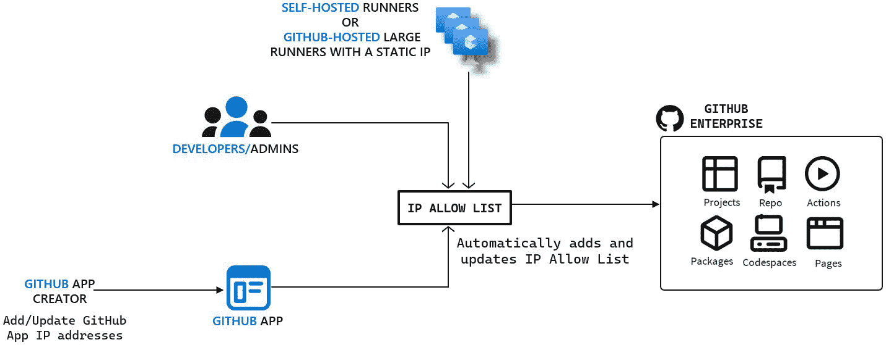
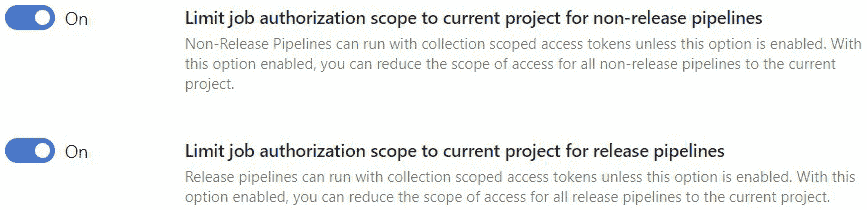

# 第六章：在 DevOps 的构建阶段实施安全措施

构建 **阶段的目标是** 确保代码成功编译并准备就绪。 实施 DevSecOps 的这些阶段应包括在编译之前检查代码中的漏洞，保护构建过程免受可能危及代码完整性的安全漏洞和配置错误，并确保编译后的应用程序不包含可能危害系统或 用户数据的安全漏洞。

通过本章的学习，您将对以下内容有一个坚实的理解：

+   加强我们的构建过程以使其 **更加安全**

+   将 SAST、SCA 和密钥扫描集成到 **构建过程**

让我们 **开始吧！**

# 技术要求

要按照本章的说明进行操作，您需要 **以下内容：**

+   一台带有 **互联网连接的** PC

+   一个活跃的 **Azure 订阅**

+   一个 **Azure DevOps 组织**

+   一个 **GitHub 企业组织**

# 理解 DevOps 的持续构建和测试阶段

在本书的开篇 章节中，我们讨论了 DevOps 的五个核心实践。 我们涵盖的第三个实践是 **持续集成**，或者简称 **CI** 。 CI 是一种开发实践，开发人员通过将代码提交并推送到共享存储库中频繁地集成源代码更改。 然后，每个代码提交都会经历自动化的代码验证过程。 其目标是确保新的代码更改持续验证，以确保其与现有代码库良好集成并不引入 任何错误。

*图 6**.1* 展示了这个示例。 在这种情况下，开发人员将代码更改提交到他们正在开发的功能分支（例如， `聊天机器人` 或 `搜索`），并将更改推送到中央代码库（标记为 **1** 在 *图 6**.1*）。 此推送操作触发了自动构建和测试过程（标记为 **2** 在 *图 6**.1*）。 CI 系统从源代码管理中拉取最新的代码（包括新的更改），编译以确保构建成功，并为测试做准备（标记为 **3** 在 *图 6**.1*）。 如果构建成功，它会运行自动化测试来验证代码质量（标记为 **4** 在 *图 6**.1*）。 如果构建或测试失败，CI 系统会提醒开发人员，提供关于已识别问题的信息，并最好提供如何修复这些问题的指导（标记为 **5** 在 *图 6**.1*）。


图 6.1 – CI 示例场景

如果 CI 过程成功，开发人员可以 创建一个 **拉取请求** (**PR**) 将功能分支中的更改合并到主分支中（标记为 *6* 在 *图 6**.2*）。 主分支代表将部署到生产环境的代码库，通常会受到分支保护策略的保护（标记为 **7** 在 *图 6**.2*）。 这可能包括如最少审阅者数量、自动化构建和测试管道状态，以及需要满足的其他必要条件。 作为 PR 过程的一部分，代码会被其他开发人员或自动化系统审查，以确保其符合团队的标准 和实践。

如果 CI 过程成功完成，开发人员可以提交 PR，将其功能分支的更改合并到主分支（标记为 **10** 在 *图 6**.2*）。 主分支是将要进入生产的代码，通常会使用分支保护规则进行保护，例如要求一定数量的审阅者（标记为 **8** 在 *图 6**.2*）并通过自动化测试（标记为 **9** 在 *图 6**.2*）。 在 PR 过程中，代码将经过另一次构建、额外的自动化检查，并由 其他开发人员进行审查，以确保其符合团队的 质量标准。


图 6.2 – PR 示例场景

当 PR 满足分支保护规则所设定的所有标准，包括成功的自动化测试（标记为 **7** 在 *图 6**.2*）以及定义的审阅者数量批准（标记为 **8** 在 *图 6**.2*），代码更改随后会被合并到主分支（标记为 **9** 在 *图 6**.2*）。

在更改合并后，可以触发另一个流水线，验证新代码是否能够在整个项目的大环境中良好集成，并发布一个可以部署的构件（标记为 **1** 在 *图 6**.3*）。 该过程包括在合并后的代码上运行额外的测试，以确保它与现有的代码库正确协作。 它可能还包括额外的验证步骤，例如将代码部署到暂存环境中，进行端到端测试、冒烟测试或在生产之前的其他检查。 如果这些验证成功，则代码将被打包并准备好部署（标记为 **2** 在 *图 6**.3*）。


图 6.3 – CI 与 PR 场景结合

所描述的场景仅是一个示例，展示了组织如何为功能分支和主分支以及在 DevOps 环境中的各种自动化代码评估设置 CI。 每个组织可能使用不同的方法来 实现这一目标。 实现这一目标。

## 了解构建系统选项

为了自动化构建 和测试，开发和 DevOps 团队 使用构建环境。 该环境用于定义与组织软件构建自动化相关的所有内容——调度器、流水线执行器以及构建 工作者操作的地点。

Microsoft 提供了两项服务： **GitHub Actions** 和 **Azure Pipelines**。GitHub Actions 可在 GitHub 平台内使用，而 Azure Pipelines 是 Azure DevOps 平台的一部分。 这两项服务都与 Azure 云深度集成，并且根据 JetBrains 最近的调查，它们位列前四大 CI 工具（*图 6**.4*）。


图 6.4 – JetBrains 开发者生态系统报告 2022

使用构建 系统，开发人员创建 `.github/workflows` 代码库中的文件夹。 在 Azure Pipelines 中，它们被称为 **流水线** 并且 可以通过网页控制台可视化创建，也可以使用 YAML 代码创建。

无论使用 GitHub Actions 还是 Azure Pipelines，流水线定义通常包含六个核心组件，如下图所示： 以下图所示：


图 6.5 – 流水线定义的六个核心组件

以下是这六个组件的简要 描述：

1.  **触发器**：触发器是启动流水线执行的 条件或事件。 这可以是在某人将代码推送到仓库时（CI 触发器），或者创建了一个拉取请求（PR 触发器），也可以是在预定的时间或其他构建完成时。 在写作时，GitHub Actions 支持 36 种事件，可以启动一个流水线（工作流），而 Azure Pipelines 提供了根据代码存储位置不同而有不同的触发器。 如果代码在 Azure Repos 中，开发人员可以使用触发器，例如代码推送或 PR。 如果代码在第三方仓库中，例如 Bitbucket 或 GitLab，Azure Pipelines 仍然可以与它们一起工作，但可用的触发器可能会 更加有限。

1.  **流水线/工作流**：流水线或工作流是一组自动化步骤，用于处理代码的构建、测试和部署（我们将在下一章讨论测试和部署）。 Azure DevOps 将此称为流水线，而 GitHub Actions 使用工作流一词。 这些过程包括各种阶段、作业和步骤，将代码从原始状态带到构建、测试，最终到部署。 具体结构和组件可能会根据 项目的不同而有所变化。

1.  **阶段**：阶段用于将流水线组织成清晰的、逻辑明确的阶段。 例如，流水线可能会分为三个阶段：构建、测试和部署。 这些阶段代表了将代码从开发到生产的三个关键步骤。 当在 Azure DevOps 中定义多个阶段时，默认情况下它们是按顺序运行的，这意味着下一个阶段仅在上一个阶段完成后才会开始。 这个默认行为是可以修改的。 例如，开发人员可以配置阶段以并行运行或基于特定条件运行。 从技术上讲，GitHub Actions 不支持阶段，但 **作业** 可以用于相同的目的，即将工作流组织成 不同的阶段。

1.  **作业**：一个管道或工作流由作业组成。 每个作业包含按顺序运行的步骤。 有三 个 主要 类型的 **无代理作业**， **代理作业**和 **容器作业**。无代理作业直接在平台上运行，无需特定的 系统或环境设置来运行它们。 它们通常用于较简单的任务，如添加延迟或进行简单的 REST API 调用。 代理作业需要计算机来运行，而容器作业则需要容器来运行。 大多数 涉及构建或测试代码的作业使用代理或容器，而不是无代理作业。 Azure DevOps 支持这三种类型，但 GitHub Actions 仅支持代理和 容器作业。

1.  **步骤**：这些是作业内部的单独任务。 它们可以是 **预定义脚本** (在 Azure *DevOps 中称为* *任务* 或在 GitHub Actions 中称为 *操作* )或 **开发者编写的自定义脚本** 。 Azure DevOps 和 GitHub Actions 都允许通过市场扩展安装额外的任务/操作。 大多数工作流程/管道中的常见第一步是 *checkout*，从 代码库下载源代码。

1.  **代理/运行器**：这是运行自动化任务的计算系统。 它可以是物理系统、虚拟机或容器，用于运行 GitHub 工作流或 Azure DevOps 管道作业。 在 GitHub Actions 中称为 *运行器*。在 Azure DevOps 中称为 *代理*。

现在我们已经 对管道的核心组件有了一些理解，让我们把注意力转向保护 构建阶段。

## 构建阶段中安全措施的理解

CI 系统广泛 访问组织的源代码和在构建过程中使用的服务 凭证。 若发生泄露，可能导致严重的安全漏洞，如恶意代码篡改或凭证盗窃，从而导致未经授权的访问敏感服务，如云基础设施和数据库。 为防范这些威胁，应将重点放在两个 主要领域：

+   **保护 CI 环境和流程**：这包括采取措施保护构建和测试环境免受未经授权的访问、代码注入以及可能危及 系统的其他威胁。

+   **解决常见的编码安全问题**：基于前一章讨论的原则，本节重点在于识别和解决在构建和测试阶段（包括第一方和第三方代码）中常见的安全漏洞。 它涉及将安全代码审查、自动化安全扫描和执行最佳编码实践作为我们持续测试的一部分，以减少潜在的 安全风险。


图 6.6 – DevOps 构建和测试阶段的两大主要安全措施类别

让我们从 处理第一类问题——保护 CI 环境 和流程开始。

# 保护 CI 环境和流程

在 DevOps 工作流中，确保 源代码管理平台的安全性对于维护软件发布的完整性至关重要。 例如，我们需要确保只有受信任和经过验证的贡献者可以对代码进行任何更改，并且第三方插件需要经过严格评估和监控，以发现安全漏洞。 为了实现这一目标，我们强烈建议遵循 *源代码* 部分中概述的指南， **互联网安全中心** (**CIS**) 软件供应链 安全指南。

CIS 软件供应链安全指南

CIS 软件供应链安全指南提供了 一个全面的框架，帮助安全地管理软件供应链。 该指南目前包括 100 多条推荐，分为五大类：源代码、构建流水线、依赖关系、工件和部署。 要访问完整的指南，您可以从此 链接下载： [https://www.cisecurity.org/insights/white-papers/cis-software-supply-chain-security-guide](https://www.cisecurity.org/insights/white-papers/cis-software-supply-chain-security-guide)。

本指南提供了一套 针对*四个关键领域*的推荐 ，旨在保障 DevOps 的构建阶段 的安全性：

+   **保障构建环境的安全**：本节包含六条推荐，重点是单一责任的流水线、不变的基础设施、日志记录、环境创建自动化、访问限制和构建环境的身份验证要求。

+   **保障构建工作者的安全**：本节包含八条推荐，重点是确保构建工作者是一次性使用的，安全地传递环境和命令，分离职责，最小化网络连接，执行运行时安全，扫描漏洞，维护版本控制中的配置，并监控 资源消耗。

+   **保障流水线指令的安全**：本节包含八条推荐，重点是将构建步骤定义为代码，为构建阶段指定输入/输出，保障输出存储的安全，跟踪和审查流水线文件变更，最小化对构建触发器的访问，扫描流水线中的配置错误和漏洞，防止敏感 数据泄露。

+   **保障流水线完整性的安全**：本节包含六条推荐，涵盖了对所有发布工件进行签名、锁定外部依赖、在使用前验证依赖、创建可重现的构建，并为每个构建生成并签署 一份 **软件材料清单** (**SBOM**) 。

为了保持本章简洁，我们不会详细涵盖所有方面。 相反，我们将专注于我们认为是 关键推荐的领域。

注意

Microsoft Defender for Cloud 的 Defender CSPM 计划包括一个 DevOps 安全功能，提供一些针对这些建议的评估子集。 你可以通过此链接获取更多信息： [https://learn.microsoft.com/en-us/azure/defender-for-cloud/recommendations-reference](https://learn.microsoft.com/en-us/azure/defender-for-cloud/recommendations-reference)。在本章稍后的实操练习中，你将使用此功能来评估你的 DevOps 构建 平台的安全态势。

# 保护构建服务和工作者

在本章前面，我们已明确开发人员和 DevOps 团队使用 **构建服务** 例如 GitHub Actions 和 Azure Pipelines 来定义构建软件的自动化流程。 这些流程运行在 被称为 **构建工作者**的系统上。不同的平台对这些工作者有不同的名称。 在 Azure Pipelines 中，它们被称为 *代理*（*agents*），在 GitHub Actions 中，它们被称为 *运行器*（*runners*） 。

作为构建阶段安全努力的一部分，我们需要确保构建服务、自动化流程和构建工作者的安全。 如果攻击者获取了构建服务或工作者的访问权限，他们可能会插入恶意代码或操控构建过程，从而导致 软件受到危害。

## 保护构建工作者

构建工作者主要有两种类型： **平台托管工作者** 和 **自托管工作者**。平台托管工作者是由平台提供商（如微软托管/ GitHub 托管）提供和管理的虚拟机。 自托管工作者是由客户提供和管理的计算资源。 *图 6**.7* 展示了这些工作者选项在 GitHub Actions 和 Azure Pipelines 中的区别。 它们都支持 macOS、Ubuntu 或 Windows 操作系统，但它们在功能上有所不同，例如支持容器中的作业或在 私有网络中运行。


图 6.7 – Azure Pipelines 和 GitHub Actions 的构建工作者选项

平台托管工人的优势在于它们无需开发者进行管理。 平台负责所有维护工作，包括更新操作系统和任何预装的软件。 这意味着开发者不必担心这些方面，但也限制了他们对这些工人上预装的软件和网络连接的控制。 另一方面，自托管工人则为开发者提供了更多的控制权和灵活性。 他们可以预先安装构建和测试软件所需的任何工具，并且这些工人可以连接到内部网络。 然而，这种 灵活性伴随着维护、更新和保护 这些系统的责任。

### 根据信任级别和安全要求使用合适的工人类型

每种类型的 工人适用于不同的场景。 例如，自托管的工人，尤其是那些可以访问公司内部网络的工人，绝不应被用于从不受信任的来源（如公共仓库或包含外部贡献的代码）构建代码。 这可能会被滥用，泄露内部机密或在 环境中横向移动。

自托管工人绝不应被用于从不受信任的来源（如公共仓库或外部贡献）构建代码。

一个最近的例子是 PyTorch 的供应链攻击，由安全研究员 John Stawinski 演示。 该攻击使用了 Gato，这是 Praetorian 开发的 GitHub 利用工具，用于识别 PyTorch 公共仓库中的自托管运行器。 通过利用一个错误配置，允许未批准的 PR 工作流，研究员在自托管运行器上安装了 持久 **命令与控制** (**C2**) ，并破坏了 敏感令牌，修改了 仓库发布。

注意

要了解更多关于 John Stawinski 研究的信息，请参考此 文档： [https://johnstawinski.com/2024/01/11/playing-with-fire-how-we-executed-a-critical-supply-chain-attack-on-pytorch](https://johnstawinski.com/2024/01/11/playing-with-fire-how-we-executed-a-critical-supply-chain-attack-on-pytorch)

你也可以通过以下链接访问 Gato 工具： [https://github.com/praetorian-inc/gato](https://github.com/praetorian-inc/gato)

### 实施一次性构建工人

在可能的情况下，我们 希望确保每个构建作业都使用一个全新的、干净的环境，并在构建完成后丢弃。 这种方法通过隔离每个构建作业来增强安全性，防止残留的工件或先前构建中暴露的秘密在同一工人上造成风险。 *图 6**.8* 展示了一个例子，其中项目 A 的构建作业被攻陷并修改，以在构建工人上放置一个持久的恶意服务。 当项目 B 的构建作业在同一工人上运行时，恶意服务可以窃取项目 B 使用的秘密。


图 6.8 – 使用持久化构建工人的秘密暴露风险

Azure Pipelines 和 GitHub Actions 上的平台托管工人默认已经实现了这一做法。 它们为每个作业分配一个新的虚拟机，并在作业完成后丢弃它。 然而，自托管工人不会自动遵循 这种模式。

与您的开发团队合作，了解常见的构建过程模式是非常重要的，因为可能会出现需要一系列作业在同一构建工人上运行的场景。 避免在没有适当团队讨论和参与的情况下强制执行此做法。 这违背了 DevSecOps 的协作精神。 最好与 团队合作，找到安全需求与 工作流效率之间的平衡。

### 最小化构建工人的网络连接

对于您的最 敏感和关键的工作负载，您可能希望强制它们在网络连接受限且启用了运行时安全措施（如 EDR）的构建工人上运行。 这可以作为额外的防御层，防止横向移动、持久性或后门攻击对被攻陷 的构建工人进行攻击。

过去，限制平台托管工人的网络连接是一个挑战，导致一些组织更倾向于选择自托管工人。 然而，微软最近推出了一项新功能，允许 GitHub 托管的运行器在私有 Azure 虚拟网络中运行。 这结合了 GitHub 管理的 CI/CD 基础设施的好处，并完全控制构建工人的 网络策略。

组织所有者可以在企业或组织级别进行设置。 要在企业级别进行配置，前往 **设置** | **托管计算网络** | **新建网络配置** | **Azure 私有网络** | **添加 Azure 虚拟网络**。有一些先决条件，但已在文档中 列出： https://docs.github.com/en/enterprise-cloud@latest/admin/configuration/configuring-private-networking-for-hosted-compute-products/configuring-private-networking-for-github-hosted-runners-in-your-enterprise.

## 实现对构建环境和工作节点的安全访问

另一个关键的安全 措施是确保安全访问构建和测试资源。 这包括保护网络和用户访问构建服务。 仅实施安全访问是不够的；我们需要采用最强的 身份验证方法。

### 限制网络访问到构建服务环境

一个主要的防护领域 是确保用户/管理员只能从受信任的网络连接到我们的构建环境。 默认情况下，Azure DevOps 和 GitHub Enterprise Cloud 支持来自任何 IP 地址的连接，但我们可以 进行修改。

GitHub Enterprise 通过 IP 允许列表功能支持直接网络访问限制，功能可在 **设置** | **身份验证安全** | **启用 IP 允许列表** (*图 6.9*). 此功能可以在企业或组织级别进行设置。 启用后，GitHub Enterprise 仅接受来自允许列表中 IP 地址的连接，无论用户的 角色、权限或连接方式（Web UI、API 或 Git）。


图 6.9 – 配置 GitHub 的 IP 允许列表

我们还可以选择自动将我们安装的 GitHub 应用使用的 IP 地址加入到 IP 允许列表中。 此功能确保来自安装的 GitHub 应用的连接不会被阻止。 要启用此功能，我们可以选择 **为安装的 GitHub 应用启用 IP 允许列表配置** 设置（*图 6**.9*）。 如果启用了此选项，GitHub 应用创建者指定的 IP 地址将自动添加到我们的允许列表中。 此外，GitHub 应用创建者所做的更新将自动反映在我们的列表中（*图 6**.10*）。 这要求我们在安装 GitHub 应用时采取谨慎的态度，因为被攻破的应用可能会被用来绕过我们的网络限制规则。 只有在你有验证已安装 GitHub 应用的流程时，才应启用此设置。 你的组织应确保有此流程。



图 6.10 – GitHub 应用创建者的 IP 列表更新将自动允许

注意

如果团队使用的是自托管的 runner 或者具有静态 IP 地址的大型 GitHub 托管 runner，我们必须将我们的 runner 的 IP 地址或范围添加到 IP 允许列表中，以便与 GitHub 企业平台建立连接。

Azure DevOps 没有像 GitHub Enterprise 那样直接限制网络访问的选项。 然而，由于它可以与 Entra ID 集成进行登录，我们可以实现 Microsoft Entra **条件访问策略** (**CAPs**) 来进行 IP 限制。 这种方法同样适用于通过 Microsoft Entra ID 认证的 GitHub 企业帐户，其 **企业托管用户** (**EMU**)进行认证。 *图 6**.11* 展示了其工作原理：


图 6.11 – 实现 Entra CAPs 进行 IP 限制

以下是 步骤：

1.  用户尝试使用 EMU 和受支持的 客户端应用程序访问 Azure DevOps 或 GitHub 企业版。

1.  连接请求将被重定向到 Entra ID 进行认证。

1.  Entra ID 验证用户身份，并且如果配置了 **多因素身份验证** （**MFA**），可能会要求进行身份验证。

1.  条件访问检查登录请求是否符合配置的 IP 限制。

1.  如果满足 IP 限制，客户端将获得 Azure DevOps 或 GitHub Enterprise 的访问令牌。 如果不满足，访问尝试 将被阻止。

如果此选项在 Azure DevOps 中实施，我们可以启用 **启用 IP 条件访问策略验证** 设置，位于 **组织设置** | **安全** | **策略** （*图 6**.12*）。 这将把 IP 限制检查从 Entra CAPs 扩展到 Web 交互和非交互式流程。 这包括来自第三方客户端的操作，例如使用 个人访问令牌 **Personal Access Token** （**PAT**）进行 Git 操作。


图 6.12 – 在 Azure DevOps 中启用 IP CAP 验证

现在我们对如何保护网络访问构建环境有了初步了解，接下来让我们 回顾一下 保护用户和 服务访问的可用选项。

### 理解 GitHub 身份验证选项

GitHub Enterprise 提供了多种身份验证机制，供用户和应用程序访问构建环境，具体取决于身份验证场景。 用户在通过 Web 控制台访问 GitHub Actions 时，可以使用用户名和密码进行身份验证，或者使用 PAT 进行 **命令行界面** （**CLI**）访问（*图 6**.13*）。


图 6.13 – GitHub Enterprise 身份验证选项

使用用户名 和密码有三种主要的身份验证 选项：

+   **个人 GitHub 身份**：用户可以使用他们的个人 GitHub 身份进行身份验证。 通过 此选项，用户保持对其身份的控制（因为这是他们的个人账户），并且可以使用相同的身份为其他企业、组织以及 GitHub 以外的仓库做贡献。 该身份适用于组织外的资源。

+   **外部身份提供者（IdP）与 SAML 单点登录（SSO）**：用户可以 通过与其 GitHub 身份相关联的外部 SAML 提供者进行身份验证。 身份验证由外部提供者管理，但访问权限会授予 GitHub 企业版中的组织资源。 此选项可以在企业层级 *或* 组织层级进行配置。

+   **企业管理用户（EMU）**：此选项类似于 SSO 选项，但它为企业用户提供了更多控制权。 使用 EMU，用户将通过由外部 IdP 创建和管理的单一身份访问 GitHub 组织资源，包括构建环境。 用户无需拥有个人 GitHub 身份。

企业的推荐方案 是选择使用 SAML SSO 选项或 EMU 选项。 这两种选项都依赖于外部身份提供者（IdP），并且相较于使用个人 GitHub 身份，提供了更高的安全性。 然而，它们的运作方式仍然存在区别，如 *图 6**.14*所总结。


图 6.14 – 比较 GitHub EMU 与 SAML SSO

例如，实施 EMU 涉及更复杂的设置过程，需要与 GitHub 团队协调，以启用带有 EMU 的企业账户。 相比之下，设置 SAML SSO 更为直接，可以独立完成，无需联系 GitHub 团队。

另一个区别 是，EMU 支持仅限于两个 IdP—Entra ID 和 Okta。 如果要使用不受支持的 IdP，EMU 只能通过联合到两个支持的 IdP 之一来使用。 相比之下，SAML SSO 支持更广泛的 IdP。 Microsoft 官方支持六个 IdP 用于 SAML SSO：Entra ID、 **Active Directory 联合身份验证服务** (**ADFS**)、Okta、OneLogin、PingOne 和 Shibboleth。 SAML SSO 在技术上兼容任何实现 SAML 2.0 协议的 IdP，但如果它们未被 官方列出，支持将受到限制。

另一个关键区别是，EMU 实施需要 SCIM，而 SAML SSO 不需要 SCIM。 **SCIM** 代表 **跨域身份管理系统** 和 EMU 使用它在 GitHub Enterprise 中创建托管用户帐户。

此外，EMU 身份不能用于访问或贡献给外部组织。 他们可以查看公共资源，如存储库、要点或页面，但不能用于对其进行更改。 这是为了防止企业成员意外地向公众泄露企业拥有的内容。 此外，他们创建的内容仅对企业其他成员可见。 SAML SSO 身份没有 这种限制。

最后，EMU 身份受到限制，不能为 GitHub Actions 创建启动工作流程或安装 GitHub 应用程序，而 SAML SSO 身份则没有 这些限制。

### 理解 Azure DevOps 的身份验证选项

与 GitHub 相似，Azure DevOps 根据 用例提供多种身份验证方法（*图 6**.15*）。


图 6.15 – Azure DevOps 的身份验证选项

大多数组织将其 Azure DevOps 组织连接到其 Entra ID 租户，允许用户使用其 Entra ID 凭据登录。

### 保护在 GitHub 和 Azure DevOps 中使用 PATs

PAT 是用户生成的、长期有效的令牌，用于在 GitHub Enterprise 或 Azure DevOps 环境中进行身份验证。 通常用于使用命令行工具进行身份验证或在使用基本身份验证进行 API 调用时。 这些令牌与生成它们的用户帐户直接相关联，并且如果用户的访问权限被撤销，令牌将失效。

GitHub 支持两种类型的 PAT： **精细粒度** 和 **经典**。精细粒度 PAT 比经典 PAT 提供了更细粒度的访问控制。 例如，精细粒度 PAT 可以用于指定按仓库级别的访问（*图 6**.16*）。 它还允许对账户级别和 仓库级别的资源进行更精细的权限设置。


图 6.16 – 精细粒度 PAT 支持按仓库级别的访问

Azure DevOps 还支持两种类型的 PAT：全局级和组织级（*图 6**.17*）。 **全局级 PAT** 可以 用于授予用户有权限的所有组织中的资源的广泛访问权限。 **组织级 PAT** 限制 对单个组织内资源的访问。


图 6.17 – Azure DevOps 中的组织级和全局级 PATs

GitHub Enterprise 和 Azure DevOps 都支持可以用来管理 PAT 使用的策略， 在我们的 环境中。 *图 6**.18* 概述了这两个平台中令牌类型和策略支持的区别。


图 6.18 – 比较 Azure DevOps 和 GitHub PATs

例如，Azure DevOps 支持以下策略，用于控制 PAT 的使用。 这些策略可从 **组织设置** | **常规** | **Microsoft Entra** | **策略** (*图 6**.19*)配置：

+   **限制全局个人访问令牌创建**：启用此策略后，将阻止所有用户创建全局范围的 PAT，仅允许组织范围的 PAT。

+   **限制完全范围的个人访问令牌创建**：启用此策略后， 将阻止 所有用户创建完全访问令牌。 只有限定于特定范围的 PAT 才允许创建。

+   **强制执行最大个人访问令牌生存期限**：我们可以使用此策略为新的 PAT 设置最大允许的生存期限。 我们可以指定从 1 到 365 天的任何值。

+   **自动撤销泄露的个人访问令牌**：此策略默认启用，并建议保持启用状态。 它会自动撤销在公共 GitHub 仓库中检测到的 PAT。 还会通知令牌所有者并在组织的审计日志中记录事件。 建议保持此策略启用，或者至少实施类似的流程。


图 6.19 – Azure DevOps 中的 PAT 治理策略

GitHub 企业版 还支持以下 用于控制 PAT 使用的 策略。 这些策略可以在组织级别从 **组织** | **设置** | **第三方访问** | **个人访问令牌** 或在企业级别从 **企业** | **策略** | **个人访问令牌** (*图 6**.20*)配置：

+   **限制通过细粒度个人访问令牌访问**：此策略可用于启用或限制 细粒度 PAT 的创建

+   **要求批准细粒度个人访问令牌**：此策略可用于要求管理员审核和批准创建的 PAT 。

+   **通过个人访问令牌（经典）限制访问**：此策略可用于允许或限制创建 经典 PAT


图 6.20 – GitHub 企业云中的 PAT 治理策略

现在你 理解了如何在 DevOps 环境中 安全地 管理 PAT，让我们回顾一下最近的攻击中被利用的另一种令牌： 管道令牌。

### 保护 GitHub 和 Azure DevOps 中管道令牌的使用

在某些场景中，我们需要在自动化管道中访问 GitHub 企业或 Azure DevOps 资源，例如，在需要通过调用其 API 来更改平台时。 GitHub 企业和 Azure DevOps 都为这种场景提供了专门的访问令牌供工作流/管道使用。 在 GitHub 企业中，该令牌被称为一个名为 `GITHUB_TOKEN`的密钥。在 Azure DevOps 中，它被称为一个名为 `System.AccessToken`的特殊变量。

作为良好的安全实践，这些令牌应授予确保影响的最低访问权限 的 **中毒管道执行** (**PPE**) 攻击，该攻击会妥协令牌 的影响被限制。

在 GitHub 中，令牌的默认权限可以配置为 *宽松* 或 *严格*，可以在企业、组织或仓库级别进行设置。 宽松选项（标记为 *1* 在 *图 6**.21*）授予对仓库中所有范围的读写访问权限，而严格选项（标记为 *2* 在 *图 6**.21*）限制对内容和包范围的只读访问。 选择宽松选项会增加在 PPE 攻击中攻击者提升权限或横向移动的风险。 这种类型的攻击将在 本章后续讨论。


图 6.21 – 配置 GitHub 工作流令牌的默认权限

此配置可以在 企业、组织或 仓库级别进行设置：

+   **企业**: **企业** | **设置** | **策略** | **操作** | **策略** | **工作流权限**

+   **组织**: **组织** | **设置** | **代码、规划与自动化** | **操作** | **常规** | **工作流权限**

+   **仓库**: **仓库** | **设置** | **代码与自动化** | **操作** | **常规** | **工作流权限**

无论是在企业、组织还是仓库级别设置的默认权限如何，任何具有写权限的用户都可以在工作流级别修改权限。 例如，如果 `GITHUB_TOKEN` 的默认权限较为严格，工作流拥有者可能希望提高权限，以允许某些操作和命令在工作流中成功运行。 相反，如果默认权限较宽松，工作流拥有者可以通过编辑工作流文件来降低 `GITHUB_TOKEN` 的权限。 在工作流文件中设置权限的示例如下所示： *图 6**.22*。


图 6.22 – 在工作流文件中配置 GitHub 工作流令牌的权限

对于 Azure DevOps，我们可以通过作业授权范围策略来管理令牌（`System.AccessToken`）的访问权限（*图 6**.23*）。 这些 策略可以在 组织或项目级别进行配置。 对于组织级别，导航到 **组织设置** | **管道** | **设置**。对于项目级别，转到 **项目设置** | **管道** | **设置**。请注意，组织级别的设置不能在 项目级别被覆盖。



图 6.23 – 在 Azure DevOps 中配置作业授权范围策略

可用的设置包括 以下内容：

+   **将作业授权范围限制为当前项目（仅适用于非发布管道）**：我们可以启用此设置，限制令牌的访问权限仅限于运行管道的项目。 此设置仅适用于 YAML 和经典构建管道。 如果禁用此设置，访问令牌将具有组织范围的访问权限，并授予访问组织中不同项目的资源的权限。 这会增加在成功发生 PPE 攻击时的潜在影响。

+   **将作业授权范围限制为当前项目（仅适用于发布管道）**：我们可以启用此设置，限制令牌的访问权限仅限于运行管道的项目。 此设置仅适用于经典 发布管道。

如果在组织级别和项目级别都禁用这些设置，那么每个管道作业将可以访问组织范围的访问令牌。 这意味着，如果攻击者破坏了任何项目中的任何管道，他们可能会利用令牌来访问我们组织中的所有代码库！ 这就是为什么建议启用这些设置以限制 访问范围 并 确保成功的攻击仅限于一个 单一项目。

## 保护构建环境免受恶意代码执行

确保管道 配置是确保构建环境安全的重要方面。 管道定义了代码在部署到生产环境之前的处理流程。 如果管道被攻破，攻击者可能会修改配置文件，绕过安全检查或执行 恶意代码。

主要挑战在于在安全性与促进创新和协作之间取得平衡。 正如我们之前讨论的，DevOps 文化强调团队合作与协作。 因此，开发团队通常将管道配置文件与源代码存储在同一个代码仓库中。 这种做法允许并鼓励团队成员将他们的测试贡献到构建过程中，类似于代码贡献。 虽然这种做法有助于协作，但也伴随着一定的风险。 例如，如果开发人员的凭证被攻击者泄露，攻击者可能利用这些凭证修改配置文件，从而绕过安全检查或执行窃取 敏感凭证的恶意代码。

为了解决这一挑战，需要采取平衡的方式。 开发人员可以被授权修改功能分支的 CI 管道配置。 然而，必须严格控制访问权限，以修改与主分支相关联的管道配置文件。 这种方式在不破坏主分支完整性的前提下，为开发团队提供了灵活性。 主分支。

未能保障主管道配置文件完整性的组织面临 PPE 攻击的风险。 在这种攻击中，攻击者获得访问权限修改管道配置，并利用此访问权限执行恶意代码（从而 *污染* CI 管道）。 这种攻击的典型目标是访问并窃取敏感凭证。 PPE 攻击有两种类型： 攻击： **直接** (也称为 **D-PPE**) 和 **间接** (也称为 I-PPE**)。

### 理解直接和间接 PPE

在直接 PPE 场景中，攻击者 获得 权限访问存储管道配置的源代码仓库。 这可以通过被攻破的凭证，例如开发者的凭证、访问令牌、SSH 密钥或 OAuth 令牌。 一旦进入，攻击者修改管道配置以执行恶意命令。 *图 6**.24* 展示了一个示例，其中恶意命令已被注入到管道配置中，用于提取带有敏感凭证的环境变量（`AZURE_STORAGE_CONNECTION_STRING`）并使用 `curl`发送到外部服务器 ：


图 6.24 – 示例直接 PPE

为了实现直接 PPE，攻击者需要获得修改管道配置文件的访问权限。 在无法获得此访问权限的情况下，可能是因为管道配置文件位于一个独立或受保护的仓库中，或者它是通过经典构建管道方法（如 Azure Pipelines）定义的，而不是 YAML。 在这些情况下，攻击者仍然可以通过向管道配置文件使用的文件、代码或脚本中注入恶意代码来污染管道。

处理未经审查代码的管道面临更大的 PPE 攻击风险。 这包括由任何仓库分支或未经审查/验证的 PR 激活的管道。 使用 SAST 工具检查管道配置中的有害元素是一个好的且推荐的做法。 这些工具应经常用于扫描 仓库 其中 存储管道配置的 位置。

### 为市场扩展设置审批流程

GitHub 和 Azure DevOps 都提供了市场，供开发者集成额外工具，以增强和定制 CI/CD 流程。 GitHub 的市场（[https://github.com/marketplace](https://github.com/marketplace)）允许开发者安装 *动作* 和 *应用*，而 Azure DevOps 市场（[https://marketplace.visualstudio.com/azuredevops](https://marketplace.visualstudio.com/azuredevops)）提供 *扩展*。

截至本文写作时，GitHub Marketplace 上已托管超过 21,000 个操作和超过 850 个应用，而 Azure DevOps Marketplace 上列出了超过 2,200 个扩展。 这些数字 还在不断增加。

虽然这些可用的附加工具（操作、应用和扩展）对于自定义和改善 CI/CD 体验非常有帮助，但也存在安装易受攻击或恶意工具的风险。 安全研究人员 Rob Bos 和 Jesse Houwing 近期进行的分析揭示了这些风险。 他们的研究表明，Azure DevOps Marketplace 中 35%的任务和 GitHub Marketplace 中 30%的操作存在安全问题，主要是由于直接漏洞或 易受攻击的依赖关系。

鉴于这些发现，建议实施审批流程，以确保来自公共市场的任何工具（操作、应用或扩展）在安装之前都经过彻底的安全风险评估。 采取这种预防措施有助于减轻将潜在有害或被妥协工具集成到 CI/CD 流水线中的威胁。 在本节中，我们将介绍 GitHub Enterprise 中的操作和 Azure DevOps 中的扩展。 稍后我们将讨论 GitHub 应用程序 在本章中。

注意

查看 Rob Bos 和 Jesse Houwing 的完整报告，链接如下：

+   [https://devopsjournal.io/blog/2022/09/18/Analysing-the-GitHub-marketplace](https://devopsjournal.io/blog/2022/09/18/Analysing-the-GitHub-marketplace)

+   [https://jessehouwing.net/security-state-of-the-azure-devops-marketplace/](https://jessehouwing.net/security-state-of-the-azure-devops-marketplace/)

GitHub Enterprise 有可用于控制可在工作流中使用的操作的策略。 这些设置可以在企业、组织或 仓库级别进行配置：

+   **企业级别配置**: **企业** | **设置** | **策略** | **操作** | **策略**

+   **组织级别配置**: **组织** | **设置** | **代码、规划与自动化** | **操作** | **常规** | **策略**

+   **仓库级配置**： **仓库** | **操作** | **通用** | **操作**

名为 **允许企业及部分非企业操作和可重用工作流** 的策略提供了多个选项，用于控制开发者在工作流中可以使用的操作（*图 6**.25*）：


图 6.25 – 定义可以在工作流中使用的操作

+   **允许 GitHub 创建的操作**：此设置允许使用由 GitHub 开发的所有操作。 这些操作可以在 actions（[https://github.com/actions](https://github.com/actions)）和 GitHub（[https://github.com/github](https://github.com/github)）组织中找到。

+   **允许由市场验证的创建者提供的操作**：此设置仅允许使用来自 GitHub 市场的操作，前提是这些创建者已通过验证。 这一点可以通过 *验证的创建者* 徽章表示（*图 6**.26*）。 需要注意的是，使用来自验证创建者的操作仍然存在风险。 该徽章表明操作的创建者已经通过 GitHub 确认了其身份，通常是通过域验证过程。 但这并不意味着该操作已经通过任何 安全检查。


图 6.26 – GitHub Actions 验证的创建者

+   **允许指定的操作和可重用工作流**：此设置可用于将工作流限制为仅使用来自指定、批准的组织和仓库中的操作。 已批准的操作通过以下语法指定：

    ```
     OWNER-OR-ORGANIZATION/ACTION-REPOSITORY@TAG-OR-SHA
    ```

    语法中支持通配符，这为许多用例提供了可能性。 例如，指定通配符，如 `azure/webapps-deploy@*` 允许使用 任何 版本的 `webapps-deploy` 操作，前提是该操作来自 `azure` 组织。

    为了仅允许特定版本的操作，我们可以指定 `TAG-OR-SHA`。例如， `azure/webapps-deploy@v3.0.1` 将仅允许使用版本 `3.0.1`。但是，指定标签仍然存在相关风险。 如果创建者的仓库遭到破坏，攻击者可以轻松修改标签，指向恶意代码。 为了降低这一风险，可以使用提交 SHA，例如 `azure/webapps-deploy@b45824004798750b8e136effc585c3cd6082bd6432`。这定义了特定的提交，并确保 更严格的完整性。

    我们还可以对整个组织应用通配符。 通过指定 `azure/*`，Azure 组织中的任何操作都将被允许。 这为实施一种 *内部市场*提供了选项。实施这一过程的步骤包括 以下内容：

    1.  建立一个组织来托管批准的操作，例如， `MY-ORG`。

    1.  通过将整个组织的操作添加到批准列表中，批准它们，例如， `MY-ORG/*`。

    1.  执行对请求的 GitHub Actions 的安全审查。

    1.  将批准的操作叉到该组织中，使其对开发人员可用。

注意

最大可指定的操作定义数量为 `1000`。

对于 Azure DevOps，默认情况下，组织所有者和项目集合管理员可以从市场安装扩展。 要允许其他用户安装扩展 而 无需将其添加到这些特权角色中，可以将其指定为扩展管理者。 此分配通过前往 **组织设置** | **常规** | **扩展** | **安全** (右上角) | **添加**，然后将用户或组添加为管理员（*图 6**.27*）。


图 6.27 – 在 Azure DevOps 中添加扩展管理者

没有扩展安装权限的用户可以提交扩展请求（*图 6**.28*）。 项目集合管理员随后通过电子邮件收到这些请求的通知。 在批准后，Azure DevOps 会自动安装请求的扩展。 要提交请求，用户必须在 他们的组织内拥有贡献者角色。


图 6.28 – 在 Azure DevOps 中请求将扩展添加到组织的用户体验

现在我们 已经了解了如何保护我们的构建服务和工作节点，接下来让我们回顾一下如何将安全评估集成到 构建过程中。

# 解决常见的编码安全问题

将 安全性集成到 CI 和构建阶段有助于发现以前源代码分析可能遗漏的漏洞。 这对于捕捉那些绕过提交前或源控制检查的风险非常有帮助，无论是由于上下文不足，还是因为开发人员可能跳过了这些检查。 这一点尤其重要，因为有些问题只有在代码被编译、链接或在 特定环境中运行时才会显现。

软件的动态特性意味着在构建和集成过程中，代码会与各种依赖项、库和运行时环境交互，从而可能引入通过仅评估源代码无法发现的漏洞。 在构建过程中添加的第三方组件可能带来其自身的安全风险。 一些安全问题，例如缓冲区溢出或编译语言中的内存管理问题，可能只在编译和链接时显现。 此外，构建过程通常涉及配置文件和环境设置，这可能导致因配置错误而产生安全问题。 这些问题可能源自错误配置。

在构建阶段集成安全性解决了许多在早期开发阶段已涉及的问题，但在更全面的背景下进行处理。 这包括对第一方和第三方代码进行漏洞扫描，检测潜在的秘密泄露，并评估许可证合规性。 这些检查与早期执行的检查类似，但由于所有组件的完全集成，它们在构建阶段可以更为全面。 所有组件的完整集成使得这些检查更加彻底。

构建阶段还引入了额外的安全措施机会。 可以执行恶意软件评估，以确保在开发过程中或通过第三方依赖项未意外引入恶意代码。 运行时环境检查 也可以在此阶段进行，允许团队识别只有在其 预期环境中执行软件时才可能出现的潜在安全问题。

## 实施 Microsoft Security DevOps 扩展

将安全检查集成到构建过程中时，工具通常作为命令行实用程序或市场扩展提供。 市场扩展简化了整个组织范围内工具的采用，但在 DevOps 平台之间的兼容性可能有限。 命令行工具提供更大的灵活性，但通常需要在构建工作器上安装，可以在工作流程中或作为自托管 工作器镜像的一部分安装。

对于 Azure DevOps，微软提供了一个名为 **Microsoft Security DevOps**的扩展，将多个静态分析工具集成到构建和部署管道中，用于安全评估。 *图 6**.29* 展示了该扩展中捆绑的工具列表。 Microsoft Security DevOps 扩展中的某些工具具有商业版本，其功能显著优于包含的开源选项。 例如，Trivy 有一个商业版本，在此比较中详细说明： [https://github.com/aquasecurity/resources/blob/main/trivy-aqua.md](https://github.com/aquasecurity/resources/blob/main/trivy-aqua.md)。Palo Alto Networks 的 Checkov 在 Prisma Cloud 内的商业版本与开源版本相比，也具有更多功能。


图 6.29 – Microsoft DevOps 扩展工具

要实现 Microsoft Security DevOps 扩展，首先在 Azure DevOps 组织中安装它。 然后，通过添加执行所需安全检查的任务将该扩展集成到流水线中。 配置任务参数以指定要运行的工具和任何自定义设置。 最后，将任务结果集成到构建过程中，可能通过设置质量门或基于 安全发现生成报告。

这种方法允许在 Azure DevOps 管道中进行全面的安全扫描，使用一套精选的开源 分析工具。

## 将 GitHub 高级安全代码扫描功能集成到管道中

另一个 可以作为构建阶段安全评估一部分实施的 解决方案是 **GitHub 高级安全** （**GHAS**）代码扫描，用于检测第一方代码漏洞。 在 GitHub 工作流中实施 GHAS 代码扫描或 **GitHub 高级安全用于 Azure DevOps** （**GHAzDO**）代码扫描，步骤相似。 对于这两个平台，我们可以按照以下顺序实施 CodeQL 操作/任务：

1.  `github/codeql-action/init` 操作。 对于 Azure DevOps，相应的管道任务是 `AdvancedSecurity-Codeql-Autobuild`。此步骤涉及指定我们希望 CodeQL 分析的编程语言和用于分析的规则集（称为 CodeQL 查询套件）。 可用于分析的语言选项包括 C#、C++、Go、Java、JavaScript、Python、Ruby 和 Swift（注意：Swift 支持在本文撰写时处于 beta 阶段）。 对于 CodeQL 查询套件（规则集），我们可以选择以下选项：

    +   `code-scanning`：这是 CodeQL 代码扫描使用的默认规则集。 此规则集中的查询比其他规则集具有更好的准确性和更少的误报。 它旨在检测严重的安全问题，并尽量减少 不正确的警报。

    +   `security-extended`：此规则集包括来自默认套件的所有查询，以及额外的查询，这些查询的准确性稍差，严重性也较低。 这个规则集可能会检测到更多的安全问题，但也可能导致误报或低严重性检测的增加。 例如，它可能会标记出那些具有轻微安全风险或不太可能构成 重大威胁的代码模式。

    +   `security-and-quality`：此规则集包括来自 security-extended 套件的所有查询，并添加了检测代码质量问题的查询。 该规则集不仅评估安全性，还评估如死代码、重复代码或其他可能使软件更难维护和演化 的编码模式。

    +   `security-experimental`：该规则集包括正在开发中的查询或由社区提供但尚未成为之前描述的主要查询套件一部分的查询。 此规则集中的查询可能不稳定，并可能发生变化或产生不可预测的结果。 不建议将此查询套件用于生产用例（可以在测试/开发中使用）。

    *图 6**.30* 展示了 GitHub 工作流中的这一步骤（标记为 *1*）以及 Azure DevOps 流水线（标记为 2*）。


图 6.30 – CodeQL 初始化示例

1.  `github/codeql-action/autobuild` 动作。 对于 Azure DevOps，相应的流水线任务是 `AdvancedSecurity-Codeql-Autobuild`。此步骤以某种方式编译或解释代码，为详细分析做好准备。 它确保 CodeQL 工具能够分析代码库的构建产物。 自动构建过程会根据代码库的编程语言有所不同，针对 C#、C++、Go、Java、JavaScript、Python、Ruby 和 Swift 等语言有特定的构建程序。 此步骤是自动化的，但如果默认的构建过程不适合 项目的需求，可以进行自定义。

1.  `github/codeql-action/analyze` 动作。 对于 Azure DevOps，相应的任务是 `AdvancedSecurity-Codeql-Analysis` 流水线任务。 此步骤对代码进行深入分析，以识别潜在的安全漏洞或代码质量问题，分析基于在初始化步骤中选择的规则集（查询套件）。 分析利用在构建过程中生成的 CodeQL 数据库，通过查询代码库，寻找与已知漏洞或不良编码实践匹配的模式。 分析结果将被汇总成报告，突出显示检测到的任何安全问题或代码质量问题。 这使得开发人员能够在 代码 部署之前解决这些问题，从而提高 软件的安全性和质量。

## 将 GHAS 依赖性扫描功能集成到流水线中

GHAzDO 提供了 可以集成到管道中的依赖项扫描功能。 在 YAML 管道中，我们可以使用 `AdvancedSecurity-Dependency-Scanning` 任务，如 *图 6**.31*所示。


图 6.31 – 在 Azure DevOps 管道中实现 GHAzDO 依赖项扫描

让我们看看实际操作 如何进行。 我们 现在将 在 Azure DevOps 上执行这些安全扫描。

# 实操练习 – 在构建阶段集成安全性

在本次练习中，我们 将在管道的构建阶段集成安全性。 我们将实际集成 SAST、 **软件组成分析（SCA）** 和秘密扫描，使用一些工具，例如 **GitHub 高级安全（GHAS）**。我们 还将启用 Microsoft Defender for Cloud 中的 DevOps 安全性。

以下是实操练习：

+   **练习 1 –** 将 SAST、SCA 和秘密扫描集成到 构建流程中

+   **练习 2 –** 将你的 DevOps 平台接入 Microsoft Defender for Cloud 中的 DevOps 安全性

## 先决条件

在深入安全任务之前，首先创建一个测试环境和应用程序运行所需的服务连接。

### 任务 1 – 创建测试环境

1.  导航至 你的 DevOps 实例（[https://dev.azure.com](https://dev.azure.com)），并选择你在 上一章中使用的组织。

1.  选择我们在 **eShopOnWeb** 私有项目中使用的项目， 该项目在上一章中介绍过。

1.  导航至 **管道** ，然后 选择 **环境**。


图 6.32 – 创建新环境

1.  选择 **创建环境**。


图 6.33 – 创建环境

1.  添加新环境的名称和 描述，然后点击 **创建** 按钮。


图 6.34 – 创建测试环境

1.  让我们通过导航到右上角的菜单（**⋮**）并 选择然后 **安全性**。


图 6.35 – 设置测试环境的安全性

1.  导航到 **管道权限** 部分。 点击 **:** 按钮，然后 **打开访问权限**。这 将允许项目中的所有管道使用 该资源。


图 6.36 – 设置管道权限

现在让我们创建 服务连接。

### 任务 2 – 创建 Azure 资源管理器服务连接和 Docker 注册表服务连接。

1.  导航到 **项目设置** 然后 **服务连接**。


图 6.37 – 设置服务连接

1.  **选择**创建服务连接 **并从**选项中选择 **Azure 资源管理器** ，然后 点击 **下一步**。


图 6.38 – Azure 资源管理器服务连接

1.  接下来，我们选择 认证类型为 **服务主体（自动）** 然后 选择 **下一步**。


图 6.39 – 设置认证类型

1.  接下来，选择订阅并为其命名为服务连接名称 `eShopOnWeb`，然后 选择 **保存**。


图 6.40 – 设置订阅和服务连接名称

确保正确命名 服务连接，因为这是在 YAML 管道中设置的名称。

1.  打开 **eShopOnWeb** 服务连接，选择右上角的菜单图标（**⋮**），然后点击 **安全性**。


图 6.41 – eShopOnWeb 服务连接安全设置

1.  在 **管道权限**下，点击 ⋮ 按钮，然后选择 **开放访问** 选项。 这将允许项目中的所有管道使用 此资源。


图 6.42 – eShopOnWeb 服务连接管道权限

1.  要设置正确的权限，首先复制服务主体的显示名称，显示名称可以通过点击 **管理服务主体** 找到，如 *图 6**.41*所示。

1.  然后前往 Azure 门户，打开 Azure Bash CLI 并运行以下命令：

    ```
     subscriptionId=$(az account show --query id --output tsv)
    echo $subscriptionId
    spId=$(az ad sp list --display-name <your service principal display name> --query "[].id" --output tsv)
    echo $spId
    roleName=$(az role definition list --name "User Access Administrator" --query "[0].name" --output tsv)
    echo $roleName
    ```

1.  接下来输入以下命令：

    ```
     az role assignment create --assignee $spId --role $roleName --scope /subscriptions/$subscriptionId/resourceGroups/DevSecOps-Book-RG
    ```

现在，让我们设置管道 ，进行安全扫描并部署 Azure 资源。

## 练习 1 – 将 SAST、SCA 和秘密扫描集成到构建过程中

此任务的目的是将 GHAS 集成到 Azure DevOps 中并执行 **静态应用程序安全测试** (**SAST**)，使用 GHAS 的代码扫描、使用依赖扫描进行的软件组成分析，以及使用秘密扫描进行的秘密识别。 秘密扫描有两个组件：推送保护（我们在上一章中已经讲解）和 仓库扫描。

在上一章中，我们通过导航到 **项目设置** | **仓库** | **高级安全性**，启用了高级安全性。在本章中，我们将在管道中配置代码扫描和依赖扫描。

首先，我们需要确保设置了正确的 **高级安全** 权限。 *图 6**.43* 显示了需要启用的权限。 导航至 **安全** 然后 **项目管理员** 并 设置 **高级安全** 权限 为 **允许**。


图 6.43 – 设置高级安全权限

我们将首先设置依赖扫描，然后是代码扫描。 这两项扫描将在您的管道中设置，不同于机密扫描，它是通过门户设置进行配置的（**项目设置** | **代码库** | **仓库** | **eShopOnWeb** | **设置** | **高级安全（阻止机密** **推送时）**）。

让我们创建一个管道，在其中配置依赖扫描和 代码扫描：

1.  导航至 **管道** | **管道** | **创建管道**。


图 6.44 – 创建管道

1.  选择您的代码位置， `azure-pipelines.yml`。我们将在这个管道中配置所有的依赖扫描和代码扫描任务。 这些 任务已被添加到 `azure-pipelines.yml` 文件中。

    任务如下： 如下一项：

    +   `ms.advancedsecurity-tasks.codeql.init.AdvancedSecurity-Codeql-Init@1`：此任务用于初始化 CodeQL 以进行代码扫描。 您可以在这里了解更多关于此任务的信息： [https://learn.microsoft.com/en-us/azure/devops/pipelines/tasks/reference/advanced-security-codeql-init-v1](https://learn.microsoft.com/en-us/azure/devops/pipelines/tasks/reference/advanced-security-codeql-init-v1)。

    +   `ms.advancedsecurity-tasks.dependency-scanning.AdvancedSecurity-Dependency-Scanning@1`：此任务执行依赖扫描，以识别第三方组件中的任何漏洞。 访问 [https://learn.microsoft.com/azure/devops/pipelines/tasks/reference/advanced-security-dependency-scanning-v1?view=azure-pipelines](https://learn.microsoft.com/azure/devops/pipelines/tasks/reference/advanced-security-dependency-scanning-v1?view=azure-pipelines) 了解更多关于 此任务的信息。

    +   ms.advancedsecurity-tasks.codeql.analyze.AdvancedSecurity-Codeql-Analyze@1：此任务执行 CodeQL 分析。 要了解更多关于此任务的信息，请查看 此处 [https://learn.microsoft.com/azure/devops/pipelines/tasks/reference/advanced-security-codeql-analyze-v1](https://learn.microsoft.com/azure/devops/pipelines/tasks/reference/advanced-security-codeql-analyze-v1)。

    +   `ms.advancedsecurity-tasks.codeql.enhance.AdvancedSecurity-Publish@1`：此任务用于发布依赖扫描和代码扫描的结果。 有关此任务的更多详细信息，请访问 此链接 [https://learn.microsoft.com/en-us/azure/devops/pipelines/tasks/reference/advanced-security-publish-v1?view=azure-pipelines](https://learn.microsoft.com/en-us/azure/devops/pipelines/tasks/reference/advanced-security-publish-v1?view=azure-pipelines)。

1.  在添加正确的服务连接名称、Azure 订阅 ID、Azure 资源组名称和位置后，继续运行管道，信息应位于 `azure-pipelines.yml`文件中的 `variables` 部分。

    构建阶段大约需要 10 分钟完成。 点击各个任务查看 详细信息。 我们可以看到，依赖扫描和 CodeQL 任务 已经成功。


图 6.45 – 构建阶段成功

我们可以在**Repos** | **高级安全性**下查看依赖扫描和代码扫描的结果。


图 6.46 – 高级安全性

现在，**高级安全** 仪表盘显示了在依赖扫描 和代码扫描任务中发现的漏洞。 浏览 **依赖**、 **代码扫描**和 **机密** 标签。


图 6.47 – 高级安全仪表盘

我们现在已成功 完成了 Azure DevOps 上的 SAST、SCA 和机密扫描。

## 练习 2 – 将你的 DevOps 平台引入 Microsoft Defender for Cloud 中的 DevOps 安全

在本练习中，我们将把我们的 GitHub 企业组织和 Azure DevOps 组织连接到 Microsoft Defender for Cloud。 Microsoft Defender for Cloud – Defender CSPM 计划具有一个 **DevOps** **安全** 功能。


图 6.48 – 练习环境

要完成这些练习，你需要访问 Azure 订阅，如果你还没有现有订阅，我将指导你如何注册一个。 如果你有可以使用的现有订阅，可以跳过 *任务* *1* 部分。

+   **任务 1** – 启用 Microsoft Defender for Cloud 免费试用 试用

+   **任务 2** – 将你的 GitHub 企业组织连接到 Microsoft Defender for Cloud

+   **任务 3** – 将你的 Azure DevOps 组织连接到 Microsoft Defender for Cloud

### 任务 1 – 启用 Microsoft Defender for Cloud 免费试用

要设置免费试用订阅，请按照以下步骤操作：

1.  打开浏览器窗口并访问 到 [https://portal.azure.com/](https://portal.azure.com/)。

1.  使用你的凭证登录。

1.  在顶部的搜索菜单中，搜索 `Microsoft Defender for Cloud` (**1**)，然后选择 **Microsoft Defender for Cloud** 服务（**2**）。


图 6.49 – 搜索 Microsoft Defender for Cloud

现在，让我们将 GitHub 环境添加到 Microsoft Defender for Cloud。

### 任务 2 – 将你的 GitHub 企业组织连接到 Microsoft Defender for Cloud

1.  在 **Microsoft Defender for Cloud** 窗口中，选择 **环境设置** (在 **管理** 部分).

1.  在 **Microsoft Defender for Cloud | 环境设置** 窗口中，选择 **+添加环境**，然后 选择 **GitHub**。


图 6.50 – 添加新的 GitHub 环境

1.  在 `GH-Ent-Connector`

1.  **订阅**: 选择你的 Azure 订阅

1.  **资源组**: **创建新** | **DevSecOpsRG** | **确定**

1.  **位置**: 选择以下区域之一 – **东美国**, **中美国**, **西欧洲**, **英国南部**, **澳大利亚东部**, **东亚**

1.  点击 上 **下一步：配置** **访问 >**


图 6.51 – GitHub 连接配置

1.  在 **配置访问** 窗口中，在 **授权 DevOps 安全**下，点击 **授权** 以授予你的 Azure 订阅访问你的 GitHub 仓库的权限。 将会打开一个新窗口（如果你的浏览器设置为 阻止弹出窗口，你可能需要允许弹出窗口）。

1.  如果需要，使用具有对你希望保护的仓库访问权限的帐户登录 GitHub。 点击 **授权 Microsoft** **Security DevOps**。


图 6.52 – 授权 Microsoft Security DevOps

1.  仍在 **配置访问** 窗口中，在 **安装 DevOps 安全应用**下，点击 **安装** 以安装 GitHub 应用程序。 将弹出一个新窗口（如果您的浏览器设置为 阻止弹出窗口，您可能需要允许弹出窗口）。


图 6.53 – 安装 DevOps 安全应用

1.  在 **安装 Microsoft 安全 DevOps** 窗口中，选择您要加入的 GitHub 组织 。


图 6.54 – 选择要加入的 GitHub 组织

1.  选择 **所有仓库**，审核将授予的权限，然后点击 **安装**。如果提示完成 MFA 请求，请输入您的 **认证码**，然后 点击 **验证**。


图 6.55 – 选择所有仓库

1.  返回到 **GitHub 连接** 窗口，点击 **下一步：审核并** **生成 >**。


图 6.56 – 点击“审核并生成”

1.  在 **审核并生成** 窗格中，点击 “创建” 。

### 任务 3 – 将您的 Azure DevOps 组织连接到 Microsoft Defender for Cloud

按照以下步骤操作：

1.  打开浏览器窗口并访问 至 [https://portal.azure.com/](https://portal.azure.com/)。

1.  在 **Microsoft Defender for Cloud** 窗口中，选择 **环境设置** （在 **管理** 部分）。

1.  在 **Microsoft Defender for Cloud | 环境设置** 窗口中，选择 **+添加环境**，然后选择 **Azure DevOps**。


图 6.57 – 添加 Azure DevOps 环境

1.  在 `AzDevOps-Connector`

1.  **订阅**：选择你的 Azure 订阅

1.  **资源** **组**： **DevSecOpsRG**

1.  **位置**：选择以下区域之一 – **东部美国**， **中部美国**， **西欧**， **英国南部**， **澳大利亚东部**， **东亚**

1.  点击 **下一步：配置** **访问 >**


图 6.58 – Azure DevOps 连接设置

1.  在 **配置访问** 窗口中，点击 **授权 DevOps 安全**，点击 **授权** 以 授予你的 Azure 订阅访问 Azure DevOps 组织的权限。 将打开一个新窗口（如果浏览器设置为阻止弹出窗口，你可能需要允许弹出窗口）。

1.  登录到你的 Azure DevOps 组织（如果提示）。 检查将要授予的权限，然后点击 在 **接受**。


图 6.59 – 审核将要授予的权限

1.  仍然在 **配置访问** 窗口中，点击 **下一步：审核并** **生成 >**。


图 6.60 – 审核并生成连接

1.  在 **审核并生成** 窗口中，点击 **创建** 以创建 连接。


图 6.61 – 创建 Azure DevOps 连接

附加练习

在将 Azure DevOps 组织添加到 Microsoft Defender for Cloud 后，配置 Microsoft 安全 DevOps Azure DevOps 扩展。 按照 Microsoft DevOps 安全的指南 此处： [https://learn.microsoft.com/en-us/azure/defender-for-cloud/azure-devops-extension](https://learn.microsoft.com/en-us/azure/defender-for-cloud/azure-devops-extension)

配置 此扩展后，您将在 Microsoft Defender for Cloud 中获得更多的安全洞察。 *图 6**.62* 显示了 Microsoft Defender 中的 DevOps 安全发现 for Cloud。


图 6.62 – Microsoft Defender for Cloud 中的 DevOps 安全发现

恭喜！ 您 已成功完成本章的实践练习。

# 总结

在本章中，我们探讨了如何强化构建过程以提高安全性，并讨论了如何利用 GitHub 高级安全功能评估和解决构建管道中常见的编码安全问题。 我们讨论了如何保护构建服务和工作节点的访问权限，防止恶意代码对构建环境的威胁，并实施代码和 依赖扫描。

在下一章中，我们将讨论如何在 DevSecOps 的测试和发布阶段实施安全性，以将完整性引入软件发布过程，并确保只有通过关键安全标准的代码才会被发布。 敬请期待！ 再见！
