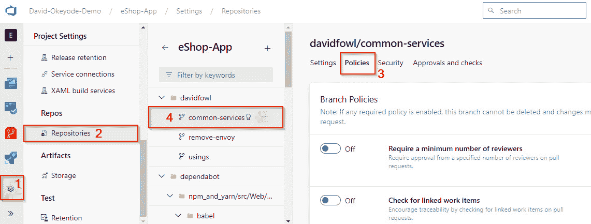
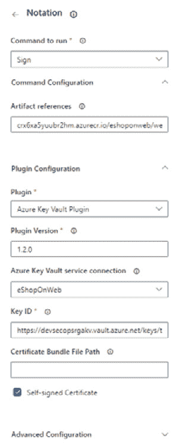

# 第七章：在 DevOps 的测试和发布阶段实现安全性

测试阶段的目标是**确保编译后的应用程序提供预期功能，并且不包含在构建阶段未检测到的任何错误。** 发布阶段的目标是**为将测试过的应用程序准备并交付部署到生产或其他目标环境。** 根据项目的发布策略，测试和发布阶段通常是重叠的。 通常，软件会先发布到预生产环境进行自动化运行时测试，使用如 Selenium 等工具，然后再发布到生产环境。 在本章中，我们将讨论 DevSecOps 实践，确保并将安全集成到这些阶段中。 在本章结束时，您将理解以下关键 安全实践：

+   确保发布构件是从 受保护的分支构建的

+   实现代码 审查流程

+   选择一个安全的 构件源

+   实现验证 构件完整性的过程

+   在 发布阶段安全地管理机密

+   使用 发布门禁 来验证并强制执行运行时安全

让我们 开始吧！

# 技术要求

要跟随本章的说明，您将需要 以下内容：

+   一台配有 互联网连接的 PC

+   一个有效的 Azure 订阅

+   一个 Azure DevOps 组织

+   一个 GitHub 企业组织

# 了解 DevOps 的持续部署阶段

**持续部署（CD）** 是 DevOps 实践之一，成功集成并通过自动化测试的代码更改会自动过渡到生产环境。 这一阶段的活动包括将代码打包成可部署的格式，将包存储在构件库中，并在其最终过渡到生产 运行时环境之前，在预生产运行时环境中验证软件。

该过程确保新特性、错误修复和更新能够快速且持续地交付给用户，无需人工干预，从而实现从开发到部署的无缝流转。 成功的持续交付（CD）的关键在于一个强大的自动化测试框架，能够验证更改并确保应用程序在 实际环境中的稳定性和可靠性。

*图 7**.1* 展示了一个简化的 DevOps CD 过程示例。 在该场景中，一个标记为 *APP:V1*的应用程序包从构建过程中发布到工件库。 新包的创建启动了一个 CD 流水线，该流水线会自动将其部署到暂存环境中进行测试。 测试成功通过后，包被部署到生产环境中，供 最终用户访问。


图 7.1 – 持续交付示例场景

在 CD 阶段实施安全性包括安全存储发布工件，在发布前验证其安全性，确保 运行环境的安全性在软件部署前得到保障，并使用 **基础设施即代码** (**IaC**) 自动配置运行环境的安全性。 让我们回顾一下 这些领域。

# 在发布阶段保护发布工件

DevOps 过程注重速度和灵活性。 其目标是消除可能减缓 市场速度的障碍。 通常情况下，代码更改会在几分钟内从开发者的工作区移动到生产环境 ，主要依靠自动化，且几乎没有人工检查。 阅读那些在 DevOps 实践上更为成熟的组织的部署数据令人印象深刻。 例如，Netflix 维持着超过 600 个生产环境中的服务，每天进行约 100 次部署；Uber 运营着超过 1,000 个生产环境中的服务，每周进行几千次部署；WeChat 生产环境中的服务超过 3,000 个，每天大约进行 1,000 次 部署！

注意

若要了解如 Netflix、Uber 和微信等公司的部署速度信息，请参阅此[文档](https://learn.microsoft.com/en-us/dotnet/architecture/cloud-native/definition)。

为了在发布阶段集成安全性，首先需要审查您的 CI/CD 流程，确保没有任何人（无论是个人还是应用程序）能够在没有严格审查和批准的情况下部署代码更改或新的工件。审查应包括自动化检查和人工审核。遵循零信任原则，您必须假设攻击者最终可能会获得对 CI/CD 流程中某个系统的访问权限（如源代码控制、CI 系统或工件库）。为了解决这个问题，我们需要实施措施，防止任何单一实体独立推送代码更改或通过发布管道发布工件。

## 确保发布工件是从受保护的分支构建的

实现 DevOps 测试和发布阶段的安全性始于对将要部署的工件的安全性——我们称之为**发布工件**。

注意

发布工件是已打包并准备好部署的软件或软件组件。工件根据技术栈和目标部署平台的不同而有所不同。例如，Java 应用通常打包为`.dll`或`.exe`文件，它们是编译后的代码工件，部署后在 .NET 运行时上运行。在 JavaScript 或 Node.js 项目中，`package.json`文件。对于 Python 应用，`.whl`文件是一种更现代的打包格式，旨在替代 egg 文件。它们促进了 Python 库和应用的分发和安装。对于容器化解决方案，应用被打包为容器镜像。

一个好的起点是保护所有用于创建这些发布工件的分支。在 GitHub Enterprise 中，可以使用**分支保护规则**来实现，在 Azure DevOps 中，则可以使用**分支策略**来实现。

要在 GitHub Enterprise 中实现，请导航至 **仓库设置**，然后 **代码与自动化** | **分支** | **分支保护规则**，然后点击 **添加规则**。 *图 7**.2* 显示了一个用于保护包含“release”字样的分支的示例分支保护规则。 这需要管理员权限或具有 **编辑仓库** **规则** 权限的自定义角色。


图 7.2 – GitHub Enterprise 中的示例分支保护规则

要在 Azure DevOps 中实现，请转到 **项目设置** | **仓库** | **Repositories**，选择一个 **仓库**，选择 **策略** | **分支策略**，并选择一个 **分支** (注意，您可能需要滚动才能看到分支列表)。 *图 7**.3* 显示了 Azure DevOps 中的分支策略示例。 这需要管理员权限或具有 **编辑** **策略** 权限的自定义角色。



图 7.3 – Azure DevOps 中的示例分支保护规则

总体而言，这两个平台提供了类似的分支保护功能。 GitHub Enterprise 可能没有 直接的构建验证和人工审核分支保护设置，但这些功能可以通过其他方法实现（见 *图 7**.4*）。 一个显著的区别是 Azure DevOps 不支持要求提交签名，而 GitHub Enterprise 支持这一功能。 关于这两个平台之间分支保护功能的详细比较，请参见 *图 7**.4*。


图 7.4 – 分支保护功能比较

遵循零信任原则，我们还希望确保对所有人（包括管理员）强制执行分支保护策略。 这一点非常重要，因为管理员帐户通常会成为账户劫持的目标，原因是它们的 特权角色。

采用零信任方法，适用于所有主要发布分支，只有在极少数情况下才允许例外。

在 GitHub Enterprise 中，我们可以激活 **不允许绕过上述设置** 选项，作为我们的分支保护规则的一部分（参见 *图 7**.5*）。


图 7.5 – 在 GitHub Enterprise 中强制执行所有人的分支保护设置

在 Azure DevOps 中没有类似的设置，但我们可以限制或审计有权限绕过拉取请求和推送策略的角色/用户。 默认情况下，没有任何角色，包括管理员，拥有这些权限（参见 *图 7**.6*）。 要在 Azure DevOps 中查看权限，导航至 **项目设置** | **代码库** | **仓库**，选择一个 **仓库**，然后选择 **安全**，并检查 **完成拉取请求时绕过策略** 和 **推送时绕过策略** (*图 7**.6*)。 该权限也可以在分支级别配置，而不是在 仓库级别。


图 7.6 – 在 Azure DevOps 中查看绕过分支保护策略的权限

如果 管理员帐户被攻破，分支保护设置可能会被禁用，允许攻击者绕过必需的检查，快速将恶意代码更改推送到生产环境。 因此，跟踪和审计分支保护及敏感权限的更改非常重要，以便发现异常的绕过尝试。 *图 7**.7* 展示了在 GitHub Enterprise 中修改敏感分支保护设置的审计日志条目的示例。


图 7.7 – 修改敏感分支保护设置的日志示例

有关启用审计的信息，请参考 *确保构建环境已记录* 部分内容，详见 *第六章*。

## 实施代码审查流程

另一个好的安全措施是要求对发布分支 和部署工作流/管道配置文件进行人工审查。 这应该作为代码与发布分支合并前强制执行的自动化安全扫描之外的额外措施。 自动化扫描是有用的，但可能会被绕过，因此需要人工检查。 即使实施了必要的控制，也可能会发现新的绕过方法。 包括经验丰富的人工审阅者提供了一层额外的防护，防止潜在的 恶意攻击。

GitHub Enterprise 和 Azure DevOps 平台都支持细粒度的代码审阅实施，我们可以为代码库的不同路径分配不同的审阅者。 在 Azure DevOps 中，这可以通过分支保护控制实现，而在 GitHub Enterprise 中，则可以通过分支保护控制 结合 一种名为 `CODEOWNERS`的功能来实现。

要在 Azure DevOps 中启用细粒度代码审查，请导航至 **项目设置**，然后选择 **仓库**，接着点击 **仓库**。选择一个仓库，点击 **策略**，然后滚动到 **分支策略** 部分，找到你的发布分支。 在 **分支策略**下，激活 **要求最低数量的审阅者** 并将其设置为 **开启**。输入所需的审阅者数量，并从可用选项中选择（*图 7**.8*）。


图 7.8 – 在 Azure DevOps 中启用人工代码审查

我们还可以 自动向拉取请求中添加审查者，审查那些更改特定目录和文件中的内容的文件。 例如，我们可能希望将安全团队的成员添加为审查者，以审查任何对管道文件的更改，或者将开发团队中的安全冠军添加为审查者，以审查发布分支的代码更改。 我们可以通过配置选项来实现这一点， **自动添加审查者** (*图 7**.9*)。


图 7.9 – 在 Azure 仓库分支策略中添加必需的审查者

如果设置标记为 **必需**，则每个列为审查者的个人必须批准更改。 如果将小组名称添加为审查者，则每个小组至少需要有一个成员 批准更改。 如果只需要一个小组的批准，那么所需的批准数就是该小组指定的最小数量。 例如，可以为每个开发团队组成一个小组，其中包括该团队的安全冠军，而该小组将作为审查者。 这可以确保至少有一个具有安全经验和培训的人在批准之前审查代码更改。 被批准。

对于 GitHub Enterprise，我们可以启用一个分支保护规则，在合并之前要求拉取请求，通过选择 `CODEOWNERS` 文件 (*图 7**.10*)。


图 7.10 – 在 GitHub Enterprise 分支保护策略中启用代码拥有者审查

CODEOWNERS

`CODEOWNERS` 是 GitHub 的一个功能 ，我们可以用它指定负责维护项目特定部分的个人或团队。 当对这些部分进行更改时，指定的代码拥有者会自动被要求审查并批准这些更改，才能合并。 我们可以使用此功能为发布分支和部署 工作流文件实施代码审查。

要使用 `CODEOWNERS`，我们需要在 `CODEOWNERS` 文件中创建一个文件，文件路径为 `.github/`、 `根目录`，或 `docs/` 仓库目录。 该文件使用一种模式，遵循大多数（但不是所有）在 `gitignore` 文件中使用的规则。 例如， `/workflows/ @dev @security` 这一行条目的含义是，任何位于 `/workflows` 目录中的更改都需要 `@dev 或 @security` 团队成员的批准，但不需要两个团队都批准。

一行条目 `**/releases @securitychampions @teamleaders` 的含义是 `@securitychampions` 和 `@teamleaders` 团队拥有 `/releases` 目录中的任何文件。 要 了解有关 `CODEOWNERS` 文件的更多信息，请参阅以下文档： [https://docs.github.com/en/repositories/managing-your-repositorys-settings-and-features/customizing-your-repository/about-code-owners#codeowners-syntax](https://docs.github.com/en/repositories/managing-your-repositorys-settings-and-features/customizing-your-repository/about-code-owners#codeowners-syntax)。

现在我们了解了确保发布构件仅来自经过验证代码的一些控制措施，接下来让我们探讨这些构件的安全存储。

## 选择安全的构件源

DevOps 测试和发布阶段的另一个关键安全最佳实践是确保将要部署的构件 的安全性。 这些构件应存储在可信的位置，以维护其完整性 并防止篡改。 GitHub Actions 和 Azure Pipelines 都支持从多种来源部署构件，例如构建环境、软件包仓库、容器仓库、文件共享和源代码控制仓库。 *图 7**.11* 显示了经典 Azure 发布管道支持的构件源的截图。

DevSecOps 要求我们仅使用支持 **不变性**、 **可追溯性**和 **访问控制**的工件源。不变性通过确保 工件的内容从发布、进行安全测试到最终发布到生产环境时不会发生变化，从而保证完整性。 这可以在工件源级别或包级别实现。 在源级别实现意味着我们的工件源一旦发布后，不应允许对包进行任何修改。 要纠正任何问题，应该发布新版本，而不是修改现有版本。 这确保了已进行安全测试的工件内容与实际部署的工件内容相同。 像文件共享、 **Azure 容器注册表** （**ACR**）和 GitHub 包等来源应谨慎使用，因为它们默认是可变的。 任何拥有正确权限的人都可以更新存储在这些源中的已发布工件的内容。 攻击者可以利用这一点，在部署前将原版本替换为已被篡改的版本。 。


图 7.11 – 经典 Azure 发布管道的支持工件源

对于 ACR，我们可以 通过配置镜像锁定，在工件存储级别强制实施不变性。 这是通过使用 `az acr repository update` 命令来实现的。 *图 7**.12* 展示了一个使用此命令将新的容器镜像锁定在构建和 发布阶段的 GitHub 工作流示例。


图 7.12 – 带 ACR 镜像锁定的 GitHub 工作流示例

不变性是选择工件源时需要考虑的几个因素之一。 其他重要的因素包括可追溯性和版本控制。 可追溯性使我们能够查看包的来源，并将其与代码更改、测试用例和工作项关联起来。 这使得在发生安全漏洞时，进行法医审计变得更加容易。 版本控制使我们能够在不同版本的工件之间跟踪安全结果，并在面临重大 零日漏洞时，快速回滚到安全版本。

对 可追溯性和版本控制的支持因工件来源而异。 例如，文件共享是基本的存储解决方案，通常缺乏内建的版本控制和源控制的可追溯性。 在文件共享中实现这些功能通常需要额外的工具或 自定义配置。

一般来说，文件共享不推荐作为 DevOps 工作流中的工件来源。 工作流/管道工件本身通常包含这些功能，而 ACR、GitHub Packages 和 Azure Artifacts 可能还需要 额外的配置。

### 理解工作流/管道工件

GitHub Actions 和 Azure Pipelines 都支持将工件发布到构建平台内部的选项。 对于 GitHub Actions， `upload-artifact` 操作可以用来将工件上传到 **Actions 工件** 存储库（*图 7**.13*）。


图 7.13 – GitHub Actions 上传工件操作

对于 Azure Pipelines，可以使用 `PublishPipelineArtifact` 或 `PublishBuildArtifact` 任务来实现相同的目的（*图 7**.14*）。


图 7.14 – Azure Pipelines 发布 Pipeline 工件任务

这些选项之所以受欢迎，是因为它们易于使用，但它们会影响不可变性和可追溯性。 因为这些工件存储在构建平台中，并且它们与创建它们的工作流/管道运行或作业有链接，因此在这种情况下，它们提供了内建的可追溯性。 然而，也应考虑保留策略和行为，以了解其整体影响。 例如，GitHub Enterprise 存储操作 工件 90 天，但这一期限可以延长至 400 天。 定制化可以在企业、组织或仓库级别进行（*图 7**.15*）。


图 7.15 – 配置 GitHub 工作流工件的保留期限

在 GitHub Enterprise 中配置工件保留期

工件 的保留设置可以在以下不同级别进行定制： GitHub Enterprise：

+   **企业**：前往 **设置** | **策略** | **操作** | **策略** | **工件和** **日志保留**。

+   **组织**：前往 **设置** | **代码、规划与自动化** | **操作** | **常规** | **工件和** **日志保留**。

+   **仓库**：前往 **设置** | **代码与自动化** | **操作** | **常规** | **工件和** **日志保留**。

选择的保留期限会影响可追溯性。 如果我们设置了 100 天的保留期，而我们需要下载 120 天前的某个工件以调查最近发现的漏洞，我们将无法做到这一点，除非我们已经将该工件转移到其他存储位置。 在 Azure Pipelines 中，删除管道运行也会删除所有关联的工件。 如果删除的工件稍后需要调查，这也可能会影响可追溯性。

从不变性的角度来看，GitHub `upload-artifact` 操作如果启用 `覆盖` 选项，可以覆盖工件（*图 7**.16*）。


图 7.16 – 实现工件覆盖

如果开发人员 没有通过 ID 锁定发布工件，而是使用名称，那么可能会在工件交换攻击中被利用。 Azure Pipelines `PublishPipelineArtifact@1` 任务的行为与此不同。 它的设计目的是确保给定构建的工件不可变。 一旦发布，不能再发布另一个具有相同名称的工件。

注意

有关操作和任务行为的更多信息，请参阅 以下文档：

+   `upload-artifact`： [https://github.com/actions/upload-artifact](https://github.com/actions/upload-artifact)。

+   `PublishPipelineArtifact@1`： [https://learn.microsoft.com/en-us/azure/devops/pipelines/tasks/reference/publish-pipeline-artifact-v1](https://learn.microsoft.com/en-us/azure/devops/pipelines/tasks/reference/publish-pipeline-artifact-v1)。

现在我们已经讨论了使用工作流/管道工件作为发布源的安全性问题，接下来让我们探讨独立服务的类似安全考虑。

### 理解 Azure Artifacts 和 GitHub Packages

GitHub Enterprise 和 Azure DevOps 都提供用于存储和管理 发布工件的独立服务。 GitHub Enterprise 提供 GitHub Packages，而 Azure DevOps 提供 Azure Artifacts。 这两项服务 都支持可以处理各种包类型（如 NPM、NuGet、Maven、Python 和 Universal 包）的源。 GitHub Packages 还支持 容器，而 Azure Artifacts 则 不支持。 Azure 提供 ACR 用于存储容器。 从安全性的角度来看，这两项服务是相似的（*图 7**.17*）。


图 7.17 – GitHub Packages 和 Azure Artifacts 中的安全考虑

GitHub Packages 和 Azure Artifacts 中的工件默认是不可变的。 一旦发布了某个版本的工件，它就不能被修改。 任何更新或修复必须作为新版本发布，从而确保已部署的工件与经过验证的工件一致。 Azure Artifacts 中的可追溯性主要通过与 Azure DevOps 服务的集成来管理。 每个工件都与特定的管道运行相关联，包含构建编号和关联的提交等详细信息。 这些数据对于重建工件的开发历史至关重要。 GitHub Packages 中的每个包都存储详细的来源信息，包括构建该包的提交 SHA、分支或标签。 这种详细程度对于合规性和 安全审计尤为重要。

## 实施工件签名以进行完整性检查

确保 DevOps 工作流的安全性涉及确保软件供应链中每个步骤的完整性。 如果攻击者突破了工件存储，他们可能篡改本应用于生产的包并上传未经授权的工件。 例如，在 CodeCov 事件中，攻击者利用泄露的凭证上传了一个有害的工件，导致用户直接下载。 一种缓解策略是强制执行所有发布工件的完整性验证过程。 这包括对包进行签名并在部署之前验证数字签名。 可以使用各种工具 和方法来实现这一点，但两个常见的 方法是 **Sigstore 的 Cosign** 和 **Notation**。我们来 回顾一下这些。

### 使用 Sigstore 的 Cosign 实现工件签名

**Sigstore** 是一套 旨在自动化软件工件的数字签名 和验证的开源工具 。它主要针对容器镜像和二进制文件等软件工件，但也可以用于任何文件类型，包括 ZIP 压缩包。 它结合了几种工具和技术，包括 以下内容：

+   **Cosign**：用于 签名和验证容器 及工件

+   **Fulcio**：一个免费的 根证书颁发机构，颁发 临时证书

+   **Rekor**：它将 签名元数据记录到 防篡改的分类账中

+   **OpenID Connect**：这是 身份验证

Sigstore

欲了解更多关于 Sigstore 项目的信息，请访问他们的官方网站 [https://www.sigstore.dev/](https://www.sigstore.dev/) 并探索他们的 GitHub 仓库 地址为 [https://github.com/sigstore](https://github.com/sigstore)。

**Cosign** (作为 Sigstore 项目中的工具之一) 通过使签名管理过程不可见，简化了软件工件（如容器镜像）的签名和验证。 它自动签署工件，将签名存储在 OCI 注册表中，并在无需用户干预签名处理的情况下执行验证。 在签署 Docker 镜像时，Cosign 会在 OCI 注册表中创建一个特殊的标签，将镜像的唯一摘要（其不可变标识符）纳入标签名称中。 这使得根据镜像的摘要轻松检索和验证镜像的签名。

要使用 Cosign，我们 *首先* 必须确保它已安装在用于我们的工作流/管道的 runner/agent 上。 对于 GitHub，可以使用 `cosign-installer` GitHub 市场任务（*图 7**.18*）。 对于 Azure DevOps，我们使用命令行步骤配合我们喜欢的操作系统包管理器，详情请参考 在 [https://docs.sigstore.dev/system_config/installation/](https://docs.sigstore.dev/system_config/installation/)。


图 7.18 – cosign-installer GitHub 市场任务

步骤 *二* 是可选的。 我们可以使用 `cosign generate-key-pair` 命令生成将用于数字签名的密钥对。 这提供了更多的控制权，但也带来了密钥管理的复杂性。 Cosign 还支持无密钥签名，这种方法使用短暂的密钥并透明地记录签名过程。 这种方法通过消除密钥的直接管理，提高了安全性并简化了操作。 步骤 *三* 是使用 `cosign sign` 命令签名我们的工件。 步骤 *四* 是使用 `cosign verify` 命令验证签名，作为我们 部署前检查的一部分。

### 使用 Notation 实现工件签名

Notation 是另一个可以用于 对数字构件进行签名并验证其完整性和发布者的工具。 它是 Notary 项目的一部分，该项目是 一个由 **云原生计算** **基金会** (**CNCF**)的孵化项目。

Notary 项目

要了解 有关 Notary 项目的更多信息，您可以访问他们的官网 [https://notaryproject.dev/](https://notaryproject.dev/) 并浏览他们的 GitHub 仓库 ，网址为 [https://github.com/notaryproject](https://github.com/notaryproject)。

与 Sigstore 类似，它主要面向软件构件，如容器镜像和二进制文件，但也可以用于任何文件类型，包括 ZIP 文件。 数字构件可以在构建过程中进行签名，并在部署时验证其完整性和来源。 *图 7**.19* 提供了 Notation 如何集成到 DevOps 工作流中的高级概述。


图 7.19 – Notation 如何集成到 DevOps 工作流中

要使用 Notation，我们 *首先* 必须确保它已安装在用于我们工作流/流水线的运行器/代理上。 对于 GitHub，可以使用 `notation-action` GitHub 市场动作来完成。 Azure DevOps 也有一个 `Notation` 市场任务，我们可以用来完成这个操作（*图 7**.20*）。


图 7.20 – Azure DevOps Notation 市场任务

第二 *步* 是对我们的构件进行签名。 Azure Pipelines 中的 Notation 任务原生支持 Azure Key Vault 插件，这使得 Notation CLI 能够使用 Azure Key Vault 管理的证书和密钥生成签名（*图 7**.21*）。


图 7.21 – 在 Azure Pipelines 中实现 Notation

它支持 使用自签名 证书进行签名和 `notation sign` 命令。 第三个也是最后一步是将签名作为预部署检查的一部分进行验证。 Notation 支持指定一个信任策略文件，定义我们希望强制执行的签名验证级别。 有四个 验证级别：

+   **严格**：此设置 强制执行所有验证。 如果任何验证失败，则验证失败。 适用于构建环境或 高安全性部署。

+   **宽松**：此设置 执行大部分验证，但记录诸如撤销和过期等问题。 适用于部署或运行时，当完整性和真实性 至关重要时。

+   **审计**：仅 确保签名完整性（如果存在）；记录其他 验证失败。

+   **跳过**：此操作 不执行签名验证。 用于混合签名和未签名的工件，但需要指定确切的注册表 URL 在 registryScopes 中。

*图 7**.22* 展示了 四种级别（严格、宽松、审计和跳过）及其 各自的验证方式。


图 7.22 – Notation 的验证级别

要了解 有关 Notation 信任策略文件的更多信息，请参考以下 文档： [https://github.com/notaryproject/specifications/blob/v1.0.0/specs/trust-store-trust-policy.md](https://github.com/notaryproject/specifications/blob/v1.0.0/specs/trust-store-trust-policy.md)。

## 在发布阶段安全地管理密钥

在自动化构建和部署管道中，开发人员可能需要提供访问内部 或外部服务所需的凭证。 例如，从私有仓库下载代码的构建管道任务可能需要提供凭证。 另一个任务可能是从私有注册表下载包，必须提供必要的凭证。 在部署管道中，某个任务可能 *需要* 凭证以连接到托管的 Kubernetes 集群，部署最新版本的 应用程序。

注意

一个好的安全最佳实践是优先使用工作负载身份进行访问，而不是使用密钥。 例如，实施托管身份来访问 Azure 服务。 密钥应仅在工作负载身份尚未支持的场景中使用。

这些敏感凭证绝不应以明文存储在构建或部署流水线工作流文件中。 一种可行的选择是将凭证存储为加密的环境 变量。 这些在 GitHub **Enterprise** 中被称为 **密钥** ，在 Azure Pipelines 中被称为 **密钥变量**。 在我们的讨论中，我们将其称为 *密钥*。

在 GitHub 中，密钥可以在组织、仓库或仓库环境级别设置。 在 Azure DevOps 中，它们可以在项目（使用变量组）、流水线、阶段或作业级别设置。 组织/项目级别的密钥允许团队在多个工作流或流水线中共享密钥。 这减少了在多个仓库/流水线中创建重复密钥的需求。 密钥在静止时使用 2048 位 RSA 密钥加密，并可供任务和脚本在代理上使用。 。

在这两个平台上，具有读取权限的用户无法读取密钥，但具有写入权限的用户可以读取所有密钥。 为了减少密钥泄漏的风险，我们需要小心授予谁对我们仓库/项目的写入权限。

遵循零信任原则时，我们需要假设漏洞可能发生，并仅授予执行工作流/流水线所需的最小权限。 这种方法在用户的写入权限被泄露时，能减少潜在的影响。 例如，用于将应用程序部署到 Kubernetes 集群的密钥，应该只拥有该特定权限。 它不应该有权限修改集群中的其他配置。

GitHub Actions 和 Azure Pipelines 都尝试在日志输出中屏蔽秘密（*图 7**.23*）。 它们会查找在命令行中以纯文本形式打印的秘密，以及日志输出中秘密值的精确匹配。 然而，这个过程并不完美。 开发者仍然需要谨慎，防止 意外暴露。


图 7.23 – Azure Pipeline 日志中的屏蔽秘密

例如，不推荐使用 JSON、XML 或 YAML 等结构化数据格式来定义秘密值。 这可能导致屏蔽失败。 一个例子是，如果秘密值被定义为 `{"apikey": "secretpass"}`；如果该精确值以纯文本形式打印到控制台，它可能无法被屏蔽（*图 7**.24*）。 开发者应为每个敏感值创建单独的普通秘密，而不是将它们映射在结构化数据格式中，以确保它们在日志中能够被正确屏蔽。 在日志中。


图 7.24 – 由于结构化数据格式导致的未屏蔽秘密示例

此外，如果在工作流/管道中使用一个秘密来生成敏感值，生成的 值应注册为秘密，以 确保如果它出现在日志中时会被屏蔽。 例如，可能使用一个私钥来生成一个签名的 **JSON Web Token** （**JWT**）以访问 Web API。 该 JWT 应该注册为秘密，否则如果它被记录在工作流/管道日志输出中，它将不会被屏蔽。 类似地，如果一个秘密被以某种方式转换，例如被 Base64 编码或 URL 编码，它也应该注册为秘密，以确保如果它出现在 日志输出中时能够被屏蔽。

### 在你的 DevOps 管道中集成秘密保管库

除了在我们的工作流/管道中实现密钥管理外，我们还可以实现一些流程， 使用如 Azure Key Vault 或 HashiCorp Vault 等密钥管理服务来集中管理密钥。 这是首选方案，因为它具有可扩展性的优势，并且它允许将密钥管理与 DevOps 平台解耦。 正如我们之前提到的，更好的做法是，如果您的场景支持，过渡到使用工作负载身份。

Azure Key Vault 是一个密钥管理服务、证书管理服务和密钥管理服务。 A **密钥** 是数据大小不超过 25 KB（对于标准保管库），可以以明文形式存储和检索。 例如，密码、数据库连接字符串和存储账户连接字符串。 **密钥** 是加密密钥（即使用算法生成的密钥），可以导入或在保管库中生成。 Key Vault 目前支持 RSA 和椭圆曲线密钥。 **证书** 是自签名的 SSL/TLS 证书，可以在 Key Vault 中生成，或是导入到保管库中的第三方 SSL/TLS 证书。 *图 7**.25* 展示了这三种对象类型的示例使用案例。


图 7.25 – 示例 Azure Key Vault 使用案例

要将 Azure Key Vault 集成到我们的 GitHub Action 工作流中，我们可以实现 `azure/get-keyvault-secrets` 操作，该操作通过工作负载身份或服务主体进行身份验证。 在 Azure DevOps 管道中，此集成可以通过 `AzureKeyVault` 任务完成，该任务使用受托管身份或服务主体支持的服务连接（*图 7**.26*）。 对于这两种选项，我们需要确保访问权限仅限于所需的密钥。 这需要最小权限访问设计。


图 7.26 – 示例 Azure DevOps 与 Key Vault 集成

现在，让我们 回顾另一个关于确保构建/发布环境安全的最佳实践—— 实施审计。

## 为 CI/CD 环境实施审计

CIS 框架还建议在构建/发布环境中启用日志记录。 这对于安全性 监控、威胁检测和在发生事件时的取证分析至关重要。 理想情况下，日志记录应在控制平面启用，以进行管理操作，以及在 数据平面。

### 启用和配置控制平面日志记录

在 **GitHub Enterprise Cloud** (**GHEC**)，我们 不需要 做任何事情来启用控制平面审计 日志。 它们默认已启用。 这些日志可以 在企业级别查看 通过 **设置** | **审计日志** | **事件**，或者在组织级别通过 **组织** | **设置** | **归档** | **日志** | **审计日志** | **事件**查看。默认情况下，只有最近三个月的事件可见，但事件会保存长达七个月，之后会被 删除。

这些日志 记录了一系列事件 ，包括分类在 **org** 和 **workflow**下的工作流控制平面活动。 这包括诸如创建、更新、删除和执行 工作流等操作。 审计事件的完整列表可以在此查看： [https://docs.github.com/en/organizations/keeping-your-organization-secure/managing-security-settings-for-your-organization/audit-log-events-for-your-organization](https://docs.github.com/en/organizations/keeping-your-organization-secure/managing-security-settings-for-your-organization/audit-log-events-for-your-organization)。

为了保护隐私，审计日志省略了事件的源 IP 地址。 要将源 IP 地址添加到审计日志中，可以在企业级别或 组织级别进行调整：

+   **企业级别**：导航至 **企业** | **设置** | **审计日志** | **设置**。启用并保存 **启用源 IP** **披露** 选项。

+   **组织级别**：进入 **组织** | **设置** | **存档** | **日志** | **审计日志** | **设置**。启用并保存 **启用源 IP** **披露** 选项。


图 7.27 – 启用源 IP 记录以进行审计日志

为了将日志流式传输到外部，可能是为了将其保存超过最大保留期限，我们可以选择直接将日志流式传输到 Amazon S3、Azure Blob Storage、Google Cloud Storage、Splunk 和 Datadog。 我们还可以 通过 Azure Event Hub 将其流式传输到其他第三方服务。 这可以 通过 **设置** | **审计日志** | **日志流式传输** | **配置流式传输**。


图 7.28 – 在企业级配置审计日志流式传输

对于 Azure Pipelines，可以在 **安全** | **策略** | **安全策略** | **日志** **审计事件**。


图 7.29 – 启用审计日志记录

启用此设置后，它会记录多个事件，包括 Azure Pipeline 控制平面事件 ，如管道创建、修改、删除和 执行。 可以在此处找到已审计的完整管道事件列表： [https://learn.microsoft.com/en-us/azure/devops/organizations/audit/auditing-events?view=azure-devops#pipelines](https://learn.microsoft.com/en-us/azure/devops/organizations/audit/auditing-events?view=azure-devops#pipelines)。

启用后，可以在 **组织设置** | **常规** | **审计** | **日志**中查看事件。这些事件会保存 90 天，之后会 被删除。

它们将日志收集到集中式日志存储中，在这里我们可以保存更长时间，并且可以在 **组织设置** | **常规** | **审计** | **流** | **新建流**中配置审计流，在这里我们可以选择通过 Azure 事件网格将日志导出到 Azure Monitor、Splunk 或其他第三方解决方案。


图 7.30 – Azure DevOps 审计流选项

### 启用和配置数据平面日志记录

GHEC 工作流运行日志（构建环境数据平面日志）默认也 已启用并保留 90 天 默认情况下。 保留 设置可以在企业、组织或 仓库级别调整，最大可调为 400 天：

+   **企业级**: 导航到 **企业** | **设置** | **策略** | **操作** | **工件和日志保留**。设置保留天数并 点击 **保存**。

+   **组织级别**：前往 **组织** | **设置** | **代码、规划与自动化** | **工件和日志保留**。设置保留天数后 点击 **保存**。

+   **仓库级别**：前往 **仓库** | **设置** | **代码与自动化** | **操作** | **常规** | **工件和日志保留**。设置保留天数后 点击 **保存**。


图 7.31 – 在 GitHub 中配置工作流日志保留策略

Azure 流水线的构建日志默认启用，并且会默认保留 30 天。 这些 保留设置 可以通过 **项目设置** | **流水线** | **设置** | **保留策略** | **保留运行天数** **。


图 7.32 – 在 Azure DevOps 项目设置中配置保留策略

现在让我们了解一下 安全网关。

# 在发布流水线中实现安全网关

网关是 软件发布流水线中的重要组成部分。 它们作为质量检查点，在软件进入下一个部署阶段之前，必须通过这些检查。 它们的主要目标是减少部署不合格的软件的可能性，这些软件未能达到商定的性能和 质量标准。

例如，一个开发团队可能会将软件或更新部署到测试环境，使用如 Azure Load Testing 和 Selenium 等工具运行自动化负载和功能测试，并在 Azure Monitor 中查看 结果。

如果 软件符合约定的 **服务水平协议** (**SLA**)，则将部署到下一个阶段。 如果不符合 SLA，则部署会停止，并且会收集遥测数据供团队调查并解决问题（*图 7**.33*）。


图 7.33 – 发布流水线中的示例质量门测试

DevSecOps 扩展了门的使用范围，包括安全性验证（安全门） – 见 *图 7**.34*。安全门的目标是防止最关键的软件风险被部署到生产环境或其他具有更高 利用风险的环境中。


图 7.34 – 发布流水线中的示例安全门测试

发布流水线中的安全门 根据项目需求有所不同。 **动态应用安全测试** (**DAST**) 门使用如 OWASP ZAP、Burp Suite 和 Acunetix 等工具，在预生产环境中测试运行中的应用程序。 这些工具检查诸如 API 安全、SSL/TLS 配置和 身份验证等问题。 **合规性门** 确保符合监管 标准，而 **渗透测试门** 则模拟网络攻击， 以发现漏洞。

有效的安全门需要在保持开发速度的同时平衡全面的安全检查。 从最关键的检查开始，这些检查提供最大的价值，然后逐步扩展。 要确定最关键的检查，从当前在生产环境中看到的主要问题开始，并实施检查，以防这些问题进入生产环境。 根据反馈和不断发展的 安全威胁持续完善你的过程。

关于保持开发速度，安全门应尽可能自动化，以避免减缓软件发布过程。 如果使用安全门阻止不符合要求的软件部署到生产环境，建议实施一个管理良好的手动覆盖流程。 这应该至少需要两名手动批准者，以防止其被滥用作为安全绕过，并确保只有业务可接受的风险才会 被允许通过。

## 将 DAST 实施为安全门

与前面章节中涵盖的安全评估不同，DAST 在应用程序运行时识别安全问题。 它是一个很好的 补充， **静态应用程序安全测试** (**SAST**) 和 SCA 评估，因为它可以检测代码中可能没有明显显示的运行时问题。 它通过模拟攻击正在运行的应用程序来实现这一点。 例如，DAST 工具可能会爬取一个正在运行的 Web 应用程序 并发送格式错误的输入，以识别如 SQL 注入、 **跨站脚本攻击** (**XSS**) 和不安全的直接 对象引用等问题。

将 DAST 集成到遵循 DevOps 流程的项目中，并且不影响用户，需要了解部署策略，并与管道开发团队合作。 部署策略会影响测试类型和实施方式。 例如，传统的应用程序部署策略包括将其发布到 *测试* 环境中，然后进入 *暂存* 环境，最后到达 *生产*环境。测试和暂存部署是集成持续 DAST 过程的理想点。

现在有 一些现代部署策略被 DevOps 团队采纳，这些策略允许更频繁地部署到生产环境，有时甚至在生产环境中进行测试。 如部署环、金丝雀发布、 **黑暗发布**和 A/B 测试都属于这一类。 在将 DAST 集成到这些策略中时，主要需要注意的是，测试应在类似生产的非生产环境中进行，以确保准确的结果，同时保护生产环境中的数据。

## 在 DevOps 流程中实施 DAST 的挑战

DAST 工具的有效性与它能够自动执行的测试类型密切相关。 这听起来可能很简单，但其中有很多细微的差别。 例如，针对 Web 应用程序的测试与针对 API 应用程序的测试不同，后者又与针对实现**检索增强生成**（**RAG**）工作流的生成式 AI 应用程序的测试不同。 如果一个 DAST 工具仅支持针对 Web 和 API 应用程序的攻击，那么它可能对其他类型的应用程序价值不大。 不要仅仅为了集成而集成 DAST。 必须明确定义其价值，因为集成带来一定的速度成本。 确保 DAST 的收益超过对开发速度和效率的影响。 要正确评估应用程序的特定安全需求和潜在漏洞，以确定 DAST 集成是否值得。 

大多数现有的 DAST 工具专注于测试 Web 应用程序。 虽然许多组织有基于 Web 的应用程序，但其他类型的应用程序可能未被涵盖。 大多数 DAST 解决方案仅测试 Web 启用应用程序的暴露 HTTP 和 HTML 接口。 然而，某些 解决方案是专门为非 Web 协议和数据畸形设计的，比如 **远程过程** **调用**（**RPC**）。

另一个挑战是，尽管 DAST 已存在一段时间，但大多数工具是为传统流程中的安全团队使用而创建的。 然而，现代 DAST 解决方案是从零开始为开发人员、QA 和 DevOps 专业人员构建的，使得工具及其输出对他们来说更具相关性和可访问性。 现代 DAST 解决方案的一个关键特点是部署的灵活性，包括容器化或基于代理的扫描仪，并提供云端和 自托管报告的选项。

修复是另一个挑战领域。 来自 DAST 工具的修复指导可能缺乏上下文。 例如，DAST 工具可能会识别到运行中的应用程序中的 SQL 注入漏洞，但它可能无法识别开发人员需要 更改的代码行，以修复该问题。 这就是另一个工具类别， **互动式应用程序安全测试** (**IAST**)，可以提供帮助的地方。 IAST 将 SAST 和 DAST 的安全功能合并为一个工具，并为开发人员提供更多可操作的见解。

尽管 IAST 和 DAST 都 关注运行时的应用程序行为，IAST 通过结合内部应用程序流分析、扫描和黑盒测试提供更全面的分析。 这使得 IAST 可以将与 DAST 类似的发现直接链接到源代码。 它通过分析测试中执行的代码，精确定位代码中的漏洞。 然而，作为一种相对较新的应用程序安全方法，IAST 也有其缺点。 它依赖于编程语言，并且可能会减慢 CI 管道的速度。

## 在 Azure Pipelines 和 GitHub Actions 中实现安全门

在 Azure Pipelines 中，发布策略被设置为 **阶段** 在发布管道中。 对于经典 管道，质量门是通过使用每个 阶段的预部署 和后部署 条件来定义的。 **预部署条件** 是在部署阶段开始之前必须满足的检查和验证。 它们作为 守门员，确保在部署开始之前满足质量标准。 **后部署条件** 是在部署完成后、进入下一阶段之前进行的检查。 它们用于验证部署是否引入了新的问题，并确保应用程序正常运行。 要实现它们，请按照以下步骤操作：

1.  在 Azure Pipelines 中，导航到 **Pipelines** | **Releases**。

1.  选择相关的 发布管道。

1.  选择发布阶段的部署前或部署后条件（*图 7.35*）。

1.  在**门控**下，点击**添加**来配置你的发布门控设置。


图 7.35 – 配置部署前或部署后条件

GitHub Actions 提供了类似的功能，使用环境可以设置保护规则作为发布门控。例如，GitHub 中的一个工作流可以包括一个任务，在部署到下一个环境之前，必须由指定的审核人员手动批准。这在需要部署到多个阶段（如预发布和生产环境）的工作流中尤为有用。每个阶段可以有自己的规则集，这些规则由这些门控进行强制执行。要了解更多有关环境和保护规则的信息，请参阅此文档：[`docs.github.com/en/actions/deployment/targeting-different-environments/using-environments-for-deployment#custom-deployment-protection-rules`](https://docs.github.com/en/actions/deployment/targeting-different-environments/using-environments-for-deployment#custom-deployment-protection-rules)。

# 实践操作 – 在构建和测试阶段集成安全性

在本次练习中，我们将在管道的构建和测试阶段中集成安全性。我们将实际实施制品签名以确保完整性，并使用 ZAP 实现 DAST。

以下是本次练习的任务：

+   **任务 1 –** 实现制品签名以进行完整性检查

+   **任务 2 –** 集成 DAST 工具以发现并修复测试阶段的安全漏洞

## 前提条件

在开始第一个任务之前，首先在 Azure Key Vault 中创建一个密钥库，然后生成一个自签名密钥和证书。稍后我们将使用这个密钥和证书通过 Notation 签署镜像。

1.  进入你的 Azure 门户 [`portal.azure.com`](https://portal.azure.com)。

1.  在搜索栏中搜索 `key vaults` 并选择 **密钥保管库**。


图 7.36 – 搜索并选择密钥保管库

1.  点击 **创建** 并填写所需的详细信息，然后点击 **审核 + 创建**，然后 点击 **创建**。


图 7.37 – 创建密钥保管库

1.  现在我们已经创建了密钥保管库，接下来我们使用 Azure CLI 创建一个自签名证书。 首先，创建一个证书策略文件，执行该文件后将生成一个 与 Notation 兼容的有效证书。 将以下代码复制到 Azure CLI bash 终端中以创建策略文件。 从 [https://github.com/PacktPublishing/eShopOnWeb/blob/main/policy.txt](https://github.com/PacktPublishing/eShopOnWeb/blob/main/policy.txt)复制此内容。


图 7.38 – 证书策略文件内容

1.  通过将以下命令粘贴到您的 Bash 终端来创建证书：

    ```
     az keyvault certificate create -n test-io --vault-name devsecopsKeyVaultTest -p @my_policy.json
    ```

    记得 将密钥保管库的名称更改为在 *步骤 3*中创建的名称。 *图 7**.39* 展示了一个 自签名证书的成功创建。


图 7.39 – 创建自签名证书

1.  让我们确认证书已经创建，方法是进入您的密钥保管库，然后导航到 **对象** 并点击 **证书**。您将在这里找到刚刚创建的 证书。


图 7.40 – 创建自签名证书（test-io）

在 *第六章*，动手操作 *练习 1 – 将 SAST、SCA 和密钥扫描集成到构建过程中* 部分，我们运行了 `azure-pipelines.yml` 文件，它构建并部署了 Docker 镜像。 创建了几个资源，其中包括一个 容器注册表。 在配置签名任务之前，需要设置一些访问权限以签署已创建的 镜像。

1.  让我们首先 授权访问 `AcrPull` 和 `AcrPush`。让我们在 Azure CLI Bash 终端上配置 ACR 和 AKV 环境变量 。

    ```
     ACR_SUB_ID=myACRSubscriptionId
    ACR_RG=myAcrResourceGroup
    ACR_NAME=myregistry
    AKV_SUB_ID=myAKVSubscriptionId
    AKV_RG=myAkvResourceGroup
    AKV_NAME=myAKV
    ```

1.  通过首先设置包含 ACR 资源的订阅来授权访问 ACR。

    ```
     az account set --subscription $ACR_SUB_ID
    USER_ID=$(az ad signed-in-user show --query id -o tsv)
    ```

    和

    ```
    az role assignment create --role "AcrPull" --role "AcrPush" --assignee $USER_ID --scope "/subscriptions/$ACR_SUB_ID/resourceGroups/$ACR_RG/providers/Microsoft.ContainerRegistry/registries/$ACR_NAME"
    ```

1.  现在让我们授权访问 AKV，以下角色是使用 自签名证书进行签名所需的：

    +   **密钥保管库证书管理员** 用于创建和 读取证书

    +   **密钥保管库证书用户** 用于读取 现有证书

    +   **密钥保管库加密用户** 用于 签名操作

    首先使用以下命令设置包含 AKV 资源的订阅： 命令：

    ```
     az account set --subscription $AKV_SUB_ID
    USER_ID=$(az ad signed-in-user show --query id -o tsv)
    ```

    和

    ```
    az role assignment create --role "Key Vault Certificates Officer" --role "Key Vault Crypto User" --assignee $USER_ID --scope "/subscriptions/$AKV_SUB_ID/resourceGroups/$AKV_RG/providers/Microsoft.KeyVault/vaults/$AKV_NAME"
    ```

1.  现在让我们 创建 Docker 注册表服务连接。 为了使用 notation 签署镜像，我们将使用 Azure Pipelines 中的 Docker 任务登录 ACR。 此任务允许你构建、推送和拉取 Docker 镜像。

1.  导航到 **项目设置** 然后 **服务连接**。


图 7.41 – 设置服务连接

1.  选择 **新建服务连接** 并选择 **Docker 注册表**。

1.  接下来选择 **Azure** **容器注册表**。

1.  选择 **服务主体** 在 **身份验证类型** 字段中，并输入服务 主体详细信息，包括你的 Azure 订阅和 ACR 注册表。

1.  输入**服务连接名称**，如以下图示所示：


图 7.42 – 设置 Docker 注册表服务连接

1.  最后，需要的访问权限是将 Azure Key Vault 访问策略授予您的服务主体。

1.  打开您创建的 Azure 资源管理器服务连接，点击**管理服务主体**，访问 Azure 服务主体门户。

1.  复制**应用程序（客户端）ID**。此 ID 将用于授予权限给服务主体。

1.  导航到**Azure Key Vault**门户，进入**访问****策略**页面。

1.  创建一个新的访问策略，包含以下权限：密钥签名、秘密获取和证书获取。

1.  使用您之前复制的**应用程序（客户端）ID**，将此新访问策略分配给服务主体。

1.  保存更改以完成设置。

现在我们已满足先决条件，可以开始任务。

## 任务 1 – 实现工件签名以进行完整性检查

在此任务中，我们将使用 Notation 对工件进行签名，强制执行所有发布工件（包括容器镜像）的真实性和完整性验证，通过添加在部署过程中验证的数字签名。该签名用于验证工件是否来自受信任的发布者，且没有经过修改。这防止了诸如我们之前提到的 CodeCov 事件中出现的生产包和工件的篡改。

我们将使用 Notation 实现工件签名：

1.  导航到您的 DevOps 实例，访问[`dev.azure.com`](https://dev.azure.com)，并选择您在前一章中使用的组织。

1.  选择我们在前一章中使用的**eShopOnWeb**私有项目。

1.  Azure DevOps 有一个 `azure-pipelines.yml`。 点击流水线编辑面板并搜索 符号 `notation`。


图 7.43 – Azure DevOps 流水线上的符号市场任务

1.  点击**符号**任务并选择**安装**在**运行命令**下。然后，点击**添加**按钮。 这将 将安装符号的任务添加到您的流水线中，如下图所示： 


图 7.44 - Azure DevOps 流水线中的符号安装任务

1.  接下来，让我们添加用于签署我们的工件的符号任务。返回流水线编辑面板并再次搜索符号。 这次，我们将选择**签署**在**命令** **运行**下。

1.  `crx6xa5yuubr2hm.azurecr.io/eshoponweb/web:latest`。

1.  Azure Pipelines 中的符号任务原生支持 Azure Key Vault 插件，这使得符号 CLI 可以使用 Azure-Key-Vault 管理的证书和密钥生成签名。选择**Azure Key Vault 插件**在**插件**下，然后选择之前在*第六章*实操练习中创建的服务连接。

1.  对于**密钥 ID**部分，添加您通过在 Azure Cloud Shell 中运行以下命令获得的结果。添加正确的证书和密钥 保管库名称。

    ```
     az keyvault certificate show -n test-io --vault-name <your keyvault name> --query 'kid' -o tsv
    ```


图 7.45 - 密钥 ID 值

在这种情况下，密钥 ID 是 `https://devsecopskeyvaulttest.vault.azure.net/keys/test-io/0daaced86b764e37855e02740e4f2d7c`。

1.  标记支持使用自签名证书和 CA 颁发的证书进行签名。 对于本任务，我们将使用自签名证书。 向下滚动并检查 **自签名证书**。然后，点击 **添加** 以将签名任务添加到 您的流水线。



图 7.46 – Azure DevOps 流水线上的 Sign Notation 市场任务

1.  运行 该流水线 并检查 已添加的两个任务。 执行成功后，图像将按以下方式签名，如 *图 7**.47*所示：


图 7.47 – 完成标记任务并签署图像。

现在让我们来看一下如何在 测试环境中运行的应用程序上执行 DAST。

## 任务 2 – 集成 DAST 工具以在测试阶段查找并修复安全漏洞

该 任务旨在 集成 ZAP 以执行 DAST。 目前有多个其他商业和开源的 DAST 工具，如 Acunetix、Checkmarx DAST、Fortify WebInspect、Rapid7 的 Insight、PortSwigger Burp Suite 和 Veracode 等。 其中许多工具可以在 Azure DevOps 市场上找到（[https://marketplace.visualstudio.com/azuredevops](https://marketplace.visualstudio.com/azuredevops)）。 进行 DAST 扫描非常重要，因为它涵盖了广泛的漏洞，包括可能使应用程序容易受到 XSS 或 SQL 注入攻击的输入验证。 DAST 是在运行中的应用程序上执行的。 它对您的 Web 应用程序 和 API 执行自动化渗透测试 ，这些应用程序和 API 已经 在运行。 它模拟了现实世界的攻击，涵盖了 *OWASP Top* *10* ([https://owasp.org/www-project-top-ten/](https://owasp.org/www-project-top-ten/))。

在上一个任务中，我们运行了一个构建并部署 eShopOnWeb 应用程序的流水线。


图 7.48 – 已部署的 eShopOnWeb 应用程序

让我们看看如何使用 ZAP 对我们运行中的应用程序进行 DAST 扫描：

1.  OWASP ZAP 可在 Azure Marketplace 上找到。 请访问 Azure Marketplace [https://marketplace.visualstudio.com/azuredevops](https://marketplace.visualstudio.com/azuredevops)，并搜索 `OWASP ZAP Scanner`。点击 **免费获取**，选择正确的组织来安装扩展，然后安装后返回到你的项目 。


图 7.49 – OWASP ZAP 扫描器在 Azure Marketplace

1.  我们将 在管道 YAML 文件中添加 OWASP ZAP 扫描器任务。 在这个 实例中，我们将为 OWASP ZAP 创建一个新的管道，但你也可以将相同的任务添加到 现有管道中。

1.  导航 到 **Pipelines** 在左侧，选择 **Pipelines**，然后选择 **新建管道**。

1.  选择 **Azure Repos Git** 然后选择 **eShopOnWeb**。我们将使用 **Starter pipeline**。

1.  删除启动脚本，然后从 **OWASP ZAP 扫描器** 任务 **Tasks** 添加。


图 7.50 – OWASP ZAP 扫描器在 Azure Marketplace

1.  设置 `1500` 并选择 **目标扫描** 作为你的扫描类型。 输入 测试环境中应用的 URL，然后 点击 **添加**。


图 7.51 – 设置 OWASP Zap 扫描器配置

1.  在添加显示名称后，YAML 文件现在应如下所示。


图 7.52 – OWASP ZAP 扫描器任务

1.  我们 需要发布由 OWASP ZAP 扫描器生成的报告 任务。 从 发布构建工件 `中`. 将发布路径设置为 `$(Build.ArtifactStagingDirectory)` 并将工件名称设置为 **ZAP 报告**。


图 7.53 – 发布构建工件任务

1.  我们的 YAML 文件 现在看起来像 下面这样：


图 7.54 – OWASP ZAP 和发布任务

1.  报告以 JSON 和 HTML 格式生成，这些格式是机器可读的，因此输出结果可以用于进一步处理。 我们还可以通过添加以下代码片段，将扫描结果发布到 **测试结果** 标签页中： **安装 Handlebars**， **报告生成**，以及 **发布报告（Nunit 风格）** 代码部分 来自 [https://marketplace.visualstudio.com/items?itemName=CSE-DevOps.zap-scanner](https://marketplace.visualstudio.com/items?itemName=CSE-DevOps.zap-scanner)。

1.  添加前面三个代码片段后，更新文件路径参数，从 **安装 Handlebars** 代码片段更新为 如下：

    ```
     <filePath>$(Build.SourcesDirectory)/owaspzap/report.html</filePath>
    ```

1.  保存并提交 新管道，然后 运行它。

1.  几分钟后， 任务完成，扫描结果 已发布。


图 7.55 – OWASP ZAP 和发布任务成功

让我们查看 来自 测试结果 标签页的扫描结果。 导航到成功的管道运行并点击 **测试** 标签页。


图 7.56 – 测试结果标签页

浏览扫描结果，熟悉来自 OWASP ZAP 的发现。

# 总结

本章节中，我们涵盖了发布应用程序到生产环境前应执行的几项检查。 这包括确保发布构件来自受保护的分支，实施代码审查流程，选择安全的构件源，实施验证构件完整性的流程，在发布阶段安全管理秘密，实施基础设施即代码（IaC）安全扫描，并验证并通过发布门限强制运行时安全性。 我们还涵盖了现有的运行时验证工具 包括 DAST。

在下一章节中，我们将探讨 Azure 上的持续安全监控。 既然我们已经部署了资源，我们需要确保它们保持安全。 让我们 深入了解。
