# Azure 上的持续安全监控

在前几章中，我们强调了 DevSecOps 的主要目标是将安全性作为软件开发过程每个阶段的常规部分。 其结果是，我们可以在软件部署到生产环境并投入使用之前，捕获并修复大多数安全问题。 那么，软件发布后的安全性如何呢？ 一个完整的 DevSecOps 策略应当在开发过程早期实施的安全措施基础上，补充运行时安全。

在本章中，我们将 讨论在 DevOps 的 **操作** 和 **监控** 阶段实施安全性的一些关键方面，包括实施运行时漏洞管理、威胁检测和威胁防护。 在本章结束时，你将对以下内容有一个坚实的理解：

+   理解 DevOps 中的持续监控 概念

+   实施运行时安全门以防止 关键风险

+   为 运行时环境实施持续安全监控

+   现代云环境中运行时保护的挑战 问题

+   保护在 Azure 中运行的应用 App Service

+   在 Azure 中保护容器工作负载

让我们 开始吧。

# 技术要求

要跟随本章中的指引，你将需要 以下资源：

+   一台具有 互联网连接的 PC

+   一个有效的 Azure 订阅

+   一个 Azure DevOps 组织

+   一个 GitHub 企业组织

# 理解 DevOps 中的持续监控

我们在本书开篇介绍的 DevOps 第五个实践是 **持续监控** （**CM**）。CM 涉及两个主要任务—— **收集用户反馈** 和 **收集实时遥测数据**。用户反馈用于设定未来的 优先事项。 遥测数据用于快速检测并解决操作问题，减少停机时间，维护服务的可靠性 和可用性。

为了实现 这一目标，CM 依赖于跨应用、基础设施和网络的数据收集监控工具。 在 Azure 中，应用洞察是 CM 的关键服务。 它具有类似的 **应用性能管理** (**APM**) 功能，类似于 Dynatrace 和 Datadog APM。 它可以用于从运行中的应用收集数据，可以使用无代码或基于代码的方法。 然后可以分析这些数据，以提供有关应用健康、实时指标、事务搜索和用户行为的洞察（*图 8**.1*）。

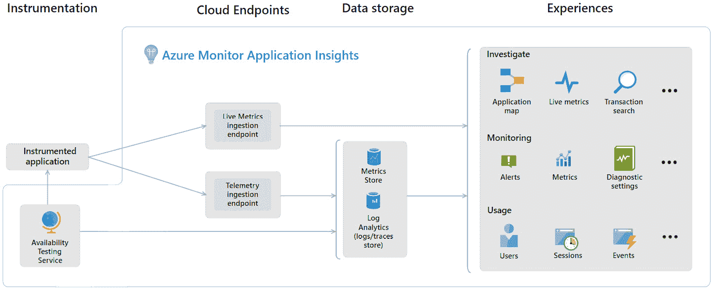

图 8.1 – Azure 应用洞察概述

在此阶段实施安全性涉及扩展数据收集，包含安全日志和指标。 这些日志和指标可以分析以检测未经授权的访问尝试、潜在的安全漏洞和弱点。 这一过程可能很复杂，因为在像 Azure 这样的云平台上运行的现代云原生应用 通常使用托管服务（例如 App Service、Function Apps、Container Instances 和 Container Apps）。 这些 服务可能对安全团队的操作有所限制。 传统方法，如基于代理的运行时监控，往往在这些环境中无效。 另一个挑战是这些应用的分布式特性，这可能使安全团队不确定从哪里开始进行 安全防护。

## 理解 Azure 和云原生应用的相互关联风险

现代云原生应用是分布式和复杂的，涉及多个技术 堆栈、微服务和外部 API 交互。 在云原生 环境中，通过 CI/CD 管道的代码会作为容器交付运行（尽管一些组织仍然直接在主机上运行代码）。 该容器在节点内部运行，由集群协调器管理，例如 Kubernetes、Service Fabric 或 OpenShift，或由平台服务管理，如 Azure Web Apps、Azure 容器实例或 Azure Functions。 所有这些都运行在 Azure 云平台上（*图 8**.2*）。

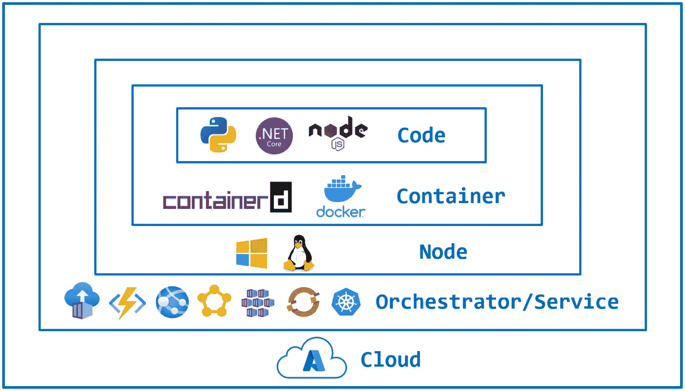

图 8.2 – 云原生应用的风险交集

保护现代云原生应用程序的复杂性在于，每个部分的安全模型都不同。 例如，容器编排工具如 Kubernetes 和 OpenShift 的安全模型与云服务 （如函数应用和容器应用）的安全模型不同，而后者又与 Windows 和 Linux 节点的安全模型不同。 云的规模和快速发展的步伐使这一复杂性进一步加剧。 Azure 中的运行时云原生应用安全必须考虑其互联性，从而形成一个 **风险交集** **。**

恶意 用户通过在运行中的容器中获取 shell 访问权限，可能会窃取源代码、密钥、令牌和凭证，进而可能危及云平台中的其他服务。 他们还可能利用容器权限来破坏集群节点并访问其他工作负载。 相反，弱云凭证可能被用来破坏注册表中的容器并访问源代码、加密密钥及用于 工作负载的敏感数据。

为了减轻这些风险，我们的安全工作必须集中在两个关键方面——保护运行时环境和在运行时实现应用安全。 让我们详细探讨这两个方面，从 第一个方面开始。

# 保护应用程序运行时环境

尽管我们尽最大努力在早期解决安全问题，但在 软件生产中，无法预见的漏洞可能会出现。 此外，现代应用程序的复杂性意味着一些风险可能只在 实际运行时才会显现。

如果我们 采纳 **零信任** 的思维方式（而我们应该采纳），我们需要接受没有任何系统或过程是完美安全的，并为可能的安全漏洞做好准备。 这被称为“假设入侵”心态。 这也是为什么 DevSecOps 不仅仅停留在部署阶段。 运行时安全应作为最后一道防线整合进来，以便在实时应用程序中发生安全问题时进行管理、识别、保护、检测和响应，并从中恢复。 这一整合的首要点是实施运行时门控和保护措施，以防止在早期检查点被绕过的情况下部署最关键的风险。 。

## 实施运行时安全门控以阻止关键风险

安全 门在 DevSecOps 中起着重要作用。 它们防止了最严重的 软件风险被部署到我们的生产云环境中。 在 *第七章*中，我们介绍了如何在发布流水线中设置安全门（流水线安全门）。 然而，也可以在运行时实现安全门（运行时安全门），但它们有一定的局限性。 与流水线安全门相比，运行时安全门适用的场景较少。 以下是在 Azure 中运行时安全门可能有效的一些例子：

+   **Azure 策略**：在 Azure 云平台上创建资源时

+   **Kubernetes 入驻控制器**：在将容器化解决方案/应用程序部署到 Kubernetes 集群（自管理或托管） 时

+   **反恶意软件**：当将打包应用程序部署到安装了反恶意软件/反漏洞解决方案的 Azure 虚拟机时 解决方案已安装

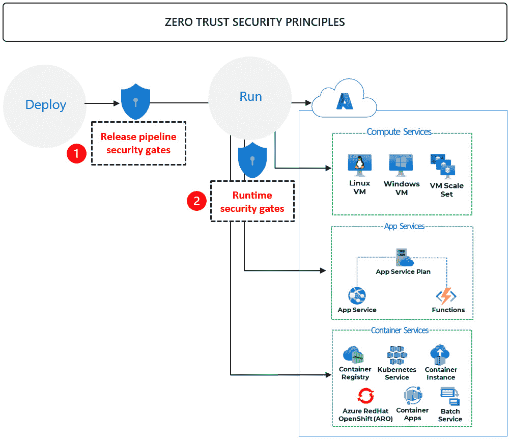

图 8.3 – 流水线安全门与运行时安全门

对于 其他 Azure 服务，运行时安全门不原生支持，除非我们部署第三方 安全解决方案或创建自己的自定义方法。 例如，当将 Web 应用程序部署到 Azure App Service，将微服务部署到 Azure Functions 应用，或将容器化服务部署到 Azure 容器实例时，发布流水线安全门是我们防御关键风险部署的主要防线。 所有这些操作都在 Azure 云平台上运行（*图 8**.3*）。

## 使用 Azure 策略实现运行时安全门

Azure 策略是 Azure 中的一项配置评估和执行服务。 它可用于 在 API 请求被 Azure 管理平面处理之前审查它们。 它还可以 审查在 Azure 中创建的资源的设置。 对于我们的用例作为运行时安全门，它可以用于执行以下操作：

+   如果新的 Azure 资源违反我们的 安全策略，请阻止其被创建

+   如果现有资源违反我们的 安全策略，请阻止其更改

备注

我们的目标不是重复介绍 Azure Policy 或 Microsoft Defender for Cloud 的基础知识。 相反，我们将重点讨论与我们讨论内容相关的具体用例。 如果你想了解更多关于这些服务的信息，可以查看这本书 *《Microsoft Azure 安全技术认证与实践》* ，由 Packt Publishing 出版。

我们可以在 Azure 层级的不同级别上应用政策——管理组、订阅和资源组。 为了简化政策的分配，Azure 允许你将政策分组为 **倡议**。倡议只是一个可以作为一个整体分配的政策组。 微软提供了一个内置的倡议，叫做 **微软云安全基准** (*图 8**.4*)，包含了 241 个与安全相关的政策（截至撰写时）。 该倡议中的大部分政策都设置为 **审计** 效果，这意味着它们会观察并报告违规行为，但不会 阻止操作。

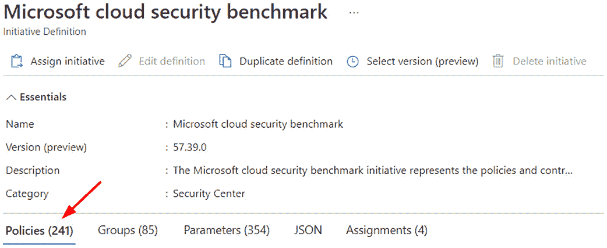

图 8.4 – 微软云安全 Azure Policy 倡议

首先 回顾此倡议中的政策。 识别出那些带来最大 风险的政策。 然后，评估 通过将这些政策设置为 **拒绝** 效果来防止这些风险的影响。 将政策更改为 **拒绝** 意味着它将阻止不符合要求的操作，而不仅仅是 报告这些操作。

## 使用 Kubernetes 入驻控制器实施运行时安全门控

Admission 控制器是一个 Kubernetes 组件，拦截 对 Kubernetes API 服务器的请求， 在它们被处理之前进行干预。 它通常 用于执行安全性和合规性检查。 为了简化实施 Admission 控制器，CNCF 提供了 **Open Policy Agent** （**OPA**），一个开源策略引擎。 OPA 使用 Rego 语言来定义规则，从简单的检查（例如确保所有容器都有资源限制）到复杂的多步骤评估。 OPA Gatekeeper 库提供了常见场景的示例模板，例如强制执行容器镜像来源、限制特权容器以及确保正确的标签。 这些模板可以在 OPA 网站上查看 ，网址如下： [https://open-policy-agent.github.io/gatekeeper-library/website](https://open-policy-agent.github.io/gatekeeper-library/website)。

Azure Policy 与 OPA 集成，以管理和执行 **Azure Kubernetes Service** （**AKS**）集群中的策略。 这种集成使得在 Azure 层面定义的策略能够在 Kubernetes 环境中强制执行，提供了一种在 Azure 和 Kubernetes 中跨平台管理策略的统一方式。 要使用此功能，我们需要在 Kubernetes 集群中部署 Azure Policy 插件。 可以在订阅级别或单个集群上执行此操作。 要在订阅级别启用它，我们可以将 **Azure Kubernetes Service 集群应安装 Azure Policy 插件** Azure Policy 推荐分配给我们的订阅或管理组。 最好在更广泛的层级应用治理 策略，例如管理组或订阅，以确保新集群会自动安装该插件。

截至本文写作时，已经有 79 个内置的 Kubernetes 相关策略，涵盖了 如安全性、身份验证和访问控制、资源管理、配置管理、合规性和治理等领域。 例如， `^[^/]+.azurecr.io/.+$` 确保只有来自 Azure 容器注册表（`.azurecr.io/`）的镜像可以部署到受覆盖的 Kubernetes 集群中。

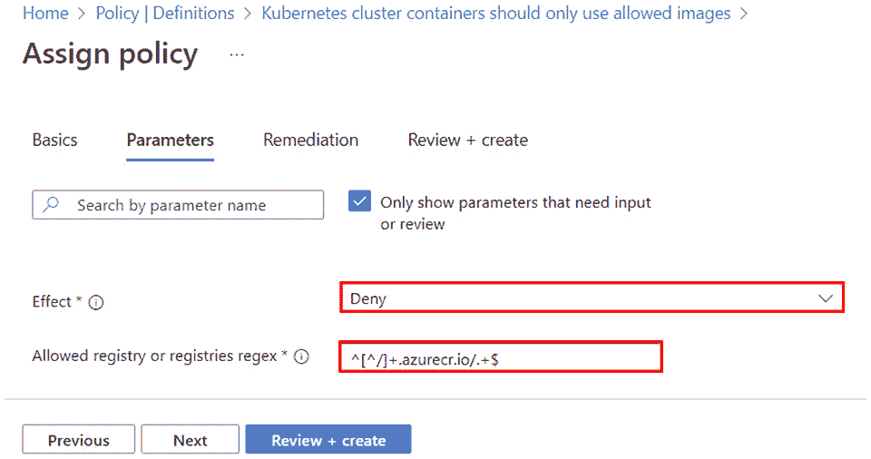

图 8.5 – 为限制集群中允许的容器注册表或镜像分配 Azure 策略

对于 我们分配的每个策略，我们可以指定排除的命名空间、镜像和容器。 建议与具有详细 应用程序和 Kubernetes 操作知识的开发和 DevOps 团队合作，以确保 适当的排除。

注意

具有 **拒绝** 效果的策略不会追溯影响已部署的容器或资源。 现有的容器将继续运行，直到它们被重启、更新 或替换。

除了前述策略之外，以下是建议至少考虑实施的四个额外策略：

+   *策略*: **Kubernetes 集群中的 Pod FlexVolume 卷应该仅使用** **允许的驱动程序**。

    *背景*: 在 Kubernetes 中，FlexVolume 是一种插件机制，允许用户使用不同的存储驱动程序为他们的 Pod 添加存储。 这些驱动程序负责 将 Pod 连接到存储后端。 然而，如果 使用不受信任或恶意的驱动程序，可能会带来安全 风险。 例如，恶意驱动程序可能允许攻击者未经授权访问敏感数据，或者利用 系统资源。

    *该策略的作用*: 如果分配了 **拒绝** 效果，任何使用未经批准的 FlexVolume 驱动程序的应用程序 Pod 部署将被阻止 部署。

+   *策略*: `/proc` 文件系统为内核提供了一种机制，使其能够向用户空间暴露关于系统和正在运行的进程的信息。 它不是包含“真实”文件， `/proc` 包含的是运行时系统信息（例如，系统内存、已挂载设备和硬件配置）以及关于系统上每个进程的详细信息。 暴露过多的信息或允许不受限制的访问可能会导致信息泄露并为恶意用户提供潜在的利用机会。 例如，恶意进程可能会更改内核参数以破坏系统稳定性或削弱其 安全性。

    `在 Kubernetes 中，在` `SecurityContext` `定义中，我们可以使用` `ProcMount` `类型来指定` `/proc` `文件系统如何在应用容器中挂载（参见以下示例）。` `有三种主要的 ProcMount` `类型 -` `Unmasked` `选项风险最大，因为它提供了对` `/proc` `文件系统的完全访问权限，允许容器查看并操作所有进程信息。` `这可能被利用来暴露敏感信息` `和系统细节，并且在最坏的情况下，操纵` `内核参数：`

    ```
     apiVersion: v1
    kind: Pod
    metadata:
      name: unmasked-procmount
    spec:
      containers:
      - name: mycontainer
        image: myimage
        securityContext:
          procMount: Unmasked
    ```

    `The` `/proc` `文件系统` `包含了关于系统上运行的进程的各种信息。` `如果容器使用不当的` `ProcMount` `类型，可能会将敏感信息或系统细节暴露给未经授权的用户。` `例如，一个` `ProcMount` `类型，允许对` `/proc` `的完全访问，可能导致信息泄漏和潜在的` `安全漏洞。`

    *`策略的作用`* `: 该策略确保容器只能使用指定的 ProcMount 类型，例如` `Default` `ProcMount 类型，该类型限制了访问。` `如果容器尝试使用未经批准的 ProcMount 类型，例如` `Unmasked` `(如前面示例所示)，则部署将` `被阻止。`

+   *`策略`* `:` `runAsUser` `和` `runAsGroup` `字段确保容器以特定的批准用户和组 ID 运行（参见以下示例）。` `这种做法限制了攻击者如果获得容器访问权限时可能造成的潜在损害。` `例如，使用非 root UID 和 GID 运行容器可以降低特权提升的风险，并保护敏感` `系统资源：`

    ```
     apiVersion: v1
    kind: Pod
    metadata:
      name: non-root-pod
    spec:
      containers:
      - name: mycontainer
        image: myimage
        securityContext:
          runAsUser: 1000
          runAsGroup: 3000
    ```

    *该策略的作用*：此策略确保 Kubernetes 中的 Pod 和容器只能使用 批准的用户和组 ID。 它强制使用非 root UID 和 GID，例如 `1000` 和 `3000`，分别在前面的示例中体现。 如果容器尝试使用未批准的 UID 或 GID，部署将 被阻止。

+   *策略*： `CAP_SYS_ADMIN` 权限对系统具有广泛的控制，包括修改系统配置和 挂载文件系统的能力。

    在 Kubernetes 中， `securityContext` 定义允许你指定容器可以添加或移除的权限（参见以下示例）。 主要有两个操作—— `添加` 和 `移除`。向容器添加权限会增加其特权，这可能被恶意进程利用来危害系统。 相反，移除权限通过限制 容器的特权来减少攻击面：

    ```
     apiVersion: v1
    kind: Pod
    metadata:
      name: restricted-capabilities
    spec:
      containers:
      - name: mycontainer
        image: myimage
        securityContext:
          capabilities:
            drop: [«ALL»]
            add: [«NET_BIND_SERVICE»]
    ```

    在 前面的示例中，所有权限都被移除，且 仅添加了 `NET_BIND_SERVICE` 权限，允许容器绑定到特权端口（即 低于 `1024`的端口）。

    授予不必要的权限可能会导致重大的安全风险。 例如，具有 `CAP_NET_ADMIN` 权限的容器可以操控网络配置，可能会破坏网络流量或窃取敏感数据。 通过控制可以使用的权限，我们可以减轻特权提升和 系统受损的风险。

    *该策略的作用*：此策略确保容器只能使用指定的权限，从而防止使用危险或不必要的特权。 如果容器尝试添加未批准的权限，部署将 被阻止。

我们强烈 建议您查看 79 个内置策略，识别出对贵组织构成最严重风险的策略，并以 **拒绝** 效果实施它们。 如果内置策略无法覆盖您的使用场景，还可以创建自定义策略。 现在我们已经了解了 如何实施运行时安全门控，让我们来回顾一下如何实施对我们 运行时环境的持续安全监控。

## 实施针对运行时环境的持续安全监控

现代 云运行时环境不是静态的；一个简单的 API 调用可能会引入配置错误，导致运行关键应用的资源暴露 并且易受攻击。 为了保护这些资源，必须持续监控运行时资源配置的可见性 并且不依赖代理。 **云安全态势管理** (**CSPM**) 是业内用于描述帮助组织持续监控云资源配置的工具的术语，以检测可能带来 安全风险的变化。

然而，挑战比仅仅识别配置错误更为复杂。 并非所有暴露的资源都是配置错误或易受攻击的。 有效的安全性需要提供上下文，以优先考虑风险，识别可能创建攻击路径的有害组合，并理解更广泛的安全态势。 第一代 CSPM 解决方案主要集中在可见性和配置评估上，这常常导致噪音过大，却没有解决现代云安全的复杂性。 更新的 CSPM 解决方案旨在解决更复杂的挑战，如优先排序、攻击路径检测和上下文 风险评估。

在 Azure 云中实现运行时环境持续安全可见性和监控的核心 是微软的 **云原生应用保护平台** (**CNAPP**) 解决方案 – **Microsoft Defender for** **Cloud** (**MDC**)。

注意

CNAPP 是 一种旨在保护云原生应用程序整个生命周期的安全解决方案。 它将多个安全功能集成到一个平台中，防止工具过载。 CNAPP 的主要使用场景是为云原生应用程序提供安全功能，从开发到部署到云中运行（也称为 *代码到云*）。

MDC 目前提供 10 种保护计划，客户可以根据自己的 安全需求和预算来启用（*图 8**.6*）。

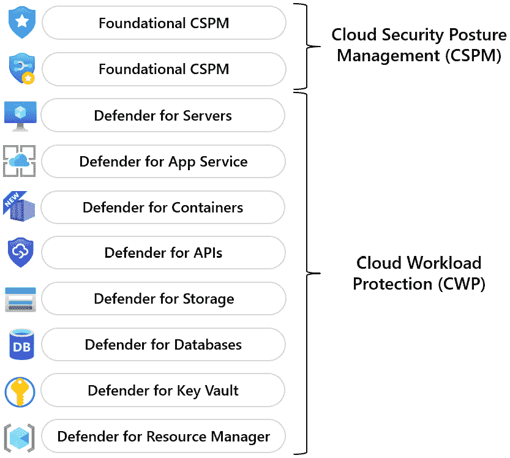

图 8.6 – MDC 计划

对于运行环境的持续安全监控，MDC 的 Defender CSPM 计划是一个很好的解决方案，能够应对以下 新挑战：

+   **攻击路径管理**：单个云资源的配置错误是有风险的，但 相关联的多个配置错误组合可能会创建出关键的攻击路径，从而使整个应用程序面临风险。 MDC 的攻击路径管理功能通过分析我们的云 资源，识别攻击者可能利用的配置错误链条来应对此问题。 例如，MDC 可能会检测到一个数据库的明文凭证，该数据库运行在提供公共 Web 服务的虚拟机上。 这为攻击者提供了一个路径，能够访问关键数据库中的敏感数据。 通过突出显示这些互相关联的风险，MDC 使安全团队能够优先修复能够破坏整个攻击路径的问题，而不仅仅是解决 孤立的配置错误。

+   **风险优先级排序**：安全团队在启用 CSPM 解决方案后，通常会面临大量的警报 和建议。 如果没有适当的优先级排序，他们可能会在对少数业务效益不大的小问题上浪费时间，同时忽略关键漏洞。 MDC 的风险优先级排序通过根据建议的潜在影响及其被利用的可能性来排序，帮助解决这一问题。 MDC 使用上下文感知的风险优先级排序引擎来确定每个安全建议的风险等级。 该风险等级取决于资源配置、网络连接和安全态势等因素。 例如，暴露的存储帐户如果存储有敏感数据，其优先级将高于存储有 普通数据的存储帐户。

+   **基础设施即代码 (IaC) 模板映射**：安全配置错误 通常起源于 IaC 模板。 如果不解决 根源问题，这些问题可能会在重新部署后再次出现。 MDC 的 IaC 模板映射通过将云资源与其原始 IaC 模板关联来解决这一问题。 当 MDC 检测到已部署资源中的安全问题时，它会识别相应的 IaC 模板，从而让开发人员修复根本原因。 例如，如果 MDC 发现一个过于宽松的网络安全组，它可以指向 Terraform 模板中需要更新的确切行，防止该问题在未来的 部署中再次发生。 它依赖 于流行的开源 IaC 模板扫描工具 Checkov 的能力 来实现这一点。

+   **数据安全态势管理**：有效的风险管理要求你 不仅要了解漏洞的存在位置，还要了解风险数据的敏感性。 MDC 的数据安全 态势管理功能通过扫描和分类云环境中的数据来解决这一问题。 然后，它将这些信息与安全评估集成，提供更全面的风险视图。 例如，如果 MDC 检测到两个配置错误的数据库，其中一个包含客户财务数据，而另一个包含非敏感的营销材料，它会优先关注财务数据库进行处理。 这种情境感知的方法确保安全团队将工作重点放在优先保护最关键数据上，从而显著改善整体 安全态势。

MDC 具有 比这些更多的功能，包括最近新增的功能，如 **AI 安全态势管理 (AI-SPM)**。要了解 更多关于这些功能的信息，请参阅以下文档： [https://learn.microsoft.com/en-us/azure/defender-for-cloud/defender-for-cloud-introduction](https://learn.microsoft.com/en-us/azure/defender-for-cloud/defender-for-cloud-introduction)。稍后，在本章的动手操作中，你将实施 MDC 的 Defender CSPM 计划 。

# 在 Azure 中保护应用程序运行时

确保 应用程序在部署到 Azure 服务后仍然安全，与传统的本地运行时安全不同。 云服务引入了新的挑战，需要转变策略，采用一种与 DevOps 实践相辅相成的方式。

在 Azure 的共享责任模型中，微软负责保护底层基础设施，但开发人员和运维团队必须保护应用程序和数据。 这要求 理解 Azure 的安全功能，并将其与应用层保护措施集成。 在本节中，我们将探讨在 Azure 中保护运行时应用程序的挑战，并讨论如何使用 Azure 原生工具作为 起点。

## 现代云环境中运行时保护的挑战 

Azure 云环境提供了多种计算选项，用于托管应用程序和服务，从传统的虚拟机到无服务器计算功能。 *图 8**.7* 展示了这一范围 以及客户在这些选项之间的控制差异。 例如，虚拟机提供完全的操作系统控制，而 Azure Functions 提供最小的操作系统交互。 这种多样性使得持续的安全性 措施变得具有挑战性。

一个主要的挑战是支持组织中使用的各种应用程序和服务运行时选项。 当前的解决方案可能能够通过安装的代理来保护虚拟机上的应用程序，但容器中的服务怎么办？ 它可能能够保护在 Azure App Service 上运行的 Linux 容器中的应用程序，但它是否支持 Windows 容器？ 您的解决方案不需要覆盖所有使用场景，但您需要确保在运行时保护您的关键资产 。

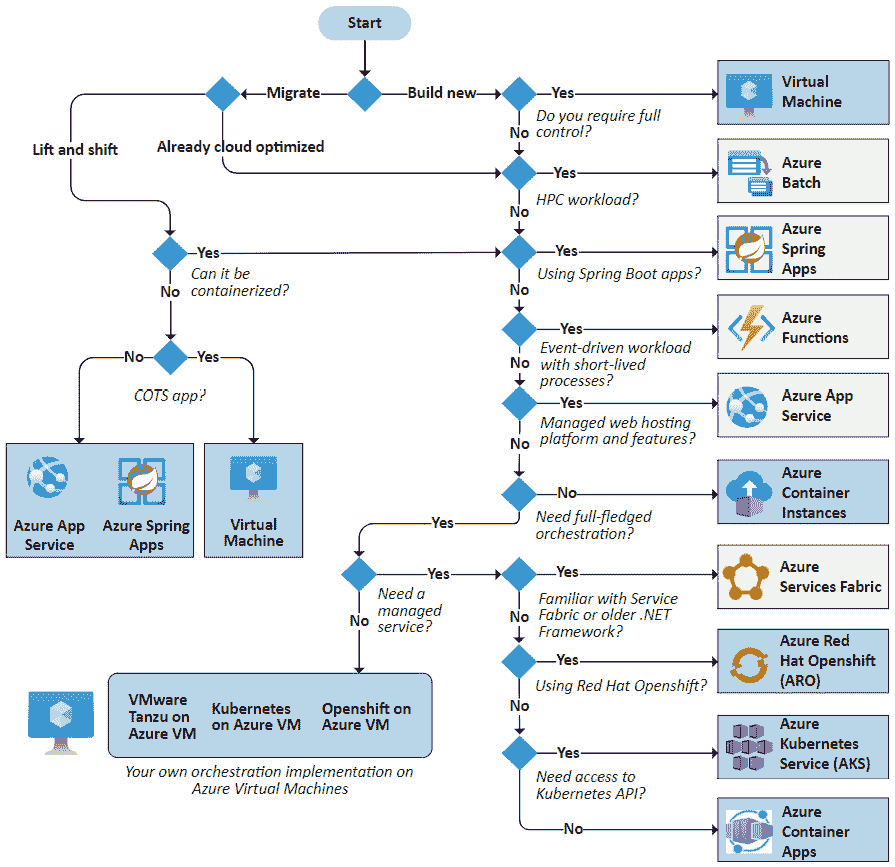

图 8.7 – Azure 计算选项

随着更多 组织将其应用程序从虚拟机迁移到容器服务和无服务器计算，必须调整其应用程序运行时保护策略，原因在于这些环境的运作方式差异以及它们所带来的独特挑战。 以下是一些需要考虑的额外挑战 ：

+   **有限的操作系统访问权限**：大多数 Azure 计算服务（虚拟机除外）将底层操作系统从客户面前抽象化。 这使得安装依赖于操作系统级代理的传统安全解决方案变得困难。 这些基于代理的安全解决方案在虚拟机上的应用程序中工作良好，但可能不支持容器化应用程序或无服务器功能。 能够保护在这些环境中运行的应用程序的有效安全解决方案必须能够做到这一点，而不需要 持久化代理。

+   **自动扩展挑战**：某些计算服务可以根据需求自动添加新的实例来处理请求。 如 App Service、Function Apps、Container Apps 和 Kubernetes Services 等服务可以自动添加数百个实例，有时在几分钟内就能处理请求。 当负载消失时，这些实例会被终止，以节省成本。 有效的安全解决方案必须能够保护在这种环境中运行的应用程序，并能够处理快速扩展，具备几乎即时启动和 停止的能力。

+   **容器化复杂性**：容器因其可移植性和高效性而广受欢迎，但它们也带来了独特的安全挑战。 安全解决方案必须具备容器感知能力，以保护主机和各个容器。 许多传统安全供应商才刚开始将容器感知能力添加到他们的解决方案中。 这些解决方案正在逐步发展。

+   **无服务器挑战**：无服务器计算，如 Azure Functions，改变了应用程序的运行方式，从而也改变了我们如何保护它们。 例如，一家金融服务公司可能在 Azure 容器实例上运行其实时欺诈检测微服务。 这些容器可能在毫秒级别内启动以处理事务，然后终止。 假设有长期运行的服务器的传统安全模型在这种环境下面临困难。 这个环境下的安全挑战很大。

这些挑战凸显了为现代云架构设计的新型安全工具的需求。 随着越来越多的公司采用这些技术，安全行业正快速发展，以应对这些 独特的安全问题。

## 保护运行在 Azure App Service 中的应用程序

Azure App Service 是一种托管服务，用于在 Azure 云中托管 Web 应用程序、API 和移动后端服务。 通过使用 CI/CD 管道，开发人员可以将 Web 或 API 服务作为代码或容器直接部署到服务中。 *图 8**.8* 展示了在 GitHub Actions（标记为 **1**）和 Azure Pipelines（标记为 **2**）中实现 Azure App Service 部署操作/任务的示例。

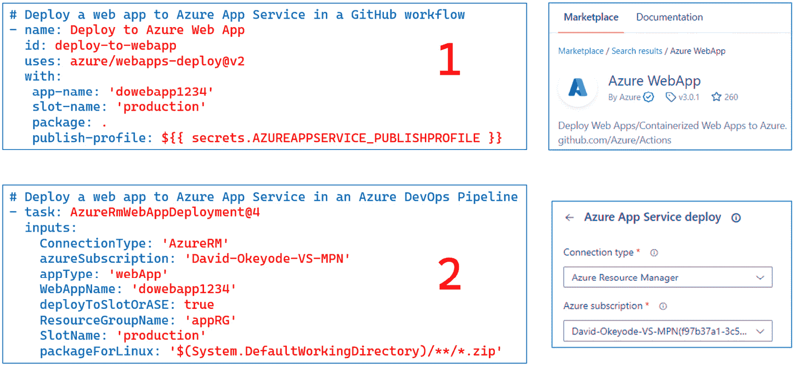

图 8.8 – GitHub Actions 和 Azure Pipelines 中的 Azure App Service 部署任务

对于 在 Azure App Service 部署的 Web 和 API 应用程序的运行时保护，实施 **Defender for App Service** 的 MDC 计划是一个很好的起点。 该计划提供运行时威胁检测功能，主要通过行为分析技术来实现，涵盖以下五个类别，详见 *表 8.1*。

| **MITRE 威胁** **ATT&CK 战术** | **描述** |
| --- | --- |
| **攻击前** **威胁检测** | 检测扫描程序扫描我们运行中的应用程序以寻找已知漏洞 – 例如，使用 Nmap、BlindElephant、WPScan、Joomla Scanner 和 Drupal Scanner 等工具进行 Web 指纹识别的尝试。 |

| **初始访问** **威胁检测** | 检测来自已知恶意 IP 地址或可疑端点的恶意网络连接尝试，例如： 例如：

+   已知恶意 IP 地址连接到我们的 App Service的 FTP 端点。

+   应用服务解析已知恶意 DNS 主机名。

+   从不寻常的 IP 地址或 用户代理连接到托管在 App Service 中的敏感网页。

Defender for App Service 通过分析 各种服务日志，例如 DNS 和 FTP 日志，并将其与 Microsoft 威胁情报源中的已知恶意 IP 地址和域名进行比较，从而检测这些尝试。 。 |

| **攻击执行** **威胁检测** | 检测攻击者利用漏洞获得访问权限后，在我们应用服务的虚拟机实例上执行恶意或可疑命令和进程的尝试。 这通过分析运行中的进程、文件系统和内存行为来完成。 这可以检测到如下事件： 例如：

+   可疑的远程文件下载 – 例如，使用 `curl` 从像 Pastebin 这样的站点下载代码并保存到磁盘。 。

+   下载可疑文件，如加密矿工可执行文件或 Web Shell。

+   可疑进程或命令的执行——例如，挖矿程序、反向 Shell 工具、凭证访问工具、已知攻击者工具名称的进程、恶意 PowerShell PowerSploit cmdlets、尝试利用 PHP 进程执行操作系统命令，以及从异常路径执行的 `SVCHOST` 进程（恶意软件通常利用 `SVCHOST` 来隐藏 恶意活动）。

+   滥用内置管理员工具，如 `certutil.exe` 来解码可执行文件或下载二进制文件，而不是其通常用于管理证书的功能。 攻击者通常滥用合法的管理员工具以达到 恶意目的。

+   执行 各种无文件攻击技术 和工具包。

+   在 `/upload` 文件夹中发现一个 PHP 文件。 该文件夹通常不包含 PHP 文件，这表明可能存在利用任意文件 上传漏洞的攻击。

+   主机/设备数据分析，检测可能的外部数据 流出情况。

|

| **悬挂** **DNS 检测** | 当应用服务网站已退役但其自定义域名（DNS 记录） 未被删除时，发出警报。 |
| --- | --- |

| **后渗透检测** | 检测我们托管的应用程序是否在实际攻击中被发现，如 以下内容：

+   我们的应用 URL 曾被用于针对 Microsoft 365 客户的钓鱼攻击，该攻击已被 Microsoft 威胁 情报团队识别。

+   由于 Microsoft 威胁 情报团队的监测，我们的 Web 应用 URL 被 Windows SmartScreen 标记为恶意。

|

表 8.1 – 应用服务计划的威胁检测类别

尽管应用服务的 Defender 是一个很好的起点，但它也有其局限性。 例如，它侧重于检测威胁，而不是阻止威胁。 部分原因在于 它分析日志而不是使用代理。 当安全解决方案仅检测威胁而不阻止它们时，响应时间会增加。 检测威胁与人工干预之间的延迟使威胁有更多时间造成损害，可能导致数据泄露或系统被攻陷。 这还增加了安全团队的工作量，因为他们需要调查和响应 每个检测到的事件。

另一个 App Service 的 Defender 限制是，它无法识别我们应用程序在运行时已知的漏洞。 这种能力至关重要。 手动追踪哪些正在运行的应用程序受到下一个重大漏洞（如 Log4j）影响并不是最优选择。 为了解决这些问题，我们可以使用定制的开源工具或第三方安全解决方案。 例如，一些第三方解决方案可以作为 RASP 代理与我们的应用程序一起运行，以提供额外的功能，如阻止主动威胁和识别运行中的应用程序中已知的漏洞。 在运行的应用程序中。 您需要解决的挑战是如何大规模地推广这一解决方案。

什么是 RASP？

**运行时应用程序安全保护** (**RASP**) 是一种在应用程序内部运行的安全技术，用于实时检测和防止攻击。 它监控应用程序在运行时的行为，并能对潜在威胁采取即时行动。 RASP 提供了在生产环境中的持续保护，补充了其他部署前的安全措施，如 SAST 和 DAST。 根据安全供应商的实现，RASP 有时可能比较复杂，且可能存在性能影响方面的担忧。

Azure App Service 提供了更简单的方式，通过扩展来推出诸如 Tinfoil Security（现已成为 Synopsys 的一部分）和 Signal Sciences WAF（现已成为 Fastly 的一部分）等安全解决方案。 您可以通过以下步骤进行安装：前往您的 App Service 实例 → **开发工具** → **扩展** → **添加** (*图 8.9**.)

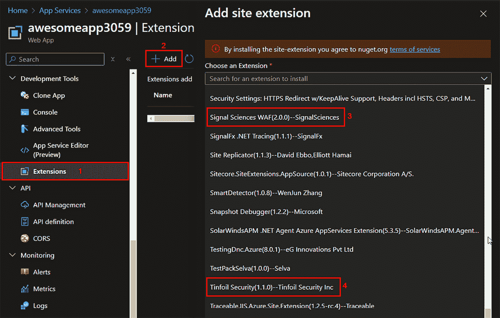

图 8.9 – 向 Azure App Service 添加一些安全扩展

Tinfoil Security 提供漏洞管理功能，而 Signal Sciences WAF 提供针对 Web 应用程序攻击的威胁预防和检测。

## 保护 Azure 中的无服务器工作负载在运行时的安全性

无服务器 工作负载，如 Azure Functions，以及运行在 **容器即服务（CaaS）** 资源上的容器化 应用程序，例如 **Azure 容器应用** (**ACA**)，由于其短暂的特性，面临独特的运行时安全挑战。 例如，Azure Functions 的消费计划没有预留实例；相反，实例会根据请求按需动态分配。 对于 HTTP 触发的函数，Azure 的规模控制器每秒可以分配一个实例，并且实例在处理完成后会被移除。 这种瞬态特性使得传统的安全措施效果较差，因此需要专门的安全方法来保护 无服务器环境。

目前，Azure 没有为无服务器工作负载提供专门的运行时漏洞评估、威胁检测和防护的原生解决方案。 然而，第三方 安全供应商通过提供类似 RASP 的解决方案填补了这些空白。 这些解决方案允许组织将安全直接嵌入到其无服务器函数代码或容器中。 这样，运行时安全跟随应用程序，无论它被部署到哪个环境。 这种方法通常需要代码更改或定制化的容器 构建过程。

例如，Palo Alto Networks 的 Prisma Cloud 提供了 Serverless Defender，可以嵌入到函数代码中，以便在运行时监控和保护该函数。 以下代码示例展示了如何将 Serverless Defender 库添加到 C# 函数代码中，创建一个新的受保护处理程序，该处理程序包装了原始处理程序。 当函数在云端运行时被调用时，受保护的处理程序会被调用，进而调用函数代码。 受保护的处理程序将提供运行时漏洞评估、威胁检测以及 威胁防护等功能：

```
 using Twistlock;
public class Function
{
    // Original handler
    public static async Task<IActionResult> Run(
        [HttpTrigger(AuthorizationLevel.Function, "get", "post", Route = null)] HttpRequest req,
        ILogger log, ExecutionContext context)
    {
        Twistlock.Serverless.Init(log, context);
        // Function logic
    }
}
```

对于 无服务器容器化工作负载，工作流可以自动化，使得运行时安全处理程序可以直接嵌入容器镜像中，从而建立控制点。 为了让这一过程更容易被采用，一些服务提供商可能会提供将 此过程自动化 **持续部署** (**CD**)流水线的能力。 *图 8**.10* 展示了一个在 Azure DevOps 流水线中自动化此类安全嵌入的 Palo Alto Prisma Cloud 任务示例。

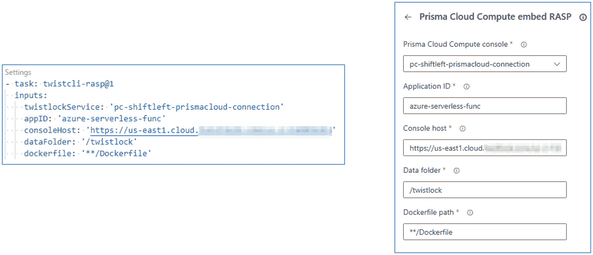

图 8.10 – Prisma Cloud Serverless Defender 嵌入任务示例

任务将接受一个用于容器化应用程序的 Dockerfile 输入 并重新构建它，将 Prisma Cloud 的运行时安全性嵌入容器镜像中。 当容器启动时，Prisma Cloud 应用内嵌的 Defender 会作为父进程在容器中启动，并立即调用程序作为 它的子进程。

## 保护 Azure 中的容器工作负载

Azure 云提供 多种服务来运行容器化应用程序 和服务。 其中一些是容器专用的，意味着 它们仅运行 容器工作负载：

+   **Azure 容器** **实例** (**ACI**)

+   **Azure 容器** **应用** (**ACA**)

+   **Azure Kubernetes** **服务** (**AKS**)

+   **Azure Red Hat** **OpenShift** (**ARO)**

其他 是兼容容器的，这意味着它们可以运行代码和 容器应用程序：

+   Azure 应用服务

+   Azure 函数

+   Azure 服务网格

+   Azure 批处理

+   Azure Spring 应用

开发人员可以通过 CI/CD 管道将容器化应用程序部署到这些服务中。 *图 8**.11* 展示了在 GitHub Actions（标记为 **1**）和 Azure Pipelines（标记为 **2**）中实现 Kubernetes 工作负载部署操作/任务的示例。

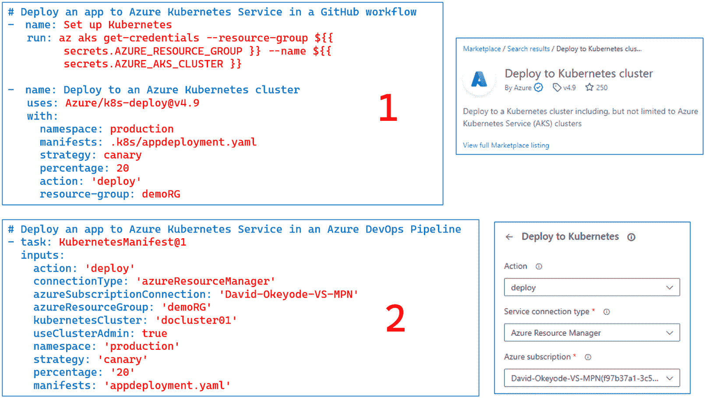

图 8.11 – GitHub Actions 和 Azure Pipelines 中的 Kubernetes 工作负载部署任务

对于 工作负载的漏洞管理和运行时保护，我们可以从实施 MDC 的容器防护计划开始。 该计划结合了无代理和基于代理的方法，以检测容器工作负载的漏洞和威胁。 然而，这些功能目前仅限于部署在 AKS 上的工作负载。 对于 Kubernetes 工作负载中的威胁检测，容器防护会收集并分析以下数据（*图 8**.12*）：

+   来自 API 服务器的审计日志和安全事件

+   来自 工作节点的安全信号和事件

+   来自 控制平面的集群配置信息

+   来自 Azure 策略的工作负载配置（我们在 本章中已讨论过这一点）

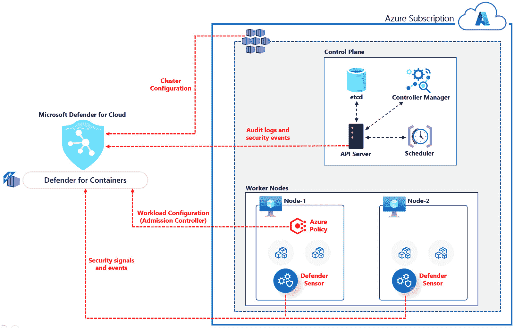

图 8.12 – 容器防护架构

*表 8.2* 详细描述了该计划的功能 ：

| **功能** | **描述** |
| --- | --- |
| **漏洞评估** | 对存储在 **Azure 容器注册表** (**ACR**) 中的镜像进行漏洞评估， 以及对 AKS 集群中运行的镜像进行评估。对于 ACR，评估可以通过无代理的方式进行。 对于 AKS 中运行的镜像，我们也可以通过配置 Kubernetes 的无代理发现来实现此功能，或者我们 也可以安装 **Defender** **传感器** 代理。此功能由 Microsoft Defender 漏洞管理解决方案提供支持。 它支持 Linux 和 Windows 容器（这很少见），并支持扫描特定语言的包，包括 Python、Node.js、.NET、Java、 和 Go。漏洞扫描每天至少运行一次，适用于过去 90 天内推送或过去 30 天内拉取的镜像。Defender for Containers 还支持保护 AWS 和 GCP 上的容器工作负载，但这超出了 本主题的范围。 |
| **运行时** **保护（Kubernetes 控制平面** **威胁检测）** | 基于 Kubernetes 审计 日志分析，检测 Kubernetes 中的可疑活动。 |
| **运行时保护（Kubernetes 工作负载** **威胁检测）** | 在集群、节点和 工作负载级别检测可疑活动。这需要部署 Defender 传感器代理。 这可以在订阅级别或单个集群级别启用。 |

表 8.2 – Defender for Containers 功能

如在 *表 8.2*中强调的那样，计划中的某些功能需要在 Kubernetes 集群上安装 Defender 传感器代理，而其他功能则不需要（这些称为无代理模式）。 例如，存储在 ACR 中的镜像的漏洞评估不需要传感器。 然而，要映射 AKS 集群中运行的容器的漏洞评估，我们 需要部署传感器或启用 Kubernetes 的无代理发现 功能。

备注

在 AKS 中对运行中的容器进行漏洞评估时传感器不会直接扫描运行中的容器。 相反，它们会收集 Kubernetes 集群中容器工作负载的清单。 然后，Defender for Containers 会将此清单与 ACR 中镜像的漏洞评估报告进行匹配。 因此，报告只会显示来自已扫描 ACR 的运行容器的漏洞。 如果运行的镜像来自未扫描的注册表，Defender for Containers 将无法显示其漏洞，从而可能产生一个安全漏洞，您需要 考虑此问题。

### 了解 Defender for Containers 的 Kubernetes 控制平面威胁检测能力

Defender for Containers 提供运行时威胁检测 覆盖两个主要领域 – 在警报中带有`K8S_`前缀，并详细列出在 *表 8.3*。

| **威胁检测类别 –** **暴露服务** |
| --- |
| 在 Kubernetes 中暴露的带信任身份验证配置的 Postgres 服务 检测到（`K8S_ExposedPostgresTrustAuth`） |
| Kubernetes 中暴露的 Postgres 服务，配置存在风险 检测到（`K8S_ExposedPostgresBroadIPRange`） |
| 暴露的 Kubeflow 仪表盘 检测到（`K8S_ExposedKubeflow`） |
| 暴露的 Kubernetes 仪表盘 检测到（`K8S_ExposedDashboard`） |
| 暴露的 Kubernetes 服务 检测到（`K8S_ExposedService`） |
| 在 AKS 中暴露的 Redis 服务 检测到（`K8S_ExposedRedis`） |
| **威胁检测类别 –** **异常活动** |
| 与 Kubernetes 关联的托管身份的 异常活动（预览）（`K8S_AbnormalMiActivity`） |
| 异常的 Kubernetes 服务账户操作 检测到（`K8S_ServiceAccountRareOperation`） |
| 来自代理 IP 地址的 K8S API 请求 检测到（`K8S_TI_Proxy`） |
| 向 Kubernetes API 发出的可疑请求（`K8S.NODE_KubernetesAPI`） |
| 对 Kubernetes 仪表盘的可疑请求（`K8S.NODE_KubernetesDashboard`） |
| 检测到 Kubernetes 渗透测试工具（`K8S_PenTestToolsKubeHunter`） |
| **威胁检测类别 – 特权提升** **和访问** |
| 检测到带有敏感卷挂载的容器（`K8S_SensitiveMount`） |
| 检测到新高 特权角色 （`K8S_HighPrivilegesRole`） |
| 检测到特权容器（`K8S_PrivilegedContainer`） |
| 检测到对 `cluster-admin` 角色的角色绑定（`K8S_ClusterAdminBinding`） |
| 检测到 创建了一个 Admission Webhooks 配置（`K8S_AdmissionController`） |
| **威胁检测类别 – 配置和** **资源修改** |
| Kubernetes 中的 CoreDNS 修改 检测到（`K8S_CoreDnsModification`） |
| 删除了 Kubernetes 事件（`K8S_DeleteEvents`） |
| 在 `kube-system` 命名空间 检测到新容器（`K8S_KubeSystemContainer`） |
| **威胁检测类别 –** **恶意活动** |
| 检测到数字货币挖掘容器（`K8S_MaliciousContainerImage`） |

表 8.3 – 容器防护（Kubernetes 控制平面威胁检测）

### 理解 Defender for Containers 的 Kubernetes 工作负载威胁检测能力

工作负载威胁检测使用在工作节点上的 Defender Sensor 代理收集安全 事件进行分析。 在撰写时，它可以检测 34 种威胁，范围包括对敏感数据的访问和可疑工具检测。 这些检测的警报前缀为 `K8S.NODE_` ，并列在 *表 8.4*中。

| **威胁检测类别 – 特权提升和** **高特权** |
| --- |
| 从容器中尝试创建新的 Linux 命名空间 检测到（`K8S.NODE_NamespaceCreation`） |
| 容器内部运行具有高 特权的命令（`K8S.NODE_PrivilegedExecutionInContainer`） |
| 在特权容器中运行 `模式（`K8S.NODE_PrivilegedContainerArtifacts`） |
| **威胁检测类别 - 异常行为和** **可疑活动** |
| 清除了历史文件 （`K8S.NODE_HistoryFileCleared`） |
| 检测到不常见的连接尝试 （`K8S.NODE_SuspectConnection`） |
| 尝试停止 `apt-daily-upgrade.timer` 服务 检测到（`K8S.NODE_TimerServiceDisabled`） |
| 检测到可疑使用 `nohup` 命令（`K8S.NODE_SuspectNohup`） |
| 检测到可疑使用 `useradd` 命令（`K8S.NODE_SuspectUserAddition`） |
| 检测到可疑文件下载 （`K8S.NODE_SuspectDownloadArtifacts`） |
| 从已知恶意来源下载文件 （`K8S.NODE_SuspectDownload`） |
| 检测到可疑文件时间戳 修改（`K8S.NODE_TimestampTampering`） |
| 检测到可疑下载后运行 活动（`K8S.NODE_DownloadAndRunCombo`） |
| 使用 `crypt-method` 可能的密码更改检测到（`K8S.NODE_SuspectPasswordChange`） |
| 潜在的端口转发到外部 IP 地址（`K8S.NODE_SuspectPortForwarding`） |
| 检测到潜在的反向 Shell （`K8S.NODE_ReverseShell`） |
| 检测到与安全相关的进程终止 （`K8S.NODE_SuspectProcessTermination`） |
| 向 Kubernetes API 发出可疑请求 （`K8S.NODE_KubernetesAPI`） |
| 检测到对 Kubernetes 仪表盘的可疑请求 （`K8S.NODE_KubernetesDashboard`） |
| 在 Kubernetes 节点上检测到 Docker 构建操作 （`K8S.NODE_ImageBuildOnNode`） |
| **威胁检测类别 – 恶意活动和** **已知威胁** |
| 检测到类似常见 Linux 机器人行为（预览）（`K8S.NODE_CommonBot`） |
| 检测到与数字货币挖掘相关的行为 （`K8S.NODE_DigitalCurrencyMining`） |
| 检测到与数字货币挖掘相关的进程 （`K8S.NODE_CryptoCoinMinerArtifacts`） |
| 检测到可能的加密货币矿工下载 （`K8S.NODE_CryptoCoinMinerDownload`） |
| 检测到可能的后门 （`K8S.NODE_LinuxBackdoorArtifact`） |
| 检测到可能的命令行利用尝试 （`K8S.NODE_ExploitAttempt`） |
| 检测到以异常方式访问 SSH 授权密钥文件的进程 （`K8S.NODE_SshKeyAccess`） |
| 检测到可能的日志篡改活动 （`K8S.NODE_SystemLogRemoval`） |
| **威胁检测类别 – 可疑** **工具检测** |
| 检测到一个可能的恶意 Web Shell （`K8S.NODE_Webshell`） |
| 检测到可能的攻击工具 （`K8S.NODE_KnownLinuxAttackTool`） |
| 检测到与 DDOS 工具包相关的指标 （`K8S.NODE_KnownLinuxDDoSToolkit`） |
| 检测到一个 MITRE Caldera 代理 （`K8S.NODE_MitreCalderaTools`） |
| 检测到一个 可能的凭证访问工具 （`K8S.NODE_KnownLinuxCredentialAccessTool`） |
| **威胁检测类别 – 访问** **敏感数据** |
| 检测到对 `kubelet kubeconfig` 文件的访问 （`K8S.NODE_KubeConfigAccess`） |
| 访问云元数据服务已检测到（`K8S.NODE_ImdsCall`） |

表 8.4 – Defender for Containers（Kubernetes 工作负载威胁检测）

### 在大规模实施 Defender for Containers 计划

实施 Defender for Containers 是一个两步过程。

首先，我们需要在 MDC 环境设置中启用计划，方法是转到**Microsoft Defender for Cloud** → **管理** → **环境设置** → 选择您的管理组或订阅 → **设置** → **Defender 计划** → **云工作负载保护（CWP）**，然后切换**容器**为**开启**（*图 8.13*）。

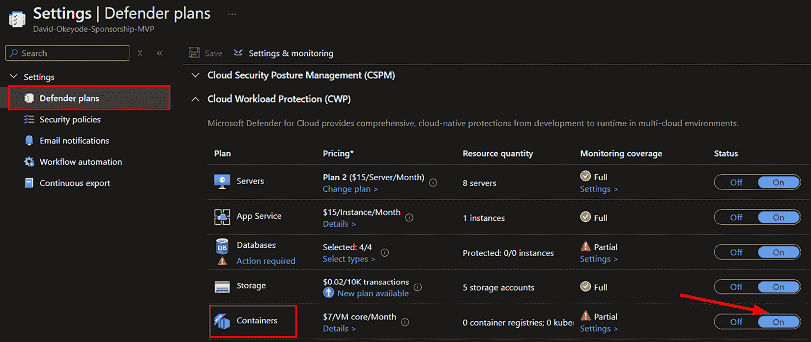

图 8.13 – 启用 Defender for Containers 计划

启用计划后，我们需要启用漏洞管理并将 Defender Sensor 代理部署到我们的 Kubernetes 集群中。可以在订阅或管理组级别启用，使用自动配置选项，或者为单个集群启用。 在订阅级别启用它可以让我们大规模强制实施保护——启用后，所有现有的和新的 AKS 集群将自动**受到保护**。

要配置无代理漏洞评估和自动配置，请按照以下步骤操作：

1.  转到**Microsoft Defender for Cloud**。

1.  导航到**管理** → **环境设置**。

1.  选择您的管理组或订阅。

1.  转到**设置** → **Defender 计划** → **云工作负载保护（CWP）** → **容器**。

1.  在**监控****覆盖**栏目下选择**设置**。

1.  设置**Azure 中的 Defender 传感器**为**开启**（*图 8.14*）。

1.  设置 **无代理容器漏洞评估** 为 **开启** (*图 8**.14*)。

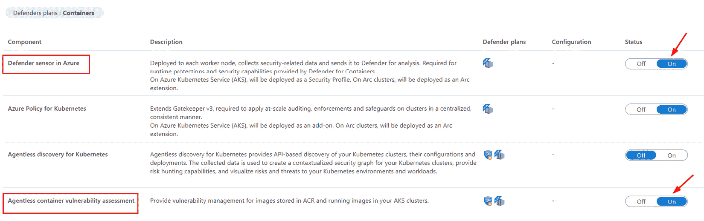

图 8.14 – 启用无代理漏洞管理和 Defender 传感器自动配置

启用 此功能将为 Azure 策略分配 **应启用 Azure Kubernetes Service 集群的 Defender 配置文件** 建议，并应用于 所选范围。

如前所述，实施此计划是一个很好的起点，但请牢记其局限性。 例如，该计划不涵盖其他 Azure 服务（如应用服务、容器实例、容器应用或函数应用）中运行的容器的漏洞管理或运行时安全性。 此外，针对 AKS 集群的漏洞评估不会针对运行时检测到的容器映像执行单独的扫描。 相反，它将已识别的运行时容器映像与从扫描的 Azure 容器注册表中获取的漏洞报告进行匹配。 如果您的团队从公共或其他未经扫描的注册表部署映像，则需要使用 其他方法解决这些问题。

容器的 Defender 的 Kubernetes 工作负载威胁检测能力主要集中于检测而不是阻止威胁。 它主要依赖于基于行为的技术，专注于监视系统活动并将其与已知攻击模式进行比较。 这种方法在识别已知的攻击指标方面非常有效，但面对新的和以前未见的攻击模式时可能无效，因为它严重依赖预定义的行为。 基于行为的技术如果基线不能准确反映 合法行为，也可能触发误报。

其他第三方安全解决方案提供商支持基于工作负载的基于 AI 的检测，有更好的机会检测不匹配任何已知模式的新和不断发展的威胁，提供了行为基础系统所缺乏的适应性水平。 例如，Palo Alto Network 的 Prisma Cloud 使用此技术来学习部署容器的预期行为，并自动警报或阻止任何超出 预期操作的行为。

另一个 需要考虑的限制是 Windows 容器工作负载。 在 34 项工作负载威胁检测中，仅有三项支持 Windows 节点。 如果您的组织有大量 Windows 容器，您需要使用 其他方法来解决运行时安全问题。

理论部分完成后，让我们进入 Azure 门户进行 一些实现。

# 动手练习 – 在 Azure 上进行持续安全监控

在本 练习中，我们将完成以下任务：

+   **任务 1** – 实现和 操作化 CSPM

+   **任务 2** – 实现和操作化持续容器 工作负载保护

## 任务 1 – 实现和操作化 CSPM

在本 任务中，我们将涵盖 MDC，其中一个主要支柱是 CSPM。 MDC 是一个 **云原生应用保护平台** (**CNAPP**)，它通过以下功能 从端到端保护您的云应用 ： 使用 以下能力：

+   **DevSecOps**：在代码层面统一多云和多管道环境中的安全管理。

+   **CSPM**：识别并共享云基础设施中的风险修复。

+   **云工作负载姿态平台 (CWPP)**：为服务器、容器、存储及 其他工作负载提供保护功能。

Defender for Cloud 提供以下 CSPM 服务：

+   **基础 CSPM**：对于已加入 Defender for Cloud 的订阅和帐户，默认启用此功能。 此 CSPM 功能是免费的。 包括安全建议、资产清单、安全评分、使用 Azure 工作簿的数据可视化和报告、数据导出、工作流自动化、修复工具以及 Microsoft 云 安全基准等功能。

+   **Defender CSPM**：在现有的基础 CSPM 功能之上提供更先进的安全姿态功能。 此计划需要付费，并且 是可选的。

让我们 在 Microsoft Azure 上启用 CSPM 功能：

1.  首先，登录 到 Azure 门户。

1.  确认 你的订阅至少有以下其中一个角色 – 所有者、贡献者， 或阅读者。

1.  在 Microsoft Azure 搜索栏上搜索 **Microsoft Defender for Cloud** 然后 选择它。

1.  Defender for Cloud **概述页面将会打开，并且已经启用在你的订阅中具备基础功能，包括基础 CSPM、建议、资产清单、Workbooks、安全评分以及符合微软云安全基准的法规合规性。**

1.  浏览各种功能，强调风险和建议 每个资产。

1.  要启用 Defender CSPM，请导航到 **管理下的环境设置** 左侧。

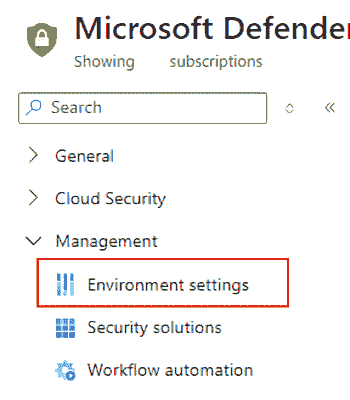

图 8.15 – 在 MDC 上选择环境设置

1.  选择 你想要保护的订阅。 这将带你进入 Defender 计划。

1.  在 **云安全姿势管理 (CSPM)**下，切换 **Defender CSPM** 状态到 **开启**。

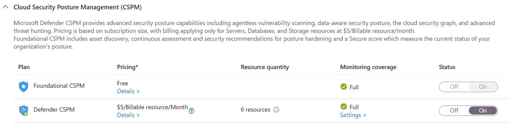

图 8.16 – 启用 Defender CSPM

1.  点击 **设置** 在 **Defender CSPM 监控覆盖下** 并启用所有的扩展，如下面的屏幕截图所示。 花些时间去浏览所有组件、描述和 Defender 计划。

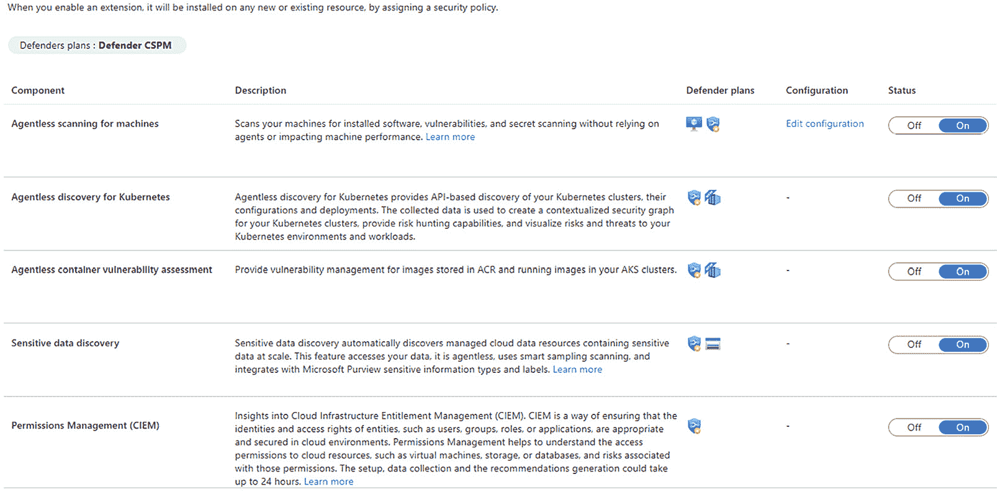

图 8.17 – 启用 Defender CSPM 扩展

1.  选择 **保存**。

我们已经 看到如何 启用 CSPM。 花些时间去检查启用后的额外 发现 Defender CSPM。

## 任务 2 – 实施和运营持续的容器工作负载保护

在这个 任务中，我们希望 利用 Defender CSPM 来启用 无代理容器安全，并识别容器注册表和 Kubernetes 中的风险。 在上一个任务中，我们启用了 **Kubernetes 的无代理发现** 和 **无代理容器漏洞评估** 扩展。 这就是启用 Defender CSPM 中的无代理容器安全所需要的全部步骤。

让我们在 Microsoft Azure 上启用 CSPM 功能：

1.  首先，让我们通过使用云命令行在 AKS 集群中集成我们的 Azure 容器注册表 命令：

    ```
    az aks update -n <AKSCluster> -g <ResourceGroup> --attach-acr <your-acr-name>
    ```

1.  导航 到 Azure 门户中的 Kubernetes 服务，并在 **Kubernetes 资源** | **命名空间** 下确认命名空间是否存在。

1.  返回 到 MDC，查看所有安全发现，位于 **推荐**下，然后查看在 **Cloud** **Security Explorer**中的查询。

1.  最后，让我们 点击 **工作负载保护** 在 **Cloud Security**下；然后我们可以看到 Defender for Cloud 的所有覆盖范围。

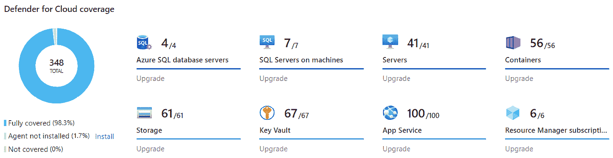

图 8.18 – 审查 Defender for Cloud 覆盖范围

1.  在 **高级保护**下，点击 **容器镜像扫描**。容器 镜像漏洞评估 会扫描你的注册表，查找 **常见已知漏洞** （**CVE**）并为 每个镜像提供详细的漏洞报告。

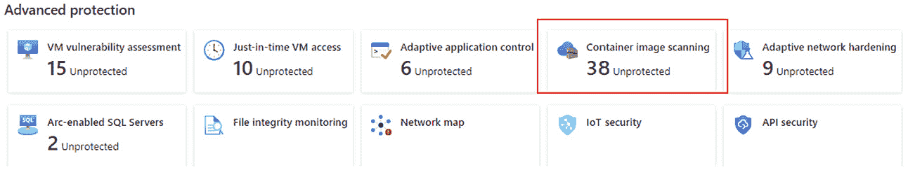

图 8.19 – 审查容器镜像扫描

1.  向下滚动，查看受影响的资源并探索 发现的漏洞。

在 练习中，我们已经 学习了如何利用 Defender for Cloud 的各种功能来保护我们的资源，使用 Defender CSPM。

# 总结

恭喜！ 你已经成功地完成了本书的学习。 在本章中，我们讨论了如何使用 Azure 策略实现运行时安全门控，并介绍了与 Kubernetes 准入控制器集成的 Azure 策略。 我们还讨论了保护现代云应用的挑战，以及 Azure 所提供的一些本地能力。

展望未来，以下是我们认为将塑造 DevSecOps 未来的一些趋势：

+   **自动化**：自动化结合 AI 将推动操作效率。 安全团队将专注于战略性任务，而自动化系统将处理操作性职能。 “从设计开始就确保安全”这一概念将会得到广泛推行，确保安全从 一开始就被纳入设计。

+   **工具整合**：组织将整合安全工具，以简化流程并降低成本。 将可观察性和监控功能合并到一个平台中，将提供一个全面的安全态势视图。 

+   **基础设施即代码（IaC）**：IaC 将在其中扮演至关重要的角色，传统的手动 IT 基础设施管理将让位于更高效、基于代码的方式，尤其是随着 云计算的增长。

+   **修复**：迅速解决漏洞和安全问题将成为重点，防止风险在 升级之前蔓延。

+   **软件材料清单（SBOMs）**：SBOM 的演进将通过提供关于软件组件 和依赖关系的详细信息，增强透明度。

这些趋势已经被一些前沿组织采纳，但我们认为它们将会被更广泛地应用。 保持领先于这些趋势将帮助组织为应对不断变化的网络安全挑战做好准备。 特别是在 DevOps 领域。

# 进一步阅读

想了解更多关于本章讨论的主题，请查看以下内容： 

+   MDC 文档： [https://learn.microsoft.com/en-us/azure/defender-for-cloud/](https://learn.microsoft.com/en-us/azure/defender-for-cloud/)。
