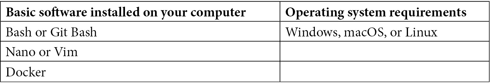

# 前言

导航任何职业都不容易，而导航一个涵盖多种职业经验的领域，甚至可能感觉几乎不可能。本书将帮助你在 DevOps 领域中找到方向，并帮助你为这一职业生涯做好准备。书籍的下半部分专注于面试过程中的每个阶段技巧，提升你成为顶尖候选人的几率。

# 本书适合谁

本书适合任何想深入了解 DevOps、追求 DevOps 职业生涯或在 DevOps 领域提升自己职业的人。

# 本书内容涵盖

*第一章*，*职业发展路径*，探索了 DevOps 的历史与文化，并介绍了 DevOps 领域中的各种职业路径。

*第二章*，*DevOps 从业者的必备技能*，讲述了所有 DevOps 从业者所需的技能，不论其职业水平如何。

*第三章*，*进阶 DevOps 从业者的专业技能*，涵盖了 DevOps 领域内进阶职业所需的技能。

*第四章*，*重新打造自我品牌*，提供了更新个人社交形象和简历的建议。

*第五章*，*建立人脉网络*，讲述如何让正确的人注意到你的技能，这对于获得工作机会至关重要，并提供了建立包括合适人物的网络的技巧和建议。

*第六章*，*导师指导*，聚焦于导师关系的价值以及如何与导师建立联系。

*第七章*，*与招聘人员合作*，分析了大多数职位是如何通过内部和外部招聘人员的组合来填补的，并给出了如何与两者合作的建议和技巧。

*第八章*，*准备面试*，提供了确保你为面试做好充分准备的建议。

*第九章*，*面试步骤解析*，逐步介绍了在典型和非典型面试过程中每个阶段的注意事项。

*第十章*，*DevOps 职业生涯：技巧与窍门*，提供了作者 25 年集体知识的倾诉，分享他们在面试过程中遇到的有效与无效的做法。

*第十一章*，*与 DevOps 从业者的面试*，回顾了不同职业阶段的 DevOps 从业者的坦诚面试。

# 如何最大化利用本书

本书假设你具备技术背景。然而，成功使用本书的唯一要求是你有强烈的学习愿望。

# 下载彩色图片

我们还提供了一个包含本书中使用的屏幕截图和图表的彩色图像的 PDF 文件。你可以在这里下载它：[`static.packt-cdn.com/downloads/9781803230948_ColorImages.pdf`](https://static.packt-cdn.com/downloads/9781803230948_ColorImages.pdf)。

# 使用的约定

本书中使用了许多文本约定。

`文本中的代码`：指示文本中的代码词汇、数据库表名、文件夹名、文件名、文件扩展名、路径名、虚拟网址、用户输入和 Twitter 用户名。例如："`–it` 命令以交互式终端运行容器。"

**粗体**：表示新术语、重要词语或屏幕上可见的字词。例如，菜单或对话框中的字词显示为**粗体**。例如："导航回到 GitLab，转到您刚刚推送的项目，然后单击 **Settings** | **Pages** 查看您网站发布的 URL。"

提示或重要说明

会出现在这里。

# 联系我们

我们始终欢迎读者的反馈意见。

**一般反馈**：如果你对本书的任何方面有疑问，请通过电子邮件联系我们，邮件地址是 customercare@packtpub.com，并在主题中提到书名。

**勘误表**：尽管我们已尽最大努力确保内容准确性，但错误不可避免。如果你在本书中发现错误，请向我们报告。请访问 [www.packtpub.com/support/errata](http://www.packtpub.com/support/errata) 并填写表格。

**盗版**：如果你在互联网上发现我们作品的任何形式的非法副本，请向我们提供位置地址或网站名。请通过电子邮件联系我们，邮件地址是 copyright@packt.com，并附上链接。

**如果你有意成为作者**：如果你在某个领域有专业知识，并且对撰写或贡献书籍感兴趣，请访问 [authors.packtpub.com](http://authors.packtpub.com)。

# 分享您的想法

读完《DevOps 职业手册》后，请分享您的想法！请单击此处直接转到亚马逊书评页面，并分享您的反馈。

您的评论对我们和技术社区至关重要，将帮助我们确保我们提供的内容质量卓越。
