# *第一章*：职业路径

DevOps 的职业路径从来不是线性的，没有单一的进入点，随时可能分岔。DevOps 职业根植于精益（Lean）、敏捷（Agile）和**极限编程**（**XP**），因此它既是技术上的匹配，也是候选人与雇主之间文化上的契合。在这一章中，你将学习 DevOps 的历史，这将有助于你未来与招聘人员和招聘团队的讨论。你还将了解不同的技能档案，这将帮助你确定职业发展的方向。

本章将涵盖以下主题：

+   为什么你应该追求 DevOps 职业

+   DevOps 历史概述

+   DevOps 文化

+   DevOps 职业路径

阅读超过 200 页关于你不确定是否想从事的职业的资料似乎有些傻；时间是有限的资源。在本节中，我们将讨论为什么你应该追求 DevOps 职业，特别是为什么应该选择 DevOps 而不是其他 IT 相关的职业。

## 收入潜力

DevOps 一直被评为收入最高的职业之一，年薪中位数为 100,000 美元。入门级的 DevOps 工程师年薪大致在 75,000 美元到 145,000 美元之间。随着你职业发展的推进，收入也会逐渐增加。看看下面的图表：

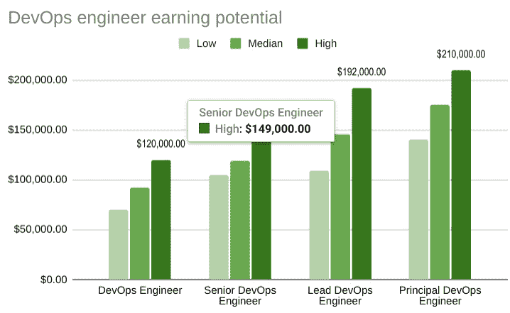

图 1.1 – DevOps 薪资

你应该考虑 DevOps 职业生涯的另一个原因是，它不断发展变化，永远不会让你感到无聊，这也为你提供了许多学习新技能的机会。

## 持续学习的机会

作为 DevOps 工程师，你的一部分工作就是与行业中最新的工具、技术和趋势保持同步。DevOps 工程师是被支付来学习的！这也是我作为 DevOps 工程师角色中最喜欢的一部分。作为一名 DevOps 工程师，你将在避免无聊的同时，为你的职业生涯做好未来准备。

## 对公司影响

作为一名 DevOps 工程师，你将交付公司每个部门都能使用并感受到的功能。没有其他技术职位能够像这个岗位一样，对业务产生如此深远的影响。

## 灵活性

作为一名 DevOps 工程师，你将拥有在任何地方、任何时间工作的灵活性。远程工作已经在技术行业中逐渐被接受；而 DevOps 团队早在这一趋势成为流行之前就已经开始了这种方式。包括 Slack 和 Jira 在内的协作工具使得异步工作成为可能。这意味着你不必和团队的其他成员在相同的工作时间内工作——至少不是一直如此。

那么，为什么你应该追求 DevOps 职业呢？

作为一名 DevOps 工程师，你将获得丰厚的薪酬，不断学习并运用前沿技术解决影响整个业务的问题，同时还能享有灵活的工作地点和时间选择。

# DevOps 历史概述

你正在阅读一本关于 DevOps 的书，这意味着你大概对 DevOps 有所了解；如果没有，也无需担心——这部分内容会在书中涵盖。即便是在 DevOps 社区内部，DevOps 的历史也是较为未知的。首先，我们将回顾 DevOps 之前的一些关键元素，它们为 DevOps 的诞生打下了基础，并创造了 DevOps 成长所需的环境。

## 精益制造

精益制造是一种主要旨在减少生产系统内的周期时间以及供应商和客户响应时间的生产方式。

**精益**这个术语是由*John Krafcik*在 1988 年提出的，并由*James Womack*和*Daniel Jones*在 1996 年进行了定义。精益制造已成为一套公认的最佳制造实践。通常被称为*丰田生产方式*，精益制造旨在实现生产车间的过程优化。*持续改进*是精益制造的口号，实践者不断评估以下方法的改进：

+   保持最低库存。

+   最小化订单排队。

+   最大化制造过程的效率。

## 敏捷

在 2000 年代初期，传统的瀑布方法正在演变并被敏捷方法取代，这要求进行一个以团队赋能为核心的大规模文化转变。敏捷基于 4 个核心价值观和 12 个原则。一些原则在 DevOps 发展过程中被采纳（[`kissflow.com/project/agile/values-and-principles-of-agile-manifesto/`](https://kissflow.com/project/agile/values-and-principles-of-agile-manifesto/)）。

## 极限编程

**XP**旨在提高软件质量和对变化客户需求的响应能力。如果你觉得这听起来很像敏捷，你是对的；它是一种敏捷软件开发方法。XP 与其他敏捷框架的最大区别在于，它特别强调代码和开发（[`en.wikipedia.org/wiki/Extreme_programming`](https://en.wikipedia.org/wiki/Extreme_programming)）。

XP 对 DevOps 的主要贡献是**持续集成**（**CI**）。CI 是*Grady Brooch*于 2001 年提出的一个术语，并很快以 Brooch 方法发布。

## DevOps

DevOps 的确切起源将永远是一个争论的话题；普遍接受的看法是，DevOps 运动始于 2007 年至 2008 年之间。这一时期的事件汇聚成了一场完美的风暴，促使了 DevOps 运动的诞生。软件行业中的功能失调，尤其是 IT 运维与软件开发社区之间的矛盾，成为了点燃这一运动的火花，但正是精益、敏捷和 XP 的先驱们为 DevOps 运动提供了最初的动力。

在没有 DevOps 的世界里，开发人员和 IT 运维属于不同的企业层级，且 IT 运维和开发的**关键绩效指标**（**KPI**）是不同步的，且对彼此产生负面影响。这些条件导致了团队之间的壁垒，造成了沟通障碍，最终导致了部署失败、错过截止日期和客户的不满。

2008 年，软件工程师 Andrew Shafer 尝试在加拿大的一个敏捷会议上组织一个名为 *敏捷基础设施* 的聚会。敏捷实践者 Patrick Debois 是唯一参加的人。两人进行了长时间的对话，这段对话如今被认为是点燃了一个火花，最终发展成了名为 **DevOps** 的运动。Andrew 和 Patrick 在那年晚些时候组建了一个讨论小组，供其他人发布他们如何解决开发与运维之间鸿沟的想法。2009 年，第一次 DevOpsDays 在比利时举行，这一事件让 DevOps 成为一个永载史册的流行词汇。DevOps 运动随后在全球各地的本地聚会中继续发展。大约在 2010 年，专注于 DevOps 的开源软件开始流行起来；Jenkins CI 服务器软件和 Chef 基础设施配置软件是其中的几个先驱。

专业提示

了解你所申请的职位背后的历史，会让你显得更为认真，且对话也会更加自然。深入了解，阅读一些书籍，如《*DevOps 手册*》和《*凤凰项目*》。这些书籍只会进一步增加你成功的机会。

以下图表展示了 DevOps 历史中的关键日期时间线：

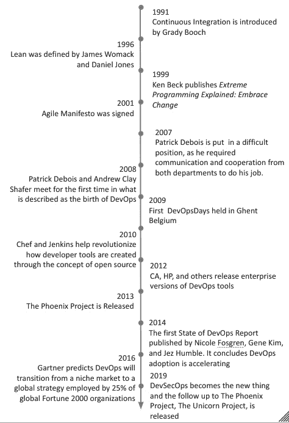

图 1.2 – DevOps 历史时间线

现在我们已经了解了 DevOps 的历史，让我们在下一节中了解 DevOps 文化。

# DevOps 文化

DevOps 是一套结合软件开发和 IT 运维的实践。它旨在缩短系统开发生命周期，并提供高质量的软件持续交付。DevOps 与敏捷软件开发是互补的；DevOps 的几个方面源自于敏捷方法论（[`en.wikipedia.org/wiki/DevOps`](https://en.wikipedia.org/wiki/DevOps)）。深入理解这个定义，我们会发现 DevOps 是一种多面向的实践。DevOps 有七个指导原则，它们共同构成了 DevOps 文化。DevOps 文化旨在减少周期时间，应用增量变化，并创建更精简的开发流程。

以下图表展示了 DevOps 七个原则的图示：

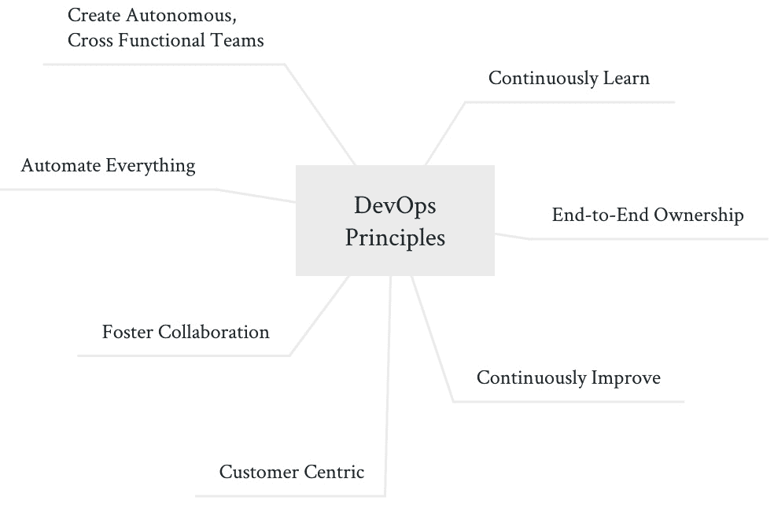

图 1.3 – DevOps 文化 – 原则

现在我们将更深入地探讨 DevOps 的七个原则。

## 以客户为中心

经常进行测试，频繁获取最终用户的反馈，并快速失败。客户与最终用户之间的反馈循环应尽可能短。团队所采取的所有行动应当集中在最终用户的体验上。这也正是*shift-left*（左移）这一说法的由来，意味着*越早测试功能中的错误，问题就能越快解决*，并且下游依赖的风险会减少。

两家初创公司竞标为一家大型保险公司开发健身追踪器的故事

**需求**：一种可穿戴设备，用于追踪用户的健身情况。

**验收标准**：一款像手表一样的可穿戴设备，能够追踪多种运动。

**X 公司**采用测试驱动开发，并且每周进行演示，收集反馈。在一次演示中，他们展示了一个设备并描述了追踪跑步和骑行的计划。随后他们得知，许多客户是游泳爱好者。团队根据反馈调整了优先级，将重点从跑步和骑行转向游泳。客户对这一调整印象深刻。

**Y 公司**认为不需要演示，因为他们过去的应用程序表现相对良好。团队将重点放在跑步和骑行的追踪能力上。在验收时，他们收到了客户的反馈，要求这款手表必须具备游泳追踪功能。开发团队未能在规定的时间内满足需求，客户对此感到失望。

**结果**：X 公司获得了合同，之后发展成为一家价值十亿美元的公司。Y 公司未能获得合同，并且因媒体报道不佳，导致又一次初创公司失败。

## 培养协作精神

开发团队与 IT 运维团队之间的协作是 DevOps 的最基本要求。消除部门壁垒能够确保全公司范围内的协作与统一，从而专注于客户需求。

协作文化在采用自上而下的方法时最为有效；高层领导的支持应当在任何重大文化转型之前就安排好。另一种更慢的方式是组织内的草根倡议。只需要一群志同道合的人，提供一个平台来分享意见，就能掀起一场变革。然而，这种方法的问题是，长期的过度工作可能会导致倦怠感，尤其是当你不断为改变努力却始终未见成效时。相反，可以从你能掌控的事情做起，例如从你的团队开始。

罗伯特·魏德纳（Robert Weidner）是 Optum 的高级总监，世界上仅有 26 位认证的企业教练之一，同时也是我的导师和前经理。在罗伯特的领导下，我们的团队有权选择我们所工作的微团队。我们还被鼓励帮助任何需要我们支持的其他微团队。在对团队进行绩效排名，并将其适应于奖金的正态曲线时，我们在一次外出活动中对每位团队成员进行评审，所有团队成员在场并在热座上接受反馈。那时是令人害怕的，但它奏效了，因为团队彼此信任。

## 端到端所有权

特性团队通过为团队提供产品的垂直切片（即特性）来确保端到端的责任。这个特性，**特性 1：按钮 X**，有两个用户故事：一个用于开发，一个用于测试。特性的完成定义还要求特性成功部署。这可以在*图 1.4*中看到。最后需要注意的一点是，*按钮 X*的持续支持也仍由该团队负责。我们公司已经开始称其为**你建造它，你拥有它**（**YBYO**）。这一概念的背后逻辑是，建造某个功能的团队将是对该功能最了解的团队，尤其是在出现生产问题时。

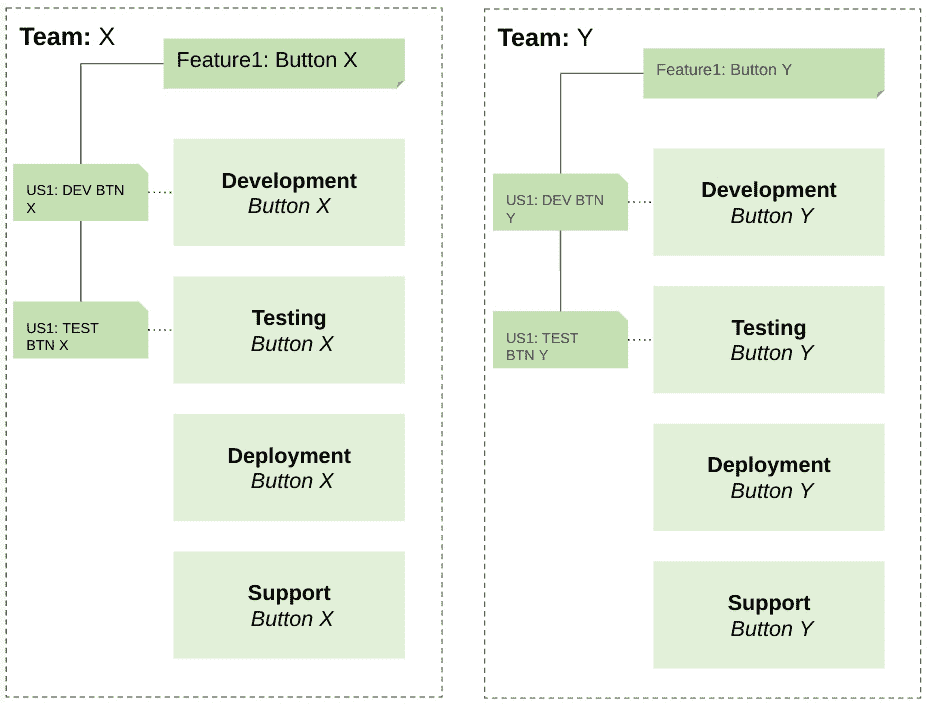

图 1.4 – 以特性为中心的团队（端到端所有权）

在传统的开发方法中，如瀑布模型，团队通常在活动层面被拆分和创建，这也被称为工作中的水平切片。特性（Feature）的所有权在不同的团队之间划分。在以下示例中，三个团队必须与特性进行交互，才能将其交付给最终用户，而另一个团队则负责持续的支持。这是一个问题，因为操作支持团队通常不了解开发团队最近做出的更改，从而导致长时间的停机和故障：

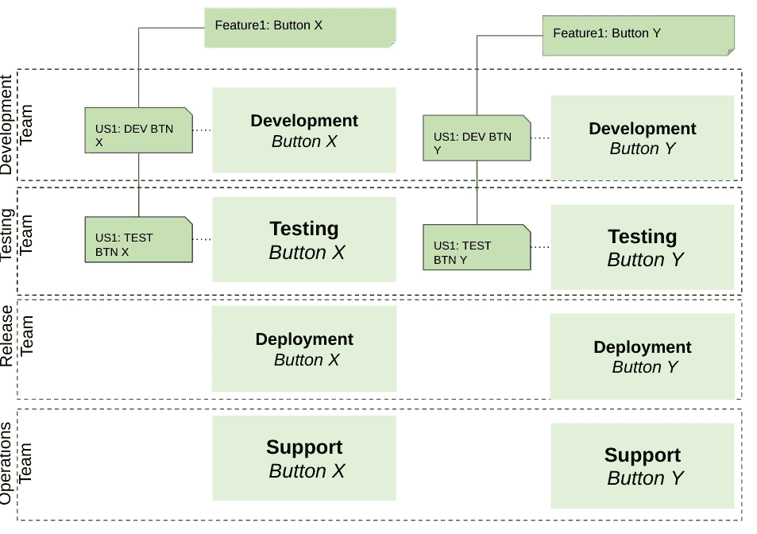

图 1.5 – 瀑布式团队

现在，我们将讨论持续改进。

## 持续改进

持续改进继承自精益方法。整个团队应当受到鼓励，更重要的是，应该有权利在不怕失败的情况下做出改变。团队将失败视为改进有缺陷流程的机会。这也被称为`continous_improvement.sh`，以确保你的团队能够不断地进行改进：

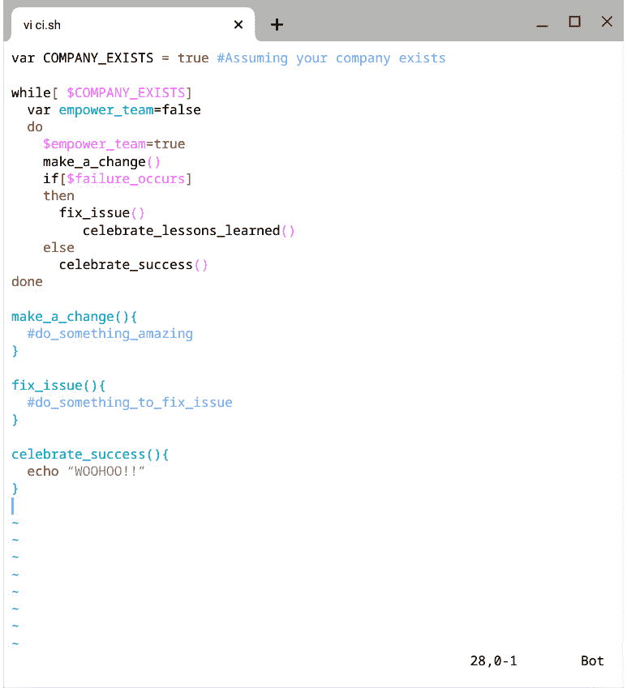

图 1.6 – 持续改进脚本

上述脚本是一个简单的脚本，定义了如果持续改进流程是一个 shell 脚本，它的操作流程会是什么样子。

## 自动化一切

在为本书进行研究时，我注意到两种常见的说法：*自动化一切*和*自动化（几乎）一切*。进一步的研究揭示了不应自动化的流程类型，包括没有回报的事项和需要高度设计或视觉检查的事项，如下所示（[`dzone.com/articles/what-to-automate-and-what-not-to-automate`](https://dzone.com/articles/what-to-automate-and-what-not-to-automate)）：

+   无投资回报的自动化

+   设计

+   应用程序的最终质量检查

流程应该尽可能减少人工干预。原因很简单：人类容易出错，而机器（计算机）擅长执行高频次、可重复的任务。

接下来，我们将讨论持续学习，这是一个对希望进入 DevOps 领域的人以及那些希望在不断变化的技术领域保持竞争力的人的重要 DevOps 原则。

## 持续学习

技术正以前所未有的速度发展；最著名的例子就是摩尔定律。摩尔定律是一个观察结果，即密集**集成电路**（**IC**）中的晶体管数量大约每 2 年翻一番（[`en.wikipedia.org/wiki/Moore%27s_law`](https://en.wikipedia.org/wiki/Moore%27s_law)）。到 2017 年，微处理器中可容纳的晶体管数量已经超过 100 亿，而在 1971 年这一数字不到 1 万（[`ourworldindata.org/technological-progress`](https://ourworldindata.org/technological-progress)）。成为一个持续学习者是一个能让你被聘用的个人特质。

提示：如果你希望在 DevOps 中取得成功，必须是一个持续学习者

使用新技术创建一个公共项目是向潜在招聘经理展示这一点的好方法。另一种方式是确保留下你最近阅读的文章的数字足迹，无论是在 LinkedIn 上的帖子，还是在 Twitter 上的推文。

一个突出的例子是一个高级 DevOps 工程师职位的面试，最终剩下两位候选人。两位候选人在组织中都有一定的任期，超出了职位要求，面试表现良好，并且都拥有高等学位。最终获得录用的候选人在面试过程中通过细微的方式表现出对知识的渴望。该候选人选择将焦点放在一个侧项目上，而不是他们的学位，该项目的目的是教候选人 Golang。数据科学的理论通过该应用得到了展示，而且很酷。最令我印象深刻的是，候选人有学习新事物的强烈愿望，这也是他们继续脱颖而出的原因。

总结来说，开发与运维的结合以及七个 DevOps 原则的共同应用，形成了 DevOps 文化。DevOps 是精益、敏捷和 XP 的完全独特衍生物，旨在缩短开发与最终用户之间的反馈循环。

请看下面的 DevOps 文化图示，其中将其划分为不同的实践和原则：

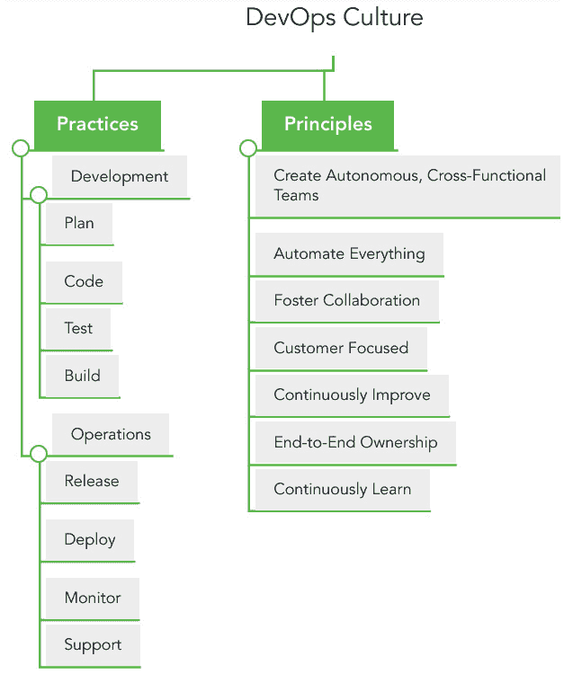

图 1.7 – DevOps 文化图表

总结来说，DevOps 文化包含七项指导原则，如 *图 1.7* 所示。在接下来的部分中，将讨论 DevOps 工程师的不同职业路径。

# DevOps 职业路径

DevOps 领域内容庞杂，即使对于经验丰富的从业者来说，也具有挑战性。DevOps 包含八个核心实践，并遵循七项基本原则。不足为奇的是，DevOps 领域有着众多的职业路径，而通才是最常见的 DevOps 角色。

**DevOps 通才**可以类比为瑞士军刀，它被设计用来处理尽可能多的任务。它可以切绳子、开罐、剪电线，必要时，瑞士军刀甚至能片鱼。DevOps 通才可以创建部署管道，编写基础设施即代码脚本，并且如果需要，还能在 **Amazon Web Services** (**AWS**) 中管理 **Elastic Kubernetes Service** (**EKS**) 集群。

**DevOps 专家**可以类比为一把鱼片刀，它专为最有效地片鱼而设计。刀刃的形状、刀材和人机工程学都经过精细调校，以完成唯一的任务——片鱼。例如，一个 DevOps 云专家将自己的职业生涯集中在云基础设施、云架构和云安全领域，并且管理 AWS 中的 EKS 集群已经是他们的“呼吸”般的技能。他们很可能会比非云专家找到更具成本效益的方式来完成这项工作。

**DevOps 专精的通才**可以类比为一把带有弯刀的**日常携带（EDC）**小刀。这把刀的设计与瑞士军刀相似，但刀刃的形状使其在切割鱼肉方面与专门的鱼片刀相当。一个在 AWS 环境中工作了 10 年的 DevOps 专精通才，能够完成大多数 DevOps 任务，尤其擅长涉及 AWS 服务的任务。

通才、专家和专精通才的常见技能轮廓形状可以在以下图表中看到：

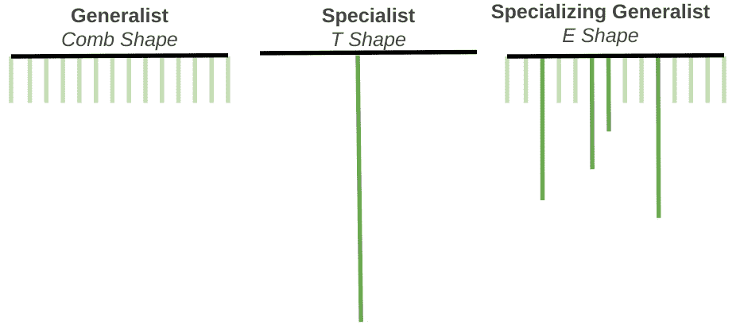

图 1.8 – 技能轮廓

你的技能组合的特点在确定如何自我定位时非常有用。首先从一个梳子开始。每个齿（技能）的长度（深度）相似。梳子的形状是典型的通才。第二个常见的形状是*T*形。*T*形有一条完整长度（深度）的线（技能）。*T*形是专才的典型形状。*E*形轮廓，有时被称为不对称的梳子，具有长度（深度）不同的齿（技能）。通常，有一个或多个技能的深度显著大于其他技能。*E*形是专精通才的典型形状。

一位导师曾告诉我，*E* 型的技能档案才是衡量个人技能的唯一真正标准。这个梳子形状存在缺陷，因为它假设所有技能的深度是相同的，这显然不可能。*T* 型则缺乏细节；它展示了个人擅长的某一项技能，但没有考虑到个人其他的技能。

专业提示

对于本章内容，不要过多关注示例中列出的技能要求，因为这些将在下一章详细讨论。请集中精力理解技能档案与不同类型 DevOps 工程师特定需求之间的关系。

以下图表展示了与 *E* 型档案匹配的常见技能档案：

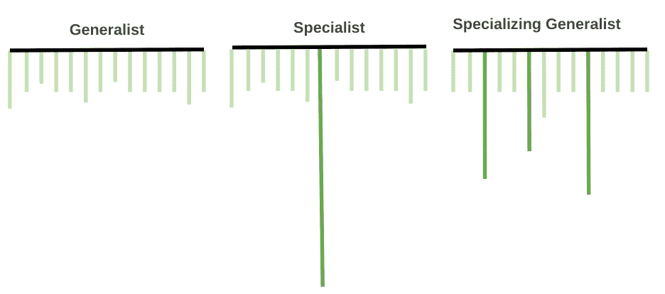

图 1.9 – 技能档案（适配 *E* 型档案)

在接下来的章节中，我们将查看 DevOps 通才、专精 DevOps 通才以及几种 DevOps 专业领域的技能档案。我们将首先看看 DevOps 通才的技能档案。

## DevOps 通才

谷歌的 Ben Fried 曾表示，*通才，而非专家，将推动互联网的扩展*（[`devops.com/specialists-vs-generalists-enterprise-devops/`](https://devops.com/specialists-vs-generalists-enterprise-devops/)）。这句话最早出现在 2011 年，但直到今天，在某种程度上依然适用。通才理解整个**软件开发生命周期**（**SDLC**）。通才在多个领域和技能方面具有广泛的知识，但对任何单一领域的理解较为浅显。这在小型公司、初创公司或产品和工具数量有限的垂直整合型公司中很常见。几乎不需要工作交接，这减少了疏漏或遗忘的风险。

以下是 DevOps 通才的示例技能档案。请注意其相对平坦的形状：

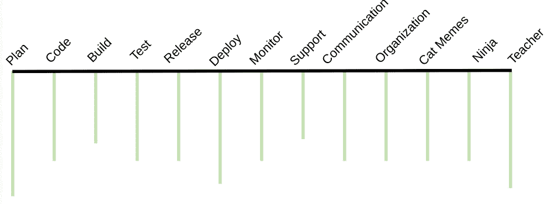

图 1.10 – DevOps 通才技能档案

DevOps 通才通常是最先感受到公司扩展或引入新软件时的困境，尤其是在小公司或 DevOps 部门较小的组织中。当引入一款新工具时，DevOps 工程师需要在实施之前了解该工具。接下来，需要为新工具配置一个环境，这个环境通常与现有工具使用的环境不同，或至少有一些独特的差异。最后，工具被实施。在这一点上，新工具和现有工具都需要 DevOps 工程师进行支持。用图形表示的梳子形状来描述通才有一个固有的缺陷：它假设通才对任何领域都没有深入的理解。

## DevOps 专精通才

如果你长时间在同一行业或同类型的项目中工作，你最终会变成一个专业化的通才。专业化通才也被称为“全能大师”。在前面的例子中，DevOps 工程师具备所有所需技能，但在编程和开发代码领域有更深入的理解和知识。这是软件工程师转型为 DevOps 角色的典型情况。如果你喜欢某些技能，或者总是被指派需要这些技能的任务，这也可能是你随着时间推移演化的技能概述。无论你的技能概述如何演变，了解自己在某些领域有更深入的理解，无论在找工作时还是要求晋升时，都会带来好处。

下图展示了一位具备多领域知识、并对**构建**和**部署**领域有更深入理解的 DevOps 工程师的技能概述：

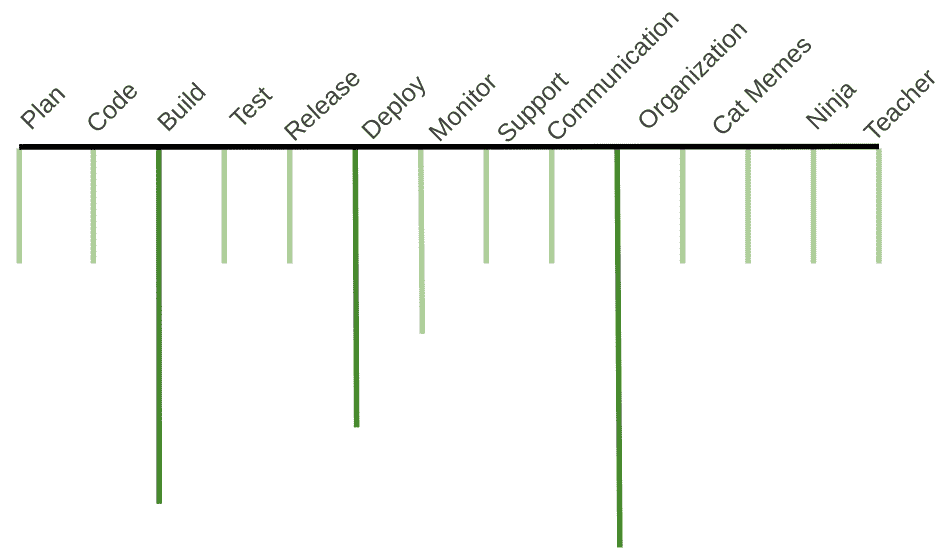

图 1.11 – DevOps 专业化通才技能概述

了解自己的技能概述对于团队经理在进行产能规划时，以及工程师在选择申请的职位时非常有帮助，这也是你可能感兴趣的内容。在下一章中，我们将深入探讨如何创建自己的技能概述。

专家在某一领域有非常深刻的理解。这并不意味着他们不能做其他事情；然而，通常让专家跨领域工作效率较低。专家在大型组织中较为常见，这些组织通过支持的工具来定义专家。如果我们将其应用到之前的例子中，DevOps 工程团队 *A* 会专注于工具 *A*。当公司引入新工具时，会组建一个新团队，招聘具备正确技能的人才，或者通过提升现有员工的技能来加入该团队。那些在某个 DevOps 领域拥有深厚知识的专家，将是本书接下来重点关注的对象。

## DevOps 安全专家

一名专注于安全的 DevOps 工程师被称为处于 DevSecOps 这一细分领域。DevOps 安全专家对渗透测试、云安全、混沌工程和持续验证等领域有深入理解，如下例所示的技能概述：

图 1.12 – DevOps 安全专家技能概述

现在，我们将讨论 DevOps 云专家。

## DevOps 云专家

其中一个增长最快的领域是云工程，而云工程师也是收入最高的职业之一。你可能会问，云专家、云工程师和 DevOps 云专家有什么区别？诚实的回答是，没什么区别。职位名称没有意义，而且通常在不同公司之间、甚至在大型组织内部的不同部门之间有所不同。DevOps 云专家具备传统的 DevOps 技能，但在云工具、架构、最佳实践和整个云环境的管理方面有非常深入的知识，有时甚至涉及多云环境。

云的广泛应用使得对云的深入理解成为许多入门级职位通常也要求具备的技能。

图 1.13 – DevOps 云工程师专家技能档案

本节讨论了 DevOps 通才和 DevOps 专家的技能档案。

# 小结

在本章中，你了解了 DevOps 的历史和目标。DevOps 起源于 2008 年左右，当时一位开发者和一位敏捷专家在一次会议上碰面，决定要找到一种更好的软件开发方式。DevOps 的目标是打破开发与 IT 运维团队之间的壁垒，缩短开发者与客户之间的反馈循环。DevOps 是精益、敏捷和 XP 方法论的结合。

你还了解了 DevOps 领域中众多职业发展的路径。DevOps 职业路径的定义依据所需的知识深度。我们讨论了三种技能档案：DevOps 通才、DevOps 专注型通才和 DevOps 专家。DevOps 专家比通才拥有更深的知识。

在下一章中，我们将讨论作为 DevOps 通才所需的具体技能。
