# *第二章*：DevOps 实践者的必备技能

对于那些想要获得首个 DevOps 职位的人来说，最常听到的问题是，*什么是重要的技能？* 对于一个 DevOps 通才来说，重要技能的列表相当冗长，这也是大多数寻求第一份 DevOps 工作的人所期望的角色。本章面向那些寻求第一份 DevOps 工作的人。已经有 DevOps 职业生涯的人可以跳过本章，或将其作为复习材料。

本章将涵盖以下主要内容：

+   脚本编写、编码与编程

+   源代码管理

+   基础设施管理

+   CI/CD 概念

+   软技能

+   云原生框架

+   初学者 DevOps 认证

# 脚本编写、编码与编程

一些 DevOps 工程师非常擅长编程。然而，你不必成为一个优秀的程序员。要成为一名出色的 DevOps 工程师，调试代码、通过脚本实现自动化以及在仅有文本的终端中工作也是重要的技能。本节将涵盖以下内容：

+   浏览命令行

+   脚本编写

+   修改遗留代码与编写新代码

## 浏览命令行

命令行导航可能是任何想要在 DevOps 领域找到工作的人的最基本技能。命令行是一个通用术语，指的是基于文本的界面。大多数 Linux 发行版默认提供的命令行外壳是 **Bash**。虽然掌握基本的命令行使用知识对获得 DevOps 工程师职位至关重要，但精通命令行能帮助你在其他申请者中脱颖而出。没有哪种方法能够在不将终端作为日常常规工具的情况下精通它。许多写得很好的、内容丰富的博客、文章和备忘单都覆盖了命令语法。本节的重点将是如何通过技巧来快速提高使用命令行的舒适度。

所有导航操作都可以通过命令行完成，且通常更为迅速。即使你不确定当前所在的位置，`pwd` 命令也会输出你在终端中的当前路径。如果你想查看当前目录中的文件和文件夹，可以使用 `ls` 命令。要进入特定的文件夹，使用 `cd` 命令。如果你想在文本文件中查找特定的字符串，可以使用 `grep` 命令。默认情况下，`grep` 是区分大小写的，但像大多数命令一样，可以使用标志来改变其行为；例如，`grep -i` 会使搜索不区分大小写。如果有多个结果，你可以使用 `sort` 将结果按字母顺序或反向顺序排序。

*图 2.1* 显示了 Bash 终端窗口，已执行一些基本命令并显示了输出：

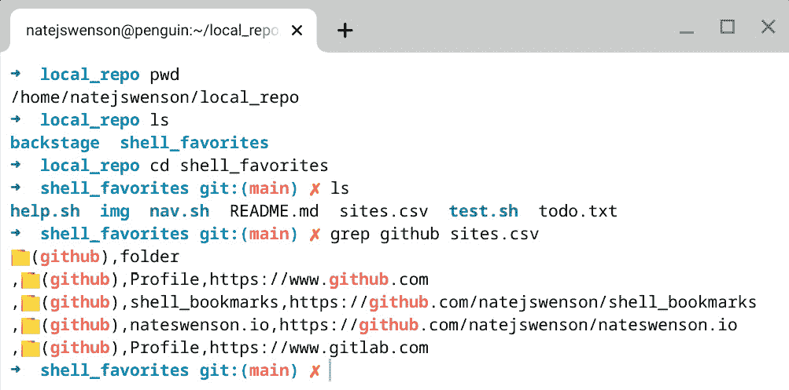

图 2.1 – Bash 终端与基本命令

正如你在前面的 Bash 终端中看到的，终端显示了独特的颜色，当前目录前有一个箭头，并且`git`文件夹中显示了当前检出的分支。你可以配置外观，也可以在`.bashrc`文件中设置别名和自定义函数。

专业提示：多玩玩，享受其中的乐趣

学习终端应该是有趣的，我们将在下一部分深入探讨。到那时，先在谷歌上查找命令，创造属于自己的命令，发挥创意！终端的强大之处在于它的灵活性；终端可以根据你的需求进行定制，而大多数这种定制都是通过`.bashrc`文件完成的。

`.bashrc`文件是设置别名、函数以及自定义终端外观和感觉的核心区域。`.bashrc`文件是一个在终端加载时运行的 Shell 脚本。如果你使用的是 Bash，你会有一个`.bashrc`文件，如果你使用的是`zsh`，则会有一个`.zshrc`文件。在`.bashrc`文件中，可以执行以下操作：

+   加载模块：

    ```
    module load <module>
    ```

+   修改环境变量：

    ```
    export PATH=$PATH:<path/to/dir>
    ```

+   激活 Python 环境：

    ```
    source <path/to/env>/bin/activate
    ```

+   设置别名：

别名是命令、命令组或脚本的别名，可以添加到`.bashrc`文件中。别名通常用于将常用命令缩短。最佳实践是将别名添加到一个名为`.bash_aliases`的单独文件中，然后将`.bash_aliases`加载到`.bashrc`文件中：

```
if [ -f ~/.bash_aliases ]; then
    . ~/.bash_aliases
fi
```

如果你的别名列表很短，你可以直接将它们添加到`.bashrc`文件中：

```
alias l="ls -l"
alias la="ls -la
```

别名也可以用来调用函数：

```
alias dd=dockerdown()
dockerdown(){
  sudo docker rm -f $(sudo docker ps -a -q)
  sudo docker ps
  sudo docker rmi -f $(sudo docker images -q)
  sudo docker images
}
```

另一项所有 DevOps 工程师都应该掌握的有用技能是，在终端中使用文本编辑器。

文本编辑器是命令行工具，可以直接在终端窗口中编辑文件。常见的有 vim、emacs 和 nano。大多数 Linux 发行版默认安装了 vim。在以下示例中，我们将向你展示如何编辑你的`.bashrc`文件。要在`vi`中打开文件，输入 `vi </path/to/file>`。在以下示例中，命令是 `sudo vi .zshrc`，它以 sudo 权限打开`.zshrc`文件：

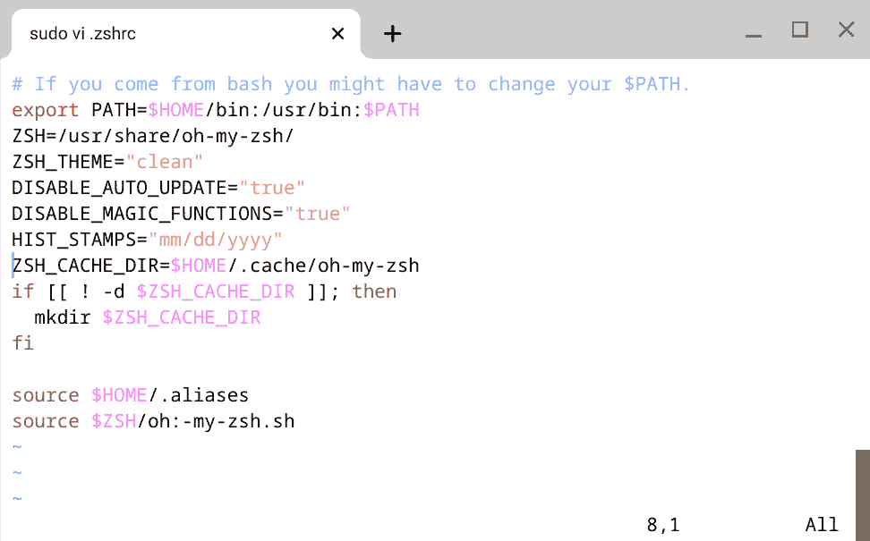

](img/Figure_2.02_B18117.jpg)

图 2.2 – 启动了 vi 编辑器的 Bash 终端

此时，文件已以只读模式打开。要进入编辑模式，输入 *I*。修改后，按 *esc* 再输入 *w* 保存文件，并按 *q* 关闭编辑器。

文本编辑器功能强大，但需要一定时间来掌握。如果你需要关于`vi`命令的信息，可以在各种在线论坛找到很棒的资源。我特别喜欢的一个是 [`ryanstutorials.net/linuxtutorial/cheatsheetvi.php`](https://ryanstutorials.net/linuxtutorial/cheatsheetvi.php)。

## 脚本编写

脚本是 DevOps 工程师必须能够创建和维护的东西。获得 DevOps 工作的秘诀在于能够解决脚本问题，这意味着需要不断练习。目前 DevOps 工程师使用的脚本语言有多种，每种语言都有其最适合的工作类型，没有一种比另一种更好。

专业提示：在学习新语言时，谷歌是你最好的朋友

如果你在某个问题上遇到困难，很可能别人也曾遇到过这个问题，并且已经解决并写下了相关内容。不要做更辛苦的工作，而要做更聪明、更高效的工作。

### Python

Python 在基础设施自动化和配置中被广泛使用，并且已成为 DevOps 中的全能脚本语言。它被许多人青睐，因为它容易入门。然而，随着你熟练度的提高，Python 会变得更加复杂。以下是最基本的 Python 脚本（`helloworld.py`）：

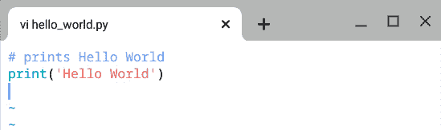

图 2.3 – hello_world.py

### Bash

Bash 是 Unix/Linux 环境中最常用的脚本语言，并且有一个强大的社区提供支持。它被用于全球 Linux 服务器的自动化。以下是最基本的 shell 脚本（`helloworld.sh`）：

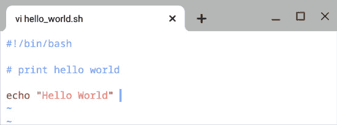

图 2.4 – hello_world.sh

### JavaScript

JavaScript 用作 DevOps 脚本语言，用于创建以网络为中心的应用程序。它是一种轻量级的 DevOps 脚本语言。JavaScript 提供了许多优势，包括更少的服务器交互、更高的互动性、对访客的即时反馈以及更丰富的界面。以下是最基本的 JavaScript 脚本（`helloworld.js`）：

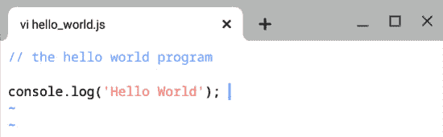

图 2.5 – hello_world.sh

### Go

Go 于 2009 年推出，并且自问世以来大大改变了 DevOps 的格局。Go 是基于 C 构建的，旨在便于人类阅读并且具有可扩展性。以下是最基本的 Go 脚本：

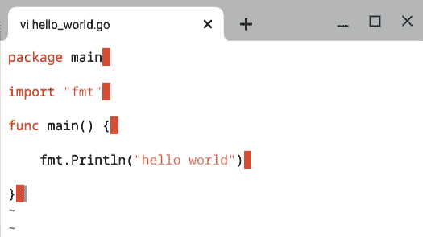

图 2.6 – hello_world.go

专业提示：专注于一次学习一种语言

如果你尝试同时学习多种编程语言，那么你注定会让自己失望。除非有特殊情况需要你学习新语言，否则先精通一种语言再转向下一种。

在学习新语言时，你可以选择大量的书籍和在线资源。一个很好的练习方法是从 GitHub 上 fork 一个项目并进行修改。这是你可以给自己带来的一些最有用的经验。如果你想挑战自己，可以尝试一些专门为用户准备技术面试的在线网站，这也是提升编码技能的一个好方法。这里有几个受欢迎的推荐：

LeetCode: [`leetcode.com/`](https://leetcode.com/)

AlgoExpert: [`www.algoexpert.io/`](https://www.algoexpert.io/)

还有一些网站围绕你可能在面试中遇到的问题类型建立。编码挑战网站也能大大提高你成功的机会。

现在我们已经涵盖了各种脚本语言，接下来需要讨论的是何时修改现有代码以及何时编写新代码。

在本节中，你了解了如何在基于文本的 shell（如 Bash）中导航，以及如何使用文本编辑器修改现有文件和创建新文件。我们还介绍了 DevOps 工程师使用的各种脚本语言及其最佳使用场景。

在下一节中，我们将讨论版本控制和源代码管理。

# 源代码管理

`git`。

## Git

令人吃惊的是，87% 的开发人员使用 `git` 作为他们的版本控制工具。Git 是一种分布式版本控制软件，最初由 Linus Torvalds 设计，用于管理 Linux 内核。`git` 与 `svn` 的区别在于，使用 `git` 时，完整的代码历史会存储在每个独立节点上，而使用 `svn` 时，则是存储在单一的源服务器上。在学习 `git` 时，需要考虑以下几个方面：

+   `git` 可用版本。

    开始使用 Git

    Windows: [`gitforwindows.org/`](https://gitforwindows.org/)

    macOS: [`git-scm.com/download/mac`](https://git-scm.com/download/mac)

    Linux: [`git-scm.com/download/linux`](https://git-scm.com/download/linux)

+   **第二**：有多种分支策略。建议你花时间学习并练习使用不同策略管理自己的项目。一些常见的策略定义如下：


图 2.7 – 基本的 git 工作流

基本的 `git` 工作流只有一个分支，即主分支或 *Master* 分支。开发人员直接向该分支提交代码，所有部署，无论是哪个环境，都是从该分支进行的。除非你需要快速设置或正在进行私人项目，否则不建议使用这种工作流。

以下图示为 `git` 特性分支工作流的图形表示：

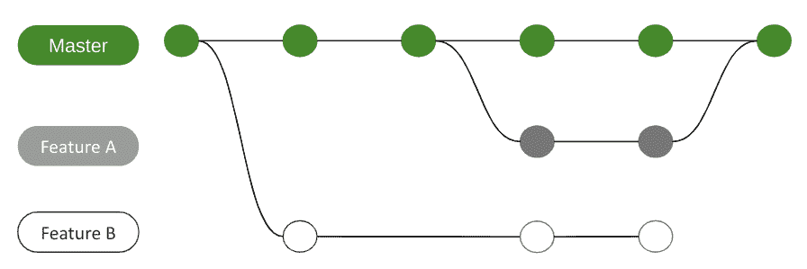

图 2.8 – Git 特性分支工作流

每当多人在相同代码库上工作时，`git` 特性分支工作流就变得必不可少。特性 *A* 和特性 *B* 都可以独立创建，而无需担心会影响到其他人的合并操作。

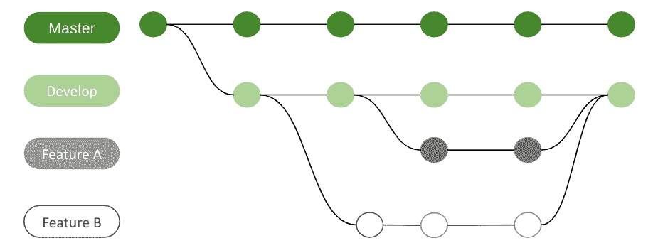

图 2.9 – 带有 Develop 分支的 Git 特性分支工作流

带有 *Develop* 分支的 `git` 特性工作流是最流行的分支策略之一。*Master* 分支始终保持在一个可以部署到生产环境的状态，开发人员可以独立进行特性开发，而无需担心其他开发人员的合并冲突。

+   `git`命令有很多，几乎不可能记住所有。我们提供了两种方法来帮助你在刚开始时更有信心。

将常用的`git`命令作为别名添加到你的`.bash_profile`文件中。以下是可以添加到`.bashrc`文件中的代码片段，它将与`git`相关的三个命令合并成一个`gp`别名：

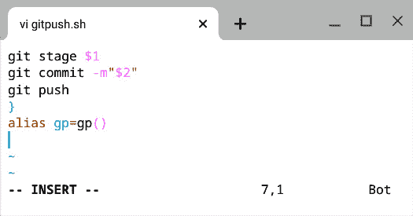

图 2.10 – Git 函数示例（.bashrc）

前面的`gp`别名有两个参数：`$1=file`，或待暂存文件的路径，`$2=commit message`。以下输出显示了执行`gp`别名时的结果。我们来分解一下：

+   `shell_favorites`是由`git`跟踪的本地工作目录。

+   `git stage`命令将`README.md`文件移动到本地暂存区。

+   `git commit –m`命令将`README.md`文件提交到本地仓库，并附上提交信息，在我们的示例中提交信息是`test100721`。

+   `git push`命令将本地仓库中的更改推送到`git`所跟踪的远程仓库。

在下图中，你可以看到执行`gp`别名时的输出结果：

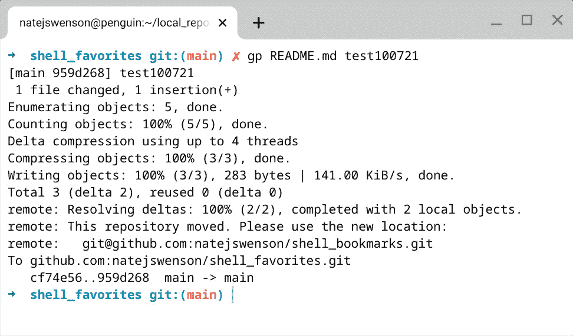

图 2.11 – git push 终端输出

相当不错，不是吗？添加`git`别名并不会让你成为更好的开发人员，但它确实能简化你的生活。

我给初学者的成功秘诀之一是随时手边有一份常用的`git`命令清单——一个`git`备忘单。我最喜欢的是 GitHub 教育组提供的：[`education.github.com/git-cheat-sheet-education.pdf`](https://education.github.com/git-cheat-sheet-education.pdf)。

## SCM

流行的 SCM 工具包括 GitHub、GitL[ab 和 Bitbucket。](https://www.github.com)

[Gi](https://www.github.com)tHub: [`www.github.com`](https://www.github.com)

GitLab: [`about.gitlab.com/`](https://about.gitlab.com/)

Bitbucket: [`bitbucket.org/`](https://bitbucket.org/)

每种 SCM 工具都有独特的功能，帮助改善开发人员的体验，并且设计上都非常用户友好且易于使用。这些解决方案之所以容易使用，是因为每个工具都为用户开发了丰富的 UI。你可以通过在它们的网站上注册，免费使用这些工具！无论你选择哪个 SCM 工具，版本控制仍然是`git`。

在下表中，我们将比较 2021 年最流行的三种 SCM 工具：

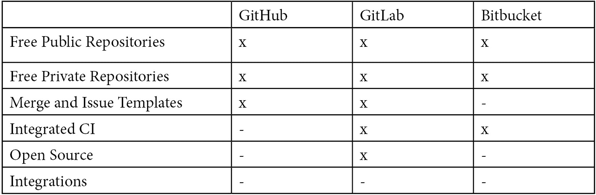

表 2.1 – SCM 比较

到头来，只要你在学习，就没有什么选择是错误的。

在本节中，你了解了`git`、常见的`git`模式和常用的`git`命令。我们还讨论了源代码管理软件的可选项。

在接下来的部分，你将学习作为一名 DevOps 工程师所需的基础设施工具和技巧。

# 基础设施管理

高德纳（Gartner）这样定义 IT 基础设施：

IT 基础设施是由硬件、软件、设施和服务组件组成的系统，支持业务系统和 IT 启用的过程交付。

基础设施管理可以分为三个关键阶段：*容量规划*、*基础设施配置* 和 *部署*，如以下图所示：

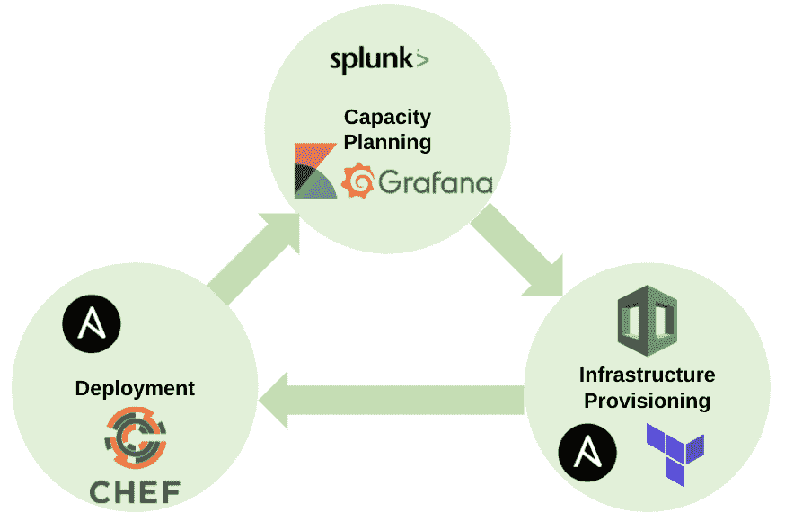

图 2.12 – 基础设施管理阶段

基础设施管理的第一阶段是容量规划，接下来将对此进行详细讲解。

## 容量规划

容量规划是基础设施管理的第一步，随后是配置和部署。为了准确规划资源，收集准确的数据是至关重要的。容量规划中使用的工具包括 Splunk、**ELK**（**Elasticsearch, Logstash, Kibana**）栈和 New Relic。根据生产环境中的需求，持续的容量规划是必要的，以便根据需求自动扩展或缩减资源。

自动扩展资源具有两个好处：节省成本和提高性能。当资源被缩减时，它将不再被使用，从而不会产生费用。当资源被扩展时，额外的资源会在性能下降之前被添加进来。

## 基础设施配置

在成功收集和分析了容量数据后，我们可以进入基础设施配置阶段。配置包括根据容量规划得出的容量数据，创建、分配和删除基础设施资源。基础设施资源包括服务器、容器、存储、网络、IP 和负载均衡器，这些都可以在 AWS、Azure、GCP 等云服务提供商或本地部署的环境中创建和管理。

DevOps 工程师需要了解如何根据公司架构在云环境和本地环境中管理基础设施资源。在接下来的示例中，您将看到用于通过 CloudFormation、Terraform 和 Ansible 创建 AWS EC2 实例的模板代码。

如果组织在 AWS 上管理资源，则可以使用 AWS CloudFormation 来自动化基础设施资源的创建/分配/删除。以下是用于配置 EC2 实例的 CloudFormation 模板示例：

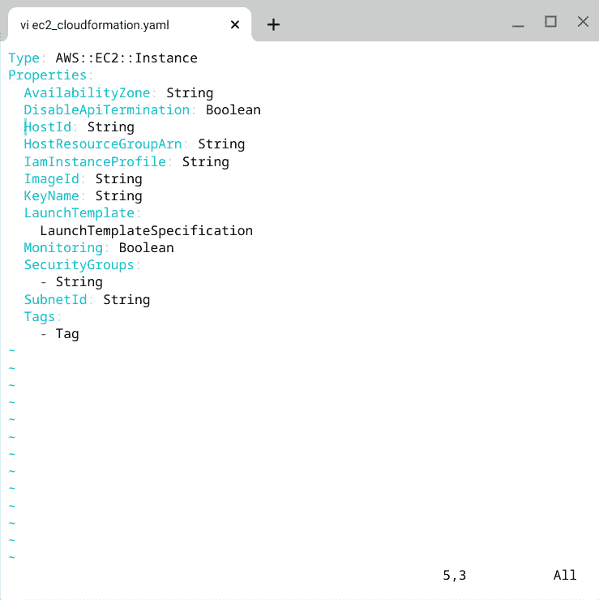

图 2.13 – CloudFormation 示例

要了解更多关于 CloudFormation 的信息，请访问 [`docs.aws.amazon.com/AWSCloudFormation/latest/UserGuide/Welcome.html`](https://docs.aws.amazon.com/AWSCloudFormation/latest/UserGuide/Welcome.html)。如果您的组织在多个云服务中管理资源，可以使用 AWS、Azure、GCP 和 Terraform 等提供商来自动化基础设施资源的创建/分配/删除。以下是可以用来提供 EC2 实例的 Terraform 文件：

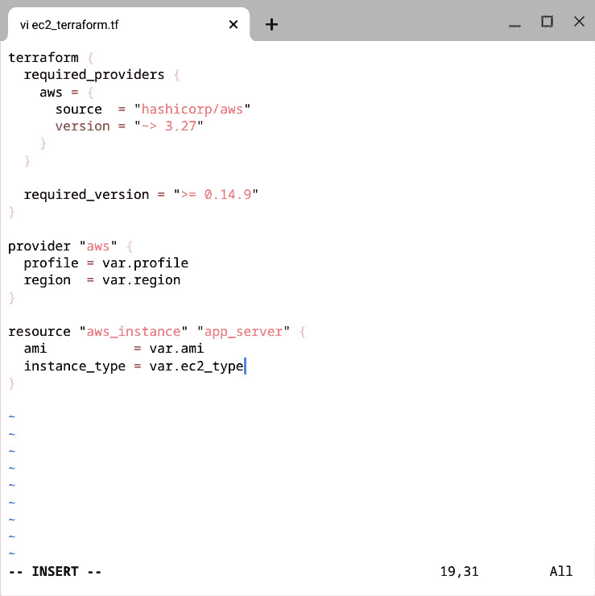

图 2.14 – Terraform 示例

Ansible 还可以用于提供分布在各种环境中的资源，包括本地和云端。以下示例将在传入的变量 `MY_KEY`、`EC2_TYPE`、`IMAGE`、`GROUP`、`COUNT` 和 `VPC_SUBNET` 下创建一个 EC2 实例：

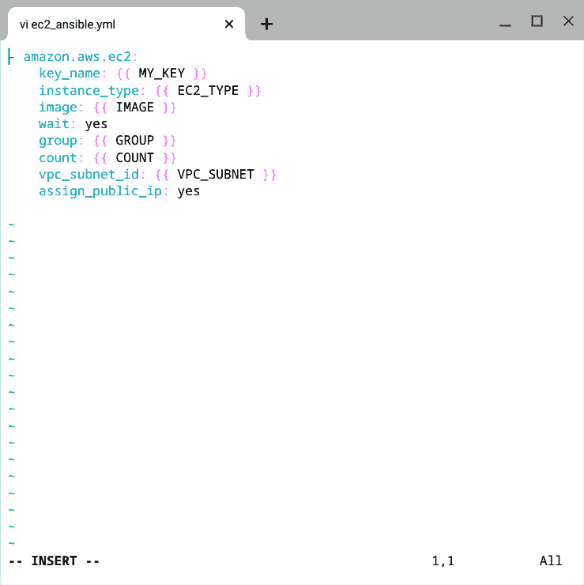

图 2.15 – Ansible 示例

现在，我们将讨论部署。

## 部署

在基础设施已配置完毕后，进入部署阶段。部署涉及在服务器或容器上安装、配置、发布和管理软件服务，这些服务器或容器用于承载生产工作负载。部署是在自动化配置基础设施资源时创建或分配的服务器或容器内部进行的过程。DevOps 工程师可以使用像 Chef、Ansible 和 Salt 这样的自动化工具来自动化软件服务的部署。

# CI/CD 概念

**持续集成**（**CI**）和**持续交付**（**CD**）是与 DevOps 同义的。这是因为在*第一章*《职业路径》中讨论的每一项实践——计划、编码、构建、测试、发布、部署和运维——都包含在无限的 CI/CD 循环中，如*图 2.16*所示：

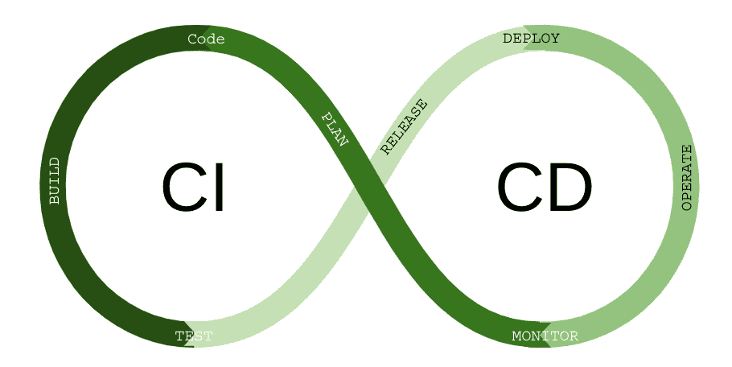

图 2.16 – 无限 CI/CD 循环

让我们首先探讨持续集成（CI）以及与之相关的实践和工具。

## 持续集成

持续集成是将多个开发人员的代码更改定期且频繁地合并到单一分支的过程。为了有效地做到这一点，您需要某种形式的自动化工具来构建您的代码并执行一系列测试。CI 服务器帮助通过 CI 流水线有效地集成您的代码。

在开发人员进行更改后，代码更改会通过 `git` 提交到源代码管理系统。CI 服务器具有内置的监听器（钩子），当代码被提交时，它会触发构建。流水线创建一个新的构建，并对构建执行一系列测试。这些测试包括静态代码分析、动态代码分析、秘密检测、漏洞扫描以及功能测试和集成测试。下图展示了 CI 服务器如何与开发生命周期的多个方面进行交互：

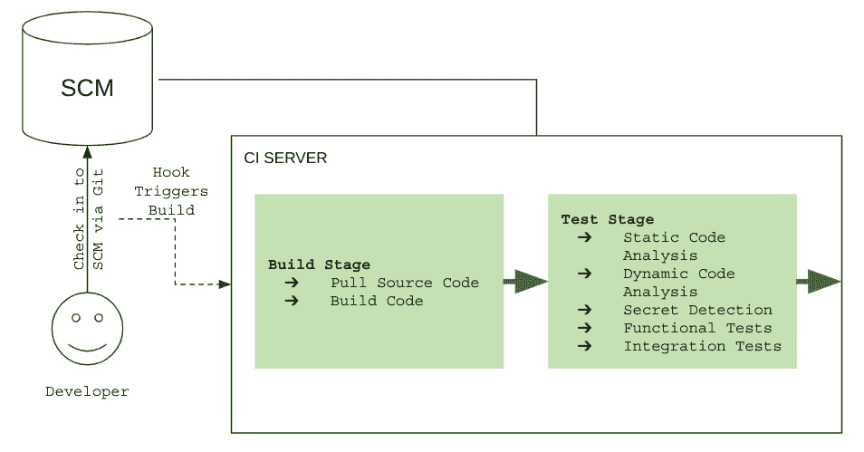

图 2.17 – CI 管道

持续集成服务器包括 Jenkins、**Travis CI**、**CircleCI** 和 **GitLab**。

这些工具提供了相似的功能，唯一的区别在于用户界面和编写管道所需的语言。

### Jenkins

我们将讨论的第一个 CI 软件是最广泛使用的 Jenkins。由于 Jenkins 是开源的，它拥有一个庞大的社区和许多功能，这也是它免费使用的原因。Jenkins 的一些缺点包括维护开销以及复杂的管道设计。Jenkins 管道使用 **Groovy**，这是 Java 的一种衍生语言。以下是 Jenkins CI 使用的控制器-代理架构：

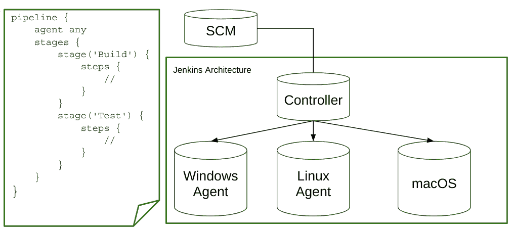

图 2.18 – Jenkins 架构

### GitLab

GitLab 是一个 SCM 和 CI 工具。GitLab CI 自 2014 年推出以来虽然较新，但自发布以来其用户群增长迅速。GitLab CI 使用 runner 概念，这意味着每个作业都在自己的基于容器的执行器中运行。它提供了广泛的安全工具。如果你在本地运行 GitLab，它可能会很难管理。你可以在下图中看到，有许多服务器需要管理和配置。然而，GitLab 也为希望更快入门的小公司提供了 **软件即服务**（**SaaS**）选项。GitLab 基于 YML，使得编写和理解管道变得非常简单。以下架构图是实现 GitLab 在组织内的一种可行方案：

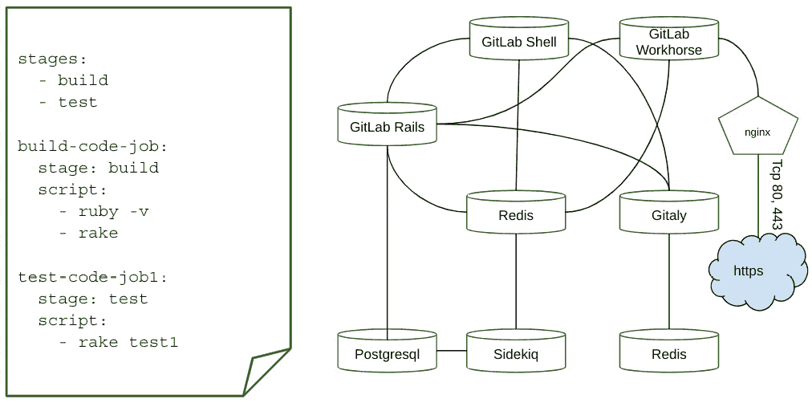

图 2.19 – GitLab 架构

## 持续交付

持续交付是持续集成的扩展。在构建阶段之后，代码更改会被交付到更高的环境，如阶段环境、测试环境、预生产环境和生产环境。采用持续交付时，必须具备自动化发布过程。下图展示了被识别为 CI 或 CD 任务的 CI 服务器阶段：

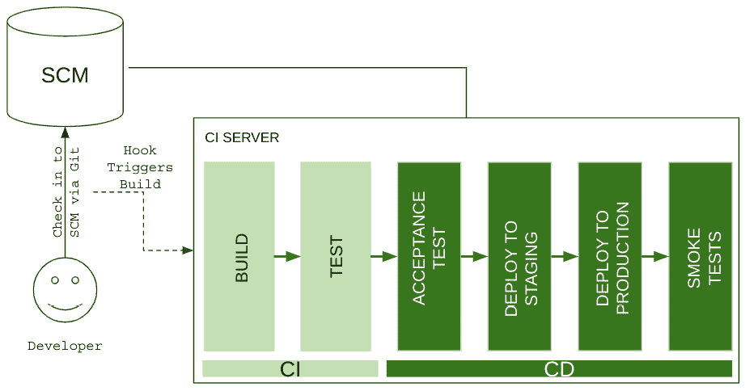

图 2.20 – CI/CD 管道

持续集成和持续交付是你随着时间推移而掌握的高级技能。如果你正在寻找入门级 DevOps 工程师岗位，它们可能不会要求你具备 CI/CD 的实际经验。然而，预计你能够讨论它并表现出兴趣，因为这很可能会成为你工作的重要部分。一个开始学习 CI/CD 的好方法是将管道整合到你的代码仓库中。祝你学习愉快！

# 云原生框架

云原生是一种软件开发方法，利用公共和私有云的能力。DevOps 工程师将在他们选择的任何职业中使用云原生技术，这使得它成为一项非常重要且备受追捧的技能。

云原生计算基金会（CNCF）的云原生定义：

云原生技术使每个人都能在现代环境中使用不可变技术。容器、服务网格、微服务、不可变基础设施和声明式 API 体现了这一方法，并使得独立的应用程序具有容错能力且易于管理。通过自动化，它们使工程师能够在几乎不干扰的情况下频繁更改。

云原生有多个优点，包括更快的开发时间和更快速响应客户的能力。

## 容器

容器是一种轻量级的、专门构建的应用程序，它已经打包了所有运行时所需的依赖项，因此可以在任何操作系统和任何环境中运行，所需的更改很少。多个容器可以在同一台机器上运行，并作为用户空间中的分段进程运行。容器占用的空间比虚拟机少，可以处理更多的应用程序，并且需要更少的虚拟机和操作系统。以下是比较多个虚拟机与多个容器所需基础设施的图示：

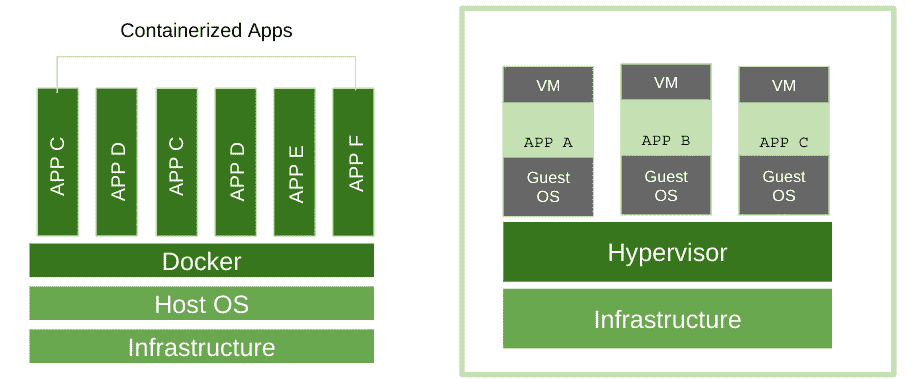

图 2.21 – 容器与虚拟机比较

### Docker 练习

在接下来的练习中，我们将通过一个基本的 Docker 示例，这个示例可以在你的计算机上完成。

步骤如下：

1.  按照此教程在你的机器上安装 Docker：[`docs.docker.com/get-docker/`](https://docs.docker.com/get-docker/)。

1.  创建 Dockerfile：

    ```
    touch Dockerfile
    ```

1.  使用 `vi` 编辑器向 Dockerfile 添加内容：

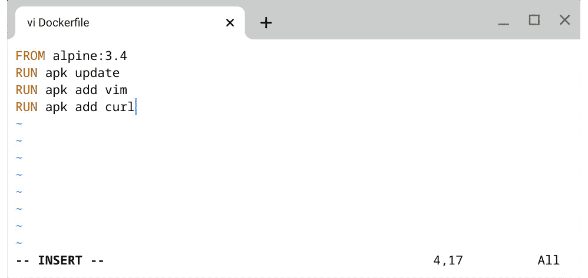

图 2.22 – Dockerfile

在将前四行添加到文件后，确保使用 `:w` 保存文件，然后使用 `:q` 退出 `vi`。

以下是 Docker 镜像：

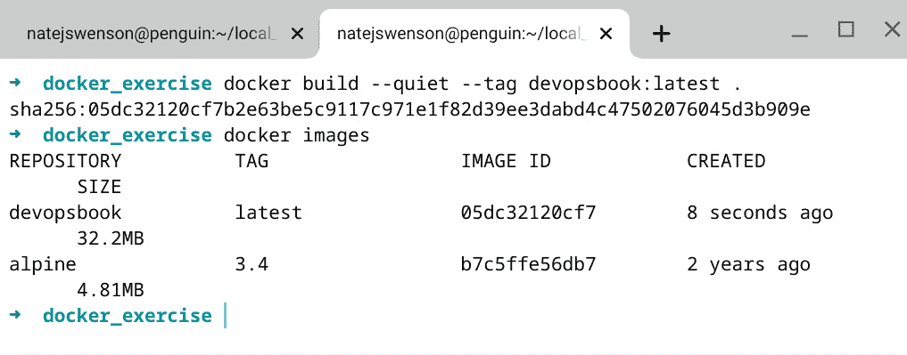

图 2.23 – Docker 镜像

如果你想查看构建过程中究竟发生了什么，可以省略 `--quiet` 命令。镜像构建并打标签后，你可以看到基础的 alpine 镜像以及 DevOps 书籍镜像可用。

1.  使用交互式终端命令运行你的容器：

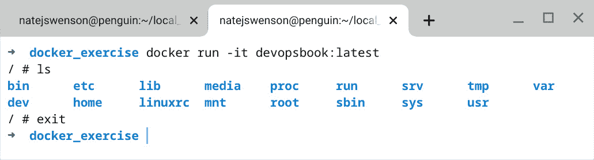

图 2.24 – 交互式终端命令

`–it` 命令以交互式终端方式运行容器，这意味着会为容器打开一个终端会话，允许你与容器进行交互。

1.  停止并删除你机器上的所有容器和镜像：

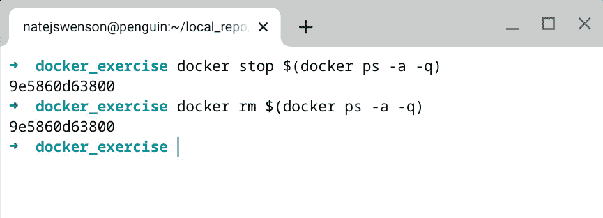

图 2.25 – Docker 镜像删除

在本章中，你了解了容器以及它们在 DevOps 中所扮演的角色。如果你跟着练习走，你将会创建一个 Dockerfile，创建一个 Docker 镜像，并在你的计算机上运行 Docker 镜像！希望这能激发你继续深入学习 Docker，因为这是一条深不见底的兔子洞！

## 微服务架构

在查看所需架构之前，我们将介绍其他过时的架构。

### 单体架构

我们首先介绍单体架构，它共享单一的代码库和数据库。由于没有任何分离，所有内容都必须同时发布/部署，这导致了客户请求和生产上线之间的长时间延迟。我曾在多家公司工作，每一家公司都有单体应用。很有可能你在职业生涯中会遇到这种情况。

### 面向服务的架构

**面向服务的架构** (**SOA**) 是朝着正确方向迈出的第一步——它通过服务拆分代码，从而减少了将更改部署到生产环境所需的努力和时间。面向服务的架构容易遇到与单体架构类似的问题，例如依赖关系，要求即使是一个服务进行修改，也需要重建整个应用。我曾与多家公司合作，它们的应用都使用了 SOA。

### 微服务

微服务架构因大型科技巨头如亚马逊、Netflix 和谷歌发布了其成功案例而受到广泛关注。SOA 和微服务的关键区别在于通信协议、存储和规模。首先，微服务使用与语言无关的协议与 UI 进行通信，虽然导致更多的远程调用，但也大大提高了容错性。其次，每个微服务都有自己的存储/数据库，这意味着每个微服务可以为其需求设计合适的数据库，而不是使用整个应用程序共享的数据库。最后，规模和缺乏相互依赖性是微服务与 SOA 之间的真正区别。微服务可以随时部署，而不会影响其他组件。SOA 共享数据库，各个服务之间仍然存在一定的依赖关系，这使得无法单独部署某个服务。大多数公司都在努力实现微服务架构，这也是一个非常关键的技能。

在下图中，您可以看到单体架构、SOA 和微服务架构的对比：

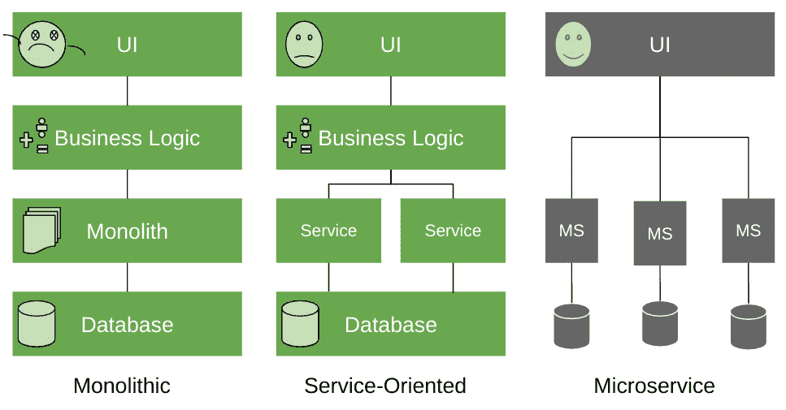

图 2.26 – 架构对比

接下来，我们将讨论软技能对于 DevOps 工程师的重要性。

## 软技能

软技能被定义为*能够使一个人有效且和谐地与他人互动的个人特质*。潮流正在发生变化，DevOps 工程师不能再仅仅依赖技术能力来取得成功。以下是 DevOps 工程师最重要的几项软技能。

### 同理心

在 DevOps 中，同理心是指理解同事和客户观点的能力，或者说是站在他人立场看问题的能力。以冷静的态度与同事沟通，这将有助于创造一个更愉快的工作环境，使新想法得以蓬勃发展。如果你的想法与同事或客户的不同，可以先对他们的观点给予积极反馈，然后再表达你的不同意见。与同事培养同理心确保每个人的想法都能被听到，存在的问题也能够得到解决。与客户培养同理心可以确保所有反馈都被采纳，最终达成令人满意的解决方案。

### 团队合作

在团队合作中，多个视角能够同时审视代码。协作可以确保每个人都保持一致，最终交付一个连贯的产品。

### 适应能力

技术不断变化，作为一名 DevOps 工程师，你必须证明自己能够快速转换思路，无论是学习一门新语言还是迅速调整优先级。在面试中，你可以讨论自己如何学习一门新的编程语言，或者如何在解决上一个项目时与不同部门合作。如果你不愿意改变，你在 DevOps 中不会成功。

### 良好的沟通能力

良好的沟通包括从面对面的交流到 Slack 消息的各种方式。作为一名 DevOps 工程师，你可能需要与完全远程办公的团队成员合作，他们可能处于不同的时区并且来自不同的文化背景。因此，你必须能够在这些情况下有效沟通。记住，人们都很忙，所以选择最有效和高效的沟通方式。

如果没有强大的软技能，找工作将会非常困难。DevOps 是一项团队运动，需要你与不同的人合作，在快速变化的环境中适应。没有戏剧性冲突或自我膨胀的空间；每个人的意见都很重要，你需要尊重这些意见。

# 初级 DevOps 认证

和其他行业一样，DevOps 的认证数量也在不断增加。证书是展示你知识的好方式，但它们无法替代经验，也不是获得 DevOps 工程师职位的必需条件。DevOps 认证可以帮助你在面试过程中脱颖而出，还能展示你持续学习的欲望。当到达绩效评估时，你可以利用自上次评估以来获得的新认证作为争取更多成绩的筹码。以下是你可以选择的不同证书列表：

## AWS 认证

AWS 提供了一些针对 DevOps 工程师的入门级认证，从 AWS 云实践者认证开始，这需要大约 6 个月的 AWS 实操经验。完成 AWS 云实践者考试后，你可以开始为 AWS 助理架构师考试做准备。以下是提供的认证：

+   AWS 云实践者 ([`aws.amazon.com/certification/certified-cloud-practitioner/`](https://aws.amazon.com/certification/certified-cloud-practitioner/))

+   AWS 助理架构师 ([`aws.amazon.com/certification/certified-solutions-architect-associate/`](https://aws.amazon.com/certification/certified-solutions-architect-associate/))

## Google Cloud 认证

对于 Google，并没有通用的初级认证，但助理云工程师认证是进入 GCP 的一个良好入门。

助理云工程师 ([`cloud.google.com/certification/cloud-engineer`](https://cloud.google.com/certification/cloud-engineer))

## Azure 认证

对于 Azure，存在一个基础认证，涵盖了很多基础内容。还有其他多个认证，但我们将在下一章的 *专业能力* 部分介绍更多云认证。

基础知识 ([`docs.microsoft.com/en-us/learn/certifications/exams/az-900`](https://docs.microsoft.com/en-us/learn/certifications/exams/az-900))

## 其他资源

对于初学者内容，Udemy、EdX 和 Coursera 上有许多课程，具体取决于你感兴趣的领域。涵盖 Docker、Terraform 和 Kubernetes 的认证，以及高级云专业认证和职业认证，将在下一章中讲解。

# 总结

在本章中，你学习了成为初级 DevOps 工程师所需的基本技能。这些技能包括操作仅文本终端如 Bash，使用各种脚本语言进行自动化，以及理解 Git 和源代码管理。你还了解了 Ansible 和 Terraform 等基础设施管理工具的基础知识，并获得了对 CI、CD 和流水线的基本理解。

在下一章中，你将更深入地了解各类 DevOps 专业角色所需的技能。
