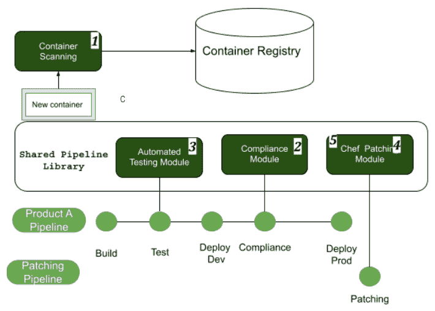

# *第三章*：高级 DevOps 实践者的专业技能

随着 DevOps 工程师在其职业特定领域的进展，他们可能因其自然能力或技能而脱颖而出，或因对该主题的强烈喜爱而脱颖而出。这导致 DevOps 工程师走上了专业化的职业道路。本章的重点将放在进入不同 DevOps 专业所需的技能上。

中高级内容

本章对于任何对 DevOps 领域感兴趣的人都充满了有用信息；然而，它是为已经实践了至少 1-3 年的 DevOps 工程师而设计的。本章假设个人已经掌握了前一章节列出的知识。

本章将涵盖以下专业 DevOps 能力：

+   CI/CD 管道 DevOps 工程师

+   基础设施即代码

+   云和应用现代化

+   容器和容器管理

+   安全性

+   高级 DevOps 认证

+   能力矩阵

# CI/CD 管道 DevOps 工程师

一位 CI/CD 管道 DevOps 工程师负责从开发人员的代码自动化到生产环境的端到端过程。由 CI/CD 工程师开发的策略是公司 DevOps 路线图的中心关注点。重新审视前一章节的无限 DevOps 循环，您将想起 DevOps 的所有阶段都包含在 CI/CD 循环中，如下图所示：

图 3.1 – 无限 DevOps 循环

对于 CI/CD DevOps 工程师来说，最受欢迎的技能之一是能够创建、维护和推广共享管道库的能力。

## 维护共享管道库

CI/CD 管道工程师将维护共享管道库及与 DevOps 生命周期的每个阶段相关的所有标准和实践。

CI 工具管理

根据公司规模的不同，CI 工具管理的责任可能由管道工程师负责；对于本书，我们将在*云和应用现代化*部分讨论工具管理。

要维护共享管道，DevOps 工程师必须对管道工具和管道架构具有专家级的理解。维护共享管道库还涉及管理和维护一个内部开源项目。当提出将创新想法添加到管道时，DevOps 工程师的角色是确保其正确实施。

定义：内部开源

内部开源是采用开源软件开发最佳实践，并在组织内建立类似开源的文化，用于开发其非开源和/或专有软件。

以下图示是共享管道库如何工作的图形表示：

图 3.2 – 共享管道库

在前面的图表中，涉及的内容很多；首先，我们有一个共享的管道库，其中包含不同的组件模块，这些模块可以被多个产品使用。我们有一位开发人员开发了一些他们认为对公司其他部门有用的新功能，因此他们提交了一个拉取请求，这个请求需要在正式成为库的一部分之前由 CI/CD DevOps 工程师进行审核。最后，你可以看到两个不同的产品在它们自己的管道中使用了共享库的组件。

### 与管道集成的所有权

一名 DevOps 管道工程师需要对管道各阶段的工具有广泛的了解。以下图表展示了管道不同阶段可用的众多工具：

图 3.3 – CI/CD 工具

上面的图表旨在展示 CI 管道各个阶段可用的众多工具。一个有价值的资源，可以让你查看并研究每个工具的是 digital.ai 的 DevOps 工具周期表（[`digital.ai/periodic-table-of-devops-tools`](https://digital.ai/periodic-table-of-devops-tools)）。

CI/CD DevOps 工程师负责确保各种工具可以集成到公司的管道中。必须开发与工具 API 连接的模块，然后将解决方案提交安全审查，以确保其符合公司标准。一旦它成为管道的一部分，CI/CD 工程师负责在工具版本和 API 变化时对各种集成进行持续支持。

在本节中，你学到了一名 CI/CD DevOps 工程师必须了解 CI/CD 生命周期的所有阶段，并且要了解每个阶段使用的各种工具。

在下一节中，我们将介绍成为一名成功的 DevOps 基础设施工程师所需的技能。

# 基础设施即代码

DevOps 基础设施工程师负责配置、管理和维护公司各个应用程序中使用的基础设施。通常被称为 **基础设施即代码（IaC）** 工程师，IaC 工程师与架构师密切合作，并且需要与多个不同的团队保持良好的关系。在本节中，我们将介绍成为一名成功的 DevOps IaC 工程师所需的技能，以及你需要深入了解这一角色的工具。

### 网络基础设施设计

DevOps IaC 工程师与架构师密切合作，在某些情况下，还会在许多项目中担任架构师的角色。

网络基础设施设计：定义

网络基础设施设计是一个过程，包括网络综合、拓扑设计和网络实现，旨在确保网络或服务满足运营商和用户的需求。

### 存储管理

DevOps IaC 工程师需要掌握广泛的存储管理和优化相关知识。存储管理涵盖了卷迁移、过程自动化、灾难恢复、数据复制、自动配置、快照和镜像、存储虚拟化以及压缩等内容。

### 容器化（Docker 和 Kubernetes）

DevOps 工程师需要熟悉容器；然而，专注于基础设施管理的 DevOps 工程师需要能够处理大型 Docker 和 Kubernetes 集群的编排和管理。像 Terraform 和 Ansible 这样的工具可以帮助完成这项工作。

容器化的主题将在本章的*容器与容器管理*一节中详细讨论。

### 网站可靠性工程

**网站可靠性工程**（**SRE**）专注于系统的可用性和可靠性，最早由 Google 的 Ben Treynor 于 2003 年提出。SRE 的目标与 DevOps 相同——缩小开发与运维之间的差距。如果你在一家大型组织工作，SRE 和 DevOps 将会是两个独立的职能，因为它们的目标和关注点不同；然而，SRE 和专注于基础设施的 DevOps 工程师所需的技能非常相似。SRE 侧重于保持系统运行和可用，而 DevOps 旨在减少市场推出时间并支持快速变更。在以下的图示中，应该占据大部分时间的内容是 SRE 层级结构的基础：

图 3.4 – SRE 层级结构

上述图示展示了 SRE 基础的主动式监控方法，接着是快速且彻底的事件响应和详细的*无责备*事后分析。SRE 的核心理念是快速发现和修复问题，并通过变更来避免将来再次出现同样的问题。

在本节中，我们只是浅尝辄止地探讨了这一深奥且有趣的话题。如果你想深入了解 SRE，可以查看 Google 出版的 SRE 书籍：[`sre.google/sre-book/table-of-contents/`](https://sre.google/sre-book/table-of-contents/)。在本章的最后一节，我们将列出与 SRE 相关的多个认证。

在本节中，你了解了成为专注于基础设施的 DevOps 工程师所需的技能。你需要具备网络设计、存储管理、SRE 和容器化的技能。

在下一节中，我们将介绍专注于云计算和应用现代化的 DevOps 工程师所需的技能。

# 云与应用现代化

在本节中，你将学习云计算和应用现代化，并了解 DevOps 工程师在这一领域中的特殊角色。首先，我们将讲解所需的高级云计算知识，随后介绍云现代化技术。

DevOps 领导者需要调整以适应对更新服务的需求，同时保持、运营并改进现有的应用程序组合。这个新需求来自于现代技术的引入，随着技术的不断发展，这种需求也在不断增加。有许多应用程序现代化方法（包括重新托管、重新平台化和替换），它们有不同的目的、效果、价值、成本、风险和影响。

## 高级云技能

成为一名 DevOps 云工程师，除了深入了解云平台，还必须具备强大的脚本编写技能。你需要理解不同云产品的功能及其协同工作方式。如果你在一个多云环境中工作，以下图示会非常有用：

图 3.5 – 云提供商对比

我对 Amazon 的术语非常熟悉；当我需要在 GCP 工作时，旁边有一个备忘单非常有用。方法论是相同的；不过，不同云提供商之间的术语差异巨大。

DevOps 云工程师还需要具备将应用程序和服务部署到云资源的能力；这也是不同云提供商之间差异很大的一个方面。作为 DevOps 工程师，理解云提供商的 CLI 工具也非常重要。你很少会通过**图形用户界面**（**GUI**）与资源进行交互；相反，你会使用 CLI 工具或 API 调用各种云服务。以下链接是关于各个云 CLI 工具的文档：

+   GCP: [`cloud.google.com/sdk`](https://cloud.google.com/sdk)

)

+   AWS: [`aws.amazon.com/cli/`](https://aws.amazon.com/cli/)

)

+   Azure: [`docs.microsoft.com/en-us/cli/azure/install-azure-cli`](https://docs.microsoft.com/en-us/cli/azure/install-azure-cli)

)

在下一节中，我们将介绍云技术的另一个方面——应用程序现代化。这个话题内容丰富，没有有效的方式可以在没有实践的情况下掌握它；然而，Gardner 提供了一些对那些想要深入了解的人来说很有用的资源。

## 应用程序现代化

作为一名专注于云技术和应用现代化的 DevOps 工程师，评估现代化需求背后的驱动力至关重要。驱动力可以分为需求方和供给方两方面：

+   **供给方**：

    +   **适应性**：缺乏实施新需求的能力

    +   **价值**：缺乏提供的价值、支持的质量以及所提供的信息

    +   **敏捷性**：缺乏以可接受的风险水平快速进行变更的能力

+   **需求方**：

    +   **成本**：与其提供的价值相比，拥有成本较高。

    +   **复杂性**：复杂性导致可维护性差，并在变更时增加风险。

    +   **风险**：安全性、合规性、可支持性或可扩展性风险。

在 DevOps 工程师审查并评估系统、确定问题后，必须识别问题的根本原因。

## 选择现代化方法

现代化的原因可以分为三大类：功能性、技术性和架构性。一旦确定了原因，DevOps 工程师必须决定最佳的现代化方法。以下是一个图示，展示了不同现代化方法在努力和复杂度上的差异：

图 3.6 – Gartner 的现代化方法在解决根本原因方面的能力

作为一名专注于云和应用现代化的 DevOps 工程师，你需要对不同的现代化方法有深入的理解。Gartner 发布了一篇文章，[`www.gartner.com/doc/reprints?id=1-25RJ3RG2&ct=210408&st=sb`](https://www.gartner.com/doc/reprints?id=1-25RJ3RG2&ct=210408&st=sb)，该文详细介绍了上述每种方法。

在本节中，我们介绍了作为专注于应用现代化和云的 DevOps 工程师所需的技能。专注于云的 DevOps 工程师必须非常熟练地进行云应用的配置和部署。DevOps 工程师需要对云 API 和 CLI 的功能有深刻理解，并理解云服务如何与其他云服务提供商的产品进行比较。此外，专注于云的 DevOps 工程师可能还需要协助应用现代化项目。

在接下来的章节中，我将讨论作为专注于容器的 DevOps 工程师所需的技能。

# 容器与容器管理

容器管理、编排和维护是所有 DevOps 工程师必须掌握的技能；然而，随着云原生 Kubernetes 和其他云编排工具的出现，这已迅速成为一个专业领域。在本章中，我们将介绍作为专注于容器管理的 DevOps 工程师所需的技能。

成为容器专家所需的素质

能够开创、采用并掌握新的容器方法论是区分通才与容器管理专家的关键技能。

## 容器管理软件

专注于容器化的 DevOps 工程师必须精通容器管理软件。最广泛使用的容器管理软件包括 Docker 和 Kubernetes。容器管理软件的目的是五个方面：自动化、监控、安全、扩展和部署。我们将首先讨论自动化方面：

+   **容器自动化**：容器编排的自动化涵盖并提升了监控、安全、扩展和部署的水平。

+   **监控**：容器需要监控，例如活跃度探针，这些探针与监控仪表盘和警报关联，能够帮助及早发现和修复问题。有多种工具可用于监控，包括 Prometheus、Dynatrace 和 Datadog。

+   **安全**：容器安全是 DevOps 工程师最关心的问题，因为如果容器被攻破，整个应用都暴露在外。为了确保你的容器生态系统安全，首先要确保所使用的基础镜像是安全的。确保容器镜像来自受信任的源并且已签名，运行时操作系统层是最新的，并确保你有更新镜像的修补策略。接下来，确保你的镜像存储在安全的位置，并实施基于策略的身份验证，以减少人为错误引入容器的机会。集成安全测试和扫描并自动化部署过程是减少风险的另一种方式。像 Twistlock 这样的工具可以帮助实现这一目标。扫描容器可以让容器被重建并重新部署，而不是尝试修补正在运行的容器。

+   **扩展**：容器的设计是不可变的，这意味着代码在部署后不能更改。容器的一个好处是，通过适当的配置和监控，扩展某个组件的实例数目变得十分简单。困难的部分是确定在何时进行扩展的界限。

本部分描述了成为专注于容器的 DevOps 工程师所需的条件。在本部分的结尾，我将分享一些我在学习 Kubernetes 时使用的动手教程：

+   Kubernetes 硬核实践: [`github.com/kelseyhightower/kubernetes-the-hard-way`](https://github.com/kelseyhightower/kubernetes-the-hard-way)

)

+   Kubernetes 培训课程: [`www.udemy.com/course/certified-kubernetes-application-developer/`](https://www.udemy.com/course/certified-kubernetes-application-developer/)

在接下来的部分中，我们将讨论在 DevSecOps 领域取得成功所需的条件，换句话说，就是专注于安全的 DevOps 工程师所需的技能。

# 安全

专注于安全的 DevOps 工程师通常被称为 DevSecOps 工程师。DevSecOps 工程师对 CI/CD 过程也有深刻的理解。

安全是每个人的责任

安全是每个人的工作。任何与交付软件相关的人都在确保应用安全方面扮演着角色。

DevOps 安全工程师的工作是确保安全从项目开始时就被融入和包含。

专注于安全的 DevOps 工程师的职责分为两个方面：CI/CD 过程和环境与数据。我们首先来看 CI/CD 过程安全以及实施它所需的技能。

## CI/CD 过程安全

让我们回顾一下之前讨论的流水线；以下图表中已添加数字，以便与以下安全项对应：

+   **容器扫描** (*1*): 容器扫描应添加到将新容器引入注册表的过程中。像 Twistlock 这样的工具被广泛使用。最受欢迎的容器扫描工具是 Twistlock；然而，也有许多其他工具，它们可以在这里查看：[`techbeacon.com/security/17-open-source-container-security-tools`](https://techbeacon.com/security/17-open-source-container-security-tools)。

+   **安全测试** (*2*): 这包括在构建过程中运行**安全静态分析测试**（**SAST**）工具，以及在将任何预构建的容器镜像拉入构建流水线时扫描已知的安全漏洞。在以下示例中，这些库是合规性模块的一部分。关于 SAST 工具，市面上有许多工具，包括开源和付费工具。

+   **安全验收测试** (*3*): 这种类型的测试被称为**动态应用安全测试**（**DAST**）。其目的是在应用程序运行时动态地测试安全漏洞。该类别的综合工具列表可以在此找到：[`owasp.org/www-community/Vulnerability_Scanning_Tools`](https://owasp.org/www-community/Vulnerability_Scanning_Tools)。

+   **补丁和安全更新** (*4*): 补丁和安全更新应该有一个流水线，以便它们可以自动运行并按计划进行。可用的工具差异很大。根据我的经验，最好的补丁工具有时只是一个在流水线中执行的简单脚本。做你自己的研究，形成你自己的观点。

+   **配置管理** (*5*): 其目的是确保所有基础设施遵循公司安全和合规政策。通常，这在基础设施配置或应用配置更改后运行。

图 3.7 – CI/CD 安全

将安全性集成到 CI/CD 流水线中是棘手的，因为它需要领域知识、特定工具的知识以及对行业安全最佳实践的理解。一篇帮助我更好理解合规性流水线的文章可以在以下链接找到：[`itrevolution.com/book/devops-automated-governance-reference-architecture/`](https://itrevolution.com/book/devops-automated-governance-reference-architecture/)。在下一部分，我们将讨论 DevSecOps 工程师需要关注的领域，以确保环境和数据的安全。

# 环境和数据安全

各种环境及其相关数据是公司最宝贵且最脆弱的资产，如果没有得到正确保护。确保最佳实践以自动化和可扩展的方式实施是 DevOps 工程师的职责。以下是一些概念，将有助于进一步研究该主题：

+   **最小信任与零信任原则**：过程和应用程序被授予其正常运行所需的最小访问权限。听起来简单，但实际上这是一个庞大的工程，因为每个账户都需要进行审计，以确保它具有正确的访问权限。最小权限原则是零信任模型的核心部分；然而，零信任模型更为全面，并且要求更加严格。此外，零信任的实施和维护更为复杂，因为需要更多的访问策略。以下图表展示了零信任的三个原则：明确验证、使用最小权限访问和假设已被攻破：

图 3.8 – 零信任原则

+   **隔离原则**：隔离原则适用于在微服务架构中运行的容器。隔离原则包括多个组件，如状态隔离、空间隔离、时间隔离和故障隔离。

+   **数据加密**：具有集成功能的容器编排平台有助于减少未经授权访问的可能性。

+   **安全 API 网关**：安全的 API 增加了授权和路由的可视性。通过减少暴露的 API，组织可以减小攻击面。

# 高级 DevOps 认证

随着你作为 DevOps 工程师的进展，能够获得的认证数量也会增加。虽然专门的 DevOps 角色通常不要求拥有认证，但认证能迅速展示你的技能和专业知识，并且体现你对行业的承诺。

## AWS 认证

AWS 提供了多个高级认证，具体取决于你的职业发展方向。大多数高级 AWS 认证要求至少拥有 AWS 云实践者认证。以下是所提供的认证列表：

+   **AWS 认证解决方案** **架构师 – 专业** ([`aws.amazon.com/certification/certified-solutions-architect-professional/`](https://aws.amazon.com/certification/certified-solutions-architect-professional/))

+   **AWS 认证** **DevOps 工程师 – 专业** ([`aws.amazon.com/certification/certified-devops-engineer-professional/`](https://aws.amazon.com/certification/certified-devops-engineer-professional/))

+   **AWS 认证** **安全 – 专业** ([`aws.amazon.com/certification/certified-devops-engineer-professional/`](https://aws.amazon.com/certification/certified-devops-engineer-professional/))

## Google Cloud 认证

Google 提供了多个与 DevOps 相关的高级认证，具体取决于你感兴趣的专业领域。以下是所提供的认证列表：

+   **专业云** **架构师** ([`cloud.google.com/certification/cloud-architect`](https://cloud.google.com/certification/cloud-architect))

+   **专业云** **DevOps 工程师** ([`cloud.google.com/certification/cloud-devops-engineer`](https://cloud.google.com/certification/cloud-devops-engineer))

+   **专业云安全** **工程师** ([`cloud.google.com/certification/cloud-security-engineer`](https://cloud.google.com/certification/cloud-security-engineer))

+   **专业云网络** **工程师** ([`cloud.google.com/certification/cloud-network-engineer`](https://cloud.google.com/certification/cloud-network-engineer))

## Azure 认证

Azure 提供众多高级认证，包括 DevOps 和安全技术的认证路径。DevOps 认证路径为 AZ-900、AZ-104，然后是 AZ-400。架构师的路径为 AZ-90、AZ-300，然后是 AZ-304。安全认证的路径为 AZ-900 后跟 AZ-500。以下是所提供的认证列表：

+   **Microsoft Azure 管理员** ([`docs.microsoft.com/en-us/learn/certifications/exams/az-104`](https://docs.microsoft.com/en-us/learn/certifications/exams/az-104))

+   **Microsoft Azure 架构技术** ([`docs.microsoft.com/en-us/learn/certifications/exams/az-303`](https://docs.microsoft.com/en-us/learn/certifications/exams/az-303))

+   **设计与实施 Microsoft DevOps 解决方案** ([`docs.microsoft.com/en-us/learn/certifications/exams/az-400`](https://docs.microsoft.com/en-us/learn/certifications/exams/az-400))

+   **Microsoft Azure 架构设计** ([`docs.microsoft.com/en-us/learn/certifications/exams/az-304`](https://docs.microsoft.com/en-us/learn/certifications/exams/az-304))

+   **Microsoft Azure 安全技术** ([`docs.microsoft.com/en-us/learn/certifications/exams/az-500`](https://docs.microsoft.com/en-us/learn/certifications/exams/az-500))

## Kubernetes 认证

Kubernetes 是最大的开源项目之一，也是雇主在招聘 DevOps 工程师时所看重的顶级技能之一。以下是所提供的认证：

+   **认证 Kubernetes 管理员** (**CKA**) ([`www.cncf.io/certification/cka/`](https://www.cncf.io/certification/cka/))

在下图中，您可以看到三大云服务提供商的认证路径——AWS、Azure 和 GCP：

图 3.9 – 云认证路径

在接下来的章节中，我们将讨论 DevOps 工程师的技能矩阵。

# 能力矩阵

能力矩阵是一个可视化的图表或图形，展示了公司内各个职位所需的技能和教育背景。在我们深入了解能力矩阵定义之前，有几点需要先理解。

首先，并不是所有组织都使用能力矩阵来招聘和晋升员工，其次，使用能力矩阵的每个组织会有不同的要求。

决定在能力部分进行讨论的原因是，每个公司都有不同的能力标准，并且这些能力与不同的级别相对应。这意味着，在 X 公司的一名高级 DevOps 工程师可能与谷歌的 DevOps 工程师相对应。这在我职业生涯初期曾让我感到焦虑和沮丧。我希望这一部分能为您提供足够的清晰度，帮助您理解级别、能力和薪酬之间的关系。

本章的目的是向您介绍能力矩阵的概念，并为您提供另一种工具，用于在技能提升的过程中跟踪您的进展。我们将从解析能力矩阵开始。

## 矩阵解析

能力矩阵分为三个主要部分：**技能**、**级别**和**能力**。

图 3.10 – 能力矩阵

首先，我们将讨论技能部分。

### 技能

技能部分通常位于图表的垂直（*y*）轴上。技能可以根据公司需要的具体程度进行细分或概括。图表上表示的技能将特定于您所在的部门，因此，如果您的部门存在能力矩阵，最好保持更新并跟进。接下来，我们将讨论矩阵的水平轴。

### 级别

该级别位于图表的水平（*x*）轴上。不同公司之间的级别有所不同。我目前在一家组织工作，所有个人贡献者都被映射到不同的助理级别。如果你在谷歌工作，你的角色会被映射到 L1 到 L11，其中 L3 是工程师，L11 是资深谷歌专家。没有能力映射的级别不过是一个没有意义的术语。不幸的是，级别并不是通用的，如果你决定在当前组织之外的公司追求职业生涯，你需要调查当前技能在其他地方的映射情况。如果你有兴趣了解不同公司级别的更多信息，一个有价值的资源是 levels.fyi：[`www.levels.fyi/`](https://www.levels.fyi/)。接下来，我们将讨论能力。

### 能力

能力被定义为成功完成某项任务的能力。能力位于图表中水平和技能的交叉点。每个级别对于每项技能都有不同的成功标准，这意味着成功是相对于您所处的级别而言的。越来越多的公司在每个级别内采用能力带。这样做的目的是提供入门级能力、期望的能力，有时还会有更高级别的能力：

+   **入门**能力是指在给定级别上，某项技能被考虑为角色的最低能力。如果你在所有领域都处于最低范围，你找到工作的机会并不大。然而，如果只有少数几个领域处于最低范围，这些可以成为你在面试时谈论的内容，展示你正在努力改进的方面。

+   **期望的**能力是指该级别中约 50%个体的能力，或者更简单地说，就是招聘团队希望找到的能力水平。招聘经理的理想情况是找到一个在各方面都具备期望能力的候选人。

+   **高级**能力是指在当前级别和下一个级别之间出现大量重叠的点。如果你在多个技能领域处于高级能力区间，你就准备好晋升到下一个级别。

下图显示了不同级别之间存在能力重叠。这一特点旨在允许不同级别之间的灵活流动：

图 3.11 – 能力矩阵级别

你的薪资范围受你的级别限制，但在同一级别内，技能能力决定你在该范围内的位置。以下部分将详细讨论这一点。

## 与级别和能力相关的薪酬

薪酬受公司内各级别薪资区间的限制。不同级别的薪资区间会重叠；这意味着，一位高级助理可能会获得比首席助理更高的基本薪资。下图很好地展示了这一点：

图 3.12 – 薪酬 – 级别图

为了在每个级别内实现薪酬的标准化，经理们通常会被要求在每个薪资区间内确定一个特定的百分位。这在查看带有薪资范围的职位发布时非常有用。

# 摘要

在本章中，你了解了 DevOps 专家角色所需的技能，包括 CI/CD 管道专家、基础设施专家、云计算与应用现代化专家、容器专家以及安全专家。本章的主要收获是，DevOps 专业技能需要通过实践和投入来磨练。我们还讨论了能力矩阵及其如何与不同薪资等级相对应。

在下一章中，我们将讨论如何在网上重塑自己。
