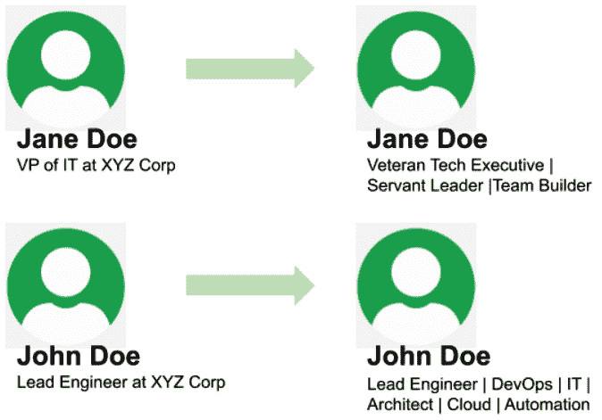

# 第四章: 重塑自我

你不断学习、成长，成为更好的自己。那些经常见到你的人知道你是谁，了解你拥有哪些技能；然而，对于世界上其他的人来说，你是通过你的社交档案来定义的。在本章中，我们将指导你如何确保你的社交档案、简历和个人网页与你现在的状态以及你想要达成的目标相匹配。我们将从更新你的社交档案开始，然后处理其他在线站点，如 GitLab 和 GitHub，最后确保你的简历与社交档案一致。

本章将涵盖以下主要内容：

+   改进你的 LinkedIn 个人资料的方法

+   更新简历以匹配你所追求的职业

+   更新或创建个人网页

+   利用 Twitter 和其他社交档案

# 改进你的 LinkedIn 个人资料的方法

你的社交档案被所有人看到，招聘人员也在不断查看它们。一个更新且维护良好的**LinkedIn**个人资料是招聘人员和招聘经理最容易注意到的方式。在这一部分，我们将介绍所有必要的更改，确保你的 LinkedIn 个人资料最好地代表你自己，并能被更多人看到。

## 更新你的头衔

你的头衔在 LinkedIn 上非常显眼，默认情况下，它显示的是你的职位和工作地点。发挥创意，利用它展示你的顶级技能，宣传你的求职信息，或者使用独特的标语，确保你的个人资料在人群中脱颖而出。

如果你是一个有经验的 DevOps 工程师，正在寻找职业转型，可以尝试以下头衔：

*DevOps | 云计算 | 容器 | 开放远程机会*

如果你不是在寻找新职业，但想要让自己脱颖而出，可以尝试以下头衔：

*经验丰富的云工程师 | AWS | GCP | AZURE*

以下是两个虚构的个人，一个左侧是平淡无奇的头衔，右侧则是大胆清新的头衔：



图 4.1 – LinkedIn 头衔更新

你的头衔最多可以包含 220 个字符，应该描述你擅长的领域以及人们为什么应该对你感兴趣。包含像**DevOps**、**云计算**和**AWS**这样的关键词，会增加你在 LinkedIn 上被搜索到的次数。

在下一部分，我们将讨论为什么推荐很重要以及如何请求推荐。

## 推荐意见

LinkedIn 可以请求与你曾共事的同事和经理进行推荐，并在你的个人资料上展示这些推荐。这使得访问你个人资料的人，在面试之前就能看到与你共事过的人的推荐意见。以下是请求推荐时的一些提示：

+   推荐应来自与你关系良好的人，最好是在 LinkedIn 上请求推荐之前，你能够请对方提前推荐你。

+   推荐应该来自你尊敬的人，以及在你所在行业中受人尊敬的工作。

+   如果你是一个资深的 DevOps 专业人士，推荐应该来自你曾指导过的人、其他资深的 DevOps 同行，或者是与你有紧密合作关系的主管或副总裁。

+   不要向很长时间没有联系过的人或与你关系不好的人请求推荐。

+   来自你亲近教授的推荐非常有影响力。

+   不要请求另一位初级 DevOps 工程师或也在寻找第一份工作的人的推荐。相反，向你的导师（如果有的话）请求推荐。关于导师的重要性，将在*第六章*《导师制》中讨论。

如果你收到一条推荐并且对其外观不满意，可以要求修改。确保提供具体的反馈和请求更改的理由。写得不好的推荐可能弊大于利。以下是一个写得不好的推荐示例：


](img/Figure_4.2_B18117.jpg)

图 4.2 – 一条不完整且模糊的推荐

前面推荐的问题在于语法差且缺乏细节；约翰擅长哪些任务，为什么？如果我看到这个推荐，我会感到很疑惑；它来自一位非常有信誉的人，但缺乏任何有意义的细节。以下是经过更好语法修正和更多细节补充后的同一条推荐：


](img/Figure_4.3_B18117.jpg)

图 4.3 – 一条写得好的推荐

总结这一部分，推荐很重要，并且当它来自一位受人尊敬的个人且写得好的时候，可以帮助你找到工作。在接下来的部分中，我们将讨论你应该在 LinkedIn 个人资料中包括但可能未包括的部分。

## 额外的部分

在 LinkedIn 中有些个人资料部分，可能是你没有时间更新，或者根本不知道有这些内容。LinkedIn 不像简历那样有单页限制；如果你有可能增加求职机会的信息，应该把它们包括在内。

### 精选内容

精选内容部分位于页面的顶部，允许你添加已发布的文章、参与的项目以及个人网站。这应该是能够公开分享的职业成就的亮点。精选内容部分的一个优点是，它可以轻松地与成就部分的内容结合，我们接下来将讨论这个部分。

### 成就

成就往往容易被忽视。成就部分可以用来添加出版物、专利、课程、项目、荣誉和奖项、考试成绩、组织和事业。成就部分的信息可以作为精选内容添加，并显示在你页面的顶部。

### 经验

经验部分通常由个人在 LinkedIn 上直接更新；然而，描述每项经验的细节往往不足，尤其是当你在一个职位上待了很长时间时。一个好的规则是，每次完成一个项目或计划时更新你的经验部分。如果你正在寻找 DevOps 工程师的第一份工作，尝试突出你过去职位中与 DevOps 工程师相关的经验。

### 个人资料照片

更新你的个人资料照片并不是找到工作或被认出的必要条件；然而，这样做并不会有坏处。拍摄你家庭照片或宠物照片的人可以为你拍一张头像，用于个人资料上。拥有个人资料照片的档案在搜索算法中的排名较高，因此会有更多的招聘人员和招聘经理看到你的个人资料。

在下一节中，我们将讨论技能认证的力量以及技能考试。

### 技能认证

技能认证可以由你添加，并由你的任何一位一度联系人验证。验证你技能的个人越多，别人搜索该技能时，你被找到的可能性就越大。如果你正在寻找 DevOps 工程师的工作，获得 AWS、Python 和 DevOps 等技能的认证可以帮助你被注意到。为了进一步增加基于某一技能被找到的可能性，你可以参加技能评估。

LinkedIn 技能评估是针对特定技能的专业考试；通过后，你会在个人资料上获得一个徽章，告诉大家你已经通过了技能评估。这一认证再次提高了你在搜索算法中的排名，增加了被招聘人员注意到的机会。最后，我们将讨论与同行业内其他专业人士互动的内容。

### 分享、点赞和评论

与其他 DevOps 专业人士互动已经被证明是我在 LinkedIn 上建立联系和关系的最强有力手段。在 *第五章*，*建立你的网络*，我们将讨论帮助你在 LinkedIn 上建立关系的策略。每次你分享、点赞或评论内容时，你被注意到或出现在潜在雇主的动态中的可能性都会增加。

在这一部分中，我们讨论了帮助增加在 LinkedIn 上被注意到可能性的策略；在本章的下一部分，我们将讨论确保你的简历准备好呈现给招聘经理的策略。

# 更新你的简历以匹配你追求的职业

即使你并不积极寻找工作，保持一份更新的简历也是一种良好的做法，因为完美的机会可能随时出现。在这一部分，我们将讨论一些提升简历的技巧，这些技巧将带来更多的回调，甚至可能是面试机会。

无论你的技能有多强，经验有多少，你的简历应该控制在一页纸内。如果埃隆·马斯克能将自己的经验压缩到一页纸上（[`novoresume.com/career-blog/elon-musk-one-page-resume`](https://novoresume.com/career-blog/elon-musk-one-page-resume)），你也能做到。简历的目的是让招聘人员和招聘经理在不到一分钟的时间内快速了解候选人。有些公司在流程中加入了计算机化的层面，会扫描你的简历中的关键词，并在将其传递给人工审核之前验证是否符合要求。接下来，我们来看一下简历的六个部分应该包括什么，首先是联系方式。

## 联系方式

联系方式至少应包括你的名字（与在线个人资料上显示的相同）、电子邮件地址和电话号码。建议包括你的位置和个人资料信息，特别是如果你刚刚更新了这些信息。你不鼓励在简历中包含照片，因为招聘人员认为这可能会给选择过程带来偏见。接下来是至关重要的信息：你的目标。

## 目标

这一部分描述了你能提供什么以及你希望获得什么类型的职位。目标应该简洁明了，不超过一两句话。根据你的个人喜好，你可以写一个通用的目标，例如以下内容：

*拥有 20 年经验的 DevOps 领导者，专注于云原生安全和 Kubernetes，寻求加入一家有强大工程文化的快节奏公司。*

上述目标中的一个要点是过度使用关键词，强调你在寻找的职位中带来的技能。与此相对的方式是一个针对具体职位的目标，例如以下示例：

*拥有 20 年经验的 DevOps 领导者，专注于 CICD、安全和 Kubernetes，寻求加入 XYZ 公司担任 DevOps 工程师主管职位。*

后一种方法是更好的选择，因为它允许你挑选关键词并将其包含进去，同时通过使用具体的职位名称和公司名称让其更加个性化。另一方面，你可能希望尽可能多地申请职位；在这种情况下，你应始终准备一份更新过的简历，里面包含一个通用的目标可以使用。关于目标的一个关键点是，它应包含你希望被注意到的关键词，无论是自动检查器还是人类审核。 在前面的例子中，我们使用了几个关键词，包括工作经验。接下来，我们将讨论简历中最大的一部分：你的工作经验。

## 经验

经历应按时间倒序排列，最新的职位排在最上面。每个职位应包含五个关键信息：**职位**、**雇主**、**开始日期**、**结束日期**以及**成就**。所有信息应尽可能准确。始终假设你的信息会被验证；即使是诚实的错误也可能导致失去工作机会。成就应具体并包含量化数据。

*与应用团队合作，显著提高面向客户的应用程序可用性*

上述示例是一个友好的开场白；然而，它会让招聘人员或招聘经理感到困惑，因为缺乏清晰性，并让读者不清楚具体做了什么。一个写得不清楚的成就可能会让你的简历被放入拒绝堆，尤其是在申请竞争激烈的职位时。改进后的写法如下：

*在 AWS 中为应用程序 x 实现了地理冗余和自动故障切换，导致应用程序的可用性从 98.7%提高到 99.9%。*

上述示例清晰地阐明了所取得的成就，并提供了具体细节。此类细节能将你的简历从拒绝堆中移到面试堆中。

对于新晋 DevOps 工程师来说，一个常见的挑战是缺乏经验。别担心，你只需要记录那些为你担任 DevOps 工程师角色做好准备的经历。如果你当前的职位是软件工程师，确保专注于与你 DevOps 职位相关的成就，强调相关的工具和原则。以下这样的经历描述会比较合适：

软件工程师 | XYZ 公司 | 2020 年 5 月 - 至今

将端到端测试框架 Test Café集成到 Jenkins CI 流水线中，从而减少团队在本地测试所花费的时间，减少了 30%。

使用 AWS 服务开发 API，目前每月处理超过 20,000 个请求。

将我的 Test Café方法贡献给 Jenkins 全球流水线库内源项目，以便其他团队可以利用它。

我的建议是：简历中的经历不必是付费工作。如果你是一个开源项目的主要贡献者，可以将其包含在经历部分，尤其是在职业生涯的早期。这样会引起注意，并帮助你获得面试机会。一个常见的误解是，未付费的经历和志愿工作只应在面试时提到。

接下来，我们将介绍技能与认证部分。

### 技能与认证

你的技能和认证应该与 LinkedIn 资料上的内容一致；你空间有限，所以要选择最相关的技能和认证来列出。在*图 4.4*中，使用条形图表示了我的能力。有一件事常常引起疑问，那就是当你的简历上列出一些顶级技能，但这些技能与经验故事不匹配时。比如，如果你在简历中列出 AWS 是你的顶级技能，但你之前的工作成就并没有体现这一点，这对招聘人员和招聘经理来说是一个红旗。如果你在 AWS 方面的经验来自你做的一个大型副项目，那么你需要在简历中列出该项目。

### 教育背景

在研究这个话题时，我真的开始感到自己变老了。四年制学位曾经是进入软件工程/IT 相关职位的要求。随着职业生涯的发展，学位的重要性逐渐降低，直到它成为一个不再被提及的话题，除非你打算转向需要硕士学位的领导岗位。现在，对于很多人来说，刚开始时学位就不是话题，因为他们是自学成才，或者参加过编程训练营并通过实习获得了实际经验。这是朝着正确方向迈出的步伐。作为一名招聘经理，我更关心的是你是否具备持续学习的心态，而不是你是否拥有四年制学位。

你所拥有的任何教育背景都应该列在你的简历中；某些职位有最低教育要求，如果在简历中找不到相关学历，你将自动被淘汰。在*第五章*《建立你的网络》中，我们将讨论如何通过与正确的人建立网络，绕过这一要求。

到目前为止，我们已经覆盖了简历中需要的各个部分。以下是一个示例，形象展示了各个部分：

![图 4.4 – 简历示例]

](img/Figure_4.4_B18117.jpg)

图 4.4 – 简历示例

以下是两个可以帮助你创建漂亮单页简历的网站：

+   Novorésumé: [`novoresume.com/`](https://novoresume.com/)

)

+   Resume.io: [`resume.io/`](https://resume.io/)

)

在下一节中，我们将讨论个人网页的重要性以及如何创建一个。

# 更新或创建你的个人网页

你的个人网页应该是简历和 LinkedIn 资料的延伸，一个可以展示你热衷的话题和你感兴趣项目的地方。这个网页应该能够让你讨论并分享个人兴趣和爱好，以便在潜在雇主面前展现出更具人情味的一面。如果你已经有了个人网页，你可以跳过接下来关于如何使用 GitLab Pages 创建网页的部分。

## GitLab Pages 教程

创建一个静态网页已经变得非常简单，既不需要花费金钱，也不需要耗费太多时间。GitHub 和 GitLab 都提供免费的静态网站托管。在这一部分，我们将介绍如何使用 GitLab Pages 创建网站。

**前提条件**：你需要在 GitLab 注册一个免费账户。

1.  我们要做的第一件事是安装`hexo`，一个基于 Node 的网页框架：

    ```
    npm install -g hexo
    ```

1.  接下来，登录 GitLab（[`gitlab.com/`](https://gitlab.com/)）并导航至[`gitlab.com/natejswenson/dcr-demo`](https://gitlab.com/natejswenson/dcr-demo)。将`dcr-demo` fork 到你的工作区。

克隆你从 GitLab fork 的仓库到本地机器，`cd`（更改目录）到项目文件夹，并运行以下命令：

```
npm install 
hexo server
```

1.  打开浏览器，导航至`localhost:4000`查看当前网站。

1.  对网站进行个性化修改，做到属于你自己的风格，然后将其推送回 GitLab：

    ```
    git stage . 
    git commit -m "my commit"
    git push
    ```

返回 GitLab，找到你刚刚推送的项目，点击**设置** | **页面**，查看你网站发布的 URL。

如果你跟着步骤走，你已经在本地机器上安装了所需的模块，使用 Hexo 框架进行开发，将仓库 fork 到你的个人空间，将仓库克隆到本地机器，进行修改，并将修改推送回 GitLab，你的网站已经发布。做得好。在本节的下一部分，你将获得在个人网页上应该包含的最基本信息。

## 个人网页上应该包含的部分

开发一直很容易；而创作内容则是一个挑战。以下是我认为在个人网页上有效的部分。

### 联系方式

联系部分应该包括你的电子邮件、LinkedIn、GitLab、GitHub，以及你希望访问你网站的个人能够了解的任何其他专业资料。

### 介绍

向潜在雇主介绍你自己，既从职业角度，也从个人角度。这是你展示工作中的自己和工作之外的自己的机会，同时表达你对 DevOps 领域的热情。

### 博客

这一部分是可选的；如果你喜欢写作，可以包括这一部分，因为你的写作对潜在雇主可能会有兴趣。如果你不是写作者，不要为了在网页上放上博客就开始写作。我曾做过这件事，对我和我的读者来说都不愉快；我并不热衷于我写的内容，因此那不是我最好的作品。在这种情况下，我的时间更应该花在开发一些 Alexa 技能上，并将其添加到我的网站上。

### 项目

这是另一个机会，让潜在雇主了解你的兴趣，以及你在工作之外花时间做的事情。以下是一些示例：

+   GitHub 项目

+   GitLab 项目

+   智能设备技能

+   自定义家庭自动化

+   学校项目（特别是毕业设计）

+   演讲活动

+   你所做的演讲

### 简历

你的简历应该以可视化的形式展示或从你的网站上以 PDF 格式下载。这能减少你和感兴趣的方之间的来回沟通。

总结来说，你的个人网站是你 LinkedIn 资料的延伸，但它允许你加入个人品牌。

# 利用 Twitter 和其他社交资料

无论你是技术社交影响者，还是希望在大学期间获得实习机会的学生，拥有跨多个平台的社交存在都是有益的。在前面的章节中，我们介绍了如何设置 LinkedIn 页面，以吸引招聘者的注意，以及如何开始你自己的网页。在本节中，我们将进一步讨论如何通过在 Twitter 上发布或在 Medium 上撰写文章来补充你的 LinkedIn 和个人网页。


图 4.5 – 社交资料

我们将从讨论 Twitter 入手，以及如何利用它来作为一名 DevOps 工程师找到工作。

## Twitter

技术专业人士在 Twitter 上的使用可以分为两类：获取信息和分享信息。

### 用于获取信息的 Twitter

如果你想保持在技术最前沿的动态，Twitter 是一个绝佳的选择。你可以关注 Gene Kim 或 Martin Fowler 等个人，如下图所示：


图 4.6 – Gene Kim 和 Martin Fowler 在 Twitter 上

在 Twitter 上，你也可以关注新闻机构和公司，比如 Stack Overflow 或 ZDNet，如下图所示：


图 4.7 – Stack Overflow 和 ZDNet 在 Twitter 上

Twitter 的另一个用途是与你的粉丝分享信息。

### 用于分享信息的 Twitter

如果你是 Twitter 的粉丝并喜欢使用它，你可能想尝试增加你的粉丝。一个有效的方法是分享原创内容或转发他人发布的内容。

如果你在 Twitter 上成为一个受欢迎且广受关注的账户，你更有可能被招聘者和雇主注意到。

Twitter 的发文长度限制为不超过 280 个字符。如果你需要一个能容纳更多信息的平台，你可能会考虑使用 Medium。

## Medium

根据 [`medium.com/`](https://medium.com/)，Medium 是一个开放平台，读者可以找到动态思维，专家和未被发现的声音可以在任何主题上分享他们的文章。Medium 是一个开始作为作家职业生涯的好地方，因为任何人都可以为其写作。

在 Medium 上找到成功的关键是增加你文章的浏览量。这可以通过在其他社交网站上交叉发布你的 Medium 文章来实现，比如 LinkedIn 和 Twitter。


图 4.8 – 使用 Medium 和其他社交网站

在前面的图示中，你刚刚在 Medium 上写了一篇文章并发布，但一直未能吸引到足够的人点击并阅读你的文章。于是，你决定将 Medium 文章分享到你的 LinkedIn 和 Twitter 个人资料上。这一举措为你的 Medium 文章带来了额外的点击量。你还开始收到招聘人员和其他人的消息，祝贺你写的文章。

还有许多其他社交媒体网站，可以进一步帮助你扩大在线影响力，这将增加你与可能帮助你找到工作的人的联系机会。

# 总结

本章中，我们涵盖了确保你向潜在雇主展示最佳自我的所有必要改动。我们讨论了拥有完整且专业书写的 LinkedIn 个人资料的重要性，并提供了提高被潜在雇主注意到的建议。接下来，我们讲解了如何更新简历，以便使重要信息能快速被自动化系统和人类看到。然后，我们讨论了拥有个人网页的重要性，介绍了如何在 GitLab 上创建 Hexo 网页的教程，并详细讲解了个人网页应包含的各个部分。最后，我们探讨了其他社交网站，这些虽然不是必须的，但可以增加被招聘人员注意到的机会。

在下一章中，我们将讨论人脉建设的重要性，以及如何在 LinkedIn 和会议中进行有效的人脉拓展。
