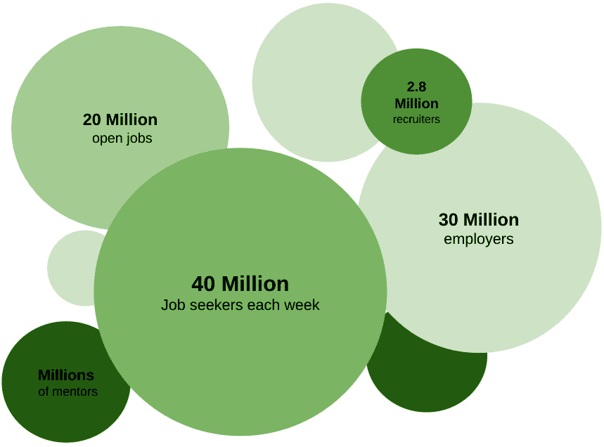
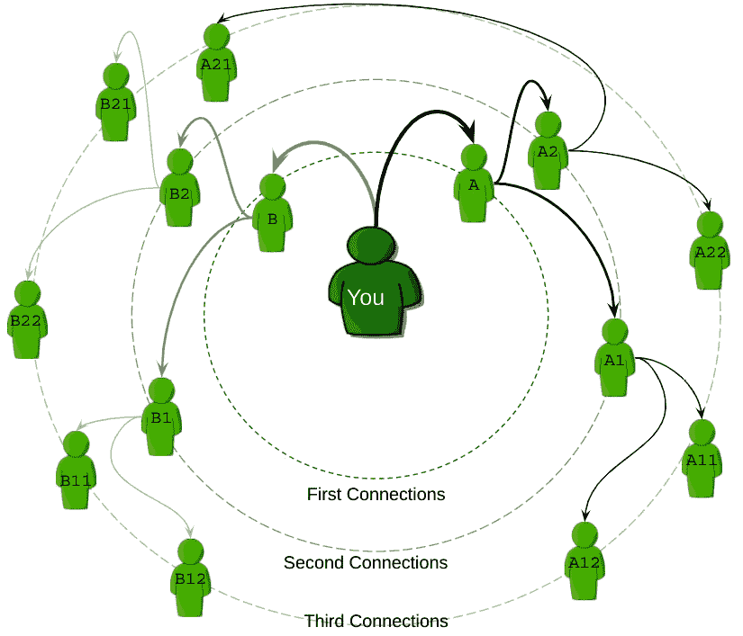
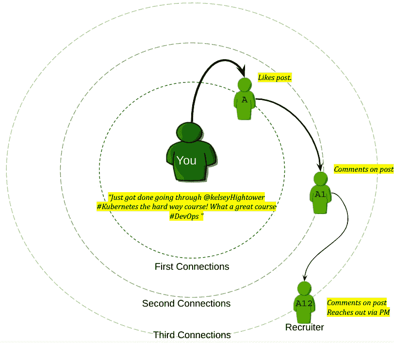
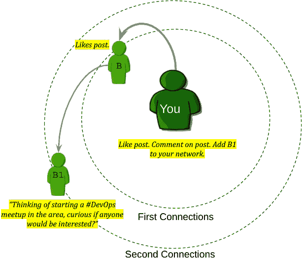
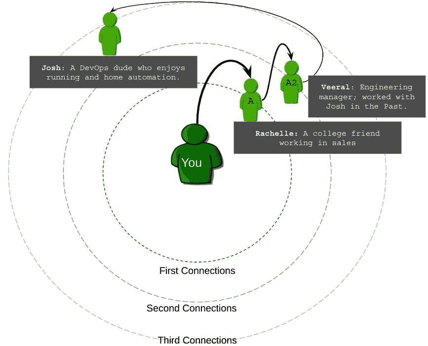
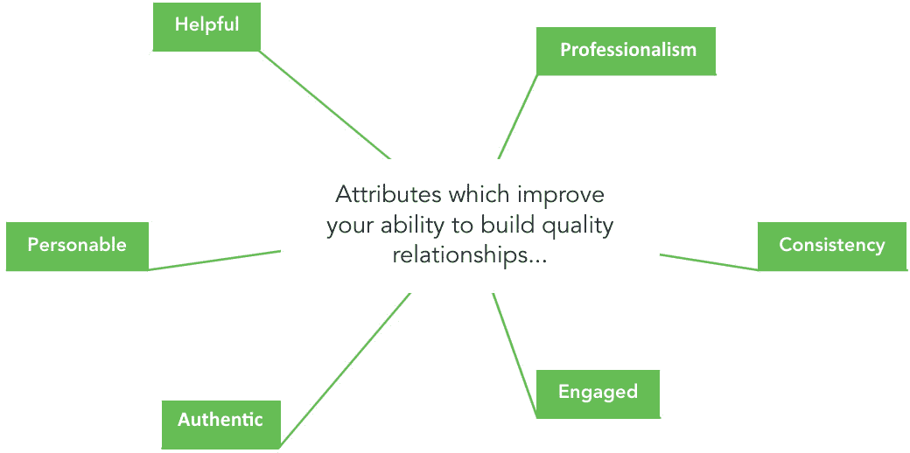
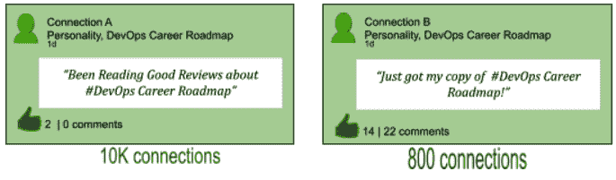
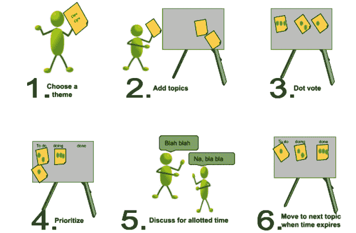
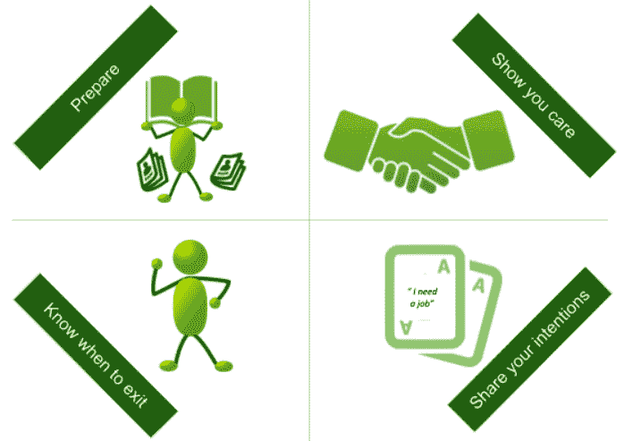

# *第五章*：建立你的网络

我的当前工作非常棒。我喜欢我所做的工作，每天都在学习，而且有一个很棒的经理；这真是一个三重威胁的职位。你可能会认为我必须非常努力地工作才能获得这份工作。从某种程度上来说，我确实做到了，但不是你可能想象的那种方式。我并没有为面试做大量准备，因为大多数面试是在我甚至不知道自己正在被面试的情况下发生的。这是因为我和招聘经理在 LinkedIn 上建立了关系。几个月来，我们一直在讨论他所在组织中的不同工作机会，同时他也在了解我的技能和职业目标。

本章将讨论如何建立关系，以帮助你的职业朝着正确的方向发展。那句名言 *“不是你知道什么，而是你认识谁”* 部分是对的。如果我要重新表述这句话，以使它完全正确，我会说 *“被对的人注意到你的技能是成功的关键”*。本章将涵盖以下主题：

+   正确使用 LinkedIn

+   建立持久的联系，无论在线还是离线

+   质量重于数量

+   社交网络 – 交谈开场白

我们将首先讨论如何使用 **LinkedIn** 引起招聘人员和 DevOps 工程师招聘人员的注意，然后讨论如何在 LinkedIn 上以及在聚会和其他社交活动中与那些注意到你的人建立持久的关系。之后，我将解释为什么拥有少数可以建立关系的联系，比拥有大量联系要更好。最后，我将通过给内向的读者（像我一样）提供一些交谈开场白来结束本节。

# 正确使用 LinkedIn

LinkedIn 起初是一个专业社交网络平台；现在它已经发展成了领先的求职网站之一。以下图表展示了一些关于 LinkedIn 的关键统计数据，足以让你感到兴奋：

图 5.1 – LinkedIn 信息图（2021 年）

这些是一些巨大的数字。本节将指导你如何正确利用它们。在 LinkedIn 上建立良好声誉的第一步就是引起注意。

## 引起注意

在 LinkedIn 上获得关注似乎几乎不可能，尤其是随着用户数量接近 10 亿。最简单的一种方式是将你的安全设置更改为开放网络者。在你开放了个人资料后，接下来就是开始关注并与其他 DevOps 专业人士互动。如果你缺乏 DevOps 相关的联系，一种轻松的方式确保你开始看到关于 #DevOps、#AWS、#DevOpsJobs、#CI 或其他任何话题的帖子，就是关注特定的标签。这不仅会显示你的一度联系人的帖子，还会显示二度和三度联系人的帖子。我们将在接下来的部分中使用以下图表：

图 5.2 – LinkedIn 连接

假设你有两个朋友，A 和 B；这两位是你的第一度连接，或者说是你直接连接的人。在我们的例子中，每个第一度连接有两个连接，而每个二度连接也有两个连接。

这相当于你在扩展网络中的 14 个连接。随着连接数量的增加，这些数字呈指数级增长；假设你有 50 个一度连接，而每个一度连接又有 50 个连接，每个二度连接有 50 个连接，那么从一度到三度的总连接数将达到惊人的 1,277,550。

获得多个连接认可的一种方式是发布关于你正在学习的内容。连接们开始评论并点赞它，最终会被一位招聘人员看到，而这位招聘人员正在寻找具有 Kubernetes 经验的 DevOps 工程师，如下图所示：

](img/Figure_5.03.jpg)

图 5.3 – 一条 LinkedIn 帖子引发第三度私信

这听起来可能不太可能，但它一次又一次地发生在我身上。招聘人员通过私信联系你后，你可以将他们添加为连接。此时，你可以提起*第四章*中讲到的前一个课程，*重新打造自己*，确保你的 LinkedIn 个人资料是整洁的；你不希望招聘人员看到你不完整或杂乱的资料。

在 LinkedIn 上获得认可的另一种有效方式是评论和/或点赞他人的帖子。在以下示例中，*B1*，一位二度连接，发布了关于在你所在地区举办聚会的帖子。你的一个连接已经点赞了该帖子。该帖子出现在你的动态中，因此你也点赞了它，并发表评论。在这个时刻，跟进发送一条个性化的连接邀请，表达你对这个聚会的兴趣：

](img/Figure_5.04.jpg)

图 5.4 – 将二度连接添加到你的网络

总结这一部分，获得 LinkedIn 上关注的最佳方式是与连接互动，即使他们与你并没有直接连接。在接下来的部分，我们将讨论如何建立持久的连接。

# 建立持久的连接，线上和线下

你可能会幸运地在与某人一次互动后就获得一份工作。这种情况没有发生在我身上；在关系的回报上，它总是一个长期的过程。曾有一次，一位招聘人员联系我询问一个工作机会。当时，我并没有考虑换工作。我们在 LinkedIn 上保持联系，每年见面吃几次午餐。三年后，一位朋友和前同事因为部门重组失去了工作。我把他的简历发给了那位招聘人员；两周内，他开始了一份薪资不错的合同工作，这份工作能让他在寻找更长期职位的过程中维持生计。

在本节中，我们将讨论如何在虚拟环境和面对面环境中建立持久的联系。我们将从如何在网上或虚拟环境中建立联系开始讨论。

## 在虚拟环境中建立联系

在 DevOps 圈子里，远程工作和虚拟关系建设早在 Covid-19 颠覆我们世界之前就已经开始了。像**GitLab**、**Atlassian**和**PagerDuty**这样的公司都很支持远程工作，团队成员之间有着极好的关系。我已经远程工作了 5 年，且相信那些用于确保团队成员之间建立牢固纽带的做法，也可以应用于任何类型的职业关系。

以下是通过个人化、帮助性和一致性建立关系的场景视觉设置：

](img/Figure_5.05.jpg)

图 5.5 – 在 LinkedIn 中设定场景

## 在个人环境中建立联系

有一条界限是你绝不能跨越的，但人们喜欢听你谈论你的宠物和工作之外的活动。举个例子。假设 Josh 发布了自己完成马拉松的帖子。Rachelle 点赞了它，结果它出现在了你的动态中。你也喜欢跑步，于是你决定给 Josh 私信：“*恭喜你完成马拉松，真了不起！我也是跑步的忠实粉丝*。”给 Josh 发消息让你们在个人层面上建立了联系，而不是工作上的联系，这有助于建立更强的关系。

### 帮助你的连接

帮助你的连接是我名单上最重要的建议。在你给 Josh 发了私信后，他查看了你的个人资料，注意到你们都是做 DevOps 的，所以他把你加进了他的网络。他后来发布了一条关于他在进行一个侧面家庭自动化项目时遇到的**Raspberry Pi**问题的帖子。你恰好有类似的设置，于是决定分享你在设置中使用的 GitHub 链接。几周后，你发布了一条关于你在使用 AWS 时遇到的问题，并向你的网络求助。Josh 看到了你的帖子并评论了它，还通过私信给你提供了一些他以前使用过的解决方案。他的建议效果很好；你问他是否愿意参加视频通话，详细解释一些问题。

### 持续地与连接保持互动

到现在为止，你和 Josh 已经建立了不错的关系。为了保持这种关系，你需要与他保持互动。设定一个周期，定期互相联系，看看彼此的进展。

在本节结束时，我将推荐几个虚拟聚会，帮助你发现与自己兴趣相同的专业人士；首先是**All Day DevOps**（**ADO**）[`www.alldaydevops.com/`](https://www.alldaydevops.com/)。如果你搜索线上 DevOps 会议或虚拟 DevOps 聚会，你会惊讶于它们的数量。我鼓励你参加几个，找出哪些对你最有帮助。

## 在现实生活中

Covid-19 将一个新词引入了职场，**在现实生活中**（**IRL**），这是一个巧妙的术语，用来描述与同事、潜在同事面对面见面的情况。无论你是内向型还是外向型，处理现实生活中的职场关系都是复杂的，这也是我们将在本节讨论的内容。现实生活活动的最大好处是能够与那些你想建立更好联系的人进行一对一的交流。

接下来，我们将讨论一些在虚拟关系中很重要，但在处理现实生活中的情况时更为显著的属性。

### 真实地展现你自己

我从导师那里得到的最好建议，想要分享给我的读者的是*保持真实*。我的导师指的是我与他人互动的方式。有些人喜欢更亲密的一对一交谈，而另一些人则在大型群体对话中更为舒适。把自己置身于可以展现真实自我的情境中。

如果你试图强迫自己进入一个必须表现得不自然或不舒服的情境，谈话将不会顺利进行。你试图建立关系的人会意识到你不是在做真实的自己，并且会对继续与你交往持谨慎态度。

### 积极地与网络互动

如果你在长时间专注于某个特定话题的学习，可以自愿参加即将举行的活动。这将带来多重好处。首先，它可以确保每个参加活动的人都知道你是谁，这对于正在寻求职业变化的人来说非常有帮助。它还可以让你在 LinkedIn 简介中添加*讲师*身份，这也是一个非常好的方式让自己被注意到。最后，如果你处于职业生涯的早期阶段，这是一个很好的机会来练习演讲，这是对你未来职业生涯有用的技能。

另一种参与的方式是，在讲座后直接与讲者进行互动讨论。不要与之争论。那样不会建立关系；但可以提问并表现出兴趣。这将让你引起注意。

### 对自己设定高标准的职业要求

这个是常识，但令人惊讶的是，很多人都忘记了这个简单的规则。活动后总会有一个欢乐时光。很容易忘记你参加活动是为了帮助自己发展职业，而是觉得自己是在和朋友们玩乐。记住两条简单规则：保持对话的专业性，避免过度饮酒。第一次印象不好是很难挽回的。

总结来说，要在面对面的活动中取得成功，带着真实的自我参加活动，无论你是观众还是讲者，都要全身心投入，最后保持专业。

重要的是在本节结束时列出六个个人属性，这些属性将帮助你在建立关系时更成功，这些属性在以下图形中得到了可视化展示：

图 5.6 – 建立关系所需的属性

重申前面图形中展示的内容，你必须努力做到：乐于助人、一致性、参与感、真实性、专业性和个人化。

在下一节中，我们将讨论连接的质量重于连接的数量。

# 质量重于数量

两个人在 LinkedIn 上同时发布关于同一话题的帖子。连接 A 有 1 万个连接，而连接 B 有 800 个连接。一天后，连接 A 的帖子只有两个点赞，没有评论，而 B 的帖子却有 14 个点赞和 22 条评论。

图 5.7 – 注重质量

当我第一次遇到这样的情况时，我感到很困惑；是连接 A 做错了什么，还是连接 B 做错了？让我来分解一下。

连接 A 专注于扩大他们的网络，几乎不关心自己网络中添加了谁。连接的数量是一个虚荣指标；乍一看，它看起来很不错，但如果你深入看，它是没有意义的。

一个更有用的衡量标准是你的连接与你互动的频率。按照这个标准，连接 B 显然做对了什么，但到底是什么呢？

好吧，如果你一直在阅读这一章，连接 B 已经做到了我们谈论的所有事情。他们有意识地努力保持与他人的联系，帮助别人，并与他人建立个人关系。最重要的是，连接 B 始终保持真实的自我，无论是在网上还是在现实生活中。以下是你可以问自己的问题，以判断是否应该将某个连接添加到你的个人资料中。如果你对一个或多个问题的回答是肯定的，那就添加他们；如果不是，就不要添加。这个问题确保每个连接都是你认识的人、你感兴趣的人，或者能够帮助你的人：

+   我认识这个人吗？

+   我是否被这个人的业务、职业道路或专业前景吸引？

+   我是否有这个人能够填补的直接需求？

本节的要点是本章中描述的行为的汇总：与其拥有许多仅仅是数字的联系，不如与少数拥有稳固关系的人建立联系。简单来说，就是*质量优先于数量*。在本章的最后一节，我们将讨论你可以在社交活动中使用的对话开场白。

# 社交和对话开场白

会有一些读这本书的人，像我一样，在社交场合上并不擅长寒暄。也会有一些人，宁愿跳过寒暄，直接进入更深刻、更有意义的讨论。在这一部分，你将学到一些有用的技巧，来帮助主持社交活动，如何启动对话以及当你卡壳或觉得该换个话题时的应对策略。我们先从一种可以用来主持没有议程会议的技巧——**Lean Coffee**开始。

## Lean Coffee

Lean Coffee 是一种组织会议/活动的方式，允许参与者投票选择他们想讨论的话题。我在我主持的读书俱乐部讨论中也使用过这种方法，它能使议程过于紧张的会议更加高效。

以下是一个图示，展示了主持 Lean Coffee 会议所需的基本物品。它也是我最自豪的作品之一，因为我并不是一位艺术家：

图 5.8 – Lean Coffee 必需品

举办 Lean Coffee 活动的最低要求包括便利贴、马克笔、智能手机或其他计时设备、桌子、椅子，最重要的是，参与者。接下来，我们将讨论如何主持 Lean Coffee。我们将从一个视觉示意图开始，接着详细描述每个阶段：

图 5.9 – Lean Coffee “如何做”的视觉展示

现在，让我们谈谈如何主持 Lean Coffee。

### 选择一个主题

主题可以是任何内容，比如 DevOps、安全性，或 DevOps 中的敏捷。它们都是适合 Lean Coffee 的好主题。其目的是鼓励参与者围绕共同的主题添加讨论内容。

### 添加话题

参与者将他们希望讨论的与主题相关的话题写在便利贴上，用尽可能简短的词汇描述。若主题是 DevOps，话题可以包括 CICD 工具、DevOps 文化和 Docker。

### 点票

参与者可以在他们想讨论的话题上投票。我发现，用马克笔在便利贴上画点比较有效。如果你想更正式一些，可以用白板。

请鼓掌。

话题按照从最多投票到最少投票的顺序进行排序。投票最多的话题首先讨论。

### 讨论

设置计时器，定一个时间 – 通常 3 到 7 分钟足够，开始讨论第一个话题。

### 竖起大拇指/竖下大拇指

遵循 Lean Coffee 的民主性质，当某个话题的时间结束时，如果大多数人希望继续讨论，可以延长时间；否则，就进入下一个话题。

你可以发挥创造力，将相同的概念应用到虚拟会议中，使用分组讨论室和白板功能。在会议结束时，是否决定将笔记发布到 Lean Coffee 讨论中，由你和你的团队决定。过去，我曾使用 GitHub 页面来跟踪 Lean Coffee 的结果以及即将到来的日期。

接下来，我想讨论闪电演讲，这种形式在虚拟活动和线下活动中都非常有效。

## 闪电演讲

**闪电演讲**是简短的演讲，通常时长为 3 到 5 分钟，多个演讲会接连进行。我非常喜欢听闪电演讲，特别是在有其他人的场合。闪电演讲将高度技术化的话题介绍给观众，激发他们的兴趣，令他们渴望更多，从而带来精彩的演讲后讨论，观众和演讲者之间展开深入的交流。

每一次我参加的闪电演讲都会引发一些我之前不知道自己感兴趣的讨论，和一些我原本不会遇到的人进行交流。你可以在你的 DevOps 或工程小组内部启动一个定期的闪电演讲系列。当我在*Optum*工作时，我们在 DevOps 社区的办公时间电话会议开始时就加入了闪电演讲环节。它让参与者在电话会议一开始就投入进来，也促成了精彩的讨论。

## 对话的开场白

你没有建立优质的联系，因为你在社交活动中没有与人交谈，而你之所以在社交活动中没有与人交谈，是因为你不知道该聊什么。我们每个人都经历过，或者至少我经历过比我愿意承认的更多次。在之前的小节中，我们讨论了旨在激发对话的闪电演讲和 Lean Coffee 活动。不幸的是，大多数社交活动只是简单的茶点和人群聚集在一起。以下是一些帮助我在有效建立社交网络方面逐渐成熟的经验：

](img/Figure_5.10.jpg)

图 5.10 – 改善你对话的方式

我们首先讨论准备的重要性。

### 准备好

如果你要去参加 Docker 聚会，我会先疯狂观看几部关于 Docker 的视频，并阅读一些近期的文章，确保你能够与参加活动的人进行有效的对话。

### 变得更加个人化

提出能够帮助你获得更多信息以继续对话的问题。例如，一个不太好的开场问题是，*嗨，你怎么样？* 这个问题无法为你设定下一个问题的方向，并且很容易导致对话变得短暂。一个更好的对话会是，*嗨，我看到你在名牌上写着你在亚马逊工作。你在那里做什么工作，为什么对容器感兴趣呢？* 这是一个很好的问题。首先，它不能用一个单词来回答；其次，你从中得到的回答将帮助你设定下一个问题；最后，这个问题让人觉得你对了解他们非常感兴趣。假设这个人是一个专注于 AWS **ECS（弹性容器存储）**的团队经理，并且对 Docker 感兴趣，以确保他们能够紧跟容器领域的最新动态。然后，这个人将问题反问你，这就引出了下一个话题。

### 明确表达你的意图

如果你参加这个活动只是为了建立人脉或与可能帮助你找到工作的个人建立联系，那就直言不讳地说出来。坦率和直白是许多人钦佩的特质，然而很少有人具备。这里的重点是要诚实。

### 知道何时以及如何结束对话

如果对话进行得很顺利，比如在你陈述了自己的意图之后，这个人似乎对了解你更多感兴趣，那么你应该根据对方的需要与他们花费时间交流。不要为了转到下一个人而退出对话。你已经打下了基础，现在是时候在这个基础上继续深入。相反，如果这个人对目前没有招聘需求，并不打算为了招聘某人而进行交流，那么你应该感谢对方的时间，告别时告诉他们保持通过 LinkedIn 联系。之后，务必跟进并通过 LinkedIn 加对方为好友，附上一条感谢他们对话的留言；你永远不知道他们什么时候会需要一个候选人。

# 摘要

在本章中，我们讨论了几种虚拟和现实生活中建立人脉的方式。我们首先讨论了在 LinkedIn 上建立关系的最佳策略。包括了如何增加你被他人注意到的可能性。在本节中，你还学习了如何利用你的第二度和第三度人脉来建立关系。我们讨论了六个可以提高成功对话可能性的特质，这些特质适用于虚拟和现实生活中的对话。它们包括：乐于助人、真诚、个人化、一致性、积极参与和专业性。我们发现，与那些你有互动的连接相比，拥有大量没有个人关系的连接更为不值一提。接下来，我们讨论了可以帮助促进更好对话的活动，例如闪电演讲和精益咖啡。最后，我们介绍了四种方法，这些方法可以大幅提高你在社交活动中进行有意义对话和建立关系的能力。这些方法包括：做好准备、表现出关心、明确表达你的意图，以及知道何时结束对话。

在下一章，我们将讨论导师关系：为什么它很重要，以及如何找到一位导师。
