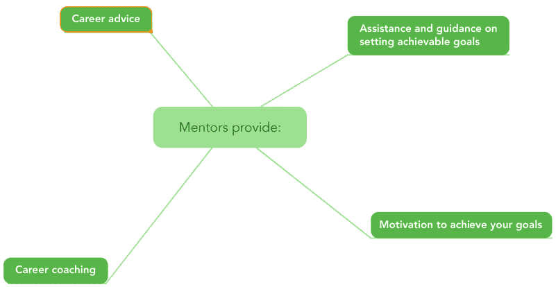
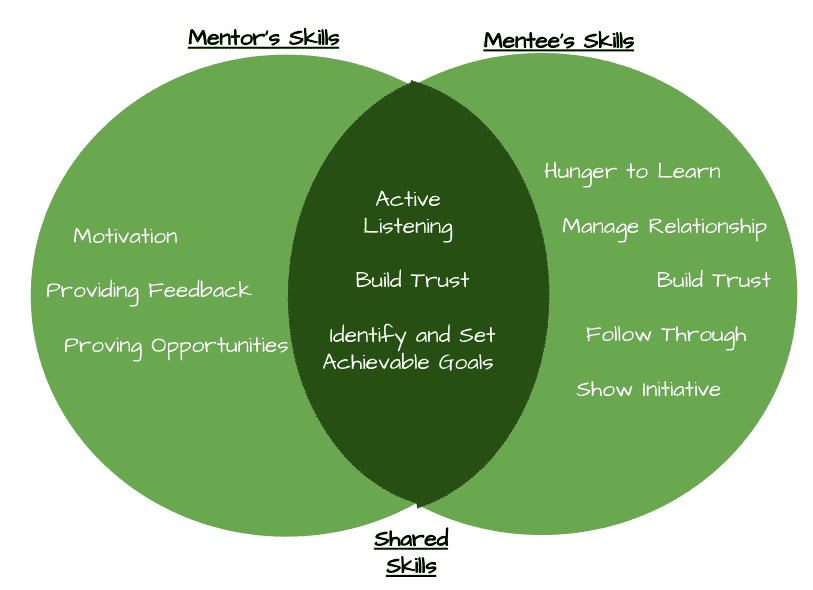
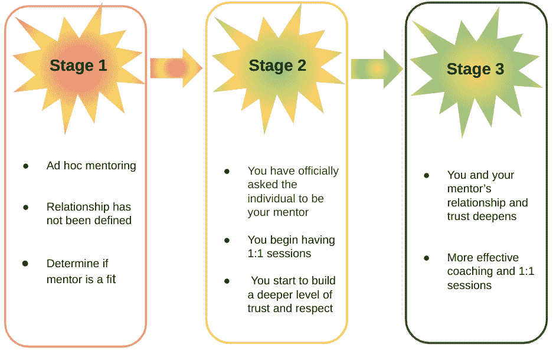
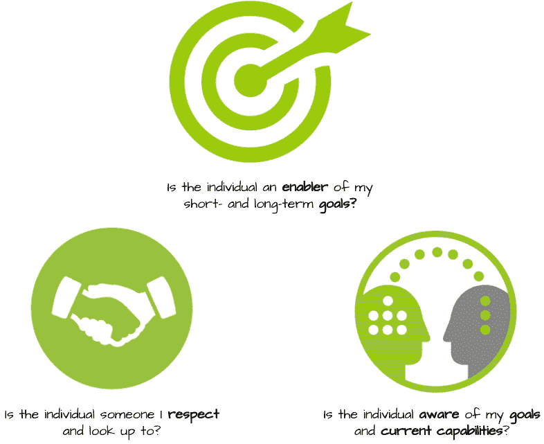
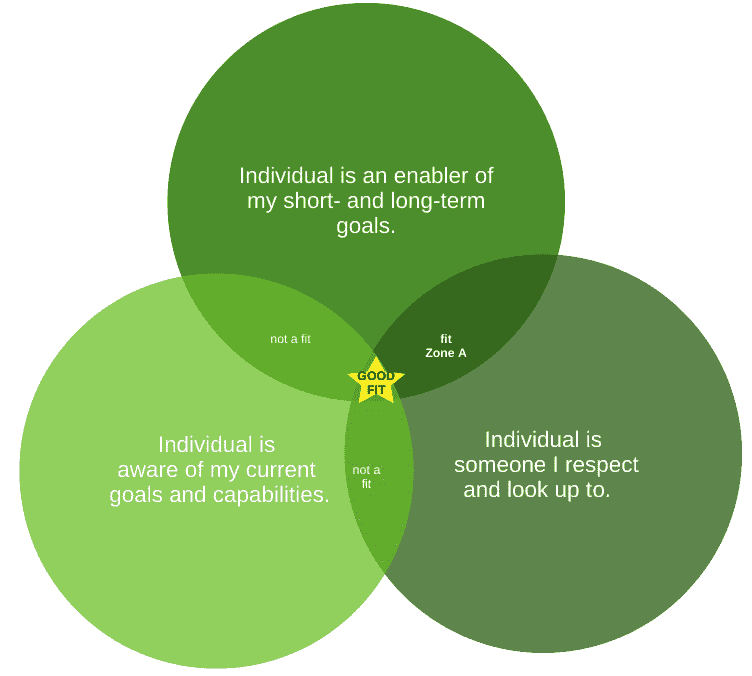
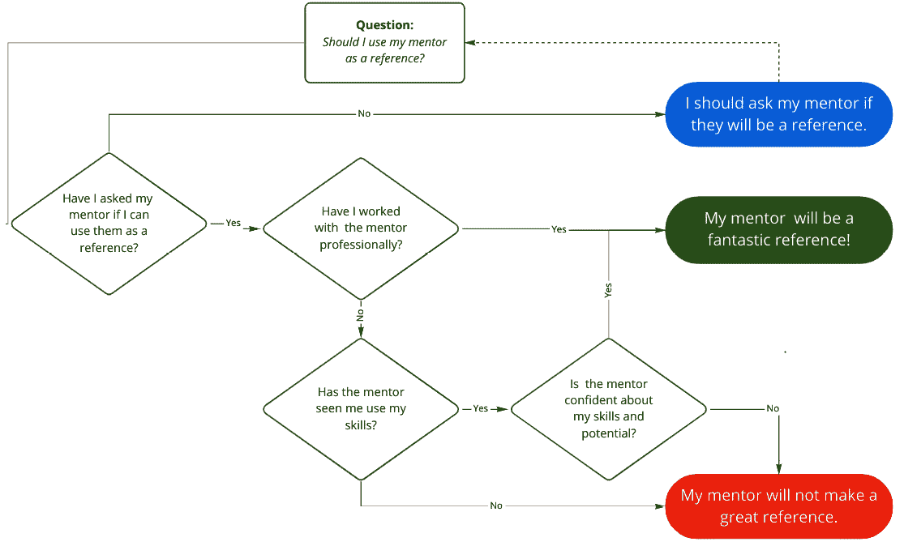

# 第六章：导师关系

在**DevOps**领域，拥有一位导师将使你更快地到达职业目标；它让你能够获得来自曾经走过你这条路的人的知识。在本章中，你将获得找到导师的动力，以及根据个人偏好寻找导师的资源。

在本章中，将涵盖以下主题：

+   导师的重要性

+   导师与学员的关系动态

+   选择合适的导师

+   导师作为参考

# 导师的重要性

在这一部分中，我们将讨论导师关系能带来的好处。本节将分为四个部分：帮助设定可实现的目标、职业指导、动力和职业建议，如下图所示：

图 6.1 – 导师关系的好处

我们将首先讨论导师如何帮助你设定、规划并达成你的目标。

## 帮助设定可实现的目标

导师将提供如何实现目标的指导。导师将帮助你确保你的目标是可实现的，并通过设定里程碑来实现。以下是一个真实的故事，讲述了我的导师如何引导我走上一条与我的目标无关的道路，但最终这条道路正是我成功所需要的。

真实经历：从 DevOps 工程师到技术敏捷教练

自从在*联合健康集团*开始从事 DevOps 职业以来，领导一个 DevOps 团队一直是我的目标。我的导师帮助我揭示了如果我的目标要变为现实，需要解决的短板。向他人展示和表达想法一直是我的一大难题；此外，我也非常胆怯，且不擅长表达意见，直到和导师进行了坦诚的目标设定讨论，我才意识到这些都是我的不足之处。

克服我短板的解决方案是从幕后技术人员转变为教练角色。技术教练的角色是帮助敏捷团队学习并适应 CICD（持续集成与持续交付）最佳实践；换句话说，需要大量的演示和发表我的意见。

我的转型过程的第一部分包括沉浸在敏捷的世界中，并与我的导师进行一对一的辅导会议。我协助的第一个团队没有使用 CI 服务器，代码没有迁移到 GitHub，也没有自动化测试或回归测试。这些都是我熟悉的事情；然而，我的角色并不是做这些工作，而是指导和引导团队走向正确的方向。那段时间非常糟糕；然而，在第一个冲刺的过程中，我开始变得越来越舒适，无论是对自己还是对团队。慢慢地，这变得相当有趣，我的导师和主管也告诉我，我做得相当不错。

我作为技术导师的历程持续了两年，之后才转型为 DevOps **卓越中心** (**COE**)的负责人。直到后来，我才实现了成为 DevOps 团队的人员经理的目标。如果没有导师的指导，我可能无法培养出领导团队所需的技能，也不会发现我对辅导和培训的热情，而这最终成为了我决定进一步追求的方向。

通常，导师会提供一些你自己不太可能意识到的见解。在做出任何可能改变职业生涯的目标或决定之前，我建议你与导师进行讨论，听取他们的意见。如果你还没有找到导师，继续阅读本章，了解如何找到导师。接下来，我们将讨论辅导和培训的重要性，这是导师提供的另一项有用技能。

## 激励你帮助自己实现目标

设定目标后，由于所需的努力，朝着目标努力可能会迅速变得不那么吸引人。在这种情况下，导师会介入并重申为什么这个目标值得付出努力。只有在你和导师之间建立了允许开放沟通的关系时，这才有可能发生，也就是说，建立了一种你能舒适地讨论疑问的关系。

你的导师是你为实现目标而努力的啦啦队员。为了确保你走在正确的道路上，定期安排辅导会议，讨论你的进展，并致力于解锁和提升你的技能。

## 职业辅导

培训是导师将知识转移给学员的过程，而辅导则是导师用来增强学员某一特定技能的方式。在与你的导师进行辅导时，你有责任将对话和讨论引导到你希望的方向。这意味着要对导师保持开放态度；如果你在某个特定概念或方法上遇到困难，要让导师知道。

在接受指导时，有一些事项需要牢记，以避免生气或感到沮丧：

+   辅导与培训不同；导师不会向你解释具体的概念或方法。相反，他们会推动你朝着他们认为有助于你更好理解某个概念的方向前进。

+   辅导会议是关于你，学员的。询问导师在特定情况下会怎么做，问题将会反过来问到你自己。记住，这关乎你如何变得更好，而不是导师知道什么或认为什么。

+   如果你从一次辅导会议中带走更多的问题而不是答案，那么这就是一次成功！带着你的问题，转化为你自己的答案。

在下一节中，我们将讨论当你需要一个值得信赖的人的意见时，导师如何为你提供帮助。

## 有用的建议

导师随时都能为你提供建议。无论是关于你正在进行的项目，还是关于职业发展的常规问题，导师都会在你职业生涯中为你提供帮助。导师的建议是在一个不太正式的环境中进行的培训。当你在做一个项目时，如果出现问题，导师可能是你第一个联系的人。

专业小贴士：导师的建议是持续的培训

每次与你导师的讨论，都会向你传授导师的一小部分知识。当你寻求具体的建议时，就像是打开了一门来自你最信任出版者的迷你培训课程。如果你有机会得到这种建议，一定要充分利用。

在这一部分中，我们讨论了拥有导师的重要性。要解锁所描述的潜在好处，你必须与导师建立基于信任和尊重的强大关系。你越早感到舒适向导师寻求建议，你就越能早日解锁导师-学员关系的潜力。

在接下来的部分中，我们将讨论导师与学员之间的关系动态以及该关系的不同阶段。

# 导师-学员关系动态

你可以选择你的导师；然而，你的导师也必须选择你作为他们的学员，这正是这段关系独特且强大的原因。导师和学员之间有一组核心技能是共享的，如下图所示：

图 6.2 – 导师技能模型

**积极倾听**、**建立信任**和**设定目标**；这三者都可以追溯到尊重。导师必须尊重学员，同样，学员也必须尊重导师。导师-学员关系有三个阶段。

在*第一阶段*，你开始向你仰慕的人寻求建议。此时，关系的具体形式尚未确定，你也正式没有导师。在这一阶段，你实际上是在测试某个你认为可能成为好导师的人。这一阶段的一个好比喻是约会；你会和一个你觉得可能适合自己的人约会，然后再询问对方是否愿意开始更为严肃的关系。

*第二阶段*是你**定义关系**（**DTR**）的时候。在第二阶段，你正式向某人请求成为你的导师，并且他们已同意你的请求。此时，你们很可能已经安排了 1 对 1 的会议和定期的沟通。

在这一阶段，你需要注意不要变得自满，因为这段关系尚在初期阶段，脆弱且易受影响。你希望导师-学员关系能够持续成长和成熟。以下是我个人职业生涯中的另一个例子，我曾犯过一个错误，让我的导师-学员关系在第二阶段停滞不前。

实际经历：什么不是导师关系

在我的职业生涯初期，我有几位导师，我曾正式请求他们成为我的导师。从这些导师那里，我得到了职业建议，并在我请求时得到了他们的指导。这些关系显得强迫且尴尬，导致很少有 1 对 1 的会议，也没有教练辅导会议。我曾以为这就是导师-学员关系应该有的样子。

前面的例子中的问题源于对导师-学员关系如何运作缺乏了解。导师-学员关系的目标更像是友谊，这就是第三阶段。

导师-学员关系的*第三阶段*是导师和学员之间建立深厚关系的阶段。正是在这一阶段，信任促进了有效的辅导和 1 对 1 的指导会议的发生。根据你与导师关系的深度，导师可能会开始视你为自己的得意门生。

以下图表是导师关系三个阶段的图形表示：

图 6.3 – 导师关系的阶段

在这一部分，我们讨论了导师-学员关系的三个阶段以及在每个阶段你应该期待什么。你了解到，只有在你们完全信任和尊重彼此时，你才能获得导师关系的全部好处。

在接下来的部分中，我们将讨论如何选择导师以及在做出决定时需要考虑的众多因素。

# 选择正确的导师

寻找导师是一项挑战，但选择正确的导师更具挑战性。一位成功的导师会理解你的目标，是你尊重和仰望的人，理解你当前的状况和能力，并看到你身上的潜力。我们将这一部分分为两部分：选择导师的标准和请求某人成为你的导师。

## 寻找导师时需要提出的问题

让我们直观地看看我发现的，作为寻找一个好导师的标准：

图 6.4 – 帮助你判断是否选择正确导师的问题

*这个人是否能促进我短期和长期目标的实现？* 在我们接近找到这个问题的答案时，我们会提出另一个问题，集中在你的目标上，*我的短期和长期目标是什么？* 如果你没有将这个记录在某个地方，别担心，我们现在就来讨论。

活动：写下你的目标

拿一张纸，将页面分成四个象限。然后，为每个象限标上 3 个月、6 个月、1 年和 5 年。

接下来，拿一些便签纸并开始写下你的目标。将便签纸放入四个象限中的一个。

完成这些之后，你可以在 Google 文档或任何其他类型的文件中创建最终版本。

如果你感到舒适，我建议你将这个信息与您的职业网络或网络的子集分享。我们稍后会回到这个话题。

现在你已经有了你的目标，看看你一年的目标和五年的目标。在开始寻找潜在候选人时，问问自己，这个人具备哪些技能和专长，能够帮助你培养实现目标所需的技能。

*这个人了解我的当前目标和能力吗？* 这个问题是为了评估某人是否了解你的当前情况。如果你有一个曾经与你合作过、无论是虚拟还是面对面互动过的导师，那么他/她会更有效。并不是说你应该排除任何没有过互动的人。

专业小贴士

如果你与某个个体没有任何之前的互动，但仍决定他们是一个适合做你导师的人，你必须坦诚地告知彼此了解过程中的额外时间投入。这是建立富有成效的导师-学员关系所必须的。

如果你在 LinkedIn 上发布你的目标，关注你的人应该了解你的目标。在接下来的章节中，我们将介绍另一种向导师展示目标的方式。

*这个人是我尊敬和仰慕的对象吗？* 这个问题包含了两个部分；如果你希望与导师建立强大的关系，这两个部分都至关重要。你应该把不符合这些标准的人从你的名单中剔除掉。与一个你不尊敬或者不仰慕的人，是不可能建立导师-学员关系的。

使用下面的维恩图来判断某人是否应该被视为潜在导师：

图 6.5 – 用于判断某人是否是潜在导师候选人的维恩图

在接下来的部分中，我们将讨论如何正式向已经确定是合适人选的个体提出成为你导师的请求。

## 向某人请求成为你的导师

如果你很幸运，向你的导师提问将是你们现有关系的自然发展。如果你与这个人密切合作，并且已经有定期的职业相关讨论，向他们请求成为你的导师应该是件容易的事。这个候选人就位于前面维恩图的中心，如*图 7.5*所示。

专业小贴士

内部赞助人和导师是有区别的。内部赞助人是你当前组织中的某个人，他将帮助你在内部职场晋升。与赞助人的互动通常会在你离开他们所在的组织后结束。而导师则是不会给你工作或帮你找工作的那个人；然而，他们将在你的职业生涯中长期扮演重要角色。

通常，拥有导师和赞助人两者都是有益的。赞助人会为你提供与当前雇主相关的建议和职业机会，而导师则会给你更全面的建议，这些建议不会偏向于某个特定雇主。*两者*的意见都很重要，尤其是当导师的建议与你赞助人提供的工作机会一致时！

大多数人可能不会那么幸运，你需要更加努力，走出自己的舒适区，才能找到一个优秀的导师。以下是一些你可能会遇到的情境：

**情境 1**：潜在的导师是你在上一家公司曾一起工作过的人，并且你们保持着 LinkedIn 上的联系。这个人位于维恩图的中心位置或**A 区域**。

在这种情况下，你可以给他们发一封电子邮件。这里是一个示例：

*主题：指导关系*

*你好 [插入姓名],*

*在我们一起工作时，我在 [公司] 学到了很多，并且作为一名工程师得到了成长。我已经附上了我的职业目标，并且觉得在你作为我的导师的帮助下，我们可以进一步完善我的目标，并制定一个计划来帮助我实现它们。如果你愿意做我的导师，我很乐意安排一次初步的电话会议来讨论。*

*此致，*

*[你的名字]*

**情境 2**：潜在的导师是你在一次会议上认识的，并且之后通过 LinkedIn 与之互动的个人。这个人位于维恩图的**A 区域**。

在这种情况下，你可以给他们发一条 LinkedIn 消息。以下是一个示例：

*主题：指导关系*

*你好 [插入姓名],*

*自从在 [会议或活动] 上听你讲解 [主题] 后，我一直在 LinkedIn 上关注你，并且尊重你对 DevOps 的理解。现在，我的职业发展已经到了需要一位导师来帮助我实现目标的阶段。我相信在你的支持和指导下，我可以在职业上得到成长，并且实现我的目标。如果你愿意成为我的导师，我希望能找到时间与你讨论。初步看来，我们可能需要讨论时间的安排。*

*此致，*

*[你的名字]*

**情境 3**：潜在的导师是你从未见过面，但一直在 LinkedIn 上关注的人。这个人位于维恩图的**A 区域**；由于你从未与此人见面或互动，得到积极回应的可能性不高。

在这种情况下，最好以更个人化的方式去了解对方。一个人更有可能接受与你有个人关系的人的导师邀请。

在这一部分，我们讨论了你需要提出的问题，以便找到一个合适的潜在导师。此外，你还了解了请求某人做导师的潜在方式。在接下来的部分中，我们将讨论何时适合请求导师成为你的推荐人。

## 其他与导师建立联系的方式

找到一位导师并不总是一件直截了当或容易的任务。你可能在你的组织内甚至你的人际网络中都很难找到一个导师。这比你想象的更常见，并且有一个完整的业务是围绕着连接个人与导师以帮助他们成功而建立的。如果你有兴趣在找到导师方面获得额外支持，请查看下面列出的网站：

### MentorCruise

MentorCruise ([`mentorcruise.com/`](https://mentorcruise.com/)) 旨在连接技术专业人士：导师和学员。服务价格为每次 150-250 美元。提供的服务包括问答、面试准备和简历审阅。

### GrowthMentor

GrowthMentor ([`www.growthmentor.com/`](https://www.growthmentor.com/)) 每月基础订阅费用为 50 美元。你可以使用该网站根据你的需求查询导师数据库。

### Pelion

Pelion ([`pelion.app/`](https://pelion.app/)) 专注于软件工程专业人士，包括 DevOps。起价为 300 美元。

# 导师作为参考

你有一个导师，并开始申请新的角色，但是否适合将你的导师作为参考呢？答案不明确，正如本节中的大多数内容一样，应基于你的最佳判断。有几个问题可以帮助你做出决定。

以下是一张决策图，将帮助你简化决策过程：

图 6.6 – "我是否应该将导师作为参考?"的决策树

在本节的接下来的部分中，我们将涵盖每一个四个问题，从最基本的问题开始：你是否已经问过你的导师是否可以用他们作为参考？

## 你是否已经问过你的导师是否可以作为你的参考？

如果你没有询问过某人是否是你的导师或其他人，那么只有在你问过他们并且他们同意后，你才能将其用作参考。未经允许将某人用作参考是不专业的，可能会损害或破坏你与导师的关系。导师会对你坦诚和诚实。如果他们觉得你还没有准备好承担特定的角色，如果他们被要求为你推荐工作，他们将处于困境之中。如果你询问他们，这可能会导致一次很棒的讨论机会，让你从导师的见解中成长。虽然他们可能会拒绝的机会存在，但很大可能他们会乐意成为你的参考。

当一位导师同意担任你的导师后，你需要问第二个问题：你以前和你的导师合作过吗？

## 你是否与导师合作过？

如果你与你的导师合作过，他们将了解你的技能。此外，他们同意为特定角色担任参考的事实表明他们对你具备所需的信心！

专家建议

如果你请求你的导师为广泛的求职而不是某一具体职位提供推荐，你可以询问导师有关具体职位的情况。这样，他们会了解该职位的要求，并且可以开启一些关于如何更好地准备即将到来的面试的有益对话。

如果你没有与导师一起工作过，你必须再问自己一些问题，以判断是否应该使用他们作为推荐人。你需要问的第一个问题是，导师是否曾见过你运用过你的技能。

## 你的导师是否曾见过你运用过你的技能？他们是否对你所需的职位技能有信心？

看到你的技能和能力对于裁判给出准确的评价是很重要的，他们需要在推荐信中准确地描述你的技能、能力和个人品质。他们可能参加过你进行的配对编程练习，或者曾经在你参加的会议上听过你的演讲。如果推荐人没有亲眼见过你的技能，我个人建议不要使用他们作为推荐人；你应该根据自己的最佳判断做决定。如果不确定，可以和你的导师进行讨论。

接下来，你需要问自己一个问题：我的导师是否对我所需的职位技能有信心？如果你请求导师为某一具体职位提供推荐，并且他们同意了，那么可以认为他们对你在该职位上的能力有信心，可以将他们作为推荐人。另一方面，如果你请求导师作为一般性推荐人，而非针对某一特定职位，那么你就需要评估他们对你在该职位上的能力的信心。最佳的做法是与导师讨论该职位，并获取他们的反馈。

在这一部分，我们介绍了决定是否应将导师作为推荐人时需要问的关键问题。确定是否使用导师作为推荐人的最有效、最可靠的方法是讨论你申请的具体职位。

# 总结

本章介绍了关于导师制的几个话题，包括导师制的重要性、导师与学员之间的关系动态、如何找到导师以及如何将导师作为推荐人。在*导师制的重要性*一节中，我们讨论了设定可实现目标、职业指导、激励以及职业建议方面的帮助和指导。

在*导师-学员关系动态*一节中，你了解到导师-学员关系分为三个阶段。第一阶段是你还没有正式邀请某人做你的导师，第二阶段是你正式定义关系并开始进行 1:1 的正式会谈，在第三阶段，由于相互间的信任和尊重关系的增加，你们的关系得到了发展。正是在第三阶段，你们才能开始进行更加富有成效和成果的讨论。

接下来，我们讨论了如何找到并选择一个导师。在这一部分，我们讨论了三个问题，你应该问自己这些问题来判断某人是否能成为一个好导师。这三个问题包括*这个人是否能促进我短期和长期目标的实现？*、*这个人是否了解我的当前目标和能力？*以及*这个人是否是我尊敬并仰慕的人？*

最后，我们讨论了是否应该将导师作为推荐人；这一部分的关键要点是，你可以随时与导师进行讨论。然而，如果时间不允许，可以参考一个决策图表来帮助你做出选择。

在下一章，我们将讨论如何与招聘人员合作以提高获得一份令人惊叹的 DevOps 工作的机会。
