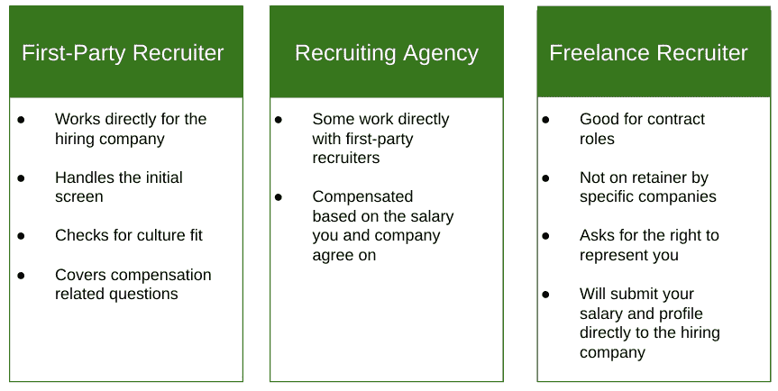
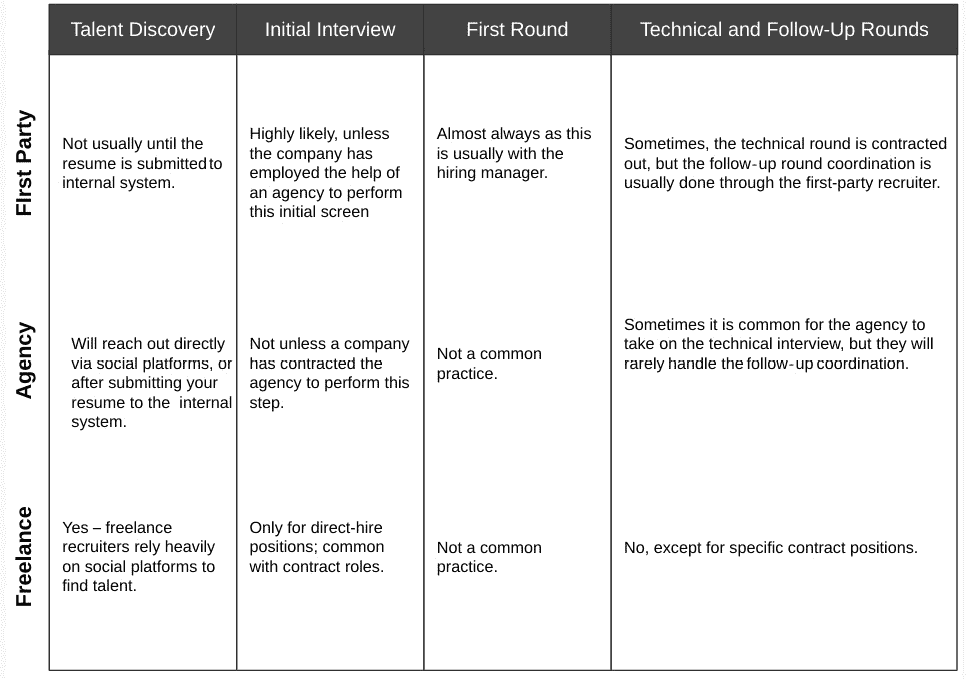
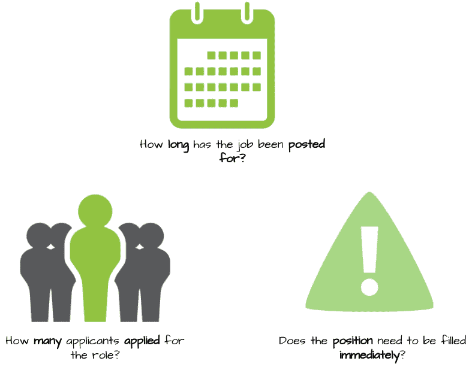
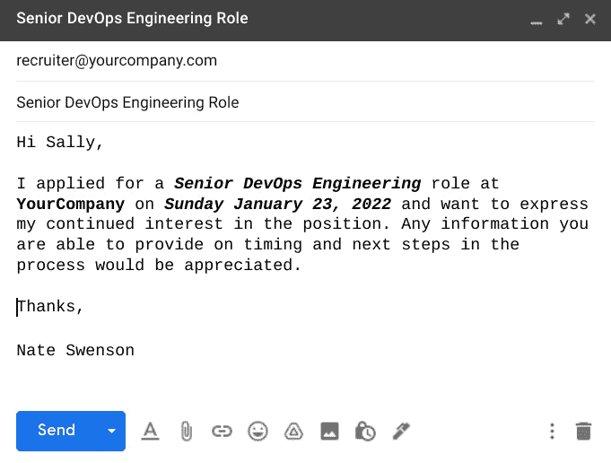
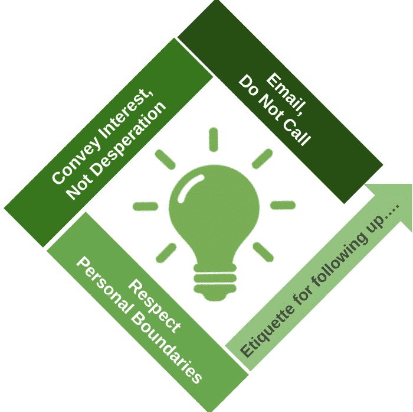

# *第七章*：与招聘人员合作

招聘过程的导航是一门艺术，直到你经历了几次之后，它才会变得不再神秘。理解这一点非常重要，尤其是当你准备参加第一次面试时。如果一开始所有信息都无法理解，不要灰心；有些信息在你亲身经历之前是不会明白的。本章将重点讨论与招聘人员的关系及如何在面试过程的不同阶段与各种类型的招聘人员进行互动。我们将在*第八章*《面试准备》中深入探讨面试过程的复杂性。

在没有招聘人员的帮助下，很难找到工作。在本章中，你将学习如何与招聘人员建立持久的关系，并利用这些关系找到工作。

本章将涵盖以下主题：

+   招聘人员的不同类型

+   如何找到招聘人员以及招聘人员如何找到你

+   如何展示自我

+   如何谈判

+   跟进，但什么时候跟进？

# 招聘人员的不同类型

招聘人员有几种类型。虽然我们不会提供全面的回顾，但我们会尝试涵盖在我们的职业生涯中遇到的最常见的情况。

以下图表概述了你在找工作时可能遇到的三种类型的招聘人员：

](img/Figure_7.1.jpg)

图 7.1 – 招聘人员概述

首先，让我们深入探讨**第一方招聘人员**。

## 第一方招聘人员

这是直接为公司工作的招聘人员，试图填补职位空缺。他们可能通过社交网络联系你，最著名的是 LinkedIn，或者通过其他招聘网站。如果你直接在公司网站上申请职位，那么这个人可能就是你进行第一次电话沟通的对象。有些公司甚至将这分为不同的子角色，一个负责提供候选人线索，另一个负责实际筛选。不管你是否符合他们的要求，你都将进入面试环节并与团队接触。

他们通常是你谈论薪资要求、询问薪酬、奖金以及其他可能感兴趣的领域的人。反过来，他们会试图看看你与职位描述的匹配度如何。

虽然这不是一场技术面试，但不要太放松！有时候，招聘人员或人力资源人员不仅仅筛选技能，还会筛选文化契合度。这意味着他们可能会关注几个方面，包括你有多礼貌、你对公司了解多少，以及如果是视频面试的话，你的整洁度和个人形象。

确保您将这些通话视为面试的一部分，但不要害怕提问，并确保这是值得您花时间的角色。您不希望成为那些完成六轮面试过程后才意识到可以通过正确的问题预见到一些缺点的人之一。

## 招聘机构

招聘机构分为两种类型之一 - 独立公司或由最终客户保留的公司。独立公司可能会找到您的档案并将其提交给几个不同的工作岗位。如果一家公司被保留，它正在寻找与公司配置文件特别匹配的人才，但如果他们足够大，他们可能有多个可行的候选公司。

代理机构往往会根据您的薪水或收入的百分比（或固定金额）在一定期限内获得奖金。

一般来说，您挣得越多，他们做得越好，除非在角色（角色）上存在很多竞争的情况下，代理商试图互相削弱。试着判断这种情况是否存在，以便您知道如何适当地进行谈判。

## 自由职业者招聘人员

自由职业者招聘人员通常会通过 LinkedIn 或未经请求的电子邮件联系您。他们会传递他们的职位需求，并尽快与您通话。大多数情况下，他们不是最终客户，可能会将您推荐给一个代理机构或多个招聘人员，最终再与公司交谈。虽然他们可能了解您不知道的角色，但他们通常不在保留名单上，这些角色是自由可用的。是否比直接申请更好，还有待商榷，这取决于招聘人员是否已与招聘经理建立了关系。

根据我的经验，自由职业者招聘人员在合同工作中表现最佳，您可以指定您的费率，然后招聘人员可以确定他们是否能够按照该金额进行工作。

他们要求通过电子邮件发送的协议来代表您的权利，尽管有时这更正式地通过签署的 PDF 文件进行，希望确认您同意提交的费率或工资以书面形式提出。

## 招聘人员在面试过程中的角色

到目前为止，我们已经讨论了三种类型的招聘人员。在本节中，我们将探讨这三种类型的招聘人员可能参与面试过程中的各个阶段。如下表所示，这些阶段将在*第八章*，*准备面试*中详细描述：

图 7.2 - 招聘人员在面试过程中的角色

人才发现——也就是主动在社交平台上寻找合适的候选人——通常不是第一方招聘人员参与的事情；他们通常会在社交平台上发布空缺职位，等候候选人通过人才管理系统申请后才会联系他们。招聘公司被雇佣的原因在于他们能够主动去寻找人才；他们所找到的候选人中有相当大一部分来自社交平台或他们建立的过去关系。自由职业招聘人员的唯一收入来源就是找到人才并将这些人才推荐给公司。他们被认为是最优秀的猎头，因为他们有非凡的能力，在别人忽视的地方找到人才。之所以能够成为自由职业招聘人员，是因为他们在特定的招聘市场和雇主中积累了良好的声誉。

初步面试通常由第一方**人力资源**（**HR**）招聘人员负责。唯一的例外是公司已经委托某个机构处理这部分面试过程，或者是某些直接雇佣或合同职位。

第一轮面试通常是通过第一方招聘人员安排的，通常会与招聘经理进行。这个规则的例外是某些合同职位，经理与个人自由职业招聘人员或招聘公司有很好的关系，并信任他们来处理这一步骤。

技术面试可以由内部第一方流程或通过招聘机构进行。虽然自由职业招聘人员通常不会进行此步骤，但也有一些例外情况。在后续面试环节，通常会安排与你将来会合作的团队成员或公司其他部门的人员，且由第一方招聘人员协调安排。

# 如何找到招聘人员，以及他们如何找到你

从总体上来说，如果你保持活跃的社交形象，并且有一份更新的简历，招聘人员总会首先找到你。虽然有很多招聘网站，但一些招聘人员会购买整个候选人数据库，因此，一旦你在某个招聘网站上，哪怕你不再找工作，仍然可能收到邮件。

在 LinkedIn 上，吸引最优秀的招聘人员是一件简单的事。确保你的个人资料和简历大致相同，并且具有类似的总结和关键词。确保这些关键词与您的经验匹配，并且与搜索术语以及你感兴趣的职位中最常用的关键词相符。

你也可以直接联系招聘人员——无论是第一方还是第三方——询问他们发布的职位。虽然我不建议你的 LinkedIn 仅仅充斥着招聘人员，但我认为将你的三分之一联系人与求职或职业发展相关是正常的。这正是 LinkedIn 的主要用途。

小贴士

招聘人员也会进行搜索，当他们搜索*Terraform*时，确保你的个人资料和简历上有相关技能会有所帮助。不要添加你并不具备的技能，因为你可能会被要求或者甚至被测试这些技能。然而，还是建议扫描不同的职位招聘信息，看看哪些关键词出现频率高，并以此为指导，学习或进一步发展相关技能。

最后，确保你的个人资料是公开的，并且标明你愿意接受工作或愿意进行交流，这会告诉招聘人员可以联系你。与招聘人员建立良好的关系可以为你在职业生涯中带来多个机会。在 LinkedIn 上拥有一个出色的个人资料，可以让你保持丰富的联系人资源，并确保你不会错过任何有助于职业发展的机会！

# 如何展示自己

我简要讨论了展示自己的一些方面，以及如何让自己对招聘人员更具吸引力。让我再强调一下我认为最关键的内容。

展示自己的第一步是增强你的 LinkedIn 个人资料。我们在*第五章*《建立你的网络》中已经详细讨论过这一点，但我想说，拥有一个专业的页面，其中包括高质量的照片和内容是非常关键的。什么样的内容算是高质量的？其中一部分是写作，另一部分是内容本身。通常来说，我建议你的个人资料和简历应该保持一致或非常相关。我是根据我的 LinkedIn 个人资料来创建简历的，每当有更新时，我首先在个人资料上更新，然后再导出简历。

找人校对你的职位总结，并确保内容足够具有描述性，能够吸引招聘人员的注意，这对你很有帮助。在技术领域，你必须描述每个职位所用到的技术技能。不要泛泛而谈，而要具体明确。一个小技巧是，强调结果时，尽量加入数字和百分比。

在简历中突出最重要的（并且具有市场竞争力的）技能，对于读者和搜索引擎来说都至关重要，因为搜索引擎会寻找这些技能，从而返回最佳匹配结果。

一旦你觉得自己的个人资料在所有提到的领域都显得专业、描述性强且全面时，就该明确表示自己正在寻找新职位了。LinkedIn 提供了不同的工具来实现这一目标，包括定制徽章，表明你正在寻找工作。对于更加注重隐私的人，你可以设置仅招聘人员能够看到你对新机会持开放态度。这一信号会告诉招聘人员联系你。有了一个足够出色的个人资料，你应该会收到源源不断的消息和联系请求。我建议不要将每个招聘人员都加进你的网络，因为你希望保持与自己领域内的人以及能提升你领域知识或其他职业方面的人建立联系。你可以根据自己的需求来决定这些比例，但要知道，申请职位并不一定需要与招聘人员建立联系。如果有某个你曾愉快共事的人，或者有特别好的职位信息的人，那就值得与他们建立联系。

那么，当你开始收到消息时，接下来该怎么办？许多介绍信息会提供职位描述的简短版本。有些会包含你所需的所有信息来判断自己是否感兴趣，而其他的则只会包含希望联系或者进行简短电话交流的意图。我的建议是在接听电话之前，先做一些简单的探询，并明确你的要求。否则，你会花费很多时间与别人分享自己的信息，最后却发现这个职位并不适合你。

我至少会要求获取职位描述和薪资范围（年薪或时薪）。有些人可能不会提供，但根据我的经验，大多数人会提供，尤其是当你明确表示不想浪费他们的时间时。我们将在*如何谈判*部分更详细地讨论这一点，但你需要传达自己正在寻找的和不想要的东西，只与那些与你需求更匹配的机会约定时间或进行通话。

你还可以做的另一件事是提高自己的社交意识并建立个人品牌。我们在*第五章*《建立你的网络》中详细讨论了这一点，获得并展示认证、撰写文章、在你的动态中转发其他文章，甚至撰写书籍（像这本书一样！）都能增加你的知名度和品牌，这样会让你对招聘人员和潜在雇主更具吸引力。

最后，我想说的是，你可以主动联系和与招聘人员及招聘经理进行信息交流。LinkedIn 提供了一个专业版本，允许你向网络外的人发送信息，并可以用来查询他们的数据库。到那时，它就有点像销售中的冷拨电话了。我更倾向于打造一个出色的个人资料，让招聘人员主动来联系我。

# 如何谈判

谈判的方式取决于你在求职的哪个阶段。当你与招聘人员打交道时，你主要是在确定你的薪资和期望的工资。你可能还想确定其他方面，比如奖金、股票**限制性股票单位**（**RSUs**）或期权，比如**带薪休假**（**PTO**），以及你是否希望远程工作或在办公室工作。越来越多的人（尤其是在科技行业）希望至少部分时间能够灵活远程工作，因为他们只要有电脑和网络连接就能完成工作。雇主的期望各不相同，因此重要的是与联系人确认他们的期望是什么。

那么，什么是 RSU 呢？根据 investopedia.com，RSU 指的是以公司股票形式发放给员工的一种薪酬形式。它们的特别之处在于有一个归属时间表，通常你会在一定时间后获得一部分权益——比如每年 25%。然而，RSU 也可以与绩效指标挂钩，而不仅仅是工作年限。

如果你不知道自己应该要求多少薪资怎么办？你可以询问一些职位的薪资范围，并以此为基准。并不是每个人都会提供这个信息，但有些会，这样你就能开始了。你可以提高你的薪资要求，直到遇到反对，或者你可以保持灵活，要求一个范围。一般来说，你要求的下限是用来确保这是一个你感到舒适的数字。如果得到更多，那就太好了，但一定要从一开始就要求你所需要的。

## 不起作用的事情

我曾犯的一些错误是把现金看得比职位头衔更重要，把现金或头衔看得比公司文化或契合度更重要，或者在薪资较低的情况下进入工作，并想着自己能逐步升职。当然，这种情况有可能发生，但我们应该关注更现实的情形。

专业提示

找出在类似职位上有相同经验的人赚多少钱，然后要求这个薪资。

虽然你的内心可能会阻止你要求比目前薪资高得多，但考虑一下你是否薪资偏低，或者你是否曾在一个地方市场工作，现在因为远程工作的机会而可以进入全球市场。如果你不问，就永远不会知道。他们能说的最糟糕的就是“不行”。

根据我的经验，希望不是一种策略。要么你尽早争取你想要的，虽然可能得不到完全符合的，但至少尽可能接近，要么你最好继续寻找。

我记得当我在寻找领导职位时，看到了一个看起来很有吸引力的 DevOps 主管职位。它是与一家知名公司合作的，所以这个职位具有一定的声望，而且从我与招聘人员的初步交流来看，薪酬似乎符合我预期的范围。我没有问足够的问题，而职位描述中有更多的细节，我本可以利用这些细节提问，确保这个职位适合我。

比如，我本可以问一下这个职位下属有多少人。我希望能领导多个团队，因为我有多年领导 5 到 10 人团队的经验，认为自己已经准备好承担更多责任。我注意到在许多大公司的高级职位中，管理经理是一个要求。我曾经领导过高级员工，但从未领导过经理，所以这是我在下一个职位中希望能够尝试的事情。

我没有提问，而在与招聘经理面谈时，他们提到这个职位主要是面向技术领导者，且只有两个直接下属。对于一个主管来说，这可不算是一个大团队！有些公司将主管视为某种职能角色（你领导一个小组，所以你是主管），而有些公司则把它当作一种职级（从高级经理晋升为主管！）。然而，有些公司则根据薪酬来划分角色，从功能上看，它可能与其他公司相同薪资的职位有很大不同。

让我失误的是其他的原因。经理在寻找一个在某一项技术上有深厚经验的人。我有一些经验，但这不是我的专长，而招聘经理明确表示这是他的优先考虑事项。我直言不讳（我通常这样做），说我的经验是与一个竞争产品相关，但我相信自己能够很快弥补这个差距。他提到他自己也经历过相同的过程，并且花了很长时间才赶上，所以他认为我也会花很长时间。这简直是胡说八道，但我并不打算改变他的想法。团队的缺失使这个职位变得不具吸引力，面试结束时我觉得自己浪费了大家的时间。首先要多读、多问问题！

图 7.3 – 谈判中不应做的事

接下来，我们将讨论一些在谈判中有效的方法。

## 有效的谈判方法

谈判时最重要的事情是做好调研。向其他招聘人员、朋友、同事，甚至社交媒体上的人请教。确定一个合理的基准，并尽早沟通。你不想浪费时间去考虑那些你根本不会接受的机会。

了解除了薪酬以外的其他奖励。它可能会影响你对工作的满意度，一些公司做事的方式可能不同。良好的企业文化是无法用金钱衡量的，因此在整个面试过程中，你要尽量感知这个工作是否适合你。问问自己，五年后你是否能看到自己仍然在那里。面试官是否是你愿意与之共事的人？你无法从和招聘人员的简短通话中推断出这些，但你当然可以向他们询问公司文化，并建立一些基本的标准。

我从个人经验中发现的一件事是，当你在同一家公司工作多年时，薪资调整的速度要慢得多。你可能会获得 2-5%的加薪，但换工作可能会让你获得 15-20%的涨幅。做一些市场调研可以让你根据当前的市场状况来确定薪资，而不仅仅是基于你的职业经历。

需要记住的一件事是，薪资过去通常会根据你所居住的地点进行调整。远程工作和竞争在一定程度上减轻了这种情况，但仍然有一些公司会因为你住在低生活成本的地区而对你进行惩罚。高工资同时享受低生活成本的现象叫做套利，这在科技行业中是你可以利用的机会。

远程工作是降低成本的另一个重要因素。你可以在家吃饭，节省油费、停车费和汽车维护费，同时还可以利用薪资套利。我总是把远程工作或远程福利（比如每周有 20%的时间可以在家工作）作为谈判的一部分。它对我的生活质量有着显著的改善，我把它看作和询问福利或企业文化一样重要。相反，你不希望在面试了几周后才发现，这份看似完美的工作需要你每天往返 45 分钟，或者要求你搬迁！

现在，搬迁本身没有问题，尤其是在职业生涯的早期。从家乡搬到科技职位丰富的地方可能是有利的，公司也可以帮助你支付搬迁费用。不幸的是，套利是双向的，你可能会得到加薪，但生活成本的提高使你失去了获得的任何收益。如果你搬到一个生活成本更高的城市，甚至可能会变得负担更重！在科技圈里，这是一种危险的现象，因为像旧金山、西雅图、纽约和洛杉矶这样的城市拥有很多工作机会，但它们也是美国最昂贵的城市！即使像奥斯汀这样的地方现在也比以前贵得多，所以在比较城市时，你要特别关注住房成本（比其他指标更重要）。

最佳建议是尝试使你的薪水标准化，并根据每个城市进行调整，使用网站或计算器。这样，你可以要求加薪，并根据生活成本差异做出相应的调整，明确知道自己需要要求多少。如同往常一样，数据是王道，你可以随时用确凿的数字和研究来支持你的主张。招聘人员肯定会说，他们会根据经验支付相应的薪水，但他们可能是参考全国数据，而不是考虑到特定地区的调整数据。

如果你查看一份列出最高生活成本的清单，你会发现，例如，圣何塞位于前 10 名最昂贵的城市之中，因此即使他们支付高薪，你的生活方式可能也低于例如住在北卡罗来纳州罗利的水平。这类数据在美国劳动统计局网站上是可以找到的。

除了基本工资外，你可能还想在薪酬的其他方面进行谈判，例如奖金和股权/股票，这些通常可以作为期权进行奖励。在这里，你有权选择以较早的价格购买股票，或者选择 RSU（受限股票单位），即有多年度归属计划的股票奖励。通常你会获得一个年度份额，而这些股票需要 4 年才能完全归属，因此每年你都在同时赚取和归属更多的股票。这在大科技公司中很常见（例如**Meta**、**Apple**、**Amazon**、**Netflix**和**Google**），当你在职业阶梯上爬得更高，成为高级领导时，股权成分有时会比薪水更重要！这取决于你在职业生涯中的位置以及所在的公司。

专家提示

有时候，公司会说奖金是某个百分比，但并没有解释奖金可能取决于其他因素，例如你的表现、公司表现或其他因素。它也可能是有条件的，不一定会发放！有些公司倾向于根据表现级别来发放奖金，如果你的表现得分是 4 分（满分 5 分），你可能会获得 80%的奖金。最后，一些公司会在 1 年后支付一部分奖金，剩余部分则在下一年支付，激励你继续留在公司。

历史表明，如果你在一家成功的公司工作，拥有股票奖励，并在公司成长的过程中留下来，你可能会随着公司股票每年增长赚很多钱！不过，你必须注意，并不是每家公司都像 Netflix 或 Amazon 那样快速增长，有些公司可能会崩溃并倒闭。

当你与初创公司合作并将股权作为薪酬的一部分时，应该把它当作一种奖金，而不是薪酬的核心组成部分。毕竟，可能要经过数年，公司才会成功退出，而你可能永远无法从那份股权激励中看到任何价值。从这个角度看，成熟的上市公司在提供股票奖励时拥有更多的杠杆。

Figure 7.4 – 谈判时需要做的事

在本节中，我们学习了在与招聘人员合作时如何进行谈判。我们讨论了哪些方法有效，以及哪些方法需要避免。

在接下来的部分，我们将讨论申请职位后，如何以及何时进行跟进。

# 跟进，但何时跟进？

求职过程中最令人焦虑的阶段就是在提交简历后，等待电话、电子邮件、短信或烟雾信号的回应。本节将分为两部分：

+   等待游戏

+   与招聘人员跟进的礼仪

让我们先从等待游戏开始。

## 等待游戏

提交简历后，立刻想要得到反馈是很常见的；我自己也有过许多次这样的经历，深知不知道接下来会发生什么的那种压抑感。保持耐心——通常的规则是在跟进前至少等待两周。许多因素会影响招聘团队处理你申请的时间：

图 7.5 – 未收到招聘人员回应的时间延迟原因

**职位发布的时长**会影响你在申请职位后应当期待何时得到回应。职位发布的时间越长，你通常会更快收到回应。虽然职位发布的时间本身并不能完全反映预期回应的时间，但当结合职位的申请人数时，你可以做出比较准确的预估。

**职位申请者的数量**是一个多维度的衡量标准；在本节中，我们仅考虑它如何影响招聘人员的回应时间。职位的申请者越多，你的等待时间通常会越长。如果一个职位已经发布很长时间并且申请者众多，你的等待时间可能会非常长，甚至也可能会很短。有可能该职位已开设很长时间是因为没有找到合适的候选人。

填补职位的紧迫性是你可以利用的优势。你可能会很快得到招聘人员的回复，而且面试过程也会加速。然而，你必须询问为何这个职位急需填补。从我的经验来看，作为面试官和候选人，过于急于填补职位对任何一方都没有好处。加速面试过程可能是公司文化有问题或规划不当的结果，可能导致双方无法充分了解是否能建立有益的关系。另一方面，如果你不尝试，你永远也不会知道。

归根结底，等待并不有趣，但了解影响等待时间的因素可以让这个过程变得更加可承受。

在接下来的部分，我们将讨论与第一方招聘人员合作时，最佳的跟进实践。

## 与招聘人员跟进的礼仪

自从你申请了一个职位，几周过去了，但仍然没有收到任何回应；在你发送情绪化的邮件——或者更糟的是打电话之前——请花一点时间，尝试遵循一些最佳实践。你可以参考下图：

图 7.6 – 跟进招聘人员的礼仪

**电子邮件**是跟进招聘人员时唯一可以接受的方式。除非事先获得许可，否则不宜打电话。电子邮件还提供了你的通讯记录的数字化证据。有些公司，尤其是那些收到大量申请的公司，会要求申请者不要进行跟进；你应该遵守公司的政策。

**展示兴趣而避免显得急切**，在撰写邮件时重申你对该职位的真诚兴趣，并列举职位描述中的具体例子；如以下截图所示：

图 7.7 – 邮件示例

**尊重个人边界**就像是保持专业一样简单。招聘人员并不是在寻找朋友——他们在寻找顶尖人才。首先，我建议不要将招聘人员添加到任何非专业社交媒体平台，如 Facebook。第一方招聘人员专门为公司工作，而不是为你工作，这意味着他们对你没有任何义务，不需要回应或跟进，不管你多么渴望获得回应。例如，如果你多次跟进了，但他们没有回复，那么他们对你并不感兴趣，是时候继续前进了。

请记住，保持一座桥梁畅通并且保持良好状态，比因为不专业而烧掉这座桥更为重要。情况会发生变化，将来这座桥可能会为你带来最理想的工作！

# 总结

在本章中，你学习了与招聘人员打交道的基本规则。你还了解了如何以及何时跟进，并且阅读了我们一些在求职和与招聘人员、招聘经理以及代理机构协商时的经验。

拥有一个专业的个人资料，展示你的经验并仔细突出所有技能是至关重要的。你的在线资料是你的名片，因此拥有正确的技能和经验可以让你从网络拓展和特定机会的角度获得你想要的联系。

你可以主动进行求职，并且可以让自己根据在线资料接收到每日的职位信息。养成快速分类每个职位并将其放入正确类别的习惯。合同职位和固定薪水的职位在职责和薪酬上可能差异巨大，因此在开始面试之前，你必须确保自己清楚需要了解的所有信息！

做好研究，提出相关问题，并阅读职位描述，确保你知道自己在签约什么。互联网让申请工作比以往任何时候都更加容易，但盲目申请可能会在之后浪费你更多时间。了解他们的薪资范围，分享你的期望，并确认它们是否一致。询问福利、企业文化、远程工作以及其他形式的补偿，如奖金、股权或股票。

注意生活成本的差异，并意识到在旧金山的一美元不如在博伊西的一美元值钱。向公司询问他们的搬迁套餐、薪资调整以及远程工作的可能性。为了新工作而搬迁可能是一个很好的职业决策，但你当然不希望以牺牲生活质量为代价。

至于招聘人员，直率、直接，尽量不要浪费他们和你自己的时间。如果某个机会看起来是个糟糕的工作，不要仅仅为了面试而去面试。当然，面试练习很有价值，但最好是在你真正感兴趣的工作上进行。

与你喜欢合作的招聘人员建立联系，并在面试过程中与遇到的人建立网络关系，包括招聘经理。有些人可能会因为他们仍在面试过程中而不接受你的请求，但你可以在事后联系他们，并说明你希望无论如何都能建立联系。

在下一章中，我们将开始讨论如何为面试做准备。
