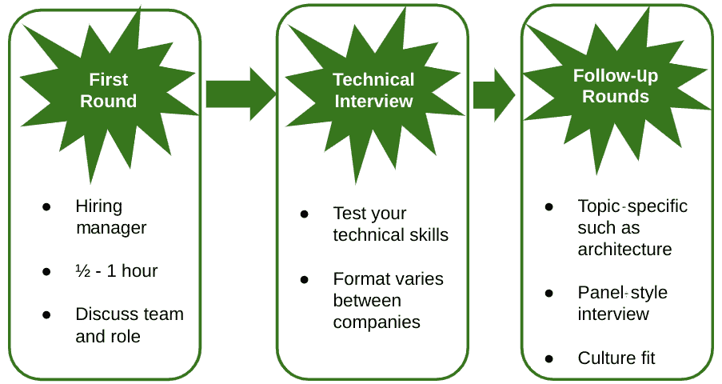
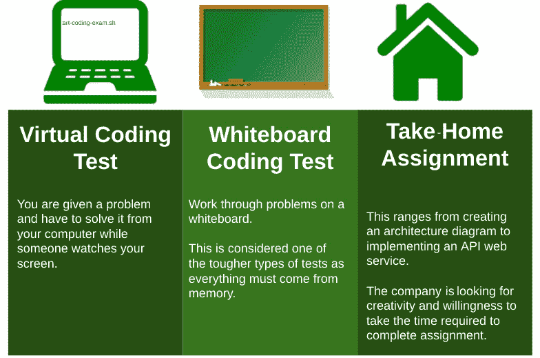
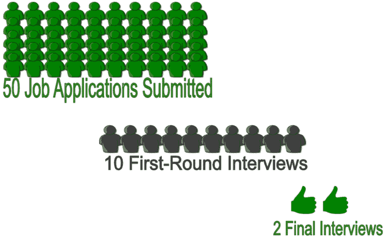
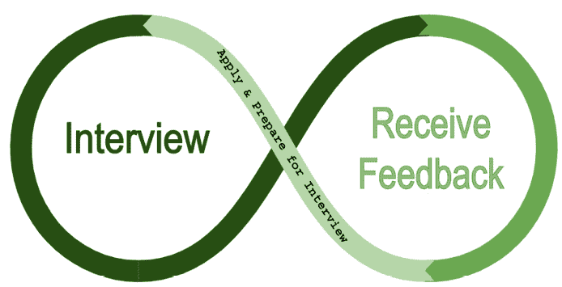
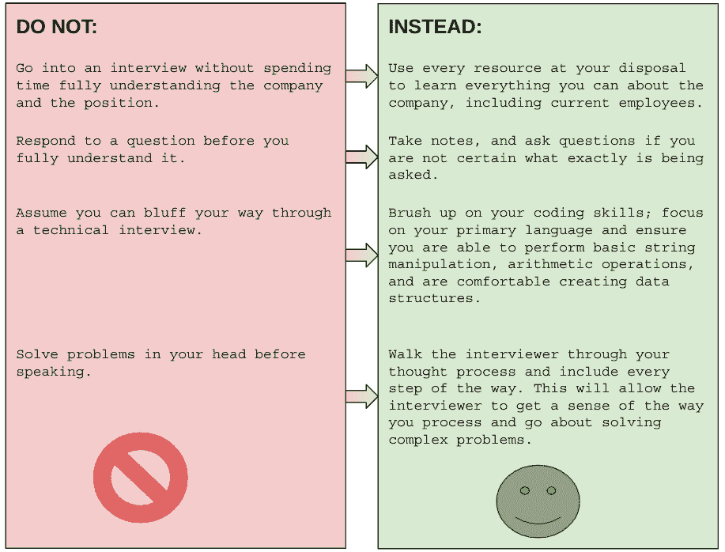

# 第八章：为面试做好准备

你已经和招聘人员谈过，了解了职位描述和薪酬水平，并安排了面试。这可能是一个令人畏惧的过程，因此我们将在接下来的几页中详细分解，讨论涉及的所有步骤、最佳准备实践和其他行业技巧。在下一章中，我们将更深入探讨，甚至会谈到一些非常规的面试案例。

本章将涵盖以下主题：

+   面试过程的各个阶段

+   最佳准备方法

+   预期面试内容

+   行业技巧

# 面试过程的各个阶段

通常，在初步电话沟通之后，你的第一个面试对象是招聘经理。当然，这个顺序可能因公司而异，但我认为这是最常见的起点。在我们的领域，你可以期待一个技术筛选环节，可能由个人进行，也可能由小组进行。对于领导或管理职位，可能由同事或甚至你的下属进行面试。根据公司不同，这可能会导致与你未来领导的一对一电话沟通，可能是你的未来老板，甚至是他们的老板！他们在这里关注的是文化适配性、沟通能力和一般的兼容性。我们稍后会详细讨论。在一些公司，面试环节可能更多。我见过以设计为重点的面试、编程挑战、情境问题、行为问题，甚至是创新思维。我会在*第九章*《一步步面试》中详细讨论这些内容。

我还想提到的是，一些技术职位会有编程测试，可能是离线的，也可能是实时的，面试官会在你编程时观察并提问。有些公司可能还会要求你参加行为测试或认知测试。我将在非常规面试的详细介绍中讲解这些内容。编程测试对于软件工程师来说可能很常见，但对于 DevOps 专业人员则较少。我认为三轮面试可能是最常见的设置。如果你在大型公司面试，比如《财富》100 强公司，面试过程可能需要四轮或五轮。

图 8.1 – 面试阶段

然而，在许多公司，通常是三轮面试，简短而直接。准备你的第一轮面试并不困难，但这是许多候选人往往留下未完成的地方，所以让我们从这里开始。

## 第一轮面试

虽然你可能首先与招聘人员和人力资源部门的人员交谈，但我们认为第一轮面试是与团队成员进行的。通常，这个人是招聘经理。面试时间通常为 30 分钟到 1 小时，面试中招聘经理会告诉你关于公司、团队、他们的需求，然后询问你的经验。确保你做了功课，了解一些关于公司的信息。

如果你已经阅读了职位描述，你应该大致了解他们在寻找什么，以及你的经验如何与他们的需求匹配。谈论你的工作经验时，你应该突出你的技能和任何你认为与申请职位相关的内容。

你应该首先概述一下自己的职业生涯，花 5 分钟介绍自己是谁，以及你一直在做什么。如果你能阐明你的经历和这个职位的匹配程度，那就更好了。

面试官一定会问你一个问题，特别是如果你不是刚毕业的大学生，那就是为什么你想在他们公司工作，或者为什么你想换工作。通常，你可以说你想要更高的薪水，但这并不能说服你的未来雇主你不会因为更高的报酬而离开他们。最好将你对新角色的渴望与职业发展以及你申请的公司直接联系起来。这是一个展示你对与他们合作充满热情和兴趣的绝佳机会。

我注意到招聘经理在这个阶段通常会试图了解你如何融入团队。例如，如果你是一个经理，他们可能会问你关于领导风格的问题。他们也可能会问你情境性问题，比如*你告诉他们一个你处理某个问题的经历*。他们也可能会问你怎么看待自己的优点、缺点和职业前景，比如你如何看待自己 5 年后的发展。

根据面试官的不同，你可能会回答这些问题中的一些或大多数。特别是亚马逊，非常重视这种类型的面试问题。

专业建议：第一轮准备

一般来说，最好提前准备一些关于你如何处理常见情境的故事。例如，讲讲你曾经与一个利益相关者有分歧，并且你是如何解决这个问题的。面试官希望知道你能应对分歧和冲突，并且有足够的韧性在现代职场中生存下去，所以准备几则展示你如何应对并克服困境和类似情况的故事。保持一个电子表格或文档，并进行练习，这样这些就会变成你的第二天性。

一旦他们告诉你关于自己和团队的情况，并且你已经介绍了自己的背景，回答了他们可能提出的所有问题，他们肯定会问你是否有任何问题。这是一个展示你做过功课的好时机，可以问一些关于公司、未来计划以及你如何为他们的工作做出贡献的问题。

你还可以问一些重要问题，包括公司的下一步计划，以及是否存在任何挑战让你难以胜任这个职位，或者更好的是，他们认为成功完成这个职位需要具备哪些能力。

## 技术面试

这一轮面试的形式可能会有所不同，具体取决于面试的地点。它可能是一个编程测试，在这种测试中，面试官会给你一个问题，并观察你如何解决，可能会在你解决问题的过程中提供提示，并要求你在一定时间内完成解决方案。在此期间，面试官可能会询问与你工作相关的问题。它也可能是一个小组面试，由三位同行或专家组成，他们会问你技术性问题，以了解你的知识深度，涉及多个领域。这是最重要的一轮，因为你将主要因你的知识被聘用，而不是因为你做过什么，这也是你展示自己知识的机会。如果需要，不要害怕提问，或者在不确定时说*我不知道*。这比胡乱说话要好，因为这样做可能会让自己陷入困境。你可以随时说*这不是我的专长领域*，然后引导面试官问你另一个问题。没有人知道所有的事情，因此非常容易被那些试图让你出难题的人难倒。你要展示的是深思熟虑的答案，并表明你能够以智能且富有创意的方式思考解决方案。

专业建议：技术面试

技术面试是面试过程中的最具压力的一部分，且设计上就是如此。利用这一点，保持冷静，给自己一些时间来处理面试官所提的问题。如果你对某个概念或语言不熟悉，可以请求另一个问题。

通常，在科技巨头（如 Google、Meta、Amazon、Microsoft 等）公司，你会遇到一项困难的技术评估，考察你在计算机科学领域的知识，包括数据结构、批判性思维、对象以及大 O 表示法。对于与云相关的工作，你可能会被问到与云服务相关的具体问题，类似于认证考试中的问题。建议你向招聘人员询问接下来会面临什么样的面试，并询问是否有任何准备建议。当面临编程挑战时，通常会使用一个允许你使用多种编程语言的平台，因此你可以选择你最熟悉的编程语言。我总是使用 Python，因为它简单易用，但如果你更习惯使用 Java，也完全可以选择它。关键是至少精通一种编程语言。对于这些类型的面试，最好进行大量的练习，如前所述。以下网址，[`leetcode.com/`](https://leetcode.com/)，以及*Cracking the Coding Interview*（由 Gayle Laakmann McDowell 编写的书籍）都是非常好的资源。

除非另有说明，否则你还需要熟悉 Linux，这意味着你需要掌握 Bash 和 shell 命令及脚本。根据不同的职位和公司，你可能还需要谈论架构或特定的系统。

最后，可能还会有带回家的作业和家庭作业。这些任务可以是架构图、设计文档、编码挑战，甚至是实际部署在云端的服务，他们会连接并验证这些服务。如果是带回家的任务，时间对你有利，所以不要惊慌；只需预留一天时间专心完成即可。

图 8.2 – 技术面试类型

我们将在未来章节中详细讨论面试流程的例外情况，但现在让我们来讨论跟进环节。

## 跟进环节

根据公司和职位的不同，可能会有一个或多个后续面试环节。例如，可能会有一个专门的架构或设计面试，专家会提出一个情景，并想看到你如何解决问题。如果你是领导者，可能会遇到来自其他团队的领导，甚至是你老板的老板。与其他团队面试并不罕见，特别是在有明显重叠的情况下，如与 QA、测试和 DevOps 等团队。如果你是个体贡献者，你可能会遇到一位同行工程师、一位更资深的工程师，或一位与你所在团队密切合作的其他团队的工程师。DevOps 非常注重协作，因此你会遇到来自你自己团队以外的人，展示你是客户服务导向且具有团队精神是非常重要的。

如果你处于领导层职位，你可以预期会有一个面试小组来评估你的技术知识，还有另一个面试小组评估你的领导力和协作能力。这些面试通常由组织中的其他领导进行，通常是同行或处于相似级别的人。

通常你还会与招聘经理的上级见面，因为你是他们团队的一部分。这将不是技术面试，而是文化契合度、领导风格和理想特质的综合考察。如果你是领导者，准备好深入讨论你的领导风格，并提供具体的例子。如果你是个体贡献者，可能会被问到与成长相关的问题，你需要分享职业规划，以便他们了解你的规划与他们的需求是否一致。常见的问题是“你如何看待自己五年后的发展”，因此，心中有一个大致的规划是有利的。

你应该在最后一轮面试后一周内收到决定，但如果他们面试了很多候选人，这个时间可能会有所波动。始终与招聘人员跟进，了解下一步的流程，但也要给他们一些时间，因为即使是整合来自多个面试的所有反馈也需要时间。

# 最佳准备方式

在面试前，最好的准备方式是研究公司、你的招聘经理和这个职位。职位描述文件将提供很多关于他们理想候选人的信息。如果你缺少一个在那里突出的技能，可以试着加强这方面的知识。如果有一些你是专家的领域，确保你突出这一点。

专业提示：技术面试准备

对于技术面试，最好准备好让你的简历受到挑战。简历中的每一项都可能被问及，所以不要误导他人！

询问负责安排你面试的人或 HR 联系人，每轮面试都应该预期会发生什么，尤其是技术面试。如果你仅仅问一下，你可以从以前的面试中得到样本问题或有用的反馈。

如果工作描述中有许多陌生的项目，可以在面试前几天快速参加一些课程。这将帮助你在技术方面蓬勃发展。像 Udemy、Pluralsight 甚至 YouTube 等网站上有很多关于技术主题的教程。另一个方面，如果适用于你的面试，是编程挑战。编程挑战可能非常令人紧张，因为在写代码时会受到面试官的监视。为此练习的方法是使用 LeetCode 等网站。这些网站还提供编程挑战的最佳解决方案。一个好主意是经常这样做，即使你没有在面试，也要经常这样做，以便在这类案例场景中感到自在。

通常来说，你应该了解你申请的角色所期望的内容，同时也要了解自己的优势和劣势。如果编程不是你的强项，并且未来会有编程挑战，请花些时间学习算法和常见的编程挑战。面试中有很多面试和准备材料，你只是受限于吸收这些材料的时间。

专业提示：面试练习

提高任何技能的最佳方法是通过练习和重复。面试也是如此。即使你目前不积极寻找工作，你也应该申请职位并参加面试过程。每次这样做，你都会对面试过程有更多的了解；利用你得到的反馈，并将其应用到你的准备仪式中。

你可能已经有了一份你愿意为之离开目前雇主的公司的简短名单。但你要知道！如果你从不申请，你就不会得到工作的机会。也许你还没有申请是因为你觉得自己不够资格，或者听说面试过程很难。让这成为你振作的动力，去尝试吧。尤其是如果是像 Netflix、Google、Amazon 或 Facebook 这样的公司，第一次很可能会失败。

正如我之前提到的，熟能生巧，而在这种情况下，失败只会让你变得更好，谁知道呢，也许你第一次尝试就能得到梦寐以求的工作。

除了进行研究和技术准备外，你还应该回答一些常见的情境问题，比如“如果发生了什么你会怎么做？”或者“你有没有做过某事？”如果你在网上搜索面试问题，你可以找到一些常见问题，然后将这些问题的答案写下来。排练这些答案不仅能确保你的回答有力且具有说服力，还能确保你表达得简洁明了且富有吸引力。你不想在顺利通过技术关卡后，因为表达不清楚自己如何克服挑战或者如何在组织内协作而摔倒。和其他一切一样，熟能生巧。

# 预期的内容

如果一切顺利，完成整个面试流程后，你可能会在最短的 1 周内收到反馈。如果他们有很多候选人需要面试，这个时间可能会更长。如果表现不佳，面试流程可能会提前结束，你可能会收到一封自动化的邮件，感谢你参加面试，但他们将继续与其他候选人进行沟通。不要灰心。我估计，至少需要提交 50 份申请，进行 5-10 次面试，才能拿到一个可能你真的想要的工作的 offer。很少有人只申请一个职位就获得面试机会并顺利拿到 offer。高薪的技术岗位竞争激烈，所以要有耐心，并尽可能为自己争取更多有利条件。

图 8.3 – 提交的申请与最终面试

通常，在每一轮面试后，你都有机会提问，因此可以随时询问下一阶段的内容，收集一些早期的情报。如果你需要更多时间准备，不要急于面试！告知你的招聘人员并在需要时重新安排面试时间。

如果你收到拒绝信，别气馁。虽然向刚刚拒绝你的公司询问拒绝原因是件好事，但往往他们不会详细说明，可能是因为没有时间逐一回复每个候选人，或者出于避免某种法律责任的考虑。无论如何，你可以期待收到一封自动化的拒信，内容是他们将继续与其他候选人沟通。

即使没有收到直接反馈，现在也是你自己分析情况的时机，弄清楚哪里出了问题，哪里做得好，自己可以做得更好的地方在哪里。

有时，即使你认为自己在所有面试中表现出色，依然可能没能获得工作，因为可能有一个更合适的候选人。有时候，候选人更合适的原因可能很多，包括要求较低薪酬的候选人，或者有推荐人介绍的候选人，或者有更合适的地理位置的候选人。原因可能五花八门，但如果你养成在每次失败的面试后分析自己表现的习惯，你可以放心，你会逐渐变得更好。根据我的经验，你总能学到更多，但更重要的是，你可以更好地沟通。

### 持续面试周期

接下来，我将介绍持续面试周期的概念，该周期由三个阶段组成：**申请与准备**、**面试**和**反馈**。

](img/Figure_8.4.jpg)

图 8.4 – 持续面试周期

我们将从面试周期中的申请与准备阶段开始讨论。

#### 申请与准备阶段

在这个周期阶段，你正在申请职位并准备即将到来的面试。如果你已经收到了之前面试的反馈，请确保将这些反馈纳入你的准备工作中，确保你的面试技巧不断发展和改进。

#### 面试阶段

面试阶段包括公司面试流程中的所有面试。此阶段持续到你收到反馈，无论是正面还是负面反馈。

#### 反馈阶段

这是你必须处理从雇主那里得到的反馈的阶段。如果你被提供了工作机会，你必须决定是否接受这个 offer，拒绝它，或者提出反要约。如果你没有得到工作机会，雇主可能会给你反馈说明原因；如果没有反馈，你应该回顾整个面试过程。

在下一节，我们将讨论行业技巧。

# 行业技巧

从你投入的时间中获得最佳结果的方法是，确保你为每一场面试都投入了必要的准备时间。如果你有很多面试安排，并且还在工作中，这可能会很困难，但请记住，你可能会因为一些原因被淘汰，但你不会知道，直到你已经花费了时间和精力。得知自己因为一个小问题没有进入团队，可能会让你感到很沮丧，尤其是在花了几周时间面试之后。不要面试那些你不真正感兴趣的职位，或者那些你认为不值得额外准备的职位。为自己着想，做好准备，让自己处于有利的位置。

在接下来的部分，我们将讨论我在面试过程中发现有效的策略以及我认为无效或对成功有害的做法。首先，看看以下图示：

](img/Figure_8.5.jpg)

图 8.5 – 不要那样做，应该这样做

在本章的下一个部分，我们将讨论候选人在面试过程中常犯的错误。

## 常见错误

以下是我在面试过程中使用过并证明有效的做法清单。这不是一个完整的清单，我鼓励读者去了解其他人的见解，从而为面试提供最佳成功机会：

+   没有完全理解问题：

    +   这种情况在所有类型的面试中都非常常见，不仅仅是技术面试。面试者常常会听到几个关键词，开始在脑海中想出解决方案，结果错过了问题的其余部分，最后完全答错。始终等到完全理解问题后再进入解决方案阶段。

        专业小贴士：做笔记

        确保不遗漏任何内容的最佳方法是做笔记。如果面试是面对面的，可以使用便签和笔，如果是虚拟面试，可以使用电脑上的便签应用。这将展示你对面试的兴趣，同时在回答之前让你充分理解问题，并在回答前有机会提问。

+   没有处理边界情况：

    +   在编程问题或挑战中，面试者很多时候不会在代码中编写任何边界/角落情况的处理代码。记住，你的解决方案将通过预生成的测试用例进行测试，如果你没有编写代码来处理边界/角落情况，它肯定会失败。

        专业小贴士：练习 TDD

        在本书的第一章，*第一章*，*职业路径*一节中，我们讨论了 DevOps 如何融入许多极限编程实践，包括**测试驱动开发**（**TDD**），这种方法要求程序编写测试用例，直到正确的代码实现之前，这些测试用例都会失败。如果时间允许（例如家庭作业），可以使用 TDD 实践来确保不会漏掉边界情况，同时展示你对极限编程实践的理解。

+   对语言不熟悉：

    +   面试者通常会在面试中选择用 Python 写代码，因为它类似于伪代码。如果你选择这样做是完全可以的，但请确保足够熟悉你选择的语言，以便知道如何进行基本的字符串操作、算术运算，并且能够舒适地创建数据结构。如果你对所选语言不熟悉，这会让面试官认为你不熟悉编写代码，或者你不常写代码。

        专业小贴士：注册每日编程问题

        注册每天接收编程挑战问题的邮件，网址：[`www.dailycodingproblem.com/`](https://www.dailycodingproblem.com/)。第二天，你将收到该问题的解决方案。我曾使用过这个方法，它帮助我准备了编码面试，同时也让我在配对编程和集体编程中更加自信。

+   保持安静：

    +   当面试者在思考时，通常会保持安静。这正是面试官所不期望的。通常，面试官只是想看看你如何思考以及你解决问题的方法。保持安静可能会导致面试官对你的假设产生误解。相反，你应该大声说出自己的思考过程，确保面试官能够参与到你的思考中。

        专业小贴士：不要假装自己了解不熟悉的内容！

        很多接受面试的人在被问到自己不懂或完全不熟悉的内容时会感到慌乱。在技术领域，新技术每天都在被实施，所以你不可能知道所有的内容，这是很正常的。通常情况下，直接说“我不熟悉这个，但它听起来非常有趣，我很想了解”比试图编造答案要好。记住，面试官很可能是该技术的专家，他们一眼就能看出你是否在吹牛。

## 有效的方法

谈判时最重要的事情是做好研究：

+   关于公司、职位、所需技能、招聘经理以及新闻等方面的研究。甚至对面试流程本身的研究，都能为你提供准备所需的优势。研究、研究、再研究，只有这样你才能获得其他候选人没有的优势。

    专业小贴士：找到内部消息源

    获取公司信息的最佳途径是与该公司的员工交谈。LinkedIn 让你能够轻松找到在特定公司工作且在你网络中的联系人。

+   一旦你进入了求职的密集阶段，你可能会同时接受多家公司的面试：

    +   至少保持一份电子表格，记录招聘人员和招聘经理的基本信息，以及你可能随时需要的任何资料。追踪面试过程中的进展，以及早期谈论过的薪酬水平也是很有用的。

        专业小贴士：保持一致性

        如果你对一个问题给出两个面试官不同的答案，你看起来会显得不够有条理和不专业。最常见的情况发生在薪酬方面。招聘人员在初次面试时几乎肯定会问你期望的薪资水平，而你必须记住这个数字，并且在后续过程中不要提高它。

+   应用在连续面试周期部分讨论的原则：

    +   通过定期面试、接受面试反馈并将其应用到下次准备中，你可以始终保持新鲜感和面试的舒适感。

+   对你不知道的内容要保持舒适感：

    +   你不需要知道所有的事情，这完全是可以接受并且是预期中的。在面试时要诚实地告诉面试官你的优势与不足。

        专业建议：对你不知道的内容保持舒适感，但要保持开放的态度并愿意学习新知识。

        到目前为止，本书已经明确表达了我对那些优先考虑持续学习与自我提升的人的高度重视。相信我，我并不是唯一一个在招聘时看重这种心态的人。在某些情况下，一个没有先前知识、具有新鲜视角的人正是团队所需要的。

# 总结

在这一章中，你对面试过程有了很多洞察，并且了解了如何为其中常见的不同阶段做好准备。

我们还讨论了面试的不同阶段以及你可以期待的内容，将个人贡献者与领导角色的细节区分开来。

我们讨论了在每次面试循环中你可以期待什么，并且如何从每一轮面试中最大化收益，即使你最终没有拿到 offer。

最后，我们介绍了一些在面试环境中有效的技巧与方法，以及哪些是行不通的。

我们还详细讨论了各种面试类型，但我们将在接下来的章节中更详细地讲解这一部分。在下一章，我们将讨论典型和非典型的面试，以及如何在这两种面试中顺利应对并取得成功。
