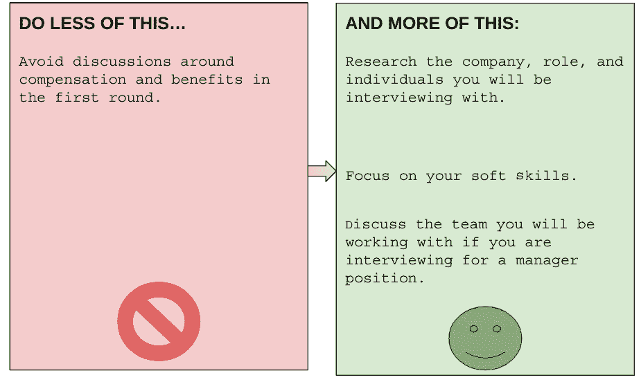
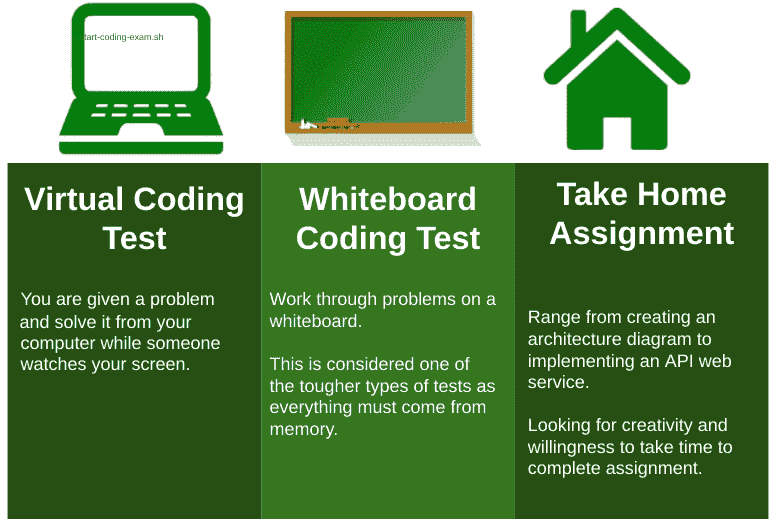
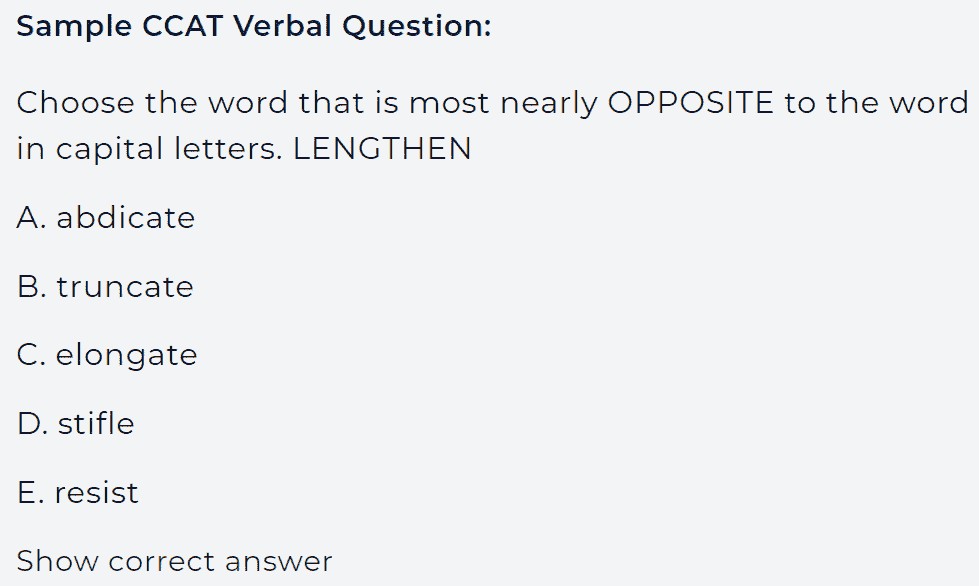
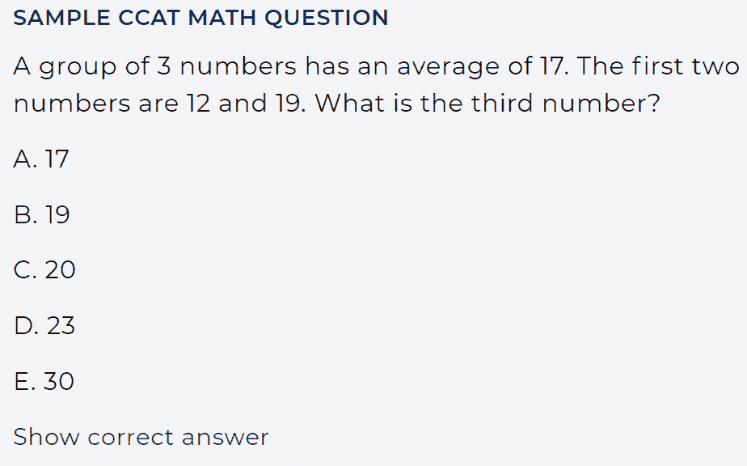
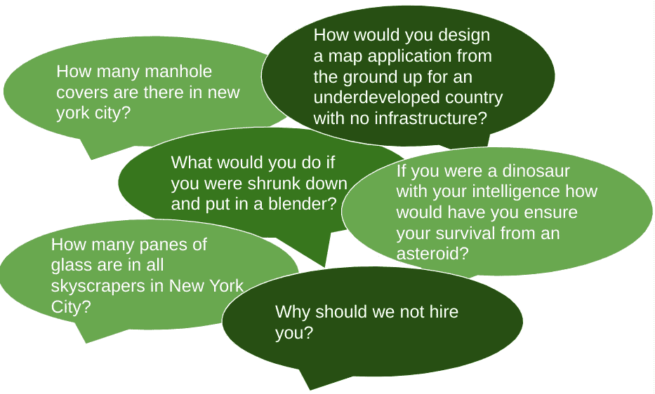
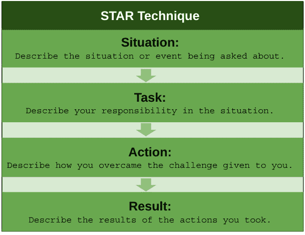

# *第九章*：一步步解读面试

在上一章中，我们谈到了面试过程，但没有过多细节。本章将继续讨论这个话题，深入探讨不同的步骤、你可能会接触到的不同人员，以及如何为每个阶段做好最佳准备。为此，我将通过具体示例和额外细节来讲解典型面试与非典型面试。从编码挑战、设计题、情境题和智商测试到其他所有类型的面试，我将尽力覆盖一切内容，并给你一些建议，帮助你变得无懈可击，无论遇到哪种类型的面试。

在本章中，我们将讨论以下主题：

+   典型的面试流程

+   非典型的面试流程

# 典型的面试流程

下图将面试过程分为三个阶段——初始面试、技术评估和后续面试：

![图 9.1 – 面试阶段回顾]

](img/Figure_9.1.jpg)

图 9.1 – 面试阶段回顾

我们将在接下来的部分中更详细地讨论这些内容。简而言之，每一轮面试对于面试的结果都是同等重要的，因此在每一轮面试中都要全力以赴。

## 第一轮面试

第一轮是你与招聘经理或从事类似职能的人员交流的阶段。你会提前与招聘人员或人力资源部门进行电话联系，但就本次概述而言，这些只是第一轮面试前的准备工作。

什么是第一轮面试？

第一轮面试被认为是你与招聘经理或评估你资格和适合度的人员的面试。这是在人力资源筛选电话成功后进行的面试。

对于第一轮面试，你必须专注于对公司进行调研，查看面试官的 LinkedIn 个人资料（他们将是你的直接上司）寻找线索，并确保你多次阅读职位描述。

除了背景信息外，你还应该专注于传达你的软技能，主要是清晰简洁地讲述你的经验，并思考你之前的经验如何能为潜在雇主带来帮助。

在这一轮面试中，他们通常会详细讨论当前的挑战，因此在面试过程中可以随时提出临时问题，最后留出一些问题，因为他们会期待你提问。你可以利用这个提问环节来结合你之前的经验，并解释你如何解决类似的挑战。这有助于给他们留下你知道如何解决他们面临的挑战的印象，这也是结束面试的一个绝佳方式。

如果你正在面试一个领导职位（即使你不是），你也应该询问你将与之共事的团队情况。

除非面试官明确提到，否则不要谈论薪资、福利或类似内容。

下图列出了第一轮面试的一些注意事项：

图 9.2 – 第一轮面试的注意事项

确保你提出足够多的问题！这是展示你做了足够研究、已经准备好开始工作并且对工作充满热情的最佳时机。对许多公司来说，你对这个职位的兴趣有时比你的技术资格更重要。如果你在面试过程中看起来或听起来无聊，可能会错失机会！

## 技术面试

这是面试中最关键的部分，因为目标是确定你技术知识的深度和广度；在与招聘经理的面试和这一阶段之间，你能做的准备有限。最好不要误表示你的技能，以免被问到你没有经验或不熟练的领域。如果你遇到自己不了解的内容，解释自己过去没有从事过这个领域的工作，但你对此感兴趣。如果你突然说出一些没有准备的内容，可能会对你试图建立的信任关系造成无法挽回的伤害。

不同的公司将采用不同的方式来评估你的技术能力，从最常见的场景——一位或多位面试官向你提问技术问题，到更复杂的情况——公司可能会提前给你一个设计、编码或架构的挑战，让你完成后再当面讨论。简单的技术筛选通常由一个小组或多个独立面试官组成，你可以期待他们深入探索你的技术知识。记住，你简历上的任何内容都可能成为提问的对象。

有一次，我需要在云端架构一个系统，并提供我所做的所有工作证明，实际上这等于授予了我所托管的基础设施的访问权限。后来，我被问到了相关问题。

还有一次，我被要求做一个带回家完成的问题，要求我使用一个我明确表示没有经验的工具。这类问题的目的是考察你学习新事物的能力——在大多数情况下，你将被评估解决方案的创造力，而非工具的理解。

我也多次面临编程挑战，问题的范围从一般的编程能力测试（例如，你如何实现这个*XYZ?*）到更具体的问题。这些问题的形式各异，从荣誉制的解决方案——你只有一两天时间提交测试，无法知道你是否通过搜索引擎找到答案，到更为复杂的第三方监考测试——真正的人会在你编程时观察你。一些公司可能希望你在现场编程，并在你工作时提问。

更具挑战性的编程测试通常是针对软件工程师的，但 DevOps 工程师通常也需要具备一定的编程能力。关键是至少要精通一门语言，能够实现常见的算法和数据结构。

提示

DevOps 工程师需要成为优秀的软件工程师和程序员；我所认识的一些最熟练的编码人员，恰好是我的 DevOps 同行。

其他类型的技术测试可能更具领域特定性，比如编写 Terraform 模块或 Shell 脚本来自动化任务。不管是什么测试，确保在开始前尽可能收集相关信息，并预期在后续的讨论中详细探讨你的解决方案。

设计面试或挑战有些不同。它专注于创建一个新的应用程序或服务，并构建相应的基础设施和服务。可能需要你在数据库、安全性等方面做出决策，甚至涉及一些传统上更侧重于应用程序开发的领域。一些公司会考察你对整个应用程序堆栈的理解程度。拥有一定的高层次理解是非常重要的，尤其是在云计算领域。你应该知道如何划分和保护网络，以及如何防止互联网访问你的后端和数据库。你应该知道如何进行身份验证、创建安全组，并且对网络有很好的理解。不同的角色将有不同的侧重点。有些公司会更关注容器化，可能会深入探讨 Kubernetes。有些公司则可能涉及无服务器架构。获得一些认证有助于确保你对可能未曾在职业生涯中使用过的服务有广泛的理解。同时，它们也帮助你在面试竞争者中脱颖而出。

即使是在技术面试中，结束时提问也很重要。我喜欢问技术面试官他们有多享受自己的工作，或者他们看到的挑战是什么。这可能与第一轮面试时的答案不同。

## 额外的面试轮次

你应该与招聘人员密切合作，准确了解每一轮面试的内容。若有疑问，最保险的方法是通过 LinkedIn 查看面试官的背景，了解他们的工作领域。根据我的经验，如果面试官来自与你不同的领域，比如**质量保证**（**QA**）和测试，那么通常这类面试更多的是考察文化或团队契合度，可能会有一些情境性的问题。如果面试官来自与你相同的领域，他们可能会更关注你的具体经验，并了解你是否能够解决他们面临的挑战。

即使你在技术面试中表现优异，也不要放松警惕！你仍然可能因为缺乏足够的热情，或在最后一轮面试中表现不够强势而未能通过。记住，即便你做得非常好，其他候选人也可能表现更出色，所以始终要全力以赴，直到最后一轮面试结束。

如果可能，等一段时间再请求反馈。如果没有得到工作机会，也要请求反馈。有时，他们不会给你更多的具体理由，只会给你一个泛泛的拒绝，但有时你会得到一些有价值的信息，指出你面试过程中的一个关键问题，比如*过于亲力亲为*或*不够亲力亲为*，或者是你的热情与他们的预期不符。我曾有一个人告诉我，我表现得不够有情感，这让他们感到不舒服。

除了正式反馈之外，试着分析你的表现并给自己一些反馈。你的回答是否尽可能流畅或简洁？你是否有任何知识空白？

下图展示了不同类型的技术面试：

图 9.3 – 技术面试类型

在下一部分，我们将讨论面试过程中的 offer 阶段。

## Offer 阶段

恭喜你——你通过了面试，克服了所有障碍，公司的招聘人员或人力资源部门已经联系你，表示希望给你提供 offer！通常，他们会先给出口头 offer，如果你口头接受，他们会发出书面 offer，通常会附带一个有效期——大约 48 小时到一周。

现在，如果你同时在多个公司进行面试，可能正处于收到多个 offer 的过程中，并且有可能进行进一步的谈判。小心不要过度表演，因为如果公司认为你只是利用他们来获得更好的待遇或改善现有工作状况，它们可能会撤回 offer。关键是你应该小心行事，因为这份工作还不是你的，所以要把这当作面试的最后阶段来看待。

在谈判时，你应该专注于表现出对这个角色非常热情。此外，在待遇上，尽量保持灵活性，因为他们在某些方面可能比其他方面更有弹性。谨慎地不要过早告诉你其他的机会已经收到了 offer，因为这可能适得其反。不要提及公司名称，也不要透露过多的具体情况。如果你收到了两个或更多的 offer，那么可以开始认真谈判，但前提是你愿意放弃你正在争取的机会。

有时候，人们会将 offer 拿回他们的工作公司并要求加薪。这可能是一个短期内通过外部 offer 获得加薪的好方法，但也可能会产生负面反馈，并且根据就业市场的情况，他们可能会在未来寻求某种保障，以防止这种情况再次发生。具体情况具体分析。如果你已经好几年没有加薪，并且收到了 offer，那就两边都要进行谈判。只是要尽量管理好你的选择，确保在做决定后，你与两家公司都能保持良好的关系。

# 非典型面试流程

虽然大多数面试通常遵循一定的模式，但偶尔你会遇到一些不同寻常的情况，值得特别关注。在本节中，我们将介绍预筛选测试、创新设计以及一些典型问题，比如著名的*Tell me a time when*格式问题。

## 测试

首先，让我们从预筛选测试开始。一些公司希望了解你的个性类型，并要求你提前参加一个个性测试。这个测试可能仅仅是让你评估五个与你相关的词汇的一页内容，也可能是一个包含 15 个以上问题的长篇考试。

有时，这会与认知测试配对进行，类似于传统的智商测试，不过在这些测试中用于测试的时间远远少于传统智商测试。我参加过**Criteria 认知能力测试**（**CCAT**）好几次，这个测试有 50 个问题，时间限制为 15 分钟。只有一次，我答完了所有 50 道题，而且做这件事时有相当多的猜测。问题的内容包括数学、逻辑问题，以及空间和语言类问题，如类比或反义词。这项测试需要你集中精力，因此尽量不要在疲劳或容易分心时进行这类测试。

我甚至听说一些私募股权公司要求他们投资的每一家公司员工都参加这些测试！对于这类测试，你能做的准备工作不多，但你可以通过确保你有 15 分钟的专注时间，并且在脑力处于最佳状态时进行测试来为自己增加一些优势。由于猜测不会受到惩罚，你应该始终在最后一分钟内猜测所有剩余的问题。

如果你没有这类测试的经验，可以尝试找到一份模拟测试：

图 9.4 – CCAT 问题示例 – 1

前面的截图展示了来自[`www.criteriacorp.com/`](https://www.criteriacorp.com/)的一个口头问题示例。以下截图展示了来自[`www.criteriacorp.com/`](https://www.criteriacorp.com/)的一个数学问题示例：

图 9.5 – CCAT 问题示例 – 2

除了个性和认知测试外，还有编程和设计测试，我们之前已经讨论过这些内容。对于传统的编程测试，[`leetcode.com/`](https://leetcode.com/)是一个合适的起点，[`www.hackerrank.com/`](https://www.hackerrank.com/)也是一个不错的选择。对于书籍，推荐《*Cracking the Coding Interview*》这本书，作者是*Gayle Laakmann McDowell*，其中包含了很多针对公司的特定技巧。

## 创新设计

对于设计来说，这会稍微复杂一些，但有一些很好的书籍深入讲解了系统设计，不仅能帮助你应对线下测试，还能在与面试官现场解答设计问题时提供帮助。对于与云相关的设计，可以参考云服务提供商提供的参考架构。如果你研究几种样本，你将能掌握很多场景的共性，更快速地想到解决方案。我建议你熟悉至少一种图表工具，并在被迫现场设计之前，尝试在该工具中设计一个示范性的三层应用。

你可能会遇到一个非传统性的问题，比如著名的*纽约有多少个井盖*之类的问题。我曾被问到，如果我被缩小并放进搅拌机里，我会怎么办。我还曾被要求从零开始设计一个地图应用的流程，在一个基础设施落后的欠发达国家。公司也可能要求你设计他们的某项服务，改进它，或创造一些新的东西。很多大型科技公司可能会以这种方式筛选你，无论你的具体技术角色是什么，所以如果你说自己是*DevOps*，也不意味着就能避开这个环节。

以下图中包含了一些非传统性问题：

图 9.6 – 极其困难的面试问题

幸好，最疯狂的脑筋急转弯式问题已经基本上消失，不再被用来严肃地筛选候选人。像往常一样，问问你的招聘人员应该期待什么，如果公司够大，互联网肯定会有关于他们可能抛给你哪些问题或设计问题的额外信息。在这类面试中，最重要的是你能清晰、逻辑地表达自己的思考，并且在制定解决方案时考虑到例外和边缘情况。

## 讲讲你曾经遇到过的一个情境

我最喜欢的云服务提供商之一以提问情境性问题而闻名，这些问题都以*讲讲你曾经遇到过的一个情境*的口号开始。这类问题会询问你在职业生涯中的经历，如何克服困难，以及如何处理各种职业情况。关键是你需要用 STAR 格式来回答 —— **情境**、**任务**、**行动**和**结果** —— 如下图所示：

图 9.7 – STAR 技巧

发生了什么，你做了什么，结果是什么？在这里，你应该少强调公司或团队，而更关注你的贡献。理想的候选人是那个敢于挑战当前规范、突破现状，以获得最佳结果的人——无论是对自己、团队还是客户。

这里的挑战之一是，你自己的经历可能并不像你想象的那样有趣或英雄化，或者你可能没有一套随时可以使用的故事。这可能让人很烦恼，但解决方案很简单。创建一个文档，开始整理你的故事，用 STAR 格式回答样本问题。你不希望在同一面试环节中重复讲述相同的故事，因此，确保如果有类似问题，你能快速切换到不同的故事。

*告诉我一次你需要与难以合作的人一起工作时的经历？*

*ST*: 我曾与一位难以合作的队友共事。

*A*: 我花了额外的时间了解这个人，我们的关系得到了改善。

*R*: 现在这个人非常适合合作。

现在，这个故事可能显得有些单调，但我剥离了那些部分来展示核心机制。

那么，如何让你的故事更好呢？你可以添加数据和数字。为你的故事增加量化的感觉会使其更加令人记忆深刻和印象深刻（尤其是与那些没有具体数据可分享的其他候选人相比）。

通常，R 部分应该是积极的，但并不总是完全积极的。如果它展示了你超越了自我，即使是负面结果，也可以被看作是一个积极的回答，就像下面这个例子所示：

*告诉我一次你需要与难以合作的人一起工作时的经历？*

*ST*: 作为一名在 ABC 公司工作的初级开发者，我的小组成员尽其所能与我制造麻烦。他们故意试图让我们之间产生隔阂，甚至试图疏远我和其他队员的关系。

*A*: 我是团队中新加入的成员，而与我发生冲突的那个人已经在团队工作了 4 年半。我邀请他一起吃午餐，希望我们能更好地了解对方。此外，我明确表示，我并不是要接管他们的团队，而只是根据需要提供帮助。

*R*: 2.5 年后，我和那个麻烦制造者已经是同事，我们之间建立了强大的工作关系。我们彼此尊重，但也非常具有竞争性，因为我们总是在努力推动对方向前进。说实话，如果没有我们现在的关系，我也不会被晋升为和他在同一团队的高级工程师。他是推荐我申请这个职位的几个人之一。

注意，这类问题可以应用于技术和非技术场景。你职位越高，问题越偏向领导力，但你应该准备好将任何答案以 STAR 格式呈现。

避免的错误

在回答问题时，避免使用*我们*或*我们团队*。相反，专注于你自己做了什么。即使是团队合作，也要强调你为解决方案提供了什么。

我看到的另一个常见错误是，候选人用简单的“是/否”回答问题，而不是利用这个机会加入一些关于自己的相关信息。根据你所面试的职位，如果面试官直接要求你提供更具体的例子，你可能还有机会挽回局面。

总结一下，找到一份情境面试问题的清单，并开始回答这些问题，将你的问题和答案保存在云端文档中。然后，优化你的答案，使其更加简洁有力，便于分享。

# 总结

在本章中，我们更详细地讲解了传统面试和非典型面试的流程。

我们讲解了面试过程中的传统阶段，重点讨论了技术评估阶段，讨论了各种类型的测试和筛选方式，以及如何准备。

我们还讨论了非传统的面试场景，如认知测试、性格测试、情境演练和设计问题，包括富有创意的脑筋急转弯等。我们强调了提前练习测试并写出最常见情境问题的答案，并随时保存。实践出真知，面试也不例外！

在下一章中，我们将讨论申请和面试过程中的一些技巧和窍门。
