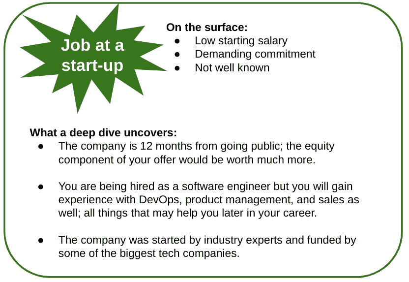

# 第十章：DevOps 职业：技巧与窍门

在前面的三章中，我们定义了 DevOps，讨论了你可以走的不同路径，并制定了一个你可以在申请过程中遵循的基础计划，以及每个面试阶段的注意事项。本章将重点讨论申请和面试过程。

本章将涵盖以下主要内容：

+   转行进入 DevOps 职业的建议

+   面试过程中要避免的技巧与窍门

+   面试过程中可以采用的技巧与窍门

# 转行进入 DevOps 职业的建议

本节内容围绕我的 DevOps 之旅展开。我将通过讲述我的故事来铺垫基础，接着分享从中提取的技巧。

## 个人 DevOps 之旅

2005 年，我决定去*明尼苏达大学*攻读机械工程专业。在大学时，我需要修一门 C++计算机科学课程。这门课是大学里唯一的一门软件相关课程；然而，这门课让我激发了继续探索编程以及编程能做什么的兴趣。这种兴趣促使我购买了一个微控制器板，类似于现在大家所说的 Arduino。我最终创建了一个托管在 Web 服务器上的网页，进而将宿舍房间与计算机连接，进行远程监控。

我在大学最后一年选修了一门专注于自动化和机器人技术的实验课，这激发了我对自动化的兴趣。我的课程教授也激发了我对自动化的兴趣。在实验课上，我们需要制造一个没有人工干预的产品——我们选择了一个木制的玩具板。我们被分成三人小组，每个小组负责使用一台 Fanuc 六轴机器人以及一个制造环节。我所在的小组负责包装环节。当玩具板制造完成后，它需要被放入盒子中、贴上标签并发货。我对整个过程产生了浓厚的兴趣，最终我在实验室花费了更多时间在自己的环节上，并且帮助其他环节与我们的小组进行对接。教授成为了我第一个学术导师，也是我最终决定毕业后选择那份工作的原因。

我大学毕业后的第一份工作是做制造工程师，这份工作我并不喜欢，但我选择了它，因为我能在工业环境中接触到自动化技术。我从自动化部门的资深同事那里吸收了尽可能多的知识；其中有一位同事告诉我，如果你仅仅花很少的时间在某件事情上，是不可能迅速掌握它的。他建议我买一个二手微控制器，自己动手玩一玩。我照做了，最终搭建了一个家庭实验室，逐渐发展成家庭自动化任务，最终变成了一个完全自动化的家。

我的制造工程师生涯结束后，我开始了作为自动化工程师的职业生涯，在北达科他州西部的石油和天然气行业工作。在担任自动化工程师期间，我接触到了**监控控制与数据采集**（**SCADA**）系统。参与 SCADA 系统的工程师们正在使用 Java 开发软件，并且使用 Maven、Subversion 和 Eclipse 工具。我开始在空闲时间研究软件开发，学习新的编程语言和工具。等到我对编程有了一定的信心后，我开始申请同一家公司内的软件工程师职位。最终，我拿到了我的第一个软件工程师职位。

软件工程非常有趣——总是有新东西可以学习，总是有挑战需要解决。我很快就能掌握新的编程语言，并希望能接触到更为多样化的代码库。另一个让我感到困惑的问题是如何平衡工作和生活，或者说，是工作和生活的不平衡。我住在明尼苏达州，但需要经常通勤到北达科他州西部。我认识几位在联合健康保险公司工作的人，他们一直鼓励我申请工作。我申请了大约六个我认为自己比较适合的软件工程师职位。

我还申请了一个技术敏捷教练的职位，这个职位的描述听起来很吸引人，但我觉得自己并不完全符合要求。我没有使用敏捷开发的经验，也没有做过教练或接触过 DevOps 的经验。最后，我还是拿到了这个职位！作为一名技术教练，我的工作是与团队合作，帮助他们进一步推进 DevOps 实践。直到第一天的到来，"不知所措"都不足以形容我当时的心情。在每个清醒的小时里，我都在学习 DevOps 和技术实践，但随着我了解到这个领域的复杂性，我变得越来越沮丧。第一天，我的经理坐下来对我说：

"*我知道你没有 DevOps 或敏捷开发的经验，曾有比你更合适的候选人，但你之所以被选中，是因为你渴望学习、渴望进步*。"

这位个人最终成为了我认为的第一位导师。在这位导师的指导下，我不仅提升了自己的技术能力，还提高了软技能。这个人帮助我变得更加自信，并鼓励我参加演讲俱乐部 Toastmasters 来提升我的公共演讲技巧。当我离开他们的团队时，是为了迎接一个新的挑战——也就是建立并领导属于我自己的 DevOps 团队。

前面的故事是一座信息宝库；你们中的一些人可能错过了一些要点，我们来逐一解析。

## 保持正轨，但要追随你的兴趣

在大学时，我的学位课程并没有让我有机会修更多的软件课程，因此我决定在自己的时间里跟进这方面的知识，且不影响我完成学位的时间。这并不是总能做到的；有时候，你需要全力以赴。除非我对某件事情非常确定，否则我通常会在做决策时有所保留——也就是说，我会继续平行进行已经有效的工作，同时尝试新的想法/流程。一个显著的例子如下：

图 10.1 – 合理利用你的时间

在上述例子中，这位个体的工作是软件分析师，但他们希望转向一个薪水更高的软件工程职位。他们听说了软件训练营，并考虑辞掉工作去参加为期六个月的训练营。我强烈不建议这样做；首先，你毕业后并不保证能找到工作。你可能经历过训练营，但出来后却找不到工作。第二个原因是，如果没有可靠的工作机会，你离职后将背负数万美元的债务。我建议你留在当前工作岗位，利用公司提供的学费报销机会。用这些资金来参加编程课程、获得认证，甚至追求在线学位。此外，即使你的公司不提供学费报销，你也可以通过自学和研究来提升自己。想想你花在看 Netflix 和玩视频游戏上的时间；将这些时间的一部分用来学习新知识，这些知识将帮助你找到下一个工作。我尊重那些自学成才的候选人，也与许多持有相似观点的领导者交谈过。

## 生活忙碌；优先考虑并专注于对你重要的事情

在大学时，我非常忙，老实说，忙得有些过头。我在滑雪巡逻队做志愿者，修了 16 个学分，做兼职，还想有点社交生活。直到在机器人实验室，我才意识到，如果我想交出一份自豪的演示，我需要重新优先安排我的时间。在其他实验室，只要能得到好成绩，我交出的东西就算不是最好的也无妨。但我对机器人实验室非常感兴趣，决定想从中获得最大收获，以便将来能在职业生涯中加以应用。我把实验室放在首位，牺牲了加入滑雪巡逻队的机会。另一个例子可以在以下图示中看到：

图 10.2 – 重新优先安排你的时间

如你所见，一天的时间是有限的；你还应该尽量保证充足的睡眠，并需要投入时间工作，以便能继续保持良好的表现。这些都占用了你的时间，剩下的自由时间由你掌控，你可以决定如何利用这段时间。我建议你坐下来，确定哪些方面可以被剪掉或缩减，从而腾出时间去做你希望优先安排的事情。

## 机会往往伪装在一个骗人的外表下。

在本节开始的例子中，我谈到过我曾经担任制造工程师的职位，因为我知道我将有机会与自动化与控制系统部门合作；未曾提及的是，我花了很多时间通过实习了解公司，才发现了这个机会。这在我的职业生涯中发生过好几次；有些情况下，我提前做了研究并做出了正确的决策；而有时，我错过了一个极好的机会。举个例子，看看下面的图示：

](img/Figure_10.3.jpg)

图 10.3 – 超越表面看到的东西

上述例子是为了举例说明而做的极端案例，但事先做足研究、再决定重大事件的逻辑依然适用。

## 有时候，做内部职业转换比同时更换工作和公司要容易。

当你为一家公司工作时，很可能你与管理层建立了良好的关系。如果你决定追求另一条职业路径，通常建议你先与当前雇主沟通。在这个例子中，另一条职业路径指的是远离你当前从事的工作类型。我们用一个例子来展示这个转变：一名软件工程师转行做 DevOps 工程师。

](img/Figure_10.4.jpg)

图 10.4 – 内部与外部职位变动比较

我在这里并不是想说——申请外部工作不是一个好的选择。申请外部工作过去曾多次对我有效。有时候，申请内部职位会显示出更快且更有利的结果，如前面的图示所示。

转向新职业路径需要新的技能——这些技能你可能已经具备，但除非有人亲自了解你，否则这些技能不会显现出来。这也是内部转岗有时更容易的原因之一。另一个原因是，内部职业转换可以分阶段进行，或者作为一个计划的一部分，如果你与领导层讨论过这些变动。最后，内部推荐对于申请职位来说是宝贵的。如果你能申请一个职位，并且有几个人可以推荐你，得到该职位的机会将呈指数增长。

## 申请你感兴趣的职位，即使你没有满足所有要求。

申请你真正想要的工作，而不是你完全符合要求的工作。这通常是无效的，但我和我的许多同行通过这种方式找到了工作。使用自动筛选机制的公司如果你没有满足所有要求，会将你筛掉；绕过这个问题的一种方法是，在简历中不仅写出你在工作中使用相关软件的时间，还要包括你在个人项目中使用这些软件的时间。作为一名招聘经理，我是不会因为你缺少两年使用某种语言或工具的经验就忽视你的。

为工作设置年限经验要求的问题在于，这只有在每个人都按相同的速度学习时才有效。然而，大多数招聘经理都清楚这一点并非如此。

# 面试过程中需要避免的事项

在上一节中，我讲述了我的成功经历以及这些成功如何帮助我进入 DevOps 领域。现在，我想用几页纸回忆一下我的失败经历，或者更准确地说，是我尝试找工作时的失败。首先，我们将回到 2008 年。

## 申请职位时，避免提供不准确或具有误导性的信息

*错误信息让我失去了一份工作。*

在大学的三年级时，我开始寻找实习机会。我申请了一份要求申请者正在攻读计算机科学学位的工作；而我当时正在攻读工业工程学位。当问卷中问到是否目前就读计算机科学专业时，我回答了“是”。一周后，我接到了招聘人员的电话，我们开始讨论这份工作；这次讨论非常简短，最后我收到了一份技术能力测试的链接。我在测试中的表现应该还不错，因为我顺利进入了下一轮面试，那是现场面试。公司为我支付了机票费用，并为我安排了酒店住宿。我需要带着成绩单到现场，我在第一次会议中与面试官一同查看了它。接着，面试官问了我一句，*我以为你是计算机科学专业的学生？* 不用多说，这次面试以我的自尊心受挫而结束。如果我遵循申请工作时的黄金法则——始终提供准确的信息，这场碰面本来是可以避免的。如果我当时直言不讳，我或许仍然能获得这份工作，但因为我在最初的申请中没有诚实以对，我最终被列入了“拒绝名单”。

应始终遵循的一条规则是，申请工作时要诚实，包括在你的社交资料上。在我的案例中，我是故意提供了虚假信息，但无意间提供错误信息的后果可能一样。在回顾时，有一个词能描述我所做的：自私。我选择了将自己的需求置于公司要求之上。这样一来，公司浪费了时间和金钱面试我，安排了我的机票和酒店，这是一种严重的背叛。当他们发现我故意提供虚假信息时，信任完全破裂。如果我诚实一些，或许我会有机会。避免在不了解职位要求的情况下参加面试。

*你甚至看过职位描述吗？*

一位候选人通过了我团队 DevOps 职位的招聘筛选，并迅速进入了面对面的技术面试。每当我问他一个问题时，他都回答说自己用 Python 解决过类似的问题。面试结束时，我给了这位候选人以下反馈：

尽管你在使用 Python 方面似乎非常有经验，但我们更倾向于寻找一位在 Golang 上有更多实际经验的人；你愿意分享一下你使用 Golang 的经验吗？

候选人如实回答，除了进行一些轻微的代码修改外，没有使用过 Golang 的经验。不幸的是，候选人没有得到这份工作，如果他们完全阅读了职位描述：*高级 DevOps 工程师 – Golang 经验*，本可以节省时间。

在前面的例子中，如果候选人能花更多时间研究职位和要求，而不是立刻投入准备，他本可以避免尴尬的对话。显然，这个人是一个优秀的工程师，但在给定的团队中，能够在 Golang 上指导他人是职位描述中提到的一个要求。如果职位描述不清晰，或者你对某些事情不确定，完全可以向招聘人员询问。

有四个方面是你必须在面试前做好准备的：

+   **文化**：了解公司的文化将帮助你通过招聘人员的初步筛选。如果你能展示如何加强公司文化，这可能会成为你获得这份工作的决定性因素。

+   **技术需求**：这是必须的。如果你无法展示出你对团队所需支持领域的扎实理解，你将无法获得这份工作。

+   **行业**：如果你正在申请金融行业的工作，至少应该了解一下该行业。在最理想的情况下，你已经在该行业工作。

+   **二级职责**：这些是你将与之合作的团队，他们需要额外的知识，超出了你直接工作所需的内容。

在接下来的部分，我们将讨论与招聘人员沟通不畅可能带来的职业毁灭性后果。

## 避免在申请职位后忽视招聘人员的回复

*未回复。*

在石油和天然气行业工作时，我与招聘人员进行了初次面试，随后我去了为期一周的工作旅行，之后又度过了一个星期的假期。

在我旅行和度假期间，我忽略了检查邮件，错过了招聘人员的两次电话。当我最终回归现实时，我联系了招聘人员，得知我不再被考虑这个职位。说实话，我差点忘记了这事，但这也给我上了一课，希望我能传授给你：

*申请工作时，始终制定沟通策略。*

在我的例子中，我本可以设置一个自动回复，说明我在旅行回来之前无法回复邮件。这样，招聘人员更有可能给我更多的时间来回复。更好的做法是，提前告知招聘人员你即将到来的工作和个人计划，以避免任何混淆。面试后，如果你决定不再对某个职位感兴趣，要做出礼貌的回应，并告知招聘人员你不再感兴趣，这样可以为未来可能出现的机会保留关系。在申请工作时，遵循**LinkedIn、电子邮件和电话**（**LEP**）协议非常重要，具体如下图所示：

Figure 10.5 – LinkedIn、电子邮件和电话跟进协议

上面的图表展示了与招聘人员初次接触后，能够提高成功机会的做法。接下来，我们将讨论跨平台一致性信息的重要性。

## 避免社交档案与简历之间信息不一致

在 LinkedIn 上，你会遇到一些个人资料上夸大职位头衔、看起来无所不能、并且能说六种语言的人的资料：

Figure 10.6 – LinkedIn 与现实

上面的例子是一个夸张的版本，展示了你可能会遇到的情况，但它也应该鼓励你，并告诉你要保持积极心态——大多数人的情况并不像他们社交资料上所写的那样光鲜。夸大自己在 LinkedIn 和其他社交平台上的形象，可能会对你产生不利影响，尤其是在你申请工作的时候。

夸大的信息能让你引起注意，但一旦完整的故事被揭示，你的声誉将会受到影响。

到目前为止，我们已经讨论了你应该避免做的一些事情，以提高面试后获得积极结果的机会。接下来，我们将讨论你在面试过程中应该做的一些事情，以提高获得工作的机会。

# 面试过程中的注意事项

在我参与的许多面试中，无论是作为面试官还是面试者，我遇到了一些出乎意料的积极因素，对整个过程产生了意想不到的积极影响。在本节中，我将介绍其中的几项。

## 讨论你的副项目

并非所有的副项目在你面试 DevOps 职位时都有分量；比如你的岩石收藏在面试中几乎没有任何意义，但如果你用 Raspberry Pi 创建一个能够区分不同类型岩石的 AI，那就很酷，应该提及。在讨论时，你可以根据情况和判断来决定你的项目是否具有意义。

*你对智能家居感兴趣？我也是！*

我曾参加过一个技术主管职位的面试，并顺利通过了初步面试和技术面试。在一次最后的跟进面试中，我被告知现在只剩我和另一个候选人了。那次谈话比之前的讨论更加轻松，招聘经理告诉我他一直在升级自己小屋的互联网连接，以便能够支持更复杂的智能家居。

我抓住这个机会开始讨论我正在进行的智能家居项目。我不认为这是我获得工作机会的决定性因素，但它也没有削弱我的机会。

我能够讨论无线拓扑结构和 C 编程语言等话题，因为我提到了我的智能家居副项目，这些本来可能会被忽略，因为它们不是我的简历中的内容，也不是我在专业工作中从事的事情。如果你正在寻找 DevOps 领域的第一份工作且缺乏实际经验，讨论你的副项目变得尤为重要。讨论副项目会让面试官看到你对 DevOps 感兴趣并渴望学习新知识。

## 充分准备，准备讨论工具替代方案

DevOps 工具来来去去——这就是现实。如果你有使用 GitHub 的经验，而公司使用的是 GitLab，不必担心！准备好讨论这两者的相似之处和不同之处；向面试官展示你做了功课，了解了这个工具。下表展示了在面试过程中可以互换使用的工具：

图 10.7 – 工具替代

有时公司对候选人有硬性工具要求，但更多时候，如果你使用过类似的工具，相关知识会被视为可转移的。云服务提供商有着多样化的工具集合，并且在某些情况下要求广泛的知识和认证，这也是为什么这些技能集可能不被视为可转移的原因。

如果公司愿意为您面试与 Azure 相关的职位，而您只有 AWS 的工作经验，请确保准备好讨论这两个供应商之间工具的关系。在这种情况下，一个有用的资源是下图，首次讨论见于*第三章*，*高级 DevOps 实践者的专业技能*：

图 10.8 – 云等效性

这个想法几乎可以应用于任何工具或流程；另一个适用的例子是，当工作要求具有 GitHub 经验时，使用 GitLab 的经验也同样适用。这两者在仓库功能上都提供了类似的功能；只需准备好讨论 GitLab 还具有 GitHub Actions 所不具备的内置 CI/CD 功能。

# 总结

在本章中，我们涵盖了所有必要的变更，以确保您向潜在雇主展示最佳自我。我们讨论了拥有完整和专业撰写的 LinkedIn 个人资料的重要性，并提出了如何提高被潜在雇主注意的建议。接下来，我们介绍了如何更新您的简历，以便自动化系统和人类能够快速看到关键信息。然后，我们介绍了拥有个人网页的重要性，并演示了如何在 GitLab 上创建 Hexo 网页的教程，以及您的武器库网页应包含的部分。最后，我们介绍了其他社交网站，虽然不是必需的，但可以增加您被招聘人员注意的可能性。

在下一章中，我们将讨论网络建设的重要性，以及如何在 LinkedIn 和会议上进行网络建设。
