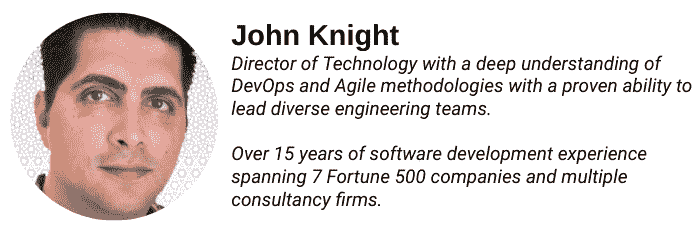
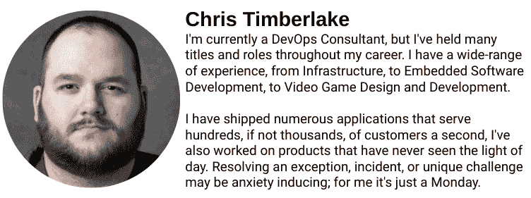

# *第十一章*：与 DevOps 从业者的访谈

如果你从头到尾都跟随了本书的内容，抱歉，老实说，我希望你从中收获了很多有价值的信息。本章的总结是基于我与实际同事以及我采访过的人的对话。

本章将涵盖以下主题：

+   与资深 DevOps 经理的访谈

+   与资深 DevOps 工程师的访谈

+   与 DevOps 架构师顾问的访谈

+   与一位热衷于神经多样性和包容性的技术高管的访谈

通过阅读不同经验层次的人的观点，你可以形成更全面的了解，知道在寻找下一个 DevOps 职位或尝试获得第一个 DevOps 工程师角色时应该期待什么。

# 与资深 DevOps 经理的访谈

我采访的第一个人恰好也是这本书的合著者，*约翰·奈特*。约翰最初怀着成为游戏设计师的美好愿景开始他的职业生涯。20 年后，他成了一个杰出的工程领导者：

](img/Figure_11.1.jpg)

图 11.1 – 约翰·奈特的个人简介

**记者**：嗨，约翰，谢谢你同意今天下午与我见面，讨论你作为 DevOps 领导者的职业生涯！

**约翰·奈特**：没问题。

**记者**：首先，请告诉我们一些关于你自己的事。

**约翰·奈特**：我是约翰·奈特，我是一名具有 16 年 DevOps 经验的工程经理，拥有 9 年云计算经验和 5 年团队领导经验。我曾为 8 家财富 500 强公司工作并提供咨询服务，并获得了三大公共云提供商的多项认证。在我的空闲时间，我收集硕士学位。

**记者**：听起来是个成功的职业生涯！在继续之前，能否谈一下你提到的收集硕士学位的说法？

**约翰·奈特**：我目前拥有三项硕士学位，并正在攻读第四个学位。我抱怨自己没有太多时间，但我从不允许自己不在学校里；我是一个知识怪。

**记者**：有意思；我们稍后再回来谈这个问题，但现在能不能告诉我们你是如何进入 DevOps 领域的？

**约翰·奈特**：我曾是一个游戏开发者，或者说是尝试成为游戏开发者。我曾参与过两个独立的 MMO 开发，后来被从游戏开发领域招募了出去。结果发现，部署和修补游戏所需的技能，恰好也是部署和修补软件所需的技能。这就是我进入这个领域的原因。那时，首席架构师太忙，无法亲自进行部署！16 年过去了，我依然感谢他。

**记者**：16 年，哇。你在这个领域遇到的最大变化是什么？你是如何确保自己保持相关性的？

**约翰·奈特**：我 10 年前使用的技术大多数现在已经不再相关。你必须跟上技术的进步，并从专家和创新者那里获取知识，做到持续改进。成为一个持续学习者是非常重要的。

**记者**：你谈到过自己是一个硕士学位的“收藏者”，并且如何持续学习帮助了你；我开始看到一些模式了。你能否展开讲讲持续学习在 DevOps 领域的重要性，以及它如何影响了你的职业生涯？

**约翰·奈特**：我 15 年前使用的技术，甚至 10 年前使用的一些技术，大多数已经过时。对于一个新来的人来说，完全不需要调查过去 15 年的领域发展，过去 5 年就足够让他胜任，甚至在一些领域更少。持续学习让你能够不断提升自己的技能，即使别无他法，它也能帮助你保持创新，尤其是当你学习自己专业领域之外的知识时。真正的飞跃来自于将原本毫无关联的领域结合在一起。现在很难做到这一点，因为信息量巨大，无法了解或学习所有内容。所以，持续学习让你能够逐步掌握知识，并使其变得更加容易。就影响力而言，我拥有比其他类似候选人更广泛的背景，这使我在竞争中占有优势。任何你能通过获得更多知识、证书等方式使自己与众不同的做法，都会在长期中对你有帮助。知识是复利增长的。

**记者**：在你的职业生涯中，有没有遇到过挫折或意外的变故？

**约翰·奈特**：至于挫折或意外的变故，它总是发生在一个动态变化的环境中。曾几何时，我大多在 Windows 系统中工作，突然间，我转向了 Linux 世界。在某一时刻，容器技术被引入了，还有基础设施即代码。你必须适应，否则就会停滞不前。游泳或沉没。

**记者**：哇，刚才那段话中有很多有价值的信息。接下来，我想谈谈你是如何、何时以及为什么决定转型为领导者，而不是继续走个人贡献者的道路。

**约翰·奈特**：转型为领导者可能很困难，因为每个人都希望看到经验，但必须有那个第一次机会，尽管你没有经验，而给予你机会需要信任。在我看来，我有几个原因想尝试。首先，我认为这是一个合乎逻辑的职业发展方向，能够为我的职业生涯带来更多的机会。其次，我受到好的和坏的经理们的启发，想要运用我学到的经验，做出不同的改变，在我认为能做得更好的地方做到最好。

在我的团队中，我也鼓励每个成员关注学习、培训和提升自己的专业水平，并且你可以看到我们从开始合作到一年后的显著进步。

我还有很多需要改进的地方，但我觉得在这些领域的提升不仅有利于我的工作，也有助于我生活和事业的其他方面，所以这是一种双赢的局面。

至于如何过渡，我当时选择从事咨询工作，以便在不需要永久加入公司员工的情况下与高知名度的公司合作。这使我能够从外部视角看待他们的业务，并加强了我的人际交往能力，因为他们是客户，而我现在是面向客户的。

做了几年之后，我加入了一家小公司，管理他们的 DevOps 团队和相关工作。我发现作为一名顾问，除了技术知识外，最重要的技能是影响他人。当你没有权威时，必须依靠外交手段、魅力和谈判技巧来获得你想要的东西。在成为经理之前学习这种技能，能够帮助你成为更好的领导者。

**记者**：影响他人——我也认为这在我作为更资深的个人贡献者时很重要。还有哪些技能是可以转移的，又有哪些技能是完全不同的？

**约翰·奈特**：导师的能力在于帮助他人提升，使周围的人变得更好。一位经验丰富的工程师是初级工程师的催化剂，可以帮助他们更快地达到目标。在管理方面，能够合理地优先排序工作并分析相互竞争的优先级是关键能力，但几乎每个人都能从这一领域的优势中受益。领导力与管理不同。领导力在于拥有责任，并为结果负责。即便是初级员工也应该努力成为领导者。

在管理中，你必须进行大量的谈判；你需要运用外交手段避免那种“赢得了战斗却输掉了战争”的局面。管理多团队之间的人员预期是非常重要的。作为一名个人贡献者，你往往更专注于你所在的团队。

**记者**：您对正在寻找导师的初级工程师有什么建议？

**约翰·奈特**：我认为我们应该始终尝试模仿身边积极的榜样。这样，我们能够进步，并受到那些在某些方面拥有我们所缺少的能力或卓越表现的人的影响。与团队中资深成员建立良好关系，也为潜在的导师机会打开了大门。

你还可以请求你的直接上级在你的职业发展中发挥更积极的作用。导师无处不在。

**记者**：我们许多人都有一个问题，想问您关于招聘的过程；能否先跟我们说几次候选人在面试过程中没有交付的例子？

**约翰·奈特**：通常在面试筛选时，我会看经验、文化适配性和团队契合度，以及一些软性的人际交往技能。我希望找那些能与他人合作顺畅的人。有些人过于关注薪资，夸大自己的技能，或表现出缺乏热情。

有一次，我有两个候选人，我给两人都抛了一个挑战；一个是临时的问卷要求他们填写。一个第二天就回来了，并且态度积极。另一个则因为这个突如其来的障碍感到沮丧。第一个人得到了这个职位。

我的招聘运气不错，我仍然在不断更新我的面试流程。

**记者**：John，你能否为我们深入介绍一下你过去使用过的其他技术评估方法？另外，你认为哪些方法能为你提供最有价值的候选人洞察，并且你在审查技术挑战时关注的是什么？

**John Knight**：评估技术专长有很多方法。通常，我专注于经验。你用你声称掌握的技术解决了什么问题？我通常假设他们告诉我的信息是准确的，然后只是寻找经验。这让我能够同时评估多个维度。有时，你还能了解一个人的性格特征，比如他们是否善于合作，还是像孤狼一样独立工作等等。

传统的技术能力评估标准很有用，但通常我把这些留给其他面试官。编程熟练度、系统经验、云技术专长——这些都是很容易测试的基础知识领域。我不想知道你能否定义某个概念。你可以查阅任何定义。我想知道你能独立创造些什么，以及你知识和技能的边界在哪里。我特别寻找能补充我现有团队的能力，所以拥有多种技能总是很棒的。

**记者**：谢谢 John，只有几个问题了。回顾你的职业生涯，有没有什么特别的事情你希望自己能做得不同或避免的？

**John Knight**：我根据薪酬需求而不是基于我真正想做的事情或是否对公司的工作感兴趣来换了岗位。我会建议避免这样做，尽管我理解财务因素在每个决策中都起着关键作用。有时，我希望自己能勇敢地选择一份薪水较低的工作，在我热衷的公司或产品中工作。无论如何，我的选择为我带来了良好的职业生涯和结果，所以我非常幸运。

我可以做得不同的其他事情包括在接受工作之前更多地考虑文化契合度。我曾在几个工作环境恶劣的地方工作过，虽然没有任何一个问题或面试是万无一失的，但作为候选人，你也应该对公司进行尽职调查，确保他们的做法与你的信念一致。

**记者**：最后一个问题，John——我读过你一些关于 AI 和未来技术的作品；你认为 AI 会在未来影响 DevOps 领域吗？个人应该如何为 DevOps 的未来做好准备？

**John Knight**：不完全是人工智能，而是**人工智能辅助自动化**和**机器学习**。有两个交集。一个涉及使用 DevOps 将 AI 或 ML 部署到生产环境中。这被称为将 AI/ML 落地或 AI/MLOps。

另一个交集是使用 AI 代理自动响应事件，或使用 ML 对将要发生的事情进行预测，或者提供推荐。这个领域充满了创新的机会。我认为自动修复服务的代理，比如**站点可靠性工程师**（**SRE**）代理，如果现在还没有存在的话，应该很快就会出现；智能测试自动化，智能资源分配，AI/ML 在威胁防范、检测、修复等方面的应用。

为了做好准备，你必须开阔视野并不断学习。云服务商很擅长教你如何使用他们的服务，但你必须理解底层的知识，才能最大化地利用它们。幸运的是，我们生活在一个学习资源丰富的时代，我们可以在线上参加世界顶尖大学的课程，可以在瞬间以最低的成本获得任何信息。说实话，如果你能接入互联网，就没有什么是你不能开始学习的。这是一个令人惊叹的时代。

**记者**：确实如此，John。感谢你抽出时间与我分享你的见解，我期待再次与您交流。

# 与一位资深 DevOps 工程师的访谈

我采访的第二位个人是*Veeral Patel*。Veeral 是我有机会聘请为 DevOps 工程师的第一份工作的个人：

图 11.2 – Veeral Patel 的简历

**记者**：下午好，Veeral，感谢你同意坐下来和我讨论你成为 DevOps 工程师的历程。

**Veeral Patel**：谢谢，Nate，没问题！

**记者**：在我们开始之前，你能分享一下你的背景信息吗？

**Veeral Patel**：当然！我在教育方面的背景是软件工程和数据科学。在实际工作中，我在科技行业工作了 4 年。在技术经验方面，我做过 React 和 C# 的全栈开发，使用 Python 进行脚本编写，并在 Jenkins、GitLab 和 Azure DevOps 上做过 DevOps 自动化工作。

**记者**：你是何时发现自己对技术产生热情的？是什么决定性的时刻让你知道自己想编写代码？

**Veeral Patel**：我知道我想编写代码是在大学时选修计算机科学入门课程时，那是我唯一会定期参加的课程，即使它是大一的早上 8 点课。

**记者**：哈哈，所以你知道这是你的志向，所以才值得投入精力；我喜欢这个！在大学期间，你有做过实习吗？如果有的话，是哪些实习？能详细谈谈你的职责和学到的东西吗？此外，你的实习是否对你之后所选的课程或学习内容产生了影响？

**Veeral Patel**：我做过——我曾在*Medicon Health*做过实习！在那时，我从事软件测试工作，我们做的是集成测试，我使用了一款叫**Applitools**的工具。那时我学会了如何从网页浏览器中找到元素，并编写脚本来点击这些元素并进行数据验证。这次实习并没有影响我所选的课程，因为我选修了完成学位所需的必要课程，以便尽快毕业。

**记者**：你觉得你的实习对你毕业后找工作有影响吗？此外，毕业后你第一份工作是什么？你在本科毕业后直接去攻读了第二学位吗？

**Veeral Patel**：大学毕业后找工作并不困难。在毕业前，我就收到了几个工作邀请，因此我选择了提供更高薪水的公司。我毕业后等了一年才去攻读第二学位，这样我的雇主可以为我支付一部分学费。

**记者**：听起来是个聪明的财务决策！你会给即将找工作的软件工程专业学生三条建议吗？

**Veeral Patel**：首先，我鼓励学生们继续学习现代技术——科技世界变化太快，你需要在工作日抽出时间来学习。

第二，如果你不会为了那份工作而去做，即使它的薪水只有一半，那说明你对这份工作并没有那么热情。没有激情，很难在科技行业取得成功；这里竞争激烈，每个人都很聪明。

最后，如果你不开心，就不要害怕辞掉工作——外面的机会太多了，不必被困住。

**记者**：这真是一个非常有价值的建议，如果大家能遵循这个建议，肯定都会受益。我想换个话题，讨论一下你是如何从软件工程转到云 DevOps 工程的。

**Veeral Patel**：我从软件工程转到 DevOps，因为我喜欢能拥有某些管道、项目或计划的控制权。作为一名软件工程师，我曾是一个团队的一员，负责维护或创建应用程序；我只不过是一个大齿轮而已。而在 DevOps 中，我能负责某些项目并全权掌控它们。而且，我能接触到很多创新的技术。例如，在 DevOps 中，我能涉及到 AWS、Terraform、Ansible 等技术。而在软件工程中，我可能会被困在 Java 上工作多年。

**记者**：我们应该把这个做成海报——*进入 DevOps，这样你就不会被困在做 Java 多年了*。这听起来像是我进入 DevOps 的原因——我想从事酷炫的技术工作。当你第一次面试我团队的 DevOps 职位时，你对学习和吸收知识的渴望是你超越其他具备相似技能的候选人的原因；你能告诉我在你的职业生涯中，这一特质在哪些方面带来了回报吗？

**Veeral Patel**：这种学习能力和渴望吸收知识的态度在学校里也取得了回报；我一直认为正规教育非常重要，我认为我有几个学位的原因就是因为我渴望学习。我能够讨论各种技术，因为我至少花时间研究过它们，所以面试变得容易得多，而且我从不担心自己会在不太了解的任务上担任志愿者。

**记者**：Veeral，你能描述一下你希望聘用的完美团队成员吗？他们应该具备什么样的品质？

**Veeral Patel**：完美的团队成员是一个喜欢分享想法且不介意接受新挑战的人。我总是喜欢听听其他人的观点，仅仅这样就能激发思维的流动。具备技术能力当然很重要，但学习的意愿同样重要。

**记者**：你还拥有数据科学的高级学位。这个知识如何补充你传统的 DevOps 技能？你有具体的例子吗？

**Veeral Patel**：拥有数据科学学位让我对管道和数据流动的可能性产生了许多想法。我常常思考某些数据或管道在分析中会有什么价值，或者当前不可轻易获得的数据可以用来做什么。当我在医疗行业工作时，我常常思考有多少未开发的数据仅仅是进入数据库后，显示在用户界面上，并没有进行任何实际的分析。

**记者**：感谢你的时间，Veeral——我期待着再次和你交谈。

# DevOps 架构师顾问访谈

有些人对你产生影响。*Chris Timberlake*就是对我有影响的人之一。从我第一次参加与他一起的会议时，我就能感觉到他是一个我能从他身上吸收知识的人。这在我们共同为 GitLab 实施项目的过程中得到了验证：

图 11.3 – Chris Timberlake 的个人简介

**记者**：感谢你，Chris，愿意和我讨论你的 DevOps 之旅。在开始之前，你能介绍一下自己以及那些经历如何带领你走到今天这个位置的吗？

**克里斯·廷布雷克**：谢谢你邀请我，内特！我很小的时候就开始接触计算机——在我不到 10 岁的时候。我从做 GeoCities 网站和为 Yahoo Messenger 开发启动工具开始，随后转向基于 Half-Life Source 引擎的电子游戏编程。这些经历是我接触编程的起点。从那时起，我就一直沉迷于此。我曾短暂地转行去从事执法工作。后来，我回到了编程领域，并通过一系列事件在 Red Hat 参与了大规模的数字化转型项目。现在，我在 GitLab 担任专业服务架构师，帮助推动数字化转型。

**记者**：等等——你是技术专家，同时也是执法人员？真了不起！你认为自己是一个 DevOps 工程师吗？你能解释一下你如何区分 DevOps 工程师和软件工程师，还是说它们是一样的？

**克里斯·廷布雷克**：我确实认为自己是一个 DevOps 工程师，但我也认为自己是一个不错的软件工程师和系统管理员。我可以在不同的角色之间灵活切换。以前，在 2015 年，我会说 DevOps 工程师只不过是拥有系统管理员能力的软件工程师。然而，随着云市场的发展，DevOps 领域已经有了显著的成长和变化。今天，我认为 DevOps 工程师是一个独立的角色。现在，DevOps 工程师是负责自动化和交付流程的大部分管道工作。

**记者**：克里斯，你在工程和 DevOps 领域看到了许多不同的面向。你能解释一下作为顾问在 DevOps 领域工作和直接为公司工作之间最大的区别吗？

**克里斯·廷布雷克**：最重要的一点是你的角色。作为一名顾问，你必须拥有完全不同的思维方式和不同的责任。作为顾问，你应该是该领域的领导者，一位教育者，别人向你请教问题并寻求解决困境的帮助。你还必须协调旅行、费用、待命，并且在不同的环境中工作——有时甚至没有必要的工具。作为顾问，你的任何角色都会更具挑战性。例如，作为员工，你不必太担心确保自己在下午 6 点赶到亚特兰大，搭上前往达拉斯的航班，晚上 10 点转机，再赶到旧金山参加早上 8 点的会议。

作为员工，你关心的事情要少得多。我认为作为 DevOps 顾问是两种截然不同角色的结合。一方面，你是为 DevOps 工程做出贡献的个人；另一方面，你是一个出差的领导者或老师，负责向他人传授相关知识。

**记者**：谢谢你，克里斯。接着问一下，你认为咨询角色适合那些想要开始从事 DevOps 工作的人，还是说这个角色只适合专家？

**Chris Timberlake**：这两种情况都适用。更多的是关于决心以及在压力下保持冷静的能力，而不是单纯的知识。当我开始我的咨询生涯时，我当然不是所有领域的专家。即使到今天，我仍然会被问到我并不擅长的事情。但面对不确定性时，我确保自己能去为别人找到答案。我确保自己在处理当前问题时不断学习，同时保持清晰的思维。成为一名顾问让我学到的其中一件事是，除非我能可靠、准确并且适当地为某个问题提出正反两方面的论点，否则我就不能真正理解一个解决方案或话题。做顾问是一份压力巨大的工作，肯定不是每个人都适合。它更多是关于你如何工作，如何应对角色带来的压力，甚至是如何享受这份工作的。

**记者**：谢谢你，Chris，我觉得我们的读者在规划自己的 DevOps 职业生涯时会发现这些特别有用。我想换个话题，谈谈开源。你曾经工作过的至少两家公司被认为是开源软件的先驱——GitLab 和 Red Hat。许多人还认为它们是 DevOps 领域的主导者。你能分享一下你对开源与 DevOps 之间关系的看法吗？

**Chris Timberlake**：我的意思是，软件的未来显然是开源的。这不是秘密。从历史上看，许多 DevOps 工具和模式都来源于开源项目。人们会自发地组织起来一起做一个项目，然后，啪——你就有了一个被许多人甚至企业使用的新产品。有些人可能觉得开源是有益的，因为它让一些可能无法参与软件开发的人也能够参与其中。

开源的真正力量在于透明性、协作性，最重要的是，开源还允许公开的冲突发生。这些都是打造伟大事物的关键。Red Hat 不仅仅是一家基于开源的公司；它将这些价值观融入到他们的工作和运营方式中。他们让员工保持自我，并且在很多方面对员工保持透明。Red Hat 能够成为迄今为止最大的一笔被收购的科技公司，价值达到 340 亿美元。GitLab 也将这些价值观深深铭记——不仅仅是在软件方面，而是在其运作方式上。这导致了该公司今年实现了巨大的 **IPO（首次公开募股）**。

开源倡导者提倡和鼓励的那些相同价值观推动了这两家公司走向了巅峰，我相信这些价值观将巩固 DevOps 成为未来所有软件和 IT 公司的必需品。这是因为 DevOps 也鼓励并实践着这些相同的价值观。

**记者**：我完全同意！现在，回到你刚才提到的 DevOps 价值观，你觉得对于 DevOps 专业人士以及那些希望进入这一领域的人来说，最受需求和最受欢迎的软技能是什么？

**Chris Timberlake**：我认为无论你处于什么职位，你都应该有成为领导者的愿望。当然，这并不意味着你必须成为经理或领导任何事务。但拥有类似领导者的特质会帮助你在职业目标上取得成功。有效的沟通技巧是必不可少的。清晰的信息传达和开放的沟通非常重要，不能被过度强调。自信也是一个重要的特质。

即使你必须“装作自己已经做到了”。我看到许多了不起的工程师因为冒充综合症而绊倒自己。我们都在这里尝试构建伟大的东西，我们都会遇到问题，也都会失败。最后，我认为接受失败、愿意冒着失败的风险，然后克服失败是非常重要的。每个具有强大软技能的工程师都有一段失败的故事。

我？我在一个下午为我所在的公司损失了 400 万美元的收入。能够从这些失败中进行反思和学习，防止它们再次发生，并在失败后构建更好的东西是非常重要的。因为每个人在任何职业中都会失败，重要的是你在失败后做了什么。

**记者**：如果你能谈谈你如何损失了 400 万美元的故事，我很感兴趣。发生了什么事情？你是如何解决这个问题的？此外，在这件事发生时，你的雇主是否有任何反应？他们的回应是什么？

**Chris Timberlake**：不幸的是，我不能谈论。我有隐私方面的顾虑。我要说的是发生了什么：我曾负责将一些软件发布到购物车系统中。它导致购物车功能出现了问题，虽然没有完全崩溃，但功能有所降低。因此，我们阻止了许多顾客完成结账，但又没有足够严重到触发自动警报和监控。

至于后果，绝对有。我必须写一份详细的文档，解释一切是如何发生的，并通过 5 个为什么方法进行深入剖析。然后，我还必须向公司的股东写一份声明，说明发生了什么，并向他们保证这种情况不会再发生。我要说的是，JavaScript 确实很酷，直到有一个小小的语法错误导致大问题。

**记者**：我明白了。我知道在工作之外，你的爱好也涉及许多与软件相关的工作。你能谈谈这些吗？你在工作之外的努力是否有助于你在工作中的成功？

**Chris Timberlake**：绝对是！我不会说我的外部工作成功对我的职业生涯有所帮助，但我的失败却有帮助！我做过大量的移动、游戏和桌面开发，这其实是在说我曾深入研究过构建工具链和第三方库中出现的问题。这也意味着我有机会接触到许多我正常工作中无法接触到的技术。

一个很好的例子是当苹果关闭了移动应用程序的编译功能，阻止任何应用能够动态编译代码。这导致了很多 MongoDB 库的崩溃：能够解决这个问题是一项艰巨的任务，但我从中学到了很多。我将这些经验运用到我日常的工作中。

然后，还有一些更有趣的“兔子洞”项目，比如在周末将 Quake 2 从 C 语言转为 C++ 编译器。这让我了解了部分 C 和 C++ 编译器的内部工作原理。并不是所有我的项目都涉及软件。我还是一个狂热的汽车爱好者。能够诊断和解决汽车或发动机中奇怪的电气问题，帮助我在工作中解决问题。这些经验也转化为软件方面的技巧。

**记者**：我不会再耽误你太久了，但我还有几个问题想问你。你对那些想进入 DevOps 领域的人有什么建议吗？

**Chris Timberlake**：我想说，如果你想进入 DevOps 领域，你应该花很多时间在副项目上，并积累大量知识。你的工作不会暴露给你所有需要学习的内容；你必须对这个领域充满热情。开发一个移动应用，做一个视频游戏，然后进行自动化。

**记者**：最后一个问题——技术变化如此之快。你能描绘一下 20 年后 DevOps 的发展前景吗？

**Chris Timberlake**：未来，我认为我们会看到两件事。首先，我们将看到 DevOps 公司之间的整合，因为为了争夺销售和市场份额，竞争将加剧。我们已经在疫情期间见证了巨大的整合。

与此同时，我们还会看到很多新公司诞生，某些人会提出新流程或新想法，然后尝试并从中建立公司。这与 GitLab 和许多新兴科技 IPO 的起步方式类似。这些变化是短期的；5 到 10 年内的事。我无法预测 20 年后的情形。一切变化如此之快，20 年后我们可能会拥有可穿戴的 VR 或《星际迷航》全息影像。或者，这些技术可能会像飞行汽车一样，始终遥不可及。

无论如何，我们将看到软件和 DevOps 领域中更多的透明度、合作和冲突。无论如何，我们都会变得更好。

**记者**：感谢你抽出时间，Chris，我期待下次我们讨论 DevOps 的所有话题。

# 采访一位热衷于神经多样性和包容性的科技高管

我采访的下一个人是 *Magnus Hedemark*：

图 11.4 – Magnus Hedemark 的个人简介

**记者**：嗨，Magnus，感谢你同意接受我的采访，讨论一下 DevOps。你能介绍一下自己吗？以及你在 IT 和 DevOps 领域的职业发展经历？

**Magnus Hedemark**：我进入 IT 的路径非常不寻常，这本身就是一个很长的故事。但我认为，在我的整个职业旅程中，有一件事始终对我有帮助，那就是尽量向前看，看看我如何能够在已知需求到来之前发挥作用。我喜欢弄明白事情是如何运作的，所以我没有从开发人员这边开始，而是进入了运维领域。我总是有能力搞清楚如何自动化那些庞大、复杂的任务，这样我就可以专注于更智能的工作。在我早期的职业生涯中，这在我的领域并不常见，和现在不一样。但在行业中有几个重大拐点，行业本身发生了变化，我的职业生涯也因此发生了变化：

+   行业开始转向敏捷开发。我在 IBM 的一个运维团队工作，那里一些来自巴西的优秀工程师每天围绕他们的工作聚集，并以一种在企业驱动的敏捷项目中很难见到的方式社交化地围绕工作。这让我非常着迷，也让我意识到自己在职业发展中缺少了什么。

+   曾有一位 CTO 把我拉到一旁，挑战我考虑走上领导岗位。我当时并没有完全认同这个想法，但他承诺会花时间与我一起了解什么是优秀的领导力，而这一点在我身上是缺失的。现在，我尝试成为那个对其他有领导潜力的人给予帮助的人。但我认为，当我年轻时，信息就是力量，工作安全意味着没有继任者。如今，信息渴望自由，优秀的领导者会不断培养潜在的继任者。

事实证明，我比起工程工作更喜欢领导（尽管我仍然在不断地构建东西以娱乐自己）。我从一个喜欢独自编程的*天才混蛋*转变为一个我希望更多人能认为是具有同理心并支持他人的领导者，重视协作。这一过程既是个人成长，也是职业发展的过程。

现在，我领导着超过 300 人的团队，管理着广泛的技术运营产品组合。

**记者**：哇，谢谢你，Magnus——这是个非常棒的回答！我想我不应该感到惊讶，因为我在 LinkedIn 上一直在关注你，想问一下以下问题：

+   对于那些希望在 DevOps 方向上提升职业生涯的年轻 IT 专业人士，你有什么建议？

+   其次，你对那些考虑转向管理岗位的资深 IT 专业人士有什么建议？

**Magnus Hedemark**：对于刚起步的人，我认为没有一个训练营能充分准备你。一直以来，我在这个领域合作过的那些最优秀的人，那些收入丰厚且需求量大的，都有几个明显的特点：

+   他们是非常好奇的人，总是学习新的技能来丰富个人生活，然后将这些技能应用到工作中。即使在高级领导岗位上，我每年也会将大约 10%的年终奖金投入到提升自己的技能。这可能是购买书籍或请教练。今年，我将这些资金用于支持一些 HomeLab 的升级，以便更深入地学习 Kubernetes。如果你刚开始接触 DevOps，一些基础的书籍可以说是这段旅程的起点……如果你还没有读过这些书，你就错过了很多你周围人正在理解的东西：

    +   **凤凰项目**

    +   **持续交付**

    +   **敏捷宣言**（它的阅读时间比这个回答还要短），但比这更重要的是，它背后的*12 个原则*

+   他们是非常有同理心的人。我之前提到过*天才混蛋*的范式，现在这种范式几乎没有立足之地。学会做一个好的倾听者，学会保持好奇而不是愤怒，都是非常重要的。有些人在这方面天赋异禀，而另一些人，比如我，则需要更加努力。不过，DevOps 不仅仅是酷炫的技术技能，它同样关乎文化影响。我认为学习**Westrum 模型**是我会特别提到的第一件事，它能帮助你确保培养一个高协作性的工程文化。我还认为，保持对技术领域中弱势群体文化敏感性的意识也很重要。*同志支持指南*是一个很好的起点。只要保持警觉和敏感——当我们确保包括不同背景和不同思维方式的人时，这些优势就会显现出来。但作为一种尊重，我们也需要投资去理解如何将他们纳入其中。

对于那些从个人贡献角色考虑转入管理层的人来说……我该从哪里开始呢？我想，如果你在之前提到的好奇心和同理心方面做得不好，我建议你考虑一下：这个领域已经有太多人缺乏这些关键特质，也许这条道路不适合你。理解从个人贡献者到管理者的转变并不是*晋升*；更像是一个横向的转变，进入完全不同的职业轨道。例如，仅仅为了让你了解我所在的公司，目前能够向高级经理汇报的最高级别的个人贡献者是高级员工软件工程师。尽管两者之间存在监管关系，但他们的薪资等级是相同的。当某人从高级员工软件工程师转变为高级经理（这并不罕见）时，最初会感到一些失望，因为他们并没有获得更高的薪资。即便你在管理层逐步晋升，你也可能会遇到技术高超的个人贡献者赚得比你多。我现在想告诉你，并且记住这一点，当这种情况不可避免地发生时——*接受现实*。在从个人贡献者转变为经理的过程中，薪资增长通常不会发生（在同一个组织内），但当你从经理晋升为总监（即管理多个经理）时，薪水才会显著增加。但问题是——你可以继续待在个人贡献者的角色，仍然通过晋升为首席软件工程师来获得更高的薪水。而且，你的汇报关系也会发生变化，因为现在你超过了你的高级经理，你将直接向他们的总监汇报。

所以，我觉得这一切归根结底都回到了这个问题。

如果你正在考虑转行，仔细思考一下你的动机是什么。并且思考你对这条道路的承诺程度。不要试图抱着*“我还是会一半时间写代码”*的心态。现实检查：你将不再写太多代码。如果你确实写代码，你实际上是在把其他工程师置于一个非常尴尬的境地，他们必须告诉老板他们的代码很差。就此放下，放下你自己，承诺成为一个出色的领导者。如果你只是想成为*“带徽章的工程师”*，这可能不是你正确的职业选择。

对我来说，我的动机是释放潜在的能量（在我自己、在他人、在团队、在业务线、他们的产品、他们的客户以及他们所处的社区中）。

**记者**：你手下有超过 300 人，这意味着你见过各种面试，既有好的也有不好的。如果不介意的话，读者们肯定会对哪些候选人脱颖而出，哪些又不合适感兴趣。

**Magnus Hedemark**：我想很多经验丰富的面试官会在我说的这句话上点头认同——大多数时候，你在前 5 到 10 分钟就能知道这个人是否是合适的人选或者完全不行。但我还是喜欢花更多时间，因为有时候，一个*大满贯*的候选人，随着你了解得更深入，可能会变成一个硬性的“否”答（但我不认为我见过面试走向反方向的情况）。再次强调，我认为在面试过程中要表现出大量的同理心和理解，毕竟这个世界上有很多种方式可以表现“正常”，而不仅仅是那些我们认同的人（亲和偏见）。因此，以下是我与人交谈时常常考虑的几个关键点：

+   他们是否客观上具备提升团队水平的硬技能？

+   他们可能会是团队的*文化补充*吗？（我不会面试文化契合度；那样你就会得到一个单一文化的团队。）

+   我会问一些问题，帮助面试者暴露是否存在违反*不容忍混蛋原则*的高风险，这对我来说非常重要，因为我负责培养优秀的团队文化。你不能让任何一个有毒的人进入你的团队，如果发现了他们，就不能让他们留下。

**记者**：感谢你，Magnus，感谢你的时间。我很享受我们的对话，我相信读者们也会一样。

# 概要

本章总结了与四位 DevOps 专业人士的访谈，他们的经验水平各不相同。我们有机会与 John Knight 交谈，他分享了招聘实践的见解，以及在招聘 DevOps 工程师时他看重哪些技能。DevOps 领导者还分享了一个人如何从个人贡献者角色转向管理者的经验。最后，John 为 DevOps 的未来做出了预测。

接下来，我们有机会与高级 DevOps 工程师 Veeral Patel 交谈，他分享了自己是如何进入 DevOps 行业的，并为正在找工作的学生提供了有用的建议。

Chris 分享了开源与 DevOps 之间的关系。Chris 采访中的主要收获是，DevOps 真正是一种思维方式，如果你想成功，就不能害怕失败。

最后，我们有幸与 Magnus 进行对话，他是一位在 DevOps 领域有着丰富经验的技术高管，并且为那些希望进入 DevOps 领域或转向领导岗位的个人提供了许多深刻的见解和知识。
