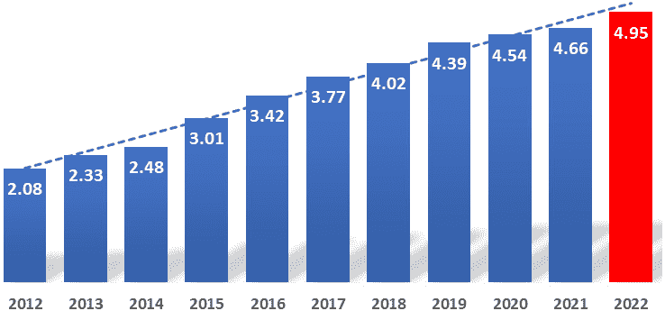
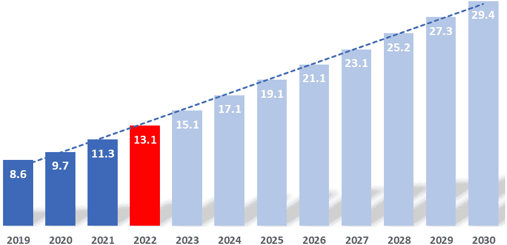

# 使用 DevOps 进行大规模数据处理

欢迎来到第一章！在本书中，你将学习 DevOps 的基础知识，它对行业的影响，以及如何将其应用于现代数据持久性技术。

当我第一次遇到**DevOps**这个术语时，我最初将其视为一种为开发团队提供不受限制的生产环境访问权限的方式。这让我感到很紧张，尤其是因为当时似乎缺乏明确的责任划分，这使得转向 DevOps 显得有些冒险。

当时（大约是 2010 年），开发人员和运维人员的角色被严格划分开来。开发人员只能获得只读权限，仅此而已。我当时没有意识到的是，这实际上是模糊开发和运维团队界限的第一步。我们当时已经有了很多彼此指责的孤立团队，这使得工作变得缓慢、分散且令人沮丧。我当时担心这只会增加复杂性，并带来更大的挑战。幸运的是，今天的 DevOps 世界截然不同，我们可以一起进一步改进它！

开发和运维团队之间不再有明确的界限——它们是一个拥有共同目标的团队。这提高了质量、速度和敏捷性！这也意味着传统角色，比如数据库管理员，正在发生变化。我们现在有**站点可靠性工程师**（**SREs**）或 DevOps 工程师，他们不仅精通数据库的使用，还能执行运维和开发任务。模糊界限意味着你需要承担更多责任，而在一个高效能的 DevOps 团队中，这意味着你要负责从头到尾的所有工作。现代工具和编排框架可以帮助你完成比以往更多的工作，但它的环境与多年前完全不同。

本书将带你进入这个令人惊叹的新世界，带你走过通向今天这个不断变化的 DevOps 世界的旅程，并为我们可能的下一步提供一些指引。

在本书结束时，你不仅能够展示你的理论知识，还能够设计、构建和运营复杂的系统，重点关注数据持久性技术。

DevOps 和数据持久性技术有着一种既爱又恨的关系，这使得这个话题更加有趣。

在这一章中，我们将深入探讨以下主题：

+   现代数据格局

+   为什么速度很重要

+   数据管理策略

+   DevOps 的早期

+   SRE 与 DevOps

+   工程原则

+   目标——SLOs/SLIs

# 现代数据格局

您是否曾想过我们每天生成多少数据？或者需要多少工作来存储并按需访问您的数据？再说说需要让这一切发生的基础设施或服务？更不用说为了让这一切发生而付出的工程努力。如果您曾经想过，那么您来对地方了。这些问题启发了我深入探索 DevOps 和 SRE 的领域，并启发了本书的创作。

技术几乎影响我们生活的每个方面。我们比以往任何时候都更加连接，可以访问比我们意识到的更多的信息和服务。我们连接到互联网的不仅仅是计算机、手机或平板电脑，还有我们的汽车、相机、手表、电视、扬声器等等。我们变得越来越数字化，我们的数字足迹也越来越大。

数字足迹，也称为数字影子，是代表个人在数字平台和互联网上的互动和活动的数据集合。这些数据可以分为**被动**生成的数据，如浏览历史，或**主动**生成的数据，如社交媒体帖子或电子邮件。您的数字足迹作为您数字存在的在线记录，对您的隐私和声誉可能产生持久的影响。

截至 2022 年，研究人员估计，在全球 80 亿人口（2022 年的世界人口）中，约有 50 亿人每天使用互联网。与 2012 年测得的 20 亿相比，这是十年内增长了 250%。这是一个令人难以置信的增长。有关参考，请参见下图：



图 1.1 – 每日互联网用户（以十亿为单位）

每个拥有数字存在的人以两种方式生成数字足迹。

首先是主动的。当您浏览网站、上传图片、发送电子邮件或进行视频通话时，您生成的数据将被利用并存储一段时间。另一种不那么明显的方式是被动数据生成。例如，如果您像我一样使用带有推送通知或在手机上启用了 GPS 并具有时间线的数字服务，即使您不主动使用这些服务，您每天每分钟都在生成数据。典型的例子可以是任何**物联网**（**IoT**）设备，比如连接到互联网的安全摄像头 - 即使您不活跃使用它，它仍在生成数据并不断上传到服务提供商以供保管。物联网设备是我们这些积极上网者之后的第二大数据生成源。研究人员估计，截至 2022 年，全球约有 130 亿个物联网设备正在连接并日常使用，预计到 2030 年底，这一数字将接近 300 亿。有关参考，请参见下图：



图 1.2 – 连接的物联网设备（以十亿计）

将 50 亿活跃的互联网用户与 130 亿个连接的物联网设备相结合，可以很容易地推测出，我们的数字足迹一定是巨大的。然而，尝试猜测准确的数字比你想象的要困难得多。试试看吧。

截至 2023 年，预计我们每天生成大约 3.5 艾字节的数据。这比 2021 年估计的多出约 1 艾字节。为了帮助你理解我们在谈论的数据量，我试着将其具象化。假设你有一本笔记本（或一部最新款的手机），它的存储容量是 1TB。如果你用这个 1TB 的存储来存储所有这些信息，它将在不到 0.025 秒的时间内被填满。另一种思考方式是，我们可以在 24 小时内填满 3,670,016 个拥有 1TB 存储容量的设备。

## 我们今天是如何生成数据的？

首先，我们每天总共发送大约 3332 亿封电子邮件。这意味着每秒钟就会发送超过 350 万封电子邮件。我们还进行超过 5 亿小时的视频通话，播放超过 2 亿小时的媒体内容，并每天分享超过 50 亿个视频和照片。

所以，是的，正是这样的一大群人，配备了众多设备（2022 年，平均每个活跃互联网用户大约拥有 2.6 个物联网设备），每天生成了惊人的数据量。但是，挑战并不仅仅在于数据的数量。与这些数据的互动速度和可靠性与存储本身一样重要，甚至比存储本身更为重要。你是否曾经找过某张照片想展示给别人看，但因为搜索速度太慢、找了很久而放弃？我们都曾经历过这种情况，但你还记得你放弃搜索之后过了多少时间吗？

随着技术的进步，我们能够更快速地获取信息并更高效地进行多任务处理，这可能是导致我们注意力持续时间逐渐下降的原因之一。研究表明，2000 年时，平均注意力时间为 12 秒。自那时以来，科技取得了重要的里程碑：iPhone 的问世、YouTube 的诞生、各代移动网络的发展、维基百科和 Spotify 等的出现，仅举几例。互联网速度也飞速提升，从 2000 年时的 127 千比特每秒提升到 2010 年的 4.4 兆比特每秒，到 2020 年平均达到了 50.8 兆比特每秒——如今，一些地区的速度已经超过了 200 兆比特每秒。

随着数字化领域的加速发展，我们的期望值也在不断提高，这导致了注意力持续时间的进一步缩短。到 2015 年，原本 12 秒的平均注意力时间已经下降至 8.25 秒，并在 2022 年略微低于 8 秒。

# 为什么速度很重要

如果你把注意力集中在完成一个简单任务的全部时间上，比如向朋友展示照片或视频，那么搜索这个任务所花费的时间只是你总时间的一小部分。假设你正在使用某种云服务来搜索你的照片或视频。那么，你认为从你点击*搜索*到收到内容之间，多久的时间是可以接受的？

我仍然记得当“缓冲”是常态的日子，但如果今天你看到类似的现象，你会觉得这是无法接受的。根据多项研究，理想的“普通内容”加载时间（例如照片或视频）应为 1 到 2 秒之间。如果页面加载时间超过三秒，53%的移动站点访问会被放弃。如果再多延迟两秒，放弃率高达 87%。

这告诉我们，仅仅存储数据是不够的——让数据能够可靠、快速地访问，不仅是“好有”的需求，而是今天这个世界的**绝对必要**。

# 数据管理策略

有许多策略可以使用，我们需要运用大多数策略来满足并且希望超越客户的期望。阅读本书，你将详细了解一些关键的数据管理策略。至于现在，我想先向你介绍其中的六种技巧。我们将在接下来的章节中仔细探讨这些方法：

+   **将你的数据带得更近**：数据离用户越近，用户访问它的速度就越快。是的，这听起来很明显，但用户可能身处世界的任何角落，甚至可能在旅行时尝试访问他们的数据。对他们来说，这些细节可能无关紧要，但他们的期望仍然不变。

    有许多不同的方式来让数据保持物理上的接近。其中最成功的策略之一叫做**边缘计算**，这是一种分布式计算范式，将计算和数据存储更靠近数据源。预计这将改善响应时间并节省带宽。边缘计算是一种架构，而不是具体的技术（或者说拓扑结构），它是一种位置敏感的分布式计算形式。

另一个非常明显的策略是利用尽可能靠近的**数据中心**，特别是在使用云服务提供商时。例如，AWS 在 2022 年在全球范围内覆盖了 96 个可用区，分布在 30 个地理区域内。Google Cloud 在 2023 年提供了非常相似的 106 个区域和 35 个地区。

利用最近的物理位置可以大大降低延迟，从而提升客户体验。

+   **缩短数据旅程的长度**：这一点非常明显。尽量避免任何不必要的步骤，尽量缩短最终用户与数据之间的路径。通常，最短的路径就是最快的（显然，这并不简单，但作为最佳实践，适用）。你为了获取所需信息所做的操作越多，所使用的计算能力就越大，这直接增加了与操作相关的成本。它还会线性增加复杂性，并且大多数情况下会增加延迟和成本。

+   **选择合适的数据库解决方案**：目前有许多数据库解决方案，你可以根据类型进行分类，例如关系型与非关系型（或 NoSQL）、集中式与分布式等。每种分类下有大量子类别，每个子类别都可以为你的特定使用场景提供独特的解决方案。考虑到需求总是不断变化，找到合适的工具非常困难。稍后我们将深入探讨每种系统类型及其优缺点。

+   **应用巧妙的分析**：如果正确应用，分析系统在优化、速度和安全性方面可以带来真正的变革。分析工具帮助开发洞察、理解趋势，并为许多业务和操作决策提供基础。分析服务能够为每项分析任务提供最佳的性能和成本。它们还自动化了运行分析时许多繁琐且耗时的任务，且性能高效，使客户能够快速获得洞察。

+   **利用机器学习**（**ML**）**和人工智能**（**AI**）**尝试预测未来**：机器学习和人工智能对现代数据战略至关重要，它们帮助企业和客户预测未来将会发生什么，并将智能融入系统和应用程序中。在合适的安全性和治理控制的结合下，配合 AI 和 ML 的能力，你可以在数据旅程的每个步骤中自动执行关于数据物理位置、谁可以访问以及可以对数据做什么的操作。这将使你在数据管理方面始终遵循最高标准，并获得最佳性能。

+   **按需扩展**：上述策略的实现依赖于你选择的系统运行方式。在这一点上，DevOps（以及 SRE）起着至关重要的作用，可能是决定成功与失败的关键因素。所有主要的云服务提供商几乎都为每个工作负载提供数百种平台选择（截至 2022 年底，AWS 提供了 475 种实例类型）。大多数大型企业的资源利用趋势非常“弯曲”，因此它们从财务角度来看，发现云服务的按需提供非常具有吸引力。

你应该只在需要资源时付费，而在不需要时不付费。这是使用云服务的一个重要优势。然而，这种模式只有在使用正确的设计和运营实践、合适的自动化以及兼容的工具时，才能在实践中生效。

一个真实的例子

一家领先的电信公司计划在下午 2 点准时发布他们今年最受期待的设备，这个细节已广泛宣传给所有顾客。中午接近时，他们的在线商店流量维持在典型水平。到了下午 1 点，流量略高于平均水平。然而，在发布前 10 分钟，涌入了大量顾客，大家都想成为首批抢到新手机的人。等到下午 2 点钟时，网站的独立访客数打破了以往的记录。在 1:50 到 2:10 的 20 分钟内，访客数量激增了十二倍。

这一波流量激增触发了一个自动扩展事件，将公司的基础设施从基线（设定为 1x）扩展到前所未有的 32x。值得注意的是，这种大规模扩展仅在最初的半小时内是必要的。之后，到下午 2:30 时，它缩减到 12x，3 点时进一步减少到 4x，直到晚上 10 点恢复到 1x 的基线。

这种无缝适应能力的实现得益于声明式编排框架、**基础设施即代码**（**IaC**）方法以及完全自动化的 CI/CD 管道的战略性结合。总之，挑战非常大。为了能够可靠且具成本效益地运营，同时保持一致的速度和安全性，并在几分钟内根据需求自动扩展和缩减这些服务而无需人工干预，你需要一套最佳实践，来指导如何设计、构建、测试和运营这些系统。这听起来像是 DevOps。

# DevOps 的早期发展

我大约在 2014 年左右第一次接触到 DevOps，就在第一份年度*DevOps 状态报告*发布之后。那时，这个概念听起来很棒，但我完全不知道它是如何运作的。至少对我来说，它还像是处于初期阶段，或者我当时还不够有经验和知识，无法看到全局。可能是后者。无论如何，自那时以来发生了很多变化，行业也加快了步伐。敏捷开发、CI/CD、DevSecOps、GitOps 等方法应运而生，源自最初的一个想法——将软件开发者和运维人员结合起来。

DevOps 是对 IT 行业中 **开发人员**（**Devs**）和 **运维人员**（**Ops**）之间长期摩擦的回应。在这里，*显而易见* 这个词恰如其分，因为对于任何在那个时期参与 IT 的人来说，这种紧张氛围是显而易见且不断存在的。开发人员传统上只专注于创建或修复功能，然后将其交给运维部门进行部署和持续管理。相反，运维团队则优先维护一个稳定的生产环境，往往缺乏完全理解他们所实施的代码的专业知识。

这就导致了一个内在的冲突：将新元素引入生产环境是有风险的，因此，运维的稳定性通常涉及最小化变更。这催生了“开发与运维对立”的文化，这种分歧是 DevOps 试图弥合的。然而，要实现这一点，双方都需要发展和适应。

过去，传统的运维角色，如系统管理员、网络工程师和监控团队，主要依赖手动过程。我记得我在 IBM 的初次经历，那时自动化的巅峰是一个 Bash 脚本。在那时，许多工作——比如搭建物理基础设施、配置路由和防火墙，或手动处理故障转移——都是靠人工完成的。

尽管系统管理员和网络岗位在云时代依然至关重要，但趋势显然是向自动化发展。这一转变提高了系统的可靠性，因为自动化配置既可追踪又可重现。如果系统发生故障，可以迅速而准确地重建。

尽管网络和系统工程的基础知识不可替代，但向自动化的推动要求软件技能——这一点往往是传统运维工程师所欠缺的。从简单的 Bash 脚本开始，发展到包括更复杂的编程语言，如 Perl 和 Python，以及像 Puppet、Ansible 和 Terraform 这样的专门自动化语言。

在开发方面，开发团队有着非常长的开发周期。他们进行的是风险高且不频繁的“大爆炸”发布，这几乎每次都会给运维团队带来巨大的麻烦，并对业务的可靠性/稳定性构成威胁。慢慢地，开发团队转向了一种更加频繁、逐步推进的方式，这种方式更能容忍失败。如今，我们称之为敏捷开发。

如果从这个角度来看，你可以说一套旨在减少开发和运维团队之间摩擦的通用实践是 DevOps 的基础。然而，简单的通用实践无法解决当时行业中存在的开发与运维之间的心态差异。开发和运维之间的共享责任是推动这一运动成功的关键。只有当两个团队共同合作、共享共同目标并共同对结果负责时，才能实现能够快速、安全地将新功能推向生产环境的自动化。这就是 SRE 的诞生背景。

# SRE 与 DevOps

SRE 起源于谷歌。用谷歌工程副总裁本·特雷诺尔的话来说，“*SRE 就是你请求软件工程师设计一个* *运维职能*时发生的事情。”

如果你想简单地理解（再次引用谷歌的话），“*SRE 类* *实现了 DevOps*。”

SRE 是旨在通过将所有操作方面（基础设施、监控、测试等）视为软件，来弥合开发与运维之间差距的软件工程学科，从而以其最终形式实现 DevOps。这是完全自动化的，零人工干预，将每一个对其组件的更改（再次指任何基础设施、监控、测试等的更改）视为一次发布。每次更改都通过管道进行，采用版本控制并经过测试的方式。如果发布失败，或出现生产问题并追溯到某个更改，你可以简单地将更改回滚到先前已知的健康状态。

由于它被视为与其他软件发布相同，这使得开发团队能够承担更多责任并参与运维工作，几乎完全模糊了开发和运维职能之间的界限。最终，这创造了*你构建，你运行*的文化——这使得“端到端”所有权成为可能。

那么，SRE 和 DevOps 是一样的吗？不，它们不是。SRE 是一种工程职能，也可以看作是 DevOps 的一个特定实现，专注于构建和运行可靠的系统，而 DevOps 是一组实践，更广泛地关注将传统的开发和运维职能更加紧密地结合在一起。

无论你选择哪条路径，都应该确保设定目标、工程原则和工具策略，帮助你在成为 DevOps/SRE 专业人员的过程中做出一致的决策。

# 工程原则

我提供以下工程原则作为起点：

+   对一切进行零接触自动化（如果是手动的——并且你必须每月做多次——它应该被自动化）

+   与项目无关的解决方案（在配置中定义，以避免为新项目重新开发，任何工具/模块都应具有可重用性）

+   IaC（基础设施应该尽可能不可变并且定义为代码；配置工具应该是可重用的）

+   **持续交付** (**CD**) 与 **持续集成** (**CI**)（在交付周期中的常见方法和环境；任何服务应能立即部署）

+   在每个发布版本中验证可靠性和安全性（渗透测试、混沌测试等应添加到 CI/CD 流水线中；始终尽早识别不同的环境配置）

+   数据驱动（应利用实时数据来做决策）

为了完全实现您的工程目标并遵守原则而不妥协，您应该将“不可变 IaC”作为优先目标。

为了实现这一点，我推荐以下 IaC 原则：

+   系统可以轻松复现

+   系统是不可变的

+   系统是可丢弃的

+   系统是一致的

+   过程是可重复的

+   代码/配置受版本控制

一旦定义了目标，就该选择合适的工具来完成工作。为此，您必须确保这些工具被允许利用以下内容：

+   `main.tf`）：

    ```
    provider "aws" {
      region = "us-west-2"
    }
    # Create an S3 bucket
    resource "aws_s3_bucket" "my_bucket" {
      bucket = "my-unique-bucket-name"
      acl    = "private"
    }
    # Create an EC2 instance
    resource "aws_instance" "my_instance" {
      ami           = "ami-0c55b159cbfafe1f0" # This is an example Amazon Linux 2 AMI ID; use the appropriate AMI ID for your needs
      instance_type = "t2.micro"
      tags = {
        Name = "MyInstance"
      }
    }
    ```

+   `deployment-and-service.yaml`）用于 Kubernetes：

    ```
    # Deployment definition to create a web server pod
    apiVersion: apps/v1
    kind: Deployment
    metadata:
      name: my-web-server
    spec:
      replicas: 2
      selector:
        matchLabels:
          app: web-server
      template:
        metadata:
          labels:
            app: web-server
        spec:
          containers:
          - name: nginx
            image: nginx:1.17
            ports:
            - containerPort: 80
    ---
    # Service definition to expose the web server
    apiVersion: v1
    kind: Service
    metadata:
      name: my-web-service
    spec:
      selector:
        app: web-server
      ports:
        - protocol: TCP
          port: 80
    ```

+   **幂等性**：

    +   这使得您可以声明性地创建和部署整个基础设施。例如，您不仅可以部署代理（或边车），还可以部署网络基础设施、存储系统以及您可能需要的任何其他资源。幂等性是指一个操作可以多次应用，且结果与第一次应用时相同。换句话说，这意味着多个相同的请求应该与单个请求产生相同的效果。

    +   幂等性使得相同的请求可以多次发送，但给出的结果始终相同（与声明一致，永远不变）。

+   **代码中** **不包含机密和环境配置**：

    +   所有主要的云提供商都有一种安全的方式来管理机密。这些解决方案为您托管在其服务上的应用程序提供了一种存储机密或环境配置值的良好方式。

    +   一切都应该以标准化的方式自助服务和可管理，因此机密和配置必须是声明式的，并且定义明确，以便与上述要求兼容。

+   **约定** **优于配置**：

    +   也称为基于环境标签的约定优于配置，约定优于配置是一个简单的概念，主要用于编程中。它意味着您工作所在的环境（系统、库、语言等）默认假设许多逻辑情境，因此如果您适应它们而不是每次都创建自己的规则，编程将变得更容易且更高效。

    +   这意味着开发人员在开发时需要做更少的决策，并且总会有逻辑上的默认选项。这些逻辑默认选项是通过约定而非配置创建的。

+   **自动化脚本打包成** **镜像**：

    +   这使得不可变性得以实现并鼓励共享。脚本不再位于服务器上，之后必须复制到其他地方——相反，它可以像我们的其他代码一样进行发布，使得脚本可以在注册表中使用，而不是依赖于其他服务。

得益于过去 10 多年在这一领域的惊人进展，客户对现代解决方案的期望值已经非常高。如前所述，如果内容加载时间超过两秒钟，就会被认为是慢的。如果你需要等待超过 3 到 5 秒，用户很可能会放弃。这与可用性和客户满意度非常相似。当我们谈论客户满意度（这一概念是从客户体验演变而来）时，这是一个无法量化的概念，因此无法进行数据驱动，设定正确的目标/目标对于如何设计你的解决方案至关重要。

# 目标 – SLOs/SLIs

**服务水平目标**（**SLOs**），这一概念在谷歌的 SRE 手册中被多次提及，对于从一开始就确定方向非常有帮助。然而，选择正确的目标比你想象的要复杂。

我的个人经验与谷歌的建议一致，谷歌建议 SLO（设定服务客户可靠性目标）应该低于 100%。

这是由多个原因造成的。实现 100%可用性不仅非常困难且极其昂贵，几乎是不可能的，因为几乎所有服务都对其他服务有软/硬依赖。如果你的某个依赖服务的可用性低于 100%，那么你的 SLO 就无法达成。此外，即使你采取了所有的预防措施，并且实现了每一项冗余，依然存在非零概率，某些东西（或许是很多东西）会失败，导致可用性低于 100%。更重要的是，即使你能够实现服务的 100%可靠性，客户也很可能无法体验到这一点。客户必须经过的路径（他们需要使用的系统）访问你的服务时，很可能会有低于 100%的 SLO。

大多数商业互联网服务提供商，例如，提供 99%的可用性。这也意味着，当你越来越接近 100%的可用性时，假设从 99%到 99.9%或 IBM 的极限五个 9（99.999%），实现和维持这种可用性的成本将随着“九”数的增加而显著增加，但你的客户几乎感受不到你的努力，这使得这一目标变得值得质疑。

在选定的 SLO 阈值以上，几乎所有用户都应该“满意”，而低于该阈值时，用户很可能不满，提出疑虑，或者直接停止使用该服务。

一旦你同意应该寻找一个低于 100%的 SLO，但可能在 99%左右，如何定义合适的基准？

这就是**服务级别指标**（**SLIs**）、**服务级别协议**（**SLAs**）和错误预算发挥作用的地方。我在这里不会详细说明所有这些内容，但如果你有兴趣，请参考谷歌的 SRE 书籍（[`sre.google/books/`](https://sre.google/books/)）了解更多细节。

假设你选择了 99.9% 的服务级别目标（SLO）——根据我的个人经验，这是目前大多数企业的常见选择。接下来，你需要考虑你的核心运营指标。**DevOps 研究与评估**（**DORA**）提出了四个关键指标来衡量 DevOps 团队的绩效，并根据这些指标将团队分为“低绩效”到“卓越绩效”四个等级，其中“卓越绩效”团队更有可能达成甚至超越其目标，令客户满意，相较于“低绩效”团队。

这四个指标如下：

+   **变更交付时间**，一个衡量从代码提交到生产部署所需时间的指标，在我看来，这是最重要的指标之一。它作为衡量团队敏捷性和响应能力的标准。你能多迅速地解决一个 bug？可以这样考虑：

    +   **低绩效**：1 个月至 6 个月的交付时间

    +   **中等绩效**：1 周至 1 个月的交付时间

    +   **高绩效**：1 天至 1 周的交付时间

    +   **卓越绩效**：不到 1 天的交付时间

+   **部署频率**，即衡量成功发布到生产环境的次数。这里的关键字是*成功*，因为一个不断将有问题的代码推送到流水线的开发团队并不优秀：

    +   **低绩效**：1 个月至 6 个月的部署间隔

    +   **中等绩效**：1 周至 1 个月的部署间隔

    +   **高绩效**：1 天至 1 周的部署间隔

    +   **卓越绩效**：每天多次部署/部署间隔不到 1 天

+   **变更失败率**，即衡量生产环境中部署失败需要修复或回滚的部署百分比。目标是尽可能频繁地发布，但如果你的团队不断回滚这些变更，或通过发布一个坏更新引发故障，那么这样发布的意义何在？通过跟踪它，你可以看到你的团队多频繁地在修复本可以避免的问题：

    +   **低绩效**：45% 至 60% 的变更失败率（CFR）

    +   **中等绩效**：15% 至 45% 的变更失败率（CFR）

    +   **高绩效**：0% 至 15% 的变更失败率（CFR）

    +   **卓越绩效**：0% 至 15% 的变更失败率（CFR）

+   **平均恢复时间**（**MTTR**）衡量一个组织从故障中恢复的时间。这是从发生故障的初始时刻开始，直到事故团队恢复所有服务和操作的时间。另一个关键相关指标是**平均确认时间**（**MTTA**），即衡量意识到并确认生产环境中问题的时间：

    +   **低绩效**：1 周至 1 个月的停机时间

    +   **中高绩效**：不到 24 小时的停机时间

    +   **卓越绩效**：不到 1 小时的停机时间

总之，SLO（服务水平目标）在设定服务的可靠性目标中至关重要，建议这些目标设定在 100%以下，以考虑到依赖关系和潜在的服务故障。利用 SLI（服务水平指标）、SLA（服务水平协议）和错误预算等工具对于定义合适的 SLO 基准至关重要，通常设定在 99%以上。我们还强调了 DORA（DevOps Research and Assessment）所建议的核心运营指标在评估 DevOps 团队表现中的重要性。这些指标包括变更交付时间、部署频率、变更失败率和 MTTR（平均修复时间），为衡量和改进团队在服务交付和事件响应中的效率和效果提供了切实可行的标准。

# 总结

DevOps 面临挑战；当引入数据时，这些挑战变得更加严峻。本书旨在探索这一复杂的领域。

考虑这一点：不可变对象和基础设施即代码（IaC）与声明式编排框架通常能带来安全、可靠和可重复的结果。但当你必须管理那些抗拒不可变性的实体时会怎样？想想数据库或消息队列，这些技术承载了不易复制的数据。它们是生产环境中不可或缺的技术，但需要特别关注。

想象一下：一辆一级方程式赛车在进站时仅用几秒钟就换掉了整个轮胎组件。同样，对于不可变对象，如负载均衡器，快速销毁并重建的操作通常能解决问题。这既方便又快捷，但如果将这种快速交换的方法应用于数据库，就有可能导致数据损坏。在处理可变且持久存储数据的技术时，必须谨慎。

快进到最近几年，你会发现通过**自定义资源定义**（**CRDs**）或操作符来促进数据库自动化的尝试。然而，这些方法已经证明成本高昂且复杂，因此趋势转向了托管服务。然而，对于许多人来说，外包数据操作并非理想解决方案，考虑到数据安全的重要性。

在深入探讨 DevOps 和 SRE 最佳实践时，我们会发现管理以数据为中心的技术的复杂性日益加剧。尽管我们拥有宝贵的自动化工具，但在保持最高 DevOps 标准的同时，充分利用这些自动化工具并非易事。我们将在接下来的章节中深入探讨这些挑战及潜在的解决方案。
