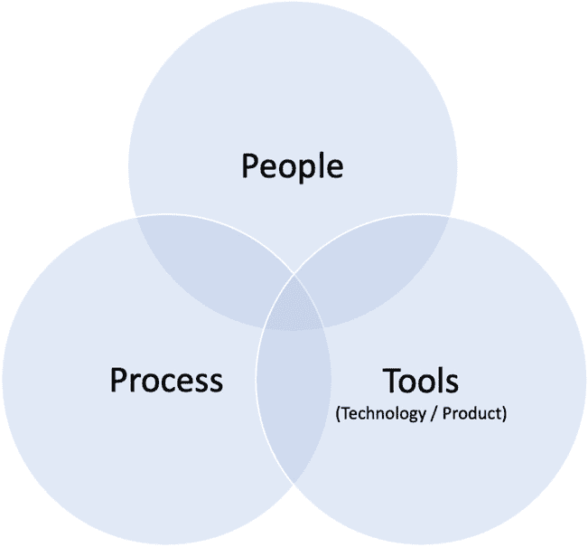
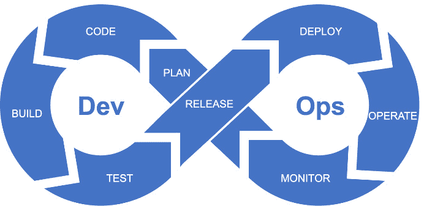
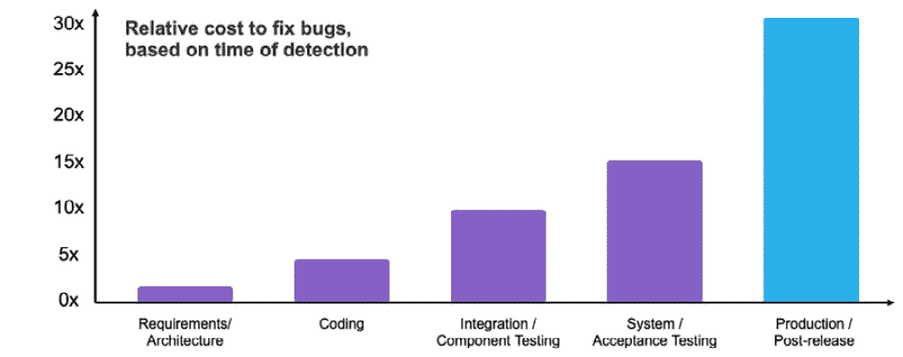
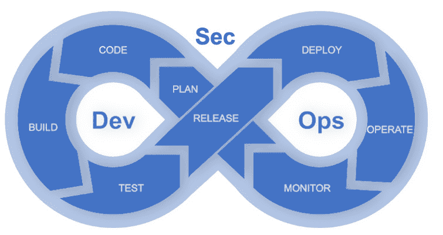
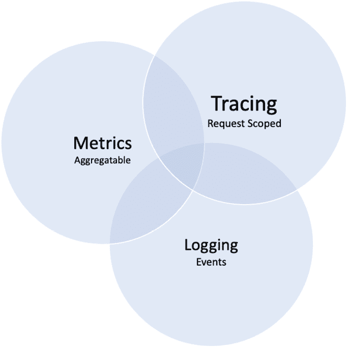
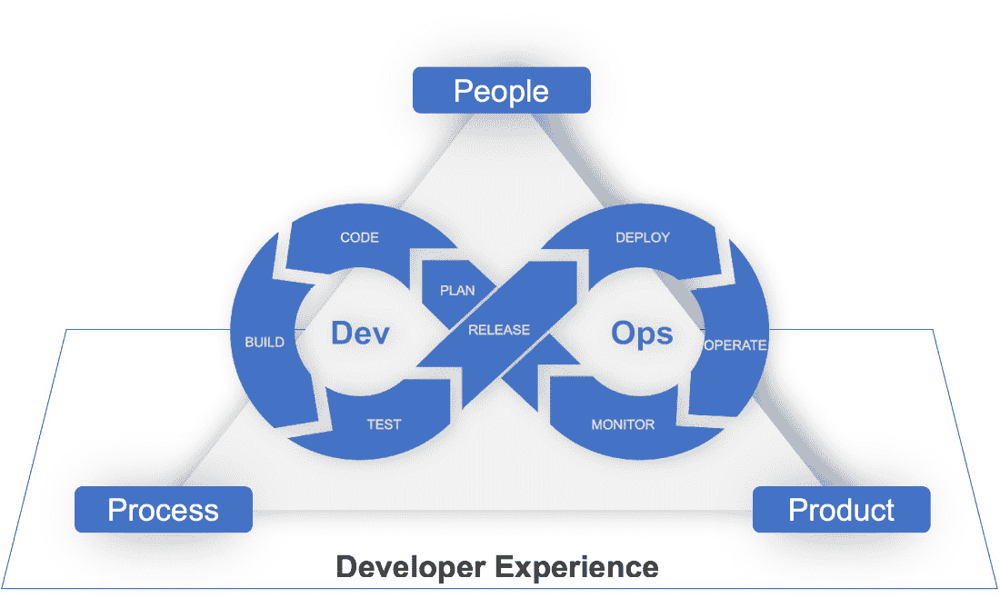
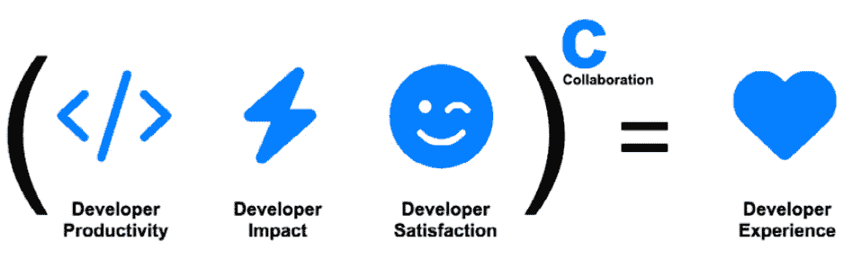
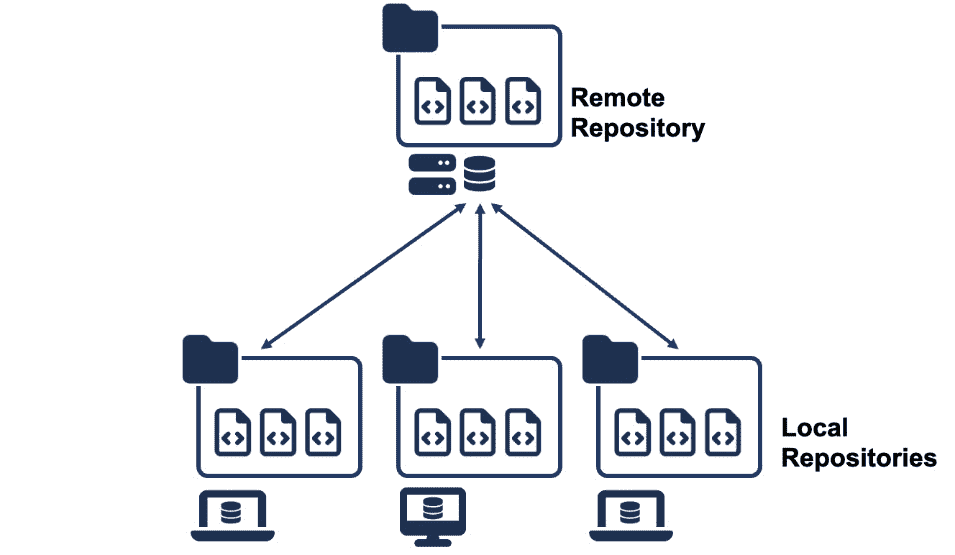
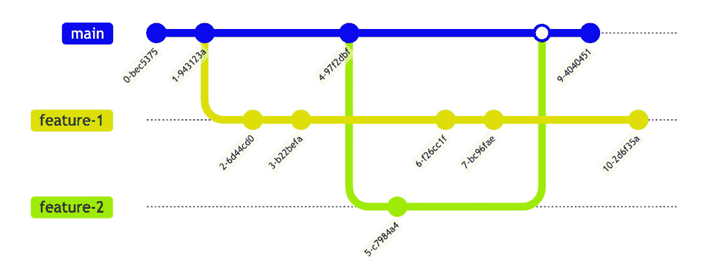

# 1

# DevOps 和开发者体验 – 进入现代开发的世界

本章将涵盖两个主要主题。首先，我们将讨论 DevOps 的定义，这是本书的核心主题。接下来，我们将深入探讨开发者体验，这是一种在组织内保持并持续取得 DevOps 成功的战略。在这个背景下，我们还将介绍 Git 和 GitHub 工具。

本章作为指南，帮助即将开始学习 DevOps、工具和 DevOps 协作实践的人们。它将建立关于这些概念和实践的基础知识，并阐明它们如何提升你的开发过程。

本章将涵盖以下主要内容：

+   DevOps – 通过减少摩擦加速开发周期

+   开发者体验 – 一种追求开发者卓越的战略

+   Git – 代码协作的起点

+   GitHub – 人工智能驱动的开发者平台

# DevOps – 通过减少摩擦加速开发周期

让我们从学习 DevOps 基础知识开始。

技术领域有很多术语。有时，这些术语可能比较抽象，人们往往对特定框架有不同的理解。DevOps 也不例外。此外，在谈到 DevOps 时，从个人、团队和整个组织的角度来看，如何看待这些组件的相互关系，有时会让人感到模糊。

我们将回顾 DevOps 的基础知识，澄清一些误解，并简要讨论其典型的实践。在深入探讨 DevOps 之前，让我们先聊聊过去的情况。

## DevOps 背景

在过去，软件基本上是你安装的东西。因此，对于一个产品开发团队来说，所需的只是能够开发和测试它的工程师。说到测试，一切都集中在发布前消除漏洞。想象一下那时的情况，它有点像早期电子游戏的发布，类似于**任天堂娱乐系统**（**NES**）时代。游戏一旦通过卡带发布，就无法进行更新或添加新特性。游戏中存在的漏洞会一直陪伴消费者。然而，随着 Apache HTTP 服务器的出现以及向网络通信的转变，IT 运维部门需要管理这种新范式。

在许多情况下，IT 运维团队专注于 IT 操作。他们的工具、文化，甚至目标，都与开发团队不同。开发团队想要添加新特性，而 IT 团队则把系统稳定性放在首位。这是一个矛盾。

此外，在这两个团队分裂的世界里，当涉及到部署时，就像是将代码扔过墙一样。开发人员将一个可以部署的完美工件抛给墙另一边的 IT 运维团队。然而，出于某些原因，IT 运维团队收到的却是一个不完整、不能在生产环境中正常工作的版本，导致他们在尽力部署和维护的过程中精疲力尽：

图 1.1 – 工程师将代码扔过墙

近年来，技术发展取得了显著进展，其影响已经渗透到软件领域之外，几乎影响了每个行业。为什么会这样？这是因为无论公司规模如何，软件开发在现代企业管理的战略中扮演着至关重要的角色。受到这股技术浪潮影响的公司发现自己处于一个竞争激烈的市场中，焦点集中在为客户提供快速、尖端和可靠的产品。

尽管市场条件和客户需求在不到一年的时间里可能发生显著变化，但一年只发布几次软件显然是不够的。我们不能因为内部孤岛之间的摩擦而延误软件发布。**孤岛**指的是缺乏与其他部门或系统的集成或沟通的隔离系统、流程或部门，这可能导致效率低下。我们必须找到一种方式来简化从产品开发到运维的整个过程。这就是全新的开发方法论、组织结构和文化的作用所在。

DevOps 作为一种方法论应运而生，正是从这种情境中诞生的。它代表了开发和运维的融合，开发和运维团队作为一个统一的实体协作，共同培养共享文化、优化流程、部署工具，所有这些都旨在加速发布、提升整体产品质量、收集客户反馈，最终为客户提供更好、更快速的服务。这反过来又促进了更有效的市场表现。

什么是 DevOps？

**DevOps** 这个术语是由 **Development**（开发）和 **Operations**（运维）两个词融合而成的。

那么，DevOps 仅仅是促进开发和运维团队之间的协作吗？

虽然这只是故事的一部分，现实往往更为复杂。这两个团队之间通常存在断层，各自有独特的优先事项和目标。仅仅将它们聚集在一起可能会在某种程度上增强它们的关系和相互理解，但这往往不足以实现有效的协作。实质上，DevOps 不仅仅是整合角色或团队；它代表了组织内部更广泛的文化变革。它关乎对齐优先事项、简化工作流程，并最终打破阻碍有效沟通和进展的壁垒。

简而言之，DevOps 是人、流程和工具的结合，旨在持续为最终用户提供价值，并且本质上是一种文化转变：

图 1.2 – DevOps 是人、流程和工具的结合

“我明白了。我理解了。DevOps 是关于人、流程和工具的。”

很多人以为他们已经理解了 DevOps，并开始着手为 DevOps 实施自动化管道。但是，等等。仅仅替换这些元素并不能确保 DevOps 的成功。为了让 DevOps 成功，你需要更多地了解它是什么，它不是啥，以及为什么它存在。

事实上，DevOps 的定义相当广泛。因此，作为 DevOps 扩展形式的 *Dev*Ops* 概念，近年来迅速扩展。各种衍生方法，如 DevSecOps 和 BizDevOps，已被提出，导致了对 DevOps 包含内容的多种不同看法。

不幸的是，DevOps 并没有一个被普遍接受的精确定义，如何实施 DevOps 的问题，不同的人有不同的回答。因此，关于 DevOps 的误解和不准确的解释很常见，往往会导致争论。有时，尽管 DevOps 很重要，当谈到实施 DevOps 时，人们却不愿意讨论。

图 1.3 – DevOps 就像房间里的一头大象，常常被忽视

## 什么是*不是* DevOps？

通常，在定义 DevOps 时，与其尝试明确 DevOps 的真正含义，不如指出什么是*不是* DevOps。让我们在这里澄清一个典型的误解。

### DevOps 并不仅仅是一个工具、技术或产品

市场上有许多可以应用于 DevOps 的工具。许多云服务商和工具供应商通过说“*使用这个工具，你可以构建一个 DevOps 工作流*”或“*这个工具对一个* *DevOps 团队至关重要*”来推广它们。

当很多人听到 *DevOps* 这个词时，他们中的一些人会想到云技术，如 **Amazon Web Services**（**AWS**）、Azure 和 **Google Cloud Platform**（**GCP**），或者像 Docker 和 Kubernetes 这样的技术。此外，Kubernetes 生态系统还包括许多组件，如 Istio、Flux、Helm、Envoy 和 Prometheus。还有一些平台，包括 GitHub Actions、CircleCI 和 Jenkins，促进了持续、快速和频繁的发布。监控工具的世界同样多样化。如果你还不熟悉这些名字，可能需要一些时间来理解它们的细微差别和好处。

然而，即使你掌握了这些工具，并且遵循了著名的架构或成功案例，这也不意味着你已经实现了 DevOps。因为工具背后始终有着人和流程，单纯改变工具并不会改变它们。

实际上，即使使用了以 *DevOps* 名义品牌化的工具，仍然常见瀑布式开发的情况。通过将多步骤的审批流程插入自动化工作流中，尊重现有复杂的公司规则，限制客户发布为每三个月一次以避免更改会计或安全检查，或让基础设施团队管理由应用团队使用现代编排系统 Kubernetes 构建的平台创建的容器——做这些事情只会增加运营负担和混乱，而无法创造业务价值。

最终，实现显著的商业目标和转型需要在人员、组织和流程上进行改变。那么，DevOps 是否意味着转型个人和组织？

### DevOps 不仅仅是特定的个人、团队或角色

DevOps 是现实，但这个术语本身有些像流行词。公司为这些新活动招聘工程师，职称为 DevOps 工程师或 DevOps 架构师，甚至将其团队称为 DevOps 团队。那些认为自己无法做 DevOps 的人，甚至可能犯下试图将 DevOps 外包给 DevOps 合作伙伴的错误。

当你看待这种情况时，可能会觉得 DevOps 指的是特定的个人、团队或角色，但事实并非如此。在许多情况下，这些术语仅仅是指一些角色，如超级基础设施工程师、超级开发人员或只是云工程师。

公司之所以这么做，是因为为了快速响应不断变化的业务需求并实现快速发布，它们需要新的技术和自动化。此外，它们通常还需要管理复杂的平台，这些平台包括现有组件和新组件。这就包括充分利用 GitHub Actions，本书中将详细介绍这一部分。曾经需要手动安装的基础设施领域、通过界面配置或 CLI 操作的部分，现在需要使用 Git 进行版本控制，并对自动化工作流进行配置和管理。

然而，在实践中，DevOps 处理的事务更为复杂。它不仅仅是掌握这些工具和技术，或为它们配置角色。实际上，它需要强有力的领导者，能够在现有系统和组织中引领变革。通常，他们的行动超出了 DevOps 宽泛框架的范围。我所见过的那些真正实现了 DevOps 的人，往往在追求更大的目标，而不仅仅是 *实施* *DevOps*。

DevOps 本质上是一个变革之旅，旨在转型处理各种复杂技术和产品的组织，它并非仅仅是为现有团队增添拥有新技能的人员，或改变团队和职位的定义。

那么，如果 DevOps 不仅仅是工具，也不仅仅关乎人员和组织，那么是否存在一个专门称为 DevOps 的过程呢？

### DevOps 不仅仅是一个过程

DevOps 团队通常会在 2-3 周的短周期内进行迭代开发，通常称为**冲刺**，并每天早晨举行站立会议。这是真的，采用 DevOps 后，你可能会融入符合敏捷流程和 Scrum 最佳实践的流程。这些方法论是在软件开发中将每项功能分成更小的部分，并通过多个短周期推动开发。

那么，DevOps 是敏捷或 Scrum 的进化概念，还是它们的包容性概念？这个问题的答案既是*是*，也是*不是*。

DevOps 拓宽了范围，不仅仅关注像敏捷那样的软件开发，还扩展到软件的发布、反馈收集和改进。这些原则和哲学适用于**软件开发生命周期**（**SDLC**）的整个过程。团队关注的是产品的整个生命周期，而不仅仅是开发新特性或设计网页组件：

图 1.4 – DevOps 生命周期的八个阶段

然而，DevOps 的最终目标并不是引入一个新的过程本身。

DevOps 有着广泛的实践。具体的实践将在*第五章*中详细阐述，但并不是所有这些实践都能平等地应用于每个团队。例如，像 Microsoft 这样的环境需要将应用程序部署到多个服务器上，这与将一个小型应用部署到 EC2 实例的情况是不同的。需要应用的实践在用户数为 100 万的服务和用户数为 1000 的服务之间也有所不同。

让我们考虑一下敏捷，引用 Andy Hunt 博客中的内容：

敏捷方法要求从业者思考，坦白说，这很难做到。遵循给定的规则，并声称“按书面要求做”要轻松得多。这既简单又安全，不会受到嘲笑或责备；你不会因此被解雇。尽管我们可能会公开谴责一套规则的狭隘性，但在其中却有安全感和舒适感。但当然，要想敏捷或高效，并非是关于舒适感。

这个思路同样适用于 DevOps。为了能够频繁且迅速地发布以客户为中心的开发，提供可靠的服务，并最终对业务产生重大影响，你需要从比工具、人员和流程更广阔的视角来解决问题。

## DevOps 是一种文化

所以，DevOps 不仅仅是开发和运维的融合，具体的角色、流程、工具、技术或产品的组合。人们常常简化它为“人员、流程和工具”。

那么，DevOps 到底是什么呢？

让我们听听 DevOps 社区的杰出人物 Patrick Debois 的话，以求更清晰的理解：

我当前对 Dev*Ops 的定义是：你所做的一切，旨在克服由孤岛效应带来的摩擦……其余的就是普通的工程工作。

在今天的云技术时代，无论是尖端公司、传统企业还是初创公司，都可以轻松访问相同的环境。甚至人工智能驱动的工具也以实惠的价格提供。

最终，阻碍团队和业务发展的正是摩擦，而这种摩擦通常出现在涵盖人、流程和工具的孤岛中。

DevOps 本质上代表了一种文化转变和一种旨在消除组织内部孤岛间摩擦的方法。它意味着思维方式、习惯和文化的转变。

### DevOps 原则

那么，DevOps 文化究竟由什么构成呢？让我们深入探讨 DevOps 的核心原则，全面理解这种文化的真正内涵。

#### 以客户为中心

每一个过程中的每一个行动都应该以为客户提供价值为目标。

在构建和维护软件时专注于客户，使得特性交付更快且更符合实际需求。短反馈循环有助于将产品微调以与用户需求对齐，从而降低风险，并以最低成本最大化价值。通过关注客户需求，最终目标变成了高效解决现实问题，这使得任务优先级更容易设定，积压任务得到更好的管理，资源分配更为高效，运营更加顺畅且具成本效益。最终，这为长期的商业成功奠定了基础，更好地满足市场需求和用户期望。

在 DevOps 中，以客户为中心不仅仅是一个口号；它是必不可少的。

从最终目标出发进行创造

理解客户需求并解决现实问题应优先于基于假设的操作。这提倡一种整体战略，团队同步进行开发和运营任务，以满足客户需求。这包括掌握产品的整个生命周期，从产品的诞生、开发到部署和持续支持，确保最终交付物真正能够造福最终用户。

从一开始就忽视客户需求可能导致一个在技术上完美无缺的产品，但在用户满意度和解决问题的能力上却未能达标。这一原则不断提醒我们，将所有技术努力与商业目标和用户期望对齐，确保最终产品不仅具备功能性，而且对用户具有价值和相关性。

#### 跨职能自主团队

成功实施 DevOps 的核心在于形成自治、跨职能团队的不可或缺的策略。与传统的工程设置不同，开发人员、运维和**质量保证（QA）**专家在独立的隔间中操作，DevOps 倡导打破这些障碍。这里的关键点不仅在于形成多样化的团队，而是使这些团队自主——能够从产品或功能的概念阶段到交付全程负责。

为什么这么重要？答案在于敏捷性和效率。当团队具备从编码、测试到部署和设计甚至对业务有细致理解的一系列技能时，决策速度加快。这取代了层级系统中固有的迟缓和繁琐的命令链，转而形成了及时负责、行动迅速的文化。

消除这些组织瓶颈不仅加快了工作流程，还培养了拥有权和责任感的文化。团队不必等待外部部门或高层做出决策；他们拥有集体技能和自主权来直面挑战。

通过消除组织内常常引起摩擦的隔离，自治、跨职能团队成为顺利实施 DevOps 运营的关键。其结果是简化的流程，便于对变更快速响应，并促进了协作和责任文化的形成。这不仅是现代工程学的一个不可或缺的特性，更是任何企业成功实施 DevOps 所需的基础策略。

#### 持续改进

持续改进是 DevOps 的基石，为现代软件开发和运营提供不可或缺的技术和文化优势。在技术上，通过持续分析性能指标和利用自动化工作流程，它使软件交付过程的可靠性、适应性和效率得以增强。这些特性不仅使最终产品更加健壮，还有助于资源优化和更快的功能交付。从文化上讲，持续改进促进了协作环境，确保责任制，鼓励学习文化，并最终有助于打破组织的隔离。它还战略上与改善开发人员体验相一致。

从反馈循环的角度来看，持续改进的重要性变得更加明确，反馈循环在 DevOps 生命周期中充当着神经系统的角色。这些循环使得实时监控成为可能，并提供可操作的指标，直接为持续改进计划提供数据支持。通过定期评估系统性能、用户参与度以及其他**关键绩效指标**（**KPI**），组织能够迅速调整其战略，确保长期成功。在今天快速发展的技术环境中，这种动态的数据驱动方法至关重要，使得持续改进不仅仅是最佳实践，而是竞争生存的基本要求。

#### 自动化

在传统的开发模型中，开发和运维通常是两个独立的部门。开发人员专注于编写代码和构建应用，而运维专注于部署和维护。这种割裂的方式常常导致延误、低效，以及两队之间的摩擦。

**持续集成/持续交付**（**CI/CD**）成为连接这两个世界的关键桥梁。通过 CI，来自多个贡献者的代码更改会频繁地合并到一个共享代码库中，自动化测试会迅速运行，以检测错误和不一致之处。这促进了一个更加协作的环境，使得在开发周期的早期就能更容易地发现问题。CD 确保代码始终准备好进行部署，消除了由于发布待定而无法添加新功能的漫长*冻结期*。

手动流程不仅容易出错，还会大大拖慢速度和效率，这是 DevOps 旨在解决的核心问题。在自动化广泛采用之前，系统管理员需要手动配置服务器，这是一个繁琐且容易出错的过程。此外，开发人员常常发现很难复制操作环境进行测试，导致了臭名昭著的“*在我的* *机器*上能运行”现象。

在这个背景下，自动化不是奢侈品，而是必需品。自动化脚本处理从代码测试到部署的任务，确保过程尽可能标准化，从而消除了许多与手动干预相关的错误和延误。

## 在 DevOps 实践中飞跃至卓越

到目前为止，DevOps 的基本概念已经被涵盖。事实上，DevOps 的概念一直在不断发展。一些概念被定位为*本应最初包括的内容*或*最初包括但尚未讨论的内容*，这些可能会被贴上不同于 DevOps 的标签。

让我们看看这个背景下特别重要的一些理念。这些是有助于将 DevOps 文化融入其中的有益概念。

### DevSecOps

DevSecOps 是一种将安全元素整合到 DevOps 框架中的方法。在这种方法论中，安全被认为是开发初期的关键因素。其目标是在及时交付高效且安全的软件的同时，确保软件的安全性。

传统上，安全通常由独立的专门团队处理，通常是在开发周期的最后阶段进行处理。许多情况下，漏洞在开发后才被发现，导致软件发布的延迟。通过采用左移（shift-left）方法来处理安全问题，可以显著降低修复成本。在 DevSecOps 的背景下，**左移（shift-left）**指的是在软件开发生命周期（SDLC）的早期阶段（理想情况下是在设计和开发阶段）就将安全措施整合进去的做法。通过从一开始就关注安全问题，团队旨在更高效地识别和解决漏洞，从而减少与后期修复相关的成本和风险。左移方法强调主动的安全措施，而非反应式的安全，确保应用程序从设计阶段起就是安全的。在运营阶段出现的安全问题的修复成本可能极高。此外，这种晚期的关注会把客户数据置于风险之中，还可能损害公司的声誉。

根据**国家标准与技术研究院**（**NIST**）的数据，在生产阶段解决缺陷的成本可能是 30 倍，而处理与安全相关的缺陷时，这个成本可能会增加到 60 倍：

图 1.5 – 根据检测时间修复漏洞的相对成本图，数据来源：NIST

在 DevSecOps 中突出的一点是将安全视为一个**持续状态**的概念，而不是一个终点。例如，在过去，通常会在发布或技术采纳时进行静态代码分析，或在安全清单中勾选安全项。然而，随着发布周期的加速和技术的快速发展，每次手动检查所有安全事项变得不再切实可行。DevSecOps 通过使用自动化工具解决了这个问题，确保安全处于持续的状态。这使得在发现新漏洞时能够快速响应。

从这个意义上讲，DevSecOps 可以定义为将安全流程和工具整合到 DevOps 流程中，创造一种文化，在这种文化中，开发人员也能考虑安全，将安全视为一种状态，而非在特定时间点的一个产物，并且创建一个环境，使得流程、环境和数据始终得到保护，以便安全和创新能够兼容。

DevSecOps 对于使用**开源软件**（**OSS**）的公司尤其重要。如今，大多数企业都在积极使用某种形式的开源软件，这些软件可能包含未知的漏洞。通过在工作流程中每周检查这些漏洞并融入 DevSecOps 原则，有可能及早发现这些漏洞并迅速进行修正：

图 1.6 – DevSecOps 强调在 DevOps 生命周期中的安全性

总体来说，DevSecOps 的目标是将安全性贯穿于从开发到运营的整个生命周期，促进更安全、更高效的软件开发。这种集成方法使得业务与安全能够并存。

### 基础设施即代码

**基础设施即代码**（**IaC**）是一种通过代码管理和配置系统基础设施（包括网络配置和服务器设置）的方法。这是通过专门的配置管理软件自动化的。传统上，像服务器设置和网络配置这样的任务是由人工手动执行的，遵循程序文件。这种手动方法存在几个问题，包括任务的复杂性和耗时性、人为错误的高风险以及程序文件和实际环境之间可能存在的不一致性。尤其在大规模系统中，这些问题变得尤为严重，使得手动管理不可持续。

采用基础设施即代码（IaC）显著缓解了这些挑战。在 IaC 环境中，基础设施的状态通过代码定义，并由配置管理工具自动应用。这消除了繁琐的手动工作，确保了高度的可重复性和一致性。此外，由于这些工具负责基础设施的自动构建和操作，过程变得更加高效并且可以自动化，从而实现了更可靠、更可扩展的系统管理。

### 可观察性

可观察性在管理现代软件系统中起着至关重要的作用，特别是在旨在消除摩擦、促进跨组织沟通的 DevOps 框架内。可观察性通常被视为监控的演变形式，但两者各自有其独特的目的。

在传统监控中，重点是观察系统中预定义的元素。从本质上讲，监控是基于规则的。它涉及设置预定的度量标准和基准，当这些标准被突破时，会触发警报。监控关注的是已知问题——它是一个问“*我的系统是否按预期工作？*”的方法。然而，监控的范围通常仅限于发现问题发生的位置，而不是发生的原因。这可能只是冰山一角。要全面了解问题，可能需要很长时间：

图 1.7 – 监控中可见的区域只是冰山一角

然而，可观察性提供了一种更细致的方法。它不仅仅包含监控，还超越了监控，提供了对系统整体健康状况的深入洞察。在这个模型中，重点不再是监控预定义的问题，而是深入了解系统内部发生了什么。可观察性让你不仅仅停留在表面，帮助你问自己：“*系统当前的状态是什么，为什么它会处于* *这个状态？*”

相反，可观察性依赖于指标、日志和追踪，通常称为遥测数据，提供系统性能的全面且相互关联的图景。在 DevOps 领域，监控不仅仅是运维团队的独立任务；它是一个集体责任，涉及到运维和开发专业人员。随着系统变得更加复杂，尤其是在云原生技术和微服务的兴起下，可观察性的重要性也随之增加。它提供了一种更全面的方式来理解系统不同组件之间的交互，从而更容易发现瓶颈、调试问题和优化性能：

图 1.8 – 可观察性的三大支柱是追踪、指标和日志

传统的监控工具通常是为了满足特定组织结构和需求而创建的，导致解决方案的格局有些碎片化。然而，云原生环境需要一种更集成的方法。可观察性工具旨在提供这种集成，提供跨多个环境的系统状态的统一视图。这种全面的理解使 DevOps 团队能够简化流程、降低风险，并更有效地为组织的目标做出贡献。

## 下一个挑战

你现在已经理解了 DevOps 的基本概念。本节内容涵盖了它是什么以及它不是什么，同时也讨论了 DevOps 文化。你还回顾了构成 DevOps 的各个领域，例如 DevSecOps、基础设施即代码（IaC）和可观察性。

那么，假设你已经在 DevOps 方面取得了成功，或者你正在朝着成功的道路前进并为此感到自豪。那么，你的下一个挑战是什么呢？也就是说，“*DevOps 本身如何在组织中继续取得成功并发展？*”

可能会发生这样的情况：“*我们有一个很棒的 DevOps 团队。它还不完美，但文化已经发生了很大的变化，我们的合作非常顺畅！*” 就在你以为一切都会变得完美时，成长起来的工程师们却纷纷离开，他们在寻找更好的工作环境。

在许多情况下，团队中最有技能、知识面最广的工程师往往在幕后做着最复杂的操作。最有价值的工程师可能最终会去做那些他们可能并不真正想做的琐碎任务。

事实上，大多数组织并没有为开发者提供一个能够高效且愉快工作的环境。可能是工具的问题，或者是大量无关紧要的任务和过多的工具。

这些仅仅是一些例子，但为了保持 DevOps 的最佳状态并进一步发展，一个组织需要从长远来看考虑其开发人员。无论你是个体贡献者还是经理，你都有责任确保你的团队成员对他们的工作感到满意，这样你才能拥有最优秀的团队。如果你体现了良好的开发体验，你的团队成员也会给你带来良好的体验。

回到这里的第一个问题：“*DevOps 本身如何才能在组织内持续成功并发展？*”

一个答案是让开发者感到快乐——换句话说，创造一个开发者能够做出最佳工作的环境。这被称为开发者体验。

# 开发者体验——推动开发者卓越的战略

**开发者体验** 这个术语超越了单纯的用户体验，涵盖了 DevOps 团队中的开发者如何在工作中保持高效并获得满意感。它也作为一种组织策略，帮助 DevOps 成功。如果工程师们感到愉快，组织内没有孤岛，沟通流畅，你的 DevOps 就会成功。在这方面，GitHub 基本上是一个最大化开发者体验的平台，而 Git 则是实现这一目标的工具。

图 1.9 – 开发者体验是成功 DevOps 的关键策略和基础

当你从 DevOps 领域中的各个工具来看，它们可能显得很小。然而，从维持和实现 DevOps 成功的角度来看，开发者体验与如何使用 Git 和 GitHub 之间的联系会变得显著强烈。因为正是在那里，开发者之间的核心沟通正在发生。

## 开发者体验是一种策略

开发者体验本质上是创造一个开发者能够做出最佳工作的环境。如果从 DevOps 的角度来定义，开发者体验可以被解读为一个策略，用于创造、发展和维持作为一个组织的最佳 DevOps 文化。DevOps 本质上关乎文化。如果你的开发团队不满，别指望会有繁荣的文化。没有繁荣的文化，DevOps 是不会成功的。

根据 GitHub 的说法，开发者体验的概念可以通过以下公式表示。这个公式可以在文章《*开发者体验：它是什么，为什么你应该关心？*》中找到 ([`github.blog/2023-06-08-developer-experience-what-is-it-and-why-should-you-care/`](https://github.blog/2023-06-08-developer-experience-what-is-it-and-why-should-you-care/))：

图 1.10 – GitHub 的开发者体验公式：GitHub 上开发者体验的表现方式

公式中的每个元素可以解释如下。

+   **开发者生产力**：这代表了*效率*和*速度*。换句话说，它反映了开发者完成任务的效率和速度。

+   **开发者影响力**：这包括*影响力*、*实施代码更改*和*从想法到生产的转变*。它展示了开发者的影响力有多大，以及他们能多快将一个想法转变为真实的产品或服务。

+   **开发者满意度**：这意味着在工作环境、*工作流程*和*工具*中实现*高影响力、低摩擦*。本质上，它衡量的是开发者对自己工作的满意度，他们的工作流程有多顺畅，以及他们使用的工具有多有效。

此外，这些元素会通过**协作**得到放大。团队内合作和沟通越好，开发者的生产力、影响力和满意度水平就越高。现在，让我们来探讨这些元素如何作用于 DevOps 基础。

### 开发者生产力

提升开发者生产力是一项复杂的挑战。DevOps 作为一种催化剂，有助于平滑组织内的低效现象，并提升开发团队的输出。

当今的开发者肩负着繁重的责任：编写代码、进行代码审查、架构规划以及偶尔的基础设施部署。其中一些任务发生在组织或团队层面，而另一些则是个人努力。DevOps 显然强调合作，但同样需要关注提升个人表现——这是一个需要精心监控的动态。开发者体验也涵盖了这一部分内容。

目前，许多企业由于缺乏熟练的工程师而面临困难。但请考虑一下：在一个有 100 名开发者的组织中，如果每个开发者每天能节省 10 分钟时间，那就相当于增加了将近 17 个小时。这几乎相当于增加了两个额外成员。

然而，衡量单个工程师的生产力是一项具有挑战性的工作。尽管诸如代码行数或提交次数等量化指标看似可靠，但它们往往未能提供全面的视角。有时候，一行经过深思熟虑的代码可能比 10 行匆忙写就的代码更有价值。像研究和架构设计这样的任务通常没有被衡量，这进一步加剧了评估的复杂性。单纯依赖这些狭隘的指标可能无意间培养出微观管理的文化。当这些指标成为评估标准时，就可能促使一些行为侧重于噪音而非实际价值。这些指标在*第六章*中有所介绍。

在开发者生产力的背景下，一个视角可能是将 AI 应用到各种开发场景中。将 AI 融入开发流程标志着一个变革性的时代。像 GitHub Copilot 这样的工具作为 AI 驱动的编程助手，支持代码编写过程，从而降低了时间和成本。自从 2022 年 11 月 ChatGPT 发布以来，AI 在开发中的影响力正在以前所未有的速度扩展。

### 开发者的影响

在 DevOps 领域，关注点通常集中在团队如何影响客户和整体业务。该领域的度量指标通常从产品或客户入手，比如衡量部署的频率。与此相对，开发者体验聚焦于开发者，强调他们对代码库以及最终投入生产的想法的影响。

那么，开发者生产力和开发者影响力之间的区别是什么呢？对于生产力，成功的衡量标准是用更短的时间做更多的工作。另一方面，理解如何衡量影响以及应当衡量什么是非常困难的。而且，不同的团队对影响的定义各不相同。

最容易识别的事情是能够量化为对最终产品价值的贡献。例如，如果一个团队正在开发一个新功能，那么其影响将体现在新功能带来的用户数量和收入。此外，其他例子还可以包括下载量、请求、**服务级别协议**（**SLA**）等。

我相信，当创造出良好的 DevOps 文化时，工程师会变得更加快乐。然而，有些人可能会想：“*归根结底，这一切不就是为了钱吗？*” 事实上，衡量开发者的影响力确实与钱有关。

如果工程师的影响没有被正确衡量，且薪酬未能与其市场价值相匹配，那么工程师对工作的满意度将会下降。接下来的情景应该不难想象。许多组织正变得越来越复杂，影响是间接的，但即使是现在，也没有很多公司能够衡量这种间接影响。

这最终与 DevOps 的原则非常契合。毕竟，如果要衡量开发者的影响力，就需要了解客户和客户在产品中的状态，并以“*从目标出发，创建*”的心态来创造产品。

衡量开发者影响力的指标有很多，但最容易获取的包括开发者关闭拉取请求所需的时间，以及从收到客户反馈到实际实施之间的时间跨度。

### 开发者满意度

最重要的是，在这个背景下，开发者生产力及其影响并不是让管理者去管理并指出个别开发者的生产力，而是帮助开发者以更加积极的方式加速其开发进程。

组织需要确保通过提供最佳的环境、工作流和工具，让工程师通过开发和为客户交付价值来感到满意。

在更广泛的组织层面上，在整体优化的背景下，有必要确保环境能够广泛地为所有开发者的生产力提升做好准备；而在更狭窄的组织层面上，则需要根据团队、角色和经验制定提高开发者生产力的策略。这包括通过 DevOps 实践减少团队瓶颈，从而最小化周期时间，同时为开发者提供必要的工具，以便他们能最大化地发挥潜力。

### 协作

在加强开发者体验以实现 DevOps 成功时，协作是关键。它不仅仅是将开发团队和基础设施团队整合并共享一些责任；更重要的是创造一个能够让开发者蓬勃发展、贡献和感受到拥有感和参与感的环境。理想的状态是透明的协作，在这种状态下，组织之间的壁垒不仅仅是减少，而是完全消除。这种思想、最佳实践和建设性批评的自由流动，创造了一个有利于开发者体验的工作环境。

例如，有人说 DevOps 不仅仅是工具和实践；它是一种文化、一种哲学，一种旨在实现商业和组织成功的理念。在这种背景下，Git 和 GitHub 经常被边缘化为 *仅仅是工具* 或 *沟通手段*。这种观点有时是对的，但往往目光短浅。采纳这种观点可能会限制你对 DevOps 中 Git 和 GitHub 的理解，可能仅仅局限于如何使用 GitHub Actions 实现 CI/CD 或者如何在学习 Git 和 GitHub 时使用 Git 和 Git 分支策略。

在组织或团队中工作时，团队由各个贡献者组成，例如开发者。尤其是当开发者在团队或组织中工作时，沟通变得极其复杂。成功的对话最终是提升团队或个人生产力的关键。Git 和 GitHub 不仅仅是工具，它们是共享代码、获取反馈、进行整合和成长的平台。在这种环境中良好的沟通能力对 DevOps 的成功至关重要。

促进这种协作的最强大范式之一就是 InnerSource。借鉴开源协作模型，InnerSource 赋能组织内部的开发者参与其他团队的项目，即使他们并非该团队的正式成员。就像开源开发一样，InnerSource 鼓励开放沟通、代码共享和集体问题解决，有效减少了常常困扰组织的孤岛现象。

开源协作模型本身就是打破障碍后能够实现的成果的证明。通过将代码库开放给公众，开源项目能够接触到全球开发者社区，每个开发者都为项目带来了独特的视角和专业知识。个人成长和集体进步之间存在一种互利的关系，这是 DevOps 团队应当在内部努力实现的共生关系。这个开放模型带来了透明文档、同行评审和民主化问题解决的核心理念，极大丰富了开发者体验。

透明度是这种协作的关键。当从初级开发者到团队负责人，所有人都能访问讨论、查看代码库，并参与决策时，角色和部门之间的壁垒开始崩塌。这种缺乏孤岛的状态自然会导致问题的更快识别、更高效的解决方案以及更统一的愿景。

## 放大 DevOps 和开发者体验的元素

有一些理念可以帮助你的 DevOps 更加成功。其中之一就是采用去中心化的贡献模型和 **平台即产品**（**PaaP**）的概念。没错，正是 InnerSource 和平台工程。这些都会提升开发者体验。

### InnerSource – 去中心化贡献模型

InnerSource 从开源世界中汲取灵感，但它旨在通过在组织边界内应用开源实践来解决内部工程挑战。它允许跨团队合作与技术专长的共享，最重要的是，它旨在创造一个更透明和包容的文化。这种方法与 DevOps 的哲学紧密契合，旨在消除组织壁垒，促进合作和透明的文化。InnerSource 还旨在推动文化转型，这种转型对提升开发者体验至关重要。

#### 定义 InnerSource

本质上，InnerSource 是一种在单一组织内部进行的软件项目协作方式。这个概念由像 PayPal 这样的公司推广，旨在解决大型组织中常见的孤岛效应和边界问题。InnerSource 鼓励一种开放的文化，任何人都可以为任何项目贡献代码，且流程和决策过程都是透明的。

#### InnerSource 的四大支柱

让我们深入探讨四个基础原则——*开放性*、*透明性*、*优先指导*和*自愿代码贡献*：

+   开源仓库中的 `README.md` 和 `CONTRIBUTING.md`，使得项目更加易于发现和访问。这种开放性提高了开发者的体验，通过减少摩擦，使得工程师可以轻松地切换上下文或团队。例如，即使在 DevOps 环境中有大量微服务，拥有这种文档文化也有助于促进协作。

+   **透明性**：当我们谈论 InnerSource 中的透明性时，指的是项目决策过程中的开放性。例如，问题讨论和拉取请求评审都是透明进行的，通常会被记录并且易于访问。这为我们提供了关于为什么做出某些决策、是谁做出的决策以及决策背景的洞察。透明性不仅提高了项目的质量，还通过创造一种归属感和参与感，显著提升了开发者的体验。

+   **优先指导**：在 InnerSource 中，指导并非附带任务，而是优先事项。在 InnerSource 中，仓库维护者的角色也被称为可信承诺者，这考虑到了与内部限制相关的活动差异。

    **可信承诺者**的角色在这里至关重要。可信承诺者不仅仅是代码贡献者；他们还是项目的倡导者，专注于代码的质量和可持续性，并且指导新贡献者。他们对仓库和组织有深刻的理解，充当两者之间的桥梁。可信承诺者的心态是开放的、包容的，并致力于提升他人。这个角色对于通过确保高质量的贡献和培养持续学习的文化来维持良好的开发者体验至关重要。

+   **自愿代码贡献**：自愿代码贡献的原则强调贡献是自愿的，促使工程师对他们所参与的项目产生归属感和责任感。这是一种自下而上的方法，与自上而下的方法不同，能够营造一个更加自然、协作的环境。随着工程师自愿参与，文化变得自我调节，既有助于项目本身，也促进了组织整体文化的发展。这种参与型的环境显著提升了开发者的体验，为个人和职业成长提供了机会。它与 DevOps 文化中集体所有权的理念相似，贡献的目标是改善整个系统，而不仅仅是单个组件。

#### InnerSource 与 DevOps 的互补关系

通过将 InnerSource 与 DevOps 实践相结合，组织可以创建一个有利于客户导向和开发者导向的全面环境。InnerSource 通过专注于文化特征——开放性、透明性、指导和自愿贡献——提供工具来改善开发者体验，使工程师的日常工作更加有趣、有意义和令人满足。

### 平台工程

目前有许多云服务可用，尤其是来自主要公共云提供商的服务。特别是在**云原生计算基金会**（**CNCF**）的核心，围绕 Kubernetes 的生态系统发生了巨大的变化，涵盖了超过 1000 个项目。工具的激增增加了开发团队的认知负担。

平台工程是一种新兴的技术行业方法，专注于优化开发者体验和运营效率。其目标是实现可复用的工具和自助功能，自动化基础设施操作，从而提升开发者的体验和生产力。平台团队的“客户”是开发团队，特别强调满足他们的需求。

从根本上讲，平台工程围绕**内部开发者平台**（**IDP**）的构建和管理展开。这些平台整合了各种工具、服务和自动化工作流，提供自助服务选项。它们本质上为开发者提供了一个*黄金路径*，帮助他们从开发到部署的过程，不会因基础设施的复杂性而陷入困境。

平台团队通常会提供开发者门户网站，例如 Spotify 的开源 Backstage，进一步强调了 PaaP 的概念。最重要的心态是将平台视为一个产品，而不仅仅是工具，面向的是内部开发者——即“客户”。

平台团队的角色是多方面的，从创建 IDP 到建立内部 SLA。他们监控团队绩效指标，并监督一个安全高效的交付过程。平台团队工具箱中的一个重要元素是 IaC（基础设施即代码），以及强大的 CI/CD 管道。这些设置作为代码开发和部署的中枢神经系统，自动化了从搭建基础设施到构建、测试和推送代码到不同环境的所有操作。这使得平台团队能够专注于更有价值的任务和客户价值，而不是被繁琐且容易出错的手动操作所拖累。

从本质上讲，平台工程旨在加强 DevOps 范式，改善开发者体验，并优化软件交付的运营方面。该方法旨在消除大型组织中常见的障碍，加速从代码到客户的旅程。在此过程中，平台工程填补了现代 DevOps 领域中的一个关键空白，既确保了运营效率，又促进了协作文化和共享责任。

# Git —— 代码协作的起点

管理代码变更是一个复杂的挑战。不同的团队成员不断地为统一的代码库做出贡献，而这个代码库必须始终保持功能正常。

Git 改变了软件开发团队的协作方式。通过分布式架构并提供创建分支的能力，Git 已经成为 DevOps 工具箱中的一项重要资产。**分支**本质上是一个独立的开发线路，像一个平行宇宙，在这里你可以在不影响主项目的情况下工作于新特性或修复问题。这使得团队能够同时专注于多个方面，提高了开发过程的效率，并且能够快速适应快速变化和快速交付软件的需求，这是 DevOps 环境中的关键要求。

Git 不仅仅是一个跟踪代码变化的工具——它还是组织内变革的催化剂。通过提供一种可靠的协作方式，Git 促进了团队之间更好的沟通。这与 DevOps 的核心目标高度契合，即打破组织内部的壁垒，从而消除摩擦，使得构建和部署软件的过程更加紧密和高效。

## 想象没有版本控制的世界

想象一下一个没有版本控制的环境。开发者将难以管理文件的更改，没有系统的方式来跟踪历史。每一次更改都必须手动记录，导致评论海量，且掩盖了代码的真正目的。在这种情况下，像 DevOps 中看到的快速交付几乎是不可能实现的。缺乏版本控制会为协作过程带来摩擦。而且，文件冲突会成为常见的头痛问题。试想一下，正在开发一个功能时，发现别人用他们的更改覆盖了你的文件——这种冲突可能会中断开发进程。如果没有版本控制，你还不得不采用一些奇怪的命名规范，比如 `v1`、`v2` 或 `backup-foobar-20230930.py`，仅仅是为了保留旧版本的文件备份。

## Git 的历史

Git 由 Linus Torvalds 于 2005 年创建，至今已成为全球最受欢迎的 **分布式版本控制系统** (**DVCS*)。

那么，Git 为什么会被创建呢？简单的答案是因为需求。Linus Torvalds 需要一个能够很好地完成多项任务的 **版本控制系统** (**VCS*)。首先，它必须快速高效，让开发者工作时不受拖慢。其次，它需要允许多个开发者在同一项目上工作而不互相干扰。第三，它必须能够毫不费力地管理大型代码库。此外，Torvalds 希望拥有一个能够保持整个项目可靠历史的系统。他还寻求一种支持非线性开发方法的灵活性，这种方法能够有效管理多个分支并合并。在响应这些需求时，Git 被设计为简单但功能强大的系统。

## 什么是 VCS？

那么，什么是 VCS 呢？VCS 是一个用于监控 SDLC 中代码修改的系统。在有多个贡献者的项目中，跟踪谁修改了什么以及何时修改——以及由此产生的任何 bug——是至关重要的。VCS 高效地协调了这一跟踪过程。

VCS 技术通常分为两大类——集中式和分布式：

+   **集中式**：在这种设置下，单个远程仓库存储项目数据，所有团队成员都可以访问。SVN 和 CVS 就是这种类型的例子。

+   **分布式**：在像 Git 这样的分布式模型中，每个开发者都使用本地仓库的副本，进行更改，然后再将更改同步到中央远程仓库。

下图展示了在使用 Git 时，文件是如何分发和传递的。Git 本质上允许你拥有多个远程仓库和灵活的分布式开发结构，但通常，人们使用像 GitHub 这样的开发平台创建一个远程仓库，开发者通常与远程和本地仓库进行交互：

图 1.11 – Git 中的版本控制是以分布式方式进行的，允许多人同时协作

像 Git 这样的分布式模型的突出优势在于它为开发者提供的自主性。这种去中心化的方法能够更流畅地进行工作，减少了贡献者之间代码冲突的风险。

### 安全性与完整性

对于 Git 来说，确保源代码的完整性是首要任务。在 Git 中，每次提交都会分配一个唯一的哈希值。该哈希值是基于提交的代码内容及其元数据生成的。因此，如果代码被修改，哈希值也会发生变化，这使得篡改历史记录变得极为困难。影响分支或标签的操作，如合并或回退，也会作为变更历史的一部分被保存。

### 适应性

Git 具有很强的适应性，能够适应各种开发工作流。无论是小规模项目还是企业级应用程序，Git 都能以多种方式适应，追踪变更并促进团队成员之间的协作。

图 1.12 – Git 高效地使用分支、提交和合并来管理代码

### Git 在现代开发中不可或缺

在 Git 引入之前，集中式系统如 SVN 和 CVS 占据主导地位。然而，Git 的兴起促使了个体开发者和组织在版本控制系统（VCS）方面的重大转变，向分布式选项倾斜。

随着云技术的兴起，应用程序和基础设施之间的界限正在变得模糊，Git 不再仅仅是为编写代码的开发者所使用，它也被那些从事基础设施工作的人员所采用。

在 DevOps 的世界里，顺畅的协作与沟通至关重要，Git 成为开发者体验的支柱，不仅支持代码管理，还支持旨在提高协作的工作流策略。

在当代软件开发领域，版本控制不是可选的，它是必不可少的。

我们将在*第二章*和*第三章*中介绍所有关于 Git 的知识。

# GitHub – AI 驱动的开发者平台

GitHub 是一个 AI 驱动的开发者平台，用于构建、扩展和交付安全软件。

GitHub 常被认为只是一个代码仓库服务，或者有时作为一个附带 CI/CD 功能的代码仓库服务。然而，GitHub 现在提供了一个涵盖整个开发生命周期的平台，从编写应用程序到构建和发布。GitHub 作为 DevOps 协作和自动化的基础平台，通过开发者体验的视角，它是 InnerSource 项目的核心，并且托管着平台工程所必需的代码。此外，这一切都得到了 AI 的支持。无论你是在编写代码还是在审查代码，GitHub 的 AI 都能在多种场景中为你提供支持。

GitHub 的功能可以分为五个主要类别：**由 AI 驱动**、**协作**、**生产力**、**安全** 和 **规模**。让我们逐一看一下每个类别。

## 由 AI 驱动

由于 **生成式 AI**（**GenAI**）由 **大语言模型**（**LLMs**）驱动的进展，世界正在发生变革。这股变化的浪潮也正在影响工程师，促使开发人员借助 AI 编写代码。AI 不仅能从现有的代码中推断，还能直接将自然语言命令转化为代码，甚至能够用自然语言提供代码解释。当 AI 革命刚刚开始时，这些功能仅限于在编辑器中进行简单的代码生成。然而，作为一个平台，GitHub 的作用远不止代码生成，它在整个开发生命周期中提供了全面的支持。

### GitHub Copilot – 你的 AI 编程搭档

GitHub Copilot 是 GitHub 提供的一个 AI 支持的服务。截至 2023 年，它已经成为 Stack Overflow 开发者调查中备受喜爱的服务之一。在 AI 的背景下，生产力提升意味着什么？显而易见，开发人员能够更快地编写代码，并且准确性不断提高。然而，工程师的工作不仅限于编码；例如，研究也是一个至关重要的环节。工程师经常在编辑器和浏览器之间切换，或者在编辑器和 Slack 之间切换，常常进行多任务处理。AI 工具的强大不仅体现在代码生成上，还在研究和文档工作中大放异彩。这些工具减少了工程师的多任务需求，帮助他们保持工作流。换句话说，它们帮助维持 **专注模式**。

### AI 的多功能性

AI 不仅帮助编写代码，还协助 CI/CD 配置，并根据特定格式实现 YAML 文件。Shell 命令的实现也是这些 AI 工具能够轻松完成的任务。它们不仅对应用程序开发人员非常有用，也对平台工程师大有裨益，能够提高个人和团队层面的生产力。

AI 服务的发展速度极快，最新的信息很快就会过时。因此，本书不会深入探讨 GitHub Copilot 的具体服务和功能，但 *第八章* 将提供关于使用 LLM 的编码技巧的一般性建议。

## 协作

GitHub 是一个强大的平台，旨在为开发团队提供卓越的协作体验。

新成员的快速融入得益于**GitHub Projects**、**GitHub Issues** 和 **GitHub 代码搜索**的帮助。具体来说，GitHub Projects 通过看板、路线图和表格视图，使任务及其进展的可视化组织变得更加便捷，而 GitHub Issues 则清晰地列出了具体的问题或漏洞。此外，通过给每个问题添加标签，新成员可以迅速了解从哪里开始。这种透明性和方法鼓励了自然的协作。此外，GitHub 代码搜索使得过去的项目、讨论和代码能够快速检索，从而帮助新成员迅速访问现有的知识和项目历史。

为确保代码质量，**拉取请求**和**合并队列**非常有用。代码更改通过拉取请求进行明确的审查。通过集成的评论和代码视图，这一过程变得更加清晰和高效。利用合并队列可以确保已审查的更改高效且安全地合并到生产环境中。

从企业文化的角度来看，拉取请求、GitHub Issues、GitHub Discussions 和 GitHub Enterprise 内部仓库等功能有效地在组织内实现了*通过 InnerSource 消除信息孤岛*。通过利用这些功能，跨团队的透明沟通得到了促进，开发文化逐渐变得更加开放和自下而上。这也能够防止重复发明轮子。采用这种 InnerSource 方法，能够减少工作中的冗余，大大提升整体的**员工满意度**。

## 生产力

GitHub 提供了多种工具和功能来提高生产力。

首先，GitHub 具有多种自动化流程和高效的 DevOps 功能。通过使用 GitHub Actions，您可以自动化 CI/CD 过程。这使得您能够在保持代码质量的同时，快速地对产品进行稳定的更改。GitHub Actions 包括自托管运行器和大型运行器，允许您适应受限环境和高规格的机器需求。这种灵活性使您能够更快地将软件更改推向市场，从而有助于提高**市场响应时间**（**TTM**）。

此外，GitHub Projects 的自动化功能通过自动化一系列任务提高了工作效率。例如，你可以通过内置的工作流自动化问题项的处理流程或问题标签的分配。当然，复杂的自动化任务也可以通过 GitHub Actions 完成。GitHub Codespaces 提供了一个在线开发环境，允许你随时随地进行编码。这使得开发团队能够高效地远程协作，并显著减少了新成员环境配置所需的时间和资源。通过使用`npm`和 GitHub Packages，包管理变得更加简便。通过整理依赖关系，你可以高效地共享和重用代码，从而加快开发周期。

GitHub 还提供了 GitHub Copilot，一个 AI 配对编程助手。它具备由大型语言模型（LLM）支持的高性能代码补全功能，帮助开发人员更加高效地编写代码。这不仅提高了代码质量，还显著增加了开发人员的生产力。

这些功能减少了开发人员的工作负担，让他们能够专注于创造内在价值并促进**收入增长**的任务。

GitHub 可以简化开发过程，并通过加速代码质量和发布速度，更快速地将符合客户需求的产品推向市场，从而实现**客户满意度的提高**。

## 安全性

GitHub 是广泛应用于软件开发的一个平台，但它在安全领域也提供了先进的体验。随着维护应用程序高安全性的重要性日益增加，GitHub 的功能变得更加至关重要。

例如，**高级安全**功能会自动检测代码中的漏洞，帮助公司和开发人员通过及时解决这些问题来降低风险。

该平台还提供了无缝的安全问题管理功能。具体而言，**安全概览**仪表板让你能够轻松查看所有安全警告和设置，将管理过程集中化。

此外，GitHub 的**秘密扫描**功能会自动扫描是否有任何密钥或 API 密钥错误地上传到 GitHub，并对其发出警告。对于支持的平台，GitHub 还会进一步采取措施，自动撤销错误上传到公共仓库的密钥，并能够验证密钥的活动状态。仅仅检测到秘密往往无法满足全面的 DevSecOps 要求。这种主动的做法不仅可以早期识别潜在问题，还能显著降低风险。此外，**推送保护**功能作为一个保障，防止敏感信息被意外上传到 GitHub。

在 GitHub 上，安全政策的创建和执行过程也非常简单。通过设置安全策略并在仓库中强制执行 GitHub **高级安全性**，开发者更容易维护一个安全的编码环境。这使得整个组织或企业能够实施更一致的安全措施。

最后，让我们谈谈供应链。如今，几乎每家公司都在某种形式上使用开源技术。许多项目有数百个开源依赖项，这些依赖项可能会引入安全风险。如果其中一个依赖项发现了漏洞，会发生什么呢？这就是 Dependabot 发挥作用的地方。它自动识别依赖项中的漏洞并提议更新，帮助减少供应链中的安全风险。

总的来说，GitHub 涵盖了多个安全方面，为开发者和公司提供了有用的工具，可以在更短的时间内创建和管理更安全的代码。

## 规模

要实现业务规模化，一个可扩展的平台如 GitHub 至关重要。可靠性、全球访问和持续创新是不可或缺的。拥有比任何其他平台都多的*开发者*——确切来说超过 1 亿人——GitHub 作为其高度可信和优质的见证，展示了其信任度和质量。

接下来，作为**开源的家园**，GitHub 实现了全球覆盖。开发者和团队可以公开共享他们的代码，并与全球其他开发者协作。GitHub 的开放式方法是进入多元化市场、工程师和产品的关键。

此外，使用 GitHub 不仅允许用户开发自己的软件，还提供了利用其他项目和开源代码生成新创意和解决方案的机会。这表明 GitHub 不仅仅是一个代码存储工具；它是全球范围内创新和协作的催化剂。

我们将在*第四章*到*第八章*中介绍所有你需要了解的 GitHub 知识。

# 总结

本章开始了一段探索之旅，了解 DevOps 如何彻底改变我们开发软件的方式。我们讨论了开发者体验的重要性，作为为 DevOps 团队提供最佳工作环境的策略。我们还深入探讨了 Git 和 GitHub，作为 DevOps 环境下协作的基础。

一切都是相互联系的，并且是有原因的。DevOps 的需求、使用 Git 和 GitHub 的原因以及文化在塑造组织的人员、流程和工具中的重要性——这些元素相互关联。它们共同塑造了开发者体验策略的形式，使 DevOps 团队中的开发者能够发挥最佳水平。你所做的一切最终都会回馈给你，丰富你作为开发者的成长。

DevOps 应该被设计为允许在快速开发过程中犯错。每一次失误都是通向精通 DevOps、提升技能并为团队和组织做出有意义贡献的步伐。从本质上讲，你在 DevOps 的旅程就是我们在这一章中讨论的所有内容的体现。

所以，让我们带着新获得的理解，准备动手实践。接下来，我们将深入探讨 Git 的基础用法，Git 是作为 DevOps 文化和协作的支柱的版本控制系统（VCS）。

# 进一步阅读

+   *改善开发者体验的秘密公式* *揭晓！*: https://www.youtube.com/watch?v=mRqoVlhtVzA

+   *DevEx: 实际驱动* *生产力的因素*: [`queue.acm.org/detail.cfm?id=3595878`](https://queue.acm.org/detail.cfm?id=3595878)

+   *GitHub 入门指南* *针对创业公司的使用*: [`www.youtube.com/watch?v=K5zhNxnrVW8`](https://www.youtube.com/watch?v=K5zhNxnrVW8)
