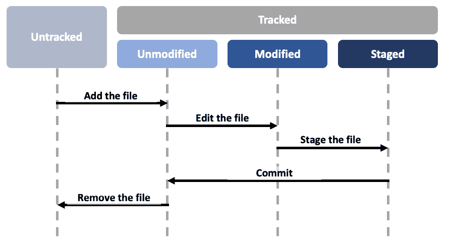
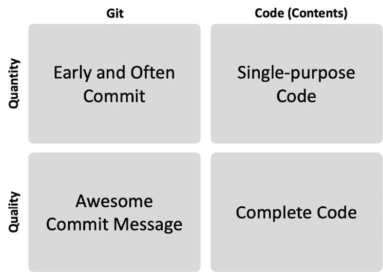

# 2

# Git 入门

让我们深入学习 Git。本章将介绍 Git 的基本用法。然而，正如上一章所解释的，这本书不仅仅是介绍概念和方法。它强调沟通和协作。因此，尽管您无疑能够掌握 Git 的基本用法，但您还将了解背后的沟通方面，以及 Git 如何在团队开发中使用。

在本章中，我们将通过快速实践文件管理和分支的基本操作，首先让您了解 Git 的基础知识，然后我们将介绍 Git 的工作原理。接着，您将了解与 Git 合作时作为工程师需要注意的协作原则。

本章将涵盖以下主要主题：

+   Git 入门

+   Git 的基本构造——适合初学者的 Git 工作原理解释

+   成为 Git 通信的高手

# 技术要求

继续进行此部分的配置说明可以在以下 GitHub 仓库链接中找到。请确保已安装 Git 和 ssh 工具。对于 Windows 用户，建议使用 PowerShell。我还建议您获取有关不同命令和环境的最新信息：

[`github.com/PacktPublishing/DevOps-Unleashed-with-Git-and-GitHub`](https://github.com/PacktPublishing/DevOps-Unleashed-with-Git-and-GitHub)

# Git 入门

在这一部分，我们将假设您在个人环境中工作，并仅仅是在建立历史记录，来进行 Git 的使用介绍。

## Git 基础——从实践开始

在深入细节之前，让我们先进行一些实践体验。通过动手操作来理解概念通常比仅仅阅读更容易。

### git config——向 Git 介绍自己

现在，在开始项目之前，您需要做一件事。向 Git 介绍自己。要向 Git 介绍自己，使用`git` `config`命令：

```
$ git config --global user.name "John Doe"
$ git config --global user.email "john@example.com"
```

`git config`是用于设置 Git 配置的命令，适用于系统、用户和仓库级别。`system`级别适用于所有用户和所有仓库。`global`级别适用于特定用户的所有仓库。`local`级别仅适用于单个仓库。

要验证您的介绍是否已注册，可以使用`git congif --``list`命令检查：

```
$ git config --list
user.name=Your Name
user.email=Your Email
```

现在，第一个任务完成了！让我们快速进入 Git 的基本操作。

### git init——您的代码旅程从这里开始

就像每一段伟大的旅程都有其起点一样，在 Git 的世界里，你代码的旅程从 `git init` 命令开始。此命令用于初始化一个新的 Git 仓库，并开始跟踪现有的目录。当你运行此命令时，它会设置一个包含版本控制所需所有文件的 `.git` 目录。完成这些后，你就可以开始使用 Git 的各种命令来跟踪和更新你的项目：

```
# Make a directory
$ mkdir handson-repo
# Change the current working directory
$ cd handson-repo/
$ git init
```

重要提示

另一种方法是将目录名作为参数传递，如 `git init handson-repo`；这将创建该目录，因此你不需要运行 `mkdir` 命令。

现在，`.git/` 目录已创建，文件的更改保存在该目录下，但 Git 并不会像近期的 Microsoft Office 产品那样自动保存文件。

在 Git 中，保存是通过执行 `git add` 命令完成的，该命令有意识地从已编辑、已添加或已删除的文件中选择要保存的文件，接着 `git commit` 命令将这些更改注册到历史中。

接下来，让我们往仓库中添加一些代码。

### git add – 为你的代码准备亮相

`git add` 命令是你在工作目录中进行更改与准备将这些更改永久存储到 Git 仓库之间的桥梁。当你对文件进行修改时，Git 会识别到文件已被更改，但这些更改不会自动成为历史的一部分。这时，`git add` 就发挥作用了。可以把它理解为保存一个文档的过程。

首先，在你的 `handson-repo` 目录中创建一个新文件：

```
# Making a README.md file
$ echo "# README" > README.md
```

`git status` 命令显示仓库的当前状态，显示哪些文件的更改是已跟踪的，哪些是未跟踪的。当你看到 `Untracked files` 消息时，Git 就是在告诉你有一个文件它还没有被告知要监视。在我们的例子中，`README.md` 文件是 Git 新增的文件，并未被注册，因此它被标记为未跟踪：

```
# Checking how Git recognizes the new file
$ git status
On branch main
No commits yet
Untracked files:
  (use "git add <file>..." to include in what will be committed)
    README.md
```

新添加的文件是项目的一部分，但 Git 尚未跟踪它们。要将它们从未跟踪状态转移到已跟踪状态，你需要使用 `git add` 命令：

```
$ git add README.md
$ git status
On branch main
No commits yet
Changes to be committed:
  (use "git rm --cached <file>..." to unstage)
    new file:   README.md
```

现在，Git 已经识别 `README.md` 为一个新文件，并且它现在已被跟踪。`git add` 命令所保存的状态就是通过 `git add` 命令将工作树中的 `README.md` 文件标记为已跟踪。

重要提示

`git add` 还有其他选项。你可以使用 `git add .` 来包括所有文件，或者像 `git add file1.md file2.md file3.md` 这样包含多个文件，或者使用通配符如 `git add *.md` 来添加所有 `.md` 扩展名的文件。

一切就绪；现在是时候将你的修改记录到历史中了。

### git commit – 锁定你的开发进度

`git commit` 命令将你通过 `git add` 暂存的更改记录到仓库历史中。这使你能够随着时间跟踪更改。

想象一下您在玩一款具有挑战性的视频游戏。随着您的进展，您经常会保存游戏以锁定成就。类似地，在开发软件时，您将使用`git commit`保存工作。每个提交都是一个保存点，以后如果需要可以返回到该点。

要提交更改，通常可以执行以下操作：

```
$ git commit -m "Initial commit with README.md"
```

在这里，`-m`标志后面跟着一个简短的描述性消息，捕捉您所做更改的精髓。编写良好的提交消息是一门艺术，因为它有助于理解更改的历史和意图。

现在，让我们再次使用`git status`命令查看当前工作目录中的所有更改是否已保存：

```
$ git status
On branch main
nothing to commit, working tree clean
```

如果出现消息 `nothing to commit`，则表示您的更改已经合并。

好了，就这些；在 Git 中保存文件非常容易。让我们在这里回顾一下。编辑、暂存和提交流程始终保持不变，无论您的项目有多复杂：

1.  **编辑文件**：对文件进行必要的更改。例如，在这个示例中，已编辑两个现有文件进行删除和修改，并添加了另一个文件：


图 2.1 – 编辑文件

1.  **暂存更改**：决定要提交的文件或特定更改，并将它们暂存。例如，在这个示例中，三次编辑中只有删除和修改被暂存：


图 2.2 – 暂存更改

1.  **提交更改**：在满意暂存的更改后，执行提交以注册它们。请记住，每次提交都会生成一个唯一的提交 ID：


图 2.3 – 提交更改

### git log – 遍历提交树

一旦您进行了几次提交，您可能希望回顾并查看存储库中所做更改的历史记录。这就是`git log`命令派上用场的地方。该命令按时间顺序反向显示存储库中进行的提交列表，即最近的提交首先显示。

要尝试此操作，请使用以下命令：

```
$ git log
commit a16e562c4cb1e4cc014220ec62f1182b3928935c (HEAD -> main)
Author: John Doe <john@example.com>
Date:   Thu Sep 28 16:30:00 2023 +0900
    Initial commit with README.md
```

这将显示所有提交的列表，每个提交都包含以下内容：

+   **独特的 SHA-1 标识符**：这充当提交的签名，并可以在各种 Git 命令中用来引用特定的提交

+   **提交者的详细信息**：显示执行提交的个人的姓名和电子邮件地址

+   **提交的时间戳**：显示提交的时间

+   **提交消息**：捕捉提交中改动的要点的简短和信息丰富的注释

除了基本的`git log`命令外，还有许多选项可以让您根据需要定制输出：

+   `git log -p`: 这个选项显示每个提交引入的差异（即补丁）。

+   `git log --stat`: 这提供了每个提交的简略统计信息

+   `git log --oneline`: 这提供更紧凑的输出，将每个提交显示为单行

+   `git log --graph`：该命令以 ASCII 图形布局可视化分支和合并历史。

+   `git log --author="John Doe"`：此命令筛选提交，仅显示由特定人员（在本例中为“John Doe”）进行的提交。

例如，它还可以改善外观，如下所示：

```
$ git log --graph --pretty=format:'%x09 %h %ar ("%an") %s'
```

输出结果如下所示：


图 2.4 – 美化后的 git log

现在让我们尝试使用`git log`命令。首先，更新`README.md`文件，并创建一个新的`CONTRIBUTING.md`文件：

```
$ echo "# CONTRIBUTING" > CONTRIBUTING.md
$ echo "# README\n\nWelcome to the project" > README.md
$ git add .
$ git commit -m "Set up the repository base documentation"
```

完成后，添加一个示例 Python 代码：

```
$ echo "print('Hello World')" > main.py
$ git add .
$ git commit –m "Add main.py"
```

当在日志中确认已正确记录时，任务完成：

```
$ git log --oneline
344a02a (HEAD -> main) Add main.py
b641640 Set up the repository base documentation
a16e562 Initial commit with README.md
```

从本质上讲，`git log`命令是任何开发者都必备的重要工具。它帮助你轻松浏览代码的历史，无论是查找特定的更改，还是仅仅回顾之前的工作。

现在我们已经回顾了到目前为止关于`git log`功能的内容。

## 使用分支 – 协作的基石

虽然前面的部分已经为你提供了如何初始化和管理 Git 仓库的深入理解，但分支的概念将这一过程提升到了一个新层次。虽然仅使用`git commit`会创建一个线性历史，`git branch`可以用来创建一个并行环境的历史。然后，你可以将这些多个环境合并为一个，这使得多人可以共同开发，同时为你提供了灵活性，能够在不影响主代码库的情况下尝试新功能、修复 bug，甚至是完全的*前卫*创意。

### git 分支 – 理解 Git 分支的基础

当你初始化一个 Git 仓库时，它会自动创建一个默认分支，通常叫做`main`（之前称为 master）。当你运行`git branch`命令时，它会显示仓库中所有分支的列表，并高亮当前分支：

```
$ git branch
* main
```

直观地可以将线性主分支视作如下图所示：


图 2.5 – git 分支

你可以使用`git branch <分支名称>`命令创建一个新分支。此命令从当前分支创建一个新分支：

```
# Create a new branch named 'feature/new-feature'
$ git branch feature/new-feature
```

如果你创建一个新分支，你可以建立一条具有不同历史的分支，并向该分支添加提交，示例如下：


图 2.6 – 创建新分支

分支命名规范对于沟通非常重要。常用的标准是将分支名称前缀为`feature/`、`bugfix/`或`hotfix/`，后跟简短描述。这使得任何人都能一目了然地理解分支的目的。

你还可以从一个特定的分支或提交创建分支，与你当前所在的分支不同。这在你需要创建一个特性分支或修复 bug 的分支时特别有用，这些分支应该从指定的开发或暂存分支而不是从当前工作分支创建：

```
# Create a branch from a specific branch
$ git branch <new-branch-name> <base-branch-name>
# Create a branch from a specific commit
$ git branch <new-branch-name> <commit-hash>
```

### git checkout/git switch – 在分支之间切换

在日常工作流中，你将经常需要从一个分支切换到另一个分支，特别是在同时处理多个特性或修复 bug 时。当你已经在多个分支上开始工作时，了解你当前所处的分支变得尤为重要。在 Git 中，**HEAD**是指你当前正在处理的分支的最新提交。

更改当前工作分支被称为切换分支。`git checkout`命令可以实现这一操作：

```
# Switch to 'feature/new-feature' branch
$ git checkout feature/new-feature
```

这个操作将 HEAD 位置，即分支的最新提交，切换到名为`feature/new-feature`的分支：


图 2.7 – 切换分支

`git checkout`命令将当前的位置切换到`feature/new-feature`分支的最新提交，即 HEAD。

Git 的最新版本还提供了`git switch`命令，它提供了一种更直观的方式来切换分支：

```
# Switch to 'feature/new-feature' branch
$ git switch feature/new-feature
```

有时，你可能会发现创建一个新分支并立即切换到它更为高效。Git 提供了一个简化命令，结合了`git branch`和`git checkout`或`git switch`的功能。

若要在一步操作中创建并切换到一个新分支，可以使用`git checkout -b`命令：

```
# Create and switch to a new branch
$ git checkout -b feature/another-new-feature
```

这相当于执行以下命令：

```
$ git branch feature/another-new-feature
$ git checkout feature/another-new-feature
```

在 Git 的最新版本中，你也可以通过使用`-c`选项和`git switch`实现相同的操作：

```
# Create and switch to a new branch
$ git switch -c feature/another-new-feature
```

现在，你不仅可以通过`git commit`线性保存更改，还可以通过`git branch`创建平行世界，并通过`git checkout`在平行世界之间自由切换。现在，是时候合并这两个世界了。

### git merge <分支名称> – 合并分支

一旦你在某个分支上做出了更改并彻底测试过，你可能希望将这些更改合并回主分支或其他分支。这个操作被称为**合并**：

```
# First, switch to the branch you want to merge into
$ git checkout main
# Now, merge your feature branch
$ git merge feature/new-feature
```

合并允许你将有不同历史的代码行合并在一起，如下图所示：


图 2.8 – 合并分支

合并操作可能很简单，但如果分支之间存在冲突，操作会变得复杂。在这种情况下，Git 需要手动干预以解决冲突。冲突解决将在下一章讨论。

### git branch –d – 删除一个分支

一旦一个分支成功合并并且不再需要，它可以被删除，以保持仓库的整洁：

```
# Delete a local branch
$ git branch -d feature/new-feature
```

因此，到目前为止，在实践教程中，你应该已经掌握了 Git 的基础，并对其有了一定的了解。你现在应该清楚你的项目中发生了什么，并学会了如何使用基本命令。

另一方面，你仍然需要学习如何灵活地在团队中协作。未来，你将学习这些方法，但同样有必要理解 Git 的实际工作原理，才能从根本上理解这些操作。

了解 Git 的机制可以加深你对命令本质作用的理解，不仅能提升你在 Git 操作中的熟练度，还能改善你在 Git 和 GitHub 中的沟通，从而促进 DevOps 的发展。

让我们来看看 Git 是如何工作的。

# Git 的结构 – 一个对初学者友好的解释，讲解 Git 是如何工作的

Git 非常强大，尤其是在项目变得更加复杂时。到目前为止，我们的重点是直观的历史记录。然而，Git 真正的优势在于其处理大型项目的能力，尤其是当有大量贡献者参与并且能够无缝地管理团队中动态发展的代码时。我们通过直观的方式，像使用命令一样操作 Git。现在是时候深入探讨了。虽然对 Git 有直观的了解是有帮助的，但通过理解 Git 在幕后是如何运作的，我们可以充分发挥它的潜力。

## Git 中的文件生命周期

在 Git 中，我们在上一节中学到，保存更改是一个两步操作，即暂存和提交，但 Git 实际上将文件处理为四种状态。

你项目中的每个文件都可以处于四种状态之一：

+   **未跟踪**：这些是存在于你的目录中的文件，但尚未被 Git 控制。它们是新文件，或是 Git 被明确告知忽略的文件。

+   **未修改**：这些是之前已经被添加到 Git 中，并且自上次提交以来没有任何变化的文件。它们安静地存在，被 Git 监控，但不需要立即采取任何行动。换句话说，它们是**已提交的**。

+   **已修改**：一旦你对已跟踪的文件进行更改，Git 就会将其标记为已修改。此时，该文件自上次提交以来已经被更改，但尚未为下一次提交做好准备（或暂存）。

+   `git add` 命令会暂存你的修改。虽然这些更改已被标记，但在你提交之前，它们并未被保存到仓库中。

下图显示了这些状态的转换。文件在这些状态之间来回变化：



图 2.9 – Git 中文件状态的四种类型

当你创建或引入新文件到项目中时，使用 `git add` 命令后，它们会过渡到**未修改**状态，表示它们现在在 Git 的监控之下。

对这些已跟踪文件的后续更改会将它们置于**已修改**状态。在它们被提交之前，这些更改需要被暂存，从而将文件移动到**已暂存**状态。暂存让你预览即将提交的更改。可以把它想象成将物品放入箱子（暂存区）并准备运送（提交）。你决定哪些物品（或更改）将放入那个箱子。

在暂存之后，你可以使用 `git commit` 命令提交这些更改。当你通过 Visual Studio Code 等界面进行暂存更改时，通常只需点击一个按钮。一旦你对暂存的更改感到满意，就可以提交它们，永久地将它们保存到你的项目历史中。

提交后，这些文件将恢复为 **未修改** 状态，等待将来的编辑或更改。换句话说，在此阶段，可以说其状态已经变为 **已提交**。在 Git 中，你所做的每个提交都记录了项目在特定时间点的当前状态。这个记录机制是 Git 能力的基础，确保每个更改都被文档化。这使得开发者可以回到任何特定的提交，提供了回顾或恢复到以前版本的灵活性。

此外，如果一个被跟踪的文件从目录中被删除，Git 会将其视为 **未跟踪**，直到它被明确地从仓库中删除。

这个生命周期为开发者提供了对项目更改的精确控制，允许进行战略性的提交，并确保清晰、有序的版本历史。

## 幕后 – Git 的架构

首先，Git 到底是什么？从本质上讲，Git 就是一个 `.git` 目录。这个隐藏目录包含了你的代码历史记录——提交、分支、配置文件等。你可能记得在 Git 学习初期，在执行 `git init` 命令时，会创建一个 `.git` 目录。

### 深入探索 – 探索 .git 目录

通过执行 `ls` 命令，你可以看到多个子目录和配置文件。其中，`objects` 目录与我们当前的讨论最为相关。它是 Git 键值存储的核心，存放着 blob（实际文件内容）、树对象（目录结构）和提交记录：

```
$ ls .git
COMMIT_EDITMSG  hooks    objects
HEAD            index    refs
config          info
description     logs
```

现在，让我们来看看 `objects` 文件夹。这就是键值存储所在的地方。文件夹的名称由两个字母数字字符组成，代表提交 ID 的前两个字符：

```
$ ls .git/objects
2f   7e   b1   e3   info
34   a1   b6   e6   pack
4b   af   df   ea
```

在 Git 中，每个提交或数据块都通过一个键（SHA-1 哈希）来唯一标识。这个哈希值是一个由 40 个字母数字字符组成的字符串，类似于 `b641640413035d84b272600d3419cad3b0352d70`。这个每个提交的唯一标识符是 Git 根据提交内容生成的。你在执行 `git log` 命令时看到的这些 ID 对应着你迄今为止所做的更改：

```
$ git log
commit 344a02a99ce836b696c4eee0ee747c1055ab846b (HEAD -> main)
Author: John Doe <john@example.com>
Date:   Thu Sep 28 18:41:41 2023 +0900
    Add main.py
commit b641640413035d84b272600d3419cad3b0352d70
Author: John Doe <john@example.com>
Date:   Thu Sep 28 18:41:18 2023 +0900
    Set up the repository base documentation
commit a16e562c4cb1e4cc014220ec62f1182b3928935c
Author: John Doe <john@example.com>
Date:   Thu Sep 28 16:35:31 2023 +0900
    Initial commit with README.md
```

如果我们打开 `b6` 目录，我们会认出键值存储的结构，其中提交 ID 作为文件名或键。但这些文件里到底有什么呢？为了弄清楚，我们接下来可以使用 `git cat-file` 命令来查看其中的内容。

重要提示

在本书中，Hash 的前两个字符是 **b6**，但在你的环境中会显示不同的列表。让我们选择一个合适的哈希值并执行 **ls** 命令：

**$** **ls .git/objects/b6/**

**41640413035d84b272600d3419cad3b0352d70**

### git cat-file – 解剖 Git 的内部工作原理

要检查键值存储中值的内容，可以使用 `git cat-file` 命令。当传递提交 ID 的前七个字符作为参数时，我们得到的结果展示了树对象和父对象，它们分别引用了父提交的 ID：

```
# Passing the first seven letters of the Commit Id as an argument
$ git cat-file -p b641640
tree af4fca92a8fbe20ab911b8c0339ed6610b089e73
parent a16e562c4cb1e4cc014220ec62f1182b3928935c
author John Doe <john@example.com> 1695894078 +0900
committer John Doe <john@example.com> 1695894078 +0900
Set up the repository base documentation
```

重要提示

在 Git 命令中处理哈希时，不需要传递完整的 40 个字符；可以省略。这个例子中传递了前七个字符作为参数，但最少要求是四个字符。虽然具体情况取决于项目的大小，但为了避免键冲突，建议至少指定七个字符。

在 Git 中，主要管理和使用四种对象：

+   `commit` 对象：引用了 tree 对象

+   `tree` 对象：包含对 blob 和/或其他 tree 对象的引用

+   `blob` 对象：包含数据（如文件内容）

+   `tag` 对象：包含有关注释标签的信息

提交引用结构中嵌入了 `parent` 提交的 ID。但实际的提交文件去了哪里呢？在输出中，我们看到标有 `tree` 的 ID 和 `parent`。看起来这个 tree 对象也有一个 SHA-1 哈希值，因此让我们使用 `git` 的 `cat-file` 命令来检查其值：

```
# Passing the first seven letters of the Tree Id as an argument
$ git cat-file -p af4fca9
100644 blob b1b003a2...a277 CONTRIBUTING.md
100644 blob ea90ab4d...79ca README.md
100644 blob e69de29b...5391 main.py
```

在调用 `git cat-file` 命令查看与 `tree` 标签关联的 ID 时，我们得到的结果展示了一种名为 `blob` 的文件类型。让我们通过 `git cat-file` 命令引用 `README.md` 的 blob ID。这样可以显示文件内容，表明存储在键值存储中的 blob 类型数据实际上是文件本身。这些观察结果让我们对 Git 的架构有了更清晰的了解：

```
$ git cat-file -p ea90ab4
# README
Welcome to the project
```

现在你已经知道 Git 如何在键值存储中存储值。你应该理解，Git 并不是一个黑匣子；它是一个通过 SHA-1 哈希键来管理历史记录的系统。

### git show – 在日常使用中更易于操作

之前我们使用了 `git cat-file` 命令来了解 Git 的工作原理，但有一个类似的命令是 `git show`。这两个命令都是强大的 Git 工具，但它们的作用有所不同，输出也不同。`git cat-file` 是一个低级工具，主要用于检查 Git 对象，如 blobs、trees、commits 和 tags。它可以显示对象的类型、大小，甚至是原始内容。而 `git show` 更加用户友好；该命令以可读的方式展示各种 Git 对象的内容。默认情况下，它展示提交的日志信息和文本差异。然而，它也足够灵活，可以以易于阅读的格式展示其他对象类型，如 blobs、trees 和 tags：

```
$ git show b641640
commit b641640413035d84b272600d3419cad3b0352d70
Author: John Doe <john@example.com>
Date:   Thu Sep 28 18:41:18 2023 +0900
    Set up the repository base documentation
diff --git a/CONTRIBUTING.md b/CONTRIBUTING.md
new file mode 100644
index 0000000..b1b003a
--- /dev/null
+++ b/CONTRIBUTING.md
@@ -0,0 +1 @@
+"# CONTRIBUTING"
diff --git a/README.md b/README.md
index 7e59600..ea90ab4 100644
--- a/README.md
+++ b/README.md
@@ -1 +1,3 @@
 # README
+
+Welcome to the project
diff --git a/main.py b/main.py
new file mode 100644
```

如果你是开发人员或 Git 用户，想查看某个提交引入的更改或查看特定版本的文件内容，`git show` 是一个更直观的选择。相比之下，`git cat-file` 更深入地探讨了 Git 的内部结构，允许用户直接与原始 Git 对象进行交互和检查。对于那些深入参与 Git 内部工作或开发与 Git 核心系统接口工具的人来说，`git cat-file` 提供了一个详细的层次。然而，对于大多数日常任务，以及那些刚刚开始接触 Git 和 GitHub 的用户，`git show` 提供了一种更友好的方式来查看更改和内容，无需深入了解 Git 对象数据库的复杂性。

## Git 树结构

现在，我们知道 Git 本质上是一个键值存储。接下来，让我们看看每个对象是如何连接和管理的，以便作为历史数据的一致性存储。在上一节中，我们看到过关键字 `tree` 和 `parent`，但它们到底是什么呢？现在，我们将探索提交与这些关键字所链接的对象之间的关系。

### 提交、树和数据块

在 Git 中，树结构的概念在维护仓库状态方面起着至关重要的作用。每个提交不仅仅是一组更改。

每个关键字的解释：

+   **提交**：Git 中的每个提交都有一个唯一的 SHA-1 哈希值。它通过引用一个树对象携带着仓库状态的快照。

+   **树**：Git 中的树像目录一样工作。它们可以引用其他树（子目录）和数据块（文件）。每个树都有其独特的 SHA-1 哈希值。表示仓库顶级目录的主树被称为根树。

+   **数据块**：数据块表示仓库中文件的内容。像提交和树一样，每个数据块都有其独特的 SHA-1 哈希值。

### 父与子

仓库历史的传承和进展通过提交之间的父子关系得以记录。

大多数 Git 提交都引用单个父提交，表示仓库时间线中的直接前驱。

如前一页所解释的，提交持有其父提交的 ID，建立了引用关系。在许多提交的可视化表示中，箭头通常表示这种关系。值得注意的是，这些箭头的方向通常与提交的顺序相反。每个提交都具有图中所示的关系。


图 2.10 – Git 提交关系

重要提示

提交有时会有多个父级，特别是在两个分支合并时。这种双重父级标志着两个独立开发线的合并。

### Git 如何存储树和数据块？

Git 高效性的奇妙之处在于它如何存储其树和数据块。

让我们通过以下方式说明这些关系：


图 2.11 – Git 树结构

Git 中的每个提交都对应一个树，表示在特定时刻仓库中文件和目录的状态。要更深入地了解，可以参考所提供的图表。标签为 `fb36640` 的提交包含了对树 `d6f50a2` 的引用。这个树反映了该提交时仓库的根目录状态。

当我们遍历这棵树（`d6f50a2`）时，我们会遇到各种指针。有些指向 blobs，有些指向 trees。像 `2d69956` 这样的 blob 对应一个文件——在这种情况下是 `LICENSE`。而像 `1d0f85d` 这样的 tree 则代表一个名为 `contents` 的子目录。这个子目录树可以进一步指向它自己的一组 blobs 和 trees。

这种复杂的关联构建了一个类似传统文件系统的层级结构。这个层级的每一层代表着你仓库中不同的文件和目录。Git 设计哲学的核心是高效。通过以这种层级结构存储数据，Git 能够快速跟踪文件和目录的变化，而无需冗余存储。例如，不变的文件在不同的提交中会指向相同的 blob，从而优化了存储和检索：


图 2.12 – Git 中的高效文件管理

理解 Git 的树结构以及它与 blobs 和 commits 之间的关系是每个开发者的基础知识。这不仅仅是使用 Git 命令；更重要的是理解其背后的巧妙架构，确保代码的历史得到高效且准确的保存。当你在 Git 的旅程中不断前进时，这些知识将帮助你充分利用 Git 的功能。

到目前为止，你已经学会了 Git 如何识别每个文件的状态，并将其记录在一个键值存储中。你还了解到，这个键值存储采用树形结构，具有父子关系。如果你深入 `.git/` 目录，你会发现它有一个非常简单的结构，正是因为这个简单，Git 才能高效管理复杂的项目。

如果你已经理解了这些，那么你已经为掌握 Git 之旅做好了充分准备。尽管本书无法覆盖每个 Git 命令，但理解这些基础将确保你在未来遇到不熟悉的 Git 命令时也能应对自如。你已经具备了理解它们的技术基础。

现在，让我们学习另一个内容，以结束你在本章中对 Git 之旅的准备工作。那就是 Git 之旅的思维方式。这个思维方式不仅适用于使用 Git，还直接与 DevOps 中的协作相关。

# 成为 Git 通信的专家

让我们稍作停顿。尽管大多数资源可能会催促你快速学习 Git 的基本命令、冲突解决、合并类型和 Git 工作流，但我们选择暂时休息一下，专注于问题的核心。

那么，为什么 Git 一开始会被开发出来呢？从本质上来说，Git 是为了简化复杂开发项目中的沟通而创建的。由于本书的目的是提升你在 DevOps 团队中的角色，理解 Git 在沟通方面的力量至关重要。毕竟，DevOps 不仅仅是技术问题；它关乎于改善协作、打破壁垒和促进更顺畅的工作流程。

当你在 Git 命令和仓库中导航时，要记住，你不仅仅是在分享代码；你还在与团队进行沟通。你的提交、拉取请求和合并应该被视为在一个更广泛对话中的部分，旨在共同创造出某个宏伟的作品。

因此，在学习 Git 的过程中，专注于磨练你的思维方式。一个经过精心调整的 Git 方法不仅仅是掌握命令，它还能让你成为一名无价的团队成员，与 DevOps 环境中的整体目标保持一致。

记住：欲速则不达。花时间深入理解 Git 的基础知识，你不仅能成为一名熟练的编码员，还能成为你 DevOps 团队中的杰出合作者。

## git commit – 重新审视最重要的命令

如果你问我，Git 中最重要的命令是 `git commit`。如果这个命令做得完美，其他的一切都是次要的。这个命令界定了你所有编码活动的范围，并巩固了你的输出，决定了你工作的质量。一次提交就像是一个沟通单元。如果这个沟通单元出错，所有后续的沟通都会变得混乱。

你有没有用乐高积木做过什么东西？乐高的精髓不仅仅在于按照说明书操作，更在于激发创造力并打造独特的作品。有时，你还需要和朋友一起合作，像一起建造一个城堡。每个人可能都有一个角色：有人负责做城门，有人负责做地基，还有人负责做塔楼。你们的成功在于作为一个团队共同打造出一个宏伟的城堡。但考虑一下：即使你个人做了一部分很棒的作品，如果它不符合其他人设想的效果，或者和他们做的部分不匹配，它可能不会得到认可。确保各个部分的尺寸匹配并经常检查其兼容性是至关重要的。换句话说，你需要在正确的时机进行沟通，并不断调整建造的方式和各个部件。小时候，你可能做过一些奇怪的作品，虽然缺乏完美的沟通，但由于富有创意还是会受到赞扬。然而现在情况不同了。如果你正在阅读这本书，你很可能在一个组织中工作，创造某种产品，可能有工资收入，并且承担责任。这意味着，这些考虑因素不仅仅是可有可无的，它们是必须要有的。

让我们回到编程。当你在团队中编程时，不仅你自己，所有团队成员（包括过去和现在的）都会审查你在 Git 中的代码和操作。即使你一个人编程，你的未来自我和过去自我也是你的合作伙伴。我曾多次因为不理解自己以前写的代码或忘记自己当时想要实现什么，通过运行 `git log` 命令后还是毫无头绪。Git 操作管理得如何，将直接反映在代码管理和生产流程中。最好有一个你可以记住的原则来使用 Git。

## 控制质量和数量，成为一个优秀的沟通者

关于如何使用 Git，存在很多良好的实践。然而，许多内容可以归类于下图的四个框中的某个位置：



图 2.13 – Git 提交的卓越实践

### 早期和频繁提交 —— 采用 DevOps 成功的核心原则

过去几十年，现代软件开发的格局发生了巨大的变化。传统的瀑布式开发方法已被敏捷方法取代，进一步演变为如今许多组织所采用的 DevOps 文化。这个演变的核心概念就是 **持续集成和持续交付** (**CI**/**CD**)。支持这一方法论的基础实践之一就是早期和频繁提交代码的理念。本节将深入探讨这一实践的重要性，尤其是在 DevOps 的 Git 和 GitHub 上的应用。

#### 传统范式

在过去，开发人员通常会花费几天甚至几周的时间来开发一个功能或修复，然后在最后将其合并到主分支。这通常会导致合并冲突、错误和大量手动干预以修复问题。这种模式不可扩展，与今天快速发展的、以客户为中心的技术环境需求背道而驰。

#### 向早期提交的转变

尽早提交意味着，当你完成一部分逻辑性的工作时，你就应该提交。这并不一定意味着整个功能已经完成，可能只是某个函数或类。为什么这样做有益？

+   **更小的更改**：较小的更改更容易审查。它们更易于理解，使得代码审查过程更高效、更有效。

+   **减少合并冲突**：通过尽早提交和推送你的更改，你可以减少遇到合并冲突的机会，因为你会频繁地将分支与主分支同步。

+   **更快的反馈循环**：你越早提交和推送更改，自动化测试就能越早运行，你就能越早获得关于代码的反馈。这有助于更快地迭代和更快地交付功能和修复。

#### 经常提交的好处

经常提交与尽早提交是相辅相成的。你提交的频率越高，以下几点就越容易做到：

+   **更容易找到问题**：如果出现 bug，通过筛选一个小的提交要比筛选一个大的提交要简单得多。

+   **更容易回滚**：如果一个提交引起了意外问题，回滚到之前的稳定状态非常简单。这种安全网在生产环境中可能是一个救命稻草。

### 了不起的提交信息 - 为您的代码打造清晰、信息丰富和简洁的叙述

在软件开发领域，我们编写的代码不仅仅是机器的一组指令；它也是与同行交流的一种形式。然而，代码展示了*如何*做到，而提交信息则阐明了*为什么*这样做。一个精心制作的提交信息是同行开发者的灯塔，提供上下文、清晰度和代码变更的历史记录。

#### 提交信息的目的

在其核心，提交信息具有几个关键功能：

+   **历史记录**：它提供了变更的按时间排序的账户，使开发人员能够理解代码库的演变。

+   **上下文**：它提供了变更的理由，提供了单单代码本身无法传达的洞察力。

+   **文档**：除了内联注释和外部文档之外，提交信息还充当一种文档形式，可以解释决策和权衡。

#### 优秀提交信息的特征

一个好的提交信息与一个了不起的提交信息有何不同？以下是出色提交信息的标志：

+   **简洁的主题行**：以简洁直接的主题行开头，理想情况下不超过 50 个字符，捕捉提交的核心内容。

+   `git commit -m "subject-line" -m "``description-body"` 命令。

+   **使用主动语态**：像“*添加功能*”或“*修复错误*”这样的短语比“*添加了功能*”或“*修复了错误*”更清晰、更直接。

+   **引用问题**：如果提交与跟踪系统中的特定问题或任务相关，请引用其 ID 或链接，有助于可追溯性。

#### DevOps 的联系

对于现代的 DevOps 工程师，提交信息不仅仅是一个附带的想法；它们是 DevOps 哲学的核心组成部分。

在当今的软件领域中，应用程序开发和基础设施之间的界线变得日益模糊。精通基础设施的工程师可能会发现自己阅读应用程序代码，反之亦然。更重要的是，现在两个领域的工具都与 Git 集成，使专业人士能够在各种平台上查看提交信息以及 Git 哈希值。

鉴于这种集成，提交信息不再局限于其仓库或团队。它开始跨越不同的组织边界和平台。这一过渡突显了精心编写的提交信息作为一种通用语言的价值，它可以被软件开发和交付流程中的不同利益相关者理解和欣赏。在打破组织孤岛并改善开发者体验的过程中，你的优秀提交信息将助力你的旅程。

以下是一些优秀提交信息的建议：

+   **透明性至关重要**：清晰的提交信息使得从开发到运营的团队能够理解代码变更，减少摩擦并促进协作。

+   **持续交付依赖历史**：随着组织推动更频繁的发布，快速理解和验证变更的能力变得至关重要。信息丰富的提交信息是这一过程中的重要工具。

#### 提交信息示例

这是一个提交信息的示例。它是基础性的，你可以在此基础上添加你自己的上下文，但不应过长：

| **类别** | **示例** **提交信息** |
| --- | --- |
| **简单变更** | 添加`README.md` |
| 更新许可证到期日期 |
| 移除已废弃的方法 XYZ |
| **功能添加/更新** | 实现用户认证流程 |
| 为主页添加搜索功能 |
| 扩展 API 以支持版本控制 |
| **错误修复** | 修复导致会话超时的登录错误 |
| 解决数据处理模块中的内存泄漏 |
| 修正用户注册表单中的拼写错误 |
| **重构和代码** **质量改进** | 重构数据库连接逻辑以支持连接池 |
| 优化图片加载以加速页面渲染 |
| 改进支付网关中的错误处理 |
| **文档** **和注释** | 记录 XYZ 模块中的主要算法 |
| 更新 X 函数中的注释以提高清晰度 |
| 修订 API 文档以包含新端点 |
| **恢复变更** | 恢复“添加实验性功能 X” |
| 回滚到缓存层更新之前的稳定状态 |
| **依赖项和** **外部集成** | 升级到 ABC 库的 v2.1.3 版本 |
| 集成 XYZ 框架的最新安全补丁 |
| **带有问题/任务** **跟踪引用** | 修复#1234：处理订单结账中的边缘情况 |
| 功能#5678：添加多语言支持 |
| **合并操作** | 合并分支‘feature/user-profiles’ |
| 解决 main.css 中的合并冲突 |
| **与测试相关的变更** | 为工具函数添加单元测试 |
| 重构集成测试以使用模拟数据 |
| 修复用户注册流程中的不稳定测试 |

表 2.1 – 提交信息示例

### 单一功能代码

在不断发展的软件开发领域中，敏捷和 DevOps 实践倡导快速迭代和强有力的协作，单一功能代码的原则变得愈发重要。它的影响力不仅限于代码结构的领域，甚至渗透到开发者体验和 Git 通信的核心。让我们深入探讨这些概念之间深刻的联系。

#### 与敏捷原则的契合

敏捷方法论的核心理念是促进适应性、持续改进，并以小而可管理的增量交付价值。单一功能代码与这些原则无缝契合：

+   **增量开发**：就像敏捷将特性拆解为更小的用户故事或任务一样，单一功能代码鼓励将软件组件拆分成专注的、可管理的模块。

+   **适应性**：单一功能组件更易于修改或替换，符合敏捷方法论对变化的拥抱。

#### 提升 DevOps 流水线

DevOps 强调软件的持续集成和交付，架起了开发与运维之间的桥梁。此时，单一功能代码的优势便显现出来：

+   **精简的 CI/CD**：由于代码组件专注且独立，集成过程中一个模块意外影响另一个模块的几率降低，从而使得 CI/CD 流水线更加顺畅。

+   **更好的监控和日志记录**：当组件具有单一责任时，监控其行为和记录相关事件变得更加容易。任何异常都可以直接追溯到特定功能。

#### 提升开发者体验

**开发者体验**（**DX**）的概念围绕着让开发者的工作更轻松、提高生产力和减少摩擦展开。单一功能代码在这一过程中扮演了至关重要的角色：

+   **直观的入职体验**：当代码库由清晰且专注的组件组成时，新团队成员能够更快理解并做出贡献。

+   **高效的调试**：由于每个组件只做一件事，识别和解决问题变得更加高效。

#### 与 Git 通信的深厚联系

如前所述，单一功能代码与 Git 之间有着深刻的协同作用：

+   **清晰的提交信息**：编写单一功能代码能生成精确的提交信息。对单一功能或模块的更改可以在 Git 中简洁地描述，从而促进透明度和沟通清晰度。

+   **简化的代码审查**：在 GitHub 等平台上，若 Pull 请求围绕着专注的变更进行，审查过程将变得更加直接。审阅者更容易理解意图并验证实现，从而带来更有意义的反馈和协作。

### 完整的代码：在精确性和进度之间找到平衡

在软件开发领域，完美与进步之间的长期矛盾始终存在。开发人员常常会遇到这样的问题：我的代码什么时候才算准备好了？在本文中，我们旨在阐明“完整代码”这一概念，这一理念强调在不陷入对完美的难以实现追求中，提供稳健、完全实现的解决方案。

### 完整代码的本质

**完整代码**背后的理念既简单又深刻：任何编写的代码都应在意图和执行上是完整的。这意味着：

+   **没有半途而废**：无论是在实现功能还是修复 bug 时，代码都应该完全达成目标，而不是部分地或表面地实现。

+   **准备审查**：代码应该达到足够的质量，准备接受同伴审查。这不仅意味着功能正常，还意味着符合团队或组织的编码标准和最佳实践。

+   **附带测试**：在适用的情况下，代码应附带测试，确保其不仅现在能按预期工作，而且随着软件的演进，依旧能够继续保持这种效果。

### 完成比完美更好

虽然重点放在完整性上，但必须认识到，追求完美可能是一个适得其反的行为。软件本质上是迭代的，等待完美的解决方案可能会拖慢进展。口号“完成比完美更好”提醒我们以下几点：

+   **迭代改进是关键**：即使一开始解决方案不是最优的，也没有关系。它需要能工作，之后可以随着时间不断改进。

+   **反馈推动完美**：通常，发布代码并收集反馈比无休止的内部迭代能得出更好的解决方案。

### 测试在完整代码中的角色

测试是完整代码哲学中的关键：

+   **验证**：测试验证代码是否按预期执行，提供防止回归的安全网。

+   **文档**：精心编写的测试也充当文档的角色，提供关于代码预期行为的洞察。

+   **自信**：测试能增强信心。当开发人员编写有测试保障的完整代码时，他们可以在修改或添加功能时确信，如果代码出现问题，自己能及时发现。

#### 现代开发实践的重要性

在敏捷和 DevOps 主导的时代，CI/CD 管道自动化软件交付，完整代码的重要性愈加凸显：

+   **简化的管道**：CI/CD 管道的执行考虑到集成的代码可能是不完整的。但这并不意味着代码随时都可以不完整，若失败过多，你团队的测试统计数据将变为红色。不完整的代码会破坏管道，造成瓶颈和低效，并且是你团队代码质量的体现。

+   **协作效率**：在团队合作中，当开发者提交完整且可以审查的代码时，能够促进更顺畅的协作。审查者花费更少的时间指出基础问题，更多的时间可以用来深入讨论架构或逻辑问题。

现在你已经理解了如何在 Git 中保留历史记录。编写提交信息是件让人头疼的事。你需要在仅仅几十个字符内描述你的工作。然而，在 Git 协作中，关注这些细节是非常重要的。

因为你花了几个小时来进行提交（可能是几十个小时），如果因为一些小细节的疏忽而破坏了合作的质量，那真是太可惜了。只需要多花几秒钟或几分钟的时间关注细节，就能让协作变得更好。

卓越藏于细节。让我们练习并成为真正的大师！

# 总结

在结束本章时，你应该对 Git 的基本功能、底层机制以及最重要的协作哲学更加熟悉了。理解这些基础知识通常比死记 Git 命令或存储快捷代码片段更为重要。

如果你已经内化了本章的洞见，放心，你已经牢牢掌握了 Git 的基础知识。你不仅准备好提交代码，还准备好在团队中成为一个协作的力量。

当你第一次加入一个由 Git 管理的项目时，最初的挑战通常不是解决复杂的冲突或处理混乱的分支；而是如何编写有意义的提交，并证明自己是一个不可或缺的团队成员。每一次经过深思熟虑的提交，不仅有助于项目的发展，还能巩固你在团队中的地位。

现在，让我们继续深入学习更高级的 Git 使用方法，帮助你在团队中大放异彩。
