# 高级 Git 用法用于团队协作

现在，我们进入实际协作的部分。在本章中，我们将深入探讨你希望采用的各种协作实践。你将学习如何组织提交历史、管理复杂的分支，并在合并时解决冲突。本章的目标是帮助你能够很好地控制这种分支流的团队协作。

在这里，重点不仅仅是完成工作，而是以一种能增强团队合作的方式来完成。要认识到，管理整个代码库背后有一套深思熟虑的策略，旨在最大化团队的生产力和影响力。根据产品或项目的类型、团队的规模及其成熟度，会采用不同的策略。在我们深入 Git 命令之前，理解这个基础策略——分支策略，是至关重要的。

那么，让我们开始让你的协作变得更加顺畅高效吧。

本章将涵盖以下主题：

+   团队协作的分支策略

+   在分支上应用变更的方法

+   处理冲突

+   掌握更好的协作

# 技术要求

继续本部分的配置说明可以在以下 GitHub 仓库链接中找到。请确保已安装 Git 和 SSH 工具。对于 Windows 用户，建议使用 PowerShell。我也鼓励你获取关于不同命令和环境的最新信息。

[`github.com/PacktPublishing/DevOps-Unleashed-with-Git-and-GitHub`](https://github.com/PacktPublishing/DevOps-Unleashed-with-Git-and-GitHub)

# 团队协作的分支策略

在团队协作的领域中，提交是至关重要的构建块。这些提交链接在一起，形成一个按时间顺序排列的历史记录，记录了你的项目的演变。这一历史记录通过分支进行组织和维护。

那么，工程师和团队如何将这些历史记录编织成一个连贯有意义的叙事呢？分支策略就是这个问题的答案。分支策略是一个有效管理 Git 中分支的开发策略，它能够促进顺畅的协作和服务交付。

## 为什么分支策略很重要

一个精心设计的分支策略不仅仅是锦上添花；它在团队开发环境中至关重要。你的分支策略会对你的 DevOps 流程产生连锁反应，影响部署单元和工作流效率。顺利协作的能力不仅依赖于团队内部的良好沟通，还会影响你的产品发展速度。这与我们在前几章中覆盖的所有元素相关，例如 CI/CD 测试的频率和方法论。本质上，你的分支策略在消除组织摩擦方面至关重要，而这正是 DevOps 的最终目标。

以下是为什么深思熟虑的分支策略是不可妥协的原因：

+   **变更隔离**：它允许单独的团队成员在不干扰彼此工作的情况下，处理不同的功能或缺陷。

+   **风险缓解**：分支策略可以保护主分支（通常称为 master 分支）不被未经测试或不稳定的代码破坏。

+   **促进协作**：通过良好的分支策略，多个团队成员可以并行在不同的分支上工作，从而提高团队的整体效率。

在 DevOps 的背景下，分支策略还具有以下功能：

+   **自动化测试集成**：分支策略可以设计为在不同阶段触发自动化测试。这样可以确保只有经过充分测试的代码才能合并回主分支，从而支持持续集成。

+   **简化部署**：一个组织良好的分支结构可以简化部署过程，使得代码更容易从开发环境移至暂存环境，最终到生产环境。

+   **增强开发者体验**：通过提高协作的透明度和效率，它改善了整体的**开发者体验**（**DX**），这是成功 DevOps 的关键策略。

+   **特定环境的分支**：为特定环境（开发、暂存、生产等）设置分支，有助于实现更加平滑和可控的部署。

+   **增强安全性**：通过在分支之间建立清晰的边界，分支策略可以通过控制对敏感代码的访问，并确保在合并到关键环境之前，所有更改都经过适当的审查和批准，从而增强安全性。

## 分支策略与分支政策

在软件开发和 DevOps 领域，**分支策略**和**分支政策**这两个术语可能看起来是同义的。虽然它们经常被混淆，但必须认识到，分支策略是一个更广泛的概念，涵盖了分支政策。

分支策略是一个全面的计划，概述了如何在开发工作流中管理、创建和集成分支。它不仅仅涉及处理分支的技术方面，还包括组织的规模、团队文化以及项目或产品的具体需求等背景变量。

分支策略，另一方面，是一组更为具体的规则或指南，用于分支管理。这些规则通常构成分支策略的骨架，作为模板，根据具体需求进行定制。有时，像**Git Flow**或**GitHub Flow**这样的策略名称（我们将在本章中介绍）被用作开发策略的名称。它们应该被视为分支策略的一种类型。著名的软件思想领袖马丁·福勒在他的文章《源代码分支模式管理》（*Patterns for Managing Source Code* *Branches*）中并未将这些视为策略本身，而是在*观察一些分支策略*部分进行讨论，具体内容请参见他的文章([`martinfowler.com/articles/branching-patterns.html`](https://martinfowler.com/articles/branching-patterns.html))。

因此，在建立分支方法时，选择一个作为基础的分支策略至关重要。这个策略应根据组织的独特需求和目标进行定制，以有效减少开发过程中的摩擦并加速软件发布。这种定制化的方法确保了分支策略不仅优化了工作流程，还与团队的文化和组织方面无缝融合。

## 较小且频繁的修改 vs 较大且不频繁的修改

目前存在许多分支策略。公司通常会创造特定的分支策略名称，并将其发布为最佳实践，如**GitHub Flow**。从根本上讲，所有的分支策略都可以映射到两个原则之一：频繁地进行较小的修改，或者偶尔进行较大的修改。

对于小型团队来说，集成变更和快速发布的摩擦自然较小。但在大型组织中，尤其是涉及大型产品或冗长审批过程时，摩擦不可避免地增加。更多的冲突出现，需要更多的检查来防止这些冲突。

然而，允许这些挑战拖慢开发过程可能会对产品或项目发布的及时性产生不利影响，最终影响业务的成功。

随着时间的推移，许多公司设计了各种分支策略来缓解这些问题。它们中的大多数都是现有实践的扩展，旨在减少组织或产品限制内的摩擦，目标是加速发布。

需要理解的是，没有任何一种分支策略是适用于所有情况的“万能解”。基础策略通常是根据团队的组成和文化来选择的，然后根据具体需求进行定制。

本节介绍了基于主干的开发、Git Flow 和 GitHub Flow 这三种分支策略，它们的映射如下：

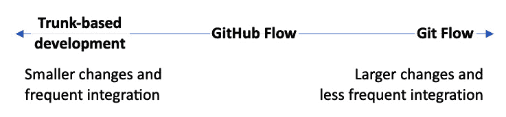

图 3.1 – 分支策略映射

**基于主干的开发**以将较小、频繁的更改直接集成到主分支中而闻名。与此相对，Git Flow 因其较少频繁地集成较大更改的策略而著名。两者各有优缺点，选择其中之一通常取决于团队的具体需求和工作流程。

对于那些希望更频繁地发布更多更改并减少摩擦的大型组织，GitHub Flow 是一个很好的代表。这些策略基本上是将频繁小规模更改的核心原则适应大型企业的复杂性和规模。

像 GitHub Flow 这样的策略是在 Git Flow 的影响下构建的，但现在许多公司使用 GitHub Flow 作为模板，在此基础上构建他们自己的定制化分支策略。

## 分支策略的类型

现在，让我们来看一个典型的分支策略。

本节介绍三种典型的分支策略：

+   基于主干的开发

+   Git Flow

+   GitHub Flow

考虑根据您的团队或组织需要发布的频率以及您的产品和项目的规模来分析每种情况。

### 基于主干的开发

**基于主干的开发**（**TBD**）是一种软件开发方法，在这种方法中，开发人员在短生命周期的分支上工作，通常不超过一天，或者直接从一个名为**主干**或主线的单一分支上工作。其关键原则是尽量缩短分支的生命周期，以促进频繁的集成，并避免长期存在的特性分支所带来的问题，如合并冲突和代码库分歧。

在 TBD 中，主干始终保持工作状态并且健康，应该始终处于可部署状态。开发人员会选择一个小的功能或任务块进行开发，并尽快将其合并回主干。如果某个功能尚未准备好发布，可以使用**功能标志**来隐藏这些功能，直到它们完成为止，这样代码就可以合并而不影响最终用户。像功能标志这样的发布实践将在*第五章*中讨论。

如图所示，在 TBD 中，创建了许多短生命周期的分支，并将它们合并到主线中。

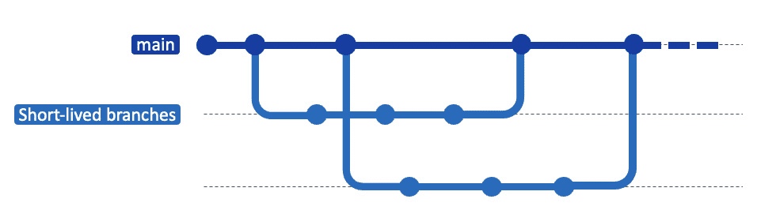

图 3.2 – 基于主干的开发

由于集成发生得很频繁，因此必须拥有一个强大的自动化测试套件，在每次代码合并到主干时进行运行。这确保了代码库始终保持稳定和可部署。**持续集成**（**CI**）工具通常与 TBD 一起使用，以自动化测试和构建过程，确保主干始终保持良好状态。

为了处理提供紧急修复的 hotfix，开发者可能会创建短生命周期的分支，这些分支在完成后立即合并回主干。这确保了能够迅速解决关键问题，而不会危及主干的稳定性。

TBD 的主要优点之一是它的简单性和专注于生成清晰、可部署的代码库。鼓励频繁的合并减少了合并冲突的可能性，并使所有开发者保持与最新版本代码的一致性。这在优先考虑快速迭代和快速交付的 DevOps 文化中尤为重要。

以下是基于主干开发的优缺点。

优点：

+   **频繁集成**：由于代码频繁合并，合并冲突的可能性较小，且更容易解决

+   **快速反馈循环**：频繁集成变更有助于在开发过程中尽早发现问题

+   **简化的工作流程**：没有大量长生命周期的功能分支，开发工作流程得以简化，管理起来更容易

缺点：

+   **不稳定的风险**：如果没有经过适当的测试，频繁的合并可能会导致不稳定的代码进入主干

+   **不适合大型功能**：对于非常大的或破坏性更强的变更，这种方法可能会导致问题，因为这些变更可能会使主干在较长时间内不稳定

总结来说，TBD（基于主干开发）注重快速集成，始终保持主干可部署，并通过自动化测试保持代码质量。它与敏捷开发和 DevOps 方法论非常契合，旨在通过简化开发过程来消除摩擦并改善开发者体验。

### Git Flow

Git Flow 是一种主要针对健壮的项目版本控制的分支策略，特别适合有定期发布周期的项目。它引入了一种结构化的方法，涉及多种类型的分支，包括 `feature`、`release`、`develop` 和 `hotfix`，以及 `main`（或 `master`）分支。

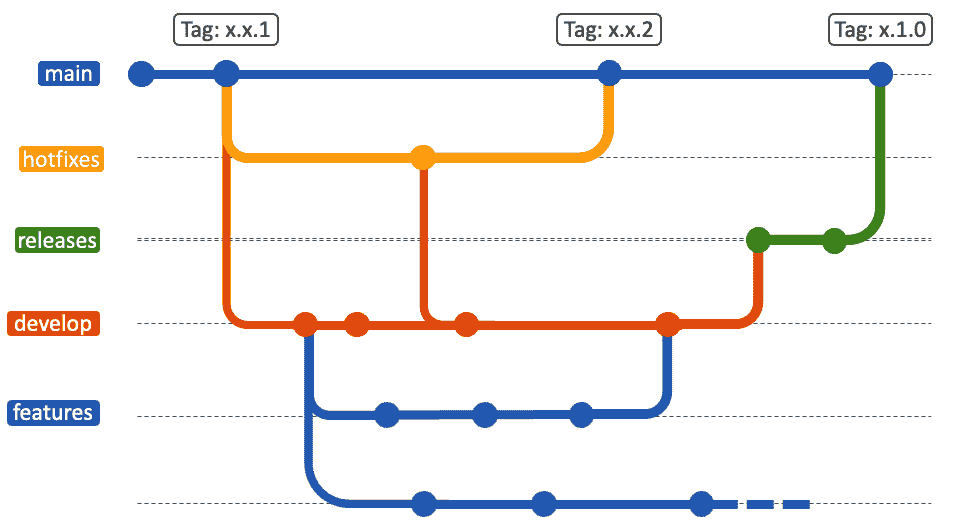

图 3.3 – Git Flow

在 Git Flow 中，开发工作从 `main` 分支创建一个 `develop` 分支开始。`develop` 分支作为功能集成的分支，是所有开发者的分支合并的地方。当你准备开发一个新功能或修复一个 bug 时，你会从 `develop` 分支创建一个 `feature` 分支。这个隔离的环境使你能够在不影响整个代码库的情况下进行工作。

随着功能的进展，增量更改会提交到这个 `feature` 分支。一旦功能完成并经过测试，它会被合并回 `develop` 分支。为了准备发布，会从 `develop` 分支创建一个 `release` 分支。这个分支用于进行最后的小错误修复或文档更新。一切准备就绪后，`release` 分支将合并到 `main` 并标记版本号。同时，它也应该被合并回 `develop`，以确保未来的发布也包含这些更改。对于紧急的修复，可以直接从主分支创建一个 `hotfix` 分支。

Git Flow 提供了一个严格的结构，对于需要平衡稳定性和新特性的多个开发者的大型项目非常有益。它确保了开发过程是分开的但平行进行，使项目历史更易于理解和回退。

下面是 Git Flow 的优缺点。

优点：

+   **结构化工作流程**：适用于有计划发布周期的项目

+   **隔离**：功能分支允许开发者在隔离的环境中工作，使得管理复杂功能变得更加容易

+   **热修复支持**：专用的热修复分支使得快速修复生产版本变得更加容易

缺点：

+   **复杂性**：对于较小的团队或项目，Git Flow 可能引入不必要的复杂性

+   **延迟集成**：由于功能分支生命周期较长，这可能导致合并冲突或在开发过程中发现的错误

总结来说，Git Flow 为更复杂的项目提供了一种模型，确保代码库保持有序，并且发布管理得当。它特别适用于大型团队，其中协调和发布规划至关重要。

### GitHub Flow

GitHub Flow 是一种简化的工作流程，鼓励持续交付实践。它只包括主线和短期存在的功能分支。其主要原则是分支、开发新功能、提交拉取请求、审核代码后再进行部署。拉取请求是 GitHub 的发明，是开发者通知团队成员他们已完成一个功能或修复的方式，随后该功能或修复会被审核和讨论，合并到代码库的主分支中。详细内容请参考 *第四章*。

GitHub Flow 很简单，但其背景不仅仅限于 Git。注意，图中包含了 GitHub 流程，如拉取请求和批准：

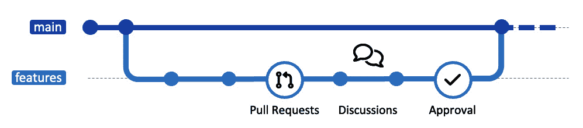

图 3.4 – GitHub Flow

它从创建一个新的描述性分支开始，该分支从默认的代码库分支派生，为修改提供一个安全的环境，不会影响主代码库。所有修改都提交并推送到这个远程分支。当准备好时，创建一个详细的拉取请求供团队审查，通常会与相关问题链接，以提供上下文。审查可能包括问题、建议或特定行的评论。针对反馈的后续提交会自动添加到拉取请求中。批准后，拉取请求会被合并到默认分支，将你的贡献并入主代码库。根据设置，可能需要解决合并冲突或满足批准标准。合并后，工作分支会被删除，但提交历史和讨论仍然可以访问，供日后参考。

本质上，GitHub Flow 促进了协作、透明性和增量开发，为团队项目提供了一种灵活而结构化的方式。

以下是 GitHub Flow 的优缺点。

优点：

+   **简洁性**：GitHub Flow 提供了一种简单的方式，只有一个主分支和短生命周期的特性分支，即使是新手也容易上手和管理。这种简洁性简化了开发过程，让开发者可以专注于提高生产力，而不是复杂的分支策略。

+   **更快的部署**：通过鼓励持续集成和交付，GitHub Flow 使团队能够更频繁地发布更新。这种快速的部署周期能让团队及时获得反馈并进行更快的迭代，减少从开发到市场的时间。

+   **增强的协作性**：GitHub Flow 中心的拉取请求机制促进了透明的代码审查和协作。它允许每个团队成员参与讨论，确保代码质量并共同拥有项目。

缺点：

+   **平台兼容性考虑**：采用 GitHub Flow 可增强协作与效率，特别是在 GitHub 上完全支持的情况下。然而，在与不同平台集成时，可能需要额外的工具或调整，以充分利用其潜力，确保在多种环境下无缝的项目管理。

+   **适应复杂项目的能力**：尽管 GitHub Flow 提供了一种简化、直接的方式，适合快速部署和持续交付，但在多团队协作、处理复杂项目时可能会遇到挑战。这种工作流注重简洁性和单一主分支开发，有时会限制对多个同时进行的开发任务或不同项目时间表的精细控制。例如，对于需要广泛集成测试或多个子团队之间协调的项目，可能需要额外的分支管理策略或更强大的发布规划机制。

## 分支命名规范 – 了解 Git 中命名分支的最佳实践

在 Git 和 DevOps 的领域中，命名是有效团队协作和代码管理的关键因素。当你在一堆分支中浏览时，一个清晰且具有描述性的名称能带来天壤之别，帮助你理解它们的具体功能、归属以及生命周期状态。建立一致的分支命名规范是有效分支策略的一个重要组成部分。

让我们深入探讨在 Git 中命名分支的最佳实践，旨在减少组织内的摩擦并加速发布。一个明确定义的命名规范使得工程师可以立刻理解一个分支的目的，无论它是为了某个功能、修复漏洞、热修复，还是一个实验性的尝试。在团队需要筛选数十个甚至数百个分支时，这种清晰度至关重要。命名规范为更透明、高效和精简的工作流程奠定了基础，使 DevOps 团队的每个人都能更轻松地进行协作。

### 分支命名规范和示例

以下是为每个主题命名的主要规范和示例。请注意，这些只是示例，每个团队的命名规范可能会有所不同。

这里有一些通用的指导原则：

+   使用破折号 (`-`)、下划线 (`_`) 或斜杠 (`/`) 来分隔单词。斜杠尤其常用于分隔热修复和功能等主题。

+   **小写名称**：虽然 Git 区分大小写，但坚持使用小写字母有助于保持一致性并避免混淆。

+   **简洁但富有描述性**：分支名称应该能够立刻让人理解该分支的内容，同时尽可能简洁。

以下是每个分支名称的示例：

+   `feature/`，后跟简短描述。一个例子是 `feature/user authentication`。

+   `bugfix/`，后跟简短描述。例如，`bugfix/login-error`。

+   `hotfix/`。例如，`hotfix/xyz-security-vulnerability`。

+   `release/` 作为前缀。一个例子是 `release/v1.2`。

### 上下文命名

尽管这些分类提供了一个很好的起点，你也可以考虑在分支名称中加入更多的上下文信息。例如，你可以在末尾附加问题编号（如`feature/123-user-authentication`），或者包括负责该分支的人员姓名（如`feature/teamxyz-authentication`）。

在本节中，我们认识到，一个稳固的分支策略是任何协作开发项目的支柱。我们已经探讨了分支策略在维持稳定的代码库同时促进持续集成和交付方面的重要性。无论是采纳 TBD 的小而频繁提交、Git Flow 的结构化角色，还是 GitHub Flow 的简易性，正确的策略对于团队的成功至关重要。

记住，这些约定应该与您更广泛的分支策略和政策保持一致，并根据您的团队规模、项目以及组织的独特约束和目标进行调整。一个精心选择的命名约定将有助于强化分支政策的有效性，帮助减少摩擦并加速发布。通过遵循明确的命名约定，您能够让团队更加高效地工作，并促进清晰和责任感的文化。

在接下来的章节中，您将学习如何将不同的开发线合并在一起，同时保持代码的完整性和历史记录。让我们带着信心继续前进，将分支的知识与 Git 合并的实际技能相结合。

# 如何在分支上应用更改

现在，您已经深入了解了 DevOps 中分支管理和工作流的复杂性，可能已经开始看到全局。您已理解您的个人提交如何为整体开发流做出贡献。接下来的步骤是*连接各个点*——更具体地说，考虑您编写的代码如何被合并到主干中。

代码库是一个充满活力的协作环境，记录了各种团队成员的贡献历史。在快速发展的环境中，我们可能会因为赶进度而急于提交或一次性推送大量的更改。然而，在合并时，必须考虑到这些更改如何有助于维持一致、可理解且稳定的共享环境。特别是在 DevOps 文化中，这一点尤为重要，因为目标不仅仅是快速部署，还包括无摩擦的协作。

在接下来的章节中，我们将探讨在 Git 中执行成功合并的各种策略和最佳实践，特别是针对 DevOps 环境中出现的需求和挑战。

## 合并与重基（Merging vs rebasing）

Git 提供了两种主要的技术来集成这些变化：合并（merging）和重基（rebasing）。虽然它们的最终目的是相同的——将不同的代码分支合并在一起——但它们在操作上有明显的差异。在深入了解实际命令之前，让我们先区分合并和重基。

### 合并（Merging）

合并会将源分支的内容与目标分支集成在一起。这个新提交将拥有两个父提交，保留被合并分支的独立历史。合并可能会显得繁琐，因为它保留了各个分支的历史，但在多人同时参与项目时，它在集成过程中提供了灵活性。主要有两种合并方式：**非快进合并**（non-fast-forward merge），这种方式会创建一个新的合并提交来记录合并过程；以及**快进合并**（fast-forward merge），这种方式则不创建合并提交。还有一个叫做 squash 的功能——它可以将多个提交压缩成一个提交进行合并。

在 GitHub 等平台上，默认设置是像下面的图示一样进行合并提交：

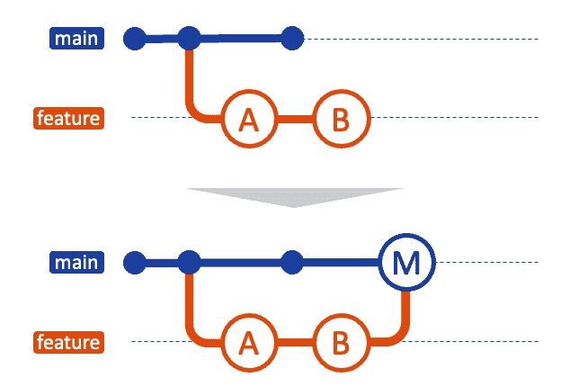

图 3.5 – 合并示例（非快进）

以下是合并的优缺点。

优点：

+   **历史保存**：合并保留了两个分支的历史，提供了详细的日志

+   **简单性**：通常初学者更容易理解

+   **分支隔离**：各个分支可以继续进行独立的更改，而不影响合并

缺点：

+   **复杂的日志**：虽然保留了历史记录，但合并可能导致日志历史复杂且杂乱

+   **缺乏线性**：项目历史变得非线性，难以浏览提交历史

### 变基

变基是将一系列提交移动或合并到新的基础提交的过程。它本质上是将功能分支中所做的更改重新播放到另一个分支之上。与合并不同，变基不会创建新的提交，而是重写提交历史，生成一个线性的提交顺序。变基的优点是其历史的线性。回顾历史时，很容易跟随主分支发生的变化，这对于修复 bug 非常有利。

一旦掌握变基，你可以为历史记录做出无噪音的贡献：

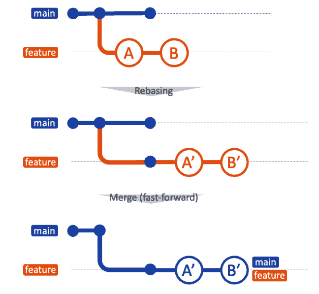

图 3.6 – 变基

以下是变基的优缺点。

优点：

+   **更清晰的历史**：变基会生成一个更清晰、线性的项目历史

+   **消除噪音**：它移除了在执行 git merge 时出现的不必要的合并提交

+   **更简便的调试**：有了更清晰的历史记录，调试变得更容易

缺点：

+   **共享分支风险**：变基可能会破坏历史，特别是在共享分支上，因为它会重写提交历史

+   **复杂性**：变基可能更难理解和正确执行

两种技术都有其优缺点。合并保留了原始分支历史，但可能导致日志复杂。变基提供了更清晰、更线性的项目历史，但存在风险，尤其是在共享分支上工作时。

## 探索 Git 中不同的合并方式

现在让我们深入实际步骤。我们将探索合并两个分支的过程，提供实践经验帮助你更好地理解每种方法。在本节中，我们将介绍一些最常用的分支合并方法，帮助你根据项目需求做出明智的决策。

### git merge --ff – 保持直线

现在让我们深入探讨实际应用。本节将聚焦于 Git 合并中的一个常见默认行为，称为 `--ff` 命令选项。我们将逐步讲解，确保你理解它的工作原理以及何时使用它。

快速前进合并是 Git 中集成分支的最简单方法之一。本质上，快速前进合并将目标分支的末端移动到源分支的最新提交。

使用快速前进合并时，在查看历史记录时，实际上什么也没有改变，如下图所示。这就是快速前进合并的好处。HEAD 持续移动，合并可以顺利进行：

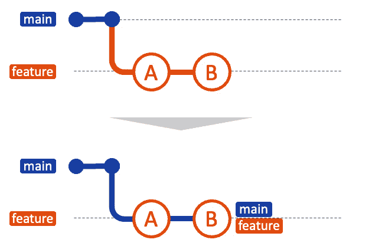

图 3.7 – 快速前进合并

在 Git 中，当基础（或目标）分支在特性分支创建后没有新的提交时，就可以进行快速前进合并。本质上，它消除了需要新提交来连接分支的需求，从而保持项目历史的线性。

#### 快速前进合并的实际步骤

在本指南的上下文中，假设你有一个 `main` 分支和一个 `add-description` 分支。`add-description` 分支是从 `main` 分支派生出来的，你打算将特性合并回 `master`：

```
# Initialize a new repository
$ mkdir try-fast-forward-merge
$ cd try-fast-forward-merge
$ git init
# Add and commit initial README.md to master
$ echo "# My Project" > README.md
$ git add README.md
$ git commit -m "Initial commit on master"
# Create and switch to a new branch 'add-description'
$ git checkout -b add-description
# Make changes to add a description, add and commit changes
$ echo "This project is an example of how to use Git." >> README.md
$ git add README.md
$ git commit -m "Add project description to README.md"
```

此时，你的仓库结构应该类似于下图：

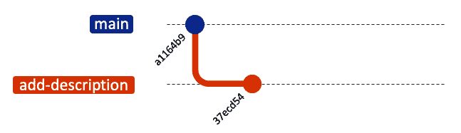

图 3.8 – git merge –ff (1)

现在，让我们通过切换回 `main` 分支来合并这些分支：

```
# Switch back to 'main' and perform a Fast-Forward merge
$ git checkout main
$ git merge add-description
# View the linear history
$ git log --graph --oneline
* 26d90bf (HEAD -> main, add-description) Add project description to README.md
* 37ecd54 Add project description to README.md
* a1164b9 Initial commit on master
```

现在，你的仓库历史应该如下所示：

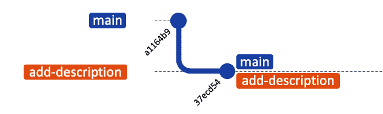

图 3.9 – git merge –ff (2)

#### 为什么在 DevOps 和团队协作中更倾向于使用快速前进合并

在后台，快速前进合并只是将 HEAD（指针）移动到最新的提交。而且，快速前进合并不会创建新的合并提交，保持 Git 历史的清晰和线性。这使得它成为一种简单且高效的操作。

快速前进合并在团队协作中通常更受欢迎，原因有几个：

+   **简洁性**：它们保持 Git 历史的线性，使得更容易跟踪

+   **透明性**：通过清晰的历史记录，更容易追踪变更、调试问题，并理解功能集成的顺序

+   **效率**：快速前进合并消除了额外合并提交的需求，从而简化了代码审查

然而，请记住，快速前进合并并非总是可行的。当你单独开发或进行简单开发时，可以使用这种方式，但在大多数开发中，通常有很多事情并行进行。当主分支和特性分支同时发生变更时，可能需要非快速前进合并，有时也称为三方合并。

### git merge --no-ff – 保留分支历史

非快进合并，通常通过`--no-ff`标志来调用，提供了一种与之前讨论的快进合并不同的合并策略。与快进合并不同，快进合并将目标分支的指针移动到源分支的最新提交，而非快进合并会生成一个新的合并提交。这个新的提交有两个父提交：一个来自源分支，一个来自目标分支。

非快进合并可以将上下文嵌入到合并提交中，以便以后回顾时查看为什么进行此合并。

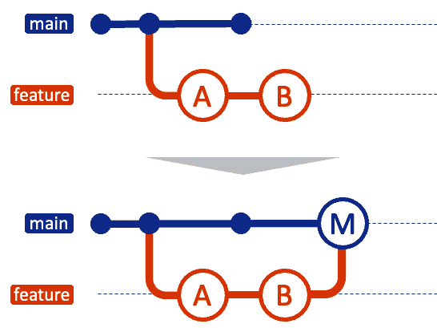

图 3.10 – 非快进合并

这种方法可以追踪特性分支合并到主分支的事实，保留了过去提交时的上下文。

#### 非快进合并的实际步骤

假设你正在处理`main`分支和`add-feature`分支。以下是执行非快进合并的步骤：

```
# Initialize a new repository
$ mkdir try-no-fast-forward-merge
$ cd try-no-fast-forward-merge
$ git init
# Add and commit initial README.md to master
$ echo "# My Project" > README.md
$ git add README.md
$ git commit -m "Initial commit on main"
# Create and switch to a new branch 'add-feature'
$ git checkout -b add-feature
# Make changes, add and commit them
$ echo "Adding a new feature..." >> README.md
$ git add README.md
$ git commit -m "Implement a new feature"
```

现在`commit`日志如*图 3.11*所示。到目前为止，你所做的与在`git merge --ff`部分所做的相同。

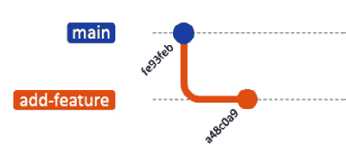

图 3.11 – git merge --no-ff (1)

然后，让我们切换回`main`并执行**非快进**合并：

```
$ git checkout main
$ git merge --no-ff add-feature
```

以下编辑消息将出现在终端中。编辑提交信息并保存：

```
git merge branch 'add-feature'
```

编辑完成后，我们来看看当前的日志：

```
# View the history
$ git log --graph --oneline
*   f58977f (HEAD -> main) Merge branch 'add-feature'
|\
| * a48c0a9 (add-feature) Implement new feature
|/
* fe93feb Initial commit on main
```

你的仓库历史将显示一个新的合并提交，指示`add-feature`分支是如何集成到`main`分支中的。


图 3.12 – git merge --no-ff (2)

#### 为什么在 DevOps 和团队协作中使用非快进合并？

非快进合并提供的好处在各种 DevOps 和团队协作场景中都可能非常有价值：

+   **上下文保留**：在合并过程中生成一个新的提交，不仅保留了代码，还保留了历史和上下文。这种清晰的集成记录使得理解不同分支的更改何时以及如何被合并变得更加容易。

+   `--no-ff`提供了无价的透明性，清晰地记录了谁在何时做了什么更改，以及为什么做这些更改。这在较大的团队和复杂项目中尤为重要，能够帮助理解贡献的流动。

虽然合并提交可以提供丰富的上下文和历史记录，但如果过度使用或文档记录不充分，它们也可能会使 Git 历史记录变得杂乱。团队在选择合并策略时必须谨慎，并努力保持清洁的共享仓库。

### git merge --squash – 压缩复杂性

`git merge --squash` 选项提供了一种不同的合并技术，它兼具清晰性和整洁性。虽然快进和非快进合并非常适合跟踪分支历史，但可能会有一些情况需要在合并之前将 `feature` 分支的更改浓缩为一个提交。这时，`git merge --squash` 就发挥了作用。

在压缩合并中，源（或功能）分支上的所有更改都会合并为目标（或主）分支上的一个单一提交。此操作有效地将功能分支的历史浓缩为一个提交，同时进行合并，提供了一个干净、易于跟随的 Git 历史。这使得更改处于未提交状态，允许你在最终提交之前修改差异。

尽管团队致力于保持干净的共享代码库，个别开发分支通常会因为各种尝试和错误而变得杂乱无章。压缩合并有助于通过防止这些杂乱的实验性日志进入生产历史，从而保持主代码库的整洁。

如下图所示，压缩合并在某些方面是最干净的合并方式，并且有很多好处。然而，请记住，它是一种合并更改的方式，丢失了之前的更改历史以及其他公司的提交历史。稍后将在本节中提到这一点。

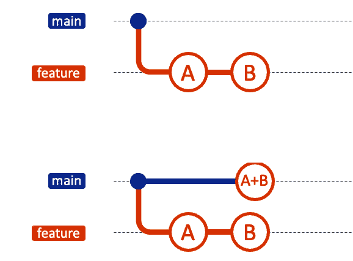

图 3.13 – 压缩合并

#### 压缩合并的实际步骤

假设你有一个`main`分支和一个`add-multiple-features`分支。要执行压缩合并，请执行以下操作：

```
# Initialize a new repository
$ mkdir try-squash-merge
$ cd try-squash-merge
$ git init
# Add and commit initial README.md to main
$ echo "# My Project" > README.md
$ git add README.md
$ git commit -m "Initial commit on main"
# Create and switch to a new branch 'add-multiple-files
$ git checkout -b add-basic-files
# Make some changes, add and commit them
$ echo "# HOW TO CONTRIBUTE" >> CONTRIBUTING.md
$ git add CONTRIBUTING.md
$ git commit -m "Add CONTRIBUTING.md"
$ echo "# LICENSE" >> LICENSE.txt
$ git add LICENSE.txt
$ git commit -m "Add LICENSE.txt"
```

现在，分支应该像以下图所示：

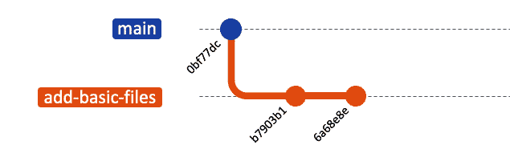

图 3.14 – git merge --squash (1)

让我们切换回主线并执行一个 `squash` 合并：

```
# Switch back to 'main' and perform a squash merge
$ git checkout main
$ git merge --squash add-basic-files
```

然后，这些提交将被压缩并成为一个单一的提交：

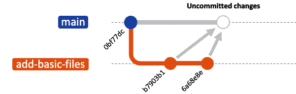

图 3.15 – git merge --squash (2)

然后，Git 会将未提交的更改添加到 `main` 分支。此时是完成合并过程的时候了。要完成合并，你需要提交这些未提交的更改：

```
$ git add .
$ git commit -m "Add repository standard docs"
$ git log --graph --oneline
* 6eb6df3 (HEAD -> main) Add repository standard docs
* ffc2ed5 Add CONTRIBUTING.md
* 2c5ad11 Initial commit on main
```

这将把 `add-multiple-features` 分支的所有更改合并为 `main` 分支上的一个新提交：

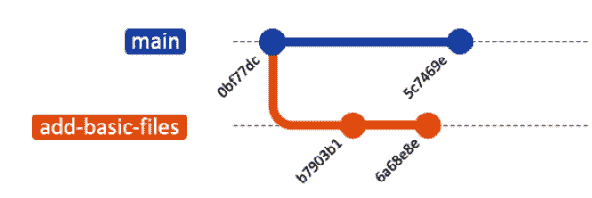

图 3.16 – git merge --squash (3)

#### 为什么在 DevOps 和团队协作中使用压缩合并？

压缩合并为 DevOps 和协作开发提供了一套独特的好处：

+   **原子性更改**：压缩合并会创建一个包含所有功能更改的单一提交，这样在需要回滚时会更加方便。

+   **减少噪音**：压缩合并消除了来自主分支的许多小的、可能是实验性的提交的杂乱无章。这使得日志历史更加清晰，便于阅读和理解。

+   **战略性提交信息**：squash 使你能够创建一条综合性的提交信息，比一系列小的提交信息更有效地概括功能的目的和影响。

然而，值得注意的是，虽然 squash 合并可以简化历史，但它也可能会使历史变得模糊。来自功能分支的单独提交会在主分支中丢失，这使得理解每个单独更改的开发背景变得困难。在使用这种合并策略时，要谨慎并了解它对开发历史的影响。

#### squash 合并的伦理问题与陷阱

squash 其他人的提交有时可能会带来问题。

`git merge --squash` 命令是一个强大的工具，可以将多个提交合并成一个。虽然此功能能保持提交历史的清晰和可管理性，但当用于其他人提交时，它会引发伦理和实际问题。

在团队协作中，了解以下问题非常重要：

+   **作者归属错误**：默认情况下，执行 squash 的人将成为合并提交的作者，从而有效地抹去原始贡献者的历史。这可能会使团队成员感到沮丧，因为他们的贡献没有得到认可。

+   **历史篡改**：该命令会改变提交历史，这可能会被认为是不尊重原作者工作的行为。

如果保持单独提交的完整性很重要，考虑使用标准合并。这可能会导致历史更为复杂，但它能保留所有贡献者的工作和认可。

此外，`git rebase` 命令提供了对提交历史的更多控制，这对于清理或重新安排自己的工作而不影响他人非常有用。

接下来让我们探索这个命令。

### git rebase – 以便清晰的方式重写

Rebase 是 Git 中另一种强大的技巧，它与合并有显著的不同。合并和 rebase 之间的主要区别在于它们整合更改的方式。`git merge` 将一个分支的更改合并到另一个分支，而 `git rebase` 则是将一系列提交移动或合并到新的基础提交上。

在团队协作的背景下，rebase 用于保持线性的项目历史，这可以简化调试并使代码审查变得更容易。然而，rebase 也有其复杂性和陷阱，通常最好在特定情况下使用。

在深入实践教程之前，让我们先大致了解一下 `git rebase` 的工作原理。rebase 的主要用途是将 `feature` 分支的更改放到另一个分支的顶部。

例如，考虑以下分支：

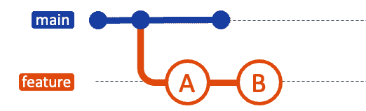

图 3.17 – Rebase (1)

在将 `feature` 分支 rebase 到 `main` 后，你的分支可能看起来像这样：

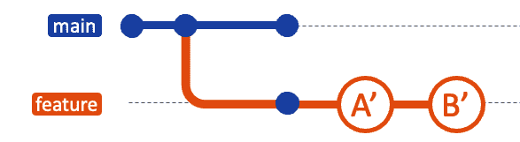

图 3.18 – Rebase (2)

最后，你可以合并回主分支，此时可以进行快速合并：

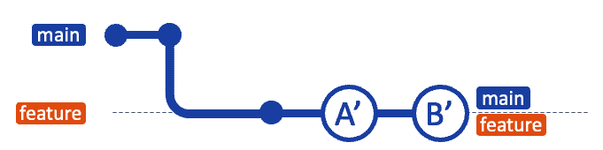

图 3.19 – Rebasing (3)

#### git rebase 的实际步骤

让我们以一个`main`分支和`new-feature`分支为例，来看一下如何进行 rebase：

```
# Initialize a new repository
$ mkdir try-git-rebase
$ cd try-git-rebase
$ git init
# Add and commit initial README.md to main
$ echo "# My Rebase Project" > README.md
$ git add README.md
$ git commit -m "Initial commit on main"
# Create and switch to a new branch 'new-feature'
$ git checkout -b new-feature
# Make some changes, add and commit them
$ echo "This is a new feature." >> NewFeature.md
$ git add NewFeature.md
$ git commit -m "Add new feature"
```

到此为止，你的分支历史可能会像这样：

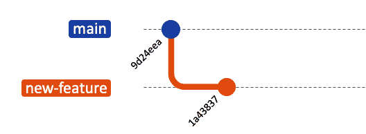

图 3.20 – git rebase (1)

现在，假设在你工作在`new-feature`时，`main`上添加了新的提交：

```
# Switch back to 'main' and add new commits
$ git checkout main
$ echo "Updates to the project." >> Updates.md
$ git add Updates.md
$ git commit -m "Update main"
```

你的提交图现在已经分叉：

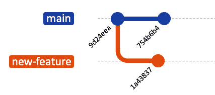

图 3.21 – git rebase (2)

现在，将`new-feature`分支 rebase 到`main`分支：

```
# Switch to 'new-feature' and rebase onto main
git checkout new-feature
git rebase main
```

让我们看看现在的情况：

```
$ git log --graph --online
* 43ea59e (HEAD -> new-feature) Add new feature
* 16e1878 (main) Update main
* 3021494 Initial commit on main
```

之后，你的分支将如下所示：

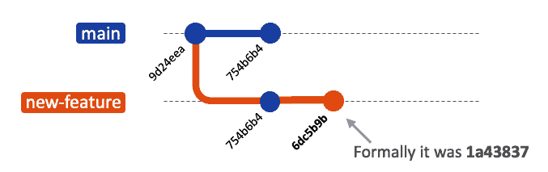

图 3.22 – git rebase (3)

现在是时候合并并完成`git` `rebase`过程了：

```
# Switch to 'main' and perform fast-forward-merge
$ git checkout main
$ git merge new-feature
```

当进行快进合并时，`main`和`new-feature`分支的 HEAD 将是相应的提交，如下所示：

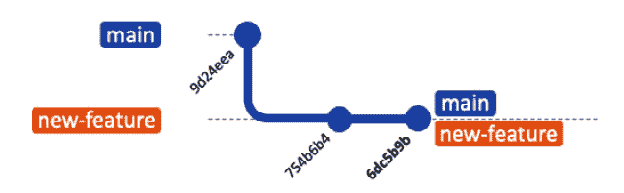

图 3.23 – git rebase (4)

#### 为什么在 DevOps 和团队协作中，rebase 是强大的

在 DevOps 文化中，rebase 的主要优势是它比合并产生更干净的项目历史。更清晰的历史记录更容易调试，更易理解，并且对于后期加入项目的开发者来说更具逻辑性。

这里有一些好处：

+   **线性历史**：比 git merge 创建的非线性历史更容易理解。

+   **简化调试**：历史记录更干净后，追踪某个特定 bug 何时被引入变得更容易。

+   **代码整洁**：rebase 鼓励你合并修复提交或拆分较大的提交，使得你的修改比其他开发者的更容易理解。

#### git rebase 的注意事项和陷阱

有一些黄金规则需要遵循：*不要 rebase 公共（团队）分支*。其中一条基本规则是避免对公共分支进行 rebase。rebase 对于清理功能分支是一个非常好的工具，但在公共分支上使用时，它可能会变成灾难。

使用`git rebase`时需要考虑的事项：

+   **团队协作中的冲突**：假设你已经 rebase 了一个公共分支并推送了更改。其他已经拉取了该分支旧版本的开发者，现在会有一个分叉的历史。当他们尝试推送他们的更改时，Git 会拒绝推送，迫使他们合并历史。这会增加额外的工作量并增加合并冲突的可能性。

+   **复杂的合并**：在公共分支已经 rebase 并且历史被修改后，将其与其他分支合并可能会变得非常具有挑战性。因为 Git 使用提交历史来确定如何整合更改，修改历史可能会使合并变得比需要的复杂得多。

+   **上下文丢失**：Rebase 可能会将提交合并在一起或更改它们的顺序，这可能导致这些更改的上下文丢失。这会使调试变得更加困难，并且可能使理解导致当前代码库的开发过程变得复杂。

Rebase 可能会很复杂且有风险，特别是对于缺乏经验的开发者来说。在最坏的情况下，你可能需要解决许多冲突，如果不小心处理，可能会导致错误和 bug。

通过理解并使用 `git merge` 和 `git rebase`，你可以处理几乎所有需要合并不同开发线的情况。每个命令在 Git 中都有其适用的场合，理解何时使用哪个命令是保持代码库干净且易于理解的关键——这在 DevOps 的世界中非常宝贵。

### git cherry-pick – 选择特定的提交

Git 命令中最灵活的工具之一就是 `git cherry-pick` 命令。虽然之前的合并方法主要用于集成整个分支，`git cherry-pick` 允许你选择一个分支中的特定提交并将其应用到另一个分支。此方法在你只需要应用几个特定更改而不是将另一个分支的所有修改都带入时非常有用。

假设你有两个分支，`main` 和 `feature`。你意识到 `feature` 分支中的一个或两个提交应该被移动到 `main`，但你还不准备合并整个分支。`git cherry-pick` 命令正好允许你做到这一点：

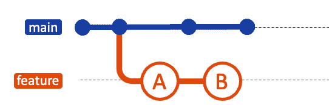

图 3.24 – Cherry-picking（1）

你可以将 `feature` 分支中某个特定提交的更改 cherry-pick 到 `main` 分支上。此操作将在 `main` 分支上创建一个新的提交：

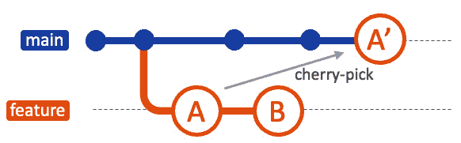

图 3.25 – Cherry-picking（2）

#### Cherry-picking 的实际步骤

现在让我们来看看 cherry-pick 更改并将它们合并到分支中的实际步骤。每个提交都会向每个分支添加一个文件。我们将这些提交中的一部分合并到 `main`。首先，我们添加这些文件：

```
# Initialize a new repository
$ mkdir try-cherry-pick
$ cd try-cherry-pick
$ git init
# Add and commit initial README.md to main
$ echo "# My Project" > README.md
$ git add README.md
$ git commit -m "Initial commit"
# Create and switch to a new branch 'add-base-documents'
$ git checkout -b add-base-documents
# Make changes and commit
# Add CONTRIBUTING.md
$ echo "# CONTRIBUTING" >> CONTRIBUTING.md
$ git add CONTRIBUTING.md
$ git commit -m "Add CONTRIBUTING.md"
# Add LICENSE.txt
$ echo "LICENSE" >> LICENSE.txt
$ git add LICENSE.txt
$ git commit -m "Add LICENSE.txt"
# Take a look at the 'add-base-documents' branch log
$ git log add-base-documents --graph --oneline
* 02ee2b4 (HEAD -> add-base-documents) Add LICENSE.txt
* a80e8ad Add CONTRIBUTING.md
* cfb060a (main) Initial commit
```

现在这些分支看起来像下图所示：


图 3.26 – git cherry-pick（1）

现在，让我们只选择 `a80e8ad` 提交并将其放到 `main` 分支上。请在你的环境中替换哈希值：

```
# Now switch back to the 'main' branch and cherry-pick the commit
$ git checkout main
$ git cherry-pick a80e8ad
[main 9a36741] Add CONTRIBUTING.md
Date: Sun Oct 29 16:04:56 2023 +0900
1 file changed, 1 insertion(+)
create mode 100644 CONTRIBUTING.md
# Let's check the 'main' branch log
$ git log --graph --oneline
* 9a36741 (HEAD -> main) Add CONTRIBUTING.md
* cfb060a Initial commit
```

在你成功 cherry-pick 该提交后，一个新的提交将被添加到你当前的分支（在此示例中为 `main`），并且该提交将包含 cherry-pick 提交中的更改。请注意，新的提交包含相同的更改，但有不同的提交哈希值：

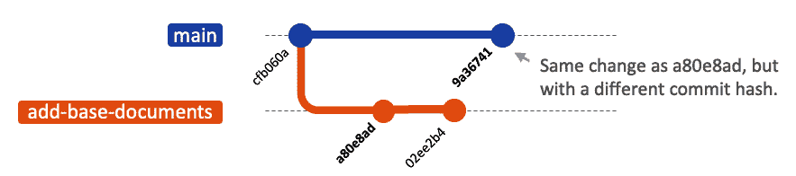

图 3.27 – git cherry-pick（2）

#### 为什么 cherry-pick 在 DevOps 和团队协作中很有用

团队开发需要灵活的开发方式。`git cherry-pick` 是一个在协作编码环境中非常有用的命令，允许团队选择性地整合变更并保持代码的完整性。

让我们看看 `cherry-pick` 可以提供什么价值：

+   **选择性集成**：它允许特定的 bug 修复或功能被移入生产环境，而不需要将所有开发分支的变更一起移动。

+   **轻松回退**：如果出现问题，你只需要回退一个小的变更，而不是整个分支合并。

+   **清理历史**：通过仅包含相关的提交，保持 Git 历史的整洁，使其更易于阅读和理解。

`git cherry-pick` 提供了高精度的分支间变更集成方式。它允许你精确选择要包含的提交，提供对项目历史的细粒度控制。这使得它成为任何 DevOps 工程师在追求灵活且高效的版本控制工作流时的宝贵工具。

在探索了 Git 中的各种合并策略之后，你可能会问自己：“*我应该使用哪种方法？*” 答案就像大多数工程问题一样，“*这取决于情况。*” 有多个因素在决定最适合你需求的 Git 合并策略时起作用。此外，值得注意的是，你不必坚持使用单一方法；你可以根据情况调整你的方法。理解这些因素可以帮助你做出明智的决定。

让我们检查以下因素，看看你应该如何选择：

+   **项目复杂性**：具有多个贡献者和并行开发线的复杂项目可能需要更一致的合并方式，以减少冲突。像 GitHub 这样的平台允许你为项目设置合并策略。

+   `git merge` 可以减少错误发生的几率。然而，如果大多数团队成员都有经验，你可能会想利用 `rebase` 的优势，以保持更清晰的 Git 历史，并促进更顺畅的沟通。

+   **Git 历史的期望清晰度**：如果你非常重视清晰、线性的 Git 历史，那么选择快进合并或 rebase 可能是最好的方法。另一方面，如果你更看重项目开发过程的详细记录，那么非快进合并会更适合，能更好地保留变更的全面记录。

随着你前进，让这一节中的知识帮助你选择适合你项目的合并方法。通过实际场景练习来增强信心。记住，在 Git 中没有“一刀切”的答案——灵活性和适应性是你最好的盟友。

# 解决冲突

在一个协作开发环境中，冲突不仅仅是可能的——它们是不可避免的。当多个开发者在相同的代码库上工作，甚至是在相同的文件上进行修改时，很有可能会发生变化重叠，导致冲突。处理和解决这些冲突对于保持顺畅和高效的 DevOps 工作流程至关重要。

## 为什么会发生冲突

冲突通常发生在两个分支对文件的同一行或部分进行更改，然后尝试进行合并时。尽管 Git 非常强大，但它无法判断哪个更改应该优先。高效解决这些冲突的关键是理解冲突发生的原因，并尽可能主动预防它们。

## 如何解决 Git 中的合并冲突

让我们从基础开始。Git 中的冲突解决通常需要手动干预。以下是如何进行处理的步骤：

1.  识别冲突。使用 `git status` 查看哪些文件发生了冲突。

1.  检查发生冲突的文件。打开文件并查找冲突标记（`<<<<<<<`、`=======` 和 `>>>>>>>`）。这些标记区分了来自不同分支的更改：

    ```
    <<<<<<< HEAD
    Someone's change is here
    =======
    Your change is here
    >>>>>>> branch-you-want-to-merge
    ```

1.  解决冲突。选择保留哪些更改。你可以保留某个分支的更改，混合两者的更改，甚至添加全新的内容。

1.  提交已解决的文件。解决冲突后，需要将文件添加到暂存区并提交。

## 如何解决合并冲突

在协作开发环境中，合并冲突是不可避免的。关键在于知道如何高效地解决它们。根据冲突的性质，你可以遵循几种不同的解决模式。

### 当有一个明确的版本需要保留时

如果你已经合并了两个分支，并希望完全接受其中一个版本而忽略另一个版本，可以选择使用 `git checkout --ours` 或 `git checkout --theirs`：

+   `checkout --ours`：当发生合并冲突时，使用此命令保留你分支的文件：

    ```
    checkout --theirs: This command will retain the files from the merged branch, discarding the ones in your current branch:

    ```

    $ git checkout --theirs -- <file-path>

    ```

    ```

在运行这些命令之一后，你需要将更新后的文件添加到暂存区并提交。

### 当你需要评估两个版本时

如果不清楚应该优先采用哪个版本，则需要更细致的处理方法。

+   **审查代码**：在文本编辑器中打开冲突文件，手动检查冲突的代码行。决定保留哪些部分并相应地编辑文件。

+   **沟通**：如果有必要，与你的团队成员协商，决定保留哪些更改。可以通过面对面的讨论、虚拟会议或代码审查工具进行此操作。

+   **运行测试**：一旦你手动解决了冲突，运行测试是非常重要的，以确保代码库仍然稳定。

+   **提交更改**：在成功测试后，将已解决的文件暂存并提交到你的代码库。

通过小心处理合并冲突，你可以帮助保持干净的代码库，并促进团队内部更好的沟通。

## 支持合并活动的有用命令

合并是一个充满挑战的活动。拥有合适的工具和命令可以让这个过程更加顺利，减少出错的机会。在这一节中，我们将介绍一些有用的 Git 命令，帮助你有效管理合并。

### git diff – 查找差异

`git diff` 命令是一个用于识别两组代码差异的关键工具。它帮助你查看两者之间究竟发生了什么更改，使得在冲突出现时更容易解决问题。

你可以通过以下方式将当前分支与目标分支进行比较：

```
$ git diff feature-branch..main
```

该命令逐行显示 `feature-branch` 和 `main` 之间的更改对比。你也可以专注于特定的文件，甚至是特定的代码行，这使它成为一个灵活的工具，可以在不同的粒度下发现差异。

尽管 Git 没有内置 `git merge` 的 dry-run 选项，你可以模拟一次合并以查看会发生什么：

```
$ git merge --no-commit --no-ff feature-branch
$ git diff --cached
```

该命令序列尝试将 `develop` 的更改合并到当前分支，但会在提交之前停止。你可以使用 `git diff --cached` 查看已暂存的更改。如果合并结果不符合预期，你可以简单地中止：

```
$ git merge --abort
```

### git mergetool – 简化的工具指南，用于可视化冲突解决

当你遇到一个难以手动解决的合并冲突，或者你更喜欢图形界面时，Git 内置的 `git mergetool` 可以帮助你解决问题。

可以设置以下项：

+   `kdiff3`，`meld`，和 `vimdiff`。

+   **全局配置**：使用以下命令将你选择的工具设置为所有 Git 仓库的默认工具：

    ```
    # For example, if you chose vimdiff, you would run:
    $ git config --global merge.tool vimdiff
    $ git mergetool
    ```

    该命令打开你选择的图形工具，并并排显示冲突的更改。这个界面简化了理解冲突的过程，并帮助你决定保留哪些更改。这个设置允许你指定不仅是命令行工具，还可以指定像 Visual Studio Code 这样的现代工具，以图形化方式解决合并。

通过遵循这些简单的步骤，你可以以更直观的方式解决复杂的合并冲突，使这个过程对于所有技能水平的团队成员都变得更加可访问。

总的来说，冲突解决是任何工程师必备的技能。尽管冲突可能复杂且具有挑战性，但知道如何高效地解决冲突，可以让你的开发工作流程更加顺畅。这不仅仅是关于解决冲突本身，而是理解导致冲突的根本问题。这种细致的方法对促进团队之间更好的沟通和合作至关重要。

随着团队开发的推进，项目变得越来越复杂。冲突是不可避免的。冲突是一个很好的机会，帮助团队提升协作能力。你不应该害怕冲突，应该学会如何通过逐一解决它们来帮助团队进行更好的沟通。

# 精通更好的协作

到目前为止，我们已经讨论了如何在 Git 中处理合并并解决冲突。我们已经看到，你可以使用 `git merge --squash` 清理本地更改，或者使用 `git rebase` 调整提交历史。虽然保持工作区整洁是很好的，但理想的情况是保持代码库的干净，尤其是在推送到共享环境时。接下来，让我们讨论一下可以帮助你成为一个优秀协作者的命令，无论你是个人贡献者还是管理主共享分支的团队领导。

## 回滚时间

在任何协作项目中，错误是不可避免的。即使不是错误，很多时候你也会想要回退并回到过去。无论是一个破坏构建的错误提交，还是一个未能按预期实现的功能，回滚更改的能力至关重要。两个不可或缺的命令就是 `git reset` 和 `git revert`。

### git reset – 回滚更改

`git reset` 命令允许你*回退* Git 历史，本质上是将 HEAD 和可选的工作目录移动到某个特定的提交。这是一个非常强大的功能，但需要谨慎使用。有几种不同的方式可以使用 `git reset`。了解它们，以便你能有效地组织你的环境：

+   **软重置**：这会保持工作目录和索引不变，但会移动 HEAD。此命令用于当你只想撤销提交，而不影响索引工作树时：

    ```
    git reset --soft command:
    ```

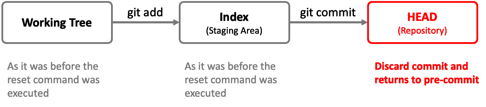

图 3.28 – git reset --soft

+   `git add` 和 `git commit`。文件更改将保持不变；这是在 `git reset` 未指定任何选项时的默认行为：

    ```
    git reset --mixed command:
    ```

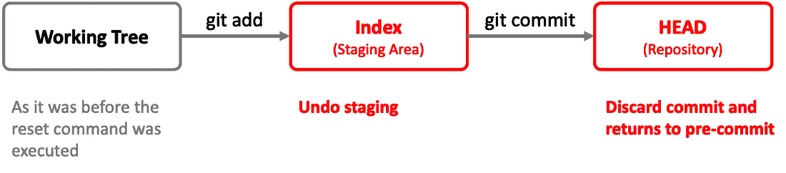

图 3.29 – git reset --mixed

+   **硬重置**：这会重置索引和工作目录，永久删除未提交的更改。它会删除所有提交、更改和文件，因此所有更改将不再保留。如果你想删除所有内容，这就是方法：

    ```
    git reset --hard command:
    ```

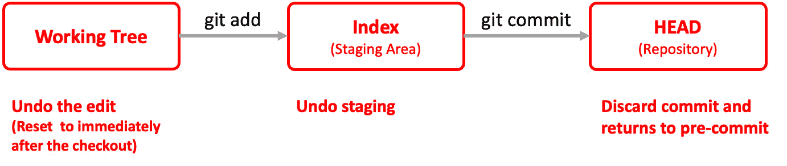

图 3.30 – git reset --hard

### git revert – 在不重写历史的情况下撤销更改

与 `git reset` 不同，后者会更改提交历史，`git revert` 创建一个新的提交来撤销之前提交所做的更改。这在共享环境中非常有用，因为重写历史是不被鼓励的。

`git revert` 会创建一个相反的提交，如下所示：

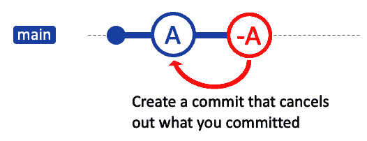

图 3.31 – git-revert 创建一个提交来取消该提交

此命令将撤销指定哈希的提交所做的更改，并创建一个新的提交来记录此操作：

```
$ git revert <commit_hash>
```

以下是可以使用 `git revert` 的情况：

+   `git revert` 不会重写历史，因此在共享分支上使用是安全的

+   `git revert` 是一种干净的删除方法

+   `git revert` 操作作为回滚策略的一部分

让我们了解一些额外的高级`git revert`选项：

+   **回退多个提交**：你可以通过指定提交范围来回退一系列提交：

    ```
    -n or --no-commit flags:

    ```

    git revert -n <commit_hash>

    ```

    This will apply the revert changes to your working directory but will not commit them. You can then make further changes and commit manually.
    ```

注意

注意插入符号（`^`）。这意味着回退范围内的最旧提交也会被包括在内。

掌握`git revert`对任何开发者或 DevOps 专业人员来说都至关重要。它提供了一种安全的机制来撤销更改，促进更好的协作和更可靠的代码。

### git checkout – 不只是切换分支

在之前的讨论中，我们主要在切换分支的上下文中提到了`git checkout`命令。虽然这是它的主要功能之一，但理解`git checkout`是一个多用途工具也至关重要，它不仅可以操作分支，还能在单个文件或目录的粒度上进行操作。在本节中，让我们扩展对`git checkout`的理解，看看它如何在高效协作和错误修正中发挥重要作用。

这里是切换分支的基本命令回顾：

```
$ git checkout <branch_name>
```

那如果你只需要恢复一个文件到先前的状态呢？`git checkout`同样能帮你解决。如果你对一个文件进行了更改，但还没有提交，并且决定想要撤销这些更改，你可以这样操作：

```
$ git checkout -- <file_name>
```

这将丢弃你工作目录中的更改，并将文件恢复到最后一次提交的状态。有时候，你可能只想将另一个分支的部分更改应用到当前工作分支。`git checkout`也能做到这一点：

```
$ git checkout <branch_name> -- <file_name>
```

这个命令会将另一个分支中的特定文件检出到你当前的工作分支，让你根据需要混合和匹配代码。

它在团队协作中提供了多种灵活性：

+   **快速回滚**：如果生产环境出现问题，你可以从稳定的分支快速检出特定的文件。

+   **选择性功能测试**：在合并新功能之前，你可以只检出与该功能相关的文件进行测试。

+   **轻松错误修正**：错误是常有的事。能够单独检出文件使得更正错误变得更加容易，而不会影响到代码库中的其他部分。

注意

在文件上使用`git checkout`将会丢弃更改。确保这是你打算执行的操作。如果你正在进行实验，建议经常提交更改。这样，如果需要，你可以轻松回退到某个特定的提交。

理解`git checkout`的完整功能可以显著提升你的工作流程和协作效率。无论你是单独工作还是作为团队的一员，能够操作的不仅仅是分支，还有单个文件，这赋予了你更高的控制力和适应性。

## 组织你的工作环境

在团队开发中，你的个人工作区就像是一个实验室——一个可以自由创新、调试和测试的空间，而不会影响到整个项目。有效管理这个空间至关重要，Git 提供了一组强大的命令，帮助你高效管理。在本节中，我们将探索三种基本的 Git 命令——`git clean`、`git stash`和`.gitignore`——这些命令可以轻松保持你的工作区干净。

### git clean – 清爽的开始

`git clean`命令提供了一种快速清理工作目录中未跟踪文件和目录的方法，基本上提供了一个全新的起点。在执行合并之前或之后，或者当你想清除不需要版本控制的杂物时，这个命令特别有用。

```
# Remove untracked files and directories
$ git clean -fd
```

### git stash – 轻松暂停和恢复工作

`git stash`是一个非常有价值的工具，用于暂时保存你已做的更改，而这些更改还没有准备好提交。

作为开发人员，多任务处理往往是日常工作的一部分。无论是被紧急的 bug 修复打断，还是需要暂时切换上下文，`git stash`都能派上用场。此命令让你保存当前的更改，而无需进行正式提交，从而让你有自由切换任务，之后可以轻松回到之前的工作状态：

```
# Stash changes with a description
$ git stash save "WIP: New Feature"
# Reapply the stashed changes
$ git stash apply stash@{0}
```

此外，这里列出了一些常用的`git stash`命令，这些命令可以显著提升你的工作区管理：

+   `git stash`：此命令将你的更改保存到 stash，使你的工作目录保持干净。未跟踪的文件不会被 stash。

+   `git stash save "Your Comment"`：此命令将你的更改保存到 stash，并允许你附加评论。这对于稍后使用`git stash list`识别 stash 非常有用。

+   `git stash list`：此命令显示你所有已保存的更改的列表。如果你使用了`git stash save`，你将在此看到你的评论，这使得识别每个 stash 变得更加容易。

+   `git stash apply`：此命令将最近保存的更改恢复到你的工作目录。stash 仍会保留在`git stash list`中。

+   `git stash apply [stash@{n}]`：此命令根据索引号恢复特定的 stash，你可以通过`git stash list`找到该索引号。

+   `git stash drop`：此命令删除 stash 列表中的特定 stash。

+   `git stash drop [stash@{n}]`：此命令根据索引号删除特定的 stash。

+   `git stash clear`：此命令删除所有 stash，清空你的`stash list`。

### .gitignore – 自定义共享内容

在处理复杂项目时，你的本地环境可能会生成日志文件或包含个人配置设置——这些内容你不希望与团队共享。`.gitignore`文件允许你指定在`git add`期间应该忽略哪些文件和文件夹，从而确保它们只存在于你的本地环境中。

这是一个`.gitignore`文件的示例：

```
# Ignore all log files
*.log
# Ignore personal config files
config/personal/
```

## 谁做了什么？帮助你调试的绝妙方法

Git 有几种典型的方法来分析过去的情况。`git blame` 和 `git bisect` 是非常实用的工具，记住它们很重要，因为它们易于使用，可以帮助追溯并调试是谁做了什么修改。

### git blame – 谁做了什么？

在共享代码库中工作时，可能会有需要了解特定代码行历史的情况。`git blame` 命令提供了一个文件的分解，注释每一行，显示最后修改它的人员以及该行属于哪个提交。这有助于识别负责特定更改的人员，这对调试、重构或简单理解某段代码存在的原因非常有用。

```
$ git blame file.txt
```

`-L` 选项允许你指定输出的行数：

```
$ git blame -L 5,10 README.md
$ git blame -L 5,+5 README.md
```

必须强调的是，`git blame` 的目的是不是为了将错误或可疑决策归咎于个人。在任何协作环境中——尤其是在团队合作至关重要的 DevOps 中——必须记住，错误是集体的责任。每个人都可能犯错；重要的是团队如何合作解决这些错误。从心理安全的角度来看，使用 `git blame` 应该视为增强团队沟通和识别改进领域的一种方式，而不是用来归咎他人的机制。

### git bisect – 在提交范围内高效地寻找 bug

调试常常感觉像是在大海捞针，尤其是在拥有大量提交历史的大型代码库中。在 DevOps 领域，快速部署周期是常态，而在无数变更中引入的 bug 可能会造成严重后果。此时，`git bisect` 就发挥了作用，成为定位引入 bug 的特定提交的强大工具。

`git bisect` 命令通过在提交历史中执行二分查找来找到引入 bug 的提交。该过程从标记一个已知良好的提交和一个已知有问题的提交开始：

```
$ git bisect start
$ git bisect bad   # If the current version is bad
$ git bisect good <Last known good version commit hash>
```

Git 然后会自动检查良好提交和有问题提交之间的一个中间提交。你需要测试这个提交，然后将其标记为良好或有问题：

```
$ git bisect good # or
$ git bisect bad
```

Git 将继续这一过程，逐步缩小提交范围，直到识别出罪魁祸首。一旦找到有问题的提交，就能更容易地理解出了什么问题并制定修复方案：

```
# Exit bisect mode and return to your branch
$ git bisect reset
```

在 DevOps 中，识别和解决问题的速度对保持卓越的运营至关重要，`git bisect` 成为了一种无价的工具。它能够很好地融入 DevOps 工具链，支持自动化测试，并促进更快速的回滚和修补。通过高效地定位错误，它增强了团队合作解决方案的能力，强调了快速反馈和持续改进这两个 DevOps 的基本原则。

## 版本控制的卓越性

在 DevOps 生态系统中，**CI/CD**使一切都变得增量化。然而，拥有具体版本的软件作为里程碑仍然至关重要。这些版本不仅是时间的标记；它们表明了代码的稳定性、新功能以及整体健康状态。它们还促进了更顺畅的回滚，并使隔离问题变得更加容易。

### 什么是语义化版本控制

语义化版本控制是一种版本控制方案，旨在传达每次新发布所涉及的具体变化含义。其格式由三个数字组成，数字之间用点分隔（例如：2.4.4）。每个数字具有特定的意义，与向后兼容性和引入的更改类型相关。

### Git 中的标记

在 DevOps 环境中，标记成为了有效版本控制的基石。通过标记代码库历史中的特定点，您可以创建作为稳定发布点或重要里程碑的锚点。这些标记版本为您的 CI/CD 流水线奠定了基础，确保了持续一致和可靠的部署。

为了使标签更具信息性，可以考虑为其添加有用的元数据和上下文：

```
$ git tag -a v1.0 -m "Initial stable release"
```

您标记的提交通常应该代表稳定的发布点或关键的里程碑。这些是所有自动化测试通过、功能完成并经过同行评审的提交。从本质上讲，它们是您的*生产就绪*提交。

要标记特定的提交，可以使用以下命令：

```
$ git tag v2.4.4 32de0b2
```

Git 标记和语义化版本控制不仅是技术操作，还是战略性措施。它们确保每个人都能理解当前部署的内容以及它能执行的功能。

在本节中，我们已经掌握了如何在代码库中回溯时间的知识，了解何时以及如何使用`git reset`、`git revert`和`git checkout`。这些强大的命令确保我们能够优雅地撤销更改、纠正方向并保持清晰的项目历史记录——这些对于协作环境至关重要。通过`git clean`、`git stash`和正确的`.gitignore`设置来组织工作环境，为您提供一个干净的工作区，在这里，专注和清晰取代了杂乱和混乱。这个干净的工作区不仅仅是个人偏好的体现；它是为团队设定标准，确保只有有意的更改才能进入共享的代码库。

将这些技巧融入到您的日常工作中，不仅能提升个人表现，还能增强整个团队的协作能力。

# 概述

在本章中，我们深入探讨了分支策略的细节、合并和变基的复杂性以及如何处理冲突的艺术，目标是掌握团队内部更好的协作。我们从理解为什么分支策略至关重要，到将分支命名与组织目标对齐，为您奠定了构建稳健工作流程的基础。

我们探索了各种分支模型，如基于主干的开发、Git Flow 和 GitHub Flow，强调了它们各自独特的优势以及适合的应用场景。关于合并方法的讨论，提供了关于维护干净且富有信息的项目历史的工具，并解决了有时令人头疼的冲突解决问题。

当你完成本章内容时，请记住，掌握 Git 的道路是不断前行的。鼓励自己去探索更多，并通过自信地在开发工作中练习这些技能。拥抱挑战及其带来的学习机会，继续成长为一名开发者。Git 不仅仅是一个工具，它是你在 DevOps 旅程中的伙伴，通过消除摩擦并促进协作文化，提升开发者的体验。

# 第二部分：GitHub 卓越性与 CI/CD 基础

本部分强调了 GitHub 在 DevOps 中的作用，扩展了其用途，不仅仅是代码托管。它讨论了 GitHub 的功能，这些功能增强了团队协作，并促进了向现代 DevOps 实践的过渡。此外，还深入探讨了 GitHub Actions，重点关注工作流优化、先进的部署方法，如蓝绿部署和金丝雀发布，以及功能发布策略。这为深入理解 GitHub 在持续集成和部署中的能力提供了帮助。

本部分包含以下章节：

+   *第四章*，*通过 GitHub 提升团队协作*

+   *第五章*，*通过 GitHub 驱动 CI/CD*
