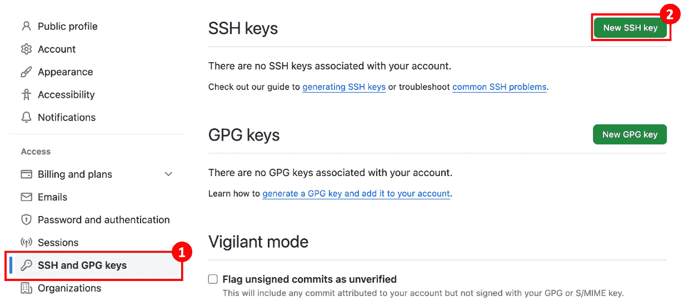
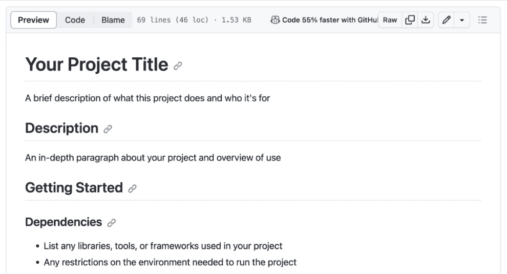
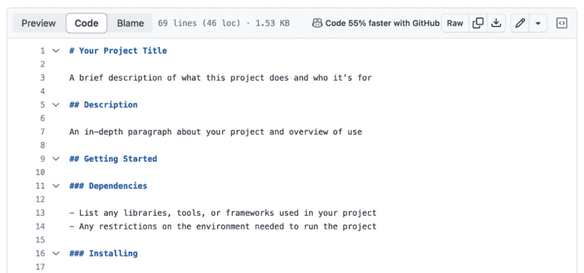
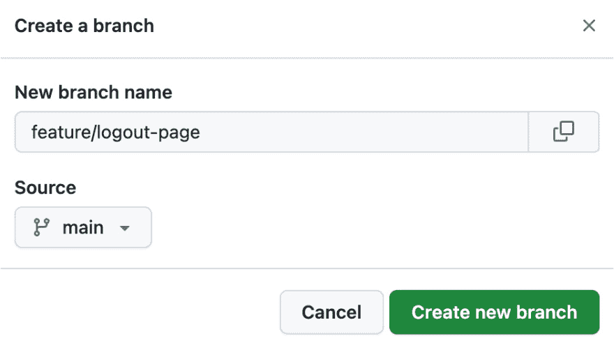
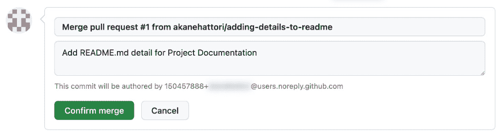
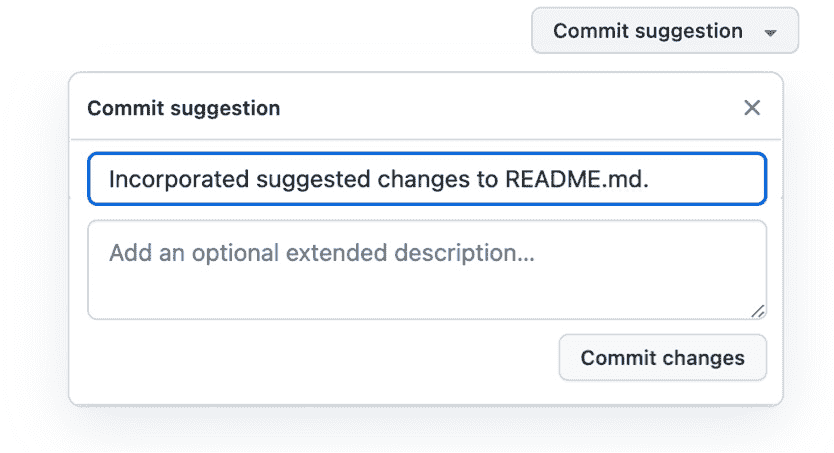

# 第四章：提升团队协作与 GitHub

恭喜你来到了我们旅程中的这一关键章节！现在，是时候更深入地探索了，超越将 GitHub 仅视为一个代码托管平台的认知。GitHub 是全球开发者构建软件的地方，是开发流程简化的舞台，也是 DevOps 精神真正展现的地方。

在本章中，我们将深入探讨使用 GitHub 的实践内容，将理论转化为实际操作。我们的重点将是 GitHub 中对于团队合作和 DevOps 环境中协作至关重要的具体功能。每一节都旨在提升你的理解和技能，确保从传统系统到现代 DevOps 实践的平稳过渡。让我们与 GitHub 一起，踏上这段激动人心的旅程，GitHub 是 DevOps 工具包中的强大助手。

本章将涵盖以下主要内容：

+   开始使用 GitHub

+   问题 – GitHub 上的协作卓越

+   拉取请求卓越

+   最大化利用 GitHub

+   GitHub 仓库卓越

我们将从与 GitHub 的实践体验开始。如果你想再次了解 GitHub 的全貌，请回到 *第一章* 了解 GitHub 的全部内容。

# 技术要求

继续本节所需的配置说明可以在以下仓库中找到。请确保已安装 Git 和 SSH 工具。对于 Windows 用户，推荐使用 PowerShell。我还建议你查阅最新的有关不同命令和环境的信息：[`github.com/PacktPublishing/DevOps-Unleashed-with-Git-and-GitHub`](https://github.com/PacktPublishing/DevOps-Unleashed-with-Git-and-GitHub)。

# 开始使用 GitHub

现在，让我们开始 GitHub 的体验。本节将介绍如何开始使用 GitHub，并涵盖基本的仓库操作。你还将学习如何使用 Git 与远程仓库进行交互，在这里完成 Git 基础的学习之旅！

## 设置你的 GitHub 账户

开始你的 GitHub 之旅首先需要一个简单的注册过程。访问 GitHub 网站，提供用户名、电子邮件和密码进行注册。这一步是进入协作开发世界的入口，GitHub 提供了一套完整的功能来支持团队协作和项目管理。

注册后，你就可以创建仓库并将代码推送到 GitHub，标志着你的 Git 之旅的开始。GitHub 不仅是一个工具，它还是你 DevOps 旅程的基石，促进协作并推动创新。如果你已经有 GitHub 账户，随时可以跳过注册，进入下一步。

要注册，请访问 [`github.com/`](https://github.com/) 并点击页面右上角的 **注册** 按钮：


图 4.1 – github.com 首页

输入你的电子邮件，选择一个密码，并选择一个独特的用户名。在完成几个确认步骤后，你将收到一封确认邮件。使用提供的验证码来完成你的 GitHub 账户设置：


图 4.2 – GitHub.com 上的注册页面和确认邮件

通过这些步骤，你的 GitHub 账户就准备好了，为创建你的第一个仓库铺平了道路。账户创建过程是当前撰写时的情况，未来可能会有所变化，但基本上这是一个直接的方式。

## 创建你的第一个 GitHub 仓库

当登录 GitHub 时，创建新仓库的菜单会根据你的用户身份有所不同。新用户会直接看到**创建仓库**按钮，而现有用户则会在他们的仓库列表中找到**新建**按钮：


图 4.3 – 创建新仓库的按钮

然后，仓库创建设置页面会出现：


图 4.4 – 创建新仓库

创建仓库涉及几个关键决策：

+   **仓库位置**：选择仓库的所有者（你自己或你所在的组织），并为选定所有者下的仓库提供一个独特的名称。

+   **可见性**：决定你的仓库是公开的还是私有的。使用**公开**仓库，任何人都可以访问你的项目，使其成为开源社区的一部分，鼓励共享和协作。另一方面，**私有**仓库是为了那些你希望保密或者只与你选择的人分享的工作，提供了保密性。对于在 GitHub 企业计划下的组织成员，还有一个选项可以创建**内部**仓库。这些仓库非常适合内部源（InnerSource）项目，因为它们仅在你的企业内部可见，提供了一个安全的协作环境。

+   `README.md`、`.gitignore` 或 `LICENSE` 文件。包含一个 `README.md` 文件就像是为你的项目提供了一个欢迎指南；这是你解释项目内容、使用方法以及访客需要知道的其他重要信息的地方。如果你的项目是开源的，选择合适的许可证尤其重要。它为他人如何使用和贡献你的项目设定了规则。选择这些选项意味着 GitHub 会自动运行 `git init` 命令。如果你打算将现有项目推送到 GitHub，可以不勾选这些选项。

对于这个例子，保持所有初始化复选框未选中，结果是一个空的仓库。这为接下来的步骤上传本地文件做好了准备。填写完仓库详细信息后，点击**创建仓库**按钮。此操作将使你的新仓库正式创建：


图 4.5 – 创建的仓库

恭喜你创建了新的 GitHub 仓库！这一里程碑标志着你作为开发者旅程中的一个重要步骤，为你在 DevOps 和开源开发的世界中打开了合作、创新和成长的大门。

接下来，我们将把你的本地仓库连接到远程仓库，其中包括为 GitHub 生成并注册 SSH 密钥。设置 SSH 连接的细节将在接下来的部分中非常重要，因此务必注意 SSH URL 字符串。点击**SSH**按钮，然后点击复制图标，将值复制如下截图所示：


图 4.6 – SSH 连接信息

## 注册你的 SSH 密钥

现在，是时候设置你的 SSH 密钥了。为此，请通过点击 GitHub 右上角的菜单按钮进入设置：


图 4.7 – 打开菜单

从这个菜单栏，你可以访问 GitHub 账户的各个部分。你可以查看个人资料并管理自己参与的仓库和组织。现在，选择菜单栏中的**设置**：


图 4.8 – 在菜单栏点击设置打开设置

一旦进入**设置**部分，在左侧菜单中查找**SSH 和 GPG 密钥**。在这里，你可以创建一个新的 SSH 密钥：



图 4.9 – 设置

点击**新建 SSH 密钥**按钮后，系统会提示你输入标题并选择密钥类型。此时，你应该选择**认证密钥**。然后，可以将 SSH 密钥粘贴到指定的字段中。

现在，你需要你的 SSH 密钥进行注册！接下来我们来看看如何生成一个。如果你已经注册过，可以跳过此过程。

创建你的 SSH 密钥是设置一个安全环境以管理 GitHub 上代码的重要步骤。如果你对 SSH 密钥不熟悉或尚未拥有密钥，这一步尤其重要。你可以通过在终端中进入 `~/.ssh` 目录来检查是否已有密钥。该目录通常包含你的 SSH 配置文件和密钥。如果你没有现有的密钥或想为 GitHub 专门创建一个新密钥，那么我们来创建一个吧。

首先，打开你的终端并进入 SSH 目录：

```
$ cd ~/.ssh
```

然后，使用 `ssh-keygen` 命令生成新的 SSH 密钥。你将使用 RSA 密钥来实现这一目的：

```
$ ssh-keygen -t rsa
```

该命令启动了密钥生成过程，并显示如下信息：

```
Generating public/private rsa key pair.
```

在提示时，输入保存密钥的文件名。以下是一个示例：

```
Enter file in which to save the key
(/Users/username/.ssh/id_rsa): [Your Key Name]
```

在这种情况下，我将使用 `git_key` 作为密钥名称。

接下来，系统会要求你输入一个密码短语。这为你的密钥增加了一层额外的安全保护：

```
Enter passphrase (empty for no passphrase): [Your Passphrase]
Enter same passphrase again: [Repeat Your Passphrase]
```

为了进一步增强安全性，为你的 SSH 密钥添加一个密码短语是一个关键步骤。如果有人未经授权获得了你的私钥，他们仍然无法使用它，因为没有密码短语。这可以防止未经授权的使用。每次使用密钥时，你都需要输入密码短语，确保只有同时拥有密钥和密码短语的人才能访问。这个额外的安全层使你的 SSH 连接更安全，建议用于保护重要信息和访问权限。完成这些步骤后，你将看到一个确认消息，表明你的身份（私钥）和公钥已保存。同时，还会显示一个唯一的密钥指纹和一张随机艺术图像。

现在，你需要检查并复制你的新公有 SSH 密钥：

```
$ cat ~/.ssh/git_rsa.pub
```

复制显示的 SSH 密钥（以 `ssh-rsa` 开头）：

```
ssh-rsa AAAAB3NzaC1yc2EAA...x4CWuT2U= a1b2@c3d4.e5f6
```

现在，让我们将这个 SSH 密钥添加到你的 GitHub 账户中。再次进入 GitHub 设置，找到**SSH 和 GPG 密钥**部分，然后将你的密钥粘贴并保存到那里：


图 4.10 – 添加一个新的 SSH 密钥

要设置或修改你的 SSH 连接，首先使用 `touch` 命令创建一个配置文件，该命令会创建一个新文件或更新现有文件的最后修改时间：

```
$ touch config
```

现在，配置文件准备好了，是时候为 GitHub SSH 连接添加特定的配置了。确保将 `git_rsa` 替换为你的私有 SSH 密钥文件的名称。如果你按照之前的步骤创建了新密钥，那么你的文件名应该是 `git_rsa`。如果你是一个有经验的 Git 用户，可能已经在这个文件中有一些 SSH 配置。在这种情况下，你应该更新或替换现有的配置。对于那些添加新配置的人，输入以下行：

```
Host github github.com
  HostName github.com
  IdentityFile ~/.ssh/git_rsa # Your key file name
  User git
```

输入这些行后，保存并关闭文件。此配置指示你的系统在 GitHub 上使用哪个 SSH 密钥，并且是在哪个用户账户下。

还建议验证你与 GitHub 的 SSH 连接，以确保一切设置正确。你可以通过运行 `ssh -T git@github.com` 命令来完成此操作。此步骤有助于确认你的系统能够成功地使用配置中指定的 SSH 密钥与 GitHub 通信。

## git remote – 连接本地和远程仓库

现在，是时候将本地开发与 GitHub 世界连接起来了。如果你正在继续之前章节中的现有仓库，只需使用 `cd` 命令进入该目录，如下所示：

```
$ cd path/to/your/repository
```

对于那些想要创建新项目的人，设置一个新的仓库是非常简单的。首先创建一个新目录，初始化一个 Git 仓库，并准备一个 `README` 文件——这是任何新项目的标志：

```
$ mkdir new-project
$ cd new-project
$ git init
$ echo "# README" >> README.md
$ git add README.md
$ git commit -m "Initial commit"
```

记得使用你在上一节中记录的 SSH URL。

将本地仓库连接到 GitHub 上的远程仓库涉及添加一个远程 URL。这种链接允许您将本地更改推送到 GitHub。使用 `git remote add` 命令建立这种连接，确保用您的 GitHub 用户名和仓库名替换 `[Username]` 和 `[Repository]`：

```
$ git remote add origin git@github.com:[Username]/[Repository].git
```

对于已经有远程 URL 但需要更新的情况，`git remote set-url` 是首选命令。该命令将您的 Git 配置更新为新的远程仓库 URL：

```
$ git remote set-url origin git@github.com:[Username]/[Repository].git
```

通过这些步骤，您已成功将本地和远程仓库连接起来。这一连接是管理项目的关键点，确保您的本地开发在 GitHub 上得到进一步的推进和协作。

随着我们的进展，下一步将是将您的本地代码推送到 GitHub 上。

## git push – 让您的代码生效

最后，是时候将您的本地提交推送到远程仓库了。此步骤将会用您本地所做的更改更新远程仓库：

```
$ git push -u origin main
```

当您使用 `-u` 或 `--set-upstream` 与 `git push` 一起使用时，实际上是在将当前分支在本地仓库的上游设置为 `main` 远程。

通过指定此上游，您简化了与远程仓库的未来交互。一旦设置了上游，您可以直接使用 `git push` 推送到远程仓库的同一个分支，而无需额外的参数。这意味着随后的 `git push` 操作将自动知道将提交推送到 `main` 远程。

## 在 GitHub 上检查代码

现在，让我们来查看在 GitHub 上推送的代码是什么样子的。

当您访问 GitHub 仓库时，迎接您的第一件事是仓库的主页面。在这里，您可以看到最近更新的文件、`README.md` 文件（如果有）、以及各种仓库细节。此视图提供了项目内容和目的的快速快照：


图 4.11 – 推送代码后的 GitHub 仓库页面

### 在 GitHub 上编辑代码

其中一个关键功能是直接与 GitHub 上的代码进行交互。您可以使用界面本身添加或编辑文件，这对于小改动或快速修复特别有用。以下是如何操作：

1.  单击右上角的 *编辑* 按钮进入编辑模式：


图 4.12 – 进入编辑模式

1.  接下来，您可以编辑并提交您的更改。请记住，这将直接提交到您的代码库：


图 4.13 – GitHub 上的编辑页面

1.  这个操作会将你的更改直接提交到远程仓库。不过，你也可以灵活选择目标和分支来进行提交。虽然默认情况下通常是你当前工作的分支，但你也可以选择同时创建一个新分支，这在开始新的贡献时特别有用。如果你选择创建一个新分支，之后仍然可以将其合并到主分支：


图 4.14 – 提交更改

1.  现在，你应该能看到更改的反映，如下图所示：


图 4.15 – 提交后，你将返回到代码界面

### 在 GitHub 上审查代码和更改

现在，让我们通过刚刚更新的代码查看 GitHub。为了更仔细地查看代码，GitHub 提供了几种文件浏览器视图：

+   **预览**模式是默认模式，适用于某些文件类型（如 Markdown），并显示文件在格式化状态下的样子：



图 4.16 – 预览模式

+   **代码**模式显示文件的最新提交内容，并具有美观的语法高亮：



图 4.17 – 代码模式

+   **blame**模式特别有用，因为它按行显示文件，展示了每一行最后由谁修改，并在何次提交中进行修改。这对于理解代码的演变和跟踪更改非常有价值：


图 4.18 – blame 模式

当你不想在本地获取代码并进行审查，而是希望先查看 GitHub 上的代码时，这非常有用。在 GitHub 仓库界面中，你可以探索项目的提交历史。这个功能允许你深入了解每个提交的具体内容，查看所做的更改：


图 4.19 – GitHub 上的更改历史

此外，GitHub 提供了对这些更改进行评论的功能，使你能够参与讨论或对仓库中的具体修改提供反馈：


图 4.20 – GitHub 提交视图

### 在 GitHub 上管理分支

在 GitHub 上管理分支非常简单。以下是 GitHub 上分支管理的简要概述。

首先，在仓库中不同分支之间切换是一个常见任务。在 GitHub 上，你可以通过分支下拉菜单轻松切换分支，通常该菜单位于仓库页面的顶部。这个功能允许你快速从一个分支切换到另一个分支，帮助你高效地审查项目的不同版本或阶段：


图 4.21 – 在 GitHub 上切换分支

对于拥有多个分支的仓库，查找特定分支可能会变得有些困难。GitHub 提供了一个分支下拉菜单中的搜索功能。这个功能允许你快速筛选并找到你需要的分支，节省时间并提高工作效率：


图 4.22 – 在 GitHub 上搜索分支

启动一个新的开发线通常是通过创建一个新的分支来完成的。GitHub 简化了创建新分支的过程。你可以命名新分支，并基于现有分支，这使得为新特性或实验创建分支变得非常简单：



图 4.23 – 在 GitHub 上创建分支

GitHub 的分支管理功能提供了一种无缝高效的方式来处理一个仓库内的多个开发线。无论你是切换查看不同的项目状态，搜索特定的分支，还是为开发创建一个新的分支，GitHub 界面都使这些任务直观且易于访问。这种精简的分支管理方法对于保持一个有序且高效的开发环境至关重要。

## git pull – 桥接本地和远程工作

现在我们已经看过 GitHub 如何管理我们推送的代码，让我们回到命令行。获取本地仓库中新做的更改。我们已经在 GitHub 上编辑了 `README.md`，但我们如何将这些更改带到本地环境呢？答案就在 `git pull` 命令中。

在使用 Git 进行版本控制的过程中，保持与远程仓库最新更改的同步对无缝的协作和开发至关重要。`git pull` 命令就是专门为这个目的设计的工具。它充当了一个桥梁，将远程平台（如 GitHub）上做出的更改带入到你本地的工作目录中。

使用 `git pull` 在协作环境中尤为重要。假设你的团队成员正在向 GitHub 上的共享仓库提交更改，在这种情况下，定期拉取这些更改可以确保每个人的工作保持一致，减少冲突或不一致的可能性。

要使用 `git pull`，请在命令行或终端中进入你的仓库目录，并输入以下命令：

```
$ git pull origin main
```

这是一个简单却强大的命令，能够保持你合作工作的和谐，并确保你的本地仓库与最新的开发保持同步。

当你执行 `git pull` 时，实际上发生的是一个两步的过程。首先，Git 从远程仓库获取更新——这包括自上次更新以来所有的提交和分支。然后，它将这些更新合并到你的本地仓库中。这次合并至关重要，因为它将远程更改与本地工作整合，确保你的本地仓库与远程仓库保持同步。

乍看之下，`git pull` 命令似乎很简单，但实际上它是两个基本 Git 命令的结合：`git fetch` 和 `git merge`。这种双重性质使得 `git pull` 成为 Git 工具中的一把利器。

接下来，让我们深入了解这个过程的第一个组成部分：`git fetch`。这个命令是版本控制谜题中的一个关键部分，允许你查看别人正在做的工作，但还没有将这些变更集成到你的工作中。

## git fetch – 同步而不中断

`git fetch` 在开发者与远程仓库互动中起到至关重要的作用。`git fetch` 的核心功能是安全且高效地将远程仓库的变更更新到你的本地仓库。

当你运行 `git fetch` 时，Git 会联系指定的远程仓库并下载你尚未拥有的所有数据。这包括新的提交、分支和标签。`git fetch` 的美妙之处在于，它在不更改你的工作文件的情况下执行这些操作。就像偷偷看别人在做什么，而不会实际将他们的变更集成到你的工作中。这个特性使它成为一个非破坏性操作，确保你当前的开发工作不受影响。

拉取的数据被存储在你的本地仓库中，但与你的实际项目文件分开。要将这些拉取的变更合并到你的工作中，你通常会跟进一个 `git merge` 命令，将拉取的分支合并到你当前的分支中。没错——`git fetch` 在与 `git merge` 结合使用时可以显示其真正的威力。

## fetch 与 pull

让我们稍微深入了解一下 `git pull`。当你运行 `git pull` 时，它首先启动一个 `git fetch` 操作。这一部分的过程会访问远程仓库并拉取所有新数据。这些数据包括自上次拉取以来在远程仓库中更新的提交、文件和引用。这是一个至关重要的步骤，确保你获取到远程仓库的所有最新信息，但它并不会自动将这些变更集成到你的工作文件中。

`git pull` 命令的第二部分是 `git merge` 的作用。在拉取更新后，`git merge` 将这些新下载的引用并入你的本地仓库。这个合并过程实际上是将远程仓库的变更更新到你当前的工作文件中。这是一种无缝集成远程变更与本地工作的方法，保持你的仓库与远程仓库完美同步。

理解 `git pull` 作为获取和合并操作的双重性质，揭示了它在协作环境中管理和同步代码变更的真正威力。

此外，了解`git fetch`与`git pull`之间的区别非常重要。它可以让你更准确地控制何时以及如何将远程仓库的更改合并到本地工作中。清晰地理解这点对于顺利的协作和高效的仓库管理至关重要，因为它让你可以战略性地决定是仅仅查看更改还是完全合并它们。

## git clone – 将 GitHub 仓库带到你的工作空间

说到克隆和下载，这些选项对于每个仓库都是随时可用的。只需进入仓库页面并点击**< > 代码**按钮，你就能看到这些选项。克隆会在你的机器上创建一个仓库的本地副本，让你能够离线工作，而下载则提供一个项目的 ZIP 文件，便于备份或审查：


图 4.24 – git clone

执行`git clone`命令是一个简单的过程，使任何想要参与 GitHub 上托管项目的人都能轻松接触到。要克隆一个仓库，你只需要该仓库的 URL：

```
$ git clone [Your SSH URL]
```

`git clone`是一个核心命令，使你能够创建现有仓库的精确本地副本。这个过程不仅仅是复制当前文件；它完整地复制了整个仓库，包括所有文件版本、完整的提交历史和所有分支。通过使用`git clone`，你可以将项目的完整、功能齐全的版本带到本地机器上。这不仅让你可以离线工作，还为你提供了项目开发历史的全面视图，有助于理解和高效贡献。

## Fork – 不只是复制代码

除了`git clone`，还有另一种方法可以在 GitHub 上复制一个仓库。这对于开源开发尤其有用。在 Git 中，特别是在像 GitHub 这样的平台注册上，**Fork（分叉）**的概念是协作和开源开发的基石。Fork 一个仓库意味着在你的账户下创建一个属于你自己的副本：


图 4.25 – 在 GitHub 上 Fork

当你 Fork 一个仓库时，你就在自己的 GitHub 账户内创建了一个属于你个人的副本。虽然这个副本最初与原仓库是镜像关系，但它独立运行，这意味着你可以进行修改、添加或实验，而不会影响原项目。然而，理解这种独立性是有局限的也很重要。例如，如果原始仓库被删除或其可见性发生变化，可能会影响分叉的状态。尽管存在这些依赖关系，Fork 仍然是开源开发中的重要实践，它使开发者可以通过拉取请求进行贡献，而无需对源仓库拥有直接的写入权限。

Fork 操作在开源世界中尤其重要。它允许开发者通过在自己的分支上进行更改，然后通过称为**pull request**的过程向原始项目提出这些更改，从而为项目作出贡献。这就是你如何在没有直接写入源代码库权限的情况下，参与到项目中的方式。当你进行 Fork 时，会在你的新环境中创建一个副本，如下图所示：


图 4.26 – 被 Fork 的代码库在你的环境中进行管理

Fork 提供了一个独特的平台，任何人，无论与原始项目维护者的关系如何，或是信任程度如何，都可以自由地进行实验并做出贡献。这种方式显著降低了协作编码的门槛。

通过 Fork 一个代码库，你可以创建一个环境，在其中为项目添加你的创意、增强功能或修复问题，而不影响上游的代码库。这对那些尚未获得项目维护者信任、无法直接访问主代码库的新贡献者尤为重要。它让他们能够在一个独立的个人空间中展示他们的能力和贡献。

Fork 操作的这种独立而又相互关联的特性至关重要。它使得贡献过程分为两个阶段：首先，在你自己的 Fork 中自由地进行实验和更改；其次，通过 pull request，提出将这些更改合并到原始项目中。这种工作流促进了开放协作的文化，大家可以自由地交流创意和贡献，最好的创意将无缝地融入项目中。

本质上，Fork 不仅仅是复制一个代码库；它更是参与到一个更大社区中的方式。无论你是在为一个现有项目做贡献，基于他人的工作启动一个新项目，还是仅仅进行实验，Fork 都是使用 Git 和 GitHub 时不可或缺的一部分。

你已经学会了 Git 命令的基础知识，并且了解了如何在单独的和协作的远程环境中管理 Git 代码库。现在，你准备好深入了解 GitHub Issues 和 pull requests，它们是 GitHub 上沟通的关键工具。这些功能虽然看起来很简单，但在开源项目的成功中起着至关重要的作用。它们作为创意生成、讨论和审查的平台，促进了共同开发和创新的文化。接下来，我们将探讨这些功能如何增强沟通与协作，助力 GitHub 上的开发。

# Issues – GitHub 上的协作卓越

GitHub Issues 作为 GitHub 生态系统中的一个多面工具，必不可少于协调协作努力。它不仅仅是一个报告问题的地方，它是一个全面的系统，用于跟踪与项目相关的各种任务和活动。这包括管理 bugs、提出改进建议以及监控 GitHub 仓库中的其他重要任务。

在 DevOps 环境中，GitHub Issues 扮演着至关重要的角色，它通过促进持续反馈和无缝协作，提供了一个透明且高效的平台，开发人员可以标记问题，团队成员可以建议新功能，而利益相关者可以参与关于潜在改进的有意义讨论。这一功能与 DevOps 的核心原则高度契合，DevOps 强调打破组织障碍，促进开放沟通，并培养持续改进和适应的文化。

通过利用 GitHub Issues，团队可以创建一个共享、可访问的空间，促进协作，并确保项目中的每个成员都在同一页上。这不仅仅是为了追踪问题；它是关于构建一个动态、响应迅速的环境，在这个环境中，创意能够蓬勃发展并被高效管理。

## GitHub Issues 的独特之处

现在让我们来看一下 GitHub Issues 在促进透明度和提升开发者体验中的独特作用。

GitHub Issues 是软件开发领域中的一个独特工具，尤其是在透明度和协作方面。作为 GitHub 的一部分，它重新定义了开发团队，甚至更广泛的开源社区，在项目中沟通和协作的方式。GitHub Issues 的重要性不仅体现在它作为 bug 跟踪或功能请求工具的功能上，还体现在它在培养一种开放、透明且由社区驱动的软件开发方法中的作用，这种方法与开源运动的精神相呼应。

### 开发中的透明度重要性

软件开发中的透明度是指让所有相关方（从开发人员到最终用户）能够看到并理解软件的创建、修改和维护过程。这种透明度至关重要，原因如下：

+   **改进的协作**：当项目的各个方面都对所有人可见时，团队成员能够更有效地协作。每个人都能访问相同的信息，从而做出更好的决策，并对目标和挑战有共同的理解。

+   **提高的责任感**：透明度使责任分配更加清晰。当团队成员的工作对他人可见时，他们会对自己的工作更加负责，从而培养出更强的责任感和承诺感。

+   **增强的质量与创新**：项目数据的开放访问使得更多的人可以参与项目的审视，从而带来更多的反馈、创意和批评。这种集体的审查不仅提升了质量，还激发了创新。

+   **建立信任**：透明性建立了团队成员之间以及与外部利益相关者（包括用户和客户）之间的信任。信任对长期项目的成功至关重要，并且对建立可靠的、以用户为中心的软件至关重要。

### GitHub Issues – 透明协作的催化剂

GitHub Issues 体现了这种透明的做法。与允许详细分层权限的工具不同，GitHub Issues 通常采用更为开放的访问模型。每个问题、其讨论线程以及作出的决策对所有团队成员可见，并且在开源项目中通常对公众开放。这种开放性避免了信息孤岛，鼓励了一种自下而上的文化，任何级别的组织或社区成员都可以提出想法和反馈。

这种方法与开源开发的精神完全契合，开源开发强调社区贡献、共同责任和开放对话。通过在内部采用类似的模型，公司可以获得开源方法的好处，打破组织壁垒，培养团队内部的社区氛围。这鼓励开发者主动提出想法，参与健康的、建设性的辩论。

### 开源作为内部协作的模型

开源的工作方式，借助像 GitHub Issues 这样的工具，成为提升开发者体验的绝佳策略。它将开源社区的协作性、透明性带入组织的内部运作。当开发者能够看到自己工作的影响，并参与到超出自己直接任务的讨论时，他们会感到更加投入和被重视。这种开放的环境培养了社区感，提升了士气，并能显著提升创新力和生产力。

此外，GitHub Issues 和开源模型所促进的透明性和开放性提供了宝贵的学习机会。开发者可以相互学习，从不同的角度获得见解，并通过接触各种挑战和解决方案来成长。这种环境有利于个人和职业发展，对于留住人才、保持团队的动力和生产力至关重要。

### GitHub Issues 是协作的催化剂

总之，GitHub Issues 在促进透明度和社区驱动的软件开发方法中发挥着关键作用。从开源实践中汲取灵感有助于打破组织障碍，培养协作和透明的工作文化，并显著提升开发者体验。在软件开发日益注重社区和协作的时代，GitHub Issues 成为了一个灯塔，引导团队走向一种更加开放、包容和高效的工作方式。

让我们从这个角度来看一下一个问题。

## 制作一个问题 – 构建一个结构良好的问题的基本要素

在 GitHub 上创建你的第一个问题，起初可能会觉得挑战性很大，因为它的简单性，但掌握这一技能对有效的协作至关重要。一个结构良好的问题是关键：它应该清晰、简洁并具有可操作性。目标是提供足够的上下文，使你的观点易于理解，同时避免用过多的信息轰炸合作者。首先要清楚地识别问题，解释其重要性，并概述期望的结果。

这一过程从你的 GitHub 仓库开始。如果你已经有了一个现有仓库或刚刚创建了一个仓库，你会在仓库菜单中找到**Issues**选项卡。在这里，你可以创建一个新的问题：


图 4.27 – 新问题

创建问题是简单的。界面展示了标题和主要描述的字段，以及分配者和标签等元数据选项。重点应该放在问题的内容上。GitHub 支持 Markdown 进行文档格式化，因此熟悉 Markdown 语法是很有益的。然而，请记住，简洁是关键——Markdown 的功能不如 Microsoft Word 丰富，但它非常适合创建干净、简洁的文档：


图 4.28 – 在 GitHub 上创建问题

在一个问题中，你可以将其分配给团队成员，还可以在内容中直接提到个人或团队以发送通知：


图 4.29 – 将问题分配给其他用户

任务标记（例如，作为 bug、文档或增强功能）也是可能的。虽然可以创建自定义标签，但建议先从默认标签开始，并逐步增强它们。过度使用标签可能导致混乱和分类上的挑战。如果你的团队或组织有特定的标签标准，最好遵循这些标准。

在 GitHub 上使用问题的方法并非自上而下，而是鼓励一种社区驱动的、自下而上的风格。从一开始就强制执行严格的规则可能会限制促进开放、灵活和协作文化所需的自由。平衡非常重要；随着你和你的团队越来越习惯 GitHub 的工作流程，你可以相应地调整方法：


图 4.30 – 可以应用多种标签

最后，你会看到提交的问题：


图 4.31 – 提交问题后

如你所见，管理 GitHub 上的问题非常简单。关键在于促进协作和沟通。在接下来的部分，我们将深入探讨有效的沟通技巧，并探索如何通过 GitHub 增强组织内的协作。

## 有效沟通

现在，构建一个优秀问题有几个要素：标题、描述的写作方式以及回复的基本方式。即使我们努力清晰地写作，在忙碌的工作日中，我们也容易写得杂乱无章。这种语境上的缺失会导致沟通不畅。通过遵循将要介绍的一些规则，你将能够与同事更好地沟通。

### 编写有效标题——清晰度和影响力的关键原则

问题的标题是合作者首先看到的内容，因此它对吸引注意力和传达问题的本质至关重要。目标是创建一个简洁而富有描述性的标题。避免使用模糊的标题，如“*问题*”或“*功能请求*”——要具体。例如，“*修复 README 中的断链*”要比“*问题*”更具信息性。但为什么清晰性如此重要呢？

在组织内部工作时，你通常会参与多个代码库，每个库中可能包含大量未解决的问题。为了有效地管理并引起人们对这些问题的关注，标题起着至关重要的作用。它应当具有吸引力且准确无误，清晰但不夸张。

下面是一些确保你的问题标题既突出又易于理解的指南：

+   **简洁明了的描述**：确保标题简洁而富有描述性，使用简单的语言，避免使用技术术语。这种清晰性有助于团队成员快速理解问题。

+   **以类别关键字开始**：使用“*修复*”、“*增强*”或“*优化*”等术语，以便立即传达问题的性质。

+   **概括核心问题**：标题应简明扼要地概括主要问题或请求，避免冗余细节。

+   **中立且具体**：聚焦于问题本身，而不是谁报告或将解决它。如果适用，包含受影响的特定组件或功能，以便更好地分类。

+   **清晰优于优先级**：避免在标题中使用表示紧急或严重的措辞。相反，使用标签或问题内容来传达这一点，确保标题保持明确且聚焦。

当然，也存在一些例外情况，这些指南应根据每个项目的需要进行定制，但在 GitHub 问题中，**加速问题分类**，通过快速排序和识别问题，**提高可发现性**，便于轻松查找问题，并且**促进团队间清晰沟通**，确保每个人都能一目了然地理解问题。这种简化的方法是高效管理代码库的关键。

### 提供描述中的上下文——清晰简洁沟通的策略

有效的问题描述是 DevOps 协作解决问题的基石。要写出引人注目且清晰的问题描述，首先概述当前的情况，为理解打下基础。接着简洁地陈述你所提出的问题或改进。最后，阐明你希望达到的结果或解决方案。这种有条理的方法确保了理解并为建设性的对话方向提供保障。

背景在问题描述中至关重要。它能为你的团队成员提供对你的观点和问题产生或特性需求出现时的背景的理解。如果可能，提供可以复现问题的步骤。这不仅仅是解释一个问题，而是将你的协作者带入你的经验中，使他们能够有效地评估问题。

你还可以利用 Markdown 来提升问题的可读性和互动性。这种简单的标记语言允许你通过标题来构建问题，用项目符号或编号列表来组织要点，并使用代码块和语法高亮来包含代码片段。这些元素不仅使问题更易于导航，而且更加吸引人且便于互动。

以下是确保你的问题描述清晰、简洁并有效传达你所处理的问题或改进的指南：

+   **背景和清晰度**：从清晰的当前情况背景开始，并用具体的术语定义问题或改进点。这为理解问题打下基础。

+   **结果和复现步骤**：描述期望的解决结果，并在报告 bug 时提供详细的复现步骤。这种清晰度有助于其他人形象化解决方案并理解问题的范围。

+   **美丽的 Markdown 和表情符号**：使用 Markdown 和表情符号来组织你的描述，使其通过标题、列表和代码块变得更易读。

+   **视觉辅助和解决方案**：包括截图或链接提供额外的上下文。建议潜在的解决方案或替代方法也能帮助启动问题解决过程。

+   **聚焦与协作**：确保描述聚焦于问题本身，避免涉及无关话题。鼓励反馈并愿意接受建议，促进解决问题的协作方法。

良好的问题描述**提升理解**，通过提供清晰的理解帮助团队成员快速把握问题，**促进高效问题解决**，通过快速评估和解决方案的制定，**加强协作**，通过邀请建设性反馈和共同寻找解决方案。这种简洁的方法简化了项目进展和团队合作。

### 问题回复促进协作文化

GitHub Issues 不仅仅是一个跟踪 bug 的工具；它们是协作和文档的中心。当你回复一个问题时，你不仅仅是在解决一个特定的问题或疑问，而是在为项目的被动文档做出贡献。

回复问题很简单。只需在 Markdown 中写下你的回复并提交即可。但即便如此，你也需要有一个哲学：


图 4.32 – 评论问题

在 GitHub 上，评论一个问题非常重要，不仅仅是邮件回复。我们来看看以下几个视角：

+   **被动文档**：被动文档是一个来自 InnerSource 背景的概念，文档并非主动创建，而是通过仓库内的互动自然演变。在 GitHub 中，每一个问题、拉取请求和讨论线程都成为这种被动文档的一部分。这个过程是有机的，自下而上的；当团队成员参与讨论、请求功能、解决问题或实施解决方案时，他们的互动会被记录下来。这形成了一个全面、不断发展的记录，记录了决策、讨论和变化，成为一个活文档，捕捉项目的历史和理由。

+   **集中沟通以提高透明度**：在协作环境中，沟通通常通过多个渠道进行，如 Slack、Teams、Jira 和 GitHub。然而，将与项目相关的讨论集中在 GitHub 上具有显著的优势。它不仅创造了有价值的文档，还促进了透明的文化。所有的决策过程和协作对所有团队成员都是可见和可访问的，促进了包容性和理解。当讨论发生在 Slack 等其他平台时，将这些讨论引导回 GitHub，确保关键信息和决策得以记录，并在整个团队中共享。这种方法避免了信息孤岛，确保每个人，无论何时加入项目，都能访问到相同的信息。

+   **拥抱积极和包容性的沟通**：有效的协作建立在积极和包容性的沟通基础上。在回复问题时，重要的是要肯定并表扬良好的行为，感谢团队成员的贡献，并保持尊重和支持的语气。这不仅鼓励健康的团队氛围，还能提升士气，培养归属感和感激之情。包容性沟通意味着确保每个人的声音都被听到和重视，他们的贡献得到认可。这种方法不仅加强了团队凝聚力，还推动了更好的问题解决和创新。

在 GitHub 中，回复问题不仅仅是一个回应；它是构建被动文档、促进团队透明度并鼓励积极包容性沟通的重要组成部分。通过将问题回复视为对一个活文档的贡献，我们创造了项目演变的丰富历史。将沟通集中在 GitHub 上，确保所有团队成员都能平等地获取信息，有助于透明的决策制定。最后，采取积极的沟通风格可以增强团队凝聚力，确保每个人都感到被重视和倾听。对问题回复的这种全面方法，不仅仅是解决问题，更是建立强大、包容和透明的团队文化。

现在，让我们看一下下一节的拉取请求。这与 GitHub 问题的界面非常相似，主要的区别在于它除了评论外，还涉及到实现。

现在，让我们深入探讨工程协作的核心。

# 拉取请求的卓越

GitHub 的拉取请求功能是软件开发领域的一项关键创新，可以说它对**开源软件**（**OSS**）运动的形成起到了重要作用。它的引入标志着一个转折点，重新定义了在软件项目，尤其是开源软件项目中如何进行协作、代码集成和**质量保证**（**QA**）。

GitHub 中的拉取请求不仅仅是一个功能；它是软件开发领域协作的基础机制。拉取请求本质上是一个请求，将一组更改从仓库的一个分支合并到另一个分支，通常是从功能分支或主题分支合并到主分支或主干分支。但拉取请求的意义远不止于代码合并；它们是讨论、审查和完善代码的枢纽，尤其是在协作项目中。

## 什么使拉取请求与众不同？

拉取请求模型改变了协作编码的方式。它将焦点从单独提交的代码补丁转移到更加互动和社区驱动的方式。开发者现在不仅可以提交更改，还可以直接在 GitHub 平台上参与关于这些更改的讨论。这促进了协作审查和持续反馈的文化，这对于维持高质量的代码和确保贡献与项目目标一致至关重要。拉取请求引入了一种结构化、透明的代码审查方法。代码更改现在可以在拉取请求的上下文中轻松查看和讨论，从而允许更详细和高效的反馈。这个过程确保了更改经过充分审查，从而提高了代码质量和软件项目的健壮性。

拉取请求不仅革新了代码审查和合并的方式，还显著简化了 GitHub 中的开发工作流程。通过与 GitHub 原生功能和大量第三方工具无缝集成，拉取请求支持并增强了**持续集成**（**CI**）和**持续部署**（**CD**）实践。这一集成改变了开发过程，使其更加高效、可靠和自动化。

一个关于拉取请求的有趣发展是预发布测试的集成，这一过程发生在拉取请求的讨论线程中。这一进展促成了一种更全面、更紧密的方式来确保代码质量和项目管理。每当开发者发起拉取请求时，它会触发一系列自动化检查和测试。这些测试可以涵盖从代码质量评估和安全漏洞扫描到性能测试等多个方面。这些测试的结果会直接显示在拉取请求中，提供即时且可操作的反馈。

### 超越命令行

在讨论 GitHub 拉取请求的历史背景和演变时，值得注意的是，*拉取请求*这一术语本身源于 Git 中的 `git request-pull` 命令。这一联系可能使一些人认为 GitHub 的贡献主要是为现有概念提供了用户界面，而不是发明了一种全新的东西。然而，深入探讨拉取请求的历史和发展，会发现它具有更为深远的影响。

GitHub 将一个基本的命令行功能转变为其网页界面中的一个丰富、互动且协作的功能。这一转变不仅仅是增加了一个用户界面层；更是重新构想了围绕代码更改进行协作的方式。

## 创建拉取请求

首先，在 GitHub 上选择或创建一个仓库。为了演示，我们将重点关注 GitHub 的用户界面，而非命令行界面。考虑一个仅包含 `README.md` 文件的仓库作为起点。目标是向该文件中添加详细内容并提交一个拉取请求进行合并：


图 4.33 – 仓库页面

第一步是创建一个名为 `adding-details-to-readme` 的分支。这个分支是你在将更改合并到主分支之前进行编辑的地方。虽然你可以使用 Git 命令创建并推送新分支，GitHub 也提供了一个直观的界面来实现这一功能。使用左上角的分支下拉按钮从主分支创建一个新分支：


图 4.34 – 通过下拉菜单创建新分支

一旦创建了分支，你可以在任何分支上进行更改，而不仅仅是主分支或主干分支：


图 4.35 – 分支创建通知

然后，让我们编辑`README.md`。在开始编辑之前，请通过检查左上角的下拉菜单确保您位于正确的分支上。接着，点击右上角的编辑按钮开始编辑`README`文件：


图 4.36 – 点击编辑按钮

`README.md`文件是您仓库的“面孔”和“门户”，欢迎团队成员和新贡献者。在这里，发挥您的想象力，撰写一份引人注目的`README`：


图 4.37 – 编辑 README.md 文件

好的，现在我们已经准备就绪。让我们开始提交您的更改。既然您已经在编辑分支上，您可以直接提交您的编辑内容。不过，如果您在`main`分支上打开编辑窗口并提交，您仍然可以选择创建一个新的分支。但最好在开始时有意识地创建一个分支并提交。另外，GitHub 上有分支保护策略配置，防止您直接提交到团队共享环境中，比如`main`、`production`和`release`分支，关于这部分内容将在本章后续讲解。

标题会成为 Git 提交消息，因此在阅读前几章并进行提交时，请仔细考虑这一点：


图 4.38 – 提交更改

一旦更改提交，您可能会在仓库主页看到创建拉取请求的通知。如果没有出现通知，或者您希望选择不同的分支，您也可以通过点击**新建拉取请求**按钮来创建拉取请求：


图 4.39 – 拉取请求通知

如果您没有看到此通知，或者想选择不同的分支，可以通过点击**拉取请求**标签下的**新建拉取请求**按钮来开始相同的流程：


图 4.40 – 点击新建拉取请求按钮

在浏览界面时，您可能会发现自己进入了拉取请求页面，无论是通过跟随通知还是点击**新建拉取请求**按钮。无论您如何到达，这都是您查看更改历史记录的地方。

在 GitHub 中，更改的展示方式可能有所不同。如截图所示，差异（或 diff）可以以内联方式展示，交错在每行代码中：


图 4.41 – 统一模式下查看更改页面

或者，GitHub 提供了分屏视图，显示原始代码和修改代码的差异。这种分裂式显示方式可以让您更清楚地对比原始代码和修改后的代码：


图 4.42 – 分屏模式下查看更改页面

当你满意时，开始编写拉取请求。一个好的拉取请求包括清晰的标题、详细的描述和指定的评审者。至于评审者，你可以指定个人或团队。这里的内容有点像你在问题中会写的内容：


图 4.43 – 你可以查看提交之间的差异

现在，你的写作技巧再次受到考验。写作时需要关注的内容与我们在上一节中关于问题时所关注的内容相同。写作时使用易读的 Markdown 格式。然而，在这种情况下，理解这些工具的不同目标至关重要。拉取请求的主要目的是合并，通常是针对有权批准的特定个人。相反，问题可以面向更广泛且未定义的受众。因此，编写这个拉取请求的描述时，考虑谁将进行评审以及如何写作是非常重要的。

如果评审是由特定人员进行的，可能会有一些共享的理解或背景，这可以减少评审时需要大量评论的情况。基本的技巧和处理问题时一样，但要根据你的目标受众调整写作方式。

你可能会注意到在创建拉取请求时有两个可用选项，可以通过右侧的下拉按钮访问。你可以选择创建标准拉取请求或选择草稿拉取请求。根据你的计划，草稿拉取请求可能不适用于私有仓库，但任何人都可以在公共仓库中尝试使用。我鼓励你查看：


图 4.44 – 另一个选项：创建草稿拉取请求

草稿拉取请求和常规拉取请求在用户界面上没有太大区别。然而，草稿拉取请求用于表示该拉取请求尚未完成，或者整体工作仍在进行中、未完成，或者处于开发的特定阶段。

它允许进行中期评审，表明该拉取请求尚不打算进行正式评审。评审者通常会欣赏收到中期结果或报告。早期评审可以提供宝贵的见解，并与团队分享进展，这对项目有益。

在草稿拉取请求的情况下，不会因错误而立即进行合并，如下所示：


图 4.45 – 草稿拉取请求明确表示尚未准备好进行评审

在极端情况下，你甚至可以通过`git empty commit`命令创建一个拉取请求，而不写一行代码。这在开发的早期阶段非常有用，可以让团队成员或配对编程的伙伴提前审查代码，帮助尽早发现错误。因此，强烈建议同时利用草稿拉取请求。

在 Git 中，空提交是指不包含任何更改的提交；就像发送了一条消息但没有修改任何文件。这在开发的早期阶段尤其有用，可以在不需要实际代码更改的情况下发起讨论。要创建一个空提交，可以使用`git commit --allow-empty -m "Your message"`命令，这样就可以进行一次提交，包含消息但不包含任何内容更改。这个功能对于创建作为未来代码审查占位符的拉取请求或标记开发过程中特定的里程碑非常有用。建议你在使用草稿拉取请求时记住这个空提交。

现在，一旦你进行了适当的沟通并完成了审查，就到了合并的时候。这里 GitHub 的伟大之处并不是命令行界面，而是能够在用户界面上进行合并。你可以直接进行合并，但在执行之前，让我们先看看可选的选项：


图 4.46 – 可以通过网页用户界面进行合并

在检查**合并**下拉菜单时，你会发现三个选项。这些选项分别是创建一个合并提交，然后将提交合并为一个并执行合并，最后是执行变基合并。虽然这些合并技术在之前的章节中已经讲解过，并在这里不会详细展开，但 GitHub 的美妙之处在于它提供的灵活性，允许你选择每个选项来管理你的 Git 历史记录。如果你想保留贡献历史，首先需要合并提交，确保尽可能多地保留变更历史。另一方面，如果你更倾向于一个干净的历史，像**合并并压缩**和**变基合并**等选项也是可以考虑的。

然而，重要的是要注意 GitHub 的`git rebase`命令。GitHub 上的**变基合并**实际上是将特性分支上的每个提交单独重新应用到基础分支上，而不创建合并提交。这可以保持线性的历史，同时保留提交的时间顺序。无论你是希望保留详细的贡献记录，还是更倾向于简化的历史，GitHub 都提供了满足你项目需求的工具：


图 4.47 – 合并选项

这次，我们选择了创建一个合并提交。创建合并提交很简单；只需写一个标题和描述。然后，点击**确认合并**按钮进行合并：



图 4.48 – 创建合并提交

然后，你将确认在 GitHub 平台上是否已成功完成合并：


图 4.49 – 检查合并是否成功

你已经观察到在 GitHub 上管理拉取请求的简便性。这个平台展示了传统上通过命令行执行的复杂操作和审查，如何在一个统一的平台中高效进行，并通过精简的用户界面得到增强。

接下来，我们将深入探讨熟练的拉取请求管理技巧。我们的重点将放在如何在以 DevOps 为中心的沟通框架中巧妙地利用这些功能，从而推动项目或产品的成功。此外，我们还将讨论需要你关注和考虑的关键方面。

## 拉取请求审查基础

首先，掌握如何在 GitHub 上进行审查至关重要，然后再探索值得关注的最佳实践。当你开始学习 GitHub 时，可能不会立即进行全面的代码审查。然而，了解审查应该如何进行，可以影响你的期望以及在编写拉取请求时所包含的内容。

请记住——这些都是可以逐步改进的实践，最终应该针对你的团队进行优化。

### 审查基础

在 GitHub 上访问审查界面非常简单。从拉取请求页面，打开**更改的文件**标签，查看哪些文件已被修改：


图 4.50 – 审查拉取请求的标签

一旦你打开后，`-` 表示删除，而 `+` 表示添加：


图 4.51 – 在 GitHub 上查看逐行差异

若要评论特定行的更改，使用左侧的**+**按钮。这也允许选择多行，便于高效启动讨论：


图 4.52 – 审查更改

在审查时，你可能想要提出具体的更改。这可以通过点击屏幕上的**建议**按钮来完成，按钮会复制相关行的内容。你可以在评论中编辑这些内容，但请注意，虽然可以对已删除的行添加评论，但不能对已删除的行提出建议：


图 4.53 – 使用建议按钮提出更改

如果你认为某个建议不错，可以按下**添加单条评论**按钮进行评论。如果有多个评论建议，请使用**开始审查**按钮，这在有很多修改时非常方便。评论建议会同时出现在拉取请求线程中，并与代码差异交错显示，使得代码审查更加直接：


图 4.54 – 建议作为评论出现

完成审查后，你会看到**提交建议**和**将建议添加到批次**按钮。GitHub 的亮点在于它允许通过用户界面直接提交这些更改，而无需通过命令行界面或编辑器进行提交。**提交建议**会提交单个更改，而**将建议添加到批次**则能将多个更改记录为一次提交。这可以防止当你的拉取请求收到许多修改时产生不必要的提交。按下**提交建议**按钮后，会弹出一个界面，用于输入提交信息和描述，之后该更改会提交到拉取请求分支：



图 4.55 – 提交更改

一旦审查完成，就该进行审核了。请注意，批准审查并不会自动合并拉取请求，但它会标记为你已批准。在这里，你可以选择**提交**、**批准**和**请求更改**。**评论**选项仅用于发表评论，**批准**表示批准，**请求更改**用于建议必要的修改：


图 4.56 – 审查的三种选项

如果你批准了，评论和批准状态将像这样发布在线程中：


图 4.57 – 审查后的状态

因此，GitHub 简化了审查过程，并通过其图形用户界面（GUI）启用了许多功能。代码更改与相关评论的结合丰富了上下文，使得审查者、被审查者以及当前或未来需要查看历史背景的团队成员能够有效理解和互动这些信息。

掌握此功能可以实现团队内部高度透明的沟通。

让我们来看看在审查或被审查时需要考虑的事项。

### 审查最佳实践

在软件开发的动态环境中，GitHub 审查作为连接个人努力与集体卓越的关键环节。这些审查不仅仅是对代码的检查，更是促进协作与学习丰富环境的途径。掌握 GitHub 审查对于寻求高质量开发流程的团队至关重要。以下是一些实现这一目标的指导原则：

+   **培养审阅者的心态**：GitHub 审阅的有效性始于审阅者的心态。强调及时反馈是关键，因为它能保持开发的动力。然而，速度需要与彻底性相平衡，认识到代码是团队的共同资产。这种心态促进了一种建设性且没有自我的审阅方式，将审阅视为一个有意义的对话和文档记录的机会，而不仅仅是一个任务，服务于当前和未来的团队成员。

+   **增强审阅中的沟通**：有效的沟通是 GitHub 审阅的核心。利用 Markdown 提供清晰且结构化的反馈，确保审阅内容易于访问和理解。在评论中具体而简洁地表述，避免混淆，加快审阅过程。积极的强化和建设性的反馈，常常辅以表情符号，营造出一个欢迎且心理上安全的审阅环境，鼓励快速且积极地采纳变更。

+   **在审阅中促进多样性和作者权**：审阅过程中的多样性引入了不同的视角，丰富了审阅内容并防止盲点。鼓励开发者根据反馈修改代码能够增强其自主性和技能发展。此外，即便在像 squash 合并这样的做法中，保持作者权也对保持个人动力和责任感至关重要。

+   **在紧急情况下保持标准**：即便在紧急情况下，如热修复，审阅的质量和彻底性也不应妥协。在压力下保持标准至关重要，因为每一次审阅都对团队的整体工作态度和代码质量有所贡献。

+   **整合自动化以提高效率**：通过自动化测试、语法检查和 linter 规则将自动化融入审阅过程，有助于简化审阅流程。这使得人工审阅者可以将注意力集中在代码的更复杂方面。采用审阅模板也能确保一致性和彻底性，维持高质量的审阅标准。

总结来说，GitHub 上的审阅不仅仅是代码质量保证的机制；它是促进团队成长、学习和协作的关键部分。通过采用这些最佳实践，团队不仅提升了代码质量，还改善了工作环境，促进了相互尊重、持续改进和协作精神。一次执行良好的审阅，确实是朝着更具凝聚力、高效性和韧性的开发过程迈进的一步。

我们现在已经回顾了拉取请求的概述、基本用法和最佳实践。到目前为止，看来你已经对如何在 GitHub 上协作有了不错的理解。从这里开始，我们将探讨 GitHub 的其他功能，帮助你更好地进行协作。

# 发挥 GitHub 的最大效能

探索 GitHub 中的其他功能可以大大提升你的仓库管理体验。尽管每个功能的详细探索可能会非常庞大，但简要介绍每个功能可以突出它们的重要性。

## GitHub Projects – 在一个地方管理你的问题和拉取请求

GitHub Projects 是一个工具，可以让你在一个地方管理问题、问题草稿和拉取请求。

GitHub Projects 将提供比仅仅管理 GitHub 问题和拉取请求更灵活的管理方式。它代表了开发团队在 GitHub 上组织、跟踪和管理工作的一次重要进化。与问题和拉取请求的线性且有些受限的范围不同，GitHub Projects 提供了多方面的项目管理方法，与现代软件开发的协作和迭代特性无缝对接：


图 4.58 – GitHub Projects 表格视图

GitHub Projects 的核心是看板（Kanban board），这是一种高度可视化的工具，可以增强工作流的可视化。这个看板允许团队创建自定义的列，以反映他们的工作流阶段——从**待办**到**进行中**再到**完成**。拖放问题和拉取请求到这些列的简便操作显著提高了工作流程的透明度，并帮助更直观地跟踪任务的进展：


图 4.59 – GitHub Projects 看板视图

通过指派人和里程碑等工具，协作进一步得到增强。指派人确保责任明确，而里程碑有助于跟踪关键目标或截止日期的进展。这种结构化的协作方式确保每个团队成员都与项目目标保持一致，并理解自己在实现这些目标中的角色。

集成项目报告是 GitHub Projects 的另一大特色，它提供了项目进展的全面概览。DevOps 指标对评估团队表现和识别改进领域至关重要。这种基于数据的项目管理方法使团队能够做出明智的决策，并优化工作流程：


图 4.60 – GitHub Projects 状态图

GitHub Projects 还提供了一系列项目模板——从预定义的常见项目类型（如错误追踪器或看板）到能够创建自定义模板，以适应特定团队工作流程的能力。这些模板节省时间，并提供一致的结构，团队可以依赖它们。

此外，项目板中包含问题和拉取请求的筛选器，增强了有效管理任务的能力。团队可以按标签、指派人、里程碑等进行筛选，使他们能够快速找到并专注于最重要的任务。

GitHub 项目最显著的优势之一是其能够在单一项目中管理来自多个代码库的问题和拉取请求。这个功能对于跨多个代码库的大型项目尤为有利，它提供了一个整体视图和连贯的管理体验。

GitHub 项目超越了传统的问题跟踪和拉取请求管理，提供了一个全面、灵活且高度协作的平台来进行项目管理。通过使用其功能，开发团队可以提高生产力、改善协作，并推动项目走向成功，所有这一切都在熟悉的 GitHub 生态系统中进行。与 DevOps 文化的原则——优先考虑协作、效率和透明度——保持一致，使得 GitHub 项目成为现代软件开发领域中的一款优秀工具。

## GitHub Codespaces —— 利用基于云的环境改变开发工作流

GitHub Codespaces 通过在 GitHub 内直接提供完全可配置的基于云的开发环境，彻底改变了开发者的工作方式。这标志着开发工作流演变的一个重要步骤，使团队更容易协作并简化其 DevOps 实践。

GitHub Codespaces 通过关键功能简化开发：

+   **快速启动和统一工作空间**：实现基于云的环境的即时设置，协调团队努力并减少设置复杂性

+   **协作与拉取请求集成**：促进在 Codespaces 环境内更轻松的代码审查和讨论，加强跨地点的团队合作

+   **安全与隔离的环境**：为每个用户提供安全的、容器化的工作空间，保护项目的完整性和数据安全

作为一种可以在浏览器中使用的 Visual Studio Code 实现，GitHub Codespaces 提供了与 VS Code 中相同的功能和扩展。虽然在 Codespaces 版本中可用的扩展存在一些限制，但这种熟悉感是一个巨大的优势。它使开发者能够利用这个功能强大且广受欢迎的开发工具，同时享受云端可访问性和集成的额外好处：


图 4.61 – GitHub Codespaces

启动一个新的 codespace 非常简单。开发者只需点击几下，就可以启动一个自动配置好仓库 `.devcontainer` 配置中指定的设置和工具的开发环境。这确保了开发环境的一致性，这是 DevOps 实践中的一个关键方面，强调可复现性并减少了“*在我的机器上可用*”的问题。

GitHub Codespaces 的一个重要好处是无需克隆大型文件并在本地设置复杂的开发环境。这不仅节省了新工程师的入职时间，还简化了在不同项目间切换的过程，每个项目都有其独特的环境需求。通过将开发环境托管在云端，Codespaces 大大减少了管理本地开发环境的开销。

性能和定制化是 GitHub Codespaces 的关键特点。开发者可以为他们的 Codespaces 选择硬件规格，确保他们拥有完成任务所需的资源。定制化还扩展到开发环境本身，支持 Visual Studio Code 扩展和个性化的编辑器设置，进一步强化了 DevOps 对开发者体验的关注。从管理角度来看，GitHub Codespaces 允许组织领导者设定与开发环境相关的特定政策，包括对用户选择机器类型的限制。这一功能确保开发环境与组织的标准和资源管理策略相符，在公司指导方针内提供了成本与性能的平衡方法。


图 4.62 – 限制机器类型的访问

此外，它提供了出色的协作与安全性平衡，为现代开发团队提供了完美的支持。将拉取请求直接集成到 Codespaces 环境中，显著提升了协作过程，使团队能够更高效地提出、讨论和合并更改，无论其物理位置如何。这种简化的代码审查和协作工作流程与强大的安全优势相结合。Codespaces 减少了员工将整个源代码数据下载到本地所带来的风险，解决了本地文件存储和管理所引发的常见安全问题。每个用户的工作区都被安全隔离，进一步缓解了与本地开发实践相关的潜在安全问题。Codespaces 中协作与安全性的深思熟虑的结合，不仅提高了生产力，还加强了项目数据的保护，提供了一个安全且协作的开发解决方案。

GitHub Codespaces 不仅仅是一个开发环境；它是提升 DevOps 实践的催化剂。通过提供一个灵活、协作和集成的平台，它使团队能够更快速地创新、更有效地协作，并交付更高质量的软件，所有这一切都在 GitHub 生态系统内进行。这使得 GitHub Codespaces 成为现代软件开发和 DevOps 领域中不可或缺的工具。

## GitHub 讨论区 – 促进社区和协作

GitHub Discussions 作为一个重要的平台，在 GitHub 仓库内构建和培养社区方面发挥着重要作用。它代表了开发者、贡献者和用户之间互动与协作方式的重大进步。这个功能超越了传统的问题和拉取请求通信，提供了一个专门的空间，用于提问、想法和讨论。GitHub Discussions 创造了一个环境，使更广泛的社区——包括那些可能未直接参与代码贡献的人——能够互动、分享见解并提供反馈：


图 4.63 – GitHub 讨论线程

GitHub Discussions 的一个关键特点是其高效组织沟通的能力。讨论可以按不同类型进行分类，如问答、公告或一般讨论。这种分类有助于保持清晰性和重点，使用户更容易找到相关的对话并有意义地参与其中：


图 4.64 – GitHub 讨论类别

GitHub Discussions 在知识共享和保存方面也起着至关重要的作用。与即时通信渠道（如聊天室）不同，讨论是持久的并且可以搜索，这使得它们成为当前和未来社区成员的宝贵资源。这种档案化特性确保了在讨论中共享的知识，在对话结束后仍能继续造福社区。

总之，GitHub Discussions 不仅是促进社区参与和协作的强大工具，而且在维护 GitHub 问题的组织性和清晰度方面起着至关重要的作用。随着项目的增长和发展，问题的数量和多样性可能变得压倒性，导致杂乱无章和混乱。GitHub Discussions 作为沟通的催化剂，使团队能够将各种话题和对话引导到更有结构和更合适的空间。

GitHub Discussions 将广泛的一般性讨论与通常位于 GitHub Issues 中的更具体、技术性的对话区分开来的能力极为宝贵。它有助于保持**Issues**部分的专注和可管理性，减少噪音，并使团队更容易跟踪和处理特定的与代码相关的任务。

此外，通过为广泛的讨论提供专门的平台，GitHub Discussions 在多方面促进了协作的顺利进行。它不仅确保了宝贵的见解和想法得到共享和保存，还避免了在**Issues**部分中技术讨论的稀释。这种将一般讨论和特定问题区分开的做法对于维持高效的工作流程并与 DevOps 实践保持一致至关重要，后者强调简化的流程和清晰的沟通。

因此，GitHub Discussions 不仅仅是 GitHub 生态系统中的一个附加功能；它是一个增强项目管理整体功能和有效性的核心组成部分。它有助于保持 GitHub 问题的简洁和专注，同时为更广泛的社区驱动对话提供了一个强大的环境，从而促进协作并推动项目成功。

# GitHub 仓库卓越性

GitHub 仓库中有许多配置可以促进协作。这些设置可以减少对失败的恐惧，并使审查过程更加规范化。我们不会在这里涵盖所有配置，但其中一些主要设置尤其重要。

## 仓库规则 – 简化工作流程并确保代码质量

分支规则对于以平衡安全性和协作的方式管理仓库至关重要。虽然 GitHub 允许为仓库或特定功能设置权限，但并未提供基于代码的权限。仅依赖写权限可能会限制参与并阻碍开放沟通。分支规则允许仓库管理员对分支执行特定政策，尤其是对于主分支或主分支等关键分支。这些政策包括拉取请求审查要求、状态检查和对谁可以推送到该分支的限制。通过设置这些规则，团队可以确保合并到重要分支的代码符合预定的质量标准，并且流程与团队的工作流程保持一致。

规则集允许多种设置。这些设置可以仅应用于特定分支，或者管理员可以授权绕过这些规则：


图 4.65 – 在 GitHub 中设置分支规则

分支规则的主要好处之一是强制执行代码审查。通过要求拉取请求在合并之前获得一定数量的批准，团队可以确保每个变更都经过审查和验证。这个同行审查过程不仅提高了代码质量，还促进了团队成员之间的知识共享和协作：


图 4.66 – 分支规则中的代码审查要求

状态检查是分支规则中的另一个关键部分。这些检查可以包括自动化测试、代码检查结果或任何其他验证代码质量和功能性的自动化过程。通过要求这些检查在合并之前通过，团队可以防止错误和问题进入主代码库，从而保持高标准的代码质量：


图 4.67 – 分支规则中的状态检查

分支规则是 GitHub 中保护代码质量和执行工作流纪律的基本配置。它们使团队能够自动化和强制执行开发过程中的关键方面，符合 DevOps 的原则。通过使用分支规则，团队可以确保其代码库保持稳定、安全和一致，从而支持在协作环境中交付高质量的软件。这使得分支规则成为现代软件开发中的一个核心元素，也是 DevOps 工具包中宝贵的资产。

## CODEOWNERS – 精简审查和所有权管理

GitHub 中的`CODEOWNERS`文件是一个简单而强大的工具，用于自动分配拉取请求的审阅者，并明确特定代码区域的所有权。该文件放置在根目录、`docs/`目录或`.github/`目录中，列出个人或团队以及文件模式。当对匹配这些模式的文件进行更改时，会请求指定的代码所有者进行审阅：


图 4.68 – CODEOWNERS 文件示例

使用`CODEOWNERS`文件的好处包括：

+   **自动化审阅者分配**：通过自动分配合适的审阅者来简化拉取请求流程，确保变更由相关领域的专家进行审查

+   **明确所有权**：明确谁负责代码库的特定部分，有助于更快的决策和更高效的维护

`CODEOWNERS` 这一部分特别重要，因为它直接关系到部署安全。在 CI/CD 是常态的环境中，确保只有经过充分审查和批准的代码被部署至关重要。这为部署过程增加了一层安全性和效率，体现了有效的 DevOps 实践中的预防性和主动性原则。

## 问题和拉取请求模板

GitHub 中的模板增强了协作并保持项目管理各个方面的一致性：


图 4.69 – 问题模板菜单

问题模板帮助贡献者创建详细且结构化的问题报告。通过为不同类型的问题（如漏洞报告、功能请求等）提供特定模板，可以确保所有必要的信息都被包含在内，从而促进更易理解和更快的解决：


图 4.70 – 问题模板示例

拉取请求模板确保每个拉取请求都符合项目的标准和要求。这些模板通常包括检查清单、描述变更的部分、引用相关问题和任何附加备注。通过标准化，简化了审查过程并提高了贡献的质量。

这些组件中的每一个都在构建一个井然有序、可访问且对贡献者友好的 GitHub 仓库中发挥着至关重要的作用。通过实施这些标准的基础文档和模板，你为协作和项目管理奠定了坚实的基础，与 DevOps 和开源文化中的最佳实践相呼应。

# 总结

在这一章中，你已经获得了关于在 GitHub 上协作的基本知识，为 DevOps 实践打下了坚实的基础。虽然我们已经探讨了与 Git、GitHub 和 DevOps 相关的各种主题，但本章特别集中在如何有效使用 GitHub 进行协作，这是 DevOps 世界中的一项关键技能。

这些知识不仅是理论性的，而且具有很高的实用性，为我们旅程的下一阶段奠定了基础——在实际的 DevOps 发布过程中应用这些 Git 技巧和 GitHub 技能。当我们过渡到下一章时，我们将基于这个基础，深入探讨这些技能和实践如何在 DevOps 工作流中直接应用和利用，最终提升软件开发和部署过程的效率与效果。

准备好开始下一阶段了吗？让我们进入下一章，在这里我们将看到这些原则的实际应用，见证 Git 和 GitHub 在 DevOps 领域的变革性影响。
