# 通过 GitHub 推动 CI/CD

本章旨在剖析 GitHub Actions 的各个层面，从核心概念到高级部署策略。您将详细了解 GitHub Actions 的功能、结构和最佳实践。我们将深入探讨工作流、任务、步骤和动作的本质，逐一解析它们在自动化中的重要性。关于减少冗余、管理密钥和变量、调试技巧等实用见解，将提升您的工作流效率和安全性。权限和审批流程也被覆盖，确保您能够精准掌控您的**持续集成/持续交付** (**CI/CD**) 流水线。

部署策略清晰展开，呈现了蓝绿部署、滚动部署和金丝雀部署，每种部署策略都有其步骤、实际应用和切换方法。功能发布策略的世界也被揭示，为您提供了详细的功能标志和发布列车的解释。

本章将涵盖以下主要内容：

+   GitHub Actions – 精通工作流自动化

+   部署策略

+   功能发布策略

# GitHub Actions – 精通工作流自动化

GitHub Actions 代表了软件开发和部署过程自动化的变革性转变。作为 GitHub 的原生功能，这一世界级的 CI/CD 平台使得在您的 GitHub 仓库中直接创建、管理和执行工作流成为可能。GitHub Actions 提供了简单明了的工作流，以下截图展示了这一点：

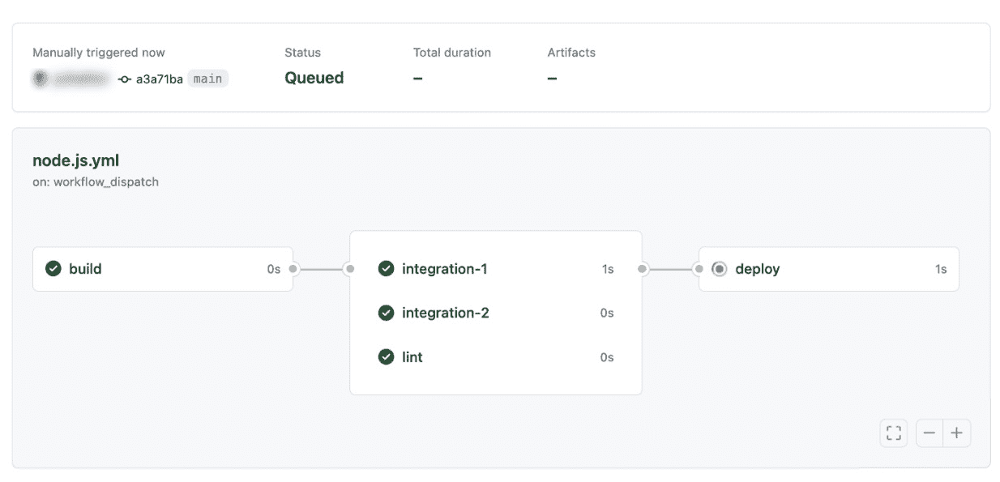

图 5.1 – GitHub Actions 内置可视化

本章深入探讨 GitHub Actions 的复杂性，提供对其功能、实现和最佳实践的详细理解。

## GitHub Actions 综合概述

GitHub Actions 提供了广泛的优势，以增强您的软件开发工作流程。以下是它为您带来的具体内容：

+   **自动化**：GitHub Actions 自动化了诸如代码构建、测试和部署等重复任务。它响应诸如代码推送和问题创建等事件，减少了人工干预的需求。

+   **多功能性**：它可以用于多种用途，包括构建容器化应用程序、部署 Web 服务、管理依赖关系等。这种灵活性使其能够适应不同的开发需求。

+   **CI/CD 自动化**：GitHub Actions 简化了 CI 和 CD 流程。它自动构建并测试代码变更，确保代码质量，简化部署管道，从而加速并提高发布的可靠性。

+   **改进协作**：它自动化代码审查流程，执行自动化测试，并根据工作流结果发送通知。这促进了团队成员之间更好的协作，因为他们可以专注于解决关键问题和改进。

+   **自定义**：GitHub Actions 允许通过 YAML 配置文件进行工作流的自定义。开发人员可以根据自己的特定需求调整工作流，并无缝集成第三方工具和服务以扩展功能。

创建工作流只需将一个 YAML 文件放入仓库的 `.github/workflows` 目录中，如下图所示。这一设置使得 CI 任务、拉取请求中的反馈集成以及拉取请求合并条件得以定义：

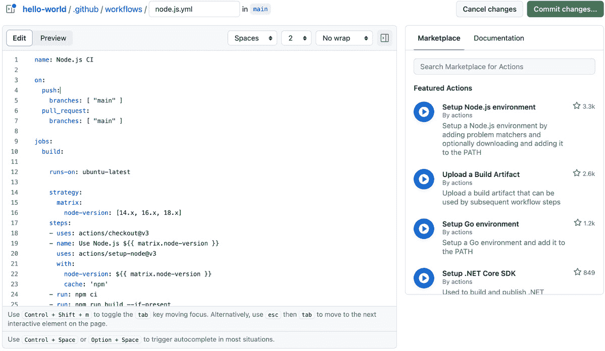

图 5.2 – 使用 YAML 轻松的开发体验

为了展示 GitHub 工作流的强大功能和灵活性，我们以一个典型的 Node.js 应用程序的 CI 工作流为例。每当推送到 `main` 分支或提交拉取请求时，这个工作流会被触发，可能包括 **构建**、**测试** 和 **部署** 等任务。每个任务都有其特定的目的——分别是构建项目、运行测试和部署应用程序。在这些任务中，步骤和动作被精心编排，确保 CI 过程中的每个环节都能顺利执行。从检出代码、设置 Node.js 环境到运行测试和部署应用程序，每个步骤和动作都扮演着至关重要的角色。接下来，我们将详细探讨其结构。

以下是一个典型的 GitHub Actions 工作流示例。该工作流是用 YAML 编写的，可能看起来有些困难。但如果你逐行查看，它其实非常简单且易于理解。请注意，这个示例是用来构建 Node.js 应用程序的，如果你只是直接粘贴此文件，它是无法正常工作的。如果你想尝试，可以从 Packt 仓库复制整个项目 ([`github.com/PacktPublishing/DevOps-Unleashed-with-Git-and-GitHub/tree/main/chapter5`](https://github.com/PacktPublishing/DevOps-Unleashed-with-Git-and-GitHub/tree/main/chapter5))：

```
name: Node.js CI
on:
  push:
    branches: [ "main" ]
jobs:
  build:
    runs-on: ubuntu-latest
    strategy:
      matrix:
        node-version: [16.x, 18.x]
    steps:
    - uses: actions/checkout@v3
    - name: Use Node.js ${{ matrix.node-version }}
      uses: actions/setup-node@v3
      with:
        node-version: ${{ matrix.node-version }}
        cache: 'npm'
    - run: npm ci
    - run: tsc
    - run: node dist/test
```

## 深入剖析 GitHub 工作流结构

GitHub 工作流代表了现代软件开发自动化的典范，这一功能从根本上改变了开发者处理 CI/CD 流程的方式。本章节将深入探讨 GitHub 工作流的复杂性，解析其结构和功能，帮助理解它们如何革新软件开发实践。

当你看到 YAML 文件时，可能会觉得它很难理解。没错，如果能在 GUI 中调整它，可能会更直观。但 GitHub Actions 工作流其实非常简单。

工作流可以分解为以下几个元素：

+   **工作流**：自动化的骨架，定义整个过程

+   **任务**：在相同环境中执行的一组步骤

+   **步骤**：工作流中的最小单元，每个步骤代表一个独立任务

+   **动作**：可重用的单元，组合成步骤以执行特定任务

如果我们将这些看作以下模块，它会更容易理解：

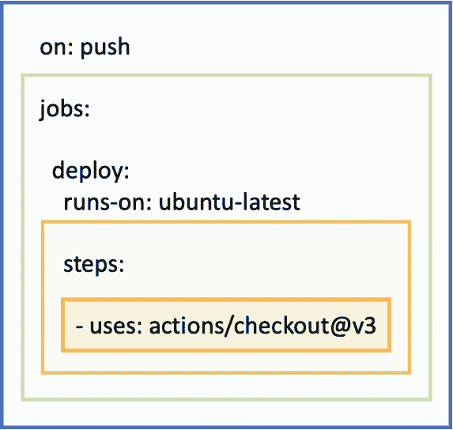

图 5.3 – GitHub Actions 工作流结构

我们将在以下子节中详细介绍这些元素。

### 工作流 – 自动化框架

GitHub Actions 的核心是 GitHub 仓库中 `.github/workflows` 目录的概念，这是你的自动化策略的蓝图。正是在这里，魔法开始了——每当发生 GitHub 事件（如推送或拉取请求）时，这些工作流就会启动，推动自动化的齿轮运转。

GitHub Actions 工作流可以与各种事件类型进行交互，每种事件都会触发在 YAML 文件中定义的不同自动化序列。以下子节将详细解释可以用来触发工作流的事件类型。

#### Webhook 事件触发

有多种触发器可以使用，但我们将在此提及一些典型的触发器：

+   `main` 分支。

+   **问题操作**：与拉取请求类似，工作流可以对问题活动（如创建、分配、标签和关闭）做出反应。这对于自动问题响应模板、优先级排序和问题分类非常理想。

+   **推送事件及其他事件**：推送事件可能是最常见的触发器，当提交被推送到仓库时会触发。由推送事件启动的工作流可以处理许多任务，包括代码扫描、构建、测试和应用程序部署。

以下示例会在推送到 `main` 时触发事件：

```
on:
  push:
    branches: [ "main" ]
```

#### 定时事件触发

工作流可以使用 Cron 语法设置为在特定时间运行。这个功能类似于一个闹钟，它会在预定的时间间隔触发你的工作流，非常适合夜间构建、定期清理或周期性同步任务。在此示例中，工作流每天在 UTC 时间 5:30 和 17:30 触发：

```
on:
  schedule:
    - cron:  '30 5,17 * * *'
```

#### 手动事件触发

`workflow_dispatch` 允许通过 GitHub UI 或 API 手动触发工作流。这提供了按需运行工作流的灵活性，特别适用于临时任务，如手动部署、数据导入或任何在执行前需要人工监督的操作。

以下是手动操作设置的示例：

```
on: workflow_dispatch
```

### 任务 – 执行单元

在每个工作流中，我们会遇到 **任务**。可以将任务看作是一个包含多个步骤的连贯组，这些步骤在同一个 runner 上一起执行。GitHub Actions 中的 runner 是安装了 GitHub Actions runner 应用程序的服务器。它本质上是执行你任务的地方。每个 runner 可以看作是一个干净、隔离的 **虚拟机**（**VM**），它为每个任务或工作流运行提供资源。GitHub 工作流中任务的魅力在于，除非明确指定彼此依赖，否则它们可以在不同的 runner 上并行运行。每个任务可以在各种 GitHub 托管的虚拟机上运行，这些虚拟机支持不同的操作系统，或者甚至在自托管的机器上运行，提供了前所未有的灵活性。

在以下示例中，`build` 作业是工作流过程中的一个基本组件，通常负责编译代码或生成构建产物。`build` 这个名称可以替换为任何你喜欢的作业名称。在你的配置中，`runs-on` 键指定了以下示例作业的执行环境，即 `ubuntu-latest` 运行器。这个选择指示 GitHub Actions 在平台上执行 `build` 作业，使用的是最新版本的 Ubuntu Linux。除此之外，你还可以选择 macOS 和 Windows。此外，你的本地计算机或内部部署的计算机可以注册为自托管运行器，使你能够在多种环境中使用它们，包括那些有严格网络要求或更大工作负载的环境：

```
jobs:
  build:
    runs-on: ubuntu-latest
```

GitHub Actions 中的 `strategy` 功能通过使用 `matrix` 选项简化了跨多个环境的测试。这个选项允许你定义一组不同的配置（如操作系统、编程语言版本或依赖项），并指定你的工作流要在哪些配置上运行。无需为每个配置手动设置多个作业，`matrix` 选项会动态生成每个你指定的配置组合的作业。这种方法避免了手动设置的冗余，并确保你的代码在不同版本的依赖项（如 Node.js）上都能正常工作。这是一种主动发现兼容性问题的方式，确保你的应用在不同环境中的稳定性。虽然这是可选的，但值得牢记：

```
jobs:
  build:
    strategy:
      matrix:
        node-version: [16.x, 18.x]
```

此外，可以按如下方式进行容器设置。如果你需要特定的容器环境，可以使用它来在灵活的环境中实现 CI/CD：

```
jobs:
  your-container-job:
    container:
      image: node:18
```

你还可以按照如下方式指定作业运行的条件：

```
jobs:
  production-deploy:
    if: github.repository == 'georgehattori/hello-world'
```

### 步骤 – 构建模块

深入来看，每个作业包含 **步骤**，即基本任务或操作。每个作业中的步骤按顺序执行，确保任务有序进行。这些步骤可以是简单的脚本或命令执行，也可以是执行一系列操作的复杂过程。步骤是工作流的构建模块，将自动化的大图拼接在一起：

```
steps:
- uses: actions/checkout@v3
- uses: actions/setup-node@v3
```

### 操作 – 定制的任务执行器

这些步骤中最细粒度的元素是 **操作**。操作是 GitHub 工作流的核心，封装了可重用的特定功能。从为特定任务量身定制的自定义操作到 GitHub 市场上丰富的现成操作，可能性是无限的。操作有多种形式，包括用于在运行器上直接执行的 JavaScript 操作、用于容器化操作的 Docker 容器操作，以及组合运行步骤操作，它们结合了多个运行命令。这种多样性使得高度定制成为可能，开发者可以根据自身的开发需求精确地制定工作流。

以下是 GitHub Actions 工作流中的一个代码片段，专门为 Node.js 项目定制，利用一系列命令和操作来准备运行时环境并构建应用程序：

```
- uses: actions/checkout@v3
- name: Use Node.js 14
  uses: actions/setup-node@v3
  with:
    node-version: '14'
    cache: 'npm'
- run: npm ci
- run: npm run build --if-present
- run: npm test
```

让我们更仔细地看看 GitHub Actions 的具体内容：

+   `name`：这本质上是一个标签，用于提高工作流文件的可读性。它帮助你和任何阅读工作流的人理解该步骤的目的。这里，它指定该步骤将设置 Node.js 版本 14。

+   `uses`：这个键指定要使用的操作。操作是可重用的代码块，可以执行复杂的任务。`actions/setup-node@v3` 指的是 `setup-node` 操作的第三个主版本，它用于配置 Node.js 环境。当你通过 `uses` 指定一个操作时，GitHub Actions 会获取该代码并作为步骤的一部分执行。

+   `with`：该步骤的这一部分向`uses`指定的操作传递输入参数。它自定义了操作的行为。对于`setup-node`，你提供了两项信息：Node.js 版本（`node-version: '14'`）和包管理器缓存设置（`cache: 'npm'`）。`cache`选项告诉操作缓存依赖项，这可以加速未来作业的执行。这是操作中的一个预定义参数，通常在市场中可用，或者是开源的。你可以创建自己的操作并分发给全世界，或者仅为内部使用创建并供内部用户使用。

+   `run`：这是一个运行命令行脚本的指令，它是你可以执行 shell 命令的地方。在这种情况下，`npm ci` 是一个命令，它会根据你的 `package-lock.json` 文件安装项目的所有依赖项。之后，它会构建并测试项目。

GitHub Actions 起初可能看起来很复杂，但一旦掌握了它，其实很简单。它本质上是一种控制脚本流的机制。

此外，GitHub 工作流不仅仅是执行任务；它们还简化和优化了开发过程。能够在不同的上下文中重用工作流的部分内容，例如在拉取请求验证中重用设置和测试步骤，体现了该平台对效率和可重用性的重视。在如今敏捷开发和快速迭代为常态的时代，这一方面尤为重要。

现在，让我们开始使用 GitHub Actions。由于有大量现成的模板可供选择，最好的方式是直接开始尝试它们。这些模板涵盖了广泛的自动化需求，从简化重复任务、在 CI 中自动化代码测试和构建，到在不同环境之间进行代码部署、实施关键的安全检查和措施。GitHub 上可以轻松访问大量的 GitHub Actions 模板，如下图所示：

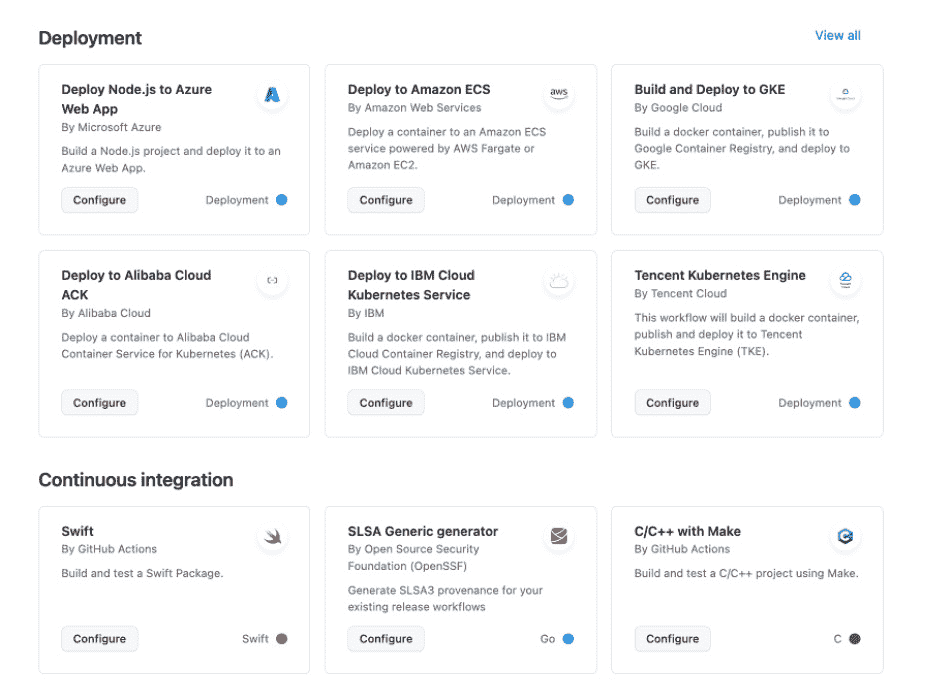

图 5.4 – GitHub Actions 的广泛模板

通过利用这些模板，你将能够高效、有效地发挥 GitHub Actions 的全部潜力。拥抱这一强大的工具，观察它如何改变你的开发工作流，使其更加简洁、安全和强大。

## GitHub Actions 最佳实践

有几个值得讨论的 GitHub Actions 最佳实践。它们包括减少冗余，这有助于通过消除不必要的重复来简化工作流。秘密和变量管理对于保持动作的安全性和效率至关重要。调试 GitHub Actions 工作流是一个必要技能，能够快速识别和修复问题。有效管理权限确保了保持正确的访问级别，而通过环境实施审批流程有助于控制部署流程并维护不同部署阶段的完整性。学习并应用这些最佳实践可以显著提高你在 GitHub Actions 中的熟练度。

现在，让我们一一查看它们。

### 减少冗余

高效地利用 GitHub Actions 的力量需要专注于减少冗余，这是工作流自动化中的一个关键最佳实践。这包括三个主要选项：

+   **利用 GitHub Marketplace**：在这里，你可以访问由社区创建的各种现有动作，适用于广泛的常见自动化任务。这种方式节省了时间，并利用了其他开发者的集体智慧。

+   **创建自定义动作**：对于 Marketplace 动作无法覆盖的独特需求，自定义动作提供了量身定制的解决方案。它们使你能够精准地解决项目的具体需求。

+   **实现可重用的工作流**：开发可以在多个项目中应用的工作流。这不仅简化了工作流设置过程，还确保了一致性和更容易的维护。

通过集成这些内容，你可以优化 GitHub Actions 的使用，从而实现更高效、一致和可维护的自动化流程，在你的**软件开发生命周期**（**SDLC**）中。以下是作为开源项目提供的各种动作：

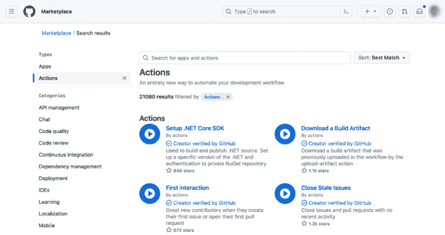

图 5.5 – GitHub Marketplace 中的动作

自定义动作和可重用工作流是读者接下来需要学习的内容。我们这里不深入探讨，但对于 GitHub Actions 的扩展使用，章节末尾的*进一步阅读*部分提供了详细资源的链接。

### 秘密和变量管理

在 GitHub Actions 中，管理秘密和变量对安全性和工作流定制至关重要：

+   `${{ secrets.NAME }}`，确保它们不会暴露在日志中或对未经授权的用户开放。一旦注册了一个秘密，它无法被检索，且注册值不会出现在 GitHub Actions 的控制台输出中。

+   `${{ env.My_Variable }}`。您可以直接在工作流程文件中设置环境变量，每个作业或步骤可以有不同的设置。

以下是在 GitHub Actions 中使用注册的秘密的示例，允许您以灵活的方式从工作流程外部注入值：

```
steps:
  - shell: bash
    env:
      MY_SECRET: ${{ secrets.MySecret }}
    run: |
      sample-command "$MY_SECRET"
```

正确管理秘密和变量对于维护 GitHub Actions 工作流程的安全性和效率至关重要。可以通过 GitHub 配置页面如下设置秘密和变量：

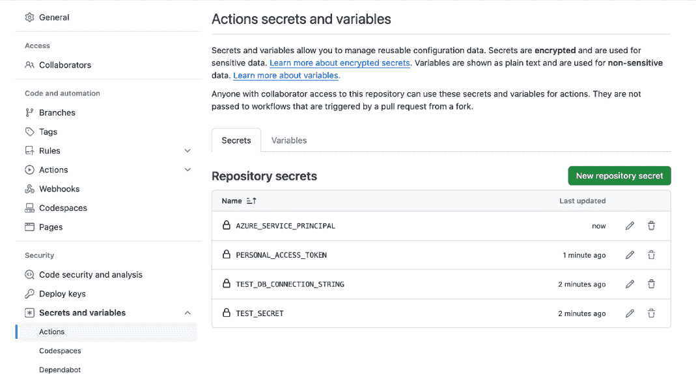

图 5.6 – GitHub Actions 的秘密和变量配置

### 调试 GitHub Actions 工作流程

在 GitHub Actions 中进行调试是一种重要的实践，以确保您的工作流程按预期运行，并识别和解决可能出现的任何问题。以下是一些关键点，帮助您有效地调试 GitHub Actions 工作流程：

+   `ACTIONS_STEP_DEBUG` 的值为 `true`。这将在执行操作期间为您提供更详细的信息，帮助您更容易地定位问题发生的位置和原因。

+   **运行日志访问**：GitHub Actions 自动为每次运行生成日志。这些日志可以在您的 GitHub 仓库的**操作**选项卡中访问。它们详细记录了工作流程的每个步骤中发生的情况。

+   `act` ([`github.com/nektos/act`](https://github.com/nektos/act)) 允许您在本地机器上运行工作流程。这对于测试复杂的工作流程而无需推送更改到您的仓库非常有帮助。它可以加快修复和优化操作的迭代周期。

+   在您的工作流程文件中使用 `workflow_dispatch` 事件触发器可以手动触发工作流程。这对于在推送或拉取请求事件上触发工作流程之外进行更改测试非常有用。

创建 GitHub Actions 工作流程时需要牢记的其他事项包括以下内容：

+   **简化工作流程**：将复杂的工作流程分解为更小、更易管理的部分，以便隔离和识别问题。

+   **利用操作输出**：使用操作的输出进行诊断目的。这些输出可以揭示不同步骤的行为。

+   **迭代方法**：在对工作流程进行更改时，逐步进行。在实施下一个更改之前，彻底测试每个更改。这种方法有助于隔离每个更改的影响，使调试变得更容易。

有效地调试 GitHub Actions 工作流程需要结合使用详细日志、本地测试工作流程、简化复杂设置以及手动触发工作流程。这些实践有助于快速识别和解决问题，确保您的 CI/CD 过程健壮可靠。

### 权限

在 GitHub Actions 中管理权限对于维护工作流过程的安全性和完整性至关重要。本节内容将重点讲解如何为 GitHub 工作流中的操作设置和管理适当的权限：

+   `GITHUB_TOKEN`，一个由 GitHub 生成的特殊令牌，供工作流使用。默认情况下，这个令牌的作用范围限于包含工作流的仓库，确保操作不会无意中影响其他仓库或敏感数据。

+   在工作流文件中使用`GITHUB_TOKEN`来为特定任务或整个工作流提供令牌。这允许你根据单个任务的需求，限制或扩展令牌的功能，增强安全性并降低风险。权限在工作流文件中使用 permissions 键进行设置。你可以为各种 GitHub API 范围指定权限，如内容、问题、部署等。以下是此类设置的示例：

    ```
    # Sets permissions of the GITHUB_TOKEN
    permissions:
      contents: read
      pages: write
      id-token: write
    ```

+   **最小权限**：遵循**最小权限原则**（**PoLP**），只授予执行特定操作或任务所需的最低权限。除非绝对必要，否则避免授予广泛的或管理员级别的权限。

通过细致地管理 GitHub Actions 中的权限，你可以保护工作流免受未经授权的访问、错误和潜在的安全漏洞。这涉及到设置精确的令牌权限、安全管理机密以及定期审查访问级别，以符合 PoLP。实施这些做法将显著增强你的 CI/CD 流水线的安全性。

### 环境中的审批流程

在软件部署和持续集成（CI）的动态世界中，GitHub Actions 通过其**环境**功能带来了至关重要的控制和监督元素。这一创新功能显著提升了团队处理部署工作流的方式，尤其是在审批流程和遵循特定操作条件方面。

GitHub Actions 中的环境作为工作流中的专用空间，每个环境都针对特定阶段，如测试、预发布或生产进行定制。这些环境的特点在于它们可以通过独特的规则和访问控制进行定制。它们不仅仅是工作流的部分，而是被控制的领域，每个领域都有其独特的权限和秘密。这确保了敏感信息和操作仅限于最相关的区域，从而增强了整个过程的安全性。

环境的核心价值在于它们在促进审批工作流中的作用。假设有一个场景，任何部署到生产环境的操作都需要经过仔细审查。环境通过集成手动审批流程使这一点成为可能。当部署到达生产阶段时，它会触发工作流的暂停，等待授权人员的批准。这种暂停不仅仅是操作的中止；它是一个关卡，确保每个更改在影响生产环境之前都经过审查。带有**环境**的审批流程无缝集成到 GitHub Actions 的体验中，如下图所示：

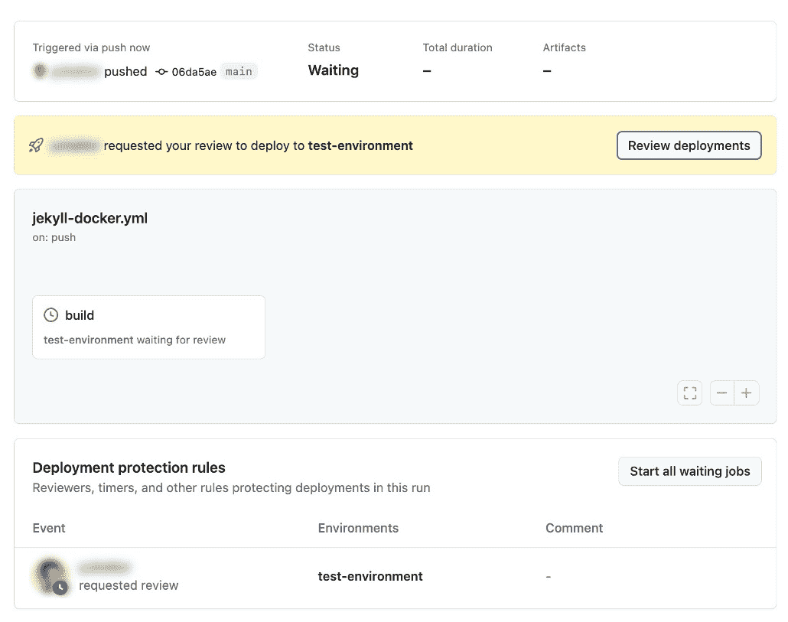

图 5.7 – 环境中的审批

除了单纯的审批外，GitHub Actions 中的环境还允许进行复杂的条件设置。环境中的作业可以配置为仅在特定情况下运行，例如在某些分支上或响应特定事件时。这样的控制细节确保了工作流遵循项目的精确操作标准，避免了任何意外的部署或操作。

在这些环境中引入保护规则进一步强化了工作流的安全性。通过设置诸如强制审核者等要求，组织可以强制执行合规性并维持高安全标准。这不仅仅是为了确保工作流的安全性；更是为了将其与组织的协议和最佳实践对齐。

因此，环境不仅仅是 GitHub Actions 的一个附加功能；它是在管理部署工作流方面的一个范式转变。它引入了一个安全性、控制性和合规性层面，这在现代软件开发中是不可或缺的。环境确保了 CI/CD 流水线中的每一步，特别是涉及敏感阶段（如生产环境）的步骤，都会在严格审查和定义的操作指南范围内执行。这不仅仅是 GitHub Actions 促进自动化，而是在关注安全性、可靠性和组织完整性的同时进行自动化。从**环境**配置中，你可以添加保护规则设置，例如添加审批人：

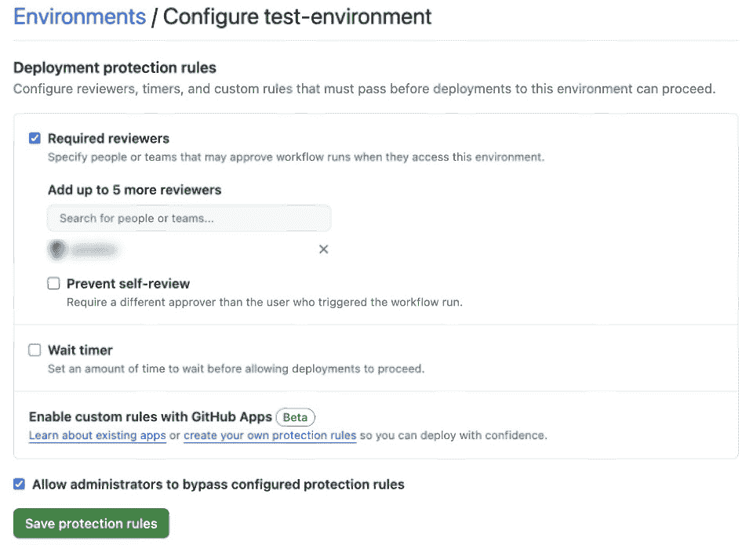

图 5.8 – 环境配置

GitHub Actions 作为一个多功能工具，适应广泛的开发场景，使其成为现代软件开发团队不可或缺的资产。无论是自动化常规任务、确保代码质量还是部署应用程序，GitHub Actions 提供了高质量软件交付所需的工具和灵活性。

现在，让我们来看一些使用 GitHub Actions 部署的应用实践。

# 部署策略

在 DevOps 中，重要的是要将*失败*视为系统的一部分。在 DevOps 的动态世界中，拥抱失败不仅是推荐的做法，而是至关重要的。与传统观点中将失败视为挫折不同，在 DevOps 中，失败承担着转变的角色。它不仅仅是一个事件或意外结果，它是 DevOps 不可或缺的一部分。

在传统的部署方法中，广泛的检查和平衡是常态，旨在尽量减少故障的发生。然而，现代开发的快速节奏，如敏捷开发，显著改变了这一方法。在现代开发中，环境不断变化，服务也在不断更新。如果这些变化不能迅速有效地进行，可能会导致服务退化或故障。因此，构建一个具有韧性、能适应这些快速变化的系统变得至关重要。

在这种背景下，目标不是完全避免失败，而是创造一个可以管理失败并最小化其影响的环境。这涉及到采用预见性策略，实施机制，在必要时迅速恢复或回滚变更。关键是将健壮性和韧性融入系统中，确保系统能够承受并从失败中恢复，而不仅仅是追求无故障的运行。本节将深入探讨如何将失败作为 DevOps 中的系统性必要性加以接受。

传统上，基础设施和应用程序部署的领域是分开的。然而，DevOps 的出现带来了一个时代，打破了这些边界，形成了一个统一的环境。如今，基础设施配置也通过**基础设施即代码**（**IaC**）来定义。这意味着基础设施和应用程序可以同时发布。在 DevOps 的背景下，你需要在这两个方面都稳定地部署基础设施和应用程序。

让我们来看一些在部署服务时特别常见的实践。

## 蓝绿部署

蓝绿部署是一种软件部署策略，通过维护两个相同的生产环境来最小化停机时间和风险。这种方法允许在软件版本之间进行安全和平滑的过渡。如下面的图示所示，负载均衡器或**平台即服务**（**PaaS**）服务的功能切换流量：

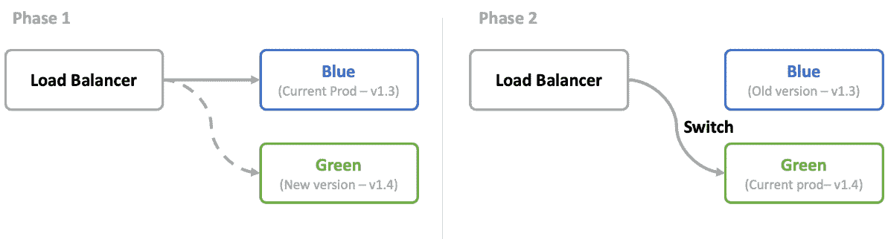

图 5.9 – 蓝绿部署

在这种策略中，蓝色环境承载当前的在线版本，而绿色环境用于新的版本。一旦绿色环境中的新版本完全测试并准备好，流量就会从蓝色切换到绿色。

这种方法的关键好处包括以下几点：

+   **轻松回滚**：如果在绿色环境上线后发现问题，可以快速将流量重新引导回稳定的蓝色环境。

+   **最小化停机时间**：蓝绿部署使您能够在没有任何停机时间的情况下发布新版本的软件。新版本与旧版本并行部署，且切换瞬时完成。

+   **简便测试**：开发人员和**质量保证**（**QA**）团队可以在类似生产的环境中彻底测试新版本，而不会影响最终用户。

蓝绿的术语常常被视为类似于诸如预发布、质量保证和生产等环境的同义词，但它并不完全相同。与传统的预发布到生产的升级方式不同，这种方法中的蓝色和绿色环境都是生产级别的。

尽管有其优点，但也存在一些显著的挑战：

+   **需要两个生产环境**：这可能会消耗大量资源并且成本较高。即使在云计算环境中，维护两个完整的生产环境也可能是昂贵的。

+   **不可逆更改的挑战**：如果某些更改（如数据库架构更新）不向后兼容，回滚可能会变得复杂。

+   **有状态应用程序的考虑**：在不同环境之间同步有状态数据可能会比较复杂。

### 常见步骤

蓝绿部署在 Web 应用程序中的一个实际示例，其中当前实时版本为 1.3，在蓝色环境中，目标是部署版本 1.4，具体步骤如下：

1.  **部署**：首先将新版本 1.4 部署到绿色环境。该环境是现有蓝色环境的副本，但托管的是新版本。

1.  **验证**：在绿色环境中进行全面测试。此步骤至关重要，以确保新版本正常运行并满足所有必要的要求。

1.  **流量切换**：验证成功后，下一步是切换用户流量。这是通过更新负载均衡器设置，将流量从蓝色环境（版本 1.3）重定向到绿色环境（版本 1.4）。

1.  **监控**：流量切换后，密切监控绿色环境中的任何操作问题或异常行为。这个监控阶段对于迅速识别和解决部署后可能出现的任何问题至关重要。

1.  **最终确认**：如果绿色环境中的版本 1.4 运行顺利且没有发现重大问题，则视为部署成功，绿色环境将成为新的生产环境。然而，如果出现严重问题，您可以选择及时将流量切换回稳定的蓝色环境（版本 1.3），以最小化干扰和风险。

这种系统化的方法确保了应用版本之间的平稳过渡，在整个部署过程中保持系统的稳定性和可用性。

### 实际场景

实现成功的蓝绿部署策略需要对基础设施和平台内可用的工具有全面的了解。实施方法可能会根据你使用的是**基础设施即服务**（**IaaS**）与虚拟机（VM）还是带有负载均衡器的 PaaS 而有所不同。

这里是不同方法的详细介绍：

+   **DNS 负载均衡器**：在这种方法中，蓝绿环境之间的切换是通过 DNS 重写来管理的。该方法通常用于环境托管在不同的服务器或集群上时。

+   **第四层网络负载均衡器**：这些负载均衡器通过**网络地址转换**（**NAT**）进行切换。这是一种适合在同一网络基础设施中切换环境的选项。

+   **第七层应用负载均衡器**：在这里，不同应用版本的路由是在应用层进行管理的。该方法提供了更细粒度的流量分配控制，通常用于复杂的部署中。

许多 PaaS 解决方案自带负载均衡功能，简化了蓝绿部署过程。在这些设置中，负载均衡器可以轻松配置以在蓝绿环境之间切换流量。在这种情况下，用户可以仅通过配置来设置切换，而无需意识到负载均衡器的存在。

在更先进的环境中，如**Kubernetes**（**k8s**），网络资源作为基础设施即代码（IaC）进行管理，提供动态分配的能力。这使得通过修改 IaC 配置来实现蓝绿部署成为可能，通常通过编辑 YAML 文件来实现。尽管许多 PaaS 解决方案会将网络配置的复杂性抽象化，某些平台，如 Kubernetes，仍然在单一集群内维护网络配置，从而使得同样的蓝绿部署方法可以在集群内无缝应用。

### 切换方法

那么，我们如何切换环境呢？有几种可能的方式，让我们来看一下：

+   **单独的脚本或图形用户界面（GUI）用于负载均衡器配置**：一些团队倾向于将切换过程与主要的部署脚本分开处理。这可以通过专用脚本或通过 GUI 完成，从而在切换过程中提供更多的控制和监督。

+   **在部署脚本中配置负载均衡**：这种方法涉及在部署脚本中直接编写负载均衡器设置的变化。这是一种简化的方式，可以将切换过程作为部署管道的一部分进行自动化。

+   **自动化**：自动化包括对新版本进行自动化测试，确保只有在新版本成功运行时才会进行切换。这涉及为发布设置特定条件，通常依赖于**端到端**（**E2E**）测试和对新环境中的错误进行监控。

需要注意的是，切换时机和现有连接的处理可能会根据所使用的系统和服务有所不同。每种方法都有其独特之处，需要精心规划，以确保平稳过渡，并尽量减少对用户的干扰。

## 滚动部署

滚动部署是一种用于分布式系统的部署策略，通过逐步在集群的节点上应用更新。该方法减少了停机时间，并确保在更新应用程序或系统时保持**高可用性**（**HA**）。

它用于像 Kubernetes 这样的集群中，进行稳定版本发布且不产生停机时间。滚动部署涉及逐步发布，如下图所示：

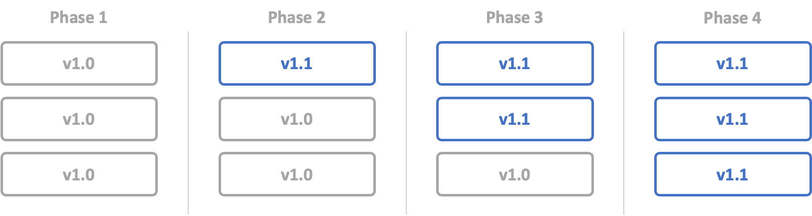

图 5.10 – 滚动部署

通过这种方式，我们可以安全地逐个更新每个版本。

### 典型步骤

集群滚动部署的过程通常包括以下步骤：

1.  **准备工作**：在开始更新之前，确保系统准备好进行升级。这包括对关键数据进行备份，并准备好要部署的新版本软件或配置。

1.  **更新第一个节点**：通过选择一个单独的节点开始滚动更新。在应用更新之前，不是将该节点下线，而是在节点仍在服务时应用更新。一个带有更新配置或软件的新实例会与现有实例一起启动。

1.  **健康检查**：新实例启动并运行后，进行彻底的健康检查。这一步骤至关重要，以确保新实例配置正确，能够顺利处理预期的工作负载且没有问题。

1.  **流量切换**：在确认新实例健康后，逐步将流量从旧实例切换到新实例。这可能涉及调整负载均衡器设置或服务发现配置，以指向新实例。

1.  **移除旧实例**：一旦新实例成功处理流量，旧实例就可以安全地从服务中移除。这可以确保没有停机时间，因为服务在更新过程中持续不中断。

1.  **渐进式发布**：继续进行滚动更新，通过逐个节点地重复此过程。逐一更新每个节点，确保每个新实例在停用旧实例之前都能健康运行并处理流量。

1.  **监控**：在更新过程中，持续监控系统是否存在问题。特别关注性能指标和错误日志，以便快速识别和解决任何问题。

1.  **完成操作**：在所有节点更新并删除旧实例后，滚动更新完成。进行最后审核以确保整个系统稳定，按预期运行，并且所有实例都在运行新版本。

### 实际应用场景

在实际应用场景中，集群滚动部署在连续可用性至关重要的环境中尤为重要。此方法通常用于云计算服务、数据中心和大型网络应用程序。例如，更新 Kubernetes 集群或数据库集群经常使用此策略，以避免停机和服务中断。此外，请注意滚动升级包括应用上下文和基础设施上下文。在 Kubernetes 的情况下，除了集群端升级外，还存在应用升级的相应过程。

可通过在服务运行时进行现场升级完成，但在金融服务等关键服务中，可能与其他发布策略结合使用。这类似于云负载均衡器前面的蓝绿部署和分布式集群本身。

尽管某些情况下确实存在失去滚动升级优势的论述，但这意味着开源项目和服务供应商通常认为的最佳配置实践未必与实际可采用的配置相匹配。

### 切换方法

滚动部署的方法难易程度因系统是否支持作为特性而异。在诸如 Kubernetes 之类的集群编排器中，可以使用自动编排器推出更新节点并进行健康检查的流程管理器，同时也存在通过手工传统实现滚动部署的情况。

例如，如果单租户服务托管在为个别公司提供隔离环境的环境中，并且每个环境都需要更新，则将客户分层部署并逐步进行更新。虽然这也是一种滚动部署类型，但明确引用 DevOps 实践通常会涉及自动化实践。

集群滚动部署对于在升级或维护过程中维护分布式系统的可靠性和稳定性至关重要。通过顺序更新节点，此策略最小化了系统范围故障的风险，并确保在整个过程中服务仍然对用户可用。

## 金丝雀部署

金丝雀部署是一种技术，通过逐步向用户的一小部分推出新软件版本，然后再向整个用户群体部署。此方法允许开发人员在实际环境中以最小风险测试新版本。

在金丝雀部署中，新的版本不会一次性发布给所有用户，而是首先向一小部分用户——**金丝雀**——推出。这个小组充当潜在问题的早期指示器，因此得名*金丝雀*，类似于过去矿井中用来检测有害气体的金丝雀。通过监控这些初始用户的软件行为和表现，开发人员可以在全面发布前识别并解决任何问题。如图所示，切换是逐步进行的，一旦确认稳定性，范围就会扩大：

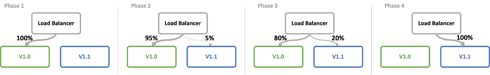

图 5.11 – 金丝雀部署

这本质上与滚动部署相同，但在持续时间以及与之相关的活动和目标上有所不同。滚动部署的目的是通过完全替换应用运行基础设施，逐步用新版本替换旧版本，并在短时间内执行健康检查并完全替换。在大多数情况下，这通常在几分钟到几小时内完成。对于大型系统，可能需要几天时间。

另一方面，金丝雀发布需要较长的时间来观察系统如何响应用户行为，并利用这些反馈进行稳定版本的发布。

尽管金丝雀发布有时会与面向用户子集的测试版发布混淆，但需要注意的是，金丝雀发布显然是一种以发布稳定性为主要目标的实践。面向用户子集的测试版发布方法将在*功能* *标志*部分中详细介绍。

金丝雀部署的关键好处包括以下几点：

+   **风险缓解**：通过限制新版本的曝光，任何负面影响都能被控制，且只影响少部分用户群体。

+   **真实世界测试**：提供一个观察新版本在真实环境中表现的机会。

+   **用户观察**：从一部分用户那里进行早期观察，对于在更广泛发布前进行调整至关重要。

+   **逐步发布**：提供一种受控方式来管理发布过程，降低广泛问题发生的可能性。

然而，它也有其挑战：

+   **分组**：决定哪些用户应该属于金丝雀组可能具有挑战性。

+   **监控复杂性**：需要强大的监控工具来有效跟踪新版本的性能。

+   **一致的用户体验**：确保所有用户都能获得一致的体验，无论他们使用的是哪个版本，这可能很困难。例如，当开发一个新的后端服务时，必须确保它的发布不会影响当前服务的正常运行。

### 典型步骤

让我们来看看这些步骤：

1.  **部署**：最初，将新版本部署到基础设施的少部分部分，这部分将服务于你的一小部分用户。

1.  **监控和分析**：密切观察应用程序的行为。使用度量指标、日志和用户反馈来评估性能并识别问题。

1.  **扩展**：如果初始部署成功，逐步增加访问新版本的用户比例。继续监控并分析用户反馈和系统性能。

1.  **全面发布**：一旦确认新版本稳定且获得良好反馈，即可进行全量发布，推向所有用户。

1.  **必要时回滚**：如果在金丝雀阶段发现重大问题，迅速回滚更改以最小化影响。

### 现实世界场景

金丝雀发布将根据用户数量和要部署的服务进行不同的应用。

例如，当微软应用金丝雀发布来部署 Azure 功能时，金丝雀可以从特定的数据中心或数据中心集群中选择。这是因为它能够清晰地缩小受影响的用户范围，最小化影响。这个清晰的用户焦点的另一个好处是可以持续观察情况。当通过部署到特定集群或数据中心来确认稳定性时，下一步是将部署范围扩展到更广泛的目标。

在无法针对特定数据中心或集群进行定位的情况下，金丝雀发布通常以更随机的方式执行，利用云平台的能力。例如，考虑将一部分用户（例如 5%）随机引导到一个新配置的环境中。这种方法采用基于权重的分配策略，最初选择一个小比例（如 5%），然后逐步增加到 10%、25%，最终达到 100%，随着对新环境的信心逐步增强。在此过程中，负载均衡器配置为将定义的用户请求比例分配到暂存环境或新环境中。许多云负载均衡器使用这种基于权重的方法。

为了提高用户体验的一致性，一些服务使用 cookies 来确保来自同一客户端的后续请求被引导到相同的实例。然而，在这种模型下，流量分配的主要方法仍然是随机的。例如，在 5%的用户被引导到新环境且新版本存在错误的情况下，用户遇到错误的可能性是 5%，但所有用户都有这种可能性。

或者，一种更确定性的方法是使用基于头部的路由。这种技术涉及将特定信息插入请求头中，然后利用这些信息来引导流量。通过为特定用户或用户群体进行定向试验，这种方法减少了随机性。这种方法的可行性取决于所使用云服务的功能。

这两种方法都提供了逐步曝光新更新或功能的机制，但每种方法的控制程度不同。例如，DNS 负载均衡器无法读取头部信息，因此它们基本上只是分配权重，但可能能够按国家分配。而七层应用负载均衡器则可以读取头部信息和其他信息。

### 金丝雀选择方法

在金丝雀部署中，如何管理用户接触新版本的方式至关重要。可以使用多种方法来控制这种曝光：

+   **基于权重的方法**：这种方法涉及将一定比例的流量分配给新版本。例如，最初，5%的用户可能会被导向新的环境，随着对新版本信心的增加，逐步增加到 25%、50%甚至最终 100%。负载均衡器通常会根据预定义的权重来处理这种流量分配。

+   **基于头部路由**：这种技术利用添加到请求头中的特定信息，将流量导向适当的版本。这种方法比基于权重的路由更少随机，允许进行更具针对性的测试，例如根据头部标准将新版本暴露给特定的用户组或个人。

+   **基于 Cookie 的路由**：一些服务使用 Cookie 来确保来自同一客户端的后续请求始终定向到相同的版本（无论是新版本还是旧版本）。这种方法有助于保持一致的用户体验，特别适用于会话持久性。

+   **基于地理的分布**：在某些情况下，可以根据用户的地理位置分配流量。例如，一些 DNS 负载均衡器可以根据国家或地区不同来路由流量，这对于希望先在特定区域推出更新的全球服务特别有用。

选择正确的切换方法是金丝雀部署中的一个关键决策，因为它直接影响着有效测试新版本的能力，以及在初始发布阶段可能出现的任何问题的应对方式。

金丝雀部署是一种软件发布的战略方法，提供了风险缓解与现实世界测试的平衡。通过逐步引入变化，它使软件部署能够采取更有衡量和信息支持的方法。

我们已经了解了如何部署应用程序以及如何无缝、安全地发布它们。现在，我们已经看到了部署的策略，接下来我们将看看如何在更具功能性的层面进行发布。

# 功能发布策略

到目前为止，我们主要关注发布基础设施和服务整体，但现在，我们将重点放在发布服务内的功能上。对于功能发布，我们引入了一种发布风格，叫做功能标志和发布列车。

## 功能标志

功能标志部署是一种在软件开发和交付中使用的技术，涉及在不部署新代码的情况下切换应用程序的某些功能。这种方法允许对功能发布、测试和回滚进行更精细的控制，使软件管理变得更加动态和灵活。

使用功能标志的主要缺点是，功能标志很容易成为技术负担。未使用的功能标志可能会让代码库变得杂乱无章。功能标志为特定的用户或群体启用功能，如下图所示：

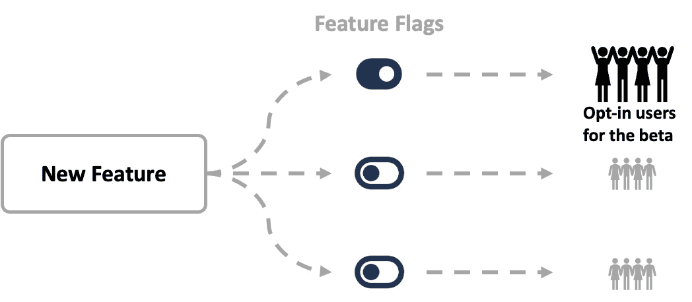

图 5.12 – 功能标志

暗启动通常发布给不知道自己正在被测试的用户群体，并且这些用户完全不知道新功能。另一方面，这样的优势在于，它可以应用于任何希望进行此操作的用户群体，而不仅仅是特定的用户类别。

### 典型步骤

功能标志的实现通常包括以下步骤：

1.  **功能标志在代码中的实现**：开发人员为新功能编写条件代码，由功能标志进行控制。这些标志可以切换开启或关闭，决定功能是否激活。

1.  **与功能管理系统的集成**：功能标志随后与功能管理系统集成，使得能够在不修改代码库的情况下控制和更改标志。

1.  **测试**：在向所有用户启用功能之前，通常会先在有限的用户群体中进行测试，这类似于金丝雀发布。这些测试可以根据用户群体、地理位置或其他标准进行定向。

1.  **逐步推出**：在初步测试后，功能可以逐步推广给更多用户，从而仔细监控其影响和表现。

1.  **监控与反馈**：持续监控对于快速识别问题至关重要。在推出阶段，用户的反馈对于进一步的改进也非常宝贵。

1.  **全面推出或回滚**：根据反馈和表现，功能可以完全推广给所有用户，或者通过简单地关闭功能标志进行回滚。

### 现实世界场景

功能标志是现代软件团队的重要工具，使他们能够更高效、更有控制力地交付功能。这种方法降低了部署新功能时的风险，并允许更加敏捷的产品开发和迭代。它们的应用遍及软件开发的各个方面，包括 A/B 测试和暗启动。

以下小节展示了这些应用的现实世界示例。

#### A/B 测试

假设一家电商公司的软件团队可能会使用功能标志来测试两种不同的结账页面设计。他们将创建两个变体：设计 A（当前设计）和设计 B（新设计）。通过使用功能标志，他们可以将设计 B 展示给一小部分随机用户，同时其他用户继续看到设计 A。然后，团队监控**关键绩效指标**（**KPI**），如转化率、**平均订单价值**（**AOV**）和用户反馈。这些数据帮助他们了解哪种设计在用户参与度和销售转化方面表现更好。根据结果，他们可以决定将设计 B 推广到所有用户，继续改进，或者恢复设计 A，所有这些都不会对整体用户体验造成太大干扰。

#### 暗启动

一个社交媒体平台可能会使用暗启动来测试一个新功能，比如增强版的图像识别算法。他们将该功能*暗中发布*，意味着它已经上线但对用户不可见。平台随后收集关于新算法在准确性和速度方面与旧算法相比的表现数据，而用户并未意识到这一变化。

这种方法使平台能够收集关于该功能在真实环境中的表现数据，并在将其公开给用户之前解决任何问题。如果新算法表现不如预期，他们可以在不影响用户体验的情况下进行调整或回滚。

功能标志部署使团队能够更有信心和控制地测试和发布功能。通过将部署与发布解耦，它允许更多的灵活性、更快的迭代，并降低软件开发过程中的风险。

## 发布列车

发布列车是软件开发中的一个概念，强调定期、按计划交付新功能、增强和修复。它协调多个团队和流程，确保发布周期的协调性和可预测性，从而显著提高软件部署的效率和可靠性。如下面的图示所示，发布列车只会发布那些满足截止日期的内容：

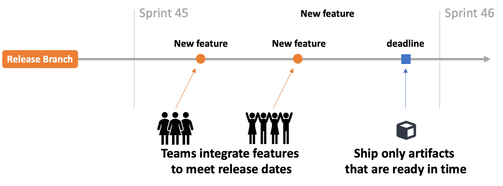

图 5.13 – 发布列车

### 典型步骤

发布列车方法通常包括以下步骤：

1.  **规划与协调**：建立所有团队都必须遵守的发布日程。该日程包括固定的时间间隔（例如，每两周一次或每月一次），在这些时间点发布新功能和更新。

1.  **开发与测试**：团队在定义的时间表内工作，开发各自的功能和修复。采用 CI 和**持续测试**（**CT**）来确保代码质量和兼容性。

1.  **集成与预发布**：所有功能、增强和修复都被集成到预发布环境中。这个阶段对于识别任何集成问题至关重要，并确保所有组件能够无缝协作。

1.  **发布评审**：与所有利益相关者进行评审会议，确保发布准备好部署。会议评估发布的质量、功能和潜在影响。

1.  **部署**：一旦获得批准，按照计划将发布部署到生产环境中。部署过程通常是自动化的，以减少人为错误并提高效率。

1.  **监控与反馈**：发布后，持续的监控至关重要，能够快速识别并解决任何部署后的问题。收集用户和利益相关者的反馈，以便进行未来的改进。

### 现实场景

在大型软件组织中，发布火车方法可以显著简化部署过程。例如，一家开发一系列商业应用程序的公司可能会有多个团队分别处理财务、人力资源和运营等不同模块。通过采用发布火车模型，组织确保所有模块的更新都能够协调一致地发布。每个月，各团队的新功能和更新被整合、测试，然后同时部署。这种同步避免了不同团队独立部署更新时可能出现的复杂性和冲突。

此外，这种方法为客户提供了可预测的更新计划，使他们能够为新功能和更新的采用做出规划。它还允许组织内部更高效地分配资源，因为各团队可以根据发布计划安排工作量。

本质上，发布火车模型促进了一个有纪律、可预测且高效的发布过程，既有利于开发团队，也有利于最终用户。

# 总结

本章为你提供了将开发工作流程转化为自动化卓越模型所需的知识和技能。通过本章的学习，你从 GitHub Actions 的基础元素，到处于现代软件实践前沿的战略部署与发布技术都有了深刻的了解。要进一步深入，你需要加强对测试与并发的理解。这些不仅仅与管道的构建方式相关，还与测试和集成的哲学息息相关。希望你能继续深入学习。

通过接受本书中所阐述的实践和策略，你现在已经具备了构建高效、强大、安全且符合最高标准的工作流程的能力。希望本章能成为你在不断创新和卓越的过程中始终的伙伴。在接下来的章节中，我们将深入探讨 DevOps 指标、DevSecOps 以及如何扩大协作，探索这些概念如何在提升软件开发与部署效率和安全性方面发挥关键作用。

# 进一步阅读

+   *关于自定义* *操作*：[`docs.github.com/en/actions/creating-actions/about-custom-actions`](https://docs.github.com/en/actions/creating-actions/about-custom-actions)

+   *复用* *工作流*：[`docs.github.com/en/actions/using-workflows/reusing-workflows`](https://docs.github.com/en/actions/using-workflows/reusing-workflows)

# 第三部分：超越 DevOps

本部分详细分析了 DevOps，强调了度量标准的作用，DevSecOps 实践的融入，以及在组织中扩展协作的策略。接着，焦点转向 AI 在软件开发中的集成，探讨了如 GitHub Copilot 等工具，以及使用 AI 辅助编程的最佳实践，包括提示词编写和适应 AI 的编程原则。最后，回顾了 Git、GitHub、DevOps 和 AI 等技术在软件开发中的变革性影响，思考了 AI 对软件工程实践未来的影响。

本部分包含以下章节：

+   *第六章**, 丰富 DevOps 实施*

+   *第七章**, 利用 AI 加速生产力*

+   *第八章**, 反思与总结*
