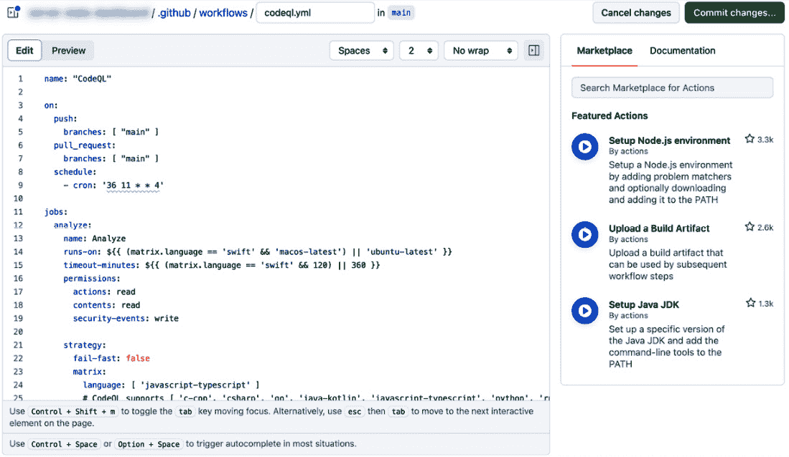

# 丰富 DevOps 实施

在本章中，我们采取全面的方法来探讨 DevOps，研究衡量开发过程的关键作用，通过 DevSecOps 融入安全实践的过程，以及如何有效扩展组织内的协作。我们将深入探讨工具（如 GitHub）如何推动可见性和性能，探讨如何将安全无缝融入开发生命周期，并讨论如何培养基于信任的协作文化，强调 InnerSource 原则以有效扩展 DevOps 实践。本章提供了对现代 DevOps 多面性本质的深入理解。

本章将讨论以下主要内容：

+   在 DevOps 中利用指标

+   DevSecOps – 安全作为一个持续问题

+   扩展协作

# 在 DevOps 中利用指标

在 DevOps 中衡量指标意味着什么？在 DevOps 中衡量指标是指量化软件开发和交付过程的各个方面，以提高效率、质量和协作。指标提供了一个基于数据的方法来评估性能、识别瓶颈并支持决策过程。它们对于持续改进至关重要，使团队能够跟踪目标进展，并使努力与组织目标保持一致。

在 DevOps 中，指标可以分为不同类型。性能指标，如部署频率和变更交付时间，衡量部署管道的效率。质量指标，如缺陷率和平均恢复时间，评估软件的稳定性和可靠性。过程指标则关注开发过程的效率，而人员指标则聚焦于团队的表现和满意度。

工具和自动化对于有效衡量这些指标至关重要。**持续集成**/**持续部署** (**CI**/**CD**) 工具，如 **GitHub Actions**、问题跟踪系统和应用性能监控工具，通常用于收集和分析数据。接下来我们将讨论一些著名的指标测量方法和理念。

## 四个关键指标 – DORA 指标

**DevOps 研究与评估** (**DORA**) 指标，在 Nicole Forsgren、Jez Humble 和 Gene Kim 合著的影响力书籍《加速》中首次提出，已成为软件开发中的一个关键框架。这些指标，通常被称为**四个关键指标**，不仅仅是简单的指标；它们提供了一个全面的方法来评估和改进 DevOps 实践。

以下列表有助于理解 DORA 指标：

+   **部署频率**：这是衡量你成功发布到生产环境的频率。目标是进行定期且较小规模的部署。这种方法能够减少风险，并促进持续反馈和改进的文化。

+   **变更的前置时间**：此指标跟踪从代码提交到生产部署的时间。通过简化开发和质量保证流程来缩短这一时间，可以提升团队的效率和适应市场变化的能力。

+   **变更失败率**：此指标评估生产中失败的部署占比。通过改进测试、质量保证和监控，可以减少这些失败，从而提高发布的质量。

+   **恢复平均时间（MTTR）**：此指标衡量从生产故障中恢复的平均时间。制定强健的事件响应策略并投资自动化，可以帮助缩短这一时间，确保系统的可靠性。

以下是许多团队喜爱并使用这些指标的原因：

+   **客观洞察**：DORA 指标为您的团队表现提供清晰、量化的洞察，支持数据驱动的决策。

+   **改进的路径**：通过这些指标识别优点和缺点，帮助在 DevOps 实践中针对性地进行改进。

+   **行业基准**：这些指标使您能够将自己的实践与行业标准进行比较，旨在达到并保持最佳实践。

然而，正如任何指标一样，这些指标只是衡量手段，而非目标本身。请注意以下几点：

+   **背景很重要**：始终根据您组织的独特背景和目标来解读这些指标。

+   **超越数字**：记住要平衡这些定量衡量指标与团队士气和客户满意度等定性因素。

+   **保持适应性**：随着您的组织和行业的变化，您的指标应用方法也应随之调整。

团队通常会根据这些指标被分类为四个表现水平——精英、高、一般和低。最终目标是达到 **精英** 水平，这代表着一个高效、敏捷且高性能的 DevOps 环境。

DORA 指标为查看和提升您的 DevOps 实践提供了一个宝贵的视角。深思熟虑地应用这些指标可以带来更高效、注重质量且有效的软件开发过程，使您的组织能够在不断变化的技术环境中脱颖而出。

## SPACE 框架

虽然 DORA 指标聚焦于 DevOps 的具体操作方面，但由 Nicole Forsgren 博士及其同事提出的 SPACE 框架通过扩展视角，涵盖了 **开发者体验**（**DevEx**），为此提供了补充。这种双重方法使得组织能够在追求技术卓越的同时，深入考虑驱动成功软件开发的人为因素。

SPACE 框架由 Nicole Forsgren 博士及其合作者开发，提供了一个多维度的软件开发视角，考虑了超越传统 DevOps 范畴的方面。**SPACE**是**满意度与福祉、绩效、活动、沟通与协作、效率与流畅性**的缩写，提供了一种全面的策略，旨在改善开发团队的技术和人文方面。

以下是 SPACE 框架的元素：

+   **满意度与福祉**：优先关注开发者的心理和情感健康，认识到他们的满意度与福祉直接影响生产力、创新和效率。

+   **绩效**：重新定义传统的绩效指标，不仅包括速度和产出，还要考虑质量及其对项目和组织目标的整体影响。

+   **活动**：专注于优化开发者的日常工作流程和任务，使其与项目目标和个人职业抱负相一致。

+   **沟通与协作**：鼓励开放的沟通和有效的协作对于打破信息孤岛、促进开发项目中的凝聚性进展至关重要。

+   **效率与流畅性**：这意味着在工作流程中追求一种“心流”状态，让开发者能够顺畅工作，从而提高创造力和高质量产出。

SPACE 框架通过强调技术效率和成功无法完全实现，除非考虑到团队的福祉和满意度，为 DevOps 策略增添了一个至关重要的维度。这一全面的视角是领先组织的关键，它承认积极的开发者体验对于可持续增长和创新的重要性。

以下是将 SPACE 框架集成到 DevOps 中的好处：

+   **综合开发策略**：通过包括以人为本的方面，SPACE 框架确保了软件开发更加平衡和深入的方法。

+   **增强团队动态**：关注满意度、沟通和协作可以促进团队更加积极、凝聚力强且高效。

+   **多维度基准测试**：SPACE 框架使组织能够不仅对其技术表现进行基准测试，还能对其文化和以人为本的实践进行行业标准对标。

将 SPACE 框架与 DORA 指标结合使用，可以更全面地展示一个组织的 DevOps 实践。这确保了在实现操作效率和技术基准的同时，开发团队成功与满意度的关键人文因素也得到了应有的关注。这种双重方法为更成功、更全面和更可持续的 DevOps 战略铺平了道路。

## GitHub 的度量标准

在 DevOps 的多维领域中，存在着广泛的指标，每个指标提供不同的方式和见解。本文件专注于 Git 和 GitHub 的协作维度，强调对理解和增强这些平台内团队协作至关重要的指标。掌握这些特定指标的细微差别及其功能对于在 DevOps 环境中有效利用 Git 和 GitHub 至关重要，以确保更加紧密和高效的协作。

### GitHub Insights

GitHub 提供了一系列功能，深入分析软件开发的各个方面，帮助团队提升开发效率。它跟踪各个领域的变化，包括贡献、代码频率和仓库健康等。这些功能在理解项目动态、团队协作和社区参与方面发挥着至关重要的作用。

GitHub 指标可以追踪仓库之间、贡献者和团队之间的协作健康状况。此外，它还提供了关于安全性的库依赖关系的鸟瞰图。

以下是 GitHub Insights 功能的简要概述：

+   **Pulse**：**Pulse** 是一个功能，能够快速概览一个仓库在特定时间段内的活动情况。它帮助团队追踪项目的进展，显示已完成和待处理的事项，包括合并的拉取请求、提议的更改以及已开启或关闭的问题。**Pulse** 对于提供项目健康状况和动力的快照视图至关重要：

图 6.1 – GitHub Insights 中的 Pulse

+   **贡献者**：**贡献者**部分提供了关于谁在为项目贡献以及如何贡献的见解。它追踪个人的贡献，如提交、拉取请求和创建的问题。这个功能对于表彰团队成员的努力和理解团队内工作分配非常重要：

图 6.2 – GitHub Insights 中的贡献者

+   **社区**：本节通过追踪用户参与度和贡献者活跃度等方面，评估项目社区的健康状况。它鼓励开源最佳实践，帮助确保项目是开放和包容的，这对于培养一个充满活力和可持续的社区至关重要：

图 6.3 – GitHub Insights 中的社区

+   **社区标准**：本节提供了一个检查清单，帮助维护一个健康和欢迎贡献者的环境。这包括行为规范、贡献指南、问题和拉取请求模板等。遵守这些标准文档是为了建立一个尊重和协作的社区：

图 6.4 – GitHub Insights 中的社区标准

+   **流量**：流量分析提供了有关有多少人查看和互动仓库的数据。它包括关于克隆、浏览量、访客和来源网站的信息。理解流量有助于评估项目的受欢迎程度和影响范围，为未来的增长和参与策略提供依据：

图 6.5 – GitHub Insights 中的流量

+   **提交记录**：**提交记录**功能提供了项目更改的详细历史记录。它允许团队追踪进展、审查更改并理解代码库随着时间的演变。这个功能对于维护一个全面且可追溯的开发过程记录至关重要：

图 6.6 – GitHub Insights 中的提交记录

+   **代码频率**：该图显示了随着时间推移，代码库中添加和删除的次数。这个可视化图表帮助团队理解编码模式和高活动期：

图 6.7 – GitHub Insights 中的代码频率

+   **依赖关系图**：**依赖关系**标签展示了仓库的依赖项以及依赖于它的项目。这对于管理第三方库、理解潜在的安全漏洞以及确保代码的完整性和可靠性至关重要：

图 6.8 – GitHub Insights 中的依赖关系图

+   **网络**：**网络**功能可视化了仓库的分支网络，展示了从原始仓库衍生出来的分支和分叉。这可以揭示更改是如何被合并回主项目的，以及社区如何进行贡献和分支：

图 6.9 – GitHub Insights 中的网络

+   **分支**：**分支**功能指示了仓库被其他用户分叉的次数。这个指标是衡量项目在 GitHub 社区中影响力和传播范围的重要标志。它可以反映积极的参与度和潜在的协作领域：

图 6.10 – GitHub Insights 中的分支

通过利用这些功能，团队和项目维护者可以全面了解项目的表现、社区参与度和协作动态。这些洞察对于做出明智决策、促进社区成长以及推动开发团队的持续改进至关重要。

这些配置对于社区驱动的开发项目（如开源）以及在企业环境中融入社区文化的内源化（InnerSource）工作尤为有效。可视化贡献提供了一种实际方法，以便了解谁在贡献以及贡献的方式。GitHub 上文档的平衡对于促进团队合作至关重要，强调了管理文档过多或过少的关键作用。然而，需要注意的是，这些见解可能并不适用于所有项目。

根据需求，整合方法论，如四个关键点或结合使用 SPACE 框架，可以提供量身定制的方法，以提高项目成果。

### 问题指标

测量问题指标是维护健康高效软件开发环境的关键方面。这些指标提供了关于团队解决问题的速度和效率的宝贵见解，这是整体开发者体验（DevEx）的关键组成部分。通过跟踪开放问题的数量、解决问题的时间和问题积压，团队可以评估他们的响应能力和解决问题的能力。这反过来直接影响团队的生产力、满意度以及他们所生产软件的质量。

GitHub Action `issue-metrics`，位于 `github/issue-metrics`（[`github.com/github/issue-metrics`](https://github.com/github/issue-metrics)），作为一个强大的示例，展示了团队如何自动化并简化跟踪问题相关指标的过程。

以下 GitHub Action 通过在仓库中搜索问题、拉取请求和讨论来衡量几个关键指标：

图 6.11 – issue-metrics 与 GitHub Actions 一起工作

它生成一个以 GitHub 问题形式呈现的综合报告，提供数据的清晰和有序视图。可以使用搜索查询过滤要分析的项目，使该工具适应不同的需求和背景。

以下是可用的指标：

+   **首次响应时间**：衡量从问题创建到首次评论或审查的时间，提供有关团队对新问题初步响应的洞察。

+   **关闭时间**：跟踪从问题创建到其关闭的时间，表示问题解决的整体速度。

+   **答复时间（讨论）**：专门针对讨论，这个指标衡量从创建到回答的时间，反映了团队在讨论中的参与度。

+   必须设置 `LABELS_TO_MEASURE` 环境变量。

利用如`issue-metrics`这样的工具可以显著提升团队监控和改进问题处理流程的能力。这不仅提高了开发周期的效率，还在维护积极的开发者体验和健康的团队动态方面起着至关重要的作用。从 GitHub 中可以获取大量数据。让我们来了解一下哪些对你的团队有效。

### 拉取请求指标

拉取请求指标对于理解代码审查的动态以及团队适应和整合新变更的能力至关重要。诸如合并拉取请求所需时间和已开与已关闭拉取请求的比例等指标为代码审查过程的效率、团队的响应能力以及协作有效性提供了宝贵的洞察。这些指标对于识别瓶颈并推动协作和代码质量的改进尤其有用。由于问题的关闭通常与拉取请求的关闭同步进行，因此在衡量时，你不仅要测量问题，还要测量拉取请求。你还可以使用`issue-metrics` GitHub Action 来衡量拉取请求。

在 InnerSource 的背景下，正如在*第四章*中提到的，InnerSource 指的是组织内采纳开源实践，这些指标具有额外的重要性。InnerSource 指标关注诸如跨团队协作、跨项目代码重用以及不同团队的贡献率等方面。在 GitHub 组织中，**团队**的概念允许定义属于特定功能或组织区域的成员组。通过分析拉取请求，组织可以衡量在这些定义的团队之外发生的协作程度。这对于评估 InnerSource 计划的有效性尤其重要，因为它反映了跨团队互动和分布式贡献模型。

量化超越团队边界的协作数量是推动 InnerSource 和分布式贡献模型的组织的关键指标。它突出了组织中不同部门如何接受开放协作实践，并可以指出需要更多努力来打破孤岛的领域。

总之，在 DevOps 中利用指标不仅仅是跟踪数字。它是通过数据推动更好的软件交付实践，增强团队协作，并持续改进开发流程的整体健康状况。通过仔细选择和分析这些指标，组织可以创造一个更高效、更响应、更具协作性的开发环境。

# DevSecOps – 安全作为持续的议题

在传统的软件开发方法中，安全性通常被 relegated（降级）为最后一步，通常由专门的安全部门处理或外包给外部供应商。虽然这种方法是标准做法，但它导致了安全考虑与核心开发过程之间存在一定的隔阂。安全评估通常在特定的检查点进行，往往会在开发周期的后期识别出漏洞，而此时这些漏洞更难以修复且成本更高。

然而，软件开发和安全领域已经发生了重大变革。在当今这个快速发展的、不断变化的数字环境中，将安全性视为事后考虑已经不再可行。安全问题需要贯穿整个开发过程，而不是在最后阶段才进行补充。这种视角和实践的转变催生了 DevSecOps 的概念。

DevSecOps 代表着在软件开发中对安全性认知和实施的文化与技术上的根本变化。它是一种将安全实践融入 DevOps 流程的方法，使得安全性成为一个持续关注的领域，而非一个独立或最终的阶段。在 DevSecOps 中，安全性不仅仅是一个单独团队的责任，而是一个共享的责任，从项目生命周期的起始阶段起就深深融入其中。

## 安全性 Shift-left

**Shift-left**的概念早于 DevSecOps 出现，但在 DevSecOps 框架中得到了显著的接受和完善。传统上，安全性常常是一个独立的关注点，由专门的团队来管理，通常在开发周期的后期处理。然而，在 DevSecOps 时代，这一范式发生了显著变化。安全性不再是专门安全部门的独立责任，而是成为开发团队工作流程中共享和不可或缺的一部分。

在开发周期的早期集成安全性不仅仅是一个程序性变化；它是对如何处理安全性进行的根本性重新定义。Shift-left 的积极姿态在今天的快速发展环境中至关重要，因为它使团队能够更早地发现和解决安全问题。这种方法通常比在部署后修复安全问题更加具有成本效益且复杂度较低。这种积极的策略有几个重要原因：

+   **早期发现漏洞**：从一开始就集成安全实践，使得团队能够尽早发现并缓解潜在的漏洞。这不仅减少了安全漏洞的风险，还减少了在开发周期后期修复问题的复杂性。

+   **成本效益的安全管理**：在开发后期或部署后解决安全问题可能会变得非常昂贵。早期集成通过防止安全漏洞升级为更严重的问题，帮助最大程度地减少这些成本。

+   **开发实践中的文化转变**：Shift-left 提倡文化变革，在这种文化中，安全是整个开发团队的集体责任，而不仅仅是安全专家的关切。这有助于在开发过程中培养更全面的安全观念。

DevSecOps 在实现 Shift-left 方法中起着至关重要的作用。它涉及将安全工具和实践集成到 CI/CD 管道中，确保安全检查和控制成为开发工作流的核心部分。这包括自动化的安全测试、定期的代码审查以发现安全漏洞以及对生产中软件的持续监控。

## GitHub 中的安全功能

至于 GitHub 的安全功能，有几个功能因其提高软件开发安全性和完整性方面的有效性而脱颖而出。这些功能包括**Dependabot**、**代码扫描**、**秘密扫描**（包括推送保护）和**依赖项审查**。这些功能中的每一项都在加强 GitHub 管理项目的安全性方面发挥着关键作用。

值得注意的是，尽管代码扫描、秘密扫描（包括推送保护）和依赖项审查是**GitHub 高级安全**套件的一部分，但在撰写本文时，它们对于公共代码库是免费的。这种可访问性凸显了 GitHub 致力于为广泛的开发者和组织提供强大安全工具的承诺。通过利用这些工具，团队可以显著增强其安全实践，确保及时发现和解决漏洞。

让我们来看一看每个功能的主要安全特性。

### Dependabot——简化依赖管理与安全性

在当今快速发展的软件开发生态系统中，开源软件被广泛使用，确保依赖关系保持最新且安全变得越来越具有挑战性。由于开源世界中更新的数量和频率极为庞大，手动跟踪每个依赖项的更新或漏洞已经变得不可行。这就是 GitHub 集成的 Dependabot 变得不可或缺的地方。Dependabot 作为 GitHub 集成的一个功能，在自动化软件维护方面起着至关重要的作用，确保项目保持安全并且及时更新，且最小化人工干预。它自动化了依赖项的监控和更新，这对于维护应用程序的安全性和完整性至关重要，解决了现代软件开发中快速和持续部署成为常态的一个关键需求。

以下是 Dependabot 如何增强开发工作流以保持依赖项更新：

+   **自动扫描漏洞**：Dependabot 持续监控代码库中的依赖项，检查是否存在已知漏洞。这不仅包括项目的直接依赖项，还包括传递依赖项（依赖项的依赖项）。

+   **自动化拉取请求更新**：当检测到过时或存在漏洞的依赖项时，Dependabot 不仅仅是通知你。它更进一步，自动创建拉取请求，将依赖项更新到更新的、更安全的版本。

+   **可定制的配置**：开发人员可以控制 Dependabot 在其项目中的操作方式。你可以配置检查的频率、包括或排除哪些依赖项，以及如何处理版本更新。

#### 配置 Dependabot 以实现最佳性能

Dependabot 是一个确保项目依赖安全和最新的关键工具。为了最大限度地提高其效率，理解并配置其各种设置非常重要：

+   **Dependabot 警报**：设置警报，以便及时通知你依赖项中的漏洞。你可以手动生成 Dependabot 拉取请求来解决这些漏洞。配置警报通知确保你能够及时了解潜在的安全问题。

+   **Dependabot 规则**：此功能允许你管理警报的处理方式。你可以查看并调整这些设置，确保 Dependabot 以与你项目需求相符的方式响应安全问题。

+   **Dependabot 安全更新**：启用此选项后，Dependabot 会自动尝试为每个具有可用补丁的警报创建拉取请求。为了更精细的控制，你可以禁用此选项，并通过 Dependabot 规则指定你的偏好设置。

+   **分组安全更新**（**Beta**）：此设置将所有解决 Dependabot 警报的更新按包管理器和目录分组，每个组生成一个拉取请求。对于有效管理多个更新非常有用。

+   `dependabot.yml` 文件，你可以在其中指定频率、检查的目录和使用的包管理工具等参数。

这是 Dependabot 的配置菜单。你可以启用或禁用每个设置项：

图 6.11 – Dependabot 配置

正确配置 Dependabot 不仅有助于维护项目的安全性，还能确保你的依赖管理过程顺畅，并与项目的工作流程保持一致。

#### 最佳实践以确保最佳采用

在自动化依赖管理的背景下，Dependabot 的作用不仅仅是更新包。为了充分发挥其潜力，团队需要采纳一些关键的互补实践和配置：

+   **与测试自动化的集成**：Dependabot 自动更新包依赖需要一套健全的自动化测试。这一点至关重要，因为每次依赖更新，尽管可能修复了漏洞，但也可能带来新问题或不兼容性。全面的自动化测试集确保依赖更新引入的任何变化不会破坏现有功能。因此，高测试覆盖率不仅有益，而且是有效利用 Dependabot 的基本要求。

+   **高效的通知管理**：另一个重要方面是高效配置 Dependabot 通知。如果管理不当，Dependabot 可能会生成大量警报，导致团队成员产生通知疲劳。这种情况常常导致重要的更新被忽视或忽略，从而削弱工具的有效性；为避免这种情况，必须设置合适的通知配置，在保持信息更新和避免过多警报之间取得平衡。

+   **培养响应文化**：最后，培养一个文化至关重要，在这个文化中，Dependabot 警报能得到及时关注。忽视警报可能导致漏洞累积，从而使自动化更新失效。团队应该优先处理 Dependabot 的拉取请求，或设置与其处理更新能力相匹配的配置。这可能涉及安排可管理频率的更新，或按更新的严重性对其进行分类，从而有效地优先处理。

总之，虽然 Dependabot 显著简化了依赖管理，但其有效性依赖于支持性做法，如高测试覆盖率、高效的通知管理和积极响应的文化。这些元素相互配合，确保自动化依赖更新能够增强而非破坏软件开发过程。

### 代码扫描 – 实施和利用自动化安全分析

将代码扫描纳入软件开发过程是提升代码库安全性和质量的积极步骤。GitHub 提供了一种有效且用户友好的方式，通过其代码扫描功能实现这一点。此过程涉及自动化分析代码中的潜在漏洞和编码错误，并在早期发现和解决安全问题中发挥至关重要的作用。

#### 开始使用代码扫描

启用代码扫描非常简单。第一步是在 GitHub 仓库设置中启用代码扫描。该设置位于仓库设置中的**安全**选项卡下：

图 6.12 – 代码扫描配置

代码扫描可以通过 GitHub Actions 执行，或者通过集成第三方工具。GitHub Actions 提供了一种无缝的方式来在 GitHub 环境中自动化代码扫描。对于特定需求或偏好，也可以将第三方工具集成到工作流中。

点击**探索工作流**，你将进入市场页面并可以查找 GitHub Actions：

图 6.13 – 探索工作流

对于默认配置，点击代码扫描配置菜单中的**设置**，*图 6.12*，然后选择**默认**将显示基本设置界面。你可以配置语言设置并启用 CodeQL（截至目前，支持 JavaScript、TypeScript 和 Python）：

图 6.14 – CodeQL 默认配置

设置完成后，将执行初步分析。你可以查看 CodeQL 分析执行的进度，如下所示：

图 6.15 – CodeQL 设置

这将作为 GitHub Actions 运行，但在 `.github/workflows/` 目录下不会有 YAML 文件，后端会处理并应用设置：

图 6.16 – CodeQL 设置完成

如果扫描结果没有安全问题，代码扫描会在**安全**选项卡下的页面上显示健康状态：

图 6.17 – 所有工具按预期工作时

如果发现任何漏洞，代码扫描会向你显示详细信息：

图 6.18 – 安全漏洞通知

你可以直接从扫描结果页面创建问题。要在 GitHub 中解除代码扫描结果，首先选择你要处理的警报。然后，选择适当的解除理由：如果警报无效，选择**误报**；如果警报与未用于生产的代码相关，选择**用于测试**；如果警报与你的项目无关，选择**不修复**。这个过程有助于精炼代码扫描的重点，聚焦于相关且可操作的安全警报。

图 6.19 – 安全警报内容

如果你想更详细地配置这些设置，可以在配置页面选择**高级**而非**默认**，并使用 YAML 进行自定义设置。如果需要构建分析的语言， 无论用户希望设置多详细，都需要使用**高级**设置。你将在 GitHub Actions 中看到相同的界面或设置，在那里你可以配置触发器和其他设置，就像为典型的 GitHub Actions 配置一样，并且具有处理更复杂工作流的灵活性：

图 6.20 – CodeQL 高级配置

#### 代码扫描的好处

在 GitHub 中开始使用代码扫描，涉及到在你的仓库中启用此功能并配置必要的工具，可以通过 GitHub Actions 或第三方集成来实现。实施代码扫描的好处是显著的，涵盖了从早期检测漏洞到与开发过程无缝集成，最终帮助建立一个更加安全和健壮的代码库。

代码扫描的好处如下：

+   **漏洞和错误扫描**：代码扫描的主要功能是系统地分析代码库中的已知漏洞和编码错误。这包括扫描诸如 SQL 注入、**跨站脚本**（**XSS**）以及其他常见的安全漏洞等问题。

+   **CodeQL 用于语义分析**：GitHub 代码扫描功能的核心组成部分是 CodeQL，这是一个强大的语义代码分析工具。CodeQL 将代码解释为一个数据库，使得可以进行更复杂、更彻底的查询，发现简单扫描方法可能忽略的漏洞。

+   **与 GitHub 工作流的集成**：在 GitHub 工作流中集成代码扫描工具，确保安全检查成为开发过程的无缝一部分，不会导致重大干扰或延迟。

### 秘密扫描和推送保护

在当今云为中心的软件开发环境中，保护敏感信息（如 API 密钥、令牌或凭证）的重要性不容小觑。GitHub 认识到这一需求，并通过其秘密扫描和推送保护功能，加强了对仓库安全的保障。

在代码中硬编码秘密是一项风险极高的行为。随着开发者越来越多地使用云环境，错误地将关键的秘密信息包含进仓库代码的几率也越来越高。尽管大家都保持警惕，仍然会出现敏感信息错误地上传到仓库的情况。在 Git 的世界中，其核心功能是维护代码历史记录而不是修改它，一旦秘密信息被提交，删除它可能是非常具有挑战性的，有时几乎是不可能的。这样的暴露对安全性的影响重大，可能会导致安全漏洞和敏感数据的泄露。

这就是需要诸如**秘密扫描**和**推送保护**等预防措施的显著原因：

图 6.21 – 秘密扫描配置

#### 秘密扫描 – 主动检测暴露的秘密

秘密扫描是一项主动扫描你的仓库以识别暴露的秘密的功能。这个功能可以通过你的仓库设置轻松启用。一旦启用，它会持续监控你的代码库，并在检测到暴露的秘密时，及时向你发出警报。这一即时通知系统使得开发人员和仓库管理员能够迅速采取行动，保护仓库和相关服务，从而防止潜在的安全漏洞。

#### 推送保护 – 防止意外泄露

与秘密扫描相辅相成的是推送保护功能。该功能为你的仓库安全措施增加了一层至关重要的预防措施。当在你的仓库设置中启用时，该功能会在推送操作期间生效。它并不会对所有代码进行全面检查，而是仔细审查被推送的更改，是否包含潜在的秘密或敏感数据。如果检测到此类风险，推送将被阻止，从而防止意外地将漏洞引入到你的仓库中。

秘密扫描和推送保护共同构成了你仓库的全面防御机制。秘密扫描会警惕地识别并提醒暴露的秘密，而推送保护则作为一个防护措施，防止敏感信息在代码库中无意间被包含。这些功能对于维护软件项目的完整性和安全性至关重要，确保你的代码免受不经意的漏洞影响。

### 依赖审查 – 确保安全且知情的依赖管理

依赖审查旨在检测代码依赖中的安全风险，这些依赖在清单文件中进行了定义。它支持多种编程语言，其中 JavaScript 的 `package.json` 和 Python 的 `requirements.txt` 是比较典型的例子。

这一点在拉取请求过程中尤为重要。当对清单文件进行更改时，依赖审查会自动检查这些更改是否引入了任何安全风险。如果检测到任何风险，依赖审查关联的 CI 任务将失败，提示可能的安全问题。将其集成到拉取请求工作流中，可以自动化和积极地确保对依赖项的更新或新增不会危及项目的安全。

#### 拉取请求中的依赖分析

查看依赖审查非常直观；你可以在拉取请求中使用差异模式，通过在编辑过的包清单文件上启用丰富差异设置，直观地验证差异：

图 6.22 – 在丰富差异模式下的依赖审查

此外，依赖审查已无缝集成到 GitHub 的拉取请求流程中。你可以使用 `actions/dependency-review-action` （[`github.com/actions/dependency-review-action`](https://github.com/actions/dependency-review-action)）来实现这一集成：

图 6.23 – 使用 GitHub Actions 进行依赖审查

这种集成使团队能够执行以下操作：

+   **审查依赖变更**：当一个拉取请求涉及添加或更新依赖项时，依赖审查会提供这些变更的清晰且详细的视图。这包括有关新依赖或更新依赖的包、版本信息，以及这些变更对项目的影响。

+   **分析安全影响**：该工具的一大优势是能够分析依赖变更如何影响项目的安全性。它会标记出新依赖或更新依赖所引入的潜在漏洞，从而使团队能够主动评估和解决安全风险。

+   **做出明智的决策**：通过提供对依赖变更及其影响的全面洞察，依赖审查使团队能够做出明智的决策。团队可以评估将新的或更新的依赖项纳入项目的必要性、益处以及潜在风险。

将依赖审查集成到拉取请求流程中，作为一种主动措施，确保所有依赖变更在合并到代码库之前都经过安全性审查。这种主动的做法对于维护应用程序的安全完整性至关重要，特别是在依赖项往往是漏洞来源的环境中。

# 扩展协作

随着组织的发展，扩展 DevOps 的范围已变得越来越迫切。本节讨论了“扩展协作”的关键概念，这是超越传统 DevOps 实践并采用更具包容性的组织方法的核心要素。

到目前为止，我们已探索了 Git、GitHub、GitHub Actions 和 DevSecOps 世界观，重点关注它们各自和共同的度量标准。下一步是扩展这些协作框架。扩展协作不仅意味着增强 Dev 和 Ops 团队内部的沟通，还意味着将协作的影响力扩展到整个组织范围。这意味着培养一种致力于在所有组织层级做出积极贡献的思维方式。如果我们能够与不同的团队合作，而不仅仅是 Dev 和 Ops 团队，那将是非常棒的。

## 为什么扩展协作至关重要

在 DevEx 的背景下，随着云架构中微服务的逐步采用，扩展协作的需求愈加明显，这与 DevOps 密切相关。当不同的人相互依赖时，他们的工作可能会被他人的开发进度所影响。我们已经进入了一个需要重新定义如何与拥有不同开发风格和优先级的人进行良好协作，以及如何与团队中的其他成员建立关系的时代。对高级协作策略的需求达到了顶峰。此外，平台工程的兴起突显了技术基础设施管理的复杂性日益增加，进一步加重了团队的认知负担。在这种管理庞大代码库和持续协作的环境中，需要转变观念，将代码管理视为一个共享的组织资源，并且要做到良好的协作。

在缺乏可持续的代码库管理的情况下，组织面临着几个挑战：

+   **增加的代码负担**：将代码维护的责任集中在少数人身上可能会导致倦怠并产生关键瓶颈。代码维护有时会被忽视。通常情况下，在代码发布后，人力资源减少，维护负担越来越依赖少数几个人。

+   **代码重复**：缺乏持续的代码管理往往导致错失利用过去工作成果的机会，导致不必要的重复发明解决方案。

+   **代码作为负担**：忽视代码管理会使代码变成沉重的负担，表现为维护困难，未维护的代码和杂音增多。

在这种情况下，采纳**分布式贡献模型**至关重要。该模型拓宽了协作的范围，并扩大了其在组织中的影响力。

现在，你需要培养一种协作的组织文化。扩展协作等同于培养更健康的组织文化。当团队成员普遍利用像 GitHub 这样的平台进行开放、透明的协作时，它自然地培养出一种高度协作的氛围。这种文化转型对于使组织更加敏捷、创新和高效至关重要。

总之，在 DevOps 领域中扩展协作不仅仅是为了增强沟通；它是为了拥抱分布式贡献模型并培养开放协作的文化。这种方法是打破壁垒、激发创新以及确保响应迅速和高效的开发环境的关键，为更加统一和高效的组织结构铺平道路。

## InnerSource – 分布式协作模型

InnerSource 这个术语由 Tim O’Reilly 于 2000 年提出，代表了公司在软件开发方式上的一个重大转变。它是在组织内部利用开源开发方法论，进行文化转型，向类似开源的共享经济模型过渡。这种方法是一个逐步打破组织壁垒的过程，同时尊重企业独特的文化和内部限制。InnerSource 的目标是打破封闭的组织结构，推动高度透明的协作。它使组织内的工程师能够更轻松、更愉快地工作，而横向的协作则能在组织之间创造协同效应。这种协同效应最终将导致创新和组织的强大。通过 InnerSource，我们所能实现的，不仅仅是打破开发团队的壁垒，更是超越这一点。

正如在 *第一章* 中讨论的，InnerSource 基于几个关键原则：

+   开放性

+   透明度

+   优先的导师制度

+   自愿代码贡献

这些原则在 DevOps 的背景下有时可能被忽视，但它们本质上已经融入了许多现有的实践中。例如，**极限编程** (**XP**) 涉及到 **集体代码所有权**（也称为 **团队代码所有权** 和 **共享代码**）。平台工程是另一个关键领域，假设避免重复发明轮子。重要的是，深入平台工程通常需要 InnerSource 风格的协作，因为它关注的是分布式贡献，而非单一团队承担所有责任。

但究竟什么才是 InnerSource？一个常见的误解是仅仅使用 GitHub 就等同于实践 InnerSource。事实上，GitHub 是供团队共享代码的工具，使用问题和拉取请求功能使其像开源开发那样运作。然而，正如 InnerSource Commons 的创始成员 Silona Bonewald 指出的，挑战不仅仅是通过 GitHub 增加代码的透明度。真正的任务是要在公司内部找到并培养开源的源泉，将其发展成一个以社区为中心的事业。

这里引用了一本著名的关于 InnerSource 的书中的话。这个引用代表了 InnerSource 的本质。

认为 GitHub 就是实现 InnerSource 所需的全部工具是我们每天要反对的一个观念。大多数人并没有意识到，找到、创建并发展开源社区需要的不仅仅是 GitHub。是社区创造了软件，而不是相反，但大多数大型公司往往缺乏整体社区意识。

– 理解 InnerSource 清单，Siona Bonewald。

使用 GitHub 并不会自动导致分布式协作模式。首先，InnerSource 的概念早于 GitHub，它在这样的平台尚未成为常态的时期就已经出现。InnerSource 从根本上讲是一种文化；它是一种超越工具和平台的思维与协作方式。

### 有效的 InnerSource 所需的关键仓库功能

这些是启用 InnerSource 协作并促进合作环境的必要仓库功能：

+   **可发现性**：这意味着使代码库、文档和相关材料易于查找和浏览。首先，这意味着能够搜索，此外，还需要能够发现其价值。不论一个库有多优秀，如果搜索者不知道如何使用它，那它就毫无意义。

+   **可组合性**：这意味着允许在不同的环境中快速轻松地使用源代码。它需要足够灵活，可以被集成到许多不同的东西中。相比于庞大的单体仓库，简单、功能专一的仓库更受欢迎。当然，如果很多人会使用它，它可以很大，我并不是说单体仓库无法采用 InnerSource。然而，如果每个组件都是松散设计的、易于使用和管理，那会更好。

+   `CONTRIBUTING.md` 文件。联系某个仓库的所有者或维护者的门槛应尽量低。创建一个热情友好的氛围非常重要。

+   **可维护性**：这意味着确保代码能够持续维护且至关重要。正如许多人不愿意使用那些已经停止更新好几年的开源仓库，InnerSource 也是如此。人们不会使用那些不再维护的仓库。换句话说，InnerSource 不适合于某些项目类型，即那些有明确截止日期和交接时间、并且明确指出何时停止更新的项目。仓库需要持续维护。如果你在这样的项目中发现了一个有用的 InnerSource 种子，应该找到一种方法，在组织层面继续维护它，而不是停止开发。这些被认为是成功的必要条件。这也与团队文化紧密相关。我鼓励你考虑什么对你的团队来说最合适。

### 代码所有权

在 InnerSource 中，源代码被视为属于组织。代码属于所有人。然而，这并不一定意味着放弃所有的所有权。

存在一种**弱代码所有权**的概念。在这种所有权方式下，代码被分配给所有者，但开发者可以更改他人拥有的代码。如果有人想修改别人写的代码，首先应该与代码的所有者进行沟通。

除此之外，还有**集体代码所有权**的概念，即完全放弃对代码的所有权，但“*每个人都拥有代码*”的含义是， *同时*，“*没有人拥有代码*”。这可能导致责任和维护连续性的问题。在许多情况下，InnerSource 组织采用弱代码所有权并促进主团队和客团队之间的协作。

### 一种异步工作方式

使异步协作成为可能是推动组织内部 InnerSource 采用的必要条件。这源自开源开发等情境，在这些情境中，团队分布在世界各地，跨时区的人们协作，但也有许多其他积极的方面。

组织内产生孤岛的原因有很多，其中最突出的可能是内部政治和其他隐藏信息的尝试。

采用 InnerSource 为组织带来了透明性，但完全透明性是通过异步工作方式实现的。事实上，在同步流程中很难确保透明度。那些无法参加会议的人如何看到会议内容并参与决策过程？他们如何在没有记录的情况下后来了解所做决策的背景？

在开源中，大多数对话可以在 GitHub 的问题和拉取请求中找到，并且这些讨论可以追溯到过去。这降低了那些希望参与者的参与门槛，这要归功于文档文化。积累的对话作为一种文档形式，通常被称为被动文档。这样的对话历史非常有价值，因为它们代表了信任的积累。InnerSource 仓库的用户和贡献者有不同的需求、优先事项和参与方式。随着这些人们的合作，拥抱异步协作变得重要，以确保每个人都能参与其中。

### InnerSource 项目办公室

在组织层面实施 InnerSource 通常需要一个**InnerSource 项目办公室**（**ISPO**），该办公室可能会从传统的 OSPO 角色发展而来，或是开发技术团队的一部分。其职责是无缝地将分布式贡献模型整合到整个组织中。

ISPO 确保以下事项：

+   共享 InnerSource 政策

+   进行辅导和培训

+   提供 InnerSource 战略咨询

+   开发激励模型

+   组织支持活动

+   确保适当的工具支持

评估 InnerSource 的关键指标包括具有来自不同团队的多名贡献者的仓库数量、`CONTRIBUTING.md`和`README.md`文件的存在，以及分叉和跨团队拉取请求的数量。

### InnerSource 模式

内部开源模式（[`patterns.innersourcecommons.org/`](https://patterns.innersourcecommons.org/)）本质上是内部开源的最佳实践的编码化，以特定格式结构化，便于在不同背景下理解、评估和应用。这些模式详尽地记录在这本书中，代表了由内部开源共同体识别和收集的最成熟和有效的实践。它们作为实施内部开源方法论的宝贵指南，为协作软件开发中常见挑战提供了实用和经过验证的解决方案。

图 6.24 – 内部开源模式

采纳内部开源模式可以显著增加组织内部开源的采纳率和有效性。为了有效地使用这些模式，请执行以下操作：

1.  **识别相关模式**：评估你的组织在内部开源中面临的挑战，并识别解决这些特定问题的模式

1.  **适应你的上下文**：定制模式，以适应组织的独特环境和文化

1.  **实施和评估**：应用模式中提出的解决方案，并持续评估其有效性，根据需要进行调整

### 有效协作的关键内部开源模式

截至 2024 年 1 月，涵盖了 24 个成熟模式，并在其发展过程中继续增加。内部开源模式提供了解决协作开发中常见挑战的结构化方法。我不会在这里列出它们所有，但我会介绍五种在许多不同组织和情境中被证明有效的典型模式。

这些是我喜欢的，并且是你了解这些模式的良好入口点：

+   **信任的提交者**：对于接收到持续外部反馈和贡献的项目，这种模式非常有用。它涉及识别和奖励外部合作者的贡献，超越个人贡献，将其指定为“信任的提交者”。该角色包括导师和质量控制等职责，进一步将贡献者融入项目中。

+   **内部开源许可证**：当同一组织内的不同法律实体希望共享源代码时，可能会涉及法律和会计方面的问题。内部开源许可证为这种共享提供了法律框架，澄清了权利和义务，并促进了组织内合作的新形式。

+   **内部开源门户**：为了便于发现内部开源项目，可以建立一个内部开源门户。这个企业内网站列出了所有可用的内部开源项目，使潜在的贡献者更容易找到感兴趣的项目，同时也方便项目所有者吸引外部参与。

+   `README.md`、`CONTRIBUTING.md` 和 `COMMUNICATION.md` 使新贡献者能够自主找到常见问题的答案。

+   **30 天保修期**：这一模式解决了团队在接受外部贡献时可能存在的犹豫问题。通过提供 30 天的保修期，贡献团队承诺在代码集成后修复任何漏洞。这增强了信任，也使得接受外部贡献的可能性更大。

这些 InnerSource 模式提供了促进协作、简化贡献流程和建立信任的实际解决方案。通过实施这些模式，组织可以创造一个更加开放、高效和合作的开发环境。

总结来说，InnerSource 不仅仅是一种方法论，它更是一种文化范式，强调在组织内部进行开放、透明和以社区为中心的软件开发。其成功的实施不仅依赖于 GitHub 等工具，更取决于广泛接受开源原则和实践的文化氛围。

## 设置 GitHub 以实现可扩展的协作

创建一个支持分布式贡献模型的环境至关重要。这对于 DevOps 和 InnerSource 方法都是如此。然而，优化 GitHub 配置是实现这一协作模式的关键。若配置不当，可能会极大地限制开发工作，尤其是在那些过于强调安全性的企业中，过于严格的配置会妨碍协作。主要的挑战在于找到安全性与协作之间的平衡。项目应当结构化地促进参与，需要合理管理可见性和访问权限。这意味着需要实施一个 GitHub 配置，提供受控的可见性，保护敏感代码，同时促进知识共享与协作。

组织需要在安全优先的视角和协作优先的视角之间找到细微的平衡。这涉及到在管理敏感代码的风险的同时，也要鼓励内部代码共享，以提高生产力和创新。不同的 InnerSource 项目对可见性的需求可能不同，理解这些细微差别对于有效的协作至关重要。

### 选择正确的配置

在配置 GitHub 时，GitHub 提供了三个配置层次。每个层次分别是 **企业级**、**组织级** 和 **代码库级**。理解这些层次如何相互作用至关重要：

+   **企业级**：在这一层级上，配置需要小心谨慎。过于严格的配置可能会对开发人员造成摩擦，导致影子 IT 的出现。默认设置的提示往往比完全的限制更有效。

+   **组织级别**：授权代码库所有者管理可见性和权限往往比从上层强加广泛的政策更为有效。这种方法避免了过于狭隘政策的陷阱，并能够适应不断变化的组织需求。

+   **仓库级别**：对于敏感的仓库，考虑在某些组织内实施更严格的控制，而不是在所有企业代码中应用统一的限制。

选择适当的基础仓库权限至关重要。诸如**读取**（Read）权限允许每个企业成员查看每个仓库，这在某些情况下可能是合适的。然而，**无政策**（No Policy）或**无权限**（No Permissions）提供了更多的灵活性，允许企业内的不同组织选择自己的基础权限。

### 内部协作中的分叉与分支

在分布式协作模型中，分叉和分支都是代码开发的有价值方法，各自具有不同的优点。分叉使得不需要仓库所有者许可即可进行快速的、一次性的贡献，适合进行小的修改或临时的贡献。这种方法对于 InnerSource 特别有益，因为它比基于分支的开发提供了一种低摩擦的方式来进行小的贡献。

在分叉（forking）和分支（branching）之间的选择通常取决于项目的性质和 GitHub 实例的配置——内部的或面向公众的。在内部实例中，分叉的风险较低，但在面向公众的实例中，尤其是涉及合规性和监管问题时，分叉可能需要加以限制。重要的是将配置与架构结合，以使分叉成为一种选项，而不增加意外泄露的风险。

### GitHub 中的基础权限

GitHub 中的基础权限至关重要，因为它们定义了组织内部的协作环境，并可以在不同的级别进行设置。

+   **企业级别**：在企业级别，基础权限适用于所有仓库，并定义所有企业成员的默认访问权限。**读取**权限授予每个成员对每个仓库的读取访问，这在某些环境中是合适的。然而，**无政策**通常为每个组织提供更多的灵活性，允许企业内的每个组织根据其需求定制仓库权限。谨慎选择这些设置至关重要，以避免过于限制的政策阻碍协作和创新。**无政策**或**读取**是常见的选择，允许不同的组织设置从广泛到狭窄的内部共享权限。

+   **组织级别**：在组织级别，没有**无政策**选项，选择范围从**读取**到**无权限**不等。选择**读取**可以在组织内进行广泛共享，而**无权限**则提供更为严格的访问控制，适应组织内不同的共享需求。基础权限的目标是支持低摩擦的仓库创建和大规模读取访问，同时允许仓库所有者在共享其仓库时做出明智的选择。他们应具备灵活性，选择适合仓库中代码类型的共享级别，而不被迫根据 GitHub 组织的典型使用方式来选择广泛或有限的共享。

设置基础权限的最终目标是创建一个支持轻松创建和访问仓库的环境，并赋予仓库所有者自主决定共享级别的权利。这种方法确保仓库的共享方式适应其特定需求和代码类型，而不是受限于广泛的组织政策。

# 总结

本章首先探讨了 DevOps 指标，并提到了 DevSecOps。诸如 InnerSource 之类的概念，以其与 DevOps 的高度兼容性和能够促进跨团队合作并推动整个组织卓越的能力为人所知。

DevOps 本质上是一种文化，可以通过采纳个体实践、重新评估工具使用情况和适当地设置指标来加以改进。这个改进过程是持续进行的。市面上有各种书籍，建议您进一步学习，找到最适合您团队的 DevOps 形式。

# 进一步阅读

+   *Accelerate: The Science of Lean Software and DevOps: Building and Scaling High Performing Technology Organizations* 由 Nicole Forsgren、Jez Humble 和 Gene Kim 编写 ([`en.wikipedia.org/wiki/Accelerate_(book)`](https://en.wikipedia.org/wiki/Accelerate_(book)))

+   The SPACE of Developer Productivity 由 Nicole Forsgren、Margaret-Anne Storey、Thomas Zimmermann、Brian Houck 和 Jenna Butler 编写 ([`queue.acm.org/detail.cfm?id=3454124`](https://queue.acm.org/detail.cfm?id=3454124))

+   *Getting Started with InnerSource* 由 Andy Oram 编写 ([`www.oreilly.com/radar/getting-started-with-innersource/`](https://www.oreilly.com/radar/getting-started-with-innersource/))

+   *Understanding the InnerSource Checklist* 由 Silona Bonewald 编写 ([`innersourcecommons.org/learn/books/understanding-the-innersource-checklist/`](https://innersourcecommons.org/learn/books/understanding-the-innersource-checklist/))

+   *InnerSource Patterns* 由 InnerSource Commons Community 提供 ([`patterns.innersourcecommons.org/`](https://patterns.innersourcecommons.org/))
