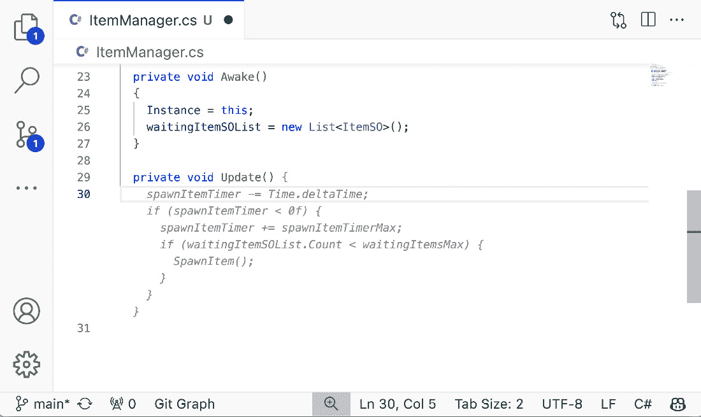
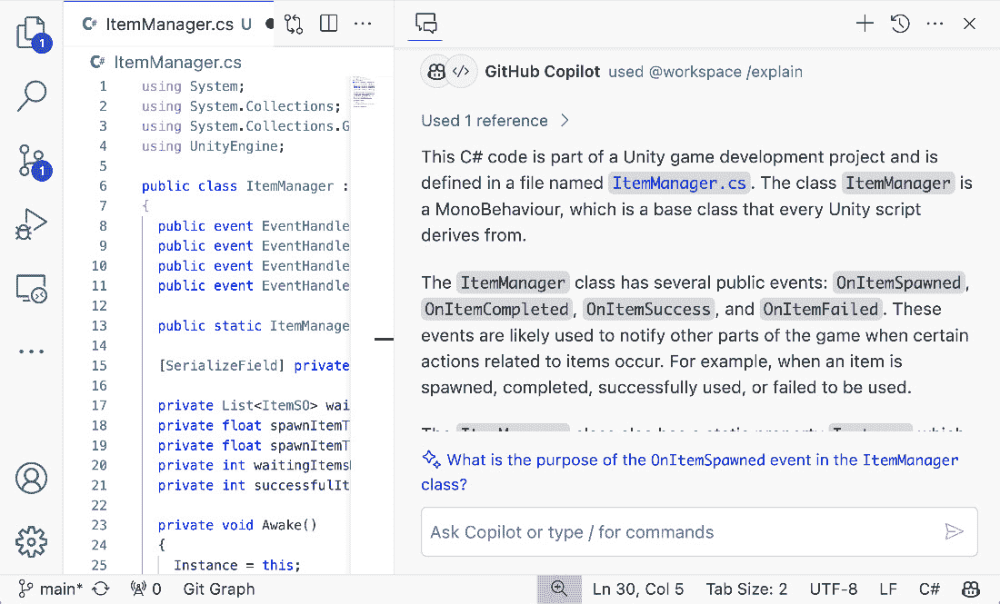

# 第七章：利用 AI 加速生产力

在本章中，我们将开始探索充满激动人心的 AI 驱动软件开发领域。实际上，尽管大型语言模型在编程中的应用逐渐变得越来越明显，但它仍然主要处于研发阶段。虽然到目前为止我们侧重于实践内容，但本章将把我们的注意力转向有助于与 AI 进行出色协作的理论。我们的目标是提供帮助你正确理解 AI 在开发中的背景，并掌握其使用的洞察力。有了这个基础，让我们一起探索 AI 驱动编程的世界。

AI 在编程中的角色本质上归结于古老的观点——*如何编写优质代码*，而这一点又依赖于知识、技能和经验。如果你在寻找一种通用的魔法技巧，让 AI 编写出卓越的代码，你可能会发现，实际上这样的技巧可能并不存在。此外，即使是在提到特定产品功能时，也需要意识到这个领域快速发展的步伐可能很快使新获得的技能变得过时。

本书始终关注协作主题。在这个背景下，我们继续保持这一焦点，旨在理解如何与 AI 进行有效的合作。所有沟通的入口都始于了解你的对方。通过正确理解 AI、设定合理的期望，并专注于从 AI 中提取正确的信息，你将能够优化与 AI 工具的互动，无论这些工具如何发展。作为作者，我认为我们应该旨在从根本上理解 AI，而不是单纯关注个别技巧和窍门。

我们将探索与 AI 工具互动的最佳实践，重点关注使用 AI 协助编程的细微差别。AI 驱动的编程代表了一个令人兴奋的前沿领域，充满了许多未知的领域。我们鼓励你掌握基础，并与 AI 一起开始编程。

本章将涵盖以下主要内容：

+   编程中的 AI 创新

+   探索 AI 在编程中的能力与互动

+   最大化 AI 效率的策略

# 编程中的 AI 创新

OpenAI 推出的 LLM（大型语言模型）标志着软件开发演变中的一个关键时刻。我们将深入探讨这一具有突破性创新的后续影响，探索它如何重塑编程领域。

## LLM 对编程的影响

我们可以说，LLM 的出现从根本上改变了编程的方式和执行过程。凭借理解和生成类人文本的能力，这些模型为编码开辟了新的领域，使其更加高效且易于访问。LLM 显著加快了编写代码的过程。开发者现在可以利用 AI 快速生成代码片段，减少在常规或重复编程任务上花费的时间。LLM 的引入使得开发者能够更具创造性地解决编程挑战。通过提供建议和替代方案，这些模型已成为程序员问题解决工具箱中的宝贵工具。

LLM 引入了 AI 驱动开发的新领域，开发者与 AI 工具合作，提升他们的编码工作流。这种合作涵盖了从生成代码片段到为复杂的编码问题提供见解。对于初学者来说，AI 作为一种教育工具，帮助他们学习编码模式和最佳实践。这降低了编程的入门门槛，使其对初学者更加亲近。此外，对于经验丰富的开发者来说，这种 AI 集成是一个强大的催化剂，通过高级代码建议、自动化常规任务和提供更深层次的代码优化和问题解决见解，帮助他们取得更大的成就。经验丰富的开发者的专业知识与 AI 的高效性相结合，创造了一种协同效应，推动了软件开发领域的边界。

现代 LLM 的引入彻底改变了编码，将其从纯粹的手工工作转变为更加协作、高效和创新的过程。这一变化不仅加速了开发，还为软件工程领域的创造力和问题解决开辟了新的可能性。此外，这一领域目前正扩展到各种任务，不仅限于编码，还包括审查和文档编写。

## 理解 LLM – 基本介绍

在 AI 驱动的编程背景下，LLM 作为一个关键创新浮出水面，重塑了我们对软件开发的方式。那么，LLM 到底是什么呢？让我们先了解一下它。

LLM 是先进的 AI 模型，旨在理解、解释和生成类人文本。这些模型不仅在规模上庞大（通常包含数十亿个参数），而且在训练数据的范围和能力上也极为广泛。

像**生成预训练变换器**（**GPT**）这样的 LLMs，是在包含广泛互联网文本的大型数据集上进行训练的。这种训练使它们能够根据接收到的输入预测并生成文本，从而在语言理解和生成方面表现出极高的灵活性。LLMs 背后的核心技术涉及神经网络架构，特别是变换器模型，它们彻底改变了**自然语言处理**（**NLP**）领域。这些网络擅长处理序列数据，使它们在语言任务中具有理想的应用前景。

为了充分发挥它们的潜力，理解 LLMs 的基本设计目标和它们的局限性是至关重要的。虽然人工智能看起来像魔法，但它更像是一面反映你自己输入的镜子；它并不是解决所有问题的灵丹妙药。你必须以正确的期望来面对它，正确引导它，并巧妙地提取其中的价值。现在，让我们来看看 LLMs 的几个基本特征：

+   **词预测引擎**：从本质上讲，LLMs 是设计用来预测序列中下一个单词的复杂引擎。这种预测能力基于它们从大量数据集中获得的广泛训练，使它们能够生成上下文相关且连贯的文本。

+   **概率性，而非确定性**：与那些对给定输入始终产生相同输出的确定性模型不同，LLMs 是概率模型。这意味着它们基于各种可能的延续的概率来预测接下来会发生什么，从而使得相同的输入可能产生不同的输出。这一特点强调了 LLMs 固有的随机性，突显出相同的“*上下文*”或输入可能会根据概率性判断产生不同的结果。

+   **不是谷歌搜索的替代品**：需要特别注意的是，LLMs（大语言模型）并不是谷歌等搜索引擎的替代品。它们不像传统意义上的学习，或者说，它们不会为未来的输出保留信息。每次由典型 LLM 生成的回应，都是基于当时提供的输入，而没有对过去互动的记忆。

+   **生成，而非检索**：LLMs 的工作方式是每次生成响应，而非从存储的信息中检索。这意味着它们的输出是基于它们在训练过程中学到的模式重新生成的。

LLMs 在编程方面具有重要作用，主要得益于它们预测下一个字符或单词的能力。这些模型不仅能处理像英语这样的自然语言，还能扩展到各种编程语言。事实上，LLMs 在编程语言中的应用，是它们效果最显著且最为人们期待的领域。

LLM 对不同编程语言的适应性来源于其在多样化数据集上的训练，这些数据集不仅包括自然语言文本，还包括大量的代码库。这使得它们能够理解各种编程语言的语法和语义，从而在代码补全、修复 bug，甚至生成完整的功能代码块等任务中变得非常有用。

此外，LLM 还可以帮助开发者将需求转化为代码，提供基于最佳实践的建议，甚至为复杂的编程挑战提供创造性解决方案。它们的预测能力确保能够推荐最相关的代码片段，简化编码过程，显著提高编码效率和准确性。

除了关键能力之外，理解局限性和处理误解也是非常重要的：

+   **并非万无一失**：LLM 的准确性并非绝对。尽管它们能够生成非常相关和复杂的输出，但有时它们的预测也可能不准确。它们有时会生成看似合理但实际上不准确或毫无意义的输出，这种现象有时被称为**幻觉**。

+   **需要人类监督**：这种错误的潜力凸显了人类监督的重要性。LLM 的用户应保持警觉和敏锐，能够识别和纠正模型输出中可能存在的误导或错误。

+   **适当使用和设定期望**：理解这些局限性是设定现实期望并找到 LLM 最有效使用场景的关键。它们应被视为增强和辅助任务的工具，比如编码或文本生成，而不是作为具有完全自主性和准确性的独立解决方案。

本质上，LLM 是一项强大的创新，在文本生成和语言理解方面提供了显著的能力。然而，它们的有效使用需要意识到其局限性，并认识到人类监督在引导其输出中的关键作用。

## LLM 在编码中的应用

LLM 在编码领域的集成最显著的应用之一是 AI 驱动的编码工具，如 GitHub Copilot。本节探讨了 AI 如何重新定义编码体验。

旨在帮助开发者编写代码的 AI 工具利用 LLM 的强大功能提供实时代码建议，自动化一些编码过程，并提高整体生产力。这些工具在大量代码库的训练基础上，能够解读当前编码环境中的上下文，并提供下一行代码、函数实现，甚至是整个类和模块的建议。

这些人工智能工具的基本功能是作为插件工作在编辑器中，如 Visual Studio Code，在你编码时提供人工智能协助。这些工具背后的愿景包括将人工智能融入软件开发周期的所有阶段，特别强调其作为主要功能集成到编辑器中的作用。这种方法代表了一个更广泛的努力，旨在利用人工智能提升软件开发过程，目标是使编码更加高效，并让各个技能层次的开发人员都能更轻松地进行开发。

### 转变编码过程

基于人工智能的工具通过简化各种编码任务来提升开发过程。传统的编码包括研究、阅读文档以及确保代码的正确性。这些工具帮助在几个关键领域优化这些活动：

+   **提高速度和效率**：开发人员可以借助这些工具加快编码过程。它们帮助减少重复代码模式所花费的时间，并提供快速的解决方案和建议，从而解放开发人员，让他们有更多时间处理更复杂和创新的工作。

+   **促进学习和探索**：对于新手或正在学习新编程语言或框架的人来说，这些人工智能工具充当了教育辅助工具。它们提供语法正确的代码片段，并展示最佳实践的实际操作。

+   **减轻认知负担**：人工智能工具处理编码中更为常规的部分，减轻了开发人员面临的心理负担。这种认知负担的减少使开发人员能够将精力集中在更复杂和具有挑战性的问题上。

+   **拓展可能性**：通过提供建议，这些工具不仅协助代码完成，还激发了创意思维。它们为开发人员介绍了替代的解决问题方法，并展示了他们可能以前未曾遇到或考虑过的新编码模式和实践。这种可能性的扩展可以促使更具创新性的解决方案，并扩展开发人员的技能。

通过减少频繁查找信息的需要，并提供相关的代码建议，这些人工智能工具支持更加专注和高效的工作流程。这不仅提高了代码质量，还增强了开发人员的生产力，使这些工具成为现代软件开发中不可或缺的组件。

### 协作式代码创建

在比较代码补全工具与基于聊天的工具时，可以清楚地看到每种工具为开发人员提供了不同的功能。以下是主要的区别：

+   **代码补全体验**：具备代码补全功能的工具能够在编辑器中直接预测下一个词语或代码块。它们提供逐步的建议，用户可以快速接受或拒绝，从而简化编码过程。这有点像和一位经验丰富的工程师一起进行集体编程，或者和他人进行配对编程并实时共享屏幕，这种互动性和动态性促进了编码环境的活跃：



图 7.1 – GitHub Copilot 中的代码补全体验

+   **聊天体验**：与此相对，聊天体验类似于通过像 Slack 或 Teams 这样的平台与高级工程师咨询，甚至是委派实现任务。一些工具还具有聊天界面，开发者可以通过这些界面获得直接的代码帮助和对话式指导：



图 7.2 – GitHub Copilot 中的聊天体验

GitHub Copilot，这款以开发者为中心设计的工具，支持聊天和代码补全两种体验。以多功能性著称的 ChatGPT，要求用户精心设计提示语来引导其响应。相比之下，人工智能驱动的开发者工具则通过增强开发者在编辑器中的体验脱颖而出，专注于工程师如何将当前的工作背景与人工智能帮助无缝结合。

它们旨在通过直观地理解开发者工作的背景，支持开发者，并使得开发者可以通过更少的提示语将这些背景信息更容易地传达给人工智能。开发者编写的代码越多，这些工具就越能根据开发者的目标和工作背景的具体情况，量身定制其帮助。

## 提示语与背景

**提示语**的概念随着生成性人工智能技术的出现而引起了广泛关注。在你可能遇到的各种术语中，“提示语工程”作为一个特别常见的术语脱颖而出。然而，什么是提示语工程呢？提示语工程是为人工智能模型设计输入或提示语，以生成期望的输出。它是通过设计问题或陈述的方式，来引导人工智能理解并以特定的方式作出响应。这一点至关重要，因为人工智能输出的质量和相关性高度依赖于提示语的结构。然而，另一方面，确实也存在对这一领域过高的期望，早期它甚至被当作一个流行词来使用。

对我来说，提示语工程这个术语似乎是多种事物的结合体。我将在这里解释它们。

### 两种类型的提示语工程

在人工智能和机器学习的发展过程中，提示工程已成为一门重要的学科，影响着我们与 AI 模型互动以及从中提取价值的方式。提示工程有两种类型。虽然这不是一个学术分类，但我将在这里称之为**可重复使用的提示工程**和**一次性提示工程**，它们适用于不同的应用和需求。认识到它们之间的区别，并在日常与 AI 互动中了解并使用这些目标，至关重要。

#### 可重复使用的提示工程

可重复使用的提示工程是为那些在相似情境中反复使用的提示设计的。这在面向消费者的 AI 应用、自动化系统以及 AI 与机器的互动中较为常见。这里的目标是创建能够始终如一地从 AI 中获取准确且相关回应的提示，不管输入或上下文中有多小的变化。

在可重复使用的提示工程中，接近完美的准确性是必不可少的。这一点在机器消费者中尤其重要，因为 AI 的回应会触发其他功能或过程。同样，在 B2C 应用中，高准确性对保持用户参与度、防止用户沮丧或困惑至关重要。

这种类型的提示工程面临的主要挑战是保持 AI 回应的稳定性和一致性。这通常需要深入理解 AI 模型的能力和局限性。构建提示的工程师还必须考虑用户输入和上下文的变化，确保 AI 能够处理这些变化，而不会显著降低准确性。

在可重复使用的提示工程中，重点主要是*如何*——设计提示以确保可靠且准确的回应。这一重点至关重要，因为*什么*和*为什么*往往是不可预测的，尤其是在涉及广泛多样用户群体的情境中。提示必须设计得能够处理来自不特定用户的大量输入，每个用户有其独特的需求和与 AI 系统互动的方式。

在这个世界上，提示工程这个术语在狭义上通常是这样使用的。它是关于如何完善向 AI 提供的指令，以便从中提取高度准确的信息。然而，在实际的开发领域中，并不需要花费时间去完善只使用一次的提示。开发中的提示工程需要的是不同的语境。

#### 一次性提示工程

一次性提示工程的特点是创建一次性使用的提示。这些提示通常由开发者或用户为特定的、往往是独特的情境设计。在这种情况下，重点从广泛适用性和一致性转向了具体性和即时相关性。

这种类型的工程涉及高度的创造性和适应性。开发者会即时创建提示，根据具体任务或问题进行调整。这要求开发者深入理解上下文和目标（即“为什么”和“做什么”），并采取灵活的方法与 AI 互动。

在一次性提示工程中，**上下文**是关键。提示通常是为了应对特定问题或生成独特输出而设计的。因此，工程师必须为 AI 提供足够的上下文，以便其理解并适当响应当前任务。在开发的背景下，每当你在开发任务中做些创造性工作时，你都需要为 AI 提供新的指令。毕竟，你会发现，当你在开发中使用 AI 时，你几乎不需要掌握每一种类型的提示工程。更重要的是**上下文**。

总结来说，需要认识到，掌握复杂的提示工程技术并非每个目标都能高效实现。再说一次，对于那些需要新思路并且本质上是一次性需求的日常任务，花大量时间去完善提示可能并非必要。相反，对于像开发一个注入了 AI 的应用程序这样的项目，提示的质量至关重要。在这些情况下，不断优化提示，以确保与 AI 组件的最佳互动是非常有益的。这个过程通常涉及反复试验，并且需要对 AI 模型如何理解不同提示有深刻的认识。

### **上下文的重要性**

在 AI 驱动的开发中，特别是在编程中，一段代码所处的上下文至关重要。上下文包括代码的周围信息和环境，超出了直接的代码库，涵盖了项目规范、编码标准和预期功能。AI 的有效性依赖于其解读和响应这种上下文的能力。

提供给 AI 系统的上下文决定了其回应和建议的相关性与准确性。如果没有足够的上下文，AI 工具可能会生成技术上正确但与项目目标或需求不符的输出。

随着开发者将 AI 整合到工作流程中，理解它们在提供清晰和相关上下文中的角色变得至关重要。这个责任意味着要理解，尽管 AI 强大，但它并非无所不知或无所不能。它需要准确反映当前问题和期望结果的输入。

开发者应将 AI 视为协作工具，带领其通过明确的上下文，以确保其贡献与项目目标一致。这需要对 AI 的建议进行批判性评估，并根据项目的具体细微差别调整这些建议。

以下是需要包括的上下文内容：

+   **提供详细注释**：在代码中加入全面的注释，不仅解释代码的功能，还要阐明其背后的目的。这有助于 AI 工具理解代码的意图。

+   **使用描述性的命名规范**：选择能够清晰指示其目的和用法的变量和函数名称。这有助于 AI 生成更相关且可读的代码。

+   **彻底文档化代码**：确保代码库有良好的文档记录，概述更广泛的项目目标、编码标准以及具体功能。

+   **清晰地框定问题**：寻求 AI 帮助时，尽可能具体地定义问题。这包括陈述期望的结果以及任何相关的限制或考虑因素。

有效地利用 AI 进行编程需要一种平衡的方法，认识到 AI 是一个强大的助手，但并非完全替代人类专业知识。通过提供清晰、详细的语境并保持关键的监督，开发者可以最大化 AI 工具的效益。这种方法确保 AI 作为提升软件开发生产力和创造力的催化剂，补充人类能力，而非试图取而代之。

在 AI 驱动的编程中，语境的重要性不可过分强调。随着 AI 的不断发展，它解释和利用语境的能力将决定其对软件开发的影响程度。

为了让开发者真正发挥 AI 在编程中的潜力，必须具备深厚的编程和技术理解。尽管提示工程大大提高了生产力，但它并非独立解决方案。提供清晰、详细的语境给 AI 是与开发者技术专长相辅相成的技能。最终，AI 工具在增强开发工作中的有效性取决于开发者在编码方面的基础知识和经验。这种技术精通与巧妙提示工程的结合是最大化 AI 在软件开发中效益的关键。

# 探索 AI 在编码中的能力与互动

本节致力于为开发者提供深入的见解和策略，帮助他们在编码项目中有效利用 AI，重点介绍其功能和交互动态。无论是将 AI 用于常规的编码任务，还是用于更复杂和富有创意的编程方面，本节旨在为如何使 AI 成为你编码实践中的变革性元素提供全面的指导。

让我们探索 AI 在编码中的广泛能力，并学习与 AI 工具交互的最佳实践，不仅提高项目的生产力和质量，还提升你作为开发者的整体体验。

## 代码补全 —— AI 驱动编码的基础

与需要在每次交互中提供完整上下文的 ChatGPT 不同，编程环境中的代码补全与代码编辑器深度集成。AI 驱动的编码工具会动态收集你正在编写的代码中的必要数据，并与后端的大型语言模型（LLM）无缝通信。这种集成提供了类似于与 AI 合作的结对编程或集体编程的体验。

典型的 AI 工具会持续分析编辑器中的代码，理解当前的上下文，从而提供相关的建议。这种上下文意识是代码补全有效性的关键。在 AI 工具中，上下文很重要，最重要的是如何从编辑器中收集上下文。有时，人们倾向于关注其背后模型的准确性。这并不算错误；AI 越智能，效果越好。然而，随着 AI 技术的发展，任何工具都能执行某些任务。在这种情况下，真正突出的是它作为数据收集工具的优越性。因此，在代码补全中，了解 AI 驱动的编码助手工具如何从编辑器中收集信息并判断是否应该考虑这些信息，显得尤为重要。

当开发者输入代码时，AI 驱动的编码工具会建议可能的代码片段，以补全或扩展代码。通常，这种功能不仅仅是加快输入过程；更重要的是，它能够提供智能的、上下文相关的建议，从而提高代码质量和工作效率。

这是代码自动补全的一个示例。我们来创建一个文件`calc.js`，并在其中写下以下 JavaScript 代码：

```
function calculateSum(a, b) {
    // AI Suggestion Here}
```

例如，AI 代码补全会补充函数内容，如下所示：

```
function calculateSum(a, b) {
    const sum = a + b;
    return sum;
}
```

代码补全背后的 AI 模型已经接触了大量的代码，但需要澄清的是，这种接触意味着它是“*在数据上训练*”的，而不是以传统意义上“*学习*”的方式。实际上，它通过分析这些庞大的代码库，变得擅长于识别编程中独特的模式。通过使用 LLM，模型能够辨别模式、最佳实践和常见的编程范式，从而生成建议。作为预测代码中下一个单词或序列的引擎，它的建议质量直接受输入代码质量的影响。本质上，输出质量反映了它所训练的代码数据的质量，这表明它提供相关建议的能力依赖于识别训练数据中的模式。

代码生成——AI 驱动的编码工具能够理解并响应自然语言的能力——非常了不起。AI 的突破在于它能够理解自然语言的呈现方式，并根据这种理解提供代码建议，而不像传统的非 AI 代码补全工具（如 IntelliSense）那样依赖静态分析。开发人员可以通过注释详细描述代码段的功能、参数和预期结果，从而指导 AI 生成相关代码。

当我们谈论“*代码生成*”时，它包括了前面部分提到的代码补全，但这里我们讨论的是更广泛的概念，重点是从自然语言和各种信息生成代码。

这个功能的有效性取决于提供的指令的精确性和清晰度。明确定义和具体的注释能够使 AI 驱动的编码工具生成更准确、更合适的代码响应。

这时，你的知识、经验以及构建提示的方式变得尤为重要。必须利用你的批判性思维和逻辑写作技巧，以便 AI 能够理解。

例如，让我们创建一个名为`calc.js`的 JavaScript 文件，如下所示，并写入你想实现的注释：

```
// Function name: calculateAverage
// Function arguments: numbers (array)
// Return type of the function: number
```

如果 AI 驱动的工具能够生成代码，它将如下所示：

```
function calculateAverage(numbers: number[]): number {
    // calculate the average of the array
    const sum = numbers.reduce((a, b) => a + b);
    return sum / numbers.length;
}
```

在代码的其他部分或注释中提供示例是非常有帮助的。此外，AI 驱动的编码工具的一个优势在于它们能够根据结构化的示例生成代码。这一功能在例如从给定数据示例中开发模型等情境中尤为有用。

比如，考虑以下注释：

```
# [{"id": "A1", "name": "Yoshi Yamashita"}]
```

然后，AI 可以生成以下模型。如果你在`user.py`文件中写 Python，下面的示例将输出 Python，但同样，如果你写入特定语言，如`user.js`或`user.rb`，则会为不同语言执行相同的实现：

```
users = json.loads(json_data)
class User:
    def __init__(self, id, name):
        self.id = id
        self.name = name
```

这表明实现定义与实现本身之间的距离正在变得非常接近。

在定义方面，表定义可以转化为数据库表的 SQL 查询，云基础设施定义可以转化为 Terraform 的 YAML 文件，等等。

例如，从给定的 JSON 示例中，可以生成用于创建 Ruby on Rails 模型的命令。

以下是给定的 JSON 示例：

```
{
  "name": "Yoshi Yamashita",
  "age": 48,
  "description": "Hello from Tokyo",
  "country": "Japan",
  "title": "Software Engineer",
  "email": yoshiyamashita@example.com
}
```

你只需提供提示“*生成一个 rails 命令来创建一个新用户*”作为示例，AI 就会创建一个准备好使用的命令，输出如下：

```
rails g model User name:string age:integer description:text country:string title:string email:string
```

代码生成能力代表了 AI 驱动编码的一个重要进步。通过解释描述性注释和结构化示例，AI 可以生成准确且有效的代码，从而减少手动编码的工作量，提升开发过程的效率。

## 代码解释

AI 具有分析现有代码并自动生成解释的能力，从而阐明代码的功能。这一特性对于理解没有充分文档说明的代码或为其他开发者解密复杂算法非常有价值。这些生成的解释有助于将复杂代码简化为更易理解的部分，从而帮助他人更好地理解代码背后的逻辑和意图。

这种能力对于减少新团队成员的入职时间，加快首次查看代码的人员对代码的理解，以及在规范与实际代码之间存在明显差距的情况下都非常有用。此外，它通过为之前未维护或模糊不清的代码提供解释，从而提升了代码的价值，使其功能更加清晰。

下面是一个通过创建文件`eratosthenes.py`并特别考虑生成埃拉托斯特尼筛法算法的解释的 Python 算法编写示例，该算法最初是在没有解释的情况下提出的：

```
def eratosthenes_sieve(n):
    primes = []
    sieve = [True] * (n + 1)
    for p in range(2, n + 1):
        if sieve[p]:
            primes.append(p)
            for i in range(p * p, n + 1, p):
                sieve[i] = False
    return primes
```

如果你在行首写下注释，AI 会识别出你在每一新行写注释，并会通过简单地换行来自动完成其余部分。AI 可以生成以下注释：

```
# This is a function that calculates prime numbers less than n
def eratosthenes_sieve(n):
    # Primes will hold all the prime numbers found
    primes = []
    # sieve is a list used to track prime numbers
    sieve = [True] * (n + 1)
    # loop through each number in the range 2 to n
    for p in range(2, n + 1):
        # If the number is marked as True in the sieve list
        if sieve[p]:
            # It is a prime number, so add it to the primes list
            primes.append(p)
            # Mark all multiples of this prime number as False
            for i in range(p * p, n + 1, p):
                sieve[i] = False
    # return the list of prime numbers
    return primes
```

在极端情况下，你不需要任何特定的提示。有时，在使用 GitHub Copilot 时，只需按*Tab*和*Enter*即可。然而，如果进行了更多格式化，它可以超越简单的解释，具有各种可能性，例如从代码中推导文档，或者例如从数据库迁移实现中逆向工程表定义。

AI 对代码的解释显著提高了代码的整体质量，通过增强其可读性和可理解性。这一特性在缩小复杂代码与全面文档之间的差距方面发挥着至关重要的作用，提供了一种自动化解决方案，使代码对广泛的开发者更具可访问性和可理解性。通过节省时间并促进更好的代码维护与协作，这一能力突显了 AI 在编码过程中的变革性影响。

# 最大化 AI 效率的策略

本节内容将深入探讨旨在提升你在编程领域内掌握 AI 工具的策略。通过采纳一种强调具体性、上下文意识和一致性的方法，你会发现与 AI 的互动得到显著改善，从而简化编码流程并提高输出质量。具体来说，提供清晰、详细的指令可以提高 AI 工具的效率，使其更好地与预期目标对齐。深入理解并传达工作背景能够使 AI 生成更精确且适用的建议。此外，保持统一的编码风格并遵循既定的命名约定，会极大地帮助 AI 理解你的代码，最终获得更高质量的成果。这些策略将共同优化你与 AI 的合作，使其成为编程中更高效、更有效的伙伴。

此外，我还想谈谈与 AI 互动的迭代过程。这个过程包括以下内容：

1.  请求 AI 提供建议

1.  批判性地审查结果

1.  决定接受、拒绝或手动调整建议

1.  应用变更或反馈进行持续改进（kaizen）

通过在每个与 AI 互动的阶段都牢记这三个原则，你将促进更高效、更和谐的合作。这些做法将传统的软件工程原则与 AI 的创新能力结合起来，确保你的代码既对人类友好，又能优化 AI 的辅助作用。

## 具体明确

指令的清晰性和具体性在工具的有效性中起着至关重要的作用。

基于 AI 的编码工具旨在响应开发者提供的指令细节。其生成有用且准确代码的能力，在提示或评论具体且清晰时得到极大提升。指令越详细，AI 就越能理解预期结果。这种理解直接影响 AI 工具提供的代码建议的相关性和准确性。

在模糊提示的例子中，开发者可能会用“*对这个列表进行排序*”这样的语句来指示 AI。这个提示不明确，因为它没有指定列表的内容或排序的方式。面对这种模糊性，AI 可能会很难提供准确的解决方案。然而，当指令更具体时，例如“*按升序排序这个整数列表*”，就变得更加清晰了。这个具体的提示向 AI 提供了关于列表中数据类型（整数）以及排序标准（升序）的精确信息。有了这些细节，AI 能够更好地生成一段更准确、更相关的代码，符合开发者的意图。

以下两点可以帮助获得更好的结果：

+   **根据任务定制提示**：在使用 AI 工具时，重要的是根据当前任务定制提示。这包括指定数据类型、期望结果、约束条件以及任何可能影响代码生成的相关细节。

+   **避免歧义**：具体的指令有助于避免歧义，确保 AI 工具不会误解任务或提供无关的代码片段。

在与 AI 工具合作进行软件开发时，具体指令是一个关键的最佳实践。详细的提示使得这些工具能够提供更准确和有用的代码建议，从而提高开发过程的效率和效果。通过在与 AI 互动时专注于清晰和精准，开发人员可以充分发挥这些工具的潜力，从而带来更高效、更成功的编程体验。

## 关注上下文

接受上下文意识至关重要。这种方法不仅提高了工具使用的效率，还改善了向 AI 传递信息的准确性。在软件设计中，上下文意识意味着要意识到划定工作、系统和过程的边界。

在考虑到人类和 AI 固有的局限性时，认识到这些边界的重要性尤为突出。简单来说，这强调了两个实体在处理信息时都有有限的能力，必须在适当的上下文中运行才能有效发挥作用。

+   **人类的局限性**：人类有一个认知阈值。当信息过载时，选择相关信息变得困难，从而导致所谓的认知过载。通过关注当前上下文并在有限的上下文内处理信息，人类可以更有效地管理信息。人类不能向 AI 提供无限的信息，也不能有效地筛选从 AI 收到的大量信息。

+   **AI 的局限性**：同样，AI 在识别上也有其局限，主要由当前模型的令牌限制定义。令牌是 AI 识别的最小单位，如字符或单词，在撰写时 AI 模型中有其数字限制。虽然 AI 可以继续生成符合上下文的相关信息，但生成最终必须终止，以确保输出的准确性和预期效果，因此需要意识到 AI 的性能边界。

在这里，我提供了一份在与 AI 互动时使用的实用清单。这份清单对于确保与 AI 的有效协作至关重要，重点关注为开发工作提供正确的上下文。养成在每次与 AI 互动时都考虑这些因素的习惯，将有助于你进行更好的互动。

每次与 AI 互动的清单：

+   **AI 知道吗？——明确的上下文提供**：检查 AI 是否已经熟悉你任务的上下文。如果你的任务超出了 AI 的既有知识范围，提供额外的、详细的上下文以弥补这一差距。

+   **AI 能力如何？——评估 AI 的限制**：验证你的期望是否符合 AI，如 GPT-4，能够现实实现的范围。了解其能力和局限性，特别是在标记数和上下文扩展性方面，是至关重要的。

+   使用`#file`和`#editor`来指定相关的上下文，利用代理特性如`@workspace`来扩展上下文，可以提高准确性。请验证你方法的准确性。具体工具的实现不在此讨论，但对于 GitHub Copilot，请参考*进一步阅读*部分中的最新实现文档。

+   **如何优化它？——质量管理**：评估并调整发送给 AI 的文本、字符和数据的量。目标是优化信息的数量——增加必要的部分，减少不必要的部分——以确保质量和效率。

上下文感知的重要性不容忽视——它意味着提供恰到好处的信息，并利用提示和编码技术以精确传达意图。AI 驱动的开发工具，如 GitHub Copilot，是工程师的辅助工具，帮助将丰富的上下文传递给 AI，从而提升工具的效用和效果。

反思这一点，不难发现，将这些理念应用于架构和编程并不是一个新概念。这一原则与长期以来已经在实践中的方法论相契合。通过采用领域驱动开发的方法，可以进行上下文感知设计。此外，架构中的松散耦合原则，在不同场景中已有广泛探索，它从特定语言的领域分离演变为面向服务架构，进一步发展为微服务架构。

总结来说，将上下文感知的方法融入到 AI 驱动的编码中，可以视为在 AI 软件开发时代的一种良好策略。归根结底，这种方法的核心是采用良好的、现有的架构实践，这些实践松散耦合、关注边界，并且对人类友好。通过聚焦于综合上下文的整合，使得 AI 工具能够更深入地理解项目，开发者可以提升 AI 生成建议的精准性和实用性。这不仅使开发者能更有效地操作 AI，还使任何人都能更轻松地导航并充分利用 AI 的能力。

## 保持一致性

在 AI 增强的编程环境中，保持一致的编码风格并采用 AI 可读的命名约定至关重要。本节探讨了这些做法如何增强与 AI 驱动的编码工具的交互，并促进更好的代码质量。

一致的编码风格，涵盖缩进、命名约定和注释写作等方面，在软件开发中至关重要。它不仅确保了代码对人类开发者的可读性，还在 AI 驱动的编码工具如何有效地解释和建议代码方面发挥了重要作用。

例如，以下 Python 代码可以被认为是一种一致的代码：

```
def calculate_area(length, width):
    return length * width
```

这个例子展示了清晰一致地使用`snake_case`命名法和简洁的函数命名，便于人类理解并有助于 AI 解读。

相比之下，下面的代码可能是 AI 的一个不良示例：

```
def calcSomething(l, w):
    # code goes here
```

在这个例子中，不一致的命名和缺乏清晰度可能导致 AI 给出的建议效果不佳。如果尝试通过自动补全来完成这个内容，AI 可能会针对这样一个简单的例子给出准确的答案，但如果在代码库中散布着无数这样的随机且无意义的标记，就可能会出现错误。

AI 能够理解自然语言和编程语言，表明它不仅在技术语法上阅读代码，还将其视作一种自然语言。这凸显了编程中清晰且有意义的命名约定的重要性。通过以易于理解的方式命名变量和函数，开发者不仅帮助人类理解，还增强了 AI 模型准确辨识代码目的和上下文的能力。

例如，AI 可读的有效命名约定涉及使用特定且具描述性的名称来命名变量和函数。这一做法不仅帮助人类协作者，还使得 AI 工具能够更准确地解读代码。命名中的清晰性有助于减少模糊性，否则这些模糊性可能会导致 AI 系统给出不准确或不相关的代码建议。

具体性和上下文至关重要。避免使用通用名称，并努力提供清晰的上下文，这可以通过类型提示或添加解释性注释等方法实现。这些做法显著提升了 AI 生成建议的准确性，从而导致更相关和更有功能性的代码输出。

到目前为止，很明显，AI 容易理解的代码本身对人类来说也更加易于理解。从本质上讲，AI 在编码中的出现并不总是需要重新发明软件工程中的最佳实践。像 O'Reilly 的 *可读代码的艺术：编写更好代码的简单实用技巧* 这样的权威资源中列出的原则，在 AI 时代仍然是相关且适用的。保持这些经过验证的实践，确保代码对人类合作者和 AI 工具都保持可访问性和可理解性。

# 总结

AI 可以帮助你编写代码。然而，你可能已经注意到，无论 AI 有多先进，编码的方法其实变化不大。你所需要做的只是保持你一直以来优秀的工程师身份。另外，善用 AI 将帮助你提升技能。

如果你以好奇心去面对事物，AI 将会做得比你预期的更多，所以让我们与 AI 一起创造美好的未来，我希望这一章能给你一些启发。

# 深入阅读

+   *GitHub Copilot 优化：通过提示设计和上下文* *设置*（[`code.visualstudio.com/docs/copilot/prompt-crafting`](https://code.visualstudio.com/docs/copilot/prompt-crafting))

+   *可读代码的艺术：编写更好代码的简单实用技巧*，作者：达斯汀·博斯威尔（Dustin Boswell）和特雷弗·福舍尔（Trevor Foucher）（[`www.oreilly.com/library/view/the-art-of/9781449318482/`](https://www.oreilly.com/library/view/the-art-of/9781449318482/))
