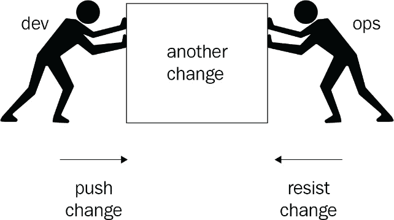
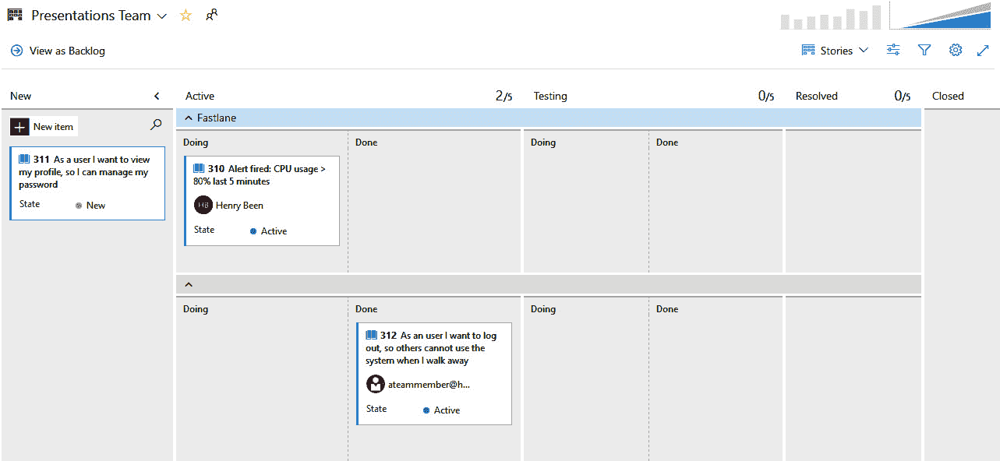
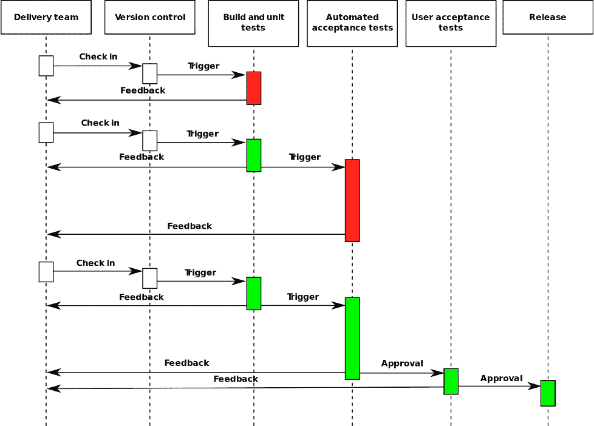

# 第一章：DevOps 介绍

DevOps 不是你可以购买或安装的产品或工具。DevOps 是关于文化以及你如何编写、发布和运营软件。DevOps 是关于缩短新想法与最终用户体验其带来的价值之间的时间。在本书中，你将学习如何利用工具和技术将这一理念应用于你的工作方式。本书的目的是帮助你准备 AZ-400 认证考试，因此核心概念和与 DevOps 相关的实践将通过 Azure DevOps 及其相关技术来阐述。

近年来，DevOps 在软件工程领域越来越受欢迎，几乎所有软件工程团队都在适应一个新的工作方式，使用一组新的工具来激发生产力，并在开发和运维之间实现更好的协作。DevOps 常被视为敏捷的延伸，但其范围要广得多，它补充了敏捷方法。

在本章中，你将更多地了解什么是 DevOps，以及如何识别一个成功的 DevOps 团队。到本章结束时，你将熟悉关键术语，并掌握 DevOps 的高层次原则和实践。你还将发现 DevOps 对软件工程团队的益处。

在本章中，我们将涵盖以下主题：

+   什么是 DevOps？

+   创建理想的 DevOps 组织

+   探索 DevOps 实践和习惯

+   DevOps 发展历程的五个阶段

# 技术要求

本章没有技术要求。

# 什么是 DevOps？

如果你列出所有关于 DevOps 的不同定义和描述，会有很多。然而，尽管它们可能有所不同，它们最有可能共享几个概念。这些概念是协作、持续交付商业价值和打破孤岛。

在本书其余部分涉及到的技术讨论中，重要的是不要忽视采用 DevOps 的价值主张——即它将帮助你改进持续向最终用户交付价值的方式。为了实现这一点，你必须减少从开始开发新功能到第一个用户在生产环境中使用该功能的时间。这意味着你不仅要编写软件，还要交付并运营它。

在过去的十年里，我们编写软件的方式发生了根本性的变化。越来越多的公司现在采用敏捷工作方式，以提高软件开发的效率。越来越多的团队现在通过短期迭代或冲刺，快速创建产品的新增量。然而，快速创建潜在可发布的增量本身并不能创造任何价值。只有当每个新版本的软件被发布到生产环境并被最终用户使用时，它才开始提供价值。

在传统的组织中，开发人员和运维人员通常位于不同的部门，将软件投入生产往往需要交接，并且通常伴随有正式的仪式。在这样的组织中，加速将软件交付到生产环境，以及开发人员快速创建新版本的速度，可能会变得很困难。

此外，开发和运维部门往往存在目标冲突。开发部门的奖励是尽可能快速地创造许多变化，而运维部门则因减少停机时间和防止问题而获得奖励。后者通常通过尽可能少地做出更改来最佳实现。这里的冲突很明显——两个部门都有各自针对一个子目标的优化，如下图所示：

图 1.1 – 开发与运维之间的目标冲突

这违背了这些子目标的目的，这些子目标源于共同的、宏观的目标，即在保持稳定性的同时快速地引入新版本。正是开发和运维目标之间的冲突，应该成为 DevOps 文化中消失的一个问题。在这种文化中，开发和运维团队应该协同工作，以快速可靠的方式将新版本交付到生产环境，并共同承担这两个子目标的责任。

虽然知道 DevOps 是一个文化运动很重要，但工具和自动化在这种文化中扮演着重要角色。在本书中，我们将重点介绍这些工具以及如何使用它们来实现 DevOps 文化中的许多实践。换句话说，本书主要关注与 DevOps 相关的产品和流程。如果你想了解更多关于文化方面的内容和人群，还有许多其他书籍可以阅读。一本非常值得阅读的书是*《凤凰项目：IT、DevOps 与帮助你的企业获胜的小说》*，作者为 Gene Kim。

本节的其余部分将探讨 DevOps 与敏捷之间的关系，看看它们如何相辅相成。重点将放在敏捷技术和工作管理的价格上。我们还将讨论 DevOps 文化的目标和好处。

## DevOps 与敏捷的关系

如果你看看敏捷开发，你可能会注意到它的一部分内容侧重于商业价值和缩短交付新商业价值的时间。从这个角度来看，采用 DevOps 是敏捷开发后的一个合乎逻辑的步骤。敏捷提倡软件开发团队的职责应向前延伸，通过与用户及其他利益相关者互动，更快地交付有价值且可能可以发布的产品。DevOps 不仅仅是指可能发布的东西，而是实际发布它。通过结合敏捷与 DevOps，你可以为用户创造一个端到端的、持续的价值流。

你需要为所有参与者提供一个共同的工作管理方法。在下一节中，你将找到一些关于如何将运维方面的考量纳入你管理工作方式的指引。

### 敏捷工作管理

当你开始增加开发与运维之间的协作时，你会很快注意到他们必须应对不同类型的工作。在开发中，大部分工作是计划好的：从待办事项中提取的用户故事和 bug。另一方面，对于运维来说，很多工作是未计划的。他们需要响应来自系统的警告和提醒，以及来自用户或开发人员的请求或工单。

将这两者整合在一起，尤其是当开发人员和运维人员位于同一团队时，可能会很具挑战性。为了学习如何应对这一点，我们可以探索以下方法：

1.  首先，为开发人员切换到基于流的工作方式。

1.  接下来，允许运维团队也通过同步将他们的工作列在与开发人员相同的工作管理系统中。你还可以选择实施*快速通道（fastlaning）*，一种加速处理紧急工作的方式。

1.  最后，如果可能的话，你可以选择停用现有的运维工单工具。

快速通道是一种组织工作的方式，它通过可视化两条独立的工作轨道，允许同时处理计划内和未计划的工作。为此，Scrum 看板上方扩展了一个类似 Kanban 的看板，这就是快速通道。在 Kanban 看板上，添加了紧急但未计划的工作。任何添加到此通道的工作将由优先级最高的团队来处理。只有当快速通道中的工作都处理完毕后，才会处理 Scrum 看板上的工作以及计划中的工作。每当有新的工作添加到快速通道时，它将再次优先处理。通常，团队会达成一致，所有正在进行中的工作在切换到快速通道工作之前必须完成。

重要提示

依赖管理也是敏捷工作计划中一个重要方面。因此，团队通常会利用优先级属性来确定短期内更重要的工作。

#### 切换到基于流的工作方法

切换到基于流的工作方法时，首先需要考虑的是将开发人员的工作方式从批量处理转变为基于流的工作方式。批量工作方式的一个例子是 Scrum。如果你正在使用 Scrum 框架，你已经习惯了每 2 到 4 周拾取一批工作，并集中精力在这个时间窗口内完成所有工作。只有当这一批工作完成后，才会交付一个潜在可交付的产品。

在转向基于流程的方法时，你的目标是专注于一个任务，而不是一个批次。你专注于完成这个单一的工作项，直到它完成再开始下一个。这样，就不再有冲刺待办事项列表，只有产品待办事项列表。这种方法的优点在于，你不再需要预先决定执行哪些工作；只要有空，你就可以从待办事项列表中选择下一个任务。在优先级迅速变化的环境中，这让你能够快速应对变化。

开发人员组织工作方式的这些变化使得将操作工作纳入工作管理变得更容易，但也有另一个好处。当开发人员专注于完成单一的工作项而不是一次完成整个冲刺时，你还可以增加向用户交付小部分价值的频率。

#### 将工作项同步到一个系统

一旦开发团队改变了工作组织的方式，开发人员应该能更容易地将他们计划中的工作列在共享的待办事项列表中，并在有空时从该列表中拉取工作。同时，他们现在也有一个地方可以列出他们的未计划工作。

然而，可能仍然存在一个现有的工单系统，其中用户会提交操作请求或监控工具会自动创建请求。虽然 Azure DevOps 有一个强大的 API 可以重新设计该集成，直接在 Azure DevOps 中创建工作项，但你可以首先选择在现有的工单工具和 Azure Boards 之间创建一个同步。这方面有很多集成选项，并且正在持续进行相关工作。通过这种方式，操作人员可以逐步从旧工具迁移到新工具，因为它们现在是同步的。当然，目标是让他们完全转移到与开发人员相同的工具。

#### 快速通道

由于开发人员和操作人员都在使用同一个工作管理工具，你会发现系统中混合了计划和未计划的工作，且这些工作往往是紧急的。为了确保紧急工作能得到应有的关注和优先处理，你可以在冲刺看板中引入一个所谓的**快速通道**。下面的截图展示了一个 Azure 看板的例子，该看板已为生产问题设置了快速通道：

图 1.2 – 展示快速通道的 Azure 看板设置

该看板中的水平分割线仅在快速通道中没有任务可选时，用于处理常规通道中的任务。

你可以在[`docs.microsoft.com/en-us/azure/devops/boards/boards/expedite-work?view=azure-devops`](https://docs.microsoft.com/en-us/azure/devops/boards/boards/expedite-work?view=azure-devops)找到如何在 Azure（看板）中配置游泳道以加速工作的说明。

#### 停用其他工作管理工具

在创建了一个开发与运维之间的共享工作管理系统后，有机会增加它们之间的协作。当这种协作开始展开时，原本由运维使用的旧票务系统可能会随着时间的推移逐渐被淘汰。监控工具的集成可以迁移到新的共享工具中，开发人员与运维人员之间的票务数量应该会逐渐减少，因为他们找到了新的协作方式。

重要提示

Azure DevOps 允许你自定义工作项模板，并定义生命周期状态。通过这个功能，团队可以根据他们在现有工具中使用的任何现有分类法，轻松地建模他们的工作项模板类型。这大大减少了采用新共享工作管理工具时的学习曲线。欲了解更多信息，请访问[`docs.microsoft.com/en-us/azure/devops/boards/backlogs/work-item-template?view=azure-devops&tabs=browser#manage-work-item-templates`](https://docs.microsoft.com/en-us/azure/devops/boards/backlogs/work-item-template?view=azure-devops&tabs=browser#manage-work-item-templates)。

## DevOps 文化的目标与好处

此时，你可能会对这一切的意义产生疑问。DevOps 的好处是什么？它对你、你的同事和你的组织有什么影响？采用 DevOps 的最常见目标是减少**周期时间**。周期时间是从开始开发一个新特性到第一个用户可以使用它的时间。这一目标通过自动化实现，同时也有助于降低更改失败率、降低**平均修复时间**（**MTTR**）和减少计划停机时间。

除了这些，还有其他的好处，比如提高员工满意度、减少倦怠和压力、以及更好的员工留存率。这归因于消除了开发人员和运维人员之间的对立目标。

一段时间以来，大家对于 DevOps 是否有效、这些目标是否能实现、以及额外的好处是否能实现产生了疑问，因为这些成果仅通过案例研究来展示。这样做的缺点是，案例研究通常只针对成功的案例，而不包括失败的案例。直到 2018 年，《Accelerate》一书发布，情况才发生了变化。这本书基于多年的定量研究，展示了现代开发实践，如 DevOps，如何有助于实现 IT 目标和组织目标。

### 测量结果

为了衡量你目前作为一个团队或组织的现状，以及 DevOps 对你的影响，有几个指标可以开始记录。像往常一样，当处理指标或**关键绩效指标**（**KPIs**）时，确保不要鼓励人们只看数字，从而操控系统。一些有趣的指标将在以下章节中详细说明，如果你查看这些指标，你会发现它们都是关于鼓励流程的。

#### 周期时间和交付时间

**周期时间**和**交付时间**是来自精益和看板的指标，用于衡量实现变更所需的时间。周期时间是从开始工作到用户能够在生产环境中使用某个特性之间的时间。周期时间越短，你对需求变化或洞察的反应就越快。交付时间是从请求一个特性到实现该特性之间的时间。它是从将工作添加到待办事项列表到你开始实施它之间的时间。

当你将周期时间和交付时间加在一起时，你是在计算另一个指标，称为**上市时间**。这是在开发软件时一个重要的商业指标。因此，最小化周期时间和交付时间会对业务产生影响。

#### 在制工作量

你可以衡量的另一项内容是任何时刻在制工作量。DevOps 专注于价值流向用户。这意味着每个人应尽可能一次只做一件事，并在开始做其他事情之前完成当前任务。这能减少任务切换所花费的时间，以及未完成工作的时间。衡量一个团队并行处理的事务数量，并报告这些内容，可以作为激励的来源。

你甚至可以将实际的工作量限制设定为在制工作量。以下是*图 1.2*的一小部分，展示了这些在制工作量限制甚至可以在工具中显示：

图 1.3 – Azure Boards 显示每个阶段的限制

目标是尽可能减少同时进行的工作量。

#### 平均恢复时间

第三个指标是**平均恢复时间**。在发生（部分）故障时，恢复服务需要多长时间？过去，企业专注于减少**平均故障间隔时间**。这曾是衡量产品稳定性的主要指标。然而，这一指标鼓励限制生产环境中的变更数量。不良的结果往往是，尽管故障可能不常发生，但发生时却持续较长时间且难以修复。

衡量平均恢复时间将注意力转向你能多快修复故障。如果你能快速修复故障，你就能实现同样的目标——即在不牺牲变更速率的情况下，最小化停机时间。目标是最小化恢复时间。

#### 变更率和变更失败率

最后，你可以衡量交付到生产环境的变更数量以及其中未成功的百分比。提高变更速率意味着你更频繁地为用户交付价值，从而实现价值流。同时，通过不仅仅衡量失败的次数，还要衡量失败的百分比，你鼓励许多小规模的成功变更，而不是仅仅鼓励总体变更次数的限制。

你的目标应该是增加变更的速率，同时降低变更失败率。除了本节列出的四个主要 KPI，许多其他度量标准可能对衡量 DevOps 成熟度也有帮助。所有这些度量标准都必须与期望的业务**目标和关键结果**（**OKRs**）相关联。你可以在这里找到更多关于 OKR 的信息：[`docs.microsoft.com/en-us/azure/cloud-adoption-framework/strategy/business-outcomes/okr`](https://docs.microsoft.com/en-us/azure/cloud-adoption-framework/strategy/business-outcomes/okr)。

为了说明，以下表格展示了一个典型的示例：

| **目标** | **关键结果** |
| --- | --- |
| 更快的市场上线时间 |

+   部署频率：每周一次

+   部署时间 <= 4 小时

+   交付时间（重大版本）：每季度一次

|

| 提高已实现的业务价值，同时维持或降低成本 |
| --- |

+   CI/CD 流程：100%自动化

+   资源利用率（95 百分位）：80%

+   用于监控健康状况和成本的仪表板

|

| 可预测的高质量交付和更快速的修正，缺陷更少 |
| --- |

+   高可用性：> 99.9%

+   RTO < 1 小时，RPO < 15 分钟

|

| 改进 IT、自动化、团队协作和文化的流程 |
| --- |

+   MTTR < 1 小时

+   交付时间（Bug）：< 8 小时

+   大规模敏捷：特性团队 > 5

+   技术债务 < 1 周

|

| 提升客户参与度和快速响应市场需求的能力 |
| --- |

+   CSAT：4 分或以上

+   产品规划：50%的待办事项集中在客户反馈上

|

表 1.1 – 使用 OKR 方法衡量你的 DevOps 成熟度

在这一点上，你可能在想，如何帮助我的组织培养这种文化，并获得这些好处呢？接下来的章节将回答这个问题。

# 创建你理想的 DevOps 组织

好吧，也许你的组织结构根本不需要改变。DevOps 必须从文化变革开始：开放、同理心和协作是需要鼓励的价值观。但即便如此，改变组织结构可能有助于加速这一进程。

传统上，开发人员和运维人员通常被组织成不同的团队，甚至是不同的部门——这些团队成员拥有相似的技能和职责。组织结构的一个常见变化是通过调整，将团队围绕共同目标、单一产品或一组特性进行组织。

现在，你将需要具有不同技能和职责的团队，这些团队很可能包含开发人员和运维人员。重要的是要意识到，强行对这些人进行这样的变化可能并不是最好的前进方式。通常，最有效的做法是先改变文化，鼓励合作——然后，这种组织变革可能会自然而然地发生。

最后，在这一点上，重要的是要认识到一个反模式。一些公司试图通过招聘专门的 DevOps 工程师并将其置于开发与运维之间，与两者互动，从而实施 DevOps。虽然这开始时可能看起来是一个好主意，但这实际上违背了 DevOps 的价值观。如果你这样做，你并没有打破孤岛，而是增加了第三个孤岛。你没有减少交接次数，很可能是增加了交接次数。此外，将开发人员和运维人员分开，使用另一种组织结构通常并不能促进他们之间的合作，你可能完全看不到对最终用户的任何价值提升。

现在，你已经知道了什么是 DevOps，并且对如何组建 DevOps 团队有了清晰的认识，接下来是时候探索如何开始实现你的目标了。

# 探索 DevOps 实践和习惯

由于你们不是第一支进行这项旅程的团队，你们可以从前人经验中汲取教训。一个例子是构建 Azure DevOps 的微软团队。由于他们处于一个罕见的位置，可以将自己的产品用于开发另一个产品，因此他们学到了很多关于什么使 DevOps 成功的经验。从中，他们识别出了七个关键的 DevOps 实践和七个 DevOps 习惯，这些习惯是许多成功的 DevOps 团队所共有的：

| **DevOps 实践** | **DevOps 习惯** |
| --- | --- |
| 配置管理 | 团队自主权与企业对齐 |
| 发布管理 | 对技术债务的严格管理 |
| 持续集成 | 专注于客户价值流 |
| 持续部署 | 假设驱动的开发 |
| 基础设施即代码 | 在生产环境中收集的证据 |
| 测试自动化 | 现场文化 |
| 应用性能监控 | 将基础设施管理为灵活资源 |

表 1.2 – DevOps 实践和习惯

现在，重要的是要意识到，仅仅复制这里描述的动作并不能保证成功。就像敏捷方法一样，你需要花时间去理解这些实践和习惯，它们的来源，以及它们如何为最终用户提供持续的价值流。

重要提示

微软服务推出了一种更为全面的 **DevOps Dojo** 模型，旨在对你的 DevOps 实践的成熟度进行分类。它为你提供了一个很好的结构，帮助你在团队中优先考虑与 DevOps 相关的投资。你可以在这里阅读更多相关内容：[`docs.microsoft.com/en-us/learn/paths/devops-dojo-white-belt-foundation/`](https://docs.microsoft.com/en-us/learn/paths/devops-dojo-white-belt-foundation/)。

接下来的章节将更详细地探讨所有这些实践和习惯。在阅读本书的其余部分时，请将这些放在心底。虽然本书的其余部分大多数将专注于*如何*做事的*技术手段*，但请不要忘记，这些仅仅是手段。真正的价值来自于你的心态，以及创建一个专注于为客户创造持续价值流的文化。

## DevOps 实践

本节将依次讨论七项 DevOps 实践。正如你很快会发现的，它们彼此高度相关，要单独实践其中一项几乎是不可能的。例如，测试自动化与持续集成和持续部署密切相关。

重要提示

如果你计划参加 AZ-400 考试，掌握所有这些实践并通过 Azure DevOps 执行它们将对你大有帮助。

### 配置管理

配置管理是关于对你的应用程序及其依赖的组件进行版本控制，包括你的应用程序本身。配置保存在源代码控制中，通常以 JSON 或 YAML 文件的形式存在，这些文件描述了应用程序所需的配置。这些文件是像 Ansible、Terraform、Puppet 或 PowerShell DSC 等工具的输入，帮助配置你的环境和应用程序。这些工具通常从持续部署流水线中被调用。

即使配置没有变化，所需的状态也可以在一定时间间隔后重新应用。这样，可以确保实际配置保持正确，并且手动更改会自动被撤销。我们称之为*防止配置漂移*。配置漂移是由于随着时间的推移服务器被添加或移除，或管理员进行手动临时干预而发生的。当然，这意味着预期的配置更新需要在源代码控制中完成，并且只能通过工具应用。

配置管理或**配置即代码**（**CaC**）与**基础设施即代码**（**IaC**）密切相关。这两者通常交织在一起，在某些平台上，它们之间的差异甚至可能显得人为。CaC 将在*第八章*中详细讨论，*实施基础设施和配置即代码*。

### 发布管理

发布管理是关于控制你的软件的哪个版本被部署到哪个环境。版本通常通过持续集成和交付流水线创建。这些版本以及所需的所有配置将作为不可变的工件存储在一个仓库中。从这里开始，发布管理工具用于规划和控制如何将这些版本部署到一个或多个环境中。此类控制的例子包括手动审批和在允许部署到新环境之前自动查询开放工作项和质量检查。

发布管理与持续部署相关，并更多关注通过持续部署流水线的版本流程控制。*第八章*，*实施基础设施和配置即代码*，将作为发布管理的一部分进行讨论。

### 持续集成

持续集成是一种实践，每个开发人员每天至少一次与团队其他开发人员集成他们的工作，最好更频繁。这意味着每个开发人员应该每天至少将他们的工作推送到代码库中。持续集成构建验证他们的工作是否编译，并且所有单元测试是否运行。重要的是要理解，这种验证不应仅仅运行在开发人员孤立工作的代码上。当工作与他人的工作集成时才能真正体现其价值。

当频繁快速地集成更改时，合并更改的问题较少，并且如果出现问题，解决起来通常较为简单。在*第四章*，*一切始于源代码控制*中，你将学习如何设置你的源代码控制库以实现这一点。在*第五章*，*迁移到持续集成*中，你将了解如何设置持续集成构建。

### 持续部署

持续部署是自动将每个新版本的足够质量部署到生产环境的实践。在实践持续部署时，你拥有一个完全自动化的流水线，接收每个应用程序的新版本（每个提交），生成一个新的发布，并开始将其部署到一个或多个环境中。第一个环境通常称为**测试**，最终环境称为**生产**。

在这个流水线中，多个步骤会在软件进入下一个环境之前验证其质量。如果质量不足，发布将被中止，并且不会传播到下一个环境。这种方法背后的前提是，在流水线中，你试图证明当前版本无法进入下一个环境。如果你未能证明这一点，那么你就假定它已经准备好进一步进行。

只有当一个发布通过了流水线中的所有环境后，它才会部署到生产环境。每当一个发布无法继续到下一个环境时，该发布将完全取消。虽然你可能倾向于修复失败的原因，然后从失败点重新启动部署，但重要的是不要这样做。此时所做的更改尚未通过版本已经通过的所有控制进行验证。验证新版本作为一个整体的唯一方法是从头开始启动流水线。你可以在下图中清楚地看到这一点：

图 1.4 – 持续部署流程

在*第六章*《实现持续部署和发布管理》中，您将学习如何使用基础设施即代码设置持续部署。

重要提示

上面的图示可以在[`en.wikipedia.org/wiki/Continuous_delivery#/media/File:Continuous_Delivery_process_diagram.svg`](https://en.wikipedia.org/wiki/Continuous_delivery#/media/File:Continuous_Delivery_process_diagram.svg)找到。该图片由 Grégoire Détrez 提供，原图由 Jez Humble 制作，采用 CC BY-SA 4.0 许可，详情见[`creativecommons.org/licenses/by-sa/4.0/`](https://creativecommons.org/licenses/by-sa/4.0/)。

### 基础设施即代码

在编写应用程序时，您构建的二进制文件必须在某个应用程序主机上运行。此类应用程序主机的示例可以是像 IIS 或 Apache 这样的 Web 服务器。在应用程序主机旁边，我们可能需要一个数据库和一些消息传递解决方案。这就构成了我们应用程序的基础设施。在实践 IaC 时，您会将此基础设施的描述与应用程序代码一起保存在源代码库中。

当发布新版本的应用程序，并且需要对基础设施进行一项或多项更改时，您将使用 Chef、Puppet、Terraform、Azure Bicep、PowerShell DSC 或 Azure ARM 模板等工具执行对期望基础设施的描述。执行此类描述是幂等的，这意味着它可以执行多次，而结果始终相同。这是因为您对基础设施的描述是您希望基础设施处于的*期望状态*，而不是一系列需要执行的步骤。如果有任何需要执行的步骤，它们会由您选择的工具自动确定。期望状态的应用也可以在持续部署流水线中自动完成，并且通常在应用程序代码更新之前执行。

这样做的一个大优势是，您可以轻松地创建一个新的环境，其中基础设施保证与其他环境中的相同。此外，配置漂移的问题（即不同环境之间的基础设施逐渐发生变化）也不再可能，因为每次您将期望的状态重新应用到每个环境时，都会强制执行。

*第八章*《实现基础设施和配置即代码》将更详细地讨论 IaC。

### 测试自动化

为了不断向最终用户交付价值，您必须快速并频繁地发布。这对您测试应用程序的方式有一定影响。当您每隔几分钟就发布一次应用程序时，您无法再执行手动测试。这意味着您必须尽可能地自动化测试。

你很可能希望为不同阶段的应用创建多个测试套件，在你的交付管道中运行。快速的单元测试应该在几分钟内完成，并且每当有新的拉取请求时都会执行，这将为你的团队提供关于他们工作质量的快速反馈，通常也能捕捉到大多数错误。接下来，团队应该在管道后期运行一个或多个较慢的测试套件，以进一步提高你对应用版本质量的信心。

所有这些应该将手动测试的量限制到最少，并让你能够自动部署新版本的应用，且充满信心。

*第十章*，*持续测试集成*，将详细讲解测试自动化。

### 应用性能监控

最后的这一项实践完全是关于了解你的应用在生产环境中的表现。收集诸如响应时间和请求数量等指标将告诉你系统的性能情况。捕获错误也是性能监控的一部分，它能让你在无需等待客户联系我们的情况下，开始解决问题。

除此之外，你还可以收集哪些应用部分被更频繁或不那么频繁使用的信息，以及用户是否在采纳新功能。了解使用模式将为你提供宝贵的见解，帮助你了解客户如何使用你的应用，以及他们常见的场景。

*第十一章*，*安全性与合规管理*，以及 *第十二章*，*应用监控*，将详细介绍你的应用以及用户在生产环境中的行为。

## DevOps 习惯

成功的 DevOps 团队的七大习惯更关注的是文化和开发交付软件过程中的态度，而不是像 DevOps 实践那样关注技术手段。不过，了解和理解这些习惯仍然非常重要，因为它们将帮助你更轻松地进行 DevOps 的采用。

你会发现，培养这些习惯将强化前面列出的实践和你用来实施这些实践的工具。当然，反过来也适用。

### 团队自主性与企业对齐

在敏捷工作中，一个重要的部分是创建那些在很大程度上由团队自主管理并能够做出决策的团队，团队在做决策时（通常不需要太多）外部依赖。这类团队通常会包括多个角色，其中包括负责一个或多个功能并有权决定前进方向的产品负责人。

然而，这种自主性也意味着团队有责任将工作与整个产品的方向保持一致。开发将数十个或数百个团队的工作协同对齐的方式非常重要，确保每个团队可以按照自己的方向航行，但整体上船队能够保持一致。

最理想的情况是，团队能够主动自发地与更大愿景对齐，而不是时不时接受外部指示。

### 对技术债务的严格管理

另一个习惯是对技术债务进行严格管理。*债务*这个词本身就意味着处理问题的延迟会产生成本（利息）。为了保持持续的进展，并防止随着时间的推移逐渐失去速度，保持 bug 数量或架构问题最小化是至关重要的，且只能容忍一定的数量。在一些团队中，这甚至已被正式化为协议。例如，一个团队可以达成一致，规定未解决的 bug 数量永远不能超过团队成员的数量。这意味着，如果一个团队有四名成员并报告了第五个 bug，那么在至少修复一个 bug 之前，团队将不会承担任何新工作。

### 聚焦于客户价值的流动

重要的是要接受这样的事实：直到用户使用代码之前，他们无法从已编写的代码中获得任何价值。专注于为用户提供价值的流动意味着代码必须编写、测试、交付并且在生产环境中运行，直到完成。专注于这一习惯可以推动学科和团队之间的合作。

### 假设驱动的开发

在许多现代开发方法论中，通常有一个产品负责人，负责根据业务价值排序所有待办事项。作为专家，这个负责人负责通过根据业务价值（按工作量划分）来排序所有项目，最大化开发团队交付的价值。

然而，最近的研究表明，即使产品负责人是专家，他们也无法正确预测哪些功能将为用户带来最大价值。大约三分之一的团队工作为用户带来了价值，而另三分之一则减少了价值。因此，你可以将待办事项从功能或用户故事转向你希望证明或反驳的假设。你只需创建一个最小的实现，甚至仅仅是功能的一个提示，然后衡量用户是否会接受它。只有当这种情况发生时，你才能扩展该功能的实现。

### 在生产环境中收集的证据

性能测量应在生产环境中进行，而不是（仅仅）在人工负载测试环境中进行。如果负载测试在投入生产之前能够为你带来价值，那么进行负载测试是没有问题的。然而，真正的性能工作是在生产环境中完成的，应该在那里进行测量，并与之前的测量结果进行比较。

这同样适用于使用统计数据、模式和许多其他性能指标。它们都可以通过生产度量自动收集。

### 生产环境文化

现场文化倡导这样一种理念：生产环境中发生的任何事情优先于其他任何事情。接下来，任何威胁生产环境、即将进入生产环境，或者在任何时候妨碍生产环境的事情，都要优先处理。只有在这些问题都处理妥当后，才会将注意力转向未来的工作。

现场文化的一个组成部分是确保对任何扰乱服务运行的事件进行彻底分析——并非为了找出谁应该负责或被解雇，而是为了找出如何防止类似事件的再次发生。预防最好通过“左移”来实现；例如，通过在管道中更早地检测到重复事件的指示符。

### 将基础设施管理作为灵活的资源

最终，一个成功的 DevOps 团队将其服务器和基础设施视为可以持续更改、升级、调整，甚至停用的可变资产，以满足业务需求。实现这一点的能力得益于配置管理和基础设施即代码（IaC）。这甚至可能发展到为每个新部署创建一个新的生产环境，并在将所有流量从旧环境切换到新环境后删除旧生产环境。

除了牢记这些 DevOps 实践和习惯外，你还会经历一些阶段，尝试将 DevOps 文化引入组织中。接下来的部分将带你了解这些阶段。

# DevOps 演化的五个阶段

当你尝试将 DevOps 文化引入组织时，这将需要时间。你需要经历一些过程，直到组织中的每个人都接受他们在工作方式上必须做出的改变。那些在你之前走过这条路的人，经历了以下五个步骤或阶段，这可能对你有所帮助。了解这些步骤可以帮助你加快进程。这些步骤首次发布在 *2018 年 DevOps 状态报告* 中，接下来的部分将对其进行讨论。

## 标准化技术栈

迈向 DevOps 文化的一个常见第一步是采纳。至少，有好的源代码控制工具，通常会推出公司标准并进行持续集成和交付。团队也会共同合作，规范他们开发软件的技术栈。例如，选择一到两个云供应商，逐步淘汰其他部署平台。其他目的的工具也是如此——它们在可能的情况下进行标准化。自制的解决方案会被行业标准所取代。

## 标准化并减少变异性

在这个阶段，团队致力于进一步减少应用程序之间以及开发与运维团队之间的差异，共同努力对齐操作系统、库和工具。此外，在这一阶段，部署过程也会被调整，以减少它们之间的差异，配置和基础设施通常会被移入源代码控制。

## 扩展 DevOps 实践

开发和运维之间的剩余问题被清除，确保开发团队的输出正是运维团队所期望的。同时，两者之间的协作开始增长，他们可以一起工作，不再依赖外部的变更创建和交付。

## 自动化基础设施交付

在这一阶段，开发人员和运维部门使用的基础设施完全对齐。所有内容都从源代码管理中部署，并且两个团队使用相同的脚本或解决方案。

## 提供自助服务功能

在 DevOps 之前，虚拟机或托管环境通常由开发人员通过手动方式或通过工单系统向运维部门请求。运维人员手动进行资源配置，这可能需要几天，甚至几周时间。

自助服务功能意味着环境不再由手动创建，而是通过运维团队提供给开发人员的自助 API 来创建。

这样，开发人员可以自行创建和销毁环境。他们可以自己创建并测试更改，然后将其提交或安排自动部署。

# 总结

本章中，你了解了什么是 DevOps（以及什么不是 DevOps），以及它与敏捷的关系。转向 DevOps 文化有助于打破开发人员和运维人员之间的目标冲突。这使得他们能够协同工作，持续地为最终用户提供价值，将工作组织在同一个待办事项列表中，并在同一个看板上进行操作，同时尊重他们各自的工作方式差异。将开发人员和运维人员组织成以产品为导向的团队，是创建志同道合、目标导向团队的下一个重要步骤。

转向 DevOps 可以带来许多好处，而你现在已经知道如何衡量这些好处，从而不断地进行改进。接下来，你了解了许多成功的 DevOps 团队所展示的 DevOps 习惯和实践。掌握这些习惯和实践，无论是你个人还是你的团队，都将帮助你通过 DevOps 评估。所有这些都能帮助你持续地为用户提供价值。

在下一章中，我们将讨论**站点可靠性工程**（**SRE**），以及它如何补充 DevOps，帮助管理应用程序的可靠性和可扩展性。

# 自我练习

利用本章中介绍的概念完成以下活动：

1.  识别对你的团队可能重要的 2-3 个 DevOps 相关指标。

1.  对于每个指标，识别出适用的 DevOps 实践。

1.  定义这些指标的当前基准，并列出改进领域。

# 问题

在我们结束时，这里有一份问题列表，帮助你测试自己对本章内容的理解。你可以在*评估*部分找到答案：

1.  判断对错：开发和运维部门经常有冲突的目标。

1.  真假：本章讨论的七种 DevOps 实践没有关联性，可以轻松单独实践。

1.  以下哪项不属于 DevOps 进化的五个阶段？

    1.  规范化技术栈

    1.  自动化基础设施交付

    1.  标准化和减少变异性

    1.  招聘专门的自动化团队

1.  什么是快速通道？

1.  用你自己的话简述 DevOps 的核心是什么。

# 进一步阅读

还有许多其他资源可以帮助您更深入了解 DevOps 文化和 DevOps 思维方式。以下是其中一些：

+   *《凤凰项目》*，作者*吉恩·金*、*凯文·贝尔*和*乔治·斯帕福德*。

+   *《高效 DevOps》*，作者*詹妮弗·戴维斯*和*凯瑟琳·丹尼尔斯*。

+   *《加速》*，作者*尼科尔·福斯格伦*、*杰兹·汉布尔*和*吉恩·金*。

+   *与 Sam Guckenheimer 的访谈*，详情请见[`devops.com/11626/`](https://devops.com/11626/)。

+   *Microsoft 对其 DevOps 之旅的案例研究*，详情请见[`stories.visualstudio.com/devops/`](http://stories.visualstudio.com/devops/)。

+   *2018 年 DevOps 现状报告*，详情请见[`info.puppet.com/Eficode-Puppet-State-of-DevOps-Report.xhtml`](http://info.puppet.com/Eficode-Puppet-State-of-DevOps-Report.xhtml)。

+   更多关于评估现有开发流程的信息，请访问[`docs.microsoft.com/zh-cn/learn/modules/assess-your-development-process/index`](https://docs.microsoft.com/zh-cn/learn/modules/assess-your-development-process/index)。

+   关于不同敏捷方法的更多信息以及如何使用 Azure Boards 支持它们，请访问[`docs.microsoft.com/zh-cn/learn/modules/choose-an-agile-approach/index`](https://docs.microsoft.com/zh-cn/learn/modules/choose-an-agile-approach/index)。
