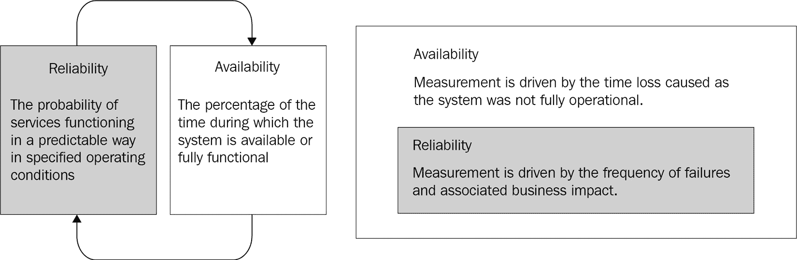
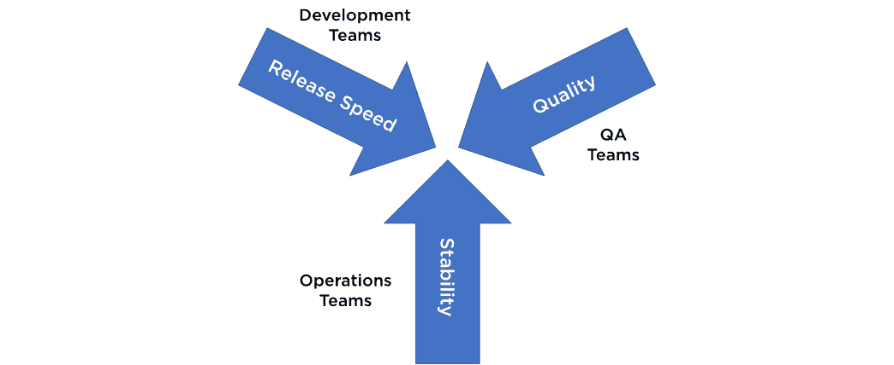
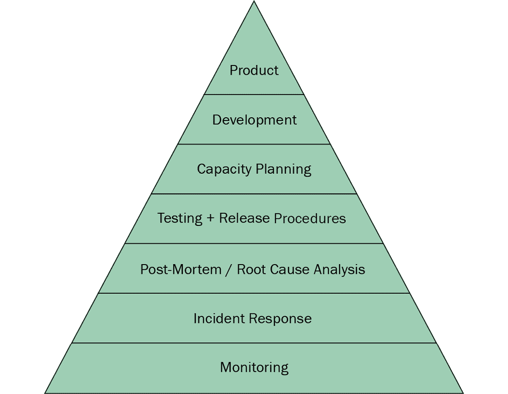
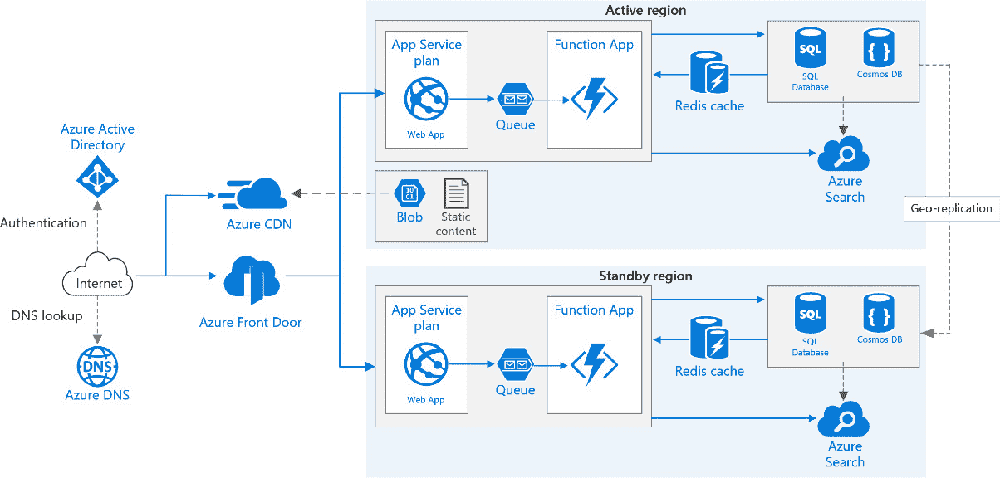

# 第二章：网站可靠性工程基础

在上一章中，您学习了 DevOps 文化、目标和好处。DevOps 的实践和习惯促进了团队之间的协作，并缩短了从创意构思、设计到最终用户部署的交付周期。

**网站可靠性工程**（**SRE**）和 DevOps 方法是互为补充而非竞争关系。SRE 并不是 DevOps 之后的下一步。技术上，采用 SRE 实践的团队在使用 DevOps 指标进行衡量时能够实现更好的客户成果。

传统上，组织将团队划分为不同的孤岛单元，如**开发**（**Dev**）、**质量保证**（**QA**）和**运维**（**Ops**）团队。开发团队主要负责完成功能开发，而 QA 团队主要负责执行并完成已开发功能的质量检查。运维团队则主要负责应用程序在生产环境中的部署和维护。此外，他们还需要监控并采取必要的措施，以确保已部署应用程序的可靠性和可扩展性。

SRE 和 DevOps 都有由具备开发和运维专业知识的工程师组成的团队。因此，组织可以防止各团队之间的孤岛效应。

企业或产品的声誉和成功依赖于云解决方案在生产环境中的稳定性。为了提高应用程序的稳定性和可扩展性，SRE 将使用自动化来减少重复和手动的运维任务。将 SRE 实践融入软件开发生命周期，对于在当前 IT 解决方案构建的时代中生存至关重要。

在本章中，我们将涵盖以下主要内容：

+   SRE 简介

+   关键原则与实践

# 技术要求

本章没有技术要求。

# SRE 简介

*SRE*这一术语最早由 Ben Treynor Sloss 在 Google 提出（[`sre.google/sre-book/introduction/`](https://sre.google/sre-book/introduction/)）。SRE 使 Google 能够以最有效、可靠、可扩展和可持续的方式管理大型复杂系统和庞大基础设施。

提示

SRE 主要关注服务的可靠性。

## 为什么可靠性如此重要？

可靠性被定义为在特定操作条件下，服务按预期执行的可能性。最可靠的系统将更易于访问，从而带来更好的客户体验。服务的可靠性是一个重要的质量指标。

可靠性和可用性是相互关联的；然而，它们的区别在于衡量方式。尽管可用性和可靠性是相辅相成的，但所采取的衡量方法可能会产生不同的结果。系统的可用性可以通过数学模型作为其可靠性的一个衡量标准。换句话说，可靠性可以视为可用性的一个子集。

## 什么是可用性？

系统的可用性可以通过系统可用或完全正常运行的时间百分比来衡量。一个软件系统由多个组件组成，所有这些组件都必须进行评估以确保其可用性。假设我们有一个包含数据库服务器、存储服务器和应用服务器的系统。系统的可用性将由这些组件的组合可用性来定义。

参考[`uptime.is/`](https://uptime.is/)以了解更多关于基于可用性保证的服务停机时间，通常称为**服务级别协议** (**SLA**)的信息。以下表格展示了某些可用性百分比和停机时限（以秒、分钟和小时为单位）。术语*可用性*或*正常运行时间*通常以“九”表示（表示九的数量），如表中所示（相应地计算允许的停机时间）：

| **可用性** | **允许停机时间** |
| --- | --- |
| **百分比** | **每日** | **每周** | **每月** | **每季度** | **每年** |
| 99.999%(五个 9) | 0 秒 | 6 秒 | 26 秒 | 1 分钟 18 秒 | 5 分钟 15 秒 |
| 99.99%(四个 9) | 8 秒 | 1 分钟 0 秒 | 4 分钟 32 秒 | 13 分钟 8 秒 | 52 分钟 35 秒 |
| 99.95%(三个 9) | 43 秒 | 5 分钟 2 秒 | 21 分钟 54 秒 | 1 小时 5 分钟 44 秒 | 4 小时 22 分钟 58 秒 |

表 2.1 – 可用性百分比和停机时间容许值

计算基于时间的可用性百分比的公式如下：

*可用性百分比 = ((服务正常运行时间 - 服务停机时间) ÷ (服务正常运行时间)) * 100*

例如，要计算单日生产服务的可用性，假设约定的服务预计会运行*24*365，可以使用以下公式*：

+   一天内约定服务预计正常运行的总秒数 = 86,400 秒。

+   特定日期的停机时间总和 = 部署时间 60 秒 + 因部署错误回滚时间 60 秒。

+   使用上述公式计算可用性 = ((86,400 -120) ÷ (86,400)) *100。

+   您当天服务的可用性为 99.86%。

SRE 提倡监控和评估对业务成功至关重要的重要服务的可用性。

您的 IT 部门的目标不应是全面提高服务的可用性。更高的可用性增加了业务成本，因为它需要更多的工作和资源。然而，由于更差的可用性可能导致显著的经济损失（通常，超过运营成本），因此 SRE 团队将采取务实的方法，根据业务需求定义可用性水平。

**域名服务**（**DNS**），例如，是互联网的目录。域名通过该服务与 IP 地址匹配。DNS 应该全天候、每周 7 天都可用。因此，DNS 的可用性保持在 100%。

一般来说，追求任何服务或系统的 100%可靠性并不是一个明智的选择。用户很难识别出一个服务是否是 100%可用，和一个 99.999%可用的服务之间的区别。

根据*表 2.1*，99.999%的可用性意味着每月可以容忍 26 秒的停机时间，每周可以容忍 6 秒的停机时间，在大多数情况下，这个时间是相当少的。

然而，一些任务关键型系统，例如医疗设备和航空器，必须完全可靠，无法承受任何停机时间。

## 可靠性挑战与 SRE

云架构必须可靠、可扩展并具有良好的性能。云服务将使用自动扩展来动态调整服务规模，以满足变化的需求，并且可观察性将用于支持监控系统性能、可用性、成功率、错误率、依赖错误率、请求失败率、延迟、新鲜度和吞吐量的应用程序。

组织将使用服务的可用性和可靠性指标来确定保持业务活动顺利进行所需的服务水平。您的 SRE 战略的关键决策因素是可靠性和可用性，它们有不同的含义，并且测量方式也不同：

图 2.1 – 可靠性与可用性

如前图所示，可靠性可以视为可用性的一个子集。组织已经意识到，在保持系统可靠性的同时，还需要保持开发速度、期望的可扩展性和操作稳定性，这是一项具有挑战性的任务。

传统的团队模型包括开发、质量保证（QA）和运维（Ops）团队，开发、QA 和运维任务被分开。这种分离导致了组织孤岛或*推卸责任*的心态，这影响了组织团队实现长期目标并培养学习和无责文化的能力：

图 2.2 – 可靠性挑战

开发团队*将*他们的代码丢到墙那边，期望运维团队在生产环境中运行和管理它。开发团队希望以快速的节奏将功能发布到生产环境中，而不负责应用程序的稳定性。另一方面，运维团队希望尽量减少对生产服务的更改，以避免任何对业务的干扰，从而保持服务的稳定性。

SRE 帮助团队在交付新功能和确保系统适当有效运行之间找到平衡。这种协作方法弥合了开发责任与日常系统运营、客户服务和支持任务之间的鸿沟。日常的客户支持和运营活动形成了一个反馈循环，这对于提高系统质量至关重要。

尽管客户越来越期望更短的交付时间，但仅仅关注交付速度或更高的产品速度是不够的。今天现代开发中最关键的属性之一就是可靠性。因此，在提高产品速度的同时保持可靠性，是任何 IT 组织的基本前提。SRE 团队负责其服务的可用性、延迟、性能优化、变更管理、监控、警报、应急响应和容量规划。

SRE 的基本目标是提高系统的可靠性和稳定性。团队理解可靠性指标是由业务需求驱动的，并非每个业务功能都需要最高水平的可靠性，因为这会涉及成本权衡。

### 适当的可靠性

服务的可靠性水平必须与其业务需求相匹配。在线电子商务企业与传统零售商店相比，会有不同的需求。例如，它们需要比传统零售商店更高的可用性，而后者通常只在设定的时间段内运营。

可靠性通过**服务级目标**（**SLOs**）来定义和衡量。SRE 实践可以根据需要调整，以实现适当的可靠性水平，SLO 通常被定义为在一段时间内的百分比达成率。SLO 是由关键业务目标驱动的，而**服务级指标**（**SLIs**）则是由在实现服务时可以衡量的内容驱动的。

### 一致的可靠性

产品建立在可靠的系统、服务和人员的基础上。SRE 认为，建立一种文化和实践是至关重要的，这将带来一致和可预测的可靠性。我们与同事建立的联系和信任、可持续的操作程序、以及我们培养的学习文化，为团队提供一个心理安全的工作环境，以实现环境可持续性，这些都是可靠性的一部分。

下一节将介绍 SRE 团队的关键原则和实践。

# 关键原则和实践

SRE 团队的日常活动包括开发和维护大型分布式服务。成功地运营一个健康的服务需要一系列广泛的活动，例如构建监控系统、规划容量、响应事故、解决故障根本原因等。

本节介绍了影响 SRE 团队日常活动的关键原则和实践。以下图表展示了从最基本到最先进的服务可靠性所需的元素：

图 2.3 – 根据 Google SRE 书籍的服务可靠性层级

从最基本的需求到推出产品或服务的巅峰步骤，Google 描述了为了提高系统可靠性和保持服务健康所需的可靠性层级。每个层级将在下文简要讨论：

+   **监控**：监控是维持系统可用性最重要的策略，它位于服务可靠性层级的最底层。有效的监控应简单且具有弹性，并且应该提供针对服务中关键故障的警报。这些警报应简单明了，易于理解。

没有监控的情况下，无法判断一个服务是否正常运行、是否离线或是否遇到间歇性的故障。要建立一个可靠的系统，你必须在用户注意到问题之前，就能察觉到服务中的问题和错误。一旦这些问题被发现，SRE 团队应优先处理并管理事故响应。为了减轻影响或恢复服务到先前状态，团队应以最有效的方式协调工作，并保持积极沟通。

Microsoft Azure 是一个非常强大的云平台，具备处理解决方案各个方面的丰富功能。该平台提供管理和部署应用程序的工具。在 Azure 云上开发解决方案时，必须选择适当的服务来满足你的 SRE 需求。

为了监控你的应用程序，你可以使用以下服务：

+   **Azure Monitor** 提供了一个全面的解决方案，用于收集、分析和处理来自云环境和本地环境的遥测数据，并支持大规模操作，配备了*智能警报*和*自动化操作*。

+   **Azure Application Insights** 是 Azure Monitor 的一个功能，提供强大的**应用性能管理**（**APM**）工具，能够轻松地与应用程序集成，发送遥测数据并分析应用程序特定的指标。它还提供现成的仪表板和指标浏览器，可以用来分析数据并探索业务需求。

+   **事件响应**：一旦你围绕服务建立了有效的监控，你需要配置通知系统，例如 SMS 和**事件管理系统（EMS）**，用于处理未计划的、关键的和紧急的事件。事件和故障在复杂的分布式系统中是不可避免的。需要适当的人为干预来识别根本原因并修复这些故障。

为了最小化业务影响并平稳运行服务，你需要建立一个结构化的过程来缓解和响应这些事件。事件得到缓解后，SRE 团队应按照事件管理响应过程尽快恢复服务。

事件响应框架有三个共同目标，广泛称为事件管理的**三大 C**（**3Cs**）：

+   **协调**响应工作。

+   **沟通**：在事件响应者、组织内部以及外部之间进行沟通。

+   保持对事件响应的**控制**。

尽管每个组织的事件响应过程可能会根据组织结构、技能和先前的经验有所不同，但可以参考以下一套建议和最佳实践来响应事件：

+   **优先级**：修复频繁发生的问题，尽快恢复服务，并保留根本原因分析的证据。

+   **准备**：提前与事件参与者共同制定并记录你的事件管理程序。

+   **信任**：为所有事件参与者在其分配的角色和责任范围内提供完全的自主权。

在事件发生期间，你必须平衡以下关键点：

+   **速度**：

    +   平衡快速行动以满足利益相关者需求与匆忙决策带来的风险。

+   **信息共享**：

    +   通知调查人员、利益相关者和客户，以减少责任，避免不切实际的期望。

+   **事后分析和根本原因分析/无责事后分析**：一旦事件得到缓解并处理完毕，SRE 团队会执行事后分析程序。这个事后分析程序为培养无责事后分析文化提供了机会。无责事后分析（或回顾）是一个事后文件，帮助团队弄清楚事件发生的原因、哪些做得好、哪些做得不好，并集思广益，探讨如何防止类似问题的再发生。

无责事后分析是 SRE 文化的一个基本原则。为了建立可持续的文化，我们需要假设所有参与事件的人都抱有良好的意图，并且在他们掌握的信息基础上做出了正确的决定，以最小化业务影响。将责任归咎于个人或团队会打击团队士气，并引发对惩罚的恐惧，这会使得问题更难暴露出来。

无责事后分析是团队从失败或错误中学习的机会。

+   **测试和发布流程/可靠性测试**：SRE 团队负责建立对其构建和维护的生产系统可靠性的信任。SRE 团队将采用完全自动化的测试策略，并结合传统的软件测试技术，将其部署到生产环境并发布给用户，确保没有问题或停机时间。旨在支持软件可靠性的自动化测试套件可以增强信心，确保软件能够顺利部署到生产环境中。作为其质量保证活动的一部分，SRE 团队必须优先考虑并持续投资于自动化测试实践。客户会更满意，平台的采纳率也会提高，从而带来更高的**投资回报率**（**ROI**）。

+   **容量规划**：作为 SRE 团队的一员，你负责确定你的服务所需的资源，包括必要的硬件、软件和网络资源，并确保即使面对预料之外的需求，服务仍能表现良好。容量管理是确保服务拥有足够资源以实现可扩展性、容错性、高效性和可靠性的过程。例如，SRE 会估算在特定时间间隔内，你将需要多少存储、服务实例或内存。这些数据将帮助你为服务创建可扩展的架构。在基于云的模型中，你可能对所需的容量更为灵活，因为可以动态地增加或减少所需资源。

Azure 应用服务、Azure SQL 数据库、Azure Kubernetes 和 Azure Cache for Redis 是 Azure 云服务的示例，这些服务内置了自动缩放功能。

例如，在**Azure 应用服务**中，缩放设置在秒级别应用，并影响你应用服务计划中的所有应用。你不需要修改或重新部署应用。你可以**扩展**并获得更多的 CPU、内存、磁盘空间以及额外的功能，例如专用的**虚拟机**（**VMs**）、自定义域名和证书、暂存槽、自动缩放等。你还可以利用自动缩放，依据设定的标准和时间表自动调整实例数量。缩放规则是一个更为可控的扩展或缩减的方法。

例如，每天 21:00，你可以将 Azure 应用服务的实例数缩减到两个，并设置规则，当 CPU 需求的平均值高于 50%时，自动扩展一个实例。扩展或缩减通常需要几分钟才能完成。在设计你的扩展计划时，请考虑这一点，以匹配性能需求并满足 SLA 要求。

+   **开发**：虽然每个人都期望服务能够顺利运行，但可能会由于某些无法控制的事件而发生中断，如自然灾害、硬盘故障，甚至是系统进程崩溃，这些都可能对您的服务产生不利影响。自然灾害可能会严重损坏某个区域的许多数据中心。为了保持系统 *正常运行*，SRE 团队必须设计策略来缓解这些故障。这些解决方案可能会采用诸如 **地理复制与故障转移**、**地理冗余**、以及 **活动-活动**、**活动-被动** **高可用性** 等部署模式/策略。

图 2.4 – 多区域架构

例如，如前图所示，多区域架构比单一区域部署提供更高的服务可用性。这里讨论的架构包括以下组件，仅举几例：

+   **活动区域与备用区域**：两个区域用于实现更高的可用性。一个是主区域，另一个区域用于故障转移。

+   **Azure Front Door**：一种现代云端 **内容分发网络**（**CDN**）服务，提供高性能、可扩展性和安全的用户体验，适用于您的内容和应用程序。该服务提供多种第七层负载均衡能力以及接近实时的故障转移。

+   **Azure DNS**：用于 DNS 域名托管服务，提供名称解析。

+   **Azure 应用服务**：Azure 的主要服务，用于 Web 应用程序和基于 Web 的 API，提供与 **Azure AD** 和 **Azure Key Vault** 的集成安全性。支持自动扩展。

+   **Azure Functions**：一种无服务器计算选项，采用事件驱动模型。在此架构中，当新消息推送到队列时，函数会被调用。

+   **Azure Redis 缓存**：作为解决方案的一部分，应用缓存层服务，提供内存中的托管缓存，以减少延迟并提高客户端性能。

+   **Azure 存储、Azure Cosmos DB 和 Azure SQL**：可以存储结构化和非结构化内容。

+   在灾难发生的情况下，如果区域中断影响了活动区域，Azure Front Door 将会切换到备用区域。此架构使用两个区域，活动区域和备用区域，以实现更高的可用性。在正常操作期间，网络流量会被路由到主区域。如果活动区域不可用，流量将路由到备用区域。

+   活跃/被动与热备份意味着在备用/待命区域的资源将始终处于运行状态。这些备用区域的资源可以用于 **A/B 测试**，以提高性价比。

+   **产品**：公司推出新产品的速度较慢。在云计算和分布式现代化世界中，推出和发布周期需要更快。

团队可以创建清单来记录行动项目和回滚计划。清单在以可复制的可靠性启动新服务中发挥着重要作用。清单需要根据公司的内部服务、流程和基础设施进行定制。

清单需要小心创建，否则它会膨胀到无法管理的规模。此清单可以并且应该被文档化和自动化，以最小化工作量。清单可以涵盖以下主题：

+   架构和依赖关系

+   集成

+   容量规划

+   故障模式

+   流程与自动化

+   开发过程

+   发布规划

+   渐进式和阶段性发布

在下一节中，我们将讨论影响 SRE 操作的模式和原则。

## 实施 SLOs 和 SLIs

SLOs 定义了您服务可靠性的目标水平。SLOs 是 SRE 实践的核心，因为它们对做出关于可靠性的基于数据的决策至关重要。SLOs 是帮助确定优先处理哪些工程工作的工具。

SLIs 是衡量您提供的服务水平的定量指标。SLOs 和 SLIs 总是并行存在，并通常是迭代定义的。SLOs 由关键业务目标驱动，而 SLIs 则由实施服务时可衡量的内容驱动。

您第一次尝试 SLI 和 SLO 时不必是正确的。最重要的目标是建立并进行测量，并设置反馈回路，以便您可以改进。您可以识别哪些度量指标最符合用户在您的服务中关心的内容。

SRE 团队建议根据关键服务使用有限的度量指标，以提高用户体验，而不是开发无穷无尽的监控指标。您可以从广泛的目标开始，然后随着时间的推移进行调整。这使您能够将警报集中在可以可靠地判断服务将失效并开始影响用户体验的实例上。

假设您正在构建一个外卖应用，用户可以执行以下操作：

+   浏览餐厅和菜单。

+   选择菜单项并下单。

+   支付订单。

对于这个应用，用户能够下单并成功支付对于更好的用户体验和整体业务成功至关重要。在这里，首次尝试的*下单并支付*场景将成为定义 SLOs 的基础，因为这个服务对业务成功的优先级高于其他任何服务。

下一步是弄清楚哪些度量指标可以作为 SLIs，最准确地跟踪用户体验。您可以从各种指标中选择，例如可用性延迟、吞吐量、正确性和数据新鲜度，接下来会详细介绍。

大多数服务专注于以下四个关键 SLI 指标来进行监控。这些是监控的四个黄金信号：

+   **请求延迟**：您的服务返回请求响应所需的时间

+   **服务可用性**：服务可用的时间占比

+   **成功率**：成功完成的请求数量

+   **吞吐量**：每秒处理的请求数量

定义 SLO 的*测量周期*非常重要，可以在不同的时间间隔内进行定义。SLO 和 SLI 需要是能够在监控系统中准确测量和表示的内容。随着时间的推移，你将比较 SLO 目标和 SLI 与实际度量指标。现在，对于*下单并支付*服务，它是 SLO 的基础，你希望在可接受的时间窗口内收到订单确认。

在我们以外卖应用为例的情况下，你可以为*下单并支付*服务设置一个响应时间值，比如 700 毫秒，用于在指定的 1 个月时间窗口内成功请求的响应。这些 SLI 目标和时间框架应当是业务可以接受的。所以，如果在一个日历月内有 10,000 个 HTTP 请求，其中 9,990 个请求成功，这意味着该月的可用性为 9,990/10,000，或 99.9%。

如果你的服务未能满足 SLO，SRE 团队将努力在新功能开发/部署和提高服务可靠性之间找到平衡，以避免在给定的测量周期内发生 SLO 违规。

SLA 是商业和客户之间的法律协议，包括可靠性目标以及未能达到目标的后果，而 SLO 是一个衡量客户如何使用服务的内部目标。SLO 不会与外部利益相关者共享，也没有法律约束力或后果。如果服务的可用性违反了 SLO，SRE 团队必须立即响应，以避免组织因未能满足 SLA 而受到处罚。SLO 应始终比相应的 SLA 更严格。SRE 团队通常不参与构建 SLA，因为 SLA 与业务和产品决策密切相关。然而，SRE 团队可以帮助定义 SLI。

为了在可靠性和创新之间找到合适的平衡，最好创建一个衡量 SLO 违规的比率，以及一个可以容忍 SLO 失效的*错误预算*。在接下来的部分中，我们将深入了解错误预算。

## 建立错误预算政策

**错误预算**是指在给定周期内，服务无法正常运行的最大错误数或最大时间，超过此限度会对业务产生负面影响，用户将不满。错误预算适用于服务的多个方面，例如可用性、延迟等。SRE 团队利用错误预算在服务可靠性和创新速度之间找到平衡。

错误预算将帮助你判断自己是否达到了预期目标，并帮助你采取适当的措施来减少服务的可靠性故障。如果服务在四周内收到 1,000,000 个请求，99.9%的成功请求 SLO（服务水平目标）允许我们在这段时间内预算 1,000 个错误。

一个具有 99.95% SLO 的服务，其错误预算为 0.5%，意味着在一年内整体的停机时间为 4 小时 22 分钟 48 秒。SRE 团队应采取适当的行动来恢复服务的稳定性，特别是当服务未达到 SLO，或错误预算已用尽或接近用尽时。

当你的服务在预算范围内时，SRE 实践鼓励你战略性地消耗错误预算，无论是用于新功能还是架构修改。尽管任何新的发布都会在某种程度上使服务变得不那么可靠，例如，如果服务因为部署配置问题而宕机，服务仍然在预算内。错误预算通常是根据一定时间段设定的，例如一个月、一个季度或一年。

错误预算通常用于战略性地为**Toil**任务（如手动部署、环境设置、配置更改、事件响应等）应用自动化。在下一节中，我们将进一步了解如何减少 Toil。

## 减少 Toil

在 SRE（站点可靠性工程）上下文中，"Toil" 指的是那些没有长期经济价值并且不会显著推动服务进展的操作。这些操作通常是重复性的，并且大多是手动的（尽管它们可以自动化）。随着服务或系统的增长，系统的手动请求数量可能会按比例增长，进而需要更多的人工劳动。

SRE 工程师最多只能将 50%的时间花费在*Ops*工作上，如处理工单、值班和手动任务等。

SRE 工程师应该将他们的另一半时间花在以下活动上（这不是一个全面的列表）：

+   使用自动化来实现可扩展性

+   发布部署

+   测试套件自动化

+   应用数据库更改

+   自动化响应事件，如密码重置和用户创建

+   审查非关键监控警报

+   为了减少 Toil 并提高系统可靠性，进行工程工作以开发新功能。

为了有效地减少 Toil 工作负担，SRE 团队可以从小处开始，逐步推进。消除 Toil 需要自动化，SRE 团队必须不懈努力，减少或最小化 Toil。自动化工程工作，无论是部分还是完全，都是必要的，但它不应危及系统可靠性。**Azure Automation** 可以用来自动化人类响应，并诊断和解决问题。自动化将提升团队的动力，使团队能够专注于工程工作。

# 总结

在这一章中，我们了解了 SRE 的原则和实践。现在我们知道如何计算基于时间的可用性，以及如何根据业务期望和需求定义可用性。

我们还探讨了传统团队模型中常见的可靠性挑战，以及如何通过建立 SRE 团队来帮助你在系统可靠性和开发之间找到合适的平衡。我们强调了适当且一致的可靠性的重要性。

然后，我们学习了从构思到成功将服务部署到生产环境的所有必要方面。我们还重点介绍了关键技术，如应用 SLO 和 SLI、减少繁重工作、事后分析文化，以及高效利用错误预算来提高系统和云服务的可靠性。

在接下来的章节中，我们将探讨 DevOps 工具和能力，看看它们如何帮助你管理软件开发生命周期。

# 自我实践练习

1.  与业务利益相关者和开发团队共同确定 SLO。

1.  对你服务在生产环境中最近或假设的生产事件进行无责事后分析：

    +   参阅[`sre.google/sre-book/example-postmortem/`](https://sre.google/sre-book/example-postmortem/)获取更多指导和一个示例事后分析。

    +   [`docs.microsoft.com/en-us/azure/architecture/resiliency/failure-mode-analysis`](https://docs.microsoft.com/en-us/azure/architecture/resiliency/failure-mode-analysis)

    +   [`docs.microsoft.com/en-us/azure/architecture/framework/resiliency/overview`](https://docs.microsoft.com/en-us/azure/architecture/framework/resiliency/overview)

1.  识别与在生产环境中运行服务相关的繁琐、重复性任务/负担。

1.  在 Azure 门户中，首先配置应用服务日志记录与应用洞察，以监控应用程序，然后配置电子邮件警报。

# 问题

在我们总结 SRE 战略时，这里有一份问题清单供你测试你对本章内容的理解。你可以在书本末尾的*评估*部分找到答案：

1.  正确还是错误？SRE 主要关注服务的可靠性。

1.  正确还是错误？可用性是以五个 9 来表示的。

1.  正确还是错误？SRE 采用自动化来实现应用程序管理。

1.  对于一个可用性为 95%的服务，每周、每月和每年的停机容忍时间是多少？

1.  最主要的三大可靠性挑战是什么？

    1.  开发速度

    1.  质量

    1.  稳定性

    1.  DevOps 管理

    1.  缺陷跟踪

1.  正确还是错误？服务的适当可靠性水平由关键利益相关者确定。

1.  在 SRE 的背景下，什么是负担（toil）？

# 进一步阅读

+   谷歌的 SRE 书籍：[`sre.google/sre-book/part-I-introduction/`](https://sre.google/sre-book/part-I-introduction/%20)

+   微软的 SRE 文档：https://docs.microsoft.com/en-us/learn/modules/intro-to-site-reliability-engineering/

+   *Azure 监视器*： [`docs.microsoft.com/zh-cn/azure/azure-monitor/overview`](https://docs.microsoft.com/zh-cn/azure/azure-monitor/overview%20)

+   *Azure 应用程序洞察*： [`docs.microsoft.com/zh-cn/azure/azure-monitor/app/app-insights-overview`](https://docs.microsoft.com/zh-cn/azure/azure-monitor/app/app-insights-overview%20)

+   *Azure 自动化*： [`docs.microsoft.com/zh-cn/azure/automation/overview`](https://docs.microsoft.com/zh-cn/azure/automation/overview)
