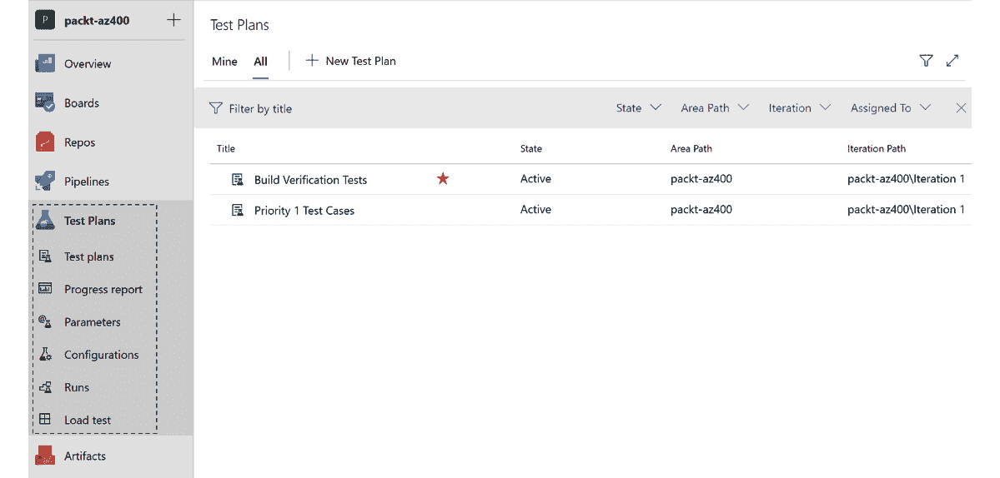

# 第三章：最大化利用 DevOps 工具

DevOps 可以看作是一种旨在改进整体**软件开发生命周期**（**SDLC**）过程的方法，从而增强参与团队之间的合作。因此，使用适当的工具集来支持 DevOps 流程和活动对于推动各个工程团队之间的一致性和可预测性至关重要。目标是通过自动化各个流程，建立创新文化，从而同步团队（或角色）的努力，在开发、测试和部署软件时，以尽可能高的质量实现更快的速度。

**Microsoft** 提供了诸如 **Azure DevOps**、**GitHub**、**Azure Monitor** 和 **Visual Studio Code** 等优秀产品，帮助简化在 DevOps 实施的各个生命周期阶段中采用重要实践的过程。这些工具功能丰富，并为开发者社区提供了业界领先的体验。通过其他**独立软件供应商**（**ISVs**）和开源社区提供的市场扩展，这些工具的开箱即用体验可以进一步扩展。

到本章结束时，你将熟悉其中一些工具的功能，以及它们在各自的软件开发程序中的应用背景。

在本章中，我们将涵盖以下主要主题：

+   SDLC 和 DevOps 工具

+   Azure DevOps 和 GitHub

+   Azure DevTest Labs

+   Azure Monitor

+   Visual Studio Code

# SDLC 和 DevOps 工具

无论是服务还是产品，SDLC 这个术语指的是在构建软件解决方案时所应用的一系列过程和实践，以确保质量并达到为工程团队设定的其他目标。

这些流程通常根据开发生命周期的各个阶段进行分组。随着技术的演进，这些流程的成熟度也得到了提升。由于分布式计算和云技术的使用，工程系统变得相对复杂，开发团队需要保持高度的严谨性和纪律性，同时利用自动化来支持他们的数字化转型之路。

根据你所遵循的软件开发方法论，无论是 **瀑布模型**、**敏捷**、**Scrum**、**看板**，还是你自己定制的版本，你很可能会以某种形式使用 DevOps 相关的实践。然而，值得一提的是，如果你希望充分发挥 DevOps 投资的真正潜力，瀑布模型已经不再是推荐的方法论。

让我们看看 DevOps 生命周期中执行的一些关键活动。

## DevOps 生命周期中的关键活动

从高层次来看，DevOps 相关的活动可以分为四个不同的重点领域，如下图所示：

图 3.1 – DevOps 生命周期中的关注领域和关键活动

这里列出的活动清单旨在作为基本的基础列表。根据您的 DevOps 成熟度，您可能会实施更多的实践来最大化业务成果。您必须利用*第一章*《DevOps 简介》中与您的上下文相关的 DevOps 度量指标，并识别出有助于实现这一目标的重要实践。

在接下来的几个部分中，我们将详细回顾这些关注点，帮助您更好地理解每个部分。

### 规划和跟踪

开发团队识别并组织产品积压，并发布工作任务给团队。工作将根据业务优先级和可用容量进行排期。积压梳理和完善是产品生命周期中的持续活动，且将跨多个版本进行。

### 开发和测试

开发团队开始以源代码或脚本的形式产出工作成果。所有对代码库的更改都会通过静态分析器、单元测试，甚至人工检查来检测质量问题。一旦确认无误，工件将被编译并构建，生成可部署的包，也称为解决方案。

### 部署和发布

解决方案最初部署在测试环境中，使用自动化测试验证其正确性，然后发布到生产环境中。之后，解决方案将正式上线，并供最终用户访问产品或服务。

### 监控和学习

一旦解决方案上线，这一阶段开始生效，从产品或服务的实际使用中捕获诊断和健康监控信息。监控工具中捕获的数据会定期分析故障和错误；任何识别出的问题要么通过自动化程序进行缓解，要么记录为待修复的缺陷。此时，客户反馈也可以通过渠道反馈给产品或服务，以提出改进建议。现在，您已经了解了 DevOps 生命周期中的工作内容，我们接下来将回顾一些常用的 DevOps 工具。

## 您的 DevOps 需求的工具

微软提供了多种工具来支持您的 DevOps 生命周期需求。此外，它还支持与其他第三方工具的集成，为您团队的开发人员提供一个协调一致的体验。因此，无论您是在构建新软件系统还是维护现有系统，您都可以轻松采用 Azure DevOps 服务和 GitHub，以大规模创新。

这里列出了您可以计划用于各种 SDLC 活动的工具：

| **实践/活动** | **工具选择** |
| --- | --- |
| 管理产品积压，规划并跟踪工作，准备仪表板和报告。 | Azure Boards |
| 本地开发代码，构建、调试并测试。 | Visual Studio Code/Visual Studio |
| 管理和跟踪源代码的更改。 | Azure Repos，Git |
| 定义**持续集成**（**CI**）/**持续部署**（**CD**）工作流，以集成更改并将最新发布部署到不同环境。 | Azure PipelinesGitHub ActionsJenkins（第三方） |
| 提供开发环境。 | Azure DevTest Labs，Azure Virtual Desktop |
| 部署和管理 Azure 云基础设施和服务（包括 IaaS 和 PaaS）。 | **Azure 资源管理器**（**ARM**）和 Azure **命令行界面**（**CLI**）Ansible 和 Terraform（第三方） |
| 管理资源的配置。 | Ansible，Terraform，Chef，Puppet 和 Azure Automation |
| 高级分析和报告。 | Power BI |
| 捕获和分析日志（诊断、审计和健康）。 | Azure Monitor 和 Azure Data Explorer |
| 准备测试计划并管理执行。 | Azure Test Plans |
| 存储可重用的软件包和工件。 | Azure Artifacts |
| 通过使用第三方扩展和插件提高生产力。 | Azure DevOps MarketplaceGitHub Marketplace |

表 3.1 – 用于 SDLC 活动的 DevOps 工具

请访问 https://azure.microsoft.com/en-in/solutions/devops/#practices 了解更多详细信息。

在接下来的几节中，我们将介绍这些工具的一些功能和能力。这些工具的详细使用也将在后续章节中解释，并提供说明性示例，展示如何实现各自的 DevOps 实践。

# Azure DevOps 和 GitHub

**Azure DevOps** 和 **GitHub** 是微软提供的两款强大的**软件即服务**（**SaaS**）产品，构成了完整的 DevOps 工具集。从管理待办事项和团队流程，到基于 Git 的代码库，再到能够执行 CI/CD 流程并进行自动化测试，你会发现 GitHub 和 Azure DevOps 是完美的解决方案。

在接下来的子章节中，我们将探索这两款工具的独特功能。

## Azure DevOps

最初，作为 Visual Studio 套件的一部分，现今的 Azure DevOps 可能是工程团队最常用的产品，用于管理他们的源代码和应用程序生命周期过程。它以前被称为**Visual Studio Team Services**，在此之前还叫做**Visual Studio Online**。

Azure DevOps 是 Azure 云托管版的 Azure DevOps Server，之前在开发者社区中被称为**Team Foundation Server**（**TFS**）。该产品中提供的主要服务如以下图所示：

图 3.2 – Azure DevOps 中可用的服务

您对这些服务的访问权限将取决于您用户帐户的许可类型。有关个人和组织可用的完整许可选项列表，请访问 [`azure.microsoft.com/en-in/pricing/details/devops/azure-devops-services/`](https://azure.microsoft.com/en-in/pricing/details/devops/azure-devops-services/)。

让我们简要了解每个服务。

### Azure Boards

使用 Azure Boards 管理产品待办事项并跟踪工作变得更加容易。通过使用看板风格的板块，您可以创建自定义的看板来跟踪从想法到实现的所有内容：

图 3.3 – Azure Boards 的功能

您可以在此阅读更多有关 Azure Boards 的信息：[`docs.microsoft.com/en-in/azure/devops/boards/get-started/what-is-azure-boards?view=azure-devop`](https://docs.microsoft.com/en-in/azure/devops/boards/get-started/what-is-azure-boards?view=azure-devop)`s`。

使用 Azure Boards，您可以执行以下操作：

+   管理和组织您的待办事项列表。

+   可视化各个阶段，并在每日站会和团队会议中使用它们来跟踪进度。

+   为各利益相关者创建自定义的仪表板报告。

在下一节中，我们将介绍 Azure Repos，这是您将存储所有工作产品的地方。

### Azure Repos

**源代码管理**（**SCM**）和**版本控制**对管理代码库更改的工程团队至关重要。Azure Repos 提供了一个版本控制工具，用于管理各种软件开发项目。

Azure Repos 提供两种类型的版本控制系统：

+   **团队基金会版本控制**（**TFVC**）：这是一个集中式版本控制系统。尽管近些年使用不广泛，但许多项目团队仍然在出于遗留目的的情况下继续使用这种方法。

+   **Git**：这是更受欢迎的分布式版本控制系统。如果您刚开始您的 DevOps 之旅，建议仅使用基于 Git 的版本控制系统：

图 3.4 – Azure Repos 的功能

您可以在此阅读更多有关 Azure Repos 的信息：[`docs.microsoft.com/en-us/azure/devops/repos/get-started/what-is-repos`](https://docs.microsoft.com/en-us/azure/devops/repos/get-started/what-is-repos)。

使用 Azure Repos，您可以执行以下操作：

+   使用 Git CLI 或基于 GUI 的工具管理您的源代码更改。

+   配置分支策略和安全性以确保合规性。

+   使用语义搜索快速找到您在代码库中查找的内容。

现在，让我们回顾一下 Azure Pipelines，您将使用它进行 CI/CD 过程。

### Azure Pipelines

所有基于代码的工件都遵循某种形式的持续集成（CI）、持续交付（CD）和**持续测试**（**CT**），以确保它们的质量，然后才能将其移至生产环境。Azure Pipelines 提供自动化来执行构建、测试和发布工作流。执行任务的顺序通过 YAML 文件进行配置。在构建管道时，您可以选择多个源代码库（如**Azure Repos**、**GitHub**、**Bitbucket**等）。此外，通常会为不同的工作负载创建单独的管道，并根据需要进行门控审批检查：

图 3.5 – Azure Pipelines 中的功能

您可以在此阅读更多关于 Azure Repos 的内容：[`docs.microsoft.com/en-us/azure/devops/pipelines/get-started/what-is-azure-pipelines?view=azure-devops`](https://docs.microsoft.com/en-us/azure/devops/pipelines/get-started/what-is-azure-pipelines?view=azure-devops)。

使用 Azure Pipelines，您可以执行以下操作：

+   创建 CI/CD 管道（基于 YAML），执行各种任务，如构建解决方案、运行自动化测试，然后部署解决方案。

+   管理不同环境的部署。您还可以实施门控检查和批准。

现在，让我们回顾一下如何使用 Azure 测试计划组织您的测试用例。

### Azure 测试计划

测试是软件开发生命周期（SDLC）中的一个非常重要的步骤。测试活动有不同的类型，如功能测试（手动或自动化）、性能测试、用户验收测试和探索性测试。Azure 测试计划允许您为任何特定的迭代或版本创建执行计划，包含适用的测试并跟踪执行结果。执行测试计划的报告可以轻松生成，利益相关者可以根据报告推断软件产品或服务的质量：

图 3.6 – Azure 测试计划中的功能

您可以在此阅读更多关于 Azure 测试计划的内容：[`docs.microsoft.com/en-us/azure/devops/test/overview?view=azure-devops`](https://docs.microsoft.com/en-us/azure/devops/test/overview?view=azure-devops)。

使用 Azure 测试计划，您可以执行以下操作：

+   为各种类型的测试活动创建执行计划。

+   维护测试用例、缺陷和产品待办事项之间的可追溯性。

+   使用现成的图表和小部件分析测试报告。

在下一部分中，我们将回顾您的团队如何利用 Azure Artifacts 作为所有可重用代码组件的存储库。

### Azure Artifacts

Azure Artifacts 允许开发人员管理各种类型的可重用包，以满足他们的解决方案开发需求。这些包可以仅供内部使用，也可以分发给外部。实质上，它充当了一个包的仓库，如公开可用的注册表。

您可以在此处了解更多关于 Azure Artifacts 的信息：[`docs.microsoft.com/en-us/azure/devops/artifacts/start-using-azure-artifacts?view=azure-devops`](https://docs.microsoft.com/en-us/azure/devops/artifacts/start-using-azure-artifacts?view=azure-devops)。

使用 Azure Artifacts，您可以执行以下操作：

+   将包发布到中央私有仓库。支持的包类型包括 NuGet、npm、Maven、Python 和通用包。

+   消费并共享包以供其他解决方案组件重用和参考。

现在，让我们来看看微软的 GitHub 提供的服务。

## GitHub

GitHub 于 2018 年 6 月左右被微软收购。在最初几年，GitHub 是开发者社区中非常流行的代码托管平台，主要用于开源项目的代码共享。然而，自从被收购以来，它增加了各种功能，使其在开发者中更受欢迎，帮助他们构建和共享代码，同时通过提供多种其他功能扩大了企业使用范围。

GitHub 是另一款非常流行的工具，用于实现您的 DevOps 实践。产品中提供的主要功能如下图所示：

图 3.7 – GitHub 上可用的功能

您可以在 https://github.com/features 详细了解这些功能。

由于功能列表持续更新（您可以参考公共路线图：[`github.com/github/roadmap`](https://github.com/github/roadmap)），请随时查阅产品文档以获取最新信息。

在下一部分中，我们将介绍**Azure DevTest Labs**，它允许您快速配置非生产类型的环境，以验证您的解决方案是否有效。

# Azure DevTest Labs

这是微软 Azure 提供的一项服务，允许开发人员使用已发布的可重用模板和工件快速创建开发和测试环境。您可以在此处找到更多信息：[`azure.microsoft.com/en-in/services/devtest-lab/`](https://azure.microsoft.com/en-in/services/devtest-lab/)。

虽然该服务可免费使用，但仍要求开发人员拥有付费的 Azure 订阅。不过，根据适用的定价计划，使用已配置的 Azure 资源将按大幅折扣价格收费。您可以在此处查阅与定价相关的详细信息：[`azure.microsoft.com/en-in/pricing/details/devtest-lab/`](https://azure.microsoft.com/en-in/pricing/details/devtest-lab/)。

在下一部分中，我们将查看 Azure 中可用的监控工具。

# Azure Monitor

**Azure Monitor** 提供丰富的仪表板功能，帮助你监控特定应用程序的指标、资源健康状况和利用率，以检测异常并提供及时干预。这是一个综合性服务，允许你收集、分析并处理来自各种来源的监控数据，包括应用程序、基础设施和其他自定义源。

你必须计划使用的 Azure Monitor 的一些关键功能如下：

+   **日志分析**，深入挖掘监控数据并获取深刻洞察

+   **Application Insights**，用于端到端事务追踪、异常和性能指标

+   **容器洞察**，用于微服务的使用情况和健康相关统计

+   **自定义仪表板**，根据使用案例量身定制，用于跟踪使用情况和可靠性指标

+   **警报**，用于检测异常并通知团队采取适当的行动，以及执行自动化的[操作](https://azure.microsoft.com/en-us/services/monitor/)。

[要了解更多关于 Azure Monitor 的信息，请访问](https://azure.microsoft.com/en-us/services/monitor/) [`azure.microsoft.com/en-us/services/monitor/`](https://azure.microsoft.com/en-us/services/monitor/)。

来自不同来源的监控数据可以分为两部分，即**日志**和**指标**。它们是 Azure Monitor 服务中的两个独立的大数据存储。

Azure Monitor 由一系列产品和服务组成，提供所需的监控和仪表板功能。在以下小节中，我们将回顾三种最常用的服务——即 Azure Monitor 日志、Azure Monitor 指标和 Application Insights。

## Azure Monitor 日志

可以收集来自多个来源的通用日志和性能数据，并将其整合到 Azure Monitor 日志的一个工作区中。

更多信息请参见：[`docs.microsoft.com/en-in/azure/azure-monitor/logs/data-platform-logs`](https://docs.microsoft.com/en-in/azure/azure-monitor/logs/data-platform-logs)。

## Azure Monitor 指标

这是 Azure Monitor 的一项功能，将来自多个来源的数值数据捕获到一个**时间序列数据库**中。这些值对应于从系统收集的、按定期间隔采样的指标列表。

更多信息请参见：[`docs.microsoft.com/en-in/azure/azure-monitor/essentials/data-platform-metrics`](https://docs.microsoft.com/en-in/azure/azure-monitor/essentials/data-platform-metrics)。

## Application Insights

你可以通过 Azure Application Insights 在所有应用程序中集成对丰富遥测数据的捕获支持。使用日志来获取洞察，检测性能问题，诊断常见错误，利用端到端事务流可视化 HTTP 请求，并收集指标以推导出其他各种指标。

你可以在这里了解更多关于 Azure Application Insights 的信息：[`docs.microsoft.com/en-us/azure/azure-monitor/app/app-insights-overview`](https://docs.microsoft.com/en-us/azure/azure-monitor/app/app-insights-overview)。

在下一节中，我们将回顾开发人员常用的工具——Visual Studio Code。

# Visual Studio Code

Visual Studio Code 是微软推出的一款免费代码编辑器，允许你快速开发、构建、部署和测试现代云应用。它可以在 Windows、Linux 和 macOS 上使用，并内置支持多种编程语言。此外，它还有一个社区支持的插件和小工具，可以极大提升你的工作效率。

如果你是开发人员，必须尝试 Visual Studio Code。欲了解更多信息，请访问 [`code.visualstudio.com/`](https://code.visualstudio.com/)。

# 总结

本章中，我们回顾了几种可以用于 DevOps 生命周期需求的重要工具。我们将在接下来的章节中通过实例和实践实验详细说明这些工具的具体使用。不论你是开发人员还是 IT 管理员（Ops），你都会在日常工作中使用这些工具中的一种或多种。

继续专注于构建自动化工作流，更多地采用这些工具将有利于你的组织实现 DevOps 目标，这些目标通过各种指标进行跟踪。研究表明，已经转向 DevOps 交付模式的企业，在执行各种数字化转型计划方面比竞争对手更成功。

因此，必须理解，技术的使用在推动 DevOps 成熟度指数方面也发挥着至关重要的作用。在企业中采用 Azure DevOps 和 GitHub，不仅能激发团队更大的生产力和潜力，还能提升你成为 DevOps 采纳者的顶尖表现者的机会。

在下一章中，我们将探讨在 API 平台生命周期流程中实施正确的 DevOps 实践的重要性。

# 自我练习

利用本章中介绍的概念来完成以下活动：

+   使用你的电子邮件在 [`github.com/`](https://github.com/) 注册 GitHub。

+   通过访问 https://azure.microsoft.com/en-us/free/ 创建一个免费的 Azure 账户。创建账户时，你需要使用现有的 Microsoft 账户（或 GitHub 凭证）进行注册。

+   通过访问 https://azure.microsoft.com/en-us/services/devops/?nav=min 创建一个免费的 Azure DevOps 组织。这样，你将在 Azure DevOps 目录中创建一个组织。

# 问题

在本章结束时，以下是一些问题，供你测试自己对本章内容的理解。你可以在附录中的 *评估* 部分找到答案：

1.  判断题：你需要企业用户账户才能创建 Azure DevOps 项目。

1.  判断对错：你可以使用 Azure Boards 可视化和跟踪团队的工作。

1.  判断对错：Azure Application Insights 提供性能指标，例如所有与其集成的应用程序的响应时间。

1.  判断对错：你可以在 Azure Pipelines 中使用 GitHub 存储库。

1.  判断对错：GitHub 仅作为开源代码存储库使用。

# 进一步阅读

要了解本章涉及的主题，请查看以下资源：

+   企业 DevOps 报告: https://azure.microsoft.com/en-us/resources/enterprise-devops-report-20202021/

+   Agile: https://docs.microsoft.com/en-us/devops/plan/what-is-agile

+   Scrum: [`docs.microsoft.com/en-us/devops/plan/what-is-scrum`](https://docs.microsoft.com/en-us/devops/plan/what-is-scrum)

+   Kanban: https://docs.microsoft.com/en-us/devops/plan/what-is-kanban

+   GitHub: [`docs.github.com/en`](https://docs.github.com/en)

+   Ansible: [`docs.ansible.com/`](https://docs.ansible.com/)

+   Terraform: [`www.terraform.io/docs`](https://www.terraform.io/docs)

+   Chef 和 Puppet: [`www.chef.io/puppet`](https://www.chef.io/puppet)

# 第二部分 – 实现持续交付

在本部分中，你将学习源代码控制、持续集成和持续部署的实践。大多数组织首先采用这些 DevOps 实践，因为它使你能够以最有效、可预测的方式持续地生产高质量的解决方案。

本书的这一部分包含以下章节：

+   *第四章*，*一切始于源代码控制*

+   *第五章*，*过渡到持续集成*

+   *第六章*，*实现持续部署和发布管理*
