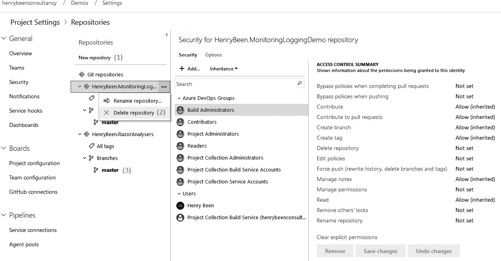

# 第四章：一切从源代码控制开始

源代码控制是软件开发中最基本的工具之一。因此，可以合理假设你之前已经使用过源代码控制。鉴于此，本章将仅简要介绍源代码控制，并迅速进入更高级的话题，以帮助你设置源代码控制并支持 DevOps 实践。

多种 DevOps 实践依赖于源代码控制，因此，设置你的代码库以持续为用户提供价值是一个很好的起点，并且是后续章节中许多主题的前提条件。

本章将涵盖以下主题：

+   Azure DevOps 源代码控制系统中的源代码控制类型

+   选择分支和合并策略

+   使用分支策略保护源代码控制

+   可用于源代码控制的其他工具

# 技术要求

为了实践本章所涉及的主题，你可能需要一个 Azure DevOps 组织。此外，请确保在本地计算机上安装了 Git 工具。你可以从这里下载 Git 工具：[`git-scm.com/downloads`](https://git-scm.com/downloads)。

# Azure DevOps 中的源代码控制类型

虽然存在许多不同的源代码控制系统，但它们可以分为两类：集中式和去中心化，如下所示：

+   在**集中式源代码控制**系统中，只有服务器拥有完整的历史记录和构成代码库的所有分支。

+   在**去中心化源代码控制**系统中，每个与代码库协作的人都拥有代码库的完整副本，包括所有分支及其历史记录。

Azure Repos，作为 Azure DevOps 服务的一部分，通过**团队基础版本控制**（**TFVC**）和 Git 提供两种类型的源代码控制。接下来的两节将更详细地讨论这两种源代码控制。

## 集中式源代码控制

在集中式源代码控制系统中，服务器是唯一存储完整代码库（包括所有历史记录）的地方。当你创建内容的本地版本时，你只会获得代码的最新版本。获取这个最新版本的过程称为**检出**代码库。除了这个最新版本，你的计算机上只有你本地所做的更改。

不检出完整历史记录显然节省了你本地计算机的空间。然而，如今磁盘空间几乎从来不是问题。这样做的缺点是，你需要持续连接到服务器，才能执行诸如查看文件历史记录、其他人最近提交的内容，或是某个文件中的某一行最后由谁修改等操作。

集中式源代码控制系统的一个优点是，它们通常提供对谁可以访问哪些分支、目录，甚至文件的精细控制选项。

## 去中心化源代码控制

使用去中心化源代码管理系统时，所有文件、历史记录和分支也会存储在服务器上。与集中式源代码管理的不同之处在于，当你**克隆**仓库时，能够在本地计算机上拥有一份副本。

由于你拥有仓库的完整克隆，现在可以在不需要再次连接到服务器的情况下查看文件的历史记录和其他分支。这显然减轻了服务器的负担，并允许你在断开连接时继续工作，这是去中心化源代码管理的两个优势。

缺点是，去中心化的源代码管理可能比集中式源代码管理更难学习。总体来说，去中心化源代码管理系统的学习曲线更陡峭。此外，基于单独目录和文件的访问控制通常也更为有限。

无论你使用哪种类型的源代码管理，都必须制定分支和合并策略，以便让开发人员能够并行工作在不同的功能上，同时始终保持 `master` 分支处于可交付的状态。

在 Azure DevOps 的一次更新中，仓库创建时默认创建的分支现在被命名为 `main`。Azure DevOps 还提供了将默认分支重命名为其他名称的功能。有关更多信息，请参考：[`docs.microsoft.com/en-us/azure/devops/repos/git/change-default-branch`](https://docs.microsoft.com/en-us/azure/devops/repos/git/change-default-branch)。

在下一节中，我们将了解开发者社区中最常用的不同源代码管理系统。

## 源代码管理系统

目前有许多源代码管理系统被使用，但在本章中，我们将只关注当前最常用的三种，它们如下：

+   TFVC

+   Git

+   Subversion

在 Azure DevOps 中，只有 TFVC 和 Git 可用。Subversion 是由 Apache 基金会创建的集中式源代码管理系统。在接下来的小节中，我们将更详细地了解 TFVC 和 Git，并学习如何在它们之间迁移源代码。Subversion 将在本章最后的 *其他源代码管理工具* 部分进行讨论。

### TFVC

**TFVC** 是由微软在 2013 年推出的集中式源代码管理系统，作为 **Team Foundation Server** (**TFS**) 的一部分，该产品已经发展成了现在的 Azure DevOps。TFVC 在 Azure DevOps 中仍然受到支持，但不建议用于新项目。如果你还没有使用 TFVC，那么学习它没有什么价值，因为微软很可能不会再为它发布新功能，但也不必因为没有其他原因就停止使用它。

在 Azure DevOps 中，每个团队项目最多只能有一个 TFVC 仓库。

### Git

除了 TFVC，Azure DevOps 还支持托管 Git 代码库。Git 是一种去中心化的源代码控制方式，目前在开发者社区中是标准做法。Git 并非 Azure DevOps 特有，它是一种通用协议，许多提供源代码托管服务的平台都使用这个协议。Azure DevOps 之外的著名例子有 GitHub 和 GitLab。

要与 Git 代码库一起工作，您必须首先克隆它：

1.  打开*命令提示符*并导航到您希望存储代码库的目录。

1.  执行以下命令并将示例 URL 替换为您的 Git 代码库的 URL。示例 URL 展示了 Azure DevOps 中 Git 代码库位置的构建方式：

    ```
    git clone https://{organization}@dev.azure.com/{organization}/{teamProjec t}/_git/{repository}
    ```

现在，您可以开始处理您想要做的更改。在本示例中，添加了一个新文件`NewFile.txt`。

1.  接下来，必须暂存此文件以便提交。暂存文件是为了区分您想提交的文件和您希望保留的更改：

    ```
    git add NewFile.txt
    ```

1.  在将所有希望归为一个提交的更改暂存后，创建实际的`commit`可以通过调用`commit`命令并指定更改描述来完成：

    ```
    git commit -m “Added a new file that contains an important text”
    ```

1.  最后，您可以通过执行以下命令将您的更改推送回中央代码库（也称为远程库）：

    ```
    git push
    ```

要进行更多更改，您可以根据需要随时暂存和提交更改。您可以一次提交一个提交，也可以一次推送多个提交。

您也可以通过**Visual Studio**（**VS**）或 VS Code 接口来使用 Git。在这里，您执行完全相同的步骤，但可以使用图形界面代替熟悉的命令行界面。

### 大文件存储

Git 被设计和优化用于处理纯文本文件，并跟踪从版本到版本的变化。然而，您可能希望在源代码管理中存储除了文本文件以外的其他内容。比如，图像或二进制文件，这些文件应该在应用程序运行时与应用一起使用。虽然这些是有效的使用场景，但开箱即用时，它们与 Git 的兼容性并不好。为了解决这个问题，引入了**大文件存储**（**LFS**）。

Git LFS 并不直接存储二进制文件本身，而是允许您存储一个小的文本文件，这个文本文件充当二进制文件的指针。该文本文件包含二进制文件的哈希值，以便客户端在克隆或获取更改时下载文件。之后，当您更新二进制文件时，文本文件中的哈希值也会更新。

要使用 Git LFS，您必须在 Git 客户端之外安装 LFS 客户端。这是一个独立的客户端，代码库的每个用户都必须下载。没有这个客户端，其他用户只能看到指针文件，而无法看到实际的二进制文件。安装客户端后，您必须为代码库准备 LFS 的使用。以下示例命令启用了对 MP4 文件的 LFS 支持：

```
git lfs install
git lfs track “*.mp4” 
git add .gitattributes
```

从现在开始，您可以像处理任何文件一样处理 MP4 文件，在幕后，它们将与您的文本文件更改分开存储。

## 在控制系统之间迁移

DevOps 旅程中的一步是工具的整合。这意味着在某个时刻，您可能会被要求将源代码从一个源代码控制系统迁移到另一个，并且公司可能决定将所有源代码从 GitLab 或 Subversion 迁移到 Azure Repos。您可以选择多种选项来执行此类迁移。

最可能的情况是您将收到将源移动到一个或多个 Azure Git 存储库的请求。可能的来源包括其他 Git 存储库、TFVC 或 Subversion。有工具和方法可用于在保留原始存储库中变更历史的同时执行此类迁移。

如果没有可用的程序或者必须从另一个系统导入源代码，您还可以回退到创建一个新的空存储库，并使用现有代码库进行初始化。这种方法的缺点是所有历史记录将丢失。

### 迁移现有 Git 存储库

在迁移源方面，与其他迁移相比，将 Git 存储库迁移到另一个托管位置非常简单。让我们学习如何做到这一点：

1.  首先，将现有存储库克隆到您的本地计算机：

    ```
    git clone https://{organization}@dev.azure.com/{organization}/{teamProjec t}/_git/{repository} .
    ```

1.  添加另一个引用新的空存储库的远程服务器，您希望将源移动到该存储库：

    ```
    git remote add migrationTarget https://{organization}@dev.azure.com/{organization}/{teamProjec t}/_git/{newRepository}
    ```

1.  最后，将更改推送到这个新存储库。您必须对每个要移动到主干旁边的分支单独执行此操作：

    ```
    git push migrationTarget master
    ```

同时，其他开发人员可能会继续使用现有的存储库。

1.  要将这些包含在新存储库中，您必须从原始存储库将它们获取到您的本地计算机，然后将它们推送到新存储库。再次为每个分支重复此操作：

    ```
    git fetch origin master
    git push migrationTarget master
    ```

1.  指示所有开发人员开始使用新的远程存储库。随后，计划废弃原始存储库。

1.  成功迁移后，最好删除旧存储库。这样可以防止任何人意外继续在那里工作。

前述步骤对任何 Git 到 Git 的迁移都适用。

现在，如果您特别想迁移到 Azure Git 存储库，您还可以使用 Azure DevOps 提供的`导入`功能。要执行此操作，请按照以下步骤操作：

1.  转到**存储库**，并可选择创建一个新的 Git 存储库。

1.  选择导入现有存储库。

1.  提供所请求的信息。

1.  单击**导入**以开始导入存储库。

以下截图展示了这些步骤：


图 4.1 – 导入存储库

这种方法的缺点是您不能继续将更改从源仓库推送到新仓库。这意味着您团队中的所有其他开发人员必须确保他们自己将更改迁移过来，或者在您迁移仓库时没有任何待处理工作。

### 从 TFVC 迁移到 Azure Git 仓库

要从 TFVC 迁移到 Git，您可以使用与将任何 Git 仓库迁移到 Azure 仓库相同的导入仓库。此向导可以在进行导入时迁移过去 180 天的变更历史。如果这不够，您需要将超过 180 天的历史迁移到新仓库，您可以使用其他方法，但这些方法更加复杂。更多详细建议的链接已包含在本章末尾。

### 从 Subversion 迁移到 Azure Git 仓库

您可能收到的最后一种请求是将 Subversion 仓库迁移到 Git 仓库。对此，微软没有提供现成的解决方案。但是，Atlassian 创建了一个工具，可以在保持变更历史的同时，将 Subversion 仓库迁移到本地 Git 仓库。

运行此工具后，剩下要做的就是向新的空托管仓库添加远程仓库，并推送所有分支。这些步骤与从 Git 迁移到 Git 的步骤相同，从添加新远程仓库的步骤开始。

### 不保留历史记录的迁移

如果您被要求进行不保留历史记录的迁移，您可以直接从本地计算机上的源文件夹创建一个新的空仓库，并将现有更改推送到该仓库。

从包含应进入 `master` 分支的文件的目录执行以下命令：

```
git init 
git add
git commit -m “Initial import of existing sources”
git remote add https://{organization}@dev.azure.com/{organization}/{teamProject}/_git/{repository}
git push
```

这些命令初始化一个新的仓库，创建所有目录中文件的第一个提交，添加对目标服务器位置的引用，并将新创建的仓库推送到该位置。

如果您想保留多个分支，必须为每个其他分支重复以下步骤：

1.  首先，进入该分支的正确目录：

    ```
    Git checkout {branchName}
    ```

1.  现在，将需要进入该分支的文件复制到您的工作目录中。然后，继续执行以下命令：

    ```
    git add . 
    git commit 
    git push
    ```

这完成了迁移，您本地计算机上的源文件的最新版本现在可以在 Git 中使用。您的团队其他成员现在可以克隆该仓库并与其合作。接下来，我们将继续学习关于分支和合并的内容。

# 选择分支和合并策略

源代码管理允许你保留所有文件更改的历史记录，还允许你与团队成员暂时分开工作（如果你愿意的话）。我们称之为**分支**。当你在源代码管理中进行分支时，你**分叉**了当前注册的更改路径。我们称这样的分叉为**分支**。分支使你可以暂时将某些工作与其他工作隔离开来。在任何时候，如果你想将一个分支的更改与另一个分支的更改合并，你可以**合并**这些更改。分支通常用于开发尚未完成的特性、概念验证或热修复。使用分支允许你稍后决定哪些更改应包含在下一个版本中，哪些不包含。

## 分支策略

目前有许多分支策略可供选择，但如今最常用的三种策略如下：

+   GitHub 流程

+   GitFlow

+   发布流程

以下小节将更详细地讨论这些内容。

提示

作为分支的替代方法，基于主干的开发如今变得越来越流行。欲了解更多信息，请访问 [`trunkbaseddevelopment.com/`](https://trunkbaseddevelopment.com/)。

### GitHub 流程

GitHub 流程是一种简单但通常足够的分支策略。在 GitHub 流程中，只有一个 `master` 分支。

如果你想开始开发一个新特性或修复 bug，你需要在 `master` 分支上创建一个新的主题分支，并在该分支上提交你的工作。只有在你完全完成工作后，才应将该分支合并回 `master` 分支。一个示例提交流程可能如下所示：


图 4.2 – GitHub 流程

由于这是涉及最少分支的分支方案，它可能是一个很好的起始策略。

了解更多信息，请参见：[`www.geeksforgeeks.org/git-flow-vs-github-flow/`](https://www.geeksforgeeks.org/git-flow-vs-github-flow/)。

### GitFlow

GitFlow 是另一种著名的、复杂的分支方案，几乎可以处理在软件开发过程中可能出现的任何情况。GitFlow 描述了每当你开始开发新版本时，如何从 `master` 分支创建一个 `develop` 分支。`develop` 是集成分支，用于合并新特性并进行集成测试。它应该只包含你认为已准备好发布的工作。

从 `develop` 分支，你可以创建一个或多个 `feature` 分支，开始开发新特性。只有当特性完成后，才应将该分支合并回 `develop` 分支。

当你想发布应用程序的新版本时，你会创建一个`release`分支，基于`develop`分支。你可以在此分支上进行最终测试，并根据需要进行一个或多个 bug 修复。当你对代码的质量满意时，你可以将此分支合并到`master`并标记版本。你还可以将这些 bug 修复合并回`develop`，以便它们也能被纳入新的开发中。这个流程可以在下图中看到：


图 4.3 – GitFlow 分支模型

如果有一个紧急的 bug 需要尽快修复，或者你想做一个热修复，也可以使用基于 GitFlow 的分支策略。在这种情况下，你可以创建一个`master`分支的新分支，在这个分支上修复 bug。测试完成后，你可以将该分支合并到`master`和`develop`中——就像处理`release`分支一样。

### 发布流程

`master` 分支。

区别在于，部署到生产环境的不是位于`master`分支上的代码。而是每当需要发布新版本时，会从`master`创建一个名为`release-{version}`的新分支。该分支中的代码随后被部署到生产环境。一旦新的`release`分支被部署，之前的分支就可以被忽略。这导致了以下流程：


图 4.4 – 发布流程分支模型

该模型的优点在于，它允许获取`master`分支当前状态的快照并将其推向生产环境。如果生产环境中出现了一个 bug，需要在新的完整发布之前修复，那么必要的提交可以从`master`分支合并到当前的`release`分支中。

### 基于主干的开发

在许多公司中，分支和合并操作用于保持发布新版本软件时的灵活性，并且能够在最后一刻为特定版本选择性地挑选更改。这种灵活性以某些时候需要合并或整合你的更改为代价。

这种成本不仅仅是所需的时间，还有合并操作引入的风险。合并来自两个不同分支的变化，即使它们包含完美运行的软件，也可能仍然产生无法工作的代码。

因此，你可能考虑切换到`master`分支，仅为准备单一更改创建一个短期存在的分支，然后将其合并到`master`分支。

基于主干的开发的好处

主干开发有助于提高开发团队在发布功能到生产环境时的敏捷性。功能团队将使用临时且短生命周期的`features`分支来开发功能。更改将在开发环境中进行单元测试和验证，随后通过 Git 的`PULL`请求功能推送到`master`分支。这将在后续章节中进行详细说明。

你可以在这里阅读更多关于主干开发的信息：[`trunkbaseddevelopment.com/`](https://trunkbaseddevelopment.com/)。

采用此方法时，你需要另一种方式来确定发布新版本软件时哪些更改对用户可用，哪些不可用。你可以通过使用**抽象分支**来实现这一点。

### 抽象分支

在进行抽象分支时，你不会通过分支并排存放代码的两个版本，而是将它们并排保存在代码库中。例如，当你想要更改名为`FoodClassifier`的类的实现，而该类实现了`IFoodClassifier`接口时，你需要执行以下步骤：

1.  将`FoodClassifier`类的名称重构为`FoodClassifierToBeRemoved`。

1.  创建一个完整的`FoodClassifierToBeRemoved`类的副本。

1.  将这个副本的名称改回`FoodClassifier`。

此时，你的更改应该是这样的：

```
public class FoodClassifier : IFoodClassifier
{
public FoodClassification Classify(Food food)
{
// Unchanged classification algorithm
}
}
public class FoodClassifierToBeRemoved : IFoodClassifer
{
public FoodClassification Classify(Food food)
{
// Unchanged classification algorithm
}
}
```

请注意，在运行时，你的应用程序行为与之前完全相同。你只是添加了一个新的、尚未使用的类，并且它具有行为变更。现在提交这些更改并将新二进制文件交付给用户是安全的。接下来，你可以开始修改新`FoodClassifier`类的实现，进行测试，并建立对其实现的信任。

与此同时，你可以继续提交并推送你的更改，甚至是推送到客户那里。切换到新实现可以通过依赖注入配置、布尔标志或环境变量来完成。只需根据你的场景选择合适的方式。

只有当你完全确认新实现正常工作时，才会移除`FoodClassifierToBeRemoved`类，并将任何引用更新回`FoodClassifier`。

我们将在*第六章*《实现持续部署和发布管理》中，讨论特性开关时详细介绍抽象分支。虽然抽象分支是加速交付的推荐方法，但它也是一把双刃剑。如果没有有效的流程来控制并清理并行实现的数量，且在切换实现后进行清理，代码库的质量可能会下降。

## 合并策略

根据你使用的源代码管理系统，可能有多种方式将你的更改从一个分支合并到另一个分支。

### TFVC

当你使用 TFVC 时，你可以通过选择源分支和目标分支，并选择你想要合并的更改列表来准备本地合并。TFVC 将执行合并并将合并的结果显示为*本地*更改。你可以审查、更正或更改这些更改，并解决任何冲突。之后，你可以像处理常规更改一样提交这些更改。

### Git

使用 Git 进行合并时，可以切换到目标分支，然后合并源分支的所有更改。如果分支之间有冲突的更改，你必须像从服务器获取新更改时一样解决这些冲突。合并源分支的更改并解决冲突后，你可以提交这些更改。这将产生一个合并提交，你可以像其他更改一样将其推送到远程仓库。

合并提交可以通过 Visual Studio 或 VS Code 的可视化界面来完成，也可以使用以下命令序列：

```
git checkout targetBranch 
git merge sourceBranch
```

在合并过程中，如果有任何冲突，你必须在此时解决这些冲突，否则无法继续：

```
git commit -m “Merged changes from sourceBranch” 
git push
```

正如你将在*保护仓库*部分中看到的那样，可以通过禁止这种方式的合并来保护某些分支。当涉及到合并更改到`master`分支时，你可能希望使用另一种机制，即拉取请求。通过拉取请求，你可以请求其他人从你的本地分支拉取更改到目标分支。这样，其他团队成员可以首先审查你的更改，并在满足所有约定标准时进行合并。其他人可以对你的更改进行评论或请求更新，然后再进行合并。这是强制执行*四眼原则*的最常见方式，适用于 Git 的源代码管理。*四眼原则*规定，每个更改或操作都应该至少由两个人审查。

当你批准拉取请求时，你可以使用不同的策略来生成合并提交。最常用的策略有合并提交、压缩提交或变基提交。

### 合并提交

常规的**合并提交**是一种保留所有先前提交可见性的提交类型。它引用了两个父提交，展示了更改的两个来源，即源分支和目标分支。这与你可以手动使用 Git 合并执行的合并类型相同。此类型的提交的优点是，它清晰地显示了目标分支的新状态来自哪里。

### 压缩提交

当执行所谓的**压缩提交**时，你将源分支中的所有单独提交合并为一个新的提交。这对于源分支上的所有提交都与一个功能相关，并且你希望在目标分支上保持清晰、简洁的更改历史时非常有用。当源分支上有修复 bug 或清理操作的提交时，这种方法最为合适。缺点是，你可能会失去一些源分支上增量更改的理由。

### 变基

`master` 分支暂时被搁置。与此同时，`master` 分支超前于本地分支的所有提交现在会合并到本地分支。最后，所有被搁置的你自己的提交将被重新应用。以下图示展示了变基提交前后的分支状态：


图 4.5 – 变基

在变基源分支后，它现在被合并到`master`分支中。这种合并的优点是，你可以在一个提交历史中保留所有单独的更改。

# 管理仓库

在使用 Azure Repos 时，每个团队项目最多只能有一个 TFVC 仓库。然而，在使用 Git 时，你可以在同一个团队项目中拥有多个仓库。最近越来越受到关注的讨论是，是否应该为所有应用程序使用单一仓库，还是每个应用程序使用一个仓库。管理仓库时，其他重要的话题包括创建和删除仓库、确保仓库安全以及为仓库设置策略。

## 单仓库或多仓库

你使用**单体仓库**（**monorepo**）时，将所有项目和应用程序的代码存储在一个源代码控制仓库中。与此相对，你可能会使用多个仓库，其中每个应用程序、库或项目存储在自己的仓库中。这两种方法各有优缺点，且大小公司都会使用这两种方法。

单仓库的可能优势包括以下几点：

+   更容易重用现有代码：如果所有代码都在一个仓库中，那么每个人都可以访问和查看它。这意味着重用的机会增加。

+   将所有应用程序放在一个仓库中也意味着，任何影响多个应用程序的更改都可以在一个提交中进行，这样可以在一个仓库里完成。一个典型的例子是 API 更改。

+   由于所有代码都可以由每个人访问和维护，因此开发人员或团队声称某个特定仓库是自己的可能性较小。这鼓励大家互相学习。

单仓库的缺点包括以下几点：

+   单仓库可能会变得非常非常大，甚至到达开发人员只检出或克隆单个部分的程度。这实际上会消除单仓库的大部分优势。

+   将所有代码集中在一个仓库中会促使组件或应用之间的紧耦合。如果你有多个仓库，可以更新 API 并以新版本发布，逐个升级客户端。在单一仓库中，你可能会被诱惑在一次提交中升级 API 并更改所有消费者，带来所有相关的风险。

哪种方法最适合你，受到的不仅是已讨论的优缺点的影响，还受到你团队和组织的背景及构成的影响。如果你有一个团队负责内部应用的所有开发，单一仓库可能更有意义。如果你有多个团队为不同客户开发不同的应用，多个仓库更合适。

## 创建和删除仓库

在 Azure DevOps 中，每个团队项目可以有多个 Git 仓库。试着执行以下操作：

1.  首先，访问**管理仓库**界面。以下截图展示了如何访问此界面：


图 4.6 – 管理仓库

1.  打开此界面后，新的界面（如下图所示）会弹出。在这里，你可以通过点击带有加号的**添加...**按钮（请参阅左侧导航菜单旁边的垂直部分）来添加新仓库，并填写仓库名称。

1.  也可以通过点击仓库名称，然后选择**删除仓库**（标记为**2**；请参阅仓库名称的上下文菜单）来删除仓库：



图 4.7 – 删除仓库

删除仓库并不是常做的事。将不再使用的仓库设置为只读或移除其所有授权，可能更有意义。

现在，让我们学习如何保护我们创建的仓库。

## 保护仓库

虽然分布式源代码管理的安全选项通常没有集中式源代码管理那么广泛，但 Azure Repos 提供了一些设置仓库或服务器端分支授权的方式。在上一节的最后一张图中，你还可以看到如何在中间列中选择一个组或用户，然后更新仓库的授权。默认情况下，所有授权都是从项目默认设置继承的。

提示

建议尽量减少更改授权的次数，如果确实需要更改，最好通过组进行操作并授权。

你还可以通过在左侧下拉菜单中打开仓库分支，点击你希望覆盖授权的分支来更改特定分支的授权。在之前的截图中，这是标记为`HenryBreen.RazorAnalysers`的仓库。

## 分支策略

最后，您还可以强制对特定分支的拉取请求应用一项或多项策略。分支策略的界面如下所示，可以通过在管理仓库分支的授权时选择**分支策略**选项来访问：


图 4.8 – 分支策略

前四个复选框与可以启用（或不启用）的默认策略相关。默认情况下，它们都处于禁用状态。

**构建验证**可以用于禁止合并任何拉取请求，如果选择的一个或多个构建未成功完成。如何设置这样的构建是你将在下一章中学习的内容。

除了构建外，你还可以调用外部服务来检查拉取请求，并允许或拒绝它。这里经常使用的集成是与代码质量工具的集成。你也可以在这里调用自己的 API，以强制执行团队在诸如拉取请求标题、与工作项的关联或更复杂的约束等方面的约定。

最后，你可以强制要求特定的用户或小组必须参与拉取请求的审查。这可能是为了确保特定的质量水平，但也可能成为限制你开发速度和流程的因素。

# 其他源代码管理工具

除了 Azure Repos 中可用的源代码管理系统外，还有一些其他著名的系统，你应该了解它们：

+   GitHub

+   GitLab

+   Subversion

我们将在接下来的子章节中逐一讲解这些内容。

## GitHub

**GitHub** 是一个托管的源代码管理提供商，提供托管的 Git 仓库。GitHub 允许任何人创建任意数量的公开可见仓库。当你创建需要三名或更多贡献者的私有仓库时，必须切换到付费订阅。

如果是在公共开发中使用，该模型允许平台的无限制免费使用，这使得 GitHub 成为全球最大的开源软件托管平台。

GitHub 于 2018 年被微软收购，从那时起，微软和 GitHub 一起合作，创建了 GitHub 仓库与 Azure DevOps 之间的良好集成体验，特别是在 Azure Boards 和 Azure Pipelines 上。除此之外，微软表示 GitHub 和 Azure Repos 将继续并存，目前没有计划为了一个产品而终止另一个产品。

GitHub 还提供了一个企业版，称为 GitHub Enterprise，提供两种部署选项，即云托管和自托管（或本地部署）。

你可以在这里阅读更多关于各种 GitHub 产品和定价计划的内容：[`docs.github.com/en/get-started/learning-about-github/githubs-products`](https://docs.github.com/en/get-started/learning-about-github/githubs-products)。

GitHub 的公共路线图可以在这里查看：[`github.com/orgs/github/projects/4247/views/1`](https://github.com/orgs/github/projects/4247/views/1)。

## GitLab

GitLab 是另一个提供托管 Git 仓库的平台。像 Azure DevOps 一样，源代码控制托管是它提供的服务之一。

## Subversion

Subversion 是一种较早的源代码控制系统。Subversion 开发并首次使用于 2004 年，由 Apache 软件基金会维护。Subversion 是一种集中式源代码控制系统，支持你期望的所有功能。

关于为什么 Subversion 比 Git 更差的论点有很多是错误的；然而，大多数论点对新版 Subversion 并不适用。事实上，Subversion 是一种广泛使用的源代码控制系统，特别适用于非常大的仓库或具有特定授权需求的仓库。

虽然 Azure DevOps 无法托管 Subversion 仓库，但它可以连接并与存储在 Subversion 中的源代码进行协作。

# 总结

在本章中，你已经了解了源代码控制。你了解到源代码控制有两种类型：集中式和分散式，Azure DevOps 都支持这两种类型。TFVC 不再推荐用于新项目。你应该在开始新项目时使用 Git。

在使用 Git 时，你可以在团队项目中拥有多个仓库。对于每个仓库，你可以分配策略来锁定特定分支，并强制执行四眼原则。你还学习了访问控制，如何为用户提供对一个或多个仓库的访问权限。最后，你了解了替代工具，并学会了如何将源代码从一种工具迁移到另一种工具。

你可以利用所学知识来决定在你的产品中使用哪种类型的源代码控制系统。你现在可以专业地组织你所工作的一个或多个仓库。你现在能够使用不同的分支策略，并使用策略来强制执行安全性或质量要求。

下一章将基于你学到的源代码控制知识，使用这些知识来设置持续集成。

# 问题

在我们总结之前，这里有一份问题列表，供你测试自己对本章内容的掌握情况。你可以在*附录*的*评估*部分找到答案：

1.  集中式和分散式源代码控制有什么区别，在哪些情况下哪种方式更合适？

1.  判断题：Git 是分散式源代码控制的一个例子，正确还是错误？

1.  以下哪一项不是常见的分支策略？

    1.  发布流程

    1.  变基

    1.  GitFlow

    1.  GitHub Flow

1.  许多公司希望在代码合并到`master`分支之前进行代码审查。使用 Git 时，应该使用什么方法来完成此操作？如何在 Azure DevOps 中强制执行这一流程？

1.  以下哪些不是有效的合并策略？

    1.  变基

    1.  基于主干的开发

    1.  合并提交

    1.  压缩提交

# 练习

+   前提阅读：[`docs.microsoft.com/zh-cn/azure/devops/boards/best-practices-agile-project-management`](https://docs.microsoft.com/en-us/azure/devops/boards/best-practices-agile-project-management%20)

+   创建你的第一个团队项目，并将其命名为`PacktBookLibrary`。按以下截图设置其他配置：


图 4.9 – 创建一个新的团队项目

+   一旦`PacktBookLibrary`团队项目创建完成，使用左侧导航，按照层次结构进入`Product-Backlog`，在`Product-Backlog`查询中：


图 4.10 – 查询编辑器

+   使用**编辑器**视图中的**列选项**部分，选择列（堆栈排名等）并在**堆栈排名**上进行**排序**：

图 4.11 – 添加列并应用排序

+   添加一个初始的产品待办事项（史诗和特性），如以下截图所示：


图 4.12 – DevOps 特性列表

这里的目标是通过相同的产品待办事项跟踪重要的 DevOps 实践的实施，以便在工作规划和优先级设置过程中将其纳入其中。最终，实施这些实践的将是同一组团队成员。

+   你可以配置一个新的 Git 仓库开始添加代码，或者从现有 Git 仓库导入代码。`PacktBookLibrary`解决方案的起始代码可以在这里找到：https://github.com/PacktPublishing/Exam-Guide-AZ-400-Designing-and-Implementing-Microsoft-DevOps-Solutions。

在导入现有仓库时，以下截图中的对话框会显示出来：


图 4.13 – 导入 Git 仓库

+   一旦代码被导入，你应该能够在仓库中查看到代码文件。

+   在以下设置中，为仓库中的`main`分支配置分支策略：

    +   打开（使用切换按钮）**要求最低数量的审阅者**。将最低审阅者数量设置为**1**。

    +   打开（使用切换按钮）**检查关联工作项**，设置为**必需**。

+   打开**限制合并类型**。从允许的合并类型列表中选择**Squash 合并**作为唯一选项。

+   将`PacktBookLibrary`仓库（`main`分支）克隆到你工作站中的本地文件夹。

+   通过从`main`分支创建一个分支来检出源代码，然后开始使用它进行提交。定期计划发起`PULL`请求，以将更改合并到`main`分支中。

完成练习列表中的步骤后，你的源代码控制仓库将被设置好。我们将在接下来的章节中通过练习在此基础上进行拓展。

# 进一步阅读

+   关于 Git 的更多使用信息可以在[`docs.microsoft.com/en-us/learn/paths/intro-to-vc-git/`](https://docs.microsoft.com/en-us/learn/paths/intro-to-vc-git/)找到。

+   关于 TFVC 与 Git 的原始 Microsoft 建议可以在[`docs.microsoft.com/en-us/azure/devops/repos/tfvc/comparison-git-tfvc?view=azure-devopsviewFallbackFrom=vsts`](https://docs.microsoft.com/en-us/azure/devops/repos/tfvc/comparison-git-tfvc?view=azure-devopsviewFallbackFrom=vsts)找到。

+   关于 Git LFS 的更多信息可以在[`docs.microsoft.com/en-us/azure/devops/repos/git/manage-large-files?view=azure-devops`](https://docs.microsoft.com/en-us/azure/devops/repos/git/manage-large-files?view=azure-devops)找到。

+   下载 Git LFS 的说明可以在[`git-lfs.github.com/`](https://git-lfs.github.com/)找到。

+   关于迁移到 Git 的更多信息可以在[`docs.microsoft.com/en-us/azure/devops/repos/git/import-from-TFVC?view=azure-devops`](https://docs.microsoft.com/en-us/azure/devops/repos/git/import-from-TFVC?view=azure-devops)找到。

+   一个用于将 SVN 仓库转换为本地 Git 仓库的 Atlassian 工具可以在[`www.atlassian.com/git/tutorials/migrating-convert`](https://www.atlassian.com/git/tutorials/migrating-convert)找到。

+   关于 GitFlow 的更多信息可以在[`datasift.github.io/gitflow/IntroducingGitFlow.xhtml`](https://datasift.github.io/gitflow/IntroducingGitFlow.xhtml)找到。

+   关于 GitHub Flow 的更多信息可以在[`guides.github.com/introduction/flow/`](https://guides.github.com/introduction/flow/)找到。

+   Release Flow 的详细描述可以在[`docs.microsoft.com/en-us/azure/devops/learn/devops-at-microsoft/release-flow`](https://docs.microsoft.com/en-us/azure/devops/learn/devops-at-microsoft/release-flow)找到。

+   Trunk-based 开发的讨论可以在[`trunkbaseddevelopment.com/`](https://trunkbaseddevelopment.com/)找到。

+   关于 GitLab 的更多信息可以在[`about.gitlab.com/`](https://about.gitlab.com/)找到。

+   关于 Subversion 的更多信息可以在[`subversion.apache.org/docs/`](https://subversion.apache.org/docs/)找到。
