# 转向持续集成

在为你的组织设置了源代码管理并决定了支持并行工作的分支和合并策略后，你就可以继续进行持续集成了。持续集成是一种方法，每个开发人员将自己的工作与其他人的工作集成，然后验证组合后的工作质量。这样做的价值在于在管道早期提高质量。这减少了以后在合并代码更改时出现错误的风险，并减少了在生产中发现的缺陷数量，从而降低了成本并保护了你的声誉。

持续集成只有在你具备必要的工具和适当的配置时才有可能实现。在本章中，你将学习如何使用 Azure DevOps 管道来设置持续集成。

本章将涵盖以下主题：

+   介绍持续集成

+   创建构建定义

+   运行构建

+   使用 YAML 管道

+   代理和代理队列

+   使用 GitHub Actions 自动化**持续集成**（**CI**）构建

+   其他工具

# 技术要求

为了完成本章中涵盖的示例，你将需要以下内容：

+   一个 Azure DevOps 组织

+   Git 命令行工具

+   一个代码编辑器，如 Visual Studio Code

# 介绍持续集成

**持续集成**是一种方法，你将自己的更改与项目中所有其他开发人员的更改集成，并测试组合后的代码是否仍按预期工作。通过这种方式，你创建了一个快速的反馈循环，能够为你的工作提供反馈。

在处理用于隔离代码更改的大规模分支策略时，开发人员可能会在一个孤立的分支上工作数天、数周甚至数月。这对于确保他们的更改不会干扰其他人是很有好处的，但持续集成是确保以后不会出现合并问题的好方法。如果你曾经需要将数周或数月的工作合并回主分支，你会知道这涉及多少工作，并且常常会导致错误或其他问题。

为了防止这种情况，开发人员应养成每天至少一次将自己的更改与其他开发人员的更改集成的习惯。在这里，集成意味着至少合并、编译并运行单元测试。这样，开发人员的更改质量就会得到持续的反馈，并且由于这些反馈是综合的，它是防止以后出现合并问题的好方法。

持续集成还使你能够将其他关注点嵌入到管道中，以自动保持代码质量。静态代码分析、单元测试和安全扫描是三个典型的例子。这些主题将在后续章节中讨论，但一个好的持续集成管道是这些实践的基础。

在本章的其余部分，你将了解如何使用 Azure Pipelines 设置持续集成的技术手段。但首先，让我们看一个常见的误解以及持续集成的四大支柱。

重要提示

虽然自动化的持续集成构建是执行持续集成的重要组成部分，但持续集成不仅仅是拥有一个构建管道。需要记住的关键点是，持续集成是一个过程，每个开发者至少每天都会将自己的工作与同事的工作进行整合。然后，整合后的源代码会被编译并进行测试。其价值在于编译和测试整合后的工作，而非孤立的工作。

## 持续集成的四大支柱

有四个支柱支撑着持续集成的成功实施：

+   **版本控制系统**：用于存储自系统创建以来所做的所有更改。版本控制系统在上一章中已讨论。

+   **包管理系统**：用于存储你在自己应用中使用的二进制包以及你创建的包。这将在 *第七章* 中详细讨论，*依赖管理*。

+   **持续集成系统**：一个可以将所有开发者的更改汇总在一起——一天多次——并创建一个集成的源版本的系统。这可以通过 Azure DevOps 管道来实现。

+   **自动化构建过程**：用于编译和测试合并后的源代码。我们将探讨如何使用 Azure DevOps 管道实现这一过程。

可以在 Azure DevOps 中设置持续集成和自动化构建。下一节将解释如何在 Azure DevOps 中设置这两者。

# 在 Azure DevOps 中创建构建定义

执行持续集成的主要方法是使用持续集成构建。在 Azure DevOps 中，构建可以作为 Azure Pipelines 的一部分进行配置。目前，创建构建定义有两种方法：

+   通过可视化设计器（也称为**经典构建和发布**）

+   通过 **另一种标记语言** (**YAML**) 文件（也称为 YAML 管道或多阶段管道）

本节的其余部分将重点讲解可视化设计器。接下来的部分，*YAML 构建定义*，将详细介绍 YAML 管道。两种方法大致支持相同的功能，尽管也有一些差异。某些在经典构建和发布中可用的功能在 YAML 构建定义中尚不可用。此外，只有 YAML 管道才提供某些新功能。

如果你没有管道经验，经典编辑器是一个很好的方式，可以在转向 YAML 管道之前，先熟悉持续集成/持续开发管道的工作原理。经典构建中的几乎所有概念都可以转化为 YAML 构建。

在接下来的各节中，我们将从构建一个经典的构建管道开始。

## 连接到源代码管理

要开始创建构建定义，请按照以下简单步骤操作：

1.  打开**管道**菜单。

1.  从此菜单中，点击**构建**。在这里，您将看到一个按钮，用于创建新的构建。点击此按钮后，将打开一个新的视图，用于创建构建，如下图所示：

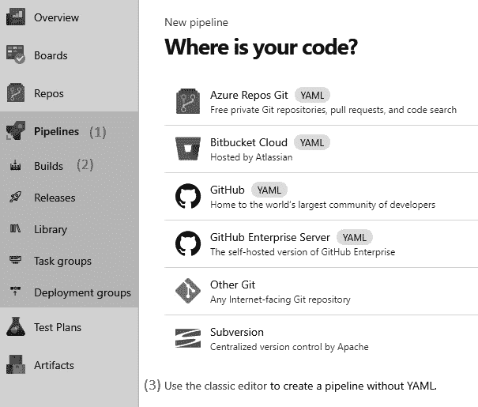

图 5.1 – 用于管道的源代码仓库选项

1.  然后，您将被引导到新的 YAML 体验，但您仍然可以选择通过选择经典编辑器返回。

选择经典编辑器后，您可以配置如何连接到源代码管理。经典编辑器是在以下各节的所有截图中可见的编辑器。

支持多种源代码管理系统。如果您正在使用托管的 Git 仓库，请选择您的具体产品（如果有的话），如果没有可用的产品，则选择**其他 Git**；目前，支持**GitHub**、**GitHub 企业服务器**和**Bitbucket Cloud**。这样做的原因是，使用**其他 Git**进行持续集成是通过轮询模型来工作的，所有具体产品使用它们已知的集成 Webhooks。以下示例适用于位于同一 Azure DevOps 组织中的 Git 仓库。

当您选择**管道**标题时，您可以设置构建定义的名称，并选择作业阶段将默认运行的代理池。代理负责实际执行您的任务，关于代理的更多细节将在本章的*代理与代理队列*部分中介绍。

在**管道**标题下，您可以看到构建定义的时间轴布局。首先是下载源代码。在这里，您可以再次选择连接到源代码管理系统。您还可以指定更多与获取源代码相关的高级设置，如是否先清理构建目录、选择一个分支或添加标签。

## 配置作业

在源节点下，您可以添加一个或多个作业来执行您希望执行的大部分工作。可以通过点击**管道**标题上的省略号来添加作业。这里有两种类型的作业：

+   **无代理作业**：无代理作业可以用于运行不需要代理的任务。这些任务在 Azure DevOps 服务器上运行。

+   **代理作业**：代理作业用于运行需要代理的任务，绝大多数任务都需要代理来运行。

一些无代理任务的示例如下：

+   等待手动批准后继续

+   在继续之前插入延迟

+   调用 REST API

+   调用 Azure 函数

无代理作业的主要优点是它在运行时不会占用代理。这使得代理可以做其他工作，意味着您需要更少的代理，从而节省成本。此外，您可以并行使用的代理数量受限于您在 Azure DevOps 中购买的并行管道数量。限制代理作业的数量也可以在这里节省费用。

让我们来回顾一下配置作业的过程：

1.  选择任何作业。您将看到以下截图中显示的视图。在此视图中，您可以更改作业的名称，对于代理作业，可以覆盖执行此作业的代理池：

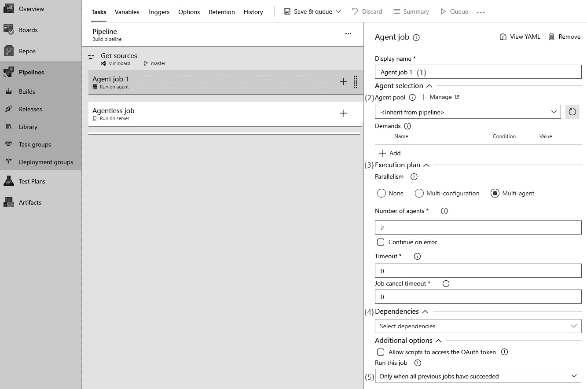

图 5.2 – 为管道添加/更新作业

1.  接下来，指定用于执行作业的代理池。在这里，还指定了您对执行此作业的代理的需求。需求将在本章的*代理和代理队列*部分中讨论。

1.  作为代理执行计划的一部分，您可以指定**并行性**并选择以下三种选项之一：

    +   **无**：这将仅在同一代理上依次执行您添加到代理作业中的所有任务。

    +   **多配置**：在这里，您可以指定一系列变量，这些变量决定要运行的构建的变体数量。如果您想从同一代码创建例如 x86 和 x64 构建，这会非常有用。

    +   **多代理**：在这里，您可以指定将并行运行相同任务的代理数量。

1.  接下来，您可以指定一个或多个依赖项。这些是需要在所选作业运行之前完成的其他作业。

1.  此外，对于任何作业，您可以通过告诉它继续或停止，来指定如何处理前一个作业中的错误。

作为*步骤 3*和*步骤 4*的替代方法，您还可以指定一个自定义表达式来确定是否应执行某个作业。此表达式应评估为布尔值，并支持基本操作，如`or()`、`and()`或`eq()`。以下是一个示例条件：

```
and(succeeded(), ne(variables['Build.SourceBranch'], 'refs/heads/main'))
```

此条件指定，只有当所有前置作业成功并且构建未从主分支启动时，作业才会运行。本章末尾附有条件语法的详细描述链接。

无代理作业比代理作业可用的选项更少。例如，无法为多个变量值并行执行相同的构建。

## 向作业添加任务

添加一个或多个作业后，您可以向作业添加任务。任务定义了在构建执行过程中需要完成的实际工作。以下截图展示了如何添加任务并进行配置：

1.  单击您想要添加任务的作业旁边的加号：

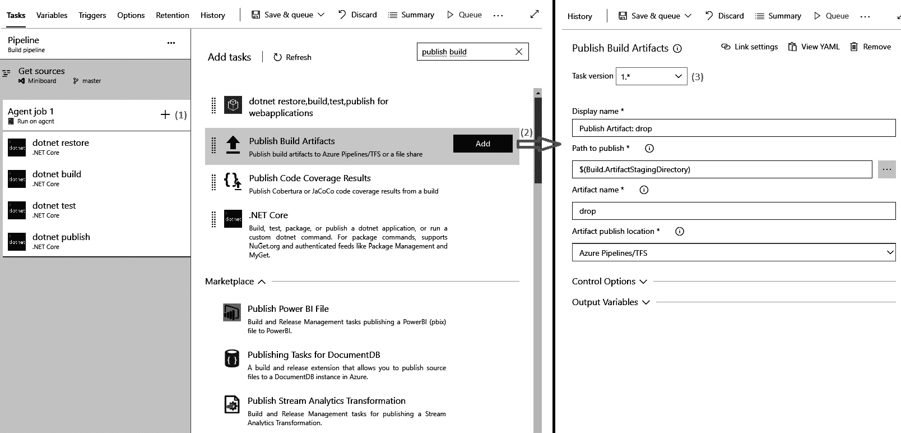

图 5.3 – 选择任务并指定作业的配置参数

1.  然后，您将看到一个任务选择器，您可以在其中找到与您的搜索输入匹配的任何任务，并通过点击**添加**按钮添加一个或多个任务。接着会打开一个新屏幕，您可以在其中配置单个任务。此处提供的选项对于每个任务有所不同。

1.  一个任务可能有多个版本，您可以在其主要版本之间切换。这意味着维护者可以推送不破坏兼容性的更新，您会自动接收这些更新。重大或破坏性更新可以通过新的主要版本号推送，您可以根据自己的需要进行升级。

可以根据需要向管道作业中添加任意数量的任务。

## 发布构建工件

构建定义的重要部分是其输出。构建通常用于生成一个或多个工件，这些工件稍后会用于应用程序的部署。工件的示例包括可执行文件或安装程序文件。这些文件需要在构建管道执行完成后提供以供使用。

前面截图中显示的**发布构建工件**任务是专门设计用于此目的的任务。它允许您选择一个文件或目录，并以**工件名称**发布它。这样，选定路径中的文件会在每次管道执行时保留，以便稍后手动下载或在发布定义中使用。发布定义将在*第六章*中讨论，*实现持续部署和发布管理*。

接下来，我们将学习如何将我们的管道与其他工具集成，并配置我们的服务连接。

### 调用其他工具

在构建管道时，我们通常需要将其与其他工具集成。对于源代码控制系统，这是创建管道时的一个环节，您仅限于使用内置选项。对于任务，您可以使用服务连接创建对任何工具或位置的引用。以下部分展示了一个使用指向 Azure 应用服务的服务连接的任务示例。

服务连接是指向外部系统的指针，具有名称和一系列属性，针对每种类型的服务连接有所不同。通常，您需要提供一个 URL 来定位其他服务，并提供一个认证机制。以下步骤将帮助您配置您的服务连接：

1.  在定义一个或多个服务连接后，您可以从下拉菜单中选择要使用的服务连接：

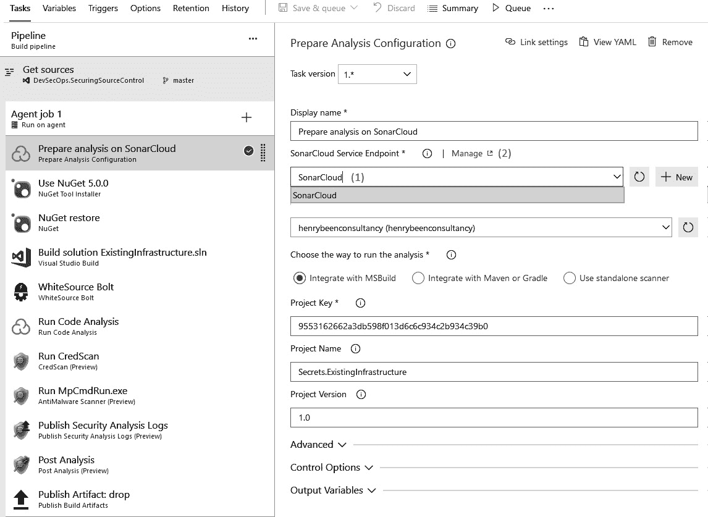

图 5.4 – 在任务中使用服务连接

1.  服务连接在一个中央位置作为项目设置进行管理。你可以通过从当前配置的任务中直接访问管理视图来访问它们，如前面的截图所示。你也可以通过导航到**项目设置**，然后转到**服务连接**来访问，如下图所示（参见**2**）：

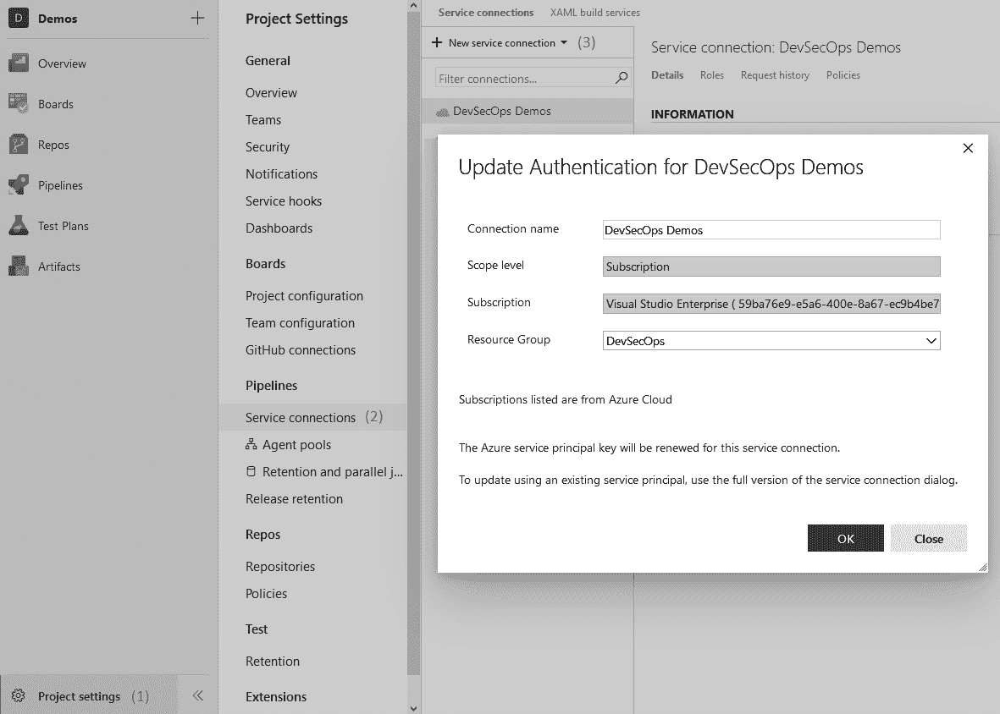

图 5.5 – 服务连接对话框

1.  在此视图中，你可以选择添加一个新的服务连接或更新现有的服务连接（参见前面截图中的**2**和**3**）。

默认情况下，服务连接的作用域是项目级别，这意味着它们并非对所有 Azure DevOps 组织中的人都可用。为了鼓励服务连接的重用，Azure 自 2019 年中期以来已经实现了在项目之间共享服务连接的功能。

### 任务市场

Azure Pipelines 内置了一组常用的任务；然而，使用 Azure DevOps 的 Visual Studio 市场，你还可以找到更多的任务。如果你是 DevOps 组织的管理员，你可以在此找到并安装添加任务的扩展。如果你是普通用户，你也可以在此找到任务；但是，你无法安装它们，只能请求它们。你的 Azure DevOps 管理员会收到通知，并在他们批准后代表你安装扩展。

当然，你也可以编写并分发带有你自己任务的扩展。

## 创建变量和变量组

在配置构建时，可能会有一些值需要多次使用。通常，提取这些值为变量，而不是在任务中重复使用它们，是明智的做法。

变量可用于记录那些你不希望存储在源代码控制中的值。例如，密码和许可证密钥可以安全地作为不可检索的值存储，当它们被锁定（参见下图中的**1**）时。保存构建定义后，这些值将被加密，并且只能被属于它们的构建使用。

要学习如何在 Azure Pipelines 中使用变量，请按照以下步骤操作：

1.  在 Azure Pipelines 中，你可以通过转到**变量** | **管道变量**选项卡（参见下图中的**3**）来将变量添加到你的构建定义中。在这里，你可以输入变量的名称和值，如下图所示：

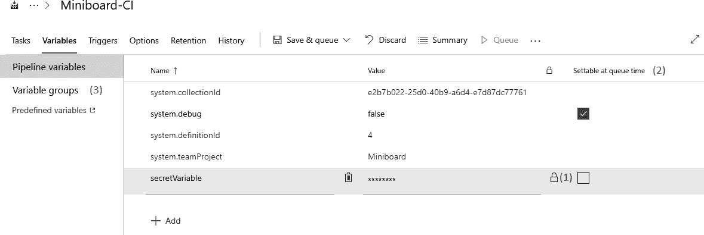

图 5.6 – 管道变量

1.  一旦定义，你就可以在同一构建的所有任务配置中使用这些变量。为此，你可以使用以下表示法：

    ```
    $(variableName)
    ```

1.  最后，你可以将变量标记为`system.debug`内置变量。当此变量设置为`true`时，构建中将包含详细的调试日志。

除了你自己的变量外，系统变量也会被定义。这些是包含当前正在运行的构建的相关信息的变量，包括版本号、代理名称、构建定义详情和源版本。系统定义变量的完整列表链接将会在本章末尾提供。

### 变量组

除了为特定构建创建变量外，你还可以创建变量组。这些变量组可以与一个或多个构建关联。这是一种有效的在构建之间共享变量的方式；一些例子可能包括你的公司名称、商标文本和产品名称。我们来看看如何使用变量组：

1.  通过点击**库**（**Library**）在**管道**（**Pipelines**）菜单中，你可以通过菜单访问变量组（参见下图中的**1**）。这将显示你可以编辑的现有变量组列表，同时你也可以在这里添加一个新的变量组，如下图所示：

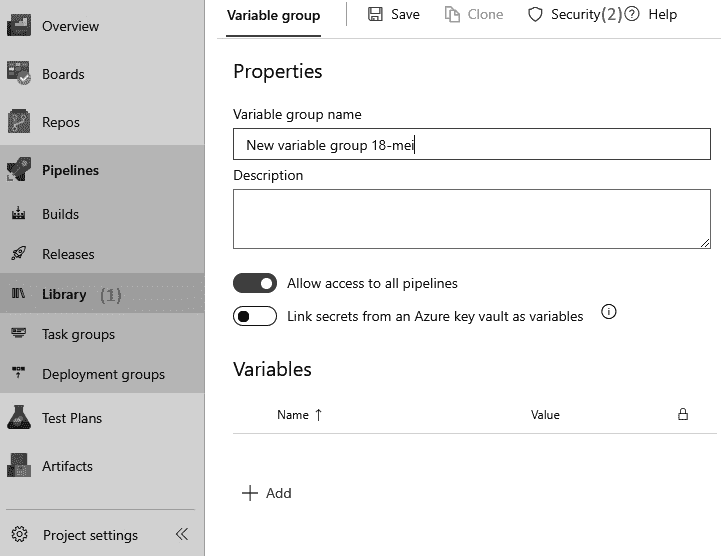

图 5.7 – 新的变量组

1.  在这里，你可以像使用构建自带的变量一样使用变量。唯一的区别在于以下列表中突出显示的内容：

    +   你不能将变量标记为在队列时可设置。

    +   你可以允许或拒绝在所有管道中使用该组。如果你拒绝在所有管道中使用它，那么只有你可以使用该变量组。你可以通过**安全性**（**Security**）选项授权其他用户或组（参见前述截图中的**2**）。

    +   你可以引用一个 Azure 密钥保管库，该变量组将作为一个占位符。在登录到 Azure 后，你可以选择一个密钥保管库，并指定希望通过变量组访问的存储在密钥保管库中的值。

**Azure 密钥保管库**（**Azure Key Vault**）是 Azure 提供的一项服务，可用于安全存储密钥。密钥保管库中的机密会自动进行版本控制，因此旧的值不会被覆盖，而是被新版本替代。此外，你可以指定分隔的访问策略，按用户指定他们是否可以读取、写入、更新或删除值。所有这些操作都会在密钥保管库中进行审计，因此你也可以追溯到谁进行了哪些更改。如果你将 Azure DevOps 与密钥保管库链接，则将在你的活动目录中创建一个具有该密钥保管库访问权限的新服务主体。现在，每当 Azure DevOps 需要从变量组中提取变量时，实际的值将从密钥保管库中提取。

变量组可以通过**变量组**标签与构建的变量关联（参见*图 5.7*中的截图）。

除了与变量组一起工作外，你还可以与库中的文件一起工作。你可以上传其他用户无法访问的文件，但这些文件可以在构建中使用。这对于包含私钥、许可证密钥和其他机密的文件很有用。欲了解更多信息，请参阅此链接：[`docs.microsoft.com/en-us/azure/devops/pipelines/library/secure-files?view=azure-devops`](https://docs.microsoft.com/en-us/azure/devops/pipelines/library/secure-files?view=azure-devops)。

与变量组一样，你可以指定每个安全文件是否可以被任何构建使用，或仅授权特定用户使用。

### 触发构建

构建定义中的下一个标签控制着应该启动或触发构建的内容。要实现持续集成，请按照以下步骤操作：

1.  点击**触发器**标签页，选择左侧的第一个标题：

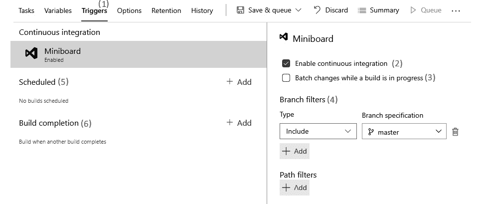

图 5.8 – 为管道定义触发器

1.  勾选**启用持续集成**框。这意味着 Azure DevOps 将监视你仓库中的变化，并在有新的变更时立即排队新的构建。

1.  接下来，你可以选择是希望单独构建每个传入的更改，还是在构建某个更改时将多个更改批量处理。如果可行，建议每次都单独构建每个更改。

1.  除了持续集成触发器外，还需要指定一个或多个分支和路径过滤器。在这里，你可以指定哪些分支和文件需要排队新构建。你可以根据需要指定包括或排除某些内容。一个常见的例子是将构建限制在主分支。如果你的仓库中有名为`doc`和`src`的文件夹，且所有源代码都在后者文件夹中，那么限制触发器仅适用于该路径可能更为合适。

1.  除了选择持续集成触发器外，你还可以选择按计划定期执行构建，选择一个或多个工作日和时间。

1.  你还可以安排在另一个构建完成时启动构建。这被称为**链式构建**。

接下来，让我们学习如何更改构建定义的配置。

### 构建选项

你可以更改构建定义的高级配置选项。这些选项包括描述、构建编号的格式，以及在失败或超时时自动创建工作项。要进行设置，请按照以下步骤操作：

1.  点击**选项**标签页。你应该会看到以下界面：

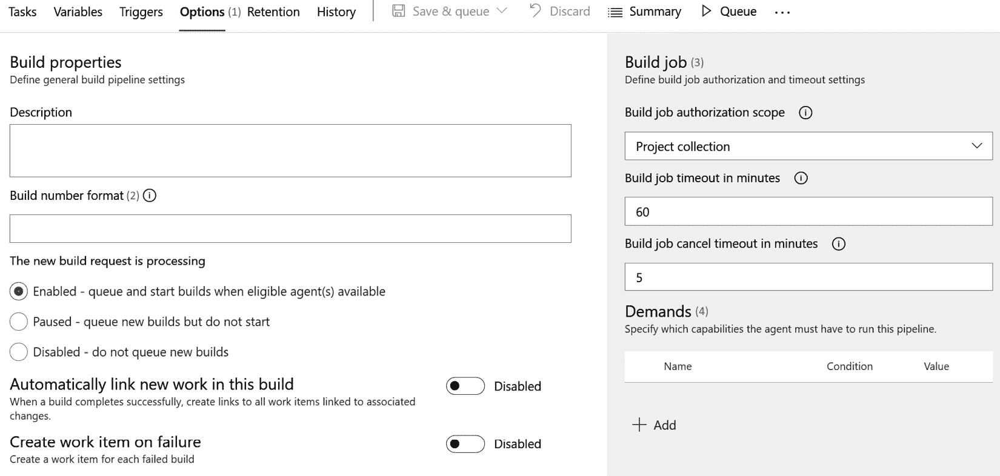

图 5.9 – 构建选项

1.  现在，创建您的构建号格式。如果该字段为空，则您的应用程序的构建号将设为一个不断增加的数字，每次构建都会增加 1。该数字在团队项目中是唯一的，并且跨所有构建定义进行计数。您也可以使用可用的变量来指定您自己的格式。一种常见的方法是手动指定一个主版本号和次版本号，然后使用变量添加一个递增的数字。以下示例指定了版本号为 4.1.xx，其中最后部分会被一个两位数递增的数字替代：

    ```
    4.1($Rev:.rr)
    ```

1.  右侧有一些高级（但很少使用）选项，用于指定**构建作业**超时的授权范围，适用于构建定义中的每个作业。

1.  还可以指定代理需求，要求每个代理在构建定义中的每个作业中都必须满足这些需求。我们将在本章的*代理与代理队列*部分进一步探讨需求。

左侧的其他选项允许您暂时暂停管道。

### 构建历史

最后一页标签，称为**历史记录**，显示了构建定义中每一次更改的列表。构建定义以 JSON 格式存储，您可以查看每次更改的并排对比。您在保存构建时所输入的评论也会存储在这里，并可以用来提供更改的理由。您还可以恢复到管道的旧版本。

由于构建是保持质量的重要手段，因此跟踪是谁更改了它们非常重要，以确保自动化质量度量不会被删除。

完成这些操作后，您现在可以运行您的第一个构建。您可以直接使用在本节大多数截图中可见的**保存并排队**按钮来运行它。本章的*运行构建*部分将教您如何处理您获得的结果。

### 任务组

在一个拥有多个管道的团队或组织中，往往不会过多久就会出现多个形态相同的管道。例如，在一些公司中，所有管道都包含安全扫描、运行测试和计算测试覆盖率的任务。

与其在各处重复这些任务，不如将它们从现有的管道中提取到一个任务组中。任务组可以像任务一样在多个管道中使用。这样做可以减少创建新管道或更新所有管道时的工作量。同时，这也确保了所有使用任务组的管道具有相同的任务配置。

要创建一个新的任务组，请打开任何现有的构建定义并按照以下步骤操作：

1.  按住 *Ctrl* 键并单击一个或多个任务，或者使用鼠标悬停在任务上时出现的选择器来选择任务：

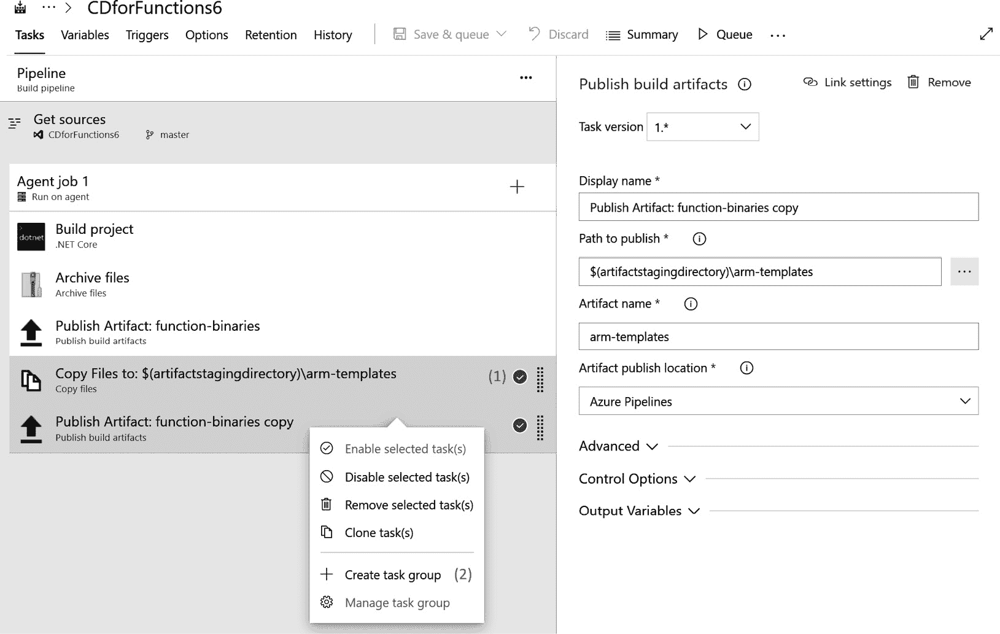

图 5.10 – 创建任务组

1.  右键点击选项并选择**创建任务组**。

1.  在现在出现的弹窗中（截图未显示），为任务组选择一个名称、描述和类别。如果选定的任务中有指定变量值的任务，你现在可以为这些参数提供默认值和描述。这些参数将在任务组中使用，并且在使用任务组时需要进行配置。

1.  在点击**创建**后（截图未显示），现有的构建定义将通过移除选定的任务并用新的任务组替换它们来进行更新。

将已有任务组添加到构建或发布定义中的方式与添加常规任务完全相同。任务组会出现在同一任务选择列表中。

所有现有任务组的列表可以通过导航到**管道**菜单，然后选择**任务组**找到。要编辑现有的任务组，在显示的列表中选择它，然后选择**编辑**选项。编辑任务组的方式与编辑构建定义完全相同。

本节主要讲解了如何创建构建定义以及如何描述应用程序的构建方式。下一节将介绍如何执行构建。

# 运行构建

在本节中，您将学习如何处理构建结果，并利用它们报告和生成构建。您还将学习如何在每次拉取请求时运行构建，并将更改的质量报告回该拉取请求，以帮助审阅者。

## 查看构建结果

在构建运行时，代理将执行所有配置的步骤。Azure Pipelines 会捕获所有这些步骤的详细信息和日志。如以下截图所示，构建会在左侧显示它已执行的所有步骤列表。点击任何一个步骤将打开详细视图，显示该步骤的日志：

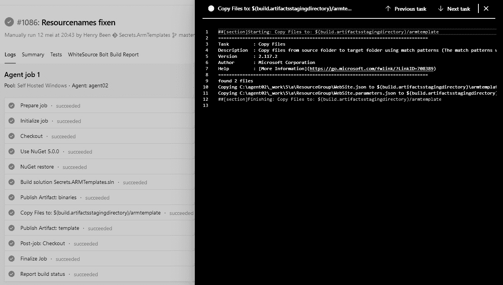

图 5.11 – 构建结果

每当构建过程中出现警告或错误时，它们会分别以橙色或红色显示。

## 构建拉取请求

设置好构建定义并运行第一次构建后，您可能还会看到第一次失败——例如，当有人不小心提交并推送了无法编译的更改或包含无法成功运行的单元测试时。您可以通过设置使构建定义在每次拉取请求到来时自动运行来防止这种情况。要配置此功能，请按照以下步骤操作：

1.  在**项目设置**下点击**策略**，将打开以下界面。点击**添加构建策略**：

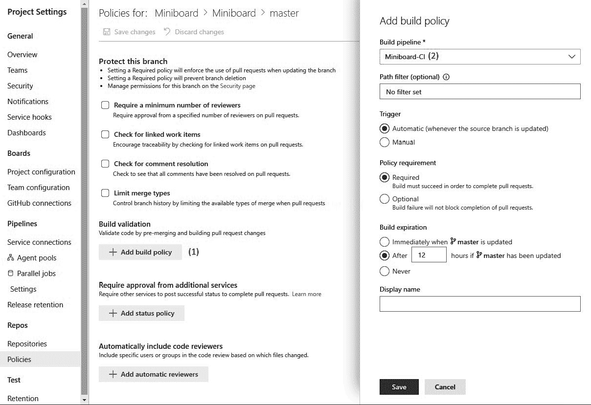

图 5.12 – 添加构建策略

1.  选择一个构建定义，用于验证拉取请求。

1.  接下来，您可以配置以下三项内容：

    +   **触发器**：构建定义应该何时开始执行，可以是自动执行或手动执行。当然，真正的价值来自于自动运行验证构建。

    +   **策略要求**：这决定了当构建失败时，是否可以完成拉取请求。换句话说，这决定了你是否可以忽略失败的构建。建议如果可能，避免将此设置为**可选**。

    +   **构建过期时间**：这决定了一个成功的构建结果有效的时间长度。默认值是**12**小时，但你应该考虑将其更改为**当主分支更新时立即过期**。这样做的好处是，必须先执行构建，以检查你将要合并的分支的当前状态和拟议更改的组合，才能进行合并。

你可以添加多个构建策略。如果你有很多可以自动验证的内容，并希望将自动验证的时间保持在最小值，那么这是一个很好的方法。

## 访问构建工件

除了编译、测试和验证源代码外，构建还可以用于生成所谓的**工件**。工件是构建的输出，可以是任何你想要从构建中保存并发布的内容，比如测试结果和应用程序包。

应用程序包旨在成为你应用程序版本的不可变构建。这个包稍后可以在发布中使用，并部署到一个或多个环境中：

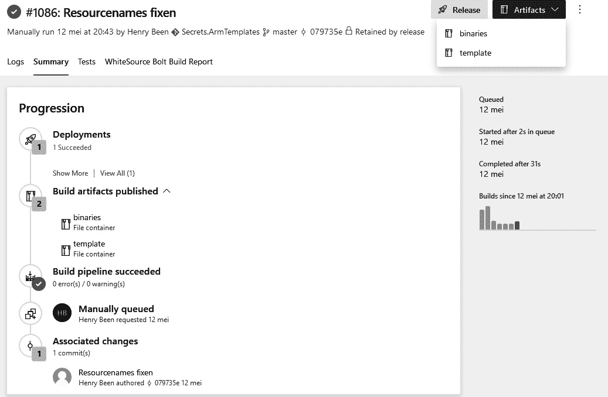

图 5.13 – 查看应用程序包

在前面的截图中，你可以看到，作为已执行构建的总结的一部分，有两个工件被发布。你可以通过屏幕右上角的**工件**下拉菜单或**摘要**标签访问这些工件。你可以从此页面下载并查看工件，在下一章中，你将看到如何使用它们来设置持续交付。

很棒！通过这一步，你已经学会了如何使用可视化设计器创建定义。但等等——正如我们之前提到的，还有另一种方法可以做到这一点，那就是使用 YAML 文件。让我们在下一节看看它是如何工作的。

# 使用 YAML 管道

你已经看到如何使用可视化设计器创建构建定义。自 2019 年初以来，一种新的替代方法是使用 YAML 管道。在使用 YAML 管道时，你需要在 YAML 文件中指定完整的构建定义，并将其存储在源代码管理中，通常与构建所针对的源代码一起存储。

虽然两种管道系统并存，但现在定义管道的首选方法是使用 YAML 管道。这意味着新的功能很可能只会出现在 YAML 管道中。

## 使用构建定义作为代码的原因

当你第一次开始使用 YAML 构建定义时，你可能会发现学习曲线比使用可视化设计器时更陡峭。这可能会引发一个问题，那就是为什么要使用 YAML 定义的构建。YAML 构建定义相对于可视化设计定义有两个主要优势。

当你在 YAML 中编写定义时，它可以与代码一起托管在源代码控制中。这样做的结果是，所有针对源代码控制的更改策略现在自动应用于你的构建定义。这意味着任何更改都必须经过拉取请求，由同行审核，并且可以提前构建和验证。强制实施**四眼原则**于你的构建定义以及代码，有助于提高构建过程的稳定性。当然，它也有助于提高安全性和合规性，这些主题将在后面的章节中讨论。

除了增强的安全性外，将构建定义放在源代码控制中还意味着它在每个分支中都是可用的。这意味着它可以在每个分支中进行更改，以便在与主分支合并之前构建该特定分支。使用可视化设计的构建定义时，这个单一的定义不仅负责构建你的主分支，还负责构建你想通过拉取请求合并的所有分支。

这意味着你必须执行以下其中一项操作：

+   更新构建定义以适应你将要合并的更改。然而，这将终止当前主分支的构建。

+   合并更改，这也会导致构建失败，因为构建定义尚未更新。

这两种选项都有允许错误更改流入目标分支的风险，这会破坏持续集成构建的目的。通过每个分支都有一个构建定义，我们消除了这个问题。

## 编写一个基本的 YAML 管道

要开始使用 YAML 构建，你需要做两件事：

1.  首先，你需要编写 YAML 文件。

1.  然后，你需要从中创建一个构建定义。

那么，让我们开始吧。

### 编写 YAML 文件

以下代码示例包含一个用于构建 .NET Core 应用程序并运行单元测试的 YAML 定义。将文件以任何名称保存——例如 `pipeline.yaml`——并存储在 Azure DevOps 中的任何 Git 仓库中。然后，可以稍后使用它来创建一个管道：

```
trigger:
- main
pool:
  name: Azure Pipelines 
  vmImage: windows-2019
steps:
-  task: DotNetCoreCLI@2 
   displayName: 'dotnet build' 
   inputs:
       projects: '**/*.csproj'
- task: DotNetCoreCLI@2 
   displayName: 'dotnet test' 
   inputs:
       command: test
       projects: '**/*.csproj'
```

这个 YAML 示例定义了一个基本的管道。每个管道都需要以某种方式触发。就像经典的构建一样，可以通过将管道连接到源代码仓库中的更改来实现。此默认仓库是包含 YAML 定义的仓库。**trigger** 关键字用于指定哪些分支的推送应触发管道。一个好的起点是主分支。由于 trigger 关键字接受列表，可以指定多个分支，并且可以使用通配符。

触发器不是必需的，因为管道也可以手动启动。

提示

还有其他替代触发器关键字的选项，例如在存储库中包含或排除一个或多个分支、标签或路径。这些选项的详细说明可以参见 [`docs.microsoft.com/en-us/azure/devops/pipelines/yaml-schema#triggers`](https://docs.microsoft.com/en-us/azure/devops/pipelines/yaml-schema#triggers)。

每个管道都包含一个或多个任务，和经典构建定义一样，除了触发器外。所有这些任务需要在代理池上执行——同样，和经典构建定义一样。`pool` 关键字用于指定一组键值对，通过指定池的名称来确定任务将在哪个池上运行。使用 Microsoft 提供的默认代理时，可以使用默认名称 `Azure Pipelines`。使用这个特定池时，必须指定**虚拟机**（**VM**）镜像。这决定了将执行任务的代理上可用的操作系统和软件。

提示

可通过 [`docs.microsoft.com/en-us/azure/devops/pipelines/agents/hosted#use-a-microsoft-hosted-agent`](https://docs.microsoft.com/en-us/azure/devops/pipelines/agents/hosted#use-a-microsoft-hosted-agent) 查找到所有可用的 VM 镜像的最新列表。

最后，定义包含构成管道本身的步骤列表。这些步骤与您可以拖入经典构建管道中的任务一一对应。添加任务时，指定任务的名称和版本——由 `@` 符号分隔——然后您可以选择性地为任务指定显示名称。此显示名称稍后将在显示已执行管道结果的视图中可见。最后，为任务指定一个或多个输入。这些输入与您在可视设计器中已经看到的任务特定配置有关。

### 创建 YAML 管道

在将 YAML 文件保存在存储库中之后，您可以从中创建构建定义。创建新构建定义时（请参阅本章的*创建构建定义*部分），您应当按照以下步骤进行操作：

1.  当向导启动时，选择**Azure Repos Git YAML**选项。

1.  从这里，按照向导的步骤选择并查看您希望构建的 YAML，如下图所示：

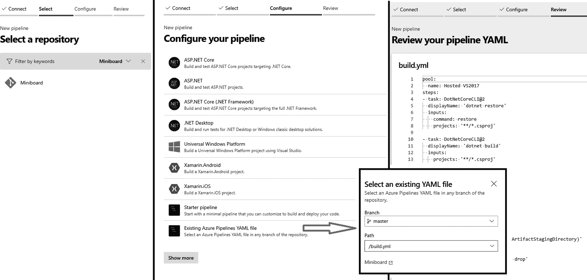

图 5.14 – 用于存储库的 YAML 管道

1.  然后，找到包含您要用作管道的 YAML 文件的存储库。

1.  接下来，通过选择一个示例 YAML 文件作为起点或引用已有的文件来配置管道。

1.  最后，您可以查看所选的 YAML 文件并从中启动构建。

你的管道会自动保存。管道保存后，可以启动，并且你可以像操作经典构建管道一样与它交互。

## 多作业管道

你在前一节中看到的管道没有指定任何作业，正如你可能记得的经典构建部分。相反，它包含了一个 `steps` 关键字下的任务列表。这意味着它隐式地只包含一个作业。在 YAML 管道中，也可以创建包含多个作业的定义。为此，可以使用以下结构：

```
trigger:
- main
pool:
    name: Azure Pipelines 
    vmImage: windows-2019
jobs:
- job: job1
  displayName: A pretty name for job1 
  steps:
  - task: DotNetCoreCLI@2
     ...
- job: job2
  displayName: My second job 
  pool:
      name: Azure Pipelines 
      vmImage: ubuntu-18.04
      ...
```

不直接将 `steps` 关键字添加到管道中，而是先创建一个作业列表。在该列表中，添加一个或多个 `job` 关键字，后跟该作业的名称。在该技术名称旁，还可以为每个作业指定一个显示名称 (`displayName`)。

如前例中的第二个作业所示，也可以为每个作业指定使用的代理池。当没有为作业指定代理池时，将使用文件顶部指定的默认池。

提示

本节讨论的作业称为代理作业。除了代理作业，还有服务器作业、容器作业和部署作业。有关这些类型作业的更多信息，请访问 [`docs.microsoft.com/en-us/azure/devops/pipelines/process/phases#types-of-jobs`](https://docs.microsoft.com/en-us/azure/devops/pipelines/process/phases#types-of-jobs)。

默认情况下，管道中的所有作业都是并行运行的，但有可用的控制选项可以更改这一点。

### 控制选项

要控制作业的顺序，可以在作业的定义中使用 `dependsOn` 关键字。这表明该作业只能在一个或多个作业完成后开始。除此之外，`condition` 关键字可以用于指定作业运行的条件。可以结合这两个关键字来实现更复杂的场景，如下所示：

```
jobs:
- job: compile 
  steps:
  ...
- job: test 
  dependsOn: compile 
  steps:
  ...
- job: build_schema 
  dependsOn: compile 
  steps:
  ..
- job: report 
  dependsOn:
  - test
  - build_schema
  condition: or(succeeded('test'), succeeded('build_schema')) 
  steps:
  ..
```

该管道将通过运行名为 `compile` 的作业开始。一旦该作业完成，接下来的两个作业 `test` 和 `build_schema` 将并行运行，因为它们都依赖于 `compile` 任务。在这两个任务都完成后，`report` 任务将运行，因为它声明依赖于 `test` 和 `build_schema` 作业。在该作业实际开始之前，会评估条件，以确定该作业是否应该运行或被跳过。

条件可以使用类似于许多编程语言的语法来构建。它通过 `succeeded()` 和 `failed()` 函数检查作业是否成功完成。同时还支持布尔运算符，如 `or()`、`and()` 和 `ne()`。

你可以根据需要以任何方式结合 `dependsOn` 和 `condition` 关键字。唯一的要求是，至少应有一个作业不依赖于任何其他作业。

## 变量

与经典构建管道一样，YAML 管道支持使用变量。变量可以在 YAML 管道的每一层级（任务内部除外）使用以下语法进行定义：

```
variables: 
  name: value
  anotherName: otherValue
```

以后可以使用你从经典构建管道中熟悉的语法来检索变量——`$(name)`和`$(anotherName)`。

也可以在 YAML 管道中引用现有的变量组。这是通过使用`group`关键字来完成的，而不是指定变量的名称。若要从名为`myVariableGroup`的变量组中检索所有变量，可以按照以下方式扩展前面的 YAML：

```
variables: 
  name: value
  anotherName: otherValue 
  group: myVariableGroup
```

可以在 YAML 管道的每一层级中设置变量，但只有在根级别设置的变量才能在手动排队新执行时被覆盖。你可以在这里了解更多：[`docs.microsoft.com/en-us/azure/devops/pipelines/process/variables`](https://docs.microsoft.com/en-us/azure/devops/pipelines/process/variables)。

## 管道工件

与经典构建一样，YAML 管道可以用于构建和发布工件。由于用于此目的的任务与其他任务一样，它可以直接添加到作业中的步骤列表中。

然而，随着 YAML 管道的引入，一种新的工件类型——所谓的管道工件——已经可用。这种工件带来了提高大规模工件上传和下载速度的优势。当使用经典发布时，管道工件不会自动下载，而构建工件则会。

要发布管道工件，可以在作业的`steps`关键字中使用以下 YAML：

```
steps:
- publish: folder/to/publish 
  artifact: artifactName
```

管道工件主要用于在多阶段 YAML 管道中下载，相关内容将在下一章中介绍。

## 写 YAML 管道的技巧

从头开始编写 YAML 管道可能会比较复杂，尤其是对于刚入门的人。有两个工具可以帮助你。

首先，有一个选项可以从可视化设计器导出 YAML。对于每个任务，都会有一个**查看 YAML**的链接。点击该链接会打开一个小弹出框，显示当前打开的任务和配置对应的 YAML。对于作业也可以执行相同操作，并且在特定条件下，可以对完整的构建定义进行相同操作。

写 YAML 的另一个工具是内置的 YAML 编辑器：

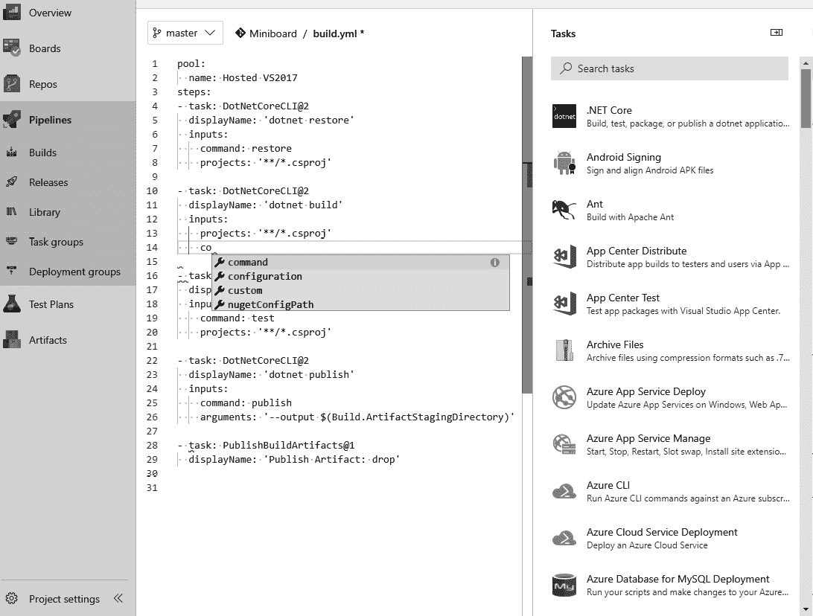

图 5.15 – YAML 编辑器

每次打开 YAML 构建定义时，有两个工具可供你帮助。首先，在 YAML 文件的每个位置都有自动完成功能。它会显示该位置可用的选项。此外，右侧的任务选择器中也有代码片段。当选择右侧的任何任务时，你可以通过可视化界面配置它们，然后点击**添加**按钮将生成的 YAML 添加到定义中。

这两种工具旨在将可视化设计器的便捷性引入到 YAML 构建体验中，结合了两者的优点。

请参考这些文档，获取完整的 YAML 模式参考：[`docs.microsoft.com/en-us/azure/devops/pipelines/yaml-schema/?view=azure-pipelines`](https://docs.microsoft.com/en-us/azure/devops/pipelines/yaml-schema/?view=azure-pipelines)。

# 代理和代理队列

到目前为止，你创建的构建定义可以包含代理作业，而代理作业又包含任务。这些任务不会直接在你的 Azure DevOps 组织中执行，而是由在虚拟机或容器中运行的代理来执行。代理又被分组到代理池中。你可以使用两种类型的代理池：

+   内建代理池

+   自托管代理池

让我们一一来了解它们。

## 内建代理池

内建代理池由微软管理，并作为 Azure DevOps 产品的一部分提供给你。根据你的需求，提供了不同的代理池。池运行不同版本的 Windows 和 Visual Studio，还有运行 Linux（Ubuntu）和 macOS 的池。

这些托管池的缺点是，如果你需要的话，你不能在托管代理的机器或容器上安装额外的软件。这意味着，在这种情况下，你必须创建自己的私有代理池。

## 创建私有代理池

私有池在你的 Azure DevOps 组织中定义，并从那里提供到一个或多个团队项目。不过，如果在一次操作中创建并配置这些池，你也可以在团队项目级别创建私有池。为此，请进入**项目设置** | **代理池**。你应该会看到以下**添加代理池**选项：

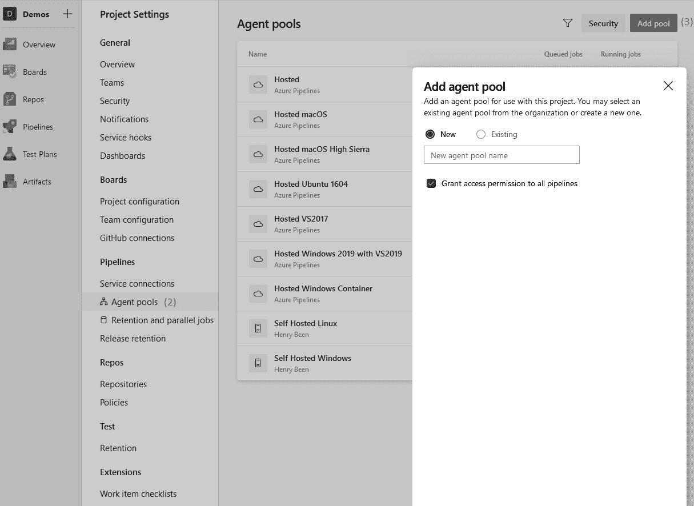

图 5.16 – 代理池设置

在为池命名并确定是否希望自动为所有管道提供访问权限后，你可以保存该池。创建池之后，你可以添加或移除代理。

### 添加和移除代理

添加代理分为两个步骤：

1.  下载并提取代理运行时。你可以通过进入包含代理池概览的部分并打开任何私有代理池的详细信息来找到代理运行时。打开池的详细信息后，点击右上角的**新建代理**：

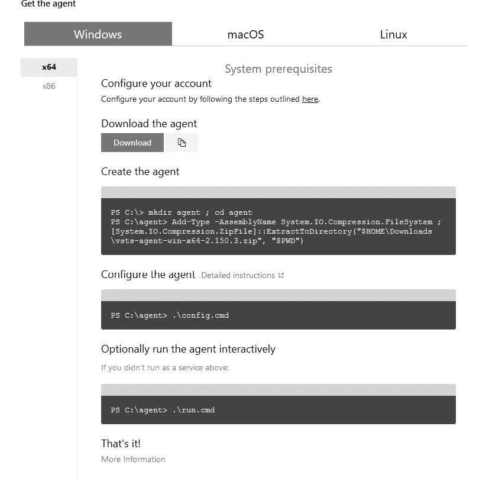

图 5.17 – 添加新代理

1.  在弹出的对话框中，你可以下载一个包含代理程序和提取及安装代理程序的说明的 ZIP 文件。

重要提示

在配置阶段，你将被提示使用你的 Azure DevOps 组织进行身份验证，并提供你希望安装代理的代理池的名称。虽然有 x86 和 x64 版本的代理可供选择，但建议你使用 x64 代理，除非有特殊原因不这么做。

要从代理池中移除代理，可以使用以下两种方法之一：

+   你可以像安装时那样返回到 PowerShell 命令行，并使用以下命令：

    ```
    .\remove.cmd
    ```

+   另外，你也可以通过**代理**标签从代理池概览中移除代理。前往**项目设置** | **代理池**（见下方截图中的**1**） | **代理**（见下方截图中的**2**），然后选择你想要移除的代理旁边的选项按钮（见下方截图中的**3**）。接着，点击**删除**（见下方截图中的**4**）：

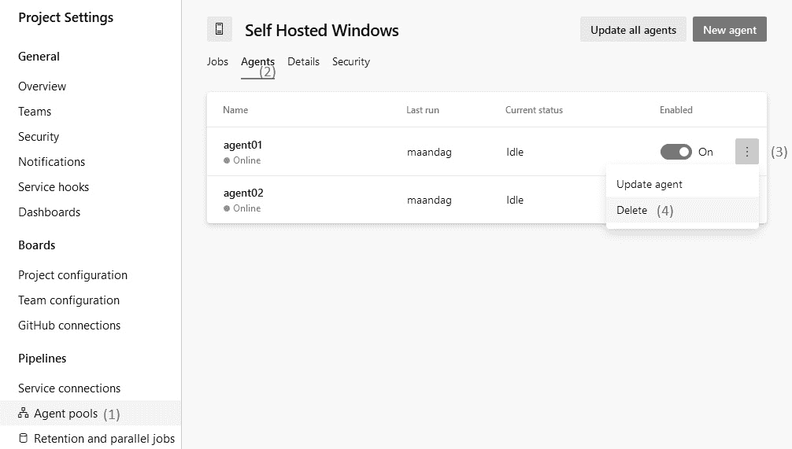

图 5.18 – 删除代理

在前面的截图中，你可以看到使用界面移除代理的步骤。请注意，这不会清理主机上的二进制文件和任何文件；然而，如果承载代理的机器故障或虚拟机被移除，这将是唯一可以移除代理的方法。

## 代理选择

每当构建任务开始运行时，都会从池中选择一个代理来执行你在管道中定义的任务。代理的选择分为两个步骤：

1.  只有属于选定代理池的代理才有资格执行任务。这意味着，在使用私有代理池时，最好在池中拥有多个代理。如果你将某个代理下线进行维护，那么依赖该代理池的代理任务可以继续运行。

1.  在代理任务运行之前，来自每个任务及其包含的任务的需求会被收集。如你在*变量组*部分中学到的那样，代理任务可以指定它对所使用的代理的需求。任务也是如此——它们也可以指定需求。要运行一个任务，只有满足所有这些需求的代理才会被使用。需求和能力是键/值对，其中值为整数。有关需求的示例，请参考以下文档：[`docs.microsoft.com/en-us/azure/devops/pipelines/process/demands`](https://docs.microsoft.com/en-us/azure/devops/pipelines/process/demands)。

当没有符合条件的代理可用于构建定义时，构建会在超时后最终失败。

## 查找代理能力

要查找各个代理上可用的能力，请按照以下步骤操作：

1.  导航到**组织设置** | **代理池**：

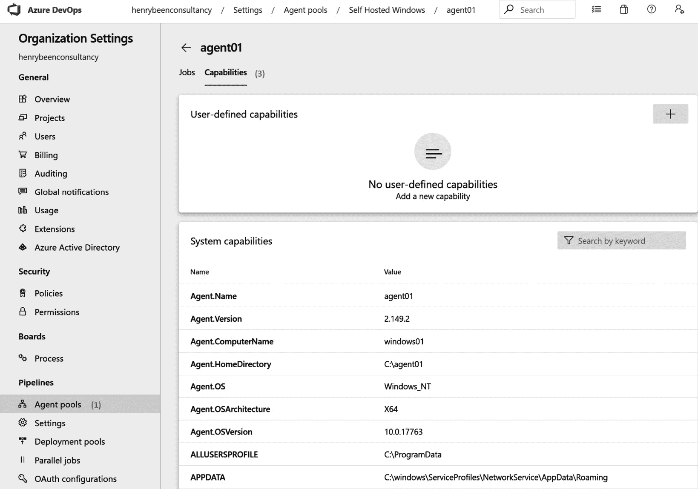

图 5.19 – 查看代理设置

1.  导航到正确的代理池（托管或私有），然后选择**代理**，接着打开代理详细信息（在前面的截图中未显示）。

1.  打开**能力**标签。

在这里，你可以使用顶部的块来为代理指定一个或多个自定义能力，称为**用户定义的能力**。对于自托管（私有）代理，安装代理时在机器上发现的所有能力也会显示出来。

## 自托管代理池的好处

使用微软（云）托管代理是一种相当常见的做法，可以节省大量时间来管理和配置构建基础设施。自托管代理在许多场合已被证明非常有益。由于有大量优秀的文档，管理员已能轻松地为其管道配置和设置自托管代理。

使用自托管代理的主要好处如下：

+   优化构建代理的成本。

+   根据需要安装特定构建任务所需的附加软件。

+   通过缓存资源并启用增量构建来提高构建性能，使其运行更快。

+   构建问题的调试和故障排除变得更容易。

+   支持 **虚拟网络**（**Vnet**）集成，您可以在防火墙后安全地运行构建。

+   使用白名单 IP 地址安全地访问其他企业资源。

在下一节中，我们将探讨如何自动化托管在 GitHub 上的仓库的 CI 构建。

# 使用 GitHub Actions 自动化 CI 构建

如果您使用的是 GitHub 仓库，您还可以通过 GitHub Actions（作为仓库顶部导航菜单中的一个标签）自动化 CI 构建。您可以从现有的模板工作流中选择（提供超过 50 个工作流）或创建自己的自定义工作流：

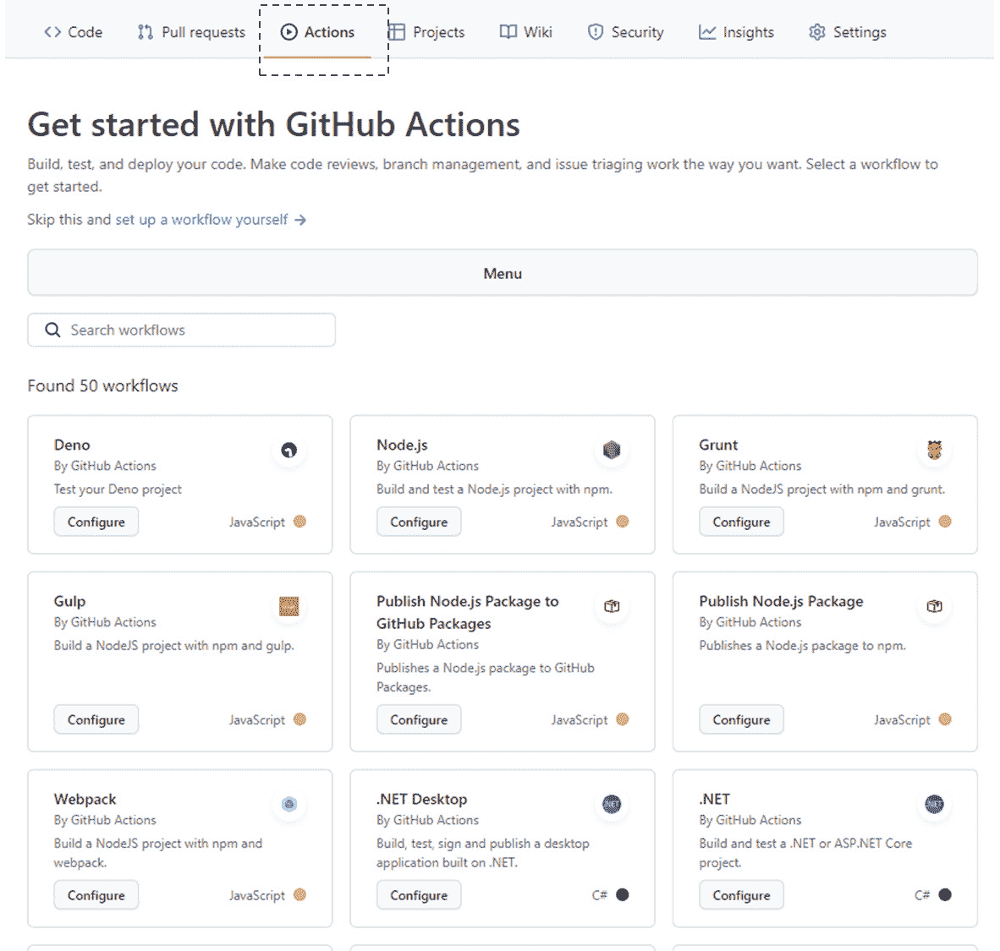

图 5.20 – GitHub Actions 中的可用选项

编写工作流的体验类似于创建一个 YAML 文件并将其保存在您的 GitHub 仓库中：

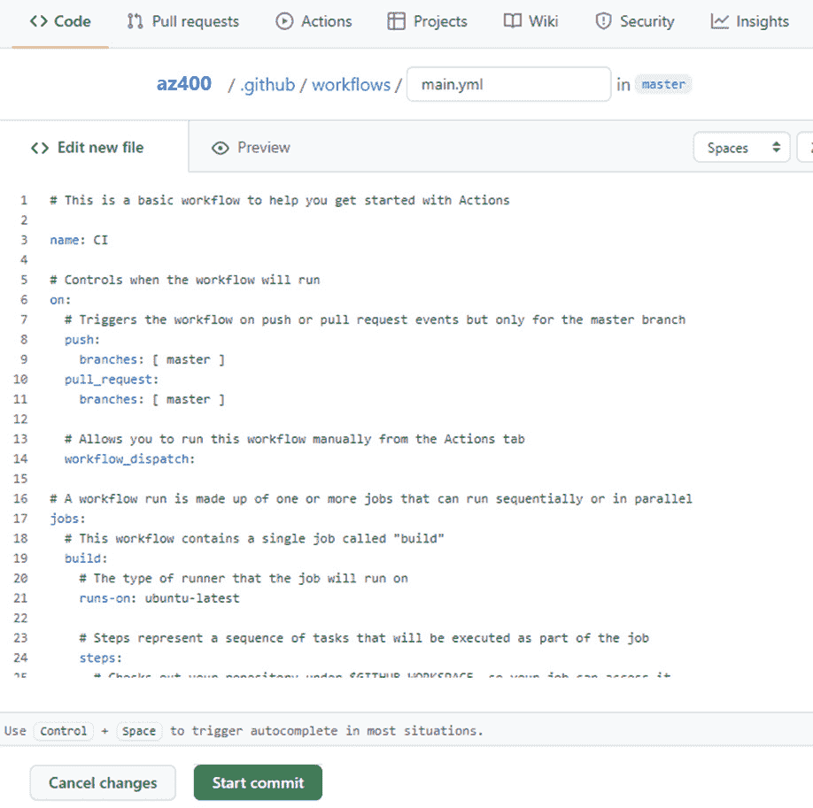

图 5.21 – 在 GitHub 仓库中编辑 YAML 文件

在接下来的章节中，我们将介绍可用于管理 CI 流程的其他工具。

# 其他工具

除了 Azure DevOps 外，还有许多其他工具可供选择。两个其他知名工具是 GitLab CI 和 Jenkins。了解这些工具的一些基础知识有助于您理解如何与它们集成，万一需要时也能更好地应对。此外，对其他工具的有限了解将帮助您快速理解概念，并推广您如何与这些工具协作的知识。

为了突出这些工具如何在相同的概念下工作，本节中的两个示例与 *编写 YAML 构建定义* 一节中的 Azure DevOps YAML 管道是等效的。

## GitLab CI

GitLab 提供了使用 GitLab CI 功能的构建管道。GitLab CI 通过将一个名为 `.gitlab-ci.yml` 的文件放置在仓库的根目录中进行配置。在此文件中，您可以定义一个或多个阶段和任务，并指定它们应该执行的任务。以下是 GitLab CI 示例 YAML 文件的样式：

```
stages:
   - build
   - test
build:
      stage: build
      script: dotnet build **/*.csproj
test:
      stage: test
      script: dotnet test **/*.csproj
```

就像 Azure DevOps 使用代理池与代理一样，GitLab CI 依赖于**运行器**来执行实际的工作。在 GitLab CI 中，目前不支持直观地创建或编辑管道。

## Jenkins

Jenkins 是另一个用于运行构建管道的工具。可以使用 Jenkins 管道运行复杂的构建，Jenkins 管道从 Jenkinsfile 中获取工作。**Jenkinsfile** 使用 Jenkins 特定的符号编写，如下所示：

```
pipeline {
        agent any 
        stages {
              stage('build') {
              agent any
                    steps {
                          dotnet build **/*.csproj
                    }
              }
              stage('test') { 
                    agent any 
                    steps {
                          dotnet test **/*.csproj
                    }
              }
       }
}
```

Jenkins 对直观地创建和编辑管道的支持有限。这被称为自由风格项目。

# 总结

在本章中，我们探讨了持续集成，并了解它是开发团队使用的心态、过程和工具的结合。你学会了如何使用 Azure Pipelines 创建构建定义，既可以使用图形设计器，也可以使用 YAML，还学会了如何运行构建。你学到可以使用构建管道来编译和测试代码，并将结果反馈给拉取请求。

你学到了构建可以产生输出，这些输出称为工件（Artifacts）。工件存储并保留在 Azure 管道中，可以用于存储报告，但它们也是部署管道的起点，你将在下一章学习到这一点。你还了解了运行构建所需的基础设施——即代理和代理池。最后，你看到了两个简短的示例，展示了如何使用 GitLab CI 和 Jenkins 运行持续集成构建，它们是你可以用于构建管道的另外两个工具。

拥有这些知识后，你现在能够为你的项目创建构建管道。你可以连接到源代码管理，并生成将在下一章中用于部署应用程序的构建。通过深入了解任务、作业、阶段和管道的底层结构，你能够解决复杂的应用构建问题。

在下一章，你将继续学习管道，但这次是关于发布管道。你将学习如何获取构建并将其发布到一个或多个环境中。

# 问题

在我们总结时，以下是一些问题，供你测试对本章内容的掌握情况。你可以在附录的*评估*部分找到答案：

1.  对还是错？如果你每天至少编译一次项目的所有分支，就能实现持续集成。

1.  对还是错？经典构建定义始终与源代码库连接。

1.  对还是错？YAML 管道定义始终与源代码库连接。

1.  以下哪项是从 Azure 管道调用外部工具所需的？

    1.  一个外部服务定义

    1.  一个 Azure 服务连接

    1.  一个服务连接

    1.  一个服务定位器

1.  使用自托管代理的常见原因有哪些？从以下选项中选择所有正确答案：

    1.  需要访问封闭网络。

    1.  需要将特定的扩展任务提供给代理。

    1.  并行管道执行的数量需要大于 10。

    1.  必须安装特定软件才能让代理使用它。

# 练习

+   在`PacktBookLibrary`仓库的根目录下添加一个名为`pipelines`的文件夹。

+   在`pipelines`目录下创建一个名为`build`的子文件夹。

+   添加名为`main-ci-build.yml`的构建文件。

+   将以下代码块插入到文件中：

    ```
    trigger:
    - main
    pool:
      vmImage: ubuntu-latest
    variables:
      buildConfiguration: 'Release'
    steps:
    - script: dotnet build --configuration $(buildConfiguration)
      displayName: 'dotnet build $(buildConfiguration)'
    ```

+   保存文件并将更改提交到分支。推送更改后，发起拉取请求以将更改合并到主分支。

+   在你的团队项目中创建一个新的管道。在**配置管道**步骤中，选择**现有的 Azure Pipelines YAML 文件**选项：

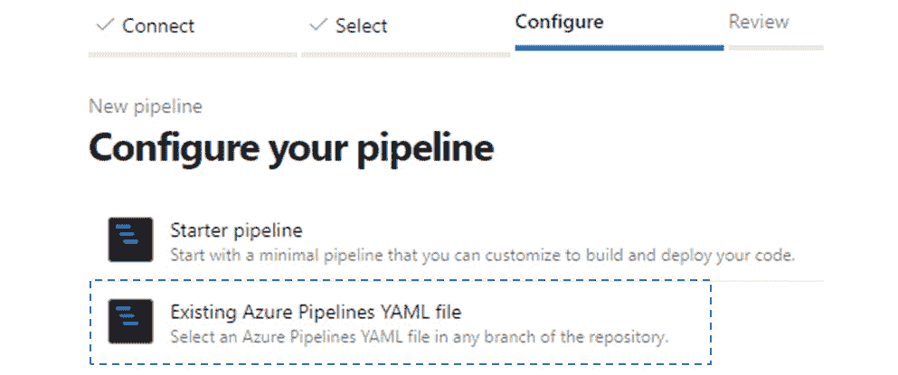

图 5.22 – 使用现有管道选项

+   在提示选择构建管道时，指定`main-ci-build.yml`文件。点击**继续**完成构建管道的创建。

+   运行管道作业以验证构建管道是否正常工作。在管道状态页面上，检查是否有任何错误并确认管道作业成功执行。

重要提示

该管道由构建 .NET Core 项目的任务组成。要构建其他类型的代码组件，请使用适当的任务库。

启动包的源代码仓库可以在这里找到：[`github.com/PacktPublishing/Designing-and-Implementing-Microsoft-DevOps-Solutions-AZ-400-Exam-Guide`](https://github.com/PacktPublishing/Designing-and-Implementing-Microsoft-DevOps-Solutions-AZ-400-Exam-Guide)

# 进一步阅读

+   Martin Fowler 对持续集成的深入定义可以在[`martinfowler.com/articles/continuousIntegration.xhtml`](https://martinfowler.com/articles/continuousIntegration.xhtml)查看。

+   条件语法的详细描述可以在[`docs.microsoft.com/en-us/azure/devops/pipelines/process/conditions?view=azure-devopstabs=classic`](https://docs.microsoft.com/en-us/azure/devops/pipelines/process/conditions?view=azure-devopstabs=classic)找到。

+   关于 Azure DevOps 构建练习的更多信息可以在[`docs.microsoft.com/en-us/learn/modules/create-a-build-pipeline/index`](https://docs.microsoft.com/en-us/learn/modules/create-a-build-pipeline/index)找到。

+   你可以在[`marketplace.visualstudio.com/azuredevops`](https://marketplace.visualstudio.com/azuredevops)找到 Azure DevOps 的 Visual Studio 市场。

+   你可以在[`docs.microsoft.com/en-us/azure/devops/pipelines/yaml-schema?view=azure-devopstabs=schema`](https://docs.microsoft.com/en-us/azure/devops/pipelines/yaml-schema?view=azure-devopstabs=schema)找到关于 Azure Pipelines YAML 语法的详细描述。

+   Azure Pipelines 托管和自托管代理池的定价详情可在[`azure.microsoft.com/en-us/pricing/details/devops/azure-pipelines/`](https://azure.microsoft.com/en-us/pricing/details/devops/azure-pipelines/)找到。

+   有关 GitLab CI 的更多信息，请访问 [`about.gitlab.com/product/continuous-integration/`](https://about.gitlab.com/product/continuous-integration/)。

+   有关 Jenkins 的更多信息，请访问 [`jenkins.io/`](https://jenkins.io/)。

+   .NET Core 项目的构建任务：[`docs.microsoft.com/en-us/azure/devops/pipelines/ecosystems/dotnet-core?view=azure-devops&tabs=dotnetfive.`](https://docs.microsoft.com/en-us/azure/devops/pipelines/ecosystems/dotnet-core?view=azure-devops&tabs=dotnetfive%20)

+   *开发一个网页扩展*：[`docs.microsoft.com/en-us/azure/devops/extend/get-started/node?view=azure-devops`](https://docs.microsoft.com/en-us/azure/devops/extend/get-started/node?view=azure-devops)。
