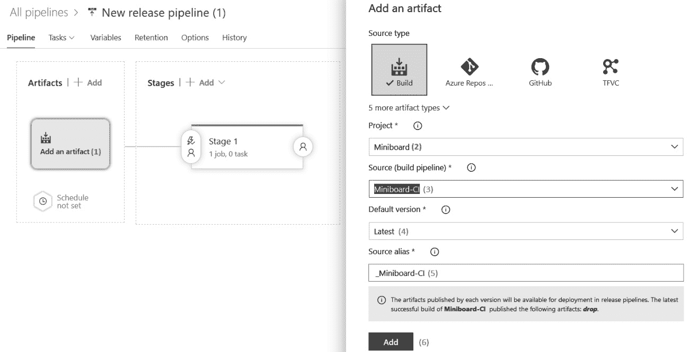

# 实现持续部署和发布管理

在前一章中，你学习了如何使用 Azure DevOps 管道进行持续集成。因此，你现在知道如何获取源代码的一个版本，并创建你可以部署的工件。在本章中，你将学习如何扩展这些技术，结合持续交付和持续部署实践，从而自动将这些工件部署到你的代码运行的服务器或平台上。

为了实现这一点，我们将从介绍 Azure DevOps 发布定义开始，这样你就可以定义并运行你的应用程序发布。接下来，将介绍一系列策略，你可以使用这些策略以低风险的方式执行部署。这样做使得你能够自动化部署新版本的过程，且在事件发生的风险最小的情况下进行无人值守的部署。从这里，我们将转向自动化创建发布说明的过程。之后，我们将介绍 Visual Studio App Center，它用于构建、测试和发布移动和桌面应用程序。最后，还将介绍其他持续部署工具。

本章将涵盖以下主题：

+   持续交付与持续部署

+   使用 Azure DevOps 发布

+   编写多阶段的**另一种标记语言**（**YAML**）管道

+   实现持续部署策略

+   部署移动应用程序

+   自动化发布说明

+   其他工具

# 技术要求

为了尝试本章所描述的技术，你可能需要以下一项或多项：

+   用于构建发布定义和多阶段 YAML 管道的 Azure DevOps 账户

+   用于部署移动应用程序的 App Center 账户

这两者都提供免费试用选项。

# 持续交付与持续部署

持续交付和持续部署之间的区别是一个常见的混淆来源。一些人认为这些术语可以互换，并将它们视为同一个概念的两个同义词，但它们实际上有两个不同的含义。

持续交付是一种实践，团队确保他们构建的工件被持续验证并随时准备部署到生产环境中。通常，这通过将工件部署到类似生产环境的环境中（例如验收环境或甚至预发布环境），并应用一系列测试（如验证测试）来确保应用程序正常工作。

持续部署是一种实践，任何部署到类似生产环境并通过所有测试和验证的版本都会自动部署到生产环境中。

无论您的团队是否决定更频繁地部署，都建议计划进行持续交付。部署和升级取决于多个因素，这些因素可能随时间而变化。因此，持续交付将成为更快发布周期的先决条件。

在使用 Azure DevOps 时，Azure Pipelines 是实现持续交付和部署的首选工具。可以使用视觉经典编辑器或多阶段 YAML 管道来完成这一操作，这两者将在以下部分讨论。

# 使用 Azure DevOps 发布

可以通过使用发布来在 Azure DevOps 中实现持续交付和部署。创建新的发布定义时，将创建发布过程的大纲。此过程通常从触发新发布的工件开始。接下来，可以定义一个或多个阶段，可以将发布部署到这些阶段。通常，这些阶段对应于不同的应用程序环境，例如测试和生产，但这不是强制的。

让我们学习如何创建一个新的发布定义并探索我们拥有的各种选项。首先，导航到**管道**并从菜单中选择**发布**。从这里，可以开始创建一个新的发布管道，这将带我们到一个看起来类似以下截图的屏幕：


图 6.1 – 新发布管道

在上一个屏幕上，我们可以执行以下操作（在上述屏幕截图中编号）：

1.  首先，请注意，左侧可以看到发布管道的大纲和一个框。在这里，您可以选择一个或多个可用于发布管道的工件。

1.  在右侧，可以看到一个框，其中显示了发布的不同阶段。默认情况下，已经创建了一个阶段。

1.  可以选择一个模板作为此预创建阶段的部署管道的起点。在此视图中选择从空作业开始，可以从头开始创建自定义部署管道。

在选择作业模板或从空作业开始之后，右侧的窗格将关闭，并且可以从左到右开始编辑发布管道，从工件开始。

一旦看到一个基本的发布管道框架，您需要配置的第一件事是发布应该使用的工件。这是下一部分的主题。

## 创建工件和发布触发器

前一章描述了构建定义和 YAML 管道，这些管道创建了工件。这些工件在发布中被接收，并形成部署应用程序的基础。

要开始编辑发布管道，请按照以下步骤操作：

1.  点击**添加构件**按钮以开始构建发布定义的起点。这将打开右侧窗格，如下图所示：



图 6.2 – 添加构件

1.  在项目选择器中，当前项目将默认被选中。

1.  现在，指定发布管道应获取的构件。

1.  此后，默认使用的版本和源别名将自动选择。默认版本可以在手动启动发布时覆盖，因此**最新**是一个合理的默认选项。

1.  源别名是我们稍后在发布阶段添加任务时，构件所在文件夹的名称。默认设置通常可以使用。

1.  通过点击**添加**完成构件的添加。

现在我们已经指定了要使用的构件，是时候指定何时创建新发布了。让我们学习如何做到这一点：

1.  若要配置新构件的可用性以触发发布，点击构件旁边的闪电符号以打开配置窗格。这可以在以下截图中看到：


图 6.3 – 指定部署触发器

1.  在此窗格中，可以使用顶部滑块创建新的发布，当发布可用时。这将展开一个新部分，您可以在其中定义一个或多个过滤器，以便指定在何种条件下新构件应触发发布。

1.  点击**添加**按钮以开始添加条件。

1.  一个常见的示例是仅包含来自主分支的构件，如*图 6.3*所示。

1.  除了来自常规构建的构件外，还可以允许来自拉取请求构建的构件启动新发布。

1.  最后，可以按固定计划创建一个新的发布。

如果没有指定计划和触发器，则新发布仅在有人手动操作时创建。

## 指定要部署发布的阶段

在指定了要发布的构件后，是时候指定一个或多个阶段来部署发布了。通常，每个环境（测试、验收和生产）将对应一个阶段，但如果情况需要，也可以有其他阶段。

让我们学习如何添加新阶段并探索各种选项。首先，点击**管道**，进入如下屏幕：


图 6.4 – 在新管道中配置阶段

现在，完成以下步骤：

1.  点击**添加**按钮以创建新阶段。一个阶段可以是新的，也可以是现有阶段的克隆。

1.  在选择已存在的阶段后，可以通过右上角的**删除**按钮将其移除。

1.  在此页面上，还可以执行其他操作，包括重命名阶段和指定阶段所有者。每当发布部署到环境中时，所有者将会收到通知。

1.  在创建并命名一个阶段后，可以像在构建流水线中一样，向该阶段添加作业和任务。为此，请点击表示该阶段的框中的链接。

从这里开始，它与构建流水线的操作完全相同。唯一的区别是：除了代理作业和无代理作业，还可以使用部署组作业。

这些将在稍后的*与部署组一起工作*部分进行讨论。但首先，让我们了解一下我们需要哪些阶段。

### 我需要哪些阶段？

在处理发布时，常见的一个问题是，*我在发布流水线中需要哪些阶段？* 根据文档，阶段应该表示发布流水线中的主要分区。在开始处理发布时，这通常简化为每个环境在发布流水线中都有一个阶段。适当的阶段包括**测试**、**验收**和**生产**。

在长时间处理发布的过程中，我们可能会在流水线中加入更多自动化，并希望为其添加额外的检查阶段。例如，可能会有一个叫做**负载测试**的阶段，与**测试**阶段并行执行。另一个例子可能是引入一个用于**自动化 UI 测试**的阶段。

无论添加了哪些阶段，发布到生产的传播方式始终应保持一致。当发布从一个阶段传播到另一个阶段，并且越来越接近生产时，这应表明对该发布有信心，证明它正在正确工作，并且可以推广到生产环境。

### 阶段触发器、审批和门控

在定义所需阶段并向其添加作业和任务之后，接下来是配置何时触发发布到特定阶段。此步骤可以在以下屏幕截图中看到：


图 6.5 – 部署后配置

请注意，以下步骤需要为每个阶段单独执行：

1.  要触发发布到特定阶段，请点击位于表示该阶段的方块左侧，带有闪电符号和人形图标的按钮。

1.  在这里配置的第一件事是何时将发布传播到此阶段。可以在发布可用时、在完成另一个阶段后，或仅在手动请求时进行选择。您在此处做出的选择也将反映在流水线的视觉表示中。

1.  与触发器分开，您还可以定义一个或多个过滤器，以限制哪些工件将触发对该阶段的部署。每个工件可以有一个或多个包括或排除分支过滤器。

1.  也可以按固定计划重新部署。

1.  最后，如果为从拉取请求启动的构建指定了创建新发布，则可以使用**拉取请求部署**滑块允许该发布传播到当前阶段。

在这些触发器旁边，可以添加审批者和门控，以便你可以配置如何处理部署队列设置。这些设置可以通过下面的**触发器**选项卡访问，如下图所示：


图 6.6 – 部署前条件

一旦触发条件被配置，接下来的部分是关于审批者的。在这里，指定了组或用户。在发布到此阶段之前，他们必须给予批准。可以添加多个人，如果是这样，可以定义他们必须批准的顺序，或者可以指定一个批准就足够。向下滚动，你会看到以下选项：


图 6.7 – 部署门控

第二个选项卡（左侧）允许你添加一个或多个门控。门控是必须成功的自动化检查，才能继续发布。目前，这显示了配置工作项查询和结果数量阈值的配置细节——例如，确保在发布继续之前没有未解决的错误。也有可用的门控，可以调用 Azure Monitor、Azure Functions 或 RESTful API。此套门控可以通过 Azure DevOps 扩展机制进行扩展。这些扩展中的一些还与常见的变更管理系统集成。

最后一部分（右侧）允许你配置如何处理不同版本的发布准备部署到同一阶段的情况。在这里，可以指定可以并行运行多少个发布。如果有更多的发布到来，你可以将它们排队并一个接一个地部署，或者只部署最新的版本。

## 使用部署组

另一个你可能会遇到的话题是将应用程序部署到本地服务器或位于防火墙后的服务器。你还可能会遇到需要在所有托管应用程序的机器上运行脚本的情况，或目标环境没有提供部署应用程序的机制的情况。

本章中“*与 Azure DevOps 发布工作*”部分展示的发布方式依赖于能够连接到将托管应用程序的目标机器或服务。我们称之为**推送式部署**，但并非总是可以做到这一点。

当部署到无法连接的目标机器时，需要采取另一种方法。这种方法称为**基于代理的部署**。在基于代理的部署中，Azure DevOps 代理将安装在每台需要部署应用程序的机器上。接下来，这些代理必须被分组到部署组中。一旦完成这一操作，就可以向发布中添加**部署组作业**。

这与代理作业非常相似，只有一处不同。在代理作业中，作业中的任务将在**其中一台代理**上执行，目标机器上。 在部署组作业中，所有任务将在目标机器上的发布组中所有代理上执行。下图展示了两者方法之间的区别：


图 6.8 – 作业在代理上运行

使用此方法时，必须在应用程序需要部署到的机器上安装代理。这些代理监听 Azure DevOps，并在有新的发布请求时，它们会获取工作并在本地机器上执行。

### 管理部署组

在您可以向发布流水线中添加部署组作业之前，您需要创建一个部署组。为此，请执行以下步骤：

1.  导航到**流水线**菜单。

1.  打开**部署组**菜单。

1.  点击**新建**以添加新的部署组。

1.  输入部署组名称和描述，然后点击**创建**。

一旦创建了新的部署组，右侧会出现一个脚本，如下图所示：


图 6.9 – 创建新部署组

在目标机器上执行此脚本将安装代理，并自动将该机器注册为新创建的部署组的一部分。

如果必须使用部署组将应用程序部署到三个阶段（测试、验收和生产），则需要为每个环境创建三个单独的部署组。

### 创建带有部署组的发布流水线

创建所需的部署组后，可以在**任务**视图中使用它们进行发布，如下图所示：


图 6.10 – 在流水线中指定部署组

为此，请执行以下步骤：

1.  向流水线中添加一个新的部署组。

1.  通过从下拉菜单中选择，指定作业应在哪个部署组上运行。

1.  添加一个或多个任务以执行作业。用户界面的功能与常规代理作业相同。

除了在一组中对所有代理执行作业的不同方法外，部署组作业与常规代理作业的行为相同。

# 编写多阶段 YAML 流水线

除了可视化设计器用于发布定义外，还可以使用 YAML 流水线实现持续部署。进行此操作时，仍建议区分流水线中的构建（**持续集成** (**CI**)）和发布（**持续部署** (**CD**)）阶段。阶段的概念用于使这一目标成为可能。一个 YAML 流水线可以分为一个或多个阶段。一个阶段可以代表一个环境，如测试、验收或生产，但这并不总是成立。如果在应用场景中，有必要增加额外的阶段，如预生产或暂存阶段，你可以根据需要添加额外的阶段。一个好的实践是，在早期阶段发布 **流水线工件**，并在后续阶段使用或 **下载工件**。

多阶段 YAML 流水线是 Azure DevOps 中创建流水线的默认方式。由于使用 YAML 流水线的学习曲线可能比经典发布更陡峭，你可能会发现先使用经典发布再转向 YAML 流水线更容易。与构建一样，经典发布的许多概念也可以转化为多阶段 YAML 流水线。

## 向 YAML 流水线添加阶段

如果 YAML 流水线中没有定义任何阶段，则总会有一个隐式阶段来容纳所有作业。要将流水线转换为多阶段流水线，你需要添加 `stages` 关键字和阶段列表，如下代码所示：

```
stages:
 - stage: stage1
   displayName: My first stage 
   jobs:
   - job: job1 
     steps:
     - task: DotNetCoreCLI@2 
       displayName: ‘dotnet build’ 
       inputs:
       projects: ‘**/*.csproj’
 - stage: stage2 
   jobs:
...
```

上述语法显示了在 YAML 文件的顶部定义了一个阶段列表。每个阶段从定义一个名称开始。这个名称可以在后续使用，方便你引用该阶段。

虽然作业（除非另有说明）默认是并行运行的，但阶段默认是顺序运行的。与作业类似，阶段也接受 `dependsOn` 和 `condition` 关键字，用于改变执行顺序和并行度，甚至（可能）跳过某些阶段。

## 下载工件

多阶段流水线的常见用途是将构建阶段与部署阶段分开。为了实现这一点，构建阶段通常会发布一个或多个流水线工件。在 *第五章* 中已经讨论过，*转向持续集成*。

当前流水线中前一个阶段发布的所有工件，可以通过 `download` 任务下载：

```
steps:
 - download: current 
   artifact: artifactName
```

也可以从另一个流水线下载工件。为此，必须将 `current` 常量替换为该流水线的名称。流水线工件将被下载到 `$(Pipeline.Workspace)` 目录。

提示

如果你希望对下载管道工件有更精细的控制——例如，控制使用的工件版本或下载工件的位置——你还可以使用**下载管道工件**任务，相关文档可以参考[`docs.microsoft.com/bs-cyrl-ba/azure/devops/pipelines/tasks/utility/download-pipeline-artifact?view=azure-devops`](https://docs.microsoft.com/bs-cyrl-ba/azure/devops/pipelines/tasks/utility/download-pipeline-artifact?view=azure-devops)。

在管道中发布和下载工件可以确保在第一阶段构建的代码也是在第二阶段部署的代码——即使各阶段之间间隔几天。本质上，每次管道运行都会构建与该特定运行相关的所有工件的本地阶段。

## 审批

在多阶段 YAML 管道中，无法像创建经典发布管道时那样定义审批者。原因在于，管道——*构建和部署过程*——被视为代码。代码只由开发人员和运维人员处理。而审批则是由例如产品负责人来处理。然而，这并不意味着无法为管道的推进到下一个阶段实现审批流程。

要控制管道是否允许继续到某个阶段，需要引入环境的概念。环境在我们为其指定名称和描述时定义。可以将一个或多个审批者附加到这些环境。一旦完成，作业就可以配置为针对该环境。如果一个阶段中至少有一个作业针对某个环境，那么该环境就被认为是该阶段使用的环境。如果该环境已配置审批，则在审批者给予许可之前，部署将无法继续到该阶段。

要开始使用环境，你需要访问环境列表。该列表可以在**管道**菜单中找到，如下图所示：


图 6.11 – 添加新环境

要添加新环境，请执行以下步骤：

1.  打开**管道**菜单并选择**环境**。

1.  从右上角选择**新建环境**。

1.  指定名称和描述。

1.  点击**创建**。

可以将资源与环境关联。与环境耦合的资源可以在管道中使用，但前提是该管道也针对该环境。为了保护环境的资源，环境的所有者可以添加一个或多个审批者。下面的截图中展示了一个配置的审批者示例：


图 6.12 – 配置环境的审批者

可以通过以下方式向环境添加审批者：

1.  导航到**环境**概览窗格。

1.  通过点击环境名称打开该环境。

1.  点击右上角标有三个点的菜单，选择**审批和检查**。

1.  点击**创建**按钮。

1.  从列表中选择一个用户或组，并在需要时添加额外的指令。

1.  再次点击**创建**按钮。

审批使你能够控制管道是否可以进入下一个阶段，前提是该管道的目标环境正确。目标环境是通过指定特定类型的作业——部署作业来实现的。以下 YAML 展示了如何做到这一点：

```
jobs:
 - deployment: deploymentJobName 
   displayName: Friendly name 
   strategy:
   runOnce: 
     deploy:
       steps:
       …
```

部署作业不像代理作业那样直接包含执行步骤。相反，它们首先必须为在`steps`关键字下列出的任务指定执行策略。截止目前，唯一支持的策略是`runOnce`。未来预计会宣布其他策略。

截至目前，仅支持 Kubernetes 集群作为环境资源，但未来将支持更多类型的资源。

现在我们了解了创建发布定义和编写多阶段 YAML 管道的技术手段，是时候看看我们可以在实践中应用的不同策略了。这些 CD 策略旨在最小化自动部署新版本应用的风险。

# 实现 CD 策略

在我们持续部署应用之前，重要的是要思考我们应该使用哪种策略。仅仅一个接一个地进行部署，可能带来的风险超出了企业所能接受的范围。因此，考虑如何处理在部署新版本应用过程中或之后可能发生的问题是非常重要的。

有几种部署策略可以应用，以减少部署可能带来的风险，所有这些策略将在本节中讲解。请注意，可以将以下一种或多种模式结合使用。例如，完全可以在基于环的部署中为每个环使用蓝绿策略。此外，所有部署策略都可以与功能标志结合使用。

## 蓝绿部署

蓝绿部署是一种技术，其中应用的新版本不会直接部署到生产服务器上。相反，它会先部署到另一组服务器上。一旦成功完成这一步，用户将被引导到新的部署版本。

假设一个应用默认运行在三个主机上。蓝绿部署的典型配置是两组三台主机——蓝色组和绿色组。在这两组前面，有一个反向代理，充当负载均衡器，将传入的请求重定向到蓝色组。以下图表展示了这个过程的工作原理：


图 6.13 – 蓝绿部署

在这种情况下，要部署应用程序的新版本，需要将其部署到绿色服务器组。由于这些服务器不接收来自最终用户的任何流量，因此这种方式的服务器升级对用户完全没有影响。

部署完成后，可以验证新部署以确保其成功且应用程序正常运行。验证之后，负载均衡器会重新配置，将流量重定向到绿色服务器组。现在，应用程序的新版本已经开始提供服务。

如果突然出现任何意外问题，完全可以通过重新配置负载均衡器将流量切换回蓝色服务器组，从而轻松地回滚到先前的部署。如果部署成功且没有问题，则可以按照相同的程序开始下一版本的部署，但此时绿色组和蓝色组的角色已交换。

### 不可变服务器

蓝绿部署模式的一种变体是不可变服务器。使用不可变服务器时，不再在两个服务器组之间来回切换。相反，提供旧版本应用程序的服务器组将完全被忽略或移除。通常，这是在宽限期之后进行的。

其结果是，仍然可以通过保持旧服务器一段时间，几乎即时地回滚到先前的版本。另一个好处是，现在可以保证没有任何先前部署的残留物被带入到新的部署中。使用不可变服务器，随着时间的推移，活动服务器的变化可能如下所示：


图 6.14 – 不可变服务器部署

当然，这种方法只有在使用诸如容器或虚拟机等技术时才可行。没人会期待在每次重新部署后都忽视物理服务器。

## 渐进式曝光

渐进式曝光是一种部署策略，其中可以访问新部署或新功能的用户数量随着时间的推移缓慢增加。该策略的目标是限制在功能发布出现问题时，体验问题的用户数量。

我们也可以从更积极的角度看待这一点，并与持续交付（CD）思维方式一致：最初只向少数用户暴露新功能，并随着时间的推移逐步增加该用户数，允许我们在将新版本或功能暴露给所有用户之前，增加对其的信任度。

### 金丝雀部署

渐进曝光的第一种策略是使用金丝雀部署。在金丝雀部署中，并不是所有用户都会立即被引导到新版本 – 只有一小部分用户能够访问该版本。这些用户就是“金丝雀”，并且会被密切监控。如果他们遇到任何问题，或者服务性能出现下降，新的部署会迅速回滚。

实现金丝雀部署的典型方法是将其与蓝绿部署结合使用。不同之处在于，不是一次性将所有用户切换到新版本，而是开始时只将少部分用户切换到新版本，然后逐渐增加切换到新版本的用户数量。其过程可能类似于以下方式：


图 6.15 – 金丝雀部署

如果由于出现错误而回滚了部署，这对于用户来说不是一种愉快的体验。为了防止同一小部分用户反复遇到问题，之后选择不同的金丝雀用户可能会有益处。

### 基于环形的部署

在基于环形的环境中，不仅仅只有一个生产环境 – 而是有多个生产环境。每个生产环境只服务一部分用户。它与金丝雀部署不同之处在于，不仅仅有两个环境，而是根据需要有多个环境。而且，每个新版本都会依次推广到所有的环。

因此，在基于环形的环境中，新版本不会将用户重定向，而是会传播到这些用户使用的服务器上。新版本会从一个环传播到下一个环，直到所有环的用户都完成部署：


图 6.16 – 基于环形的部署

基于环形的部署架构特别适合全球各地客户访问的产品。不同的环可以布置在世界各地，从而将部署的优势与为用户降低延迟的额外好处相结合。

## 蓝绿部署与金丝雀部署

尽管这两种方法都能有效最小化对生产工作负载的影响，但在选择其中一种方法时，仍然有一些微妙的差异需要记住：

+   只有在生产环境有一个完全相同的冗余副本时，你才能选择蓝绿部署。基本上，你可以先升级副本环境，然后将流量切换到副本上。一旦确认副本环境运行正常，你就可以继续对主环境进行部署。这种设置类似于灾难恢复时的部署方式。

+   如果你没有额外的第二实例，但能够以某种方式将主实例分区，使得一部分用户流量能够路由到独立的物理计算单元，那么你可以通过使用金丝雀发布策略来获益。金丝雀发布提供了一种相对简单的方法，可以根据特定的标准向一部分用户激活或停用某些功能。金丝雀发布适用于右移测试策略，在这种策略中，新的功能在全面推向整个用户群体之前，可以先在有限负载下验证其性能和可用性。

一般来说，这两种方法都需要一些初步的规划和投资，以理顺部署过程。

## 功能标志

逐步部署的第三种形式可以通过使用功能标志（也叫做功能开关）来实现。与金丝雀发布和基于环路的发布依赖于将新的二进制文件逐步暴露给越来越多的用户不同，功能标志用于将新功能逐步暴露给越来越多的用户。即使它们都向同一服务器发送请求，这也可以实现。功能标志通常用于在升级到包含新功能的应用程序二进制文件时，减轻发布新功能的风险。这些标志像一个开关，能够让系统管理员在运行时启用或禁用特定功能。

功能标志的最佳示例是显示或隐藏一个按钮，该按钮允许用户访问新功能。应用程序设置、数据库或外部服务用于跟踪哪些功能已为哪些用户启用。根据该设置，功能会被显示或隐藏。此类外部服务的示例包括 LaunchDarkly、split.io 和 Prefab.Cloud。

Microsoft Azure 还提供了一项名为 Azure App Configuration 的资源，可用于集中管理功能标志和其他应用程序设置。你可以在这里阅读更多相关信息：[`docs.microsoft.com/en-us/azure/azure-app-configuration/overview`](https://docs.microsoft.com/en-us/azure/azure-app-configuration/overview)。

其他功能标志可能会控制错误修复或性能改进的开启或关闭。这有助于逐步暴露这些增强功能或修复，以确保没有问题。在代码库中引入功能开关时，应有一个流程。这增加了复杂性，因为功能必须支持开关操作，而不会对最终用户产生任何影响。这个流程不仅应该描述如何添加功能开关，还应该描述如何尽快移除它们。这样的流程示例如下。

一旦业务需要独立发布特性，而不依赖开发团队所做的部署，或者对于开发团队认为高风险的变更，需要随时能够撤回而不重新部署时，开发人员会引入一个新的特性标志。引入特性标志意味着在应用设置中添加一个新的数据库条目或声明一个新的设置。

在引入特性开关后，新特性或变更已经开发和测试完毕。这意味着代码库中会有一个或多个`if`语句，根据特性标志的状态执行不同的代码路径。在此时，应用程序必须维持两个代码执行路径，直到再次移除特性标志。一个好的做法是尽量通过现有的工程实践（如依赖注入）将这两个代码路径分开。

在代码不断交付给用户的同时，该特性对任何人都不可用。只有当开发团队完全满意该变更，或产品负责人觉得时机成熟，才会启用特性标志。

不要停留在这里。打开特性标志后，应积极判断特性或变更是否正常工作，如果正常，特性标志应尽快移除。这样，两个代码路径需要维护的时间就会尽可能短。

另外，请注意，除了需要维护更多的执行路径外，现在还需要测试更多的路径。如果引入了特性标志之间的依赖关系或排斥关系，这个影响会迅速增长。特性标志只能根据另一个特性标志的状态开启或关闭，可能会带来较高的成本，建议避免这种情况。

如果实现得当并尽早移除，特性标志的额外成本通常是值得的。像所有工程实践一样，先从小处开始，在给定的上下文中评估什么有效，再根据需要将其规模化。

## 回滚或失败前进

无论使用哪种策略，都需要考虑回滚一个或多个版本的能力以及所需时间。例如，蓝绿部署允许我们几乎瞬间回滚一个版本，只要新版本尚未部署到非活动服务器上。另一方面，在基于环的部署中执行回滚将需要完全重新部署上一个版本，这可能会耗时更长，并且伴随部署风险。这可能甚至需要在多个环上进行，增加了挑战。

另一种可以采用的方法是“前进失败”。采用这种方法时，声明永远不会回滚到先前的版本。相反，当遇到问题时，会通过重新部署一个包含问题修复的新版本来解决问题。最近这种策略越来越受到青睐，因为它节省了时间，我们不需要准备、测试和实践回滚操作。然而，这个过程可能存在风险：

+   无法保证修复一定正确。问题可能无法通过新部署的版本解决，或者更糟的是，新版本可能会导致从一个问题转到另一个问题。

+   找出任何问题的详细根本原因需要时间，就像编写修复一样。其结果可能是修复所需的时间比回滚所需的时间还要长。

无论采取哪种方法，都要考虑后果并做好准备。

到目前为止，我们主要关注的是基于 Web 的应用程序。在接下来的部分，我们将把注意力转向移动应用程序。

# 部署移动应用程序

一种需要特殊部署方法的应用程序是移动应用程序。这些应用程序通常不会由最终用户直接下载和安装，而是通过他们移动设备上的应用商店进行消费。

Visual Studio App Center 是微软推出的一款产品，能够通过应用商店或私人分发列表将移动应用程序分发（部署）给最终用户。

你可以在这里了解更多关于 App Center 的信息：[`visualstudio.microsoft.com/app-center/`](https://visualstudio.microsoft.com/app-center/)。

登录 App Center 后，您将看到以下屏幕：


图 6.17 – 添加新应用

在这里，您可以创建一个新的应用定义。每个目标操作系统都应该创建一个应用定义。如果同一个应用程序将同时部署到 Android 和 iOS，至少需要创建两个应用。

创建应用的步骤如下：

1.  登录 App Center。

1.  点击蓝色的**添加新应用**按钮。如果没有现有应用，这个按钮会出现在屏幕中央；否则，它会出现在右上角（被之前截图中显示的弹出窗口遮挡）。

1.  输入应用名称。

1.  选择发布类型。

1.  选择操作系统。

1.  选择要使用的平台。

1.  点击**添加新应用**来创建应用。

一旦应用创建完成，它可以连接到正确的应用商店，并可以创建分发组。

## 连接到应用商店

应用商店是所有移动平台分发应用的主要机制。一旦构建交付到应用商店，用户就可以安装并使用该应用。当前连接到应用商店的列表可以通过**App Center**左侧的**商店**选项卡打开。从此列表中，可以打开单独的商店连接，进入一个类似于下图所示的屏幕：


图 6.18 – Visual Studio App Center 中的应用商店

此视图显示已发布到连接的商店账户的所有版本的应用列表。这里也是选择要发布到商店的新版本的地方。通过顶部的蓝色**发布到 Google Play**按钮来执行此操作。此时会弹出一个窗口，您可以选择正确的版本。只需确认一次即可发布此版本。

新的商店连接可以通过返回到所有商店连接的列表并点击**添加**按钮来创建。这将打开一个向导，需要输入两项信息：

+   **商店连接类型**：此列表仅限于在创建应用定义时选择的类型所允许的商店。例如，对于 iOS，这仅限于 Apple App Store 和 Intune 公司门户。

+   **连接详情**：通常包括 App Center 与应用商店之间的身份验证方式。

一旦新连接创建成功，它可以在前面显示的列表中找到，并可用于分发应用。

另一种分发方式是使用分发组，我们将在下一节中介绍。

## 使用分发组

分发组用于创建一个或多个用户的命名列表，通常是测试人员或早期用户，他们通过邀请而不是通过应用商店安装应用。分发组可以在左侧菜单的**组**下找到：


图 6.19 – Visual Studio App Center 中的分发组

在这里，可以添加一个新的组，如下所示：

1.  使用左侧菜单导航到**分发组**。

1.  单击带有加号（**+**）符号的蓝色按钮（位于前述截图中的弹出窗口下方）。

1.  选择组的名称。

1.  添加一个或多个成员。

1.  保存新组。

一旦创建了分发组，就可以用于发布版本，我们将在下一节中讨论此内容。

## 发布应用

要发布应用的首个或新版本，必须与 App Center 共享。可以使用左侧的**发布**标签来完成此操作。打开发布页面后，将显示以下视图，详细列出所有当前的发布版本。从这里，你可以选择任何版本并查看其详细信息：


图 6.20 – 查看应用的发布版本

在此视图中，最近的发布列表显示在中间列。选择单个发布后，该版本的详细信息将会显示。这包括其正式版本、已共享的商店和/或分发组，以及其他详细信息。

从这里，你可以通过右上角的**分发**按钮，直接将此特定版本分发到商店连接或分发组。

从这里，你还可以通过上传应用的新构建来创建一个新的版本。为此，请按以下步骤操作：

1.  点击**新发布**按钮，该按钮可以在所有发布版本的列表中找到（可能需要先关闭某个特定发布的详细信息）。这将打开以下视图：


图 6.21 – 上传新构建

1.  一个新的向导将会打开，需要上传一个构建文件。根据应用类型，会请求上传正确类型的文件。上传二进制文件后，点击**下一步**。

1.  现在，必须填写发布说明。在详细列出本次发布的更改后，再次点击**下一步**。

1.  现在，是时候指定将这个新构建分发到哪里了。必须选择至少一个目标位置——无论是分发组还是商店。选择一个或多个目标位置后，再次点击**下一步**。

1.  最后的向导标签将显示你至今所做的选择。检查细节后，点击**分发**以完成新版本的创建及其初步分发。

通常，同一版本或发布需要随着时间推移分发到其他组或商店。每次都创建新发布既不必要也没有意义。相反，进入新的目标商店连接或分发组的**详情**页面，你可以将现有的发布版本发布到该目标位置。

作为使用 App Center 执行发布管理的替代方法，还可以使用 Azure Pipelines 进行发布管理。

## 通过 Azure Pipelines 使用 App Center

App Center 还可以与 Azure Pipelines 集成。如果团队熟悉 Azure Pipelines 中的发布过程，将应用构建在 Azure Pipelines 中，并仅使用 App Center 进行商店和分发组的部署是一个合理的选择。

为了实现这一点，Azure Pipelines 中提供了任务，允许你上传版本并触发将版本部署到存储或分发组。这样，版本管理可以在 Azure Pipelines 中进行，而在适用的地方仍然可以利用 App Center 的特定功能。

本节特别关注移动应用程序，而下一节将适用于所有类型的发布。当版本创建自动化，并且新版本迅速跟随前一个版本时，开始自动化发布说明的创建和发布也非常有用。下一节将对此进行讨论。

# 自动化发布说明

在自动化构建、发布应用程序并努力增加价值流向最终用户之后，许多开发者发现，保持文档和发布说明的更新变得越来越困难。随着版本数量的增加，这项工作变得越来越繁重，最终团队会落后，甚至完全放弃。

为了解决这个问题，可以自动化发布说明的创建和发布。实现这一点的一种方式是使用*Azure DevOps 发布说明生成器*。有关更多详细信息，请参考：[`docs.microsoft.com/en-us/samples/azure-samples/azure-devops-release-notes/azure-devops-release-notes-generator/`](https://docs.microsoft.com/en-us/samples/azure-samples/azure-devops-release-notes/azure-devops-release-notes-generator/)。

该生成器是一个可在 GitHub 上获取的 Azure Functions 应用程序。要使用发布说明生成器，需要执行以下操作：

1.  从 GitHub 下载或克隆该功能代码，链接为：[`github.com/Azure-Samples/azure-devops-release-notes`](https://github.com/Azure-Samples/azure-devops-release-notes)。

1.  在 Azure 中创建一个 Azure App Service 计划、功能应用和存储账户。

1.  在存储账户中创建一个名为`releases`的新 Blob 容器。

1.  编译功能代码并将其部署到 Azure App Service。

1.  创建一个新的 Azure DevOps WebHook，以便每当创建新版本时，调用已部署的功能。（有关更详细的说明，请参阅 GitHub 上的 Wiki 文档。）

设置完成后，每当创建新版本时，生成器将自动运行。它将执行以下操作：

1.  查询已创建的版本，获取其名称、所有关联的工作项以及自上一个版本以来新增的所有提交

1.  生成一个包含所有这些信息的 Markdown 文件

1.  将该文件上传到 Blob 容器——即`releases`

当然，Azure DevOps 发布说明生成器只是自动化发布任务的一个示例，还有其他替代方案可供选择。此外，许多公司还为更新和发布文档以及其他任务创建了定制的内部自动化脚本。

# 其他工具

除了 Azure DevOps 和 App Center，还有其他工具可以用于部署和发布软件。在上一章中，我们讨论过的 GitLab CI/CD 和 Jenkins，可以用于执行构建，也可以用于发布。除此之外，Octopus Deploy 也是一个常用的工具，与 Azure DevOps 集成得很好。

## Octopus Deploy

**Octopus Deploy** 是一个部署自动化工具，基于在一个或多个目标机器上运行一系列任务的概念。

Octopus 通过在这些机器上安装触角（代理）来访问这些机器。在 Octopus Deploy 中，可以定义应用程序和环境，并将一个或多个机器分配给每个环境。为了进行部署，可以在图形编辑器中定义执行步骤，这类似于 Azure DevOps 的可视化发布编辑器。

其中一个主要区别是这些步骤不是按环境定义的，而是每个管道只定义一次。接下来，可以指定每个任务应该在哪些环境中运行。通过这种方式，更容易看到不同环境的部署差异。

Azure DevOps 和 Octopus Deploy 之间有一个集成，形式为构建和发布任务。通过这个集成，可以从 Azure DevOps 的构建或发布管道启动使用 Octopus Deploy 的部署。

# 总结

在本章中，你了解了持续部署以及如何使用 Azure DevOps 实现它们。除了可视化发布编辑器，你还学习了多阶段 YAML 管道，你可以使用这些管道将软件发布到多个阶段，直到生产环境。接下来，我们讨论了一系列可以用于发布的策略。你现在了解了蓝绿部署、使用不可变服务器和不同的渐进式曝光策略。你还学会了如何在确保具有回滚能力和接受失败前进策略之间做出选择。

然后，你了解了如何自动化发布说明和文档，并学习了如何将它们作为管道的一部分自动生成。之后，你了解了移动应用程序的持续部署及其与 Web 应用程序交付的不同之处。最后，你了解了 Octopus Deploy 的存在，它是如何操作的，以及它如何与 Azure DevOps 集成。

在下一章中，你将学习使用 Azure Artifacts 进行主题依赖管理。这可以用来托管你自己的 NuGet 包，或者在使用其他产品进行构建或发布应用程序时，结合 Azure Pipelines 托管构建工件。

# 问题

在我们结束本章内容时，以下是一些问题，用于测试你对本章内容的掌握情况。你可以在*附录*中的*评估*部分找到答案：

1.  判断题：Azure DevOps Classic 发布总是由新版本的工件的可用性触发。

1.  以下哪个平台可以通过 App Center 发布应用？（你可以选择多个）

    1.  Google Play Store

    1.  Apple App Store

    1.  Microsoft Intune

1.  以下哪些技术使用渐进式曝光来最小化部署新版本的风险？（你可以选择多个）

    1.  功能切换

    1.  基于环的发布

    1.  灰度发布

1.  对或错：当 Azure Pipelines 代理安装在将运行软件的机器上时，部署组可用于将软件部署到本地服务器。

1.  如果你在 Azure Pipelines 中有一个发布定义触发 App Center 中的操作，将 App Center 与 Azure Pipelines 集成的好处是什么？

# 练习

+   **前提条件**：本章中的练习依赖于*第八章*，*实施基础设施和配置即代码*。请完成该章节中提到的练习，以便你已在 Azure 中配置好必要的资源，从而继续进行构建和部署相关的管道创建。

+   `PacktBookLibrary` 项目。这将作为服务账户用于将资源和构建部署到 Azure：

    +   转到 **项目设置** | **服务连接**（位于 **管道** 下），然后点击 **新建服务连接** 按钮。

    +   在 **新建服务连接** 对话框中，确保选中 **Azure 资源管理器** 选项，然后在下一步中，选择 **服务主体（自动）**。

    +   将范围保持为 **订阅** 并指定服务连接名称为 **Azure 服务连接**。

    +   在 **安全性** 下，选中授予所有管道访问权限的选项。

+   创建 `DEV`、`TST` 和 `PRD`。现在暂时不要添加任何资源：

图 6.22 – 部署环境

+   对于每个环境条目，配置其审批人。审批人列表应包括那些可以批准其各自所拥有环境中任何活动的成员：


图 6.23 – 配置环境设置

+   创建 `Environment`：指的是环境的名称

+   `azureSubscription`：指的是要使用的服务连接名称

+   `Webappname`：指的是 Azure App Service 资源的名称

+   `Resorucegroup`：指的是 App Service 资源所在的资源组

+   `Slotname`：指的是要部署到的 App Service 的槽位

+   现在你应该能看到三个不同的变量组：

图 6.24 – 每个环境的变量组

+   打开你的 `PacktBookLibrary` 仓库的代码库，并在 `pipelines` 目录下创建一个名为 `deploy` 的子文件夹：

    +   创建一个名为 `template.yaml` 的文件。按照此目录中文件的代码进行插入：[`github.com/PacktPublishing/Designing-and-Implementing-Microsoft-DevOps-Solutions-AZ-400-Exam-Guide`](https://github.com/PacktPublishing/Designing-and-Implementing-Microsoft-DevOps-Solutions-AZ-400-Exam-Guide)

+   在 `build` 子目录中放置另一个名为 `template.yaml` 的文件：

    +   按照此目录中文件的代码进行插入：[`github.com/PacktPublishing/Designing-and-Implementing-Microsoft-DevOps-Solutions-AZ-400-Exam-Guide`](https://github.com/PacktPublishing/Designing-and-Implementing-Microsoft-DevOps-Solutions-AZ-400-Exam-Guide)

+   在 `pipelines` 目录中，创建一个名为 `main-cd-pipeline.yaml` 的文件。按照此目录中文件的代码进行插入：[`github.com/PacktPublishing/Designing-and-Implementing-Microsoft-DevOps-Solutions-AZ-400-Exam-Guide`](https://github.com/PacktPublishing/Designing-and-Implementing-Microsoft-DevOps-Solutions-AZ-400-Exam-Guide)

+   创建一个 CD 流水线，将最新的构建版本部署到三个不同的环境：

    +   点击 `main`，将路径设置为 `main-cd-pipeline.yaml` 的相对路径，然后将流水线保存为 `main-cd-pipeline`。

+   授予流水线对所有变量组的权限。现在你应该能看到以下两个流水线：

图 6.25 – 查看流水线运行状态

+   运行 `main-cd-pipeline` 并验证构建部署是否成功。

# 深入阅读

+   关于在 YAML 流水线中使用阶段的更多信息，请访问 [`docs.microsoft.com/en-us/azure/devops/pipelines/process/stages`](https://docs.microsoft.com/en-us/azure/devops/pipelines/process/stages)。

+   关于不可变服务器的更多信息，请访问 [`martinfowler.com/bliki/ImmutableServer.xhtml`](https://martinfowler.com/bliki/ImmutableServer.xhtml)。

+   关于 LaunchDarkly 的更多信息，请访问 [`launchdarkly.com/`](https://launchdarkly.com/)。

+   关于与 Octopus Deploy 集成的构建和发布扩展的更多细节，请访问 [`marketplace.visualstudio.com/items?itemName=octopusdeploy.octopus-deploy-build-release-tasks`](https://marketplace.visualstudio.com/items?itemName=octopusdeploy.octopus-deploy-build-release-tasks)。

+   Azure DevOps 发布说明生成器可以在 [`docs.microsoft.com/en-us/samples/azure-samples/azure-devops-release-notes/azure-devops-release-notes-generator/`](https://docs.microsoft.com/en-us/samples/azure-samples/azure-devops-release-notes/azure-devops-release-notes-generator/) 找到。

+   可以通过以下链接找到一些微软的实操实验室，帮助你练习本章覆盖的主题：

    +   [`docs.microsoft.com/en-us/learn/modules/create-multi-stage-pipeline/index`](https://docs.microsoft.com/en-us/learn/modules/create-multi-stage-pipeline/index)

    +   [`docs.microsoft.com/en-us/learn/modules/create-release-pipeline/index`](https://docs.microsoft.com/en-us/learn/modules/create-release-pipeline/index) 和 [`docs.microsoft.com/en-us/learn/modules/manage-release-cadence/index`](https://docs.microsoft.com/en-us/learn/modules/manage-release-cadence/index)

# 第三部分 – 扩展你的 DevOps 管道

在这一部分，你将学习到其他一些 DevOps 实践，这些实践建立在之前*第二部分：实现持续交付*中讨论的**持续集成**（**CI**）/**持续交付**（**CD**）的坚实基础上。你将学习如何建立一个健壮的**应用生命周期管理**（**ALM**）流程，以管理你在云中的基础设施，以及如何在不丢失任何信息的情况下，实现后端数据库的简化升级和迁移。

我们还将探讨持续测试实践，以更好地理解“左移质量”这一概念。这意味着从一开始就将质量问题嵌入到我们的管道中，并不断地验证这些问题，从而加快交付一个安全且高质量的产品。

本书的这一部分包括以下章节：

+   *第七章*，*依赖管理*

+   *第八章*，*将基础设施和配置作为代码实现*

+   *第九章*，*在 DevOps 场景中处理数据库*

+   *第十章*，*集成持续测试*

+   *第十一章*，*管理* *安全性和合规性*
