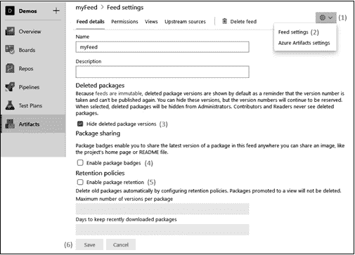
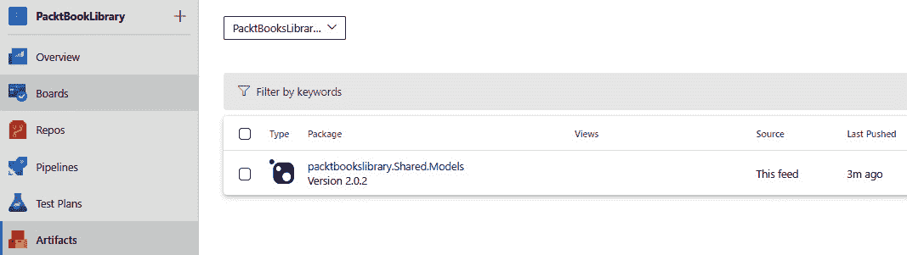

# 依赖管理

在本书的第一部分，你学习了如何持续部署你的应用程序。在现代企业软件开发中，应用程序是由跨职能团队开发的，涉及复杂的解决方案和项目。具有数百个模块和功能的复杂解决方案，更容易出现代码重复的情况——也就是说，在项目中同样的功能可能有相同的实现。重复的代码是编程中的严重错误之一。你可以通过复制粘贴解决问题，但这通常会在后期导致维护上的噩梦。**不要重复自己**（**DRY**）是软件开发的基本原则，旨在减少信息的重复。

对于一个小型项目或单一项目，你可能能够自己处理依赖关系，但对于复杂的解决方案，团队将会陷入**依赖地狱**。解决这一问题的一种方法是引入软件包管理。开发人员需要识别在内部项目或开源项目中可复用的组件。重用库将提高开发效率和解决方案的质量。与其将代码从一个项目复制到另一个项目，不如使用它创建一个共享库。在本章中，你将学习如何识别共享组件，并如何使用 Azure Artifacts 使它们可复用。除此之外，你还将学习如何在异构架构中使用 Azure Artifacts 存储管道工件。在这里，你还将使用除了 Azure DevOps 之外的其他**持续集成**（**CI**）/**持续部署**（**CD**）工具。为此，你将学习如何使用 Azure Artifacts 进行通用软件包的管理。

本章将涵盖以下主题：

+   识别共享组件

+   创建发布软件包的源

+   使用软件包

+   使用通用软件包

+   探索其他工具

# 技术要求

要实验本章提到的主题，需要一个 Azure DevOps 组织。

# 识别共享组件

采用如 CI/CD 等 DevOps 实践可以大大减少你在构建和测试应用程序时所需花费的时间。除了构建你的应用程序之外，你还可以在管道中解决许多其他问题。

当你开始在管道中添加越来越多的任务时，可能会遇到一个问题，即管道的单次执行时间过长。为了应对这一问题，你可能会希望将解决方案拆分为更小的构建，甚至可能是不同的仓库。将解决方案拆分为更小的构建对于单体应用程序而言是不可行的，因为这会破坏构建过程。微服务应用程序或解决方案，其中组件已解耦成独立的项目，可以采用这种方法来拆分构建过程。为此，你可以单独构建该应用程序的某些部分，然后将这些构建的结果作为现成的组件在主应用程序中使用。

组件化是一个将项目结构化为可重用组件的过程，这些组件是应用开发人员独立编写和部署的。

通过源组件化，你将解决方案拆分为多个部分，并作为共享项目使用。假设你有两个紧密协作的解决方案：一个是 REST API，另一个是你提供给客户使用该 API 的客户端包。这两个解决方案在其源代码中很可能共享至少一个项目，包含共同的可重用对象，如数据模型，它们将作为数据契约来在这两个解决方案之间交换数据。在这里，你还可以利用包组件化，创建一个仅包含共享项目的第三个解决方案，然后将其作为包在其他解决方案中使用。包通常不是作为独立单元功能齐全的。

或者，如果你在一个团队工作，负责维护一整系列的解决方案，并且发现这些解决方案之间有完整的命名空间被复制和粘贴？这并不是一个理想的情况，而且可能会带来许多问题。如果你能够只编写一次这些代码，构建、打包，然后在所有这些解决方案中重用它们，会怎么样？总的来说，开始使用包和工件源的三个原因如下：

+   将共享组件提取到包中

+   构建其他团队使用的包

+   通过将较大的解决方案拆分为多个部分来减少构建和 CI 时间

提示

依赖管理的三个主要方面是标准化、包格式和源、以及版本控制。

在本章剩余部分中，你将学习如何通过将（部分）应用程序代码构建成包，托管在一个集中位置，并在一个或多个解决方案中重用它们。

在这三种情境中，你可能希望提高代码的可重用性，同时减少从检查更改到接收更改反馈（以自动化测试结果的形式）之间的时间。在开始拆分应用程序之前，请记住，将应用程序的某一部分移到独立组件中并不总是能实现这个目标。

如果你将应用程序拆分为三个组件和一个剩余的主要部分，请确保你能够完全在隔离环境中构建和测试这三个组件，或者至少接近 100% 的隔离。如果你无法在隔离环境中测试应用程序的某个组件，那么为该组件创建一个单独的代码库和构建过程实际上会增加你作为开发者检查变更和收到反馈之间的时间。两个单独的构建可能会更快运行，但现在你需要等待两个构建过程完成，才能收到任何反馈。

提示

如果你将应用程序拆分为单独的组件，请确保每个组件能够在高度隔离的环境中构建和测试。

此外，你还必须确保将应用程序的一部分制作成可重用组件在概念上是合理的。例如，处理跨领域关注点的组件，如日志库或数据库抽象层，是非常适合提取到共享库中的候选者。（顺便提一下，完成此操作后，你可能还想考虑用现成的替代品替换自己的通用库——例如，对于数据库抽象，使用 Entity Framework；对于日志提供程序，使用 Serilog、NLog 等，尽可能使用这些现成工具。）

然而，如果将解决方案拆分为组件是合理的，它将带来很大的好处。

## 信息源的类型

一旦解决方案被拆分成不同的组件，一些组件将被多个团队和项目重用。此时将需要一个信息源来存储、共享和管理这些可重用的组件/包。

在 Azure Artifacts 中，可以托管许多类型的包信息源。你将如何使用信息源取决于应用程序所使用的语言和生态系统。

以下生态系统在 Azure Artifacts 中得到支持：

+   `.nupkg` 扩展名，并且其内容符合某些约定。

+   **npm**：当使用 JavaScript 或 TypeScript 构建应用程序时，使用 npm 协议。

+   **Maven 或 Gradle**：Maven 和 Gradle 用于 Java 生态系统。

+   **pip 和 Twine**：在使用 Python 包时，可以通过这些 pip 和 Twine 工具获取它们。

+   **通用包**：通用包与特定生态系统无关，而是一种通用的上传和检索包的方式。

每当创建一个新的信息源时，无需指定类型。实际上，每个信息源都可以通过任何协议访问，甚至随着时间的推移使用不同的协议。然而，通常情况下，这样做没有意义。

# 创建信息源

一旦确定了一个或多个你希望发布的包，你将需要一个存储它们的地方。你可以使用 Azure Artifacts。以下图表展示了 Azure Artifacts 的结构构成：


图 7.1 – Azure Artifacts 视图

在 Azure Artifacts 中，你可以创建一个或多个信息流来存储你的包。对于每个包，你可以在一个信息流中拥有多个版本。信息流是你可以设置发布包权限的级别。在一个信息流中，你可以创建一个或多个视图，用于设置消费包的权限。任何特定版本的包可以同时存在于多个视图中。接下来的小节将更详细地讨论这些概念。

## 设置信息流

在 Azure Artifacts 中，信息流是存储包的位置。每个信息流都是一个独立且完全隔离的仓库。要创建新的信息流，请按照以下步骤操作：

1.  首先，在左侧菜单中导航至 Azure Artifacts，然后点击**创建信息流**按钮（在以下截图中，按钮部分可见，在创建新信息流的面板后面）：


图 7.2 – 创建新信息流

1.  为信息流指定一个名称。该名称不应包含空格，最好只包含字母和数字，因为它将成为 URL 的一部分。

1.  接下来，可以指定初始的可见性设置。这决定了哪些用户可以查看该信息流。这个内容将在后续小节中更详细地讨论，*管理信息流的视图*。

1.  配置上游源的使用。此部分内容将在后续小节中更详细地讨论，*配置上游源*。

1.  在选择**创建**后几秒钟，你的信息流就会变得可用。

一旦信息流创建完成，你可以配置各种设置，如隐藏已删除的包、启用包批处理和配置保留策略。要了解如何操作，请按照以下步骤执行：

1.  创建信息流后，通过点击右上角的齿轮图标访问信息流的设置。

1.  在下图所示的视图中，选择**信息流设置**。在这个视图中，你可以配置更多设置：



图 7.3 – 信息流设置

1.  除了更改名称和添加描述外，你还可以选择隐藏已删除的包。当你这样做时，已删除的包版本将不再对信息流的管理员可见。普通用户永远无法查看或使用已删除的包，但此设置使管理员与普通用户具有相同的视图逻辑。

1.  另一个可以启用的设置是包徽章。包徽章是一个视觉元素，显示了包的名称和最新的可用版本。如果启用此选项，Azure DevOps Feed 管理将提供一个直接的 URL 链接指向该包徽章。通过这个链接，你可以随时引用该包的最新版本。这对于想要跟踪包的最新版本的人非常有用。

1.  最后，你可以配置保留策略。在这里，你可以配置当某个包的版本数超过某个阈值时自动删除。虽然这有助于节省磁盘空间，从而减少成本，但这也可能导致下游用户的代码引用无法找到这些特定版本。因此，为了防止这种情况发生，你可以在最后一次下载该包后的**x**天内阻止删除该包。此外，请记住，当前属于某个 feed 的任何包版本将不会被删除。

1.  完成后，点击**保存**按钮。

在你创建并配置了 feed 后，接下来是指定哪些用户可以访问该 feed 以及他们的权限。接下来我们来学习如何做。

### 安全访问

你可以为用户或组分配四个角色，其中每个后续角色的权限包括前一个角色的权限：

+   **读者**可以列出 feed 中的所有包，并可以下载它们。

+   **协作者**也可以使用来自上游源的包。

+   **贡献者**也可以发布自己的包，并且可以将包取消列出或弃用。

+   最后，**所有者**拥有对 feed 的完全控制权，并且可以更改权限、重命名 feed 或删除它。

若要更改用户的权限，请按照以下步骤操作：

1.  导航到**权限**视图，你可以在下面的截图中看到。在此视图中，你可以看到已分配权限的每个用户或组的列表：


图 7.4 – Feed 设置 – 添加/移除权限

1.  若要移除权限，选择该行并点击**删除**。

1.  若要添加新行，点击**添加用户/组**按钮。这将打开你右侧看到的视图。

除了将用户或组作为整个 feed 的读者添加外，你还可以在 feed 上创建一个或多个视图，并为每个视图设置访问权限。

## 管理 feed 上的视图

feed 是一个包的仓库，你可以在其中发布和下载包。然而，在许多情况下，你不希望每个上传的包都可以供下载。你可能会发现，你希望控制谁可以使用哪个版本的包——例如，在你实现共享库的持续交付时，但又只想与组织中的其他人共享稳定版本。

为此，你可以创建视图。视图是 feed 中包版本的一个子集。作为消费者，在使用视图时，它的行为就像一个 feed 一样。

视图可以按照以下方式进行管理：

1.  导航并点击**视图**；你应该会看到类似以下截图的内容：


图 7.5 – Feed 设置 – 管理视图

1.  在这里，您可以看到当前所有视图的列表，并通过选择某行并点击**删除**来移除任何视图。

1.  添加新视图可以通过点击**添加视图**按钮来完成，按钮会打开右侧的视图。

1.  您还可以在此设置对视图的读取权限。您可以允许整个 Azure DevOps 组织读取权限，或指定特定用户。您在此添加的任何用户或组将仅对该视图获得读取权限。

1.  编辑权限可以通过选择任意行并点击**编辑**来完成。

一旦有一个或多个视图可用，包就可以被提升到该视图中供使用。

## 配置上游源

您可以在源上配置的最后一项是上游源。Azure Artifacts 源为您提供了一个存储库，您可以在一个或多个位置发布您自己的包，以便重复使用。

然而，您可能还会使用一些公开可用的包，这些包托管在像`NuGet.org`或`npmjs.org`这样的仓库中。在这种情况下，您可以将 Azure Artifacts 源和`NuGet.org`结合使用，或者您也可以将您的源配置为从`NuGet.org`提供包。如果您这么做，`NuGet.org`被称为上游源。

除了简化操作外，这还为您提供了一个额外的好处，即可以在一个中心位置查看您在解决方案中使用的所有包。这使得您可以快速检查正在使用的包和版本，这对合规性或安全检查很有帮助。通过设置阅读者和协作者角色之间的不同权限，您还可以配置哪些用户被授权从`NuGet.org`拉取包到您的源中，哪些用户则没有权限。

当然，您可以对任何可以通过互联网访问且实现了 Azure Artifacts 支持的协议的仓库执行此操作。要配置上游源，请按照以下步骤操作：

1.  上游源可以在导航到以下屏幕后进行配置：


图 7.6 – 配置上游源

1.  上游源的配置方式与权限和视图相同。您可以通过菜单栏中的**删除**按钮删除上游源。

1.  添加上游源可以通过点击**添加上游源**按钮来完成，按钮会打开右侧的视图。

重要提示

另一个关于使用上游源的注意事项是，如果包的版本已经在上游源中存在，您将无法将该版本的包发布到您自己的源。

例如，当您启用`NuGet.org`上游源时，您无法发布`Newtonsoft.Json` 10.0.3 版本的包，因为该版本的包已经存在于`NuGet.org`上。

本节讨论了如何创建和连接源。现在这些已配置完成，我们将在下一节学习如何将包发布到这些源。

# 发布包

现在您知道如何创建和管理 feed，是时候学习如何将包发布到这些 feed 中了。如果您有将包发布到公共 feed 的经验，您会发现发布到 Azure Artifacts 的方式完全相同。有两种方法可以将包发布到 feed 中：

+   从您自己的计算机手动发布

+   通过使用 Azure 管道

这两个选项在以下部分中进行了探讨。

## 手动发布包

要手动上传包，需要执行以下步骤：

1.  首先，您需要检索 feed 的 URL。要做到这一点，请单击任何 feed 的 **连接到 feed**，如以下截图所示：


图 7.7 – 连接到 feed

1.  在左侧列表中，选择用于访问 feed 的协议。

1.  选择正确的视图使用。请记住，对于发布包，需要使用完整的 feed URL，因为视图是只读的。

1.  在进行正确选择之后，使用 **复制** 按钮将正确的 URL 复制到剪贴板。

1.  执行以下命令，从常规的 `.csproj` 文件创建一个 NuGet 包。如果您尚未拥有 `NuGet.exe` 工具，请使用本章末尾提供的链接下载它：

    ```
    nuget.exe pack DemoSolution\MyPackage.csproj -Version 1.1.0
    ```

1.  执行最后一个命令将包上传到 NuGet：

    ```
    nuget.exe push
      - Source “{feedUrl}” “MyPackage.1.1.0.nupkg”
    ```

执行最后一个命令后，该包将被发布，并在您的 feed 中可用。

## 从管道发布包

如果您需要频繁生成和发布库的新版本，手动上传包不是一个方便的解决方案。在您希望频繁生成和发布库的情况下，您可以使用 Azure 管道。除了提供自动化外，这也是引入重复性和可靠性的一个好方法，因为现在您可以利用管道所提供的所有优势。

您可以找到一个可能的构建定义，用于创建和发布一个 `npm` 包，如下例所示。这个构建的源自于一个名为 `tfs-cli` 的开源 Microsoft GitHub 仓库。

在这个流水线中，内置的 `npm` 任务被使用了三次：

+   第一次出现的是一个 `npm install` 命令。此命令用于为该包安装依赖项：


图 7.8 – 通过 Azure 管道发布 npm 包

+   第二次出现的是运行自定义命令，`build`。这个命令在源代码中使用 `package.json` 自身定义，并用于将 TypeScript 源文件转译为 JavaScript：


图 7.9 – 在 Azure 管道中构建 npm 包命令

+   最后的第三个任务是运行`npm publish`命令，将生成的软件包发布到`npm`源。在此实例中，没有选择外部源，而是选择了内置的目标注册表——Azure Artifacts 源：


图 7.10 – 在 Azure 管道中发布 npm 包

运行此构建后，您的软件包将可用于您的源。

### 软件包版本控制

使用任务上传`npm`包（或大多数类型的包）时，有一件事不会自动完成，那就是管理版本号。当然，有许多方法可以确保您的软件包具有正确的版本，但常见的方法是在构建软件包时设置（部分）版本号。

提示

语义版本控制，简称 SemVer，是版本控制系统中最常用的做法。

## 版本基础

采用`Major.Minor.Patch[-Suffix]`形式的应用程序。SemVer 标准将版本构建为四个部分，含义如下：

+   **Major**：表示此版本包含破坏性变更或与以前版本不兼容的更改。

+   **Minor**：表示此版本包含新功能，但与先前版本兼容——即向后兼容。

+   **Patch**：表示此版本向后兼容，但仅用于修复较小的错误。

+   **Suffix （可选）**：这是一个连字符后跟一个字符串，表示预发布版本。

推荐的做法是在`package.json`文件中更新版本号后，发布软件包的新版本。

在我们之前演示的`npm`包构建的基础上，可以对构建定义进行三处更改：

1.  首先，构建定义的构建编号格式更新为以下格式：`1.0$(Rev:.rrr)`。这确保每个构建都会自动生成一个唯一编号。`Ref:.rrr`变量将生成一个三位数的编号，必要时以零填充。第一次时，这个编号将为`000`，每次其余构建编号不变时，这个编号将增加 1。

1.  其次，添加一个任务，使用`{#Build.BuildNumber#}`令牌替换当前在源控制中指定的版本号。这是对名为`Build.BuildNumber`的构建变量的引用，它包含在*步骤 1*中指定的构建号。

1.  最后，在所有其他任务之前，添加了一个**替换令牌**任务。以下是配置该任务以将固定版本号替换为自动版本号的可能配置：


图 7.11 – 替换令牌任务

该任务可以配置为替换一个或多个目标文件中的令牌（`{#`，并以`#}`结束），取出这两个标记之间的文本，然后将整个文本替换为相应变量的值。

例如，如果我们将以下 `json` 文件作为输入，它将在标签内替换 `variable1` 管道变量的值：

```
{
  “property1”: “{#Variable1#}”
}
```

如果值被配置为 `Variable1: “validToken”`，则输出的 `json` 文件将如下所示：

```
{
  “property1”: “validToken”
}
```

设置好之后，每个使用定义构建的包将拥有一个唯一且不断增加的补丁版本号。每当需要更新主版本号或次版本号时，可以通过更新构建号格式来完成。

作为这种方法的替代方案，扩展市场中有许多任务可以帮助进行版本控制，包括更复杂的场景。

本节讨论了如何将包发布到源中。通过发布到源中的包，下一节将详细介绍如何在 Visual Studio 或 Azure 管道中使用这些包。

# 恢复包

将包上传到 Azure Artifacts 源或仓库使其在多种不同场景下可用。两个常见的场景是：在 Visual Studio 中使用您自己的包，或通过 Azure Pipelines 使用它们。接下来的部分将详细描述这两种场景。

## 从 Visual Studio 恢复包

一旦您的共享库作为 NuGet 包在 Azure Artifacts 源中可用，您就可以开始在 Visual Studio 中使用它们。在此之前，您需要在您的 Visual Studio 实例中注册您的源。

为此，您首先需要获取您源的 URL。为此，请参考*手动发布包*部分。准备好 URL 后，按常规方式进入管理 NuGet 文件的界面。如果您不熟悉在 Visual Studio 中操作 NuGet 包，您可以在解决方案资源管理器中找到该选项，位于解决方案和项目的标题处：


图 7.12 – 配置 NuGet 包源

一旦您到达这里，按照以下步骤操作：

1.  单击右上角的小齿轮按钮，打开对话框，您可以在其中配置使用哪些 NuGet 源。

1.  添加一个新的源。

1.  填写您的源的名称和来源。

1.  完成后，不要忘记点击**更新**；否则，您的**名称**和**源**字段的更改将不会被保存，并且不会有任何提示您尚未保存更改的警告。

1.  在您做出这些更改后，您现在可以在屏幕右上角选择您的源作为包源。

从此以后，您可以像使用 `NuGet.org` 的包一样，使用您自己源中的这些包。

## 从管道恢复包

一旦您开始在 Visual Studio 中使用您的包，很可能您也需要在 Azure Pipelines 中使用它们。这是为了在使用您包的依赖应用程序中执行 CI/CD。

幸运的是，这可以通过在你的 NuGet 恢复任务中做一个小的配置更改来实现，具体如下面的截图所示。以下截图与 NuGet 恢复任务相关，既可与 Visual Studio 构建任务一起使用，也可与 .NET Core 构建任务一起使用。两者包含相同的界面，可以以相同的方式使用：


图 7.13 – 恢复 NuGet 包管理源配置

默认情况下，仅勾选了使用来自 NuGet 的包的单选按钮；因此，如果你还需要包含来自自己源的包，你需要在下拉列表中选择正确的源。

如果你发现需要从多个源中包含包，你将被迫创建一个聚合源，并将其他源作为上游源使用。

本部分介绍了如何从 Visual Studio 中使用组件包。下一部分将深入探讨如何使用 Universal Packages 来共享通用的二进制包。

# 使用 Universal Packages

之前的部分都专注于使用 Azure Artifacts 作为重新分发应用程序包（如库或其他共享组件）的一种方式。然而，Azure Artifacts 还有另一个重要用途——用于维护 Universal Packages。

Universal Packages 源可以用于存储不同类型的包，而不仅限于广泛使用的包，例如用于 .NET 的 **NuGet**、用于 Node.js 的 **npm**、用于 Python 的 **pypi** 和用于 Java 应用程序开发的 **Maven**。

你可以使用 Universal Packages 存储和提供最大为 4 TB 的构建工件。将构建工件打包成 Universal Package 可以快速回滚到所需版本。可以使用 Azure CLI 或 Azure Pipelines 将包发布和从 Artifacts 源中检索。

提示

Universal Packages 仅在 Azure DevOps 服务中可用。

为了在异构架构中使用 Universal Packages 来暂存构建工件，你需要理解四个基本操作：从 Azure pipeline 上传和下载 Universal Packages，以及使用 Azure CLI 上传和下载 Universal Packages。后者可以通过其他工具调用。

Universal Packages 是一种轻量级、易于使用且高效的文件传输方式，具有依赖性管理功能。Universal Packages 提供客户端和服务器端去重功能，可以显著减少在传输文件时使用的网络流量。这些 Universal Packages 作为包管理的一部分通过源进行管理，因此你可以轻松控制对它们的访问。

## 从 Azure Pipelines 上传和下载 Universal Packages

将构建工件上传到 Universal Packages 源的方式与上传常规构建工件相似。你需要考虑两个变化。

首先，您需要使用另一个任务来执行上传操作。您不能使用*发布构建工件*或*发布管道工件*任务，而必须使用名为**通用包**的任务。在使用此任务时，您仍然可以为工件指定一个名称，并指定构建代理文件系统上的上传位置。接下来，您可以指定目标源和使用的版本。该版本可以在每次上传新包时自动递增，或者通过构建变量进行指定。

其次，您需要考虑到上传的包与生成它的构建没有直接关联——这与常规构建或管道工件的标准做法不同。这意味着，无论您在哪个位置使用已上传的包，您都必须找到其他方式来找到正确的版本进行下载。

要执行实际的下载，您可以再次使用**通用包**任务，如下截图所示：


图 7.14 – 通用包下载

请参考截图并按照以下步骤操作：

1.  添加任务后，您可以在**上传**和**下载**之间切换。

1.  您还可以为**上传**命令指定一个作为工件上传的目录。或者，对于**下载**命令，您可以指定工件应下载到的地方。

1.  此外，还需要指定源的名称。

1.  还需要指定包的名称。

1.  指定要上传或下载的版本。

重要提示

请注意，您还可以通过在*步骤 5*中选择使用其他源来使用不属于您自己组织的源。如果这样做，您需要创建一个服务端点来访问该源。

## 使用 Azure CLI 上传和下载通用包

当您想要处理来自 Azure Pipelines 以外产品的通用包时，您必须使用 Azure CLI。为此，请执行以下步骤：

1.  要使用 Azure CLI 处理通用包，您需要首先安装 CLI 本身。CLI 的链接将在本章末尾提供。

1.  接下来，您需要安装 Azure DevOps 扩展。可以使用以下命令完成此操作：

    ```
    az extension add –name azure-devops
    ```

1.  在使 Azure DevOps 扩展可用后，您必须使用您在 Azure DevOps UI 中也使用的账户进行登录。您可以通过以下命令进行登录：

    ```
    az login
    ```

1.  登录后，您可以使用以下命令将文件作为工件上传：

    ```
    az artifacts universal publish
      --feed {yourFeedName}
      --name {yourPackageName}
      --version {yourVersion}
      --organization https://dev.azure.com/{yourOrganizationName}
      --path {sourceFileName}
    ```

1.  要重新下载某个版本的工件，您可以使用以下命令：

    ```
    az artifacts universal download
      --feed {yourFeedName}
      --name {yourPackageName}
      --version {yourVersion}
      --organization https://dev.azure.com/{yourOrganizationName}
      --path {targetFileName}
    ```

使用 CLI 和这些命令，您可以将 Azure Artifacts 作为在多个工具之间共享构建工件的手段。在同一项目中使用多个工具时，通用包是移动二进制文件的好工具。

在下一部分，将探讨用于包管理的其他工具。

# 探索其他工具

还有许多其他工具可用于二进制管理。四种常用的产品是 MyGet、Artifactory、GitHub Packages 和 **Azure 容器注册表**（**ACR**）。它们提供的功能有所重叠，但也有各自独特的优势。

## MyGet

MyGet 是一个托管 NuGet 包的替代位置，允许你创建由你管理的公共和私有源。它还支持定义上游源，并提供内置的依赖扫描功能，让你能够持续反馈依赖项的安全性水平。

由于 MyGet 是 NuGet 协议的实现，你可以使用 Azure Pipelines 中默认的 NuGet 任务发布和使用包。

## Artifactory

Artifactory 是 JFrog 提供的一款产品，它是你可以用来托管包源的另一种工具。Artifactory 最初是一个本地部署的产品，但现在也作为 **软件即服务**（**SaaS**）提供。与 Azure Artifacts 一样，它支持多种协议与包源进行交互。写作时，Artifactory 支持的仓库协议比 Azure Artifacts 更多。例如，PHP Composer 和 **红帽包管理器**（**RPM**）等。

JFrog 发布了一个 Azure Pipelines 扩展，用于下载和上传包。

## Azure 容器注册表

另一种用于存储可重用包的存储方式是 ACR。该存储专为容器镜像设计，且在开发时考虑到了容器的分层结构。这使得当镜像的新版本可用时，如果不是所有的层都发生了变化，它只会接收部分上传内容。这样，ACR 成为存储容器镜像的一个非常好的位置。上传速度更快，而且 ACR 存储比 Azure Artifacts 存储便宜。这是一个很大的优势，因为容器镜像可能非常大。

你可以通过 Docker 集成扩展从 Azure Pipelines 集成 ACR。

# 小结

在本章中，你学习了如何识别解决方案中的共享组件——这些组件不仅出现在多个位置，而且还是逻辑上可以重用的单元。你学会了如何使用 Azure Artifacts 源来托管包含这些库的包。此外，你还学习了如何使用这些托管的包来使用 Visual Studio 和 Azure Pipelines 构建依赖的解决方案。你还了解了如何使用 Universal Packages 在 Azure Pipelines 和其他可能用于 CI/CD 的工具之间共享构建工件。

有了这些知识，你现在将能够识别解决方案中的共享组件。一旦识别出这样的组件，你还将能够在源控制中隔离它，构建它，并将其发布到工件源中。从这里，你可以将它分发到一个或多个消费解决方案。最后，你现在也能够使用 Artifacts 源在不同的 CI/CD 产品之间共享构建工件。

在下一章，你将学习如何将基础设施和配置作为代码。这是 DevOps 的基本实践之一，允许你将基础设施定义存储在源代码控制中，并将其作为发布管道的一部分使用。

# 问题

总结时，这里有一份问题清单，帮助你测试关于本章内容的知识。你可以在*评估*部分的*附录*中找到答案：

1.  判断正误：任何版本的包只能部署到源中的一个视图。

1.  判断正误：管道工件可以用于将构建结果（包）从 Azure DevOps 分享到其他产品。

1.  判断正误：Azure Artifacts 中带有通用包的源可以用于将构建结果（包）从 Azure DevOps 分享到其他产品。

1.  判断正误：**标准化**、**包格式和源**以及**版本管理**是有效的依赖管理策略的方面。

1.  以下哪项是为了在 Visual Studio 中启用使用 Azure Artifacts 源中的包来构建解决方案所必需的？（你可以选择多个选项。）

    1.  将完整的包 URL 添加到项目依赖项中，而不仅仅是包名。

    1.  至少拥有*读取者*访问权限，或者该源中的某个视图的访问权限。

    1.  至少拥有*消费者*访问权限以查看该源。

    1.  配置源的所在位置，作为 Visual Studio 的包源。

1.  将解决方案拆分成多个由 Azure Artifacts 源分隔的部分的原因有哪些？

# 练习

+   让我们创建一个共享组件来维护模型类，并将其提取为一个包。由于这个包包含模型类，它可以与多个项目一起使用，如移动应用、API 或网站项目。

+   添加`packtbookslibrary.Shared.Models.`。

+   添加一个新的类来表示`Book`模型，如下所示：

    ```
    namespace packtbookslibrary.Models
    {
        public class Book
        {
            public string? Id { get; set; }
            public string? ISBNNumber { get; set; }
            public string? Title { get; set; }
            public string? Description { get; set; }
            public string? Author { get; set; }
            public string? AuthorName { get; set; }
        }
    }
    ```

+   在 Azure Artifacts 中，创建一个`PacktBooksLibraryFeed`源。

+   在名为**构建管理员**的[PacktBookLibrary]组下。

+   或者，将**项目集合构建服务**身份设置为该源的贡献者：

图 7.15 – PacktBooksLibraryFeed 设置

+   现在，创建一个`packtbookslibrary-Shared-Models-ci-pipeline.yaml`管道，为我们的`packtbookslibrary.Shared.Models`类库项目创建一个 NuGet 包。

+   将以下目录中文件的 YAML 代码添加到`packtbookslibrary-Shared-Models-ci-pipeline.yaml`中：[`github.com/PacktPublishing/Designing-and-Implementing-Microsoft-DevOps-Solutions-AZ-400-Exam-Guide`](https://github.com/PacktPublishing/Designing-and-Implementing-Microsoft-DevOps-Solutions-AZ-400-Exam-Guide)

要推送包，运行`packtbookslibrary-Shared-Models-ci-pipeline.yaml`。

+   一旦包成功执行，你将在`packtbookslibrary.Shared.Models`的列表中看到一个新条目：



图 7.16 – 发布在 Azure Artifacts 中的共享模型包

+   现在，导航到 **管理 NuGet 包** 和 **设置**，将此 NuGet 源添加到你的项目中：


图 7.17 – 管理 packtbooklibrary-api 的 NuGet 包源

+   选择包并将其安装到你的项目中：


图 7.18 – 在 packtbooklibrary-api 项目中安装包

+   你可以在 `BookController.cs` 中按如下方式使用这个包：


图 7.19 – packtbooklibrary-api 中的共享模型包

# 深入阅读

+   可以在 [`docs.microsoft.com/zh-cn/learn/modules/manage-build-dependencies/`](https://docs.microsoft.com/en-us/learn/modules/manage-build-dependencies/) 找到与 Azure Artifacts 一起练习的练习题。

+   你可以在 [`www.nuget.org/downloads.`](https://www.nuget.org/downloads.%0D) 下载 `NuGet.exe`。

+   关于创建包的更多信息可以在 [`docs.microsoft.com/zh-cn/nuget/create-packages/creating-a-package`](https://docs.microsoft.com/en-us/nuget/create-packages/creating-a-package) 上找到。

+   有关下载和安装 Azure CLI 的信息可以在 [`docs.microsoft.com/zh-cn/cli/azure/install-azure-cli?view=azure-cli-latest`](https://docs.microsoft.com/en-us/cli/azure/install-azure-cli?view=azure-cli-latest) 上找到。

+   更多关于 JFrog Artifactory 的信息可以在 [`jfrog.com/artifactory/`](https://jfrog.com/artifactory/) 上找到。

+   Azure Pipelines 的扩展可以在 [`marketplace.visualstudio.com/items?itemName=JFrog.jfrog-artifactory-vsts-extension`](https://marketplace.visualstudio.com/items?itemName=JFrog.jfrog-artifactory-vsts-extension) 上找到。

+   更多关于 ACR 的信息可以在 [`azure.microsoft.com/zh-cn/services/container-registry/`](https://azure.microsoft.com/en-in/services/container-registry/) 上找到。

+   你可以在 [`marketplace.visualstudio.com/items?itemName=ms-vscs-rm.docker`](https://marketplace.visualstudio.com/items?itemName=ms-vscs-rm.docker) 找到适用于 Azure Pipelines 的 Docker 扩展。

+   更多关于语义版本控制的信息可以在 [`semver.org/`](https://semver.org/) 上找到。

+   更多关于 `tfs-cli` 的信息可以在 [`github.com/microsoft/tfs-cli`](https://github.com/microsoft/tfs-cli) 找到。

+   关于通用包的更多信息，请参见[`docs.microsoft.com/zh-cn/azure/devops/pipelines/artifacts/universal-packages?toc=%2Fazure%2Fdevops%2Fartifacts%2Ftoc.json&bc=%2Fazure%2Fdevops%2Fartifacts%2Fbreadcrumb%2Ftoc.json&view=azure-devops&tabs=yaml`](https://docs.microsoft.com/en-us/azure/devops/pipelines/artifacts/universal-packages?toc=%2Fazure%2Fdevops%2Fartifacts%2Ftoc.json&bc=%2Fazure%2Fdevops%2Fartifacts%2Fbreadcrumb%2Ftoc.json&view=azure-devops&tabs=yaml)。
