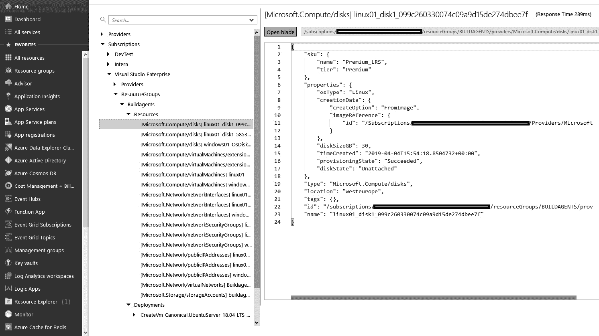

# 8

# 实现基础设施和配置作为代码

在上一章中，重点是存储和构建应用程序代码并发布生成的二进制文件。你学习了如何创建一个管道，从源代码控制到目标环境，用于自动化、可重复的应用程序部署。

在本章中，你将学习如何将相同的原则应用于你的应用程序所运行的基础设施和应用程序的运行时配置。这样做将帮助你进一步提高将更改交付到生产环境的速度，增加价值流向最终用户。

本章将首先解释将一切（包括基础设施和配置）作为代码的价值。之后，将继续解释**Azure 资源管理器**（**ARM**）模板。将解释其语法，以及如何部署 ARM 模板。接下来，介绍 Azure Automation 服务，它可在 Azure 云中使用。Azure Automation 可以用于按计划运行脚本或加载并应用 PowerShell DSC 模块。接下来是管理 PaaS 产品（如 Azure 应用服务）的应用程序设置。最后，讨论其他具有类似功能的工具。

本章将涵盖以下主题：

+   将一切作为代码

+   使用 ARM 模板

+   部署 ARM 模板

+   反向工程一个模板

+   使用 Azure Automation

+   管理应用程序设置

+   其他工具

# 技术要求

要实验本章中描述的一个或多个技术，可能需要以下一项或多项：

+   一个 Azure 订阅，用于执行 ARM 模板和运行 Azure Automation

+   使用 Azure PowerShell 模块的 PowerShell，用于执行 ARM 模板，模块可从[`docs.microsoft.com/en-us/powershell/azure/install-az-ps?view=azps-7.3.0`](https://docs.microsoft.com/en-us/powershell/azure/install-az-ps?view=azps-7.3.0)获取

+   使用 Azure CLI 执行 ARM 模板，可从 https://docs.microsoft.com/en-us/cli/azure/ 获取

# 将一切作为代码

如果你曾负责创建和维护应用程序的基础设施和配置，你很可能经历过所谓的**配置漂移**。配置漂移是指接收环境与生产环境中的服务器配置不同的现象。更糟糕的是，当生产环境中有多台服务器时，它们的配置可能并不总是相同。

配置漂移的最常见原因是手动更改。当手动更改时，可能在生产问题的压力下，始终存在将不同的设置应用于不同服务器或主机的风险。如果你需要扩展并添加另一个服务器到生产环境中，那么这个服务器与所有已有服务器具有相同配置的可能性非常小。

提示

声明式（函数式）和命令式（过程式）是实现**基础设施即代码**（**IaC**）和**配置即代码**（**CaC**）的两种主要方法。

使用 IaC 和 CaC，你不再手动更改应用程序配置和基础设施，而是通过自动化来进行。实现这一点的第一步是指定所需的配置和基础设施状态。然后，将所需状态输入到配置管理工具中，强制执行此配置到你的基础设施上。仅指定所需状态被称为*声明式*方法，它不同于*命令式*方法，在命令式方法中，你需要指定所有需要采取的步骤。

其中一些工具通常也能够定期检查你基础设施和配置的当前状态，并在检测到任何偏差时重新应用你所需的状态。这是由于声明式方法的缘故。这使得应用配置成为一个幂等操作。

提示

一个操作是幂等的，如果它可以重复执行一次或多次，而结果保持不变。

在采用 IaC 和 CaC 时，你甚至可以重建完整的基础设施，然后再部署应用程序，将应用程序部署到新的基础设施上，切换到新的部署后再丢弃旧的基础设施。这是一种极端的不可变服务器形式。这种方法的额外好处是，你现在可以确保不会留下任何来自之前部署的配置或二进制文件的痕迹。

在接下来的章节中，你将了解不同的基础设施即代码（IaC）技术以及如何使用它们。理解它们是互补的，并且常常一起使用非常重要。例如，ARM 模板可用于在 Azure 中创建虚拟机，一旦完成，PowerShell DSC 或 Ansible 可用于配置这些虚拟机。

# 使用 ARM 模板

在 Azure 平台上工作时，基础设施是通过 ARM 模板来描述的。ARM 模板是用 JSON 编写的，一个骨架模板如下所示：

```
{
    "$schema":
"https://schema.management.azure.com/schemas/2019-04-01/deploymentTemplate. json#",
    "contentVersion": "1.0.0.0", 
    "parameters": {
    },
    "variables": {
    },
    "resources": [
    ],
    "outputs": {
    }
}
```

模板本身在最高层次上是一个 JSON 对象。它有一个必填属性，`$schema`。

`$schema` 是一个必需元素，值的版本号取决于部署的范围和 JSON 编辑器。`contentVersion` 属性也是必需的，可以指定以对内容进行版本控制。这个版本号可由作者在必要时对模板进行版本控制。

本章的其余部分将更详细地讨论构成 ARM 模板的不同部分。在本章的末尾，你会找到指向在线文档的链接。也会提供一个正式、详细的 ARM 模板结构和语法解析链接。

## 参数

参数部分通常位于模板的顶部。在开始部署活动之前，ARM 将解析参数值。每当在模板中找到该参数时，ARM 会引用解析后的值。

本节的形式是一个 JSON 对象，可以为空，但不能省略。此部分的作用是声明一个或多个在部署 ARM 模板之前由调用者指定的参数。使用参数部分的常见原因是将同一个模板用于测试和生产环境，但在两者之间变化资源的名称。一个参数部分的示例可能如下所示：

```
{
  "appServiceName": { 
    "type": "string", 
    "metadata": {
      "description": "a free to choose text"
    }
}
```

对于每个参数，都会指定一个新的键作为参数的名称。值是一个对象。这个对象有一个必填键 `type`。`type` 的允许值有 `string`、`int`、`bool`、`object`、`array`、`secureString` 和 `secureObject`。`secureString` 和 `secureObject` 类型可以用来确保这些参数的运行时值不会出现在任何日志和输出中。它们用于存储密码、密钥或其他机密信息。

`metadata` 对象，包含 `description` 键，是可选的，可以用来为参数添加描述，以供将来参考。

可以在参数对象上指定的其他属性如下：

+   `minValue` 和 `maxValue` 用于指定整数值的范围。

+   `minLength` 和 `maxLength` 用于指定字符串值的长度范围。

+   `defaultValue` 用于指定默认值，如果在应用模板时未指定值，则使用此默认值。

+   `allowedValues` 用于指定一个允许值的数组，从而限制有效的输入。

接下来，让我们了解什么是参数文件。

### 参数文件

你可以利用包含参数值的 JSON 文件，而不是在脚本中将它们作为内联值指定。在本节中，我们将讨论如何使用参数文件来配合模板使用。通常，一个模板会配有多个参数文件，例如，一个用于测试，一个用于生产。参数文件的 JSON 可能如下所示：

```
{
  "$schema":
"https://schema.management.azure.com/schemas/2019-04-01/deploymentParameter s.json#",
  "contentVersion": "1.0.0.0", 
  "parameters": {
    "exampleParameter": { 
      "value": "exampleValue"
    }
  }
}
```

与 ARM 模板类似，每个参数文件都是一个包含必填 `$schema` 和 `contentVersion` 属性的 JSON 对象。第三个属性参数用于指定一个或多个参数值。对于每个参数，指定其名称作为键，值为一个对象。该对象可以包含 `value` 键，用于提供参数的实际值。

尽管对于指定资源名称、扩展选项以及在不同环境之间必须变化的其他内容非常有用，但此解决方案对机密无用。

以下图表展示了参数文件如何引用密钥并将该值传递给模板：


图 8.1 – 在 Azure 模板中使用密钥

密钥、密码和其他机密不应作为明文存储在源控制的参数文件中。对于机密，提供了另一种表示法：

```
{
  "$schema":
"https://schema.management.azure.com/schemas/2019-04-01/deploymentParameter s.json#",
  "contentVersion": "1.0.0.0",
  "parameters": { 
    "exampleSecretParameter": {
      "reference": {
        "keyvault": {
          "id": "/subscriptions/…/Microsoft.KeyVault/vaults/<vaultname>"
        },
        "secretName": "myKeyVaultSecretName"
      }
    }
  }
}
```

使用这种表示法时，代替直接指定值，会指向 Azure 密钥保管库中存储正确值的位置。在部署模板时，该密钥（在 Azure 内！）将从密钥保管库中提取并用于部署。仅当启动部署的用户或服务在密钥保管库中具有所有者或贡献者角色，并且该密钥保管库已启用模板部署时，才允许这样做。

重要说明

严格来说，任何包含 `Microsoft.KeyVault/vaults/deploy/action` 权限的角色都能正常工作。默认情况下，这些角色是所有者和贡献者角色，但你也可以创建自定义角色，其中包含此操作。

## 变量

变量部分用于指定一个或多个将在整个模板中使用的值。一种常见方法是在变量部分根据一个名为 `environmentName` 的参数构建所有资源的名称。这样可以确保资源在不同环境中具有相同的名称。变量还用于指定那些无法从模板外部指定但应被视为可配置的值。例如，可能如下所示：

```
"Variables": {
  "appServicePlanType": "B1", 
  "appServiceName": "[concat('myAppService-',
parameters('environmentName'))]"
}
```

请注意，`appServiceName` 示例中包含了函数，接下来会在下一节中讨论。

## 函数

函数用于在 ARM 模板中动态评估属性。调用函数使用的语法与许多编程语言非常相似：`functionName(arg1, arg2, …)`。函数可以返回一个值，例如 `string` 或 `int`，也可以返回一个对象或数组。

当返回一个对象时，可以使用 `.propertyName` 语法访问任何属性。访问数组中的元素可以使用 `[index]`。要指示字符串的哪些部分应作为函数进行评估，它们必须包含在括号中：

```
"myVariable": "[concat('myAppService-', parameters('environmentName'))]"
```

上一节展示了两个函数的示例。在第一个示例中，调用了 `concat` 函数来连接两个字符串值，一个是硬编码的，另一个是第二个函数调用的结果，用于获取模板参数的值。

有许多可用的函数。这些函数可以用于字符串操作、获取当前订阅、资源组或**Azure Active Directory**（**AAD**）租户的详细信息，或者获取资源详细信息。

函数也可以用于检索帐户密钥或其他秘密。这通常用于自动将密钥直接从服务插入到应用设置或密钥保管库中。这样可以消除手动传输密钥的需求。变量和函数可以帮助简化模板的维护。

你还可以向模板中添加自己的函数。这些函数可以在模板中使用。用户定义的函数独立于常规模板函数。在大多数情况下，你定义了复杂的表达式，不希望在整个模板中重复这些表达式。

## 注释和元数据

一个 ARM 模板可以包含与 JSON 语言本身无关的部分。你有几种方法可以添加注释和元数据。

### 注释

要注释一行的其余部分，可以使用 `//`，或者要注释一个块，则使用 `/* */` 注释方式。这样，以下代码片段在 ARM 模板中都是有效的：

```
{
  "appServiceName": {
    // this is a single line comment
    "type": "string",
      /*
        This is a multi-line comment
      */
      "metadata": {
          "description": " The name of the web app that you wish to create.",
      "author": "author Name"
    },
  "location": "[
      parameters('location')
      ]", //defaults to resource group location
}
```

另一个与 JSON 不同的地方是，ARM 模板允许使用多行字符串。你可以将字符串分成多行。请参见前面示例中的 `location` 属性。

在前面的示例中，你会注意到在模板中使用了注释和元数据。

重要说明

要部署包含多行字符串和注释的模板，可以使用 Azure PowerShell 或 Azure CLI。对于 CLI，请使用版本 2.3.0 或更高版本，并指定 `--handle-extended-json-format` 开关。

### 元数据

你添加到元数据描述中的文本会自动用作该参数的提示。ARM 会忽略 `metadata` 对象，并且可以在模板中的任何位置添加它。

## 资源

资源是模板的主要部分，在这里会指定要创建的所有资源。这个部分是唯一一个不是对象，而是数组的部分。在这个数组中，会指定一个或多个如下形式的对象：

```
{
    "type": "Microsoft.Sql/servers", 
    "apiVersion": "2021-02-01-preview", 
    "name": "mySqlServer",
    "location": "West Europe", 
    "properties": {
        "administratorLogin": "myUsername", 
        "administratorLoginPassword": "myPassword", 
        "version": "12.0"
    }
}
```

每个资源都是以对象的形式指定的。前四个属性是每种类型资源的必填项：

+   需要指定要创建或更新的资源类型。这采用 `resourceprovider` 的名称，后跟一个斜杠和该 `resourceprovider` 下的资源类型名称。

+   要使用此资源的 REST API 版本：可以从 [`docs.microsoft.com/en-us/azure/templates/microsoft.resources/allversions`](https://docs.microsoft.com/en-us/azure/templates/microsoft.resources/allversions) 获取支持的 API 版本列表。

+   资源的名称：每种资源类型都有其自己的规则来确定有效名称。这些规则也可以在前述参考链接中获取。

+   许多资源需要指定位置。如果资源需要位置，则必须为每个资源指定一个位置。该位置不需要与资源组的位置信息相同。该位置必须是有效的 Azure 区域。

对象上的所有其他属性因资源类型而异，且都在资源中指定。

## 依赖资源

一种特殊类型的资源是依赖资源。例如，SQL 数据库托管在 SQL Server 上，服务总线主题位于服务总线命名空间内。

对于嵌套资源类型，类型和名称反映了这种嵌套关系。以下示例展示了服务总线主题对服务总线命名空间的显式依赖：

```
{
    "apiVersion": "2021-11-01",
    "name": "myNamespaceName/myTopicName",
    "type": "Microsoft.ServiceBus/namespaces/topics", 
    "dependsOn": [
        "Microsoft.ServiceBus/namespaces/myNamespaceName"
    ]
}
```

除了嵌套类型和名称外，还需要额外的属性`dependsOn`，以指定该嵌套资源只能在包含资源存在之后创建。由于此属性会从包含资源继承，因此不需要`location`属性。

以下示例展示了 Azure SQL Server 与 Azure SQL Database 之间的逻辑依赖关系。当使用`dependsOn`属性时，子资源与父资源之间的显式部署依赖关系会自动建立。子资源会在父资源之后部署。在这里，你会注意到使用了内置的重要`resourceID`函数。`resourceID`函数返回资源的唯一标识符：

```
{
    "type": "Microsoft.Sql/servers",
    "apiVersion": "2020-02-02-preview",
    "name": "[parameters('serverName')]",
    "location": "[parameters('location')]",
    "resources": [
      {
        "type": "databases",
        "name": "[parameters('sqlDBName')]",
        "location": "[parameters('location')]",
        "dependsOn": [
          "[resourceId('Microsoft.Sql/servers', concat(parameters('serverName')))]"
        ]
      }
    ]
  }
```

重要说明

**循环依赖**是一个依赖顺序问题，导致部署在循环中运行，无法继续并完成部署。ARM 在模板验证过程中会识别出循环依赖。

## 嵌套模板

第二种特殊类型的资源是模板部署。通过这种方式，一个模板可以触发另一个模板的部署。以下是将模板部署定义为模板中的资源的示例：

```
{
    "type": "Microsoft.Resources/deployments", 
    "apiVersion": "2021-04-01",
    "name": "linkedTemplate", 
    "properties": {
        "mode": "Incremental", 
        "templateLink": {
            "uri":"https://.../myLinkedTemplate.json"
        },
        "parametersLink": { 
            "uri":"https://.../myParameters.json"
        }
    }
}
```

模板和参数文件的位置可以使用 HTTP 和 HTTPS 来指定，即使用有效的**统一资源标识符**（**URI**），但必须是公开可访问的位置。尽管模板 URI 需要外部访问，但我们希望为这些模板启用安全性并限制访问。为了在部署期间获得访问权限，可以将 SAS 令牌附加到模板文件的 URI。作为替代方案，可以指定一个单独的属性模板，模板内容应为整个模板的 JSON 对象。然而，不能同时使用内联参数和链接到参数文件。

## 输出

模板的下一个部分是输出部分。这里是返回给模板调用者的键。调用者可以使用这些值来启动另一个任务或脚本，并使用模板创建或使用的一个或多个值。

这样做的主要目的是避免在下游自动化中硬编码名称和其他动态值，尤其是 IP 地址。输出部分是以下格式的 JSON 对象：

```
{
    "outputName":
    {
        "type": "string", 
        "value": "myValue"
    }
}
```

在指定输出时，可以使用与参数相同的类型。当然，硬编码这些值没有太大意义，因此通常使用函数从参数、变量或甚至创建的资源中获取值。

继续上一节中关于创建 SQL 服务器的*Dependent resources*部分的示例，输出样本如下：

```
"outputs": {
    "SqlServerURL": {
      "type": "string",
      "value": "[reference(parameters('serverName')).fullyQualifiedDomainName]"
    }
  }
```

输出如下所示：

```
 sqlServerURL String serverName.database.windows.net
```

到目前为止，我们已经学习了组成 ARM 模板的不同部分，您应该能够自己编写它们。现在是时候学习如何通过各种工具来部署它们了。

# 部署 ARM 模板

一旦编写了 ARM 模板及其相应的参数文件，它们可以应用于 Azure 环境。有 PowerShell cmdlet 和 Azure CLI 命令可用于从脚本环境应用 ARM 模板。当 ARM 模板用于应用程序的基础设施时，Azure Pipelines 可用于部署不仅仅是代码，还有 ARM 模板。在 Azure 中部署模板的其他替代方法包括 Azure 门户、Azure CLI、REST API、Azure Cloud Shell 或 ARM 模板规格。

无论使用哪种部署方法（REST API、Azure CLI 或 ARM 模板），都将有一个*deployment mode*。这可以是*Incremental*或*Complete*。在增量模式下，将在 Azure 中创建模板中指定的所有资源，或者如果资源已存在，则将更新其属性。在完全部署模式下，将删除在 ARM 模板中未定义的任何资源。此模式不会重新部署所有资源；相反，它验证了模板中声明的资源是否已创建，并删除那些未在模板中定义但已存在于 Azure 中的资源。

默认部署模式为增量。

在接下来的几节中，讨论了几个执行部署的工具，首先是 PowerShell。

## PowerShell

用于在本地开发和测试 ARM 模板的 PowerShell 快速命令可应用 ARM 模板到资源组：

```
New-AzResourceGroupDeployment -ResourceGroupName myResourceGroup - TemplateFile "c:\my\template.json" ` -TemplateParameterFile "c:\my\parameters.json"
```

上述命令将获取指定的模板和参数文件，并将其应用于指定的资源组。此命令假定当前会话已登录到 Azure。

可用几种命令的变体：

+   参数 `-Mode` 包含 `Complete` 或 `Incremental` 值可用。这可用于指定 `deploymentmode`。

+   如果未指定参数文件且模板需要参数，则命令行工具将提示输入这些值。

+   作为替代方案，可以使用 `-TemplateUri` 和 `-TemplateParametersUri` 选项指定模板和参数的位置，以从其他位置检索。

接下来我们将了解 Azure CLI。

## Azure CLI

Azure CLI 是从命令行部署 ARM 模板的另一种方式。CLI 的好处是完全跨平台，并可在 Windows、macOS 和 Linux 上运行。部署 ARM 模板的 Azure CLI 命令如下：

```
az group deployment create –resource-group myResourceGroup –template-file "c:\my\template.json" –parameters "c:\my\parameters.json"
```

PowerShell 中提供的所有其他选项在 CLI 中也同样可用。

## Azure Pipelines

部署 ARM 模板的第三种机制是通过 Azure 管道进行。这对于同时部署应用程序的基础设施、配置以及二进制文件非常有用。要通过管道部署 ARM 模板，至少需要配置一个 ARM 模板的服务连接。完成此配置后，可以配置管道，如下图所示：


图 8.2 – Azure 管道 ARM 模板部署

在这个示例中，有两个 ARM 模板的部署，围绕应用程序代码的部署。第一次部署是增量模式，第二次部署是完整模式。

提示

ARM 模板测试工具包可通过[`github.com/Azure/arm-ttk`](https://github.com/Azure/arm-ttk)访问，帮助你使 ARM 模板符合标准实践。

使用这种方法，第一次部署将创建新版本应用所需的所有新基础设施。该部署是增量模式，因此模板中不再存在但当前部署的应用版本仍在使用的基础设施将不会被移除。第二次部署将在新版本代码部署后处理移除这些元素。

## ARM REST API

ARM 提供了 REST API 操作组，用于部署和管理 Azure 的基础设施。要获取订阅中的资源列表，请运行以下命令：

```
GET https://management.azure.com/subscriptions/{subscriptionId}/resources?api-version=2021-04-01
```

你可以使用 ARMClient，这是一个简单的命令行工具，用于向新的 ARM REST API 发送 HTTP 请求：

```
armclient GET /subscriptions/{subscriptionId}/resources?api-version=2021-04-01
```

上述命令获取订阅中的资源列表。请注意，ARM 客户端不是微软的官方工具，而是一个开源项目，由 GitHub 上的社区维护。

此外，您还可以使用`az rest`命令来运行这些命令。以下是一个示例：

```
az rest --method get --uri /subscriptions/{subscriptionId}/resources?api-version=2021-04-01
```

## Azure Cloud Shell

Azure Cloud Shell 提供了一个 Bash 和 PowerShell 环境，允许从浏览器内管理和部署 Azure 资源。Azure Cloud Shell 托管在 Azure 中。


图 8.3 – Azure Cloud Shell

部署 ARM 模板到资源组的 Azure Cloud Shell 命令如下：

```
az deployment group create --resource-group testrg --name rollout01 --template-uri https://myresource/azuredeploy.json --parameters @myparameters.json
```

Azure CLI 中的所有其他选项也可以在 Azure Cloud Shell 中使用。

# 逆向工程模板

从头编写一个 ARM 模板可能是一项繁琐且耗时的任务。幸运的是，现有基础设施中有两种方法可以生成 ARM 模板：

+   使用**导出模板**

+   使用**资源浏览器**

让我们在接下来的子章节中讨论这两种方法。

## 使用导出模板

第一种方法是使用**导出模板**选项，该选项可以在 Azure 门户的每个资源和资源组中找到。这样会生成当前资源（组）状态的 ARM 模板，如下图所示：


图 8.4 – 导出 ARM 模板

请注意，并非所有服务目前都支持使用这种方法反向工程 ARM 模板。对于任何不受支持的服务，屏幕顶部将会显示一个警告。为了绕过这个限制并获取单个资源的 JSON 模板，还有另一种方法，这是我们接下来要讨论的话题。`导出模板`过程将创建一个可重复使用的 ARM 模板。然而，大多数导出的模板在使用之前需要进行一些修改才能部署 Azure 资源。

## 使用资源浏览器

要获取单个资源的 JSON 模板，我们可以使用 **资源浏览器**。此处显示了资源浏览器，并可以通过菜单（**1**）在 Azure 门户中找到：



图 8.5 – Azure 资源浏览器

打开资源浏览器后，会打开两个新的面板。左侧面板可以用来浏览订阅并深入到资源组，直到单个资源。每选择一个元素，右侧将显示相应的 JSON。在前面的示例中，显示了硬盘的 JSON。这个 JSON 与可以在 ARM 模板的资源数组中使用的 JSON 相同，唯一不同的是 ID 元素。请注意，由于使用了不同的 API 版本，JSON 输出和相关模板资源可能会有所不同。

## 订阅级别模板

到目前为止，关于 ARM 模板的讨论都是关于资源组部署的 ARM 模板。模板描述了一个或多个部署到资源组的资源。此外，还有订阅级别的模板。以下是一个资源组的示例 ARM 模板：

```
{
    "$schema": "https://schema.management.azure.com/schemas/2018-05-01
/subscriptionDeploymentTemplate.json#", 
    "contentVersion": "1.0.0.1", 
    "parameters": { },
    "variables": { }, 
    "resources": [
        {
            "type": "Microsoft.Resources/resourceGroups", 
            "apiVersion": "2021-04-01",
            "location": "West Europe", 
            "name": "myResourceGroup", 
            "properties": {}
        }
    ],
    "outputs": {}
}
```

订阅模板的格式与资源组模板完全相同。不同之处在于 `$schema`，它指向另一个架构位置，以及支持的资源类型。订阅模板不支持直接创建资源，只支持创建资源组、启动模板部署、创建和分配 Azure 策略以及创建角色分配。

## Azure 蓝图

除了订阅级别模板外，还有另一种可用的服务：Azure 蓝图。蓝图可以用来描述 Azure 订阅的期望状态，并将其应用到现有订阅上。

现在，使用蓝图可以做的所有事情也可以通过 ARM 模板来完成。然而，反之则不成立。Azure 蓝图仅支持以下构造，称为工件：

+   策略分配

+   角色（RBAC）分配

+   资源组创建

+   订阅或资源组级别的嵌套 ARM 模板

这些是构建默认布局或 Azure 订阅蓝图所需的所有元素。

蓝图和 ARM 模板之间有许多关键差异：

+   蓝图是你可以在门户中创建并导航的资源。编写体验也在门户中，而不是本地计算机上的文本文件。

+   订阅与用于创建它的蓝图之间的关系在部署完成后依然存在。

+   通过将蓝图分配给订阅，可以将分配标记为锁定。如果这样做，则通过蓝图部署的所有资源在蓝图应用期间无法被删除或编辑——即使是被分配的订阅的所有者也无法进行操作。

+   有许多内置蓝图可以用来实施来自知名标准（如 ISO、NIST 或 HIPAA）的控制。

Azure 蓝图在写作时仍处于预览阶段。在使用蓝图时，你可以一次性安装 RBAC 角色、ARM 模板和 Azure 策略，并将它们分配到某个范围。删除分配不会删除或移除资源，因此这很快会变得繁琐，并且 Azure DevOps 没有任务或自动化来大规模管理蓝图。

## Bicep

Bicep 是一种**领域专用语言**（**DSL**），允许声明性地部署 Azure 资源。你可以使用 ARM 模板完成的一切，也可以通过 Bicep 来实现。

Bicep 提供了所有资源类型和 API 版本。Bicep 提供了更好的编写体验，因为它支持类型安全并且具有简洁的声明性语法。Bicep 文件是幂等的，一个文件将代表所需的状态。然后，你可以使用该文件以一致的方式反复部署基础设施。

Bicep 是对 ARM 模板 JSON 的透明抽象，并支持 JSON 模板功能。Bicep CLI 将 Bicep 文件转换为 ARM 模板 JSON。你可以使用 Bicep Playground ([`aka.ms/bicepdemo`](https://aka.ms/bicepdemo)) 来并排查看 Bicep 和等效的 JSON。

要在 Azure CLI 中将 ARM 模板 JSON 反编译为 Bicep，请使用以下命令：

```
az bicep decompile --file deployment.json
```

该命令会创建一个名为 `deployment.bicep` 的文件。反编译 ARM 模板可以帮助你开始 Bicep 开发。

# 使用 Azure 自动化

Azure 自动化是 Azure 中的一项服务，旨在帮助用户创建、管理、部署和维护其 Azure 资源。Azure 自动化包含几个概念，可以去除这些操作中的一些复杂性和底层细节。Azure 自动化允许以 Runbook 形式制定工作流。这些 Runbook 可以代表用户对 Azure 资源进行执行。

## 自动化帐户资源

在一个 Azure 自动化帐户中，有几个资源使其不仅仅是一个脚本引擎。这些资源在自动化帐户级别共享，因此可以在多个 runbook 中重用。

### Run As 帐户

这些构造中的第一个是 *Run As* 帐户。该帐户是一个服务主体，它将在与自动化帐户关联的 Azure 订阅所连接的 AAD 中创建。用于验证该服务主体的凭据将安全地存储在自动化帐户中。这些凭据无法直接从自动化帐户中检索。服务主体也会被添加为 Azure 订阅的贡献者。因此，现在可以设置 runbook 使用该帐户执行。创建自动化帐户时，可以自动创建 Run As 帐户。

Run As 帐户功能仍然适用于当前和新的自动化帐户。然而，Run As 帐户已被托管身份所取代。托管身份是验证 runbook 中身份的推荐方式，也是自动化帐户的默认验证方法。由于不保存凭据，托管身份更加安全且更易于使用。如果你在 runbook 代码中使用了 Run As，应该将其改为使用托管身份。

### 调度

自动化工作流的常见方式是将其安排在特定的日期和时间运行，或者在固定的时间间隔内运行。为了避免为每个工作流都指定一个调度，可以创建共享的调度并在 runbook 中重用。要创建新的调度，首先打开所有调度的列表。之后，可以添加一个新的调度，如下图所示：


图 8.6 – Azure 自动化工作流调度

一个调度有一个名称和描述。这些值仅供与调度交互的用户使用。接下来，可以配置一个开始日期和时间，以及一个可选的重复间隔，如果指定了重复间隔，还需要配置一个过期日期和时间。

一旦创建了调度，它就可以用于一个 runbook。

### 模块

在 Azure 自动化中使用的 runbook 是用 PowerShell 或 Python 编写的。PowerShell 拥有一个非常丰富的模块生态系统，提供了许多预定义的功能，可以直接使用。要从自动化帐户中使用 PowerShell 模块，只有那些已上传到模块部分的模块可以使用。这样做的一个主要好处是可以固定使用某个版本的模块。这可以确保脚本在依赖项更新时仍然能够正常工作，而不会中断。

用于与 Azure 交互的 PowerShell 模块默认会安装到每个自动化帐户中。此外，管理员还可以添加更多模块，升级现有模块或移除模块。

### 变量

在运行手册中，可能涉及到许多变量：资源组名称、虚拟机名称、启动或关闭时间等。将这些值硬编码到脚本中并不是一个好习惯，而将它们与运行手册一起存储也有缺点。例如，如果有三个运行手册用于同一虚拟机，这意味着一些变量值（例如资源组名称和虚拟机名称）至少会重复三次。为了避免这种情况，可以将变量值存储在自动化帐户级别，从而可以在该帐户中执行的每个运行手册中重复使用。

一旦设置了变量，可以使用以下命令从运行手册中访问该变量：

```
$exampleVar = Get-AutomationVariable -Name 'ExampleVar'
```

除了在运行手册内读取和使用变量外，还可以从运行手册中更新变量：

```
Set-AutomationVariable -name 'ExampleVar' -value 'ExampleValue'
```

虽然从运行手册中更新变量是一个非常强大的功能，但它可能带来意想不到的后果。如果在多个运行手册中使用的某个变量值被其中一个运行手册更新了，可能会导致其他运行手册出现问题。因此，跟踪哪些变量是只读的，哪些是可写的也非常重要。

#### 凭据

一种特殊类型的变量是凭据。凭据包含的不仅仅是一个值，而是两个值：用户名和密码。凭据在使用的地方会被视为机密。这意味着它们不会出现在日志中，必须使用特定的 PowerShell 语法来检索：

```
$myCredential = Get-AutomationPSCredential -Name 'MyCredential'
```

执行此命令后，`myCredential`对象可以用来获取用户名和密码。

#### 连接

在运行手册中连接一个或多个外部服务是非常常见的场景。一个常见的例子是用于管理 Azure 中所有资源的 ARM 模板。为了避免在运行手册中存储一系列变量并建立相应的连接，自动化帐户允许事先创建一个或多个连接。

提示

在大多数情况下，不需要手动创建连接，因为它们会随**Run As**帐户一起提供。

一旦所有共享资源就绪，就可以开始编写一个或多个运行手册，这是我们接下来要讨论的话题。

## 运行手册

Azure 自动化支持多种类型的运行手册：PowerShell、Python 2 和图形化运行手册。前两者允许用指定语言编写脚本。图形化运行手册允许通过拖放方式从所有上传的 PowerShell 模块、资产和现有运行手册中组成一个运行手册。

除了这三种基本类型的运行手册外，还有 PowerShell 工作流和图形工作流类型可供选择。常规运行手册与工作流运行手册的区别在于，工作流运行手册还支持并行处理。PowerShell 工作流的另一个好处是它支持使用检查点，这样如果脚本在执行过程中遇到异常，它可以从检查点恢复继续执行。

### 运行手册执行

一旦写好了运行手册，就有多种方式可以执行它：

+   **手动**：任何运行手册都可以随时通过在 Azure 门户中打开并按下**开始**按钮来运行。当然，这些操作也可以通过 PowerShell 或 Azure CLI 执行。

+   **通过附加 webhook**：一旦发布了运行手册，可以生成一个或多个 webhook 用于执行该运行手册。每个 webhook 都可以启用或禁用，并可以设置过期日期。这些工具允许为每个运行手册的用户生成一个新的 webhook，并在将来需要撤销某个用户的访问时，进行细粒度的控制。

+   **按计划**：已发布的运行手册可以附加到一个或多个共享的计划中。能够附加到多个计划意味着，可以轻松预先创建一系列典型的重复计划，例如每小时、每天或每周一，并将这些计划重复使用和组合到适当的运行手册中。

当通过 webhook 或按计划执行运行手册时，手动执行的选项仍然可用。

### 作业

每次执行运行手册时，都会在**作业**日志中创建一个新条目。该日志会记录每次运行手册时的条目，无论执行是如何发起的。每个条目都会包含运行开始的日期和时间、是否有错误，以及完整的执行日志。

### 运行手册画廊

运行手册是自动化常见任务的绝佳方式。当然，也有一些任务仅适用于特定客户，但也有许多任务适用于所有 Azure 客户。举例来说，自动化启动虚拟机，每周一上午 8 点，或者每天早晨扩展数据库并在晚上缩减。

对于这些常见场景，每个自动化帐户中都启用了运行手册画廊。在该画廊中，可以浏览和搜索数百个预先制作的运行手册。找到合适的运行手册后，可以直接将其导入帐户作为运行手册。

除了按设定的时间间隔或在调用 webhook 时执行脚本，Azure Automation 还可以作为 PowerShell DSC 拉取服务器使用。接下来我们将讨论这个功能。

在运行新创建或导入的运行手册之前，必须先发布它。每个 Azure Automation 运行手册都有草稿版和已发布版。只有已发布版可以运行，而草稿版可以进行修改。对草稿版的任何修改不会影响已发布版。当草稿版准备好后，可以将其发布，替换现有的已发布版。

## PowerShell DSC

PowerShell DSC 是一种用于指定服务器配置的概念。该配置存储在拉取服务器上，虚拟机可以访问该服务器。虚拟机被配置为在指定的时间间隔检查该服务器，获取最新的 DSC 配置，并更新自己以遵循该配置。

PowerShell DSC 是 PowerShell 语言规范的扩展，用于编写期望的状态配置。配置使得可以指定一个或多个节点的期望状态。节点指定了要配置的服务器或服务器集合。节点的配置是通过一个或多个资源来编写的。以下是一个示例配置：

```
configuration ServerFarmConfig
{
    Node FrontEndServer
    {
        WindowsFeature IIS
        {
            Ensure = 'Present' 
            Name = 'Web-Server'
            IncludeAllSubFeature = $true
        }
        File LogDirectory
        {
            Type = 'Directory' 
            DestinationPath = 'C:\logs' 
            Ensure = "Present"

        }
    }
}
```

在本示例中，描述了一个仅包含单一类型服务器的服务器集群配置。该服务器包含两个资源。第一个资源是 `WindowsFeature` 类型，名为 `IIS`，它与所有子功能一起安装。第二个资源是 `File` 类型，用于确保目录 `c:\logs` 存在。`IIS` 和 `File` 等资源类型内建于 PowerShell DSC 规范中。所有资源的完整参考可在线查阅，并且本章末尾附有链接。

### 编译并应用 PowerShell DSC

PowerShell DSC 文件以纯文本格式保存，通常为 `.ps1` 文件。这些文件可以编译成 **管理对象格式**（**MOF**）文件。然后，这些 MOF 文件可以被推送到一个或多个服务器，以将服务器的状态更新为 MOF 文件中描述的状态。这称为 **推送模式**。

除了推送模式，还有一种部署 MOF 文件的模式，称为 **拉取模式**。在拉取模式下，MOF 文件不会直接推送到单个服务器，而是存储在一个中央服务器上，该服务器称为 **拉取服务器**。这样，拉取服务器就有了所有配置和节点定义的完整记录。

一旦拉取服务器启动并运行，单个服务器将被配置为在固定间隔时间内获取其 DSC 配置并应用该配置。应用配置意味着，对于每个定义的资源，将执行描述的状态。如果实际状态已经与期望状态匹配，则可以什么都不做；如果不匹配，则通过执行命令以达到期望状态。在此过程中，所有之前的更改——即使是管理员的更改——如果有需要，都会被撤销。

### 在 Azure Automation 中使用 PowerShell DSC

Azure Automation 具有内建的 PowerShell DSC 功能，可以充当一个或多个虚拟机的拉取服务器。

要开始使用内建的拉取服务器功能，请将一个或多个配置文件上传到 Automation 账户。这可以从下图所示的 **状态配置** 视图中完成。现在，按照以下步骤操作：

1.  点击左侧的菜单选项打开。

1.  在顶部的标签栏中选择 **配置**。


图 8.7 – Azure Automation 状态配置

1.  一旦打开所有配置的概览，可以使用 `topHere` 添加新配置，可以选择本地 `ps1` 文件，并将其添加到列表中。列表中的任何有效配置都可以点击并在当前位置进行编译。

1.  现在，配置也会显示在已编译配置的标签页中，并可以应用于一个或多个虚拟机。

1.  一旦有了已编译的配置，可以使用**节点**标签将一个或多个虚拟机从订阅中添加到配置节点。

1.  在此标签页显示时点击**添加**按钮，打开此处显示的视图：


图 8.8 – Azure 自动化 – 添加新虚拟机

1.  在此视图中，可以选择一个虚拟机，选定的配置将应用于该虚拟机。

1.  该机器上的本地配置管理器将被配置为在固定时间间隔内刷新配置。

1.  每当配置刷新时，它将重新应用于服务器。

Azure 自动化使用户能够管理虚拟机，例如应用程序配置。在使用 PaaS 产品时，无法使用 PowerShell DSC 等技术来完成此任务；必须使用其他技术来管理应用设置。下一节将讨论这些技术。

# 管理应用设置

应用程序的另一个基础设施部分是应用配置。在本节中，讨论了存储和加载 Azure 应用服务应用配置的多种方法。包括以下内容：

+   将配置存储在应用设置中

+   使用托管身份和密钥保管库的组合

+   使用 Azure 应用配置服务

第一种方法的缺点是，任何具有应用服务管理（读取）权限的用户都可以读取应用设置。接下来的两种方法没有这个缺点。

## 使用 ARM 模板中的 Azure 应用服务设置

配置应用设置为代码的第一种方式是通过在 ARM 模板中将应用设置指定为资源。这应该作为嵌套资源来指定。如下截图所示：

```
{
    "name": "[concat(variables('websiteName'), '/appsettings')]", 
    "type": "config",
    "apiVersion": "2021-03-01", 
    "dependsOn": [
        "[concat('Microsoft.Web/sites/', variables('webSiteName'))]"
    ],
    "properties": {
        "key1": " [listKeys(parameters('storagename'), 2021-03-01').keys[0].value]",
        "key2": "value2"
    }
}
```

在这些场景中，使用 `listKeys` 函数尤其有用。它允许将支持服务的密钥直接复制到应用设置中，而无需将其存储在中间解决方案中。对于不来自 Azure 源的密钥，应使用模板参数。

在 ARM 模板中指定的配置对应于在门户中可以找到的应用服务的配置。这些设置用于覆盖 `appsettings.json` 或 `appsettings.config` 文件中的相应条目。更新此配置也会自动重新加载应用程序。

这种方法的缺点是，以这种方式存储的机密可以通过 Azure 门户查看。任何具有应用服务读取权限的用户都可以检索以这种方式存储的所有机密。

## 从密钥库在运行时加载设置

存储应用服务设置的下一个可能位置是在 Azure 密钥库中，应用程序在运行时加载它们。为了实现这一点，必须具备以下条件。

为了能够授权应用程序访问密钥库，应用程序首先必须能够在 AAD 中进行身份验证。当然，可以手动注册一个服务主体，但这将返回一个必须存储在某处的用户名和密码。用户名和密码是机密，但不能存储在密钥库中，因为它们需要用于访问密钥库。如何保持密钥的安全问题可以通过使用 Azure 提供的一项功能 **托管身份** 来解决。

重要提示

安全存储机密并通过访问它们获取另一个机密的问题通常被称为 *一切都是乌龟背上的问题*。这指的是一个古老的轶事，章节末尾提供了一个链接。

启用 Azure 托管身份的应用服务，Azure 会自动生成一个服务主体，并为其提供不可检索的用户名和密码。只有在运行时，通过特定的代码，应用程序才能将自己认证为该服务主体。Azure 会确保这一过程仅适用于运行在该托管身份所属应用服务中的代码。

现在应用程序可以拥有自己的身份，该身份必须被授予访问密钥库的权限。这可以在 ARM 模板中的密钥库描述中完成，参考以下语法：

```
{
    "type": "Microsoft.KeyVault/vaults", 
    "name": "[parameters('keyVaultName')]", 
    "apiVersion": " 2021-11-01-preview",
    "location": "[resourceGroup().location]", 
    "dependsOn": [
        "[resourceId('Microsoft.Web/sites/',
parameters('appServiceName'))]"
    ],
    "properties": { 
        "enabledForTemplateDeployment": false, 
        "tenantId": "[subscription().tenantId]", 
        "accessPolicies": [
          {
              "tenantId": "[subscription().tenantId]", "objectId":
              [reference(concat(resourceId('Microsoft.Web/sites',parameters('appServiceNa me')),  '/providers/Microsoft.ManagedIdentity/Idntities/default'), ' 2021-11-01-preview').principalId]", "permissions": {    "secrets": [ "get", "list" ]
               }
          }
        ],
        "sku": {
          "name": "standard",
          "family": "A"
        }
    }
}
```

在这个示例中，使用 `reference()` 函数来检索托管身份的信息，并利用它在密钥库上创建访问策略。

最后，在设置好密钥库并获得访问权限后，应用程序必须在启动时检索内容。为此，可以使用配置构建器。它们从 .NET Core 2.0（以及 .NET Framework 4.7.1）开始引入，并在 `StartUp` 类中使用，以下代码片段展示了这一点：

```
var tokenProvider = new AzureServiceTokenProvider();
var kvClient = new KeyVaultClient((authority, resource, scope) => tokenProvider.KeyVaultTokenCallback(authority, resource, scope));
var configurationBuilder = new ConfigurationBuilder().AddAzureKeyVault(
    $"https://{ Configuration["keyVaultName"]}.vault.azure.net/", kvClient,
    new DefaultKeyVaultSecretManager()); 
Configuration = configurationBuilder.Build();
```

此代码示例中的所有类型都可以在 NuGet `Microsoft.Configuration.ConfigurationBuilders.Azure` 包中找到。

## Azure 应用配置

另一个存储应用程序配置的位置是 Azure 应用配置。这是一个新服务，写作时仍处于预览阶段。应用配置允许创建一个包含键值对的中央注册表，可以由该注册表及多个应用程序作为配置使用。

应用配置是另一种可以从门户创建的资源类型。其主要组件是 **配置资源管理器（Configuration Explorer）**，如以下截图所示：


图 8.9 – Azure 应用配置

除了配置浏览器外，还有一个用于获取访问密钥的“密钥”部分，应用程序可以使用这些密钥读取配置。还可以查看配置的最近更改，恢复早期版本，并进行配置设置的导入或导出。

在创建了应用配置资源并添加了配置密钥后，可以通过使用**IConfiguration**框架类型的扩展方法从应用程序中检索这些密钥：

```
config.AddAzureAppConfiguration(settings["ConnectionStrings:AppConfig"]);
```

从应用程序配置加载设置的加载器是 NuGet `Microsoft.Azure.AppConfiguration.AspNetCore`包的一部分。

与将设置存储在 Azure Key Vault 中相比，应用配置有两个缺点：

+   首先，应用程序需要配置一个连接字符串，连接到 Azure 应用配置，并在应用程序设置中存储至少一个新的密钥。

+   其次，应用配置不像 Key Vault 那样具有严格的访问控制选项。因此，根据配置值的类型，可能需要在应用配置和 Key Vault 之间分配配置。

这就是我们关于 Azure 和 Azure DevOps 在基础设施即代码（IaC）方面功能的讨论。接下来的部分将讨论一系列其他工具，这些工具提供类似的功能。

# 其他工具

还有许多其他工具可以通过代码管理基础设施和配置。除了前面讨论的原生 Azure 和 Windows 选项外，还有许多广泛使用的替代工具，其中一些在本节中列出。了解哪些工具可以用于哪些场景以及如何与它们集成是很重要的。

## CloudFormation

CloudFormation 是 AWS 云的基础设施即代码（IaC）语言。CloudFormation 模板可以使用 JSON 或 YAML 格式编写。以下是创建一个公共可读的 AWS S3 存储桶的示例：

```
Resources:
  HelloBucket:
  Type: AWS::S3::Bucket 
  Properties:
  AccessControl: PublicRead
```

有一个扩展可用，允许从 Azure DevOps 在 AWS 上执行 CloudFormation 模板。此扩展提供了创建、更新或删除 AWS 堆栈的任务。堆栈的功能类似于 Azure 中的资源组，任务也类似于应用 ARM 模板的任务。

## Chef

Chef 是一个用于配置即代码（CaC）的工具，支持描述和强制执行服务器的配置。Chef 使用一个集中的服务器，**Chef 服务器**，所有服务器的配置都保存在这里。在这里，确定每个服务器的正确期望状态，然后由**Chef 客户端**，一个运行在被管理的*节点*上的代理，拉取这些配置。

定义服务器的期望状态是通过一系列构建块来完成的。最低级别的是食谱（recipe）。食谱包含一个或多个资源，这些资源是可以使用的内置功能。例如，`execute` 是一个资源，用于运行 Bash 命令。另一个示例资源是 `apt_update`，它提供与 `apt` 包管理器交互的手段。一个或多个食谱可以组合成烹饪书（cookbook），它描述了可以分配给节点的能力。一个或多个烹饪书的分配是通过运行列表（run list）完成的。运行列表包含必须应用到节点上的所有烹饪书。

与 Chef 服务器的交互是通过名为 `knife` 的命令行工具完成的。

尽管术语完全不同，但 PowerShell DSC 和 Chef 在概念上有许多相似之处。

## Puppet

Puppet 是一种部署和配置管理工具，采用服务器-客户端模型。它有一个集中式的服务器，称为 **Puppet master**，负责接收所有期望状态描述并将它们编译成一个内部目录，目录中保存着每个被管理服务器的期望状态。所有被 Puppet 管理的服务器都需要在本地服务器上安装 Puppet 代理。代理连接到服务器，拉取它所管理服务器的状态，并在本地应用该状态。被管理的服务器称为 **节点**。

Puppet 使用的基本构建块叫做 **资源**（resource）。资源通过指定资源类型和一系列属性来定义。有很多类型的资源可供使用，例如用于管理用户和已安装的应用程序。资源被分组到一个或多个 *类*（class）中，这些类进一步被分配到一个或多个节点上。

Puppet 可以安装在 Azure 中的任何 Linux 或 Windows 虚拟机上。Azure Marketplace 中也有一个包含 Puppet Enterprise 的预构建镜像。

Puppet 可与 Chef 和 PowerShell DSC 相媲美。三者在描述期望状态方面有相似的模型，并且都具有相同的目的。

## Ansible

Ansible 是另一种配置管理工具，主要用于 Linux，但也支持 Windows。Ansible 与其他工具的不同之处在于，它没有一个集中式服务器来托管所有的期望状态，也不使用代理。所有由 Ansible 执行的命令都是通过 SSH 或其他相关协议（如 HTTP(S)、WinRM 等）执行的。

任何服务器都可以启动一个 *playbook*，对一个或多个 *items* 在 *inventory* 中进行操作。Ansible 清单包含所有可以由 Ansible 管理的服务器。这些服务器可以分组为一个或多个组，并且可以嵌套在其他组中。每个单独的服务器和每个组都是一个清单项。在 Ansible 中，期望的状态是写在 playbooks 中的。Playbook 是一系列需要在目标服务器上运行的任务或角色。角色是一组任务。角色旨在在多个 playbook 中重用，因此应足够通用，以便在多种情况下使用。角色还应该是幂等的。这意味着角色中的任务应确保无论运行 playbook 的次数多少，结果都是相同的。

Ansible 脚本可以使用命令行工具或封装此工具的 Azure DevOps 扩展进行执行。还有其他管理系统可用，例如 Ansible Tower，它在 Ansible 命令行工具的功能之上提供了图形用户界面。

## Terraform

**Terraform** 是一种多云基础设施管理解决方案。它可以与 ARM 模板或 Bicep 相媲美，不同之处在于它还支持 Amazon Web Services、Google Cloud Platform 和其他支持的云服务。Terraform 使用一种自定义文件格式来指定一个或多个资源，这些资源通过一个或多个提供者进行创建。资源对应于云资源，而提供者负责了解如何与不同厂商的 API 进行交互。

你也可以选择使用 JSON 格式，而不是 Terraform 专有的 **HashiCorp 配置语言**（**HCL**）。Terraform 还支持使用模块来创建可重用的组件包。

Terraform 配置文件通过 CLI 执行。

你可以参考 Terraform 基础知识 ([`learn.hashicorp.com/collections/terraform/cli`](https://learn.hashicorp.com/collections/terraform/cli)) 来了解这些核心组件。

# 摘要

在本章中，你了解了 IaC 和 CaC 的概念、它们的价值以及如何在实践中使用它们。为了实现这些，你了解了 Azure 的 IaC 机制 —— ARM 模板。你还学习了如何使用 PowerShell DSC 来管理虚拟机的配置，以及如何使用不同的技术来管理应用程序的配置。最后，你了解了市场上其他可用的工具。你学会了在什么情况下使用哪种工具，以及这些工具是否可以与 Azure DevOps 集成。

有了这些知识，你现在可以开始使用你读到的一个或多个工具，在源控制中描述你的应用程序的基础设施和配置。你也可以设置交付基础设施的方式，使用自动化，既可以通过发布管道，也可以使用专用的基础设施管理工具。无论你选择哪种解决方案，你现在都具备了将基础设施融入 DevOps 流程的能力。

在下一章，你将学习到实施 DevOps 实践时可能遇到的另一个挑战，涉及数据库。当提高功能流向生产的速度时，你可能还需要改变管理数据库架构和应用更改的方式。下一章将讨论这个话题。

# 活动

+   使用 Azure CLI 创建并部署空的 ARM 模板

+   在你的 ARM 模板中添加资源以创建存储帐户

# 问题

在我们总结时，这里列出了一些问题，供你测试关于本章内容的知识。你可以在附录的*评估*部分找到答案：

1.  正确还是错误：增量部署模式下的 ARM 模板可用于创建、更新和删除 Azure 资源。

1.  以下哪项不是 Azure 自动化帐户资源？

    1.  模块

    1.  容器

    1.  托管标识

    1.  变量

1.  正确还是错误：IaC 的一个缺点是你必须将敏感信息作为 ARM 模板参数文件放入源控制中。

1.  正确还是错误：Azure 自动化帐户允许按预定义的时间表执行 PowerShell 运行簿。

1.  使用 IaC 的一些好处是什么？

# 进一步阅读

+   有关 ARM 模板结构和语法的正式分解，请参见[`docs.microsoft.com/en-us/azure/azure-resource-manager/templates/template-expressions`](https://docs.microsoft.com/en-us/azure/azure-resource-manager/templates/template-expressions)。

+   完整的 ARM 模板文档可以在[`docs.microsoft.com/en-us/azure/templates/`](https://docs.microsoft.com/en-us/azure/templates/)找到。

+   有关可以在 ARM 模板中使用的所有函数的概述，请参见[`docs.microsoft.com/en-us/azure/azure-resource-manager/templates/template-functions`](https://docs.microsoft.com/en-us/azure/azure-resource-manager/templates/template-functions)。

+   有关 Azure 蓝图的更多信息，请参见[`docs.microsoft.com/en-us/azure/governance/blueprints/overview`](https://docs.microsoft.com/en-us/azure/governance/blueprints/overview)。

+   关于 ARM 模板的 `WhatIf` 命令的详细信息，请参见[`docs.microsoft.com/en-us/azure/azure-resource-manager/templates/deploy-what-if`](https://docs.microsoft.com/en-us/azure/azure-resource-manager/templates/deploy-what-if)。

+   所有 PowerShell DSC 内置资源的文档可以在[`docs.microsoft.com/en-us/powershell/dsc/overview/decisionmaker?view=dsc-1.1`](https://docs.microsoft.com/en-us/powershell/dsc/overview/decisionmaker?view=dsc-1.1)找到。

+   关于 CloudFormation 的更多信息可以在[`aws.amazon.com/cloudformation/`](https://aws.amazon.com/cloudformation/)找到。

+   关于 Chef 的更多信息可以在[`www.chef.io/`](https://www.chef.io/)找到。

+   关于 Puppet 的更多信息可以在[`puppet.com/`](https://puppet.com/)找到。

+   关于 Ansible 的更多信息可以在[`www.ansible.com/`](https://www.ansible.com/)找到。

+   关于 Terraform 的更多信息可以在`https://www.terraform.io/`找到。

+   关于 Azure 资源管理器命令的更多信息，请访问[`docs.microsoft.com/en-us/cli/azure/deployment/group?view=azure-cli-latest#az-deployment-group-create`](https://docs.microsoft.com/en-us/cli/azure/deployment/group?view=azure-cli-latest#az-deployment-group-create)

+   Bicep 概述：

    +   [`github.com/Azure/bicep`](https://github.com/Azure/bicep)

    +   [`docs.microsoft.com/en-us/azure/azure-resource-manager/bicep/learn-bicep`](https://docs.microsoft.com/en-us/azure/azure-resource-manager/bicep/learn-bicep)

+   探索*基础设施即代码*的学习路径：[`docs.microsoft.com/en-us/learn/paths/az-400-manage-infrastructure-as-code-using-azure/`](https://docs.microsoft.com/en-us/learn/paths/az-400-manage-infrastructure-as-code-using-azure/)。

+   关于*乌龟背上的故事*有很多在线参考资料，但早期的一个参考可以在[`dspace.mit.edu/handle/1721.1/15166`](https://dspace.mit.edu/handle/1721.1/15166)找到数字化版本。
