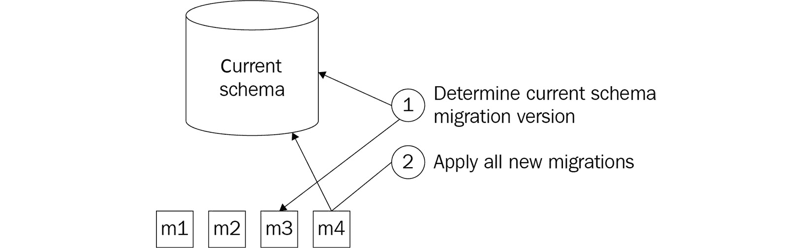
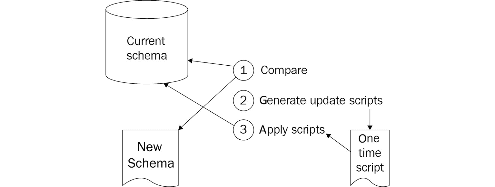

# 9

# 在 DevOps 场景中处理数据库

在前几章中，您了解了软件的持续集成和持续部署。您还学习了如何将相同的原则应用于基础设施配置的交付。一旦您采纳了这些原则并开始提高价值交付的流量，您可能会遇到另一个挑战：管理数据库模式的变化。

将 DevOps 应用于数据库可能感觉就像是在一辆行驶的汽车上更换轮胎。您必须找到一种方法，在数据库模式和应用程序代码之间协调变化，而不需要停机维护。

本章中，您将学习如何做到这一点：在避免停机的情况下管理数据库模式的变化。通过适当的规划和严格的管理，这可以以一种良好管理风险的方式实现。您将看到如何将数据库模式视为代码，并了解实现这一目标的不同方法。您还将看到一种完全避免数据库模式的方法，即采用无模式（schema-less）方式。

本章将涵盖以下主题：

+   将数据库模式作为代码进行管理

+   应用数据库模式变化

+   采用无模式方式

+   其他方法和关注点

# 技术要求

为了实践本章中提出的思想，您需要安装以下工具：

+   安装了 Entity Framework Core NuGet 包的应用程序

+   配备 SQL Server 数据工具的 Visual Studio

+   访问 Azure Pipelines

+   一个 Azure 订阅，用于访问 Cosmos DB

# 将数据库模式作为代码进行管理

如果您熟悉从应用程序代码操作关系型数据库，那么很可能您已经在使用 **对象关系映射器**（**ORM**）。

ORM 的引入是为了解决面向对象编程语言与关系型数据库模式（与表格一起工作）之间的阻抗不匹配。著名的例子有 Entity Framework 和 NHibernate。

ORM 提供了一层抽象，使得在存储和检索数据库中的对象时，无需关心底层的表结构。为了自动映射对象到表，或者反向操作，ORM 通常内建有用于描述数据库模式、对应对象模型及它们之间映射的标记语言功能。大多数情况下，这些内容无需手动编写。它们通常可以从对象模型或现有数据库生成，且它们之间的映射通常是通过约定生成或在可视化编辑器中绘制的。

尽管这些措施使当前的数据库架构可以作为代码进行定义，但仅此并不能帮助应对架构变化。要以代码处理架构变化，有两种常见的方式。第一种方法描述了每一次变化的代码；第二种方法则仅在代码中描述架构的最新版本。这两种方法分别被称为基于迁移和基于状态的方法。两者都可以依赖第三方工具将变更应用到数据库中。

## 迁移

第一种方法基于保持一组必须应用到数据库的有序变更。这些变更通常被称为**迁移**，它们可以通过如 Microsoft Entity Framework 或 Redgate SQL Change Automation 等工具生成，也可以手动编写。

工具可以根据当前数据库架构和源代码控制中新的架构定义的比较，自动生成迁移脚本。这被称为**脚手架搭建**。工具生成的脚本并不总是完美的，可以通过应用程序员的领域知识进行改进。一旦生成或编写了一个或多个新的迁移，它们可以通过选定的工具应用到数据库中。以下是一个展示该过程如何工作的图示：



图 9.1 – 迁移方法

在这里，我们看到一系列不断增长的迁移，从**m1**到**m4**，它们用于描述数据库的增量变化。为了将数据库更新到最新版本，首先确定最新应用的迁移，然后依次添加其后的所有迁移。

当手动编辑迁移脚本时，以下几点需要注意：

+   迁移脚本应该是有序的。迁移描述了需要执行的 SQL 语句，以便将数据库从版本*x*迁移到版本*x+1*。只有在完成当前步骤后，才能开始下一个迁移。

+   迁移脚本不仅应迁移架构，还应迁移数据。这可能意味着在迁移之间需要进行一些步骤。例如，将两个列移动到另一个表通常意味着首先创建新列，然后将旧列的数据填充到新列中，最后再移除旧列。

+   建议在迁移脚本中包含所有数据库对象。额外的索引和约束不仅要应用于生产数据库，还应应用于测试环境。通过迁移，已经有了从源代码控制传递这些变更的机制。将这些内容包含在相同的迁移脚本中，还能确保索引和约束按照相同的顺序应用，并且不会因仅存在于生产环境中而意外阻塞迁移。

+   如果可能，迁移脚本应该具有幂等性。如果出现问题或怀疑有问题，能够重新运行最后一次迁移是确保迁移已完全应用的好方法。

这种方法的一个缺点是生成和应用迁移时强制要求的严格顺序。这使得将这种方法集成到依赖于分支使用的开发工作流中变得困难。

在不同分支中创建的迁移，在稍后合并时可能会打乱迁移的顺序，或者更糟糕的是，合并了迁移路径的分裂。例如，假设在现有迁移*a*之后，在两个不同分支中分别创建了迁移*b*和*c*。这些迁移将如何合并？无论是顺序*a*, *b*, *c*，还是*a*, *c*, *b*，都不正确，因为*b*和*c*都是在*a*之后直接执行的。修复此错误的唯一方法是执行以下步骤：

1.  移除所有迁移，除了第一个新的迁移，在这种情况下是*c*。

1.  将所有其他迁移应用到尚未应用任何新迁移的数据库上，在这种情况下，如果*a*已经应用，则仅应用*b*，或者同时应用*a*和*b*。

1.  为其他迁移生成新的迁移，在这种情况下，*c*的替代迁移。

这种方法的一个优点是，每个单独的架构变更都会以相同的方式部署到数据库中。无论是否同时将一个或多个迁移应用到生产数据库，它们仍然会按可预测的顺序逐个执行，并以与它们在测试环境中执行时相同的方式运行，即使它们是在测试环境中逐个应用的。

## 最终状态

管理架构变更的另一种方法是，不跟踪单独的变更（或迁移），而仅存储架构的最新版本在源代码控制中。然后使用外部工具，如 Microsoft Visual Studio 和 Redgate 的 SQL Data Compare 工具，来比较源代码控制中的当前架构与数据库的实际架构，生成迁移脚本，并在运行时应用这些迁移脚本。迁移脚本不被存储，只能使用一次。

与编写迁移不同，手动执行此类任务是不可行的。虽然手动在源代码控制中跟踪架构的最新版本是可以管理的，但对于最终状态方法来说，这是不可行的。生成迁移脚本时，需要比较现有架构与新架构，并应用此迁移脚本，这只能通过工具来完成。适用的工具示例有 Redgate SQL Source Control 和 SQL Server Data Tools。以下图表展示了这些工具的工作原理：



图 9.2 – 管理架构变更

在这里，我们看到如何比较当前的实际数据库模式和期望的数据库模式的描述，以生成升级并直接应用一个脚本，从而进行必要的更改，使实际模式与期望的模式一致。

这种方法的一个优势是，生成的脚本不需要按特定顺序执行。因此，这种方法可以轻松地与广泛的分支模式结合使用，在这种模式中，更改随着时间的推移慢慢集成。此外，它还消除了在简单场景中手动编写迁移脚本的需求，例如添加或删除列、表或索引。

这种方法的缺点是，它使得处理需要数据操作的更改变得更加困难。再举个例子，假设需要将两列移到另一个表中。由于工具只执行新的模式，这样会导致数据丢失，如果没有进一步的干预。

为了规避这个问题，一个可能的干预方式是向模式包中添加部署前后脚本。在部署前脚本中，将当前数据暂存到临时表中。然后，在应用新模式后，数据将从临时表复制到部署后脚本中的新位置。

本节内容讲述了如何以一种可以存储在源代码管理中的格式管理数据库模式更改。下一节将讨论如何在部署时捕捉这些更改并应用到数据库。

# 应用数据库模式更改

在数据库模式和（可选的）在源代码管理中定义的一系列迁移准备好后，就可以开始考虑何时应用这些更改到数据库模式中。可以通过两种方法来实现。数据库模式更改可以在新应用版本部署之前应用，或者由应用程序代码本身进行。

## 作为发布的一部分进行升级

应用数据库更改的第一种方法是作为发布流水线的一部分。在这种情况下，负责读取和执行迁移脚本的工具是通过流水线中的一个步骤调用的。

这个调用可以通过 PowerShell 或其他脚本语言中的自定义脚本来完成。然而，这种方法容易出错，而且每次工具发生变化时，脚本可能需要更新。幸运的是，对于大多数基于迁移的工具，Azure Pipelines 任务已经准备好，可以直接从发布启动迁移。

例如，有一个 Azure Pipelines 扩展可用于直接从定义迁移的 `dll` 文件将 Entity Framework Core 迁移应用到数据库。可以将此任务添加到发布流水线中，以便在新应用代码部署之前更新数据库。在本章最后的*进一步阅读*部分提供了**构建与发布工具**扩展的链接。

另一种变体是将应用程序的构建阶段和发布阶段分开。在这种情况下，迁移脚本作为单独的构建产物导出，可以直接从源代码导出（如果是用 SQL 编写的），或者在执行生成必要 SQL 脚本的工具之后导出作为输出。然后，这个产物会在发布阶段再次下载，在该阶段，它通过 Azure Pipelines 任务来执行 SQL 并应用到数据库中。

## 与应用程序代码一起升级

不必从发布管道中应用模式更改，它们也可以由应用程序本身来应用。一些内建迁移支持的 ORM 具有自动检测数据库模式是否与最新迁移匹配的功能。如果不匹配，它们可以自动将数据库模式迁移到最新版本。

支持此功能的一个 ORM 示例是 Entity Framework。Entity Framework 的核心版本没有内建的自动迁移支持。在 Entity Framework Core 中，可以通过一行应用程序代码来启动一个适合应用程序的升级时机。执行该操作的代码如下所示：

```
using (var context = new MyContext(...))
{
    context.Database.Migrate();
}
```

这种方法的优点是启用非常简单。例如，在 Entity Framework 的配置中只需一个布尔开关就可以启用此工作流。然而，缺点是大多数支持此功能的 ORM 会对数据库施加全局锁——在迁移运行时会停止所有数据库事务。对于任何需要几秒钟以上时间的迁移或迁移集合，这种方法可能不切实际。

这种方法通常仅用于基于迁移的方法。使用最终状态方法的方式需要一个外部第三方工具，用来生成必要的迁移脚本并应用它们。这通常是在发布管道中完成的，而不是应用程序内部进行的。

## 添加一个过程

正如前一部分所说明的那样，考虑何时以及如何应用数据库模式的更改或使用该模式的应用程序（或多个应用程序）的更改非常重要。但是，无论模式更改和代码部署的部署计划如何，总会有一段时间，其中以下一种情况是成立的：

+   新的应用程序代码已经在运行，而模式更改尚未应用或正在应用过程中。

+   旧的应用程序代码仍然在运行，而模式更改已经应用或正在应用过程中。

+   在应用模式更改时，应用程序代码不会运行。

第三种情况是极其不理想的。这通常适用于所有情况，但在进行 DevOps 实践时尤为重要。如果更改频繁且在工作时间内发布，每次进行模式更改时都停机是不可接受的。

为了防止在应用架构变更时需要停机，必须满足以下条件之一：

+   架构变更向后兼容，使得旧版本的应用程序代码可以在架构变更已经应用或正在应用的数据库上无错误地运行。

+   新的应用程序代码向后兼容，可以同时在旧版本和新版本的架构下运行。

满足第一个条件确保在应用架构变更时，旧版应用程序代码可以继续运行。满足第二个条件确保新版本的应用程序代码可以首先部署，并且一旦完成部署，数据库可以在代码运行时进行升级。虽然这两种方法都可行，但通常希望优先实现第一个条件。原因在于，架构变更通常会支持应用程序代码的更改。

这意味着以下是一个安全的架构变更部署过程，无需停机：

1.  创建一个新的数据库。

1.  应用数据库更改。

1.  验证更改是否已正确应用，或者中止部署流程。

1.  部署新的应用程序代码。

重要的是要意识到，这一过程假设是“向前失败”。这意味着，如果架构变更的部署出现问题，应在继续进行代码更改之前解决这些问题。

最后，满足架构变更的向后兼容性条件有时可能无法完成。如果是这种情况，通常可以将更改拆分成两个部分更改，这两个部分合起来实现相同的最终结果，同时都符合向后兼容性条件。例如，重命名一个属性，或者将存储距离的单位从英尺改为米，可以按以下方式执行：

1.  生成一个迁移，将一个新列添加到数据库表中，存储以米为单位的距离。

1.  添加应用程序代码，该代码从旧列读取数据，但同时写入两个列。

1.  将这些更改部署到生产环境。

1.  添加一个新的迁移，将数据从旧列迁移到新列，适用于所有新列尚未填充但旧列已填充的情况。

1.  更新应用程序代码，仅读取和写入新列。

1.  将这些更改部署到生产环境。

1.  添加一个新的迁移，删除旧列。

使用正确的工具和适当的流程，可以有效且安全地执行架构变更的部署。在接下来的部分中，将介绍另一种使用无架构数据库的方法。

# 使用无架构方法

在前面的部分中，重点是关系数据库，其中对每个表都应用严格的模式。另一种完全不同的数据库模式管理方法是不使用数据库模式。这可以通过使用无模式或文档数据库来实现。一个著名的无模式数据库例子是 **Azure Cosmos DB**。这些数据库可以将不同形式的文档存储在同一个“表”中。这里的“表”是指这些数据库通常不使用“表”这个术语，而称其为数据库、容器或集合。

由于这些数据库可以在同一个集合中存储具有不同模式的文档，从数据库的角度来看，模式变化不再存在。但当然，随着时间的推移，应用程序代码中相应对象的结构会发生变化。要了解如何处理这一点，最好区分将对象存储到数据库和从数据库读取的操作。

## 写入对象到数据库

存储在无模式数据库中的文档通常是应用程序代码中对象的序列化。当使用关系数据库时，这些对象通常通过 ORM 存储，例如 Entity Framework、Dapper 或 NHibernate。当使用文档数据库时，这些对象通常会被序列化并存储到数据库中。序列化是将对象转换为字节流的过程，以便能够轻松保存或跨进程边界传输。反序列化是从字节流构建数据结构或对象的逆过程。这意味着代码对象定义的变化也会导致保存该对象时文档结构的变化。由于文档数据库的特性，这种方式完全适用。

作为示例，考虑以下 C# 类及其 JSON 表示。

这段代码使用了 `JsonConstructor` 特性来指示在反序列化过程中应该使用类的构造函数来创建类的实例：

```
public class Person
{
   [JsonConstructor] private Person() {}
   public Person(string name) {
      Name = name ?? throw new ArgumentNullException();
   }
```

以下代码显示了将 `Person` 类实例序列化为文档数据库后的 JSON 表示：

```
{
   "Name": "Mark Anderson"
}
```

在该代码在生产环境中运行一段时间后，成千上万的人得到了救助，出现了一个新需求。除了记录人的姓名外，还必须记录他们居住的城市。为此，`Person` 类扩展了一个新的属性。完成此更改并部署新代码后，每当保存一个人时，以下代码将被使用：

```
public class Person
{
   [JsonConstructor] private Person() {}
   public Person(string name, string city) { 
   Name = name ?? throw new ArgumentNullException();
   City = city ?? throw new ArgumentNullException();
   }
   [JsonProperty]
   public string Name { get; private set; } [JsonProperty]
   public string City { get; private set; }
}
```

`Person` 类的定义已发生变化；新实例的相应 JSON 表示如以下代码所示。两种文档变体可以保存在同一个集合中：

```
{
   "Name": "Mark Anderson",
   "City": "Amsterdam"
}
```

这表明，从写入信息到数据库的角度来看，无模式的方式非常方便，因为开发人员根本不需要考虑模式变更管理。

## 从数据库中读取对象

虽然无模式数据库使得将不同形式的文档轻松写入同一集合变得非常容易，但这在从该集合中读取文档并将其反序列化时可能会带来问题。实际上，模式管理的问题并没有被消除，而是推迟到了稍后的时间点。

继续上一节的示例，在新 C# `Person`类定义中反序列化第一个保存的人员时，城市属性将得到一个空值。这可能是意料之外的，因为 C#代码保证没有城市的人永远无法构造。这是无模式数据库所带来的挑战的一个明确示例。

在这个例子中，可以通过将`Person`类更新为以下形式来避免这个问题：

```
public class Person
{
   [JsonConstructor] 
   private Person() {}
   public Person(string name, string city) {
      Name = name ?? throw new ArgumentNullException(); 
      City = city ?? throw new ArgumentNullException();
   }
   [JsonProperty]
   public string Name { get; private set; }
   [JsonIgnore]
   private string _city;
   [JsonProperty] 
   public string City {
      get { return _city; }
      private set { _city = value ?? _city = string.Empty}
   }
}
```

除了这种添加属性的场景外，还有许多其他场景需要调整 C#类以处理反序列化场景。以下是一些示例：

+   添加原始类型的属性

+   添加一个复杂属性、另一个对象或数组

+   重命名一个属性

+   用复杂属性替换原始类型的属性

+   将可为空属性转换为非空属性

在对象中添加处理这些情况的代码会增加代码库的大小和复杂性，并使主代码库充斥着应对过去情形的能力。特别是当这种情况频繁发生时，可能会导致代码库中出现不必要的复杂性。为了防止这种情况，可以在每次对象模式更改时，按照以下流程进行处理：

1.  更改对象的模式，确保仅添加了属性。即使目标是删除属性，在这个阶段，也只是添加了具有新名称的属性。

1.  在对象中实现逻辑，以应对旧版本对象的反序列化。

1.  部署对象的新版本。

1.  启动一个后台进程，从数据库中逐一加载该类型的所有对象，并将它们保存回数据库。

1.  一旦后台进程处理完所有现有实体，就从代码库中删除负责应对反序列化期间模式变化的代码，以及任何不再使用的属性。

使用这种方法，所有更改将在一段时间内传播到对象的所有存储版本。此方法的缺点是对象结构的更改分布在两个必须分别部署的更改中。此外，第二次更改的部署必须等到数据库中的所有对象都已转换完成。

# 其他方法和注意事项

除了之前讨论的更常见的方法，以下提示和方法可能有助于减少处理数据库时的工作量，或帮助减少与数据库变更相关的风险。

## 最小化数据库的影响

处理数据库的第一步可以是减少需要进行数据库变更的可能性。在许多数据库中，可以编写存储过程——或者其他一些在数据库引擎中执行的代码或脚本。虽然存储过程带来了一些好处，但更改它们也可能算作数据库模式变更，或者至少会导致一些难以测试的变更。

一种简单的方法是将存储过程替换为应用程序代码，使用功能切换可以更轻松地进行并行变更。

## 完全并行部署

在高风险环境中，或与脆弱数据库一起工作时，还可以采取另一种数据库模式变更方法。此方法基于应用功能切换和蓝绿部署模式，步骤如下：

1.  修改应用程序代码，使其不仅将更新写入一个数据库，而是写入两个数据库。

1.  在生产环境中，创建现有数据库的完整副本，并配置应用程序代码将所有更改写入两个数据库。从现在开始，这两个数据库将分别称为*旧*数据库和*新*数据库。

1.  仅在写入新数据库的路径中引入所需的数据库模式和应用程序代码变更。

1.  在所有读取数据的代码路径中引入必要的变更，确保所有查询都同时在两个数据库中运行。

1.  更新应用程序代码，以检测新旧数据库之间查询结果的差异，并在发现任何不一致时记录错误。

1.  如果变更没有问题，删除旧数据库和应用程序代码中的旧读写访问路径。

1.  如果变更运行时出现错误，修复问题。然后，通过恢复预定新数据库的备份来重新启动，并从*第 5 步*继续。

这种方法的优点是非常轻量级。缺点是它涉及的工作量很大，需要很多努力，而且成本更高。此外，还应考虑额外的数据库费用以及备份和恢复操作的持续时间。

## 测试数据库变更

与应用程序代码一样，数据库模式变更的质量可以通过测试获得洞察。关于如何对数据库模式进行测试的链接可以在本章末尾找到。

在大多数情况下，为了充分覆盖数据库变更带来的风险，需要执行针对完整应用程序堆栈的系统测试。这种测试可以覆盖由错误模式、无效存储过程以及数据库和应用程序代码不匹配引起的大多数风险。

# 总结

在本章中，你已经学习了如何使用源代码控制来管理数据库模式及其变更。你了解了基于迁移的方法和基于状态的方法来存储变更，以及如何以安全的方式将它们应用到生产数据库中。

此外，您已经了解了无模式数据库如何减轻传统模式管理的负担。然而，这也意味着在从数据库中读取旧版本的对象时，必须应对模式差异的问题。

在下一章，您将学习关于持续测试的内容。您不仅会了解测试技术，还会了解在何时应用哪些技术，以及测试如何成为 DevOps 中至关重要的一部分，并且是持续向最终用户交付价值的关键推动力。

# 问题

在我们结束时，下面是一些问题供您测试自己对本章内容的理解。您可以在附录中的*评估*部分找到答案：

1.  判断题：使用 Entity Framework 时，模式管理是通过基于迁移的支持内置的。

1.  判断题：使用基于迁移的方法进行模式管理时，您不需要在数据库模式中添加额外的跟踪表。

1.  判断题：使用基于最终状态的方法进行模式管理时，您不需要在数据库模式中添加额外的跟踪表。

1.  完整并行的数据库模式变更方法有哪些好处？（选择多个答案）：

    1.  风险几乎降到零。

    1.  您可以在类似生产环境中衡量变更的实际性能影响。

    1.  并行迁移可以减少周期时间。

1.  判断题：无模式数据库完全消除了考虑模式变更的需要。

1.  您可以选择什么技术来限制变更对数据库模式的影响？

# 进一步阅读

+   有关 Entity Framework 和 Entity Framework 迁移的更多信息，请访问 [`docs.microsoft.com/nl-nl/ef/`](https://docs.microsoft.com/nl-nl/ef/) 和 [`docs.microsoft.com/en-us/ef/ef6/modeling/code-first/migrations/`](https://docs.microsoft.com/en-us/ef/ef6/modeling/code-first/migrations/)。

+   有关 Redgate 及其数据库工具的更多信息，请访问 [`www.red-gate.com/`](https://www.red-gate.com/)。

+   有关 SQL Server 数据工具的更多信息，请访问 [`docs.microsoft.com/en-us/sql/ssdt/download-sql-server-data-tools-ssdt?view=sql-server-ver15`](https://docs.microsoft.com/en-us/sql/ssdt/download-sql-server-data-tools-ssdt?view=sql-server-ver15)。

+   构建与发布工具 Azure DevOps 扩展：[`marketplace.visualstudio.com/items?itemName=bendayconsulting.build-task&ssr=false#overview`](https://marketplace.visualstudio.com/items?itemName=bendayconsulting.build-task&ssr=false#overview)。

+   使用 Redgate SQL Change Automation 和 Azure DevOps 部署数据库变更：[`azuredevopslabs.com/labs/vstsextend/redgate/`](https://azuredevopslabs.com/labs/vstsextend/redgate/)。
