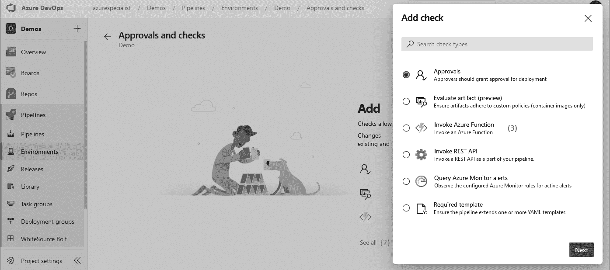

# 第十章：整合持续测试

在前面的章节中，你了解了不同的技术，这些技术有助于提高你将变更交付到生产环境的速度。如果你已经在日常工作中使用这些技术，你会很快发现，这只有在你的工作质量足够高时才可能实现。如果你的工作质量不够高，你将面临许多故障或问题，最终用户也不会满意。要取得成功，提高变更的速度和提高工作质量必须齐头并进。要评估并提高工作质量，你首先需要知道什么是质量。这就是测试的作用所在。测试是报告软件质量的学科。

为了引入测试的主题，本章将首先讨论如何衡量软件开发的质量。之后，将深入探讨功能测试的主题。在本章的进展过程中，我们将探讨不同的测试策略，以确定需要哪些类型的测试，以及每种测试应使用多少次。之后，我们将逐一讨论不同类型的测试。你将了解它们的工作原理、测试内容以及每种测试的优缺点。最后，最后一部分将重点讨论如何利用你的管道生成和收集的所有指标和测试结果，持续报告团队工作的质量，甚至防止质量不足的变更传播到用户。所有这些都将帮助你保持软件的高质量，并使你能够自信地快速频繁地交付软件。

本章将涵盖以下主题：

+   定义质量

+   理解测试类型

+   在管道中执行测试

+   维护质量

# 技术要求

要实验本章中描述的技术，你可能需要以下一项或多项：

+   一个具有构建和发布管道及仪表板访问权限的 Azure DevOps 项目

+   Visual Studio Code、Visual Studio 2019 或 Visual Studio 2022

+   Azure DevOps 的 Basic + 测试计划许可

+   一个 SonarCloud 订阅

所有这些都可以免费获得，或在有限的试用期内免费提供。

# 定义质量

*第一章*中讨论的 DevOps 思维模式的主要目标之一是增加价值流向最终用户。为了做到这一点，软件必须频繁部署，甚至可能一天多次部署。要使频繁部署成为可能，有两个重要因素：自动化和质量。自动化在前面的章节中已经讨论过了，因此现在是时候转向质量的主题了。

一旦自动构建和发布流水线就绪，且更改开始以越来越快的速度流向生产环境，就该开始衡量这些更改的质量了。更重要的是，这使我们能够中止质量不够高的更改。

实际上，什么构成足够的质量可能因项目而异。在创建游戏时，一些小错误可能对用户造成困扰，但不会造成其他影响。而在为飞机或医疗用途开发软件时，一个错误可能会危及生命。在软件开发中，较高的质量通常更昂贵且/或需要更多时间。因此，我们在交付功能的数量和能够保证的质量之间存在权衡。每个项目都有不同的最佳权衡点。

在质量得以衡量之前，首先要确定如何衡量软件的质量。监控软件质量的常见方法是收集一个或多个度量。例如，可以决定每周收集五个度量值。随着时间的推移，将这些度量值绘制成图表，可以深入了解软件质量如何变化。一个例子可能像这里显示的图表那样：


图 10.1 – 软件质量度量示例

接下来的部分讨论了几个度量示例。

## 质量度量

度量是捕捉某些内容的手段，这些内容通过数字来表示。在软件开发中，度量通常用于表示一个特定的质量方面，这个方面本身可能很难量化。例如，一段软件的质量可能很难单独描述。这一点对于质量变化的描述尤为明显。出于这个原因，我们通常会收集多个数字，综合来看它们能反映软件的质量。

需要意识到，度量是一个很好的工具，但应该谨慎使用。一方面，可能有比正在测量的度量值更多的因素影响软件的（感知）质量。另外，一旦人们知道某个特定的度量值被记录下来，他们可能会优化工作方式以提高或降低该度量值。虽然这可能在报告中显示出期望的数字，但并不一定意味着软件质量真正得到了改善。为了解决这个问题，通常会记录多个度量值。

一个广为人知的例子是在敏捷工作环境中使用故事点速度。记录团队的迭代速度，以观察其是否随着时间变得更加高效，这听起来很有效；然而，如果团队规模在每次迭代中都不同，那么这个度量可能就没什么用处，因为团队成员的出席情况会影响速度。此外，团队可以轻松地通过每次迭代时将所有估算值乘以一个随机数来伪造这个度量。尽管这样每次迭代的数字会增加，但它与团队的生产力增长并无关系。

进入到衡量软件质量的指标时，客观地衡量编写代码的质量可能会很困难。开发人员通常对什么构成*优质代码*有许多看法，讨论越多，团队越难达成共识；然而，当我们将注意力转向使用这些代码后产生的结果时，就更容易识别出可以帮助提供代码质量洞察的指标。

下面是一些例子：

+   **集成构建失败的百分比**：如果代码无法编译或无法通过自动化测试，这表明代码的质量不足。由于测试可以通过构建流水线在每次推送新变化时自动执行，它们是判断代码质量的绝佳工具。而且，由于它们可以在将变更部署到生产环境之前执行并收集结果，这些结果可以用来取消那些质量不足或可能影响某些系统功能的变更，从而在发布流水线的下一个阶段前阻止这些问题。这种方式保证了只有质量足够的变更才会传递到下一个阶段。

+   **自动化测试覆盖的代码百分比**：如果大部分代码都通过单元测试进行测试，这将提高软件的质量。

+   **变更失败率**：这是指部署新版本代码后导致问题的百分比。一个例子是应用程序的新版本部署后，Web 服务器内存耗尽的情况。

+   **计划外工作的数量**：在任何一段时间内必须执行的计划外工作的数量是衡量质量的一个重要指标。如果团队正在创建一个同时在运行的 SaaS 产品，那么就会有时间花费在运营职责上。这通常被称为计划外工作。计划外工作的数量可以反映计划工作质量的情况。如果计划外工作的数量增加，可能是因为质量下降了。计划外工作的例子包括现场故障事件、跟进警报、热修复和补丁。

+   **用户报告的缺陷数量**：如果用户报告的错误数量增加，这可能是质量下降的迹象。通常，这是一种滞后性指标，一旦这个数字开始上升，质量可能已经在一段时间内下滑了。当然，这个数字增加可能有很多其他原因，比如新的操作系统，用户数量的增加，或用户期望的变化。

+   **已知问题的数量**：即使发现或报告的新缺陷很少，如果缺陷从未被修复，并且已知问题的数量一直在缓慢增加，那么软件的质量将随着时间的推移而逐渐下降。

+   **技术债务的量**：技术债务是一个术语，用来描述为短期利益（例如快速交付代码）而牺牲代码质量的后果。技术债务将在下一节中详细讨论。

测试是一项活动，旨在发现并报告软件的质量。测试结果（对质量的洞察）可以用来决定是否允许或取消某个更改进入下一个发布阶段。

在下一部分，将探讨质量的另一个维度：代码库中的技术债务量。

## 技术债务

技术债务是一个术语，用来描述为追求其他目标而牺牲代码质量所带来的未来成本。例如，为了加快新特性的交付，开发者可能选择快速扩展现有类并添加一些新方法。如果由此产生的类不符合面向对象设计原则，或者变得过于庞大，那么这个类可能会变得难以理解、维护或以后进行更改。术语*债务*意味着某种东西（时间、质量、注意力或工作）在解决方案中仍然欠缺。只要这笔债务没有偿还，你就必须支付“利息”，即所有其他工作的进度都会稍微放慢。

技术债务有许多形式，以下是一些示例：

+   没有任何单元测试覆盖的代码，其中对该代码的实现进行更改时无法使用原始测试来验证

+   没有以自解释的方式编写的代码，即没有使用有意义的变量和方法名称

+   不遵循编码原则的代码，例如 KISS、YAGNI、DRY 和/或 SOLID

+   类因为变量和方法太多而变得过于复杂

+   方法因为语句太多（尤其是流程控制语句）而变得过于复杂

+   在应用程序的不同部分之间存在循环依赖的类或命名空间

+   不遵循应用程序架构设计的类

技术债务有许多形式，监督所有这些形式可能会让人感到艰难。因此，市面上有很多工具可以自动衡量代码库中的技术债务并报告它。处理这些问题的工具将在*维护质量*一节中讨论。

虽然技术债务通常被认为是一件坏事，但有时故意制造技术债务也可能有正当理由。就像常规债务一样，管理债务的规模并确保能够支付利息并偿还债务是非常重要的。

公司在初创阶段通常会承担技术债务，这往往是为了快速创建一个可用的解决方案而做出的有意识决定。虽然这个初始版本用于验证商业提案并吸引资金，但开发者可以通过重新实现或重构（部分）应用程序来偿还这笔债务。

另一个原因可能是市场机会或已提前几个月计划的重要商业事件。为了按时交付并满足截止日期，承担一定的技术债务可能是值得的。

然而，如果从未偿还债务，而只是随着时间推移不断增加更多债务，这也会增加隐喻上的利息，每次开发者需要进行更改时都需要支付。结果是，任何更改都将比上一次花费更多时间。如果这种情况开始发生，最终会不可避免地出现某个时候任何更改都不再值得进行，因为成本总是大于收益。在这一点上，项目或产品就失败了。

在谈论测试时，理解存在哪些类型的测试是非常重要的。下一节将深入探讨这个话题。

# 理解测试类型

在传统的软件开发中，测试通常在*开发完成*、*应用程序被声明为开发完成*、*功能集被冻结*或类似的情况下执行。在宣布开发完成后进行测试，通常会进入一个长时间的测试与修复 bug 往返周期。结果通常是，在上线后仍然发现许多 bug。

向左移动（Shifting left）是一个测试原则，指的是应该在开发过程的早期进行自动化测试。如果将与软件开发相关的所有活动绘制成从初始到发布的时间线，那么向左移动意味着将自动化测试活动更靠近初始阶段。

为了做到这一点，已经认识到许多不同类型的测试——例如单元测试、集成测试和系统测试。不同的来源可能会建议不同类型的测试，但这些是一些比较知名的类型。不管测试的具体名称是什么，从高度抽象的层面来看，它们通常被分为以下两类：

+   **功能测试**：功能测试用于测试应用程序是否实际实现了所需的功能。

+   **非功能测试**：非功能测试用于验证应用程序的其他期望属性是否得以实现，并确保没有出现不期望的属性。

这些类型进一步细分为更小的子类别，如下图所示：


图 10.2 – 理解测试类型

接下来的三节内容简要回顾了不同类型的功能性测试和非功能性测试。这是为了便于后续讨论在不同情况下选择哪种测试类型以及项目可能需要多少种测试。

## 自动化功能测试的类型

在谈论自动化功能测试时，三种最常用的类型是单元测试、集成测试和系统测试。这些测试类型可以从多个维度进行比较：创建测试所需的时间、执行测试所需的时间以及它们测试的范围：

+   **单元测试**：单元测试是最快编写的，它们的执行速度非常快，通常在不到一毫秒的时间内完成。它们测试的是应用程序中最小的范围，通常是单个类或方法。这意味着，一旦编写完成，几乎不需要更改单元测试。对于许多系统来说，更有可能的是测试会被删除，而不是被修改。

+   **集成测试**：集成测试需要更多的时间来编写，因为它们涉及多个必须设置以便协同工作的单元。这些测试的执行仍然应该很快，通常从不到一秒到几十秒不等。集成测试的测试范围更大，这意味着，作为回报，它们将覆盖更多的代码部分，更有可能检测到因更改而引入的缺陷。

+   **系统测试**：系统测试测试的是一个完全组装并正在运行的应用程序。根据应用程序的类型，这些通常是 API 测试或自动化 UI 测试。由于这些测试依赖于已部署的系统运行，并且通常需要在数据库或其他持久存储中设置初始状态，所以创建这些测试需要大量时间。它们的执行时间很长，有时每个测试需要几分钟。与单元测试和集成测试相比，系统测试的可靠性较差且更脆弱。即使是接口的小改动，也可能导致一系列测试失败。另一方面，系统测试能够检测到单元测试和集成测试无法检测的错误，因为它们实际测试的是正在运行的系统。

重要说明

请注意，测试中拥有较大测试范围既有优点也有缺点。优点是它可以检测到许多错误。缺点是，当测试范围非常大时，测试失败只提供有限的关于错误发生原因的信息。此类测试失败通常需要比小范围测试失败更多的调查。

以下部分将更详细地探讨每种测试类型。

### 单元测试

单元测试用于测试单个单元的独立性。在面向对象编程语言中，这通常意味着为应用程序中的每个类编写一个测试类。为了实现完全的测试覆盖，测试类将为对应应用程序类的每个公共方法编写一个或多个测试。

单元测试应该运行得非常快——平均来说，应该在几毫秒内完成。为了实现这一点，每个类都是在没有其依赖项的情况下实例化的。这是通过使用接口来实现的，类依赖接口，而不是直接依赖其他类。在测试中，依赖项会被模拟类替代，如下图所示。左侧显示的是运行时配置，右侧显示的是测试期间的配置：


图 10.3 – 接口测试

一个模拟类实现相同的接口，但默认没有任何行为。可以根据每个测试设置特定的行为。模拟还可以用于验证是否调用了依赖项上的某些操作或函数。举个例子，以下是一个 C#类：

```
public class WorkDivider
{
   private readonly IMessageSender _messageSender;
   public WorkDivider(IMessageSender messageSender)
   {
      _messageSender = messageSender;
   }
   public void DivideWork(IEnumerable<WorkOrder> workOrders)
   {
      foreach(var workOrder in workOrders)
      {
         _messageSender.SendMessage(workOrder.GetMessage());
      }
   }
}
```

要在自动化测试中实例化此类，需要实现`IMessageSender`接口。为了绕过这个依赖，可以使用像 Moq 这样的模拟框架来测试`WorkDivider`，如下所示。在这些示例中，**NUnit**作为测试框架：

```
[TestFixture]
public class WorkDividerTest
{
   private Mock<IMessageSender> _messageSender; 
   private WorkDivider _subject;
   [SetUp]
   public void SetUp()
   {
      _messageSender = new Mock<IMessageSender>();
      _subject = new WorkDivider(_messageSender.Object);
   }
   [Test] 
   public void
WhenSendingAnEnumerableOfWorkingOrders_EverOrderIsSendToTheMessageSender()
   {
      var workOrder = new WorkOrder();
      _subject.DivideWork(new[] { workOrder });
      _messageSender.Verify(x => x.SendMessage(workOrder), Times.Once);
   }
}
```

这意味着无法为与其他系统（如数据库、缓存或消息队列）交互的类编写单元测试。为了确保这不会使覆盖应用程序的大部分部分变得不可能，通常的做法是将与其他系统的集成隔离在单独的类中。这些类包含与远程系统的交互，但不包含业务逻辑，并且尽可能少的代码。然后，接受这些类不包含在单元测试中的事实。通常用于实现这一点的设计模式有外观模式（Facade）、适配器模式（Adapter）和仓库模式（Repository）。

提示

本章末尾附有更详细的关于编写单元测试和如何模拟类的指南链接。

单元测试应该能够在每个开发者克隆应用程序代码库的计算机上运行。它们不应要求在本地计算机上进行任何特殊配置或设置，并且应随时可以运行。这样，所有与代码库合作的人员都可以在本地计算机上运行单元测试。因此，开发者在推送更改到中央代码库之前，应该在自己的计算机上运行所有单元测试，这是一个很好的实践。

除了本地验证步骤，单元测试还应该成为持续集成构建的一部分。稍后你将学习如何在*管道中执行测试*的部分完成这一过程。只要拉取请求中有失败的单元测试，就最好不要将更改合并到主分支。这甚至可以通过使用 Git 仓库分支策略来实现，正如在*第四章*中讨论的，*一切从源代码管理开始*。

在下一节中，自动化功能测试的讨论将继续进行，重点是集成测试。

### 集成测试

集成测试用于验证一组组件是否能正确地协同工作。这些测试有两个目的：

+   增加应用程序中未被单元测试覆盖的部分的测试覆盖率，例如与其他系统交互的类。

+   解决单元测试未覆盖的风险，并在各个组件与其他系统交互时，减少风险以验证正确的预期结果。

理解可能存在的集成风险可能比较困难。通常假设如果各个部分或组件按其规格工作，那么整个解决方案也必定能正常运作。然而，事实并非总是如此，很多问题在单元集成后才显现出来。为了更好地理解这个风险，假设有两个组件共同负责气候控制。一个组件通过摄氏度来测量温度，另一个则基于温度做出反应，期待输入的是华氏度。很快就会发现，尽管这两个组件按预期工作，交换数字并根据这些数字采取行动，但它们的组合并不会产生预期的结果。

集成测试，尤其是那些与其他系统交互的测试，将不仅比单元测试运行得更慢，而且通常需要更多的设置或配置。这甚至可能包括用户名、密码或证书等机密信息。为处理此类配置，可以在测试旁边创建一个设置文件，并在执行测试之前从中加载设置。每个开发人员可以创建自己的该文件副本，并使用自己的配置运行测试。

继续使用上一节的示例，假设实现了`IMessageSender`接口的`MessageSender`类需要一个连接字符串来执行工作。`MessageSender`的测试类可能如下所示：

```
[TestFixture]
public class MessageSenderTest
{
   private MessageSender _messageSender;
   [SetUp]
   public void SetUp()
   {
      var connectionString = TestContext.Parameters["MessageSenderConnectionString"];
      _messageSender = new MessageSender(connectionString);
   }
}
```

`connectionString`，用于构建`MessageSender`类，来自`TestContext`上的`Parameters`对象。这是可用的`.runsettings`文件。具体方法可能会因测试框架而异。一个示例的`.runsettings`文件如下所示：

```
<?xml version="1.0" encoding="utf-8"?>
<RunSettings>
 <TestRunParameters>
 <Parameter name="MessageSenderConnectionString" value="secret-value" />
 </TestRunParameters>
</RunSettings>
```

将设置移到单独的文件中，确保机密信息不会被提交到源代码控制中。在*在流水线中执行测试*一节中，你将学习如何为在流水线中运行测试构建`.runsettings`文件。

这是因为，如果可能的话，集成测试也应该是持续集成构建的一部分。然而，这也存在一个风险，那就是可能会使持续集成构建变得过于缓慢。为了解决这个问题，可以实施以下解决方案之一：

+   集成测试在与持续集成构建并行触发的单独构建中执行。通过这种方式，持续集成构建的时长保持较低，同时集成测试仍然会被持续执行，开发人员能够快速获得反馈。

+   集成测试会在管道的后期执行，接近软件发布时执行——例如，在部署到测试环境之前或之后。

第一种方法的缺点是，以这种方式执行集成测试意味着测试将不再作为质量门控，在代码合并到主分支之前进行检查。当然，它们仍会继续作为质量报告机制工作。这意味着，虽然错误可能已经合并，但它们会被构建过程检测并报告。

第二种方法没有这种风险，因为执行测试仍然是从源代码管理到生产的管道的一部分；然而，在这种方法中，测试的执行可能会推迟到稍后的时间点，前提是并非每个构建都至少进入了部分发布管道。这意味着缺陷可能会稍后显现，从而延长了检测和修复问题之间的时间。

无论采取哪种方法，失败的集成测试将不再阻止合并更改，因此你必须找到另一种方式，确保开发人员会负责修复导致测试失败的缺陷。

这些权衡在系统测试中尤为明显，系统测试通常需要很长时间，因此无法将它们作为持续集成构建的一部分。

### 系统测试

第三种也是最后一种自动化功能测试类型是系统测试。这些测试是针对一个完全组装并正在运行的应用程序进行的。系统测试有两种类型，取决于应用程序的类型：API 测试或 UI 测试。系统测试可能需要很长时间来执行，而且常常有复杂的测试数据设置，导致测试时间超过一分钟。

提示

你可能会遇到一种叫做编码 UI 测试的东西。这是一个现在已经被废弃的微软解决方案，用于编写 UI 测试。这些测试可以从 Azure Pipelines 中执行。幸运的是，有许多替代方案，详见微软在[`devblogs.microsoft.com/devops/changes-to-coded-ui-test-in-visual-studio-2019`](https://devblogs.microsoft.com/devops/changes-to-coded-ui-test-in-visual-studio-2019)中发布的弃用通知。

系统测试是在正在运行的应用程序上执行的，这意味着在运行之前需要进行配置和设置。应用程序需要在受控环境中运行，并且所有与数据存储的集成都需要完全正常运行。与其他系统的集成要么需要正常运行，要么需要用替代的模拟工具进行替换，以确保所有与这些系统集成的操作能够正常运行。

这些条件使得开发人员在本地机器上执行这些测试的可能性较低，特别是在他们修改应用程序时。只有在创建新测试或更改测试时，他们才可能执行这些测试。然而，即使在这种情况下，他们执行的测试可能并非针对本地运行的应用程序版本，而是针对已经部署到测试环境中的版本。这不一定是好事，但在大多数团队中往往是现实情况。

重要提示

创建 API 或 UI 测试的介绍不幸超出了本书的范围。市场上有许多产品可供选择，最佳的使用产品因项目而异。

在作为管道一部分执行系统测试时，它们通常是在代码至少部署到一个环境后进行的。这通常是测试环境。这意味着系统测试是从源代码更改到生产部署的关键路径的一部分。如果这个路径过长，它们也可以被移出管道。然后，它们按照计划运行——例如，每晚运行一次。就像集成测试一样，这加快了管道的速度，但也失去了将系统测试作为质量门的机会。

系统测试，特别是 UI 测试，通常是脆弱的，在进行微小更改后可能会停止工作。因此，建议将这些测试的数量保持在最低限度；然而，需记住，这些测试可以捕捉到特定错误，如配置错误、其他运行时错误、数据库与应用程序的不匹配或创建错误状态的操作序列。

除了自动化功能测试，还有手动功能测试，这在许多 DevOps 项目中具有价值。将在下一节讨论，但首先介绍一下不稳定的测试。

### 不稳定的测试

不稳定的测试是指在代码或配置没有明显变化的情况下失败，或者代码在本地机器上运行正常，但在持续集成时失败。经过多次重试后，测试最终会通过。

不稳定的测试是可靠性差的，会对构建质量信心产生负面影响。解决不稳定测试问题的一种方法是将这些测试静默处理，以便持续集成和发布不失败，同时将不可靠的测试结果从自动化测试报告中排除。

## 手动功能测试的类型

虽然自动化测试是一个快速且频繁获取开发反馈的好工具，但仍有一些内容需要手动测试。虽然自动化重复性测试是持续监控质量的最佳方式，但某些事情仍需要人工检查。

手动测试是向左 shift 的临界点。每当任何类型的测试或验证被 shift 到左侧时，意味着它是在执行手动测试之前进行的。这样做的好处是，这些自动化活动增加了我们对被测试版本的信心，提升了该版本也能通过手动测试的可能性。换句话说，当手动测试开始时，应该很不可能再发现任何新问题。

有两种类型的手动测试：

+   脚本化测试

+   探索性测试

这两种测试类型将在接下来的部分中讨论。

### 脚本化测试

脚本化测试是一种用于在确保全面覆盖所有相关测试用例的同时，最小化测试执行时间的技术。通过将测试分为两个不同的阶段：测试准备和测试执行，来实现这一目标。测试准备与待测试功能的开发并行进行，甚至在开发开始之前就已完成。在测试准备阶段，功能被分析并识别出正式的测试用例。

一旦必须执行的测试用例被识别出来，就会编写手动测试脚本，描述在后续测试执行阶段每个要执行的步骤。这些脚本的编写方式使得它们易于跟随，并且没有任何疑问或困惑的空间。它们的编写方式还确保执行步骤的数量尽可能少。虽然这可能需要更多的准备时间，但所有这些都是为了确保在测试执行过程中花费的时间尽可能少。

测试分析及如何识别测试用例的深入讨论超出了本书的范围。虽然你负责创建测试用例，但 Azure DevOps 会在这方面提供支持。通过使用测试计划服务，你可以创建测试计划并记录其中的测试用例，以便日后快速执行。

要创建新的测试计划，请执行以下步骤：

1.  打开 Azure **测试计划**菜单。


图 10.4 – Azure DevOps 测试计划菜单

1.  在此菜单中，点击**测试计划**。这里将展示你当前所有测试计划的概览。

1.  点击**新建测试计划**按钮开始创建新的测试计划。这将打开一个新的对话框，如下所示：


图 10.5 – Azure DevOps 新测试计划

1.  给测试计划命名一个有意义的名字，例如，能说明测试计划目的的名称。

1.  将测试计划链接到正确的产品区域路径。

1.  选择与此测试相关的正确迭代或冲刺。

1.  点击**创建**以完成测试计划的创建。这将自动打开此测试计划，如下所示：


图 10.6 – Azure DevOps 测试套件

一个测试计划可以拆分为多个测试套件，而测试套件又可以拆分为子测试套件。从本质上讲，测试套件对于测试就像文件夹对于文件一样。通过点击测试套件上悬停时出现的省略号按钮，可以管理测试套件。这在前面的截图中有展示。

创建测试计划后，就该添加一个或多个测试用例到计划中。为此，请确保测试套件的**定义**选项卡已打开，然后点击**新建测试用例**按钮。一个新的弹出窗口将打开。


图 10.7 – Azure DevOps 新建测试用例

在这里，可以定义测试步骤和预期结果。要定义一个新的测试用例，请执行以下步骤：

1.  为测试用例输入标题。

1.  在对话框中，输入一个或多个操作步骤和预期结果，以详细描述测试用例。

1.  一旦测试用例完全描述，点击**保存并关闭**按钮以保存测试用例并返回到上一个屏幕，在那里你可以管理测试套件。

一旦准备工作完成，功能准备好进行测试，所有测试就会执行。由于所有测试都有详细脚本，这可以快速而高效地完成。甚至可能有开发人员、业务分析师或其他部门的人员参与测试执行。这意味着测试执行本身将非常快速。

要开始执行测试套件或计划，请执行以下步骤：

1.  导航到**执行**选项卡。


图 10.8 – Azure DevOps 执行测试用例

1.  选择一个或多个测试用例。

1.  选择右上角的一个运行选项。

选择针对网页应用程序运行测试时，会打开一个带有*测试运行器*的新浏览器窗口。此测试运行器可以用来逐个执行所有测试用例，对于每个测试用例，依次执行所有步骤，跟踪所有成功和错误，如下所示：


图 10.9 – Azure DevOps 测试用例步骤

每个测试步骤后的勾选标记或叉号可用于跟踪每个步骤的结果。如果某个步骤标记为不正确，可以添加一个带缺陷的评论。要将测试用例标记为通过或标记，可以使用右上角的蓝色下拉菜单。选择测试结果后，运行器会自动继续执行下一个测试。一旦所有测试执行完毕，可以使用左上角的**保存并关闭**按钮保存结果。

要查看测试运行的结果，导航到**测试计划**，然后点击**运行**以获取以下仪表盘：


图 10.10 – Azure DevOps 测试运行

在这里，你可以选择你想查看结果的运行，以快速概览测试结果。在第二个标签**测试结果**中，可以查看所有测试用例的列表以及它们是否通过。

拥有详细脚本的一个主要好处是，可以多次执行相同的测试，从而降低每次执行的成本。如果一个测试计划执行多次，所有的运行历史记录都会被保存，并且可以通过前述截图中显示的视图访问。这对于将手动测试作为回归测试的一部分非常有用；然而，一旦情况变成这样，通常通过系统测试来自动化这些测试会更为有益，尤其是在可能的情况下。

提示

可以多次执行相同的测试，但针对不同的配置。当开发 Web 应用程序时，通常会使用不同的浏览器进行测试。对于桌面应用程序，这可能会用于测试不同的操作系统。关于配置的工作，微软文档中有详细说明，参见[`docs.microsoft.com/en-us/azure/devops/test/mtm/test-configurations-specifying-test-platforms?view=azure-devops`](https://docs.microsoft.com/en-us/azure/devops/test/mtm/test-configurations-specifying-test-platforms?view=azure-devops)。

下一部分将讨论功能测试的最终形式，即探索性测试。

### 探索性测试

编写和执行详细的测试脚本可能会花费大量时间，既对测试工程师，也对测试执行者，因此这些测试通常会被自动化。一旦它们被自动化，就会归类为系统测试，特别是自动化 UI 测试。

这并不意味着手动测试完全没有价值或没有好的投资回报。有些东西是人眼能发现的，而计算机不能，例如不友好的用户界面、未对齐的界面元素，以及未完全显示但被其他元素遮挡的文本行或图像。

为了在不花费大量时间编写详细测试脚本的情况下捕捉这些错误，探索性测试可能是一个解决方案。在这种方法中，测试人员打开应用程序并开始调查他们认为在即将发布的版本中包含最大风险的应用程序部分。在探索应用程序的过程中，测试人员会记录他们访问了哪些应用程序部分，以及执行了哪些测试用例。与此同时，测试人员还会跟踪他们发现的新的风险或尚未执行的测试用例。通过这样做，他们在工作时创建了一个已覆盖和未覆盖的测试用例列表。这也使测试人员能够始终集中关注最重要的风险和测试用例。探索性测试完成后，测试人员可以报告哪些应用程序领域和测试用例已经覆盖，哪些没有，哪些风险完全没有被探索过。这份报告对产品经理来说可能是一个宝贵的输入，帮助他们决定是否继续发布。

一个常见的误解是，探索性测试意味着测试人员只是随便点击，以查看应用程序是否正常工作。事实并非如此，前面的段落已经说明，探索性测试是一项高度结构化的活动，且需要实践。如果操作得当，测试准备和测试执行将在探索性测试过程中交织进行。

当时间有限或可用的测试时间无法提前确定时，探索性测试是一项很好的工具。探索性测试可能会发现需要记录为缺陷的问题。接下来将讨论如何进行记录。

### 报告手动测试结果

测试的一项活动还包括报告发现的缺陷或其他问题。这通常是繁琐且耗时的工作。你必须尝试重新现现该问题，回忆问题是如何发生的，并记录下所有这些步骤。然后，还需要描述期望的和不期望的结果，拍摄截图，并将所有内容插入到缺陷追踪或工作管理工具中，例如 Azure DevOps。

为了简化这一过程，Azure DevOps 提供了一个**Test & Feedback**扩展。该扩展提供了按钮来录制截图或视频，并用文本或图形进行注释。一旦发现问题并通过录制或截图进行记录，它可以自动提交到 Azure Boards。

这个扩展可以免费从 Azure DevOps 市场下载，并可以在 Firefox、Chrome 和 Edge Chromium 中运行。该扩展的链接将在本章末尾提供。

重要说明

**Test & Feedback** 扩展可以在执行脚本化测试和进行探索性测试时使用。

这就结束了对不同类型功能测试的讨论。接下来的部分将帮助你决定在项目中使用哪种类型的测试。

## 决定需要哪些类型功能测试的策略

面对如此多不同类型的测试，哪种测试最适合你的项目？鉴于测试类型繁多且各自特性不同，答案正如你所料：它们的组合，因为它们各自有不同的特性。

以下图表显示了不同类型测试执行所需时间与它们提供的软件质量信心之间的关系。图表显示，尽管成功完成的手动测试最有可能识别缺陷，但它们也需要最长的执行时间。对于自动化测试，执行数万次单元测试所需的时间通常可以保持在几分钟内，而进行 10 到 100 次系统测试可能需要超过 30 分钟：


图 10.11 – 质量信心与测试执行时间的关系

从这个权衡来看，通常可以理解为什么单元测试比集成测试更受青睐，集成测试比系统测试更受青睐，任何类型的手动测试都优于自动化单元测试。

提示

如果单元测试和集成测试的质量提高，那么这条线将进一步攀升到左上角。高质量的软件架构也有助于减少系统和集成测试的需求，并增加早期发现缺陷的机会，这正是单元测试的优势。自动化的单元测试和集成测试运行更快，结果一致，对整体构建质量产生积极影响。

对这种权衡的理解有助于理解两种可以用于决定测试策略的模型，即测试金字塔和测试奖杯，这将在接下来的两个部分中进行讨论。

### 测试金字塔

在许多旧项目中，自动化功能测试的数量并不多。通常，这些测试运行缓慢，测试范围大，难以维护，并且经常失败而没有明确的原因。这些测试所提供的价值通常非常有限。为了弥补缺乏良好的自动化测试，通常会有许多手动测试被用来在新版本部署之前进行完整的回归测试。这些自动化测试非常耗时，且很少执行。开发人员无法得到快速反馈，缺陷通常在较晚阶段被发现。在这种情况下，很难实践 DevOps，因为 DevOps 的重点是频繁且高频率地发布新版本。

这样的测试组通常被称为“冰淇淋锥形测试”，其中包括许多手动测试和少量自动化测试，而其中只有少数是单元测试。冰淇淋锥形测试是一种反模式，但在旧项目和/或长期运行的项目中经常出现。


图 10.12 – 手动与自动化测试的测试金字塔

为了应对这一点，引入了另一个相反的模型：测试金字塔。这个模型主张拥有许多单元测试，可以在几分钟内提供关于应用程序质量的反馈，快速指出大部分错误。在此基础上，还可以叠加其他类型的较慢测试，以捕获前面层次无法捕获的错误。使用这种方法，可以在测试覆盖率和测试持续时间之间取得良好的折衷。

重要提示

请注意，测试金字塔并不主张分层方法。不要先构建一层单元测试，然后只有在所有单元测试完成后才进行集成测试。相反，它主张比例。你应该在单元测试、集成测试和系统测试之间保持健康的比例。

在不同类型测试之间找到最佳比例的一般建议非常困难。但在大多数项目中，金字塔中每个步骤的比例为 1:5-15 可能是合理的。

### 测试奖杯

尽管测试金字塔是一个广为人知且经常使用的分类测试和决定创建哪些类型测试的方法，但这种方法也受到了批评。虽然远离手动和系统测试在 DevOps 团队中被广泛接受是必要的，但并不是所有人都接受单元测试的重点。一些人反对测试金字塔暗示创建的单元测试数量比集成测试多得多。

这一反对意见的原因如下：

+   在*单元测试*部分的 `WorkDivider` 中，我们可以看到它依赖于了解 `DivideWork` 方法的实现方式。测试验证了实际的实现：对 `SendMessage()` 的调用。许多单元测试具有这种特点，因此增加许多单元测试会增加更改解决方案类级设计实现所需的工作量。

+   **单元测试的变动率通常比集成测试高**。单元测试类与它们测试的类密切相关。这意味着如果测试的类被替换，该类的单元测试也会失去所有的价值。因此，有人认为集成测试可能会有更高的投资回报率。

+   **真正的价值来自于组件集成，而不是单个组件**。即使所有单元都在隔离状态下工作，系统可能也不会提供任何价值。软件的真正价值只有在集成并准备运行时才会体现出来。由于测试应该确认价值交付，有人认为应该专注于编写集成测试而不是单元测试。

为了应对这些反对意见，*Kent C. Dodds* 提出了测试奖杯模型。该模型采用了测试金字塔的理念，提倡尽可能少使用手动和系统测试，但与之不同的是，它并不强调单元测试高于集成测试，而是强调集成测试优于单元测试。测试奖杯这一名称来源于如果将其绘制出来，它将呈现出类似奖杯的形状。

不幸的是，世上没有灵丹妙药，最好的建议是了解这三种模型及其背后的推理，并将适当的推理应用于当前的情况。在测试方面，并没有一种适用于所有情况的最佳解决方案。

## 非功能性测试的类型

功能测试主要关注验证应用程序展示的行为是否符合预期；然而，在应用程序开发中存在更多的风险：应用程序是否能足够快速地执行操作，随着更多用户同时使用系统时性能是否会下降，系统是否易于最终用户使用。验证这些属性的测试被称为非功能性测试。

有许多类型的非功能性测试，其中在 DevOps 场景中重要的三种如下：

+   性能测试

+   负载测试

+   可用性测试

让我们逐一来看。

### 性能测试

性能测试的执行是为了确定在给定一组资源的情况下，应用程序执行某个操作的速度。性能测试通常使用专门的工具执行，并在完全组装的系统上运行。如果用于自动化 API 或 UI 测试的工具记录了测试的持续时间，那么这些测试的持续时间也可以作为性能结果使用。

为了比较多次测试的结果，确保影响性能的所有因素在测试之间保持一致是非常重要的。测试对象和测试运行者的虚拟机设置应该保持一致。应用程序配置应保持不变，集成点应该尽可能处于相同的状态——例如，不是重复使用同一个数据库，而是在每次性能测试前从备份中恢复相同的数据库。这样可以确保结果具有可比性。

虽然性能测试和负载测试常常混淆，但它们是两种不同类型的测试。

### 负载测试

负载测试的目的是测量系统在崩溃前能够承受的负载量。这类测试有时也被称为压力测试。与性能测试不同，负载测试会并行执行大量请求。测量的是所有请求的平均性能，同时逐步增加系统的请求数量。在大多数情况下，这会确定一个临界点，即每秒请求数达到某个特定值时，性能会突然下降。这是系统最大能承载的每秒请求数。执行负载测试时，随着最大请求数量的增加，通常会得到如下图所示的图表：


图 10.13 – 负载测试图表示例

该图表显示了了解应用程序临界点的重要性：过多的负载可能会因为响应时间突然变化而意外地让系统崩溃。知道这个临界点在哪里可以让操作人员在生产环境中到达此点之前采取措施。

本章末尾提供了一个链接，指向一个在线的 Microsoft 实验室，供开发人员练习负载测试。

Azure 现在提供完全托管的负载测试服务。Azure 负载测试服务目前处于公开预览阶段，允许你通过模拟高规模负载流量来进行应用程序负载测试。开发人员、测试人员和**质量保证**（**QA**）工程师可以使用该服务来识别和修复应用程序的性能、可扩展性或容量问题。Azure 负载测试抽象了执行大规模负载测试所需的复杂性和基础设施。你可以在这里了解更多关于 Azure 负载测试服务的信息：[`azure.microsoft.com/en-us/services/load-testing/`](https://azure.microsoft.com/en-us/services/load-testing/)。

### 可用性测试

另一种重要的测试类型是可用性测试。其他类型的测试侧重于验证实现是否具备产品团队所期望的行为，而可用性测试则侧重于验证用户的期望是否真正得到满足。这意味着测试范围更大，这些测试能够识别笨拙的用户界面，并帮助找到模糊不清的文本或被误解的用户请求。

可用性测试通过让用户在一个或多个任务上与最终应用程序进行互动，并观察或询问他们如何与应用程序互动来进行。结果通常比*通过*或*未通过*更加详细，结果通常会反馈给产品负责人，以便编写新的用户故事或更改需求。

启用可用性测试的一个极好技术是使用功能标志。功能标志使我们能够逐步将新功能暴露给更多用户。这个能力还可以用于最初仅将新功能暴露给一小部分用户，这些用户是可用性研究的一部分。这允许研究人员或产品负责人密切观察这些用户使用新功能，而其他用户尚无法访问。

重要提示

功能标志在*第六章*《实现持续部署和发布管理》中被讨论，作为渐进式曝光的策略。新功能的渐进式曝光本身就是一种可用性或用户接受度测试。

这种方法可以扩展到执行 A/B 测试。在这类测试中，一半的用户暴露于新功能，而另一半则没有。然后收集所有用户的数据，以查看新功能是否为用户带来了预期的好处——例如，用户是否每天使用应用程序的时间增加了。这一主题将在*第十三章*《收集用户反馈》中进一步探讨，内容涉及如何收集用户反馈。

这样做将可用性测试推向了发布过程的右侧。它也可以通过在最终应用程序之前，使用原型进行可用性测试，向左移动。

这就结束了对不同类型测试的讨论。在接下来的部分中，将使用度量和测试来自动衡量质量并实现质量门控。

# 在管道中执行测试

开发人员应该在为代码打开合并请求之前，在本地机器上执行测试。这样，他们可以确信所做的任何更改不会破坏代码的先前行为。从理论上讲，这可以保证所有合并到主分支的代码都能编译并且所有测试都通过。实际上，存在许多原因导致情况并非如此。以下是一些原因：

+   一些测试可能无法在本地运行。它们依赖于机密的配置值，或者被配置为在完全配置的系统上运行。这两种情况常见于系统测试。有许多情况是无法从本地系统运行系统测试的。这些情况并不一定都是理想的或无法克服的——但这通常是事实。

+   开发人员也是人。他们可能会忘记在做最后一个调整后运行本地机器上的测试，或者确信他们的更改没有破坏任何现有行为。特别是在压力下交付错误修复时，为了加快速度，跳过测试执行可能是很有诱惑力的。

为了防止这些情况使未经过充分测试的代码在流水线中传播，建议在流水线内执行所有测试。接下来的部分将展示如何为单元测试、集成测试以及通过其他系统运行的测试执行此操作。首先是单元测试。

## 运行单元测试

对于许多语言，Azure DevOps 已经内建了支持从流水线运行单元测试的功能。可以为 C#、TypeScript、Python、Maven、C++、Go 等语言执行单元测试。

对于其中一些语言，提供了一个现成的任务。例如，用 C#编写的测试。在执行.NET 测试时——例如在 C#中——测试结果会自动以 XML 格式存储，构建代理可以理解该格式。

这允许流水线代理解释测试结果并在构建结果中可视化它们，如下所示：


图 10.14 – 显示自动化测试执行结果的构建结果页面示例

对于某些语言，需要执行多个任务。例如，用 TypeScript 编写的测试通常通过 NPM 命令执行。以下 YAML 片段可以用来实现这一点：

```
- task: Npm@0
  displayName: 'Run unit tests - npm run tests' 
  inputs:
    cwd: src 
    command: run 
    arguments: test
```

这将执行`package.json`中指定的自定义 NPM 命令。不幸的是，这不会以流水线代理理解的格式存储测试结果。为了将结果转换为正确的格式，需要另一个任务。以下 YAML 片段可以用来实现这一点：

```
- task: PublishTestResults@2 
  displayName: 'Publish Test Results' 
  inputs:
    testResultsFiles: '**\reportTests\TEST-*.xml' mergeTestResults: true
  condition: succeededOrFailed()
```

测试结果是否可以直接获得或需要转换，因编程语言而异。除了发布测试结果外，还建议收集测试覆盖率结果。

### 记录单元测试代码覆盖率

最佳实践是，在构建过程中不仅运行所有单元测试，还要确定在这些测试中执行的代码基础的百分比。这被称为**单元测试代码覆盖率**，它表示测试的全面程度。构建也可以配置为发布单元测试获得的代码覆盖率。

要配置构建以发布.NET Core 单元测试的测试覆盖率，必须执行以下步骤：

1.  在单元测试项目中安装`coverlet.msbuild` NuGet 包。

1.  使用.NET Core 任务执行测试，并添加两个参数以生成覆盖率报告，`/p:CollectCoverage=true`和`/p:CoverletOutputFormat=cobertura`。


图 10.15 – 配置单元测试代码覆盖率

1.  添加`Cobertura`。

1.  配置`$(System.DefaultWorkingDirectory)/**/coverage.cobertura.xml`作为汇总文件。


图 10.16 – 发布单元测试代码覆盖率

1.  构建的运行详情现在将包含代码覆盖率报告。

这是生成详细代码覆盖率报告所需的所有配置。生成的报告包含已覆盖和未覆盖的代码块数量以及计算出的覆盖率百分比。这些报告是构建结果页面的一部分。

除了单元测试，集成测试也可以作为管道的一部分运行，并且它们通常面临处理配置设置管理的挑战。

## 运行集成测试

集成测试通常与单元测试使用相同的框架编写。不过，它们有自己独特的挑战。通常，它们需要一个或多个设置，指定如何与测试中涉及的一个或多个其他组件进行集成。回顾之前讨论的`MessageSender`类的集成测试，这是这个问题的一个例子。

记得这个测试有一个`.runsettings`文件，在其中你应该指定`connectionString`，该连接字符串是`MessageSender`类将使用的队列。这个`connectionString`设置不能提交到源代码控制中。相反，可以将占位符提交到源代码控制中，并在管道执行过程中用实际的密钥替换它。

在这种情况下，这意味着以下`pipeline.runsettings`文件将提交到源代码控制中：

```
<?xml version="1.0" encoding="utf-8"?>
<RunSettings>
  <TestRunParameters>
    <Parameter name="MessageSenderConnectionString" value="#{MessageSenderConnectionString}#" />
 </TestRunParameters>
</RunSettings>
```

在开始实际测试执行之前，另一个任务将被运行，用实际值替换占位符。正如在*第五章*《迁移到持续集成》中讨论的那样，这些值可以从变量组、密钥保管库或管道变量中安全地获取。Azure DevOps 有多个扩展可以用于将占位符替换为实际值。以下 YAML 代码片段是如何操作的示例：

```
- task: qetza.replacetokens.replacetokens-task.replacetokens@3 
  displayName: 'Replace tokens in pipeline.runsettings' 
  inputs:
    targetFiles: $(System.DefaultWorkingDirectory)/integrationtests- location/pipeline.runsettings
```

在替换令牌任务执行后，可以像单元测试一样调用测试运行器。这个**Replace Tokens**扩展可以在 Azure DevOps Marketplace 上找到：[`marketplace.visualstudio.com/items?itemName=qetza.replacetokens`](https://marketplace.visualstudio.com/items?itemName=qetza.replacetokens)。

## 运行外部测试

除了单元测试和集成测试，你可能还希望使用其他系统执行测试。例如，Azure DevOps 没有内置的支持来执行负载测试或自动化 UI 测试。对于这些类型的测试，必须从管道中调用其他系统。许多系统可以通过这种方式集成。

如何操作因系统而异，但大多数情况下，以下步骤将适用：

1.  配置外部系统中的测试。

1.  为 Azure DevOps 安装一个扩展，使新任务能够从管道调用外部系统。

1.  创建到外部系统的服务连接。

1.  将任务添加到管道中。

要了解配置集成的详细信息，一个好的起点通常是第三方产品供应商的网站。

# 维护质量

前面的章节详细介绍了可以用来描述应用程序质量的各种测试和指标。有了这些考虑，接下来是时候开始思考可以用于维持高质量甚至提高质量的工具了。

## 代码审查

保护代码质量的最强大工具之一就是代码审查。当使用 Git 时，必须执行拉取请求（pull request）将开发者的更改合并回主分支。拉取请求允许一个或多个开发者审查所有更改并对此进行评论。发起拉取请求的开发者可以查看评论并据此进行修改，在继续工作的同时提高更改的质量。

为了使代码审查发挥最大作用，重要的是不要将其视为一个必须尽量轻松通过的关卡。采取一种更为开放的态度，假设每个人都在努力编写高质量的代码，并将代码审查视为有关代码质量的讨论的开始，这样会更加有益。改变视角，把代码审查从软件开发中令人烦恼的仪式转变为一个欢迎他人对你的代码提出意见并帮助你编写更高质量代码的机会。

一旦有了这样的心态，代码审查将成为学习的源泉。它们将促使同行之间展开讨论，寻找解决问题的最佳方式：不仅仅是现在的最佳方法，还要考虑未来，不留下技术债务，并确保与要合并的代码一起有足够的单元测试和集成测试。代码审查也是辅导初级开发者的绝佳工具，允许他们获得对其工作的反馈。让初级开发者审查高级开发者的代码甚至更有价值。通过这种方式，他们可以提出自己尚未掌握的问题，并且通常会指出那些可能随着时间推移成为技术债务的过于复杂的解决方案。

## 自动收集质量指标

除了手动审查外，还有许多工具可以自动评估代码库的质量。有些工具内置于 Azure Pipelines 中，但更复杂的功能来自于独立的代码扫描工具。通过数学方法来衡量技术债务，使用工具来进行此类衡量不仅能为应用的质量提供有价值的洞察，还能帮助了解代码随时间变化的情况。

衡量应用程序质量的一种可能工具是 SonarCloud。SonarCloud 是基于 SonarCube 的 SaaS 产品。此工具可以自动扫描代码库，查找潜在的漏洞、安全风险、技术债务和其他质量指标。这是一个付费的独立产品，能够与 Azure DevOps 管道集成。要使用 SonarCloud，你必须创建一个帐户并获取项目密钥，以便从 Azure DevOps 调用 SonarCloud 扫描。

为了调用 SonarCloud，使用一组三项任务，这些任务是 Azure DevOps 扩展的一部分。在安装扩展并配置 SonarCloud 服务连接后，三个任务会被添加到管道中，以设置分析、执行分析并（可选地）在质量下降时使构建失败。第一个任务是唯一需要配置的任务，配置过程如以下截图所示：


图 10.17 – 配置 SonarCloud – 静态代码分析器

每次执行的构建都会自动扫描其代码，由 SonarCloud 提供关于质量的详细报告。在这些报告的基础上，还会生成一个仪表盘，快速概览一些关键的质量指标。


图 10.18 – SonarCloud 质量指标概览

这是仪表盘的另一个视图，展示了质量指标：


图 10.19 – SonarCloud 质量门控仪表盘

代码扫描工具可以用于报告代码的质量，同时也可以作为质量门控，阻止合并更改或将更改部署到特定环境中，如果检测到质量不足。

## 可视化质量

持续衡量应用程序的质量是没有意义的，除非采取了相应的措施。仪表盘可以成为一个强大的工具，帮助持续洞察当前的质量水平以及质量随时间的变化。

大多数代码质量工具都内置了报告选项，它们对 QA 工程师非常有价值。它们提供了详细的洞察，帮助了解应用程序哪些部分的质量较高，哪些类型的问题最近发生得更频繁。

这种类型的仪表盘的缺点是，它们通常很难阅读和关联，因为它们可能存在于与开发人员执行大部分工作所在的 Azure DevOps 不同的其他工具中。因此，创建 Azure DevOps 中的仪表盘来报告质量可能会更有益。以下截图展示了这样的仪表盘示例：


图 10.20 – Azure DevOps 仪表盘质量概览

该仪表盘显示了当前质量和应用程序代码的概览，以及一些最近的历史记录。在这里，你可以找到以下信息：

+   在顶部显示最近更改的数量，以及最新的 SonarCloud **质量 gate** 结果，当前显示为 **通过**。该项目中两次不同构建的结果显示在第二行。

+   第三行和第四行显示项目中所有构建和发布的聚合结果。使用符号表示构建和发布的状态：成功、失败或仍在运行。

+   在右侧，使用两个小部件显示过去 10 个构建中的失败测试的百分比和相应的失败测试数量。

+   每个环境下最新发布运行的结果显示在下方。

可以使用内置小部件或扩展根据团队或项目创建这样的仪表板。Azure DevOps 市场中有许多扩展。例如，在前面的仪表板中，使用了 **Team Project Health** 扩展。此扩展可在 Azure DevOps 上找到：[`marketplace.visualstudio.com/items?itemName=ms-devlabs.TeamProjectHealth`](https://marketplace.visualstudio.com/items?itemName=ms-devlabs.TeamProjectHealth)。

Azure DevOps 仪表板可以配置为每 5 分钟自动刷新，从而也能作为墙板使用。

## 质量 gates

衡量、报告甚至可视化质量是重要且有价值的；然而，如果没有人基于这些指标采取行动，那么对开发团队来说这些指标就没有价值。为了防止这种情况，可以引入自动质量 gates 或检查。

实现质量 gates 的一种方法是，当测试失败、测试覆盖率过低或代码扫描工具设定的阈值不再满足时，使持续集成构建失败。这些都是之前讨论过的内容。另一个强制执行标准的选项是向管道中添加 gates 或检查点。通过这种方式，必须满足某些条件，管道才能继续执行。

如何实现这一点在经典发布和 YAML 多阶段管道之间有所不同。

### 经典发布

另一个选项是使用 Azure 发布管道中的 *gates*。在这里，可以指定一个或多个条件，必须满足这些条件才能允许将发布部署到特定环境中。gates 还可以是扩展的一部分，例如之前讨论过的 SonarCloud 扩展。

可以通过选择发布管道中的任何阶段并编辑预部署条件来添加 gates。启用 gates 后，可以添加一个或多个 gates。以下是发布管道的截图，展示了如何禁止将任何质量不合格的构建部署到环境中：


图 10.21 – Azure DevOps 配置部署 gates

部署审批和 gates 的使用并不相互排斥，因此可以同时使用两者。

### 多阶段管道

Gates（如在经典发布中可用）也可以在多阶段的 YAML 流水线中使用。在 YAML 流水线中，还有另一种机制：检查。检查被配置为在允许流水线继续之前自动验证一个或多个条件是否满足。检查可以添加到在某个阶段使用的资源上。如果在某个阶段的一个或多个资源上发现一个或多个检查，则所有检查必须通过，流水线才可以继续到该阶段。检查可以添加到环境和服务连接中。

要向环境添加检查，请导航到该环境。


图 10.22 – 配置 Azure DevOps 环境

现在，执行以下步骤：

1.  在右上角，展开菜单并选择**审批和检查**。

1.  在打开的新视图中，点击**查看所有**以查看所有可用的检查类型。

1.  选择**调用 Azure 函数**：



图 10.23 – 配置 Azure DevOps 环境审批和检查

1.  在弹出的窗口中，配置要调用的 Azure 函数。至少需要提供函数的 URL 和密钥。

1.  点击**创建**。

一旦检查创建完成，每个目标环境的部署任务（参见*第六章*，*实施持续部署和发布管理*）都必须通过此检查。当被调用的函数返回成功响应代码时，检查通过。

支持以下类型的检查：

+   **评估工件**：验证容器镜像类型的工件是否通过了自定义策略。这些策略是使用一种名为*Rego*的语言定义的。

+   **调用 REST API**：将流水线的详细信息发布到 Azure 函数或 REST API，以执行自定义逻辑。如果 API 返回成功的 HTTP 状态码，则允许流水线继续。

+   **调用 Azure 函数**：与**调用 REST API**检查相同，但具有一些 Azure 函数的默认设置。

+   **查询 Azure Monitor 警报**：仅在指定的警报处于非活动状态时才继续。

+   **必需的模板**：仅当当前的 YAML 流水线扩展了一个或多个配置的基础 YAML 模板时，才允许流水线继续。

检查可以是确保满足一个或多个条件后再允许流水线继续的强大机制。

# 总结

在这一章中，你学习了如何衡量和验证软件开发过程的质量。快速和频繁发布要求所编写的软件具有高质量。需要进行测试，以确保你编写的软件质量高，技术债务少。你了解了不同类型的测试，以及自动化和手动测试的优缺点。最后，你还学习了如何通过代码审查和工具帮助保持项目的高质量，通过报告质量并作为质量门控。

通过这些知识，你现在了解了测试和测试类型，帮助你决定哪些测试是应用程序所需的，哪些风险可以通过哪种测试来解决，以及哪些是你需要的，哪些可以省略。你现在还能够设置和配置代码扫描工具，确保低质量的更改不会合并到主分支。

在下一章，你将学习关于安全性和合规性这两个话题，它们在实践 DevOps 时同样重要。

# 问题

在我们总结时，这里有一份问题清单，供你测试自己对本章内容的理解。你将在*附录*的*评估*部分找到答案：

1.  判断对错：单元测试验证的是单个单元的独立工作情况。

1.  判断对错：集成测试验证的是一个完全组装的系统的工作情况。

1.  以下关于测试金字塔原则的说法哪个是正确的？

    1.  有很多集成测试，较少的单元测试，甚至更少的系统测试

    1.  有很多单元测试，较少的集成测试，甚至更少的系统测试

    1.  有很多系统测试，较少的集成测试，有很多单元测试

1.  以下哪个不是非功能性测试类型？

    1.  负载测试

    1.  可用性测试

    1.  适用性测试

    1.  性能测试

1.  测试是关于深入了解工作质量的。可以采用哪些技术来防止低质量的工作传播到生产环境？

# 自我练习

+   打开我们之前在*第六章*《实施持续部署与发布管理，练习部分》中创建的`packtbookslibrary-api`解决方案，并添加一个新项目（选择**NUnit 测试项目**）。


图 10.24 – 自我练习 – 添加新测试项目

+   创建一个新测试项目。


图 10.25 – 自我练习 – 创建新测试项目

+   一旦创建了测试项目，在**依赖项**中添加对`packtbookslibrary-api`的引用。


图 10.26 – 自我练习 – 配置依赖关系

+   添加一个`IBookService.cs`接口和实现该接口的`BookService.cs`类。


图 10.27 – 自我练习 – 添加 `IBookService.cs` 接口

+   `IBookService.cs` 将有如下代码：

    ```
    using packtbookslibrary.Shared.Models;
    using System.Text.Json;
    namespace packtbookslibrary_api.Services
    {
        public interface IBookService
        {
            List<Book> GetBooksList();
        }
    }
    ```

+   `BookService.cs` 将有如下实现：

    ```
    using packtbookslibrary.Shared.Models;
    using System.Text.Json;
    namespace packtbookslibrary_api.Services
    {
        public class BookService : IBookService
        {
            List<Book> IBookService.GetBooksList()
            {
                List<Book> books = new List<Book>();
                string jsonString = System.IO.File.ReadAllText("books-data.json");
                books = JsonSerializer.Deserialize<List<Book>>(jsonString);
                return books;
            }
        }
    }
    ```

+   将以下代码添加到 `BooksController.cs` 中：

    ```
          private readonly IBookService bookService;
            List<Book> books = new List<Book>();
            public BooksController(IBookService bookService)
            {
                this.bookService = bookService;
                books = bookService.GetBooksList();
                //string jsonString = System.IO.File.ReadAllText("books-data.json");
                //books = JsonSerializer.Deserialize<List<Book>>(jsonString); 
            }
            // GET: api/<BooksController>
            [HttpGet]
            public IEnumerable<Book> Get()
            {
                return books;
     }
    ```

+   添加 `Moq` 包引用：


图 10.28 – 自我练习 – 添加包引用

+   从 `BooksControllerUnitTest` 中添加代码并在管道中执行单元测试。你可以在这里找到文件：[`github.com/PacktPublishing/Designing-and-Implementing-Microsoft-DevOps-Solutions-AZ-400-Exam-Guide`](https://github.com/PacktPublishing/Designing-and-Implementing-Microsoft-DevOps-Solutions-AZ-400-Exam-Guide)

你会注意到所有的测试用例都已成功通过。


图 10.29 – 自我练习 – 执行 BookControllerUnitTest

+   更新 `nugget.config` 以添加 `Sources` 包：

    ```
    <?xml version="1.0" encoding="utf-8"?>
    <configuration>
        <packageSources>
            <add key="nuget.org" value="https://api.nuget.org/v3/index.json" />
             <!-- add an Azure Artifacts feed -->
               <add key="PacktBooksLibraryFeed" value="https://pkgs.dev.azure.com/aurigadev/PacktBookLibrary/_packaging/PacktBooksLibraryFeed/nuget/v3/index.json" />
        </packageSources>
    </configuration>
    ```

+   向 YAML 管道中添加测试用例步骤，以便在构建过程中执行测试用例：

    ```
    # Run your tests
       task: DotNetCoreCLI@2
       displayName: 'Run Tests'
      inputs:
      command: test
      projects: '**/*Tests/*.csproj'
      arguments: '--configuration ${{ parameters.buildConfiguration }}'
    ```

+   执行 **main-ci-pipeline** 以运行管道，并检查 **Test** 选项卡查看测试执行结果。


图 10.30 – 自我练习 – 执行持续集成管道以查看测试结果

# 进一步阅读

+   关于测试奖杯模型的更多信息可以在 [`testingjavascript.com/`](https://testingjavascript.com/) 和 [`kentcdodds.com/blog/write-tests/`](https://kentcdodds.com/blog/write-tests/) 上找到。

+   关于使用 C# 编写测试的更多信息可以在 [`docs.microsoft.com/en-us/visualstudio/test/walkthrough-creating-and-running-unit-tests-for-managed-code?view=vs-2022`](https://docs.microsoft.com/en-us/visualstudio/test/walkthrough-creating-and-running-unit-tests-for-managed-code?view=vs-2022) 和 [`docs.microsoft.com/en-us/dotnet/core/testing/unit-testing-best-practices`](https://docs.microsoft.com/en-us/dotnet/core/testing/unit-testing-best-practices) 上找到。

+   关于 Test & Feedback 扩展的更多信息可以在 [`marketplace.visualstudio.com/items?itemName=ms.vss-exploratorytesting-web`](https://marketplace.visualstudio.com/items?itemName=ms.vss-exploratorytesting-web) 上找到。

+   可以在 [`docs.microsoft.com/en-us/learn/modules/load-test-web-app-azure-devops/`](https://docs.microsoft.com/en-us/learn/modules/load-test-web-app-azure-devops/) 和 [`docs.microsoft.com/en-us/learn/modules/run-non-functional-tests-azure-pipelines/index`](https://docs.microsoft.com/en-us/learn/modules/run-non-functional-tests-azure-pipelines/index) 上找到用于练习负载测试的实用实验室。

+   练习自动化 UI 测试的实用实验可以在[`docs.microsoft.com/en-us/learn/modules/run-functional-tests-azure-pipelines/index`](https://docs.microsoft.com/en-us/learn/modules/run-functional-tests-azure-pipelines/index)找到。

+   关于 SonarCloud 的更多信息可以在[`sonarcloud.io`](https://sonarcloud.io)找到。

+   团队项目健康扩展可以在[`marketplace.visualstudio.com/items?itemName=ms-devlabs.TeamProjectHealth`](https://marketplace.visualstudio.com/items?itemName=ms-devlabs.TeamProjectHealth)找到。

+   关于 Rego 的更多信息可以在[`www.openpolicyagent.org/docs/latest/policy-language/`](https://www.openpolicyagent.org/docs/latest/policy-language/)找到。
