# 管理安全性和合规性

确保你的应用程序执行所需功能同样重要的是，确保它不做任何不该做的事情。在上一章中，你了解了质量和测试，目的是不断衡量你的应用程序是否在按预期工作。在本章中，你将学习如何防止任何不必要的行为。这涉及到安全性和合规性问题。虽然通过更快的部署和缩短交付周期可以增加向最终用户提供的价值流，但你仍然需要确保交付的是安全和合规的软件。在本章中，你将学习如何在你的 DevOps 流程中解决这些问题。

为此，本章将从讨论速度与安全之间的感知权衡开始，并解释如何在拥抱 DevOps 时，安全性不会降低，反而可能会增加。接下来，讨论安全性的一个特定维度：如何安全地处理你的管道和应用程序所需的秘密，如密钥和密码。之后，介绍用于自动识别应用程序代码和依赖项中可能存在的安全风险的代码扫描工具。本章最后讨论如何保持你的基础设施和配置部署的合规性，以及如何使用 Azure 安全中心（现称为 Microsoft Defender for Cloud）检测运行时安全风险和威胁。

本章将涵盖以下主题：

+   将 DevOps 原则应用于安全性和合规性

+   处理秘密

+   检测应用程序代码漏洞

+   与依赖项一起工作

+   确保基础设施合规性

+   监控和检测运行时安全风险和威胁

+   你可以使用的其他工具

# 技术要求

为了实验本章中描述的技术，你需要以下一种或多种工具：

+   拥有访问构建和发布管道权限的 Azure DevOps 项目，并有权安装扩展

+   一个 Azure 订阅（若你尚未拥有账户，可前往 [`portal.azure.com`](https://portal.azure.com) 并按照指南进行注册）

+   安装了 Azure Az PowerShell 模块的 PowerShell（如何安装 PowerShell Azure 模块的说明可以在 [`docs.microsoft.com/en-us/powershell/azure/install-az-ps?view=azps-7.3.0`](https://docs.microsoft.com/en-us/powershell/azure/install-az-ps?view=azps-7.3.0) 查阅）

+   可选的 WhiteSource Bolt、SonarCloud 或类似产品的订阅

上述所有内容都可以免费或试用，以便学习或评估用途。

# 将 DevOps 原则应用于安全性和合规性

关于安全性和合规性的担忧，可能是公司不愿接受完全的 DevOps 思维方式的原因之一，因为这会妨碍它们频繁发布的能力。在过去，它们通常会减少发布频率，每次发布前都会进行安全或渗透测试。这给了它们信心，确保不会发布包含安全漏洞的软件。

这种减少发布频率、在最终发布之前进行一次大规模的安全测试的做法与 DevOps 的思维方式相冲突，这也是一些公司面临的难题。它们在寻找确保每次发布都能为用户提供业务价值的方法，但又不愿在此过程中妥协安全性。问题是，这样的取舍是否公平。难道不能在保证速度的同时保持安全性吗？或许实际上更频繁和更快速的发布，结合严格的自动化，反而能帮助提高软件开发中的安全性？为了回答这个问题，我们可以先探讨在非 DevOps 环境中安全性通常是如何实践的，并了解在采用 DevOps 时需要做出哪些改变。

## 将开发人员和安全工程师聚集在一起

在许多公司中，安全工程师与开发人员属于不同的部门。这样分开的思路是认为将编写代码的人（即开发人员）与检查代码的人分开会更加有利。

过去，软件开发人员与软件测试人员之间也常常存在相同的分隔。然而，最近的研究表明，将开发人员和测试人员放得更近并不会导致诸如“群体思维”、仅测试已知正常工作的内容，或通过仅为已知测试用例开发来作弊测试等不良行为。经验和研究表明，事实恰恰相反。将开发人员和测试人员放在一起可以产生更高质量的产品。正因如此，像敏捷开发这样的运动建议开发团队在开发过程中加入包括测试在内的各项纪律。

正是基于这一思路，越来越多的人呼吁将安全工程整合进 DevOps 开发团队。这一运动通常被称为*DevSecOps*或*强固的 DevOps*。这两种运动都主张，运用 DevOps 原则，如向左推进（shift left）并尽可能自动化，可以帮助提高安全性。它们提倡，渗透测试或应用程序的漏洞审查不再由人工完成，而是完全自动化，并成为交付管道的一部分。这使得自动化、快速反馈循环以及持续交付和部署成为可能。

还有人提倡，更频繁地发布软件也有助于进一步提高安全性，原因如下：

+   当可用的自动化软件发布机制可靠时，任何解决安全风险的更改都可以迅速部署。能够快速响应新的发现是一个重大的安全改进。

+   速度本身也可以是一种安全措施。如果系统的工作状态每天变化多次，那么要弄清楚其内部工作原理并加以滥用就变得更加困难。应用不可变部署原则并使用基础设施即代码确保运行应用程序的基础设施经常得到刷新。这是有效减缓高级持续性威胁的良好措施。

本章将探讨的一个内容是如何配置交付管道以加入安全扫描。请注意，从管道中运行这些工具是一项不同的任务，它确保这些工具被正确配置并且应用正确的政策和要求。对于这些活动，拥有安全背景并与安全工程师密切合作仍然至关重要。这只是另一个密切合作能够带来变化的领域。特别是在安全问题上，需要与其他学科的协作——以自动化所有安全检查并避免（或最小化）任何手动验证过程。

## 安全问题

本章其余部分将介绍一些安全问题，但认识到一些前面的章节已经介绍了一些安全问题会有所帮助。正如你从软件开发中已经知道的，安全不仅仅是你在某一个地方添加的东西。安全应该无处不在。以下图表显示了与软件创建和交付相关的不同活动。在每个活动旁边，显示了适用的安全问题：

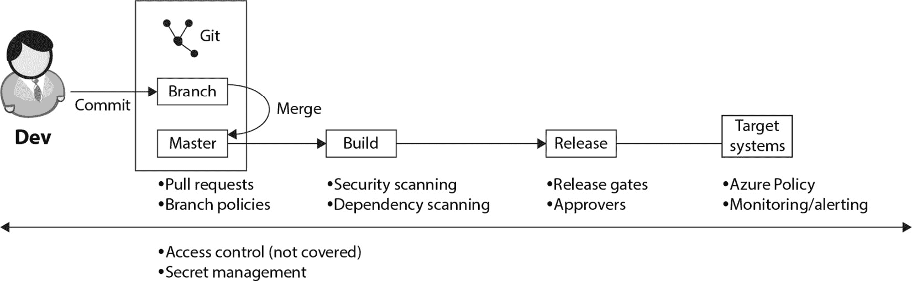

图 11.1 – 软件开发活动与安全问题

让我们回顾一下这些阶段中的安全问题：

+   **分支-主分支合并**：在这个阶段，通过拉取请求应用四眼原则。拉取请求允许其他工程师在合并到主分支之前审查更改。分支策略用于强制要求使用拉取请求，确保代码能够编译并且单元测试能够运行。这在*第四章*《一切从源代码管理开始》和*第五章*《迁移到持续集成》中已有讨论。

+   **构建**：在这个阶段，通过向构建管道添加额外任务，执行所有源代码和第三方依赖的安全扫描。这可以防止安全风险在未经检查的情况下传播。我们将在本章的《处理机密》部分讨论如何做到这一点。

+   **发布**：在发布过程中，可以配置批准人。批准人是指必须在部署到特定阶段之前提供批准的用户。此外，使用自动化发布门控确保（并进一步强制执行）在发布可以继续之前满足某些标准。我们在 *第六章*，*实施持续部署和发布管理* 中讨论了如何做到这一点。

+   **部署环境（目标系统）**：所有应用程序都会在目标环境中运行。可以是本地部署；然而，本书重点介绍的是 Azure。对于运行时的安全性和合规性问题，本章将介绍 Azure Policy 和 Microsoft Defender for Cloud（前身为 Azure Security Center）。

+   **横向影响**：前述所有要点只有在 Azure DevOps 环境中有足够的访问控制时才有用。尽管这不在本书的范围之内，但它是一个重要的角度。用户应该拥有足够的权限来完成他们的工作，但不应能够对政策、构建和部署过程做出未经授权的更改。此外，在整个交付过程中，需要进行适当的机密管理，以确保证书、密钥和密码等机密的安全。我们如何做到这一点，本章也会进行讨论。

现在，了解了软件和安全工程师如何协作开发应用程序，接下来是时候在以下各节中讨论这项工作的不同方面了。下一节将讨论如何处理机密。

# 与机密一起工作

一个重要的安全元素是机密的处理。在部署应用程序时，总是涉及到机密。尤其是在部署到云端时——即通过互联网——以安全的方式处理这些访问密钥至关重要。除了部署所需的机密外，还有一些机密需要插入到应用程序的运行时配置中。一个常见的例子是访问数据库时所需的机密。

在 *第八章*，*实现* *基础设施和配置即代码* 中，讨论了多种交付应用程序配置的机制，包括 **Azure Resource Manager**（**ARM**）模板。然而，模板需要输入外部机密，因为它们不能存储在源代码控制中的参数文件中。

重要说明

不应将机密存储在源代码控制中。

如果机密不能存储在源代码控制中，那么应该将其存储在哪里呢？常见的选项包括将机密存储在服务连接或变量组中。

## 将机密存储在服务连接中

部署任何应用程序所需的第一组机密是连接到目标系统所需的机密。任何个人都不应访问这些机密，因为它们仅在部署期间使用。这也是为什么 Azure Pipelines 允许你将它们安全地存储在服务连接中的原因。

服务连接是另一个系统的抽象，可以用于执行 Azure Pipelines 中的任务。服务连接有特定类型——即指定它们可以连接的系统类型。Azure、GitHub、Jira、npm、NuGet 和其他十多种系统都有现成的服务连接类型。也可以通过 Azure DevOps 扩展机制添加新的服务连接类型。

服务连接可以包含指向另一个系统位置的引用——通常是一个网址。在该位置旁边，它们可以包含授权令牌、用户名和/或密码，具体取决于服务连接的类型。存储在服务连接中的机密不能再被检索，甚至管理员也无法访问。此外，每当服务连接的任何细节发生更改时，必须重新输入机密。这是为了防止之前输入的机密被滥用以访问其他位置。这些细节表明，服务连接被设计为提供一个安全的位置来存储连接凭证。

服务连接可以在每个 Azure DevOps 项目的中心位置进行管理。你可以创建新的连接、编辑现有的连接、修改用户权限等等。按照以下步骤练习：

1.  要打开此视图，请导航至**项目设置**。将打开一个包含各种设置选项的垂直列表。

1.  从列表中点击**服务连接**。你将能够查看各种连接，如下图所示：

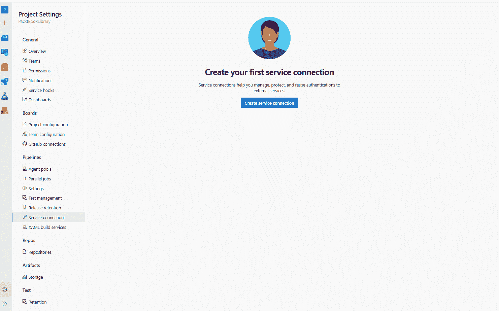

图 11.2 – 创建新的服务连接

1.  如果你希望创建新的服务连接，点击屏幕右上方的**新建服务连接**按钮。

1.  要修改权限，请点击**安全**下的**更多操作**子菜单。这将带你到一个类似于下图的屏幕：

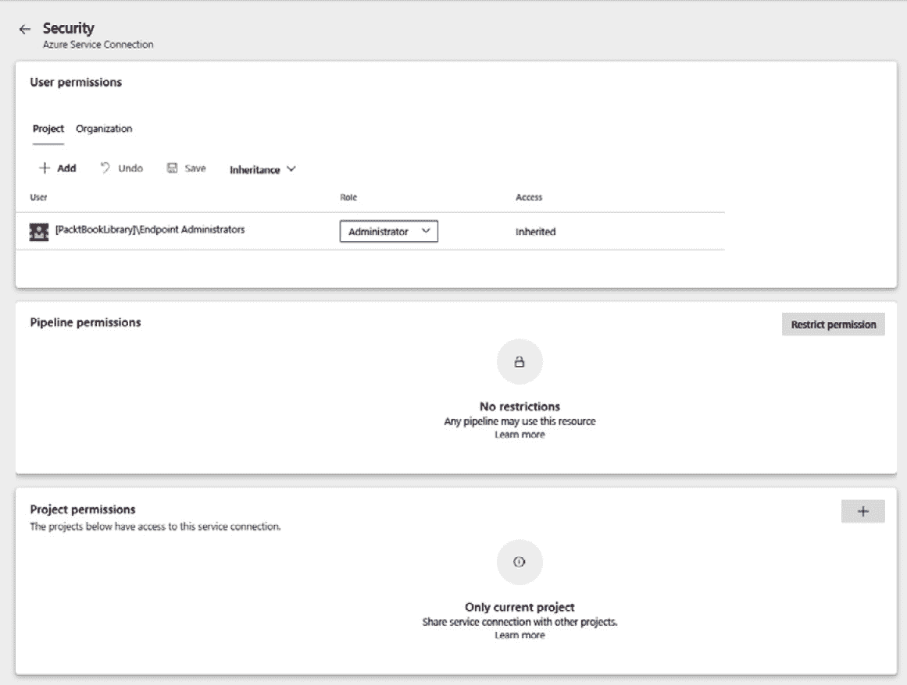

图 11.3 – 服务连接安全设置

在**编辑和安全**视图中，你现在可以执行以下操作：

+   编辑服务连接详情。

+   修改用户权限。

+   限制权限。

+   添加更多用户或组，并为每个用户或组指定是否可以使用或管理该端点。

+   指定哪些管道可以使用此服务连接。

项目中的每个管道默认不应有权限使用服务连接。相反，每个希望使用服务连接的管道必须首先获得服务连接管理员的授权。

## 在变量组中存储机密

在应用开发中涉及的机密比仅用于连接其他系统的机密更多。例如，包括在应用编译过程中需要的许可证密钥，或在部署后需要传递给应用的数据库用户名和密码，或作为 ARM 模板部署的一部分传递的数据库信息。

这些机密可以存储在管道变量或变量组中，关于这一点我们在*第三章*，“*优化 DevOps 工具使用效果*”部分中，讲解了在*Azure DevOps 中创建构建定义*时的相关内容。微软会安全地存储所有标记为机密的变量，并使其无法通过用户界面进行检索。

然而，可能有一些原因不希望将机密存储在 Azure DevOps 中，而是存储在专门的密钥存储中，例如 Azure Key Vault。这样做将提供与 Key Vault 一起的额外保障，并能够使用**Azure 基于角色的访问控制**（**Azure RBAC**）和密钥库访问策略进一步控制访问策略。

当将机密存储在 Azure 密钥库中时，它们仍然可以作为变量组使用，通过通过服务连接将空的变量组连接到密钥库，如下图所示：

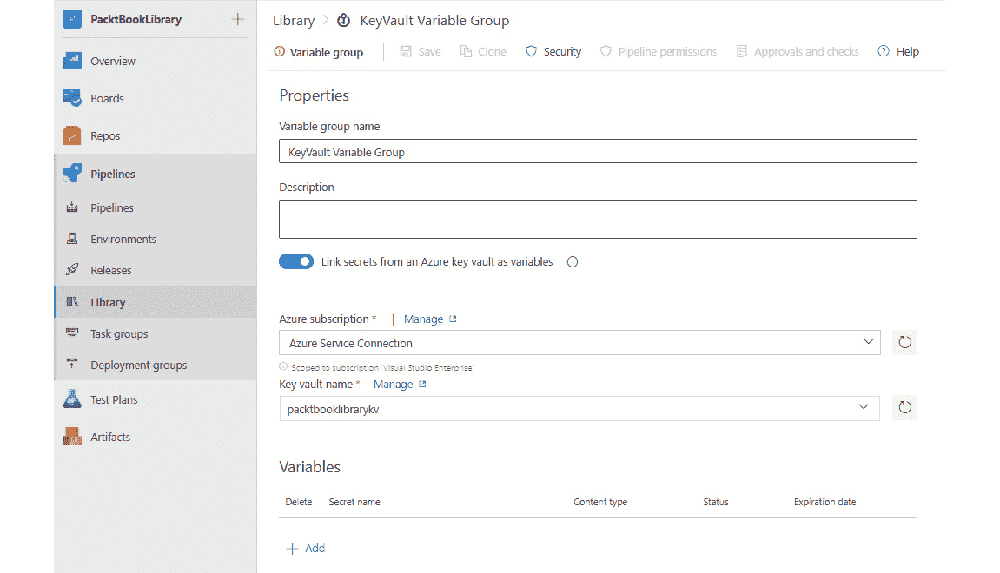

图 11.4 – 将 Key Vault 用作变量组的存储

要将密钥库用作变量组的存储，请执行以下操作：

1.  启用**从 Azure 密钥库链接机密作为变量**的第二个滑块，以从密钥库加载机密。

1.  从下拉菜单中选择一个已存在的 ARM 服务连接，或者通过从列表中选择一个 Azure 订阅，动态创建一个新的 Azure 管理身份服务连接。

1.  输入要加载机密的密钥库名称。你也可以从下拉菜单中选择一个。在此情况下，仅显示可通过选定的服务连接访问的密钥库。

1.  可以使用**安全性**选项卡配置特定用户的访问权限。

也可以自动创建正确的权限，以便访问 Azure 和密钥库的服务连接。请注意，这两个操作会对 Azure 安全设置进行更改，因此请确保这些设置（仍然）是正确的。

# 检测应用代码漏洞

在 DevOps 时代之前定期进行的安全评估，在转向 DevOps 文化时并不能完全省略。这意味着，必须以某种方式继续进行这些评估，而不是简单地放弃。可以通过两种方式来进行。

第一种方法是像以前一样，定期进行渗透测试、安全审查和其他安全检查。然而，代码不是等到测试通过后才进入生产环境，而是在与安全评估分开的情况下直接部署到生产环境。这意味着接受存在风险的假设，即可能会有一些漏洞在下次安全扫描时被发现，并会在下一个版本中解决。使用这种方法可以实现速度，但也需要接受某些漏洞可能会存在一段时间。

第二种方法是将应用程序安全扫描作为常规工作流程的一部分，纳入到将代码提交到源代码库的过程中。例如，安全代码审查不必每个增量或每两个月进行一次。它们也可以在每次拉取请求时进行——在代码合并之前。这样，你突然间不再只是检测漏洞，而是改为防止漏洞的出现。安全漏洞扫描也可以采用相同的方式。它们可以成为交付流水线的一部分，或者成为一个完整的每晚**质量保证**（**QA**）构建，每天早晨报告开发质量。

当然，实际情况通常并不像黑白分明那样，很多公司会结合使用这些方法。它们使用自动化反馈机制来检测可以发现的问题，将安全代码审查作为拉取请求工作流程的一部分，然后结合定期的手动渗透测试。通过这种方式，交付速度提高的同时，安全风险没有增加，甚至可能减少，后者是漏洞修复速度提高的结果。

## OWASP Top 10

在 Web 应用程序安全方面，有几种常见的安全问题，负责编制大部分安全问题。这些问题类型包括 OWASP Top 10。这是一个列出十大最常见安全问题的清单，由**开放 Web 应用程序安全平台**（**OWASP**）发布。该清单每隔几年会进行一次审查，但在过去几年里保持了相对稳定。

OWASP Top 10 中的大部分错误都可以通过实施自动化安全测试来预防，方法可以是使用静态代码分析来检查安全漏洞，或者使用**OWASP Zed 攻击代理**（**OWASP ZAP**）进行动态测试。

## 实施自动化漏洞扫描

在前一章中，讨论了持续测试，并介绍了 SonarCloud 作为用于技术债务和代码质量的代码扫描工具。除了评估应用程序代码的质量外，SonarCloud 还可以用于扫描安全漏洞。在*第十章*《集成持续测试》中，您学习了如何将 SonarCloud 扫描添加到您的管道中。还有其他更多专业化的工具可供使用，我们将在本章的最后一部分讨论这些工具。

这些工具通过静态测试评估应用程序。它们扫描代码以识别任何有风险的代码。这被称为白盒方法，因为它们可以看到、检查和扫描所有代码。换句话说，一切都是可见的。这与黑盒方法相反，黑盒方法将运行中的应用程序视为一个封闭的整体，只通过调用它并观察其响应来进行测试。OWASP ZAP 就是能够执行这种测试的工具之一。

## OWASP ZAP

OWASP ZAP 是一款可以执行应用程序自动化渗透测试的工具。该工具可以在两种模式下运行：

+   **基准扫描**：基准扫描只需几分钟，并且经过优化，可以在这几分钟内尽可能多地扫描安全风险。这使得基准扫描足够快速，能够在部署管道的早期阶段运行。甚至可以在每次部署到第一个测试环境后运行安全扫描，从而为开发人员提供快速反馈。

+   **完整主动扫描**：完整的主动扫描需要更多时间。在这种类型的扫描中，代理会检查来自应用程序的每个响应，以识别应用程序的其他 URL，并对它们进行扫描。通过这种方式，完整的应用程序会在运行时被发现，采用蜘蛛抓取的方式。这种扫描方式更加全面，但也需要更多时间。因此，完整扫描通常会在间隔时间内进行，例如每晚一次。

OWASP ZAP 尝试识别任何可能的安全风险。最显著的风险包括 SQL 注入、JavaScript 反射和路径遍历。

OWASP ZAP 是一款可以安装在任何虚拟机上的应用程序。其缺点是，即使没有正在运行的扫描，虚拟机也会一直运行。这会增加成本，当然，虚拟机本身也需要进行补丁更新和安全加固。最近，还推出了该代理的容器化版本。该容器可以在 Azure 容器实例中运行，只在需要时启动代理，执行完毕后立即销毁。

这完成了我们对代码扫描工具及其实现的介绍。在这些工具的帮助下，您可以检测应用程序中的漏洞并防止任何安全问题。下一部分将探讨如何扫描应用程序的依赖项。

# 处理依赖项

除了应用程序代码本身可能带来的安全风险外，还存在与重用组件相关的风险。现代应用程序代码中有 50% 到 80% 不是内部开发的，而是来自其他方的包或依赖项。一些可能是开源的，但不一定如此。也可能是从其他开发公司购买的组件或从如 NuGet 等库中获取的二进制文件。

依赖项不仅带来安全风险，还可能带来许可风险。如果一个团队开始使用一个以 GPL 许可发布的组件作为封闭源组件，会发生什么？如果有人发现，他们可能被迫将产品开源，或者至少会因为未根据许可使用他人的工作而遭受公开的耻辱。

为了降低这些风险，可以使用多种工具来检测和扫描构建应用程序时使用的所有依赖项。其中一个可用的工具是 WhiteSource Bolt，它作为扩展可从 Azure DevOps 市场获取。

## 使用 WhiteSource Bolt

要开始使用 WhiteSource Bolt 执行扫描，请执行以下操作：

1.  从 Azure DevOps 市场安装 WhiteSource Bolt 扩展。

1.  转到**Pipelines**下的**WhiteSource Bolt**菜单。

1.  注册并接受许可条款。

1.  如下图所示，将**WhiteSource Bolt**扫描任务添加到构建或发布定义中：

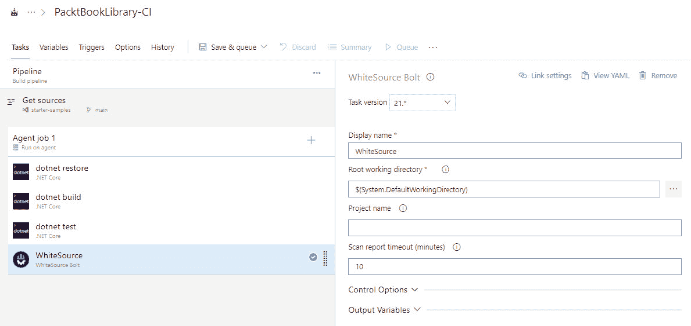

图 11.5 – 一个 WhiteSource Bolt 管道任务

1.  一旦安装了 WhiteSource Bolt 任务的管道运行完成，构建结果页面将包含一个额外的标签，名为**WhiteSource**，显示类似的结果，如下图所示：

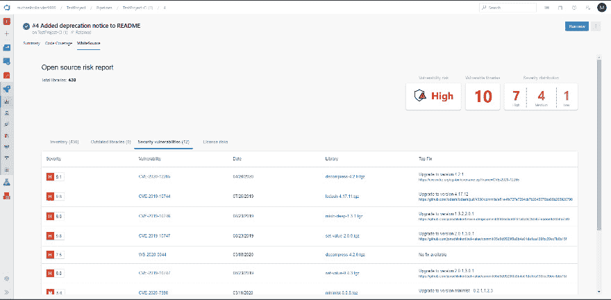

图 11.6 – WhiteSource 报告

这完成了我们关于依赖项扫描的讨论。如前所述，您可以利用这些工具检测和扫描在构建应用程序时使用的所有依赖项。在下一节中，将介绍基础设施合规性。

# 确保基础设施合规性

另一个重要话题是合规性。在许多国家或市场中，创建软件时必须实施或遵守一系列规则和政策。其中很多政策与应用程序运行的基础设施相关。如果这些基础设施部署并管理在 Azure 平台上，Azure Policy 可以成为确保基础设施符合规定的强大工具。

在*第八章*《将基础设施和配置实现为代码》中，讨论了 ARM 模板的相关内容。ARM 模板可以被视为一种技术，用于将完整的 Azure 环境描述为一个 JSON 数组，数组中的每个对象描述了应用程序基础设施中的一个资源。

Azure 策略允许您编写查询该文档以及通过任何 API 或 ARM 模板进行的更改的策略。每当找到一个与查询匹配的资源时，可以阻止其创建，或者将该匹配项添加到审核结果列表中。Azure 策略可以修复或修改不安全的配置，防止出现错误。

除了编写自定义策略外，还有许多现成的策略可供所有 Azure 用户使用。这些策略可以用来审核不符合最佳实践或通用建议的资源。还有一组组的策略，称为计划（Initiatives），它们描述了市场标准的适用部分。

## 分配 Azure 策略或计划

策略可以在 Azure 中的不同级别进行分配，具体可以是在资源组级别、订阅级别或管理组级别。可以通过门户、ARM 模板或蓝图，或者 PowerShell 来完成此操作。

要使用 PowerShell，可以使用以下一系列命令：

1.  要检索资源组和策略的引用，请使用以下命令：

    ```
    $rg = Get-AzResourceGroup -Name myResourceGroupName
    $definition = Get-AzPolicyDefinition | Where-Object {
    $_.Properties.DisplayName -eq 'Audit VMs that do not use managed disks' }
    ```

这里选择的策略是一个内置策略，将审核所有未使用托管磁盘但在存储账户中有自定义磁盘的虚拟机。此策略定义将在以下任务分配的命令中使用。

1.  要将策略分配给资源组，请使用以下命令：

    ```
    New-AzPolicyAssignment -Name 'audit-vm-manageddisks' - DisplayName 'Audit VMs without managed disks Assignment' -Scope
    $rg.ResourceId -PolicyDefinition $definition
    ```

在该任务分配后的 30 分钟内，新策略将生效。此时，会启动策略评估周期，所有在任务范围内的资源将会依据该策略进行评估。在撰写时，尚未发布有关此类评估周期所需时间的服务水平协议（SLA）。经验表明，评估周期的时间可以从 15 分钟到几个小时不等，具体取决于任务范围的大小。

## 编写 Azure 策略

虽然有许多内置的策略可供使用，但在许多用例中，仍然需要创建自定义策略。与任何其他 Azure 资源一样，策略是以 JSON 文档的形式编写的。适当的 ARM 资源类型为 `policyDefinitions`，其结构如下：

```
{
  "name": "string",
  "type": "Microsoft.Authorization/policyDefinitions", 
  "apiVersion": "2019-01-01",
   "properties": { 
    "parameters": {
     "location": { …}
   },
     "displayName": "…",
     "description": "…", 
     "policyRule": {
     "if": {
      "field": "location",
      "equals": "[parameters('location')]",
     },
     "then": {
     "effect": "<audit|deny >"
    }
  }
 }
}
```

`parameters` 对象可以用来指定在稍后分配策略时需要指定的一个或多个参数。这些参数遵循与 ARM 模板参数相同的语法，并且工作方式也相同。

`displayName` 和 `description` 属性可以用来为策略定义提供有意义的名称和描述，方便后续参考。

定义的主体包含以下两个元素：

+   `if` **语句**用于指定一个查询，选择此策略应适用的 Azure 资源。JSON 中编写复杂查询的具体语法已在 ARM 模板参考中详细说明，链接在本章末尾。

+   `then` **语句**用于描述需要对符合条件的任何资源采取的操作。这可以是*拒绝*——即自动拒绝任何不符合要求的资源的创建。另一种方法是并非拒绝不合规的部署，而是对其进行审计。虽然在理论上拒绝不合规的部署非常直接，但暂时允许不合规部署也有其合理的原因。在这种情况下，审计策略可以帮助跟踪这些资源。所有不合规的部署将在其 Azure 活动日志中记录审计记录，并可以在 Azure 门户的**Azure 策略**下的**合规性**标签页中查看。具体如下：

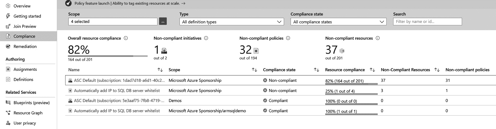

图 11.7 – Azure 策略合规性详情

在编写策略定义之后，我们需要在 Azure 订阅中创建它，以便使其可用。这可以通过 ARM 模板完成，或者在门户中手动完成。从 DevOps 角度来看，建议将策略编写在源代码管理中，并通过管道作为 ARM 模板的一部分进行交付。这样，Azure 策略与应用程序的编写方式相同，可以进行审查并作为 DevOps 管道的一部分自动部署到 Azure。

## 倡议

在使用 Azure 策略时，许多公司发现需要创建大量策略来定义他们希望软件开发人员遵循的所有规则。为此，将策略进行分组可能会带来好处。这样的分组被称为*倡议*，这些也是通过 JSON 定义的：

```
{
  "name": "string",
  "type": "Microsoft.Authorization/policySetDefinitions",  
  "apiVersion": "2019-01-01",
  "properties": { 
   "displayName": "string", 
   "description":  "string", 
   "parameters": { … }, 
   "policyDefinitions": [
   {
     "policyDefinitionId": "string", 
     "parameters": {}
   }
  ]
 }
}
```

一项倡议的主体是一个对象数组。每个对象必须包含一个 `policyDefinitionId` 属性，并且可以选择性地包含一个带有 `parameters` 的对象。`policyDefinitionId` 属性必须通过其 Azure 资源 ID 引用有效的 `policyDefinitions` 条件。`parameters` 数组应指定策略所需的所有参数。通常，这通过让倡议指定所有策略的所有参数的组合集作为倡议参数来实现。然后，个别策略的参数通过引用倡议参数来指定。

## 获取审计结果

在分配了具有审计效果的策略后，该策略将在激活后自动评估分配范围内的所有资源。无法保证这个过程需要多长时间。对于新资源，策略评估结果通常会在 15 分钟内显示，但通常会更快。

一旦结果出来后，可以在门户中查看每个政策或计划的合规性状态，从而获得概览，如下所示的截图所示：

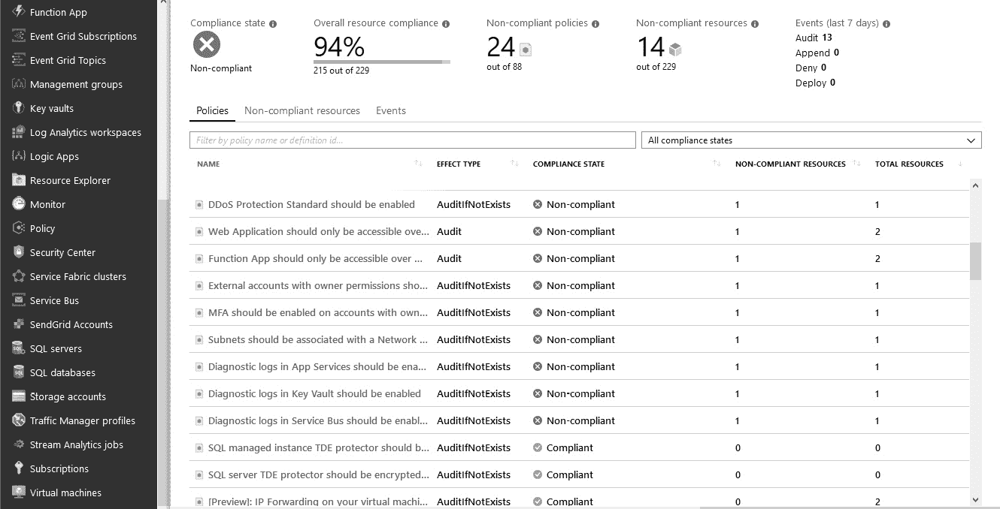

图 11.8 – Azure 政策合规状态

这份报告与其他手动审计报告的不同之处在于，这份概览会持续更新，反映出实际的当前合规状态——它不是某一特定时间点的合规快照。

这种合规性类型的一个重要好处是规则或政策持续应用于所有现有资源和任何即将发生的变化。这意味着可以确保应用环境始终符合要求，并始终遵守适用的规则和政策。

将其与通常每两个月进行一次的安全和合规审计的做法进行对比。通常，这会导致环境在审计前才符合合规要求，且合规性在审计后逐渐下降——直到下次审计时间到来，此时合规性又会接近 100%。在许多公司中，这会导致如下的合规性图表：

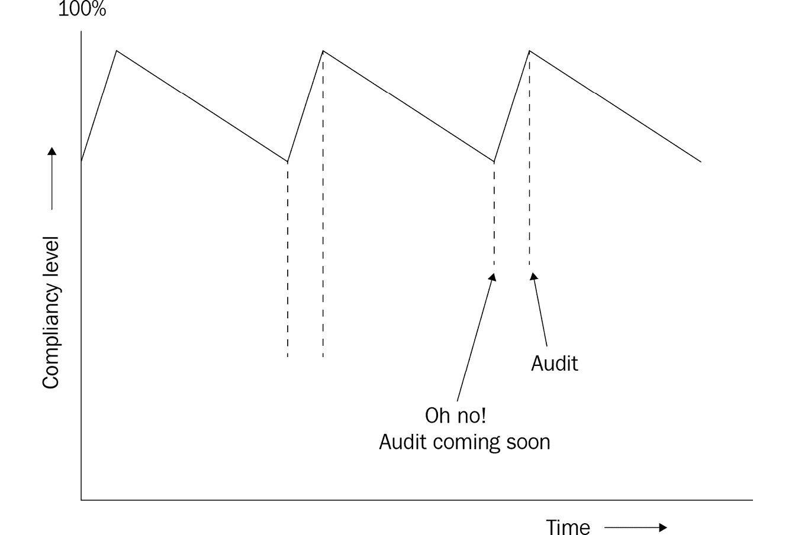

图 11.9 – 合规性水平随时间变化的成熟度

到此为止，我们已经讨论了 DevOps 实践如何通过确保基础设施合规性来帮助提高安全性和合规性的另一个例子。在下一部分，我们将讨论本章之前提到的几种替代工具，如 Defender for Cloud、Sonar Cloud 和 WhiteSource。

# 监控和检测运行时安全风险和威胁

到目前为止，我们讨论的所有安全工具都集中在防止将有漏洞的代码推送到生产环境。然而，一个完整的、已部署的软件解决方案，包括其所有支持基础设施，远不仅仅是代码。除此之外，解决方案的许多交互可能是意料之外或未经计划的。持续在生产环境中监控所有这些内容是必要的，不仅是为了防止安全问题的发生，还为了检测任何出现的安全问题。在 Azure 中，可用于执行此操作的工具之一是 Azure 安全中心。这个工具和 Azure Defender 现在被称为 Microsoft Defender for Cloud。

Defender for Cloud 工具提供安全态势管理和威胁防护，保护在 Azure、混合云和其他云平台上运行的工作负载。

Defender for Cloud 在管理资源和工作负载的安全性时满足以下三个需求：

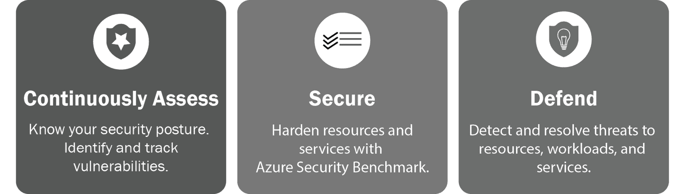

图 11.10 – Defender for Cloud

+   **持续评估** – 该解决方案将提供当前安全态势的简要概览。

+   **Security recommendation** – 该解决方案将使用 Azure 安全基准加强资源和服务的安全性，并推荐优先级较高的加固任务以及详细的修复步骤，以改善安全态势。

+   **Defend** – 该解决方案将检测并解决对资源、工作负载和服务的威胁。这些警报会出现在 Azure 门户中，也可以通过电子邮件发送。

以下示例展示了针对资源加强安全性并提高整体安全态势的推荐：

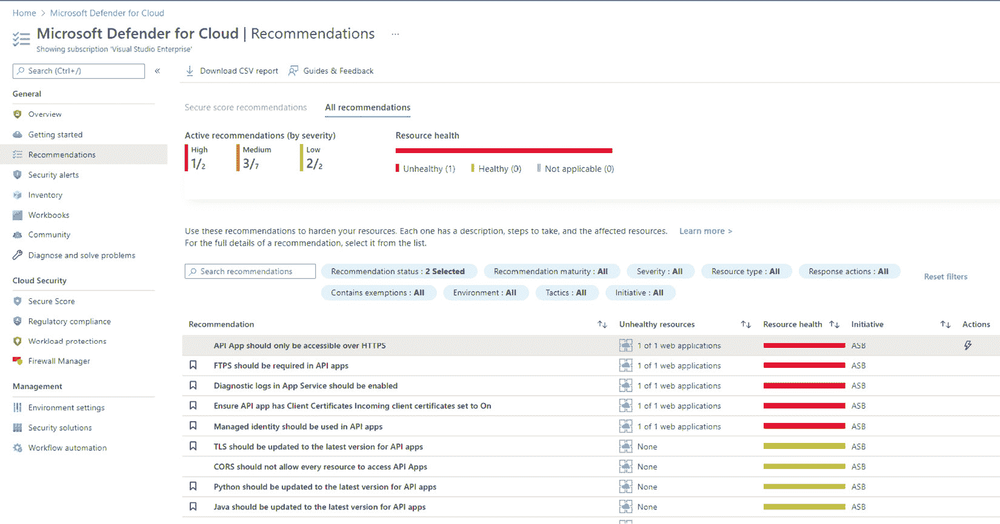

图 11.11 – Microsoft Defender 推荐

Microsoft Defender for Cloud 具有更多功能，并且不断在增加新功能。在 Azure 中部署时，这是识别和管理安全风险的地方。

这部分讨论了用于监控运行时环境中的安全风险的各种技术。下一部分将介绍几种替代工具，用于执行前面提到的一些扫描任务。

# 其他工具

市场上有许多工具可以用于对应用程序代码和依赖项进行安全扫描。一些示例包括 WhiteSource、Black Duck、Veracode 和 Checkmarx：

+   **WhiteSource** 是 WhiteSource Bolt 的付费版本。它提供相同的服务以及更多功能。例如，它不仅在依赖项扫描时报告风险，还会在依赖项的最新扫描中出现新风险时发出警报。

+   **Black Duck** 是一款帮助团队管理使用开源软件相关风险的产品。它提供的服务与 WhiteSource 类似。

+   **Veracode** 和 **Checkmarx** 是代码扫描工具，用于识别易受攻击的代码。而 **SonarQube** 检查代码质量和安全风险，这两款产品则专注于安全风险。通常来说，它们在安全扫描方面更为出色，但缺点是价格较高。

+   **Sonar Cloud** 是 SonarQube 的托管环境，提供与 SonarQube 类似的功能。

+   **CodeQL** 是一种安全扫描工具，用于自动化安全检查。CodeQL 将代码视为可以查询的数据，并执行变种分析。变种分析是一种利用已知的安全漏洞作为种子，查找代码中类似问题的过程。**Code scanning** 是一种功能，允许您扫描 GitHub 仓库中的代码，以检测安全漏洞和编程错误。如果代码扫描检测到代码中的潜在漏洞或错误，GitHub 会通知开发者，并禁止他们提交额外的问题。

# 摘要

在本章中，您学习到 DevOps 和安全并不是两个相互冲突的目标，且 DevOps 实践可以帮助您加强安全性。首先，您学习了如何在持续部署流水线中处理密码和其他机密信息。接着，您学习了如何通过代码和依赖扫描工具增强流水线，同时将安全的“左移”原则应用其中。最后，您学习了如何使用 Azure Policy 来定义基础设施的约束和规则，以及如何自动应用这些规则，或对不合规的部署进行审核或自动拒绝。

通过您所获得的知识，您现在可以在公司内部与团队讨论如何解决 DevOps 团队中的安全问题。您可以与安全工程师合作，配置所使用的工具，并收到关于工作安全影响的自动反馈。

在下一章中，您将学习应用程序监控。此外，您将了解如何监控您的应用程序是否顺利运行，并收集运行时指标。

# 问题

以下是一些问题，供您测试对本章内容的理解。您可以在*附录*中的*评估*部分找到答案：

1.  对还是错——确保软件交付的安全仅仅是部署流水线中的一个步骤。

1.  哪种工具可以用于安全测试，通过代理识别有效的应用程序 URL，然后对应用程序进行各种攻击，例如注入？

1.  对还是错——在大多数现代应用程序中，超过 50% 的代码库来自开源库。

1.  在部署过程中或运行应用程序时，存储所需的机密信息的安全位置有哪些？（您可以选择多个答案。）

    1.  标记为机密的 Azure Pipelines 变量

    1.  Azure Key Vault

    1.  Azure DevOps Key Vault

    1.  Azure 变量组

    1.  Azure DevOps 安全变量

    1.  Azure DevOps 服务连接

1.  哪两种 Azure 产品可以用来在运行时检测安全风险？

# 进一步阅读

+   Microsoft 安全代码分析工具：[`docs.microsoft.com/en-us/azure/security/develop/security-code-analysis-overview`](https://docs.microsoft.com/en-us/azure/security/develop/security-code-analysis-overview)。

+   代码 QL 分析引擎：[`codeql.github.com/docs/codeql-overview/about-codeql/`](https://codeql.github.com/docs/codeql-overview/about-codeql/)。

+   OWASP Top 10 及每种风险类型的详细信息可以在 [`owasp.org/www-project-top-ten/2017/`](https://owasp.org/www-project-top-ten/2017/) 找到。

+   Azure Policy 的详细操作指南：[`docs.microsoft.com/en-us/azure/governance/policy/`](https://docs.microsoft.com/en-us/azure/governance/policy/)。

+   WhiteSource Bolt 可以在 Azure DevOps 市场找到，链接：[`marketplace.visualstudio.com/items?itemName=whitesource.ws-bolt`](https://marketplace.visualstudio.com/items?itemName=whitesource.ws-bolt)。

+   关于如何使用 OWASP ZAP 的详细指南可以在 [`devblogs.microsoft.com/premier-developer/azure-devops-pipelines-leveraging-owasp-zap-in-the-release-pipeline/`](https://devblogs.microsoft.com/premier-developer/azure-devops-pipelines-leveraging-owasp-zap-in-the-release-pipeline/) 找到。

+   关于 Azure 策略资源类型和 JSON 规范的更多信息，可以在 ARM 参考中找到，网址为 [`docs.microsoft.com/en-us/azure/templates/microsoft.authorization/allversions`](https://docs.microsoft.com/en-us/azure/templates/microsoft.authorization/allversions)。

+   关于 Microsoft 安全代码分析扩展的更多信息，请访问 [`secdevtools.azurewebsites.net/helpcredscan.xhtml`](https://secdevtools.azurewebsites.net/helpcredscan.xhtml)。

+   关于 WhiteSource Bolt 和 WhiteSource 的更多信息，请访问 [`bolt.whitesourcesoftware.com/`](https://bolt.whitesourcesoftware.com/) 和 https://www.whitesourcesoftware.com。

+   关于 Black Duck 的更多信息，请访问 [`www.blackducksoftware.com/`](https://www.blackducksoftware.com/)。

+   关于 Veracode 的更多信息，请访问 [`www.veracode.com/`](https://www.veracode.com/)。

+   关于 Checkmarx 的更多信息，请访问 [`checkmarx.com/`](https://checkmarx.com/)。

# 第四部分 – 闭环

DevOps 不仅仅是加速将优质产品交付到生产环境的能力。另一个非常重要的方面是观察和衡量使用情况以及其他关键性能指标。来自分析的洞察提供了至关重要的反馈，以塑造产品的未来，甚至帮助优先考虑其他质量举措，这些举措对于提高服务的整体可靠性至关重要。

本部分将介绍有效地为应用程序添加监控，以便收集可以更好地理解应用程序使用情况和用户行为的度量数据。持续学习的另一种方法是明确地从产品内请求反馈，以便用户在使用软件时可以分享宝贵的建议。通过这种方式，可以规划未来对最终用户体验的改进。

本书的这一部分包括以下章节：

+   *第十二章*，*应用程序监控*

+   *第十三章*，*收集用户反馈*
