# 第十二章：应用程序监控

在前几章中，你了解了如何将 DevOps 原则应用于软件交付。你学会了如何从源代码管理到生产环境创建一条流水线。你还学会了如何确保交付符合要求并且安全，同时不牺牲速度或对业务价值交付的关注。本章中，你将学习如何将这条流水线转变为 DevOps 循环——一个持续交付新软件的过程，然后衡量你的应用程序的表现。这是一个持续的过程，因为你将评估应用程序在生产中的表现，并学习如何进行下一步。

为了实现这一目标，本章首先介绍了一种收集应用程序崩溃的方法。几乎所有应用程序都会在某个时刻抛出未处理的异常并崩溃。确保收集并报告应用程序崩溃，将帮助你调查其原因并进行修复。接下来，注意力将转向对应用程序进行仪器化。

仪器化是收集日志和指标的实践，帮助你了解应用程序在生产环境中的表现。你可以利用它们在出现问题时触发警报，或者希望在问题发生之前就能发现它们。本章最后探讨了与其他工具集成的几种选项。

本章涵盖的主题包括：

+   调查应用程序崩溃

+   仪器化 Web 应用程序

+   与其他工具的集成

# 技术要求

为了实验本章中描述的技术，你将需要以下工具之一或多个：

+   用于收集移动应用程序崩溃报告的 App Center 帐户

+   用于收集桌面应用程序崩溃报告的 Raygun 订阅

+   用于仪器化 Web 应用程序的 Azure 订阅

所有这些工具都提供免费试用选项。

# 调查应用程序崩溃

无论一个应用程序设计得多么完美，它最终都会因为某种意外情况而崩溃。为了从这些崩溃中吸取教训并尽量避免将来的崩溃，向应用程序添加代码以收集崩溃报告并将其发送到一个中心位置会有帮助。在那里，这些报告可以被分析和归类，以识别应用程序的改进方向。如何做到这一点取决于应用程序的类型。

以下章节讨论了移动和桌面应用程序如何工作。关于 Web 应用程序，收集崩溃报告可以使用与仪器化相同的工具；我们将在后面的*仪器化 Web 应用程序*部分讨论这一点。

## 收集移动应用程序的崩溃报告

用于收集移动应用程序崩溃报告和错误的众多工具之一是 Visual Studio App Center。除了分发移动应用程序，**App Center**还允许应用程序提交其崩溃和错误以供分析。

要开始使用 App Center 进行崩溃报告，首先需要定义应用程序。这被称为应用程序定义，如何处理它在*第六章*，*实现持续部署和发布管理*中已经讨论过。通过这个应用程序定义，会创建一个应用密钥，用于配置应用程序发送崩溃报告。除了崩溃报告，还可以跟踪开发者感兴趣的其他错误和异常。要开始发送崩溃报告，需要执行以下步骤：

1.  在项目中安装 `Microsoft.AppCenter.Crashes` NuGet 包。

1.  将以下代码添加到应用程序初始化中：

```
AppCenter.Start("ios={appSecret};android={appSecret
};uwp={appSecret}", typeof(Crashes));
```

除了崩溃之外，还可以跟踪开发者感兴趣的其他错误。可以使用以下代码来实现：

```
Crashes.TrackError(ex);
```

所有未处理的异常都会被自动捕获并发送回 App Center。在这里，它们会变得可供分析，如下图所示：

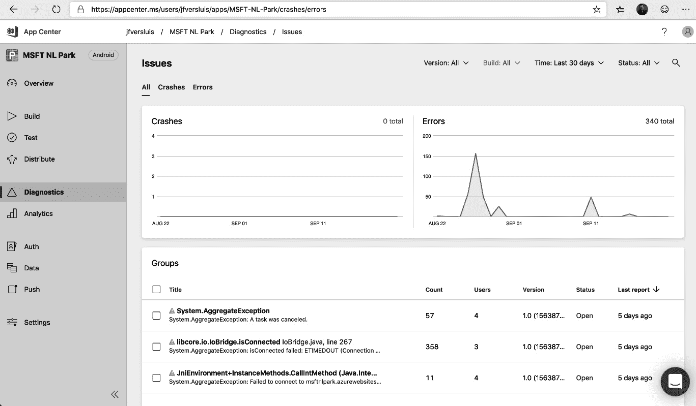

图 12.1 – App Center 诊断概览

点击报告的错误或崩溃项以打开详细视图，如下所示：

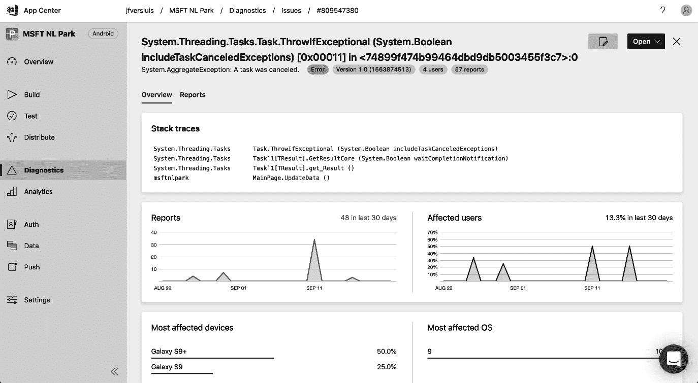

图 12.2 – App Center 诊断详细视图

每个崩溃或错误会显示一个包含最重要信息的仪表板。这些信息包括报告数量和受影响用户的数量，还会显示受影响的设备类型和操作系统。在页面顶部，显示堆栈跟踪，开发者可以使用这些信息来调查并希望能修复该问题。

App Center 与 Azure DevOps、Jira 和 GitHub 集成，供 bug 跟踪使用。有关更多信息，请参考此链接：[`docs.microsoft.com/en-us/appcenter/dashboard/bugtracker/`](https://docs.microsoft.com/en-us/appcenter/dashboard/bugtracker/)。

对于任何关键事件，App Center 可以直接创建一个 bug 并发送电子邮件通知。

这部分涵盖了从移动应用程序收集崩溃报告和错误的内容。接下来的部分将介绍桌面应用程序中的相同概念。

## 收集桌面应用程序的崩溃报告

桌面应用程序也可以进行崩溃报告。对于桌面应用程序，有许多可用的解决方案，而且大多数的工作方式大致相同。其中一个解决方案是 Raygun。Raygun 是一个商业产品，适用于 .NET 应用程序，但也可以用于其他许多语言和平台。

使用 Raygun 收集崩溃的步骤如下：

1.  注册一个 Raygun 账户。

1.  在解决方案中安装 `Mindscape.Raygun4Net` NuGet 包。

1.  捕获未处理的异常并将其转发到 Raygun。

以下示例演示了如何捕获并转发未处理的异常到 Raygun：

```
class Program
  {
    private static readonly RaygunClient _raygunClient = new RaygunClient("myKey");
    static void Main(string[] args)
    {
      AppDomain.CurrentDomain.UnhandledException += HandleEx; throw new Exception("Boom!");
    }
    private static void HandleEx(object sender, UnhandledExceptionEventArgs e)
    {
      _raygunClient.Send(e.ExceptionObject as Exception);
    }
  }
```

所有异常都可以在 Raygun 的 Web 界面中进行探索。在这里，如果堆栈跟踪足够相似，异常会自动分组。它们也可以被分组并单独浏览，但在大多数情况下，专注于较大的异常组更有意义。

以下截图展示了如何在 Raygun 中浏览这些组：

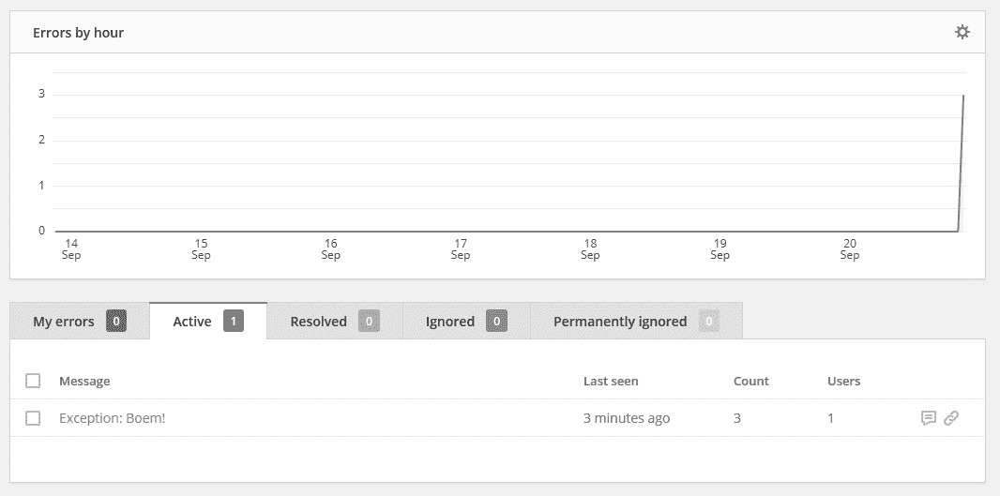

图 12.3 – 桌面应用程序异常的 Raygun 视图

在此界面中点击异常消息将显示完整的堆栈跟踪以及任何发生的异常实例的所有共享属性。

这完成了我们对从移动和桌面应用程序收集崩溃报告的讨论。这样做可以让你发现并调查客户在生产环境中遇到的问题。接下来的部分将介绍 Web 应用程序的监控，以进一步增强我们对应用程序在生产环境中行为的洞察。

# Web 应用程序的监控

Web 应用程序与移动应用程序和桌面应用程序在许多方面不同，其中之一是大部分应用程序的运行是由服务器而非客户端执行的。这使得开发人员比其他类型的应用程序更容易收集 Web 应用程序的运行信息。这就是为应用程序添加监控的过程。

日志是系统保存的文本消息，用于描述服务器执行的路径。这有助于开发人员回溯并通过检查日志输出来探索发生过的事件。结构化日志正迅速成为跟踪日志的标准。**结构化日志**是一种技术，其中日志不再仅仅是文本消息，而是带有每个参数值集的参数化文本消息。这有两个优势——日志可以更好地压缩，而且可以更快速地进行搜索。

**度量指标**是为应用程序记录的值。它们通常由时间戳、指标名称和值组成。一个例子是每秒记录一次 CPU 使用率的百分比。

在为应用程序添加监控时，容易专注于许多服务器级别的日志和度量指标。例如，许多操作员默认会开始收集诸如 CPU 使用率、内存压力和 I/O 操作等度量指标。虽然这些度量指标本身没有问题，但它们不一定能从用户的角度反映应用程序的性能。其他度量指标，如响应时间或队列消息处理延迟，可能会更好地提供关于用户体验的见解。虽然测量系统指标没有错（它们通常是未来问题的良好指示），但你也应该尝试收集以用户为中心的度量指标。

Azure 提供了 Application Insights 服务，用于对应用程序进行监控，重点是 Web 应用程序。可以通过 Azure 门户创建一个 Application Insights 工作区，该工作区会打开一个工作空间，如下图所示。在 Azure 门户的概述部分，**监控密钥**字段清晰显示，建议将其视为应用程序机密：

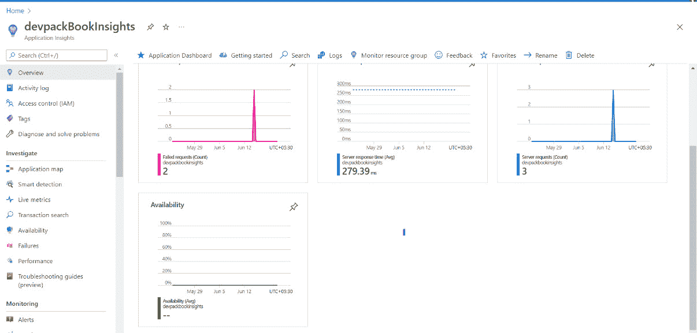

图 12.4 – Azure Application Insights 概述

以下小节将详细介绍日志记录、度量和单个请求的调查。

## 日志记录

最基本的监控方式之一就是在应用程序代码中添加日志语句。过去，这些日志会保存到运行应用程序的服务器磁盘中。因此，获取和调查这些日志需要大量的时间和精力。

在现代托管环境中，日志不再保存在本地文件系统上，而是远程存储。由于基础设施的临时性，服务器可以随时增加或移除，因此无法再将日志保存在服务器上，并确保以后可以检索到。因此，这些日志会通过 HTTP 传输到专用的日志存储中，如 Application Insights。

## 生成日志

要从 ASP.NET 应用程序将日志条目写入日志存储（例如 Application Insights），必须执行以下两项操作：

1.  需要在应用程序代码中使用 `ILogger` 接口生成日志条目（如适用）。该接口可以通过 `Microsoft.Extensions.Logging.Abstractions` NuGet 包使用。

1.  需要安装 Application Insights NuGet 包（`Microsoft.ApplicationInsights.AspNetCore`），并将 Application Insights 注册为 `LoggingProvider`。这样，所有发送到前述接口的日志都会转发到 Application Insights 代码中。反过来，这段代码会将所有日志转发到 Application Insights 服务。

以下示例代码展示了如何使用类中的 `ILogger` 接口来生成结构化日志条目：

```
public class Example
{
private readonly ILogger<Example> _logger;public Example(ILogger<Example> logger)
  {
    _logger = logger;
  }
  public void DoSomething(User user)
  {
    _logger.LogWarning(
      "Doing something for user with id '{userId}' and username '{username}'",
      user.Id, user.Username);
    }
}
```

重要提示

日志条目开头不应有美元符号（`$`）。这里没有使用字符串插值，但有两个占位符被插入到文本消息中。结构化日志条目会识别这些占位符，并在显示条目时插入提供的值。

在生成日志条目后，应注册一个日志提供程序来捕获这些日志。这个过程是通过 .NET Core 内建的依赖注入实现的。

启动应用程序后，所有级别为警告及以上的日志条目会自动转发到 Application Insights。要更改转发哪些条目以及哪些不转发，可以配置过滤器。本章末尾提供了有关如何详细配置 Application Insights 的链接。

### 搜索日志

在将日志条目发送到 Application Insights 后的几分钟内，它将出现在界面上供查询。为此，请打开 Application Insights 实例，并在左侧菜单中导航至 **日志** (**1**)。这将打开如下所示的视图：

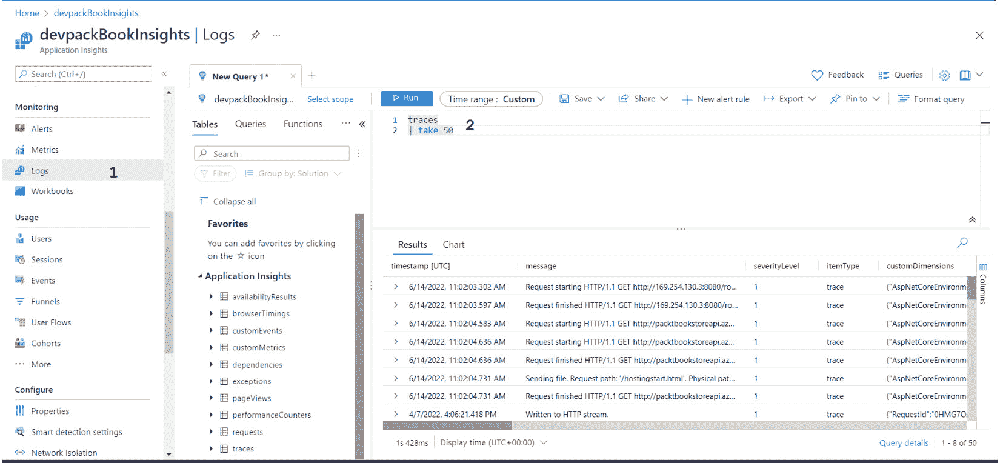

图 12.5 – Application Insights 日志视图

在这里，可以编写查询 (**2**) 来搜索以 **Kusto 查询语言** (**KQL**) 记录的日志。Application Insights 被优化用于处理大量数据，大多数查询能在一秒钟或更短时间内返回结果，即使是在搜索数百万条日志条目时。

### 针对日志设置警报

收集和搜索日志在排查特定情况或响应用户投诉时非常有用。然而，在某些情况下，当某个条件出现时，自动通知比手动搜索更为有效。这就是警报的作用。

在 Azure 中，可以创建警报规则，当满足某个条件时通知开发人员。警报功能由 Azure Monitor 提供，并与许多 Azure 服务（包括 Application Insights）集成。

要创建一个新的警报规则，请按照以下步骤操作：

1.  使用门户导航到 Azure Monitor。

1.  现在，选择 **警报**。这将打开如下所示的视图：

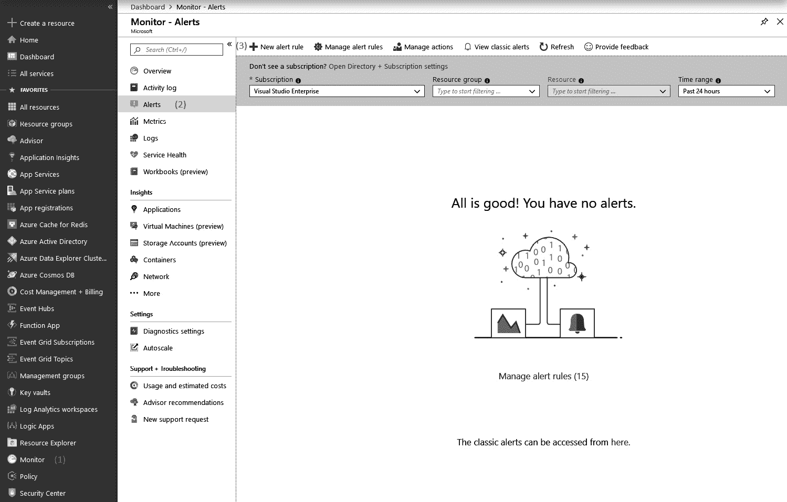

图 12.6 – Azure Monitor 警报视图

如果有需要注意的警报，它们将在此处显示：

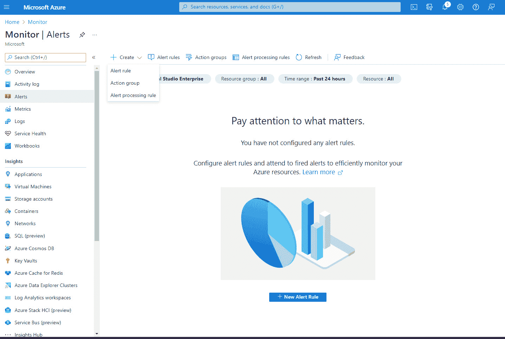

图 12.7 – Azure Monitor 警报创建视图

使用屏幕左上角的 **创建** 按钮来添加新的警报规则。这样会打开另一个视图，如前面的截图所示。在这里，可以配置警报条件：

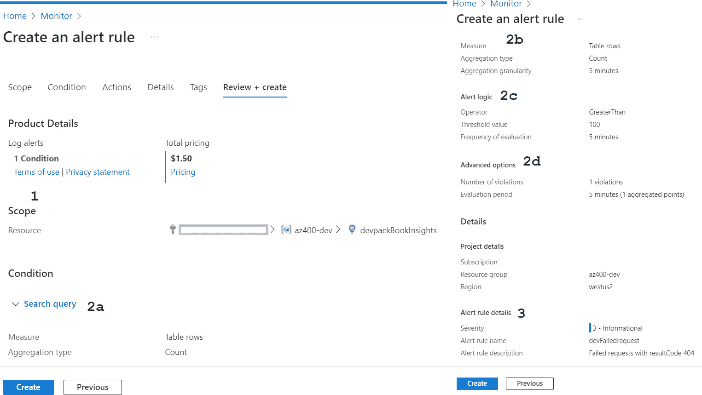

图 12.8 – Azure Monitor 警报审查 + 创建视图

在前面的截图中，打开用于配置警报的视图——**范围**——如图所示。在这里，需要选择资源以创建警报。

1.  这里的 (**1**) 是警报的资源主题。这可以是任何类型的资源，在这个实例中，警报将针对一个 Application Insights 工作区。

1.  这些 (`404` 代码结果：

    ```
    requests
    | where success == False and resultCode == 404
    ```

1.  `400` 代码结果。

1.  **评估警报条件的时间间隔** (**2c**)：当指定一个匹配特定数字的查询时，这将决定必须满足该数量的时间间隔。

1.  **评估警报条件的频率** (**2d**)：过于频繁地评估警报条件可能会导致警报频繁开闭，产生快速的警报序列。过于不频繁地评估警报条件可能会导致警报反应过迟。实验将帮助你了解如何配置这个参数。

1.  这是在满足警报条件时执行的操作。由于可能有许多警报必须调用相同的动作组，因此可以将操作分组，并在此处引用这些操作组。一些操作的示例包括调用 Webhook 或发送短信或电子邮件。

1.  警报配置通过输入名称和描述（**3**）来完成。

1.  最后，警报可以保存。

在按前面的截图回顾并创建警报后，激活会自动完成，几分钟内，警报就可以开始检查应用程序日志并在满足警报条件时发出信号。

日志记录是深入了解请求发生了什么以及错误如何发生的绝佳方法。另一种了解应用程序行为的技术是使用度量。

## 度量

除了日志外，应用程序还可以发出一个或多个度量。度量是随时间变化的一系列值，描述系统的一个或多个方面。以下是一些度量的示例：

+   当前登录的用户数量

+   用户查看的产品数量

+   数据库事务的数量

收集此类度量可以提供有关系统使用情况和当前操作方式的洞察。度量通常用于创建仪表板和警报。

### 发出度量

要开始使用度量，首先必须由应用程序发出度量并将其存储在集中位置。除了日志记录外，还可以使用 Application Insights 进行度量。

使用 Application Insights 进行度量时，需要采取以下步骤：

1.  度量需要在应用程序代码中发出，使用`TelemetryClient`类。在`Microsoft.Extensions.Logging.Abstractions` NuGet 包中可以找到此接口。

1.  安装`Microsoft.ApplicationInsights.AspNetCore`应用程序 Insights NuGet 包。

1.  使用`Dependency`容器注册`TelemetryClient`。通过在容器构建器上使用扩展方法来完成此操作，如下代码片段所示：

    ```
    builder.RegisterType<TelemetryClient>().SingleInstance();
    ```

1.  完成此操作后，应用程序即可开始发出度量。这是通过使用`TelemetryClient`类来完成的：

    ```
    public class Example
    {
    private readonly TelemetryClient _telemetryClient;
    public Example(TelemetryClient telemetryClient)
    {
    _telemetryClient = telemetryClient;
    }
    public void DoSomething()
    {
    _telemetryClient.GetMetric("doSomethingCalledCounter").TrackValue(1.0);
     }
    }
    ```

发出度量涉及两个步骤。首先，使用`GetMetric()`方法检索度量的引用。接下来，使用`TrackValue`方法提交一个值。提交的值应该是双精度浮点数或允许隐式转换为双精度浮点数的类型。

一旦度量被发出，它们可以用于创建图表和度量。然而，在继续这些话题之前，首先需要讨论另一种类型的度量——即 Azure 平台度量。

除了应用程序发出的度量外，还有许多可以从系统运行所在的 Azure 平台记录的度量。以下是一些示例：

+   CPU 使用百分比

+   服务总线上的消息数量

+   每秒数据库事务数量

+   可用的磁盘空间量

这些指标通常与应用程序的性能密切相关，甚至可能是领先指标。例如，当可用磁盘空间达到 0 时，大多数 Web 服务器会停止工作。

在 Azure 中，每个服务默认会发出一系列指标，这些被称为平台指标。发出哪些指标因服务而异，且无法由用户影响。这些指标也会自动被 Azure Monitor 收集，并可以像应用程序发出的指标一样用于绘图和告警。

平台指标是集成的、免费的，并且大多数资源的指标会保留 93 天。

### 绘制指标图

所有收集到的指标，无论是在 Application Insights 还是 Azure Monitor 中，都可以用来构建图表和仪表板以可视化指标。可以使用每个 Azure 资源上都可以访问的**指标**选项卡来创建图表。也可以使用 Azure Monitor 来创建图表，这样就可以将多个资源的图表合并到一个画布中。操作步骤如下：

1.  打开 Azure Monitor，它可以从左侧菜单中访问。

1.  导航到**指标**菜单。这将打开如下所示的视图：

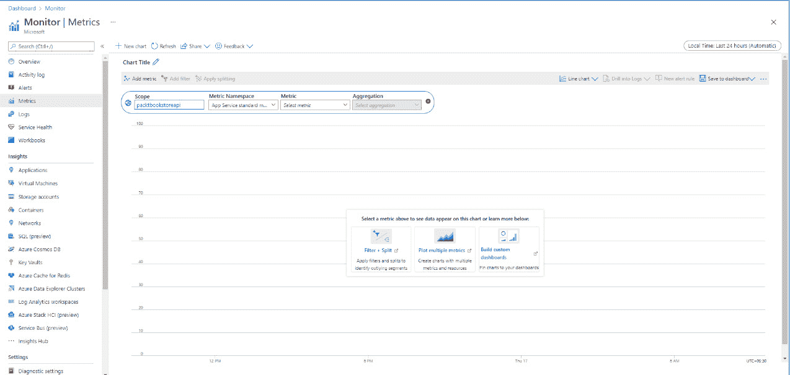

图 12.9 – Azure Monitor – 指标

1.  打开画布后，可以向其中添加一个或多个图表。图表是使用顶部的图表构建器构建的。在这里必须做出四个选择：

    +   需要为其绘制图表的资源。

    +   `TelemetryClient`。

    +   来自上一节的`GetMetric()`方法。

    +   **将多个测量值合并为图表中的一个点的数学操作**：可以选择最小值、最大值、平均值、总和或计数。

    +   要在同一个图表中添加多条指标线，请选择顶部的**添加指标**。重复前面的四个选择来配置新图表。

1.  若要将此图表作为仪表板的一部分以便于重复使用，请点击顶部的**固定到仪表板**按钮。

1.  然后可以通过右侧菜单直接访问仪表板：

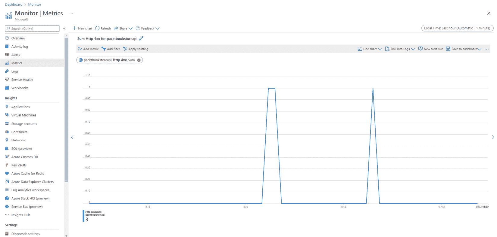

图 12.10 – App Service Http400 指标图

拥有某个指标的图表，或者在仪表板中拥有多个图表，对于调查问题非常有帮助。然而，没人喜欢一直盯着仪表板看事态进展。因此，也可以配置指标告警。

### 告警指标

就像日志条目一样，当某个指标超过或低于某个阈值时，可以通过 Azure Monitor 设置告警。需要后续跟进的日志条目可能仅与遇到问题的某个用户或客户相关。而指标则有助于检测所有用户都受某个问题影响的情况，或检测基础设施停止工作或即将停止工作的情况。

对指标创建警报的工作方式与从日志创建警报非常相似。要创建新的警报规则，请使用门户导航到 Azure Monitor，然后选择**警报**。

## 调查请求

在使用应用洞察进行日志记录和度量时，您可以使用应用洞察的许多内置功能。其中一项功能是从一个称为**搜索**的视图执行针对应用洞察收集的所有类型数据的搜索查询。

在此处，可以搜索应用洞察收集的所有信息，包括以下内容：

+   应用程序代码发出的日志，其中包括 NuGet 包和 .NET Framework。

+   **所有依赖调用**：这些是对数据库和其他系统的调用，由应用洞察自动检测到。应用洞察记录目标系统和持续时间。

+   **所有异常**：应用程序中发生的所有异常都会被应用洞察记录，即使应用程序代码已正确处理。

+   **请求**：所有通过 HTTP 进入的用户请求都会被记录。还包括重要属性，如 URL、持续时间和 HTTP 动词。

要使用搜索视图搜索特定事务，请在 Azure 门户中打开正确的应用洞察实例，然后导航到**事务搜索**菜单（**1**），以获取以下截图显示的视图：

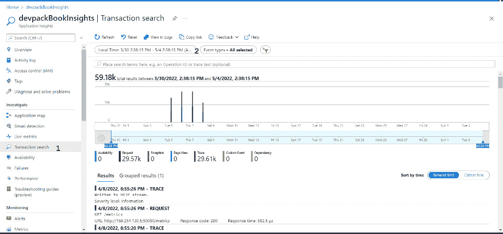

图 12.11 – 应用洞察 – 事务搜索

在**事务搜索**视图中，可以配置几个搜索参数（**2**）：

+   **要搜索的时间间隔**：默认为最近 24 小时。

+   **要搜索的事件类型**：可以是请求、日志条目、页面查看、异常、依赖调用等。

+   任何要搜索的文本。

几秒钟内，条形图显示所有匹配的结果。每个条形代表一个时间段，并显示在该时间段内有多少匹配项。在此图表下方显示所有单个匹配项。这些是所有可用事件类型的混合。

点击任何结果会打开一个新视图，显示选定的记录与所有其他类型的请求分组相关联的情况。这使您可以快速导航到应用洞察在单个用户请求执行期间收集的所有日志、依赖调用和异常。结果可以显示为列表和时间轴。

这使您能够快速查看服务器在执行用户请求时的操作：

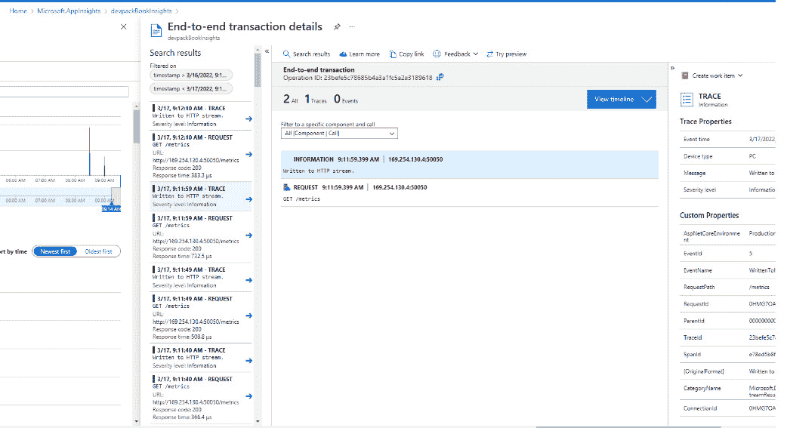

图 12.12 – 应用洞察 – 端到端交易详细信息

在所有这些用于调查应用程序并接收事件通知的手段下，决定创建哪些告警、哪些不创建是非常重要的，这不仅是为了创建一个健康的工作环境，也是为了平衡监控与新工作的关系。这是下一节的主题。

## 优化告警

一旦团队开始为应用程序添加指标并设置告警，首批告警就很快会出现。在这一点上，重要的不是仅仅响应告警，还要调查它们并关闭它们。告警还应当被评估，并视为学习的机会。

### 优化告警

创建一系列告警后，重要的是定期重新评估它们。通过这种评估，可能得出的两点结论如下：

+   **告警阈值变化**：定期评估告警涉及查看一段时间内的指标，并观察当前告警阈值的情况。这可能导致得出结论，阈值设得太低或太高。

+   **消除重复项**：查看一个月（或几个月）内触发的告警，很可能你会发现一个或多个告警组总是同时触发。例如，针对特定 Web 服务器设置的一组告警，可能是如此相关，以至于它们总是同时触发。一个常见的例子是 CPU 使用率和 HTTP 请求的平均响应时间，这两个通常会同时上升。如果是这种情况，值得考虑删除其中一个告警，或者将其中一个降级为仅警告。重复的告警增加了需要立即响应的项目数量，导致团队在没有明确好处的情况下承受更大的压力。

不断优化告警集不仅有助于减少浪费，还能防止所谓的告警疲劳。

### 告警疲劳

如果告警规则不不断地审查和更新，它们可能会对团队产生负面影响，尤其是当告警规则触发过于容易或过于频繁时，人们将不再正确响应它们。如果告警过多，团队成员会感到疲劳，对告警的反应变得麻木。无论这些告警是虚假告警还是实际告警，单纯的告警数量足以让人们进入一种不再关心的状态。

如果在团队中观察到这种情况，便是时候彻底改变告警的生成和响应方式了。如果不这样做，团队成员可能会生病或完全离开公司。

防止这种情况发生的一种方式是实施健康的值班安排。

### 捕获哪些指标

在讨论指标时，常常会有一个问题：应该发送和监控哪些指标？有许多可能的指标，关于这个问题也有更多的看法。作为一个良好的起点，以下是通常会为 Web 应用程序收集的一些指标：

+   **每分钟请求数、每分钟事务数或类似的指标**：这是一个旨在捕获 Web 应用程序当前负载或吞吐量的指标。

+   **平均响应时间**：这个指标捕获时间窗口内所有请求的响应时间。

+   `400` 及以上的状态码通常会被记录。

当这三个指标被捕获并一起绘制成一个图表时，它提供了理解应用程序行为的第一步。让我们探索几个例子：

+   当平均响应时间上升，但吞吐量（每分钟请求数）保持不变时，这可能表明托管应用程序的基础设施出现了问题。

+   当吞吐量和平均响应时间同时上升时，这可能表明流量增加，当前的基础设施无法在相同的响应时间下承受如此高的吞吐量。

+   当错误率上升，而其他指标保持不变时，这可能表明部署出现了问题，或者某个特定的代码路径开始产生（更多）错误。

当然，这些仅仅是例子，还有许多可能的场景。其他指标可以帮助排除某些特定场景或避免它们。例如，开始监控数据库负载百分比也可以帮助检测这三种场景的具体实例。如果数据库负载接近 100%，可能是时候将数据库升级到更高性能的层级，以便在相同响应时间下支持更高的吞吐量。

总结这一部分时，有一个最终的建议——在开始监控时，通常有一种倾向是专注于托管应用程序的系统。作为替代方案，也可以考虑监控那些对业务有直接影响的指标，或者反映用户满意度的指标，这些指标与应用程序的可用性相关。与仅仅监控系统相比，这种方法更接近于衡量业务价值。

以下是一些例子：

+   在一个在线商店中，每分钟销售的书籍数量可以是一个非常有价值的业务指标。试想一下，如果通过 Azure Monitor 和应用程序代码中的自定义指标，能够几乎实时地获取该指标，这对业务的影响将有多大。

+   对于一个在线阅读平台，虚拟翻页次数可以是一个有价值的指标，能够反映用户是否愉快地使用该服务。一旦该数字出现急剧下降或快速增长，可能表明出现了问题。

要找出在特定场景下哪些指标是有意义的，可能需要与业务或领域专家进行交流。

## 制定待命排班表

一旦配置了警报并开始触发，就没有必要设置警报在早上 8 点之前或下午 5 点之后不触发。换句话说，必须确保一定严重程度的警报即使在非工作时间也能得到跟进。

在许多引入警报的新公司中，存在一种隐性预期，即某些人在正常工作时间以外（除了完成常规工作任务）需要处理这些警报。有时，如果警报每年只触发一次或两次，而且没有关于响应时间的协议，这可能根本不会成为问题。

然而，在许多组织中——尤其是随着时间的推移——存在一种期望，即这些警报需要在一定时间内得到响应。此外，随着系统规模的扩大和复杂性增加，或者系统数量的增加，警报的数量也可能会增加。

应对这一问题的方式是制定待命排班表，并与工程师达成正式协议，明确他们的期望以及组织如何奖励他们的努力。这使得组织能够设定清晰的期望，并且工程师可以根据这些协议来管理自己的空闲时间。足够的系统停机时间可以帮助工程师在高压期之间放松，从而确保他们在待命时保持警觉，随时准备响应。

有很多资料讨论什么构成健康的待命排班表，什么不构成，而这里的关键词是*健康*。一些常见的建议如下：

+   在非工作时间待命的人员不应在工作时间也待命。

+   为待命的工程师提供合理的补偿，以奖励他们保持电话畅通、不受干扰等。什么是合理的补偿因情况而异，但待命的要求越高，补偿就应该越高。

+   为待命人员提供合适的工具。例如，当期望响应时间为 30 分钟或更短时，为待命人员提供一个背包，里面装有笔记本电脑、电话和上网工具。

+   确保每个员工在至少 75% 的时间内不需要待命。

+   允许员工在换休时休假，这样如果他们需要在晚上响应警报，第二天上班时可以迟到。

每次系统正常运行被打断后，无论是在工作时间还是工作时间外，都可以进行现场事故审查，了解发生了什么，并探讨如何降低再次发生的可能性。

## 现场审查

当警报触发后，团队响应并解决问题后，便是评估发生了什么的时候。这就是现场事故审查。在此，整个团队会聚集在一起，讨论以下内容：

+   发生了什么——首先，应该从事件被发现的时间开始，构建一个时间线，直到正常操作恢复为止。接下来，时间线会扩展，加入导致触发事件的相关事件。

+   接下来，将评估一系列事件，以了解响应中哪些方面做得很好。如果团队成员之一使用了新工具快速诊断了问题，这可以让团队的其他成员也受益。

+   只有在此之后，才是审视可能改进的点，并将这些点转化为团队的高优先级任务的时候。可能的故障保护被识别并安排实施，或是识别出新的警报，这些警报会在类似问题再次发生之前发送预警。

+   触发初步响应的警报或警报组会被评估，以确定它们是否足够充分或可能包含重复的警报。

最适合进行现场事件回顾的时机是事件发生后尽可能快的时间。实际上，这意味着给每个人足够的时间休息和恢复，并计划在下一个工作日召开会议。

这完成了我们对**Application Insights**和 Azure Monitor 在仪表化 Web 应用程序方面的概述。接下来的部分描述了几种将 Application Insights 和 Azure Monitor 与其他工具集成的方法。

# 与其他工具的集成

Azure Monitor 和 Application Insights 是收集应用日志和指标的出色工具，同时也能存储它们并使其可搜索。然而，开发团队或企业可能有理由更倾向于使用其他工具来可视化应用性能或响应警报。集成的一个重要驱动因素通常是某个人或团队主要使用的工具。如果一个团队主要在 ServiceNow 或 Grafana 中工作，通常将这些工具与 Azure Monitor 集成，而不是强迫这些团队使用多个工具，是一种更有用的做法。

存在许多可能的集成，以下子部分详细介绍了一些例子。

## IT 服务管理应用程序

在上一部分中，我们讨论了如何对 Web 应用程序进行仪表化时引入了操作组。操作组是执行响应警报时需要进行的一组操作。

除了丰富的内置功能外，还可以在现有的**IT 服务管理**（**ITSM**）解决方案中自动生成警报。如果公司内已有 ITSM 解决方案，那么使用 Azure Monitor 时不需要创建独立的警报渠道。相反，使用 Azure Monitor 的 ITSM 连接器可以让你通过一个解决方案来管理全公司范围的所有警报。

目前，已有与 ServiceNow、Provance、System Center Service Manager 等工具的集成。这些连接是通过 ITSM 连接器创建的。

## Azure Boards

在许多开发团队中，Azure DevOps 是开发人员花费大部分时间使用的工具。它也是他们通过 Azure Boards 进行待办事项管理的地方。

与此同时，运维人员（希望开发人员也能参与）在 Application Insights 中进行调查工作，以确定用户错误的原因并深入分析故障原因。这项调查工作可能会产生新的任务，需要在 Azure DevOps 中加入待办事项。

为了便于操作，可以通过以下步骤在 Application Insights 中配置与 Azure DevOps 的集成：

1.  在左侧菜单中导航到**工作项**选项（**1**）。这将打开以下截图中显示的视图。在这里，可以配置与 Azure Boards 的连接：

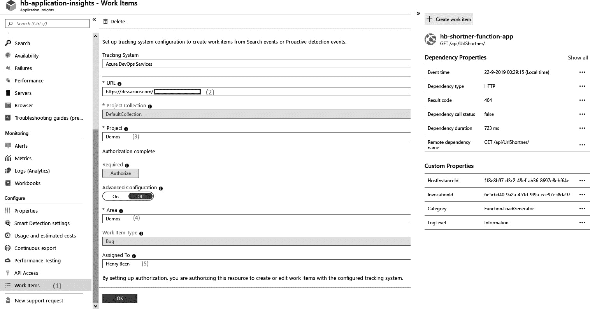

图 12.13 – Application Insights – 工作项集成

1.  要配置连接，需要填写以下详细信息：

    +   输入 Azure DevOps 链接。在此，需附加组织的名称。

    +   选择要使用的 Azure DevOps 项目。可以从下拉菜单中选择。

    +   选择一个将创建新项的产品区域。默认情况下，这与项目名称相同，除非你更改它。

    +   提供用户名称作为新工作项的默认所有者。

配置此连接后，在 Application Insights 的相关页面上将显示一个新的**+ 创建工作项**按钮。此按钮允许你在待办事项中直接创建一个包含所有相关信息的缺陷。

## Grafana

Azure Monitor 允许你构建简单、易于使用的仪表板。使用 Azure Monitor 仪表板的优势在于它们与所有其他 Azure 实践（如**基于角色的访问控制**（**RBAC**）和 Azure 资源管理器模板）完美集成。

然而，团队可能已经采用了其他可视化工具，如 Grafana。Grafana 是一个著名的平台，适用于操作仪表板。Grafana 可以配置为使用 Azure Monitor 连接，并查询指标以进行图表绘制。Grafana 还具备告警功能。

要将 Grafana 连接到 Azure Monitor，需要执行以下步骤：

1.  在你的 Azure 订阅所使用的 Azure Active Directory 帐户中创建一个新的应用程序注册。记下此应用程序注册的**租户 ID**、**客户端 ID**、**订阅 ID**和**客户端机密**属性。

1.  为应用程序注册创建一个新的 RBAC 角色分配，并至少在要监视的资源上设置**Reader**权限。

1.  在 Grafana 中配置一个新的**Azure Monitor**类型的数据源。插入在*步骤 1*中收集的用于 Azure 身份验证的属性。

1.  向仪表板添加一个新图表，选择**Azure Monitor**作为数据源。

通过执行前面的步骤，可以在几分钟内设置 Grafana 与 Azure Monitor 的连接。

# 总结

在本章中，您学习了如何开始完成 DevOps 循环。您还学会了如何处理崩溃报告，并从各种类型的应用程序中收集这些报告，以及如何为 Web 应用程序添加监控。您现在知道如何使用 Application Insights 集中日志和度量，并获取请求和依赖调用的洞察。您还学会了如何将 Azure Monitor 与其他工具集成，以进一步简化开发流程。

有了这些知识，您现在可以开始了解您的应用程序在生产环境中的运行情况。通过这样做，您不仅能更快地交付软件，还能从其使用情况中学习并开始改进。

在下一章中，您将学习如何收集用户反馈，以补充您从系统日志和度量中学到的内容。您还将学习如何衡量最终用户对您的应用程序和新功能的满意度。

# 问题

在我们总结时，这里有一份问题清单，供您测试自己对本章内容的理解。您可以在*附录*的*评估*部分找到答案：

1.  是否可以使用 Application Insights 从 Azure 平台服务中捕获自定义度量？——对还是错？

1.  在 Azure Monitor 中，平台度量的保留时间是多少？

1.  是否可以使用 Application Insights 从您自己的应用程序代码中捕获自定义度量？——对还是错？

1.  当工程师因为收到过多警报而开始忽视这些警报时，这种情况被称为什么？

1.  在 Azure 中，当警报触发时，是否可以调用 Webhook？——对还是错？

# 进一步阅读

+   关于 App Center SDK 的更多信息可以在[`docs.microsoft.com/en-us/appcenter/sdk/`](https://docs.microsoft.com/en-us/appcenter/sdk/)找到。

+   Azure Monitor 按资源类型支持的度量：[`docs.microsoft.com/en-us/azure/azure-monitor/essentials/metrics-supported`](https://docs.microsoft.com/en-us/azure/azure-monitor/essentials/metrics-supported)。

+   关于 Raygun 的更多信息可以在[`raygun.com`](https://raygun.com)找到。

+   配置 Application Insights 的更详细信息可以在[`docs.microsoft.com/en-us/azure/azure-monitor/app/app-insights-overview`](https://docs.microsoft.com/en-us/azure/azure-monitor/app/app-insights-overview)找到。

+   KQL 参考页面可以在[`docs.microsoft.com/en-us/sharepoint/dev/general-development/keyword-query-language-kql-syntax-reference`](https://docs.microsoft.com/en-us/sharepoint/dev/general-development/keyword-query-language-kql-syntax-reference)找到。
