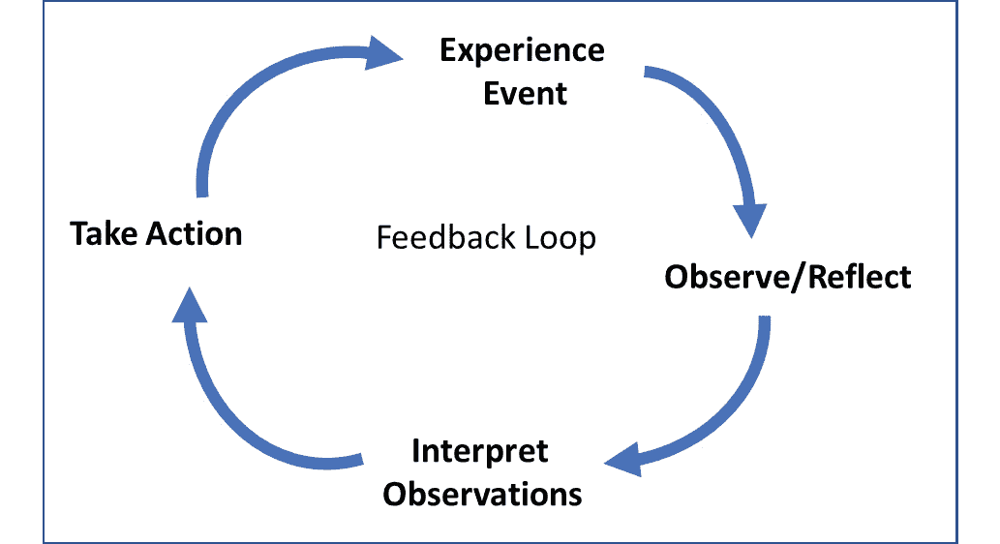

# 14

# 采纳持续改进文化

团队部署的 DevOps 策略大多围绕着按照规定的一套实践不断地、重复地进行，每次发布迭代时都要执行这些实践。然而，高绩效团队以学习的心态来处理一切，并在过程中识别改进之处，以建立更好的纪律，并成为做事的高手，如有效的**持续集成**（**CI**）/**持续部署**（**CD**）实践以提高发布灵活性，监控部署以减少故障，并及时解决生产问题。

没有任何团队能够宣称他们在实施 DevOps 实践时是完美的。必须将持续学习的文化作为团队的必备要素。因此，聆听来自各方利益相关者的反馈是改善 DevOps 卫生状况的第一步。

此外，大多数 DevOps 工具供应商，包括微软，都会定期推出新的增强功能和产品创新。团队必须不断评估并规划采用这些最新的产品功能，以最大化生产力。采纳持续改进的文化对于在 DevOps 旅程中保持相关性至关重要。

本章重点介绍**持续改进**的概念，并讨论了组织可以利用的一些方法来不断学习。

本章将涵盖以下主要内容：

+   衡量 DevOps 成功

+   价值流映射

+   数据驱动的方法

+   将反馈循环落实为操作

# 衡量 DevOps 成功

如在*第一章*《DevOps 简介》中讨论的，定义有效的指标并根据这些指标衡量结果是确保 DevOps 投资成功的关键。这也为严格遵循 DevOps 实践并随着时间的推移改进提供了强有力的动力。

从这些指标中得出的见解，激励工程团队更加关注他们的不足之处。让我们通过一些例子来说明这一点：

+   交付周期指标，如每次迭代交付的故事点数、整体生产力和每行代码交付的缺陷数量，为项目管理员提供了关于迭代进展和输出质量的见解。

+   与自动化测试相关的指标，如测试通过率、代码覆盖率和未解决缺陷，为软件在发布和部署到生产环境之前的准备情况提供了洞察。

+   在软件发布后，关于使用情况和用户活动的报告、健康监测指标以及错误数量会反映软件的采纳情况。

从分享的例子可以看出，仪表板和指标对团队的文化以及它所培养的习惯，如何实现更广泛的业务目标，具有重要影响。

将**关键绩效指标**（**KPIs**）分解为更小且更有意义的度量标准非常重要。以下是一些示例：

+   KPI – 交付时间：

    +   度量标准：冲刺速度，按严重程度划分的缺陷状态，静态代码分析结果等

+   KPI – 部署频率：

    +   度量标准：测试用例覆盖率，单元测试通过/失败率，构建自动化百分比，构建流水线数量，以及整体部署时间

+   KPI – 恢复服务的平均时间

    +   度量标准：事件解决时间，每日警报计数，服务响应时间等

+   KPI – 更改失败百分比

    +   度量标准：服务器异常，按严重程度统计的事件数量等

因此，我们可以得出结论：你计划衡量的 DevOps 指标越多，你将会在 DevOps 实践转型中观察到越显著的潜力和收益。

在下一部分，我们将讨论价值流映射的概念，以及它如何应用于减少你在 DevOps 生命周期中的浪费。

# 价值流映射

**价值流映射**（**VSM**）是一个在制造业中非常流行的概念。它指的是创建精益流程的技术，即通过尽可能少的步骤为客户生产产品。这是一种改进任何业务工作流程或过程的重要方法，从而消除浪费和不必要的步骤，尤其是从客户的角度来看。

VSM 的主要目标是对任何给定的流程进行严格分析，减少不同团队成员之间所需的交接次数，从而提高整体效率和生产力。随着数字化转型的日益重视，组织正在重新定义其业务战略，并迅速调整现有的业务/IT 流程。整体目标是根据需要重新调整*交付的价值*的定义，以便更好地为客户服务。

在 DevOps 生命周期的背景下，这可以被视为识别一种精益方法，包含了仅为客户创造价值所需的步骤。DevOps 价值流作为优化驱动因素，进而影响人员、流程和产品。主要动机是最小化浪费，同时持续交付客户价值。

在开发生命周期的各个阶段中，工作流的可视化，包括产品构思、特性优先级排序、解决方案开发以及最终发布给客户，称为价值流图。

VSM 相关活动包括三个主要步骤：

1.  首先，准备当前状态的基准。

1.  其次，定义目标未来状态，并通过分析差距或改进区域重新设计流程。

1.  最后，分析 VSM 带来的收益，以便进一步迭代。

受 VSM 活动影响的两个主要 KPI 如下：

+   **交付时间**（**LT**），也称为吞吐时间、响应时间和周转时间。基本上，这指的是从工作作为输入进入价值流的某个特定阶段开始，到完成并交付到价值流中的下一个阶段或团队的经过时间。

+   **处理时间**（**PT**），也称为加工时间、接触时间、工作时间和任务时间。基本上，这是一个人完成所有任务以将输入转化为输出所需的时间，适用于单个工作单位。

你可以在这里阅读更多关于如何将 VSM 应用于 DevOps 的内容：[`www.lucidchart.com/blog/value-stream-mapping-for-devops`](https://www.lucidchart.com/blog/value-stream-mapping-for-devops)。

在下一节中，我们将探讨管理团队如何通过将焦点集中在最需要关注的领域，显著受益于数据驱动的 DevOps。

# 数据驱动的方法

通过数据驱动的方法制定改进策略已被证明对大多数组织有效。通过采纳数据驱动的文化，提升 CI/CD 过程并加速软件交付和质量具有巨大的潜力。大多数高性能工程团队通过跟踪的各种仪表板和 KPI 获得见解，并利用这些见解识别改进的领域并进行相应的调整。

让我们来看一下数据驱动的 DevOps 的一些关键方面：

+   **客观地衡量重要事项**：一切都从识别必须跟踪的重要指标和关键绩效指标（KPI）开始，所有的测量应该是定量的，而非定性的。有人说过，事实和数字不会说谎。测量项必须扩展到推导出具体可执行的项目。

+   **与基准对比报告**：你使用的报告工具必须持续生成报告，以供各方利益相关者使用。必须定义一些初步的基准，并且报告应该跟踪与这些基准的偏差。任何偏差都必须突出显示以便采取措施。

报告和后续分析必须是一个定期的活动（至少每周一次，如果不是每天的话），以便尽早进行课程调整。

+   **自动化数据交付以便立即采取行动**：及时获取数据以便采取纠正措施非常重要。因此，我们必须依赖现有的自动化工具，或探索更多机会以改进数据捕获和通知流程。如今大多数 DevOps 工具都具备丰富的自动化功能，使得决策更加容易。

例如，当**拉取请求**（**PR**）提交时，构建运行会检查变更的质量，并且如果有任何自动化测试失败，它可以立即向开发者发送电子邮件。这样，开发者可以修复问题并重新提交他们的更改，而不是等待几个小时才能得到完整的结果。

+   **为决策者提供洞察**：衡量数据驱动的 DevOps 流程的成功对于任何组织都至关重要。通常有两个关注领域——首先是提供有关工程生命周期健康状况的洞察的 KPI，其次是作为领导团队反馈的主要 DevOps 成熟度指标。

团队还必须定期进行数据审查和分析，以识别改进机会。使用**因果分析与解决方案**（**CAR**）和**鱼骨分析**等技术可以帮助团队识别问题的根本原因，并采取相应的行动。你可以在文末的*进一步阅读*部分找到更多相关资源。

在下一节中，我们将探讨反馈循环如何有助于持续改进。

# 反馈循环的操作化

反馈循环的概念起源于**系统思维**。每个组织都可以被建模为一个系统，即指由人、流程和工具相互连接的生态系统，它有序协同运作以实现业务目标或结果。反馈是系统思维中的一个重要概念，其中刺激有助于控制系统的输出。

如果你对*反馈循环*这一术语不太熟悉，可以将其想象为实体或过程之间相互连接的关系，其中一个变化会导致第二个变化，最终再反作用于第一个变化。这就像是一个因果链，其中事件或活动的结果产生的数据被用来通过控制原始输入行为来调节结果。下面是反馈循环的简化视图：

图 14.1 – 简单反馈循环

组织中的 DevOps 流程可以通过识别与持续改进目标相一致的适当反馈循环，进行系统思维分析。反馈循环有两种类型：

+   **强化反馈循环**：第一个实体输出的正向变化或增加会导致第二个实体的增加（正反馈），最终导致第一个实体的进一步增加。

例如，随着团队生产力的提高，总体速度增加。然而，存在一个拉伸极限，超过这个限度，质量可能会受到影响。

+   **稳定/平衡反馈循环**：第一个实体输出的正向变化或增加作为信号，促使第二个实体减少（负反馈），最终导致第一个实体的输出进行调整，将其重新带回平衡状态。

例如，当团队专注于 CI/CD 过程中的更多质量相关检查时，这会增加整体构建时间，从而减少发布的灵活性。因此，团队随后被迫优化步骤，以便将发布的灵活性恢复到最佳状态。

在下一部分，我们将探讨设计有效反馈循环的重要性。

## 实施有效的反馈循环

从之前研究的示例来看，很明显并非所有的反馈循环都是重要的。因此，组织必须设计更有效的反馈循环，并放大正确的循环，以在交付灵活性、产品质量和软件发布速度之间达到正确的平衡和取舍。以下是一些初步指导建议：

+   确保自动通知能及时得到处理，并进行定期的根本原因分析，以减少其发生。

+   利用 VSM 技术来发现任何没有增加价值的冗余反馈循环。

+   在反馈系统中实现稳定性与积极变化之间的正确平衡。通常，稳定性比速度更为重要。

+   让关键利益相关者参与到反馈循环中来。人际互动可以提供更具实践性和背景性的指导，这对你的团队可能非常有益。

+   利用操作遥测和度量指标作为关键反馈，以改进你的 DevOps 实践。

有一句流行的说法，"一刀切"的做法在任何情况下都无法奏效。因此，需要谨慎规划，以识别对你的组织和团队背景重要的反馈循环。

# 总结

在本章中，我们回顾了一些促进持续改进过程的重要技术。为了获得 DevOps 的真正好处，组织应在最高水平的成熟度下运营。然而，由于许多有时超出控制的因素，这种情况很少发生。因此，通过建立持续改进的文化，团队可以确保流程、方法和实践尽可能高效和有效。

遵循系统化和结构化的持续改进方法对团队来说可能是相当有益的。这需要组织对持续学习的承诺，以及团队在审查和建议渐进改进方面的开放态度。必须指定专门的角色来定义、规划和监控持续改进的举措。

此外，必须为所有人员规划定期的 DevOps 相关主题培训，作为自驱动团队的刺激来源，以便他们保持对组织 DevOps 改进的承诺。团队文化是通过展示在各种 DevOps 实践中的专业知识来实现工程卓越的基础。

在下一章中，我们将探讨组织如何通过 DevOps 加速其云转型之旅。

# 活动

+   组织你的团队并进行头脑风暴会议，最好使用白板工具。

+   创建三个垂直泳道——**保持**，**改进**，和**丢弃**。

+   使用便签纸，建议你的团队将他们的想法发布到白板上。基本上，识别现有的流程，并将它们分组到适当的泳道中。

+   认真分析被归为“丢弃”类别的项目，然后验证它们在实现质量和效率的总体目标时，是否为其增加了任何价值，特别是从客户的角度来看。

+   同时，识别现有流程的改进领域，可以通过简化流程或进行变更来实现。

+   与管理团队发布你的发现总结。

# 进一步阅读

+   鱼骨分析方法： [`citoolkit.com/articles/fishbone-diagram/`](https://citoolkit.com/articles/fishbone-diagram/)

+   *因果分析与解决方案*： [`www.wibas.com/cmmi/causal-analysis-and-resolution-car-cmmi-dev`](https://www.wibas.com/cmmi/causal-analysis-and-resolution-car-cmmi-dev)

+   优化你的 CD 管道： https://www.atlassian.com/continuous-delivery/principles/value-stream-mapping

+   *如何构建基于数据驱动的 DevOps 决策文化*： [`www.launchableinc.com/how-to-build-a-data-driven-devops-decision-making-culture`](https://www.launchableinc.com/how-to-build-a-data-driven-devops-decision-making-culture)

+   *理解 DevOps 中的反馈循环*： https://otomato.io/udnerstanding-feedback-loops-in-devops

+   系统思维反馈循环： https://medium.com/@myroslavazel/feedback-loops-in-system-thinking-7ef06e2ff310

+   VSM： [`www.devopsinstitute.com/devops-value-stream-mapping-a-box-score-based-approach/`](https://www.devopsinstitute.com/devops-value-stream-mapping-a-box-score-based-approach/)
