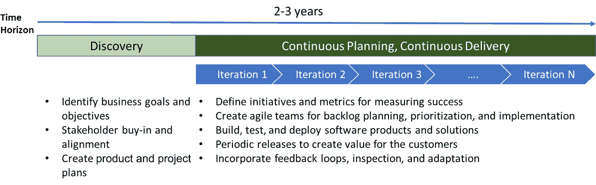
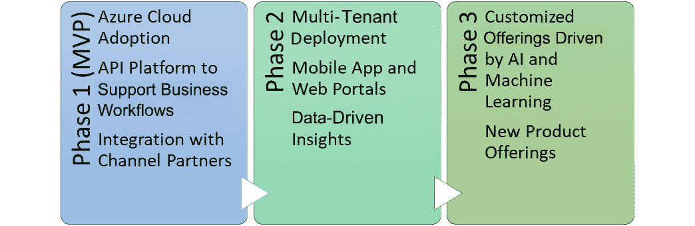

# 15  

# 通过 DevOps 加速云 adoption  

数字化转型的计划侧重于利用现代和新兴技术在市场中提供竞争优势。采用基于云的技术已成为其中的重要组成部分。同样，DevOps 在加速云 adoption 旅程中也扮演着至关重要的角色。  

然而，组织必须首先拥抱实验文化，摆脱过时的工作方式，转向精益且迭代的软件开发方法论。DevOps 提供了恰到好处的工具、实践和文化理念，使得组织能够采纳云平台并快速交付高质量的应用程序。  

本章将涵盖以下主要内容：  

+   DevOps 在数字化转型中的角色  

+   现代化与云 adoption  

+   管理软件交付的现代化  

+   敏捷转型与迭代规划  

+   将 DevOps 整合到云 adoption 计划中  

# DevOps 在数字化转型中的角色  

对于任何企业来说，数字化转型就是利用现代和新兴技术为客户创造价值，并最终为更高的收入创造机会。为了在竞争激烈的市场中生存，别无选择。  

DevOps 凭借其全面的理念，致力于最大化人、流程和工具的优势，从而增加组织成功的机会。随着对自动化的高度关注，现代云平台的发展消除了许多之前存在的瓶颈。高质量产品的上市时间大大缩短，同时所需的资金也减少了。DevOps 的核心是优化，能够在相同的资源和人员条件下实现更多。它旨在通过技术改善任何现有的业务流程。此外，开发和运维团队目标的融合为团队之间更好的协作提供了合适的合作氛围。  

DevOps 在数字化转型中的角色包括以下内容：  

+   推动文化心态的变革，鼓励自动化的采纳  

+   通过打破组织的壁垒，促进团队之间的协作，从而提高整体劳动力的生产力

+   减少与任何手工或低效过程相关的浪费和成本  

+   加速产品创新周期，从而缩短上市时间  

+   创造机会以最小的干扰现代化现有的 IT 资产  

在接下来的章节中，我们将回顾 DevOps 在组织现代化和云 adoption 过程中所带来的好处。  

# 现代化与云 adoption  

尽管云技术已经存在了一段时间，但它们对企业的影响在 Covid 疫情爆发时（2020 年初）变得显而易见。那些已经投资于业务现代化的组织能够在最小或没有影响的情况下生存下来，而许多传统企业则遭受了巨大损失。这里有一篇有趣的文章，解释了疫情的影响以及未来工作将如何展开：[`www.mckinsey.com/featured-insights/future-of-work/from-surviving-to-thriving-reimagining-the-post-covid-19-return`](https://www.mckinsey.com/featured-insights/future-of-work/from-surviving-to-thriving-reimagining-the-post-covid-19-return)。

IT 和业务领导者意识到，采用云计算技术是提供服务的前进方向。IT 不再仅仅被视为一种支持工具；相反，它成为了在市场中生存的重要工具。现代初创公司通过利用技术创造差异化的价值主张来吸引客户。企业也已经开始效仿，数字化转型旅程中的关键战略之一就是云计算的采用。

虽然云计算和 DevOps 是相互独立的概念，但后者对于通过云技术的采用来实现商业目标至关重要。因此，DevOps 已经成为企业确保业务持续性的核心优先事项。无论是优化 IT 支出、简化开发流程、团队间协作、提供更高的服务可靠性等，DevOps 都涵盖了您 IT 战略的方方面面。

## DevOps 是现代化的基础

有一句流行的说法，任何结构都注定会在没有坚实基础的情况下崩溃。同样，在现代化旅程中，围绕您的 DevOps 实践建立严格的流程至关重要。

DevOps 在现代化中的关键好处如下：

+   通过自动化提高敏捷性

+   通过更好的内部协作提高生产力

+   更高的客户和员工满意度

## DevOps 推动云计算的采用

云计算及相关技术，如自动化、**人工智能**（**AI**）、设备等，为您的业务开辟了广阔的可能性。生产力和敏捷性的提升带来了盈利，自动化降低了 IT 成本，实时监控和反馈循环改善了客户体验。

DevOps 在云计算采用中的关键好处如下：

+   基础设施现代化的自动化、按需供应和扩展

+   减少 IT 管理开销，将许多任务外包给云服务提供商

+   与多种其他平台或产品的无缝集成

+   增强的部署敏捷性，提高市场进入时间

在下一部分，我们将回顾 DevOps 如何影响企业内部任何软件现代化计划的路线图。

# 管理软件交付现代化

随着组织开始现代化旅程，它们需要准备一份具有明确目标和目的的路线图，以便衡量其成功和结果。通常，DevOps 实践影响软件交付现代化的四个主要支柱，即 **软件生命周期管理**、**解决方案架构**、**自动化实践** 和 **云平台采纳**：

图 15.1 – DevOps 对软件交付现代化的影响

让我们在接下来的部分中回顾 DevOps 在四个支柱中的角色。

## 软件生命周期管理

组织必须采用迭代开发方法论，以实现发布过程的更高敏捷性。敏捷和看板方法比传统的瀑布式软件开发生命周期方法更能提供灵活性和适应性。

## 解决方案架构

所有现代化旅程通常涉及两组行动：

+   将遗留应用程序迁移到基于云的平台

+   利用创新技术开发新软件产品

两者都需要将目标解决方案架构目标从传统的单体架构转向更加微服务化的架构。然而，对于遗留工作负载，将会面临影响其转型的挑战。

团队通常部署三种关键策略来支持云采纳旅程中 IT 资产的现代化：

+   **重新托管** – 识别属于提升和迁移类别的资产，并将其迁移到新的云平台基础设施。这些通常是独立应用程序，依赖关系最少。这为企业提供了从云端启动运营的即时能力。

+   **重构** – 这通过对应用程序进行小的结构性改动并重新包装，以充分利用云平台的功能。

+   **重建** – 某些应用程序（通常占现有资产的 10-15%）必须重新设计，以便充分利用云平台的功能。这些应用程序必须完全重新开发，并采用云原生架构。

DevOps 实践，如 *基础设施即代码*、*配置管理*、*测试自动化* 和 *应用性能监控*，可以在提高迁移过程的整体效率中发挥重要作用。

## 自动化实践

自动化是更快交付市场的关键。在 DevOps 中，你将开发和运营流程合并成一个统一的自动化管道，使所有软件组件不断地构建、集成、测试和部署。你淘汰任何手动流程，目标是实现软件开发的 100%自动化。这确保了整体质量，并提高了发布软件的可靠性。

## 云平台采纳

使用云原生设计方法实施所有软件产品和解决方案。这提供了更高的效率，从而使组织能够专注于其核心业务优先事项，而不是管理基础设施。基于**平台即服务**（**PaaS**）模型构建的解决方案提供更好的可扩展性和可管理性，能够快速适应不断变化的客户需求。平台供应商提供的现成监控能力使得检测故障和采取纠正措施相对容易。

在接下来的部分，我们将讨论如何在云转型过程中采纳迭代规划，以交付价值。

# 敏捷转型和迭代规划

敏捷转型指的是在组织内采用基于敏捷的项目规划策略，以实现其愿景。所有团队都按照敏捷方法论的核心价值观和原则进行工作。因此，你可以观察到团队整体文化和行为的显著变化。

敏捷项目管理的核心是逐步交付商业价值，同时保持应对变化的灵活性。像其他实践一样，规划也必须是持续进行的。将项目组合（或产品待办事项）与业务目标和计划对齐，并分配团队执行这些任务，同时根据客户需求或业务优先级的变化不断调整。

## 转型路线图

创建敏捷转型路线图从来都不容易，因为每个团队及其需求都是独特的。然而，通过遵循敏捷原则，你可以推导出一个敏捷转型路线图，作为团队的某种蓝图。

一个高层次的敏捷转型路线图示例大致如下：

图 15.2 – 转型路线图

更详细的敏捷转型路线图应捕捉关键的里程碑，这些里程碑可以作为创建更详细计划的基础。详细计划将捕捉更多有关路线图项目和实现这些项目的行动计划的信息。这些计划有助于将团队的思维方式转向实现敏捷转型。

你可以在这里阅读更多关于迭代规划最佳实践的内容：[`www.scaledagileframework.com/iteration-planning/`](https://www.scaledagileframework.com/iteration-planning/)。

在下一部分，我们将回顾如何通过案例研究准备云采用计划。

# 在您的云采用计划中整合 DevOps

DevOps 和云采用已经从根本上改变了团队构建和部署应用程序的方式。事实上，在过去的几年里，组织通过采用 DevOps 实践，真正意识到了云平台的强大潜力。

微软提供了云采用框架，其中列出了组织可以采用的某些原则和指导方针，以制定云采用计划。您可以在此处了解更多有关微软 Azure 云采用框架的内容：[`docs.microsoft.com/en-in/azure/cloud-adoption-framework/overview`](https://docs.microsoft.com/en-in/azure/cloud-adoption-framework/overview)。

微软还提供了有关使用微软良好架构框架在云端构建应用程序的优秀指导。您可以在此处阅读更多内容：[`docs.microsoft.com/en-us/azure/architecture/framework/`](https://docs.microsoft.com/en-us/azure/architecture/framework/)。

在下一部分，我们将考虑一个案例研究，并了解一些关键的 DevOps 策略，这些策略可以在组织的云采用过程中应用。

## 案例研究

作为本案例研究的一部分，我们将考虑一个情况，其中名为 Packt 保险公司的公司希望对其应用程序进行现代化，并将其部署到 Azure 云平台上。

重要提示

本案例研究旨在模拟现实世界中的场景。然而，它并非旨在全面覆盖所有业务需求或场景。

### 关于 Packt 保险公司

Packt 保险公司是一家在 10 多个国家（涵盖美洲和欧洲）有业务的公司，向客户提供广泛的保险产品和服务。

在过去的几年里，Packt 保险公司的年增长未能与市场机会相匹配。由于缺乏市场适应性、创新周期过长以及由于使用传统的**业务线**（**LOB**）应用程序而导致的员工生产力低下和协作不畅，它逐渐在竞争中处于劣势。其云平台的使用非常有限，大多数应用程序仍然是本地部署解决方案。

在最近召开的董事会会议上，团队决定通过云采用计划加速数字化转型进程。Packt 保险公司希望通过云优先和移动优先的核心战略，甚至对其业务应用进行现代化。

在接下来的章节中，将提到关键的业务驱动因素和利益相关者的观点。对于这个案例研究，它旨在展示每个利益相关者如何看待业务问题及其对目标解决方案的要求。

### 关键的业务驱动因素

+   在接下来的 2-3 年内，成为一个基于云的数字化企业

+   提高推出新服务的速度，使其与市场趋势保持一致

+   在新的地区和地理位置扩展业务

### 利益相关者的优先事项

+   **首席执行官**：

    +   实现超过 10-15%的增长，通过扩展产品供应、扩大分销渠道，并加强与渠道伙伴的整合。

+   **首席技术官（CTO）**：

    +   我不想预先投资于 IT 基础设施，而是随着业务扩展逐步增加支出。

    +   我想了解我们业务单元的盈利能力。我希望能获取能够帮助我做出决策的业务洞察。

    +   很高兴了解客户对我们喜欢和不喜欢的看法。

    +   我希望在这个领域被称为技术创新者/先锋，并吸引新一代技术精通的人才。

+   **IT 运营**：

    +   采用现代实践，为企业的基于云的解决方案开发和部署。

    +   确保符合安全和数据隐私标准。

    +   新分支办事处的入职应快速且无缝。

+   **产品经理**：

    +   将新保险产品的周期时间从当前的 6-8 个月减少到最多 2-3 个月

    +   如果精算规则可以直接更新而无需任何 IT 干预，那将是非常好的。

### 现代化路线图

Packt 保险公司的高管们已将其核心 LOB 应用现代化的 IT 计划划分为三个阶段：

图 15.3 – 现代化路线图中的阶段

在上述图中，您可以看到以下内容：

+   **第 1 阶段** – 在此阶段，将发布面向**最小可行产品**（**MVP**）的优先能力列表。此阶段的目标是快速使平台的第一个版本运作起来。

+   **第 2 阶段** – 这是*第 1 阶段*的延续，团队将启动下一组优先级能力。通常在这个阶段，将发布首个版本的移动应用程序和 Web 门户。

+   **第 3 阶段** – 这将是持续创新阶段，其中利用 AI 和机器学习能力推动新的产品提供和改进整体部署的数字服务。

## 常见挑战及 DevOps 的解救

Packt 保险公司的团队采用了 DevOps 实践和习惯，激活了云转型旅程的潜力。

团队采取的各项行动的高级摘要在此处给出：

+   云上线和治理 – 它建立了一个**云卓越中心**（**CCoE**），整合了运营和开发团队，并为云基础设施建立了治理程序。

+   组织变革管理 – 它组织了关于敏捷方法和现代 DevOps 实践的培训，更加专注于推动文化变革。

+   项目组合管理 – 它定义了关键的业务目标，确定了产品和服务的列表，并创建了执行的敏捷团队。

+   持续规划 – 它创建了高层次的发布里程碑，然后根据这些里程碑优先处理待办事项。团队计划在前 6 个月发布 MVP（最小可行产品），然后根据已识别的阶段计划每 3-6 个月发布一次增量的重大版本。

+   自动化生命周期 – 它投资于自动化实践，以提高开发、测试和产品部署的可预测性。工程团队在不妥协质量的情况下达到了良好的开发速度。

+   传统工作负载迁移 – 它最初部署了一个混合云设置，保留了一些本地应用程序。然而，在适当的时机，这些应用程序被淘汰并为云环境重建。

+   衡量成功 – 它识别了关键的 DevOps 指标并有效地跟踪这些指标，以衡量其成功。

+   使用的 DevOps 工具 – 它使用了 Azure DevOps、GitHub 和 Azure Monitor 作为实施各种 DevOps 实践的主要工具。

因此，我们可以观察到 DevOps 影响着软件开发生命周期的所有领域，并且影响着组织内的变更管理。

# 总结

在本章中，我们回顾了云平台的采用如何减少市场发布时间，并创造推动业务转型的机会。无论是通过自动化管理云基础设施，利用监控能力优化 IT 支出，还是规划和发布优质产品，DevOps 都涉及到云基础数字化转型过程的方方面面。

云技术还使得团队能够在远程地点工作，以支持混合工作环境。云技术使团队能够使用所需的工具进行协作，而不会浪费任何时间或功能。研究（DORA 报告）表明，随着时间的推移，DevOps 和云采用将在未来几年大幅增加，直到它们成为所有组织的常态。总的来说，我们可以得出结论，当执行得当时，DevOps 和云采用策略能够显著影响组织的盈利能力。

在下一章中，我们将探讨在构建可扩展应用程序时使用容器的方式。

# 额外阅读

+   敏捷发布火车: [`www.scaledagileframework.com/agile-release-train/`](https://www.scaledagileframework.com/agile-release-train/)

+   微软云采用框架: [`docs.microsoft.com/en-in/azure/cloud-adoption-framework/overview`](https://docs.microsoft.com/en-in/azure/cloud-adoption-framework/overview)

+   通过 DevOps 进行现代化和云采用: [`www.elyonstrategies.com/blog/modernization-and-cloud-adoption-devops`](https://www.elyonstrategies.com/blog/modernization-and-cloud-adoption-devops)

+   DevOps 和云计算: [`www.rishabhsoft.com/blog/devops-and-cloud-computing`](https://www.rishabhsoft.com/blog/devops-and-cloud-computing)

+   云迁移决策: https://hentsu.com/cloud-adoption-decision-making-rehost-refactor-or-rebuild/

+   敏捷转型： [`premieragile.com/steps-to-agile-transformation`](https://premieragile.com/steps-to-agile-transformation)
