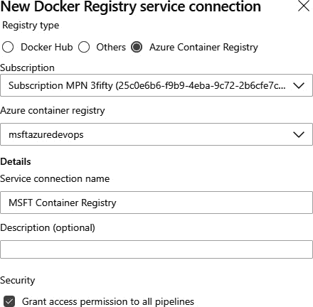
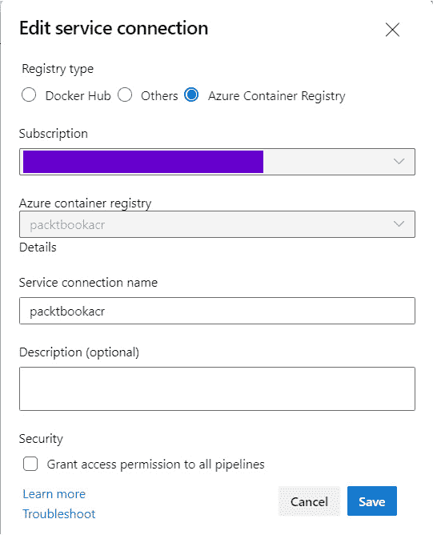

# 容器

在过去几年中，容器已成为热门话题。它们允许您打包任何应用程序或工具，使用任何语言编写，并在基本主机或集群上部署。在实施 DevOps 时，容器可以提供巨大的价值。这就是为什么 DevOps 和容器经常被同时提及的原因。然而，它们并不是同一回事。虽然 DevOps 是一种文化，但容器是一种技术，是一种托管应用程序的替代方式。

在本章中，您将学习有关容器及其工作原理的更多信息。通过练习，可以创建自定义容器镜像，并在不同的托管平台上运行，例如 Azure 容器实例和 Kubernetes。

本章将涵盖以下主题：

+   容器简介

+   构建容器镜像

+   在 Azure DevOps 中构建镜像并在 Azure 中运行

+   Kubernetes 简介

+   Kubernetes 实践

+   升级容器

+   扩展容器和 Kubernetes

+   使用 Azure DevOps 部署到 Kubernetes

# 技术要求

要尝试本章描述的技术，您需要以下一项或多项：

+   Docker Desktop

+   Visual Studio 2019/Visual Studio Code

+   Azure 订阅

+   Azure 命令行界面（CLI）

所有这些都可以免费获取，或者可以免费获取一段时间用于评估。

# 容器简介

容器是虚拟化的进化。通过虚拟化，物理机的资源被多个虚拟机共享。共享这些资源意味着所有虚拟机都有自己的操作系统。但是使用容器时情况有所不同。容器不仅共享资源，还共享操作系统内核，因此与虚拟机镜像相比，它非常小。

由于共享操作系统内核，容器也非常易于移植。镜像可以部署在支持运行容器的任何类型的主机环境上。这是因为所有应用程序的二进制文件和配置都存储在容器内部。因此，容器外部的环境变量不会影响应用程序。

当然，有一些注意事项，例如容器共享操作系统内核。

容器提供了在单个操作系统上运行多个工作负载的能力。下图展示了常规托管、虚拟机托管和容器之间的区别：


图 16.1 – 从虚拟化到容器

如果您听说过容器，几乎肯定也听说过 Docker。这是因为 Docker 是最知名的容器引擎之一，可用于运行容器。

下一节将深入探讨 DevOps 和容器，而本章的其余部分将更详细地介绍容器的技术细节。

## DevOps 和容器

如在介绍中所提到的，DevOps 和容器并不是同一回事。容器是让 DevOps 变得更容易的技术。这是因为容器具有使其成为 DevOps 完美工具的优势：

+   **一致性**：因为您构建了容器镜像，"*它在我的机器上可以工作*"这一障碍被消除了。

+   **关注点分离**：使用容器时，您的应用程序将被分布在多个独立的容器中，这使得维护和分离进程变得更加容易。

+   **平台**：该解决方案可以在不同的平台上运行。无论是在 Microsoft Azure、Amazon Web Services、Google Cloud，还是本地环境中，包括甚至是您的开发机器上，都不重要。

此外，DevOps 更偏向文化而非技术，正如在*第一章*《DevOps 简介》中提到的那样，技术组件用于支持 DevOps。在本章的其余部分，我们将关注技术层面的内容。

## 托管选项

如前所述，容器的一个好处是它们具有极强的可移植性。这也意味着容器可以托管在多种平台和技术上。

为了运行容器，您有许多选项，这些选项将根据您的使用场景有所不同。以下是其中一些选项：

+   Azure 应用服务

+   Azure 服务网格

+   Docker Swarm

+   Docker Desktop

+   Kubernetes

根据应用程序/容器的需求，它可以在前面提到的所有选项中运行。

用于运行容器的镜像（容器镜像）也需要托管。这些镜像托管在所谓的容器注册表中。在容器注册表中，它们可以是私有发布或公开发布的。最著名的两个注册表是 Docker Registry 和 Azure 平台中的 Azure Container Registry。

现在我们已经了解了一些有关容器的背景信息，接下来我们将深入探讨容器背后的技术，了解创建自定义容器镜像所需的内容。

# 构建容器镜像

本节将带您了解构建容器镜像并在本地系统上执行它的过程。为此，我们将首先创建一个应用程序，然后为其添加 Docker 支持，接着创建镜像并最终进行测试。那么，开始吧！

## 创建应用程序

要测试和检查容器中正在运行的内容，需要一个应用程序。为此，可以创建一个新的应用程序，也可以使用现有的应用程序。

在创建一个新的应用程序时，最简单的选择是在 Visual Studio 2019 中使用默认的 ASP.NET Core 网站模板。容器支持可以通过几个点击轻松添加。只需在创建项目时勾选**启用 Docker**框即可：


图 16.2 – 带有 Docker 支持的 ASP.Net Core 新应用程序

保持新应用程序打开，或者打开现有的应用程序。在下一部分，我们将探讨如何向现有应用程序添加 Docker 支持。

## 向现有应用程序添加 Docker 支持

向现有应用程序添加 Docker 支持只需要几个简单步骤：

1.  在 Visual Studio 2019 中打开项目/解决方案，并右键单击项目。

1.  选择**添加**并选择**Docker 支持**：


图 16.3 – 带有 Docker 支持的 ASP.Net Core 现有应用程序

根据客户端工具和 Visual Studio 配置，也可能会有一个**容器编排器支持**选项。通过此选项，可以选择您选择的云编排器。在此示例中，我们使用了 Docker Compose，因为这种格式得到了主要容器编排器的支持。然而，确实存在其他云编排器选项：

+   Docker Swarm

+   Kubernetes

+   Mesos Marathon

根据使用的云编排器，项目中会添加一个特定格式的文件，适用于该编排器。

通过添加 Docker 支持，项目中会添加一个名为 `Dockerfile` 的新文件。Dockerfile 是容器镜像的规范。Docker 可以读取该文件，将其视为指令。该文件是一个文本文件，包含单独的命令，这些命令也可以在命令行工具中调用以组装镜像：

```
FROM mcr.microsoft.com/dotnet/aspnet:3.1 AS base
WORKDIR /app
EXPOSE 80
EXPOSE 443
EXPOSE 555
FROM mcr.microsoft.com/dotnet/sdk:3.1 AS build
WORKDIR /src
COPY ["WebApplication2.csproj", "."]
RUN dotnet restore "WebApplication2.csproj"
COPY . .
WORKDIR "/src/"
RUN dotnet build "WebApplication2.csproj" -c Release -o /app/build
FROM build AS publish
RUN dotnet publish "WebApplication2.csproj" -c Release -o /app/publish
FROM base AS final
WORKDIR /app
COPY --from=publish /app/publish .
ENTRYPOINT ["dotnet", "WebApplication2.dll"]
```

这个示例使用了一种称为多阶段构建文件的技术。这是因为该文件使用了多个`FROM`语句，其中有对特定镜像的引用。

在多阶段构建之前，无法使用多个 `FROM` 语句。在那时，构建高效的容器镜像是非常困难的。文件中的每个语句代表镜像上的一个附加层，导致镜像变得越来越大。

在此构建过程中，还需要移除一些在该过程中需要的组件。因此，在开发和生产环境中使用单独的 Dockerfile 文件是非常常见的做法。

如前所述，Dockerfile 包含了一些指令，最常用的指令如下：

+   `FROM` 命令用于指定镜像将基于哪个操作系统或基础镜像。在前面的示例中，使用 `mcr.microsoft.com/dotnet/aspnet:3.1 AS` 基础镜像来构建应用程序的生产版本。

+   `RUN` 命令用于在容器镜像的构建过程中安装组件或执行操作。

+   `ENTRYPOINT` 命令指定容器镜像的入口点。在前面的示例中，入口点指定为一个 .NET 应用程序，该应用程序引用了在编译过程中构建的库。

到目前为止，我们已经创建了应用程序并添加了 Docker 支持。接下来，我们将学习如何使用该应用程序创建镜像。

## 使用应用程序创建镜像

为了能够创建 Docker 镜像，必须安装 Docker Desktop，因为 Visual Studio 使用它来构建镜像。完成 Dockerfile 后，可以使用以下步骤构建镜像：

在 Visual Studio 中右击 Dockerfile 并选择**构建 Docker 镜像**：


图 16.4 – 一个 Asp.Net Core 应用程序构建的 Docker 镜像

在编译和构建镜像时，查看输出窗口。查看它将为你提供有关容器镜像分层方法的更多见解。

Docker Desktop 还可以让你在本地运行和存储镜像。构建镜像后，打开终端并运行以下命令：

```
docker images
```

该命令显示机器上当前所有的镜像。在此列表中，也列出了在创建镜像时下载的基础镜像：


图 16.5 – Docker 镜像列表

我们已经看过如何添加 Docker 支持并为现有和新的 ASP.NET Core 应用程序制作 Docker 镜像。接下来的部分将探讨如何运行容器镜像。

## 运行容器镜像

容器镜像可以通过在 Docker 中运行来本地启动。现在我们有了容器镜像，可以创建一个容器：

1.  运行以下 `docker container run` 命令：

    ```
    docker container run --publish 8123:80 --detach --name [container name] [image name]
    ```

前述命令将在命令末尾指定的容器镜像启动。此外，还指定了不同的参数：

+   `publish` 参数从主机打开一个端口到容器。如前一部分中的示例所述，这将打开端口 `8123` 并将流量路由到容器内的端口 `80`。

+   `detach` 参数将使容器在后台运行，并打印出其特定的 ID。

+   **Name**: 容器在 Docker 中的名称。

1.  要列出所有正在运行的容器，请在终端中使用**docker ps**命令。

1.  容器运行后，打开浏览器并访问 `http://localhost:8123`。如果一切正常，应该会显示一个默认的 ASP.NET Core 网页：


图 16.6 – ASP.Net Core 默认欢迎页面

由于在本地构建东西并在你的机器上运行并不是 DevOps 的做法，接下来的章节中我们将转向不同的托管平台。

# 在 Azure DevOps 中构建镜像并在 Azure 中运行

为了支持持续集成和持续交付，源文件需要在一个仓库中共享。因此，让我们在 Azure Repos 中共享资源，并尝试通过 Azure Pipelines 构建我们的容器。在构建容器镜像之后，还需要一个存储镜像和运行容器的位置。在 Azure 平台上，有两个非常适合这种场景的服务：

+   **Azure 容器注册表** (**ACR**)：该服务是基于开源 Docker 注册表的托管私有 Docker 注册表。在这里，您可以维护和注册容器镜像。

+   **Azure 容器实例**：**Azure 容器实例**，也称为 **ACI**，是一种运行隔离容器的解决方案，无需大量管理。

重要提示

为了简化本指南，文件已被添加到仓库中，Azure 资源也已创建。

在下一部分中，我们将探索如何在 ACR 中创建镜像并通过 Azure DevOps 在 ACI 中运行它们。

## 创建服务端点

正如本书中已讨论的，Azure DevOps 与外部服务（如 Azure 和容器注册表）的连接是通过服务端点配置的。由于 ACI 需要访问镜像，因此必须将镜像发布到容器注册表。Azure DevOps 到注册表的连接是通过服务连接进行配置的。

执行以下步骤来配置服务连接：

1.  在 Azure DevOps 项目中，打开项目设置。

1.  在项目设置中，点击 **服务连接**。

1.  在服务连接概述中，点击 **创建服务连接** 并选择 **Docker 注册表**。

1.  在弹出的菜单中，填写正确的信息并保存连接：



图 16.7 – 新的 Azure 容器注册表服务连接

保存连接将为项目添加一个服务连接，管道可以使用该连接，或者您将来创建的管道也可以使用它。

## 创建新管道

为了开始构建容器镜像并将其发布到注册表，我们将创建一个新的管道。在这个例子中，我们将使用 YAML 管道体验。

执行以下步骤以开始使用管道：

1.  打开您的 Azure DevOps 项目并点击 **Pipelines**。

1.  在管道概述中，点击 **新建管道**。

1.  选择 **Azure Repos Git**，选择正确的仓库，然后选择 **Starter pipeline**：


图 16.8 – Azure DevOps – 配置新管道

1.  从启动管道中，删除两个虚拟脚本任务并打开助手。

1.  在助手中，搜索 Docker 任务并将任务添加到管道中。

1.  选择为容器注册表创建的服务连接，并保持其他信息为默认值。

重要提示

请确保将任务的`buildContext`属性更改为指向正确的目录。这是 Docker 能够引用正确路径构建镜像所必需的。

添加后，YAML 应如下所示：

```
- task: Docker@2 
  inputs:
    containerRegistry: 'MSFT Container Registry' 
    repository: 'azuredevops'
    command: 'buildAndPush' 
    Dockerfile:'**/Dockerfile' 
    buildContext:
'$(System.DefaultWorkingDirectory)/ExistingDevOpsProject'
```

1.  保存并运行管道。在第一次运行后，容器镜像被创建并发布到容器注册表。

容器注册表中的镜像可以通过使用预定义的 URL 进行检索。该 URL 由几个特定的组件组成：

```
[container registry]/[repository]:[tag]:
```

+   **容器注册表**：容器注册表的基础 URL。

+   **仓库**：在发布镜像过程中指定的仓库。

+   `BuildId`。

1.  现在我们已经获得了容器镜像的引用，ACI 应该能够检索容器并运行它。所需的唯一操作是一个 Azure CLI 命令：

    ```
    az container create --resource-group [resource group] --name [ACI name] --location westeurope --image [Image reference] --dns- name-label [dns reference] --ports 80 --registry-username [username of the registry] --registry-password [password of the registry]
    ```

由于每个构建的图像引用不同（对于标签值是`BuildId`），因此通过 Azure CLI 命令中的`$(Build.BuildId)`变量获取`BuildId`：

```
az container create --resource-group aci-rg-devops --name aci- demo-app --location westeurope --image msftazuredevops.azurecr.io/azuredevops:$(Build.BuildId) --dns- name-label aci-msft-demo --ports 80 --registry-username
$(username) --registry-password $(password)
```

要执行上述脚本，需要将 Azure CLI 任务添加到管道中。在此任务中，我们通过服务端点配置正确的订阅，并设置内联脚本。

脚本将在`aci-rg-devops`资源组中创建一个名为`aci-demo-app`的容器实例，并从`msftazuredevops.azurecr.io`仓库中检索`azuredevops`容器镜像。

该任务的完整 YAML 配置如下：

```
- task: AzureCLI@2 
  inputs:
  azureSubscription: 'Subscription MPN' 
  scriptType: 'bash'
  scriptLocation: 'inlineScript'
  inlineScript: 'az container create --resource-group aci-rg- devops -
name aci-demo-app --location westeurope --image msftazuredevops.azurecr.io/azuredevops:$(Build.BuildId) --dns- name-label aci-msft-demo --ports 80 --registry-username
$(username) --registry-password $(password)'
```

运行此管道将在 Azure 中生成一个 Azure 容器实例。该容器将运行与本地运行的完全相同的应用程序：


图 16.9 – 一个运行在 ACI 中的 aci-demo-app 实例

在 Azure 门户中打开 Azure 容器实例时，您会看到它是一个正在运行的实例，并且在 Azure CLI 命令中会看到`dns-name-label`，例如`aci-msft-demo.westeurope.azurecontainer.io`。在浏览器中打开该 URL，查看我们已经推送到容器中的应用程序：


图 16.10 – aci-demo-app 欢迎页面

它显示的内容与本地启动的容器相同。这是因为，在两个地方都启动了相同的容器镜像。

在这一部分，我们启动了 ACI 上的容器，但当容器出现问题时，我们如何管理正在运行的容器并重新启动它们呢？这就是 Kubernetes 的作用。

# Kubernetes 简介

Kubernetes 是另一个用于运行容器的服务。Kubernetes 是由 Google 最早开发的集群编排技术。它现在是一个开源平台，用于自动化部署、扩展和操作跨主机集群的应用程序容器，从而提供面向容器的基础设施。术语 Kubernetes 通常缩写为*K8s*。这是通过将单词*ubernete*中的八个字母替换为数字 8 生成的。

## Kubernetes 的功能

如前所述，容器为你提供了一个打包应用程序的好方法。在运行这些应用程序时，你需要确保应用程序保持运行，这就是 Kubernetes 发挥作用的地方，因为它具有以下核心功能：

+   **服务发现和负载均衡**：容器的暴露方式由 Kubernetes 内部控制，此外，它还能够在调度中平衡流量。

+   **存储编排**：将不同种类的存储提供商挂载到平台的能力。

+   **发布和回滚**：Kubernetes 可以自动为指定的部署创建并重启容器。

+   **自我修复**：当容器发生故障时，Kubernetes 可以修复容器。

+   **秘密和配置管理**：Kubernetes 内置了管理秘密（如令牌、密码和密钥）的功能。

为了提供这些功能，Kubernetes 由多个组件组成。

## Kubernetes 核心组件和服务

Kubernetes 由几个核心组件组成，这些组件共同构成一个出色且稳定的容器运行与管理产品。接下来的几个子部分将逐一介绍这些组件。

### 主节点

Kubernetes 中的一个重要组件是主节点。该节点管理集群。它包含所有的 Kubernetes 核心组件，以便管理集群：

+   `kubectl` 和 Kubernetes 仪表盘。

+   **etcd**：用于维护 Kubernetes 集群的状态。

+   **kube-scheduler**：一个选择节点以便 Pods 运行的组件。

+   **kube-controller-manager**：控制器管理器负责监督多个小型控制器，执行如复制 Pods 和管理节点操作等任务。

通过使用这些组件，主节点可以保持集群所需的状态。需要知道的是，当你与 Kubernetes 交互时，实际上是在与主节点进行通信。然后，主节点会与集群内的其他组件进行通信。

### 普通节点

这些是将运行容器的节点。有时它们被称为工作节点。它们可以是虚拟机，甚至是物理机器。在这些机器上，安装了所谓的 `kubelet`。`kubelet` 是用于在节点内运行 Pods/容器的代理。

正如你在前面的章节中所注意到的，Kubernetes 中还有其他核心服务，我们接下来将讨论它们。

### Pod

在 Kubernetes 中，Pods 用于运行应用程序。在 Pods 内部，指定了运行应用程序所需的资源。Kubernetes 中的调度器（`kube-scheduler`）会根据需求和与集群连接的节点来决定应用程序的运行位置。

Pods 有有限的生命周期，在新版本部署时会被移除。此外，当节点发生故障时，Pods 可以由同一节点或另一节点上的 Pods 替代。

### 服务

该服务有时也被称为负载均衡器，用于提供 Pods 的逻辑分组，并为它们提供连接性（连接的方式）。

三个主要服务如下：


图 16.11 – K8s 服务关系图

三个主要服务如下：

+   **集群 IP**：为服务添加一个内部 IP。选择此选项时，服务只能从集群内部访问。这是标准的服务类型。

+   **节点端口**：节点端口服务在每个集群节点上建立一个端口，因此得名，并将到达该端口的流量路由到底层服务。它将服务暴露给外部客户端。

+   **负载均衡器**：此服务添加一个负载均衡资源，并在负载均衡器上配置一个外部 IP 地址。在外部，负载均衡器将根据负载均衡器中配置的规则将流量路由到特定节点，并在内部路由到正确的 Pod。

通过这些服务，Pods 的内部和外部连接得以安排。服务和 Pods 都在一个部署中被指定。

### 部署

Kubernetes 部署是一个资源对象，概述了应用程序的预期状态。它指定副本数量以及应用程序的更新策略。Kubernetes 会监控 Pods 的健康状况，并根据需要删除或添加 Pods，以达到部署中指定的期望状态。

这些部署在 YAML 文件中被指定。例如，在 Kubernetes 中运行容器时，必须指定副本集。副本集确保在任何给定时刻运行指定数量的 Pod 副本。

## Kubernetes 操作

当你刚接触容器，尤其是 Kubernetes 时，很难立即弄清楚。为了帮助你理解这个概念，看看下面的图示：


图 16.12 – Kubernetes 操作概览

将容器部署到 Kubernetes 集群中是通过所谓的部署文件 (**1**) 来定义的。在这些部署文件中，应用程序的期望状态被描述。这个期望状态被描述为一个 YAML 文件。

在这个例子中，期望的状态是一个负载均衡服务和三个 Pods (**2**)。这些 Pods 由 Kubernetes API 在运行容器的节点上划分 (**3**)。部署文件中定义的服务确保流量被路由到特定的 Pods。通过更新部署，可以更改部署。

调度器也可以在配置了应用程序的自动扩展时更改部署。在这种情况下，可以向集群中添加第四个 Pod。在服务中，也可以有一个外部负载均衡器，将流量路由到 Kubernetes 的内部负载均衡器 (**4**)。

## Azure Kubernetes 服务

**Azure Kubernetes 服务**（**AKS**）是微软实现的 Kubernetes。设置常规 Kubernetes 集群需要很多工作，但使用 AKS 后，操作变得更加简便。这是因为 AKS 是一个托管平台，几乎所有操作任务都由平台本身处理。

AKS 的一些关键功能如下：

+   Azure 管理关键任务，如健康监控、扩展和维护，包括根据配置和管理需求进行的 Kubernetes 版本升级和修补。

+   Kubernetes 的主节点完全由 Azure 管理。

+   主节点是免费的，您只需为运行代理节点付费。您只需为工作节点付费；主节点是免费的，因为 Kubernetes 集群的主节点由 Azure 管理。您管理集群的代理节点，并仅为运行节点的**虚拟机**（**VMs**）付费。

使用 AKS 后，Kubernetes 集群可以在几分钟内投入使用，主节点由 Azure 管理，因此重点将放在应用程序开发和部署上。现在，让我们尝试运行一个带有自定义镜像的 Kubernetes 集群。

# Kubernetes 实践

在本章的前几个部分中，我们创建了一个容器并将其部署到 Azure 容器实例。现在，让我们将这个容器部署到 Kubernetes 集群中。

创建集群可以通过 Azure CLI 或 **Azure 资源管理器**（**ARM**）模板进行。为了便于演示，将使用 Azure CLI。

首先，需要创建一个新的资源组来托管 Azure Kubernetes 集群：

```
az group create --name mpn-rg-kubernetes --location westeurope
```

现在，我们可以创建我们的 Kubernetes 集群。

## 创建 Kubernetes 集群

当资源组创建后，可以将新的 Kubernetes 集群添加到该组中：

```
az aks create --resource-group mpn-rg-kubernetes --name mykubernetescluster
--node-count 1 --enable-addons monitoring --generate-ssh-keys
```

该命令创建了一个名为 `mykubernetescluster` 的新 Kubernetes 集群，并且只包含一个节点。这意味着将在 Azure 门户中创建一个 VM，并将其配置为 Kubernetes 集群的节点。此外，将启用集群上的监控插件。

创建该集群将需要几分钟时间。在 Azure 中，将在指定的资源组中创建 `mykubernetescluster` 服务。除了该资源组，Azure 平台本身还将创建另一个资源组。

## Kubernetes 基础设施

在该资源组中，创建了运行集群所需的所有虚拟化基础设施。这也意味着将来可以根据应用程序的需求将新组件添加到此资源组中：


图 16.13 – mpn-rg-kubernetes 资源组

在创建的资源组中，您将找到所有运行集群所需的上述资源：


图 16.14 – 运行集群所需的一些资源列表

现在 Kubernetes 基础设施已启动并运行，可以开始管理和部署资源。

## 管理 Kubernetes

要管理 Kubernetes，使用 `kubectl` 命令行工具，并且在本地安装（或者在 Azure Cloud Shell 中使用）。这是一个与 Kubernetes API 通信的命令行界面工具。让我们看看如何使用这个命令行与 Kubernetes 一起工作：

1.  首先，下载并安装 `kubectl`，如果您尚未安装 Azure CLI，请运行以下命令以在您的计算机上安装 Azure CLI：

    ```
    az aks install-cli
    ```

1.  要连接到集群，需要检索凭据并将其保存到本地系统。可以使用 `az aks get-credentials` 命令并指定资源组和集群名称来完成此操作：

    ```
    az aks get-credentials --resource-group mpn-rg-kubernetes -- name mykubernetescluster
    ```

1.  配置好所有前提条件后，可以对 Kubernetes 集群执行大部分基本功能。举个例子，看看这两个命令：

    +   检索集群的节点：

        ```
        kubectl get nodes
        ```

    +   获取集群中的 Pods：

        ```
        kubectl get Pods
        ```

1.  除了前面的命令外，您还可以尝试以下 Azure CLI 命令来打开 Kubernetes 仪表盘。该仪表盘是构建在 Kubernetes API 之上的管理界面，可以与 `kubectl` 命令行一起使用：

    ```
    az aks browse --resource-group mpn-rg-kubernetes --name mykubernetescluster
    ```

仪表盘如下所示：


图 16.15 – 查看 Kubernetes 仪表盘

需要创建一个部署文件，以便在集群内运行容器。那么，让我们看看如何做到这一点。

## 部署容器镜像

我们将创建一个部署文件并将其部署到 Kubernetes。为此，请执行以下步骤：

1.  在您喜欢的文本编辑器中创建一个新文件，命名为 `deploy.yaml`。将以下信息添加到 `deploy.yaml` 文件中：

    ```
    apiVersion: apps/v1 
    kind: Deployment 
    metadata:
      name: kubernetes-deployment 
      labels:
        app: customapplication 
    spec:
    replicas: 3
    selector:
      matchLabels:
        app: customapplication 
    template:
      metadata: 
        labels:
          app: customapplication 
      spec:
        containers:
        - name: azuredevops
          image: msftazuredevops.azurecr.io/azuredevops:586 
          ports:
          - containerPort: 80
    ```

在这个示例中，以下内容已被指定：

+   部署使用名称 `kubernetes-deployment` 创建（`metadata.name`）。

+   部署将创建指定容器的三个副本（`spec.replicas`）。

+   选择器与 `labels` 标签结合使用，用于指定该部署文件将在 Kubernetes 中管理哪些组件。

+   部署文件将为 `msftazuredevops.azurecr.io/azuredevops:586` 镜像文件创建一个容器。

1.  要将此文件部署到 Kubernetes，我们将再次使用 `kubectl` 命令行，并利用 `apply` 命令：

    ```
    kubectl apply -f deploy.yaml
    ```

`-f` 参数用于指定使用本地路径作为部署文件的引用。执行命令后，您可以打开 Kubernetes 仪表盘查看状态，甚至可能观察到错误。

重要提示

可能会遇到一个错误，提示从您的位置拉取镜像失败。这可能是一个安全问题。在底层，AKS 使用的是服务主体。在创建新的 Kubernetes 集群时，您应该也会看到这个问题。确保为该服务主体授予 Azure 容器注册表的访问权限。

1.  执行成功后，尝试执行 `get Pods` 命令，查看系统中是否有三个 Pod。如果一切顺利，Kubernetes 中应该运行着三个 Pod，但应用程序仍然无法对外界可用。

为了让它可用，我们需要在部署文件中添加一个服务。

重要提示

如果你想在同一个文件中添加服务，可以在部署之间添加一行包含 `---` 字符的分隔符。如果你定义了单独的部署文件，则不需要这么做。

在 `deploy.yaml` 文件中，添加以下部分：

```
---
apiVersion: v1 
kind: Service 
metadata:
  name: customapplication-service 
spec:
  type: LoadBalancer 
  ports:
  - port: 80 
  selector:
    app: customapplication
```

这个 YAML 部分会创建一个负载均衡器，并将其附加到指定的选择器（`spec.selector.app`），这意味着它将用于之前指定的 Pods。

在后台，Kubernetes 会创建一个 Azure 负载均衡器，并为与 Pods 连接分配一个公共 IP 地址。

1.  若要检索服务的外部 IP 地址，请使用以下命令，直到它显示出外部 IP 地址为止：

    ```
    kubectl get service
    ```

这将返回所有服务及其外部 IP 地址（如果存在）。同时，快速查看 Kubernetes 的附加资源组，看看哪些 Azure 资源已被创建。

做得好！在本节中，你学习了如何创建 Kubernetes 集群，并通过 `kubectl` 和部署文件将容器镜像部署到其中。在下一节中，我们将继续学习如何升级这些容器。

# 升级容器

在 Kubernetes 中，应用程序非常容易更新。为此，Kubernetes 使用滚动更新，意味着在替换容器之前，容器的流量会先被清空。在应用程序升级过程中，Kubernetes 会部署一个额外的 Pod，并通过一些指定的探针来运行它。

探针是对 Pod 进行定期检查状态的诊断工具。在升级或创建 Pod 期间，Kubernetes 会启动额外的 Pod，并确保它通过存活探针和就绪探针。

如果新创建的 Pod 成功通过了两个探针，流量将从一个旧 Pod 中断开，转而指向新 Pod。对于这种终止，Kubernetes 使用终止宽限期。在此期间，与负载均衡器的连接被停止，活跃连接会被成功处理，新的流量会被路由到正在运行的 Pod。在默认的 30 秒宽限期内，Pod 处于终止状态，所有到该 Pod 的流量将被转发到其他 Pods。

这个过程会持续进行，直到所有 Pod 被新版本替换。这些都是 Azure Kubernetes 中的默认行为。只需调整部署文件并使用与之前相同的命令应用它，就可以触发部署：

```
Kubectl apply -f [file]
```

默认情况下，`httpGet` 探针会被添加到正在暴露的 Pods 中，但也可以通过在部署文件中添加就绪探针或存活探针来自定义它们：

```
readinessProbe:
    httpGet:
        scheme: HTTPS
        path: /index.xhtml
        port: 8483 
        initialDelaySeconds: 5
        periodSeconds: 5
        successThreshold: 1
```

此就绪探测在 Pod 上执行`httpGet`请求，并具有以下选项：

+   `path`: 执行`httpGet`请求时应调用的路径。

+   `port`: 用于调用的端口号。这也在我们的部署文件中配置。

+   `initialDelaySeconds`: 容器启动后运行探测前等待的秒数。

+   `periodSeconds`: 探测在超时之前等待的秒数。

+   `successThreshold`: 探测所需的最小成功次数为`1`。

如前所述，部署配置了默认的滚动升级场景。可以使用以下命令检索滚动部署的配置：

```
kubectl describe deployment kubernetes-deployment
```

重要提示

如果您有兴趣这样做，请在 Kubernetes 内构建并升级容器的新版本。在运行升级之前，请确保打开了仪表板，在更新过程中刷新页面，您将看到额外的 Pod 出现并且旧的 Pod 被终止。

在本节中，我们学习了如何升级容器，这将帮助您保持最新版本。接下来，在下一节中，我们将进一步探讨容器和 Kubernetes 的扩展。

# 扩展容器和 Kubernetes

随着应用程序需求的增长，您需要扩展应用程序。可以通过多种方式进行应用程序的扩展，可以扩展不同的组件：


图 16.16 – AKS 中的自动缩放器

上图显示了应用程序或集群扩展的不同方式，我们将在接下来的小节中讨论。

## 手动扩展 Pod

可以通过更新副本数量轻松扩展 Pod。尝试使用`kubectl get Pods`命令获取您的 Pod，并使用以下命令增加副本数量：

```
kubectl scale --replicas=[number of Pods] deployment/[deploymentname]
```

此命令根据副本数量调整 Pod 的规模。规模按照部署配置进行调整。

### Pod 自动缩放

AKS 也支持自动缩放。调度程序将根据 CPU 利用率或其他可用的指标更新 Pod 的数量。

Kubernetes 使用度量服务器进行此操作。度量服务器从集群中的节点上运行的 kubelet 代理的摘要 API 中收集度量。

自动缩放功能还需要在 Kubernetes 部署端进行一些配置。对于部署，您需要指定运行容器的请求和限制。这些值针对特定的度量标准进行指定，例如 CPU。

在以下示例中，为 CPU 度量标准指定了请求和限制。CPU 度量标准以 CPU 单位进行测量。在 Azure 中，一个单位代表一个核心。在不同的平台上，一个单位可能有不同的含义：

```
resources: 
  requests:
    cpu: 0.25 
limits:
    cpu: 0.5
```

可以将此部分添加到部署文件的容器中，这将确保在需要大量请求时可以自动扩展 Pod。

使用更新后的部署文件，部署它并在 Kubernetes 集群中设置自动扩展规则：

```
kubectl autoscale deployment [deployment name] --cpu-percent=60 --min=1 --max=10
```

该规则将更新部署并添加自动扩展功能。如果所有 Pods 的平均 CPU 利用率超过它们请求的使用量的 60%，则自动扩展器将增加 Pods 数量，最多可增加至 10 个实例。然后，为该部署定义了最小实例数为 1：

创建自动扩展器后，您可以通过运行以下命令来检查它：

```
kubectl get hpa
```

提示

**HPA** 代表 **Horizontal Pod Autoscaler**（水平 Pod 自动扩展器）。

尝试在应用程序中创建一个 CPU 密集型操作，并在执行期间检查自动创建的 Pod。Kubernetes 集群会注意到 CPU 使用量的显著增加，并会通过创建多个 Pod 自动扩展集群。

一旦密集型操作完成，Kubernetes 会将 Pods 数量缩减至最小值。

## 缩放节点

除了缩放 Pods 外，Kubernetes 还可以缩放 Kubernetes 集群中运行的节点数量。可以使用以下命令缩放节点数量：

1.  首先，通过请求节点的数量，获取与当前环境相关的信息：

    ```
    az aks show --resource-group mpn-rg-kubernetes --name mykubernetescluster --query agentPoolProfiles
    ```

1.  然后，使用此命令更新`nodepool`。从上一个命令的结果中提取`nodepool`的名称：

    ```
    az aks scale --resource-group mpn-rg-kubernetes --name mykubernetescluster --node-count 2 --nodepool-name nodepool1
    ```

增加节点数量可以大幅提升性能，但这也会使集群变得更加昂贵。通过缩减集群节点数量，可以降低成本，同时只使用应用程序实际需要的资源。为了跟踪这一点，节点也可以进行自动缩放。

## 自动缩放节点

除了手动缩放节点外，还可以通过更新 Kubernetes 集群来实现节点的自动缩放。这可以通过使用`az aks update`命令来完成。通过此命令，您可以设置节点的最小和最大数量。然后，自动扩展器将确保在需要时创建节点：

```
az aks update --resource-group mmpn-rg-kubernetes --name mykubernetescluster  --update-cluster-autoscaler --min-count 1 --max-count 5
```

AKS 还提供了使用 ACI 扩展的选项。要使用此选项，在创建 AKS 集群时需要应用特定的配置。这是因为 ACI 需要虚拟网络中的特定子网。

在这一部分，我们学习了如何缩放容器和集群，从而大幅提升性能。接下来是通过 Azure DevOps 进行部署，以实现持续部署。

# 使用 Azure DevOps 部署到 Kubernetes

我们已经看到了许多通过命令行部署和配置 Kubernetes 集群的选项。然而，在与 DevOps 一起工作时，变更需要以持续的方式进行应用。

为此，Azure DevOps 中有 Kubernetes 清单任务，包含许多功能来管理 Kubernetes 集群：

```
task: KubernetesManifest@0 
  inputs:
  action: 'deploy'
  kubernetesServiceConnection: '[service connection name]' 
  manifests: '[path to your deployment file]'
  containers: 'msftazuredevops.azurecr.io/azuredevops:$(Build.BuildID)'
```

在前面的示例中，配置了以下内容：

+   `action`：我们希望执行的操作类型。在这个示例中，使用`deploy`操作，因为我们要部署/应用部署文件。

+   `kubernetesServiceConnection`：与 Kubernetes 集群的服务连接。

+   `manifests`：清单文件的路径。由于我们使用的是部署操作，因此这应该是对部署文件的引用。

+   `containers`：一个特殊字段，可以覆盖正在部署的容器的版本。通过指定前述内容，部署清单中的每个镜像都会使用`msftazuredevops.azurecr.io`引用，并且`azuredevops`存储库将被替换为此字段中配置的新值。

在 Azure DevOps 管道中使用 Kubernetes 目标环境的另一个优点是可以看到 Azure DevOps 中运行的环境。这将显示集群中正在运行的 Pods 数量。

尝试使用以下阶段配置进行构建，该构建将发布部署文件到 Azure DevOps 的工件位置：

```
stages:
  - stage : Build 
    displayName : Build 
    jobs:
    - job:
      pool:
        vmImage: 'ubuntu-latest' 
      continueOnError: false 
      steps:
      - task: Docker@2 
      inputs:
        containerRegistry: '[Container Registry service connection]' 
        repository: 'azuredevops'
        command: 'buildAndPush' 
        Dockerfile: '**/Dockerfile'
        buildContext: '$(System.DefaultWorkingDirectory)/[folder path for docker]'
    - task: CopyFiles@2 
      inputs:
        SourceFolder: '$(system.defaultworkingdirectory)/[path to the deployment manifest files]'
        Contents: '*'
        TargetFolder: '$(build.artifactstagingdirectory)' flattenFolders: true
    - task: PublishBuildArtifacts@1 
      inputs:
        PathtoPublish: '$(Build.ArtifactStagingDirectory)' 
        ArtifactName: 'drop'
        publishLocation: 'Container'
```

在构建阶段旁边，添加以下发布阶段。在管道首次执行后，Azure DevOps 中将会有一个新的环境。在发布创建的环境中，连接 Kubernetes 集群以查看运行中的 Pods 信息：

```
- stage : Release 
  displayName : Release 
  jobs:
  - deployment: KubernetesDeploy 
    displayName: Deploy Kubernetes 
    pool:
      vmImage: 'ubuntu-latest' 
    environment: 'Kubernetes' 
    strategy:
      runOnce: 
        deploy:
          steps:
          - task: DownloadPipelineArtifact@2 
            displayName: 'Download pipeline artifacts' 
            inputs:
              buildType: 'current'
              targetPath: '$(Pipeline.Workspace)'
          - task: KubernetesManifest@0 
            inputs:
              action: 'deploy'
              kubernetesServiceConnection: '[Kubernetes service connection]'
              manifests: '$(Pipeline.Workspace)[deployment manifest]' 
              containers: '[container registry]:$(Build.BuildID)
```

在示例中，为多阶段管道指定了两个阶段。第一个阶段将通过 Docker 任务构建容器镜像，并将其发布到容器注册表。在发布镜像后，它还会发布多个构建工件——在此例中为 Kubernetes 清单。

第二个阶段将部署到名为 Kubernetes 的特定环境。如果该环境尚未添加，它也会在 Azure DevOps 中创建。在过程的其余部分，它会检索构建阶段发布的工件，并使用 Kubernetes 清单任务部署 Kubernetes 资源。

# 总结

在本章中，你了解了容器是什么以及它们如何与 DevOps 相关。DevOps 更多的是一种文化，而容器则是支持它的技术方式。你还学习了如何通过 Dockerfile 创建容器镜像，特别是通过使用多阶段构建文件。最后，我们深入探讨了 Kubernetes，学习了如何使用`kubectl`命令托管容器并管理正在运行的容器。

使用本章中获得的知识，你现在可以将应用程序部署到 Kubernetes，并确保其能够根据收到的请求数量进行扩展。

在下一章中，你将学习如何通过使用 Azure DevOps 来促进 DevOps 流程。你将了解哪些方法适合你的组织和团队，哪些方法不适合，并学习如何使用 Azure DevOps 实现这些结构和方法。

# 问题

在总结部分，这里列出了几个问题，帮助你测试自己对本章内容的掌握情况。你可以在*附录*章节的*评估*部分找到答案：

1.  容器对 DevOps 有哪些好处？

1.  一个特定的容器可以托管在不同的平台上（Azure/**Amazon Web Services**（**AWS**）/**Google Cloud Platform**（**GCP**））——对还是错？

1.  是否可以为现有应用程序添加容器支持？

1.  Dockerfile 中的 RUN 命令是用来做什么的？

1.  Kubernetes 可以在不同组件上进行扩展。它们是什么？

# 练习

+   让我们创建并将我们的应用程序镜像发布到 Azure 容器注册表，并在 Azure Kubernetes 集群上进行部署。

+   本实验需要配置以下 Azure 资源：

    +   ACR

    +   AKS

+   设置环境 – 创建 AKS 和 ACR：

    ```
    az aks create  --resource-group az400-dev --name  packtsbookaci --generate-ssh-keys --location eastus 
    az acr create --resource-group  az400-dev  --name packtbookacr --sku Standard --location eastus 
    ```

+   配置 ACR 与现有 AKS 集群的集成：

    ```
    az aks update -n 'packtsbookaci' -g 'az400-dev' --attach-acr 'packtbookacr'
    ```

+   请参考仓库中的 `azurecontainercluster-pipelines.yml` 文件，或者创建一个包含以下内容的新 YAML 文件：

    ```
    trigger:
    - main
    pool:
      vmImage: ubuntu-latest
    variables:
      buildConfiguration: 'Release'
    steps:
    - script: echo Hello, world!
      displayName: 'Run a one-line script'
    # Authenticate nuget.exe, dotnet, and MSBuild with Azure Artifacts and optionally other repositories
    - task: NuGetAuthenticate@1
      #inputs:
        #nuGetServiceConnections: MyOtherOrganizationFeed, MyExternalPackageRepository # Optional
        #forceReinstallCredentialProvider: false # Optional

    - task: DotNetCoreCLI@2 
      displayName: Restore
      inputs:
        command: restore
        projects: '**/*.csproj'
        feedsToUse: config
        nugetConfigPath: $(Build.SourcesDirectory)/nugget.config
    - task: DotNetCoreCLI@2 
      displayName: Build
      inputs:
        command: build
        projects: '**/*.csproj'
        arguments: '--configuration $(buildConfiguration)' # Update this to match your need
    - task: Docker@2
      displayName: Build an image to container registry
      inputs:
        command: build
        repository: 'SampleStarter'
        dockerfile: '**/Dockerfile'
        containerRegistry: 'packtbookacr'
        tags: $(Build.BuildId)
        arguments: '--build-arg FEED_ACCESSTOKEN=$(VSS_NUGET_ACCESSTOKEN)'
    - task: Docker@2
      displayName: Build and push an image to container registry
      inputs:
        command: push
        repository: 'SampleStarter'
        dockerfile: '**/Dockerfile'
        containerRegistry: 'packtbookacr'
        tags: $(Build.BuildId)
    ```

+   请注意，containerRegistry 名称是 `packtbookacr`，与创建 AKS 和 ACR 时使用的名称相同。containerRegistry 名称 `packtbookacr` 必须是全球唯一的，因此你不能使用相同的名称。

+   使用以下内容更新 `dockerfile`：

重要提示

在以下示例中，端点被 `***` 遮蔽。请使用适当且有效的端点来处理你的 NuGet feed。

```
#See https://aka.ms/containerfastmode to understand how Visual Studio uses this Dockerfile to build your images for faster debugging.
FROM mcr.microsoft.com/dotnet/aspnet:6.0 AS base
WORKDIR /app
EXPOSE 80
EXPOSE 443
FROM mcr.microsoft.com/dotnet/sdk:6.0 AS build
WORKDIR /src
RUN curl -L https://raw.githubusercontent.com/Microsoft/artifacts-credprovider/master/helpers/installcredprovider.sh  | sh
COPY ["packtbookslibrary-api.csproj", "."]
COPY ./nuget.config .
ARG FEED_ACCESSTOKEN
ENV VSS_NUGET_EXTERNAL_FEED_ENDPOINTS="{\"endpointCredentials\": [{\"endpoint\":\"https://pkgs.dev.azure.com/*****/PacktBookLibrary/_packaging/PacktBooksLibraryFeed/nuget/v3/index.json\", \"password\":\"${FEED_ACCESSTOKEN}\"}]}"
RUN dotnet restore "./packtbookslibrary-api.csproj" --interactive
COPY . .
WORKDIR "/src/."
RUN dotnet build "packtbookslibrary-api.csproj" -c Release -o /app/build
FROM build AS publish
RUN dotnet publish "packtbookslibrary-api.csproj" -c Release -o /app/publish
FROM base AS final
WORKDIR /app
COPY --from=publish /app/publish .
ENTRYPOINT ["dotnet", "packtbookslibrary-api.dll"]
```

+   我们在这里使用 **Azure Artifact Credential Provider** 来自动获取还原 NuGet 包所需的凭据。

+   在通过 Azure DevOps 构建管道成功执行 `azurecontainercluster-pipelines.yml` 文件后，你会注意到 ACR 中创建了带有标签的镜像：


图 16.17 – 一个 ACR 列表

+   你可能需要建立并授权一个 Azure DevOps 服务连接与 ACR，如前面段落所创建的，以成功执行构建管道：



图 16.18 – 建立 ACR 服务连接

# 进一步阅读

+   安装 Azure CLI 的信息：[`docs.microsoft.com/en-us/cli/azure/install-azure-cli`](https://docs.microsoft.com/en-us/cli/azure/install-azure-cli)。

+   安装 Docker Desktop 的信息：[`docs.docker.com/desktop/windows/install/`](https://docs.docker.com/desktop/windows/install/)。

+   关于 Kubernetes 的更多信息：[`kubernetes.io/docs/home/`](https://kubernetes.io/docs/home/)

+   你可以在以下链接找到关于 Azure Kubernetes 的更多信息：[`azure.microsoft.com/en-us/topic/what-is-kubernetes/`](https://azure.microsoft.com/en-us/topic/what-is-kubernetes/)。

+   ACR 信息：[`docs.microsoft.com/en-in/azure/container-registry/container-registry-get-started-portal`](https://docs.microsoft.com/en-in/azure/container-registry/container-registry-get-started-portal)。

+   关于多阶段构建的更多信息：[`docs.docker.com/develop/develop-images/multistage-build/`](https://docs.docker.com/develop/develop-images/multistage-build/)。
