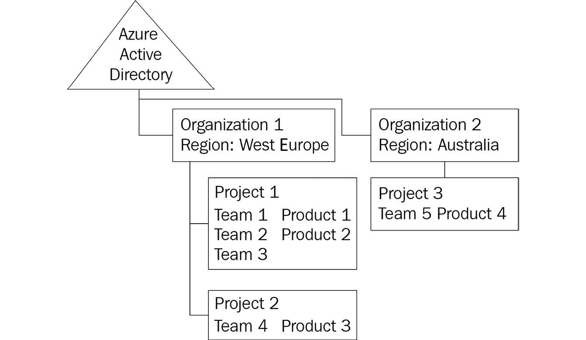
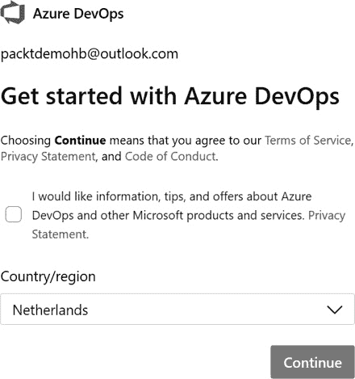
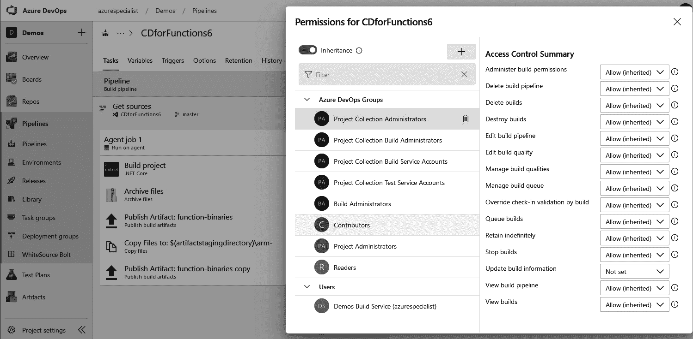
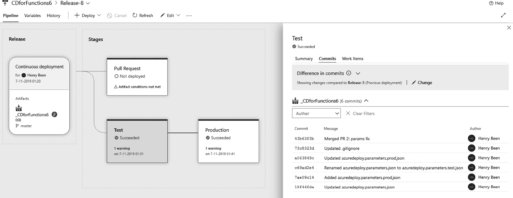
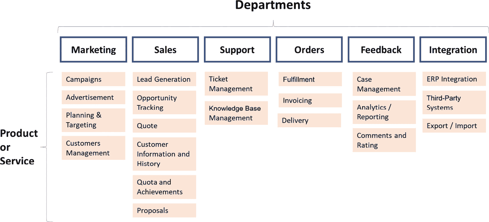

# 规划您的 Azure DevOps 组织

在前几章中，您学习了许多与 DevOps 相关的技术和实践。本章中，我们将退后一步，看看如何构建一个强大的 DevOps 组织，并在构建时需要考虑的事项。之后，您将了解这对于安全性和可追溯性所能带来的影响。从那里开始，您将学习如何整合您的工具链组合，从而将开发生命周期的标准化主要集中在使用 Azure DevOps 上。

我们将从创建一个 Azure DevOps 组织开始，您将在其中学习如何在工具中布局您的产品和团队，并了解许可和不同方法的安全影响。之后，您将学习可追溯性及其如何用于创建可验证的软件开发过程。接下来是工具的整合。在您推进 DevOps 之旅的过程中，您可能会发现每个团队都在使用不同的工具，他们对这些工具很熟悉且喜欢使用。尽管 DevOps 的核心是赋能团队，但某种程度的标准化是可能需要的，您将学习如何进行这一操作。最后，您将学到，您可能必须接受一个事实，那就是您永远无法完全完成 DevOps 的采纳。

本章将涵盖以下主题：

+   设置 Azure DevOps 组织

+   确保可追溯性

+   工具整合

+   接受没有最终状态的事实

# 技术要求

要跟随本章的实践部分，您需要以下其中之一：

+   一个 Microsoft Live 帐户，也叫个人帐户

+   一个工作或学校帐户

# 设置 Azure DevOps 组织

要练习前几章中描述的一个或多个技术和方法，可能已经专门为此用途创建了一个 Azure DevOps 组织，或者可能已有一个可用于此目的的组织。然而，从零开始为公司创建一个组织需要更多的考虑。花时间合理规划组织的布局，能为以后节省大量时间。

本节描述了 Azure DevOps 的组成部分，如何使用这些组件来组织合适的安全模型，以及许可选项和成本。

## Azure DevOps 是如何组织的

Azure DevOps 中的顶级构造被称为组织。对于大多数公司来说，一个组织就足够了，但也可以创建多个组织。

每个 Azure DevOps 组织都托管在特定的区域内。大部分组织的数据（源代码和工作项）都保证位于该组织所在的区域，但由于服务的全球覆盖，一些信息总是存储在其他数据中心。拥有跨不同地理位置的团队和产品的分布式组织可能是使用多个组织的原因之一。例如，如果某些团队位于澳大利亚，而另一些团队位于西欧，创建两个独立的组织并将所有团队托管在离他们最近的地理区域是有意义的。这样可以确保大多数 Azure DevOps 服务托管在一个物理上更接近团队的区域的数据中心，从而大大减少在使用 Azure DevOps 时的延迟。

一个组织可以与**Azure Active Directory**（**AAD**）进行链接。如果启用此链接，只有位于该特定 AAD 中的用户（包括成员和访客账户）才能访问该组织。使用公司 AAD 不是强制性的；也可以使用 Microsoft 账户创建组织。管理员还可以允许拥有 GitHub 账户的用户访问该组织。然而，必须注意的是，当使用工作账户创建组织时，它将自动链接到与 AAD 账户关联的主（默认）租户。租户管理员可以防止其工作账户被链接到新的组织。

在每个组织中，可以创建一个或多个项目。一个项目是一个孤立的工作项容器，包含源代码控制库、管道定义以及所有其他 Azure DevOps 工件。项目之间的共享和链接可能性是有限的。在本文撰写时，仅有工作项、管道和代理池可以跨项目关联。通过这种方式，项目可以作为强隔离边界，用于在需要时强制实施产品或团队之间的严格安全性。通常建议尽量减少项目数量，当团队数量非常少（<10）时，最好只有一个项目。

下图展示了一个可能的 Azure DevOps 组织和项目的结构。图中显示有两个组织连接到 AAD。一个位于西欧，另一个位于澳大利亚。在西欧的组织中有两个项目，而在澳大利亚只有一个：

图 17.1 – Azure DevOps 组织与项目

如前所述，推荐的做法是尽量减少组织和项目的数量。但在此示例中，从澳大利亚到西欧的延迟是一个合理的理由，可以将组织拆分为两个，以便将 Azure DevOps 托管在接近团队的地方。西欧的两个项目拆分可能是由于团队 4 在开发产品 3 时需要较高的隔离级别。

将团队 1 到 3 和产品 1 和 2 合并为一个项目是有意为之。这样做的原因是在单个项目中，可以定义多个产品区域和多个团队。将这些全部放在一个项目中，可以方便地将工作项链接到项目组合管理中。这样，一个团队的工作项也可以与另一个团队在其他产品上的提交或拉取请求相关联。如果功能分布在多个产品或应用（组件）中，这样做会很有帮助。

Azure DevOps 提供区域路径、团队和迭代，帮助你组织和执行产品待办事项的生命周期流程。因此，你必须谨慎选择粒度层级，以在开发生命周期中实现更高程度的并行性。以下是几个简单的规则：

+   避免将用户链接到多个团队。相反，应将团队创建为一个逻辑上的、独立的单元。

+   为组织中的每个主要产品（或团队）创建一个区域路径。根据需要创建子区域路径。

+   仅在需要对 DevOps 生命周期的各个方面进行精细控制时，才创建独立的团队项目。

要在单个项目中定义所有产品和所有团队，了解 Azure DevOps 安全模型以及如何使用该模型实施访问控制非常重要。

## 创建 Azure DevOps 组织和项目

创建新的 Azure DevOps 组织和一个或多个项目通常由管理员完成，管理员也将负责后续的环境管理。这些组织很可能与**Azure Active Directory (AAD)** 关联。为了创建用于私人用途或培训和学习的组织，最好使用个人账户。

使用个人账户创建新组织，请执行以下操作：

1.  访问 [`dev.azure.com`](https://dev.azure.com)。

1.  选择**开始免费**以开始创建新的 Azure DevOps 组织。

1.  在弹出登录对话框时，使用个人账户登录。

1.  登录后，选择正确的居住国家，并使用以下对话框选择是否启用提示和其他服务更新：

图 17.2 – 为你的 DevOps 组织选择国家/地区

1.  按**继续**按钮创建新组织。

组织创建完成后，系统将自动启动新向导以创建第一个项目。要创建项目，请执行以下操作：

1.  提供项目名称。

1.  选择将项目设为公开还是私有。私有项目是默认设置，旨在组织内创建软件，并且不允许匿名访问。公开项目则用于开源开发。

一旦创建了新的组织和项目，就可以通过管理界面对这些选择进行更改。

重要提示

请记住，重命名组织或项目会更改 URL，因此所有现有的集成和链接可能会失效。

甚至可以在稍后更改组织的位置。这需要提出请求，并且不像更改其他设置那样简单。

一旦组织和项目可用，就可以开始设置安全性。

## Azure DevOps 安全模型

在 Azure DevOps 中，授权可以分配给单个用户或安全组。安全组可以是现有 AAD 组的逻辑封装，也可以在 Azure DevOps 中自行定义。一般建议尽可能将授权分配给组，并限制单个用户的分配。

配置用户或安全组的授权时，有两种互补的方式可供选择：

+   组织级和项目级授权

+   对象级授权

在使用本地产品 Azure DevOps Server 时，还有可用的服务器级安全组和设置：

重要提示

在 Azure DevOps Services 中，组织称为项目集合，项目称为团队项目。有时，这些名称也用于 Azure DevOps。

+   `Project Collection Build Administrators`，或 `[ProjectName]\Build Administrators`，默认情况下具有查看、管理和编辑构建定义及构建资源的权限。

在组织和项目级别可以设置的权限会自动应用于组织或项目中的所有单个资源。

+   **对象级授权**：在 Azure DevOps 中，大多数对象都可以为用户或组分配个别权限。这些权限通过对象本身上的**访问控制列表**（**ACL**）进行设置。以下示例展示了一个经典的构建定义：

图 17.3 – 为项目设置权限

对于每个组、每个操作，可以配置**允许**、**拒绝**、**未设置**或**允许**（**继承**）权限。当操作配置为**拒绝**时，即使用户属于具有**允许**授权的组，也永远不会允许访问。换句话说，当存在两个冲突的分配（**允许**和**拒绝**）时，**拒绝**将优先于**允许**。**未设置**应解释为隐式拒绝，不具有优先权。换句话说，当存在两个冲突的分配（**未设置**和**允许**）时，用户将被允许访问。

Azure DevOps 中的一些工件属于层级结构的一部分。例如，管道可以位于文件夹中。每当启用继承时，来自层级中更高（父级）级别的权限将传播到该工件。这意味着，当用户访问一个管道文件夹时，如果没有更具体的授权设置，那么他们的所有权限将传播到所有下层文件夹和管道。

虽然安全模型决定了用户拥有的授权类型，但用户的操作也受到其分配的访问级别的限制，这一点来自于他们的许可证。

## Azure DevOps 许可证

创建 Azure DevOps 组织的另一个方面是管理许可证。在 Azure DevOps 中，每个用户在登录产品之前都需要分配一个访问级别。定义了三种访问级别：

+   **利益相关者**：利益相关者是免费的用户，他们可以登录产品，但只能访问其功能的部分内容。利益相关者可以管理工作项、管理管道并查看仪表板。他们无法访问产品的其他区域，因此该许可证级别仅适用于非开发角色。

+   **基本**：基本用户拥有付费许可证，允许他们访问产品的所有部分，除了测试管理和高级测试执行功能。

+   **基本和测试计划**：使用“基本和测试计划”许可证选项的用户可以访问 Azure DevOps 的所有部分。他们与基本用户拥有相同的访问权限，但还可以访问测试管理工具，以及用户验收测试、测试执行和测试结果报告功能。

每个组织的前五个基本许可证是免费的。这意味着可以在没有产生任何费用的情况下，尝试使用产品并学习如何使用它。此外，Visual Studio 订阅者也可以获得免费的许可证。专业订阅者可以获得一个免费的基本许可证，而企业订阅者则可以获得免费的基本许可证和测试计划许可证。

许可证可以在任何时候分配和重新分配，因此对于拥有大量人员进出（如加入和离开的公司或团队），不需要购买超过当前活跃人员数量的许可证。

许可证费用并不是使用 Azure DevOps 唯一的费用；了解按需付费的费用也同样重要。

如需更多信息，请参阅此链接：[`docs.microsoft.com/en-us/azure/devops/organizations/security/access-levels`](https://docs.microsoft.com/en-us/azure/devops/organizations/security/access-levels)。

### 基于消费的费用

许可证为用户提供了对产品的访问权限，之后他们可以按固定费用使用产品中的所有服务，但以下两项除外：

+   Azure Pipelines 并行执行

默认情况下，每个 Azure DevOps 组织都会提供一个由 Microsoft 托管的并行执行作业，且每月的执行时间是有限的。这意味着虽然可以根据需要定义多个流水线，但每次只能有一个流水线在执行。当然，这个数量可以增加，但这需要额外购买更多由 Microsoft 托管的并行执行作业。

作为替代方案，还可以购买自托管作业。对于这些作业，执行代理并不是由 Microsoft 提供，而是需要由组织自行提供，并需额外付费。这为完全控制硬件提供了机会（和责任）。

+   Azure Artifacts 存储

在使用 Azure Artifacts 源时，前 2 GB 的存储是免费的。任何额外使用的存储将根据价格表另行收费。

随着团队中越来越多的用户获得 Azure DevOps 许可证并在其中完成工作，可以利用这一点来提高软件开发的可追溯性。

请参考此链接以了解更多有关 Azure DevOps 计费的信息：[`docs.microsoft.com/en-us/azure/devops/organizations/billing/overview`](https://docs.microsoft.com/en-us/azure/devops/organizations/billing/overview)。

# 确保可追溯性

Azure DevOps 相较于本书中提到的其他工具的优势之一在于，它是一个完全集成的工具套件，每个工具都支持特定的 DevOps 流程。这种端到端的集成允许从看板上的工作到相关的二进制文件部署到环境中的整个过程都能进行详细且长时间的追溯。

当与一组只支持部分 DevOps 流程的其他工具一起使用时，通常是可以将它们集成在一起的，当然，这样会产生一定的可追溯性。例如，在使用 Jira 和 GitHub 时，可以将 GitHub 中的提交、拉取请求和其他更改与 Jira 中描述的工作关联起来。当通过 Jenkins 获取合并的更改以构建和部署产品时，Jenkins 也会有从 Jenkins 返回到 GitHub 的可追溯性。然而，无法直接查看哪个工作项与哪个 Jenkins 部署一起完成。

其缺点是，使用 Jira 工具的产品负责人无法看到一个完成的用户故事是否已经关联到某个发布版本。他们必须访问多个工具才能找到这个问题的答案；在 GitHub 中，他们需要找到与该故事相关的所有提交，然后查看这些提交是否已经通过 Jenkins 发布。

图 17.4 – 工具之间的可追溯性选项

在使用 Azure Boards、Repos 和 Pipelines 时，这是不同的。当使用所有 Azure DevOps 服务时，追踪性可以从故事到部署，反之亦然。以下是一个示例，突出显示如何查看哪些提交首次部署到具有特定部署的环境中：

图 17.5 – 查看作为管道运行一部分的提交

拥有这种端到端的追踪性可以迅速回答多个问题，包括以下几个：

+   这项工作是否已经开始？（分支和拉取请求可以与工作项相关联。）

+   这项工作已经包含在我们的夜间构建中吗？（提交和构建管道可以与工作项相关联。）

+   这个 bug 是否已经修复，并且解决方案是否已经在第二环中向我们的客户提供？（发布和环境显示了哪些新的提交和工作项是最新部署的一部分。）

重要提示

在谈到追踪性时，一个特别重要的观点是，它不是关于责备的。追踪性不是用来查找谁犯了哪个错误，而是用来找出当前事物的状态以及对象之间的关系。一旦追踪性成为责备的依据，工程师们很快就会找到隐藏自己工作的方式。这将导致更多错误和更少的可见性，问题只会变得更糟。

在追踪性优势明确的情况下，让我们探讨整合工具如何帮助我们获得这些好处。

## 工具整合

市场中可以观察到的一个趋势是，追踪性和 DevOps 产品扩展其服务内容，不仅仅包括源代码控制、管道或部署。比如 GitHub 和 GitLab，它们正在添加新的服务。越来越多的集成**应用生命周期管理**（**ALM**）或 DevOps 套件正在涌现，但 Azure DevOps 已经提供这些服务多年了。

然而，许多公司并没有实施这些集成套件。团队在不同的生态系统中运作，导致不同的工具选择。或者也许团队只是有不同的偏好，或在不同的时间点开始采用 DevOps 实践，且有其他工具可供选择。不论原因如何，许多公司在处理同一工作时有多个工具在运行。

不幸的是，使用断开连接的工具或多个工具处理相同事情会带来一些缺点：

+   如果团队使用不同的工具，协作将受到阻碍。不论开发人员的个人偏好如何，当组织的一半使用 Jenkins 而另一半使用 Azure Pipelines 时，这会证明是生产力的障碍。更进一步说，当切换团队或帮助他人时，如果他们使用的是另一种工具，效率将受到严重影响。

+   工具越多，成本也就越高。即使所有工具都是开源且免费的，仍然会有成本。这些成本可能包括例如支持合同或请求、培训，或者解决特定问题所需的时间。升级和维护也是如此。工具越多，整体成本就越高。

+   多个分布式工具意味着需要进行更多的安全和监控工作，这可能会导致许多问题和漏洞。

为了克服这些挑战，许多大公司决定标准化所使用的工具，无论是完全标准化，还是至少在某些程度上进行标准化。作为替代或中间解决方案，也可以通过工具之间的集成来启动整合。

## 工具标准化

为了应对这些缺点，大多数公司接受了两种策略之一：

+   集中决策，选择一个工具（对于每个 DevOps 领域）作为整个公司的标准工具

+   集中采用有限的工具集，团队可以从中选择要采用的工具

在**完全集中化**中，由一个中央团队或部门代表所有人决定，在组织内使用哪些 DevOps 工具。一旦做出并实施此决策，就能减少成本，并使工程师能够更轻松地协助其他团队。

当然，缺点是，单一工具不一定是最适合所有人的选择，而对整个组织而言，所选择的工具可能是最优的——这种标准化可能在一些边缘情况下造成损害。

**有限集中化**是一些公司为避免这种情况所采用的方法。与只选择一个工具不同，这些公司选择了一组工具作为公司的标准。现在，各团队可以根据自己的具体需求，在两三个工具中做出选择。这种方式在不牺牲拥有非常具体需求的团队生产力的情况下，限制了完全去中心化的许多缺点。

采用这两种策略之一可能意味着一些现有的工具会被弃用或完全淘汰。这可能是一个缓慢而痛苦的过程，尤其是在大型组织中，往往存在相互冲突的利益。有许多方法可以实现这一目标，但也有一些策略可以让这种迁移变得不那么痛苦。

## 迁移策略

减少使用的 DevOps 工具数量通常意味着必须淘汰一个或多个工具。这可能会很困难，因为这些工具通常用于实现治理和合规性，以符合法律和法规的要求。实际上，这意味着可以采取以下两种做法之一：

+   旧工具并非完全淘汰，而是仅不再使用，以保持变更历史。

+   在旧工具被淘汰之前，历史数据也必须迁移到新工具中。

选择迁移时，有四种方法可以实现：

+   从 Azure DevOps Server 迁移到 Azure DevOps Services

+   大爆炸式迁移

+   同步

+   重建

提示

Azure DevOps Server 以前被称为**团队基础服务器**（**TFS**）。较旧版本的 TFS 需要升级到最新版本的 Azure DevOps Server，才能导入到 Azure DevOps Services 中。导入服务始终支持 Azure DevOps Server 的最新两个版本。

以下章节将详细介绍这四个步骤。

### 从 Azure DevOps Server 到 Azure DevOps Services 的迁移

对于希望从 Azure DevOps Server 切换到 Azure DevOps Services 的组织，提供了高保真度的迁移服务。当前存在于本地 Azure DevOps Server 环境中的每个项目集合都可以使用 Azure DevOps Server 导入服务迁移到 Azure DevOps 组织。所有当前存在于本地项目集合中的资产都将被迁移到 Azure DevOps：工作项、源代码控制库以及构建和发布定义。

项目集合的迁移包括以下高级步骤：

1.  验证项目集合是否准备好进行迁移：此步骤不会做任何更改，只是检查迁移的所有前提条件是否已满足。

1.  准备迁移：在此步骤中，生成一个描述如何执行迁移的 JSON 文件。如果需要，还可以提供第二个文件，将本地身份与 AAD 身份关联，以确保迁移后所有历史记录仍然正确地与进行更改的人员关联。

1.  会进行一次迁移的演练，以验证导入过程是否能够产生预期的结果。

1.  实际迁移：在此步骤中，项目集合将下线，从项目集合数据库中生成**数据层应用程序包**（**DACPAC**），然后上传第 2 步的 DACPAC 文件和其他文件，并启动迁移。

1.  导入完成后，需要验证所有资产，并且在某些特定场景下，必须采取一些导入后的操作。

使用迁移服务时，提供了包含清单和逐步说明的全面指南，具体链接在本章末尾。

### 大爆炸迁移

第二种可能的策略是“大爆炸”迁移。在某个时刻，旧工具被关闭，所有数据迁移到新工具，并启用新工具。这种方式存在较高的问题风险，通常也没有回头路。通常来说，这并不是一个好的迁移策略。

然而，在某些情况下，这种方法可能有意义，比如源代码控制的迁移。现在有一些工具可以将不同来源的代码迁移到任何类型的托管 Git 解决方案，包括 Azure DevOps。源代码控制的优势在于，变更历史深深嵌入到系统中，因此带着历史进行迁移往往比其他类型的数据更容易。

### 同步

另一种迁移策略是允许一段时间内同时使用两种工具。

其中一种方法是使用一种工具来同步旧工具和新工具之间的数据。这可以是单向同步，从旧工具到新工具，或者双向同步。这样，就创造了一个过渡的情况，在这个过程中，两个工具可以同时使用。每个团队可以选择在一定的时间窗口内进行迁移。这避免了强制迁移的窗口。团队也可以选择在一段时间内并行使用这两个工具。这样，他们可以学习新工具，同时如果遇到压力，仍然可以切换回他们熟悉的工具。经过一段过渡期后，旧工具可以设置为只读，或完全淘汰。这种方法通常对于工作跟踪系统效果较好。在这些系统之间，概念通常非常相似（史诗、特性、故事和冲刺），这使得同步成为一种可行的方案。

### 重建

一个略微不同的方法是要求团队在新工具中重新构建。这种方法也创造了一个并行的情况，但没有自动迁移或同步。团队将不得不在新工具中重新做他们的流程或工作方式。由于这可能需要一些时间，旧工具将继续存在，直到团队完成这项工作。一个常见的适用场景是构建和/或发布流水线。

无论选择哪种策略，在所有情况下，确保新工具或工具集对团队来说优于现有工具都是很重要的。这应该提升性能、可追溯性、易用性或与其他公司工具的集成。任何迁移过程中的积极氛围都能显著改善结果。

作为迁移到单一工具的替代方案，工具之间的集成可以用来将现有工具结合在一起。

### 集成工具

作为替代不再优选工具的方案，也可以将它们与首选工具集成。特别是当决定迁移到 Azure DevOps 时，这可以成为一种强大的策略。在前面的许多章节中，对于每个主题，都列出了与 Azure DevOps 集成的不同工具。

在追求端到端可追溯性的过程中，这些集成可以作为使工具更加紧密结合的一种手段。考虑以下示例。

一个组织正在使用 Azure DevOps 来管理工作项、托管 Git 仓库和执行构建流水线。由于历史原因，部署工作是通过 Octopus Deploy 完成的。由于完全迁移成本过高，作为替代方案，选择了集成策略。通过 Azure DevOps 自动触发 Octopus Deploy 而非手动触发，达成了多个目标：

+   实现端到端自动化。

+   现在，发布管理也可以在 Azure DevOps 中完成，即便在 Azure DevOps 中的每次部署仅仅是触发 Octopus Deploy。

+   现在在 Azure DevOps 中进行发布管理，可以实现端到端的可追溯性。

在整合工具和所有与 DevOps 相关的事情时，必须准备好接受一个事实，那就是你永远不会完成。

# 接受没有终点状态

合理预期，在任何时候，团队都会有一个或多个改进点，想要对他们的应用程序、工具链或工作方式进行改进。为了应对这一点，建议不要一直不断地改变一切。

相反，尝试分批或通过一系列明确定义的步骤来实施变更。同时，需要注意的是，事情是有自然顺序的。如果没有先建立合适的**持续集成**（**CI**）流程，是不可能实践**持续部署**（**CD**）的。另外，当应用代码的 CD 流程已经就绪时，采用**基础设施即代码**（**IaC**）将带来最大的价值。接下来，自动化治理和安全措施在基础设施和配置代码已成为常规实践的情况下效果最佳。一旦所有这些实践都已实施，新的事物将出现在雷达上——未来可能需要的改进。

除了这一系列的改进外，还需要意识到，并不是每个团队都在这条旅程中的同一位置，并不是每个团队都能以相同的速度前进，而且开发并非总是线性的。

但这并不意味着无法跟踪和规划未来的变化，并将一个团队的经验教训应用到其他团队中。跟踪这一过程的一种过于简化的方式可以是使用表格，如下所示。

在这里，我们可以看到五个团队在采纳不同的 DevOps 实践或理念。所有团队都在实践 CI。一些团队在实践 CD，而团队 3 仍在进行**进行中的工作**（**WIP**），第五个团队还没有开始。最后，团队 2 已经在试验 IaC。最终，由于没有终点状态，下一种实践或理念的出现只是时间问题，某个团队将开始进行实验：

如果像前面所示的表格那样定期更新、评估并扩展，它有助于促进持续学习，并改进软件的创建和交付方式。学习和改进将成为标准，这将有助于提升向最终用户交付价值的效率。它还表明，采用 DevOps 永远不会“完成”。

它还提供了一个途径，可以看到哪些团队走在前列，哪些团队在跟随。通过给处于领先位置的团队更多的实验空间，并与其他团队分享知识，组织可以鼓励他们的领先团队进一步改进，同时也加速其他团队的进步。

关于持续学习、实验和自我提升的这一点，正是一个很好的时机来结束这本书。让我们在下一节中回顾这一章的内容。

# 总结

本章中，你学会了如何配置 Azure DevOps 组织以及如何为你的产品和团队创建布局。你了解了不同配置选项的影响以及如何应用这些配置。之后，你学会了如何利用 Azure DevOps 为你的开发过程增加可追溯性。你学会了如何在故事和任务中捕捉想法和任务，并且这些可以追溯到部署过程，反之亦然。接下来，你学习了如何在组织内整合使用的工具，并了解了何时不再尝试整合工具。最后，你了解到持续改进的重要性。

通过本章所学的内容，你现在可以为你的团队、多个团队或整个组织设置和配置 Azure DevOps。你可以创建一个适合你组织的结构，并开始使用它，支持一个或多个团队。同时，你还能够逐步标准化工作方式，并将团队统一在同一套工具上。

本书的最后一章已完成。你可以参考这本书来帮助你准备 AZ-400 考试，因为大多数话题都是类似的。不过，为了充分准备考试，我建议你从其他资源中阅读更多相关内容，并尽可能多地进行实践。在本章的结尾，有一份模拟考试，帮助你为最终考试做好准备。

祝你好运！

# 问题

在本章总结时，以下是一些问题，供你测试自己对本章内容的掌握情况。你可以在*附录*的*评估*部分找到答案：

1.  对或错：用户在 Azure DevOps 中存储的所有数据都保证包含在一个区域内。

1.  按照以下顺序重新排列 Azure DevOps 的概念，使得每个元素都作为下一个概念的容器：

    +   工作项

    +   组织

    +   区域

    +   项目

1.  对或错：通常的建议是为你的组织开发的每个应用创建一个新的项目。

1.  哪两个元素限制了任何用户在 Azure DevOps 中可以执行的操作？

1.  使用单一工具进行 ALM/DevOps 与使用一套工具套件相比，主要的好处是什么？

# 活动

假设你的组织正在计划开发下一代客户关系管理在线服务。工程团队按照部门进行组织，每个部门负责为某个特定领域构建产品或服务。以下图示总结了这一点：

图 17.6 – 组织结构

在每个部门内部，会有多个功能团队（例如，基础设施、网页、移动、核心 API 等）负责这些产品或服务的开发。

对于正在评估的场景，请确定使用项目、区域路径和团队设置 DevOps 组织的方法。需要考虑的一点是，每个部门希望完全拥有他们的 DevOps 组件和项目生命周期。

# 进一步阅读

+   关于 Azure DevOps 项目以及何时创建多个项目的更多信息，请访问 [`docs.microsoft.com/en-us/azure/devops/organizations/projects/about-projects?view=azure-devops#when-to-add-another-project`](https://docs.microsoft.com/en-us/azure/devops/organizations/projects/about-projects?view=azure-devops#when-to-add-another-project)。

+   关于 Azure DevOps 安全模型的更多信息，请访问 [`docs.microsoft.com/en-us/azure/devops/organizations/security`](https://docs.microsoft.com/en-us/azure/devops/organizations/security)。

+   最新的 Azure DevOps 定价信息，请访问 [`azure.microsoft.com/en-us/pricing/details/devops/azure-devops-services/`](https://azure.microsoft.com/en-us/pricing/details/devops/azure-devops-services/)。

+   关于 Azure DevOps Server 导入服务的更多信息，请访问 [`docs.microsoft.com/en-us/azure/devops/migrate/migration-overview?view=azure-devopsviewFallbackFrom=vsts`](https://docs.microsoft.com/en-us/azure/devops/migrate/migration-overview?view=azure-devopsviewFallbackFrom=vsts)。
