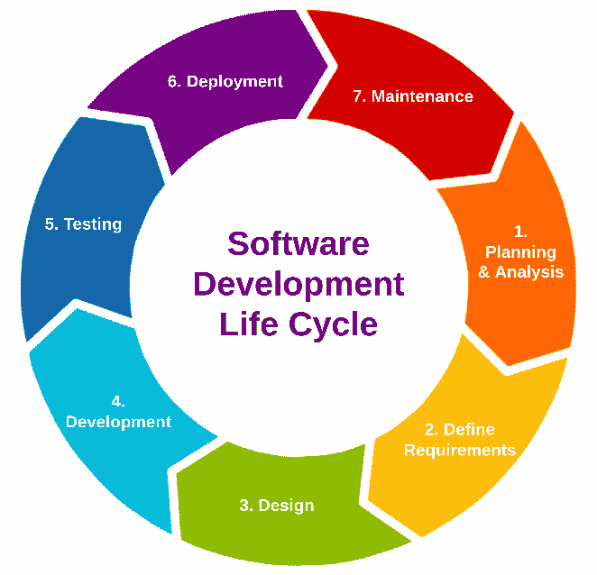

# 1

# 理解软件开发生命周期

**软件开发生命周期**（**SDLC**）是软件行业用于创建新软件的程序。该方法确保软件开发人员能够在最短时间内构建高质量、具有竞争力的产品。

SDLC 涵盖了多个阶段，如规划、编写、测试和维护代码。软件工程师遵循软件开发生命周期来构思和开发适用于多个平台的软件应用，包括笔记本电脑、桌面计算机、云基础设施、移动设备、视频游戏系统、自助终端及其他技术平台。“**生命周期**”这一概念最早在 1950 年代被提出，用以描述创建新计算机系统的几个阶段。然而，它已经广泛应用于涵盖软件生产的所有阶段。

尽管本书关注的是**DevOps 发布管理**，但首先了解软件开发生命周期至关重要，了解它与发布管理的关系，以及两者在整体项目管理中的定位。简而言之，SDLC 是项目管理工具箱中的一项强大工具。它提高了团队每个人的关注度和效率，最大化了他们的生产力。

在第一章中，您将学习以下内容：

+   SDLC 的定义

+   SDLC 的七个阶段

+   SDLC 与其他生命周期管理方法论的比较

# 定义 SDLC 并探讨其七个阶段

SDLC 指的是开发团队用来以最优成本效率生产高质量软件的系统化方法。其主要目标是降低风险，并确保所开发的软件超越客户的期望。通过这种方法，您将首先制定一个全面的战略，以指导产品开发，然后将其分解为更易管理的组件，便于安排、完成和衡量。

SDLC 可以理解为一个概念框架，概述了所选方法论所包含的多个阶段，而不是一种方法论本身。也就是说，SDLC 过程在不同的团队和产品中会有所不同。然而，值得注意的是，许多常见的 SDLC 模型在实际应用中共享相同的阶段。这些阶段包括**规划与分析**、**设计**、**构建**、**测试**、**实施**和**维护/支持**。

图 1.1：SDLC 的七个阶段

## 1\. 规划与分析

SDLC 的第一阶段是**项目规划阶段**，在此阶段，你将收集来自客户和利益相关者的业务需求。该阶段的主要目标是帮助你定义客户所面临的基本问题，并发现合适的解决方案。规划有助于识别开发新系统所需的关键组件，通过运用有计划和系统化的过程来满足项目需求。分析阶段使你能够在开始新的软件开发工作之前获得必要的资源。在此阶段，还需要计算完成项目所需的资源、成本和时间。

为了有效地确定生产范围、优先排序生产项目并制定开发节奏，业务分析师与客户合作，收集需求、确定目标群体，并与行业专家进行咨询。所有这些都是为了编写一份全面的**业务规范**(**BS**)文档。不同的组织和团队可能将此文档称为**客户需求规范**(**CRS*)。需要注意的是，尽管创建 BS 文档被认为是良好实践，但一些开发团队可能选择不使用该文档，而采用不那么正式的方法，正如你将很快发现的那样。

BS 文档的目标是列出客户当前存在的问题，以便程序员能通过软件来修复这些问题。这可以作为一个有价值的工具，帮助团队跳出框架思考如何提升产品。确认软件项目符合业务和利益相关者目标、可行并满足用户需求后，应该将文档交给开发团队。

## 2\. 定义需求

上述阶段至关重要，因为它有助于将你在规划和分析阶段所获得的数据转化为开发团队成员所需的明确定义的需求。**定义需求**有助于创建多个重要文档，包括**软件需求规范**(**SRS**)、**用例文档**和**需求可追溯性矩阵文档**，如果需要的话。

根据业务规范文档，开发团队的高级成员与利益相关者和专家合作，规划软件开发项目。该项目可能是开发一个新软件产品，或是提升现有产品的性能。在这个早期阶段识别潜在的困难至关重要。如果发现问题，管理者和开发人员会提出各种解决方案，然后进行展示和分析，以确定最佳的替代方案。

在开发的初步阶段，团队成员就以下内容进行合作，制定全面的计划：

+   项目的意图

+   项目的需求

+   预期问题

+   机会

+   风险

本阶段的主要目标是准确确定项目的功能需求。进行这一必要分析能够确保最终交付的成果与客户的具体需求和期望保持一致，并包含必须采取的积极措施，以确保满足客户的需求和偏好。

简而言之，这个 SDLC 阶段作为一个综合的技术蓝图，用于客户表达他们对项目的期望、需求和要求。通过定义这些元素，您可以确保在设计和开发过程中，软件项目的各个方面都能得到公平的考虑。

## 3. 设计

**设计阶段**是将想法转化为具体形式的时刻。初步的策略和愿景将在**软件设计文档**（**SDD**）中进一步发展和记录，该文档定义了多个方面，如系统架构、编程语言选择、模板使用、平台选择以及应用安全措施的实施。这也是您可以创建图表和流程图的位置，展示软件如何响应用户活动。有时，设计过程还包括创建最小可行产品或概念验证。产品的预生产版本有助于您想象最终产品的样子。这有助于确保所需调整尽量减少，也有助于团队避免完全重新编写代码。

SDD 在生产过程中将发挥至关重要的作用，尤其是在开发阶段（见第 4 阶段）。开发人员将主要依赖 SDD 作为编写代码的参考。为了减少在早期阶段识别到的潜在问题和风险，您还必须参考 SRS 文档。它作为设计产品的参考点，确保产品在设计时采取措施保护团队免受早期识别的潜在风险影响。

一个展示设计阶段有用性的现实世界例子是，地方和联邦政府机构如何利用这一阶段建立可扩展的框架，这些框架是一致且可重复的。为了实现这一点，SDLC 的设计阶段可能包含由集中管理的部门创建的预先安排的模板和指南，这些内容结构化，用于定义、实施和沟通项目的各个方面。例如，这有助于扩展用于颁发和管理驾驶执照、选民登记卡和图书馆卡的应用程序，这些卡在多个司法管辖区之间是互操作的。特别是在管理资源水平不同、领导风格各异的不同司法管辖区时，这一点非常有用，但它们必须保持联邦制。这种前瞻性思维有助于确定与实际实施相关的成本，或确保最终结果能够服务于所有相关的利益相关者。

在 SDLC 的第三阶段中，需要记住的一点是，最终用户应该有机会审查设计并提出任何对预期系统的修改意见。在这一阶段，你将与团队共同努力，创建最终的技术设计文档，然后进入生产阶段。此时，开发新软件或系统所需的所有必要要求应该已经确定，并且可以创建工作积压清单。

## 4. 开发

SDLC（软件开发生命周期）的第四阶段是项目真正开始的地方。在这一阶段，程序员、系统工程师和业务开发人员组成团队，开始进行软件开发。此时，通常会创建甘特图或看板，以确保项目工作的进展保持顺畅的节奏。开发团队通常会通过两种方法之一来组织他们的工作：**实施冲刺**或者**作为一个持续的、连续的开发努力**。无论采用哪种方法，团队都会尽力尽快完成任务。

重要说明

**冲刺**：冲刺是开发团队用来完成一定工作量的限定时间。冲刺的持续时间可以从一周到一个月不等，但通常是两周。冲刺的短时间限制促使开发人员优先发布适度的、渐进的改进，而不是发布大规模的变化。因此，程序的调试时间较少，最终用户的体验得到了改善。

**持续开发**：采用持续开发和敏捷开发的方式有许多相似之处。与其一次性对软件进行大规模的改进，不如通过持续的增量更新，将代码在完成并经过测试后尽早发布给用户。软件开发、测试和向生产环境发布更新都可以通过持续开发进行精简和自动化。

在**开发**阶段，产品代码按照 SDD（请参见第 3 阶段）编写，以确保产品可以高效地生产。这包括开发团队从零开始构建新系统，或以新的需求和新视角来处理现有项目。这可能包括从现有系统向云端的新系统进行平滑且具有成本效益的数字化转型。

在这个阶段，开发人员将项目拆解成更小的软件组件，这些组件最终将组成完成的产品。为了构建代码，开发人员会使用各种工具和计算机语言。这些工具和语言的选择是根据所构建软件产品的需求来决定的。

一些编程工具可能包括以下几种：

+   **集成开发** **环境 (IDEs)：**

    +   **Eclipse**

    +   **Microsoft** **Visual Studio**

    +   **PyCharm**

+   **版本** **控制系统：**

    +   **Git**

    +   **GitHub**

    +   **Gitlab**

    +   **Bitbucket**

一些常见的编程语言可能包括以下几种：

+   **C#**

+   **C++**

+   **Python**

+   **JavaScript**

+   **Go**

高层领导在这一阶段的紧密参与对于实现项目目标至关重要，因为 SDLC 的这一阶段可能需要大量时间。必须设定预定的时间框架和里程碑，以确保软件开发人员明确目标，并且你可以监控他们的进度。在这一阶段结束时，大部分的产品代码将完成。

在某些情况下，开发阶段可能与测试阶段重合，此时将进行特定的测试，以确保软件没有重大缺陷。

## 5. 测试

在不进行充分的**测试**其功能和特性之前，软件的生产既不可行也不明智；第五阶段专门用于测试。为了确保一切正常工作，质量保证工程师将进行一系列测试，包括代码分析、安全性、集成、性能和功能测试。通过反复测试和分析，可以成功解决缺陷和错误。在系统设计满足客户需求之前，你将需要进行持续的测试。尽管团队进行手动软件测试总比没有测试好，但最好在可能的情况下将所有测试都自动化。

产品测试应由质量保证团队在将软件发布到生产环境之前进行，以确保其功能完备并实现预期目标。在测试阶段，还可以解决用户体验或安全性方面的主要问题。无论如何，适当的测试将确保软件的每个组件都按预期工作。产品开发的最后一步包括验证、确认和用户接受测试。如果产品走到这一步，它很可能已经准备好发布。

包括测试在内，软件应经过正式的**质量保证**（**QA**）程序，以认证产品的质量。软件测试通常包括以下几种测试：

+   **性能测试**：性能测试是一种常用的测试策略，旨在评估系统在特定工作负载下的响应能力和稳定性。此外，它还可用于检查、量化、验证或证实多个其他系统质量特性，包括可扩展性、可靠性和资源利用率。

+   **功能测试**：功能测试，或称黑盒测试，是一种质量保证过程，通过基于被评估软件组件的文档需求来创建测试用例。功能软件测试的目的是确定系统或其各个部分是否满足预定义的功能需求。通过观察输入的响应来测试功能，通常不会考虑代码的底层结构。

+   **安全测试**：安全测试通过检测安全问题帮助信息系统保护数据并正常运行。由于安全测试的逻辑限制，测试通过并不意味着系统完美或符合安全标准。安全需求可能包括机密性、完整性、认证、可用性、授权和不可否认性。系统安全需求决定了需要测试的安全要求。安全测试有许多定义和方法，通过建立基础，安全分类法帮助我们掌握这些技术和含义。

+   **单元测试**：单元测试是一种通过评估离散代码部分或“源代码单元”来验证软件质量的技术，测试对象可以是一个或多个计算机程序模块，以及其对应的控制数据、使用过程和操作程序。

+   **UI/UX 测试**：在用户界面（UI）测试中，测试人员验证屏幕上的元素，包括按钮、字段和标签，是否按预期执行。具有控件的屏幕，如工具栏、颜色、字体、大小、按钮和图标，作为 UI 测试的一部分，用于测试它们对用户输入的响应。UI 测试软件的目的是模拟最终用户与产品或服务的体验。

+   **回归测试**：回归测试是在进行修改后重新执行功能性和非功能性测试，以确认程序是否仍按预期工作。**软件回归**是指软件中的一个缺陷，某个以前正常工作的功能突然停止工作。软件更新、功能添加甚至微小的配置调整都可能需要额外的测试，以确保兼容性。由于随着每个缺陷的发现，测试套件呈指数增长，因此回归测试通常会采用自动化测试。

+   **用户验收测试**：软件开发的最后阶段是用户验收测试（UAT），在这一阶段，最终用户和客户会在实际场景中评估产品，以评估其功能性和实用性。UAT 重点考察软件是否能够在用户的实际系统中正常工作，而非其设计或功能。开发团队必须执行 UAT，因为他们的软件假设在日常工作中可能因为沟通不畅、误解、疏忽或需求变化而不成立。测试人员在实际情况下测试软件，并在 UAT 期间提供反馈，以便开发者在发布前修复任何缺陷。

## 6\. 部署

在测试完成后，产品将发布到市场，但这可能仅仅是在你所在的组织内部。根据商业模式，**产品部署**可能涉及多个步骤，或者采用许多策略，从**一次性发布**到**滚动发布**或两者之间的某种方式。如果产品分阶段发布（如蓝绿部署或金丝雀部署），测试时间将会更多。最终产品的发布或对代码进行进一步调整的需求取决于收到的反馈。部署阶段通常会带来一些未知的、不理想的结果，你应该有所预期。

## 7\. 维护

在第七个 SDLC 阶段，**维护**和**升级**被优先考虑。此时，系统可以进行调优以提高性能，并且可以随着时间的推移添加新功能。软件部署将会进行持续监控，以减轻潜在的性能和安全问题。此外，管理员或站点可靠性工程师一旦发现任何漏洞或缺陷，必须及时报告，以便尽快修复。

客户将根据自身的需求以不同的方式使用软件产品；这意味着可能存在需要修复的具体问题。这是因为用户可能会发现开发者和测试人员未注意到的缺陷和瑕疵。为了提升用户体验和提高用户留存率，立即解决和修复这些缺陷至关重要。在某些情况下，这些问题可能需要回到软件开发生命周期的第一阶段。软件开发生命周期的每个阶段，也可能因你在后续版本和升级中希望添加的新功能而重新启动。

一般认为，维护阶段是软件开发生命周期的最后阶段。尤其是在采用瀑布式发布管理的情况下，这一点尤其如此。尽管如此，业界正在向更敏捷的软件开发方法转变，例如 DevOps，其中维护仅仅是进一步增强的迭代步骤。

## 定义一些常用术语

以下是本书中常见的一些术语及其定义：

+   **大爆炸式发布**：大爆炸式发布方法缺乏其他发布管理模型中的过程导向特征，不需要提前准备。这一策略的主要焦点是软件开发，它允许程序员跳过规划阶段，直接进入代码生产阶段。

+   **滚动发布**：滚动发布，通常称为滚动更新，是一种软件开发模型。软件的改进是以持续、渐进的步骤进行，而不是通过离散的版本发布。用户可以随时升级程序以获取最新版本，并且被鼓励经常更新。

+   **蓝绿部署**：蓝绿部署创建了两个相同的环境。一个环境（蓝色）运行现有的程序版本，另一个环境（绿色）运行新版本。在绿色环境通过测试后，实时应用流量会转移到绿色环境，蓝色环境将被弃用。通过简化回滚过程（如果部署失败），蓝绿部署策略提高了应用可用性并降低了部署风险。

+   **金丝雀部署**：金丝雀部署是一种逐步且可控的应用发布策略，其中流量在现有版本和新版本之间分配。此方法首先将新版本引入一部分用户，随后再扩大到整个用户群体。通过这种方法，可以在新版本广泛发布之前，先评估更新版应用的可靠性。

在部署阶段结束时，您的最终产品将交付给终端用户。此时，部署工程师会在业务环境中安装软件和/或为用户提供帮助，确保程序能够正常运行。根据您的团队所遵循的 SRLC 类型，您可以自动化此过程并安排部署。例如，在实施单个功能更新的情况下，可以通过将其首先发布给有限的部分客户来执行此过程；这被称为“金丝雀发布”，如前所述。如果您正在开发全新的软件，您可能选择先以 alpha 版本在内部进行发布。稍后我们将简要扩展 SRLC，但该主题被视为超出本书讨论范围的内容。

现在我们已经涵盖了 SDLC 的七个阶段，接下来让我们看看它与其他生命周期管理方法相比如何。

# SDLC 与其他生命周期管理方法的对比

如果您熟悉产品管理概念，那么您会知道，SDLC 并不是唯一的生命周期管理程序。以下是一些相关概念以及它们与 SDLC 的区别。

## 软件开发生命周期与系统开发生命周期的对比

**系统开发生命周期**是规划和构建信息技术系统的过程。有时，人们会用缩写 SDLC 来指代此过程；你看到了吗？这在指代软件开发生命周期时可能会造成混淆。在系统开发方面，一个系统通常由许多单独的硬件和软件组件组成，这些组件相互协作，执行复杂的任务和计算。只需知道，当你看到缩写 SDLC 时，要注意文献中的上下文线索，以便正确区分你所阅读的是指软件开发还是系统开发。

重要提示

在本书中，我们将把软件开发生命周期称为 SDLC。

SDLC 与系统开发生命周期之间有一些关键区别。SDLC 仅限于软件组件的创建和测试。相比之下，系统开发包括了硬件、软件、人员和流程的设置和管理，这些都是构成完整系统所需的。此外，SDLC 专注于程序本身，而系统开发可能涉及如组织培训和变更管理等活动，这些活动并不总是与软件开发相关联。

## SDLC 与发布管理的对比

**发布管理**是指对 SDLC 的系统化监督和控制。其职责包括监督软件产品开发的各个阶段，即规划、设计、测试、部署和发布。发布管理的加入是 SDLC 的重要补充。发布管理的主要目标是确保开发团队有效地实现业务目标，并生产出高质量的软件。总的来说，发布管理在开发与运维领域之间起着至关重要的中介作用。

SDLC 与发布管理之间存在一些关键的区别。SDLC 的主要目标是降低风险，并确保开发工作有条理地进行。相比之下，发布管理的主要目标是确保开发团队的良好组织，并成功实现业务目标。此外，SDLC 主要集中在新软件的持续集成上，而发布管理则侧重于其持续交付。然而，两者都归发布或项目经理管辖。

## SDLC 与 ALM（应用生命周期管理）对比

**应用生命周期管理**（**ALM**）是一个综合性的概念，涵盖了软件应用开发的整个过程，从初步的创意生成和设计阶段，到开发、测试、生产、支持，最终直至程序的退役。这个概念与 SDLC 相似，虽然在表面上它们可能看起来有相似之处，但需要注意的是，两者之间存在几个显著的区别。

SDLC 主要侧重于应用的开发阶段，而 ALM 则采取更为全面的方法，涵盖了整个程序的生命周期。有效管理应用开发的各个阶段需要多个 ALM 工具、流程和团队的协作与整合。需要注意的是，一个应用的生命周期可能在更广泛的 ALM 框架下，包含多个 SDLC。

## SDLC 与 PDLC（产品开发生命周期）对比

产品开发生命周期是一个全面的过程，涵盖了产品的整个生命周期，从构思一个创意开始，到产品最终停产为止。这个过程包括产品规划、市场调研、产品设计、开发、测试、发布、营销和支持等活动。

SDLC 和 PDLC 之间存在一些关键的区别。SDLC 主要关注软件开发过程，而 PDLC 则主要集中于整个产品的开发。此外，SDLC 包括几个不同的阶段，包括规划、设计、编码、测试和部署。相比之下，PDLC 包含了附加的阶段，如市场调研、产品规划和产品营销。此外，SDLC 旨在开发符合最终用户特定需求的软件。而 PDLC 则专注于创建一个能够满足市场需求并为企业带来收入的产品。

## SDLC 与 SRLC（软件发布生命周期）

收集、文档化和验证软件需求是**软件发布生命周期**（**SRLC**）的主要目标。收集来自各方的需求、按重要性排序、写入需求规格说明书，并检查其准确性，都是这一过程的一部分。

SDLC 和 SRLC 之间存在一些关键的区别。与 SDLC 相比，SRLC 更侧重于管理软件需求。SDLC 由规划、设计、编码、测试和部署等阶段组成，而 SRLC 则增加了需求引导、分析和验证等阶段。虽然 SDLC 力求创建满足用户需求的软件，但 SRLC 则在编码之前确保这些需求已经明确。

## 发布管理与变更管理

发布管理和变更管理是两个关键过程，在成功地将软件更新和增强功能交付给客户方面发挥着至关重要的作用。

发布管理和变更管理的领域是相互关联的，尽管它们的范围和目标不同。发布管理的主要目标是监督软件版本的全面交付，而变更管理则主要关注管理构成版本的各种变更。发布管理主要关注软件版本的技术方面，包括发布计划、环境和部署等元素。相反，变更管理则主要处理软件变更的业务方面，包括变更请求、审批和沟通。发布管理和变更管理涵盖了不同的角色和职责，包括发布经理、发布工程师、变更经理、变更分析师和变更审查员。

发布管理是指系统化地组织、协调、评估和实施跨多个环境的软件发布，包括开发、测试、预发布和生产环境。发布管理的主要目标是保证软件发布的及时交付，同时遵循预算限制并尽量减少终端用户可能遇到的任何潜在干扰。新特性、漏洞修复、功能增强和配置更改都是变更管理旨在跟踪的变更类型。变更管理的目的是使变更得到接受、文档化，并与相关方进行沟通，以便它们能对业务及其目标、需求和标准产生最大可能的积极影响。在部署任何修改之前，测试和验证软件系统的任何变更非常重要，这正是变更管理的核心内容。

## 发布管理与项目管理

*发布管理*一词用来描述监督软件发布的创建和分发过程，包括其规划、调度、测试和部署。它提高了开发团队交付的软件产品和升级的速度与质量。简而言之，发布管理是确保从开发到预发布，再到生产的顺利过渡的过程。从更广泛的角度来看，项目管理的目标是确保在预先设定的范围内完成特定项目的成功。这包括时间限制、计划、财务和沟通的规划。每当一个产品接收到新版本或更新时，这就算作项目的一部分。

项目管理和发布管理共同提高了团队成功完成项目的几率。发布管理与项目管理相似，都是具有明确结构和一系列阶段的过程，尽管方法本身是独特的。以下是一些项目管理方法的例子：

+   **Scrum**

+   **精益**

+   **六西格玛**

+   **极限编程（XP）**

+   **PriSM**

+   **PRINCE2**

这就是*第一章*的内容。在这一章中，你了解了**软件开发生命周期**（**SDLC**）的定义，并探讨了它的七个阶段。最后，你了解了 SDLC 与其他生命周期管理方法的区别。在下一章中，我们将详细了解软件发布管理，以便理解其含义。

# 摘要

有了 SDLC 策略的帮助，项目管理变得更有效。管理者、设计师、开发人员和客户都能从这一工具提供的全面基础中受益。SDLC 的七个阶段都是至关重要的，并且相互依赖、相互促进。

在模型的初始阶段，资深成员负责收集需求。同时，IT 专业人员收集在产品生命周期内所需的所有数据和资源。在确定所需信息后，适当的文档将被草拟。随后的阶段包括设计和编码过程，接着是测试阶段，用于评估软件的功能性。最后阶段是部署和维护。团队可以选择使用不同的模型，包括广泛认可的瀑布模型和敏捷方法。对于软件开发来说，遵循 SDLC 至关重要。如前所述，了解 SDLC 的不同阶段是一种有效的方法，帮助产品经理在 SDLC 内部建立跨职能和以客户为中心的活动之间的共同理解和联系。这有助于在更广泛的企业目标、计划和努力中清晰地划分产品。

# 问题

1.  SDLC 的定义是什么？

1.  SDLC 的七个阶段是什么？

1.  SDLC 和系统开发生命周期之间有什么区别？

1.  软件开发生命周期和发布管理之间有什么区别？

1.  SDLC 和应用生命周期管理之间有什么区别？

1.  SDLC 和产品开发生命周期之间有什么区别？

1.  发布管理和变更管理之间有什么区别？

1.  发布管理和项目管理之间有什么区别？

1.  蓝绿部署和金丝雀部署之间有什么区别？

1.  SDLC 的七个阶段是什么？
