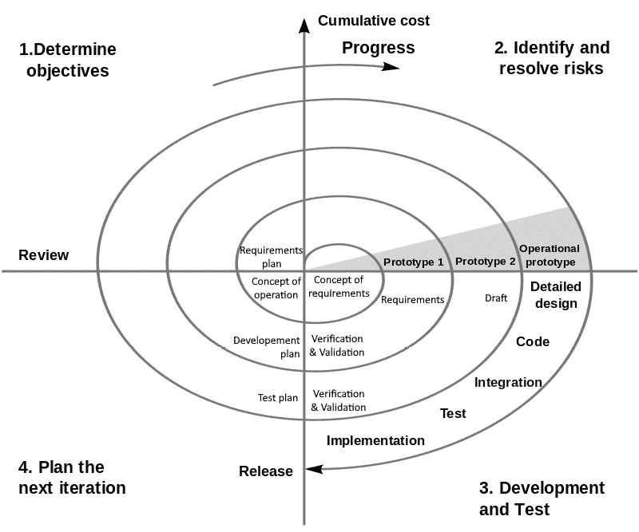
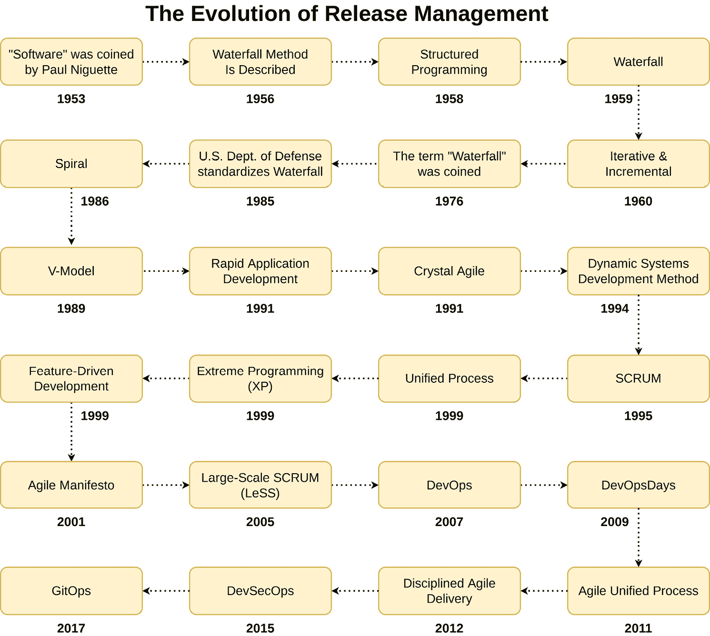
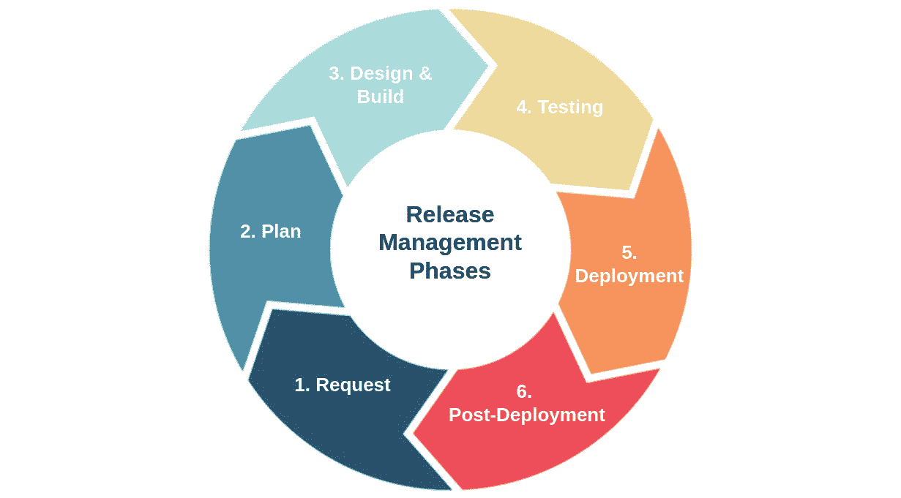

# 第二章：发布管理简介

在软件工程领域，新发布或改进的软件产品被称为**发布**。这包括与其开发相关的所有程序和工件。

发布是软件开发和工程过程的高潮，它代表了产品的一个迭代版本，既全面又完全功能化。在软件产品向公众发布之前，通常会经过 alpha 和 beta 测试阶段。发布通常用于描述软件的最终、完善版本，尽管它也可以用来描述 alpha 或 beta 版本的首次发布。您也可能会在讨论发布时遇到“启动”和“增量”这两个词。

大多数公司使用顺序号或字母来标记它们的发布版本。术语**软件版本控制**描述了这种命名约定。每个组织都会一致地应用自己的内部标准，但**语义版本控制**（**semver**）是业内广泛使用的标准，规定了这些唯一标识符如何从一次发布到下一次发布演变。

在本章中，我们将定义发布管理，并了解其文化意义和技术视角。此外，我们将回顾发布管理的简短历史，了解它如何随着时间的推移而演变。最后，您将学习任何发布管理模型的标准六个阶段。需要注意的是，**瀑布模型**是最初的发布管理标准，但使用瀑布模型并非强制性要求。发布管理与您选择的模型无关，并且可以适应许多类型的 SDLC 模型，我们将在*第三章*中进一步讨论这一点。

本章将覆盖以下主要内容：

+   什么是发布管理，它是如何演变的？

+   解剖发布管理生命周期

# 什么是发布管理，它是如何演变的？

**发布管理**是一整套活动，涉及战略规划、构思、调度、严格测试、无缝部署以及有效控制软件发布的过程。此实践的主要目标是通过软件开发团队快速交付关键的应用功能和改进，同时保持已建立的生产环境的完整性、机密性和可用性，从而满足客户需求。

在商业和 IT 的竞争环境中，缺乏质量或功能的产品发布是让竞争对手获得优势的最快方式。现代企业是动态的，各种变化以不同的速度完成。企业需要发布控制和自动化部署来协调所有这些变化，以确保最终产品提供客户所期望的卓越价值。成功的发布管理提高了发布的频率，并减少了质量问题发生的频率，从而使企业能够更快地提供软件，同时减少相关的风险，提高生产力、沟通和合作。

由于这些改进，团队现在能够在比以前更短的时间内持续生成高质量的软件，这使得组织能够更好地应对客户需求或运营环境的变化。标准化和简化开发和运营流程是发布管理的另一个好处。团队建立了可以审计的发布控制，从而形成一个可以提取所有发布内容的集中位置。通过制定标准化、书面的发布流程，组织的成熟度可以进一步提高。如果团队标准化并专注于产品，他们可以从过去的发布中学习，并将这些知识应用到未来的迭代中。

运营和开发人员之间的沟通改进得到了广泛欢迎，因为它减少了意外情况的发生。现在，跨职能团队不必再担心发布后，运营因错过截止日期而被迫**修补和祈祷**或**应急处理**，而是能够减少这些问题。这样，团队可以有更多的时间来自动化业务流程或修复开发和生产环境中集成配置的不兼容问题。

## 定义

让我们快速定义在本书中可能会遇到的一些关键术语：

+   **修补和祈祷**：在软件开发中，所谓的“修补和祈祷”策略指的是使用脆弱的解决方案，有时被称为“补丁”，来解决缺陷或漏洞，而并没有解决问题的更深层次根源。

    组织普遍采用这种技术来设定严格的截止日期、优先处理其他活动，或弥补资源不足；然而，这种策略可能导致长期的技术债务以及显著的安全隐患。

+   **灭火**：在计算机科学领域，灭火是指分配资源来解决突发问题。这个词语表示的是调试，而非功能集成。灭火可能涉及在软件开发的产品发布临近时，增加工程师来修复发现的代码问题。

    很多企业已经做好了应对突发状况的准备，但频繁的紧急情况往往表明计划不周、效率低下，以及浪费本可以用于其他地方的资源。全面的**灾难恢复规划**（**DRP**）可以预见并或许避免灾难，从而最大限度地减少应急响应。

+   **抛到墙外**：这是商业术语，指的是完成了项目的一部分后将其交给下一个小组。这句话通常是在两个小组之间沟通很少，或者在新部署前几乎没有时间进行技术简报时使用的。

简而言之，发布管理促进了 IT 公司内部各部门之间的协作。这使得产品分发过程得以进行更全面的改进。

现在，既然你已经理解了发布管理的含义，我们来扩展一下这个话题。在接下来的章节中，我们将回顾发布管理的历史，看看新的模型是如何随着时间的推移出现的，并且如何与当时的当代软件开发理念对接。稍后，我们将通过审视任何发布管理模型应该包括的六个标准阶段来结束本章。

## 发布管理的简史

软件工程的焦点从基于项目转向基于产品的转变，促使发布管理的重要性日益增加。从发布管理的初期，任务是在基于项目的开发框架内执行的。在这种方法中，软件开发人员将每次发布视为一个独立的项目，而不是一个产品。一旦软件开发完成，通常意味着开发人员在过程中的角色也结束，他们会解散。

随着时间的推移，软件开发的过程逐渐演变，变得更加类似于产品周期，在这个过程中，产品会经历支持、增强和多次重新发布，跨越较长的生命周期。在这个特定的结构中，开发的主要目标不是发布本身，而是发布作为支持和修订活动开始的分界点。由于这种复杂性，阶段协调变得比以往任何时候都更为重要。因此，现代发布管理借鉴了以业务为导向的产品管理理念，其中包括售后支持和增强。

## 从软件到发布管理的演变

当英国计算机科学家汤姆·基尔本在 1948 年创建第一段软件时，他使用了 8 个工作存储字和 17 个指令字，共计 25 个字。从那时起，软件开发过程已经取得了显著进展。

尽管同事们嘲笑他，1953 年，保罗·尼凯特提出了一个概念：计算机的程序可以与设备的物理组件分开存储。从那时起，这一思想彻底改变了人们对计算的认知：

当我第一次大声说出“软件”这个词时，周围的人都说：“哈？”从一开始，我就觉得这个词太不正式，不敢写出来，甚至说出来也常常让我觉得尴尬。然而，带着带有些许得意的恐惧，我确实在五十年代时偶尔在演讲、讲座和媒体采访中使用过“软件”这个词。

（保罗·尼凯特，《导言：软件时代》）。

在 20 世纪上半叶，当**电子数值积分器和计算机**（**ENIAC**）等发明加速了计算机的发展时，软件尚不复杂到需要像**软件开发生命周期**（**SDLC**）这样的框架。最初的软件实现中使用了简单的工具，如跳转语句和 if/then 表达式。随着开发模型的需求不断增加，最终导致了 SDLC 的出现，而 SDLC 又受到**结构化编程**思想的启发。

结构化编程是一种编程范式，通过采用结构化控制流组件，如选择（if/then/else）和重复（while 和 for），以及块结构和子程序，来提高计算机程序的清晰度、质量和效率。1950 年代末，**ALGOL 58**和**ALGOL 60**编程语言的出现标志着该领域的一个重要发展。值得注意的是，ALGOL 60 在 1960 年引入了对块结构的支持，进一步增强了其功能。

**软件开发方法论**，通常被称为**SDM**，直到 1960 年代才开始实践。**系统开发生命周期**（**SDLC**）可以看作是最早公开发布的发布管理方法论和框架，用于构建大型计算机和其他模拟信息系统，早于**软件开发生命周期**的提出。系统开发生命周期的主要目标是系统地、精细地推进信息系统的开发。这意味着严格且按顺序遵循生命周期的每个阶段，从最初的构思到最终在所采用的特定框架内交付系统。值得注意的是，通过将系统替换为软件，诞生了一种新的 SDLC 形式。它力求成为行业的最终标准，通过详细列出创建和维护软件系统的输入、输出和步骤。

**瀑布模型**这一术语是在其正式的 SDLC 规范被发明多年后才出现的（你可以在*第三章*的*图 3.2*中看到瀑布发布管理模型的六个阶段示意图）。首次描述在软件工程中使用瀑布模型各阶段的报告是由赫伯特·D·贝宁顿（Herbert D. Benington）于 1956 年 6 月 29 日举行的，尽管当时并未使用“瀑布”这一术语。最早的正式、详细的**瀑布模型**示意图可以追溯到温斯顿·W·罗伊斯（Winston W. Royce）于 1970 年发表的文章，但罗伊斯的文章中并没有使用“瀑布”这一名称。瀑布这一术语据称首次出现在托马斯·E·贝尔（Thomas E. Bell）和 T.A.塞耶（T.A. Thayer）于 1976 年发表的研究论文中。到 1985 年，**瀑布发布管理方法**被美国国防部在 DoD-STD-2167A 标准中正式规范。美国国防部针对与软件开发承包商合作的标准中指出：“*承包商应实施一个包括以下六个阶段的软件开发周期：软件需求分析、初步设计、详细设计、编码与单元测试、集成和测试*。”

从 1960 年代 NASA 的水星计划开始，**迭代和增量开发**（**IID**）成为瀑布发布管理的最早也是最接近的竞争者之一。部分水星计划团队成员后来成立了 IBM 的一个子公司，负责为航天飞机创建核心的航空电子软件系统，该系统从 1977 年运行到 1980 年。在 31 个月的时间里，该团队进行了 17 次 IID 迭代，每次迭代的持续时间平均为 8 周。他们决定放弃使用瀑布开发方法，因为航天飞机计划的需求在软件开发过程中已知会发生变化。

在 1986 年的研究中，巴里·博厄姆（Barry Boehm）首次概述了**螺旋模型**，并提供了如今广为人知的示意图，后续有许多出版物采用了这一图表进行讨论：

图 2.1：螺旋发布管理模型（图片来源：static.hlt.bme.hu）

**IT 基础设施库**（**ITIL**）始于 1980 年代，响应数据中心的去中心化和地理多样化架构的使用。这种行为导致了流程和部署的差异，进而引发了企业内部 IT 服务管理的不一致或不满意。英国的**中央计算机与电信机构**（**CCTA**）认识到将信息技术视为一种服务，并在整个信息技术服务生命周期内使用一致的程序的重要性。因此，CCTA 制定了政府信息技术基础设施管理方法论。到 1989 年，CCTA 发布了 ITIL 版本 1。

**V 模型**概念在 1980 年代后期同时出现在德国和美国，尽管是独立发展的。美国的 V 模型在 1991 年《国家系统工程委员会》（**NCOSE**，自 1995 年起更名为 INCOSE）的会议记录中进行了阐述，专门为涵盖硬件、软件和人机交互的卫星系统设计。德国的 V 模型最初由 IABG（位于奥托布伦的研究与开发机构）制定，并与位于科布伦茨的联邦国防技术与采购局合作。这项联合工作由联邦国防部主导。1992 年夏，联邦内政部接管了民用公共权威领域的管理。

Jacobson、Booch 和 Rumbaugh（1999）在其名为《统一软件开发过程》的著作中提出了**统一过程**的概念。这部开创性的著作首次提出了一个敏捷框架的软件开发方法论。

**敏捷发布模型**的起源发生在 2001 年，美国犹他州 Snowbird 的一家著名度假村。17 位著名软件工程师聚集一堂，讨论轻量级开发方法论，最终共同制定了**敏捷软件开发宣言**（即“敏捷宣言”）。2009 年，与敏捷宣言共同作者之一罗伯特·C·马丁（Robert C. Martin）相关的一群人，发展出了一个软件开发原则的扩展，称为**软件工艺宣言**。该宣言旨在根据职业道德和精通的原则，引导敏捷软件开发的实践。

2007 年，一位名叫 Patrick Debois 的 IT 顾问在意识到**开发**（**Dev**）和**运维**（**Ops**）团队之间的合作效率不高后，提出了 DevOps 方法论。尽管他一直觉得 Dev 和 Ops 之间的分歧和矛盾令人不悦，但在一个他负责测试的大型数据中心迁移项目中，团队间的不断切换和反复工作令他尤为沮丧。有一天，他完全沉浸在敏捷软件开发的流程中。第二天，他又参与了紧急问题处理，亲身体验了传统运维带来的不确定性。他确信一定有一种更高效的方法。

Andrew Shafer 在 2008 年敏捷大会上组织了一次**志同道合者**（**BoF**）聚会，讨论**敏捷基础设施**。Andrew 原以为没有人会参加这次会议，所以他决定自己不去参加。当 Patrick Debois 出现时，他立刻去找 Andrew，讨论将敏捷基础设施作为让运维像开发人员一样敏捷的解决方案。这就是 DevOps 运动的起点。

在 2009 年的 Velocity 大会上，John Allspaw 和 Paul Hammond 做了一个题为“*每天部署 10 次以上 - Flickr 上的开发与运维合作*”的演讲，之后这个概念开始在开发团队中获得普及。此次讨论让人们看到了通过采用这些早期的 DevOps 方法，可能实现的各种可能性。此外，Patrick 还组织并主持了 2009 年 10 月在比利时根特举行的第一次 DevOpsDays 大会。此次大会被称为*将开发与运维结合的大会*，也是**DevOps**一词首次公开亮相的地方。如今，*DevOpsDays 大会*已经成为一个在多个地区定期举办的国际性活动。

在下图中，您将看到发布管理历史的时间线。从 1953 年“软件”一词首次提出开始，您可以看到从瀑布模型到 DevOps 的演变。讽刺的是，或许也不那么讽刺，您将发现这两种模型一直被使用，直到今天。一个值得注意的地方是，随着时间的推移，进展的速度是如何加快的，从几十年到仅仅几年。了解过去的历程对于理解现在的成就至关重要。发布管理的历史最终促成了 DevOps 的诞生。了解这一点对于理解为什么 DevOps 已成为软件开发历史上最广泛采用的发布管理模型之一非常重要：

图 2.2：发布管理历史时间线

到目前为止，你已经了解了发布管理的目的及其历史。现在，你知道了新模型是如何随着时间的推移而出现的，以及它们为什么反映了当时的哲学思想。接下来，让我们通过研究发布管理模型应该包括的六个标准阶段来总结本章内容。

# 解剖发布管理生命周期

发布管理生命周期包括多个不同的阶段：

图 2.3：发布管理的六个标准阶段

这一过程的变动性取决于所选择的发布管理模型、产品设计、团队和组织，因为它们都受到特定项目需求的影响。尽管如此，组织和团队无论规模大小，都必须遵循一套普遍适用的程序，以实现财务可持续性并为用户提供高质量的成果。

现在，让我们看看发布管理的标准程序包括哪些内容。

## 请求

对新功能请求或现有功能修改的请求是发布管理过程中的第一步。不能保证所有的请求都会导致新的发布。每个请求都需要经过分析，以确定它是否合理，是否可以实施，以及当前版本的应用是否可以修改以适应该请求。

无论你是从零开始，还是想要改善已经建立的产品，了解对你的期望是至关重要的。不要假设你已经知道客户希望在应用程序或相关产品中包含哪些功能和特性。举个例子，客户可能要求你将一项新功能集成到他们的移动应用中。你需要与他们坐下来开会，全面了解他们的需求、愿望和动机。

无论你的目标是什么，确保在进行计划和开发之前充分理解它。如果你有任何疑虑，在继续之前与你的团队或客户进行咨询，以制定出符合需求的合适发布策略。

## 计划

在你完全理解发布需求后，下一步是计划。为了构建和发布你打算做的内容，你需要进行全面的规划和准备，这些准备工作应基于所有相关方的需求。在技术、截止日期、人员和资源方面，你的准备需要合理且务实。例如，如果你正在开发一个应用程序的新版本进行发布，你需要在各种平台和设备上进行充分的测试，然后才能发布给客户。

如果你与客户保持定期联系，规划就会变得更加容易。项目的进度和最终交付日期可以进行讨论。你不能承诺一个不可能完成的截止日期。在确认截止日期时，要考虑到可用资源（资金、时间和人员）。此外，在发布之前，考虑你将使用哪些技术并进行相应规划是明智的。考虑你的选择是否具备成本效益，是否符合预算，并且是否能充分利用团队成员的才能。选择那些能够帮助你快速且轻松地设计高质量产品并将其推向客户的工具。规划还需要高效地分配和利用现有资源，以防止浪费，并确保产品的高效构建。

你可以选择多种方式来概述你的计划，其中之一是使用发布管理检查清单。在检查清单中，应按大致的时间顺序概述各个角色和责任。如果你的团队查看该清单，他们应该能够轻松地确定当前所处的阶段，以及他们在过程中的任务或角色。为了制定一个稳固的发布计划，与你的开发团队和运营团队召开会议，讨论需求、障碍和克服障碍的策略，包括实现目标的最有效方法。如有疑问，邀请客户参与讨论。

## 设计与构建

在战略完成后，接下来的步骤是设计和开发产品。根据这些具体需求制定的计划和策略现在可以付诸实践。为了完成这一阶段，程序员需要编写代码，这些代码最终将转化为你计划添加到产品中的特性或功能。

在整个发布周期中，这一阶段可能会反复进行，类似于 DevOps 中的持续开发策略。在开发者完成编写代码后，代码中可能存在许多问题、故障和缺陷，需要进行测试。在最终接受之前，代码将经历多轮测试。所有需要解决和优化的问题列表应该提供给开发者，以便他们能够优先处理待办事项，并生成符合预期的高效软件。帮助解决这一问题的一个方法是使用缺陷跟踪工具，如**FindBugs**、**Eslint**和**Sonarlint**。

## 测试

如前所述，测试代码是保证没有错误或缺陷的必要步骤，这些错误或缺陷可能会影响软件的功能、速度或安全性。手动测试总比没有测试要好，但在可能的情况下，应实施自动化测试。

功能测试和非功能测试这两个术语有时被误用为可以互换的概念。如在*第一章*中提到的，实际上可以进行多种类型的测试，通常都归属于这两个类别。当发现问题时，代码会被送回开发人员，以便他们修复问题并重新提交代码进行进一步审查。

用户验收测试是将软件产品发布给最终用户之前的最后一步，在此过程中，客户将验证软件是否符合他们的需求并按预期运行。接下来的步骤取决于用户的验收情况。否则，用户的反馈将用于修订代码，然后再进行进一步测试，最终发布。

## 部署

在软件开发团队确认产品已经按照规格开发并且没有错误后，他们将准备将其发布到公众或部署给客户。

此外，质量保证（QA）团队将负责执行最终测试，以确保成品符合所有产品发布计划的业务需求和最低标准。然后，管理层或产品负责人将检查该产品，确保它可以发布。

到这一阶段，已完成帮助其他开发人员理解软件并学习如何使用它所需的文档。此外，团队还完成了所有必要的文档，以便将完成的产品交给客户。除此之外，公司还应考虑为消费者或员工提供培训，教他们如何有效地使用新产品。

## 部署后

无论发布是为内部使用还是为客户开发的，与其相关的任务都超出了部署阶段。无论软件当前的效率和功能如何，定期维护仍然是必要的，以确保最佳性能。

此外，安全问题可能随时发生。一旦发生，这可能会对您的公司及其声誉产生毁灭性的影响。许多不同的因素可能会影响您的软件，导致性能问题、崩溃、安全漏洞、可用性问题等。因此，即使软件已提供给最终用户，您也不应停止监控。您需要抽出一些时间，调查系统的性能、安全性、可用性和稳定性，以便在问题对用户产生影响之前发现并修正它们。

从最初的构想到最终的部署和维护，这就是发布管理过程的样子。

# 总结

现在我们已经到达本章的结尾，让我们快速回顾一下本课的主要要点。你现在已经了解了发布管理的含义及其历史。

了解你在发布管理过程中所处的位置至关重要。你应该从定量和定性两个角度来审视这个问题。收集一些基本数据，例如平均发布时间、发布类型及优先级、错误数量和延迟发布的数量，是定量分析过程中的重要步骤。这些数据用于确定性能基准和发布管理的当前状态。在信息质量方面，与你的发布管理流程中相关的人员进行沟通，特别是在开发与运维交互的领域，了解他们的看法。他们能够指出数据和统计数字中未明确反映的实际情况。

建立常规的发布周期有助于创造一致性，使你能够掌控发布管理任务和职责。与其从一开始就专注于建立文化，不如先实施轻量级的发布流程。这样，你能够在早期阶段设置发布的基础设施，进行测试，并根据需要进行调整。随着时间的推移，最有效的流程最终会成为你组织的标准。在完成初步研究后，你将能更好地启动更严格的质量标准并提高效率。消除停机时间和回归测试是减少发布对用户影响的两种方式。到那时，你还可以开始考虑规范化和自动化流程，比如测试和验证，这两者都是开发过程中的关键步骤。

真正的协作文化在发布管理中需要时间来成熟，而且它需要一个良好管理的基础设施作为成熟的基础。你可以通过对团队的投资以及投资于发布管理工具和方法，来培养这种文化，使人们能够全面了解发布管理过程的每个阶段。这两种投资都将帮助你建立卓越的文化，并使工作更加可见。

这就是*第二章*的结束。在这一章中，我们从文化和技术两个角度学习了发布管理的定义。然后，我们简要回顾了发布管理的历史，以及不同模型如何随着时间的推移而诞生。最后，你看到了任何模型应该具备的六个标准发布管理阶段。

在*第三章*中，我们将深入探讨最常见的发布管理模型的机制。这里需要特别强调的是，如果你不了解 DevOps 之前的发布管理模型，那么几乎不可能完全理解 DevOps 的含义。

# 问题

回答以下问题，测试你对本章的理解：

1.  是软件开发生命周期先出现，还是系统开发生命周期先出现？

1.  系统开发生命周期和软件开发生命周期有什么区别？

1.  “软件”这一术语首次是在何时由谁提出的？

1.  谁被认为是撰写第一个瀑布发布管理模型规范的人？

1.  谁被认为是“瀑布模型”这一术语的创始人，并且这个术语是在什么年份提出的？

1.  任何发布管理模型的六个标准阶段是什么？

1.  谁被认为是 DevOps 方法论的创始人？

1.  第一个 DevOpsDays 活动在哪一年举行，地点在哪里？

1.  结构化编程在哪一年普及并成为主流？

1.  迭代式和增量式软件开发在哪一年首次被使用？
