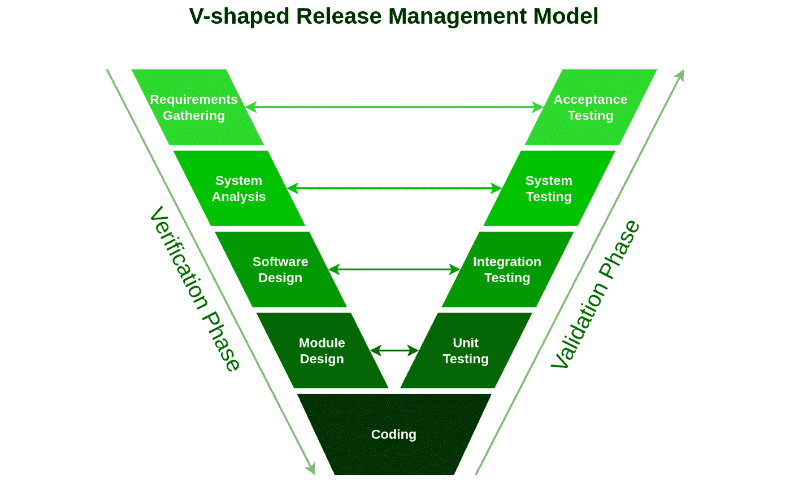

# 第三章：各种 SDLC 发布管理模型是什么？

软件开发团队可以使用各种**框架**或**发布管理模型**来组织他们的工作。这些模型帮助组织实施**软件开发生命周期**（**SDLC**），通过不同的策略实现相同的结果。一个发布管理模型包含软件开发人员用来组织工作并交付软件产品或功能的各个阶段。一般而言，每个模型包含以下六个阶段：**变更请求**、**规划**、**设计与构建**、**测试**、**部署**和**发布支持**。

发布管理模型确保根据客户需求生产高质量的软件。为了实现这一目标，创建了各种发布管理方法论，如 ITIL、瀑布模型、迭代模型、V 模型、螺旋模型、大爆炸模型、敏捷和 DevOps，但有一些较不流行的模型不在本书的范围之内。我们来回顾一下最常用的 SDLC 发布管理模型：

+   ITIL 模型

+   瀑布模型

+   迭代模型

+   V 模型

+   螺旋模型

+   大爆炸模型

+   敏捷模型

+   DevOps 模型

# ITIL 模型

英国政府的**中央计算机和电信机构**（**CCTA**）创建了**信息技术基础设施库**（**ITIL**）模型：一套用于 IT 活动的最佳实践，如**IT 服务管理**（**ITSM**）和**IT 资产管理**（**ITAM**），其起源可以追溯到 1980 年代初期。这些实践的核心理念是将 IT 服务与公司运营的需求对齐。2000 年，CCTA 并入了英国的**政府商业办公室**（**OGC**）。

在初期，企业 IT 部门被高级领导视为成本中心，而不是它们所具备的价值增值者。当时，许多公司没有建立获取服务或报告 IT 事件的协议，IT 与业务的沟通也较差。因此，许多公司的领导认为 IT 没有创造价值或达成公司目标。随着企业 IT 部门的逐渐增多，他们意识到必须通过满足业务定义的可衡量结果来证明自身的价值。

随着 ITSM 范式的出现，企业的注意力从 IT*部门*转移到了 IT*服务*的管理和履行。ITSM 对于 IT 专业人士来说是新鲜的，他们被视为一个独立的实体，而业务单元则被视为他们的客户。为了服务客户，IT 提供由技术资源和专业知识支持的服务。因此，为了展示价值，IT 必须按照既定的服务水平协议提供这些服务，并满足战略业务需求。

ITIL 指导整个服务生命周期中的 IT 服务管理。其核心是一个框架，用于管理组织的 IT 基础设施，从而实现战略目标、创造商业价值并确保基本的能力标准。公司可以利用这一基准作为未来规划、实施和评估的起点。

正如你现在可能已经推测到的，**ITIL 发布管理模型**更多地与*系统开发*相关，而非软件开发。话虽如此，ITIL 被认为是企业环境中最早且最广泛实施的发布管理模型之一。尽管 ITIL 在软件发布管理中是一个特例，但要了解 ITIL 是什么，以及它如何融入整体发布管理生态系统。现在，让我们来看看 ITIL 的两个最新版本：V3 和 V4。

## ITIL 3

OGC 在其 IT 服务管理（ITSM）战略上取得了重大进展，并提供了超越 ITIL 版本 2 的深度和全面性的更新指导。ITIL 版本 3 于 2007 年向公众发布，结构上是将服务生命周期划分为五个独立的阶段。这些阶段包括*服务战略*、*服务设计*、*服务过渡*、*服务运营*和*持续的* *服务改进*。

每个阶段都旨在涵盖服务生命周期的特定阶段，可以总结如下：

+   **服务战略**：制定更好服务客户的计划。服务战略过程从分析客户需求和市场状况开始，建立 IT 组织要提供的服务以及要构建的能力。最终目标是将 IT 部门的思维方式转变为战略规划和执行的思维方式。

+   **服务设计**：开发新的信息技术（IT）服务。该过程的广度涵盖了新服务的创建以及现有服务的修改和增强。

+   **服务过渡**：创建和发布计算机系统。对服务和服务管理流程的变更以协调的方式实施，这是服务过渡职能的另一个职责。

+   **服务运营**：确保 IT 服务得以良好且迅速地提供。在服务运营过程中，满足用户需求、修复服务故障、解决问题以及完成日常操作任务。

+   **持续服务改进**：应用质量管理技术深入了解当前和过去的表现。持续服务改进过程的目的是将 ISO 20000 采纳的持续改进概念应用于 IT 过程和服务，以最大化其有效性和效率。

下图展示了 ITIL V3 发布管理模型的各个阶段：

图 3.1：ITIL V3 发布管理模型

这就是我们对 ITIL V3 的介绍。我们同时观察 ITIL V3 和 ITIL V4，因为它们之间有一些显著的差异。值得注意的是，ITIL V4 是一个最近的更新版本，其过程图并没有保留 ITIL 早期版本所著名的传统。ITIL V4 的变化带来了更具灵活性的服务框架，而不再是一个僵化的 IT 服务管理模型。

## ITIL 4

自 2007 年以来，ITIL 没有进行过重大修订；因此，**ITIL 4** 可能是对竞争性服务管理框架如 **VeriSM™**、**SIAM®** 和 **FitSM** 兴起的回应。它是 **ITIL V3**（也称为 **ITIL 2011**）的一个更新和扩展版本，能够作为企业进行数字化转型的灵活基础。

ITIL 版本 4 概述了为 IT 支持的产品和服务提供服务的过程框架。文档经过了大量修改，以使其更加易读，并且添加了多个示例。ITIL 4 还考虑了现代软件工程和信息技术管理实践，提供了使用敏捷（Agile）、开发运维（DevOps）和精益（Lean）等方法论在服务管理中的应用指导。最后，ITIL 4 强调它是 *服务管理框架*（而不是 *IT 服务管理*），这反映了服务管理最佳实践在 IT 行业之外的广泛应用。

需要记住的是，虽然 ITIL 确实是一种发布管理方法论，但它与系统开发生命周期的相似性超过了与软件开发生命周期的相似性。正因为如此，ITIL 排在我们的列表首位。现在，让我们将注意力转向瀑布式发布管理模型。瀑布式模型是最初用于组织专注于构建信息系统的项目的发布管理标准。瀑布式模型诞生于那个关键时期，当时工程师们正从用开关板和电缆编程计算机过渡到使用穿孔卡片上刻出的逻辑序列。这标志着历史上首次可以独立于物理机器编写和管理程序。

# 瀑布式模型

**瀑布**模型是一种将项目阶段按线性顺序组织的方法。这意味着每个阶段建立在前一个阶段的交付成果基础上，并对应于不同的任务专业化层次。这种方法在多个工程设计领域中得到了广泛应用。由于进展大多是单向的（*向下*，就像瀑布一样），这种方法通常被认为是软件开发中最不具备迭代性和适应性的模型之一。原因在于，团队只能在瀑布过程中向前推进，无法回退。这个不可变阶段的线性进展包括*需求收集与分析*、*系统设计*、*实施*、*测试*、*部署*和*维护*。

瀑布模型是第一个用于软件开发中的发布管理 SDLC。制造业和建筑业被认为是瀑布开发模型的发源地。在这些行业中，高度组织化的环境意味着在制造过程中，进行设计修改会变得极其昂贵。最初在软件开发中实施时，并没有公认的替代方案来进行基于知识的创意工作。

瀑布发布管理方法因其缺陷而遭遇了显著的反对。在客户看到功能软件之前，他们可能并不完全了解自己的需求，这可能导致他们在事后更改需求。这将导致需要重新设计、重新开发和重新测试，从而推高成本。软件工程师和业务开发人员可能缺乏对新软件产品或功能设计过程中可能出现的潜在挑战的预见。在这种情况下，最好重新评估设计，而不是继续执行一个未考虑到任何新发现的限制、前提条件或问题的设计。

每个阶段性的过程在查看其各个阶段及流程图后，能够更好地理解。观察瀑布发布管理模型的图示，确实能轻松理解它的不可变步骤的线性顺序是如何赋予瀑布模型这一名称的：

图 3.2：瀑布发布管理模型的六个阶段

如你所见，瀑布发布管理模型非常适合组织一个庞大的工作，涉及数百甚至数千名开发人员在同一个项目中。现在你已经对瀑布发布管理模型有了基本的了解，你也能很好地理解后续更先进的发布管理模型的概念。

我们接下来将研究的发布管理模型是*迭代增量*模型，通常简称为**迭代**模型。该方法通过小步增量的方式，或称为迭代，来构建系统。这个发布管理模型是瀑布模型的最早和最直接的竞争者之一，起源于大约 1960 年。因此，我们将接着讨论迭代增量发布管理模型。

# 迭代模型

这一技术的概念是通过小步增量的方式，或称为*迭代*，构建系统，以便软件工程师能够从构建系统先前版本的经验中受益。在系统开发和使用过程中，学习不断发生，关键步骤可能从软件需求的子集的初步实现开始，通过迭代的方式逐步改进，直到整个系统实现。设计的修改和新功能会在每次迭代开发周期后融入系统，如下所示：

图 3.3：迭代增量发布管理模型

该技术具体分为三个步骤：**初始化阶段**、**迭代步骤**和**项目控制清单**。系统的起始点在初始化过程中构建。在开发的第一阶段，我们希望提供给用户一些可以反馈的内容。它应该提供对问题的全面概述和直接的解决方案。在每次迭代开始时都会编制项目控制清单，以记录所有未完成的任务。它包括重新设计当前解决方案的部分内容或添加全新的功能等内容。分析步骤将导致控制清单的持续更新。

迭代的**重新设计**和**实施**应该易于理解和应用，无论是在迭代过程中还是作为一个单独的任务添加到项目的控制清单中。迭代方法并不要求设计具有特定的粒度。然而，在关键的迭代项目中，可能会使用正式的软件设计文档来补充代码，作为系统文档的主要来源。迭代的分析基于用户反馈和可用的程序分析工具。这包括对结构、模块化、可用性、可靠性、效率和目标达成情况的检查。项目控制清单会根据研究结果进行更新。

在迭代开发中，您的团队将对软件进行逐步改进和调整，直到其完全功能化。每次迭代应旨在提升整体产品，而不仅仅是产生一个新的功能或组件。迭代式管理风格允许根据需要对项目进行调整，以确保成功。这有助于开发团队考虑任何未预见的方向变化，无论是正面还是负面。

一位合格的迭代项目经理必须能够在项目进展过程中进行这些调整，同时尽量减少对团队的干扰，并关注其他团队成员的反馈，以确保项目的进度和预算可控。此外，问题和困难可以及早识别并修复，从而节省时间和金钱。当您定期提供可行的产品增量时，消费者可以更早地提交反馈，从而产生更符合用户需求的优秀软件。如果产品以迭代和增量的方式进行管理，就不会出现最后一分钟的调整或匆忙满足不切实际的截止日期。

这就是我们对迭代和增量发布管理模型的介绍。如您所见，迭代和增量模型与几十年后出现的敏捷发布管理模型非常相似，我们将在本章后续部分讨论它。现在，让我们换个角度，将重点转向 V 型发布管理模型。

# V 模型

**V 模型**得名于它与字母*V*的相似性。这个 SDLC 发布管理模型在 V 模型中被分为多个阶段，每个阶段都有自己的专门测试阶段。V 模型的左侧代表验证阶段，而 V 模型的右侧代表确认阶段。V 模型是创建系统过程中各阶段的图示，它用于构建项目管理和开发生命周期的严格模型。下图展示了 V 模型：

图 3.4：V 型发布管理模型

V 模型提供了计算机化系统验证框架中的主要活动及其相关输出的高级概述，有时也称为项目生命周期开发。它指定了在产品开发过程中必须进行的活动和必须生成的交付物。

需求分解和系统规范制定的过程表现为 V 模型的左侧。单独组件的集成和验证表现为 V 模型的右侧。然而，需求首先需要经过验证过程，在此过程中它们会与更高层次的需求或用户需求进行比较。此外，还有一个叫做系统模型验证的概念。你也可以通过“左移”来完成这一过程，这意味着根据团队的操作方式，验证只在右侧发生的说法可能并不准确。

在 V 模型中，时间和开发从左至右推进，且无法倒退。正如图中所示，所有迭代都发生在垂直方向上，要么向上，要么向下在框架的架构中进行。这两个过程的区别在于，验证是根据预定义的技术规范进行的，而确认是根据实际的世界条件或用户需求进行的。你可以通过确保你正在构建正确的东西来验证，并通过确保你在以正确的方式构建它来确认。

# 螺旋模型

1986 年，**巴里·W·博姆**创建了螺旋发布管理模型，作为组织软件开发生命周期（SDLC）的一种方法。该模型假设构建一个应用程序是一个可以无限重复的周期，直到达到预期的结果。通过持续监控风险和检查中间产品，螺旋模型显著降低了大型软件项目失败的可能性。

在开发过程中出现的问题可能会对最终产品产生多种潜在影响。如果发生这种情况，你应当为价格上涨、工作量增加以及交付日期延迟做好准备。这些都是可能迅速威胁到公司可持续性的因素。螺旋模型采取的迭代渐进方式，以及常规的风险评估（可以通过原型草图、研究或仿真来实现），旨在要么彻底消除此类事件的可能性，要么至少减少它们造成的损害。螺旋软件开发模型非常适用于大型、高度定制的项目，尤其是客户和开发者将财务管理作为优先事项，或是在高度波动的市场中的项目。与其他传统模型相比，螺旋模型的最大优势是风险分析，这对所有相关方都有益。常规的风险评估对于缺乏经验值且具有较高风险概率的创新技术环境尤为重要。

图 3.5: 螺旋发布管理模型

软件开发项目会持续进行其螺旋模型周期，直到达到最终状态。这个周期主要包括以下四个步骤：

1.  螺旋模型典型周期的第一阶段是确定应与软件开发的各个阶段相关联的目标。增加功能或提升性能就是此类变更的示例。同时，必须明确几个实现选择（例如，设计 A 与设计 B 的对比），并确定框架条件以及所需的开销或时间。

1.  下一阶段是分析各种选择，以目标和框架条件作为权威的参考值。在螺旋模型周期的这一阶段，应识别和分析对软件项目整体开发构成重大风险的不确定性区域。原型设计、模拟、基准测试、分析模型和用户调查是将用于下一阶段的一些工具，这一阶段将开发出最小风险和最高性价比的策略。

1.  在完成全面的风险评估后，软件开发可以继续进行——但始终会存在一定程度的残留风险。例如，如果性能风险、用户界面风险或内部接口控制风险在开发过程中占据主导地位，第一种替代方案就是演化开发策略，在该策略中，项目将被更清晰地定义，并且原型得到优化。在这个策略中，用户界面风险和内部接口控制风险是主导开发过程的关键问题。然后，代码会被创建并多次测试，直到获得预期的结果，为之后的开发过程奠定一个低风险的基础。

演化原型开发

演化原型开发，也称为面包板原型开发，与其他原型策略有所不同。采用演化原型的主要目的是利用系统化的过程构建一个高度可靠的模型，并不断改进它。这一方法基于这样的理念：演化原型作为新实施系统的基础，使得未来的增强和附加需求可以随着时间的推移逐步整合进来。

1.  下一周期将在当前周期结束后立即规划。如果单个周期的目标能够实现，而下一个目标尚未确定，那么这可能是项目的常规延续。另一方面，如果前一阶段的开发存在缺陷，寻找解决方案可能是唯一的选择。当前方法的一个可能替代方案是已经确定的替代方案之一，或者引入一个全新的方法。通过这种方式，你可以再尝试一次，直到实现目标。

软件开发中的螺旋发布管理模型被认为是一种通用的过程模型。四个阶段仅仅是确立了一个周期的基本目标，并不要求每次迭代中都体现出来。它们的顺序并不是由螺旋模型严格决定的。因此，该模型有可能在任何时刻与其他过程模型进行集成。

这就是我们对螺旋发布管理模型的回顾。到现在为止，你已经了解了螺旋软件开发是一种规避风险的模型，主张实施迭代开发技术，并在 SDLC 的每一步中管理风险。接下来，让我们来研究一下大爆炸发布管理模型——一种与螺旋模型截然不同的高风险开发风格。

# 大爆炸模型

在大爆炸发布管理模型下，软件工程师在没有任何详细准备的情况下，全力投入到编程工作中。换句话说，没有预定的计划，需求是随着发现而逐步实现的。在某些情况下，如果需要调整，可能需要完全重写应用程序。你可以清楚地看到大爆炸模型为何得名。然而，当项目中只有一两个开发人员参与时，这种方法特别有效，正如在学术界或实践中的情况一样。当项目需求不明确且有一个固定的完成期限时，这种技术尤为有用。

大爆炸模型是一种软件开发生命周期范式，它从什么都没有开始，逐步构建起来。我们在规划上花费的时间非常少，也不遵循任何特定的程序。由于不需要任何规划，它是最基础的发布管理方法。需求是在没有太多前瞻性的情况下实时应用的，客户甚至不清楚自己需要什么。该方法的主要目标是尽快开始编码，而不遵循任何特定的结构，并尽快将完成的产品交付给客户。日常开发开始时有一些前提条件，尽管对最终结果知之甚少。接下来，客户与开发团队保持密切联系，以跟踪工作进展。如果结果与预期相符，产品将被授权；否则，将提出不同的解决方案。

简而言之，这种方法论不需要详细规定要求，产品需求在收到后会迅速被理解并执行。该范式的核心重点是编程，因此相比其他发布管理模型，它更容易受到风险的影响。在组件或至少其组成部分完全集成后，测试即可开始。此模型最适合在现有环境中整合前沿技术，分析所做的修改，并具有良好的适应性。

正如你所推测的，这个模型类似于宇宙大爆炸理论。时间、资源和能量的浓缩混合，瞬间产生了一个完成的产品，似乎是凭空而来。下图详细描述了大爆炸发布管理模型：

图 3.6：大爆炸发布管理模型

这就是我们对大爆炸发布管理模型的回顾。到现在为止，你已经理解了发布管理的真正含义。你明白了发布管理可以是怎样的，从最正式到最非正式的形式。接下来，我们将探讨臭名昭著的敏捷发布管理模型。无论你喜不喜欢，敏捷模型在 DevOps 崛起并取代它之前，曾在大约二十年的时间里风靡一时。

# 敏捷模型

**敏捷**发布管理模型将 SDLC 阶段分为多个开发周期，团队在每个周期结束时交付增量的软件变更。敏捷方法非常有效，其快速的开发周期帮助团队及早发现问题；然而，过度依赖客户反馈可能导致范围蔓延。敏捷模型非常适合那些随着时间推移需要适应性和灵活性的软开项目。下图展示了敏捷模型：

图 3.7：敏捷发布管理模型

大多数敏捷开发所使用的技术将工作划分为若干小增量。这些增量相比其他发布管理模型（如瀑布模型）需要较少的前期规划和设计时间和精力。这些迭代被称为冲刺，是短暂的活动周期，通常持续一到四周。每个迭代都需要一个跨职能团队的参与，团队会进行所有活动，包括规划、分析、设计、编码、单元测试和验收测试。在迭代结束时，利益相关者会看到一个已经具有功能的产品演示。这降低了整体风险，并使得产品能够快速适应新的环境。

目标是确保每次迭代结束时都有一个可用的发布版本（且 bug 数量较少），尽管每个迭代可能不会产生足够的功能来支持市场发布。当产品以增量方式开发时，相较于在产品最终交付日期临近时发生灾难性失败，它们在每次迭代阶段更具灵活性，可以*早期并频繁地失败*。可能需要多次修订才能发布产品或新功能。进展的最重要指标是有功能的软件。

采用敏捷方法论的两个主要好处是快速的产品开发和降低风险。因此，通过将产品以较小的增量发布到市场，可以减轻由于产品未能满足消费者需求而产生的风险。

这就是我们对敏捷发布管理模型的回顾。正如您所见，敏捷模型是迭代增量模型的逻辑继任者，同时也是通向 DevOps 发布管理模型的一个重要步骤。因此，接下来我们将讨论 DevOps 模型。

# DevOps 模型

**DevOps** 发布管理模型包括一系列方法论，旨在整合 **软件开发**（**Dev**）和 **IT 运维**（**Ops**），以促进更快速和更频繁的软件发布。这种软件开发策略结合了沟通、自动化和分析。DevOps 方法论强调交付符合业务目标并满足客户需求的软件。通过利用快速反馈循环、相关的 **关键绩效指标**（**KPIs**）和迭代开发策略来实现这一点。虽然 DevOps 包括规划、设计、编码、测试和部署，但该模型的一个显著特点是它如何将持续集成、持续交付、持续测试和持续监控融入到软件开发生命周期中。以下图示展示了 DevOps 模型：

图 3.8：DevOps 发布管理模型

发布管理在很大程度上依赖于精确的报告，以便跟踪需求、风险和障碍。它还确保项目的初始目标和目的在整个软件开发生命周期内都能得到实现。

采用 DevOps 原则自然会带来一个更完善的发布管理框架，进而为交付生命周期每个阶段的有效协作和测试制定行业标准的程序。人们往往将自动化视为 DevOps 中最重要的价值，但自动化应始终聚焦于提升人员的生产力。当人们致力于提高操作效率并减少人为错误的影响时，他们必然会以更高的速度发布可靠的服务。

在 DevOps 文化中整合发布管理使得企业能够实现加速、可靠和成功的软件发布。最终，这一现象有助于提高消费者的满意度，增进开发团队间的合作，并加速企业的扩展。

DevOps 和发布管理在软件开发、项目管理和 IT 运维方面有着密切的关系。DevOps 发布管理包括了对软件发布和交付周期的设计、规划、调度、测试和实施等活动的管理。

已经至少对某个产品进行过一次修改的组织，通常都能深刻理解发布管理在 DevOps 背景下的重要作用。当这一策略得当执行时，它有潜力提升开发、测试和操作过程的效率。此外，这一发布管理策略还能有效减少返工成本、加强协作并促进高质量产品的成功交付。

这提升了组织对发布过程各阶段的监督，从最初的开发到最终的交付。DevOps 发布管理现已成为当新产品推出或进行修改时的现代标准。DevOps 过程可能会因团队的不同、偏好的实践和组织的目标而略有不同。

通过采用 DevOps 发布管理，软件开发团队能够通过更早地进行质量检查、左移测试、自动化和 QA 程序，从而提高软件交付生命周期中的整体效率。由于其在消除孤岛效应、促进团队成员协作方面的作用，DevOps 发布管理正逐渐成为当前最流行的发布管理策略。

# 总结

我们已经到达本章的结束。到目前为止，我们已经讨论了 IT 行业中最常见的八种发布管理模型。它们分别是 ITIL 模型、瀑布模型、迭代模型、V 型模型、螺旋模型、大爆炸模型、敏捷模型和 DevOps 模型。现在你应该已经了解了每种发布管理模型的各种优缺点，并对选择适合自己项目的模型有了信心。此外，你也已经接触到 DevOps 相对于之前发布管理模型所提供的惊人好处。因此，你对发布管理的历史有了基本了解，并能够根据每种模型的演变，做出明智的结论。

本章已结束，*第三章*。在下一章中，我们将学习 DevOps 发布管理的独特性。了解这一点非常重要，因为接下来的章节将重点讨论 DevOps 发布管理模型。

# 问题

请回答以下问题，以测试你对本章内容的理解：

1.  为什么 ITIL 发布管理模型更多地与系统开发生命周期相关，而不是软件开发生命周期？

1.  第一个标准发布管理模型是什么？

1.  迭代和增量发布管理模型中的三个步骤是什么？

1.  在 V 型发布管理模型中，时间和发展的进程走向是什么方向？

1.  螺旋发布管理模型的定义特征是什么？

1.  大爆炸发布管理模型开始新项目时需要的三个关键要素是什么？

1.  敏捷发布管理模型在测试方面的座右铭是什么？

1.  DevOps 发布管理模型的定义特征是什么？

1.  在瀑布发布管理模型中，何时可以回溯并返回到之前的阶段？

1.  DevOps 发布管理模型的哪个阶段进行测试？

# 第二部分：DevOps 发布管理的优势

在本书的第二部分，我们将从学习 DevOps 发布管理试图解决的问题开始。接着，我们将学习 DevOps 发布管理的独特性。然后，我们将了解 CI/CD 的基础，它是基于 DevOps 的价值流的核心。最后，我们将探索 CI/CD 流水线如何促进良好的 DevOps 发布管理。本部分的目标是强调 DevOps 发布管理的标志性特征，以便你在进一步学习并成为一名经验丰富的 DevOps 领导者和战术专家之前，具备必要的基础知识。

本节包含以下章节：

+   *第四章*，*DevOps 发布管理试图解决什么问题？*

+   *第五章*，*理解 DevOps 发布管理的独特性*

+   *第六章*，*理解 CI/CD 的基础*

+   *第七章*，*技术发布经理的实用流水线*

+   *第八章*，*CI/CD 流水线如何推动良好的 DevOps 发布管理*
