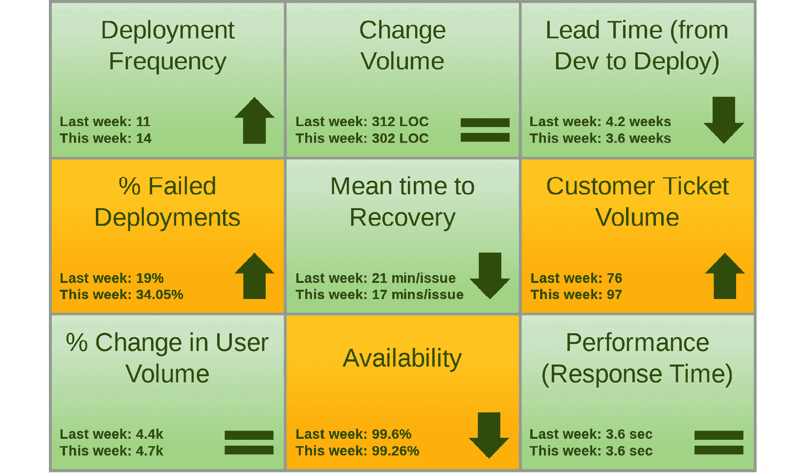

# 4

# DevOps 发布管理试图解决哪些问题？

以今天的标准来看，传统的 IT 组织有着极长的开发周期。在这些过时的公司中，通常需要进行大量的手动测试，才能将软件产品发布到生产环境中。而且，每次代码变更都会给相关方带来极大的压力。在这些组织中，开发团队通常需要等待清理好的环境，或者必须等待批准才能进行任何变更。此外，**质量保证**（**QA**）团队可能要等开发人员完成工作后，才能进行测试。这些等待导致了低**部署频率**（**DF**）和高**变更交付周期**（**LTFC**）。

此外，在传统的 IT 组织中，项目完成后，许多团队成员会离开，几乎不留下文档或知识转移。这使得当新工程师加入团队并尝试支持系统时，面临很大挑战。通常，这会导致在发生关键问题时，**平均恢复时间**（**MTTR**）较长。像这些组织通常通过专门的运维团队来管理环境配置，这些团队的唯一任务就是基础设施管理。即使**基础设施即代码**（**IaC**）是公司的标准程序，他们仍然会进行手动更改服务器，导致配置漂移。不同环境中的服务器可能会有不同的工件，例如应用程序所需的库，或者相同产品的不同补丁级别。所有这些手动工作会导致低 DF 和高交付周期。

在本章中，我们将探讨 DevOps 发布管理如何通过结合自动化、最小化风险、简化发布过程，并通过跟踪度量标准和分析**关键绩效指标**（**KPIs**）来解决这些问题。我们将论证 DevOps 的特点如何使其在云端微服务部署的背景下，成为一种卓越的发布管理方法。

因此，本章将涵盖以下主题：

+   探索自动化测试、部署和变更管理

+   减少潜在风险并加速软件产品的发布

+   精简发布过程，使其标准化

+   改善成功发布的度量标准和关键绩效指标（KPIs）

# 探索自动化测试、部署和变更管理

当涉及到软件的创建时，大多数现代组织必须应对一些重大障碍：*快速部署软件* 和 *规模化创新*。DevOps 方法旨在通过在整个**软件开发生命周期**（**SDLC**）中实施自动化来解决这些挑战，其目标是加快交付既可靠又安全的软件。

通过合并自动化测试、自动化部署和自动化变更管理，DevOps 发布管理为运营团队铺平了自动化发布计划的道路。当使用自动化进行发布管理时，管理和交付成功的发布要简单得多，因为它使发布管理成为一个可以轻松重现和重复的过程。这通过实施精心设计的**持续集成/持续部署**（**CI/CD**）流水线来实现，在您的组织内部是互操作的，但同样重要的是它们是可靠的。

无可否认，自动化包含持续发布和持续交付的 DevOps 框架是多么复杂。在整个应用程序开发过程中，必须使用全面的测试、广泛的跨团队沟通、先进的工具和工作流程来实现持续发布。

在接下来的小节中，我们将讨论自动化测试这一至关重要的话题，这是 DevOps 理念的生命线。

## 自动化测试

在 CI/CD 流水线中尽早且频繁地部署自动化测试从 DevOps 的起源以来就成为其重要特征。这包括积极监控生产环境，以防止未检查的问题影响用户。现实情况是，现代应用程序依赖于多个可能故障的工件和服务。除了在流水线中使用静态和动态应用程序分析工具之外，还应在所有开发环境中进行事务性监控，而不仅限于生产环境。通过使用模拟数据和持续监控来运行测试，您可以检测到影响应用程序任何组件的问题，包括第三方**软件即服务**（**SaaS**）集成。一些有效的 SaaS 工具包括 Datadog、Dynatrace、New Relic、Snyk 和 Prisma Cloud。

随着您的开发团队逐步完善其 DevOps 实践，他们将希望在整个 SDLC 中实施测试自动化，因为这是释放 DevOps 全部好处的关键。这些好处包括能够更快、更一致地构建、测试和发布。为了提高**事件响应**（**IR**），鼓励团队之间的协作，并有效沟通，现在不再可行的是将新代码提交给手动 QA 测试几个小时甚至几天，然后再让软件开发人员得到反馈。QA 团队必须围绕 DevOps 发布管理生命周期调整工作，确保测试用例实现自动化，并且在可实现的范围内具有完整的代码覆盖。环境的配置需要通过使用基础设施即代码（IaC）来标准化，并且部署应当自动且不可变地进行。换句话说，所有的预测试任务，例如基础设施配置、环境配置、后测试任务、清理或相关的、可重复的、日常的事项，都应当实现自动化，并与 CI 的理念保持一致。

自动化测试是 CI 的关键优势，它能节省您的资源，使您能够实现规模经济。首先，自动化测试最大化了在错误进入生产环境之前被发现的可能性。它还通过在检测到缺陷和错误时立即通知您，来加快发布过程。此外，实施 CI 的一个显著优势是，小团队也能成功地完成更重的任务。并行集成允许您快速连续地执行多个自动化测试，每个测试通常只需几分钟，从而进一步减少测试开销。自动化整个开发过程可能看起来令人不知所措，但您可以从自动化一个单一的端到端流程开始，并定期运行它。新的工具和资源使自动化测试比以往任何时候都更容易，且其好处值得投入。自动化测试使您能够消除瓶颈并提高生产力，通常能够提升员工和客户的满意度，并增加公司银行账户中的收入。

自动化测试带来的一个重要推动力是能够以今天数字化市场的速度扩展运营。DevOps 技术在降低风险的同时，能保持一致的质量。这在一定程度上通过将工作分配给多个小型团队来实现，这些团队以自给自足的方式运作，同时又能像一个有凝聚力的部落一样进行协作。这种共同开发风格鼓励团队成员分享个人技巧和想法，同时在作为**业务单元**（**BU**）的共同理念下工作。由于自动化测试带来的巨大生产力提升，你将体验到更好的团队协作。你的同事不再需要将大量时间和精力投入到手动测试协议中，反而团队将有更多机会讨论优化策略，或是一起外出享受兄弟般的午餐。由于你选择了 DevOps 文化，你也选择了共同承担质量责任，这种责任感在团队成员中培养了自豪感。现在，你应该能意识到自动化测试已成为 DevOps 的重要组成部分。

DevOps 发布管理可以帮助你提升基础设施和业务流程的可靠性。更重要的是，通过提高测试自动化覆盖率来改进发布的可靠性，生产环境中的问题将变得非常罕见。这些特性总和促成了一个令人振奋的工作环境，团队成员也更喜欢这种工作方式。所有这些 DevOps 发布管理方法的特点都带来了客户的更高满意度。事实证明，更好的可靠性和快速响应客户反馈能提升客户满意度，并鼓励更多人推荐你的公司产品。

## 自动化部署

从本质上讲，CD 是一个统一的发布过程，包含了自动化构建、测试和部署步骤。其目标是简化将新软件推向生产环境的操作流程。每个企业必须弄清楚其独特的测试套件中，单元测试、功能测试和压力测试的组合方式。为了成功地进行构建和发布候选版本的预部署测试，必须在发布前的预生产测试环境中模拟生产环境条件。

通过使用 CD 流水线，可以将代码更改自动推送到生产环境，CD 流水线是一种自动化工作流，结合了构建、测试和部署。一个工作流阶段的输出成为下一个工作流阶段的输入，依此类推。通过 DevOps 方法，CD 可以通过在每个阶段进行自动化测试和监控来预防错误、功能难题和缺陷。通过这种方式工作，可以在问题进入主分支之前及时发现并解决，从而避免其影响生产环境。

最终结果是，工程团队能够将代码修改实施到主分支，并迅速在生产环境中看到其部署，通常在几分钟内完成。这种软件开发的哲学强调 DevOps 的根本目标，即持续为最终用户交付价值。这一因素也成为许多应用程序和基于网络服务中新特性和系统修改引入的主要催化剂。

一旦实施，CD（持续交付）使企业能够更容易地满足客户期望，并迅速发布软件升级，通常在提交代码更改后的几分钟内完成。然而，采用 CD 可能会与传统的需要花费几天甚至几周时间准备发布软件的方法相比发生巨大的变化。尽管如此，那些投入必要的努力、资金和设备的公司将获得实实在在的好处。以下是一些广泛认可的采用 CD 的好处：

+   **完全自动化产品发布的实施**：这使企业能够将更多时间分配给软件开发，而不是在发布日之前中断开发活动。

+   **应当有更频繁、更小规模的发布**：这不仅能使产品开发工作进展得更快，还有助于支持持续改进的范式。

+   **与新实现的功能相关的快速反馈循环**：组织能够迅速收到关于新特性、升级和代码修改的实时反馈。

## 自动化变更管理

一个从 DevOps 方法的特别应用中获益匪浅的传统流程是变更管理。许多现有的变更管理方法直接与 DevOps 哲学的基本原则相悖。传统策略引入的官僚主义和审批关卡，要求每次变更都经过多个级别的审批，这几乎确保了更长的发布周期和延迟向客户交付价值。这与 DevOps 哲学相悖，后者强调快速迭代和频繁的客户获益。为了有效实施 DevOps 策略来管理变更，我们必须放弃传统的、封闭的稳定性维护观念。要充分理解变更管理如何在保持一致性的同时促进快速响应和适应性，我们必须扩展我们的视野。我们不会将变更审批过程作为阻碍创新的障碍，而是将其作为加速向客户交付新特性的过程的一部分。

通常，你将与采用 CI/CD 方法的组织打交道，这使得它们能够每天进行多次发布，有时甚至达到两位数或三位数。为了在快速速度下有效实施变更管理，必须将其整合到 CI/CD 流程中。有几种**IT 服务管理**（**ITSM**）工具，如 ServiceNow、Jira、Freshservice 和 Zendesk，提供**应用程序编程接口**（**API**），使得 CD 管道与变更管理系统之间能够无缝集成。通过利用这些 API，组织可以自动生成变更票据，并通知相关方参与。这一做法保证了每次修改都有一个票据，而不会对部署过程造成额外负担或阻碍。许多企业已经成功地实现了流程结构、协作文化和变更管理工具的融合，为实现稳定的操作环境铺平了道路。

向管道中添加审计日志是一项简单的操作，并且带来了显著的优势。实施审计日志后，任何有兴趣的人都可以查明最近一次修改上线花费了多少时间，为什么它是必要的，谁批准了它，是否所有前阶段的检查项都已经完成。例如，当审计员要求提供文档，证明某个变更在未来遵循了你的流程时，你只需追溯日志记录即可。你可以对所有信息配置精细的访问权限。然而，随着这些优势而来的是重大的挑战，尤其是在需要绕过变更管理门槛，在紧急情况下对生产环境进行手动更改的情况。

这就结束了我们对自动化测试、部署和变更管理如何极大改善传统软件开发实践的探索。在下一部分，我们将讨论 DevOps 如何降低风险并提高开发速度。

# 降低潜在风险并加速软件产品的发布

软件交付过程通过 DevOps 发布管理得到了卓越的沟通、协调和生产力的促进。**Slack**、**MS Teams**、**Jira**、**Confluence**、**ClickUp**、**Asana**等协作工具促进了优异的沟通，这一点非常重要，因为在当今全球化经济中，各组之间的协作发生在广阔的距离和时区之间。

DevOps 发布管理方法的典型实施包括了诸如 CI/CD 和部署自动化等成熟的工作方法，这些方法大大加快了高质量软件的开发，同时减少了潜在风险。因此，这些因素使企业能够迅速适应市场波动，以更高效的方式满足消费者需求。

在 DevOps 实践特别有用的几个领域中，**灾难恢复**（**DR**）尤为重要。自动化流程、实施 CI/CD 以及利用云计算对于保证 99.999%的正常运行时间且不丢失数据至关重要。当灾难恢复计划成为组织 DevOps 管道战略的一部分时，它通常与应用程序本身一起管理，以便定期对两者进行检查。通过在 DevOps 工作流中加入灾难恢复计划，恢复过程实际上被转变为类似于部署应用程序的过程。这不仅减少了错误的可能性，还帮助加速了新软件应用程序的发布。在危机发生时，你的团队可以利用他们在部署方面的专业知识来促进恢复过程。

此外，复制数据的灾难恢复环境也能为恢复工作提供帮助。毫无疑问，用于将应用程序从开发、QA 到生产环境的工具和程序，也可以应用于灾难故障切换和恢复工作。这确保了选择采用 DevOps 的决策同样为灾难恢复（DR）方面带来了有价值的投资。最终结论是：同样的自动化技术，可以用于将应用程序从开发/测试环境过渡到生产环境，也可以用于故障转移和恢复。

这段内容总结了 DevOps 发布管理如何减少风险的潜力并加速软件产品的发布。在接下来的部分，我们将探讨 DevOps 如何通过标准化发布过程最大化自动化的效益。自动化是一个方面，但如果没有优化这些过程，你将失去管道所能提供的最大利益。

# 精简发布过程，使其变得标准化

通过将发布管理纳入现有的 DevOps 工作流中，发布过程可以得到简化，最终实现标准化。这为公司程序的统一执行设立了先例。建议将 CI/CD 管道的结果记录在发布日志中，并将其汇总到发布管理的故障跟踪产品、源代码管理以及相关工具中。在系统部署后，这些文档对于追踪问题的来源并应用相应的解决方案至关重要。

*发布管道*一词指的是一系列自动化和手动流程，旨在确保客户能够访问到公司软件产品的稳定和安全版本。发布管道的职责和责任是确保产品改进能够快速、安全地交付给最终用户，从源代码的更改开始，通过开发、测试和发布的过程。**持续交付**（**CD**），确保您的代码库可以随时安全部署的过程，与发布管道密切配合。原因在于它们减少了开发人员必须花费在繁琐工作上或修复不可避免的错误上所需的时间。

发布管道最显著的优势是它能在保证稳定性的同时缩短交付新版本所需的时间。如果出现问题，您将有自动回滚程序和防故障机制。总体而言，您的用户将更早获得新功能（或错误修复）。通过发布管道，可预测性和可靠性都得到了提高，开发人员生产力的提升也是另一个优势。开发人员可以避免在事后为自己的行为辩解或重构发布版本，因为内置的审计功能可以减少这些麻烦。他们将有更多时间专注于编写代码（这一活动为业务带来价值），而无需过多担心外部细节。

发布管道充当公司软件分发的协调者。这意味着该系统将根据发布获取的输入和数据自动做出决策。此外，它还将实时解决常见问题，或者在某些情况下，如果发现对客户有不利影响，立即回滚部署。发布管道是根据您公司业务运营的独特需求和管理框架量身定制的。该工具能够提供全面的反馈和有价值的指标，增强对整个发布过程的整体意识；这种可见性是任何其他方式无法实现的。

协调的发布管道的实施促进了准确预测项目结果的能力，并最终验证其成就或不足。运营团队，通常会根据发布速度、效率和效果进行评估，也可以从发布管道中受益。发布管道比脚本化部署更快，对资源的消耗也更小，越来越受欢迎。这是因为它们减少了风险，并在出现问题时加入了自动修正程序，从而减轻了运营团队最难处理和最琐碎的烦恼。

这段内容概述了 DevOps 发布管理如何简化发布过程。在接下来的部分中，您将看到如何量化衡量成功。这些可以用于验证您的流程是否在改进，并向高级管理人员展示价值。

# 提升成功发布的指标和关键绩效指标（KPI）

通过设定标准，DevOps 发布管理有助于开发出更优秀的软件发布。通过自动化、版本控制和**质量控制**（**QC**），开发团队可以深入了解生成更多频繁发布、且失败率较低所需的指标。

无论是在 DevOps 还是在其他任何领域，都有一个道理：无法衡量的东西是无法改进的。DevOps 最有效的方式是团队收集、分析并衡量各种数据，以便实现更快、更高质量的产品交付。这些 DevOps 指标提供了 DevOps 团队控制软件开发生命周期（SDLC）所需的关键信息。DevOps 软件开发中的指标突出显示了管道的效率，并可以及时消除阻碍进展的任何障碍。这些指标可用于监控技术能力以及运营效率。

DevOps 的主要目标是消除开发与运维团队之间的区别，从而促进软件开发人员与计算机系统管理员之间更紧密的协作关系。指标使 DevOps 团队能够客观地衡量和评估协作工作流，并跟踪实现高层目标的进展，例如增强应用性能、加速发布周期和提高质量。

## 四个关键的 DevOps 指标

通过**DevOps 研究与评估**（**DORA**）指标框架，可以有效衡量软件开发、交付和维护的成效。组织可以使用这些指标作为不断改进 DevOps 性能的起点，并实现更好的业务成果，因为它们能揭示哪些团队表现卓越，哪些团队表现较差。DevOps 和工程经理通常能较为清楚地了解团队的表现，但他们更难衡量团队为公司带来的价值，并找出改进的方向。借助 DORA 指标，软件交付性能可以得到客观衡量和优化，且可以证明其对业务的价值。

图 4.1：示例 DORA 指标仪表板

DORA 方法包括四个关键指标，接下来将详细介绍，用于评估 DevOps 的两个基本维度：即速度和可靠性。DevOps 团队的速度通过他们的 DF 和平均 LTFC 来衡量，而 DevOps 团队的可靠性则通过他们的**变更失败率**（**CFR**）和**恢复服务时间**（**TTRS**）指标来衡量。当这四个 DORA 指标一同分析时，它们为 DevOps 团队的成功提供了基本的衡量标准，并提供了可能需要改进的领域的指示。

### LTFC

LTFC 被认为是 DevOps 团队必须监控的关键指标之一。LTFC 的概念不应与周期时间混淆。LTFC 指的是从代码更改提交到主干分支的时刻开始，到该代码更改变得可部署的时刻之间的持续时间，例如，当新代码成功完成所有必要的预发布测试时。

通常，表现卓越的团队倾向于将交付周期量化为小时，而表现不佳的团队则将交付周期量化为天、周甚至月。提高周转时间需要结合使用测试自动化、基于主干的开发、精心设计的反馈回路以及迭代、增量式工作。只有遵循这些原则，开发人员才能迅速评估代码的质量，并在代码发布前修复任何发现的缺陷。当多个开发人员在不同的分支上并行进行重大更改，并依赖人工测试来确保质量时，交付周期不可避免地会膨胀。

### CFR

引起问题并需要修复的代码更改的百分比称为 CFR。这不包括在测试中发现并在代码发布之前修复的错误。

高效的团队通常展示出 CFR 位于 0%到 15%之间。较低的 CFR 与使用相同方法（如测试自动化、基于主干的开发和小批量工作）相关，这些方法能缩短交付周期。实施这些流程的结果是，发现和修复错误变得更加轻松。监控和报告 CFR 不仅对于定位和修复问题至关重要，而且还能确保新发布的代码满足所有必要的安全标准。

### DF

DevOps 的成功在很大程度上可以通过新代码进入生产环境的频率来衡量。许多专业人士使用*交付*这一词汇来指代代码更改发布到预生产阶段环境，而使用*部署*来指代代码更改发布到生产环境。

最优秀的团队能够根据需要随时推出更新，通常一天可以多次更新。表现较低的团队通常只能每周或每月进行一次部署。具备按需部署能力需要配备自动化部署流水线，该流水线不仅包含前述的自动化测试和反馈机制，还减少了所需的手动干预。

### MTTR

被称为 MTTR 的指标量化了在部分中断或完全故障后恢复操作所需的时间。无论中断是由于最近的部署、单个服务器故障还是介于两者之间的其他原因，跟踪这一指标都是至关重要的。高效的团队通常能在不到 1 小时的时间内从系统故障中快速恢复。相反，表现较差的团队可能需要长达一周的时间才能完全恢复。

对 MTTR 的重视标志着与传统上强调**平均故障间隔时间**（**MTBF**）的做法的不同。这反映了当前程序的复杂性以及它们发生故障的可能性。此外，这还鼓励了不断追求更好的习惯。团队现在不断进行部署，而不是等待发布“完美”以避免任何故障。与其为表面上完美的 MTBF 记录中断寻找替罪羊，MTTR 提倡无责的回顾会议，帮助团队改进上游过程和工具。

周期时间，或产品从团队开始工作到最终发货所需的时间，是另一个需要跟踪的相关统计数据。从开发人员提交代码到代码推送到生产环境所需的时间被称为“开发周期时间”。这个重要的 DevOps 指标对于项目经理和工程经理来说非常有用，帮助他们了解开发流水线的成功因素。这样，他们就能确保团队的工作更符合利益相关者和客户的期望，从而更早地发布产品。

项目经理可以使用周期时间报告来定义 CI/CD 流水线的基础基准，随后可以用来评估未来的操作。当团队优先优化周期时间时，开发人员通常会减少**在制品**（**WIP**）的数量，并减少浪费活动的发生。

# 总结

在你期望有效运用 DevOps 发布管理之前，理解 DevOps 发布管理旨在解决的问题至关重要。阅读完本章后，你应当对 DevOps 生命周期中的许多关键方面有一个基础的了解。你现在明白了在测试、部署和变更管理中融入自动化技术的重要性。此外，你还了解了使用发布管道来减少潜在风险并加速软件产品发布的策略。同时，你现在也明白了为了以标准化的方式简化发布过程，需要采取哪些步骤。最后，你掌握了改进成功发布和客户满意度的度量标准（KPI）所需的基础知识。

在下一章中，你将学习到 DevOps 发布管理与其他发布管理模型相比的独特本质。通过学习 DevOps 发布管理哲学，你将理解它与众不同的关键差异。你将了解为什么 DevOps 是整体的，并且在你的组织中需要文化上的意义。此外，你还将理解 DevOps 用来集成 CI/CD、质量保证、安全性和反馈回路的颠覆性策略。你还将了解到 DevOps 如何将业务团队纳入开发过程的重要性。进一步，你将接触到 Gene Kim 的 *三种方式* DevOps 原则。最后，你将了解到传统发布管理方法与 DevOps 的差异。

# 问题

回答以下问题以测试你对本章的理解：

1.  持续部署和持续发布之间的区别是什么？

1.  审计追踪是什么？它们的好处是什么？

1.  在 DevOps 发布管理生命周期中，自动化测试最合适的阶段是什么？

1.  在 DevOps 发布管理方法中，如何处理变更审批过程？

1.  发布管道的作用是什么？

1.  如何在 DevOps 发布管理方法中融入 DR 策略？

1.  ITSM 工具如何自动化变更管理？

1.  四个 DORA 指标是什么？

1.  在 DevOps 发布管理方法中，如何最佳地融入发布日志中的数据？

1.  如果有一个 DevOps 指标是最重要的，那会是哪一个？
