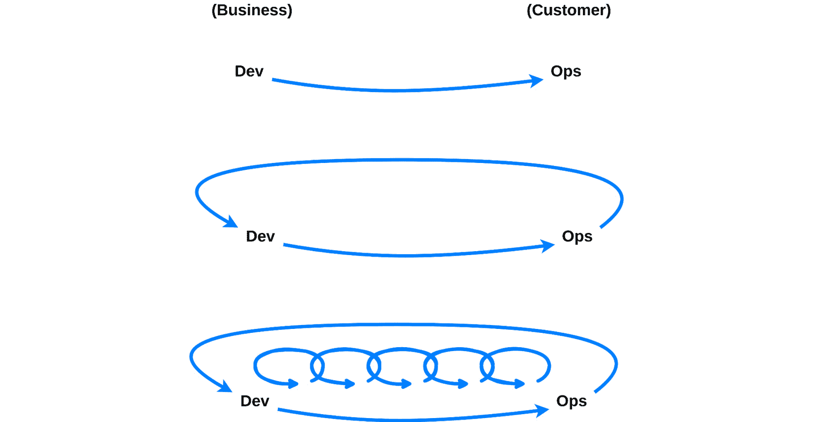

# 第五章：理解是什么让 DevOps 发布管理与众不同

DevOps 文化是全方位的，它涉及到审视价值流的每个环节并对其进行优化。DevOps 的哲学旨在消除孤岛效应或个别团队的孤立工作。因此，拥抱 DevOps 文化的企业提高了端到端操作的透明度。这与许多成熟企业的做法背道而驰，因为这些企业中，个人和团队有着明确的角色和职责，很少进行跨部门协作。

DevOps 的哲学是集体责任，鼓励 IT 人员快速找到解决方案，并始终致力于终身学习。*Gene Kim*、*Jez Humble*、*Patrick Debois*和*John Willis*，《DevOps 手册》的作者，在书中概述了这些基本原则。员工应该能够将大部分时间用于完善与 DevOps 相关的任务，如基础设施自动化、网络安全、应用监控和补丁修复。持续改进的驱动力是 DevOps 文化的核心。如果您的团队在正确执行 DevOps，*高压时刻和职业倦怠*是罕见的现象；否则，您的业务单元可能在资金上被严重压缩。

然而，企业领导层通常对风险较为回避，因此当某个流程证明有效时，他们通常会紧紧抓住它，并视而不见。DevOps 团队的任务是根据一套流程优化效率。这也是为什么 DevOps 团队必须与业务开发团队密切合作，确保公司产品的稳定性、性能和安全性。

在本章中，您将深入了解 DevOps 的独特方面，我们将涵盖以下主要内容：

+   DevOps 是全方位的

+   DevOps 整合了 CI/CD、QA、安全和反馈

+   DevOps 将业务团队纳入开发过程

+   DevOps 的三种方式

+   传统的发布管理方法与 DevOps 相比如何？

+   DocuSign 如何从敏捷转向 DevOps 的案例研究

# DevOps 是全方位的

DevOps（开发与运维）倡议是全方位的，与过去的孤立策略不同。DevOps 考虑的是整个价值流和所有相关的人员，而不仅仅是某一个人或其中的某个特定组件。我们通过围绕员工设计我们的系统和流程，颠覆了传统模式。这也是为什么表现卓越的 DevOps 团队能够证明信息技术投资与财务表现之间存在相关性。投资的根本目标是促进和赋能个人，使他们能够改进流程并为自己选择合适的技术。赋能员工直接与提高生产力和增强公司韧性相关联。

DevOps 领域已经经历了显著扩展，其范围超越了单纯的发布和部署过程。在撰写本文时，它涵盖了各类利益相关者，包括产品负责人、项目经理，以及软件开发生命周期的各个方面。这一主要因素促使其作为一种整体方法论不断增长，涵盖了业务运营团队与客户之间的关系，以及产品发布和生产监控的各个阶段。DevOps 发布管理是 IT 行业中的逻辑进展，强调其在提升各行业组织绩效方面的有效性。

DevOps 的实施已经扩展到涵盖企业中的各个部门，包括客户支持、营销、产品负责人、项目经理、程序经理、开发人员、质量保证团队、发布或构建团队以及基础设施团队。DevOps 的主要目标是提高客户满意度并加快交付速度。因此，所有相关方必须全面了解整个过程，包括运营、规划、集成、测试、监控、交付和反馈。高效的流程和工具集成是自动化顺畅交换和执行信息的必要条件。这种方法还使得所有利益相关者能够更有效地为产品的成功和高效实施做出贡献。

DevOps 倡议的成功依赖于许多人有效地协同工作。这意味着组织必须尽可能消除所有信息和执行的隔离。初创公司通常会因为从零开始建立公司运营的优势而采纳 DevOps。然而，最近的宏观经济指标显示，越来越多的大型、成熟的企业正在采纳 DevOps 实践，尤其是为了优化效率、提高软件发布的频率和质量。

DevOps 领域涵盖了广泛的工具，其中很大一部分是源于开源。这样的发展为工程师提供了前所未有的工具选择，可以参与黑客攻关或实验。然而，这一现象通常带来独特的困难，因为过多的工具集可能会在工作流中创建孤立的知识和执行隔离，导致模糊性和浪费。这一现象变得越来越普遍且具有问题性，迫切需要转向提供更优集成和执行能力的解决方案，适用于各种技术。对于这种情况，最佳的做法是使用一个提供广泛集成能力的平台，如 GitLab、GitHub Actions、Plutora，甚至是 Zapier。

为了提供全面的解决方案，从客户需求开始到收到产品反馈，企业需要一个综合集成平台，允许在不同工具之间无缝集成和执行，包括内部的专有工具。这种方法对于成熟企业尤其有用，因为它让他们有自由保留现有的工具和流程投资，同时有针对性地引入新技术。成熟企业可以在不从头开始的情况下管理变革，同时专注于效率、自动化、协作、更高的发布标准和更频繁的发布。

DevOps 发布管理确保所有相关方都清楚哪些功能将会发布以及何时发布。这种方法包括强大的可追溯性功能、分析和仪表板，帮助了解信息和任务执行的从左到右的流动。减少对其他团队的依赖并促进自助服务的一种好方法是紧密集成数据系统、基于 CI/CD 的自助服务终端，以及通过运维专家的支持来自动化日常业务流程。

DevOps 使团队通过更好的端到端可视化和强大的协作方法提高生产力和效率，从而赋能每个团队成员。包容所有人还有一个额外的好处，就是改善了相互信任与合作的氛围。这种方法使得 DevOps 组织能够超越软件开发的构建和发布阶段，渗透到整个软件开发生命周期中。这对于大企业尤其有帮助，因为它保护了现有投资并改善了现金流。它为组织提供了频繁测试新工具和技术的可能性，同时保留那些有效的工具和技术。简而言之，全面性对于加速大型组织的数字化转型非常有利。

现在你已经了解了为什么 DevOps 是一种全面的实践，让我们深入探讨一下它如何不仅仅局限于人员，还要仔细考虑流程和技术。

# DevOps 集成了 CI/CD、QA、安全性和反馈

DevOps 是一组消除软件开发与运维团队之间沟通障碍的技术，总体上旨在提高产品交付速度和质量。软件必须符合最终用户和利益相关者的要求和期望，这也是为什么**质量保证**（**QA**）是 DevOps 的一个重要方面。然而，将 QA 融入 DevOps 工作流中可能会很困难，因为这需要改变思维方式、公司文化和软件。

关键的是，在开发 DevOps 测试流水线之前，必须设立质量目标和**关键绩效指标**（**KPIs**）。了解你的 KPIs 的重要性不言而喻；每个独特的企业都有其自己的 KPIs。将质量目标与业务目标和客户需求对齐是任何公司面临的挑战。与你的团队成员及其他相关方分享质量目标，最好能够明确你想在质量方面实现什么目标，这可以帮助你集中 QA 工作，确保团队成员的步调一致。

如你在上一章中学到的，**自动化**是 DevOps 哲学的基本原则之一，因为它促进了软件部署的加速和标准化。此外，自动化在测试领域也发挥着至关重要的作用，因其能够减少人为错误、优化时间和资源的使用，并提供及时反馈。值得注意的是，明智之举是最大化自动化在整个测试流程中的应用，涵盖多个类别，如单元测试、集成测试、功能测试、性能测试、安全测试和回归测试。此外，建议使用支持自动化的技术和框架，例如**JUnit**、**Cucumber**、**Selenium**、**Cypress**、**TestNG**、**SonarQube**、**Nessus**、**linters**等。

再次强调，集成是 DevOps 的一个重要组成部分，其中测试工具与开发和部署系统的兼容性和互操作性至关重要。通过这种方式，建立一个贯穿整个软件开发生命周期的连贯且不间断的测试流水线是切实可行的。建议将测试工具与监控和报告技术（如 Splunk、Grafana 或 ELK）结合使用，以收集和分析有关软件质量和性能的数据。当然，使用具有更强追踪能力的综合 SaaS 产品也是不错的选择。通过将测试工具融入工作流程，你将提高测试过程的效率、透明度和团队成员之间的协作。

在 DevOps 的背景下，反馈起着至关重要的作用，因为它加速了问题的识别和解决，提高了流程效率，并使得从过去的错误中学习成为可能。建议在测试流水线的每个阶段都融入反馈循环，从代码审查到生产部署都不例外。积极推动从多方获取反馈，包括团队成员、消费者和利益相关者，都是值得提倡的做法。实施专门设计用于简化反馈收集和管理的技术和平台，如 GitHub、Bitbucket、Confluence、Jira、Slack 或 Teams，尤其具有显著的好处。实施反馈循环有望培养一种持续发展和创新的文化。

你可能听说过一个常用的流行词**shift-left**。在软件开发中，采用*shift-left 方法*意味着在流程的早期阶段尽早开始测试，而不是等到最后才进行。通过这样做，你将能够更快地发现和修复软件缺陷，减少不必要的返工和浪费，并提供更高质量的软件。当你选择 shift-left 方法时，你必须做的一件事是尽早将质量保证团队融入到整个过程，并将他们纳入计划、设计和开发阶段。简而言之，如果你*shift left*，你可以提高测试的成功率、有效性和覆盖范围。

像计划、编码、构建、测试、发布和部署等阶段通常会包含在 DevOps 流水线中，但它们之间的区别有时可能会变得模糊。当采用被称为*DevSecOps*的策略时，DevOps 发布管理生命周期中的每个阶段都会受到一套独特的安全标准和评估的影响。让我们讨论将 DevSecOps 集成到 CI/CD 流水线中时执行的安全检查：

+   **计划**：在项目开发的初期阶段，进行全面的安全分析并制定战略计划非常重要。需要确定许多因素，这些因素决定了测试将如何进行，包括具体的位置，并考虑这些活动将如何影响交付时间表。一个方面是使用威胁建模来检查可能的安全风险并制定对策。另一种方法是从一开始就主动将安全性融入到产品设计中。这意味着要尽早做出关于数据卫生和其他安全措施的重要决策。

+   **编码**：DevOps 发布管理模型的编码阶段是制定鼓励防御性编程的指导方针，并帮助开发人员立即应对安全和合规问题的理想时机。处理可能存在风险的代码区域（如内存缓冲区内的操作、NULL 指针引用，或其他输入验证、反序列化不可信数据等一般性标准）可能会纳入此类别。此外，建议使用 linting 工具来标记编程错误、漏洞、风格错误和可疑构造。同时，不要忘记在版本控制仓库中添加安全控制，以增强密码和 API 密钥的安全性，或防止对代码的未经授权修改。

+   **构建**：通过在构建阶段包括自动化安全检查，典型的管道可以在源代码到达主分支或生产环境之前检测到漏洞。例如，您可以执行 **静态应用程序安全测试** (**SAST**) 工具，如 *SonarQube*、*SAST-Scan*、*Snyk*、*Prisma Cloud* 等，来分析代码。如果工具识别出任何漏洞，构建将会停止，并会发送一份报告通知团队管道失败的结果。这些操作允许开发人员在继续之前立即解决问题。

    此外，为了发现软件依赖中的漏洞并跟踪代码库中的开源组件，管道还应包括 **软件组成分析** (**SCA**) 工具。这些技术共同高效地识别代码漏洞，从而确保它们在部署到生产环境之前得到修复。市场上有许多此类工具，包括商业工具和开源工具，它们专门设计用于审查当今最流行的编程语言。

+   **测试**：DevOps 从业者通常会建立一套自动化测试用例，旨在通过开发过程中的强质量保证协议来实施。这些测试用例是用于确认软件应用程序预期功能的一系列条件或操作的文档，可以通过手动或使用自动化工具如 *Selenium*、*Cypress*、*Playwright*、*Puppeteer*、*Taiko*、*Appium*、*Espresso* 和 *XCUITest* 来执行。为了管理测试过程的时间表和结果，您应使用如 *BrowserStack*、*Testiny*、*JIRA* 和 *Xray*、*LambdaTest*、*Pivotal Tracker*、*TestRail*、*Kualitee*、*TestCollab*、*Zephyr* 等测试用例管理工具。这些工具管理并跟踪在管道测试阶段识别的任何问题。构建基本单元测试以检查安全漏洞，例如程序如何处理无效或意外输入，是该过程的标准部分。

    此外，通常会结合应用程序安全检查，这些检查会在程序运行时扫描其漏洞。通过将安全措施与功能性并行实施，测试阶段变得更加全面。在应用程序测试过程中，**动态应用程序安全测试**（**DAST**）技术被用来主动测试正在运行的应用程序是否存在安全漏洞。常见的工具包括*Acunetix*、*Appknox*、*Checkmarx*、*Detectify*、*Intruder*、*Rapid7*和*Veracode 动态分析*等。这些工具旨在识别通常与用户身份验证、授权、跨站请求伪造、缓冲区溢出、SQL 注入、API 相关端点以及其他多种漏洞相关的问题。如你所见，这里列举的质量保证工具实在太多，无法在本书中一一详述。你需要与团队合作，评估这些工具，确定哪些工具与贵组织的工作方式和战略目标最为契合。

+   **发布**：在发布阶段，安全分析工具用于进行自动化安全测试和渗透测试。工具如*Astra Pentest*、*Burp Suite*、*Metasploit*、*Nessus*和*OWASP ZAProxy*被用来识别在之前阶段可能未发现的潜在问题。某些组织还遵循最小权限原则，确保个人和工具只被授予执行其职责所需的必要资源，绝不多给予。

+   **部署**：在成功执行早期测试后，必须继续进行安全基础设施的交付或为最终部署构建生产环境。在部署阶段，确保代码只有在通过每个前阶段的安全检查后才部署到生产环境。一个明智的做法是对应用程序代码和底层基础设施应用额外的自动化测试，作为额外的安全保障，以防在生产环境中部署了未经授权的代码更改，无论是故意还是无意。这可以帮助识别和解决生产软件中的运行时安全问题，无论在什么情况下。

+   **操作与监控**：在 DevOps 流水线的操作与监控阶段，组织通常依赖应用程序和基础设施指标来检测任何可能表明存在安全事件的异常活动。当发生安全事件时，日志记录、监控和警报可以帮助识别问题、评估其影响并协助恢复。

拥抱 DevSecOps 需要文化上的转变，使得安全成为所有参与软件开发生命周期的利益相关者的基本考虑因素。为了实现这一目标，组织通常会实施新方法并建立一个 DevSecOps 工具链，在整个软件开发生命周期中集成自动化安全检查。

以 DevSecOps 为中心的工具扩展了现有的 DevOps 方法，如 CI/CD、自动化测试实践、系统监控和简化的配置管理，通过无缝集成以安全为重点的工具和技术。接下来，我们将探讨在 DevSecOps 工具链的背景下，区分其作为 DevOps 整体实践下一个独特子集的关键要素。

就以 Webhook 为中心的安全策略而言，任何 DevSecOps 方法的主要目标是通过触发预提交和合并 Webhook 的自动化检查，主动识别和解决代码问题。组织可以选择部署多种类型的评估，具体如下：

+   **分析源代码**：SAST 是一种通过分析静态源代码（即在程序未运行时）来发现潜在漏洞的方法。

+   **分析应用程序漏洞**：DAST 通过将软件部署到沙箱环境中来工作。动态应用程序扫描技术可以监控软件对已识别漏洞的反应。

+   **秘密扫描**：有时，秘密信息会出现在提交中，无论安全政策多么严格。通过将秘密扫描工具嵌入到软件开发者的 IDE 中作为插件，或者在版本控制平台（如 GitHub）中直接分析（如果此功能可用），可以在提交之前识别秘密。此外，许多秘密扫描产品与 SCA 工具兼容，这些工具用于识别任意代码库中的开源软件依赖项可能存在的漏洞。

+   **运行时应用程序自我保护**（**RASP**）：运行时验证工具或 RASP 会持续监控并检测在生产环境中运行的应用程序所面临的直接威胁。通常，它们会提供实时报告，指示是否发现漏洞以及发现漏洞的具体位置，并附带时间戳。

就配置管理而言，采用基础设施即代码（Infrastructure as Code）是 DevSecOps 实现消除系统配置不确定性的常见方式。自动化配置文件扫描、版本控制的基础设施和自动化服务发布都可以通过 Docker、Terraform 和 Ansible 等工具实现，这些工具使用**另一种标记语言**（**YAML**）语法编写声明式配置文件。

+   **编排基于容器的微服务**：为了更好地处理复杂的云原生应用，公司在某些情况下可能会选择采用微服务架构。为了安全且高效地做到这一点，你需要容器编排平台来管理多个容器，并根据需要进行扩展或缩减。为了管理容器之间的通信，容器编排技术（如配置管理解决方案）通常使用 YAML 文件格式来进行配置。这些配置也可以使用安全扫描工具进行分析，以检测和修复漏洞。

+   **监控和报告**：这一测量过程包括记录应用程序和基础设施层级的所有信息，是 DevSecOps 工具包中最直接却极为有效的组成部分之一。顶级工具在问题发生时能立即提供洞察，并且具备强大的报告系统，能够在早期阶段检测问题。如果外发数据从意外端口发送，识别潜在的安全问题可能会变得非常困难。没有合适的监控和报告，就很难发现此类事件。

我们经常在不小心的情况下编写安全漏洞，同时将含有安全漏洞的开源软件库导入到我们的项目中。每天都有很多程序员在编写代码，而手动审查往往跟不上进度。这正是 DevSecOps 真正发挥作用的地方。它确保我们的软件交付物始终得到自动化的安全保障。

为了验证你的团队每次提交的代码，你可以使用持续交付管道来实现*持续一切*的理念。你的持续管道将从增加自动化安全检查中受益，这些检查提供早期警告通知，并且能够在软件交付生命周期的任何时刻轻松发现安全漏洞。许多持续安全技术能够与组织的成长相匹配，无论是大规模还是小规模的组织。

在 DevOps 中，人员和文化与工具和流程同样重要。如果你想实现质量目标并为客户提供价值，你需要与不仅仅是你团队中的同事，还要与跨职能协作的其他团队进行合作。你还应该努力建立一个注重信任、开放和责任的文化。这种文化应该是一个每个人都为质量贡献并承担责任的环境。除此之外，你还需要激发一种学习文化，让每个人都愿意获取新的知识、技术和方法。通过与你的团队进行协作，能够建立一个展现出高效交付速度和敏捷性的 DevOps 组织。

现在你已经理解了 DevOps 如何全面地融合人员、流程和技术，让我们进一步扩展这一主题，讨论如何将非技术团队成员（如业务部门）的反馈和合作纳入其中。

# DevOps 将业务团队融入到开发过程中

**DevOps**这个术语不仅仅指允许你将应用程序持续部署到生产环境中的技术流程和工具——它的范围远不止于此。如前所述，DevOps 是一种全面的战略，组织的每个层级都需要认识到 DevOps 方法论的合法性。为了确保 DevOps 融入每个项目，销售和营销部门需要将其作为工作流程的固有组成部分，并且必须严肃对待。同样，将有效的 DevOps 实践应用于多个部门也是至关重要的。这确保了未来负责项目的团队成员可以在已建立的框架内开展工作。

DevOps 原则应贯穿于产品生命周期的各个阶段，从开发到维护。这些原则考虑到了生产过程中的每一个步骤，带来了从价值流的开始到结束的文化转变。当公司实施 DevOps 时，它会在整个公司内产生波动效应，因为这是一种思维、行动和存在的方式，必须渗透到每个文化层级。这涉及到打破信息孤岛，营造一种合作氛围，这种氛围远远超出了传统组织中典型的工作环境。诚然，转向 DevOps 可能具有挑战性。为了成功实现这一转变，培训至关重要，且需要高层管理的强有力支持。

换句话说，DevOps 文化所特有的紧密合作和持续反馈不应仅限于开发、测试和运维部门。否则，业务部门将陷入一种境地，即推动和销售团队无法交付的成果。这就是为什么与其他部门（如会计、营销和销售等）保持联系，并确保他们了解进展是如此重要。为了实现提高效率、降低成本和提升质量的目标，涉及整个生产线至关重要。例如，销售部门无法与产品交付团队隔离开展合同工作，因为产品交付团队可能在不知情的情况下生产缺乏需求或背景的功能性软件增量。公司内所有利益相关者必须具备共同的视角和深入的意识，以便协调客户需求与当前的交付能力。

需要强调的是，仅仅设立如*DevOps 工程师*和*DevOps 主管*等职位，并开发 DevOps 培训与认证计划，并不足以提供足够的知识或经验。DevOps 的概念可以理解为一种文化范式，而不仅仅是存在着一些孤立的个人或团队从事工具开发或在各自领域进行协作。这意味着组织内的所有个人都共同参与统一的 DevOps 方法论的采用和实施。DevOps 哲学要求组织中的每个人都按照其原则和指导方针行事。

具备资质的 DevOps 教练的支持对于将公司转型为 DevOps 导向的组织至关重要。这一转型通过采用包括系统思维在内的全面战略来实现，并优先考虑客户对高质量产品和服务的需求。

现在，你已经考虑了 DevOps 发布管理如何将业务单元纳入开发过程中，让我们稍作调整，讨论一下*DevOps 的三种方法*，这完全是关于发现更有效的方式，以更快的速度为公司增加价值。

# DevOps 的三种方法

DevOps 的三种方法，来源于*Gene Kim*的书籍《*DevOps 手册*》，包括三个基本概念，阐述了指导组织有效拥抱 DevOps 文化并实施必要变革的原则、哲学、流程、程序、实践和规范性措施。如果你的组织刚刚接触 DevOps，DevOps 的三种方法是一个很好的起点，因为它们是哲学性的而非技术性的。

## 第一种方法 – 流程/系统思维

注意力集中在整个系统的性能上，而非某个特定工作领域或部门的表现。这可以是一个大部门，如开发或 IT 运维，也可以是一个小的贡献者，如站点可靠性工程师或软件开发人员。这里特别强调了由信息技术实现的各种收入来源。值得注意的是，工作需求的创建标志着一个新任务的开始——例如，由业务或 IT 部门产生的任务，之后会进入开发阶段，并为特定的 IT 运维环境量身定制。在这一点上，客户将以服务的形式获得价值，这标志着价值交付过程的一个迭代的结束。

如果正确遵循第一条路径，可以确保缺陷不会传递到生产的后续阶段，局部优化不会导致公司范围的停机，流程将不断改进，并且系统的全面理解将持续追求。已经开始但尚未完成的工作量被称为**在制品** (**WIP**)。如果 WIP 很多，这表明您在进行多任务处理，这几乎总会减慢工作的流程。您应该减少批次大小以限制 WIP。

第一条实践包括以下内容：

+   **持续集成**

+   **持续交付**

+   **持续部署**

+   **价值流映射** (**VSM**)

+   **看板**

+   **约束理论** (**TOC**)

价值流映射

价值流映射是一种精益管理技术，用于分析现状并设计交付产品或服务的活动序列的未来状态。价值流图是一个图形工具，展示特定过程中的所有关键阶段，并有效地测量每个步骤消耗的时间和量。价值流映射直观地描述了物理资源和数据随着操作序列的推进而移动的过程。

价值流映射的目标是发现并消除或最小化价值流中的“浪费”，从而提高特定价值流的效率。消除浪费的目的是通过建立更有效的流程来提高生产力，从而便于识别浪费和质量问题。

TOC

TOC 是一种管理方法，将任何可控系统视为由于最小数量的约束而无法更多实现其目标的方法。在 TOC 中，始终存在至少一个约束。TOC 采用聚焦过程来发现这些约束，随后重新组织业务的其余方面。TOC 运用广泛使用的短语“链条只有最弱的环节才是强的”。因此，组织和流程容易因“弱”个体或组件的存在而失败或中断，后果可能会损害整体结果。

## 第二条路径 – 放大反馈循环

DevOps 的第二条路径专注于创建快速反馈循环，使您能够快速构建安全、功能丰富的系统，以此来满足客户的喜爱。无论您是否喜欢，软件的复杂性都是不可避免的。即使是看似微不足道的改动，也可能造成巨大的影响。当我们没有及时反馈时，就会在因果之间造成鸿沟。错误可能被悄悄引入，并且可能要到后来时才被认识到，这时候需要的时间和资源来修复这些错误已经增加。

虽然看起来有些矛盾，但让更多人关注一个问题并不总能带来更好的解决方案。当我们将决策过程远离工作执行地时，审批流程的效率会降低。实施第二种方法的结果包括意识到并响应内外部消费者的需求，减少所有反馈环节的长度，同时增强其影响力，并在需要的地方整合知识。

以下实践包含在**第二种方法**中：

+   **自动化测试**

+   **生产变更的同行评审**

+   **监控和** **通知实践**

+   **“一目了然”仪表盘和** **状态更新**

+   **生产日志**

+   **过程度量**

+   **事后分析**

+   **共享** **值班轮换**

+   **变更、事件、问题和** **知识管理**

## 第三种方法——持续实验和学习的文化

第三种方法的核心理念是建立一种文化，鼓励两条 distinct 原则。第一是持续的实验、采取经过深思熟虑的风险，并从这些经历中获得知识。第二是认识到，唯有通过实践和有意义的重复，才能实现精通，这两者同样必要。

在缺乏信任的工作环境中，事件往往伴随着一种反复出现的指责和愧疚模式。自然，这会妨碍个人和整个组织获取知识和技能。对错误的惩罚威胁成为个体保持在熟悉、舒适环境中的动力。这种环境通常被称为舒适区，其特点是通过避免压力来减少遇到挑战或复杂情况的可能性。在追求知识和理解的过程中，个体通常被建议避免进行实验、探索新概念或提出推测性问题。在这种背景下，个人通常会选择隐藏失败，而不是承担责任，以避免承认错误。因此，在当今社会，个体通常表现出较少的倾向去表达自己的想法或提出创新的解决方法。创新往往受到个体或群体的抵制，这是一种悲剧。追求进步需要进行实验并接受风险，即使这意味着进入比之前更多的风险领域。我们必须具备足够的技能，以便能够修复因我们突破极限而导致的不稳定问题。

实施第三种方式的结果可以总结为：投入时间改进日常工作，培养奖励团队冒险精神的常规，并通过偶尔在系统中产生缺陷来追求更高的弹性、效率和专业水平。

以下实践包括在**第三种方式**中：

+   **实验** **和学习**

+   **计划-执行-检查-行动（Deming 循环）**

+   **改进卡塔**

改进卡塔

根据丰田卡塔（Toyota Kata），管理是一种系统性的努力，旨在通过有效地协调人员的能力，实现期望的条件。

改进卡塔（Improvement Kata）是一种系统化的方法，用于以富有创意、有意义且有指导的方式，从当前状态过渡到理想状态。该模型分为四个部分：

1\. 进行雄心壮志或轨迹的审视。

2\. 理解当前状态。

3\. 精确定义未来的目标状态。

4\. 逐步向理想状态迈进，揭示并解决沿途遇到的任何困难。

改进卡塔与那些旨在预测轨迹并集中于执行的方式不同，它利用在过程中获得的发现。采用改进卡塔的团队在努力实现理想状态的过程中，获取知识并根据获得的见解调整他们的方法。

这三种方式与当代技术关系不大。它们的核心是发现更有效的方式，以更快的速度为公司增加价值。这将我们带回**信息与通信技术（ICT）**的基础，即**态度**、**行为**和**文化**：

图 5.1：DevOps 的三种方式（图像灵感来自 Gene Kim，《The Three Ways: The Principles Underpinning DevOps》）

前面的插图展示了*DevOps 的三种方式*。从上到下分别是：流动/系统思维、反馈循环的增强，以及持续实验和学习的文化。

现在你已经了解了让 DevOps 发布管理独特的突出特点，让我们通过讨论 DevOps 发布管理与传统发布管理方法和工作流的对比来结束本章。

# 传统的发布管理方法与 DevOps 相比如何？

规划大规模发布需要更多的工作量和风险，这是传统方法的常见重点。在较长周期和较少发布的情况下，复杂性往往会迅速增加。在这种环境下，你将面临严格的最后期限和一大堆附加任务。大规模发布可能会很壮观，但它无疑是一种效率低下的生产方式。然而，DevOps 采用了不同的策略；较小的发布更易于管理，因为它们更简单易懂并且便于测试。如果情况没有按计划发展，损失也较小。从本质上讲，DevOps 使得公司能够通过更快速、更轻量的发布方式迅速适应客户需求的变化。

在管理任何形式的开发时，传统方法通常会使用规划和调度系统。开发周期通常涉及许多环节，尤其在使用传统方法时，调度通常是一个特别艰巨的挑战。DevOps 方法论的基础是频繁和增量的软件发布原则，以及专门团队利用自动化技术。这种方法显著提高了调度过程的效率。重点通常会集中在短期规划上，通常是针对接下来的几周。这将使你对团队时间的合理分配有更高的敏感度。此外，专门团队的建立有助于高效协调，消除了将个人分配到不同角色中的需求。

传统方法通常会对新产品版本或升级的预期发布大肆宣传。当企业采用传统方法时，会在单一发布上投入大量的精力和资源，增加了失败的风险。在这种情况下，工程师往往会在主要发布前花费大量时间独立工作，这通常被称为“高压时期”。开发人员为这个发布准备了数周，甚至数月，现如今他们正在进行最后的努力，修复可能出现的任何问题，以确保按时发布。另一方面，DevOps 团队并不会每次发布新版本或升级时都举办盛大的庆祝活动，而是采用更短、更规律的开发周期。由于自上一个开发周期以来所需的工作量较少，因此发布的风险大大降低。自动化测试的使用确保了他们的环境是一致且可靠的。只有当 DevOps 确信过渡将成功时，才会将产品版本推广到下一阶段。值得注意的是，通过完全摆脱发布窗口的概念，DevOps 使得将新功能更快投入生产成为可能。

在过去准备发布时，通常需要多个人参与，收集所有必要的信息和数据，最终生成一份冗长的报告，并呈交给高层管理。在许多情况下，冗长的报告代表着瓶颈，因为读者无法确定哪些信息最为重要，或者这些报告在他们收到时是否仍然具有相关性。相比之下，当在以 DevOps 为中心的团队中进行自动化操作时，您可以迅速汇总新的信息并有效地做出响应。这意味着您不必浪费时间坐下来翻阅多页数据。如果将收集应用程序数据的任务委托给以 DevOps 为导向的团队，您可以确保该团队的每个成员都能更好地了解与当前任务相关的信息和数据。这不仅最小化了获取信息所需的时间，还减少了获得管理层批准的时间。

此外，采用传统方法的组织通常避免承担任何不必要的风险。由于文化围绕着员工尽一切可能避免对公司造成损害，这些员工承受着巨大的压力，确保一切完美无缺。然而，实际上，任何事物都无法达到完美的巅峰。DevOps 培养了一种与传统方法大相径庭的文化。团队接受了早期识别失败的文化，承认挫折的不可避免性。因此，建立了一个强大的框架和系统化的方法，通过持续测试、渐进部署和自动化来促进可控的失败。DevOps 团队接受这样一种观点：失败发生得越早，其后果越小，最终的恢复也越快。

值得注意的是，传统策略采用了按性价比计费的模型，评估在最少财务投入下可以完成多少工作。采用这一策略存在几个风险，最显著的是，在保持相同工作能力的情况下，降低成本是相当棘手的。这也是许多使用传统策略的企业频繁将运营外包的原因。DevOps 极大地扩展了这一效率的概念，提出了“流”的概念，因为新应用的开发时间应该是战略性度量的标准。这促使团队分析周期时间，以发现浪费的领域并估算真正的生产力。这使得开发人员能够专注于那些能为客户带来最大价值的活动。

使用传统方法时，每个个体完成他们分配的工作后，再将其交给价值链中更远的同事。在这种情况下，他们会过于关注按时完成任务，而忽略了确保他们的工作在实际条件下的可用性。当采取这种方法时，质量往往会受到影响，而没有人对此负责。与此相反，DevOps 强调建立一个跨职能的组织，在这个组织中，所有成员共同承担任务成功完成的责任。由于高质量软件的生产是团队的共同目标，所有成员将就什么才算工作完成达成一致。他们不再因细节问题而焦虑，而是受到更大图景的激励。

# DocuSign 从敏捷到 DevOps 的转型案例研究

DocuSign 是电子签名和数字交易管理的先驱。很少有创新能够像 DocuSign 在数字化转型时代那样，深刻影响协议的制定、签署和管理方式。DocuSign 的产品管理历史，以消除障碍、发明创造性解决方案，并不断适应客户日益变化的期望为特征。这家创新公司由 Tom Gonser 创立，他为一种彻底改变全球商业实践的解决方案铺平了道路。

在本案例研究中，我们将揭示 DocuSign 如何从一个敏捷型企业转变为一个 DevOps 强大的企业。

## DocuSign 的起源

DocuSign 的故事始于 1990 年代末，当时，具有远见的企业家兼熟练的软件工程师 Tom Gonser 识别出了传统协议签署方式中的不足和复杂性。在互联网日益强大的背景下，Gonser 对繁琐的纸质流程感到恼火，并梦想着一种数字化的替代方案，能够彻底改变企业和个人履行及传递协议的方式。

在共同创始人 Court Lorenzini 和 Eric Ranft 以及其他人的帮助下，Tom Gonser 于 2003 年创立了 DocuSign，旨在通过将传统的合同签署方式转变为一种在线流程，来革新这一传统方式，使之更加简化、安全和快速。他们的目标是开发一个系统，使个人和公司能够从全球任何地方进行数字签署，从而摆脱受限于纸质文件和地理限制的束缚。

凭借决心和对互联网颠覆性潜力的坚定信念，Gonser 和他的团队建立了平台技术的基础，利用算法加密和电子签名技术，确保数字合同的合法性和有效性。在成立的短短几年里，DocuSign 凭借其早期的成功和用户友好的界面，迅速在电子签名行业崭露头角。

## 向 DevOps 转型

DocuSign 自成立以来，一直秉持敏捷开发方法。然而，向 DevOps 流程的转型证明是相当具有挑战性的。考虑到他们的业务性质——处理合同和签名——持续集成和交付带来了显著的挑战。他们的整个业务依赖于交换签名和批准的复杂交易过程，而从软件开发的角度来看，这个过程非常难以测试。如果发生任何错误，比如错误的批准归属，这将对他们的业务构成重大威胁。为了提高现代开发的效率，他们采用了一种被称为应用程序*模型*（简称*mock*）的高效策略。具体来说，他们使用了一个针对内部 API 的 mock。这个工具提供了一个模拟的端点并返回模拟响应。通过这种方法，DocuSign 能够将应用程序测试方法与事件管理无缝集成，并通过与真实世界交易高度相似的模拟进行彻底的应用测试。

## DocuSign 产品团队遇到的障碍

DevOps 发布管理生命周期中最重要的部分之一是持续集成。这是将新功能和更新的代码添加到并与原始代码库合并的阶段。在这个过程中，我们通过单元测试找出并修复代码中的错误，并适当地更新源代码。让我们来看看 DocuSign 开发团队面临的独特挑战，并发现他们是如何克服这些挑战的：

+   **关于合规性和安全性的法规**：DocuSign 运营的领域涉及机密文件和法律合同，因此必须应对与不断变化的合规性和安全性要求相关的困难。产品经理负责监督全球立法领域的复杂事务，确保平台遵守不同的行业合规标准、法律框架和语言复杂性，同时维护数据安全。

+   **在复杂性面前改善用户体验**：数字签署文档是一个至关重要的过程，它提出了一个相当大的挑战——如何在不失去功能性和安全性的情况下简化这一过程。产品管理必须小心权衡，努力在提升客户体验和处理机密文档、验证其合法性之间找到平衡。

+   **与集成和互操作性相关的难题**：DocuSign 产品管理面临的挑战是实现无缝集成，并与其他公司开发的各种平台和应用程序兼容。这是因为组织使用了大量的数字化解决方案。DocuSign 需要做的最重要的事情之一就是确保能够轻松集成到其用户已经部署的工作流程和系统中。

DocuSign 的开发人员通过创建一个基于事务模拟的定制内部测试框架，成功地在组织内建立了 DevOps 发布管理的原则。这使得团队能够应对一个高度挑战性的任务，即在复杂的应用程序中执行自动化集成测试，该应用程序具有复杂的审批流程、安全的图形界面以及强加密的 API 交易，并且这些都在 CI/CD 流水线中进行。通过这些创新测试策略的成功，DocuSign 能够迅速成熟其商业模式，增加了新的产品线，并保持其作为行业主导的电子签名产品公司的地位。

# 总结

本章结束于*第五章*。此时，您已经牢牢掌握了 DevOps 发布管理独特性的含义。你了解了 DevOps 是一种整体实践，在制定解决方案或改进整体系统时，考虑到价值流的每个组件。DevOps 的独特之处在于它将 CI/CD、QA、安全性和反馈整合在一起。通过使用精心设计的自动化流水线和精心挑选的测试与审批流程，DevOps 发布管理与其他发布管理模型相比，具有独特优势。DevOps 理念中至关重要的特点之一是将业务团队融入开发过程。你还探讨了*DevOps 的三种方式*这一重要概念，这一概念由*Gene Kim*（《DevOps 手册》的作者）普及。此时，你已经准备好区分传统的发布管理方法和 DevOps 方法。

在下一章中，我们将回顾 CI/CD 的基础知识。今天的发布经理必须精通 CI/CD 流程、DevOps 和自动化部署技术。你需要理解 CI/CD 流水线的运行方式，并能够在早期阶段识别问题，这对于 DevOps 发布管理至关重要。

# 问题

回答以下问题，以测试你对本章内容的理解：

1.  DevOps 的*三种方式*是什么？

1.  *Shift-left*是什么意思？

1.  什么是紧密反馈回路，为什么它们很重要？

1.  为什么消除孤岛效应或个别团队的孤立工作对于组织的成功至关重要？

1.  什么是 DevSecOps？

1.  为什么像*DevOps 工程师*和*DevOps 总监*这样的职位称谓是一个误区？

1.  如何通过使用 DevOps 发布管理来减少对其他团队的依赖？

1.  什么是*冲刺期*，DevOps 是如何避免它的？

1.  DevOps 的主要目标是什么？

1.  拥有一个全面的工具集成平台有什么重要意义？
