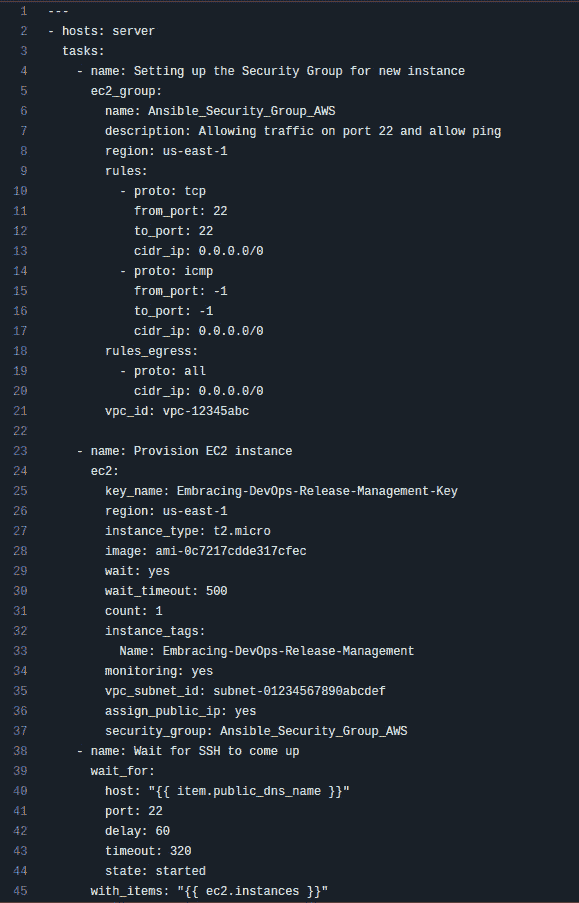

# 6

# 理解 CI/CD 基础

**持续集成和持续交付**（**CI/CD**）是 DevOps 发布管理的关键策略。它自动化了大多数传统上需要人工干预的步骤，这些步骤通常用于生成新的软件发布或将新代码推向生产环境。CI/CD 包括集成测试、单元测试、回归测试以及构建和部署阶段。基础设施即代码也可以集成到 CI/CD 流程中，自动化云基础设施的供应，也可以包括本地虚拟基础设施的供应。通过 CI/CD 流水线，软件开发团队可以对代码进行更改，随后自动进行测试、推送以进行交付，并在任何环境中部署。如你所见，CI/CD 大幅减少了停机时间，确保发布速度更快，版本之间一致性更高，且发布频率更高。真是革命性的！

你可以根据需要定制流水线来完成各种任务，即使这些任务与发布软件无关。这可能包括为业务部门生成报告，在非高峰时段关闭未使用的基础设施并在下一个工作日前重新启动它们，使用生产数据刷新开发数据库，对网络基础设施执行自动化渗透测试，自动旋转 IAM 密钥、SSL 证书等！关于 CI/CD 有很多很棒的信息，但对于本书的主题，提到它是必须的。

在第六章中，你将学到以下内容：

+   CI/CD 的基础

+   **持续集成**（**CI**）是什么

+   **持续交付**（**CD**）是什么

+   持续测试是什么

+   Capital One 的 DevOps 转型

到本章结束时，你将学习到 CI/CD 的核心原则、赋予它生命的理念，以及实现它的基本策略。虽然本章不会深入探讨 CI/CD 的技术实现，但你将了解到一些战术策略，帮助你成功实现 CI/CD，并介绍一些工具，帮助你达成目标。

# CI/CD 的基础

CI/CD 是当今软件行业的生命线，推动着新程序的快速创建和分发。消除集成和交付瓶颈的工具对于任何 CI/CD 流水线的顺利运行至关重要。团队需要统一的一套技术来协作高效地完成项目。源代码控制、测试工具、基础设施修改和监控工具只是可以与这个框架统一的 SDLC 元素中的一部分。

通过架构良好的 CI/CD 流水线，企业可以迅速应对消费者需求和技术进步的新趋势。相比之下，采用传统开发策略的团队通常需要较长时间才能实施客户请求的变更或融入新技术。此外，当公司意识到需要转型时，消费者需求可能已经发生变化。这个问题通过 DevOps 发布管理得到解决，因为它使用持续集成和持续部署，这是一种比持续交付略为高级的版本，我们将在后面更详细地讨论。

## 什么是 CI/CD 流水线？

CI/CD 流水线简化了将软件或基础设施作为代码进行交付的过程，确保从源代码到生产部署的顺利过渡。可以将其视为代码发布的必要步骤序列。

CI 是持续集成（Continuous Integration）的缩写，而 CD 是持续交付（Continuous Delivery）或持续部署（Continuous Deployment）的缩写。流水线的概念涉及自动化交付工作流的各个阶段，包括构建、测试、交付和部署。通过自动化和控制交付过程的每个阶段，CI/CD 流水线的所有优点得以释放。这有助于最小化人为错误，并确保每次发布的一致性。

CI/CD 流水线通常作为代码进行配置，因此广泛被称为*流水线即代码*。为了方便流水线的运行，通常会使用 CI 服务器及其相应的构建代理。根据所使用的产品，构建代理可能被称为*runner*。通常，构建代理以虚拟机的形式出现，可以自托管、完全定制，并且需要定期维护。另一方面，如果你使用的是商业 SaaS 产品，你可以使用 SaaS 提供商提供的 CI 服务器和构建代理，但在定制化以及添加软件或插件时可能会有一些限制。

容器也可以用于促进创建一致的构建环境，减少维护静态构建代理的需求。在这种情况下，CI/CD 流水线的每个阶段都可以在针对其特定需求量身定制的容器中独立运行。此外，流水线还可以利用容器编排提供的各种优势，包括不可变性和按需扩展。

架构良好的 CI/CD 流水线基础设施应该设计为接受参数，能够在任意环境中产生可重复的结果。它们也具有适应性，考虑到存在消费者需求但现有的 DevOps 解决方案未能满足的场景。在这种情况下，可以快速识别解决方案，进行分析、开发，并在相对较短的时间内将其部署到应用环境中——所有这些都不会中断应用的正常开发流程。

此外，CI/CD 还允许即便是微小的变更也能迅速部署到最终产品中，从而加快了对用户请求的响应时间。它不仅解决了用户的关切，还让他们了解设计和创建过程。用户会注意到随着更新的推出，产品在不断改进，解决了 bug 并添加了新功能。与更传统的方法（如瀑布模型）相比，后者直到开发过程的最后阶段才会让用户参与，DevOps 发布管理促进了整个产品生命周期中的持续反馈和完善。

不同的项目在 CI/CD 管道中需要不同的复杂度和步骤数。一个潜在的管道可能采用多阶段部署方法，其中软件作为容器分发到一个跨多个云环境的 Kubernetes 集群中。相反，另一个管道可能采用更直接的方法，涉及构建、测试和部署一个作为 `.jar` 文件运行在虚拟机上的应用，并通过代理服务器进行访问。在这个示例中，这两个管道的目标都是自动化软件交付过程。

本质上，建立一个架构良好的 CI/CD 管道基础设施对于充分发挥 DevOps 发布管理所带来的所有好处至关重要。在下一部分中，我们将深入探讨持续集成的话题。内容将包括 CI 的含义、如何为你的组织选择合适的 CI 工具、示例管道语法以及功能比较。

# 什么是持续集成（CI）？

现代软件开发如果没有**持续集成**（**CI**）是无法实现的。现代软件的创建通常涉及来自不同地区的众多开发人员的协作，每个开发者专注于产品的某个特定组件、功能或方面。为了将一个完整的产品发布出来，必须将所有这些代码更改合并起来。然而，手动合并所有这些更改极其不实际，而且是一项痛苦的工作，当多个开发人员并行工作时，代码更改之间不可避免地会发生冲突。然而，持续集成鼓励开发人员持续将代码推送到同一个**版本控制系统**（**VCS**），提供了一种解决这一问题的绝妙协同效应。通过使用 CI，你可以持续提交、构建和测试团队的代码，这对于 DevOps 发布经理来说是一项至关重要的策略。如果你的团队经常测试新代码，他们将在缺陷深入软件之前就能够捕获并修复这些缺陷。

虽然对于 CI 可以使用哪些工具没有硬性要求，但许多团队倾向于使用如 Jenkins、GitLab CI 或 GitHub Actions 等持续集成服务器。随着新代码更改的提交，持续集成服务器会监督一切，并充当裁判。每当开发者在代码库中提交工作时，CI 服务器会自动运行一系列测试并记录结果。做出更改的开发者通常会在提交后不久收到一封包含测试结果的电子邮件。这非常关键，因为它使得开发者能够在最短时间内解决潜在问题。

在经过自动化测试后，更新的代码可以获得批准，创建新的构建并在质量保证（QA）和预生产环境中进行额外测试。如果所有质量检查都通过，代码可以合并到主分支，并发布新的版本。单元测试和集成测试通常作为持续集成过程的一部分进行，以确保代码更改不会导致稳定性问题。此外，持续集成是集成**静态应用安全测试**（**SAST**）的理想场所，将应用程序安全性提前到开发周期的开始阶段。所有这些测试自动化确保了对代码所做的任何更改在推广到生产之前都经过充分验证。

增加提交频率的另一个好处是，个别贡献者可以在早期阶段主动发现并解决合并冲突，减少其发生的频率，甚至完全避免它们。此外，集成更小的工作增量是避免一次性提交大量更改并遇到神秘错误的有效方式；开发者将会产出更少的代码，合并的行数也更少。这使得识别和解决代码中的 bug 和缺陷变得更加高效，将所需时间从几个小时减少到几分钟。

## 为你的操作选择合适的 CI 工具

在为团队的操作选择合适的 CI/CD 工具时，你有很多选择。评估你独特的需求和偏好至关重要，因为每个工具都有其优缺点，这可能会影响你的成功。无论你偏好开源选项、人工智能功能、本地解决方案、峰值可扩展性，还是广泛的定制功能，你都可以找到适合你需求的工具。

在为你的团队评估各种 CI/CD 工具时，你应该考虑以下核心因素，以便做出最终选择：

+   **本地部署与云部署**：评估工具是否提供基于云的和/或本地（托管）解决方案，并选择最适合你项目需求的选项。

+   **开源与闭源**：考虑 CI/CD 工具与开源项目的兼容性，并评估它与项目目标的契合度。

+   **测试集成**：建议选择一个具有用户友好界面并且配置容易理解的 CI/CD 工具，以减少与设置相关的困难。

+   **设置和配置的简易性**：你应该选择一个具有用户友好界面且配置易于理解的 CI/CD 工具，以减少设置过程中的复杂性。

+   **构建环境兼容性**：考虑工具与项目环境和编程语言的兼容性，以简化集成过程。

+   **学习曲线**：建议考虑开发人员在设置和配置构建及部署工作流时可能面临的学习曲线，以便更好地支持他们。

+   **付费计划功能**：为了应对项目的增长，建议检查付费计划（如果有）中现有和新提供的功能，包括分配的每日构建次数、运行时分钟数、用户数量以及私有仓库数量等。

+   **版本控制系统兼容性**：确保你验证 CI/CD 工具是否能够与您首选的版本控制系统或源代码管理平台顺利集成，从而实现高效的源代码管理和交付。

让我们深入了解三款行业领先的 CI/CD 工具，帮助你评估哪一款最适合你的企业。首先，Jenkins 是一个非常著名的 CI 服务器，已经存在了很长时间，提供了许多插件，具有一些新竞争者所没有的功能。另一个与 GitHub 仓库优雅集成的强大工具是 GitLab CI。别忘了 GitHub Actions，它提供了一个简单易懂的工作流程。

### Jenkins

Jenkins 是一个知名且高度可定制的开源 CI/CD 工具，几乎可以自动化所有工作。Jenkins 使用 Java 编程语言开发，并且是开源的，采用 MIT 许可证发布。该软件提供了一个全面的功能范围，可以简化多个任务，包括构建、测试、部署、集成和发布软件。Jenkins Server（主服务器）软件兼容 Linux、macOS、Windows 和 Unix 操作系统。除了通过本地安装包安装外，Jenkins 还可以作为独立的 Docker 容器运行，或者在任何安装了**Java 运行时环境**（**JRE**）的机器上运行。

Jenkins Master 负责监督和协调整个构建过程，充当仲裁者。它作为配置设置、作业定义和元数据的中心，拥有完全的控制权。在这里可以安装各种插件，扩展 Jenkins 的功能和能力，例如集成*Atlassian JIRA*或*SonarSource SonarQube*。此外，Jenkins Master 提供了一个易于使用的基于 Web 的界面，用户可以与 Jenkins 互动，设置作业并跟踪构建进度。

然而，多个 Slave 节点充当系统中勤奋的工作者。在 Master 的直接监督下，它们执行分配的任务。通过将任务分配给多个 Slave，可以通过并行处理更快地完成构建管道。此外，Slave 可以在不同的机器上进行配置，包括各种操作系统和环境。得益于这种灵活性，Jenkins 能够满足各种构建和测试需求。

此外，Jenkins 团队还开发了一个名为 Jenkins X 的子项目，它专注于在 Kubernetes 中轻松运行管道，几乎不需要额外的工作。Jenkins X 无缝结合了 Helm、Jenkins CI/CD 服务器、Kubernetes 以及其他多个工具，提供一个简化的 CI/CD 管道，采用了预设的最佳实践，例如使用 GitOps 来管理环境。

#### Jenkins 语法示例

现在，让我们通过一个 Jenkins 管道的示例来实际理解它的语法以及如何配置！在`Jenkinsfile`文件中，正在构建一个 Docker 容器镜像，并将生成的工件发布到指定的 Docker 注册表：

图 6.1：示例 Jenkinsfile – 配置构建 Docker 镜像的管道

### GitLab CI

在所有可用的 CI/CD 工具中，GitLab CI/CD 脱颖而出，成为最新且最受高度评价的选项。该产品是一个自托管的持续集成工具，社区版完全免费使用。

它包括一系列功能，如 git 仓库管理、问题追踪、代码评审、维基和活动流。公司通常选择将 GitLab CI/CD 安装在本地，并将其与组织的 Active Directory 和 LDAP 服务器连接，以确保安全的授权和认证。使用 GitLab 社区版的一个明显缺点是没有任何形式的客户支持。如果遇到问题或需要项目帮助，无法像 Premium 版和 Ultimate 版那样提交工单并请求帮助。

从社区版升级到 Ultimate 或 Premium 版本后，你将能够访问客户支持服务，并且可以使用许多有利的安全功能，例如双因素认证、先进的安全扫描以及代码合规性审计工具。此外，你还可以使用各种辅助工具，包括推送规则、DORA 指标跟踪、燃尽图、安全扫描 IDE 集成和**动态应用安全测试**（**DAST**）功能。通过利用高级监控功能（如性能指标和系统健康检查），你还可以确保你的项目始终稳定运行，并避免额外的风险。

GitLab 服务器负责检测触发事件，这些事件会启动一个或多个管道。当一个新的管道开始时，GitLab 服务器会决定哪些任务（在你的 `.gitlab-ci.yml` 文件中定义）需要执行，并根据需要跳过某些任务或将它们排队。然后，这些任务将按正确的顺序分配给可用的 Runner。

前述图中所示的 GitLab 架构包括以下组件：

+   **提交（Commit）**：提交是对文件或代码所做更改的记录，就像你在 GitHub 仓库中看到的那样。

+   **任务（Jobs）**：任务是 GitLab 管道需要执行的单独任务，例如部署应用程序。每个任务都有一个名称，并包含一个脚本。每个脚本按顺序执行，确保每个任务在进行下一个任务之前都已经完成。

+   **阶段（Stages）**：阶段用于清晰地区分不同的任务，标志着管道在每个步骤中的进展。这有助于明确任务的执行顺序。例如，阶段可以包括测试、构建和部署。

+   **管道（Pipeline）**：管道是一组完整的阶段，每个阶段由一个或多个任务组成。GitLab 提供了多种管道选项，如基础管道、合并管道、父子管道和多项目管道。

+   **Runner**：Runner 是负责执行 CI/CD 管道的活动组件。你可以选择在本地设置自托管的 GitLab Runner，或者使用 GitLab 提供的运行器，作为其 SaaS 产品的一部分，托管在 GitLab.com 上。

+   **GitLab 服务器**：GitLab 服务器负责托管和管理你的管道配置。你可以在本地设置自己的 GitLab 服务器实例，也可以使用托管在 GitLab.com 上的 SaaS 版本。

#### GitLab CI 语法示例

让我们通过一个 GitLab CI/CD 管道的示例，来实际了解它的语法以及如何进行配置！在 `.gitlab-ci.yml` 文件中，构建一个 Docker 容器镜像，并将生成的工件发布到指定的 Docker Registry：

图 6.2：示例 GitLab gitlab-ci.yml 文件 – 配置用于构建 Docker 镜像的流水线

### GitHub Actions

GitHub Actions 是一个用于持续集成和持续部署的工具，作为 GitHub 流程的一部分。它可以用于将代码更改集成并部署到第三方云应用平台，也可以用于测试、跟踪和管理代码更改。GitHub Actions 兼容各种第三方 CI/CD 工具、Docker 容器生态系统以及其他自动化技术。

GitHub Actions 通过事件驱动触发器无缝地将自动化集成到 GitHub 的软件开发生命周期中。这些触发器是可以指定的事件，范围从创建拉取请求到在代码库中构建新分支等多种操作。GitHub Actions 的自动化通过位于代码库 `.github/workflows` 目录中的 `YAML` 文件进行管理。这些工作流定义了自动化过程，其概念类似于 Jenkins 中的 `Jenkinsfile` 文件或 GitLab CI/CD 中的 `.gitlab-ci.yml` 文件。

每个工作流由几个核心概念组成：

+   **事件**：事件是启动工作流的定义触发器。开发者可以配置它们以搜索一个或多个触发器，然后根据需要进行调整。此外，事件还可以配置为在 GitHub 上指定代码库中的指定代码分支上执行。

+   **作业**：作业由一系列在单个运行器上执行的顺序任务组成。每个任务在自己的虚拟机（VM）中运行，并与其他任务并发执行，除非另有声明。

+   **步骤**：步骤是一个独立的操作，用于在作业中执行命令。这些步骤可以是动作或 shell 命令。作业中的每个步骤都在同一个运行器上执行。

+   **动作**：动作指的是在运行器上执行的命令，它是 GitHub Actions 的基本组成部分，GitHub Actions 也因此得名。

+   **运行器**：运行器作为 GitHub Actions 的服务器。程序积极监控可用任务，按并发方式执行它们，并提供关于进度、日志和结果的更新。运行器可以托管在 GitHub 上，也可以托管在本地自建的服务器上。GitHub 托管的运行器使用 Ubuntu、Linux、Windows 和 macOS 作为底层操作系统。

使用 GitHub 原生的 CI/CD 工具的主要优势在于其简单性。如果你已经在 GitHub 上托管项目，你可以利用内置的 CI/CD 工具，因为它与代码仓库完全集成。CI/CD 管道可能相当复杂，涉及用于测试应用程序、集成测试、容器平台和应用平台等组件的多种工具。GitHub Actions 通过提供与 NodeJS 和 Docker 的无缝集成，简化了整个过程。特别地，它使你能够快速选择所需的依赖版本，并轻松地将代码连接到所需的环境和部署平台。与其他自动化工具和功能不同，GitHub Actions 不仅限于测试、构建和部署的典型应用。相反，它提供了自动化任何 webhook 的灵活性。

#### GitHub Actions 工作流语法示例

现在，让我们通过一个 GitHub Actions 管道的示例来深入理解它的语法以及如何配置它！在 GitHub Actions 的`Workflow`文件中，正在构建一个 Docker 容器镜像，并将生成的工件发布到指定的 Docker 注册表：

图 6.3：GitHub Actions 工作流示例——配置为构建 Docker 镜像的管道

现在我们已经对这三种工具的语法差异有了基本的了解，接下来让我们对这三种 CI 工具的功能进行比较。

### 三种 CI 工具的并排功能对比

以下表格提供了 Jenkins、GitLab CI/CD 和 GitHub Actions 这三种行业领先 CI 工具的功能和优点的并排对比。所提供的信息旨在帮助你根据自己的独特需求和偏好评估哪种工具最适合你的操作。

| **特性** | **Jenkins** | **GitLab CI/CD** | **GitHub Actions** |
| --- | --- | --- | --- |
| 本地部署（自托管） | 是 | 是 | 仅限 Runner |
| 基于云 | 否 | 是 | 是 |
| 开源 | 是 | 是 | 否 |
| 闭源 | 否 | 是 | 是 |
| 测试集成 | 是 | 是 | 是 |
| 安装和配置简易性 | 困难 | 中等 | 容易 |
| 构建环境兼容性 | Linux, Windows, macOS, Unix | Linux, Windows, macOS | Cloud SaaS |
| 语言支持 | 任何现代语言 | C, C++, C#, Go, Java, JavaScript, PHP, Python, Ruby, Scala, TypeScript 等 | C, C++, C#, Java, JavaScript, PHP, Python, Ruby, Scala, TypeScript |
| 学习曲线 | 困难 | 中等 | 容易 |
| 付费计划功能 | 否 | 是 | 是 |
| VCS 兼容性 | GitMercurial (hg)Subversion (svn)Perforce (p4)ClearCaseMicrosoft TFS | Git | Git |

表 6.1：Jenkins、GitLab 和 GitHub Actions 的功能对比

代码集成、自动化构建和集成测试是持续集成的三大支柱。持续集成过程的最终目标是生成一个可部署的工件。这标志着我们对持续集成及其工具的探讨结束。在下一部分，我们将讨论持续集成的对立面——持续交付。

# 什么是持续交付（CD）？

**持续交付**（**CD**）指的是自动准备代码变更以发布并部署到生产环境中的过程。持续交付是 DevOps 发布管理的重要组成部分，通常与持续集成（CI）一起使用。

即使在**软件开发生命周期**（**SDLC**）的最后阶段，开发人员也能借助 CI/CD 流水线和**版本控制系统**（**VCS**）成功地部署大多数产品代码版本。持续交付使程序员能够在将代码发布给客户之前，使用多种视角（不仅仅是单元测试）自动测试代码变更。通过这种方式，开发人员可以对他们正在部署的构建工件的质量有信心，因为这些工件已接受严格的测试，并符合行业标准。API 测试、负载测试、功能和 UI 测试、集成测试、合规性测试等，都是你通常会在此阶段执行的合适测试类型。

因此，软件开发人员能够在新软件发布之前快速评估是否存在漏洞和缺陷，以便允许其访问生产环境。值得注意的是，持续交付通常包括多阶段部署的执行，其中工件会经历不同阶段的过渡，包括 QA、预发布、预生产，最终到生产。通常在每个阶段都会进行额外的测试和验证步骤，以确保交付工件的可靠性和合法性。发布后的验证程序和部署监控可以（并且应该）被实施，以进一步增强软件发布的可靠性和弹性。

持续交付不仅承担了部署应用程序的责任，还包括进行配置修改、监控应用程序性能，并确保其持续维护。这就是为什么在流水线设计中构建**灾难恢复**（**DR**）变得至关重要。因为持续交付有潜力通过包含如基础设施管理等运营职责，扩展其功能范围。这些任务可以通过专为此目的设计的**基础设施即代码**（**IaC**）和**配置即代码**（**CaC**）工具来实现。

## 什么是基础设施即代码（IaC）？

在技术领域，基础设施一词通常与物理组件相关，如机架服务器、网络系统和数据中心。然而，随着云计算的普及，基础设施已经超越了其物理限制，转变为可以快速创建、修改和废弃的虚拟服务和环境。在这个新时代，如何高效、可靠地管理和提供这些动态资源，已经成为一个重大挑战。这时，基础设施即代码（IaC）概念变得尤为重要。IaC 工具已成为解决这些挑战的关键，通过允许通过代码管理基础设施，而不是依赖手动过程。这种方法简化了构建和维护虚拟 IT 基础设施的过程，提高了一致性，最小化了错误风险，并实现了轻松的自动化和可扩展性。

正因为如此，理解幂等性概念在 IaC 中的重要性。在执行 IaC 部署时，它确保目标环境的配置始终一致，无论其初始状态如何。也就是说，幂等性可以通过两种方法实现：自动配置当前目标，或者丢弃它并从头开始创建一个新的目标环境。

幂等性

数据管道中的幂等性指的是能够多次执行相同操作，而结果不会超出初始应用的变化。这个特性确保了在分布式系统中的一致性和可靠性。

值得注意的是，基础设施即代码（IaC）已成为解决配置漂移问题的主要解决方案，无论是在发布流水线还是虚拟化部署环境中。至关重要的是，如果没有 IaC，团队将需要手动分别管理环境和部署配置。以这种方式操作时，随着时间的推移，每个环境不可避免地会发展出自己独特的配置，而这些配置无法自动复制。因此，由于不同环境（如开发、质量保证、预发布和生产环境）之间的不一致，可能会导致部署问题。由于依赖手动过程，基础设施管理和维护可能会变得具有挑战性，容易出错，并且难以监控。

配置漂移

信息技术系统配置随时间逐渐变化的现象被称为配置漂移。漂移通常是在没有适当文档或批准的情况下对软件、硬件或操作系统进行修改时无意发生的。它可能会影响系统某一部分或整个系统的安全性和效率。应用程序故障、停机时间、开发周期延长、IT 服务请求激增、安全漏洞、审计罚款、合规性失败等，都是配置漂移的直接后果。

相反，基础设施即代码（IaC）利用了 DevOps 方法论和版本控制的优势，能够高效地定义和部署各种基础设施组件。这包括网络、虚拟机、负载均衡器、DNS、无服务器部署、身份访问管理等。你可以将 IaC 理解为软件定义的基础设施。类似于相同的源代码始终生成具有相同功能的二进制文件，IaC 模型也始终生成相同的环境进行每次部署。IaC 在当代 DevOps 实践中起着至关重要的作用，并且是持续交付的重要组成部分。通过使用 IaC，DevOps 团队能够通过标准化的方式和资源无缝协作，高效地在大规模上部署应用程序及其相关基础设施，确保速度和可靠性。也许最好的地方是，IaC 文件可以存储在 Git 中，且易于审计。

为了实现这一目标，IaC 精简了配置过程，并通过使用声明性代码（如 YAML、JSON 和 **HashiCorp 配置语言**（**HCL**））表示期望的环境状态，确保了一致性。发布流水线消耗 IaC 文件，并应用环境描述和版本化配置模型，设置高度可靠的目标环境，从而消除了由配置不一致或缺少依赖关系引发的运行时问题。关键在于，这使得团队可以对源代码进行编辑，而不是直接对目标进行修改。

有几个流行的工具已经被开发出来，用于自动化这些任务。在接下来的子章节中，我们将详细介绍四个最常见的工具：Terraform、Pulumi、Ansible 和 Puppet。

### Terraform

**Terraform** 是一个强大的基础设施即代码工具，允许你使用易于理解的 HCL 配置文件定义云端和本地资源。这些文件可以进行版本控制、重用和共享，使其成为管理基础设施的便捷选择。你可以应用精简的工作流程，准确地建立并控制基础设施在其生命周期的每个阶段。

Terraform 被设计用于管理各种组件，从低级别的计算、存储和网络资源，到高级别的 DNS 条目、Kubernetes 集群和 SaaS 特性。Terraform 无缝集成了流行的持续集成和持续部署系统，如 GitLab、GitHub Actions 和 Jenkins。借助这个解决方案，你可以优化部署和管理基础设施的整个过程，快速从代码推向生产环境。

Terraform 采用基于插件的架构，与各种云提供商（包括 AWS、Google Cloud 和 Azure）无缝对接。每个提供商都包含一组独特的插件，使 Terraform 能够有效地处理其资源。Terraform 处理用 HCL 编写的配置文件，并生成一个资源的依赖关系图，标识需要创建或修改的资源。然后，它会执行一个计划来创建或修改必要的资源，以实现预期的状态。Terraform 包括一个状态文件，用于保持当前基础设施的状态。

Terraform 的工作流极其简单，只有三个步骤就能有效管理任何类型的基础设施：写、计划、应用。Terraform 的三步流程是管理任何类型基础设施的最简单工作流之一。它允许用户根据自己的具体需求和实施风格定制工作流。为了说明 Terraform 的工作原理，让我们看看一个示例 Terraform 计划，该计划可用于在 AWS 中创建一个 EC2 实例：

图 6.4: 示例 Terraform 计划 - 配置以提供 AWS EC2 实例

### Pulumi

**Pulumi** 是一个前沿的基础设施即代码（IaC）平台。它利用流行的编程语言，如 TypeScript、JavaScript、Python、Go、.NET、Java，以及标记语言如 YAML，并结合它们各自的生态系统，与云资源无缝互动。Pulumi 的综合平台无缝集成了可下载的 CLI、运行时、库和托管服务，以便部署虚拟基础设施。这种灵活的组合可以有效地进行云基础设施的配置、更新和管理。

用流行编程语言编写的 Pulumi 程序概述了云基础设施的组成。添加新基础设施时，您只需将资源对象分配为符合基础设施所需状态的属性。这些属性可以用来管理资源之间的依赖关系，并且如果需要，能够导出到堆栈之外。

Pulumi 平台由多个组件组成：

+   **Pulumi 软件开发工具包**（**SDK**）：它为每种资源类型提供绑定，可以由提供商管理。该资源为用户提供了必要的工具和库，以便有效地定义和管理跨不同提供商和平台的云资源。

+   **命令行界面**（**CLI**）：它允许您部署云应用程序和基础设施的更新。它还记录了团队的更新，包括贡献者和时间戳。

+   **部署引擎**：部署引擎计算出将您的基础设施当前状态与程序指定的目标状态对齐所需的操作。

程序存储在项目中，项目是一个包含程序源代码及执行指令的目录。完成程序后，你可以从项目目录使用 Pulumi CLI 执行`Pulumi up`命令。该命令允许你创建一个独立且可定制的程序实例，称为堆栈。堆栈作为用于测试和实现应用程序更新的各种部署环境。例如，你可以创建并测试独立的开发、暂存和生产堆栈。

这是一个演示概念的示例程序。它创建了一个名为`web-sg`的 AWS EC2 安全组，包含一个入口规则，并创建一个使用该安全组的`t2.micro`大小的 EC2 实例。EC2 资源需要安全组的 ID 来使用它。Pulumi 通过使用安全组资源上的输出属性名称来实现这一点。Pulumi 深入理解资源依赖关系，能够优化并行处理，并在创建堆栈时保持正确的顺序。

最后，服务器的 IP 地址和 DNS 名称作为堆栈输出导出，便于通过 CLI 命令或其他堆栈轻松访问。

图 6.5：示例 Pulumi 代码 – 配置为提供 AWS EC2 实例

### Ansible

**Ansible**是一个开源配置管理工具，提供了一个简化的服务器自动化框架，使用 YAML 定义。由于其简化的基础设施需求和用户友好的语法，Ansible 作为一个配置管理工具获得了极大的普及。

与其类别中的其他工具（如 Chef 或 Puppet）不同，Ansible 不需要在远程节点上安装任何专用软件（代理）。控制机器配置了 Ansible 软件，使其能够通过标准 SSH 协议与节点通信，Python 被用于执行远程指令。

任务是你可以使用 Ansible 剧本自动化的最小操作单元。剧本通常包含一系列任务，服务于一个目标，例如设置 Web 服务器或将应用程序部署到远程环境中。Ansible 按剧本中定义的顺序执行任务。在自动化某个过程之前，例如设置 LAMP 服务器（Linux、Apache、MySQL、PHP），你需要评估哪些手动步骤是必要的，以及它们完成的顺序。然后，你可以确定需要哪些任务以及可以使用哪些模块在更少的步骤中实现目标。

此外，Ansible 提供了一系列预构建的模块，简化了自动化常规服务器操作的过程。这些模块涵盖了广泛的任务，包括包安装、用户管理、文件操作、权限处理和服务管理。

为了说明 Ansible 如何工作，让我们看一个示例 Ansible 剧本，它可以用于在 AWS 中创建一个 EC2 实例：

图 6.6：示例 Ansible 剧本 – 配置为提供 AWS EC2 实例

### Puppet

**Puppet** 是一个配置管理工具，利用其自身的声明性语言来描述基础设施的状态。Puppet 的语言旨在高效地处理 IT 基础设施的每个生命周期阶段，包括任务如供应、修补、配置和操作系统与应用组件的管理，适用于数据中心和云基础设施。

Puppet 专门设计用于处理类 Unix 系统和 Microsoft Windows 系统的配置。为此，用户分配系统资源及其状态，使用 Puppet 的声明性语言或 Ruby **领域特定语言** (**DSL**)。通过这种方式，基础设施配置存储在被称为 Puppet 清单的配置文件中。执行时，Puppet 工具会将 Puppet 清单编译成一个特定于系统的目录，其中包含资源及其依赖项。然后可以将该目录应用到目标系统，并将 Puppet 执行的结果报告给用户。

Puppet 通常遵循客户端-服务器架构。在这种情况下，客户端被称为代理（agent），而服务器通常被称为主控（master）。此外，它也可以作为一个独立的应用程序，从命令行执行，方便进行测试和基本配置。Puppet Server 通常安装在多台服务器上，而 Puppet Agent 则安装在所有需要管理的机器上。通过这种方式，Puppet 代理与服务器通信以获取配置指令，然后进行部署。代理会在目标系统上实现配置，并及时向服务器发送详细的状态报告。值得注意的是，机器能够作为守护进程（daemon）运行 Puppet 代理，这可以定期安排为 Cron 作业运行，或者根据需要手动执行。

为了说明 Puppet 如何工作，让我们看一个示例 Puppet 清单，它可以用于在 AWS 中创建一个 EC2 实例：

图 6.7：示例 Ansible 剧本 – 配置为提供 AWS EC2 实例

### 基础设施即代码（IaC）与配置即代码（CaC）之间有什么区别？

尽管 IaC 和 CaC 之间存在相似之处，但它们也有显著的差异。如前所述，IaC 主要用于部署虚拟基础设施，包括服务器实例、存储设备和网络组件，以及任何额外的资源和权限。相比之下，作为代码的配置工具则在此基础上跟进，配置和定制操作系统、应用程序配置以及在使用 IaC 工具生成基础设施后监控设备。这项活动用于自动创建精确符合客户或业务特定需求和目标的计算系统。这两种自动化工具各具独特优势，适合在特定用例中使用，或者一起使用。

为了帮助你理解其差异，这里有一个类比。基础设施即代码可以看作是使用工具来建造一座办公大楼，而配置即代码则是一套用于为办公大楼配备设备和资源的工具，这些设备和资源是企业完成实际工作的必需品。

值得注意的是，在集成基于云的部署时，软件开发人员可以轻松且经济实惠地创建多个测试环境并对其进行迭代。历史上，在本地部署环境中工作时，动态创建测试环境要困难得多，但现在这种情况已经不复存在。巧妙的是，计算机硬件制造商，如 HP、Dell 和 SuperMicro，已经在其产品设计上做出了许多改进，使本地体验现代化。如今，大多数机架式服务器的固件中嵌入了 API，并与市场上常用的 IaC 和 CaC 工具进行了本地集成。这使得本地硬件具备了类似于其云竞争对手的功能，使其能够在竞争激烈的市场中保持相关性。

## 持续交付管道

合法的 CD 管道的主要特点是它能够在软件生命周期的任何阶段促进软件部署。换句话说，设计良好的 CI/CD 管道基础设施应确保任何版本的应用程序都可以轻松部署到指定的测试、预发布或生产环境中，只需几次点击鼠标，并具有绝对的幂等性。此外，开发团队应能够及时获得来自任何环境中自动化测试的反馈，并应利用这些反馈来促进产品改进和提高运营效率。

持续交付管道有五个主要阶段：

图 6.8：持续交付的五个常见阶段

该图展示了持续交付策略中最常见的五个阶段：提交、测试、构建、预发布和部署。正如你所看到的，这个周期被设计得尽可能短，从新的代码更改提交到版本控制，再到它在生产环境中部署的时间间隔最短。除此之外，还包含了多个验证步骤，以确保最高的质量。这包括构建代码的能力，这本身就可以视为一种测试形式。

值得注意的是，在以产品为中心的公司中，比在以服务为主的公司中更容易实现持续部署工作流。原因在于服务公司需要为每个客户量身定制解决方案，而产品公司则专注于狭窄的价值流范围。

## 持续交付与持续部署的区别

在 DevOps 发布管理的背景下，持续交付和持续部署这两个术语表示了自动化的两个层级。

通过持续交付，减少了手动部署新代码的需求，从而节省了时间和资源。首先，编写代码，然后自动测试，接着批准，最后推送到一个仓库，其他工程师可以访问。当代码完成后，运维团队可以迅速获取并轻松地通过自助功能将其部署到生产环境。

该图展示了持续交付与持续部署流程的区别：

图 6.9：持续交付与持续部署

正如你所看到的，有一个决定性特征区分了这两者：部署到生产环境。在持续交付中，必须在允许新的代码更改部署到生产环境之前执行人工批准步骤。而在持续部署中，自动化测试承担了这个角色，因此不需要人工干预。

通过将持续交付的自动化扩展到**软件开发生命周期**（**SDLC**）的下一阶段，持续部署可以帮助减少运维团队的工作量，加快应用程序的交付。任何辅助的软件发布流程通常也会被自动化，从而减少或消除人工干预的程度。例如，可能会设置一个持续部署管道，在将新版本提交到 Git 仓库并部署到生产环境后，自动进行部署，以便客户能够尽早使用。

连续部署比持续交付更难实施，因为它在将授权的软件产品部署到生产环境时完全消除了任何人工干预的需求。这意味着，为了实现真正的连续部署，您的自动化测试必须丰富、可互操作和可扩展。

## GitOps 如何与持续交付结合

GitOps 与 DevOps 之间存在一些显著区别。也许最重要的方面是，GitOps 更加强调使用自动化和工具来有效管理和分发代码修改。相反，DevOps 更加强调促进团队成员之间的有效沟通和协作。另一个区别是，GitOps 广泛与诸如 Kubernetes 等容器化技术同时使用，而 DevOps 可应用于多种其他类型的应用部署。

GitOps 是 DevOps 更广泛领域内的一个专业领域，其核心是利用 Git 仓库来有效管理基础设施状态和应用部署。GitOps 与 DevOps 的一个重要区别在于，Git 仓库在应用和基础设施部署状态的管理中充当单一权威数据源。因此，Git 仓库类似于账本或者说类似于区块链的概念。

另一个关键要理解的事情是，GitOps 在其主要实施方法中严重依赖拉取式部署。在传统的 DevOps 方法中，连续集成和连续交付流水线是由外部事件触发的，例如当新代码推送到应用程序仓库时。与此不同，GitOps 通过拉取式策略保持应用程序的实时性，通过将当前部署的应用程序状态与版本控制仓库中声明的理想应用程序部署状态进行比较。如果检测到两者之间的任何差异，GitOps 操作者将更新实时基础设施，使其与指定仓库中声明的配置相匹配。

聪明地，拉取式部署使得在出现问题时轻松将不稳定的软件部署回滚到已知的最后稳定版本成为可能。此外，拉取式技术是声明性的，使得实施蓝/绿和金丝雀部署等高级部署策略变得轻松。

蓝/绿部署

蓝/绿部署生成两个相同的环境。一个环境（蓝色）运行现有的程序版本，另一个环境（绿色）运行新版本。在绿色环境上通过测试后，实时应用流量被定向到那里，并且蓝色环境被弃用。通过简化部署失败的回滚，蓝/绿部署策略提升了应用程序的可用性并降低了部署风险。

由于 GitOps 部署是不可变的，因此可以轻松地重置到任意或未记录的修改到实时基础架构上。它强制执行 Git 日志中所有更改的完整审计轨迹，并帮助避免可能导致系统状态不一致的直接集群更改。

金丝雀部署

金丝雀部署指的是一种逐步和受控的应用发布策略，其中流量被分配给现有版本和新版本。该方法首先将新版本引入到一小部分用户中，然后再将其部署到整个用户群体中。通过采用这种方法，可以在广泛分发给消费者之前确定更新版本应用程序的可靠性。

# 什么是持续测试？

到目前为止，你应该已经牢牢掌握了自动化测试的重要性，至少基于对该主题的多次提及。强调自动化测试对 DevOps 发布管理的重要性是不容忽视的。

**持续测试**是 CI/CD 更广泛背景下的一种实践，有助于贯穿整个开发生命周期提高软件质量。通过精心策划的自动化测试策略，持续测试确保软件开发团队获得实时反馈，使他们能够尽早消除尽可能多的潜在风险和缺陷，涵盖整个软件开发生命周期。此外，团队成员将得到充分装备，持续获取有关其产品及其改进方式的新见解。

然而，在组织中实施持续测试并不是一项简单的任务，因为你必须制定一个测试策略，以确保变更能够顺利推进，而不会触发任何误报。就像持续部署一样，实施持续测试比听起来要复杂得多，因为它们是相辅相成的。传统上，软件测试是在代码编写完成后首次进行，然后交给质量保证团队独立测试。当在代码中发现错误时，错误会被返还给开发人员以进行修正。在开发周期较慢时，这种测试模型在一定程度上是可行的。然而，在如今快速发展的环境中，这种模式不仅充满挑战、繁琐，而且容易导致中断和人为错误。相反，当今的组织要求快速交付高质量的产品，因为这是客户在竞争激烈的数字市场中所期待的。如果资源允许妥善实施，那么在以 DevOps 为中心的组织中，没有比持续测试更好的方式了。

持续进行测试的价值就在于此。如果在将代码添加到仓库后立即进行测试，错误可以在更多工作进行之前被发现并修复。这样就不需要在未来做出针对 bug 修复的代码修改，因为这些错误的存在本可以在一开始就避免。在我们这个现代化时代，开发者甚至可以从直接安装到本地**集成开发环境**（**IDE**）中的自动化测试插件中受益，例如 Eclipse、Microsoft Visual Studio 和 PyCharm。这使得开发者能够在编写代码时，及早发现和修复问题，而不需要等到代码被提交到版本控制之前。

面向客户的软件质量保证需要彻底的端到端测试，以确保整个系统都能被有效地测试，这将帮助你验证你的应用程序是否按预期表现。端到端测试要求使用真实的数据和环境，以获得最可靠的结果。使用模拟数据（这些数据代表了真实生产环境中的数据）时，你将更有能力发现并修复代码中的问题。利用这些信息，你可以通过在现实测试环境中进行模拟，了解应用程序在真实世界中的表现。顺便提一句，这一理念是实现金丝雀部署的核心思想，即在生产环境中将一小部分用户暴露于经过验证的预发布版本。

有效的持续测试需要同时进行持续集成和持续交付。在测试过程中，许多步骤，如代码构建、部署和分析，都可以借助 CI/CD 工具来自动化。使用 CI/CD 和 DevOps 发布管理时，新特性和错误修复可以更快发布，同时仍能保持高质量标准。密切关注测试结果和用户反馈，确保你的软件不断改进。这些数据将帮助你发现流程中的问题，并做出必要的调整来改进它们。保持高质量的软件需要在时间的推移中维持对测试结果的高质量意识。

在接下来的部分中，我们将通过案例研究来探讨金融机构 Capital One 如何在进行 DevOps 转型时充分利用 CI/CD。

# Capital One 的 DevOps 转型

2010 年，Capital One 认识到客户偏好在线和移动银行。鉴于此，执行领导层决定增强公司的技术能力，并建立一种能够吸引并培养具有协作开发能力的高技能技术人才的文化。谨慎起见，Capital One 优先招聘了这些优秀人才，并确保他们与深刻理解业务需求的相关决策者密切合作。不久之后，公司便开始采用敏捷软件开发技术，这最终成为实施 DevOps 发布管理的基础。

迅速响应客户反馈一直是 Capital One 的首要关注点。因此，DevOps 成为了开发团队实现加速开发和部署周期的合乎逻辑的选择。在 2012 到 2020 年间，Capital One 经历了一系列转型：

+   采用敏捷实践

+   创建自动化测试用例

+   使用 CI/CD 自动化部署和测试

+   将运营迁移到公共云服务提供商

通过这些改进，银行转型为一个拥抱开源解决方案和快速交付周期的组织。2020 年，Capital One 创下历史，成为首家将其所有传统本地数据中心迁移至公共云服务提供商的美国银行。

## Capital One 的 DevOps 转型策略

尽管最初只有少数员工，Capital One 的目标是建立一种公司范围的 DevOps 方法。随着时间的推移，该公司实施了以三阶段方法为架构的 DevOps 计划。

图 6.10：Capital One 的三阶段 DevOps 转型

## 创建跨职能团队

Capital One 开始通过为公司内两个旧有应用程序分配专门且多才多艺的 SWAT 团队来实施 DevOps。这些跨职能团队慷慨地实施了配置管理和关键功能的自动化，并优化了这两个应用程序的工作流。随后，每个团队继续负责其指定应用程序的交付过程。这个策略在 Capital One 的另外四个应用程序中得到了重复实施，之后管理层鼓励公司其他开发团队也采纳这些新发现的最佳实践。

值得注意的是，Capital One 能够建立共同目标，得益于跨职能团队的存在以及在 DevOps 旅程初期卓越的领导力。同时，对于开发人员和运维团队来说，掌握必要的 DevOps 技能，以影响他人并在整个组织中传播文化，也是非常有益的。

## 利用微服务架构

与其他在互联网泡沫时代存在的公司一样，Capital One 在架构技术栈时使用了单体设计。随着时间的推移，他们的项目开始扩展，因此必须考虑未来的需求。结果，该银行投入了更多资源，深入研究了微服务架构及其在公司中的适用性。

在 Capital One，主要目标是提高交付速度，同时保持高质量标准。开发团队选择使用自动化部署，以符合他们已建立的质量标准。他们为软件部署和生产环境的修改制定了严格且明确的规则。

Capital One 的团队在其管道交付中实现了不可变的阶段：

+   实施有效的源代码控制管理

+   实施安全的应用程序和二进制数据存储地点

+   实施强健的特权访问管理和授权

+   确保定期执行质量和安全检查

每个应用程序团队必须在将其代码发布到生产环境之前，满足这些要求。最终，Capital One 因为实施微服务架构而获得的好处如下：

+   非对称的服务部署

+   无限可扩展的应用程序

+   高可用性

+   职责和责任的逻辑分离

+   改进的错误处理

## 在 AWS 上构建按需基础设施

在收到了客户反馈后，Capital One 的产品经理将精力集中在提升银行和金融服务的质量上，以为客户提供卓越的体验。正是由于这个原因，该公司采纳了云优先策略，且其架构师将新开发的应用程序迁移到云端。

Capital One 的开发团队通过以下亚马逊网络服务工具获得了宝贵的用户洞察，并能够更快地做出响应：

+   **虚拟私有** **云**（**VPC**）

+   **简单存储** **服务**（**S3**）

+   **弹性计算** **云**（**EC2**）

+   **关系型数据库** **服务**（**RDS**）

## 使用 Jenkins 自动化交付管道

Capital One 采用了一系列管道来彻底扫描和测试其代码，确保公司内部的高质量标准。此外，还进行了类似的程序以确保快速交付。代码更新经过自动化测试的全面流程，包括集成测试、单元测试、安全扫描和质量检查。在代码成功通过所有测试后，发布会通过管道自动部署。通过确保服务不中断，用户可以享受无缝体验，而团队则可以轻松部署更新。

开发团队使用了 Jenkins，一个广泛使用的工具，用于创建持续集成和交付管道。通过这种方法，Capital One 避免了从头开始创建自己的集成过程。基于 Jenkins 的管道高效地将整个开发过程分解为多个阶段，并进一步将它们分为其他步骤，如应用程序构建、集成测试和部署。值得注意的是，Capital One 使用了加速创建 `Jenkinsfiles` 的模板工具，以加速各种应用程序的开发。

Jenkins 使 Capital One 精简了软件交付流程，提高了运营稳定性，并为开发人员提供了更好的整体体验。

## Capitol One 的 CI/CD 管道治理

Capital One 旨在实现一种无畏发布的文化，以促进创造性思维。然而，这也需要采取一种思维方式，要求个人对他们所做的决策和在软件交付中的角色负责。著名战略家和 DevOps 传播者 Tapabrata “Topo” Pal 及其团队在 Capital One 实施了**清洁室**开发的概念。他们将这一概念修改为适用于软件开发生命周期，以拥抱一种勇气和责任感的文化。

清洁室

“清洁室”一词指的是一个经过设计的空间，它能将空气中的颗粒物浓度保持在极低水平。它具有活跃的净化功能、良好的隔离性和优秀的污染控制。这类房间通常是所有纳米级过程（包括半导体制造）和科学研究所必需的。为了保护室内处理的材料，灰尘和其他空气中的有机物，如蒸发的颗粒，必须远离清洁室。

一套明确的指南，用于在发布前保证代码质量，可以视为公司虚拟开发清洁室的标准。这些政策涵盖了诸如定位和注册每个产品管道、审核和检查每个版本的代码、限制对生产服务器的访问等程序。简单来说，清洁室方法强调的是预防缺陷，而不是消除缺陷。最终，Capital One 利用清洁室模型来检测和解决不同产品管道中的问题，从一开始就确保了质量。毕竟，一分预防胜过一磅治疗。

以下插图完整描述了 Capital One 的“清洁室”DevOps 发布管理方法。这个过程从开发阶段开始，在该阶段，应用程序代码保存在版本控制管理中。接着，采取一系列安全措施，如限制对二进制文件的访问，并包括静态代码分析。本节的重点是确保编写的代码在完整性、机密性和可用性方面得到妥善存储。

清洁室过程的下一阶段是测试阶段。此步骤确保质量保证程序的端到端可追溯性，从将功能测试活动与各自的用户故事关联开始。接下来，产品负责人与开发团队紧密合作，确保所有关键测试都得到执行并妥善记录。

清洁室过程的最后两个阶段包括实施和监控。在这些步骤中，生产过程旨在达到最佳性能，包括测试部署脚本、批准更改、审核回滚程序、冻结源代码以及限制对自动化过程的访问控制。最后，发布版本被切割并部署到生产环境，并进行适当的应用程序监控。请看一下整个过程的图示：

图 6.11：Capital One 的清洁室发布方法

## 实施混沌工程

即使有多个访问控制和保护措施，软件部署有时仍会变得混乱。云故障可能是不可预测且无法避免的，在某些情况下，如可用区停机，可能会带来风险。有人可能会说，持续交付也带来了持续混乱的可能性。Capital One 有一支专门的团队，致力于解决这个具体问题。没有人希望不小心自动化自己的毁灭。

传统方法往往难以预见由复杂请求模式、不可预测的数据条件等引发的每一种可能的故障情景。在 2017 年，Capital One 从 Netflix 获得灵感，推出了自己版本的混沌工程。

公司实施了一种名为“Cloud Detour”的工具，用以评估他们构建的应用程序的弹性。在这一阶段，开发团队故意将关键任务应用程序暴露于各种故障场景进行测试。这有助于开发出能够保证足够弹性并作为强大灾难恢复演练的解决方案。

## 将安全原则嵌入到 DevOps 工作流程中

起初，Capital One 遵循了一种劳动密集型且耗时的安全认证流程。然而，公司很快意识到加强容器环境的安全性对于增强加密以及提升企业内所有系统服务的整体安全性至关重要。

因此，Capital One 将自动化安全检查集成到其 DevOps 流水线中。这加速了对容器和虚拟机镜像中配置错误和漏洞的评估。DevOps 团队迅速获得了漏洞管理和政策合规工具的 API 权限，这些工具可以被集成到 CI/CD 流程中。这使得他们能够进行必要的测试，获取报告，并在无需安全团队介入的情况下启动纠正措施。

## 我们可以从 Capital One 的 DevOps 转型中学到什么？

正如你所看到的，从研究 Capital One 如何实现其 DevOps 转型中，我们可以获得很多宝贵的见解。在诸多改进中，有些尤为突出：

+   DevOps 转型可能需要较长时间。以 Capital One 为例，他们从 2010 年开始，直到 2020 年才达到了成熟阶段。那整整十年。准备好在收获成果之前投入如此长的时间周期。毕竟，他们称其为“旅程”是有原因的。

+   速度在满足用户不断变化的需求中至关重要。通过内部团队协作和流程自动化，你正是可以实现这一目标。

+   采用 DevOps 实践并促进团队合作可以激发创新文化和持续实验的氛围。采取“快速失败”的心态将帮助你迅速找到切实可行的解决方案。

+   实施持续监控实践可以帮助你的组织在实现卓越成果的同时，还能具备可扩展性，即使你的流程最初进展缓慢。

+   集中化的交付工具简化了每个团队技术栈的开发和管理，消除了各自为政的需求。最小化冗余工作并促进资源共享，从而最大化效率。

+   云基础设施允许灵活利用资源。因此，你可以轻松地扩展并适应不断变化的需求，无需受到限制。

+   彻底检查所有当前的开发流程，并建立一个质量标准以实现最佳结果。然后，简化质量控制流程，以减少人为错误并促进 DevOps 合规性。

# 总结

本章结束了 *第六章*。在我们的讨论中，你已经从发布经理的角度了解了 CI/CD 的基本知识。你现在掌握了持续集成如何激励开发人员不断将代码推送到源代码控制库，将他们的工作统一为一个发布版本。接下来，我们回顾了为什么持续交付是持续集成的强大伴侣。然后，我们研究了持续交付管道的所有适当阶段，并讨论了它与持续部署管道的区别。此外，你已经了解了 GitOps，这是一个现代 DevOps 策略，通过引入基于拉取的部署策略，增强了持续部署的概念。最后，我们探讨了持续测试，这是任何以 DevOps 为中心的软件组织的首要质量保证策略。

在下一章中，你将学习如何构建一个包含简单 web 应用程序的 Docker 镜像，该应用程序部署到 AWS EC2，使用 GitHub Actions。

# 问题

回答以下问题，以测试你对本章的知识掌握情况：

1.  CI/CD 管道是否可以用于自动化除了发布和部署软件所需活动以外的其他任务？

1.  为什么软件开发团队需要一套统一的技术工具，以达到最高生产力？

1.  增加提交频率的好处是什么？

1.  什么是持续集成服务器，它的功能是什么？

1.  持续交付与持续部署的主要区别是什么？

1.  持续交付管道的五个主要阶段是什么？

1.  什么是 GitOps，它与 DevOps 有何不同？

1.  自动化测试和持续测试有什么区别？

1.  软件开发人员在代码提交之前，检测和修复代码中的 bug 或缺陷的最佳方法是什么？

1.  金丝雀部署与持续测试有什么共同点？
