# 第七章：面向技术发布经理的实用管道

本章与本书的其他章节略有不同。在本章中，您将学习如何构建一个包含简单 Web 应用程序的 Docker 镜像，该镜像使用 GitHub Actions 部署到 AWS ECS。

本次练习涉及的测试包括**HTML 扫描**、**NodeJS 扫描**、**凭证扫描**和**依赖扫描**。除了**静态应用程序安全测试**（**SAST**）外，管道还使用了 OWASP ZAProxy，这是一个动态应用程序安全扫描工具。通过这些质量检查，确保正确实现**文档对象模型**（**DOM**），检查代码中的已知漏洞，并主动检查已部署应用程序在云端的安全漏洞。

完成此任务的策略将分为两部分。首先，您将学习如何配置所需的 ECS 基础设施。其次，您将学习如何配置 GitHub Actions 工作流，以便测试、构建并将 Docker 容器部署到 ECS。通过这两个练习，您将成功掌握当代应用程序交付中使用的基本概念。

本章将涵盖以下主要主题：

+   审查管道代码

+   配置 AWS 基础设施

+   配置 GitHub Actions 工作流

在进行本章包含的练习之前，您需要先审查 GitHub Actions 工作流文件。在最底层了解 CI/CD 管道是您完全理解其执行的所有操作的唯一途径。了解这些细节确保您能获得必要的上下文，以保证软件的安全和快速发布。这也使您做好准备，能够向领导和相关方清晰地传达每一步操作。仅仅从高层次理解管道如何运行，对 DevOps 发布经理来说是不够的。

您可以在[`github.com/PacktPublishing/Embracing-DevOps-Release-Management/blob/main/.github/workflows/aws.yml`](https://github.com/PacktPublishing/Embracing-DevOps-Release-Management/blob/main/.github/workflows/aws.yml)找到完整的 GitHub Actions 工作流文件。

以下是本章练习所用的 GitHub Actions 工作流脚本的简化版本：

```
...    - name: Build, tag, and push image to Amazon ECR
      id: build-image
      env:
        ECR_REGISTRY: ${{ steps.login-ecr.outputs.registry }}
        IMAGE_TAG: ${{ github.sha }}
      run: |
        # Build a docker container and
        # push it to ECR so that it can
        # be deployed to ECS.
        docker build . -t $ECR_REGISTRY/$ECR_REPOSITORY:$IMAGE_TAG -f chapter07/Dockerfile
        docker push $ECR_REGISTRY/$ECR_REPOSITORY:$IMAGE_TAG
        echo "image=$ECR_REGISTRY/$ECR_REPOSITORY:$IMAGE_TAG" >> $GITHUB_OUTPUT
    - name: Fill in the new image ID in the Amazon ECS task definition
      id: task-def
      uses: aws-actions/amazon-ecs-render-task-definition@v1
      with:
        task-definition: ${{ env.ECS_TASK_DEFINITION }}
        container-name: ${{ env.CONTAINER_NAME }}
        image: ${{ steps.build-image.outputs.image }}
    - name: Deploy Amazon ECS task definition
      uses: aws-actions/amazon-ecs-deploy-task-definition@v1
      with:
        task-definition: ${{ steps.task-def.outputs.task-definition }}
        service: ${{ env.ECS_SERVICE }}
        cluster: ${{ env.ECS_CLUSTER }}
        wait-for-service-stability: true
...
```

现在，您已经有机会查看此 GitHub Actions 工作流中的管道代码，并且对每个步骤及其执行的工作有了基本的了解。接下来，让我们开始实现一个完整 CI/CD 管道所需的第一组活动：配置云基础设施。

# 配置 AWS 基础设施

为了确保尽可能广泛的受众能够完成本练习，我们将使用 ClickOps 在 AWS 中配置所有必要的基础设施。ClickOps 是指使用提供商的原生 Web 控制台手动配置云资源的过程。顾名思义，这一过程需要通过键盘和鼠标输入所有必要的信息。ClickOps 被广泛认为是 DevOps 世界中的一种反模式，主要因为它比使用 **基础设施即代码**（**IaC**）更低效、更容易出错。然而，对于那些不知道如何编写脚本、写代码或使用命令行界面的人来说，它非常有用。

## 前提条件

为了完成本指南的这一部分，您需要确保以下前提条件得到满足：

+   您必须拥有一个有效且状态良好的 **AWS 账户**（[`console.aws.amazon.com/console/home?nc2=h_ct&src=header-signin`](https://console.aws.amazon.com/console/home?nc2=h_ct&src=header-signin)）。

重要

请注意，通过遵循本指南，您将在操作过程中为所创建的资源支付 **Amazon Web Services**（**AWS**）的费用。直到所有资源被终止前，您将继续被收费。

强烈建议在完成本指南后终止所有这些资源，以避免未来继续被收费。

+   您的 AWS IAM 用户拥有有效的访问密钥。有关如何创建 IAM 访问密钥的更多信息，请参阅 *管理 IAM 用户的访问密钥*：[`docs.aws.amazon.com/IAM/latest/UserGuide/id_credentials_access-keys.html`](https://docs.aws.amazon.com/IAM/latest/UserGuide/id_credentials_access-keys.html)。

+   您的 AWS IAM 用户必须被授予必要的角色，以便能够在 AWS 中配置 ECS、ECR 和 VPC 资源。有关更多信息，请参阅 *基于身份的 AWS 策略示例* *ECS*：[`docs.aws.amazon.com/AmazonECS/latest/developerguide/security_iam_id-based-policy-examples.html#IAM_cluster_policies`](https://docs.aws.amazon.com/AmazonECS/latest/developerguide/security_iam_id-based-policy-examples.html#IAM_cluster_policies)。

+   `AmazonEC2ContainerRegistryFullAccess`、`AmazonEC2FullAccess` 和 `AmazonECS_FullAccess` 策略。除了成为 AWS 账户中的管理员用户外，这些就是您在跟随本指南时所需要的全部权限：

注意

授予完全访问权限（如我们在这里所做的）由于安全原因并不是最佳实践。我们仅在本次演示中做出例外，以便让不熟悉 IAM 的初学者更容易通过此过程。因此，强烈建议在完成本次操作后，移除 IAM 用户的这些权限。

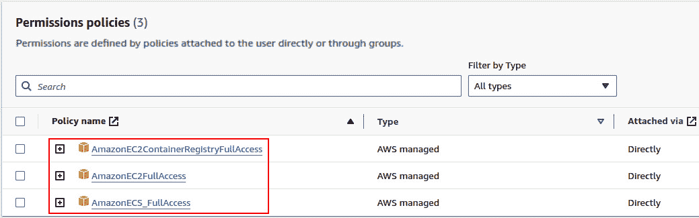

图 7.1：您的 AWS 用户所需 IAM 策略示例

上述截图显示了完成此练习所需的 AWS IAM 策略（前面提到过）。您必须将这些策略添加到所选的 IAM 用户。可以通过 AWS 控制台中的**添加权限**菜单来实现此操作。有关此过程的帮助，请查阅有关身份管理策略的官方 AWS 文档：

+   [`docs.aws.amazon.com/AmazonECS/latest/developerguide/security_iam_id-based-policy-examples.html`](https://docs.aws.amazon.com/AmazonECS/latest/developerguide/security_iam_id-based-policy-examples.html)

+   [`docs.aws.amazon.com/AmazonECS/latest/developerguide/security_iam_id-based-policy-examples.html#IAM_cluster_policies`](https://docs.aws.amazon.com/AmazonECS/latest/developerguide/security_iam_id-based-policy-examples.html#IAM_cluster_policies)

## 步骤 1 – 分叉仓库

按照以下步骤分叉仓库：

1.  点击分叉框中的下拉箭头并选择**创建新分叉**。或者，访问[`github.com/PacktPublishing/Embracing-DevOps-Release-Management/fork`](https://github.com/PacktPublishing/Embracing-DevOps-Release-Management/fork)：

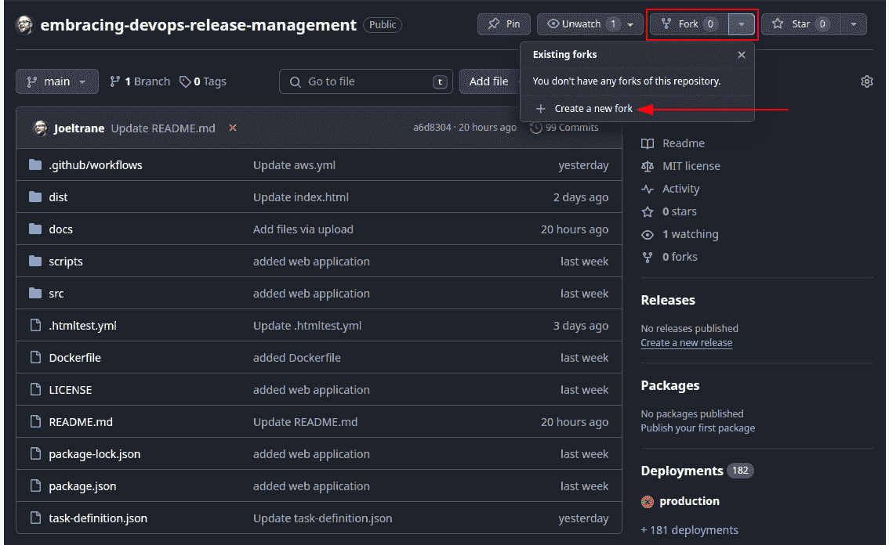

图 7.2：在 GitHub 中分叉仓库

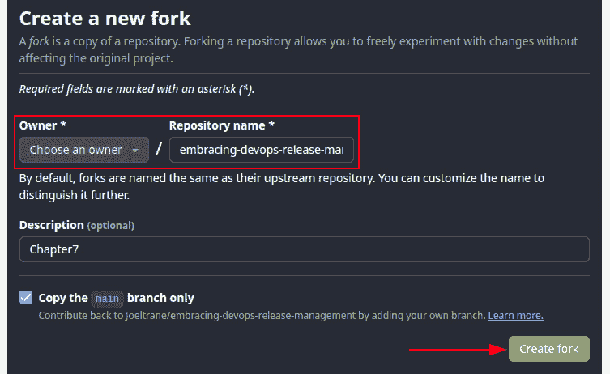

图 7.3：确认此仓库的新分叉

1.  在分叉仓库页面上，指定**所有者**值并选择**创建分叉**。

## 步骤 2 – 创建默认 VPC

在继续之前，请注意，在同一地区内创建多个默认 VPC 是不可能的。如果您不小心删除了默认 VPC，则可以创建一个新的。然而，重要的是要注意，无法恢复先前删除的默认 VPC，也无法将当前非默认 VPC 指定为默认 VPC。

要通过 AWS 控制台建立默认 VPC，请按照以下步骤操作：

1.  通过访问[`console.aws.amazon.com/vpc/`](https://console.aws.amazon.com/vpc/)进入 Amazon VPC 控制台。

1.  从导航窗格中选择**您的 VPC**：

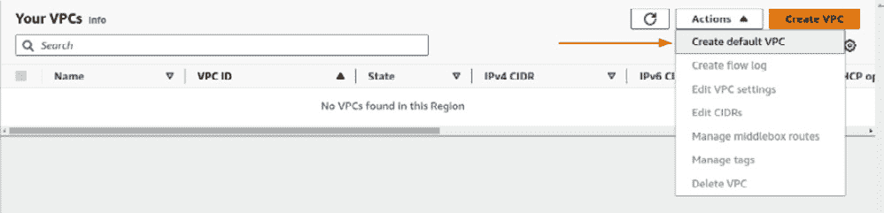

图 7.4：创建默认 VPC

1.  选择**操作**，然后创建默认 VPC。

1.  选择**创建默认 VPC**选项。请在确认信息后关闭该消息：

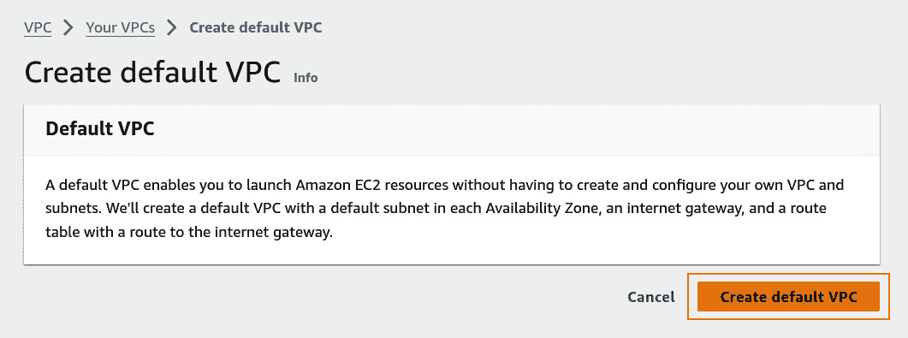

图 7.5：确认您的新默认 VPC

## 步骤 3 – 在默认安全组中创建 HTTP 规则

每当向安全组添加规则时，它会自动应用到所有与该组关联的资源。

要通过 AWS 控制台建立新的安全组规则，请按照以下步骤操作：

1.  通过访问[`console.aws.amazon.com/vpc/`](https://console.aws.amazon.com/vpc/)进入 Amazon VPC 控制台。

1.  从导航窗格中选择**安全组**：

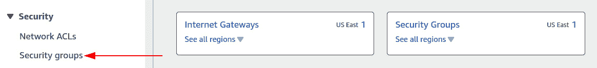

图 7.6：访问安全组菜单

1.  选择所需的安全组。

1.  选择**操作**，然后选择**编辑** **入站规则**：

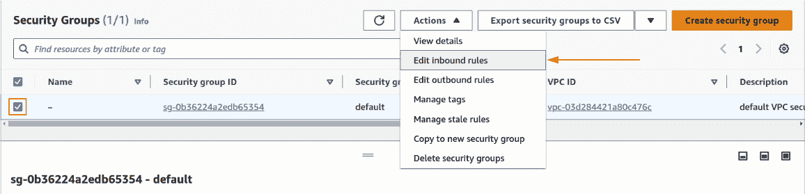

图 7.7：编辑默认安全组的入站规则

1.  选择**添加规则**，然后按以下步骤操作：

    +   对于**类型**，请选择**HTTP**协议。

    +   对于**来源类型**（入站规则），请执行以下操作以允许流量：

        +   选择**IPv4 任何位置**以允许来自任何 IPv4 地址的传入流量（入站规则）。完成此操作后，将自动为 0.0.0.0/0 IPv4 CIDR 块添加规则。

        +   请提供此**安全组**规则的简短**描述**：

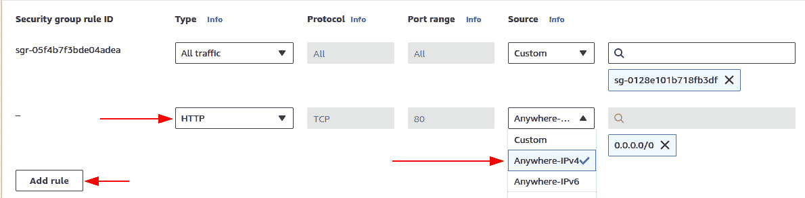

图 7.8：向默认安全组添加 HTTP 规则

1.  选择**保存规则**。

## 第 4 步 – 创建一个 ECR 注册表

开始使用 Amazon ECR，在 Amazon ECR 控制台中设置一个仓库。Amazon ECR 控制台提供了逐步指南，帮助您创建初始仓库。在开始之前，请确保您已按照*Amazon ECR 设置指南*中概述的所有必要步骤操作：[`docs.aws.amazon.com/AmazonECR/latest/userguide/get-set-up-for-amazon-ecr.html`](https://docs.aws.amazon.com/AmazonECR/latest/userguide/get-set-up-for-amazon-ecr.html)。

要通过 AWS 控制台建立镜像仓库，请按照以下步骤操作：

1.  仓库是 Amazon ECR 中 Docker 或**Open Container Initiative** (**OCI**)镜像的存储位置。在与 Amazon ECR 交互时，您需要提供仓库和注册表位置，以指示镜像的目的地或来源。

    您可以通过访问[`console.aws.amazon.com/ecr/`](https://console.aws.amazon.com/ecr/)来访问 Amazon ECR 控制台。

1.  为确保本练习顺利进行，强烈建议您选择**us-east-1**地区：


图 7.9：选择正确的 AWS 地区以操作 un

1.  选择**开始**。

1.  在**可见性设置**下选择**私有**。

1.  为确保本练习顺利进行，强烈建议您选择`embracing-devops-release-management`作为您的**仓库名称**值。

重要提示

注意显示在 ECR 仓库名称开头的 12 位数字。这是您的 AWS 账户号码，您将需要它来完成本指南中的后续步骤。

或者，您可以浏览您的**AWS 账户页面**以获取您的 AWS 账户号码：[`console.aws.amazon.com/billing/home?#/account`](https://console.aws.amazon.com/billing/home?#/account)。

1.  对于**标记不可变性**，请选择保持禁用状态：

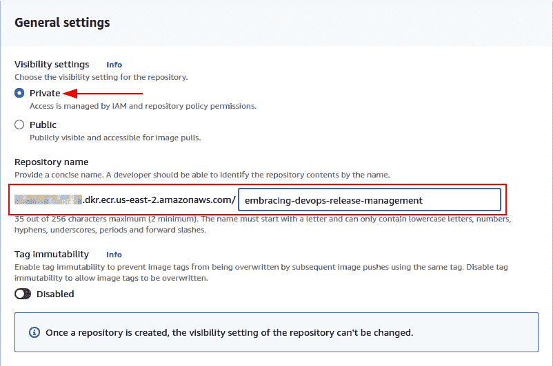

图 7.10：建立 ECR 仓库（注册表）

1.  选择**推送时扫描**来启用该仓库的图像扫描功能。如果 ECR 仓库启用了**推送时扫描**，每当有推送请求时，它将自动开始扫描图像；否则，用户必须手动启动扫描过程。

1.  对于**KMS 加密**设置，选择禁用它：

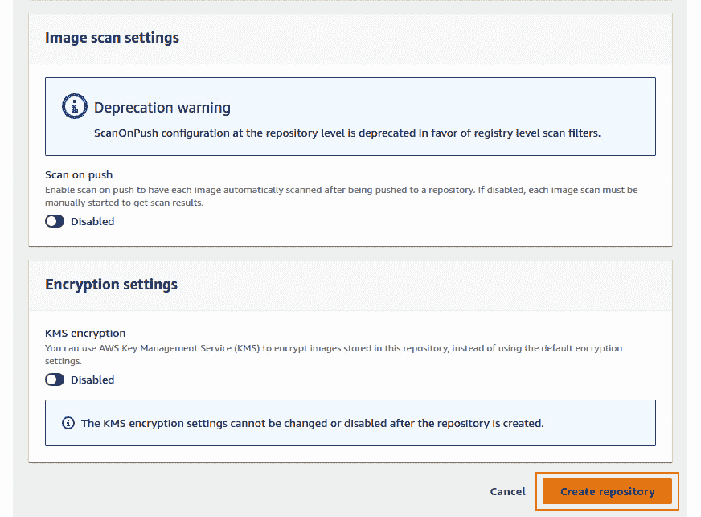

图 7.11: 完成 ECR 仓库创建过程

1.  选择**创建仓库**。

## 第五步 – 创建 ECS 集群

通过用户友好的 Amazon ECS 控制台，可以轻松创建一个 Amazon ECS 集群。

在继续操作之前，确保你已经完成了*设置 Amazon ECS*的前提步骤（[`docs.aws.amazon.com/AmazonECS/latest/developerguide/get-set-up-for-amazon-ecs.html`](https://docs.aws.amazon.com/AmazonECS/latest/developerguide/get-set-up-for-amazon-ecs.html)），并为所选的 IAM 用户分配了正确的 IAM 权限。更多详细信息和帮助，请参考文档中的*集群示例*部分（[`docs.aws.amazon.com/AmazonECS/latest/developerguide/security_iam_id-based-policy-examples.html#IAM_cluster_policies`](https://docs.aws.amazon.com/AmazonECS/latest/developerguide/security_iam_id-based-policy-examples.html#IAM_cluster_policies)）。

Amazon ECS 控制台通过创建 AWS CloudFormation 堆栈，提供了一种简便的方法来生成 Amazon ECS 集群所需的资源。

要通过 AWS 控制台建立 ECS 集群，请按照以下步骤操作：

1.  通过访问 [`console.aws.amazon.com/ecs/v2`](https://console.aws.amazon.com/ecs/v2) 来进入 Amazon ECS 控制台。

1.  为确保本次操作顺利进行，强烈建议选择**us-east-1**区域。

1.  从导航窗格选择**集群**。

1.  从**集群**页面选择**创建集群**：

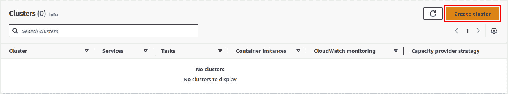

图 7.12: 建立 ECS 集群

1.  在 `embracing-devops-release-management` 作为集群名称，以确保此次操作顺利进行。

1.  展开**基础设施**，然后选择**AWS** **Fargate（无服务器）**：

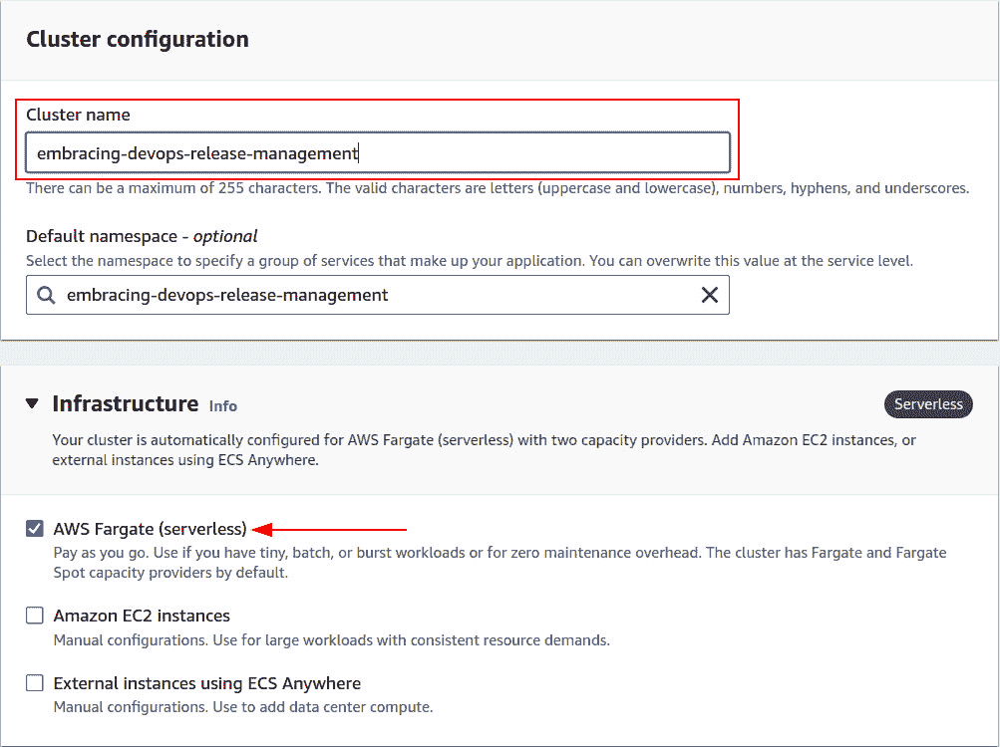

图 7.13: 将 ECS 集群配置为 AWS Fargate（无服务器）

1.  展开**监控**，然后切换**启用容器洞察**来启用容器洞察。

1.  展开**标签**，然后配置标签以帮助识别你的集群。

1.  要添加标签，选择**添加标签**并执行以下操作：

    +   在**密钥**字段中输入密钥名称

    +   在**值**字段中输入值名称

1.  要删除标签，选择标签键和值右侧的**删除**：

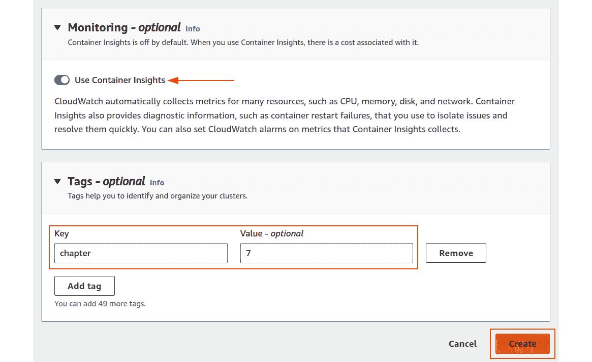

图 7.14: 对 ECS 集群基础设施进行标签标记

1.  选择**创建**。

## 第六步 – 创建 ECS 任务定义

你可以通过控制台或编辑 JSON 文件来创建任务定义。

要通过 AWS 控制台 JSON 编辑器建立任务定义，请按照以下步骤操作：

1.  为确保此操作顺利进行，强烈建议你选择**us-east-1**区域：


图 7.15：选择正确的 AWS 区域进行操作

1.  首先，在你 fork 的仓库中编辑 `ECS 任务定义` 文件：

    1.  在 GitHub 上，点击此书仓库中的 `task-definition.json` 文件（[`github.com/PacktPublishing/Embracing-DevOps-Release-Management/blob/main/chapter07/task-definition.json`](https://github.com/PacktPublishing/Embracing-DevOps-Release-Management/blob/main/chapter07/task-definition.json)）。

    1.  从 `task-definition.json` 文件页面，点击铅笔图标以编辑文件：

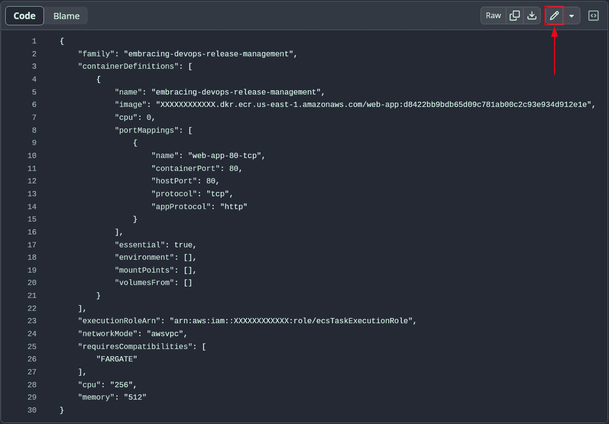

图 7.16：在 GitHub 文本编辑器中编辑 ECS 任务定义

1.  定位到表示你 AWS 账户 ID 的两个占位符，它由 12 个连续的“X”字符组成：

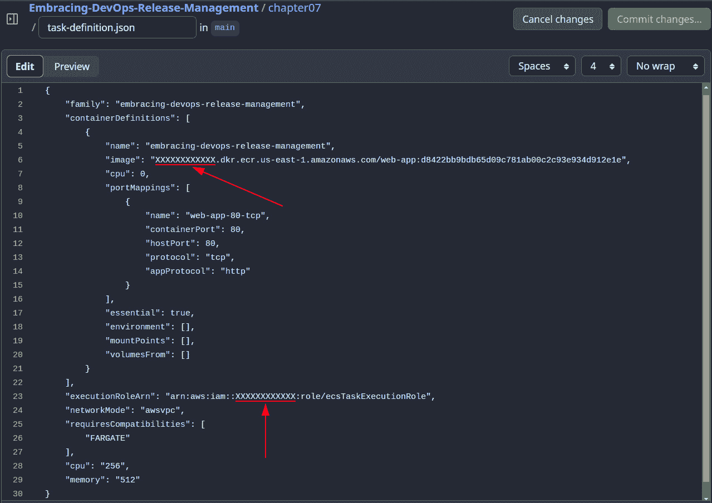

图 7.17：定位到 AWS ID 占位符

1.  用你实际的 AWS 账户 ID 替换两个占位符，并选择**提交更改**：

注意

你可以浏览你的**AWS 账户页面**以获取 AWS 账户号码： https://console.aws.amazon.com/billing/home?#/account。

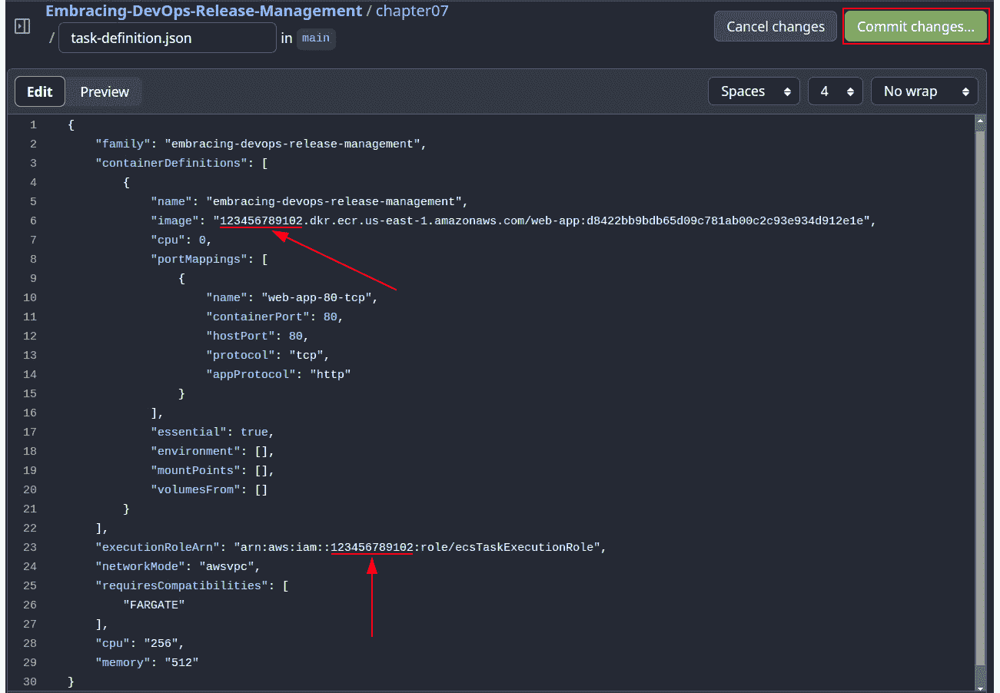

图 7.18：用你的 AWS ID 替换占位符

1.  在提交确认菜单中，添加有意义的提交信息，并选择**直接提交到** **主分支**：

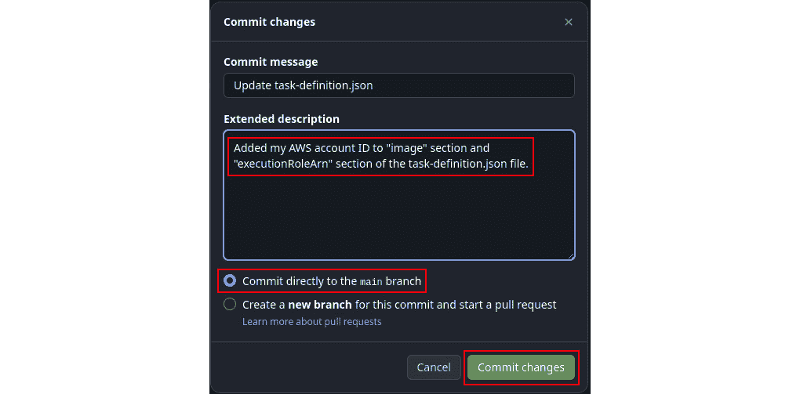

图 7.19：在 GitHub 文本编辑器中提交你的更改

1.  然后，选择**提交更改**。

1.  通过访问 [`console.aws.amazon.com/ecs/v2`](https://console.aws.amazon.com/ecs/v2) 进入 Amazon ECS 控制台。

1.  从导航窗格中选择**任务定义**。

1.  从**创建新任务** **定义**页面的菜单中选择**使用 JSON 创建新任务定义**：

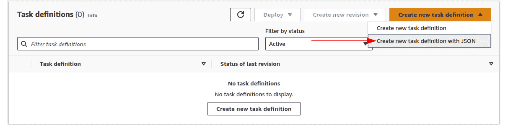

图 7.20：使用 JSON 创建新任务定义

1.  在 JSON 编辑器窗口中修改你的 JSON 文件。

    复制之前编辑的 `task-definition.json` 文件，并将其粘贴到 JSON 编辑器框中：

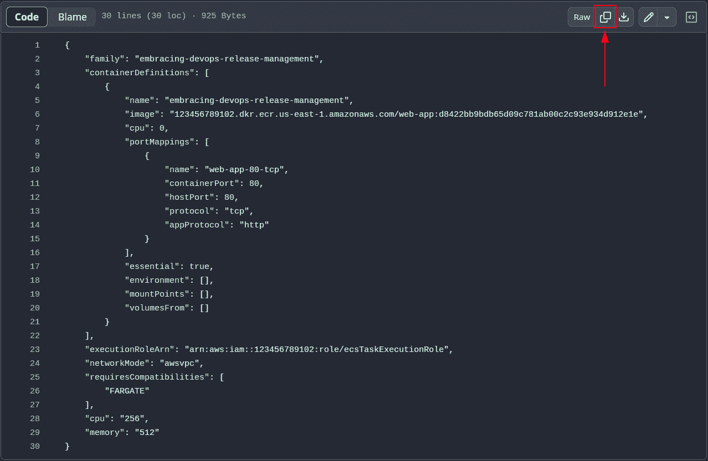

图 7.21：复制你之前编辑的 task-definition.json 文件

注意

如果 JSON 编辑器框中已有内容，在粘贴自定义的`task-definition.json`文件之前，请确保先将其删除。JSON 编辑器框必须为空，才能将`task-definition.json`文件的内容添加进去。

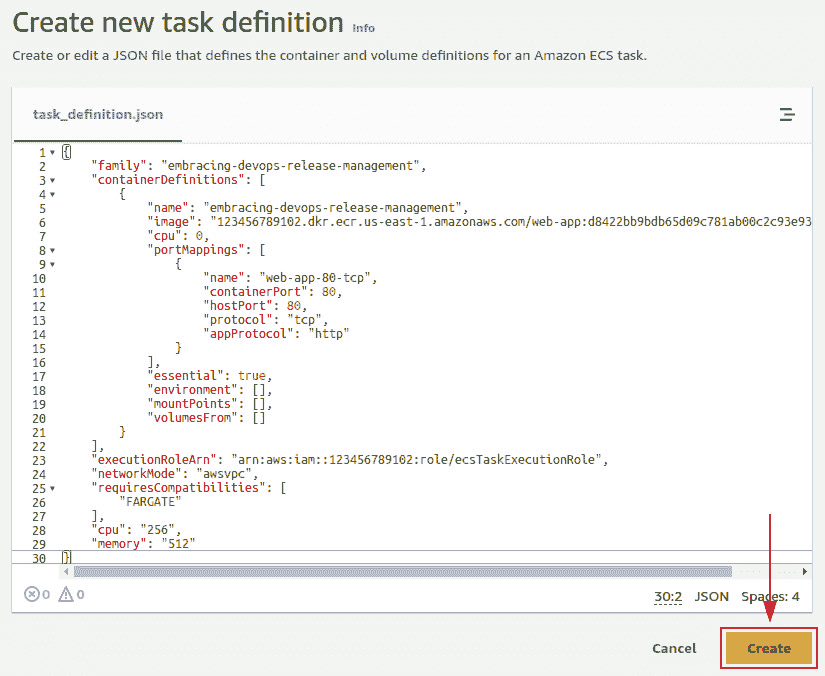

图 7.22：确认并创建 ECS 任务定义

1.  选择**创建**。

## 第 7 步 – 创建 ECS 服务

控制台支持快速创建和部署服务。

通过 AWS 控制台建立 ECS 服务，请按照以下步骤操作：

1.  为确保本练习顺利进行，强烈建议选择**us-east-1**区域：

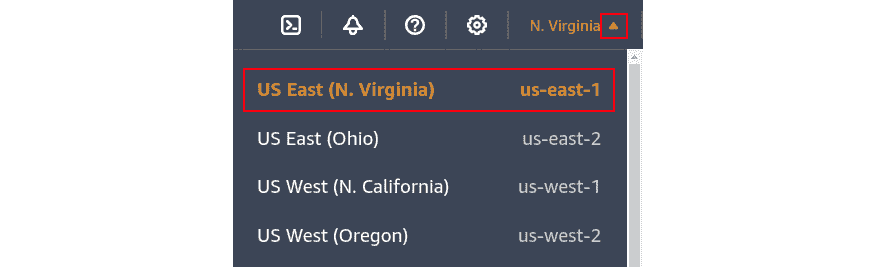

图 7.23：选择正确的 AWS 区域进行操作

1.  通过访问[`console.aws.amazon.com/ecs/v2`](https://console.aws.amazon.com/ecs/v2)，进入 Amazon ECS 控制台。

1.  从导航窗格中选择**集群**。

1.  在**集群**页面，选择要在其中创建服务的集群。

1.  从**服务**选项卡中选择**创建**选项：

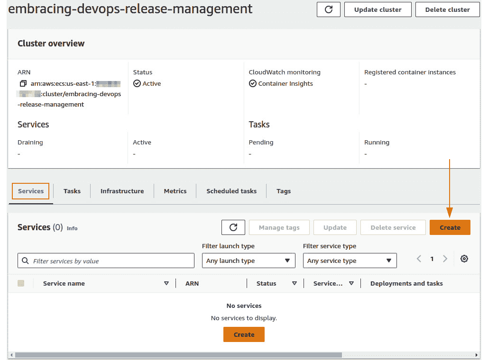

图 7.24：为 ECS 任务创建新 ECS 服务

1.  在**部署配置**部分提供关于应用程序部署的详细信息：

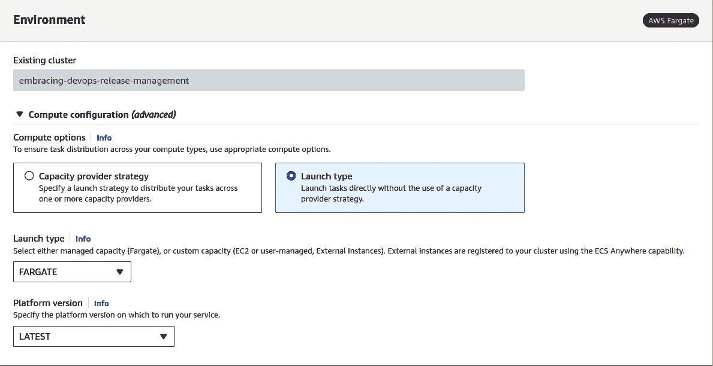

图 7.25：配置新 ECS 服务的启动类型

1.  在**计算选项**下，选择**启动类型**。

1.  在**应用类型**下选择**服务**：

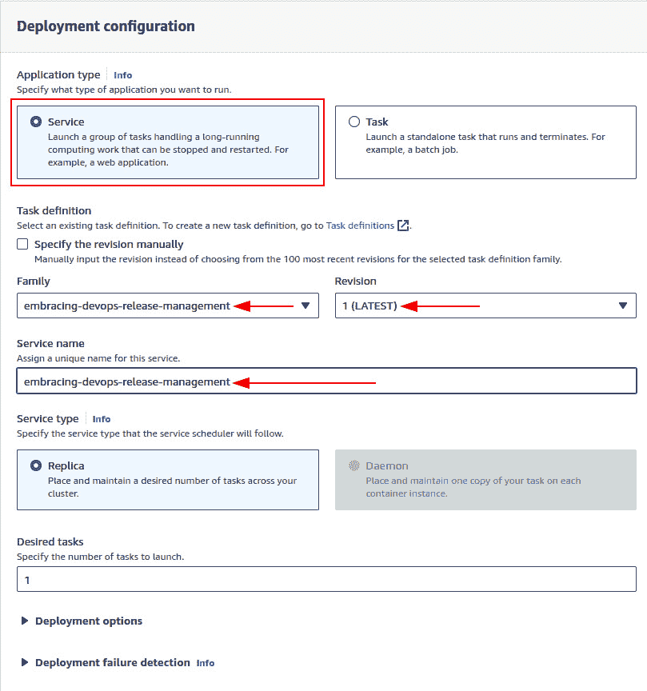

图 7.26：命名和配置 ECS 服务

1.  在**任务定义**区域，选择您希望应用的版本和系列。

1.  为确保本练习顺利进行，强烈建议在**服务名称**下选择`embracing-devops-release-management`。

1.  要指定**期望任务**，输入要在服务中启动和管理的任务数量。

1.  对于**网络**，默认的 VPC 及其关联的网络配置应自动填充到字段中。然而，确保配置与以下内容相似：

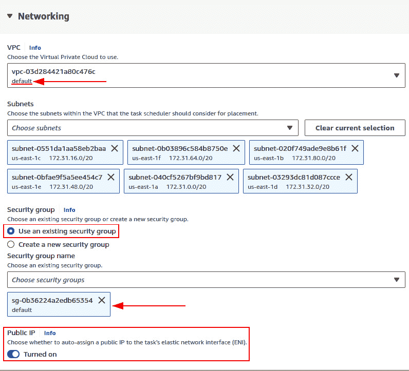

图 7.27：选择默认 VPC 进行网络配置 – 公共 IP！

1.  为资源打标签是定位云基础设施的好方法，特别是在创建了数百或数千个资源之后，打标签特别有用。

    要为 ECS 服务添加标签，展开**标签**，然后配置标签以帮助识别服务和任务。

1.  要添加标签，选择**添加标签**，然后执行以下操作：

    +   在**密钥**字段中输入密钥名称。

    +   在**值**字段中输入值名称。

1.  要移除标签，选择标签键值对右侧的**移除**选项。

1.  选择**创建**。

这标志着本指南的第一部分——*AWS 基础设施的配置*——的结束。在这一部分中，你已配置了支持第二部分指南中概述的 CICD 流水线操作所需的基础设施，即*配置 GitHub* *Actions 工作流*。

让我们简要回顾一下你迄今为止的成就：

+   你已经确保你的 AWS IAM 用户已分配必要的权限，以便能够在你的 AWS 账户内配置所需的云资源。

+   你已经确保你的 AWS 账户配备了默认 VPC 及相关的默认网络资源。

+   你已经修改了默认 VPC 中的*默认安全组*，以便它包含一个 HTTP 规则。这是为了允许用户通过 80 端口访问你的网页应用，我们将在本指南的第二部分进行部署。

+   你已经创建了必要的*ECS 注册表*，用于存储由 GitHub 工作流生成的 Docker 镜像。我们将在本指南的下一部分进行配置。

+   你已经创建了必要的*ECS 集群*，用于托管由 GitHub Actions 工作流生成并部署的 Docker 容器。我们将在本指南的下一部分进行配置。

+   你已经创建了必要的*ECS 任务定义*，它将管理你的网页应用部署的操作活动。这确保了网页应用部署在所有适当配置下运行，并能在遇到意外的系统问题时保持弹性。

+   你已经创建了与配置的 ECS 任务定义关联的必要*ECS 服务*。这是为了确保所需的网络基础设施已经搭建好，以便用户能够从本地网页浏览器访问在 ECS 中运行的网页应用。

在本指南的下一部分——*配置 GitHub Actions 工作流*——你将学习如何配置 GitHub Actions 工作流。在这一部分中，你将启用必要的后端设置，学习如何配置输入参数并将秘密信息注入构建过程中，了解如何启动流水线运行并分析构建日志。最后，你将学习如何访问部署到 ECS 中的网页应用，并验证它的存在。

# 配置 GitHub Actions 工作流

如果希望成功运行 GitHub Actions 工作流并实现成功的部署，则需要进行多个配置。主要的配置项是输入参数，它们以变量和密钥的形式存在。值得注意的是，密钥与变量几乎完全相同，唯一的区别是，密钥在日志中会被掩码，且配置完毕后不会对任何人可见。成功启动流水线运行后，您可以查看日志输出，验证任何问题、失败和成功。最后，您将能够看到在 AWS EC2 中运行的功能性 Web 应用程序。

## 先决条件

要完成本阶段的指南，您需要确保拥有一个有效的 *GitHub 账户*（[`github.com/`](https://github.com/)），并且账户状态良好。

## 步骤 1 – 配置所需的 GitHub 仓库变量和密钥

配置 GitHub Actions 后端是一个简单的过程，但了解需要关注的内容会有所帮助。在此步骤中，您将为此仓库启用 GitHub Issues，这样如果在构建过程中标记到问题，流水线可以自动提出问题。关键的是，我们还将配置流水线变量和密钥，以便在运行过程中可以将其注入到流水线中。这是 DevOps 中的标准技术，允许相同的 CI/CD 流水线脚本在多个环境中运行，并根据每个用例的独特设置进行配置，包括您的！

为了建立所需的 GitHub 仓库变量和密钥，请按照以下步骤操作：

1.  在 GitHub 中，导航到 `embracing-devops-release-management` 仓库：

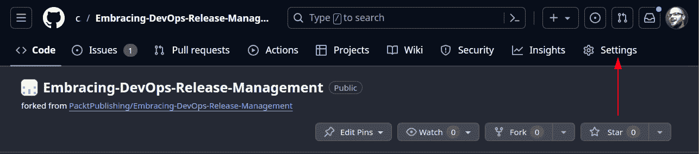

图 7.28：导航到您分叉仓库中的设置菜单

1.  为此仓库启用 GitHub **Issues**：

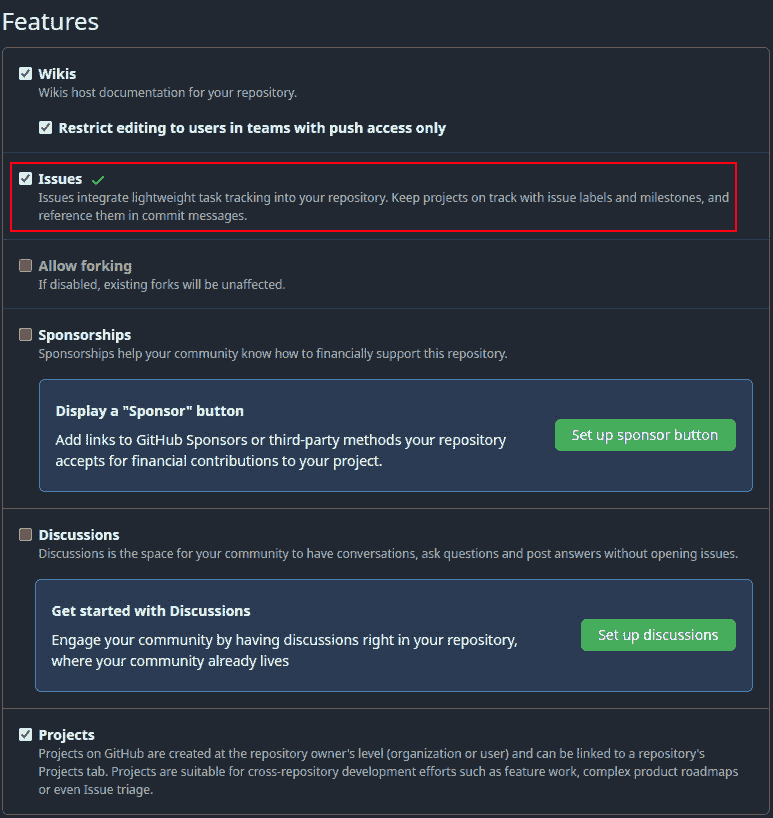

图 7.29：为您的分叉仓库启用 GitHub Issues

1.  在仓库菜单的 **Security** 部分，导航到 **Secrets and** **variables** 选项：


图 7.30：访问 GitHub Actions 的密钥和变量选项

1.  然后，选择 **Actions**。

1.  在 **Actions 密钥和变量** 菜单中，选择 **Secrets** 标签。

1.  然后，选择 **新建** **仓库密钥**：

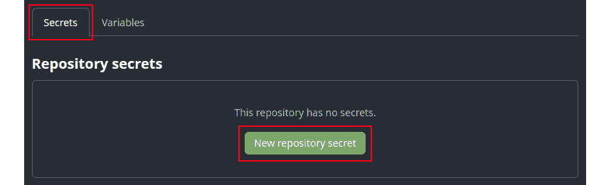

图 7.31：向 GitHub Actions 仓库添加密钥

您需要为 GitHub Actions 工作流提供在您的 AWS 账户中配置资源的权限。为此，您需要提供 AWS 访问密钥，以便在流水线中运行 AWS CLI 操作。

1.  为您的 AWS 访问密钥 ID 创建一个新的仓库密钥，然后按照以下步骤操作：

    1.  在 `AWS_ACCESS_KEY_ID` 中。

    1.  在 **Secret** 字段中，输入您的 AWS 访问密钥 ID 的值。

    1.  选择 **添加密钥**：

注

密钥是你在仓库、组织或环境中设置的环境变量。通过 GitHub Actions，你可以将你提供的密钥集成到你的工作流中。如果你故意在工作流中包含密钥，那么 GitHub Actions 将在管道运行过程中读取该密钥。

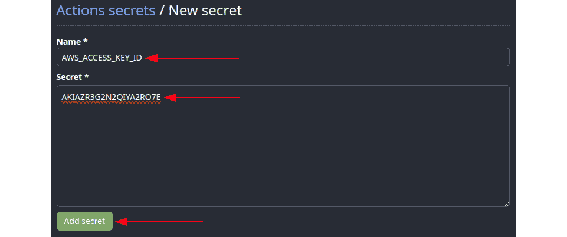

图 7.32：将 AWS 访问密钥 ID 添加为管道密钥

警告

GitHub 会自动从作业生成的任何日志中删除对密钥的任何提及。建议不要故意将密钥发布到日志中。

1.  为你的 AWS 秘密访问密钥 ID 创建一个新的仓库密钥：

    1.  在`AWS_SECRET_ACCESS_KEY`中。

    1.  在**Secret**字段中，输入你的 AWS 秘密访问密钥的值。

    1.  选择**添加密钥**：

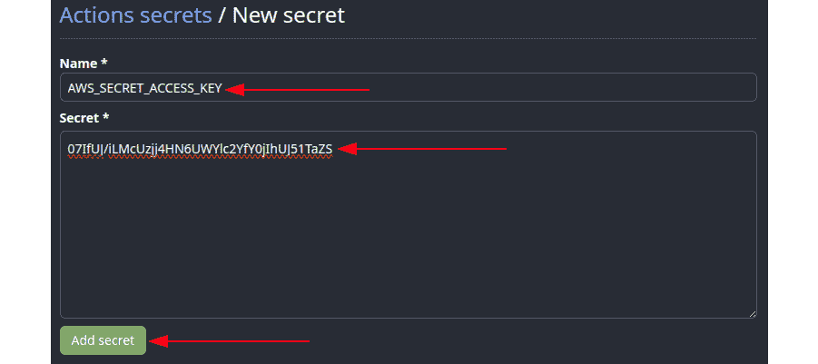

图 7.33：将 AWS 秘密访问密钥添加为管道密钥

1.  在**Actions 密钥和变量**菜单中，选择**变量**标签。

1.  然后，选择**新建** **仓库变量**：

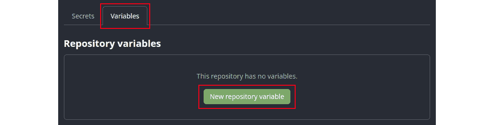

图 7.34：向 GitHub Actions 仓库添加变量

1.  为你的`ECR_REGISTRY`创建一个新的仓库变量。

1.  在`XXXXXXXXXXXX.dkr.ecr.us-east-1.amazonaws.com`中作为你的 ECR 仓库地址。

注意

别忘了在输入文本框时，使用你自己的 AWS 账户 ID，填入完整的 ECR 仓库地址。

存储和重用非敏感配置信息的一种技术是通过变量。变量是保存配置信息的好方法，例如编译器标志、用户名和服务器名称。执行你工作流的 runner 负责插入变量，这些变量可以在操作或工作流阶段的命令中创建、读取和修改。

1.  选择**添加变量**：

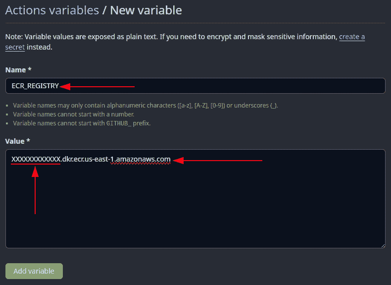

图 7.35：填写 GitHub Actions 仓库变量的示例

警告

默认情况下，变量会在构建输出中显示未掩码的内容。如果你需要对敏感信息（如密码）进行更高的安全保护，请使用密钥。

1.  输入管道成功运行所需的其他仓库变量。

1.  重复*步骤 11*中提到的过程，直到所有剩余的仓库变量都已添加：

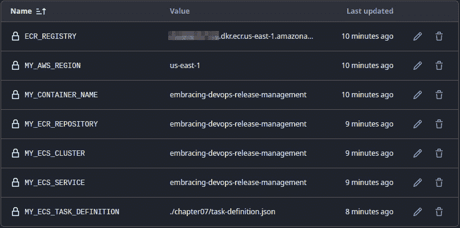

图 7.36：所有必要的管道变量示意图

以下表格包含所有必需的*变量*名称及其*建议值*：

| **变量名称** | **变量值** |
| --- | --- |
| **ECR_REGISTRY** | `XXXXXXXXXXXX.dkr.ecr.us-east-1.amazonaws.com` |
| **MY_AWS_REGION** | `us-east-1` |
| **MY_CONTAINER_NAME** | `embracing-devops-release-management` |
| **MY_ECR_REPOSITORY** | `embracing-devops-release-management` |
| **MY_ECS_CLUSTER** | `embracing-devops-release-management` |
| **MY_ECS_SERVICE** | `embracing-devops-release-management` |
| **MY_ECS_TASK_DEFINITION** | `./``chapter07/task-definition.json` |

表 7.1：一个包含所有必要变量的实用图表

注意

确保在为 MY`_ECS_TASK_DEFINITION` 设置的值前面加上 `./`。这是一个必要的文件系统路径，是 GitHub Actions 获取 `task-definition.json` 文件并在管道中使用它所需的有效语法。

## 步骤 2 – 启动 GitHub Actions 工作流

终于到了执行管道的时候。这是关键时刻，我们将完成我们设定的目标。按照以下步骤来启动 GitHub Actions 工作流并将你的 Docker 容器部署到 ECS：

1.  导航到 GitHub **Actions** 菜单：

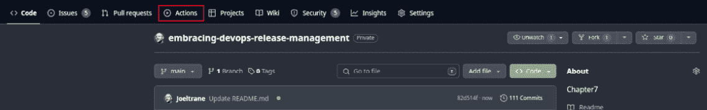

图 7.37：访问 GitHub Actions 菜单

1.  选择 **I understand my workflows, go ahead and** **enable them**：

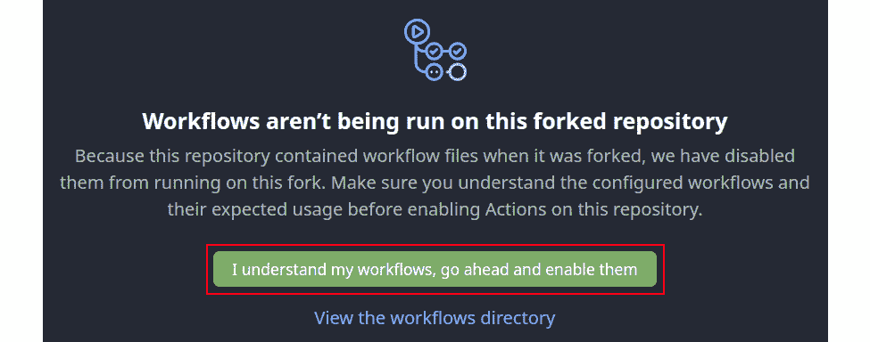

图 7.38：启用 GitHub Actions 使用权限

1.  从 **All workflows** 菜单中，在 **Actions** 下选择本次练习的工作流，并选择 **Deploy to** **Amazon ECS**：

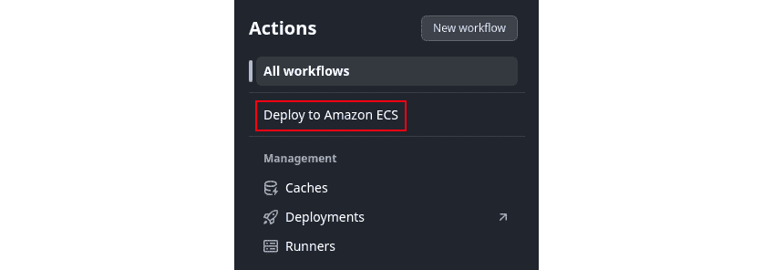

图 7.39：导航到 Deploy to Amazon ECS 工作流菜单

1.  在 **Deploy to Amazon ECS** 工作流菜单中，选择 **Run workflow**，然后点击 **Run workflow**：

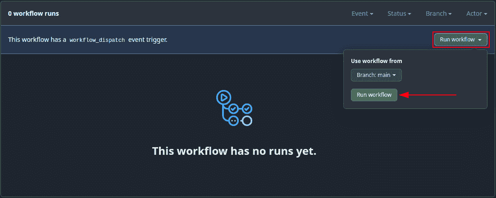

图 7.40：启动 GitHub Actions 工作流运行

上面的截图展示了你在本次练习中配置、构建并部署的 `Deploy to Amazon ECS` GitHub Actions 工作流的主菜单。在这里，你可以启动新的工作流运行，并查看当前和之前的工作流运行历史。

在管道运行启动后，会在该 GitHub Actions 工作流的构建历史中新增一条记录。当工作流运行时，构建历史中该条记录左侧会显示黄色指示器。管道完成后，如果构建失败，黄色指示器会变为红色；如果构建成功，则变为绿色：

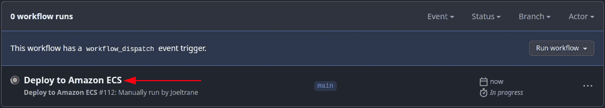

图 7.41：一个正在运行的 GitHub Actions 工作流

## 步骤 3 – 分析部署日志

在此步骤中，我们将仔细审查在上一步骤中运行的 GitHub Actions 工作流的构建日志。此管道中有三个主要阶段。第一阶段进行静态代码分析测试。第二阶段将 Web 应用程序构建成 Docker 镜像。最后，最后阶段进行动态应用安全测试，以评估部署到 ECS 后的容器。所有这些活动将在完成后记录在 GitHub Actions 构建日志中。

一旦 GitHub Actions 工作流启动，点击管道阶段以查看失败、问题和成功的日志！

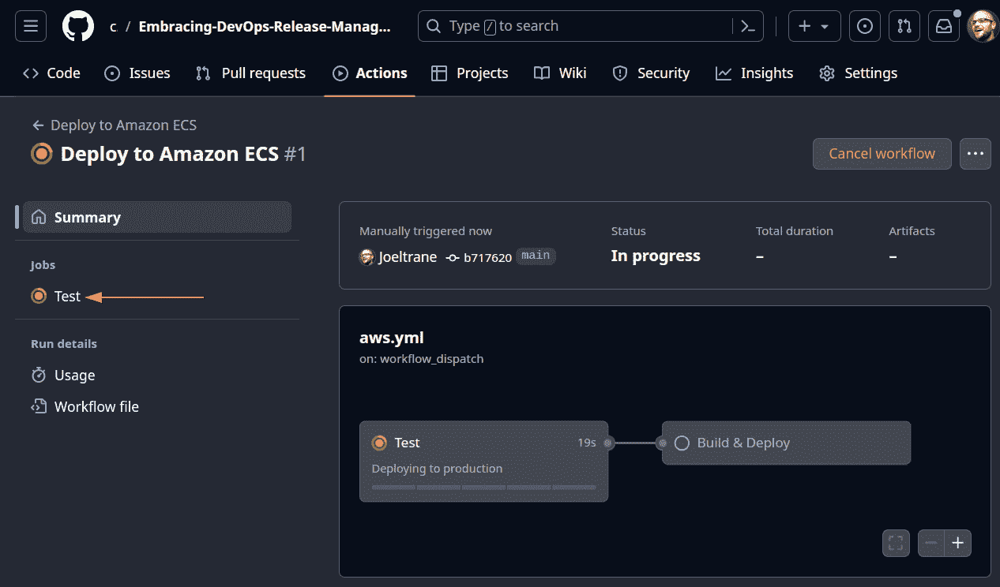

图 7.42：构建历史区域中单个工作流的详细菜单

如下截图所示，管道已分为两个主要阶段：**测试**和**构建与部署**。然而，需要注意的是，在管道的**构建与部署**阶段，在部署完成后和管道阶段结束之前，会进行动态应用安全测试。你可以访问每个阶段的详细信息和历史记录，以查看与每个阶段相关的构建日志：

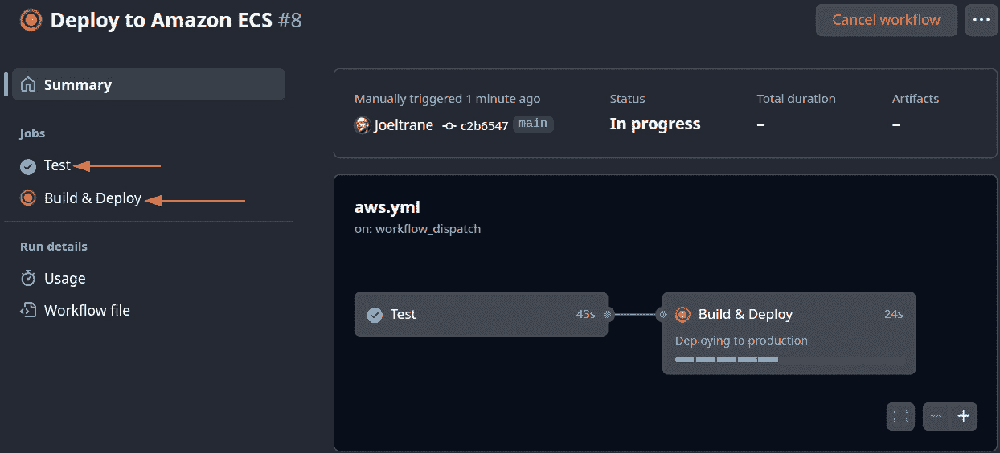

图 7.43：检查工作流的不同管道阶段

每个管道阶段的图形表示非常方便，可以快速评估其状态并通过职责的逻辑划分进行组织。在这个仪表盘中，你可以快速查看谁触发了管道、与更改相关的 Git 提交、管道运行的时间以及结果产生了多少工件，所有信息一目了然！当你查看单次管道运行时，这些信息足够有用，但当你在历史记录中解析数百个或数千个构建日志时，这些信息使得理解变得更加容易。

以下截图显示了与 GitHub Actions 工作流的**测试**阶段相关的活动。正如你所看到的，包括由不同工具进行的两个 SAST——HTMLTest 和 SAST SCAN。两个测试一起检查代码库并尝试识别与 DOM、NodeJS、JSON、YAML、软件依赖项以及源代码中存在的凭证相关的潜在问题。如果所有测试通过，GitHub Actions 工作流的**测试**阶段将以绿色勾号结束，管道将继续进入**构建与部署**阶段：

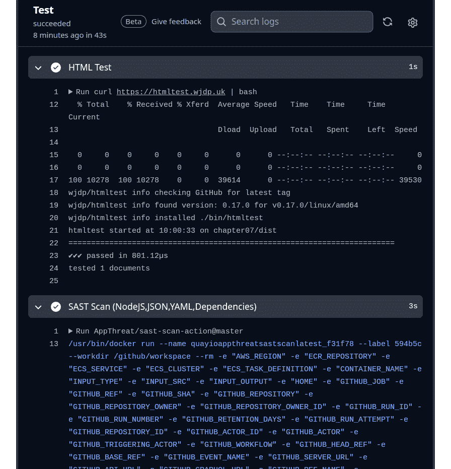

图 7.44：管道中运行的 SAST 扫描示意图

以下截图展示了 GitHub Actions 工作流中的应用构建阶段。在 **构建与部署** 阶段，配置了 AWS 凭证，web 应用被构建并标记为新的 Docker 镜像，然后将新的 Docker 镜像发布到 ECR 仓库（注册表）。接着，更新 ECS 任务定义，以反映新的 Docker 镜像标签。最后，新的 Docker 容器被部署到 ECS：

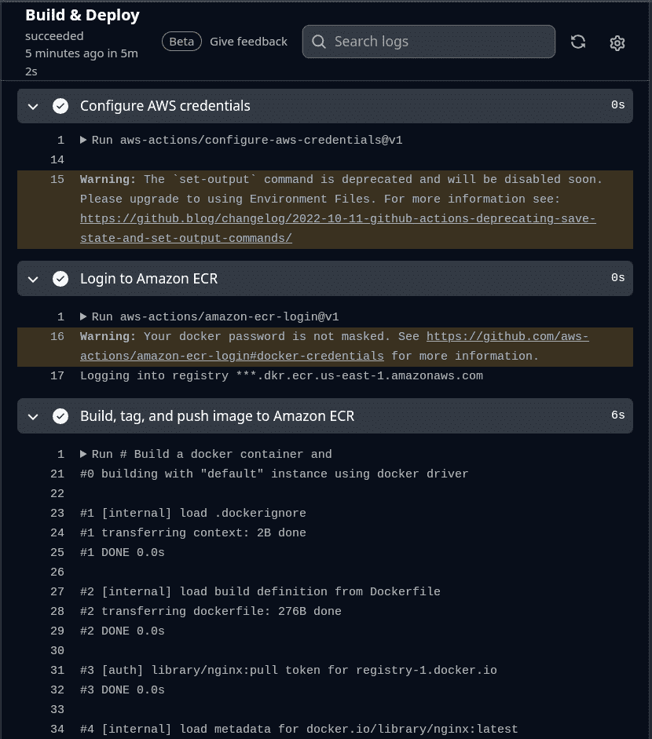

图 7.45：GitHub Actions 工作流中的构建与部署阶段

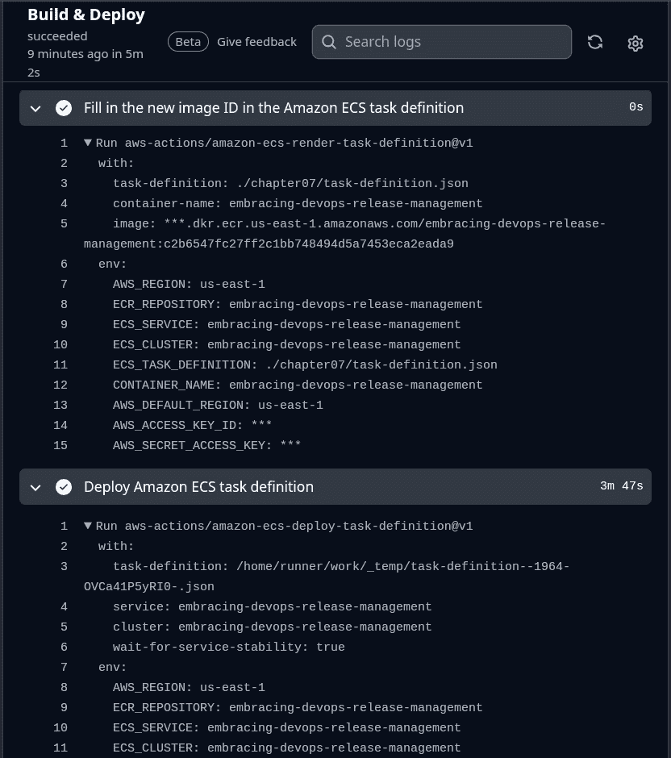

图 7.46：准备在 ECS 中部署新构建的 Docker 镜像

如下图所示，应用程序已经部署并运行在 ECS 中。随后，在工作流运行期间执行了一个自动化脚本，动态捕获 web 应用的公共 IP 地址，并将其作为环境变量存储在 shell 中。这个过程是通过 AWS CLI 完成的，并且在 GitHub Actions 运行器上执行。捕获 IP 地址后，它会作为 OWASP ZAProxy 扫描器的目标，进行 DAST 扫描。如果 OWASP ZAProxy 检测到任何问题，会自动在仓库中打开一个新的 GitHub 问题以供人工审查：

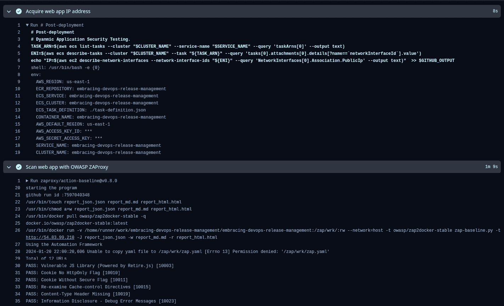

图 7.47：在工作流中运行 DAST 扫描

如下图所示，OWASP ZAProxy 已完成扫描，扫描结果显示在构建日志中。在 GitHub Actions 工作流中的所有操作完成后，管道会清理构建环境，并取消设置所有使用过的机密和环境变量。此时，GitHub Actions 运行器将被优雅地停用：

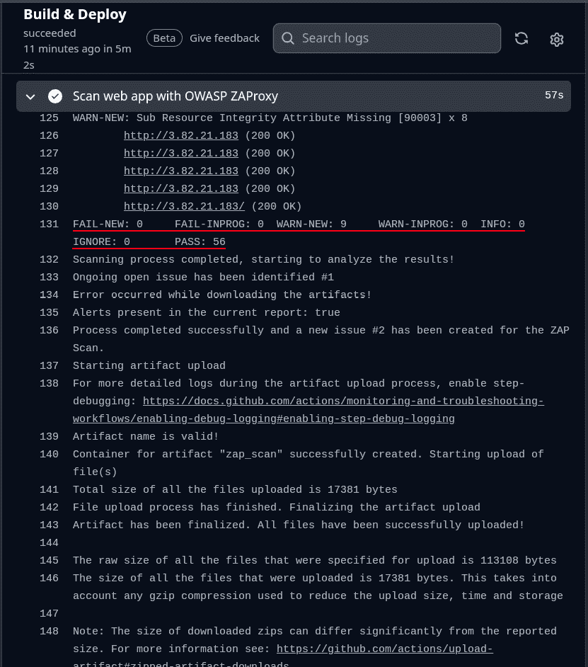

图 7.48：查看 OWASP ZAProxy web 应用扫描结果

## 步骤 4 – 观察在 AWS ECS 中运行的已部署应用程序

现在 GitHub Actions 工作流已经完成，web 应用已部署到 ECS，让我们打开浏览器窗口，查看我们的成果。

你可以通过两种简单的方法获取正在运行的 web 应用的公共 IP 地址：

1.  查看部署日志后，你可以找到用于扫描运行中 web 应用的 IP 地址，这个 IP 地址是在使用 OWASP ZAProxy 进行自动扫描时获得的：

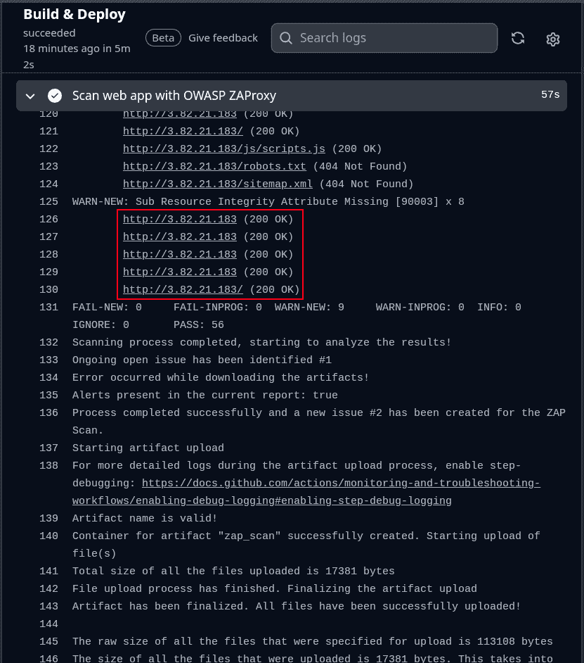

图 7.49：查找已部署 web 应用的公共 IPv4 地址

1.  打开 AWS Web 控制台，获取 ECS 服务的 IP 地址：[`console.aws.amazon.com/ecs/v2`](https://console.aws.amazon.com/ecs/v2)：

注意

别忘了选择正确的 AWS 区域，确保你的 ECS 集群已部署在该区域。

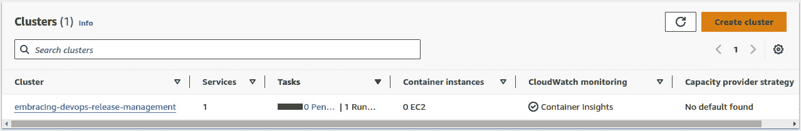

图 7.50：在 AWS 中导航到 ECS 集群菜单

1.  导航到你的 ECS 集群：

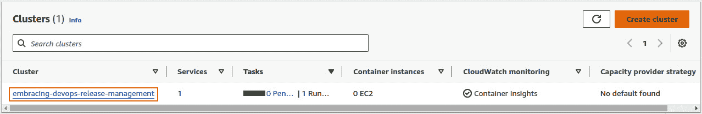

图 7.51：访问你的 Web 应用的 ECS 集群

1.  点击与 Web 应用部署相关的 ECS 任务：

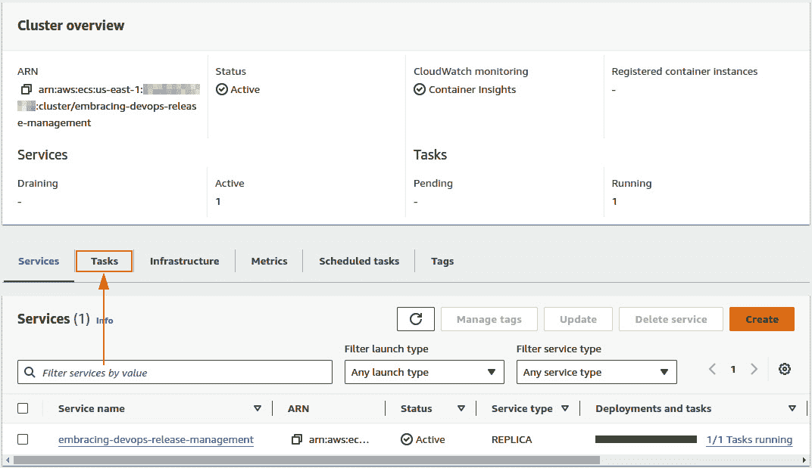

图 7.52：导航到你的 Web 应用的 ECS 任务菜单

1.  点击与你的 ECS 任务部署相关的当前部署哈希值：

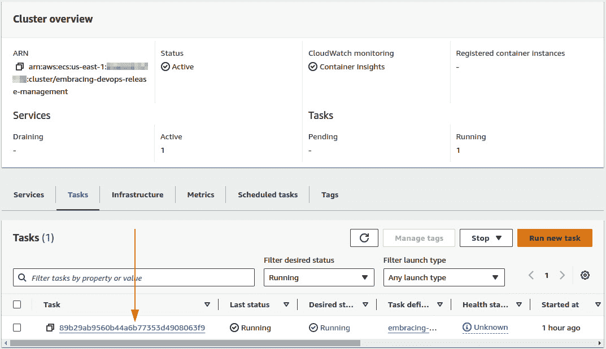

图 7.53：访问你 ECS 任务的最新版本

1.  在**公网 IP**标题下查找，以获取你的 Web 应用的公网 IP 地址：

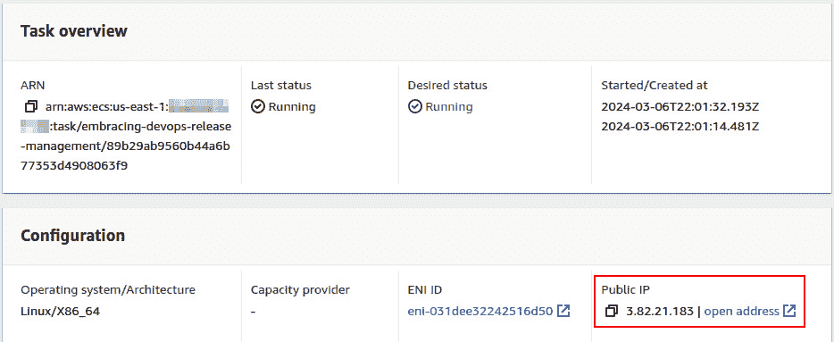

图 7.54：查找你的 Web 应用当前的公网 IPv4 地址

1.  如果一切顺利，并且你的 GitHub Actions 工作流已成功运行，你应该能够浏览 Web 应用并亲自体验。以下截图展示了你在用 Web 浏览器访问 Web 应用时应该看到的内容：

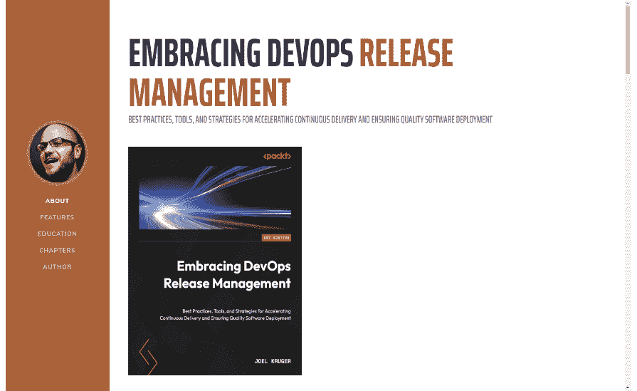

图 7.55：在 AWS ECS 中浏览你的 Web 应用！

你部署到 ECS 中的 Web 应用是一个简单的网站，使用 Bootstrap 网页框架构建。

# 总结

这结束了*第七章*。在这一章中，你已看到一个简单的 CI/CD 流水线代码示例，该代码作为 GitHub Actions 工作流编写。在接触到 CI/CD 流水线语法后，你现在对流水线的构成方式以及如何进行版本控制有了基本的理解。这意味着你具备了阅读、编写和理解流水线文件的能力，并能够确定每个步骤中执行的活动。此外，你还了解了如何使用 ClickOps 配置 AWS 基础设施。凭借这些基础知识，你可以提升自己的技能，并朝着更先进的基础设施部署策略——即基础设施即代码（IaC）迈进。不仅如此，你还获得了配置 GitHub Actions 后端所需的基本知识。因此，通过这些活动，你现在可以准备涵盖 DevOps 发布管理原则（如测试、构建和将应用作为 Docker 容器部署到云中的端到端工作流）！最后，你还获得了撰写附带软件发布的有用文档（包括更新日志）的基础知识。

在下一章中，我们将讨论 CI/CD 流水线如何促进良好的 DevOps 发布管理。主题包括平衡 CI/CD 治理与市场速度、制定团队的分支策略、构建发布流水线，并实现适合 DevOps 发布管理的变更审批流程。

# 资源

要深入了解本章所涉及的主题，请查看以下资源：

+   [`docs.aws.amazon.com/AmazonECS/latest/userguide/getting-started-fargate.html`](https://docs.aws.amazon.com/AmazonECS/latest/userguide/getting-started-fargate.html)

+   [`docs.aws.amazon.com/AmazonECS/latest/userguide/create-container-image.html`](https://docs.aws.amazon.com/AmazonECS/latest/userguide/create-container-image.html)

+   [`docs.aws.amazon.com/AmazonECS/latest/userguide/get-set-up-for-amazon-ecs.html`](https://docs.aws.amazon.com/AmazonECS/latest/userguide/get-set-up-for-amazon-ecs.html)

+   [`docs.github.com/en/actions/deployment/deploying-to-your-cloud-provider/deploying-to-amazon-elastic-container-service`](https://docs.github.com/en/actions/deployment/deploying-to-your-cloud-provider/deploying-to-amazon-elastic-container-service)

+   [`earthly.dev/blog/github-actions-and-docker/`](https://earthly.dev/blog/github-actions-and-docker/)

# 问题

回答以下问题，测试你对本章内容的掌握情况：

1.  什么是 GitHub Actions 工作流？

1.  什么是 ClickOps？

1.  什么是 AWS 访问密钥？

1.  什么是 AWS IAM 策略？

1.  什么是 GitHub 仓库的 “fork”？

1.  什么是 AWS 安全组？

1.  什么是 ECS 集群？

1.  什么是容器镜像仓库？

1.  什么是环境变量？

1.  什么是 `README.md` 文件？
