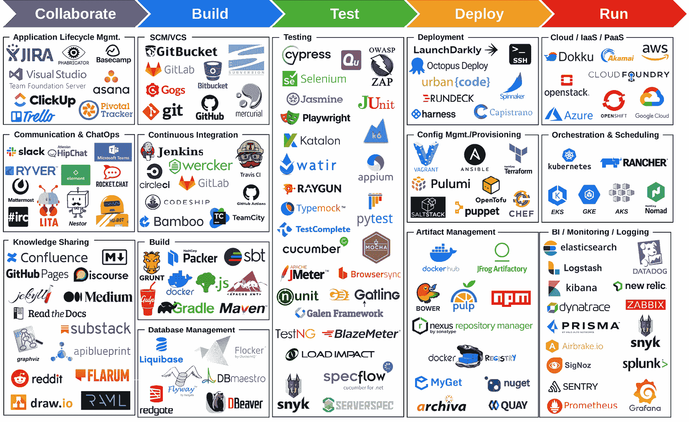
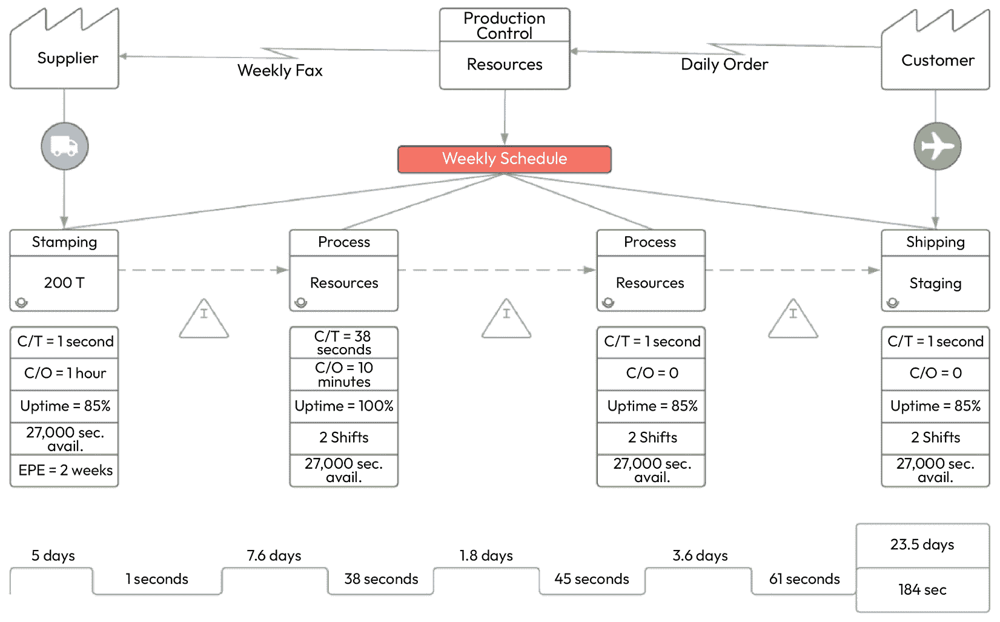
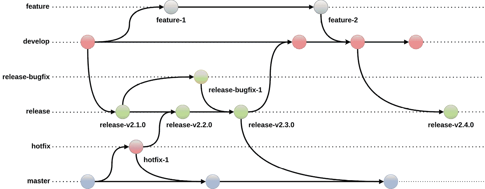
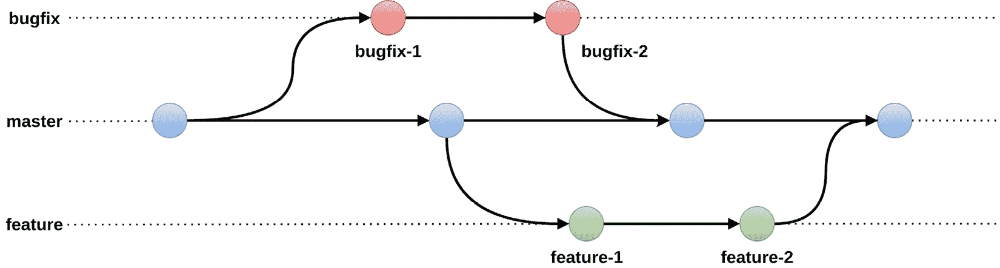
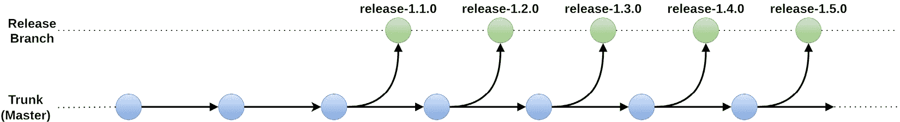
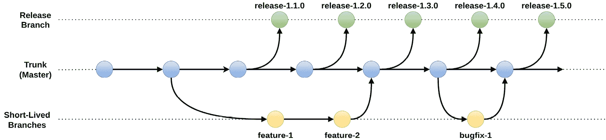
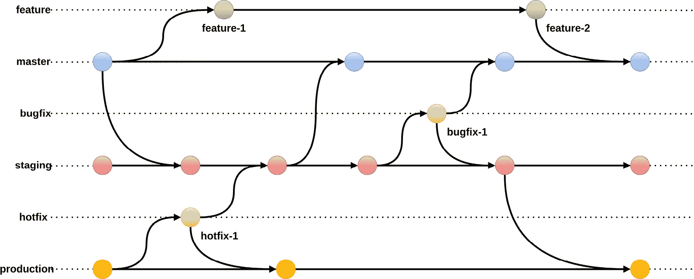

# CI/CD 流水线如何执行良好的 DevOps 发布管理

到目前为止，您已经了解到 CI/CD 是 DevOps 的一个关键方面。可重用的、专为目的而建的 CI/CD 平台通过提高效率、简化工作流程来最大化每个开发者的时间价值。CI/CD 通过成为自动化、测试和协作的汇聚点，提高了组织的生产力。额外的 DevOps 增强功能，如左移和创建更紧密的反馈循环，帮助企业消除隔阂、有效扩展，并比其他发布管理方法更快地实现业务价值。

如今的发布管理人员必须精通 CI/CD 程序、DevOps 和自动化部署技术。他们需要能够在早期识别问题，并理解 CI/CD 流水线的运作方式，这对于 DevOps 发布管理至关重要。在本章中，我们将讨论 CI/CD 流水线如何执行良好的 DevOps 发布管理。我们将涵盖的主题包括管理市场速度和 CI/CD 治理，开发团队的分支策略，构建发布流水线，实施适合 DevOps 发布管理的变更批准流程等等！

在本章中，您将了解以下主题：

+   理解 CI/CD 治理

+   分支策略

+   发布流水线

+   变更管理

# 理解 CI/CD 治理

在 DevOps 发布管理中实施治理需要建立一系列旨在在 CI/CD 基础设施内创建监督机制的程序。这种范例通常包括访问控制管理、合规政策、自动化测试和手动审查检查点的混合。DevOps 治理的主要焦点是推进运行安全目标，并建立全面的框架，监控、批准和记录所有修改，以确保可追溯性。

要熟悉**CI/CD 治理**，您必须全面了解 CI/CD 流水线的运行方式。正如您在前一章学到的那样，CI/CD 流水线涵盖了一系列自动化工作流、系统和方法，专门设计用于从开发者工作站开始，将新代码快速、可靠地交付到生产环境。这使开发人员更容易接收并响应来自最终用户的输入。显然，利用设计良好的 CI/CD 流水线基础设施，可以避免许多通常与软件交付相关的风险。值得注意的是，与一次性进行大规模努力相比，CI/CD 鼓励开发团队以更小、更轻的批次提交软件更新。

因此，与 DevOps 发布管理相关的快速开发节奏可能会导致在有效管理治理和降低安全风险方面的困难。仅以一个例子来说，在生产过程中使用开源软件是开发团队常见的关注点。如果没有适当的审计、分析和自动化测试，你将无法预测何时及是否会有漏洞影响到源代码中的关键依赖项。

## OWASP Top 10 CI/CD 安全风险

CI/CD 已成为现代软件工程实践的关键组成部分。不幸的是，CI/CD 的使用也带来了一些安全漏洞，这些漏洞需要谨慎考虑。在本节中，我们将介绍*OWASP Top 10 CI/CD 安全风险*（[`owasp.org/www-project-top-10-ci-cd-security-risks/`](https://owasp.org/www-project-top-10-ci-cd-security-risks/)），这是对威胁任何组织 CI/CD 管道基础设施的最常见安全风险的全面研究。

**开放 Web 应用安全项目**（**OWASP**）是一个全球公认的非营利组织，致力于提升 Web 应用的安全性。OWASP 坚持的一个基本原则是，提供自由可获取且易于访问的资源，所有这些资源都可以通过其官方网站获得。提供的资源种类繁多，包括书面文档、专业工具、教学视频和互动论坛等。

OWASP Top 10 CI/CD 安全风险如下：

+   流程控制机制不足（CICD-SEC-1）

+   身份和访问管理不足（CICD-SEC-2）

+   依赖链滥用（CICD-SEC-3）

+   被污染的管道执行（CICD-SEC-4）

+   基于管道的访问控制不足（CICD-SEC-5）

+   凭证管理不足（CICD-SEC-6）

+   不安全的系统配置（CICD-SEC-7）

+   第三方服务的无监管使用（CICD-SEC-8）

+   不当的构件完整性验证（CICD-SEC-9）

+   日志记录和可视化不足（CICD-SEC-10）

你可以在*OWASP Top 10 CI/CD Security Risks* | *OWASP Foundation. (**n.d.)*（[`owasp.org/www-project-top-10-ci-cd-security-risks/`](https://owasp.org/www-project-top-10-ci-cd-security-risks/)）找到这个列表。

《OWASP Top 10 CI/CD 安全风险》的详细内容过于广泛，无法在本章中完全涵盖。请参考本书后面的*附录*，了解这些十大安全风险的详细分析，并学习如何实施保护措施防范这些风险。通过熟悉这些风险并实施建议的对策，你将更有信心提升你所在组织的 CI/CD 管道基础设施的安全性。

## 市场速度与治理之间的权衡

CI/CD 使得快速开发和发布周期成为可能，但全面的安全检查、手动审查和批准程序可能会极大地拖慢进度。在理想的情况下，安全检查和合规性评估应该以既有目的又不显突兀的方式融入软件交付生命周期中。调和 CI/CD 治理与效率之间的任务可能会带来一些不必要的困难，因为过于宽松的治理方式可能会导致代码质量下降和安全风险增加，而过于严格的治理则可能阻碍部署过程并抑制创新。

为了优化生产力并防范潜在风险，制定明确的政策和程序，并严格执行其遵守，具有不可估量的价值。有效的软件开发策略应当包含确保优秀代码质量和最小化安全漏洞的协议。其中一些实践可能包括代码审查、自动化测试和一键部署批准。通过实施这些措施，你可以建立质量门槛来评估代码变更，并防止未经授权的代码引入，这是一项主要的安全风险。定期审查和更新治理标准对于确保团队始终与组织目标保持一致至关重要。

## 三种常见的 CI/CD 治理路径

经验丰富的 DevOps 团队采用三种显著的治理模型来管理其应用程序部署和 CI 基础设施。这些模型在它们治理的方面上有所不同，具体包括基础设施代码、部署工具链和提供的云资源：

+   **中央模式库治理模型**是一个有价值的资源，提供了一个经过精心策划的部署模板集合。这些模板旨在供应用团队在部署过程中重用。通过使用中央模式库，团队可以受益于经过精心选择和组织的预开发模板，便于访问和实施。这使得应用程序的部署更加高效和一致。另一种理解该治理模型的方式是，它通过将决策权归还给独立的开发团队，从而去中心化了决策权，这些团队围绕一个经过预批准的流程集统一行动。

+   **CI/CD 即服务治理模型**是一种软件开发实践，提供了一个标准化的工具链供应用团队使用。此服务使代码变更的无缝集成和交付成为可能，确保开发过程的顺利和高效。通过提供可重用的工具链，CI/CD 即服务使应用团队能够简化工作流程并增强开发环境中的协作。另一个适合描述该治理模型的术语是*服务目录*。

+   **集中管理的基础设施治理模型**指的是一种系统，在该系统中，应用团队可以部署由中央运维团队管理的云资源。这种安排使得资源部署和管理的过程更加简化，因为监督和维护这些资源的责任是集中的。通过实施这种方法，组织可以确保高效利用云资源，同时在各个应用团队之间保持一致且标准化的基础设施。另一个适合与这一治理模型相关联的术语是*DevOps 卓越中心*。

## 常见的 CI/CD 治理障碍

在 CI/CD 治理方面，找到速度、稳定性和可靠性之间的正确平衡可能是一个挑战。这些只是你可能会遇到的一些常见问题。另一个挑战是团队在更大规模上管理 CI/CD 流程和系统的能力。其原因在于企业公司拥有大量员工、复杂的组织结构和庞大的代码库。这些因素导致了特定的需求和要求，这些需求和要求在这些类型的公司中是独特的。

理想的治理架构优化了基础设施能力与业务需求的对齐，同时为最终客户提供尽可能高的价值。IT 组织可以利用治理模型作为实施企业标准、引入新技术和执行默认监管要求的有效工具。值得注意的是，确保治理模型与业务架构对齐是企业架构师的责任。

创建治理模型的最佳实践包括可扩展性和可重复性。当一个治理模型为一个组织建立时，这个过程可以被复制并应用到多个产品和服务上。治理模型所管理的项目必须是可量化的，以便能够进行合规性检查、可用性监控和性能优化。治理模型还应涵盖所有可能的基础设施能力组合，以及不同的部署要求。因此，创建云治理模型的目标是可扩展性，意味着治理模型可以根据市场需求或目标受众的需求进行扩展或缩小。它应该促进服务的水平和垂直扩展的透明集成。治理模型还应具有适应性，考虑到最终用户不断变化的需求以及对 IT 基础设施的影响。

必须牢记，除非同时考虑商业视角和 IT 视角，否则创建优化的云治理模型是不可能的。在开发 CI/CD 治理架构时，组织通常会面临以下四个常见挑战中的至少一个。这些挑战反映了各种不同的考虑因素。

### 工具的泛滥

CI/CD 治理模型的实施常常受到组织技术架构复杂性的阻碍。在大多数情况下，开发团队倾向于使用各种不同的编程语言、框架、生产力工具和结构系统。然而，工具的泛滥给实施统一的治理实践和流程带来了挑战：

图 8.1：展示可用的庞大 CI/CD 工具选择的图示

这种困境常常导致工具瘫痪的状态，软件工程师在不满现有技术基础设施的同时，还担心转向其他解决方案可能带来的时间、精力投入以及潜在挑战。产品负责人最终可能会对高估的时间预估表示不满，并质疑为何需要多个冲刺来开发某个特定功能的合理性。

### 用户访问控制和授权

访问和授权管理是许多企业面临的主要障碍。必须拥有一套合适的工具来自动化这一过程，以便确保正确的人员在需要时能够访问相关信息。有一些工具可以帮助治理和管理用户访问控制，但并非所有工具都能提供必需的细粒度授权管理功能。

自动化已消除了许多手动安全分析检查的需求。现在，管道完整性用于简化职责分离的要求。需要明确区分维护管道基础设施的团队和使用该基础设施的团队。你可以设置源代码控制工具，使得只有负责 CI/CD 管道基础设施的工程师才能对基础设施组件和/或配置和模式进行更改，从而有效地分离每个小组的责任。例外情况应尽量少见，且必须获得授权、记录并在发生时进行严格监督。

### 系统访问管理

对许多公司来说，确保 CI/CD 工作流中使用的各个系统之间网络连接的安全性是一个典型挑战。使用个人访问令牌作为密码的替代方案和一次性的临时令牌是确保安全性的两个重要策略。还有补充软件和服务，能够程序化地轮换秘密和刷新凭证。

攻击者利用糟糕的凭证管理实践，找到暴露的凭证并使用它们来未经授权地访问系统。一旦提取完成，攻击者会继续验证凭证的有效性。通常这是从被入侵或一次性机器进行，以避免检测。一旦攻击者获得必要的凭证，他们就可以未经授权地访问计算机系统或服务。攻击者访问敏感信息、发出命令或执行其他恶意行为的能力取决于与被损害凭证相关联的权限和授权级别。

### 可追溯性

可追溯性和审计性在受严格监管的行业通常是强制性的。然而，无论您的监管地位如何，追溯性都是必不可少的。其目的是能够确定预期在最终产品中看到的特性是否确实存在于软件中。在安全漏洞事件中，这一点至关重要。

要实现理想的流水线，CI/CD 生态系统及其各个组成部分必须无缝地工作，不得有任何中断。同时，有必要全面记录所有元素（如代码、脚本、测试以及开发和测试标准）的存在情况。必须记录和定期更新每个元素的目的、创建者、依赖关系和关联性。您必须确保此记录存储和管理在源代码控制下。

## 创建企业级 CI/CD 治理模型

CI/CD 治理没有单一的标准格式。这是因为每种模型都是根据支持的公司或组织的具体要求、法规、合规标准和行业规范进行定制的。然而，大型企业可以实施一些方法来创建和维持强大的端到端 CI/CD 治理战略。在制定或执行您的 CI/CD 治理标准审计时，考虑本节中突出的技术。

### 映射 CI/CD 系统和流程

创建 CI/CD 流程和系统的可视化表示有助于全面了解完整的 CI/CD 管道。这有助于识别安全最容易受到威胁的具体阶段。此外，这也有可能揭示出额外的选项，以改善你的流程、基础设施和安全态势。完成这项任务的有效方法是生成被称为*价值流图*的内容。价值流映射应包括 CI/CD 流程、基础设施和工具，以便你能够充分理解转换的关键点，并在业务的控制、合规要求和行业法规之间建立联系。这样做使你能够优化当前的流程，建立治理模型，并为公司准备接受审计。增加流程的可见性是观察如何改进它的最快方法之一：

图 8.2：一个通用的价值流图示例

上述图形代表了在精益生产背景下的一个通用价值流图示例。尽管价值流映射通常与制造业相关联，但它也被广泛应用于物流和供应链管理、服务导向行业、软件开发、产品开发、项目管理等多个领域。

价值流映射的目标是发现并消除或最小化在业务流程中发生的浪费活动，最终提高特定价值流的整体效率。减少浪费的目标是通过简化流程并使其更容易发现质量差或过度浪费的情况，从而提高产出。

欲了解更多关于价值流映射的信息，请参考本书后面的*附录*。

### 声明式地表达 CI/CD 管道

通常称为*管道即代码（pipeline-as-code）*的技术涉及通过代码定义 CI/CD 管道。这个过程始于采用声明式技术，其中包含配置文件的使用，并且与版本控制系统一起使用效果最佳。将 CI/CD 管道声明式地*作为代码*表达的一个优势是能够整合控制、门控和流程，例如治理实践和程序，并在多个环境中一致地应用它们。此外，这还可以帮助建立审计追踪，使你能够验证是否符合治理标准。最后，通过声明式地*作为代码*表达 CI/CD 管道，你将能够更好地为**灾难恢复**（**DR**）场景做好准备。

### 定义明确的角色和职责

检查你早些时候绘制的价值流图的步骤，确定每个团队和与之交互的个人的角色和职责。这是设计 CI/CD 治理模型的最有效方法。请注意，开发人员负责代码的开发，最好不要让他们同时负责构建和维护 CI/CD 管道。这将在你决定为每个需要访问底层系统的团队成员提供多少授权，以及你需要采用哪些协议来确保组织治理的良好性时，提供巨大的帮助。

### 定期审计访问和授权控制

管理权限和访问并不容易，但你必须这样做。使用**身份提供者**（**IDP**），如 Azure Active Directory，你可以建立一个统一的权威来源来管理用户身份和权限。你应该识别出最有价值的资源，并将它们作为基础设施的重点，无论你使用的是哪种技术栈。

### 给予团队灵活性

无论你采取多少预防措施，人们仍然会创建自己的工具、脚本和自动化系统。实施保护措施以避免这种情况，或者使人们能够以透明且合规的方式构建自己的工具和实例，是良好的 CI/CD 治理的重要方面。实现这一点的最有效方法是为员工提供执行其职责所需的自由，并定期进行流程审查，以识别在哪些方面需要额外的自由，或者相反，增加形式化管理。创造性的自由是打造一个真正投入的员工队伍的最佳方式。

### 大力投资自动化测试

高效的 CI/CD 治理模型的一个关键要素是包括合适的测试套件，特别是能够帮助团队进行*左移*的自动化测试，或者尽早优先考虑安全性和功能性，尽早在**软件开发生命周期**（**SDLC**）中进行优先处理。我们强烈建议，从 SDLC 开始的第一天起，快速且具成本效益的测试应当被优先考虑。这类测试必须在非常短的时间内完成——足够短，以至于工程师不会被激励去切换任务并在其他项目上进行多任务处理。如果测试失败，开发团队应该立即意识到，以确保问题不会被忽视或遗漏。随着 SDLC 的逐渐成熟，测试要求应该变得更加具体。可追溯性是考虑自动化测试实践时的另一个重要因素。如果你能识别出故障点，你将能更快地诊断问题并找到解决方案。

### 标准化代码评审

实施强有力的 CI/CD 治理需要创建一个系统，使得个人无法随意编写代码、启动构建过程，并在未经额外验证措施的情况下部署代码。这意味着每个修改必须至少获得两个人的批准。需要注意的是，并非所有修改都必须获得第二个人的批准。在某些情况下，依赖自动化测试可以提供足够的保证以继续进行。不管选择何种策略，必须在组织层面建立并明确规则，以确保团队遵循统一的实践和流程。目标是提高开发人员发现并解决代码问题的成功率，减少缺陷的引入，并确保符合核心项目规范。因此，这可以提高开发工作的整体生产力和效率，帮助团队加速向客户交付卓越的软件。

### 在部署策略中设置环境规则

一个需要遵循的核心原则是建立环境一致性，并且能够在涵盖构建、测试和交付层的各个阶段无缝跟踪进展。引入某一环境的条件性而忽略其他环境时，必须考虑潜在的后果，因为这是一个不好的做法。保持环境一致性将加速每个环境中软件测试的过程，即使生产环境包含其他环境中没有的独特条件。

建议使用配置文件的声明式语法将环境视为*输入参数*。在 CI/CD 流水线中，这是一个成功的做法。将环境参数化为代码有助于确保从开发到发布的所有前提条件都是标准化的。此外，参数化还将使你的 CI/CD 系统更容易维护，从而避免创建过多的流水线。

### 防止未经授权访问 CI/CD 流水线基础设施

为了防止未经授权访问你的系统和代码，CI/CD 流水线中涉及的所有系统必须安全集成。

在所有情况下，应应用最小权限原则。授予用户、工具和服务的访问权限应保持在最低限度。通过这样做，你可以确保组织的最隐私信息和系统不受窥探。此外，必须对任何私人信息进行加密。如果可行，使用一次性令牌，它们只能使用一次，并且在每个任务完成后自动轮换。

您应始终使用**静态应用安全测试**（**SAST**）工具对所有依赖项进行定期安全测试。这些测试应覆盖从您的 CI/CD 过程到代码库以及容器等基础系统的所有内容。一些工具可以集成到 CI/CD 流水线中，对代码库进行自动扫描，检测到任何已知的安全漏洞，并在检测到漏洞时通知相关团队。一些例子包括*SonarQube*、*Fortify*、*CheckMarx*和*Veracode*。

最后，定期进行安全检查。这些审核的目的是提供建议，加强您组织的整体安全姿态，并记录任何发现，可能包括任何问题或漏洞。通过保持安全测试和组织有序，您将能够很好地应对组织中的安全事件。

### 监控 CI/CD 流水线的性能

评估 CI/CD 流程性能的关键指标通常包括部署频率、变更的引导时间、恢复服务时间和变更失败率。测量这些指标可以帮助组织识别其更广泛的 CI/CD 工作流中潜在的瓶颈或低效。此外，它们可以用来监控治理政策和流程对向客户部署新代码的影响。

使用专业监控工具，如*SigNoz*、*Datadog*或*New Relic*，是跟踪您的 CI/CD 流水线效果的一种方法。尽管这些工具揭示了流水线整体性能的模式，但它们单独并不足够。如前所述，应建立 DORA 指标来监控您的流水线、治理政策和程序的效果。这些指标提供可观察的信号，综合考量可以更全面地展示流水线和整个系统的健康状况。

### 审查和定期更新 CI/CD 治理流程

为了建立有效的评审委员会，建议从多个职能领域的人员组成委员会，包括开发、安全、运营和 IT 团队。首先，进行全面分析当前的政策和流程，以识别任何缺陷或可以改进的地方。然后，召集评审小组，基于各自领域的专业知识，征求对现有政策和流程的意见。接下来，修改现有政策和流程，纳入评审小组提供的意见。建议彻底评估所做的修改，以确保它们与公司特定需求的一致性。最后，通过有效地将详细信息传达给受影响的团队来执行实施过程。必须系统地监控和评估新实施政策的效果，同时为必要时进行修订做好准备。

由于 CI/CD 的治理以及对公司最重要的优先事项会随着时间的推移发生变化，定期评审应成为公司支持成功的最重要职能之一。有效的 CI/CD 治理保证了所有发布的代码都具有高质量、安全性，并且可以追溯到源头。

DevOps 发布管理治理的目的是设定政策和程序，确保你们组织的 CI/CD 管道基础设施高效、安全，并符合行业标准和法规。在组织层面，企业通常在实施合适的工具、流程和程序来有效控制 CI/CD 工作流时遇到困难。尤其是在公司刚开始制定治理模型时，这种情况尤为明显。归根结底，这一切都归结于规模：在企业层面，涉及的人、工具、系统和用户更多，这使得有效的治理更加困难。

然而，当团队遵循既定流程并有效实施 CI/CD 方法时，就能更有保障地确保所有发布的产品都符合必要的标准和质量要求。此外，这些产品还会附带必要的标签，以便将来在需要时进行追溯。因此，初期投资的重要性也随之增加。

这就是我们关于 DevOps 发布管理治理的讨论总结。现在你已经熟悉了*OWASP Top 10 CI/CD 安全风险*、市场速度与治理的权衡、CI/CD 治理的常见路径、常见的 CI/CD 治理障碍，以及如何创建治理模型。

在接下来的部分中，我们将讨论 DevOps 发布管理中的一个备受争议且同样重要的方面：分支策略！这一点经常被忽视，我们将讨论四种最常见的软件开发分支策略的重要性，并学习何时以及如何应用它们。

# 理解分支策略

现代版本控制系统大多数都支持分支，分支是从核心代码库衍生出来的独立工作流。版本控制系统中*主分支*的命名可能有所不同，可能有 master、mainline、default 或 trunk 等称谓，具体取决于所使用的系统。开发人员可以从源代码创建分支，从而使其能够与源代码独立运作。

分支的实践促进了开发团队之间在统一代码库内的无缝协作。当软件开发人员开始在版本控制系统内创建一个分支时，会生成代码库的副本，捕捉到代码在特定时刻的状态。对分支所做的修改不会影响团队内其他开发人员，但这种模式无疑具有优势。然而，分支不一定要独立存在。通过分支，开发人员可以无缝地整合其他程序员所做的更改，进行协作开发，涉及多种特性，同时确保他们的分支与主分支紧密对接。

分支策略的成功实施将在构建有效的 DevOps 工作流中发挥关键作用。DevOps 发布管理的许多关键目标是提供快速、优化和高效的工作流程，同时确保最终交付物的完整性和卓越性。软件开发团队所采用的分支策略以及他们如何处理每个新特性、升级或修复应由精心规划的分支策略进行管理。这样做将通过让软件工程师一次专注于处理单一特性，避免影响其他部分或干扰其他团队的工作，从而简化发布过程。

## 选择分支策略

在选择分支策略的过程中，应该充分考虑用户需求和项目要求。这个选择受多种因素的影响，包括创建过程、规模以及开发人员的偏好。你在 DevOps 流水线中使用的分支策略会受到不同因素的影响，例如 CI/CD 集成的可用性。如果某些分支策略与 CI/CD 不兼容或使其实施更加困难，那么在以 DevOps 为中心的组织中使用这些分支策略就不是一个好主意。

定义一个有效的分支策略能为开发过程提供一条清晰的进展轨迹，从原型修订开始，一直到最终的生产部署。这种方法使开发人员能够生成有序的工作流，从而促进良好的发布管理。如前所述，拥有明确的分支策略的一个关键优势是支持并行开发，这种策略可以提高每个开发人员工作流的效率，而不会引入太大的障碍。分支策略还可以与许多 DevOps 技术和工作流进行无缝集成，以高效的方式进行操作。对于高级团队来说，分支策略还为使用 GitOps 工作流进行部署提供了可能。使用分支策略最为人熟知的优势之一是它能加速发布周期。总之，在考虑选择哪种分支策略时，并没有适用于所有人的“一刀切”方法。

## 常见的 DevOps 分支策略

现在你对分支策略有了更深入的了解，并且明白了团队使用分支策略的目的，我们来看看当前软件工程团队常用的几种分支策略。本节将重点介绍当今 DevOps 发布管理中最常见的四种分支策略：Gitflow、GitHub Flow、基于主干的开发和 GitLab Flow。

### Gitflow

`master` 和 `development` 两个分支在整个开发生命周期中都会被维护。`development` 分支也被称为 `长生命周期` 分支：

+   `master`：这是主要分支，所有生产环境的代码都存放在此分支中。`develop` 分支中所做的修改会合并到 `master` 分支，并在代码准备好发布时用于部署过程。

+   `development`：变化、成长、演化。`develop` 分支是进展的地方。这个分支包含了所有的预生产源代码，其他分支完成的工作会立即合并到 `develop` 分支。

图 8.3：Gitflow 分支策略的图示

软件开发人员在开发过程中会创建许多不同的分支，以满足各种应用需求。`develop` 分支作为初始起点——它是生成软件产品的基础。

其他分支也是类似产生的。例如，在软件开发过程中，通常使用 `feature` 分支来简化新功能的开发。这些分支直接从 `develop` 分支分出，不涉及其他任何内容。

如果有紧急的生产问题需要快速解决，将开发一个热修复分支进行响应。每个分支都有从 `master` 分支（也叫 `main` 分支）`fork` 的能力。这些分支必须与 `master` 和 `develop` 分支进行合并，以确保更改的一致集成，并避免冲突。为了简化生产发布过程，`release` 分支收集所有最新的 bug 修复和功能。新分支将是 `develop` 分支的子分支，最终将合并回 `master` 分支。

Gitflow 的优点包括易于实施的、各自具有特定功能的分支，每个分支都通过明确的命名系统进行管理。这种方法对于管理多个生产代码迭代特别有利。

Gitflow 的一个缺点是，你再也无法阅读 Git 历史。此外，*master*/*develop* 的分割在开发中并非总是必需的，且在与某些 CI/CD 工具集成时可能会遇到挑战。此外，它不建议用于需要保持最新的单一工作版本的情况。最后，根据项目的规模，这种方法可能使源代码管理变得过于复杂。

下面是 Gitflow 的总结：

+   `master` 包含你的分布式生产代码，并带有标签。

+   只将 `hotfix` 和 `release` 分支合并到主分支（最好是 `release`）。

+   功能分支将被合并到 `develop` 分支。

+   发布分支仅包括 bug 修复，不包括新功能。如果需要开发新功能，应将其合并到 `develop` 分支，而不是 `release` 分支。

### GitHub 流程

GitHub 负责这一策略的起源，旨在提供一种简单且不干扰的方式来管理开发过程。当只维护一个主分支的源代码时，**GitHub 流程**按以下规则管理该过程：

+   `master` 是主分支，其他分支都从它分出来，并将新代码合并回该分支。`master` 分支中的所有内容，有时也叫 `main` 分支，应该随时准备部署。

+   任何修改（无论是功能还是 bug）都需要在从 `master` 分支继承的一个新分支中实现，并且该分支的名称应该能够描述开发过程。你应当将代码更改提交到 `feature` 和/或 `bug` 分支，并定期推送这些更改：

图 8.4：GitHub 流程分支策略的图示

一旦`feature`或`bugfix`分支的开发完成，你需要创建一个拉取请求（pull request），以便对代码进行评估。在代码经过检查和验证后，它需要在同一分支中进行测试，然后才能合并回`master`分支。用户现在应该能够在达到这一点后，直接部署包含最新更新的`master`分支。

GitHub flow 的优点包括它相对容易理解，且具有直观的工作流。此外，这种方法能保持一份干净、易读的 Git 历史记录。你还可以轻松地将其集成到 CI/CD 流水线中。此外，GitHub flow 非常适合仅需要保留单一生产版本的情况。

GitHub flow 的一些缺点包括它过于简化，且与基于发布的软件开发不兼容。此外，GitHub flow 不适用于需要同时维护多个不同软件版本的情况。如果分支在合并到`master`分支之前没有经过彻底的测试，这可能导致生产环境的代码不可靠。

### 主干驱动开发

在主干驱动开发中，开发者需要每天至少一次将自己的代码修改直接集成到共享主干（`master`）中。共享主干保持在一个始终准备好发布的可部署状态。开发者编写的代码可以在从该主干分支拉取代码后，推送到本地仓库，并最终推送到共享主干：

图 8.5：主干驱动分支策略的图形表示

`release`分支被视为源代码的*快照*，它们是从创建时并准备发布的那个时间点拍摄的。这意味着，在主干驱动开发中，`release`分支永远不会被维护。由于这种集成发生得非常频繁，开发者可以立即监控彼此的代码变化，并在发现问题时立即做出响应。

### 规模化主干开发

主干驱动开发的衍生版本，**规模化主干开发**，遵循类似的模式，但它为大型企业级开发团队提供了更易于使用的设计。

与主干开发的区别在于，在完成构建并确保功能测试成功后，较小的团队可以直接将他们的变更提交到共享主干。而对于规模化主干开发，开发过程可以划分为短生命周期的`feature`和`bugfix`分支，适用于员工较多的组织。在创建`feature`或`bugfix`分支后，开发人员将持续提交代码到这些特定的分支，并且可以通过拉取请求和自动化测试验证这些代码，然后再将其合并回共享主干。规模化主干开发使开发团队可以同时做到两件事：

+   在不对主分支造成太大压力的情况下进行扩展

+   实现对每个变更更高水平的监管和监督：

图 8.6：规模化主干开发分支策略的图示

值得注意的是，规模化主干开发使用特性标志来控制在共享主干中发生的开发活动，每当准备发布时，通过这些特性标志，开发团队可以在构建过程中选择性地启用或停用代码的某些部分，并将仅必要的代码发送到生产环境中。通过这种方法，团队可以直接从主干发布，并为每个提交打上版本号标签。值得一提的是，如果发布中出现了 bug，则可以从以前的提交中生成一个`release`分支，并将修复代码合并进去。这种分支方式最适合那些熟练掌握源代码管理的开发团队。

主干开发的一些优势包括以最纯粹的形式使用持续集成（CI），开发人员不断保持主干的最新状态。主干开发是一个非常适合 CI/CD 流水线的选项，这些流水线的工作流更简单，有利于自动化测试的实施。此外，主干开发能够减少周期时间并加快开发人员的反馈。因此，代码的修改更容易被察觉。对于那些较少频繁的迭代，它们让你的团队更容易监控所有的变更，同时也降低了代码冲突的风险，提高了整体代码质量。

基于主干的开发的一些缺点是由于开发者直接在共享主干（`master`）上工作。缺乏经验的开发者可能会发现这种技术令人畏惧。此外，由于功能标志管理不当，可能会出现一些挑战。另一个缺点是它增加了错误创建的风险，因为回归测试并不是每次合并时都会进行。此外，采用这种分支策略需要开发团队等待更改通过测试流程和自动化构建后才能进行合并。值得注意的是，从更传统的方法（如 GitHub flow）过渡过来可能会比较困难。

总体而言，基于主干的开发促进了协作、敏捷性和更快速地交付高质量的软件。你可以轻松实现一个稳固的 CI 文化，并利用功能开关为自己带来优势。此外，通过遵循这一方法论，你将能够更有效地响应客户需求，并拥有更易于管理和改进的源代码。无论团队规模或项目复杂度如何，使用基于主干的开发能够提升团队协作，加快上市时间，并改进编码实践。

### GitLab Flow

GitLab Flow 将面向特性的开发原则和功能分支与问题跟踪结合起来。这一方法与 GitHub flow 方法论相似，但与其他工作流不同的是，它包括了一个独特的生产分支，用于管理部署到生产服务器的代码。此外，建议建立一个`pre-production`、`staging`或`release`分支，作为*staging*环境的代表，在这里你可以推送代码进行最终测试后再部署。换句话说，你需要至少三条主线：

+   `master`：这是每个人使用的本地开发环境的主线。

+   `staging`：这是生产环境之前的最终测试环境，`master`分支会在这里进行集成。

+   `production`：在生产环境分支上，`staging`中的代码会通过标签进行合并。如果没有使用 staging 分支，那么就是从`master`分支进行合并：

图 8.7：GitLab Flow 分支策略的图示

如前所述，在 GitLab Flow 的背景下，软件开发过程发生在三个不同的环境分支中。这些分支作为验证和测试代码的指定空间。一旦代码经过必要的审查并被认为适合，它就会合并到其他分支，从`master`分支开始。这个迭代合并过程会持续，直到代码最终合并到生产分支，标志着它准备好部署。让我们详细看看上述三个环境分支的细节。

主环境作为所有开发活动的主要场所。开发人员为他们当前正在处理的特性或修复创建不同的分支，然后将这些分支集成到`master`（主）分支中。接着，新的代码变更将进行额外的评估和自动化测试。一旦新特性和修复被认为准备好发布，源代码将从`master`分支合并到`pre-production`（`staging`）分支，这是生产的初始阶段。然后，上述代码将进一步测试，并最终合并到`production`分支以进行部署。

*生产*指的是创造商品或服务的过程。在集成了生产就绪的代码后，便可以将此分支直接部署到生产环境中。这个分支专门为该特定环境而设，且只包含经过充分测试并认为适合部署到生产环境的代码。

GitLab Flow 的一个优点是，通过实施 GitLab，能够有效地分离不同的开发环境，确保每个分支的状态保持干净。此外，该软件无缝地融入了 CI/CD 流水线。简而言之，GitLab Flow 通过优化 DevOps 生态系统中的工作流，增强了 GitHub Flow 方法。GitLab Flow 的另一个好处是，Git 历史更加容易访问且可视化组织。

GitLab Flow 的一个缺点是需要协调多个环境分支，这会增加工作量，并且可能导致实现困难。如果管理不当，开发分支可能会变得纠结和混乱。由于其灵活性，你必须仔细考虑如何使用它，这使得它比想象中更不易使用。确保你的团队成员都了解你打算使用的可选分支。

GitLab 是 Gitflow 和 GitHub flow 之间的一个优秀且成熟的折衷方案，因为它比 Gitflow 简单，但比 GitHub flow 更全面。得益于其可选的分支，它足够灵活，能够满足你独特的需求，并在 CI 环境下表现出色。在 GitLab Flow 的文档中，GitLab 提供了一套全面的指导，涵盖了从重置你的仓库到编写有效提交信息的所有内容。无论你的团队决定采用哪种方法，通读一遍文档都是个不错的主意。

## 如何选择分支策略

迄今为止提到的所有分支策略都经过了测试并且得到验证，是管理源代码的不错选择。然而，每种方法都有独特的优缺点，你不应盲目选择其中一个，而是应该做出评估。

例如，在 DevOps 流程不断发展的背景下，标准的 Gitflow 可能不是最佳选择。这里提到的其他解决方案都在努力增强 Gitflow 并使其现代化，以便与敏捷的 DevOps 流程兼容。因此，像往常一样，你需要决定一个理想的策略，既符合你所有的需求，又适用于你独特的业务运作。在做出这个决策时，考虑客户、公司和你的团队非常重要。

分支策略的最终目标是将每个团队成员对代码库所做的更改，组织并整合成一个统一的发布。然而，协调所有这些更改不仅仅是编写代码。比如，一个新的发布必须以某种方式进行部署，这时发布流水线就派上用场了。

# 探索发布流水线

**发布流水线**是一个工作流程或一系列步骤，旨在确保最近交付的代码能够迅速实施。从根本上说，一个构建良好的发布流水线使得生产环境交付变得快速、简便且可靠。

发布流水线的具体阶段因组织和产品而异，但它们通常是线性顺序执行的。值得注意的是，较复杂的流水线设计可能包括可以并行执行的步骤。近年来，这种趋势变得更加流行，原因不仅是并行处理所带来的战略优势，而且因为当代的工具已足够先进，可以使这一功能更容易实现，而无需大量编写脚本。

通常，发布由某个事件触发，例如代码提交，尽管也有一些情况下，发布可能会明确启动或提前安排。你也可能希望将流水线的执行自动化，直到某个特定里程碑，例如预生产测试的结束，然后再进行人工授权，部署到生产环境中。例如，在受监管严格的行业中，可能希望将手动触发作为完成条件，尽管流水线过程是自动启动的。

在大多数情况下，拥有一个合适的发布流水线将是你团队的交付策略组合中，决定每周部署一次和每天多次部署之间差异的关键。但关键问题是，发布流水线在持续集成（CI）、持续交付（CD）和持续部署之间的关系是什么？在我们回答这个问题之前，必须理解发布流水线的所有组成部分，包括支持它的相关基础设施。接下来的各部分将详细概述发布流水线的每个元素。

## 任务

任务指的是在详细层次上完成的特定活动。在发布流水线的上下文中，一个阶段内任务的顺序对于整个过程的成功完成几乎没有影响。在控制流程时，应将阶段作为关卡，将任务作为在其中执行的活动。

至少，你的发布流水线必须包括以下任务：

+   **提供基础设施**：指的是分配和配置必要的资源，以建立和运营各种应用程序和服务。这可能需要为测试目的创建新的虚拟环境，或涉及验证测试环境的正确配置，甚至安装和激活必要的服务，例如 web 服务器。

+   **应用部署**：这是需要获取打包好的软件并将其部署到指定服务器基础设施中的发布过程，伴随必要的环境特定配置调整。

+   **软件测试**：指的是进行自动化测试并传播相应结果的过程。此外，你还必须提供在测试执行结果不理想时，将某个阶段标记为失败的能力。

+   **淘汰基础设施**：无论结果如何，在完成流水线各阶段后，应该进行此操作。现在，团队普遍采用 Kubernetes 集群来操作不可变容器实例中的短暂流水线阶段。这种策略的关键优势在于，容器实例能够在完成分配任务后优雅地终止所有未保留的资源。

发布管道中的某些任务可能需要异步处理，这要求管道能够适应多种相关情况，例如这里提到的情况。举个例子，考虑一个需要在云端创建服务器实例的应用发布管道。在基础设施配置开始和随后的应用部署或测试之间的时间段内，需要大约 1 分钟的过渡时间。这段时间窗口用于充分准备环境，以支持发布管道接下来的任务，避免竞争条件。

## 工件存储

代码更改通常会启动发布过程，最终提供所需的基础设施和交付的**软件工件**。在这个过程中，可能需要根据每个环境的相关要求定制软件包，使其与环境兼容，然后进行部署。因此，工件的仓库是发布过程的基础，例如 jFrog Artifactory 或 Sonatype Nexus Repository Manager。

工件存储的需求是促进离散工件版本的管理。关键在于确保与单个构建和随后的发布相关联的工件是不可分割的，并且与其他任何发布完全分开，避免任何形式的混杂或相互干扰。

在前几年，实现这一目标是通过建立一个网络共享来完成的，这个共享专门用于促进构建和发布过程。在这个共享中，每个构建都会分配一个独特的文件夹，以确保组织的一致性。在发布管理方面，工件的持久性至关重要，无论选择哪种方法——使用数据库、采用特定方法论，甚至选择将所有数据存储在对象存储中，比如 S3 桶或 Azure Blob 存储。

## 配置存储

另一方面，配置存储是一个存放各种值的仓库，这些值在不同的构建/发布配置中提供一致性。例如，你的 CI/CD 流程和应用的构建配置数据可能会作为一组键/值对存储在配置存储中。通常，这些配对会作为环境变量或输入参数注入到构建环境中，虽然作业完成的信息也可以包含在内。常见的值包括连接字符串、API URL、特定环境用户、权限等关键信息。

发布管道还需要能够在管道的每个对应阶段提取特定于给定环境的必要配置。一旦提取，配置应被用来促进配置和部署过程。值得注意的是，通过使用适当的值来引用相同的参数，管道代码可以实现复用，具体取决于环境。值得强调的是，配置存储最终将包含一部分生产环境配置，即使它仅限于基础设施的细节。因此，您的配置存储必须加强安全措施和加密协议。

## 日志记录

在 DevOps 中，内建的理解是，在执行管道时如果出现问题，至关重要的是要仔细检查日志，确定准确的问题所在，并找出障碍的根本原因。市场上有几款流行的日志聚合工具，其中包括 Splunk、ELK Stack 和 Loggly，仅举几例。在一个由多个动态组件构成的复杂系统中，强烈建议建立一种有效的日志聚合机制，以便提高意识并迅速进行分析。

为确保适当的文档记录，所有日志条目至少应包含应用程序名称、管道阶段、构建编号和时间戳。满足这些要求后，您使用的任何额外方法来表示日志条目完全是主观的。最基本的系统可能只是将它们全部汇总并使其可搜索，但更先进的构建管道系统会提供一个图形化的管道执行展示，同时允许深入查看它们生成的日志。

## 工作流执行

工作流引擎有助于将通常由 IT 驱动的手动工作流转变为由人类和软件共同管理的过程。这使得信息流的路由和导向、任务分配以及协作渠道的建立成为可能，从而优化资源利用。这个过程的底层机制因具体实现而异，但过程的执行是必不可少的。无论是复杂的 bash 脚本还是托管的工作流引擎（如 Jenkins），任务必须以逻辑和有序的方式执行。

## 部署与发布的区别

到现在为止，您可能会想知道**部署管道**和**发布管道**之间的区别，因为这两个术语通常是互换使用的。然而，部署和发布确实是不同的！部署是将软件从一个受控环境迁移到另一个环境。另一方面，发布是一个精心策划的软件更改集合，旨在让最终用户体验。

下面是部署和发布之间的一些关键区别：

+   软件发布是一组将在生产环境中交付的更改，而部署则是将从一个受控环境构建的代码迁移到另一个环境的过程。

+   通常情况下，发布会频繁地在生产环境中更新。相反，部署是软件开发生命周期（SDLC）的最后阶段，并且在所有环境中执行。

+   从统计学角度来看，发布版本更容易将有缺陷的版本、错误和软件问题暴露给最终用户。相反，部署发生在生产环境和开发环境中，用户永远不会看到这些环境。

+   发布代码可能还没有准备好进入生产环境，而部署代码则是生产就绪的。

+   软件发布对用户可见，而部署可以在基础设施中的任何目标环境中运行。

换句话说，业务合理性是区分部署和发布的决定性特征。通常，发布管理更倾向于作为一种面向业务的活动，而非纯粹的技术活动。发布安排的决策背后的理由往往受到业务战略的影响，特别是在收入生成和投资组合管理方面。

考虑到涉及的不同环境，可以明显看出，部署并不一定意味着用户能够访问已经实现的功能。某些组织可能会将发布与生产环境的部署阶段同时安排，而其他组织则选择推迟，直到公司做出最终决定。这意味着新功能可能已经批准在生产环境中发布，但直到未来某个时间点部署后，用户才能访问这些功能。

此时，你已经了解了拥有一个合理的分支策略的重要性。一个适合团队工作流的良好分支策略，能够帮助你逻辑性地组织各种软件更改，使得发布新版本变得更加直接。你也已经了解了什么是发布管道以及如何实现它。然而，在这些变化同时发生的情况下，如何以理智的方式进行管理呢？展示你团队辛勤工作的最佳方法是什么？答案就是拥有合理的变更管理实践。

# 理解变更管理

数字服务遵循一个必须管理的生命周期，大多数组织通过一套专门的变更管理流程来完成这项工作。这些行动通常作为缓解变更可能对运营和安全产生负面影响的第一道防线。

为了促进整个系统的变更实施，变更管理方法通常涉及从外部评审者或**变更控制委员会**（**CCBs**）获得批准。为了验证合规性要求，合规经理和安全经理在很大程度上依赖变更管理流程来认证实体的合规性。因此，必须根据详细记录维护所有变更的汇总日志，以明确认证构建和发布过程以及其他任何合规要求。最值得注意的是，许多行业监管要求通常要求提供证据，证明所做的任何修改都已得到适当授权，并包含发生时间的时间戳。

根据 2019 年发布的*DevOps 现状报告*中的研究结果，实施变更审批的最有效方法是在开发过程中通过同行评审进行。这种方法应通过自动化来强化，早期检测、避免和修复不良变更，确保在软件开发生命周期（SDLC）中尽早解决问题。持续测试、CI、谨慎监管、强大的可观察性以及补充策略提供了早期和自动化的检测、更高的可见性以及快速的反馈。此外，公司还可以通过更好地沟通当前已建立的流程，并帮助团队轻松地导航这些流程来提升绩效。高层管理人员应亲自去现场查看实际的工作执行情况，理解流程，了解工作内容，提问并学习。

当所有团队成员都对变更审批流程有全面的操作认知时，绩效会得到提升。接下来，我们将讨论如何务实地实施以 DevOps 为中心的变更审批流程。

## 实施变更审批流程

降低与实施变更相关的风险并满足监管机构设定的要求是遵守变更审批流程的两个最重要原因。职务分离是一个常见的跨行业监管要求，规定任何对流程的变更必须由非流程原始创建者的人员审批。这确保了没有单个个人对整个流程拥有完全控制权。

实现这些结果的传统方法是将提议的变更提交给外部小组进行审批，如**变更控制委员会**（**CCB**）或**变更咨询委员会**（**CAB**）。然而，DevOps 研究与评估小组发布的研究表明，这些方法对软件部署的速度产生了负面影响。此外，关于正式的外部审查程序能导致较低变更失败率的观点并没有得到数据的支持。这些繁琐的方法增加了生产系统暴露于风险的可能性，从而增加了变更失败率，因为它们减缓了交付过程，导致开发人员更不频繁地发布更大批量的工作。DevOps 研究与评估小组对数据的分析证实了这一理论的有效性。

相反，团队应该专注于角色的分离，这可以通过同行评审来实现。此外，管理软件开发的平台应被用来记录审查、评论和批准过程。此外，你应该利用自动化、持续测试、CI、监控和可观察性，快速发现、避免和纠正任何不良变更。最后，考虑将你的开发平台视为一种产品，当正确使用时，它能够使开发人员快速获得关于其变更对多个方面（如安全性、性能和稳定性）以及缺陷的影响的反馈。

你的目标应该是使管理变更的标准程序既快速又可靠，足够在紧急情况下使用。在这种新视角下，CCB 或 CAB 仍然在持续交付范式中扮演着重要角色，涵盖了简化团队沟通和协作过程的内容。此外，CCB 应该促进团队通过流程改进活动来提升软件交付表现，例如举办内部的*黑客马拉松*。最后，领导层应该对需要在竞争优先事项之间取得平衡的战略商业决策提供意见，例如在市场速度和商业风险之间做出选择，或获得公司高层的支持。

CCB 的新角色是战略性的。将细致的代码审查委派给实践者，并实施自动化流程，使领导和管理人员能够将时间和精力集中于更具战略性的工作。领先的软件下载组织的策略体现了从守门人到流程架构师和信息灯塔的这一转变。

## 实施变更审批的障碍

对变更控制委员会（CCB）过度依赖，以纠正缺陷和批准变更，是当今最常见的错误之一。选择通过 CCB 进行监督通常会导致额外的等待和不幸的沟通问题。虽然 CCB 在传播变更信息方面是有效的，但许多跨时区工作的团队可能会无意中对新变更或政策的意义产生误解。掩盖审批流程的低效是企业常犯的另一个错误。这意味着，当所有变更都经过统一的审批流程时，变更审查的低效就会显现，无法让个人为那些由于风险或截止日期差异而需要特别关注的变更分配足够的时间和精力。

另一个企业常犯的错误是缺乏对持续改进计划的投资。为了提升变更管理流程的绩效，必须关注关键绩效指标，如交付时间和变更失败率。这就要求为团队提供合适的工具和培训，以帮助他们有效地通过流程：

图 8.8：克服 DevOps 变更管理中的障碍

最后，增加不必要的流程是许多公司反复犯的常见错误。通常，企业会在软件制造阶段遇到稳定性问题时，实施额外的程序和更严格的授权协议。实际分析表明，采用这种方法很可能会由于对交付时间和批量大小的影响，进一步加剧问题，从而产生负面反馈循环。与其这样做，不如将资源投入到逐步提升变更管理流程的效率和安全性，并视其为并行进行的两项工作。

## 改善变更审批流程的方法

为了改善变更审批流程，重点实施自动化测试并使用同行评审流程，在提交前评估所有变更。另一种改善变更审批流程的方法是开发自动化工具，尽早检测出问题，包括回归问题、性能问题和安全漏洞，一旦代码变更提交后立即发现。此外，定期进行分析，以识别并突出显示高风险变更，并在发现时迅速进行进一步调查。

此外，将验证步骤移入开发平台是一个良好的实践。这有助于你的团队研究整个变更过程，寻找瓶颈，并确定潜在的解决方案。与其在软件交付过程中手动检查安全规则，不如在平台和基础设施层以及开发工具链中实施这些规则。

根据 2019 年的 *DevOps 状态报告* 中提出的研究结果，改善软件交付性能可能只是通过更好地沟通现有流程，并帮助团队高效地导航它。这对软件交付性能有积极影响，即使最终目标是摆脱传统的、正式的变更管理流程。出色的表现源于团队中的每个人对必须遵循的程序有清晰的意识，以便批准实施变更。这表明他们对通过审批流程以最短时间完成变更充满信心，并且他们知道所有常见变更类型所需的流程。

# 总结

这标志着 *第八章* 的结束。阅读并理解本章内容后，你应该已经在脑海中有了一个可靠的蓝图，可以在开始进行治理、分支策略、发布管道和变更管理的开发与实施工作时加以参考。

正如你所看到的，通过设计你的 CI/CD 基础设施来自动执行这些原则，你最小化了人为错误和过度劳累的风险。这一点不容忽视，因为我们并不是在替代或淡化组织中的治理、分支策略、发布管道和变更管理。相反，我们是将这些内容 *融入其中*。这意味着这些职责仍然需要像以前一样彻底实施和执行，但通过可以在 CI/CD 管道配置中实施的各种监督机制。

在下一章中，我们将讨论可以帮助你在组织的发布管理策略中培养 DevOps 文化的有效策略。

# 问题

回答以下问题，以测试你对本章内容的掌握：

1.  每一种 *OWASP Top 10 CI/CD* *安全风险* 是什么？

1.  CI/CD 治理的三种常见路径是什么？

1.  映射 CI/CD 系统和流程的意义是什么？这个过程用什么术语来描述？

1.  目前开发团队使用的四种最常见的分支策略是什么？

1.  *基于主干的开发* 和 *扩展主干开发* 之间有什么区别？

1.  本章中描述的四种分支策略中，哪一种促进了 *功能驱动* 开发？

1.  发布管道和部署管道有什么区别？

1.  工件存储和配置存储有什么区别？

1.  为什么外部 CCB 和 CAB 在 DevOps 发布管理中经常被视为反模式？

1.  为什么将验证步骤移入开发平台被认为是良好的实践？

# 第三部分：在您的组织发布管理战略中培养 DevOps 文化

本书的最后一部分，我们将从理解什么是 DevOps 文化以及如何在您的组织中成功地发展 DevOps 文化开始。接下来，我们将重点讨论从领导层和利益相关者那里获得支持的关键方面。最后，我们将探讨如何通过调查一些可以应对这些成长痛点的方法，克服 DevOps 发布管理中的常见陷阱，帮助您的组织成为下一个成功案例。

本节包含以下章节：

+   *第九章*，*在您的发布管理战略中拥抱 DevOps 文化*

+   *第十章*，*从领导层和利益相关者获得支持的表现是什么样的*

+   *第十一章*，*克服 DevOps 发布管理中的常见陷阱*
