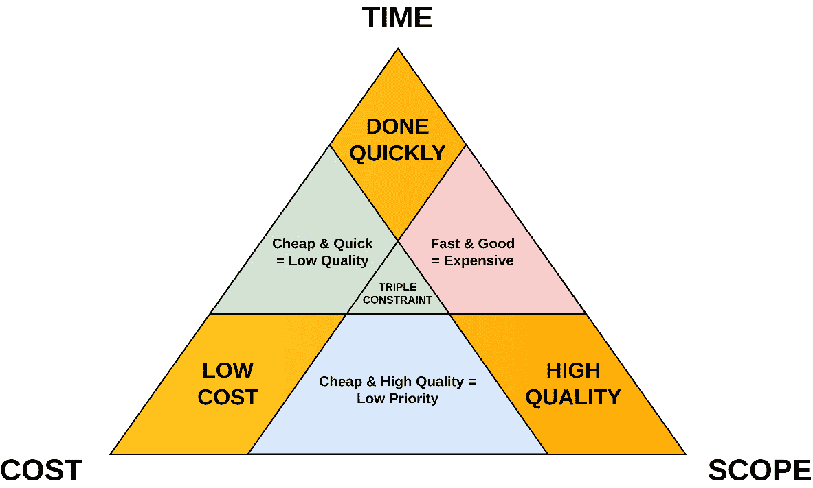
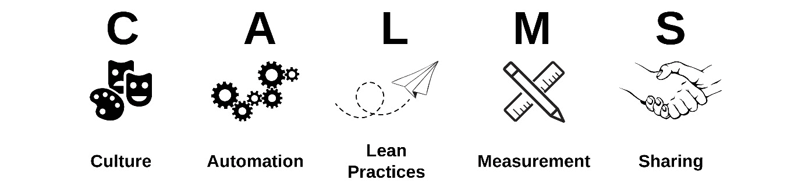
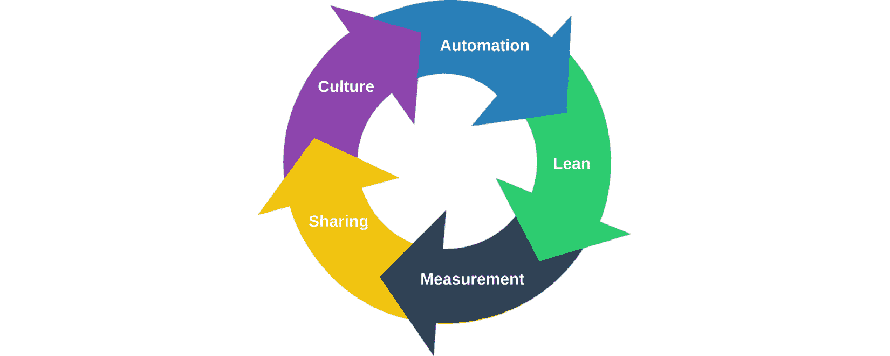

# 第九章：在你的发布管理策略中拥抱 DevOps 文化

当 DevOps 的交付成果被用来定义成功时，可能很难获得高层管理的支持和预算支持。如果高层管理者不了解 DevOps 为他们的客户带来的真正价值，这种情况尤其明显。相反，管理层可能会把 DevOps 误认为是利润的负担，试图为其存在寻找理由，而不是把它视为价值的倍增器和长期战略。在这种情况下，高层可能会试图减少对团队的投资，而不是帮助你增加改善客户体验所需的能力。因此，DevOps 领导者必须建立 DevOps 文化，并通过以客户为中心的结果来定义成功。

构建 DevOps 文化需要周密的规划和统一的方法。首先，获得高层领导的支持，然后组建 DevOps 团队。一旦你的团队成立后，逐步定义流程，并培养协作与持续改进的文化。别忘了提供培训和支持，并庆祝成功的成果。

本章中，你将学习以下内容：

+   更快和更便宜不一定意味着更好

+   DevOps 不仅仅是工具和流程

+   采用 CALMS 方法

+   培养 DevOps 思维需要时间

# 更快和更便宜不一定意味着更好

在 DevOps 发展过程中，某个时刻，似乎突然间，我们成为了一个为所有事情进行成本效益分析的文化。这样做，我们违反了经典的公理：你只能同时满足三个约束中的两个：*范围（质量）*、*时间（速度）* 和 *成本（低成本）*。这就是所谓的**项目管理三角形**或**三重约束**，它表明这三个约束中的任何一个发生变化，必然会影响其他两个；你必须选择其中两个并在第三个上做出妥协。我们往往会引入一些新工具，并试图说服他人它将如何加速进程、节省成本，或者为我们腾出更多时间去做更有意义的任务。然后，我们会发现如果我们通过添加另一个新功能或能力来扩展这个新工具，它能够提高质量，并承诺与现有流程相比，它将带来更可靠的结果：

图 9.1：三重约束图解

在大多数科技公司中，这些论点很容易取胜，因为通过将计算出的节省金额乘以有帮助的团队成员数量，就能得到一个看似合理的结果。然而，发现一个变化的实际效果是一种滞后指标，因为预测新流程在现实条件下的结果极其困难。正因如此，DevOps 文化鼓励持续实验和持续学习。有时候，你永远无法确定一个新的改变是否会奏效，除非先让它经历一段时间的检验。当然，关键在于准确知道何时一个新变化不起作用，并且是时候改变方向了；这既是一门艺术，也是一门科学！

然而，围绕新工具实施的潜在效益有多大，来为其成本辩护，的确很容易构建一个故事。现实是，你无法从这些投资中获得任何竞争优势，因为你的竞争对手也能进行同样的投资。在这种情况下，你认为自己正在取得的任何收益，实际上是不可持续的。相反，你只是在通过与竞争对手保持平行而站稳了脚跟。遗憾的是，这类投资的决策往往是由高层管理人员单独做出的，并且通常只考虑狭窄的利益群体。在这种情况下，开发人员常常被牺牲，作为“成本削减措施”的替罪羊。

既然我们已经强调了*三重约束*的含义及其对软件开发的影响，接下来我们来讨论一些策略，帮助你平衡质量、速度和成本之间的竞争优先事项。让我们首先关注创建新软件的最重要方面：质量。

## 永远不要在质量上妥协

由于当前世界形势的变化，企业比以往任何时候都更加需要削减开支。鉴于预算限制在很大程度上影响着大多数领导者的决策过程，剩下可以谈判的因素就是产品（或服务）的质量或产品的速度。

基于客户在竞争激烈市场中的期望，你不应妥协于质量。当你放松质量标准时，不仅会损害产品的形象和整体可靠性，还会在后期维护阶段以额外的成本反噬你——特别是在维护阶段。简单来说，任何通过放松质量标准、没有认真设计产品而省下的前期成本，都会在未来以巨大的规模回头威胁你的产品和服务的成功。现在我已经表明了我的立场，作为专业人士，我们必须在严苛的财务约束下交付高质量的产品和服务。这让我们只剩下最后一个选择：速度（velocity）。

显而易见，实现最佳速度和卓越标准在很大程度上依赖于你的团队与商业目标和已知需求的对齐程度。此时，应该清楚地意识到，在它们的最大潜力下同时实现这两个目标并不现实。然而，你有机会在不完全削弱其中任何一方的情况下，创造一个可接受的平衡。正如之前强调的，**质量保证**（**QA**）测试在实现这些相互竞争的优先事项之间的平衡中至关重要。通过实施 QA 和软件测试，同时与 DevOps 发布管理结合，你可以实现更快的市场渗透，同时优化产品的价值。因此，必须在整个 SDLC 中无缝集成自动化质量保证方法，确保它们始终得到适当的关注。随着公司发展，努力进行持续测试，以显著提高产品的质量。这不仅会让你的客户感到满意——它还将维持他们对你业务的忠诚。效率可以让你快速进入市场，但确保高标准则能确保持久的成功和客户的满意。花些时间为你组织的独特需求和持续盈利能力发现完美的平衡。

以下是一些能让实现这一目标更成功的要点：

+   在启动项目时，必须从一开始就建立一个全面的**QA**计划。这种前瞻性的做法确保了有效评估和验证项目交付成果所需的资源到位。在将 QA 规划纳入项目初期阶段时，建议避免无有效理由忽视最佳实践。

+   **自动化测试**是一种宝贵的实践，特别是在执行回归测试时。通过采用自动化测试，软件开发团队可以将时间用于新特性开发，而自动化测试则处理验证现有功能的过程。这种方法确保了先前实现的功能在整个软件开发生命周期（SDLC）中保持完好且可用。

+   **并行测试**是一种技术，涉及同时运行多个脚本，而非按顺序执行。这种方法可以大大缩短执行各种类型测试（包括单元测试、冒烟测试、回归测试和跨浏览器测试）所需的时间。通过利用并行测试解决方案，组织可以优化测试流程，实现更快速、更高效的结果。

+   **结对编程**，也称为双人编程，是一种协作的软件开发技术，其中两名程序员在同一工作站上共同处理同一个任务。这种方法不同于传统的代码审查，后者通常是一个程序员在编写代码之后审查另一个程序员的代码。结对编程的目标是通过发挥两个人的优势和专业知识，提高生产力和效率。通过共同工作，程序员可以在更短的时间内实现传统单独编程的相同好处。

+   **测试驱动开发**（**TDD**）是一种软件开发方法，提供了减少市场发布时间的可行解决方案。通过将测试过程从开发后活动转变为开发阶段的一个组成部分，TDD 提供了一种有益的替代方案。这种方法强调在编写实际代码之前先编写测试，以确保代码满足指定的要求并通过测试。通过采用 TDD，开发者可以简化开发流程，及早发现并修复问题，最终加快将产品推向市场的时间。

通过使用这些建议，你的项目可以有效地调和低成本、快速和高质量之间的冲突目标，从而超越这两者之间的分歧。自然地，你必须在项目规划的初期阶段考虑对项目的整体影响。

## 项目时间表是可以协商的。

在大多数情况下，项目时间表是可以协商的。客户期望、市场压力、内部财务目标以及与竞争对手的对标是常见的非合理截止日期来源；在某些情况下，它们可能会影响到整个项目。通过确保期望的正确对齐，项目或改进计划的排程和组织过程变得更加简化。这使得在不需要将客户最初预期成本翻倍的情况下，有可能在一半的时间内交付预期的成果。通过确定交付优质项目的理想时间框架，同时遵守受限的速度，你可以优化应对这一挑战的方法。这可以有多种解释，超出了本书的范围。

然而，在实施这一平衡时，必然会出现一些权衡。在某些情况下，它可能会妨碍产品团队在频繁且快速的迭代中交付产品，并根据精确的客户需求量身定制。此外，将速度与质量相协调会限制团队迅速优先处理变化需求的能力。一个常见问题是使用较大的队列，这可能导致与管理积压、机会成本和复杂性增加等因素相关的技术债务的积累。然而，在这种情况下仍然存在希望，通过简化运营框架的过程，可以明显看出，影响团队效率的主要限制因素是队列的大小。接下来的阶段需要你调查一些方法，例如看板（Kanban），来改善瓶颈所在的区域。目标是增加可扩展性，同时遵守之前阐明的质量和低成本限制。

## DevOps 中的感知问题

当被问及时，许多技术高管会承认，他们对 DevOps 发布管理计划的进展感到失望。在这种情况下，他们至少将 15% 或更多的工程预算花费在与其核心业务模式无关的事项上，而他们并没有看到足够的费用合理性。这些高管最初投资于 DevOps 转型的原因是为了提高创新性、独特性和竞争优势。另一个对这种感知产生负面影响的因素是，大多数业务高管不清楚为什么 DevOps 如此难以理解，或为什么其实施成本如此之高。

经过进一步调查，一位训练有素的眼光可以迅速判断，DevOps 本身并没有真正的问题。换句话说，多个因素限制了这些高管在 DevOps 工具上的投资所能实现的商业价值，以及他们的软件和 DevOps 工程师的生产力。这些因素包括速度、成本、人员配置和认知。此时，关键绩效指标如部署频率、交付时间、**恢复的平均时间**（**MTTR**）、缺陷率和客户满意度有助于衡量 DevOps 实践的影响。

在速度方面，具有讽刺意味的是，DevOps 有时被视为减慢软件开发速度的瓶颈，影响那些仅仅在努力跟上客户需求的运营团队。多个因素影响着这些努力的生产力流动，但在许多情况下，对进展或现实结果的可见性不足是感知延迟的主要原因。为了提升交付速度，团队必须首先通过收集数据和指标来获得他们的 DevOps 表现的可见性。通过改善可见性，团队可以将他们的表现与市场上其他团队或组织进行比较，最终目标是识别交付管道中的低效环节。

关于费用，部署云应用相关的总运营成本有时未能满足高管们的期望，他们认为采用 DevOps 将会提高效率、速度和成本效益。如果 DevOps 占据了预算的四分之一以上，DevOps 可能会被归咎于预算预期和实际支出之间的偏差。原因在于，当 DevOps 团队将大量宝贵时间用于处理紧急事务或手动构建和更新部署环境时，他们无法有效地优化成本或应对新出现的问题。这是因为他们没有足够的时间同时完成这两项任务。为了优化开发工作，建议投资于强大的 DevOps 实践，特别是通过尽可能引入自动化来简化操作。这将有助于解决执行和管理这些协议所带来的费用和复杂性问题。

雇佣团队的成本是制定策略时需要考虑的另一个因素。由于合格的 DevOps 技术人员成本高昂且稀缺，可能很难在短时间内迅速扩展团队以应对日益增加的需求。即使是那些幸运地拥有合格 DevOps 员工的公司，也必须投资于招聘工作和提供晋升机会。此外，这些公司通常需要应对高员工流动率，这使得需要更多的没有经验的员工来响应客户需求。

公众对你们的业务、产品和服务的印象应该是另一个需要考虑的因素。许多公司高管误以为开发和发布云原生应用程序应该比实际情况更直接、更省时且更便宜。软件开发者、消费者和公司高管可能由于缺乏对 DevOps 发布管理实践的经验，尤其是如果他们观察到像 Google、Capitol One 和 Etsy 这样的受人尊敬的公司如何处理云原生应用程序的交付时，会产生这种印象。

几乎每个人似乎都认为将软件应用程序交付到云端会很容易，但很少有人理解在将云软件分发做到像著名的 FAANG 股票公司那样简单和自动化时需要付出多少努力。然而，几乎所有较小的**软件即服务**（**SaaS**）提供商都无法拥有足够的资本进行与这些大公司同等规模的投资。尽管如此，具有突破性潜力的创新产品和服务将变得更加便宜并且更易于实现，并将不时进入市场。每天，新的革命性解决方案，如 Kubernetes，都在不断诞生，极大地赋能所有利益相关者。

FAANG 股票公司

五家著名的美国科技公司——Meta（前身为 Facebook）、Amazon（AMZN）、Apple（AAPL）、Netflix（NFLX）和 Alphabet（GOOG）——在金融圈中被简称为“FAANG”。截至 2022 年第一季度，五只 FAANG 股票的总市值超过了 7 万亿美元，使它们不仅在消费者中非常受欢迎，也是全球最大的公司。

所有 FAANG 股票都属于标准普尔 500 指数，并在纳斯达克交易所交易。作为市场的广泛反映，市场的波动与标准普尔 500 指数的走势一致。在 2023 年 8 月，FAANG 股票的市值约占标准普尔 500 指数的 20%。当你意识到标准普尔 500 常被用作整体美国经济的代表时，这个比例非常惊人。

这就是我们对三重约束的探讨以及你可以用来应对质量、速度和成本竞争优先级的策略总结。正如你所见，这些因素对公司盈利能力、稳定性和文化有着重大影响。接下来，让我们讨论为什么 DevOps 不仅仅是工具和流程。剧透——DevOps 发布管理中最重要的一个方面是人！

## DevOps 不仅仅是工具和流程

这可能是一个不太受欢迎的观点，但依赖工具并不会将你的 DevOps 计划带向成功。那些取得卓越成果的 DevOps 团队，首先注重通过人和流程解决挑战，然后通过使用工具来提高工作质量，而不是采取相反的做法。

这种目光短浅的观点可以通过购买某些东西来说明，购买的初衷是提高团队生产力，最终导致流程改进。更明智的做法是将资源分配给方法论，例如 DevOps 发布管理，然后获得资源和教育，影响更多的利益相关者。这个例子中的反复缺陷是，人们总是专注于他们的技能。在这种背景下，普遍的看法是，一个人的价值由他们对所有工具和流程的理解程度来定义。令人难以置信的是，许多 IT 公司的领导人提出担忧，认为现有员工缺乏所需的技能，因此招聘外部人员被视为唯一的解决办法。在这种情况下，高层管理将员工视为去人性化的齿轮，参与到单纯以利润为驱动的机器中。在这种情况下，专业人员被简化为人力资本，仅仅是一个聚集了技能的集合体，提供的工作范围狭窄，且无法看到他们与价值流其他部分的关系所创造的价值。

表现卓越的团队首先克服了 DevOps 转型背后的人员挑战。这包括找到一种方式，以最适合团队整体工作流程的方式实施 DevOps 发布管理的标准特征。具体来说，包括 CI/CD、自动化测试以及详细的监控和分析等核心要素。没有任何组织可以选择一种通用方法来应对 DevOps 实施中的障碍，但高效团队之间的共同点揭示了一些显著的趋势。区别高效团队和低效团队的决定性特点是专注于提升团队成员技能的做法。这可能包括为同事提供某些认证的奖励，或者提供在线教育资源的访问权限，类似的方法也是有效的。公司不能忽视沉浸式学习的方法，因为这些投资比那些没有采用这种方法的公司更为成功：

图 9.2：一个 DevOps 团队在协作工作

组织可以建立内部社区，推动教育并提高对员工或产品线调整的韧性。这有助于识别广泛的内部冲突，促进更具合作性的环境。高效的团队利用实践社区，由少数专注的专业人士组成，他们有共同的兴趣，通过持续互动不断提升技能。此外，高绩效团队通常会参与草根 DevOps 活动，并开发概念验证来解决公司独特的挑战。团队成员可以通过实践培训更好地理解同事的责任，而战术策略可以通过内部小组讨论和新闻简报来制定，成功故事也能得到分享。成熟的 DevOps 采用者努力避免知识孤岛，并致力于加强软技能，如有效地分享信息，以便能够继续开放合作。

在整个组织内推广知识非常重要，使其对每个人都能访问。高度成功的 DevOps 团队会努力提供指导机会，提升软技能，并采用一系列相关方法。

本节故意简明扼要，特别是为了避免稀释优先考虑依赖于团队成员以实现成功结果的核心观点——不仅仅是在 DevOps 中，而是在任何项目中。现在我们已经做出了这个重要的区分，接下来我们将研究**文化、自动化、精益、衡量与共享**（**CLAMS**）方法。这个战略框架将提升你团队成员的个人成功，帮助他们实现最大的潜力。这一策略的副作用是显著增强你业务实现战略目标的能力。这种协同效应是 DevOps 方法的标志，它源自所有利益相关者之间的互惠互利关系。

# 采用 CALMS 方法

CALMS 是一个概念框架，用于促进 DevOps 团队、职能和系统在组织内的无缝集成。CALMS 框架提供了计算机科学领域的成熟度模型，帮助管理者评估组织实施 DevOps 的准备情况。它使管理者能够识别需要改进的领域，从而实现准备工作。值得注意的是，CALMS 方法归功于*Jez Humble*，他是《*DevOps Handbook*》的共同作者之一。

CALMS 框架的 DevOps 包含五个基本原则：

+   **文化**：这包括集体问责制的主流理念。

+   **自动化**：团队成员积极寻找机会实施自动化，简化和优化各种流程，同时拥抱持续交付。

+   **精益实践**：与同时处理多个任务不同，专注于一次处理较少的任务。精益强调通过可视化工作来提高协调和协作。特别需要注意的是，管理队列长度和等待处理的任务积压非常重要。

+   **衡量**：这一点至关重要，因为它可以收集有价值的信息，确保全面了解操作环境。这些机制使得数据能够系统地收集，从而有助于更深入地理解各个过程和系统。

+   **共享**：开发和运维之间共享简单的沟通渠道促进了持续的双向对话。这些沟通渠道旨在促进 DevOps 团队之间的持续合作：

图 9.3：CALMS 方法在 DevOps 中的 infographics

CALMS 框架有时被视为 **IT 服务管理**（**ITSM**）的替代方案，后者是一种为组织开发、交付、管理和增强 IT 利用的战略方法论。**ITSM** 是与 **信息技术基础设施库**（**ITIL**）常常相关联的框架。一些 IT 管理员认为 ITSM 过于僵化，因此与 DevOps 实践存在不兼容的情况。CALMS 框架通常被视为有效管理并调和这两种不同策略之间差异的一种方式。

## 文化

尽管 DevOps 是基于运维人员和开发人员之间的增强沟通，但最初并不要求这两个小组与业务之间进行合作。然而，在文化层面，CALMS 模型旨在确保整个组织都认同实施 DevOps 的原因以及与该工作相关的期望。

CALMS 模型强调技术的根本目的，即实现预期的结果。它突出了一个观点：技术应该仅仅用于支持和促进业务运作，而不是仅仅为了跟上最新的技术进展。在 DevOps 转型的初期阶段，促使业务、开发和 IT 运维团队之间的合作至关重要，这有助于获得对实施新项目管理和交付实践的广泛支持。

为了确保持续项目的资金和支持，这些项目将在长期内产生回报，这种合作需要建立在与业务团队的非技术性对话基础上。技术团队必须向业务方明确能力、成本和时间表的参数，并确保这些认知是准确的。

## 自动化

如果没有引入自动化实施 DevOps 是不可取的，因为它会降低过程的效率和效果。然而，值得注意的是，低质量的自动化会在没有充分考虑的情况下强行进行更改，这可能会进一步加剧规划不周带来的负面后果。虽然 DevOps 强烈与持续开发和交付方法相关，但同样重要的是采取措施，以防止因测试不足而部署有缺陷的代码。CALMS 框架提倡实施一个强有力的测试制度，该制度不会对 DevOps 工作流造成显著延迟。

提前实施自动化往往会产生适得其反的结果。在 DevOps 实施的初期阶段，你应该坚持手动流程，随着相关团队逐渐适应 DevOps 方法论的复杂性，逐步引入低风险的自动化。等到 IT 人员对组织内采用的工具有了更深的理解，风险降低后，团队应当进阶使用更复杂的自动化工具。

## 精益

为了减少自动化可能对性能造成的不利影响，必须在企业内部建立对*精益*的共同理解，精益原则源于 20 世纪 80 年代的精益生产理念。尽管精益软件开发主要强调提高效率和减少浪费，但要注意，采取捷径并不符合精益方法论的原则，反而会引入可避免的风险。

精益方法要求你为组织确定一个适当的风险概况，明确你希望通过 DevOps 项目实现的成果，并消除任何不利于实现这些成果的程序。这个过程应该是学习和迭代的过程，其中一个项目中学到的经验应当被运用到其他项目中。举例来说，应该识别、记录并移除那些导致不良结果的过程部分，以便在后续项目中避免。

类似地，任何导致挑战的行动都应被视为学习机会，而不是重复犯同样的错误，希望能取得不同的结果。这种学习通常会在 DevOps 转型初期的几个项目中发生得最快，因为这是发现并消除最多浪费的最佳时机。

## 测量

为了有效采用 DevOps 方法论，组织必须认识到使用度量和监控工具的重要性，以便洞察正在进行的过程和结果。如果不利用这些分析手段，转向 DevOps 的学习潜力将无法被激发。为了有效监控**关键绩效指标**（**KPI**）和预期结果，必须建立以业务需求和目标为中心的工具。在商业领域中，有必要采用能够有效衡量成功的度量。这些度量应该包括财务指标和必要能力的评估。通过采用这种全面的方法，组织能够以与业务的总体目标和目标一致的方式来确认他们的进展和成就。

在采用 DevOps 方法论的初期阶段，组织将遇到一个范式，其中监控和衡量作为识别和定位问题区域的有价值工具。通过建立基线并将度量和监控纳入持续改进的演变，可以加速企业的 DevOps 之旅。

## 分享

这包括确保所有参与 DevOps 过程的各方保持意识，通过持续提供实时信息和关于正在进行的活动和事件的更新。大多数 DevOps 工具都包含反馈回路，涵盖了操作和开发团队，通常还会扩展到支持人员。

然而，必须牢记，所执行的行为通常是服务于企业的。IT 团队负责确保业务保持对当前事件的了解，以及项目的预期结果。这将我们带回到*协作*步骤，强调 CALMS 系统遵循的是一个循环过程。

## 采用 CALMS 进行 DevOps 时需要牢记的事项

为了确保 CALMS 模型的成功实施，必须采取循环的视角。如果忽视将**CALMS**视为一个循环过程，必然会导致实施失败。这个概念围绕着知识的不断获取以及提升组织对 DevOps 方法论的运用。推荐的改进应该一开始展现出显著的规模，并随着组织及其 DevOps 能力的提升，逐渐转向较小的、增量式的变化：

图 9.4：将 CALMS 方法描述为一个循环过程

需要注意的是，CALMS 是一个框架，而非工具集合。在 DevOps 领域，遵循 CALMS 原则的组织被赋予了在选择集成到 DevOps 流水线中的工具时的灵活性。上述工具包括来自 Atlassian 和 HashiCorp 等知名供应商的产品，以及 Git、Puppet 和 Jenkins 等开源 DevOps 工具。考虑到这一点，值得重申 DevOps 强调以人为本，而非工具优先的原则。

CALMS 框架虽然本身具有价值，但不应视为替代其他能够有效提升 DevOps 领域控制水平的开发哲学和系统。敏捷方法论，例如 Scrum 和 Kanban 等方法，提供了建立一致且强健的 DevOps 实施框架。总体而言，CALMS 框架作为评估公司 DevOps 实施成熟度和效果的有力工具。

现在你已经理解了 CALMS 方法的战略重要性，以及如何利用其灵活性来协同工作流程，让我们来讨论 DevOps 思维方式。采纳 DevOps 思维方式要求团队理解 DevOps 的长期和即时优势，并且意识到他们可能需要改变自己的过程、视角和耐心，以适应实现这些成果所需的时间。

# 培养 DevOps 思维需要时间。

重要的组织变革应 ideally 分阶段进行，否则可能会产生抵抗或混乱。快速挑战群体思维可能会导致一种叫做文化冲击的强烈体验。

拥抱 DevOps 文化需要获得来自各个层级个人的共识和支持，包括开发人员、系统管理员、安全专家以及高管等。团队必须理解 DevOps 的持久和即时优势，并且他们可能需要看到过程中的变革。确保这些变动得到充分文档化并有效沟通给所有相关人员。除非同事们认同 DevOps 的基本原则，包括效率、适应性、持续学习和统一性，否则生产力可能会受到负面影响，甚至会有更多不良后果。

已经采用敏捷方法论的组织是实施这一文化转型的理想环境。在 DevOps 领域，团队倾向于采取响应性和主动性措施，而非迟缓和被动的方式。DevOps 文化强调优先考虑客观的改进，而非主观和自我中心的做法。培养以团队为先的精神对于提高生产力和项目各阶段的整体进展至关重要。虽然转型可能不会立即发生，但预计结果会是无可否认的有利。

一个常见的误解是认为文化可以从一开始就启动或建立。与一些人的观点相反，值得注意的是，从内部发展文化具有重要意义。然而，普遍认为文化在许多情况下可以视为滞后指标。操作实践的变化会导致文化的改变。团队工具集的变化也有可能引发文化的转变：

图 9.5：保持耐心——建立 DevOps 文化需要相当长的时间

改变文化需要大量时间，因为它需要转变观点和策略，使其能够有效工作。尽管个人可以立即开始使用新工具，但组织可能需要数年时间才能在其实施中看到任何成熟度的体现。事实上，一些公司自 2016 年或更早就开始实施 DevOps，并认为自己仍处于不成熟的状态。

文化的发展不是刻意的构建，而是一个自然和自发的过程。所讨论的现象逐渐显现出来，是各种人类互动及其后续变化的累积结果。这些变化通过获得以前无法获得的新操作能力来促进，并且相应地授权去探索这些能力。

但并非每个人都持这种观点。根据一些顾问和实践者的说法，若从文化目标出发，能更容易看到程序、方法和工具集需要如何改变。然而，由于组织优先级、竞争力量、消费者期望、内部动态和技术的变化，即使有周密的过渡规划，转变也可能会发生。

无论公司采用何种策略来培养软件工程师和运营人员之间的协作文化，都必须认识到，任何技术手段在初期都会产生缓慢的效果。文化转型是一个渐进的过程，通常起始于普通人在本地层面的努力。一个有效的策略是识别出工程社区中的杰出大使，并支持他们在同事中推广这一事业。

实现 DevOps 成功需要全面理解，没有一种单一、简单的方法可以实施组织变革。文化转型面临重大挑战，因为不同企业和利益相关者的市场需求、行业考虑、资源限制以及对变革的接受程度各不相同。本书为启动开发与运营整合过程提供了宝贵的建议。然而，每个组织必须独立确定其独特的文化框架，以实施成功的 DevOps 转型措施。

# 总结

这标志着*第八章*的结束。此时，你已经清楚理解为什么更快和更便宜并不总是意味着更好。你还知道，DevOps 不仅仅关乎工具和流程——它首先关乎人。此外，你已经了解了 CALMS 方法，这是一种促进 DevOps 团队、职能和系统在组织内无缝集成的概念框架。最后，你现在应该能够清晰地阐述为什么发展 DevOps 思维需要时间。实现 DevOps 旅程的成熟状态可能需要数月甚至数年的时间。

在下一章，你将学习从领导和利益相关者那里获得支持的样貌。你将了解到为什么 DevOps 文化必须展现出高度的耐心、信任、道德和赋权。你还将发现为什么围绕员工和技术投资的紧密战略对齐至关重要。最后，你将学习如何将客户反馈融入你所做的每个决策中。

# 问题

回答以下问题，测试你对本章内容的理解：

1.  项目管理三角形的三个元素是什么？

1.  削减产品质量会带来什么后果？

1.  配对编程包含哪些内容？

1.  精英 DevOps 团队首先关注的是什么？

1.  问题

1.  *CALMS* 缩写代表什么？

1.  哪些敏捷方法与 *CALMS* 框架互为补充？

1.  精益工程实践的核心原则是什么？

1.  成功地拥抱 DevOps 文化需要从谁那里获得共识和支持？

1.  为什么文化转型会面临重大挑战？
