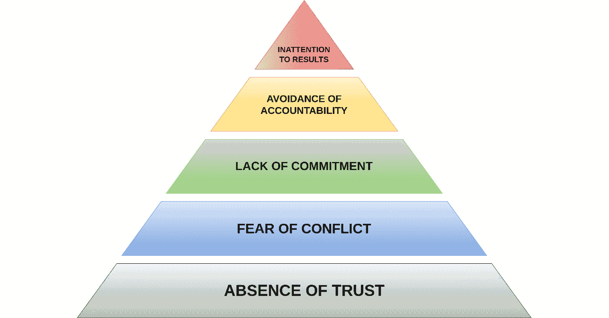

# 第十章：从领导层和利益相关者那里获得支持是什么样子的？

建立一个强大的 DevOps 文化需要组织中领导层的坚定支持和积极参与。如果这些人没有全心全意支持并投入到 DevOps 项目中，项目很可能会失败。毫无疑问，以协作和沟通为核心的文化的形成依赖于有效的领导力。领导者在创造一个消除障碍、积极鼓励跨团队协作的环境中起着至关重要的作用。组织的领导者需要充当 DevOps 的布道者，积极倡导 DevOps 的原则和优势。他们必须有效地传达实施 DevOps 发布管理的理由以及它对所有利益相关者的潜在好处。

与此同时，领导层在尝试仅仅基于从文献中获得的理论知识实施 DevOps 时需要保持谨慎。DevOps 是一个动态的、迭代的过程，经历着持续的增长和演变。为了让领导层能够培养出合适的文化，他们必须意识到这需要大量的培养和毅力。DevOps 方法论或任何一个 DevOps 团队都不是完全相同的；相反，它是一个针对特定组织、以解决方案为驱动的方法论。领导者应当为自主团队的蓬勃发展铺平道路，提供他们成功所需的工具，并认识到何时应当退后一步，允许团队作为受尊敬的专业人士执行他们的工作。

在本章中，您将学习以下内容：

+   在人员和技术上的投资要精巧对接

+   为什么授权、道德、信任和耐心被高度重视

+   提供团队自主权、所有权和共同责任

+   使客户反馈成为每个战略的核心

# 在人员和技术上的投资要精巧对接

在技术、人员和决策投资方面，所有业务单元，包括董事会和 CEO，必须具有强大的战略一致性。实现成功的 DevOps 转型需要建立**关键绩效指标**（**KPIs**）来充分衡量成功，并促进更加开放和诚实的公司文化。利用数据客观地支持你的决策是推动公司文化发展的最佳方式，这种文化中权力下放、伦理、信任和耐心都受到高度重视。作为组织中的领导者，你必须为团队提供自主权、责任感和共享的责任。同时，你必须理解在所有面向解决方案的倡议中将客户放在首位的重要性，并积极寻找将客户反馈融入每个决策的方式。组织文化、领导力和流程的所有方面都应遵循这些原则。

在进行 DevOps 转型时，变革应从高层推动，同时也应从基层开始。没有自上而下的支持，文化变革是不可能实现的。然而，直到变革在最小的可能层面得到实施，它才会在整个企业中扩展。通过在团队层面实施 DevOps，团队能够展示可能性，识别障碍并克服它们，同时在问题仍然较小且可以在初始阶段管理时解决它们。有效的转型往往不是通过一次性的大规模实施来完成，而是通过持续进步的过程来实现。

在任何 DevOps 转型中，正是 DevOps 团队为一切后续工作奠定了基础，而组织领导层则充当他们的助力。每个小组在开发和发布卓越软件的潜力与他们作为团队协作的效果成正比。所有团队成员必须准备好共同工作并进行良好的沟通。为此，所有参与者，包括开发人员、测试人员、运维人员和安全专家，必须树立一种优先考虑协作以实现共同目标的心态。

虽然前沿技术显然不是有效团队合作和成功的 DevOps 转型所需的唯一因素，但它是必要的。例如，DevOps 发布经理需要像 Atlassian Jira 这样的工具来实现端到端的问题追踪，或者像 SigNoz 这样的工具来进行全面的应用监控。为了确保 CI/CD 操作的成功，所有团队成员必须能够访问能够最大化其对交付过程贡献的资源。同时，团队成员还需要像 Slack 这样的资源，以便进行直观的沟通，协同工作环境。

在组建工具和技术时，需要考虑的一个重要因素是确保实施的系统能够提供显著的自动化水平。如果缺乏全面的自动化，团队成员将不得不执行大量的手动和重复性操作。这可能会妨碍操作效率，引入错误，并导致部署环境之间的差异。一个值得注意的例子是名为 Snyk 的安全工具。它会对你的代码、开源依赖、容器镜像、**基础设施即代码**（**IaC**）配置和云环境等多个方面进行自动化漏洞测试。Snyk 还提供有价值的上下文、优先级和修复选项。自动化促进了操作的标准化，并使团队成员能够将精力集中在改进和创新上，从而提高软件质量、加快交付速度，并提升职业满足感。

成功的一个领先指标是各级商业高管能够充分理解技术及其应用者的重要性。最睿智的 CEO 们知道，他们在投资人力和技术方面所做的选择，都会对客户的繁荣以及现有和未来的商业模式产生重大影响。考虑到新技术堆栈和工具频繁进入市场，并且这种变化可能对团队成员产生影响，这可不是一项轻松的任务。简而言之，最成功的高管提供了一个全方位的商业视角，涵盖了人员、流程、信息和技术。

既然我们已经讨论了有效对齐组织的重要性，那么接下来我们来关注一个极为重要的责任——赋能你的团队。

# 为什么赋能、伦理、信任和耐心是高度重视的

每一个优先考虑 DevOps 发布管理的成功公司，都会由领导力推动强大的企业文化。这些文化围绕着责任感、持续学习、团队合作和实验等价值观展开。文化具有强大的影响力，通常决定了哪些人员被招聘以及他们被分配到哪些团队。在 DevOps 领域，存在着一种文化趋势，推动通过有意义的工作实现组织内的重大影响力。在这些情况下，失败不被视为损失，而是向发现正确解决方案的进程迈进。

值得注意的是，DevOps 文化的特点是显著的耐心、信任、伦理和赋能，同时对浪费、低效决策和官僚主义的容忍度较低。所有领导者必须秉持的一个基本美德是培养对新想法的开放性和尊重，无论这些想法看起来多么不拘一格。

## 在 DevOps 环境中的沟通

在 DevOps 环境中，成功沟通的关键是团队成员之间在各个层次上的相互尊重和信任。这要求尊重互补和对立的个性特征。每个人都应得到信任和尊重，无论他们的文化背景、个人经历、学习方式、解决问题的能力、教育或工作经历如何。当团队成员在互相支持和鼓励的氛围中一起工作时，他们会逐渐建立信任，尽管这需要一些时间。

幸运的是，团队成员通过教育和培训计划有机会相互建立尊重和信任。他们可以学习更加体谅地倾听彼此，并通过练习正念来克服人际争执。例如，员工需要感到在工作场所中受到领导的尊重和重视。如果员工看到上级没有给予同样的尊重，他们就不太可能相互以尊严对待。没有团队能够在不断指责或未能认可成员贡献的氛围中茁壮成长。必须在组织的各个层面融入相互尊重和信任的文化。

作为 DevOps 工程文化的一部分，团队必须掌控之前由其他部门处理的任务。拥有将变更推向生产环境的权限要求工程团队确保通过在流程中实施控制措施来保证测试、风险管理和升级方法的到位。从一开始，控制就必须是流程的一部分，领导层必须支持这一点。自动化是一个巨大的福音，但数字化日常繁琐、耗时的活动只是拼图的一部分。目标是重新思考控制的实施方式，使其在流程中自然发生，而不是依赖外部力量的推动，从而消除瓶颈、官僚主义和象牙塔。

公司长期以来依赖基于审计的控制框架来建立信任，目标是通过使用检查表和审计来提升质量、保证、安全、合规性和风险降低。DevOps 发布管理方法则有所不同；自动化在 DevOps 文化中发挥着至关重要的作用，帮助促进自动化流程在商业和技术领域的采用、接受和整合。在这些公司中，自动化并不被视为风险，而是作为一种战略优化方法，为职业发展和提升提供了机会。领导层可以信任产品团队通过使用自动化控制功能来关注组织范围的概念和标准。建立信任需要时间，但当团队合作并通过小规模试点展示成功后，通常会迅速实现。有了这种信任，产品团队将能够在不危及公司安全或彼此和谐的情况下，做出正确的改变。

## 理解为什么建立信任是成功的关键

改变企业文化是一项艰巨的任务，这也许可以解释为什么最初优先考虑自动化和监控活动会更为方便。实施 DevOps 的最大挑战之一就是改变公司文化。你必须与那些可能需要调整根深蒂固的习惯的人合作，这些习惯经过了很长时间的培养，可能跨越了几十年。或许正是这些习惯使他们取得了如今的成就，并赢得了尊重。建立一个以自主和赋能为核心的新组织文化，需要花费大量时间，尤其是通过改变习惯来实现这一点。事实上，几乎不可能预测确切的时间或完成日期。

幸运的是，大多数专业环境中的个体倾向于独立工作。他们欣赏能够做出独立选择的能力。他们有强烈的愿望提升自己的技能，并在工作中找到意义。那么，问题是：我们如何实现这一目标？你可以采取哪些步骤来确保公司文化与当代企业的需求保持一致？信任在促进你的 DevOps 转型中扮演着至关重要的角色。

在本节中，我们将讨论缺乏信任会给你的组织带来的结果。帕特里克·兰乔尼在他的书《*团队的五大功能障碍*》中指出，缺乏信任是众多组织问题的根本原因：

图 10.1：团队的五大功能障碍，帕特里克·兰乔尼著

例如，在*Bold Ventures LLC*公司，一个缺乏信任的公司中，个人往往会避免面对冲突。员工避免参与具有挑战性的讨论和决策，可能是因为害怕发声。因此，未积极参与决策过程的个人可能不会全力以赴地投入到商定的目标中。像*他们决定*而不是*我们决定*这样的说法，常常被用来强调在决策过程中缺乏积极参与。因为*这是他们的选择*，而不是*这是我们的选择*，同事们避免为自己不专注的事务负责。最终，如果员工没有参与决策过程或后续的行动，他们可能不会把公司业绩放在首位。

没有信任的组织最终会浪费宝贵的资源。尽管聘用了聪明的员工并提供了具有竞争力的薪资，*Bold Ventures LLC*仍然难以充分发挥整个劳动力的潜力。在前面的例子中，由于团队已完全自动化了他们的 CI/CD 流水线，因此部署非常简单且迅速。尽管高水平的自动化带来了显著的效率提升，但公司文化却禁止他们对生产系统进行任何修改，除非通过正式的审批流程。

你无法为信任定价。无论我们是否体验到信任，我们都会意识到它的存在或缺失。杜安·C·特威博士在 1993 年发表了一篇关于这一主题的开创性文章，标题为《信任的构建》。在文章中，特威博士将信任定义为“*与某人*或*某物*进行无防备互动的准备状态。”

根据特威博士的观点，构建信任只有*三个*主要组件：

+   **信任的能力**由你之前的经验对你当前准备和能力的累积影响所决定，这些能力使你能够在信任他人时承担风险。

+   **能力的感知**指的是你对自己和同事在当前情况下有效完成必要任务的能力的评估。

+   **意图的感知**指的是你能否感知到行动、言语、方向、使命和决策是否由有利于双方的原因驱动，而不是单纯为自己服务的动机驱动。

虽然信任对每个人来说都是主观的，但信任文化则关乎整个企业。DevOps 发布管理为检验特威博士的信任概念提供了一个绝佳的机会，可以发现逐步提升开发、运维及公司其他团队间信任的微小却重要的机会。要实现这一点，贵公司的文化必须具备以下特征：

+   进行清晰直接的沟通

+   增强人际互动

+   承诺履行义务

+   强调主动倾听的重要性，而非过度讲话

+   定期分享知识

+   鼓励参与和反馈

+   承认错误

+   尊重彼此的成功

成功的 DevOps 转型需要深入理解文化，并建立基于信任的组织结构。寻找其他方法，在你的组织中培养一种*准备好与某人或某物进行无防备互动的状态*的文化。努力通过与开发和运维团队开展开放透明的对话，增强信任、能力和意图。通过这样做，你可能会惊讶地发现，自己能够多么迅速地开始建立一个有意义和可信赖的工作环境。

## DevOps 组织的领导者需要软技能

在许多领导职位中，人际管理技能常常被低估或忽视。在某些情况下，初创公司中会出现这样一种现象：选择首席技术官或工程负责人时，往往仅根据个人的资历或技术能力来做决定，而很少考虑到他们的人员管理能力或是否愿意承担此类角色。经常会出现这样的情况，DevOps 团队的领导者是根据他们在软件开发中的成就来任命的。然而，这些人往往在必要的非技术性素质上存在不足，包括有效的沟通、冲突解决和协作能力。

自然地，在 DevOps 领导层中，拥有软技能至关重要。这些技能包括批判性思维、项目管理等多种能力，并结合足够的情商。这些技能使 DevOps 领导者能够有效地激励、激发和留住由智能工程师组成的团队。为了有效领导团队，领导者必须能够辨识团队成员的优点和不足。此外，领导者还必须展现出主动倾听的能力，并具备影响他人的能力。通过这样做，领导者可以创造一个培养团队成员成长与发展的环境，从而帮助他们取得成功。在这个职位的背景下，一个显著的挑战是技术能力和人际交往能力的最佳组合，这需要在两者之间找到微妙的平衡。

遗憾的是，软技能在大多数软件工程师的培训和职业晋升中并未得到应有的重视。历史上，这些技能曾被视为可选的，而非各自职位的基本前提。随着时间的推移，软件工程公司更多地强调技术技能的获取和掌握，忽视了这些关键的沟通技能。因此，其他一些能够将软件工程师提升到更高层次的关键方面也被无意义地忽视了。具体来说，焦点常常被偏离了软技能的培养，而这些技能在培养领导能力方面起着重要作用。然而，这个问题比看起来更为复杂，因为许多雇主宣称，大多数大学毕业生在学术期间并未获得这些必备的软技能。幸运的是，在我们所处的现代社会中，关于软技能的认知已经发生了变化，尤其是在招聘新工程人才及其在组织中的重要性方面。

既然我们已经将焦点放在了所有 DevOps 领导者应具备的关键软技能上，接下来我们进一步探讨。在下一部分中，我们将探讨赋予团队成员对工作有个人责任感的价值。这需要在让团队负责的同时，也给予他们自由，让他们对自己负责。

# 提供团队自主权、责任感和共同责任

DevOps 领导者可以通过促进团队的责任感和培养团队合作来赋能团队。然而，关键是要认识到理解和维持每个项目适当的强度程度的重要性。为了防止精疲力尽和敌意，领导者必须具备对实际工作条件、背景以及所需战略方法的全面运营意识。领导者必须知道何时战略性地利用高强度的冲刺，何时应当克制并重新分配资源。换句话说，领导者必须在使用现有资源时做出明智的决策，并考虑到同理心。

在 DevOps 团队中培养自主性、责任感和赋能感是领导者能够为建立一个充满信任、尊重和同理心的氛围所做的最关键的工作之一。团队成员应该能够在充分的自主权下开展工作，以便能够尽可能高效和有效地完成任务。尽管这并不意味着他们可以随心所欲地做任何事情，但它意味着他们可以决定如何提供符合项目整体目标的软件。

在理想的 DevOps 组织中，团队的每个成员都参与到应用程序生命周期的每个步骤，从规划和设计到测试和部署。每个人都关心结果，并且知道他们将从应用程序的高效和快速交付中受益。例如，开发人员不应将发布工作推给运维人员，然后就此袖手旁观。从战略上讲，成功的关键是赋予团队自由和责任，让他们找到如何有效交付应用程序的方法，同时避免复杂的审批流程，避免拖慢运维进程。

随着 DevOps 团队在迈向自主性并承担更多项目责任的过程中，团队成员应逐渐培养对整体运作的高度集体责任感。在当代软件工程的背景下，领导层必须消除开发和运维之间的孤岛现象。相反，必须培养一种深刻的理解，承认这些领域的相互依赖性及其共同致力于实现最佳结果的承诺。为了实现这一点，整个团队必须深刻理解并欣赏客户需求。与此同时，他们还必须全面了解成功开发所需的技术元素。这种各方之间的相互欣赏和理解对于任何项目或事业的成功至关重要。

为了培养集体责任感，领导层需要引导团队远离指责导向的政治，而应专注于以协作努力为基础的有效问题解决和流程优化。在协作工作的框架下，团队成员必须意识到他们各自角色和任务之间错综复杂的相互依赖关系。至关重要的是，要理解在工作中任何失误或错误都可能波及整个团队，影响每个相关人员。同时，必须营造一种氛围，鼓励探索新流程和技术，质疑现有的方法论，而不是因失败的恐惧而退缩。当每个人共同承担某个特定任务的风险时，他们也同时承担了确保最佳结果的责任，同时避免敌对情绪。

既然我们已经强调了在 DevOps 团队中推动自主性、责任感和授权文化的重要性，那么接下来让我们进一步强调这个主题。在下一部分中，我们将讨论如何将客户反馈置于团队每一个行动的核心。

# 将客户反馈作为每个策略的核心

反馈循环在促进现代交付方面起着至关重要的作用。为了建立消费者与 DevOps 发布管理之间的连接，您应该优先考虑用户交付需求，通过增强并缩短反馈循环的时长来优化这一过程。每个 DevOps 流程都应力求实现更快速的响应时间和不间断的发布周期，这些都应由用户需求和使用模式驱动。利用反馈循环将增强您的数据驱动决策过程，使您能够在准确性和快速适应更广泛的事件、因素及需求方面达到前所未有的水平。在这种新的反馈循环驱动的分析背景下，勇于探索和好奇的人将成为创造价值的领导者。

## 什么是反馈循环？

系统思维的一个基本原则以及贵公司成功的关键组成部分是理解并正确应用 DevOps 反馈循环。作为领导者和 DevOps 专家，您的主要目标应是尽可能减少开发和 IT 流程之间的摩擦。然而，理解反馈循环对公司流程的影响是促进这两个业务组之间积极合作的第一步。尽管如此，在 DevOps 领域中，*反馈循环*是一个常被误解的概念。什么是反馈循环，它是如何运作的？

根据《美国遗产词典》，*反馈*可以描述为“*将部分输出返回到过程或系统的输入，尤其是用来保持性能或控制系统或过程的作用。*”（《美国遗产词典》条目：反馈）。另一方面，*循环*被描述为“*某物具有形状、顺序或运动路径，并且是圆形或弯曲回自身的。*”（《美国遗产词典》条目：循环）。因此，反馈循环被定义为“*控制系统中允许反馈和自我修正的部分，并根据实际输出和期望或最佳输出之间的差异调整其操作。*”（《美国遗产词典》条目：反馈循环）。这个定义是通过结合这两个概念得出的。简单来说，反馈循环是对团队、系统和用户功能的自我评估，衡量标准包括定性和定量分析。

行业内部人士和 IT 大咖一致认为，*反馈循环*有助于保持对优先事项和项目目标的关注，确保开发过程保持正轨，不偏离目标。将之前提到的两个 DevOps 业务领域联系起来，就是这个框架的唯一目的。实现一个流程，其中一个单元的变化触发另一个单元的变化，进而又触发第一个单元的变化，实际上就是这个目标的实现。正因如此，企业可以快速而准确地以数据驱动的方式做出所需的调整。在信息技术领域，利用反馈循环收集数据并建立持续的信息流将带来大规模的有意义增长。

你可以将客户反馈循环分为四个不同的组件：

+   收集客户反馈

+   分析客户反馈数据

+   应用反馈并以此为测试的起点

+   保持客户关系并收集后续反馈

实施 DevOps 反馈循环的一个重要理由是有效地弥合软件功能与客户期望之间常常存在的鸿沟。在这种背景下，反馈循环可以定义为最大化变更效果的系统化方法。接下来，我们将讨论一些实际的技巧，帮助你收集客户反馈，并将其纳入决策过程。

## 以 DevOps 方式收集客户反馈

客户支持与 DevOps 的融合已经成为思维方式的一个关键变化，由于其独特的复杂性，这要求在客户支持领导力方面采用全新的方法。换句话说，客户支持与 DevOps 的融合是卓越成果的催化剂。重点不再单纯是产品的快速开发和部署，而是确保其持续的最佳性能并提供卓越的客户体验。这不仅仅是解决问题，更是采取主动措施，确保客户体验始终保持出色，尤其是在快速发展的技术面前。

历史上，客户支持曾被认为是一种应急响应，主要是在问题发生后进行干预。然而，DevOps 发布管理的出现彻底改变了这种关系。如今，客户支持的角色包括主动确保可用性、稳定性、沟通和性能。它涉及到在问题发生之前预测潜在问题和障碍，并能够无缝适应当代企业不断变化的环境。客户希望获得无缝的全渠道体验，能够通过公司的网站、聊天机器人、实时聊天、互动语音应答、人工语音客服、电子邮件、短信、应用内嵌入或其他通信渠道，甚至可能是所有这些渠道与公司进行互动。客户希望获得流畅且不中断的体验，其中每个通信渠道都能了解他们的情况和过去的互动，免去他们重复陈述个人信息和问题的麻烦。

建立跨孤立通道的连接并在这些通道之间传输客户端数据所需的技术框架相当复杂。例如，**互动语音应答**（**IVR**）通道不仅需要一个 IVR 语音门户，还需要 VoiceXML 应用程序、语音识别、文本转语音以及 IP 电话。要在 IVR 系统和其他通道之间建立连接，通常需要将其与**客户关系管理**（**CRM**）系统、用于屏幕弹出功能的**计算机电话集成**（**CTI**）系统、电子商务应用程序以及其他相关组件连接，这些组件通常都托管在云端。尤其是 IVR，常常依赖于过时的技术，这些技术脆弱且容易损坏。将过时的技术与不同的通信平台集成是一项巨大的挑战。

然而，在 DevOps 环境中，开发和运维之间的无缝集成使得客户支持的性质发生了显著变化。如今，客户支持在产品生命周期的每个阶段都扮演着至关重要的角色，包括开发、部署及其后续阶段。DevOps 与客户支持常常使用不同的术语进行沟通。开发人员讨论 CI/CD 的概念，而支持团队则关注**服务级别协议**（**SLAs**）和客户满意度。客户支持主管有责任充当中介，将技术术语转化为以客户需求和偏好为中心的语言。通过培养互相理解的文化，可以确保 DevOps 的决策与客户需求保持一致。

服务级别协议（SLAs）

服务水平协议（SLA）是一个合同，概述了服务提供商和客户之间的责任和期望。服务提供商和服务用户就服务的具体方面达成一致，例如质量、可用性和责任。SLA 最重要的方面是确保服务按合同条款交付给客户。

为了实现这一目标，DevOps 环境中的客户支持领导力不仅需要深入的技术知识，还需要其他技能。对人性化部分的深刻理解对这一点至关重要。当对客户和团队成员都充满同情心时，就能培养出一种信任与协作的文化。这是关于赋予人们对自己行为负责并提出创新解决方案的能力。这要求视角的转变，心态的变化，以及现有最佳实践的重新调整。

正如反复提到的，自动化是围绕 DevOps 环境中效率的基石。除了适用于开发和运营外，这也适用于客户支持。然而，必须在客户支持操作的背景下，深思熟虑地实施自动化。不可否认，自动化通常用于处理常规操作和收集数据，之后你可以利用这些数据帮助团队专注于更复杂的问题和高影响的活动，例如为客户提供个性化和富有同情心的帮助。记住，在现代社会中，人性化的接触非常重要。

通过实施自动化监控和警报系统，你可以在问题影响消费者之前发现问题。应为客户提供自助服务选项，定期操作应自动化，事件管理应简化。目标是预见客户的需求，并在客户甚至还未意识到之前满足这些需求。

## 将客户反馈纳入决策过程

利用度量和实时监控来获取有关客户体验的宝贵见解。**客户满意度**（**CSAT**）、**平均解决时间**（**MTTR**）和**净推荐值**（**NPS**）是应评估的重要绩效指标。通过采用数据驱动的方法，你不仅可以评估绩效，还能确保每个决策都有实际结果的支持，并且重要的指标能够指导持续改进。

与之前的其他方法相比，DevOps 发布管理最显著的特点之一是它能够结合消费者的反馈以及将其他系统（如监控系统）整合到价值链中的能力，这使得它在行业中创造了一个独特的定位。收集到的反馈有助于弥合软件功能与客户期望之间的差距。除此之外，它还提供了关于如何提高产品构建质量和功能集的有益见解，这最终将改善其实用性、可靠性，最终提升公司业绩。

值得注意的是，反馈循环在持续测试的过程中尤其重要。为了正确进行持续测试，仅仅生成自动化测试是不够的。更重要的方面是测试结果的可见性以及如何利用这些结果来改进当前的流程。为此，有必要在软件开发生命周期的不同阶段收集有关应用程序性能的详细反馈，从开发阶段开始，一直到生产后阶段。有效地实施反馈机制对于获取全面和详细的反馈至关重要。

因此，反馈循环使得产品最终用户如何使用它的假设与仔细改进现有工作流程以更好地满足终端用户需求的过程有所区别。利用大量可用的数据来推动重要的转型。持续审视这些数据，寻找模式并确定可能的提升产品和服务的机会。这不仅仅是解决问题，更是关于提升整体客户体验。

# 摘要

本章结束于*第十章*。到此为止，你已经理解为什么在以 DevOps 为中心的组织中，授权、伦理、信任和耐心被高度重视。同时，你也明白了在人员和技术上进行精准投资的重要性。你还理解了在公司 DevOps 旅程中，给予团队自主权、责任感和共同责任的重要性。最后，你知道为什么将客户反馈作为业务战略的核心至关重要。

虽然每个企业没有通用的解决方案，但优先考虑 DevOps 的高管们会利用必要的组织变革，重新评估结构、人员配置、成功的衡量标准，以及团队成员之间的任务和责任分配。即使是一些基本的领域，比如商业流程的专业知识、商业财务，以及像自动化工程、站点可靠性工程、流程负责人和产品经理等新兴角色，在一个以 DevOps 为中心的高度训练组织中也变得无处不在。除了许多有效领导者在其领导下的组织中培养的其他实质性特征外，本章讨论的这些特质通常出现在最成功的领导者身上。在高层决策领域，每个领导职位的人都必须明确他们的目标，并随后识别出最适合的 DevOps 策略来实现这些目标。

在接下来的最后一章，我们将探讨如何克服 DevOps 发布经理今天面临的最常见陷阱。我们将讨论如果没有一个深思熟虑的变更管理过程，可能带来的后果，为什么不遵循发布检查清单是不可取的，以及 DevOps 发布管理中的十大常见陷阱。

# 问题

请回答以下问题，测试你对本章内容的理解：

1.  建立一个强大的 DevOps 文化需要什么？

1.  在尝试仅基于什么来实施 DevOps 时，领导层需要保持谨慎？

1.  在任何 DevOps 企业中，哪些特质被高度重视？

1.  最成功的高管在一个以 DevOps 为中心的组织中提供了什么？

1.  技术领导者和工程师常常忽视哪些具体技能？

1.  在理想的 DevOps 组织中，团队的每个成员都参与什么？

1.  为了促进集体责任感，领导层需要做什么？

1.  什么是反馈循环？

1.  每个 DevOps 领导者应该在决策过程中纳入哪种反馈？

1.  反馈循环是什么将关于产品最终用户如何使用它的假设与什么区分开来？
