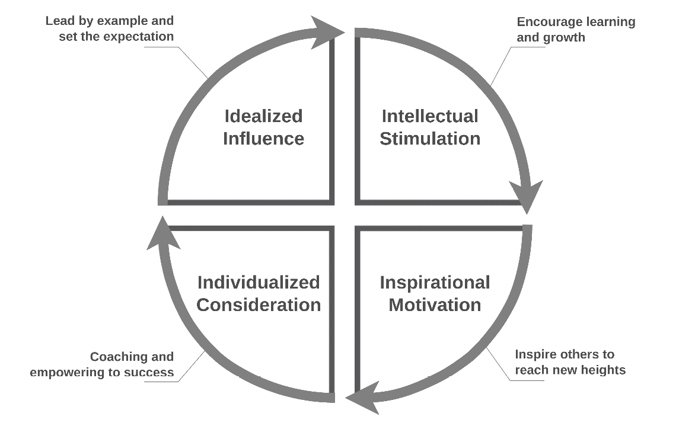
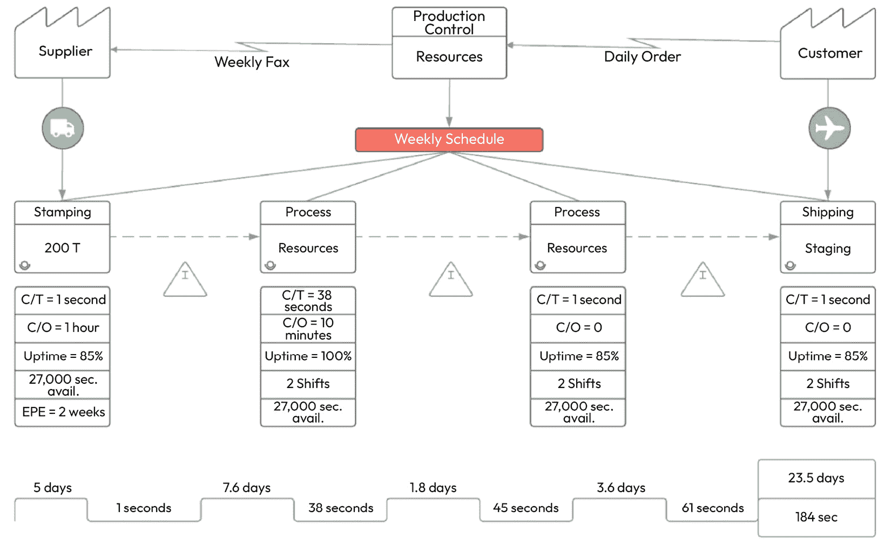

# 第十一章：克服 DevOps 发布管理中的常见陷阱

关于 DevOps 发布管理方法，存在一种广泛的误解。事实上，一种解决方案可能对某个特定客户有效，但对另一个客户可能并不理想。每个解决方案都必须与组织独特的文化、工作方式和软件发布目标相契合。如果你观察足够多的以 DevOps 为核心的组织，你会发现它们在运营过程中会遇到几个常见的陷阱。大多数组织最终会浪费大量的时间和金钱，在不断的试错过程中艰难地调整他们的 DevOps 策略。尽管这是 DevOps 之旅中常常不可避免的一部分，但让我们探讨一些可以帮助你规避这些成长的烦恼的方法，从而带领你的组织成为下一个成功案例。

在第十章中，你将学习以下主题：

+   拥有精心设计的变更管理流程

+   遵循发布清单

+   探索 DevOps 发布管理的 10 个常见陷阱

# 拥有精心设计的变更管理流程

变革管理策略是一种有意识的方法，它使领导者能够有效地引导公司度过变革，同时减少干扰和预料之外的结果。

尽管目标可能涉及改变组织，但在大多数情况下，实现成功的关键因素是能够有效地引导个体度过变化过程的能力。当现有的商业计划无法继续为组织的成功做出贡献时，企业通常会追求变革。创新的做法是提升利润率并在动态的企业环境中保持竞争力所必需的。根据组织的长期目标，每个变革项目都有其独特的特点。效率、绩效以及更优流程的发展可能是你变革项目的重点。创新可以是渐进式的，例如为现有产品添加新功能，或者是革命性的，例如开发一整条新的产品线。

无论变革规模多小或多大，你的员工和公司流程都可能会经历一定程度的干扰。即使是最具善意和必要的改革，也可能带来意外的后果。随着变革的规模和复杂性的增加，方法论策略的必要性也随之增长，相关的风险也随之加大。因此，拥有一种系统化的变革方法，并引导员工顺利度过变革过程，是至关重要的。

没有精心设计的变更管理方法是一个常见的错误。没有变更建议委员会或某种变更控制委员会，任何发布管理计划都无法算完整。它们主要负责帮助公司进行客观的风险和影响评估。当它们相互配合时，有助于发现部署过程中可能未被发现的技术依赖关系。建立一致的处理项目变更请求的程序，并跟踪其批准和实施，将极大地促进变更管理流程的发展。建议贵组织实施标准化的*变更提案*和*变更* *管理日志*：

+   **变更提案**概述了所提议变更的性质和规模，作为变更管理程序的初始阶段。在启动变更提案时，需提供对变更背后理由、预期结果和影响、所需时间和资源以及任何其他需要评估的因素的全面分析。贵组织的变更提案文档应提供额外空间，以便包含描述性细节，并设置专门的部分来计算费用和记录预期的收益。

+   **变更管理日志**是记录特定修改的发起人、请求的日期和时间、变更请求的当前状态、其重要性等级及解决细节的书面记录。为了获得更全面的记录，建议加入修改的性质和后果等额外细节。保持详细的变更管理日志的其他原因是为了便于组织和检索关键数据，从而有效地优先处理、解决问题，并为未来参考以前的变更请求提供便利。

有效地管理变更不仅仅是创建并传达一个有说服力的愿景。它不仅仅依赖于拥有一个明确定义的变更模型。组织变更的失败往往归因于高级管理人员和变更领导者对员工心理和组织文化的理解不足，而非变更过程本身。

接下来将介绍四个导致变更管理计划失败的严重因素，并提供基于数据的建议以解决这些问题。

## 员工必须理解变更管理计划的理由。

在开始任何组织变革之前，必须彻底审视促使这种变革的潜在原因。回答这个问题应该是简单的；你只需要解释组织转型背后的原因以及员工参与转型的必要性。令人惊讶的是，许多员工对领导和雇主引入的管理举措背后的动机不清楚。

平均而言，在任何组织中，只有 1/6 的员工能够理解其组织战略背后的理由。换句话说，根据这一统计数据，85%的员工不清楚为何会发生变化，这些变化的意义是什么，或者自己参与的意义是什么。从这个角度来看，这种情况令人震惊，但如果你在自己所在的组织中进行类似调查，结果很可能会得出相似的结论。值得注意的是，这些变革举措的主题涉及多个领域，如经济学、市场、竞争因素等。关键是：通常，未能理解其组织战略背后目标的人远多于那些始终或经常理解的人。让我们改变这一点！

如果没有理解组织变革管理背后的基本原因，个人就不会倾向于改变自己的行为。如果一家公司表面上看起来蒸蒸日上，大多数理性的人可能会觉得没有理由进行任何形式的变革。然而，最糟糕的是，大多数高层管理者并不是随意启动新的变革举措。组织变革管理是大多数领导者经过深思熟虑的事情，可能已经考虑了几个月。

高管们可能一直在关注市场动态、跟踪前沿技术的发展，或留意行业会议上的重大进展。几个月以来，大多数高管已经在思考变革管理举措的*为何*，无论细节如何。然而，在宣布新的变革举措时，许多高管往往忽视了传达他们在经过的认知过程，这一过程使他们认识到组织内变革的必要性。

虽然领导者可能会记下一些笔记或做一个简短的报告来概述他们的想法，但很少有这些文件能够反映出背后几个月的深思熟虑、探究和竞争性研究。因此，现有的变革管理活动往往没有被普通员工很好地理解。坦率地说，大多数变革管理过程过于强调描绘变革努力的未来目标状态，而对实现这一目标所需的变革管理过程的理由却关注得不够。

每个组织变革计划的成功取决于你能否清晰简洁地阐述其背后的理由，直到最微小的细节。

## 高层管理人员通常在舒适区之外运作，而其他人则…

高层管理人员与普通人有什么不同？大多数人可能会说是因为他们的工作和个人生活之间缺乏平衡；也许是因为他们更有雄心、更聪明，或者更幸运。事实是，在大多数情况下，原因并不在于这些。相反，这是一种风险容忍度与变革准备度的结合。本质上，典型的**首席执行官**（**CEO**）是变革的热情推动者，而正是这种勇气定义了他们的个性。

对人性有一定了解的人不会感到惊讶的是，少于三分之一的人愿意承担具有挑战性或大胆的变革。一般来说，人们倾向于避免变革，或者做出小的变革，这些变革带来的影响也较小。总共有 45%的高层管理人员做出了别人认为大胆或有远见的变革。相反，只有 27%的一线员工属于这一类别。也就是说，与一线员工相比，首席执行官更有可能发起大胆的变革行动，比例高出 66%。

个人在公司中的层级地位与其参与大胆和冒险计划的倾向之间存在明确且强烈的相关性。直接与客户打交道的员工和管理者更倾向于保持现状，即便他们接受变革，也会更加谨慎。在引领变革时，执行官往往是敢于冒险的人，他们受到不确定性、大梦想和激烈行动的驱动。雄心勃勃的人在动态环境中表现最佳。一般来说，他们喜欢承担重大任务，并乐于开创新的方法。这使得他们比组织中的普通员工更热衷于变革管理。

这个观点对每一种变革管理方法都至关重要。如果组织的高层领导是变革倡议的发起人，他们更有可能支持变革工作或计划。然而，需要注意的是，CEO 或变革经理可能缺乏认识到他们的视角与那些直接与客户和其他一线工作人员打交道的绝大多数人的视角有很大不同。简而言之，高层管理人员更可能对担任变革经理的角色感兴趣，而那些在一线工作的员工则更倾向于满足于现状。

## 领导者没有坦诚面对他们所面临的困难

变革管理的一个显著特点是，在经历失败的公司中实施变革相对更容易，而在已经成功的公司中则更加困难。原因很简单：对于一个陷入困境的公司来说，*按部就班*已经不是一种选择。当一个公司显然正在失败时，为什么还要继续以相同的方式运营？或许，讽刺的是，变革领导者喜欢与那些有强烈紧迫感的功能失调公司打交道。

然而，在繁荣的组织中，当员工已经取得成功时，询问实施组织变革的理由是合理的。对于外行人来说，当一个组织已经取得显著成功时，质疑为何需要变革管理计划似乎是合理的。毫无疑问，即使是最繁荣的公司也会遇到障碍；没有任何公司是完美无缺的。问题出现在领导者不愿意就他们所面临的困难以及这些障碍如何影响业务进行公开和诚实的讨论时。

只有 35%的 CEO 会持续或定期沟通他们所面临的挑战，而且随着问题的严重性增加，这一比例会更高。这表明，大约 66%的领导者忽视了在变革管理过程中公开沟通挑战这一至关重要的做法。选择渐进性变革管理方法的领导者相比选择革命性方法的领导者，更不倾向于公开沟通困难。渐进的变化倾向使得他们减少了广泛讨论公司问题的可能性。

另一方面，也有领导者在错误的信念下行事，认为如果他们讨论组织面临的困难，那么他们会被认为是悲观或消极的。然而，这完全是错误的。公开讨论困难并不是一件负面的事情；这只是诚实和坦率的表现。员工对展现出这一特质的领导者有着相当大的敬佩。

成功的变革举措需要一个强有力的推动力；没有强有力的理由，任何组织都不会进行转型。如果公司积极寻求实现转型变革，那么对于一个具有挑战性的推动力的需求将变得更加重要。有效的变革管理模型强调，当组织面临必须解决的重大问题时，变革将进展得更快、更顺利。然而，如果你提出的变革与具体、紧迫且可触及的问题没有直接联系，你应该预期会遇到强烈的反对。

## 员工的气质对变革具有抵触情绪

组织文化，包括员工个性，是一个很少被讨论的成功组织变革的预测因素。

在职场动态中，有五个主要的驱动力促使个体采取行动：*成就*、*权力*、*归属*、*安全*和*冒险*。这五种驱动力在塑造和影响职场中的人类行为方面起着至关重要的作用。研究表明，约 33%的员工具有较强的归属动机。此外，另外 20%的参与者表现出显著的安全动机倾向。

由归属动机驱动的个体寻求与他人的积极关系和接纳。这些人倾向于选择有较多个人互动的工作，注重团队合作，并在团队中表现出色。问题出现在组织实施突然的变革时，这让人感到不舒服，导致归属关系的解体、关键团队成员的离开，以及曾经紧密团结的团队分崩离析。如果将归属动机的个体纳入变革咨询委员会，他们可能更容易从反对者转变为关键利益相关者。然而，安全动机驱动的个体寻求在工作、任务和薪酬方面的稳定性和可靠性。他们看重保障，倾向于长时间留在同一公司、职位或部门。高安全感的个体在面对变革时经常感到焦虑，他们不倾向于接受转型性、极具破坏性或颠覆性的变革。

在某些情况下，值得注意的是，并非所有公司都拥有以安全感和归属感为驱动力的大量员工。相反，也有一些组织由那些追求冒险并成为公司内部变革催化剂的个体组成。对于那些注重社会文化并优先考虑一致性和可预测性的公司来说，转型变革过程可能特别具有破坏性。如果公司的主要利益相关者主要受安全感和归属感的驱动，那么这种情况可能会带来重大挑战。

你可能在想，如何判断你的企业文化是否以归属感和安全感为驱动。观察一下那些似乎能激励员工的因素。如果他们非常重视团队合作、与同事保持社会关系并且喜欢花很多时间面对面交流，那么他们很可能有强烈的归属感驱动力。如果他们在行动之前倾向于深思熟虑，当面临模糊不清的情况时感到焦虑，并且偏好那些定义清晰的工作和项目，那么他们很可能具有较强的安全感驱动力。

现在我们已经讨论了为什么设计周密的变更管理流程如此重要，接下来让我们进一步展开这个主题。在接下来的部分，我们将讨论遵循软件发布清单的重要性。结合这两种策略，可以确保你保持组织性，并且能够充分传达你的团队为整个组织带来的价值。

# 遵循发布清单

发布管理中常见的挑战之一是遵循发布清单，这是一个常被忽视的重要任务。发布清单中的信息至关重要；一些示例包括：确保所有组件已准确标记为发布，已建立清晰的回滚计划，并且用户文档已更新。为了你的便利，本书的*附录*中包含了详细的发布清单作为参考。作为发布经理，即使你在某天工作效率不高或在产品创建过程中受到干扰，发布清单依然是一个可靠的信息来源，帮助你保持专注并确保进度。

为确保最佳的**用户体验**（**UX**），必须在每个发布检查清单中加入相关问题。这样可以确保每次发布都能为最终用户的体验提供卓越的价值。确保软件产品准备好发布的一个好方法是，确保发布检查清单中包含*发布前*和*发布后*的活动。这应包括发布前的最终审查、测试和发布包创建，发布后的任务则包括更新文档、通知最终用户以及监控应用程序性能。在 DevOps 的背景下，软件发布检查清单通过确保每次发布都经过充分测试，从而通过可靠的流水线验证其最佳可行性，加速了产品交付的过程。

在发布新软件应用程序时，显而易见，有许多因素需要仔细考虑。最重要的是要记住，这些问题以及评估每次发布的标准是完全主观的。为了有效地应对不同的环境，构建一个全面的问题集非常重要。这些问题将作为获取与每个特定环境相关的必要信息和洞察的宝贵工具。通过遵循满足每个独特产品或业务需求的定制化检查清单，可以实现成功的发布。严格遵循检查清单，软件发布可以迅速完成，且避免昂贵的错误或延误。

然而，需要注意的是，任何完整的最终标准清单必须包括发布的各个方面，特别是性能、安全性和可用性。永远不要忘记，做得彻底总比草率行事好。在发布软件之前，确保其符合您的检查清单中列出的行业标准。当您完成整个项目后，您不希望意识到在过程中忽视了某个问题。您的用户会非常感激您这样做。

最后，为了保证顺利的发布周期，有必要确定支持团队是否了解任何可能导致最终用户困惑的功能。一个熟练的支持团队对于任何产品的实施都至关重要，软件也不例外。如果支持人员接受了充分的培训，并且对应用程序的功能有全面的理解，那么客户遇到的挑战的频率和严重性将大大降低。通用的回应很少能令客户满意，因此应计划在所有可用机会中为每位客户提供个性化支持。

确保他们能够访问尽可能多的相关信息，以为他们的成功提供支持。这不仅能确保发布周期的顺利进行，还能防止工程师和产品经理在未来处理重复性的问题。一个很好的做法是从发布清单本身提取支持材料；这能确保你的支持文档和发布过程一样全面。通过这样做，你可以优化流程，确保开发团队和客户以最小的努力获得他们需要的信息。为了改进这一过程，定义软件发布的关键元素是非常有帮助的。

## 成功的发布远远不止是遵循清单

软件发布清单可以定义为一个精心组织的任务和项目的汇编，开发和运维团队遵循这些项目以确保软件产品的顺利发布。该清单充当了一个详尽的手册，涵盖了**软件开发生命周期**（**SDLC**）的各个方面。从本质上讲，它作为导航指南的替代品，帮助团队通过受控和高效的方法应对软件部署的复杂性。

然而，关于软件发布清单，有一个相当重要的警告：它到底是什么，它应该如何使用，以及不应该如何使用。清单本质上只是一种组织你本来就应该采取的行动的方式！明确一点，发布清单应该跟随你正在执行的工作，而不是引导它。关键点是，你必须避免成为一个专注于勾选框而非创新和优化的组织。否则，你的运营将变得枯燥、停滞、缺乏创意且缺乏竞争力。

为了避免成为一个“勾选清单”的组织，你的软件发布清单必须是团队共同努力的产物，涉及多方人员。软件工程师、**质量保证**（**QA**）专家、系统管理员和项目经理都是团队中必不可少的成员。为了确保发布清单全面且有用，每个团队成员必须贡献自己独特的观点和看法。

接下来是一个列出了九个至关重要的活动的清单，这些活动是你的软件开发团队应该一直在进行的。值得注意的是，这些项目应当在你的发布清单中有所体现。

### 代码审查与 QA

从全面分析你的代码开始制作清单。代码审查是防止潜在问题的主要手段。它们能够捕捉软件缺陷、提高代码质量，并确保遵循编码标准。通过实施 QA 程序，代码审查为强大的发布奠定了基础。实际上，遵守代码标准并使用**版本控制系统**（**VCS**）是良好编码实践的重要组成部分。

功能测试的目的是确保所有功能和能力按预期执行。无论是自动化测试还是人工测试，功能测试都能确保你的产品满足所有标准，并提供积极的用户体验。换句话说，这是确保你的软件按预期运行的最后机会。功能测试清单通常确保每个功能都经过规格验证，测试所有用户交互，并验证错误处理和恢复方法。

### 用户界面和 UX 测试

留下好印象很重要，而**用户界面**（**UI**）和 UX 测试能帮助你在软件中做到这一点。用户幸福感的一个重要因素是具有吸引力和易于使用的设计。探索 UI/UX 测试如何改善软件的视觉吸引力和可用性。一般来说，在测试 UI 或 UX 时，你应该关注设计组件是否一致，导航是否简便，以及在不同设备上的响应性如何。

在软件开发中，UI/UX 设计阶段通常包括几个关键阶段。与后台软件开发和 SDLC 类似，UI/UX 开发通常也包含类似的概念，如前期设计阶段和设计研究阶段，以及初步草图、线框图、可视化和切图。如果这些 UI/UX 项目与你的项目相关，确保将其列入发布清单。

### 兼容性测试

如果你在多种设备、操作系统和浏览器上进行测试，你的程序将始终按预期工作。了解兼容性测试的各个方面，并理解为什么它对吸引更多用户使用你的产品和品牌如此重要。作为兼容性测试过程的一部分，你应该评估应用程序在各种设备上的表现，如笔记本电脑、台式机和移动设备，也要评估它在操作系统上的表现，如 Linux、macOS 和 Windows。别忘了还要在四大主流浏览器（Chrome、Firefox、Safari 和 Edge）上测试你的 Web 应用程序。显然，这些项目都应该包括在发布清单中，以确保顺利发布和满意的客户。

### 安全性测试

保护用户数据并确保程序的完整性至关重要。安全测试能够发现缺陷和弱点，保护你的程序免受潜在的网络威胁和数据泄露。通过分析安全测试的各个方面，了解它如何帮助你赢得客户的信任。进行渗透测试、验证数据加密算法，并确保安全的身份验证和授权过程，这些都是安全测试的一部分。发布检查单中一定不要遗漏这些内容，也不要忘记包括你自己独特的安全需求。

### 回归测试

确保近期的修改没有对现有功能产生不良影响。回归测试是一种检测和解决变更意外副作用的过程，确保软件的整体稳定性。了解回归测试作为软件发布保护措施的作用。你的回归测试检查单应包括评估项目，如测试用例、自动化重复测试场景，以及验证与早期版本的向后兼容性。

### 文档审查

开发人员和最终用户都必须拥有完整且最新的文档。确保你的文档准确地反映了最新的修改和功能。考虑文档在确保用户体验尽可能无缝中的重要性。文档和审查过程应遵循最佳实践，包括保持版本化文档、提供清晰简明的说明，以及在每次发布时更新文档。将这些内容也包括在你的发布检查单中。

### 部署准备

在准备部署时，你应确保基础设施、服务器和数据库都已准备好与新版本良好兼容。这个阶段能够确保平稳过渡，减少停机时间。理解部署准备的复杂性及其在成功发布中的作用非常重要。验证服务器和基础设施设置、检查数据备份和恢复过程，以及在低流量时段规划部署，都是部署准备检查单上的重要内容。

### 回滚计划

随时准备好备份计划。在发布后出现问题时，必须有明确的方法将更改回滚到以前的状态。这样，一旦需要回滚到早期版本，你可以轻松实现。了解如何制定一个可靠的回滚计划，并明白它为何是任何发布策略中不可或缺的一部分。回滚计划的标准组成部分包括与利益相关者的沟通策略、在模拟环境中测试回滚过程，以及识别关键回滚检查点。在**灾难恢复**（**DR**）事件中保持回滚策略有效的最佳方法是为其创建一个检查清单。

### 性能测试

性能测试是你发布检查清单中不可或缺的一部分。确保你的软件在不牺牲速度或功能的情况下，能够应对预期的负载是此步骤的目标，这需要评估软件在各种场景下的表现。如果性能问题得不到解决，你的品牌声誉、用户满意度和可用性都会面临风险。

性能测试的重要性有很多原因。首先，用户满意度至关重要。一个缓慢或不可靠的系统会让用户感到沮丧，进而对你的软件产生负面看法。性能测试还可以帮助识别潜在的瓶颈，防止在高峰期出现意外崩溃，并确保**业务连续性**（**BC**）。更重要的是，在开发过程中解决性能问题比在发布后处理它们更具成本效益。

评估软件应用性能的方法包括以下几种：

+   **负载测试**：软件在轻负载和重负载下的响应能力，以确保它能够处理预期的用户量

+   **可扩展性测试**：验证软件在应对增加的负载需求时的可扩展性，确保无论用户数量多少，软件都能高效运行

+   **峰值测试**：检查系统在用户流量急剧激增或波动时的响应方式

+   **耐力测试**：确定系统是否能够在长时间内保持稳定，并评估其在持续负载下的表现

+   **并发测试**：分析软件在多个并发用户同时进行处理时的响应能力和性能

当你在软件部署的复杂环境中航行时，你会发现一份全面的软件发布检查清单是你最好的朋友。尽管清单上的每一项都有助于你发布的整体成功，但性能测试作为确保用户满意并让你的产品长期保持良好状态的关键环节，尤为突出。将这些方法纳入你的性能测试策略中，将提升软件的整体成功和可靠性，同时改善用户体验（UX）。

采用系统化的方法来完成软件发布清单，为无错误、高效且无缝的发布打下基础。在下一部分，我们将讨论 DevOps 发布管理中的十大陷阱。通过学习他人所经历的困难，你将能够顺利踏上掌握 DevOps 发布管理的道路。

# 探索 DevOps 发布管理中的十大常见陷阱

DevOps 发布管理是一种具有变革意义的方法。几乎所有行业的企业都越来越普遍地实施 DevOps，以为团队提供完成更具挑战性任务所需的时间和自主权。采用 DevOps 发布管理策略可以激励你的工程团队，并将产品开发工作引导到更好地满足客户需求的方向。另一方面，每当你采用一种新技术时，总会有可能面临重大挑战。

每当你尝试改变业务的基本性质时，问题和障碍是不可避免的。每一次转向 DevOps 都会带来一系列独特的挑战，团队必须克服。关于变革，很难预测并规避可能出现的每一个潜在挑战。然而，本章旨在为你提供应对 DevOps 发布管理中最常见陷阱的必要知识，并为解决这些问题提供有效的策略。在考虑实施 DevOps 实践时，必须具备对涉及元素的充分了解以及有效优先排序的直觉。与任何 DevOps 发布管理的实施一样，组织必须始终将人的因素置于首位，其次是流程，最后是技术。

## 缺乏领导层支持

大多数高管都有过未能成功引导组织进行与组织文化相悖的变革倡议的经历。虽然这可能听起来令人惊讶，但事实是，超过三分之二的所有组织变革倡议都以失败告终。

当努力试图颠覆整个现有的企业文化时，失败率显著增加。看到其中四分之三的尝试以失败告终并不奇怪。对于组织而言，文化是根深蒂固的，并随着时间的推移在一代代员工的更替中延续。改变一个组织的文化并不是改变组织的第一步，而是最后一步。

### 拥抱 DevOps 动态

从事 DevOps 转型的领导者必须深入理解该方法论的独特动态。将 DevOps 实施到组织中是一个复杂的过程，涉及的内容不仅仅是采用新的技术实践和工具。正如 Gene Kim 在*《凤凰项目》*中解释的那样，采纳*《三大原则》*的组织会获得显著的优势，这使得成功的可能性更大。我们在*第五章*中讨论过，这意味着从一个孤立部门的文化转向一种注重效率和适应性的思维方式，重点是持续创造和交付价值。

历史告诉我们，文化变革一直是采用 DevOps 发布管理实践的一个重要障碍。它已成为许多组织在进行这种转型时阻碍 DevOps 采用的主要原因。关于文化转型挑战的研究广度导致了一个明确的观察结论：采纳 DevOps 方法论本身就伴随着较大的风险，并且容易遭遇潜在的挫折。

一种可能的解决方案是保持现状，避免迈向文化转型的艰难旅程，而这通常伴随着 DevOps 计划的实施。上述策略所面临的问题在于，DevOps 的涵盖范围远远超出了仅作为一种适用于技术人员的方法论或框架。在当代社会，组织面临着持续不断的内部和外部影响，这些影响有可能在大范围内塑造其文化。这些影响因素包括新竞争者带来的市场颠覆、全球经济波动、地缘政治不稳定、货币波动、劳动力人口结构的变化以及技术的迅猛发展等。这些力量既为组织带来了有利的前景，也可能带来挑战。

在这种特定背景下，迅速适应和创新的能力已经成为一种基本的组织资产。*当成功实施* DevOps 时，会在系统开发过程、技术和文化方面带来丰硕的成果。这些变化对促进组织敏捷性至关重要，而敏捷性又使得企业能够在当今动态市场中获得竞争优势。上述因素使得将产品或服务推向市场所需的时间减少，减少了浪费性的活动，提高了整体质量，并引入了新颖和革命性的产品与服务。

在启动 DevOps 举措时，领导者和变革推动者面临的固有困难，是如何找到克服这些障碍的途径，并在采用 DevOps 原则、方法和文化时，战略性地提升成功的可能性。

### 高效的领导力至关重要

成功应对与文化变革相关的障碍，在于企业高层领导所采取的领导方法。

你的初步目标应该是深入了解导致大多数组织变革举措失败的关键因素。大量研究指出，多种变量导致了在各种场景中次优结果的出现。这些变量包括不充分的规划、对变革的制度性抵抗、低效的沟通和不切实际的期望。最主要的考虑因素通常与公司成员对变革的反应方式密切相关。按顺序列出的三项最高优先级的因素如下：

1.  **对变革的抵抗**：指的是个人或团体对采纳新想法、新技术或新流程的自然倾向，通常表现为怀疑、恐惧或维持现状的愿望。

1.  **低变革准备度**：指的是个人或组织对于接受和适应新思想、新流程或新技术的抗拒或缺乏准备的状态。这种准备不足可能会妨碍进展和创新，因为它为实施必要的变革设置了障碍，可能源自各种因素。

1.  **员工参与度低**：指的是员工未能充分参与、激励或投入到工作中。这种参与度不足可能对员工和整个组织产生负面影响，导致生产力下降。

拥有这种新的理解后，重要的是开始探索提升组织内部个人有效适应和接受变革能力的策略。大量的日常观察表明，领导者如何行使领导职能、与他人互动，极大地影响了员工对变革的反应——是否友好。

在过去近四十年里，有关成功领导行为的文献一直围绕着**变革型领导理论**展开，该理论由詹姆斯·麦格雷戈·伯恩斯（James McGregor Burns）首创。关于这一主题的学术出版物数量，远超历史上任何其他替代领导理论的出版物数量。根据伯恩斯和其他学者如詹姆斯·维克托·唐顿（James Victor Downton）的研究，成功的变革型领导者具有以下四个主要特征：

+   **智力激励**：除了质疑现状，变革型领导者还激励追随者创新。领导者鼓励人们探索新的方法和教育机会。

+   **个性化关怀**：变革型领导力是一种领导风格，涵盖了对个别追随者提供支持和鼓励的行为。变革型领导者优先建立支持性关系，通过保持开放的沟通渠道，鼓励追随者自由表达他们的想法，并使领导者能够及时确认和欣赏每个追随者的独特贡献。

+   **鼓舞人心的激励**：变革型领导者拥有明确的愿景，并能够有效地传达给他们的追随者。领导者有能力激励并鼓舞追随者，培养共同的激情和动力，以实现共同的目标。

+   **理想化影响力**：在领导力的背景下，变革型领导者承担着作为其追随者榜样的责任。追随者表现出对领导者的信任和尊敬，这使他们模仿领导者的行为，并将领导者的价值观视为自己的：

图 11.1：变革型领导力的四个关键原则

对于负责当前和未来 DevOps 转型的公司高层管理人员，额外的研究显示了两个关键结论。首先，采用特定的变革管理策略不如激励追随者积极支持组织整体变革那样有效。更重要的是，变革型领导力包含的是可以教授和学习的实践。

### 领导力是成功的秘密成分

组织可以通过实施培训、辅导和指导计划来提高 DevOps 和其他变革项目成功的可能性。这些计划旨在培养组织内现有和未来领导者的变革型领导力能力。通过投资这些计划，组织可以采取切实可行且经过验证的措施，增加其努力成功的概率。成功的 DevOps 领导者在远见、真实性、个人发展和创造力方面展现出显著的品质。他们赋能团队并鼓励去中心化决策。

这一点具有显著的影响。领导者运用领导技能的方式在成功管理与采用 DevOps 实践相关的文化转型这一挑战性过程中的作用至关重要。组织所选择的领导风格直接影响其成员对流程、技术、角色和意识形态重大变化的反应。

当从业人员积极参与、充满动力、拥有授权并得到支持，且处于一个有利的环境中时，成功实现 DevOps 转型的可能性会显著增加。这种环境的特点是，领导者提供清晰的愿景，以诚实和真实性为领导原则，并培养信任文化。

## 以为 DevOps 主要是关于工具

DevOps 发布管理的实施在很大程度上依赖于各种工具的使用，这些工具的目的是加速任务的完成，并促进不同团队之间的协作，从而改进软件开发和运维过程。选择合适的工具在这方面具有重要意义。正如本书中广泛讨论的那样，DevOps 方法论涵盖了广泛的工具，包括源代码和版本控制管理工具、**持续集成/持续部署**（**CI/CD**）工具、沟通与协作平台以及监控工具。值得注意的是，这些工具已经非常多，而且随着时间的推移不断增加。

相反，过多地投入时间和精力去选择最佳工具（应该注意的是，这样的工具实际上并不存在），并随后为团队提供培训以便其使用，这是一项徒劳的努力。尤其是在所选择的工具未能准确地复制你期望的工作流程时，这一点尤为明显。我们这里举的假设工具通过运用巧妙的策略和偶尔的手动操作，的确有可能完成它被选中的任务。然而，这种方法可能会导致比必要的更加繁重且令人沮丧的用户体验（无论是对于内部人员还是外部人员），常常导致工具的使用受到限制。

DevOps 的核心在于消除障碍，并优化为客户交付价值的过程。在问题解决的领域中，重要性不在于使用的单一工具，而在于识别和缓解痛点。比这一切更为重要的是，运用这些工具并解决这些挑战的人才和创造力。任何高层管理人员都应当知道自己成功的关键所在。

*但为什么我们* *需要工具？*

工具在 DevOps 发布管理中至关重要，原因有多种。它们帮助我们高效解决复杂问题、自动化任务并提高生产力。工具通过提供预定义的算法、库和框架，提供一种系统化的解决问题的方法，从而简化了开发过程。它们还通过提供版本控制系统（VCS）、**集成开发环境**（**IDEs**）等，促进开发人员之间的协作。根据*工具*的既定定义，任何有助于成功完成特定任务的物体或设备都可以被归类为工具。在自然界中，甚至像棍子或石头这样的普通物体也能作为工具来完成特定目标。

然而，当你只有一把锤子时，一切看起来都像钉子，因此 DevOps 工匠的工具箱中需要有各种各样的工具。随着我们技能的不断提升，将会有新的资源和方法提供给我们。然而，工匠的注意力更多地集中在最终产品上，而不是过程本身。工具本身仅仅是达到目的的一种手段；拥有更多、更好的工具只能提高你作为一个有能力的人的效率。

企业选择工具的关键在于其具体的流程。为了识别最适合您组织的工具，必须全面了解现有的流程流程。需要确保该流程已经最大化地优化。接下来，下一步是评估不同的工具，并选择与优化后的流程兼容的工具，且需要最小化定制。在 DevOps 和流水线管理的背景下，考虑不同工具的兼容性非常重要。此外，某些工具可能在流程的某一小部分非常有效，但与另一种对更重要的流程至关重要的工具不兼容。因此，专门针对特定领域的理想工具，在考虑 DevOps 和整个流水线时，可能并不适用。这被称为*局部* *优化问题*。

最终，最好是提前设计好理想的流程，然后选择能够有效自动化或补充这些流程的工具，并且实现这些工具时几乎无需人工干预。

## 将 DevOps 和 CI/CD 视为相同的概念

DevOps 发布管理涵盖了自动化构建流程和基础设施，但其范围不仅限于 CI/CD。DevOps 和 CI/CD 虽然相关，但在计算机科学、项目管理或二者结合的领域中，它们是不同的概念。DevOps 可以被看作是一个全面的软件开发和部署方法，类似于一辆自行车的车轮。在这个类比中，CI/CD 可以看作是车轮的一根辐条，在促进整个系统平稳运行中起着至关重要的作用。

DevOps 的成功取决于关键利益相关者之间的有效协作，这与任何行业中的高效团队类似。在软件工程领域，开发工程师和运维人员之间的协作对于整个开发生命周期至关重要。这种协作跨越多个阶段，包括设计、开发和生产支持。DevOps 是一种文化范式，涵盖了整个软件开发生命周期，超出了软件开发人员和运维人员的角色。它以一组行为为特征，促进这两个传统上分离的职能之间的协作与整合。

在 DevOps 发布管理的背景下，软件开发、部署、信息安全、QA、发布管理和相关学科的整合，形成了一个统一的实践集合。需要明确的是，使用 CI/CD 并不能证明一个公司成功应用了 DevOps 实践。

组织中缺乏明确的 DevOps 概念，导致采用过去效率低下的模式，其中开发、QA 和系统管理团队各自为政。没有掌握 DevOps 基本原则的团队，即有效沟通、无缝协作和透明化实践，无法如期推进工作。

### 理解关键差异

CI/CD 是一组开发方法论，旨在促进代码修改的快速且可靠部署。DevOps 是一整套概念、方法论、程序和技术，旨在促进开发和运维团队之间的协作，以优化产品开发。尽管这两个概念是相互关联的，但它们具有不同的特征。简而言之，以下内容适用：

+   CI/CD 包括一系列开发方法论，旨在促进代码修改的快速且可靠部署。

+   DevOps 包括一系列概念、方法论、程序和技术，促进开发和运维团队之间的协作，以优化产品开发。

在当今的商业环境中，任何技术驱动型组织要想实现最佳的运营效率和卓越的产品质量，必须认识到 DevOps 和**持续集成/持续交付**（**CI/CD**）的重要性。在国际上，开发团队依赖 CI/CD 实践快速且一致地交付代码改进。相反，DevOps 原则鼓励开发和运维团队之间的协作，以优化产品开发的各个方面。

让我们进一步阐明 CI/CD 与 DevOps 之间的根本区别。

#### DevOps 与 CI/CD 的范围

持续集成（CI）是软件工程中的一项基本原则，倡导团队成员定期整合各自的工作。在软件开发的背景下，遵循这一方法论的实践者努力频繁地将更改整合到代码库中，通常是每天甚至每小时进行一次。在传统的环境中，集成是一项昂贵的工作，需要不同工程组之间进行大量的沟通。为了克服这一障碍，CI 提倡使用自动化的测试和构建工具。这种自动化的最终目标是发展出一个软件定义的生命周期。通过减少集成所需的工作量，成功的 CI 帮助团队更快地发现和修复集成错误。

类似于持续集成（CI）优化构建和测试软件的过程，持续交付（CD）增强了软件应用程序打包和部署的效果。采用 CD 的组织能够有效地协调整个软件开发生命周期（SDLC），涵盖设计、构建、打包和部署等环节。这种方法有助于实现软件定义的生产方式，旨在最大限度地优化成本效益和自动化。

在最佳状态下，CI/CD 允许快速地将更新后的软件部署到生产环境中。这促进了 DevOps 文化的发展，使得软件开发生命周期（SDLC）为用户提供更多的反馈机会和更多的创意空间。

#### DevOps 和 CI/CD 的目的

CI/CD 将应用程序的所有代码更新整合到一个统一的代码库中，随后进行自动化测试。这个过程保证了产品的全面开发，并精心准备它以进行部署。CI/CD 的主要目标是促进产品更新的快速、简化和自动化部署。此外，这一过程还减少了产品缺陷，从而提高了用户的平均满意度。总的来说，强大的 CI/CD 流水线能够提高软件开发的速度和质量，为运维和产品开发团队提供益处，提升企业及其客户的整体业务价值。

DevOps 发布管理是一种旨在解决许多组织面临的共同挑战的方法：在创建新软件的过程中，操作、开发及其他团队之间缺乏协调与合作。由于协作不足，沟通鸿沟和缺乏合作通常会导致重大障碍和昂贵的挫折。通过将 SDLC 中的各个要素整合起来，DevOps 发布管理旨在简化这些工作。DevOps 通过推动更加灵活、简化且富有成效的软件开发过程来实现这一目标。通过在团队之间培养和维持共享文化，DevOps 能够轻松促进共通业务流程的采用，并整体提高协作水平。

#### DevOps 和 CI/CD 的个人利益

实施 CI/CD 流水线有许多优势，包括以下几点：

+   由于自动化测试，生产环境中引入的错误较少。

+   在开发周期初期解决集成问题，简化了发布构建过程。

+   因为开发人员在构建失败时会立刻收到通知，所以他们需要切换任务的频率大大减少，从而节省了时间。

+   由于 CI 服务器能够在几秒钟内运行数百个测试，因此测试花费的资金更少。QA 团队现在可以将他们的时间和精力投入到更重要和更有价值的任务中。

+   减少团队在准备发布时花费的时间，简化了软件部署。

+   随着发布频率的增加，端到端反馈循环变得更有效。

+   通过轻松做出小的变更实施决策，简化了迭代过程。

接受 DevOps 发布管理有多个优势，如下所示：

+   增强了敏捷性、自动化、协作、效率和质量

+   及早发现并解决错误和 bug

+   最小化**市场时间**（**TTM**）

+   增强的**投资回报率**（**ROI**）

+   提高了用户满意度

+   减少了对齐错误和沟通失误的风险

强大的 DevOps 文化促进了团队之间的协作，使他们的努力朝着共同的商业目标对齐，而不是各自孤立的部门。自动化测试和持续反馈与敏捷原则相结合，能够加速开发并让错误管理变得轻松。当 DevOps 过程得到正确实施时，它带来了多个好处，包括提高产品质量、增强用户满意度和增加盈利能力。

## 将质量视为事后考虑

产品、服务、员工和声誉中的质量是每个企业都渴望的目标，但实现这一目标并不容易。将其作为公司口号、在线发布、在休息室展示有关它的聪明引语，甚至在员工手册中专门列出相关内容，都很容易做到。然而，要让质量文化真正渗透到组织中，它必须渗透到每位员工的意识中。

为了实现这一目标，企业需要采用全面的质量战略。同行推动的方式、高层支持、丰厚的奖励，以及涉及公司所有方面，特别是人员、流程、产品和服务的包含，都是成功的关键。

值得注意的是，某些公司可能会持续生成开发代码，但在每个阶段的管道中未纳入必要的质量检查。CI/CD 管道虽然能够快速发布软件，但可能无法带来高价值的成果。为了优化性能，关键是优先考虑速度的同时确保维持所需的质量水平。在实施 DevOps 实践时，必须评估管道中每个阶段提供的质量方面，并在有利的情况下实施局部优化技术。存在许多低开销的方法可以在管道中添加质量检查，做到这一点将有助于长期的回报，因为它能在早期发现有问题的代码。

幸运的是，大多数开发工程师基本理解“左移”的概念，这有助于通过在流程早期发现错误来节省时间和成本。通过采用以早期缺陷检测为优先的 DevOps 文化，领先于竞争对手。确保你的管道在整个过程中都具备成熟的质量检查点，这将使你能够更快地发布更好的软件。在构建成熟的管道时，纳入以下各类质量阶段是至关重要的：

+   代码覆盖率

+   静态代码分析

+   单元测试

+   集成测试

+   基础设施验证

+   部署后测试

通过从一开始就将这些质量检查纳入其中，你可以极大地提升 CI/CD 管道的成熟度和价值。

启动战略质量管理计划时，请记住以下七点：

+   **阐明你的基本原则和卓越标准**：通常最困难的部分是弄清楚你要追求的质量是什么。描述公司对质量的定义时，尽量做到详细；否则，你的定义将显得模糊，永远无法付诸实践。在提供具体的质量度量示例后，务必关注自己的进展。

+   **避免将合规性作为首要关注点**：许多公司认为，通过达到如**国际标准化组织**（**ISO**）、**健康保险流通与问责法案**（**HIPAA**）、**健康信息信任联盟**（**HITRUST**）、**国家标准与技术研究院**（**NIST**）、**现行良好制造规范**（**cGMP**）、**通用数据保护条例**（**GDPR**）等行业标准的合规性，他们就展示了对质量的承诺。然而，他们没有抓住这一主题的本质。通过优先考虑质量，合规性自然会跟随。合规性可以类比于单纯关注通过考试的成绩。虽然它帮助公司克服了某些障碍，但并没有充分准备公司建立持久的卓越文化。

+   **向所有同事宣传质量管理**：虽然许多公司确实有专人负责**质量控制**（**QC**）和质量保证（QA），但质量管理应该是每个人的责任。员工应当在没有报复担忧的情况下，能够自由地提供反馈和建议以提升质量。此外，质量战士应当有机会实施他们的想法，并在其努力取得积极成果时得到认可。

+   **通过自动化简化过程**：质量过程对公司运营的影响是显而易见的，但实现这些效果可能是一个漫长且复杂的过程。确保质量过程得到遵循，文档保持最新和准确，并且仪表板能够在质量问题变得无法控制之前及时提醒你。这通过自动化的**质量管理系统**（**QMS**）更加容易实现，该系统整合了跨部门的数据。在系统处理质量流程时，经理们可以专注于创新和核心业务，而不是应对紧急情况和 P1 事件。

+   **让数据引导决策和行动**：虽然建立真正的卓越文化似乎是一项主观技能，但实际上它涉及大量的科学原理。质量应当由数据引导，数据可以识别问题领域、预测模式并帮助监控进展。

+   **持续衡量在制品（WIP）**：设定明确的目标并配有可衡量的指标是任何质量改进计划的第一步，无论是新的生产过程、扩展的产品特性，还是修订的安全测试标准。接下来，向客户、员工或供应商等利益相关者征求意见，以评估项目的执行情况。

+   **将持续改进作为你的目标**：在交付应用程序并收集利益相关者反馈后，确保过程不会在此结束是至关重要的。真正的质量程序本质上是动态的，必须持续适应以应对不断变化的需求和要求。通过不断提升自己的标准，你可以确保质量成为文化的一部分，而不仅仅是针对特定问题的临时解决方案。

将质量作为组织文化内在组成部分而非短期应对问题的方式的公司，能够获得诸多优势，如减少安全事件、减少回滚发布的情况以及更少的声誉损害。然而，只有当企业采取全面和一体化的方式时，质量才能真正成为其独特的品牌。曾有智慧的人说过，*你做一件事的方式就是你做所有事情的方式*。

## 缺乏仪表盘和报告，或者报告过多

高效的软件开发需要各团队之间清晰和开放的沟通，这至关重要。所有个人和团队必须有共同的理解和知识，确保没有人被排除在外或落后于他人。有效的仪表盘能够促进利益相关者的支持，并提升整个过程的效率。

可惜的是，这一关键元素在许多 DevOps 倡议中往往没有得到足够的重视。高质量的仪表盘和报告常常被忽视或未受到充分考虑。随着失败的积累，发现根本原因变得更加困难，公司开始意识到需要更多的资源来推动决策过程。

高效的仪表盘和报告，通过开放性，能不仅提升决策质量，还能使团队紧密监控开发周期的各个阶段，从而促进流程的优化和管道的改进。当问题出现时，正如它们不可避免地会出现的那样，这些问题将不再被忽视。而且，当你训练员工如何正确记录和报告时，帮助每个人追根溯源，这意味着未来的失败会更少。

如果管道中的特定阶段持续出现较高的失败率，能够看到这些阶段的情况将有助于优先调查这些失败的根本原因。这些反馈循环对于在 DevOps 和管道实施中取得成功至关重要。通过实施有效的仪表盘和报告，你不仅可以减少时间和成本，还可以通过交付更优质的软件来提高客户满意度和用户体验。定量数据和统计数字具有很强的说服力，许多机构已经开始采集多种指标。

然而，人们可能会陷入过度追求仪表板和指标的状态，这通常被称为*仪表板和指标黑洞*。尽管收集基础数据本意良好，但这个过程可能迅速变得繁琐且耗时。更糟糕的是，在这种过度执着的心理状态下，你很可能最终会失去最初的焦点。收集数据的主要目的是帮助公司做出明智的决策，并实施旨在改善指标的战略，而不是为了创建外观吸引的仪表板。

实现这一目标的一种方法是专注于收集**DevOps 研究与评估**（**DORA**）指标，并为团队提供便捷的访问方式。此外，可以为每个团队建立商定的程序，专门提高数据质量。通过采用集中的战略，这些团队可以开始采纳工程最佳实践，从而促进 DevOps 文化在公司内的建立和融合。

## 选择错误的指标来衡量项目成功

尽管 DevOps 的优势在于更快的交付，团队仍需保持谨慎，因为加快的节奏可能对产品质量产生不利影响。拥有一套明确且可量化的 DevOps 指标，可以有效地监控项目的进展和卓越表现。

DevOps 提供了高度的适应性，并且可以轻松地根据任何组织的具体需求进行定制。首先，明确你希望通过实施 DevOps 解决的问题，并概述你组织的 DevOps 转型的具体特征。然后，确定你的组织在实施 DevOps 时可能面临的潜在障碍，并将其作为衡量指标的依据。为你的独特组织选择合适的 DevOps 指标，将帮助你评估自己的成就水平。

除了技术性指标外，还需要在 DevOps 的背景下考虑选择商业指标。这些指标在有效传达 DevOps 项目投资回报率（ROI）给关键利益相关者方面起着至关重要的作用。为了有效地衡量和评估绩效，至关重要的是仔细选择那些专注于期望结果的指标，并且与商业优先事项保持一致。例如，当主要商业目标是提高组织流程的效率时，建议使用专门衡量成本的指标。

### 什么是 DevOps 指标？

企业需要投入大量时间、金钱和资源来进行 DevOps 转型。这包括重新评估从工具到沟通和培训的各个方面。为了有效地定义目标、提高效率并监控进展，必须具备评估 DevOps 指标和性能基准的能力，而且这种评估要既清晰又准确。

在启动 DevOps 项目时，确定哪些 **关键绩效指标**（**KPIs**）能够帮助克服企业独特的挑战非常重要。DevOps 的 KPI 应该能够展示转型对公司价值和影响的全面体现。为了对未来的流程和技术做出明智的决策，必须有准确的性能指标来衡量当前工作的价值。

#### 有效 DevOps 指标的特征

为了更好地了解 DevOps 项目或团队的表现，以下是五个能够反映高质量 DevOps 指标的特征：

+   **可测量性**：为了确保一致性和可比性，指标应具有标准化的值，并在较长时间内保持不变。

+   **可操作性**：对指标进行长期的综合分析应能够揭示出系统、工作流程、策略等领域潜在的改进空间。

+   **可靠性**：为了确保测量的准确性，必须防止团队成员以任何方式操控或影响结果。这能够确保测量结果客观、公正，不受任何故意偏见或扭曲的影响。

+   **可追溯性**：这些指标不应仅仅是对一般问题的简单提及；相反，它们应直接指向根本原因。

+   **相关性**：这些指标必须设计成能够衡量对企业整体运营和成功具有重要意义的因素。

避免跟踪那些不能提供有意义洞察或不促进软件开发和运维过程整体改进的 DevOps 指标，例如以下这些：

+   **非 DevOps 指标**：例如，衡量*流量负载*的指标更适合那些采纳 **Scaled Agile Framework**（**SAFe**）的组织，而不是专门设计用来衡量 DevOps 发布管理成功的 DORA 指标。

+   **无意义的指标**：指标应该设计为促进和增强团队合作。虚浮的或浅显的指标显示你能做某事，但它们并不能真正展示公司运作得多好。有时，无能的领导者会要求团队提供无意义的指标，以掩盖他们的经验不足或疏忽。例如，由于在重构过程中代码可能会被完全丢弃，且有时更少的代码对组织更有利，像每周编写的代码行数这样的指标就变得毫无意义。除非每次构建都能显著改善最终用户体验，否则每天构建的数量是毫无意义的。

+   **有争议的指标**：当只有顶尖表现者被认为是赢家，而其他人都被视为输家时，预测团队内外的有效沟通与协作变得具有挑战性。避免创建那些会引发轻蔑或争斗的指标，如衡量失败的构建次数或致命错误数量。团队可能会过于专注于提高这些指标，而忽视识别实际问题并共同合作解决它们。

#### 六个关键 DevOps 指标和六个关键客户满意度指标

在 DevOps 发布管理中，评估性能和进展对于组织至关重要。为此，六个关键指标已经成为重要的衡量标准。这些指标作为评估大多数组织内 DevOps 实践的有效性和效率的尺度：

+   **交付时间**：为了衡量完成时间，团队需要明确任务的开始和结束时间。从提交代码到将其部署到生产环境的每个步骤，都需要是可量化的。实现这一目标的一种方法是充分利用自动化测试和集成过程；另一种方法是缩短整体部署时间。

+   **部署频率**：自动化部署管道、API 调用和手动脚本只是衡量部署频率的一些方式。由于并非每次部署都会推进到生产环境，因此这个指标更多关注管道的技术性能，而非发布频率。失败的部署会整体影响客户满意度，但更频繁的部署可以减少相关的错误。

+   **变更失败率**：在评估 DevOps 项目时，重要的是要同时衡量成功率和失败率，尽管提高速度是其中一个目标。客户的不满有时是未能确保变更一致地发布到生产环境的结果。随着部署次数的增加，如果关键绩效指标（KPI）显示更高的失败率，就该放慢速度，调查管道中的问题。

+   **平均恢复时间（MTTR）**：这个指标衡量组织从故障中恢复所需的时间，是 DevOps 框架的一部分。该指标对企业至关重要，因为它显示了团队应对中断并快速恢复常规运营的能力。以分钟和小时为标准计量单位，但有时也需要使用天数。如果你希望缩短解决问题的时间，就需要正确的应用监控工具以及运营和开发人员之间的紧密合作。

+   **客户工单量**：这个指标衡量客户的满意度。在许多情况下，最终用户是第一个注意到缺陷和错误的人，而不是测试人员。之后，他们会联系客户服务，提出他们的疑虑。因此，应用质量的一个关键衡量标准是被标记为问题或缺陷的客户工单数量。工单数量较低表明应用程序很稳健，而较高的数量则表明存在质量问题。

+   **缺陷逃逸率**：无论 DevOps 流水线多么优秀，缺陷总是会发生。流水线的开发或测试阶段通常是发现这些缺陷的最佳时机。然而，即使它们通过了测试，用户仍然可能会发现这些缺陷。缺陷逃逸率可以定义为在部署前后发现的生产问题的百分比。它帮助识别软件开发过程中的薄弱环节，指出漏洞容易被忽视的地方，并建议改进产品和过程保障的方法。

DevOps 项目为组织提供了显著的优势，但其实施涉及复杂性和可观的成本。DevOps 指标在评估 DevOps 团队表现和评估实施 DevOps 实践的有效性方面起着至关重要的作用。这些指标提供了对 DevOps 倡议在任何规模或成熟度的组织中整体表现和影响的宝贵洞察。

在我们继续前进之前，必须花一些时间回顾衡量客户满意度的关键指标。虽然这些指标在严格意义上与 DevOps 是两个不同的领域，但它们将帮助你作为领导者和发布经理取得成功，无论在什么样的背景下。这些指标适用于内部和外部客户。例如，你可能正在开发一个内部产品，目的是帮助其他部门提高工作效率。或者，你可能正在开发一个传统意义上的软件产品，面向外部客户：

+   **顾客满意度 (CSAT) 分数**：测量 CSAT 分数包括进行一项调查，要求顾客在互动或购买后对他们的体验进行评分。你一定见过这种调查，它通常在你完成任务或购买后出现，询问你的体验。这项调查通常包括一个评分尺度，可以是数字或表情符号形式，涵盖从负面到正面的各种体验。根据反馈，CSAT 分数可以在 0%到 100%之间变化。

计算 CSAT 评分

计算 CSAT 分数的方法是：将收集到的有利回应总数除以调查总回应数，再将结果乘以 100\。这将得出你公司 CSAT 分数。最终结果是与你公司做生意的满意消费者的百分比。

+   **净推荐值 (NPS)**：NPS 是一个常用的指标，通常使用 1 到 10 的评分标准，用于评估客户对品牌的忠诚度和热情。它提供了关于客户满意度和他们推荐你公司业务的可能性的洞察。

确定 NPS

评分为 9 或 10 的顾客通常被称为推广者。他们对你的公司已经形成了强烈的忠诚感，并热衷于向他人推荐你的公司。评分为 7 或 8 的顾客通常被称为中立者。他们对公司忠诚度不能视为牢不可破，因此在面对更好的选择时，他们可能会考虑与竞争对手做生意。评分为 7 或以下的顾客被视为贬低者。他们对你的公司缺乏忠诚，可能会公开表达对公司不利的观点或意见。

+   **顾客努力分数 (CES)**：CES 是一种衡量顾客在与公司互动时所付出努力程度的指标。这些互动可能包括使用公司产品和服务所需的努力程度，或客户服务代表解决顾客问题的难易程度。

    建议发送调查问卷以测量客户在最近一次与客户服务互动后所花费的努力程度。你可能会考虑实施 CES 调查，以评估顾客对每个客户服务代表的满意度。这将使你的客服团队能够进一步提升表现，并确保你的公司继续致力于提供卓越的客户支持。

测量 CES

CES 的测量包括提问一个问题，回答会根据 1 到 7 的尺度进行评分，其中 1 表示对该陈述的最大反对。

CES 指标通过表示同意的客户比例来确定，表明公司有效地帮助解决了他们的问题。当客户从不同意或中立状态转变为同意时，建立客户忠诚度变得更加可行。

+   **客户流失率（CCR）**：CCR 是公司客户停止使用其服务的百分比。它也叫做流失率。通常的量化方式是计算在特定时间段内取消订阅的公司客户的百分比。它也代表在特定时间范围内辞职的员工百分比。为了让业务扩大客户基础，增长必须超过流失，尤其是在客户流失方面。

计算 CCR

客户流失率公式是*(流失客户 ÷ 时间段开始时的总客户数)* *x 100*。

+   **客户健康评分（CHS）**：CHS 是评估客户是否保持忠诚或流失到竞争对手的最有效指标。这些持续的客户留存统计数据对客户经理和支持人员特别有价值，因为它们提供了关于客户流失可能性和程度的洞察。

计算 CHS

与大多数 SaaS 指标不同，CHS 没有预设的算法。然而，CHS 的计算方法将是特定于您的组织和产品的。不过，计算客户健康评分时有五个主要步骤：

1\. 定义您的客户的健康水平。

2\. 选择用于预测的度量指标。

3\. 建立一个评分分配系统。

4\. 将您的消费者数据分为不同的细分群体。

5\. 展示您的 CHS 的图形表示。

+   **客户生命周期价值（CLTV）**：CLTV 是一个定量衡量指标，表示一个客户在与您的业务关系期间所产生的预期收入总额。

计算 CLTV

将客户价值与平均客户生命周期相乘。要确定 CLTV，您可以通过将平均购买值与平均购买次数相乘来找到客户价值。获得平均客户生命周期后，可以通过将其与客户价值相乘来计算 CLTV。

这里是公式：

- **计算客户价值**是通过将平均购买值与平均购买次数相乘来完成的。

- **计算 CLTV**是通过将客户价值与平均客户生命周期相乘来完成的。

## 在推进 DevOps 的过程中，把其他人甩在身后。

在你的组织内部实施 DevOps 实践的理由在塑造组织文化的基础方面起着至关重要的作用。在农业领域，寻找肥沃的土壤是一项基础性工作。肥沃的土壤是指具有必要的营养和物理特性，能够支持植物的生长和发展，而这项工作通常需要评估多个因素。在 DevOps 转型的背景下，如何有效地沟通、展示和说服关键利益相关者 DevOps 的重要性至关重要。如果做不到这一点，可能会导致对这一举措的怀疑，并且容易抓住任何机会证明它的失败。在一个不利的境地中行动是不可取的，特别是当你开始一个别人预期你失败的旅程时。

为了获得成功，获得所有人员的全面参与和支持非常重要，包括那些对 DevOps 表示怀疑或质疑的人。值得注意的是，工程师通常是最容易持怀疑态度的群体。在行业中工作了十年或二十年后，他们见证了无数新思想和新方法的出现和消失。他们很容易把 DevOps 看作是解决相同重复问题的“失败方法”。如果执行不当，DevOps 无疑会成为另一种失败的工作方法。因此，您和您的团队必须向其他人展示 DevOps 的可能性，并鼓励他们以一种包括所有人的方式参与其中。

在说服高管时，利用数据并强调加快软件交付的潜力。然而，工程师需要理解 DevOps 如何提升他们的工作满意度。展示 DevOps 与业务需求之间的关联，以及它在整个软件交付过程中如何减少障碍。确保不要过度宣传或夸大这一概念。遇到 DevOps 挑战是不可避免的，因为 DevOps 不是万能药，它需要在初期投入大量的努力来建立持续学习的文化，在这种文化中，工程师可以自由犯错并推进自己的职业生涯。

一旦你的组织达到了一个关键点，许多人开始接受 DevOps 概念，你就可以自信地向前推进，知道你的组织及其成员完全支持这一转变。

### 朝着共同的愿景和目标努力

一个高效运作的 DevOps 团队的特点是其成员拥有统一的视角，与组织的整体目标保持一致。团队成员应当深入理解公司战略目标，以提升他们在开发和实施应用程序过程中的决策能力。组织的领导层在有效传达这一愿景和帮助团队成员意识到其雄心的期望轨迹方面发挥着至关重要的作用。通过朝着共同的愿景努力，团队为在各自的项目上合作并有效沟通奠定了更加坚实的基础。

对集体愿景来说，集体对具体目标的意识同样重要。这些目标不仅涵盖组织层面，还包括团队和项目层面。此外，它们还可以包含 DevOps 本身的目标，涉及不同的团队和广泛的软件项目。DevOps 团队应避免管理冲突的优先级和相互竞争的目标的负担。再次强调，组织的领导层在有效传达不同层面的目标以及共享整体愿景方面扮演着至关重要的角色。

### 反对变革

一些关键利益相关者和员工可能会觉得转向 DevOps 令人恐惧。为了避免给人一种颠覆性的感觉，尽量将其框架定位为对现有开发方法的改进，因为这正是 DevOps 发布管理所带来的价值。

从潜在角度来看，向个人提供建议的行为可能会引发接收者的负面反应。成功的 DevOps 转型需要一个平滑且渐进的过程。个人可以通过逐步调整和认识到 DevOps 在促进开发过程中的多样化作用来接纳 DevOps 文化。在一个小规模的全栈项目中整合 DevOps 实践，是开始 DevOps 转型的值得称赞的策略。

在亲身体验到好处后，团队自然会倾向于采纳新的操作流程。因此，大家将一致同意过渡到新的 DevOps 生态系统，且不熟悉感将逐渐减弱。

## 从旧有基础设施和设计转向微服务

尽管过时的应用程序和过时的基础设施在长期以来一直对业务有益，但复杂的架构堆栈可能会在短期内引发问题，并在长期内造成灾难。如果你过于依赖已经有效的旧系统，你可能会在竞争中落后，并且可能会面临不稳定的挑战、缺乏有经验的支持工程师，以及相比于更高效、更现代化的替代方案，运营成本更高。

**基础设施即代码**（**IaC**）和微服务架构是实现持续创新未来的关键组成部分。通过采用这些方法，软件开发生命周期（SDLC）得以转型和现代化，使企业能够迅速适应不断变化的市场，并实时满足不断变化的消费者期望。

通过采用微服务架构并迁移到云原生环境，你可以提升研发操作的效率。为此，必须具备对自动化、配置管理和持续交付（CD）过程的深入理解，才能有效管理与微服务架构和先进交付策略相关的增加的操作负荷。

### 单体架构向微服务架构迁移的局限性

没有一个普遍适用的答案可以应用于所有情况，同样的原则也适用于微服务。虽然由于其众多优势，微服务的设计可能看起来很有吸引力，但你的软件可能更适合使用单体架构。因此，首先评估是否确实有必要从单体架构迁移到微服务架构是至关重要的。

当从单体架构过渡到微服务架构时，必须意识到这一过程可能需要大量时间和前期投入。虽然这种架构的长期成本效益是明确的，但需要注意的是，为每个微服务分配资源来组建团队、搭建基础设施和存储数据是必要的。迁移过程的持续时间与必须分配的资源数量直接相关。

在讨论迁移时间时，需要注意的是没有适用于所有情况的普遍平均时长。该过程的持续时间可能会有显著差异，完成时间从 6 个月到 5 年不等。项目时间线的持续时间受两个因素的影响：项目的复杂性和单体系统更新的频率。这些更新对迁移过程起到约束作用。

在将遗留应用程序迁移到微服务的过程中，需要注意的是，单体应用程序将继续运行。在软件开发的背景下，面对漫长的迁移过程时，建议定期更新单体系统，以维持市场地位。然而，如果可能的话，建议避免进行此操作。

为了保持高效的运营，有必要在单体和微服务版本之间建立和谐的共存关系。这对于防止冗余数据、确保各个组件之间的可靠通信以及减少潜在错误至关重要。处理这一任务的责任主要由迁移团队承担，因为它涉及多个技术方面。要实现从单体架构到微服务的成功迁移，关键是要验证所选的专家是否具备必要的技能和专业知识。

由于每个项目的独特性，其迁移过程需要采取不同的方法，这可能并不完全符合现有的理论原则。DevOps 发布管理领域的专家必须具备适应性，并全面了解各种概念，包括对相关部落知识的熟悉，以便为每个迁移项目制定最佳的开发策略。

在讨论从单体架构到微服务架构转换的复杂性后，我们现在将探讨这种转型的理想路线图。

### 单体到微服务迁移路线图

向微服务过渡的过程不仅仅是一个简单的系统适配。该过程复杂且需要大量时间。它涉及重大变化，比如重新组织团队、选择新的系统和工具等。因此，拥有一个明确的路线图是非常重要的，这将有助于各种修改的顺利整合。

在管理多个具有不同业务需求的项目时，需要为每个项目制定个性化的路线图，以促进向微服务的过渡。以下路线图提供了一个概述这一转型的通用框架：

1.  **绘制微服务图**：设计新架构的初步步骤是共同识别并选择将被纳入系统的微服务。微服务通常根据其特定功能进行组织，每个微服务被分配一个明确的责任，以执行特定任务。

    为了适当划分应用程序并防止微服务部分或完全重复，你需要查看单体应用程序中可能具有相似功能的组件，并将其移除。大多数单体应用程序都有能力被划分为更小的组件。这个过程的有效性和精确性取决于你的团队的熟练程度和专业知识。

1.  **配置基础设施**：为了建立一个稳健高效的计算环境，建议寻求经验丰富的 DevOps 工程师的帮助。这些专业人士拥有定义关键组件的必要知识和技能，例如数据库、通信协议、云基础设施和数据同步方法。一旦这些元素得到明确的定义，DevOps 工程师将继续相应地配置并建立计算环境。

1.  **定义并划分团队**：在微服务架构的背景下，通常会将每个开发人员分配到具体的微服务上负责。团队也可以是跨职能的，这意味着在必要时，团队可以与多个服务同时协作。

    另一种策略是根据复杂的程序安排专家，这些程序可以涵盖多个微服务。在典型的组织结构中，不同的团队会被分配特定的责任，以确保系统各方面的高效管理。例如，一个团队可能会被指定为负责基础设施管理，而另一个团队则可能负责数据管理。这种劳动分工使得专业化成为可能，并能够有效处理系统内的不同组件。

1.  **为每个微服务定义技术栈**：微服务的一个优势是可以为每个具体的服务选择最合适的技术栈。为了在每个微服务中实现可靠和高效的性能，必须与架构师、技术负责人和安全专家进行协作。这一合作需要识别出最适合每个应用组件的技术和框架。通过这样做，每个微服务都能够以最佳状态运行，整个应用也能正常运作。

1.  **设置冲刺**：在将团队分配到特定技术以进行微服务开发后，必须编制出单体应用程序中存在的功能的完整清单。随后，团队应该着手为这些功能建立冲刺和评估。一旦所有必要的准备工作完成，迁移过程就可以开始了。

1.  **开发与测试**：开发过程应通过创建**最小可行产品**（**MVP**）来启动。这是为了评估所选的架构和工具。这可以是一个包含一个或多个关键微服务的初始试点项目。采取这种方式可以集中评估所选组件及其在支持预期系统中的有效性。

    测试是代码重构的一个重要组成部分，确保代码的质量至关重要。必须确保团队在开发代码的同时进行单元测试、集成测试和验收测试。这些测试应与代码开发过程并行进行。

1.  **部署**：逐步部署微服务的过程涉及确保单片应用与变更兼容。这种方法允许从单片架构平稳过渡到微服务架构。实施这种方法的目标是减少过渡过程中可能发生的任何干扰。

在从单片架构迁移到微服务架构之前，重要的是考虑其他关键变量，以减轻常见障碍。虽然单片到微服务的路线图提供了一些指导，但以下额外的考虑将进一步增强迁移过程。

### 在将单片到微服务迁移之前需要考虑的因素

在从单片架构到微服务架构的过渡中，重要的是考虑以下几点：

+   **彻底的计划创建**：确保从单片架构平稳过渡到微服务架构的首要步骤是制定明确的迁移路线图。在此初始步骤中要格外注意，因为如果不注意，很容易漏掉重要细节并造成错误。在迁移过程中，如果有一个详细的计划，考虑资源公平分配、风险最小化和工作负载共享，那么开发团队、业务所有者和你都将从完全透明中受益。

    同时，为意外事件和可能的障碍做好准备。规划回退到旧设计，并在移动过程中出现问题时采取应对措施。

+   **冻结新功能开发**：在迁移期间仍在运行的系统进行升级和补丁是项目失败的主要原因。如果公司在过渡到基于微服务的架构期间不断要求系统更改、新功能或现有功能的更新，团队将要做的工作将增加一倍。在迁移到微服务之前，企业必须提供资源来在单体应用中执行这些增强功能。因此，单片架构变得更加复杂，这反过来使迁移时间更长，并导致技术债务累积。

    结果，团队面临浪费时间和精力的风险，导致庞大的未完成工作积压和功能不正常的微服务架构。

+   **当前系统评估**：对当前的单片系统进行彻底评估，以确定需要改进的领域或包含过时功能的地方。迁移过程为利用现代技术和方法重塑低效和过时流程提供了宝贵的机会。微服务架构允许在最小修改的情况下集成相对新的功能。

    除了重构预定的功能外，开发人员在迁移过程中可能会遇到额外的代码漏洞。由于这一原因，可能会出现额外的修改需求，导致开发周期延长。

+   **选择经验丰富的迁移团队**：尽管存在理想的理论微服务迁移计划，但由于每个项目的独特性，完全在现实场景中实现这一计划往往充满挑战，因此需要量身定制的解决方案。为了确定最合适的方案，拥有一支高技能的迁移团队至关重要。

    成功的迁移不仅仅是完成一个技术项目。毫无疑问，它将主要具有技术性质，需要有条不紊和谨慎的推进。然而，最关键的一点是慎重选择合适的团队。你需要的是那些具备正确心态和技术直觉的人员。其余的过程则依赖于特定方法论的应用和开发人员的熟练度。

+   **为过渡分配充足的时间**：考虑从单体架构转向微服务所需的时间。这不是一个简单的过程，而是一次探索未知领域的旅程，可能会非常耗时。项目的最短时间表取决于其复杂性和需求，持续时间可能从 1 年到几年不等。

    为了缓解关于这些时间表的焦虑，重要的是要注意，在整个迁移过程中，你的单体应用仍将保持功能性。虽然建议暂停扩展和添加新功能，但你的解决方案会在完成整个向微服务的迁移之前继续运行。

## 决定自动化错误的流程

经常地，在优化 DevOps 资源利用时，团队往往会过度自动化那些不需要自动化的操作。他们试图通过使用像 Amazon 或 Google 这样的行业领袖的配置管理技术来模仿他们的成就。在某些情况下，关键流程可能会被遗漏在自动化工作流之外。如果没有全面理解所有流程和子流程是如何相互关联的，团队可能会在开始自动化任务时，难以识别哪些流程需要自动化。

在自动化领域，谨慎起见，不应对每个过程都采取一刀切的方法。相反，建议将每个过程分解为其独立的子过程，就像进行价值流映射练习时一样。通过这样做，可以更全面地了解过程，从而更有针对性和更有效地应用自动化技术。接下来，需要评估每个过程，以确定它是否按照预期的行为运行。这个过程对 DevOps 团队有双重帮助。首先，它提供了每个过程的全面视图，确保没有步骤被忽略。其次，通过要求对所有程序进行全面审查，它避免了任何过程被错误地自动化。

你必须认识到，DevOps 不仅仅是自动化。它涵盖了整个过程，从生成想法到交付并将其实施到生产环境中。即使是拥有卓越 DevOps 团队和巨额预算的知名公司，可能也并不总能清晰地了解他们面临的问题，且他们可能会遇到影响其有效管理价值流或全面整合多个管道的困难。

简而言之，有一个普遍的误解认为 DevOps 主要是为了自动化每个过程。请记住，单单自动化某个操作并不意味着你正在自动改善它。事实上，你可能在不知情的情况下正在自动化你自己的毁灭，直到为时已晚。事后诸葛亮总是明智的…

## 安静的客户是一个幸福的客户

对于某些人来说，客户在整个项目过程中保持沉默的观念可能会被视为一个完美的场景，甚至是他们热切期望的事情。在项目团队的背景下，缺乏干扰并且能够专注于交付所要求的结果可以被视为一种幸福的状态。也许，在我们美好的梦想中，我们会意识到，将自己从客户之外、只局限于立即项目团队的隔离，并不是实现目标的明智方法。

不幸的现实是，项目团队有时会选择切断与客户的所有沟通。通常，这发生在意见不合或需求变更后，情绪变得激烈时。客户也可能认为他们从中受益，因为他们更愿意不再面对任何冲突或棘手的情况；毕竟，他们希望项目能顺利完成。

这种天真可能看起来有效，直到项目和客户之间需要某种互动时。重新建立这种联系并重新开始对话从来都不容易，但它对项目的成功至关重要。也许，重新建立的关系最终会不了了之，冲突和不同观点的恶性循环将再次开始。这种有毒的关系肯定不会对任何人或项目本身带来好处。

如果你故意避免与客户沟通，因为你错误地认为他们阻碍了你的进展，且认为提供更新或与他们交流会让你分心，影响完成项目工作，那么我想告诉你，这样做是愚蠢的！你必须尽可能及时地从客户那里获取反馈。这能够确保你的团队获得改善产品和为所有相关方产生最佳结果所必需的重要信息。

有几个因素可能导致客户沟通比预期的少：

+   **客户对正在发生的事情感到满意**：假设他们对项目进展感到满意，他们可能通过各种渠道了解到项目的进展情况与计划的对比，并对此感到满足。尽管完全可行，但最好还是打个电话，确认一下。

+   **客户有更高优先级的工作需要他们关注**：在某些情况下，个人可能会参与多个竞争的优先事项，例如其他他们认为更有趣或更有吸引力的项目。作为发布或项目经理，你的责任是识别你的项目在客户优先事项中的位置。要获得关于这一点的准确信息，建立与客户的持续沟通至关重要。

+   **客户不知道他们的项目管理职责是什么**：有时，尤其是在大公司中，客户可能不了解项目的运作方式，可能认为一旦启动了项目，他们就可以继续处理其他事务，并可以等待项目的成功完成。作为发布/项目经理，如果客户缺乏理解，你有责任让他们了解项目状态。毕竟，总有一天你可能需要他们的帮助。

+   **客户对你的项目失去兴趣**：在完成项目的过程中，个人通常会投入大量的时间和精力去实现目标。你的客户很可能忙于各自的工作，无法随时参与。当与他人互动时，保持谨慎和深思熟虑是很重要的。提供更新的主要目的是告知利益相关者当前的进展情况和在项目或任务过程中出现的任何挑战。为了确保项目未来获得支持，必须争取他们的支持。在客户参与的背景下，必须处理客户变得没有回应的情况。这种沟通的缺失可能表明他们对项目失去兴趣，进而反映出更广泛的组织问题。因此，积极与这些客户互动，了解他们的兴趣程度并识别潜在问题是至关重要的。

一个项目不应以培养一群对需求不太表达意见的客户为目标。如果有些客户比其他人更为内敛，或者变得比过去更少沟通，这表明需要更深入地调查。始终记住，项目的客户是其盟友和支持者，项目中的人员有责任保持与这些客户的互动。虽然确实会花费一些时间，可能会让一些人认为这不直接涉及项目工作，但最终确保你拥有一群既支持又全程参与的客户是有益的。

# 总结

这就是本书的*第十一章*的总结，也是本书的结尾。在这一章中，你了解了为什么精心设计的变更管理过程是至关重要的。你学会了如何利用变更请求和变更管理日志来保持日常工作的组织性和可追溯性。此外，你现在意识到保持和遵循软件发布检查单的重要性，并了解如何根据你管理的每个产品来定制这些检查单。最后，你学习了 DevOps 发布管理中的常见陷阱，并熟悉了避免在自己项目中重复这些问题的关键策略。

别忘了，本书的*附录*中有大量额外信息。一些内容包括章节问题的答案、术语词汇表、模板化的发布管理文档、未能纳入书本正文的扩展内容等等！

# 结论

让我个人感谢你花时间阅读我辛苦制作的内容。不管你是一个有抱负的 DevOps 发布经理，一个经验丰富的 DevOps 工程师，一个高级管理人员，还是介于两者之间的角色，衷心感谢你！

现在你已经读完了这本书，你对发布管理的简史、什么是 DevOps 发布管理、它的不同之处以及如何实施基本策略都有了了解。你已经看到了 CI/CD 管道如何推动良好的 DevOps 发布管理，并且学到了如何优化它们的技巧。此外，你还学到了如何创建一个跨职能的产品开发文化，减少浪费并增加客户价值。结果，你明白了它在消除团队成员之间孤岛的作用。最后，你现在有能力解释为什么 DevOps 发布管理正在成为当今最流行的战略。

DevOps 概念自诞生以来，就在 IT 行业引发了激烈的争论。对于这个话题的看法各不相同，某些群体将其视为一种表面的潮流，认为它会消失，而另一些人则认为它是绝对革命性的。随着时间的推移，战略家们对 DevOps 的未来做出了许多预测，尽管这一运动持续增长，但在某些经济部门中，它仍未得到广泛采纳。这正是你肩负的责任，要照亮那些尚未完全理解 DevOps 潜力和它为运营带来的价值的组织。

DevOps 经历了重大变革，从一个晦涩难懂的方法论发展成了一个强大的战略，它将开发团队和运维团队统一起来，最终彻底改变了公司的各个方面。凭借前瞻性思维，DevOps 通过提升整个组织的协作、沟通和对齐，重新定义了 IT 产品和服务的交付。现在你已经牢牢掌握了 DevOps 发布管理的概念，走出去，成为推动提高敏捷性、简化 IT 管理、降低成本和提升产品质量的催化剂，为你的企业和世界带来变革！

祝你在通往 DevOps 精通之路上一路顺利。

# 问题

回答以下问题，测试你对本章内容的理解：

1.  变更管理策略的目的是什么？

1.  变更提案的要素是什么，它的目的是什么？

1.  变更日志的要素是什么，它的目的是什么？

1.  发布检查清单是什么，它的目的是什么？

1.  成功的 DevOps 转型的秘密成分是什么？

1.  为什么认为 DevOps 主要是关于工具是错误的？

1.  DevOps 发布经理应该坚决避免追踪的三种指标是什么？

1.  简要来说，单体到微服务的路线图的七个步骤是什么？

1.  使用 CI/CD 流水线是否意味着公司成功应用了 DevOps 实践？

1.  认为安静的客户就是满意客户的最大错误的关键原因是什么？

# 附录

最后，我们到达了书的结尾 - *附录*。在这里，您将找到关于 DevOps 发布管理的大量精彩内容。

这是*附录*中涵盖的主要主题的快速列表：

+   OWASP 十大 CI/CD 安全风险

+   价值流映射

+   发布管理模板：

    +   软件发布检查表

    +   业务规格文档

    +   **软件需求规格** **说明书**（**SRS**）

    +   需求跟踪矩阵文档

    +   用例文档

+   章节问题的答案

+   术语表

# OWASP 十大 CI/CD 安全风险

**持续集成**（**CI**）和**持续部署**（**CD**）已成为当代软件工程实践的关键要素。CI/CD 的利用还带来了一定的安全漏洞，需要仔细考虑。在本节中，我们将探讨*OWASP 十大 CI/CD 安全风险*，对威胁任何现代组织的 CI/CD 流水线基础设施的最常见安全风险进行全面探索。本节作为了解最突出的漏洞及其减轻风险建议的有价值参考资料。通过熟悉这些风险并实施建议的对策，您将能够增强组织中 CI/CD 流水线基础设施的安全性。

## 不足的流程控制机制（CICD-SEC-1）

在没有在预编码活动中解决安全性的情况下设计 CI/CD 基础架构时，会引入风险和安全漏洞。当公司在不有效采纳安全设计原则的情况下构建其 CI/CD 环境时，会出现设计和架构上的缺陷，从而导致潜在的安全威胁暴露。这些与系统初始化和配置期间发生的实施错误不应混淆。

这些危险案例展示了 CI/CD 流程的复杂性以及它们所带来的许多潜在攻击面。DevOps 治理模型的基本原则包括识别和绘制潜在的风险区域，随后实施一套政策、标准和程序。这些措施的目的是确保遵守既定流程，并保持所期望的代码质量和系统完整性水平。此外，这项工作将对业务的整体运营产生重大影响。通过实施更好的治理实践，不仅可以减少安全风险的程度，还能提高管道的效率，使开发人员能够维持工作流程，并更高效、更具成本效益地满足业务需求。

有必要对环境内的任何修改和适配进行全面评估和人工授权。自动化代码审查对高效、有效地评估代码质量至关重要。然而，尽管自动化有其优势，但仍然需要对任何新的定制或修改进行人工代码审查。这一要求在大多数**源代码管理**（**SCM**）平台中普遍存在，如 GitHub。

## 不充分的身份和访问管理（CICD-SEC-2）

访问控制是所有规模企业都必须考虑的问题。由于身份和访问管理不充分，攻击者可能会破坏你的工程生态系统。幸运的是，现有许多解决方案可以帮助你快速、轻松地授予、修改或取消访问权限，即使没有手动输入。这类工具确保访问限制在企业系统中得到一致应用，从而减少人为错误的可能性。此外，DevOps 应遵循最小权限原则，即用户只能获得完成工作所需的权限，而不应拥有额外的权限。这要求将对关键信息和系统的访问限制在那些确实需要这些信息和系统的人之间。

遵循职责分离的最佳实践非常重要，这一做法使得有人实施欺诈或故意破坏系统变得更加困难。同时，它还降低了错误的风险，因为多个不同的人会监督重要的任务，比如审查拉取请求和将新代码合并到主分支中。还可以考虑要求多因素认证，这要求用户必须提供至少两种不同类型的身份验证来证明身份。通常，他们需要知道某些抽象信息，比如密码，同时也需要拥有某些物理物品，如安全密钥或发送到他们手机的一次性代码。

## 依赖链滥用（CICD-SEC-3）

网络犯罪分子通过攻击供应链对企业造成破坏，目标是最薄弱的环节。从政府到石油行业，任何行业都可能成为供应链攻击的目标。软件和硬件都容易受到供应链攻击。网络犯罪分子常常在产品的生产或分发阶段插入恶意软件或硬件间谍组件。

恶意行为者经常利用工程和构建环境中的供应链漏洞，引入恶意软件。这些供应链攻击通常会利用已经存在于商业和开源依赖项中的已知漏洞。

为了减轻风险，建议采取实施集中化工件系统的方法。公司提供的依赖项被放入该系统中，并验证它们的校验和。示例包括 Sonatype Nexus、Jfrog Artifactory 和 Apache Archiva。

## 毒化管道执行（CICD-SEC-4）

**毒化管道执行**（**PPE**）风险的概念围绕着这样一种可能性：攻击者拥有访问源代码控制系统的权限，但没有访问构建环境的权限，通过巧妙地操控构建过程来实施攻击。这种操控通过将恶意代码或命令巧妙注入构建管道配置中，导致管道本身被“毒化”。因此，当构建过程启动时，毒化的管道会执行注入的恶意代码，并悄无声息地将其作为构建过程的一部分。

一旦 PPE 攻击成功，它可能接管 CI/CD 管道的身份并利用任意多个漏洞。潜在的有害操作包括访问 CI 作业可访问的机密，获得作业节点可以访问的外部资产，向管道发送看似有效的代码和工件，以及访问作业节点网络或环境中的其他主机和资产。由于其破坏性影响、难以检测的复杂性以及多种可用的攻击技巧，PPE 威胁是一个大问题。了解 PPE 及其应对措施对于安全团队、工程师和发布经理而言，是确保 CI/CD 安全至关重要的。

建议在隔离的系统中执行未经验证的代码，并限制对敏感区域的访问。应对公共代码库中的管道激活进行管理，撤销不必要的用户权限。建议在执行管道之前验证 CI 配置文件。

## 不足的基于管道的访问控制（CICD-SEC-5）

在 CI/CD 过程中的访问控制核心是建立有关自动化流程使用、位置和授权的治理指南。此外，设定环境保护规则，明确谁可以在不同环境（即构建、暂存和生产环境）中进行更改，是访问控制的另一个重要方面。没有这些访问控制，企业就会面临额外的风险，例如，可能会执行未经批准的工作流，导致系统被攻破，或者攻击者获得对 CI/CD 系统中重要环境的访问权限。

建议的缓解策略包括：使用专门为敏感管道指定的独立环境，仅限于必要资源的访问权限，限制执行环境内的网络连接。

## 凭证卫生不足（CICD-SEC-6）

在 CI/CD 环境中，访问和身份验证凭证（如密码）通常存储在自动化工作流中，因为它们涉及多个系统。这些被称为*秘密*，并贯穿整个 CI/CD 流程。如果没有适当保护，或者组织在授予访问这些秘密的权限时存在宽松的治理标准，未加密的秘密就可能成为一个强大的攻击面。

增强安全性的一个潜在措施是采用临时凭证，而不是静态凭证，并避免在不同情况下共享凭证。此外，建议使用能够检测文件中凭证的自动扫描工具。可能被提到的两种工具是 AWS Labs 开发的 git-secrets 和 Truffle Security 开发的 TruffleHog。

## 系统配置不安全（CICD-SEC-7）

具体而言，这指的是使用弱密码、不应用必要的安全补丁，以及在 CI/CD 环境中未能正确保护各种系统，这些都可能将敏感数据置于危险之中。即使这些问题容易被忽视，安全配置错误也可能让应用程序易受攻击。如果某些配置错误泄露了敏感数据，黑客甚至可能不需要发动故意的攻击。每一行代码和每一条数据，都增加了客户访问时应用程序安全面临的威胁。

例如，由于数据库服务器配置不当，数据可能通过简单的在线搜索就能获得。如果数据中包含管理员凭证，攻击者可能能够访问更多的数据，甚至发起对公司服务器基础设施的新攻击。如果存储设备的安全防护没有正确设置或完全缺失，可能导致大量个人身份信息公开在线。在大多数情况下，无法得知在采取安全措施之前，谁曾访问过这些数据。另一个常见的在线应用问题，尤其是基于流行平台（如 WordPress）构建的应用，是目录列表。人们能够自由地浏览和访问文件系统，这使他们很容易发现并利用安全漏洞。如果攻击者能够访问文件系统，他们可能会修改或反向工程一个程序。

为了增强 CI/CD 过程的安全性，必须不仅关注所涉及的代码和工件，还需要考虑每个系统的姿态和弹性。增强安全性的建议策略包括定期评估系统配置，并及时更新已废弃的程序版本。

## 无监管的第三方服务使用 (CICD-SEC-8)

在考虑 CI/CD 话题时，无监管的第三方服务使用指的是对已纳入或已经被授权访问组织 CI/CD 基础设施和资源的外部工具和服务进行不加限制和不受监督的利用。

在**持续集成与持续交付**（**CI/CD**）基础设施中，组织通常会将其主要的**版本控制系统**（**VCS**）、**软件配置管理**（**SCM**）和 CI 服务器与第三方供应商提供的外部工具和服务建立联系。若缺乏足够的治理措施来确保对这些工具的安全访问，未经授权侵入第三方工具可能使攻击者获得更高权限，从而访问更广泛的技术栈和源代码。

制定政策、进行监管、风险管理和系统监控都是有效治理第三方服务的关键因素。所有这些因素共同作用，确保外部工具和服务的使用符合组织的安全标准。

实施与使用第三方服务相关的治理控制对于提升安全态势至关重要。实现这一目标的一种可能方法是通过实施签名和校验和检查。

## 不当的工件完整性验证 (CICD-SEC-9)

由于缺乏验证代码和构件完整性的手段，恶意行为者如果获得了涉及持续集成和持续交付过程中某一系统的访问权限，可能会将看似无害的代码或构件通过管道传递，造成损害。

CI/CD 框架依赖多种来源和合作者，这可能为恶意行为者提供了通过操控代码、自动化工作流或安装恶意第三方包等方式侵害系统的多个途径。每当恶意软件未被及时发现进入 CI/CD 管道时，它都增加了最终被发布给终端用户的风险。

已经在软件交付过程中占据立足点的敌对者，可能会利用不充分的构件完整性验证，将恶意构件通过管道发送。参与 CI/CD 过程的系统，或者更严重的，生产系统，可能会因此受到威胁，执行恶意代码。

为了降低风险，建议进行资源完整性检查，例如使用代码和构件审查工具。

## 不充分的日志记录和可见性（CICD-SEC-10）

在当今快速发展的环境中，敌对者在追求实现其目标的过程中变得越来越狡猾。对于那些未能在这些环境中优先实施强大日志记录和可见性控制的组织来说，后果可能是灾难性的。如果没有必要的措施，检测到安全漏洞将成为一项艰巨的挑战。缺乏全面的日志记录和可见性控制使得组织处于脆弱状态，无法及时识别和应对安全事件。因此，缓解和修复的路径充满了障碍，并受到有限调查能力的制约。

为了防止这些潜在的陷阱，组织必须采取主动步骤来加强其工程环境。通过实施适当的日志记录和可见性控制，他们可以增强迅速有效地检测漏洞的能力。这种主动的方法使组织能够及时响应，减少安全事件的影响，并确保更顺利地进行缓解和修复。在这个竞争激烈的数字市场中，组织保持领先一步至关重要。

在企业中建立强大的监控和可见性能力至关重要，因为它使得可以利用日志机制来识别潜在威胁，并对安全事件进行深入调查。建议实施报警系统，以便在操作框架内识别异常和潜在的有害行为。

# 价值流映射

价值流图绘制是精益管理中的一种工具，涉及追踪创建产品或服务的各个步骤，从其开始到最终目的地——客户。通过价值流图，你可以清晰地看到每个阶段所投入的时间和精力，以及每个步骤的重要性。资源和数据都会在价值流图中显示，追踪它们在过程中的流动。

创建当前状态图作为团队的第一步是价值流图绘制中的常见做法。这指的是准确记录材料的物理移动以及信息在价值流中的流动的过程。下一步是团队开发未来状态图。换句话说，目标图代表了材料和信息在价值流中理想的流动方式。

持续重复这一行动是最直接且最优的方式，帮助自己和同事学会如何识别和欣赏价值。价值流图绘制主要应用于精益制造中。然而，各行业的管理者也可能从中获得显著的益处。

价值流管理

价值流管理是一种管理方法，优先改善公司价值交付的流动性和生产力，从客户需求开始，最终以客户满意为结束。这种方法所应用的精确策略，使企业能够有效地衡量并提升改进速度，从而减少将产品推向市场所需的时间，提高整体产出，提升产品质量，并优化期望的客户满意度。

价值流图绘制的主要目标是识别并最小化价值流中任何不必要的步骤或低效之处，最终提高特定价值流的整体效率。高效的浪费去除对于提升生产力和简化操作至关重要，从而帮助更好地识别浪费和质量问题。

## 浪费

*精益*一词指的是轻量化或缺乏多余的“脂肪”。精益操作的特点是没有浪费。精益操作可能产生的各种浪费，或称为 muda，通常用首字母缩写**TIM WOODS**来表示：

+   **运输**：将人员、货物和信息从一个地方转移到另一个地方

+   **库存**：提前存储物品、数据和组件，以备将来需要

+   **运动**：进行诸如伸展、旋转、拉动和推动等身体动作

+   **等待**：等待零件、组件、数据、指导或硬件

+   **过度生产**：生产超过紧急需求的产品

+   **过度加工**：指使用比实际需要更精确或更高质量的材料

+   **缺陷**：修订垃圾或错误的文档

+   **技能**：未充分发挥才能；在没有适当培训的情况下分配责任

精益运营框架围绕价值、流动、拉动和完美的原则展开，以最大限度地减少各种形式的浪费。

## 价值

客户始终是决定你在业务中所做的一切价值或重要性的人。要想成功，一家公司必须清楚理解客户认为有价值的内容。将资源投入到开发客户认为不值得的产品和服务中，等同于浪费财力和人力。如果你想了解客户的需求，你需要了解他们，并在每个可用的机会中征求他们的意见。

价值流图是精益方法学中用于描述流程图的术语。构建价值流图的目的是将每个过程的每个操作分类为不同的组别：

+   **增值**：从客户的角度进行提供价值的行为

+   **非增值**：从客户的角度来看无法提供价值的流程，必须立即废弃

+   **本质的非增值**：尚未消除的操作，这些操作没有实际用途，但却是法律或公司规定的

除了确定投入多少时间来创造价值，价值流图还展示了多少时间被浪费在存储或运输产品上。必须尽量减少存储或运输任何物品所花费的时间。

## 持续流动和持续改进

持续流动指的是一种生产系统，在该系统中，产品持续移动，无需等待时间，从而消除了物流和存储的需求。消除批次和排队是至关重要的，因为批量生产会导致闲置，且可视为浪费。排队意味着某一产品在前一个加工阶段已经完成，但下一个阶段尚未准备好接收更多输入。鉴于制造过程的最终阶段是将产品交付给消费者，因此至关重要的是，产品的生产节奏要与客户需求相匹配。你也可以用这种策略来构建服务。

苹果的持续流动和改进案例研究

在创造新产品时，苹果公司优先考虑客户的需求。深入理解客户的欲望、习惯和偏好是公司的主要目标。为了开发真正与消费者产生共鸣的产品，苹果公司进行详尽的用户研究，以获得能够塑造公司设计方向的反馈。

他们采用迭代设计过程，以便随着时间的推移使产品变得更好。为了测试和分析想法、交互和用户界面，设计团队构建了许多模型、原型和迭代版本。通过将用户反馈和可用性测试不断融入设计过程，苹果能够实现持续不断的改进循环。

在设计其产品时，苹果极力确保每个细节都完美无缺。苹果力求在每个方面都打造视觉美丽且高质量的产品，从材料选择到表面处理和组件配合。凭借 2.54 万亿美元的市值，苹果已经成为全球最大的公司，通过坚持这些理念和阶段走到了今天。

发现**在制品**（**WIP**）积压并形成排队现象，是识别瓶颈的一种方式。减少处理单个产品所需的时间或增加额外的计算能力，可能会在克服瓶颈的同时提高处理速度。尽管在瓶颈之前的 WIP 会随着速度的提高而消失，但新的瓶颈可能随时出现。

精益制造涉及按需拉动产品，而不是将它们推送通过系统；换句话说，除非客户要求，否则不生产任何产品。虽然必须保留一定的库存以满足当前需求，但通过实施持续交付等创新，您可以减少交货时间并增加产品变种。

精益系统通过持续追求不断改进来实现卓越。与其将成功与竞争对手进行比较，不如通过识别并消除公司内部任何不必要和浪费的活动来追求卓越。

# 发布管理模板

以下章节描述了几份能够帮助您完成日常发布管理任务的文档，包括软件发布检查表、业务规范文档、SRS、需求可追溯性矩阵文档和用例文档。

## 软件发布检查表

软件发布检查表是一份全面的文档，概述了软件开发团队在整个软件发布过程中必须遵循的行动和流程。这涵盖了从产品构思和创建到严格的质量保证措施和最终交付的所有方面。检查表作为一种预防措施，防止质量控制不充分，并确保客户要求的所有功能都准备好交付。检查表通常为几页长，并且被企业用于软件改进以及新软件应用程序的创建。

为帮助您创建自己的软件发布清单，请参考以下位置的模板：[`www.smartsheet.com/sites/default/files/IC-Release-Management-Checklist-9281_PDF.pdf`](https://www.smartsheet.com/sites/default/files/IC-Release-Management-Checklist-9281_PDF.pdf)。

## 业务规范文档

业务规范文档，也称为业务需求文档，是一个经过精心组织和正式化的关于即将开展的项目的声明。该文档的目的是阐明公司希望创建新应用程序或功能解决方案的理由。业务规范文档描述了组织面临的挑战，以及相应的项目将如何解决这些问题。通常，它包括对项目的财务影响的分析，包括如果软件完全不开发时的潜在优缺点。

为帮助您创建自己的业务规范文档，请参考以下位置的模板：[`assets.asana.biz/m/2dcf4dfc471895ad/original/Business-Requirements-Document-Template-PDF.pdf`](https://assets.asana.biz/m/2dcf4dfc471895ad/original/Business-Requirements-Document-Template-PDF.pdf)。

## 软件需求规格说明书（SRS）

软件需求规格说明书（SRS）是一个软件项目的综合性大纲，旨在为即将开发的软件产品设定使用目的，需求规格说明书为客户与企业之间的合同奠定基础。SRS 的目的是通过在设计和开发阶段之前对需求进行彻底评估，最大限度地减少未来的返工。它也可以作为评估产品的时间、风险和价格的合适框架。

为帮助您创建自己的 SRS 文档，请参考以下位置的模板：[`assets.asana.biz/m/6ac2683dd6006280/original/software-requirement-document-template.pdf`](https://assets.asana.biz/m/6ac2683dd6006280/original/software-requirement-document-template.pdf)。

## 需求可追溯性矩阵文档

需求可追溯性矩阵是一个正式文档，常用于发布管理和软件开发中。其目的是确保每个项目需求都已得到充分解决和考虑。作为大纲，它将项目中的每个需求与架构元素、测试场景以及与这些需求相关的其他交付物联系起来。它也可以作为确定产品的时间、风险和价格估算的合适框架。

若要帮助您创建自己的需求可追溯性矩阵文档，请参考此模板：[`www.projectmanager.com/wp-content/uploads/2022/08/Free_Requirements_Traceability_Matrix_Template_ProjectManager_WLNK.xlsx`](https://www.projectmanager.com/wp-content/uploads/2022/08/Free_Requirements_Traceability_Matrix_Template_ProjectManager_WLNK.xlsx)。

## 用例文档

用例是描述用户如何与系统交互的书面规范。每个用例都列出了为了达成特定结果所需的顺序行动，重点描述了开发应用程序、系统或流程所需的内容。值得注意的是，一个用例包含一个明确的起始点和终点，且其执行者旨在通过完成用例获得目标价值。

若要帮助您创建自己的用例文档，请参考此模板：[`static.dexform.com/media/docs/6584/use-case-template-2_3dac.pdf`](https://static.dexform.com/media/docs/6584/use-case-template-2_3dac.pdf)。

# 各章节问题的答案

本节包含本书每一章末尾问题的答案。

## 第一章

问题 1：SDLC（软件开发生命周期）指的是开发团队用来生产高质量软件的系统化方法，旨在实现最佳的成本效益。

问题 2：规划、分析、设计、构建、测试、实施和维护。

问题 3：软件开发生命周期仅限于软件组件的创建和测试。而系统开发则包括硬件、软件、人员和流程的设置与管理，构建一个完整的系统。

问题 4：SDLC 的主要目标是减轻风险，并保持开发工作的良好结构。与此相对，发布管理的主要目标是确保开发团队井然有序，并成功实现业务目标。

问题 5：软件开发生命周期主要强调应用程序的开发阶段，而 ALM（应用生命周期管理）采用更为全面的方法，涵盖程序整个生命周期。

问题 6：SDLC 包含几个不同的阶段，包括规划、设计、编码、测试和部署。与此相对，PDLC（产品开发生命周期）包括额外的阶段，如市场研究、产品规划和产品营销。

问题 7：发布管理保证软件发布按时交付，同时遵守预算限制并最小化潜在的中断。变更管理允许接受、记录并将变更传达给相关方，以促进对业务及其目标、需求和标准的正面影响。

问题 8：发布管理是监督软件发布的创建和分发的过程，包括其规划、调度、测试和部署。项目管理的目标是在一个特定项目的范围参数内确保项目的成功，例如规划时间限制、日程安排、财务和沟通。

问题 9：蓝绿部署产生两个相同的环境。在绿色环境中的测试通过后，应用程序流量会切换到该环境，蓝色环境将被废弃。金丝雀部署是一种逐步控制的发布策略，其中流量在现有版本和新版本之间进行分配。

问题 10：规划、分析、设计、构建、测试、实施和维护。

## 第二章

问题 1：系统开发生命周期。

问题 2：系统开发生命周期的主要目标是系统地、细致地追求信息系统的开发。软件开发生命周期旨在详细描述创建和维护软件系统所涉及的输入、输出和步骤。

问题 3：1953 年，保罗·尼凯特。

问题 4：赫伯特·D·贝宁顿，1956 年。

问题 5：托马斯·E·贝尔和 T.A.·塞耶，1976 年。

问题 6：请求、规划、设计和构建、测试、部署、部署后。

问题 7：帕特里克·德博瓦，2007 年。

问题 8：比利时根特，2009 年 10 月。

问题 9：1960 年。

问题 10：1960 年。

## 第三章

问题 1：本质上，ITIL 是一个管理组织 IT 基础设施的框架，旨在实现战略目标、创造商业价值并确保能力的基准。

问题 2：瀑布模型。

问题 3：初始化阶段、迭代步骤和项目控制清单。

问题 4：在 V 模型中，时间和开发进度从左到右推进，无法倒回过程。

问题 5：通过持续监控风险和检查中间产品，螺旋模型显著减少了大型软件项目失败的可能性。

问题 6：时间、资源、努力。

问题 7：经常且尽早地失败。

问题 8：DevOps 发布管理策略结合了沟通、自动化和分析。

问题 9：永远不会！

问题 10：每个阶段。

## 第四章

问题 1：持续发布是指用于确保客户能够访问公司软件产品的稳定和安全版本的自动化和手动流程的集合。其核心是**持续部署**（**CD**），这是一种统一的发布流程，结合了自动化构建、测试和部署步骤，旨在简化将新软件推向生产环境的操作。

问题 2：在实施审计追踪后，任何感兴趣的人都可以了解最近的修改上线花费了多少时间，为什么它是必要的，谁批准了它，以及前述阶段中的所有检查项是否都已完成。

问题 3：自动化测试在任何时候都适用。

Q4: 不要将变更审批流程作为阻碍创新的障碍，而应作为加速新功能交付给客户的过程的一部分。

Q5: 发布流水线的职责和责任是确保产品增强功能快速而安全地交付给最终用户，从源代码的更改开始，经过开发、测试和发布。

Q6: 用于将应用程序从开发、到 QA、再到生产的工具和流程，也可以用于灾难恢复和服务中断的故障转移。

Q7: 服务管理工具通过利用 API 自动生成变更票据并通知相关方，从而实现 CD 流水线与变更管理系统的无缝集成。

Q8: 变更的交付时间、变更失败率、部署频率、平均恢复时间。

Q9: 在发布日志中记录你的 CI/CD 流水线结果，并将其汇总到你的发布管理问题追踪产品、源代码管理和相关工具中。

Q10: 变更的交付时间。

## 第五章

Q1: 流程/系统思维、强化反馈循环，以及持续实验和学习的文化。

Q2: 采取左移（shift-left）的方法意味着在流程的尽早阶段就开始测试，而不是推迟到最后阶段才进行测试。

Q3: 快速反馈循环使你能够更快地构建安全、功能丰富且客户喜爱的系统。如果没有及时的反馈，就会在原因和结果之间产生差距，导致错误未被察觉，直到纠正错误所需的资源增加。

Q4: 消除孤岛的组织能够提高端到端操作的透明度。

Q5: 以 DevSecOps 为中心的工具扩展了现有的 DevOps 方法，如 CI/CD、自动化测试实践、系统监控和精简配置管理，通过无缝整合以安全为重点的工具和技术。

Q6: DevOps 的概念可以理解为一种文化范式，而不仅仅是存在孤立的个人或团队在各自领域内进行工具开发或协作。

Q7: 通过紧密集成数据系统、基于 CI/CD 的自助服务亭和运营专家的支持，推动自助服务以自动化日常业务流程。

Q8: DevOps 团队在更短、更规律的周期中运作。由于上一个开发周期所需的努力较少，因此发布的风险大大降低。

Q9: DevOps 的主要目标是提高客户满意度并加快交付。

Q10: 企业需要跨多种工具的轻松集成和执行，包括内部专有工具，以提供从客户创始到产品反馈的全面解决方案。

## 第六章

Q1: 是的，例如为业务部门生成报告，在非高峰时段关闭未使用的基础设施，并在下一个工作日前重新启动它们，用生产数据刷新开发数据库，进行自动化渗透测试等。

Q2: 团队需要统一的一组技术，以便在项目中协作高效地工作。

Q3: 这使得识别和解决代码中的 bug 和缺陷的任务更加高效，减少了从几小时到仅需几分钟的时间。

Q4: 随着新的代码更改的提交，持续集成服务器会监督一切并充当裁判。每当开发人员在代码库中提交工作时，CI 服务器会自动运行一组测试并记录结果。

Q5: 在持续交付中，有一个手动审批步骤，要求在允许将新代码更改部署到生产环境之前执行此步骤。而在持续部署中，自动化测试履行了这一角色，因此无需人工干预。

Q6: 提交、测试、构建、暂存、部署。

Q7: GitOps 是 DevOps 更广泛领域中的一个专门领域，它侧重于使用 Git 仓库有效地管理基础设施状态和应用程序部署。

Q8: 使用精心策划的自动化测试策略，持续测试确保软件开发团队能够实时获得反馈，使他们能够迅速消除尽可能多的潜在风险和缺陷，贯穿整个软件开发生命周期。

Q9: 开发人员甚至受益于直接安装在开发人员本地**集成开发环境**（**IDE**）中的自动化测试插件，例如 Eclipse、Microsoft Visual Studio 和 PyCharm。

Q10: 通过将应用程序的最新版本暴露给生产环境中少数消费者，你将测试阶段延伸到了软件交付生命周期的最后阶段。

## 第七章

Q1: 工作流是 GitHub Actions 中用于自动化工作流的 CI/CD 管道格式，包括测试、构建和部署应用程序。

Q2: ClickOps 是用来描述通过提供商的原生 Web 控制台手动配置云资源的过程。顾名思义，这个过程需要使用键盘和鼠标输入所有必要的信息。

Q3: AWS 访问密钥与 AWS IAM 用户相关联，并附带在 AWS 账户中以编程方式配置资源所需的 IAM 权限。

Q4: AWS IAM 用户必须被授予必要的角色，以便他们能够在 AWS 中配置资源。

Q5: Fork 是 GitHub 仓库的一个副本，它与原始仓库共享代码和可见性设置。

Q6: 安全组调节着它所关联资源之间的入站和出站网络流量。

Q7: Amazon ECS 集群是一个紧密集成的任务或服务集合，专门用于管理和执行 Docker 容器。这些容器运行在一组受管的 EC2 实例上。

Q8: 容器镜像仓库作为所有相关文件的中央仓库，简化了 Docker 容器的管理和分发，并允许进行更严格的版本控制。

Q9: 环境变量是内存中的一个对象，其值通常由操作系统或微服务从应用程序外部赋值，包含一个配对的名称和值。

Q10: README 文件提供了计算机软件目录或仓库内容的详细信息和使用说明。

## 第八章

Q1: 不足的流控机制、不充分的身份和访问管理、依赖链滥用、中毒的管道执行、不足的基于管道的访问控制、不充分的凭证、不安全的系统配置、未受管理的第三方服务使用、不当的工件完整性验证、不充分的日志记录和可见性。

Q2: 中央模式库治理模型、CI/CD 作为服务治理模型、集中管理基础设施治理模型。

Q3: 价值流映射创建了你的 CI/CD 流程和系统的可视化表示，提供了对整个 CI/CD 管道的全面理解。

Q4: Gitflow、GitHub 流程、主干开发、GitLab 流程

Q5: 扩展的主干开发可以分为短期存在的功能和修复分支。

Q6: GitLab 流程

Q7: 部署是将软件从一个受控环境迁移到另一个环境的过程。另一方面，发布是软件变更的精心挑选集合，旨在让最终用户体验。

Q8: 工件存储确保工件是不可分割的，并且与任何其他发布分开，避免任何形式的混合或干扰。配置存储是一个存放不同值的仓库，这些值在各种构建/发布配置中提供一致性。

Q9: 这些繁琐的方法增加了生产系统的风险暴露，因此增加了变更失败的概率，因为它们减缓了交付过程，导致开发者更少频繁地发布更大的工作批次。

Q10: 这有助于团队研究整个变更过程，寻找瓶颈，并识别潜在解决方案。

## 第九章

Q1: 范围、时间和成本。

Q2: 当你放宽质量标准时，不仅会损害产品的形象和整体可靠性，还会在后期的维护阶段给你带来额外的成本负担，尤其是在维护阶段。

Q3: 这种方法通过利用个人双方的优势和专长，旨在提高生产力和效率。通过协同工作，程序员可以在更短的时间框架内获得与传统单独编程相同的好处。

Q4: 精英表现团队首先克服的是在 DevOps 转型背后的人际挑战。

Q5: 时间。

Q6: 文化、自动化、精益、衡量、分享。

Q7: Scrum 和 Kanban。

Q8: 效率和减少浪费。

Q9: 涉及所有层级的组织成员，包括开发人员、系统管理员、安全专家和高层管理人员。

Q10: 这是由于不同企业和相关方在市场需求、行业考量、资源限制和接受变革的意愿方面存在显著差异。

## 第十章

Q1: 组织内领导层的坚定支持和积极参与。

Q2: 理论知识。

Q3: 授权、伦理、信任和耐心。

Q4: 自主性、拥有权和共同责任。

Q5: 软技能。

Q6: 应用程序生命周期的每一步，从规划和设计到测试和部署。

Q7: 引导团队避免参与指责型政治，而应专注于协作努力，旨在有效地解决问题并改进流程。

Q8: 反馈回路是对团队、系统和用户运作的自我评估，既通过定性也通过定量分析来衡量。

Q9: 来自消费者的反馈。

Q10: 仔细改进当前工作流程，以更好地满足最终用户需求的过程。

## 第十一章

Q1: 变更管理策略是一种有意识的方法，旨在帮助领导者有效地引导公司通过变革，同时减少干扰和潜在的不可预见结果。

Q2: 对变革背后的原因、预期结果和影响、所需的时间和资源以及需要评估的其他因素进行全面分析。

Q3: 一份书面记录，用于跟踪提出特定修改的人员、请求的日期和时间、变更请求的当前状态、其重要性级别以及其解决方案的详细信息。

Q4: 采取有条理的方法，通过您的软件发布检查清单为无误、有效和无缝的软件发布奠定基础。

Q5: 良好的领导力。

Q6: DevOps 的核心是消除障碍并优化交付价值给客户的流程。在解决问题的领域中，重要性不在于使用的工具，而在于识别并缓解痛点。

Q7: 非 DevOps 指标、无关指标和有争议的指标。

Q8: 绘制微服务架构，配置基础设施，定义并拆分团队，确定每个微服务的技术栈，设置冲刺，开发和测试，部署。

Q9: 不。

Q10: 您需要客户的反馈，以便首先创造他们真正想要的产品。

# 术语表

在本节中，您将找到本书中使用的术语表。

## A

+   *代理程序*：部署在指定物理服务器上的程序，用于管理服务器内不同操作的执行。

+   **敏捷**：敏捷是一种软件开发技术，专注于通过迭代和协作方法实现灵活性、适应性和客户满意度。DevOps 使用敏捷方法，如 Scrum 或 Kanban，在短周期内开发软件，促进持续反馈、快速迭代和早期价值交付。

+   **敏捷宣言**：明确声明的价值观和原则，为一个迭代的软件开发过程提供指导，该过程关注用户需求。

+   **敏捷组织**：一个能够快速有效应对和适应预期及突发机会和挑战的动态公司。

+   **敏捷项目管理**：敏捷软件设计与开发是一种迭代和增量的方式，开发人员与用户直接协作，利用必要的知识启动规划和执行。

+   **敏捷软件开发**：敏捷是一种软件开发方法和态度，强调用户反馈、软件质量，以及及时适应变化和新产品需求的灵活性。

+   **AIOps**：通过应用人工智能（AI）和机器学习（ML）算法，增强和标准化信息技术运维的实践。这包括容量规划、事件管理和监控等活动。

+   **AWS**：这是亚马逊公司旗下的子公司，提供可扩展的云计算服务和**应用程序接口**（**API**）给个人、企业和政府组织。这些服务基于按使用量计费的定价系统，意味着客户只需为实际使用的部分付费。客户通常与自动扩展功能结合使用，该功能允许客户在应用请求量增加时分配额外的计算能力，并在需求较低时减少资源分配，从而在低使用周期中最大限度降低成本。AWS 提供的这些基于云的服务包含多种功能，例如网络、计算、存储、中间件和物联网（IoT）。

+   **异常检测**：异常识别，也称为离群点分析，是一种数据挖掘技术，用于查找数据集中超出或偏离正常范围、既定基准或预测趋势的数据点。这个识别过程至关重要，因为此类异常通常是非典型活动的指标，如潜在的欺诈行为、安全漏洞或网络安全攻击。

+   **Ansible**：这是一个用于多种 IT 操作的自动化引擎，如云基础设施的配置和配置管理。Ansible 是一个免费的程序，它通过 SSH 连接、PowerShell 脚本或不同的 API 与多个软件模块进行通信。

+   **反脆弱**：“反脆弱”这一概念是由纳西姆·尼古拉斯·塔勒布教授提出的，用来描述一种系统特性，使得系统能够在面对压力、错误、缺陷或失败时提高其能力或性能。

+   **API 响应时间**：这是软件性能优化的关键，因为它直接影响用户体验。API 调用响应的显著延迟可能导致客户不满，进而可能导致网站或应用的完全放弃。应用程序的有效性和可扩展性与 API 的响应时间直接相关。如果 API 遇到显著的响应延迟，可能无法在短时间内处理成百上千个请求。这会显著影响消费者应用程序的效率和可扩展性。

+   **API 版本控制**：API 版本控制是软件开发中的一个重要过程，涉及管理 API（应用程序编程接口）随时间变化的修改和增强，同时仍确保与先前版本的兼容性。开发人员可以在不干扰当前依赖于该 API 的客户端或应用程序的情况下，提供新功能、增强功能或调整。

+   **应用安全**：应用安全涵盖了旨在实施安全软件开发生命周期的各种活动，通常由开发团队执行。最终目标是增强安全协议，从而识别、修复，并理想地预防应用程序中的安全漏洞。它涵盖了应用程序的整个生命周期，包括需求分析、设计、实现、验证和维护。

+   **应用加固**：应用加固是通过最小化漏洞和限制不必要的访问来增强应用程序安全性的过程。其目标是增强应用程序的安全性，防止注入攻击、DDoS 攻击、缓冲区溢出等漏洞的攻击。加固策略通过在应用程序和数据流周围实施多层保护来增强安全性，创建“深度防御”方法。这保护了基本的操作原则和机密数据。完全加固的应用程序只授予有合法需求的个人和系统功能访问权限。

+   **应用基础设施**：应用基础设施涵盖了所有必要的操作和计算资源，包括服务器、存储阵列和操作系统，这些对于有效设计、构建、管理和交付应用程序及其服务给最终用户至关重要。

+   **应用迁移**：将软件应用从一个计算环境迁移到另一个计算环境的过程称为应用迁移。许多可能的场景包括将应用基础设施从一个数据中心迁移到另一个，或者甚至从一个本地服务器迁移到由云服务提供商托管的服务器。

+   **应用性能监控**：应用性能监控，通常称为 APM，是一个持续的过程，用于监控被视为高度重要的应用程序的可用性。有效地监控性能指标和趋势可以早期发现并解决性能问题，确保最佳的用户体验。APM 旨在识别并解决复杂的应用性能问题，以维持所需的服务水平。它被认为是将 IT 指标转化为业务价值评估的过程。

+   **应用程序编程接口（API）**：这是一组定义好的协议和规则，能够实现不同软件应用之间的无缝通信和交互。它充当中介，允许系统之间交换信息，使企业能够与外部开发人员、供应商和内部部门交换其应用数据和功能。API 中的定义和协议促进了各个应用的无缝集成，提高了效率，促进了协作和创新。

+   **应用发布自动化（ARA）**：ARA 是一种简化的流程，自动化地将应用程序的打包和部署，包括更新，从开发到生产。这是通过利用软件功能如自动化应用程序发布、发布自动化、基础设施管理资源和应用程序分析来实现的。

+   **工件**：指软件开发过程中产生的任何物质副产品。软件架构、设计和功能通过工件来定义，如需求文档、类图、用例和其他统一建模语言模型。项目计划、商业案例、软件二进制文件和风险评估等文档也是开发过程的一部分。

+   **自动扩展组（ASG）**：自动扩展组是 AWS 的一项功能，它允许将多个 EC2 实例整合到逻辑组中，简化基础设施设计和管理。该组由相似的实例组成，可以根据工作负载需求增加或删除实例。

+   **自动化部署**：自动化部署使用软件工具和方法，将代码更改自动传送到测试、预发布和生产环境。自动化部署通常由事件触发，例如代码提交或合并请求批准。配置管理系统简化了寻找、记录和监控基础设施变更的任务。

+   **自动化**：这是指能够在几乎没有人工操作监督的情况下执行某个活动或程序的系统。通过自动化重复性任务，DevOps 活动变得更加高效，例如创建工作流、整合不同利益相关方使用的技术，以及生成即时反馈。这涉及将技术整合，打破不同领域工具之间的孤岛。

+   **自治**：指能够利用手头的资源进行调整，而无需依赖管理层次中更高层级的人或事物。

+   **自动伸缩**：自动伸缩是一种云计算技术，根据服务器群集的繁忙程度来调整计算能力。通常通过活跃服务器的数量来显示。例如，支持一个网页应用程序的服务器数量可能会根据同时使用该网站的用户数量立即发生变化。由于这些指标会在一天内频繁变化，而且即便服务器没有使用，运行服务器也会产生费用，因此通常需要“刚好足够”的服务器来应对当前负载，同时也要为突发的流量激增做好准备。此时，自动伸缩能够帮助通过减少低活跃度时的服务器数量和在高活跃度时增加服务器来实现这一目标。

+   **AWS CLI**：这是一个工具，允许你通过在终端或命令行中发出命令与 Amazon Web Services 进行交互。AWS CLI 使得你可以直接在终端应用程序中执行与浏览器基础的 AWS 管理控制台相同的功能，且只需最小配置。

## B

+   **后台**：应用程序的后台指的是软件的基本架构，用户无法直接访问。后台负责处理从前端接收到的数据，并执行特定任务，例如用算法进行计算，或从数据库中检索和保存数据。

+   **备份**：这是复制重要数据的过程，以生成一个可以在数据丢失或损坏时用于恢复数据的副本。该备份过程的结果是包含文件的存档。

+   **行为驱动开发（BDD）**：**行为驱动开发**（**BDD**）是一种迭代的软件开发方法，强调开发人员与业务利益相关者之间的协作。它包括定义用户故事，用户故事作为开发应用程序的基础。BDD 利用人类可读的**领域特定语言**（**DSL**）促进沟通和理解。

+   **大爆炸**：大爆炸方法缺乏其他发布管理模型中的面向过程特性；不需要提前准备。软件开发是该策略的主要关注点，允许程序员绕过规划阶段，直接进入代码生产阶段。

+   **黑盒测试**：黑盒测试是一种软件测试方法，它评估应用程序的功能，而不检查其内部结构或操作。该测试方法适用于所有级别的软件测试，包括单元测试、集成测试、系统测试和验收测试。

+   **蓝绿部署**：一种部署策略，涉及两个相同环境的共存：一个是生产就绪环境，另一个是新的环境。流量从蓝色环境无缝切换到绿色环境，从而在出现任何问题时能够轻松回滚。

+   **瓶颈**：任何限制过程或系统整体能力的因素。

+   **分支**：在源代码管理中创建文件的副本，以便多个开发人员能够同时修改相同的代码。

+   **桶**：桶是亚马逊**简单存储服务**（**S3**）的一个基本组件，旨在存储各种对象，主要包括不同形式的数据及其附带的元数据，后者提供数据的描述。

+   **构建**：构建可以指软件开发过程的最终产品，或者指将源代码转换为可执行计算机程序的步骤。通常，构建会在开发过程中的特定里程碑时生成，或者在代码被认为完成并可供执行时生成，无论是用于测试还是正式发布。

+   **构建代理**：构建代理是一个软件组件，接收来自 CI 服务器的命令并启动实际构建操作的执行。代理可以安装在与服务器相同的计算机上，也可以安装在独立的计算机系统上。后者通常是首选，以优化服务器性能。代理可以在与 CI 服务器相同的**操作系统**（**OS**）上运行，也可以在不同的操作系统上运行。

+   **构建工件库**：一个集中式的存储库，用于存放整个构建过程中使用的所有二进制文件。工件库有助于管理依赖关系和构建过程，提高安全性和团队之间的一致性，并促进自动化部署的可行性和可扩展性。

+   **构建自动化**：构建自动化是指自动化构建软件的过程，包括将计算机源代码编译成二进制代码、打包二进制代码和进行自动化测试等任务。

+   **商业分析（BA）**：商业分析涵盖了用于系统地分析和审查过往商业表现的专业知识、技术和方法。商业分析是一种旨在通过利用数据和统计技术，生成新的见解并增强对商业表现的理解的学科。

+   **商业智能（BI）**：商业智能是指公司用于分析和管理商业数据的方法和技术。商业智能技术包括一系列核心功能，如报告、在线分析处理、预测分析、数据挖掘、复杂事件处理、仪表盘开发、商业绩效管理等类似活动。

## C

+   **缓存**：缓存是指用于临时存储数据的存储区域。这些数据随后被服务器、应用程序和网页浏览器访问，以提高内容加载速度。几乎所有的机器，无论是软件还是硬件，都会使用某种形式的缓存，缓存通常分布在多个位置。

+   **节奏**：在敏捷项目管理中，节奏指的是冲刺、迭代或发布的持续时间，通常以天或周为单位。节奏是指按规律间隔进行的事件和活动的连续序列，可以预测和确定其发生时间。在 DevOps 发布管理中，节奏为团队建立了结构化的框架，确保对任务和截止日期有清晰的理解，并确保在价值流中的工作进度。

+   **CALMS 模型**：DevOps 的核心原则包括文化、自动化、精益实践、度量和共享。这个框架作为评估组织实施 DevOps 方法论准备情况的工具。

+   **金丝雀部署**：金丝雀部署是一种逐步发布新版本应用程序的部署技术，通常先发布给一部分用户或服务器。这种方法允许在全面上线之前，测试新版本的性能和可靠性。

+   **容量测试**：压力测试用于确定计算机、服务器或程序在发生故障之前能够承载的最大用户数。

+   **Certificate Authority (CA)**：证书颁发机构是一个负责任的机构，负责颁发和撤销数字证书，并验证网站及其他在线实体的真实性。这个过程包括为在线企业颁发数字证书，其中包含加密凭证和密钥，以加密和保护数据在传输过程中的安全。这些数字证书用于验证域名所有权、认证身份，并在实体进行在线互动时增强彼此间的信任。因此，它们增强了互联网安全性，并在数字安全领域发挥着关键作用。

+   **Chaos engineering**：这是一种故意向系统中注入故障和干扰，以评估其韧性并识别任何弱点的实践。这有助于确保系统能够在生产过程中处理突发故障。

+   **ChatOps**：这是利用聊天应用、聊天机器人和互动通信工具，使 DevOps 任务更加有组织和高效的实践。

+   **Clean room**：“洁净室”是指一种工程化空间，保持空气中颗粒物浓度极低。它具有主动清洁、良好的隔离性和良好的污染控制。此类房间通常用于工业生产中的所有纳米级工艺，包括半导体制造，以及科学研究。为了保护房间内操作的材料，必须保持洁净室内无尘和其他空气中的有机物，如蒸发粒子。

+   **Cloud computing**：这是一种广泛使用的 IT 策略，通过互联网利用虚拟服务器来收集、处理和存储数据、运行应用程序以及管理资源。它是使用专用服务器或个人电脑进行该特定目的的替代方案。

+   **CI/CD**：持续集成/持续交付（CI/CD）的缩写，构成了现代 DevOps 方法论的基础。CI 确保最新的代码被定期添加到中央代码库，每天多次进行自动化单元测试并生成新的软件构建。如果测试成功，CD 确保新版本的软件将在不间断服务的情况下部署到预生产和生产环境。CI/CD 工作流确保及早发现和解决任何缺陷，从而保证产品持续可用。

+   **Cluster**：集群通过将多个网络实例（如虚拟机、裸金属服务器等）视为一个实体来实现负载均衡、自动伸缩和高可用性。

+   **Commit**：提交是指将源代码推送到 Git 仓库，导致代码被存储并进行版本控制。

+   **合规性水平**：在达到预定义的性能和可靠性目标的背景下，“合规性水平”指的是观察到的符合程度。通过此方法评估系统或服务与已定义的标准、基准或目标的一致程度。在进行合规性评估时，需要将实际表现与已设定的目标进行比较，目标可能包括可用性、反应时间或错误率。通过它可以评估一个组织系统的有效性和效率，并识别可以改进的领域，同时保证所期望的性能和可靠性水平持续达成。

+   **配置漂移**：软件和硬件设置因手动或临时性修改（例如未提交回版本控制的热修复）而与主版本不兼容的过程。配置漂移在许多情况下是开发团队技术负担的重要来源。

+   **配置管理**：一种方法，包括定义和维护系统一致设置的过程。此外，这些解决方案还包括用于自动化 IT 基础设施的 SysAdmin 工具，如 Ansible、Puppet 和其他类似的程序。

+   **约束**：在项目的背景下，约束是指项目必须在其内进行操作的限制。时间、金钱、质量、范围、资源和风险是与项目相关的六个主要限制。管理这些约束要求管理者在各方面找到平衡，以确保项目的有效完成。

+   **约束（理论）**：一种理论框架，用于确定哪些约束最阻碍朝着目标的进展，并制定计划去消除或显著改进这些约束。

+   **容器**：容器是一个自包含的软件单元，包含应用程序代码、库和依赖项。它被设计为可移植的，并可以在多个平台上执行，例如桌面计算机、传统的 IT 系统或云环境。

+   **容器化**：在软件工程中，容器化指的是在各种网络资源上实施操作系统级虚拟化或应用程序级虚拟化的做法。这使得软件应用程序可以在被称为容器的独立用户空间中运行，无论环境是基于云的还是非基于云的，也无关特定类型、服务提供商或平台。

+   **容器编排**：容器编排涉及自动化系统中运行和管理容器所需的各种操作任务。这包括容器配置、部署、扩展、管理、负载均衡和网络等任务。

+   **持续交付**：一种软件工程策略，强调使用持续集成、自动化测试和自动化部署，使软件开发和部署能够快速、可靠且可重复进行，且几乎不需要人工干预。

+   **持续部署**：一种高效的软件开发实践，确保每次代码更改都会经过完整的管道流程，并无缝地部署到生产环境中，导致频繁且自动化的生产部署。它执行持续交付的所有功能，但整个过程完全自动化，没有任何人工干预。

+   **持续开发**：采用持续开发和敏捷方法的软件开发方式有很多相似之处。与一次性进行大规模改进不同，持续开发方法通过不断的小规模改进，允许在代码完成并经过测试后，立即发布给用户。软件开发、测试和更新生产环境的发布都可以通过持续开发进行简化和自动化。

+   **持续集成**：一种软件开发方法，当代码提交到源代码控制仓库时，涉及重新构建源代码的某个分支。这个过程通常扩展到涵盖生产环境中应用程序的分发、安装和测试。

+   **持续智能**：持续智能是一种战略方法，将实时分析整合到公司运营中，通过分析当前和过去的数据，建议应对事件的适当行动。为了促进决策和辅助，它利用多种技术，如增强分析、事件流处理、业务规则管理和机器学习。

+   **持续质量**：一个关键概念，强调在整个软件开发生命周期中保持高质量的重要性，从定义需求到开发代码、测试和运营。持续质量还特别重视协调应用程序代码管道。当代码在环境之间手动迁移时，存在许多可能会危及产品或软件应用质量的风险。

+   **持续安全**：持续安全指的是在软件交付管道中嵌入安全程序，以便在软件开发生命周期的每个阶段发现并解决安全漏洞。

+   **持续测试**：在软件交付管道的所有环境中执行自动化测试，以便迅速评估代码构建的质量，且无需人工干预。

+   **Cron 作业**：这个术语指的是定期调度的操作，在特定时间在服务器上执行特定的脚本。

+   **CRUD**：在计算机编程领域，持久化存储的基本操作通常被称为 CRUD，代表创建（create）、读取（read）、更新（update）和删除（delete）。用户的文本是对某个来源或引用的指代。CRUD 也偶尔用于表示简化访问、查询和通过计算机生成表单和报告修改数据的用户界面原则。

+   **文化**：文化指的是公司内部员工普遍持有并遵循的思想、价值观、信仰、实践和行为的集合。它也指在 DevOps 环境中对集体责任感的体现。

+   **网络安全**：网络安全包括使用技术、措施和实践来防止网络攻击或减少其后果。网络安全致力于保护个人和企业的系统、应用程序、计算设备、敏感数据以及金融资产，防范基础的和破坏性的计算机病毒，以及复杂且高成本的勒索软件攻击，和其他任何属于这一范围的威胁。

## D

+   **数据库**：数据库是一个精心排列和有条理地组织的数据集合，存储在计算机系统中。数据库通常利用相互连接的表格来存储信息，每个条目包含特定字段中的相关数据。数据库管理系统（DBMS）负责管理表之间的关系，并执行添加、更新条目及根据查询显示数据等任务。

+   **数据库管理**：数据库管理包括创建、执行和维护一个组织良好的数字数据集合，通常称为数据库。数据库管理的主要目标是有效且安全地存储、整理、检索和修改数据，以支持组织内各种应用、流程和决策。

+   **深度防御（DiD）**：通过采用**深度防御**（**DiD**）网络安全策略，结合不同的安全技术和流程，可以更好地保护组织的网络、网站资产和资源。物理、技术和管理控制层的安全解决方案是分层安全的关键，因此这两个术语有时会互换使用。这种方法确保攻击者无法访问受保护的网络或本地资源。

+   **完成定义**：这是软件开发中关于完成任务所需满足的具体标准的共识。

+   **Dev**：指的是参与软件开发项目的个人。

+   **DevSecOps**：这是将安全操作和流程融入 DevOps 工作流的实践，能够自动执行关键的安全任务。其目标是在工作流的最早阶段将安全性纳入其中，以减少漏洞和潜在的风险。

+   **部署**：这是将更新的软件传递给利益相关者的行为。在 DevOps 环境下，部署是完全自动化的，确保一旦更新被生产和测试完成，就能够及时交付给用户。

+   **部署管道**：部署管道是一个自动化的过程，表示软件从版本控制到最终用户的迁移过程。

+   **DevOps**：这是信息技术文化中的一个范式转变，侧重于通过在系统导向框架内应用敏捷和精益原则，快速交付 IT 服务。DevOps 优先考虑人类及其共同的道德和价值观，旨在改善运营和开发团队之间的协作。DevOps 解决方案利用现代技术，特别是自动化工具，在开发的每个阶段都能利用一个高度可编程和动态的基础设施。

+   **DevOps 转型**：这是一个关键过程，涉及在公司内部整合和执行最新的 DevOps 原则和方法。它包括拆除开发和运营团队之间的障碍，促进轻松的合作、自动化测试和持续的软件产品交付。

    为了有效地实施 DevOps 转型，企业需要经历重大文化变革，彻底改革现有流程，并采用促进自动化和持续交付管道的先进工具和技术。各种方法和实践，如云原生开发和基础设施即代码，有可能显著改变企业的运营。

+   **数字化转型**：数字化转型是采纳以客户为中心、技术导向的战略，涵盖公司各个方面，包括业务模型、客户互动和运营流程。它运用人工智能、自动化、混合云和其他技术进步，利用数据并促进复杂的工作流，加速并增强决策制定，快速响应市场变化。最终，它改变了消费者的期望并创造了新的商业机会。

+   **Docker**：这是一个开源平台，用于创建、传播和操作软件容器。它提供了一个多功能框架，用于构建云基础设施，并允许最佳利用云资源，成为现代云计算的基石。

    Docker 通过让软件开发人员将他们的应用程序打包成一种被称为容器的格式来简化应用程序的开发、测试和部署过程。该容器封装了运行时、库、系统工具、配置文件、依赖项和脚本等应用程序运行所需的内容。

+   **Dockerfile**：这既是一种文件格式，也是一个全面的机器可读指令集，用于自动化生成容器镜像的过程。它清晰简洁地描述了生成过程中的所有命令，便于简化 Docker 容器的创建和部署配置与管理。

+   **Docker Swarm**：这是由 Docker 组织自己开发的一个容器编排框架。它是一个全面的工具，可以实现 Docker 容器的集群和调度，允许同时执行大量容器，通常以微服务的形式。然而，它的功能不及 Kubernetes，且已被认为过时。

## E

+   **EC2**：亚马逊网络服务（AWS）的核心产品 Elastic Compute Cloud 提供了大量虚拟服务器，用于创建和启动基于云的应用程序。

+   **Egress**：Egress 指的是数据从私有网络离开，进入更广泛的互联网或其他公开可访问的网络的过程。尤其在基于云的环境中，受监管的数据传输对效率和安全至关重要，这一过程对网络操作至关重要。

+   **EKS**：EKS，全称为 Amazon Elastic Kubernetes Service，是亚马逊提供的一项托管服务。它使用户能够轻松地在 AWS 基础设施上部署和操作 Kubernetes，免去手动配置集群的需要。

+   **Elasticity**：在 DevOps 范畴内，Elasticity 指的是根据需求波动灵活调整计算资源的能力。它涉及利用云基础设施或容器化技术，实时动态分配和释放计算资源，确保在响应波动工作负载时实现最佳的性价比。

+   **Environment**：一个应用程序的环境包含了所有资源、操作系统、库、应用程序接口、框架、实用工具和其他必要的组件，确保软件在不同生命周期阶段的正常运行。

+   **企业应用分发**：企业应用分发平台通过各种分发渠道（如直接用户链接、企业门户网站、专有应用商店或移动设备管理与企业移动管理系统）来促进受政策启用的移动应用程序的安全部署和管理。

+   **企业应用商店**：企业应用商店是一个展示专门为目标终端用户设计的软件的在线平台。该平台通常为员工建立，提供访问各种软件应用程序的途径，如云服务、许可和移动应用。软件选项的可用性取决于组织授权的程度，包括经济型月度订阅和高价软件许可。企业应用商店的用户界面通常非常友好、直观，类似于苹果的 App Store 和 Google Play Store 等流行的应用商店。

+   **企业应用集成（EAI）**：企业应用集成是为解决不同企业应用之间连接不足的问题而提出的方案。它涉及开发能够促进企业应用之间数据无缝交换的技术，从而避免对数据库设置或应用程序本身进行大量修改。这种方式能够提高工作流程效率，并改善数据的可访问性。

+   **错误预算**：错误预算指的是在特定系统或流程中，预定的允许错误或故障的分配或阈值。它表示在不影响用户体验或系统整体可靠性的前提下，系统能够容忍的错误、故障或停机期。通过设定错误预算，团队能够有效地分配精力，在创新和稳定性之间找到平衡，并就资源分配做出明智决策，从而减少错误并提升整个系统的性能。

+   **错误日志**：错误日志是记录应用程序、操作系统或服务器在运行过程中发生的任何错误的文档。文档中包含有关事件发生的时间、严重性以及潜在原因的详细信息。检查错误日志和错误消息是确定应用程序停机或性能问题原因的最直接方法。

+   **事件驱动架构**：事件驱动架构是一种软件架构模型，其中系统生成事件或通知，并设计为响应、接收和识别其他事件。

+   **事件日志**：事件日志是按顺序组织的记录，记录组织结构或流程中发生的各类事件，通常用于识别和解决问题以及进行全面检查。日志内容可以包括各种事件，如错误、警告、信息性消息和用户活动。每个事件通常都会标注日期，并包含补充信息，如事件的来源、严重性级别以及与事件相关的任何数据。

+   **演化原型开发**：演化原型开发，也称为面包板原型开发，与其他原型开发策略不同。使用演化原型的主要目标是通过系统化的过程构建一个高度弹性的模型，并不断完善它。这一方法基于这样一个理念：演化原型是新实施系统的基础，随着时间的推移，可以逐步纳入未来的改进和额外的需求。

+   **探索性测试**：探索性测试是一种软件测试方法，涉及学习、测试设计和执行的同时进行。该方法强调探索，依赖测试人员的专业知识来识别其他测试方法可能未能充分发现的缺陷。通过探索性测试，测试人员在没有预定测试用例或系统先验知识的情况下分析系统。测试人员不拘泥于严格的测试流程，而是立即进行测试，并在实时中做出即兴判断，决定测试的内容。

## F

+   **快速失败**：快速失败是一种战略方法，涉及尝试某件事情，及时识别其失败，获得即时反馈，相应地调整，并再次尝试。

+   **Fargate**：Amazon Fargate 允许用户在托管的基础设施（如 **弹性容器服务**（**ECS**））上运行 Docker 容器，而无需管理底层的服务器资源。您可以按照无服务器计算的定价模型进行设置；无需手动配置集群，只需按使用的资源付费。

+   **应急处理**：在计算机科学领域，应急处理是指将资源分配给解决突发问题。这个词指的是故障排除而不是功能集成。在软件开发过程中，应急处理可能涉及增加工程师来修复在产品发布临近时发现的代码问题。

    许多企业已为应急情况做好准备，但反复发生的紧急情况表明缺乏计划或效率低下，浪费了本可以用于其他地方的资源。全面的**灾难恢复计划**（**DRP**）可以预见并可能预防灾难，减少紧急应对的需求。

+   **流程**：流程指的是个人或物体在一个过程中的多个步骤或阶段中流动的情况。DevOps 的*第一种方式*是提高系统内流程的效率。

+   **FluentD**：FluentD 是一个基于 Ruby 的开源程序，用于收集和分析数据。该系统支持从各种工具（如 Elasticsearch）进行数据输入，并提供广泛的仪表盘数据输出，这些仪表盘可以通过多个插件进行配置。

+   **全栈开发者**：全栈开发者是一位熟练的专业人士，具备构建网站前端（用户界面及交互组件）和后端（数据存储与处理机制）的技能。前端和后端需要不同的技能集。由于全栈开发者负责开发过程的各个阶段，因此他们需要在这两个领域都有较高的专业水平。

+   **全栈可观测性**：这指的是对分布在 IT 环境中的技术栈中每个元素的实时性能进行持续监控。本质上，它涉及到对云应用程序、服务、基础设施、本地服务器、Kubernetes 集群及其他相关元素的深度了解。

    全栈可观测性技术利用从公司整个 IT 基础设施中获取的遥测数据，包括指标、日志和跟踪。这使得能够对应用程序和基础设施的性能、维护及相关活动进行全面分析。同时，它们帮助公司理解 IT 组件之间的相关性和关系。

+   **功能测试**：功能测试是一种软件测试形式，用于验证软件系统是否符合功能需求和规格。功能测试旨在通过提供适当的输入并将结果与指定的功能标准进行对比，来评估软件程序中每个组件的功能。

## G

+   **Gemba**：Gemba 是一个日语词汇，指的是“实际地点”或“真实地点”。在商业语境中，它通常指的是价值产生的地方。

+   **Git**：Git 是一种流行的分布式版本控制系统（VCS），广泛应用于软件开发和 DevOps 方法论中。它使得多个开发者能够在项目开发中协作，便于跟踪源代码的修改，并有效管理源代码库。Git 提供了分支、合并和解决冲突等功能，促进了分布式团队之间的流畅协作和版本控制。

+   **GitHub**：GitHub 是一个广泛使用的基于网页的平台，用于托管代码，并在标准 Git 功能的基础上加入了更多的能力。GitHub 经常是大多数开源和专有软件项目的开发中心。

+   **GitLab**：GitLab 是一个开源的基于网页的 Git 界面，专为在 DevOps 环境中实现最佳性能而设计。它通过集成支持 CI/CD 技术，如 GitLab CI，达到了这一目标。

+   `.gitlab-ci.yml`。Runner 是一个小巧高效的代理，利用 GitLab CI/CD 的协调员 API 处理 CI 任务。它执行任务并将结果报告回 GitLab 服务器实例。管理员可以创建 runner，并在 GitLab 用户界面中查看它们。Runner 可以专门为特定项目定制，或者在所有项目中使用。

+   **GitOps**：这是一种 DevOps 方法，利用 Git 仓库作为基础设施和应用定义的主要来源，确保精确性和一致性。通过 Git 提交，可以轻松地实现基础设施和应用配置的修改，从而实现版本控制、自动化部署以及在出现问题时的快速回滚。

+   **GitOps 操作符**：这是一个 Kubernetes 操作符，用于自动化和监督应用程序及资源的部署。它通过对 Git 仓库进行更改来实现这一点，并持续监视声明状态和实际状态之间的差异。

+   **Governance**：IT 治理包含一系列指令和程序，旨在确保组织内部所有 IT 操作与其业务目标对齐。这些 IT 操作包括 IT 团队的组织、IT 资产的采购以及 IT 基础设施的实施。

## H

+   **Helm**：这是一个 Kubernetes 应用程序管理工具。通过利用易于用户读取的机器可读规范文件，Helm 简化了大规模操作中微服务的管理，确保复杂容器编排和基础设施开发的顺利进行。

+   **Helm Chart**：这是一个高效的 Kubernetes 工具，简化了容器化应用的部署和管理。Helm Charts 利用易于用户读取的机器可读规范文件，确保在 Kubernetes 中复杂的容器编排和基础设施开发的顺利运行。

+   **HTTP**：超文本传输协议（HTTP）是支撑万维网的基础技术。它通过超链接渲染网页。HTTP 作为应用层协议，位于网络协议栈的其他层之上，促进了网络设备之间数据的传输。一个 HTTP 流的例子是客户端机器发送请求，服务器机器发送响应。

+   **HTTP 请求**：客户端发起 HTTP 请求到服务器的主机，以检索构建内容所需的资源。在发出请求时，客户端使用包含所需数据的**统一资源定位符**（**URL**）来请求服务器资源。

+   **HTTPS**：HTTPS 是一种更安全的 HTTP 协议迭代版本，使用加密技术来保护网络流量的安全。它通过实现 TLS（之前的 SSL）来加密和验证在 web 服务器和客户端浏览器之间传输的数据，增强了安全性。最初，SSL 主要用于保护网站的登录凭据和财务数据，防止未经授权的拦截。然而，现在大多数 web 服务器都广泛使用 SSL 来加密所有通信，并确保每个网页在传输过程中完整无损，防止任何未授权的修改或损坏。

## I

+   **幂等性**：数据管道中的幂等性指的是能够多次执行相同操作而不会改变初次应用结果的能力。这个特性确保了系统的一致性和可靠性，尤其是在分布式系统中。

+   **镜像**：在 Docker 中，镜像指的是容器的固定且不可更改的表示；这一特性通常被称为*不可变性*。Docker 镜像包含生成功能性 Docker 容器所需的指令，可用于独立和基于微服务的应用架构。

    此外，这个术语还可以应用于系统镜像，也称为硬盘快照，这是计算机系统当前状态的镜像，可以随时存储并应用到硬盘。

+   **事件管理**：事件管理涉及及时处理和解决公司内部服务中断或事件。在 DevOps 环境中，事件管理程序的主要目标是最小化系统不可用的持续时间，加快服务恢复，并从事件中提取有价值的见解，以主动减少事件的重复发生。事件管理通常包括识别、优先排序、解决和分析事件的过程。

+   **基础设施即代码（IaC）**：**基础设施即代码**（**IaC**）是利用编码来配置和管理 IT 基础设施的做法。将代码作为 IT 基础设施的管理框架，涉及使用软件开发技术，如持续集成（CI）、持续交付和版本控制。IaC 依赖于三个核心组件来实现：资源池化、软件定义的智能和专用的应用程序接口（API）。

+   **基础设施即服务（IaaS）**：IaaS（基础设施即服务）是一个 IT 管理框架，在这个框架中，计算资源和必要的技术作为服务提供，用于支持不同平台和应用的运行。

+   **基础设施管理**：在 IT 组织中，基础设施包括提供 IT 服务所需的硬件、软件和其他系统，这些服务必须符合**服务级别协议**（**SLAs**）。IT 基础设施管理包括对 IT 指导方针、规定、硬件、数据、人员和外部关系（如供应商或安全人员）的监督，以确保 IT 服务的无缝和有效运行。

+   **基础设施监控**：基础设施监控包括收集和分析来自不同基础设施元素（如服务器、网络和应用程序）的数据，以验证其性能、可访问性和可靠性。DevOps 团队使用监控技术和方法来深入了解基础设施的状态，识别问题，并采取主动措施以缓解潜在的瓶颈或故障。

+   **基础设施弹性**：基础设施弹性是指基础设施保持其运作并能迅速从中断或灾难中恢复的能力，目的是最小化对最终用户的负面影响。

+   **入口**：入口是指信息从另一个网络（通常是公共网络）进入私有网络的过程。云计算在很大程度上依赖于正确的入口管理，这对于维护网络的完整性和安全性至关重要。

+   **入口控制器**：这是指一个 API 对象，用于控制集群中的服务如何从外部源访问，通常使用 HTTP。负载均衡、SSL 终止和基于名称的虚拟主机是入口控制器可能提供的服务。

+   **实例**：简单来说，实例是应用程序运行的虚拟机。更一般的定义是执行应用程序所需的相互依赖组件的集合，例如 Docker 容器。

+   **集成测试**：集成测试是软件开发生命周期中的一个阶段，在这个阶段，整个应用程序或一组多个软件模块被组合在一起，作为一个整体进行测试。集成测试的目的是评估整个系统或组件是否符合特定的功能需求，并且它发生在单元测试之后，系统测试之前。之前已经进行过单元测试的模块将作为集成测试的输入。然后，这些模块被组合成更大的聚合体，并应用集成测试计划中设定的测试。最终，适合进行系统测试的集成系统就是集成测试的输出。

+   **问题跟踪**：问题跟踪是一个系统化的过程，使开发人员和质量保证专家能够监控新出现的问题和新功能的进展，从发现到解决的整个过程。

+   **IT 基础设施**：企业的 IT 基础设施，有时称为信息技术基础设施，包含了提供企业内部 IT 服务所需的完整硬件、软件和网络资源。IT 基础设施作为提供服务或资源的手段，可以是在企业内部，也可以是对外部消费者。软件应用开发者利用 IT 基础设施来促进他们的开发方法，而各类公司则通过采用技术提升效率并创造价值。

+   **迭代**：迭代指的是一个单一的开发周期，通常持续一到两周。

## J

+   **Jenkins**：Jenkins 是一个广泛使用的开源自动化服务器，广泛应用于 DevOps 领域，用于构建、测试和部署软件应用。该平台为持续集成和交付工作流提供了一个强大的框架，使团队能够自动化构建过程、执行测试并可靠地发布软件。Jenkins 通过广泛的插件生态系统提供了极大的灵活性，证明它在各种 DevOps 场景中都非常灵活。

+   **Jenkins 作业**：Jenkins 作业在自动化软件开发生命周期中的许多任务中发挥着至关重要的作用。这些独立的操作或过程优化了构建、测试和部署软件应用等重要步骤。Jenkins 通过使用多种作业类型，支持流程的定制，从而确保灵活性，以满足不同项目的需求。这些任务展示了持续集成和交付的重要性，通过使团队能够简化和优化开发流程，提高效率和可靠性。

+   **JVM 堆**：Java 堆内存是**Java 虚拟机**（**JVM**）的一个重要组成部分，负责在程序运行时动态分配和管理对象。Java 应用程序利用运行时数据区作为对象存储和检索空间。当应用程序启动时，JVM 会为堆预留一定的内存，这个内存量可以通过命令行参数进行修改。

+   **JVM 线程**：Java 线程是程序在执行过程中遵循的指令序列。Java 中执行的所有操作都在线程内进行。每个 JVM 环境中的应用程序本质上都包含线程，至少有一个，即使没有显式调用。代码执行从主程序开始，这个过程是在主应用程序线程中执行的。事实上，代码中生成的所有线程实际上是由 Java 虚拟机本身实例化的，并且由它进行管理。

## K

+   **改善（Kaizen）**：改善是日本的一种商业方法，专注于工作场所实践和高效运营的持续改进。其目标是企业发现改进价值流各个方面的方法，以为客户创造更好的成果。

+   **看板（Kanban）**：这是一种视觉管理方法，帮助项目经理监督和调节开发项目中的工作流，以实现最大效率和可观察性。

+   **看板板（Kanban board）**：这是一种用于精益制造项目的视觉工具，用来直观表示工作、限制同时进行的任务数量，并提升速度或工作流。它可以帮助敏捷和 DevOps 团队高效管理日常任务。看板板通过卡片、列和持续改进，帮助服务和技术团队高效履行职责，并战略性地调节可管理的工作负载。

+   **型（Kata）**：这表示日本文化中对“正确”方法的遵循或文化教育的概念。它是一种系统化的方法，用于实现目标并克服障碍，可以在整个组织中实施。

+   **Kubernetes**：Kubernetes 最初由 Google 开发人员创建，是一个开源框架，简化了容器的自动化部署、管理、扩展和执行。Kubernetes 因其扩展性和适应性而闻名，能够快速迁移工作负载到本地、混合或公共云基础设施。

+   **Kubernetes 定时任务（CronJobs）**：Kubernetes 定时任务是 Kubernetes 集群中的一种特定资源，允许对重复操作或批处理作业进行调度和自动化。Kubernetes 定时任务可以在特定时间调度容器化作业或 Pod，使用 cron 表达式确定调度时间，类似于 Linux 操作系统中的传统 cron 作业。这些作业能够执行一系列操作，包括数据备份、常规维护和数据处理，确保它们会按预定的时间框架持续完成。

+   **Kubernetes 自定义资源定义（CRD）**：自定义资源是对 Kubernetes API 的扩展，可能是 Kubernetes 标准配置中没有提供的。这表示对单个 Kubernetes 部署的修改。尽管如此，Kubernetes 现在更具模块化，因为许多核心功能都是通过自定义资源构建的。

+   **Kubernetes 操作器**: Kubernetes 操作器是一个自动化程序，旨在管理 Kubernetes 环境中的应用程序。操作器充当自动系统管理员。用户可以通过组织一个自定义过程来扩展 Kubernetes API 的功能，该过程负责监控应用程序实例。它们的责任是维持应用程序的预期状态，预期状态由自定义资源定义 (CRD) 确定。该程序可以进行扩展、更新或重新启动。

+   **Kubernetes 持久卷 (PV)**: **持久卷** (**PV**) 是一个持久存在的实体，指定了集群的存储能力，并且其生命周期超过了 Pod 或节点的生命周期。PVs 与 Pods 具有不同的生命周期，是集群中的额外资源。因此，Kubernetes 管理员可以在运行应用程序之前独立配置存储。为了为 Pods 分配存储，需要一个持久卷声明对象。

+   **Kubernetes 持久卷声明 (PVC)**: **持久卷声明** (**PVC**) 是在 Kubernetes 集群中正式请求存储分配的方式。当用户生成具有特定存储标准的 PVC 时，控制平面中的控制循环会主动搜索一个相应的持久卷，并在它们之间建立绑定。

+   **Kubernetes Pod**: 在 Kubernetes 中，Pod 是最基本的可部署对象。Kubernetes Pod 是一个包含一个或多个容器的集合，这些容器执行应用程序的实例。节点是托管 Pod 的工作机器，为容器提供一个配置良好的环境，以便容器能够以最佳效率执行。这包括提供依赖关系和资源，例如将数据存储在跨容器共享的卷中、分配内部 IP 地址以促进容器间通信，以及配置容器执行，包括端口使用和容器镜像版本等规格。

+   **Kubernetes 服务质量 (QoS)**: 这指的是 Kubernetes 中的一个标准，用来决定 Pods 在整个系统中的调度和管理方式。**服务质量** (**QoS**) 根据不同应用程序的资源需求分配资源。Kubernetes 超越了容器编排的范畴，还包括应用程序资源的管理和执行调度。它允许开发人员为应用程序建立请求和限制，包括 CPU 和内存资源。

+   **Kubernetes 副本**: Kubernetes 副本是可以为 Pods 提供自动恢复的复制实例。与许多其他进程和服务一样，Pods 也容易发生故障、错误、驱逐和终止。例如，当系统资源突然减少，节点压力增加时，Pods 可能会出现故障，并在之后被移除。

+   **Kubernetes 工作负载**：Kubernetes 工作负载是定义 Kubernetes 集群中应用程序和服务配置、部署和管理的基本组件。这些工作负载决定了应用程序行为的关键方面，包括执行的实例数量（Pod）、如何根据需求调整大小，以及它们如何与彼此及其他服务进行通信。实质上，Kubernetes 工作负载充当了协调容器化应用程序的框架，确保它们在符合指定要求的情况下可靠高效地执行。

## L

+   **交货时间**：交货时间指的是将进行中的工作转化为完成状态所需的时间。在软件开发的背景下，这一概念通过将对代码所做的修改转移到生产环境中来体现。

+   **精益**：精益是一种生产策略，强调减少浪费和改进流程，以增强向客户交付价值的能力。

+   **精益 IT**：精益 IT 是指在 IT 产品和服务的创建与运营过程中应用精益原则。

+   **遗留应用程序**：一个在日常运营中发挥关键作用的重要信息系统，即使它可能依赖于较旧的技术。信息系统专业人员面临的主要障碍之一是用新技术替换过时的应用程序和系统。当组织更新或修改技术时，确保与仍在使用的现有系统和数据格式的兼容性至关重要。

+   **日志文件**：日志文件是一种数据文件，保留了来自软件、操作系统或机器的各种信息，如事件、进程、消息和其他数据。它们提供了用户行为的有价值的洞察，在监控 IT 环境中起着至关重要的作用。你可以通过日志文件判断系统是否正常运行，并识别任何潜在的系统或网络安全问题。

+   **日志轮转**：日志轮转自动管理日志文件的大小，防止存储空间被填满并且系统性能被拖慢。更新日志文件的一种方式是重命名当前文件，并用新的文件替换它以存储最新信息。这通常是定期进行的，可能是每日或每周。

## M

+   **托管检测与响应**：托管检测与响应（MDR）通过经验丰富的网络安全团队持续监控，利用先进的威胁情报资源和技术，帮助企业进行风险管理。通过高效地优先处理、调查和响应事件，MDR 提升了运营效率，并保护了宝贵的数据免受既有风险和新兴风险的威胁。

+   **平均故障间隔时间（MTBF）**：平均故障间隔时间是一种衡量应用程序、计算机系统或基础设施组件可靠性的指标。它是通过计算系统故障发生之间的算术平均时间来确定的。

+   **平均恢复时间（MTTR）**：**平均恢复时间**（**MTTR**）是指应用程序、计算机系统或基础设施组件从中断或灾难事件中恢复所需的平均时间。这类工具的实例包括自复制的 Kubernetes Pods 到故障转移电源供应系统。通常，这类恢复努力的恢复时间很短，通常以秒为单位进行衡量。

+   **微服务**：微服务是面向服务的软件设计策略的一种表现，特别是将单体应用分割成一组松散连接的服务的策略，这些服务处理特定的操作任务。这些服务使用经济的协议和 API 进行高粒度的通信，提供灵活且可扩展的产品功能。

+   **微服务架构**：微服务架构是一种将软件创建为一系列相互独立的、功能自足的服务，并且这些服务可以在地理位置上有所分布的网络化方法论。

+   **移动应用**：移动应用，也称为应用程序，是一种专门为在移动设备上运行（如智能手机或平板电脑）而开发的软件。移动应用通常为消费者提供类似于个人计算机上的服务。应用程序通常是紧凑的独立软件模块，功能较为简单。

+   **移动应用管理**：**移动应用管理**（**MAM**）是指管理和分发公司环境中使用的私有创建和公开可用的移动应用程序的软件和服务。这包括公司发放的设备以及“自带设备”（BYOD）上的移动操作系统，如智能手机和平板电脑。

+   **基于模型的测试**：基于模型的测试是一种软件测试方法，测试用例是通过指定**被测试系统**（**SUT**）功能的模型生成的。视觉模型可以作为被测试系统预期功能的表现形式，也可以作为测试方法论和测试环境的表示形式。通过利用模型指令，可以自动生成测试，包括模拟测试数据和自动化测试。

+   **单体架构**：单体架构指的是一种传统的软件设计，其中程序作为一个单一、独立的实体构建，并且与其他应用程序相互独立。“单体”这一术语通常与庞大且普遍的事物相关，这也准确地反映了单体架构在软件工程中的特点。单体架构指的是一个统一且广泛的计算网络，将所有业务考虑因素整合到单一的代码库中。要修改这种类型的应用程序，必须通过查阅整个代码库来更新完整的堆栈，从而构建和交付修订版的服务器端接口和后端基础设施。这导致改进变得零散且需要大量的时间和资金才能完成。

+   **Muda**：Muda 是一个日语术语，表示徒劳、无效或浪费的状态。在精益流程工程的背景下，Muda 被归类为三种浪费类型之一。

+   **多云架构**：多云架构指的是一种 IT 基础设施策略，涵盖使用多个公共或私有云，或两者的组合，以及本地基础设施。通过实施多云架构，企业可以战略性地将重要的工作负载、应用程序和数据分配给多个云服务提供商。借助这种流动自由，组织可以根据多个因素选择服务提供商，如地理覆盖范围、性能能力、安全控制和定价结构。最终结果是一个精简的云基础设施，利用每个提供商的独特优势，满足特定场景，弥补不足，并实现组织目标。

+   **Mura**：Mura 是一个日语术语，表示不均匀、不一致或缺乏同质性的状态。在精益流程工程的背景下，它被归类为三种浪费类型之一。

+   **Muri**：Muri 是一个日语术语，表示由于极度困难而导致不合理、无法实现或超出个人能力的状态。在精益流程工程的背景下，它被归类为三种浪费类型之一。

## N

+   **网络**：计算机网络是一个复杂的互联计算设备的布局，旨在促进信息的传输和交换。计算设备涵盖了从手持设备到超级计算机的各种设备。这些设备通过物理媒介如光纤进行互联，尽管它们也能够建立无线传输来完成这一任务。

+   **Network bottleneck**: 网络瓶颈是计算机网络中的一种情况，数据流因网络中某个特定的链路或组件的容量或处理能力不足而受到严重阻碍或减少。这种限制可能导致数据传输变慢，并降低整体网络效率。

+   **Node**: 一个 Kubernetes 集群包含称为节点的物理或虚拟计算机。其目的是作为 Pods 的宿主，而 Pods 负责运行 Docker 容器。

    节点还可以指任何连接在网络中的计算机或类似设备，这些设备能够传输、接收或分发数据。笔记本电脑、文件服务器、打印设备和网络路由器都是本地网络中节点的例子。

+   **Node pool**: 这是 Kubernetes 中一组具有相同规格的集群节点，它们能够作为一个单元进行管理和控制。

+   **Non-functional testing**: 非功能性测试是一种软件测试形式，验证软件程序的非功能性特征。其目的是基于多个未通过功能性测试解决的因素评估系统的准备情况。检查系统的可扩展性、效率、可用性、可靠性和性能都是非功能性测试的例子。

+   **NoOps**: NoOps 指的是一种 IT 环境，其中管理、优化和保障 IT 服务与应用的任务已经被自动化、抽象化，或委派给传统中央运维单位之外的人员。"NoOps"一词没有精确的定义，导致供应商、分析师和客户之间有多种不同的解释。它用于描述不同级别的自动化、可以实施的特定 IT 组件以及 IT 运维职责的分配。

## O

+   **Observability**: 可观测性指的是获得对复杂分布式系统的功能和交互的全面理解的能力。它包括通过监控、日志记录和追踪活动来洞察应用程序和基础设施的性能。

+   **OpenShift**: OpenShift，由 Red Hat 创建，是一个高质量的商业化容器编排解决方案，适用于 Kubernetes，并可以在本地云基础设施中运行。

+   **Open source**: 开源指的是一种软件分发模型，版权持有者为用户提供访问应用源代码的权限，并赋予其阅读、修改和分发源代码的权利，可以为任何目的使用。

+   **OpenTelemetry**：OpenTelemetry 是一个项目，提供了一套全面的工具和资源，用于从应用程序和服务中收集遥测数据。它旨在简化过程，并确保跨不同系统的兼容性。能够访问遥测数据对于监控和观察现代分布式系统至关重要。使用 OpenTelemetry 可以让开发人员全面分析应用程序的行为和性能，这有助于有效的监控、问题解决和性能优化。

+   **运营智能**：运营智能是指在组织的信息技术环境中，利用数据分析方法对实时生成或收集的数据进行处理。运营智能旨在收集来自 IT 基础设施各个部分的数据，实时分析这些数据，并以标准化格式提供给 IT 运维人员。这样，他们可以根据分析结果迅速采取行动并做出决策。

+   **运维**：在 DevOps 的上下文中，运维指的是参与日常职责的专业人员，这些职责包括共同部署和管理 IT 基础设施与服务。

+   **编排**：编排是简化与信息技术相关的操作程序。它包括管理容器和基础设施配置等任务。本质上，它是一个通过使用预先编写的自动化脚本执行预定任务的过程，这些脚本由如 Terraform 等专为配置管理设计的用户友好型应用程序辅助完成。

## P

+   **结对编程**：结对编程是一种软件开发方法，其中两名开发人员共同开发一个功能，允许他们在编写过程中同时评估彼此的代码，目的是提高代码的整体质量。

+   **打补丁和祈祷**：打补丁和祈祷技巧是指一种软件开发和网络安全策略，涉及表面性地解决现有缺陷或漏洞，并依赖于希望这些措施能够修复问题或减轻未来攻击的影响。这是那些缺乏资源以更积极主动进行软件开发或安全防护的公司常用的做法。

+   **管道**：结合自动化、工具和技术，贯穿软件开发生命周期，以优化创建和交付软件给用户的方式。需要注意的是，没有一种普遍适用的方法来构建 DevOps 管道，因为它们在结构和执行上因不同组织而异。然而，自动化、CI/CD、自动化测试、报告和监控是大多数 DevOps 管道的常见组成部分。

+   **平台即服务**（**PaaS**）：**平台即服务**（**PaaS**）为开发人员提供一整套语言、库、服务和工具，以便在云中创建和发布应用程序，而无需关注底层操作系统架构及相关基础设施。

+   **操作手册**：在 Ansible 中，操作手册是一组部署基础设施的指令，提供关于执行一系列命令以完成特定任务的全面指导。

+   **预测分析**：预测分析是指一系列技术和方法，利用当前和过去的数据进行分析，从而对未来的事件做出准确的预测。预测分析涵盖了各种数学建模和计算机科学方法，旨在利用以往事件来估算未来事件发生的概率或机会。

+   **产品负责人**：**产品负责人**（**PO**）是敏捷团队中的一个关键角色，负责确保团队交付的产品最大程度地满足利益相关者和客户的需求，并最大化团队的价值交付。作为公司与其技术和商业战略人员之间的主要联络人，产品负责人代表团队客户的声音，并在更广泛的产品管理职能中发挥着核心作用。正因为如此，团队能够以最符合各方利益相关者需求的方式来发展解决方案。

+   **生产**：部署流程中的最终阶段，在这个阶段，产品将被目标用户所使用。

+   **资源配置**：资源配置指的是设置和实施 IT 系统资源的过程，无论是在现场还是在云环境中进行。在企业计算领域，这个术语通常与**虚拟机**（**VMs**）和云资源实例相关联。

+   **公钥基础设施**（**PKI**）描述了一个加密框架，用于支持 TLS 证书的使用。假设双方都信任一个独立的组织——证书颁发机构，PKI 允许一方使用证书确认另一方的身份。这种数字身份验证能确保互联网网站和受保护网络上的资产的合法性，同时保障网络连接的安全性。

## R

+   **实时仪表盘**：实时仪表盘是一类图形用户界面，呈现与业务职能、过程或目标相关的绩效指标或关键数据，以直观且易于理解的方式展现。实时界面为 IT 操作员和其他人员提供最新的公司绩效、安全性和运营数据。

+   **回归测试**：回归测试是一种在代码更新后执行的软件测试，旨在验证该更改是否引入了新的缺陷。新代码的加入可能会与现有代码产生冲突逻辑，从而引发各种问题。通常，QA 团队会维护一套针对关键功能的回归测试用例，每当有代码修改时便反复运行这些测试。此做法旨在优化测试效率，并尽量减少测试所花费的时间。

+   **发布**：软件发布是将软件产品的新版本或增强功能引入目标用户群的过程。这个过程包括软件最终版本的开发和发布，可能包括修复问题、引入新功能、完善现有特性或提升整体性能。软件发布过程是软件开发生命周期的重要组成部分，确保产品满足客户需求，并准备好在实际环境中实施。

+   **发布管理**：发布管理包括软件构建在不同阶段和环境中推进时的系统化协调、组织和规范。这个全面的过程涉及软件发布的详细规划、调度、测试和部署，符合软件开发生命周期的要求。

+   **发布编排**：发布编排是一个帮助协调和自动化流水线中各个步骤的过程，最终实现应用程序的发布，包括将价值传递给客户。它涵盖了从代码提交到版本控制系统，到代码部署到生产环境供使用的整个过程。发布编排管理的一些职责包括在出现问题时通知技术和业务相关方，并为每次发布维护所有操作记录。

+   **回滚**：回滚是指将数据库或程序恢复到先前定义的状态的过程，既可以自动执行，也可以手动进行。回滚通常发生在部署失败或新软件发布出现问题时。

+   **滚动发布**：滚动发布，通常也称为滚动更新，是一种软件开发模型。软件改进是通过持续的、逐步的步骤进行开发，而不是通过离散的版本发布。用户可以随时升级程序以获得最新版本，并且鼓励用户经常进行更新。

+   **滚动更新**：滚动更新是一种无中断的应用程序更新过程，逐个实例地完成。它利用 Kubernetes 容器编排平台，确保应用程序在整个过程中持续可用，提升整体用户体验。

+   **运行手册**：运行手册作为一份全面的指南，提供执行业务常规操作的详细说明和步骤。其目的是确保这些任务能够一致且高效地执行。

## S

+   **S3**：Amazon **简单存储服务**（**S3**）是 AWS 提供的一种存储服务，它允许你安全地存储各种类型的文件，包括照片、音频和视频。它为你的数据提供了更强的可扩展性和安全性。用户可以随时随地从互联网上轻松存储和访问数据。它支持高可用性、强安全性，并能与其他 AWS 服务轻松集成。

+   **SSL 证书**：数字证书用于认证网站并确保其安全。SSL（安全套接字层）是一种网络协议，它通过建立加密链接来保护客户端与 Web 浏览器之间的通信。简而言之，SSL 证书通过防止恶意第三方截取、读取或篡改传输的信息来保证互联网安全。

+   **SSL/TLS 握手**：SSL/TLS 握手负责在用户浏览器和 Web 服务器之间建立安全加密的通信通道，确保用户数据和交易的安全，防止未经授权的访问或篡改。

+   **Scrum**：Scrum 是一种敏捷框架，通过迭代、时间敏感和渐进的方法来完成复杂的项目。

+   **安全智能**：安全智能涉及对用户、应用程序和基础设施的数据进行持续监控和分析，以评估和管理组织中的 IT 安全风险。其目的是提供实用且全面的见解，最大程度地减少风险并减轻各类组织的运营负担。

+   **自助部署**：自助部署使用户不仅能够启动业务流程，还能够终止和重启这些操作。许多自助服务应用程序还提供工作进度监控，允许用户追踪他们的工作。为实现这一点，最终用户可以使用基于 Web 的应用程序，这些应用程序具有用户友好的界面，或使用他们日常工作中所使用的业务生产力工具。

    商业用户比以往任何时候都更加期待并偏爱自助自动化，以便在需要时获得所需的信息。这不仅提高了用户体验和客户满意度，同时也减少了 IT 部门的工作负担。

+   **无服务器计算**：无服务器计算是一种云计算架构，它允许开发者专注于编程，而无需管理服务器。云服务提供商负责服务器管理的所有方面，包括扩展和维护。

+   **无服务器框架**: 无服务器框架是一个开源框架，用于简化无服务器应用程序的部署和管理。它支持多个云服务提供商，并通过隐藏其固有复杂性简化无服务器架构的操作。

+   **无服务器监控**: 无服务器监控使企业能够观察、增强和优化其无服务器应用程序。无服务器监控需要专门针对这种系统的事件驱动架构（EDA）进行监控。无服务器监控系统从服务器 less 基础设施的所有组件收集数据，汇总资源利用统计数据，并提供日志和分析。它们使得能够观察无服务器功能的活动，跟踪资源利用情况，并为可行分析建立自动警报。

+   **服务水平协议（SLA）**: **服务水平协议**（SLA）是服务提供商与客户之间的合同承诺，确保诸如可用性、责任等重要标准的某些质量保证。未能满足协议中规定的某些要求将导致对服务提供商的惩罚措施，通常以货币形式，如返还、减少或信用形式。

+   **服务水平指标（SLIs）**: **服务水平指标**（SLI）是企业用来量化和评估其向客户提供的特定服务组件的精确度量。SLIs 是影响服务整体可靠性的 SLAs 组成部分。SLIs 可以帮助企业识别持续的网络和应用程序问题，从而使更有效的修复工作成为可能。

    SLIs 通常用百分比来量化，其中 0%代表性能较差，100%代表完美的性能。SLIs 是 SLOs 的基础构建模块，后者是公司努力实现的具体目标。SLOs 将决定强调哪些 SLIs。

+   **服务水平目标（SLOs）**: SLOs 使 DevOps 和**站点可靠性工程**（SRE）团队能够通过使用 SLIs 有效地衡量和评估其 SLAs 的维护和遵守情况。SLO 框架规范了这些团队如何讨论系统的可靠性或所需的修改方式。

    SLO 是 SLA 的重要组成部分，后者是服务提供商与客户之间的合同。SLA 确保客户的技术在一段时间内始终保持指定的标准或服务水平。如果服务提供商未达到指定的标准，则必须支付罚款。SLO 管理指的是维护和测量 SLA 的过程。

+   **面向服务架构（SOA）**：**面向服务架构**（**SOA**）是软件工程中的一种架构范式，强调模块化服务，而不是单体设计。因此，它也被应用于软件设计的背景中，其中应用组件通过网络使用协议与其他组件通信。服务指的是一个独立且自包含的功能模块，能够远程使用并且可以自主控制或修改。

+   **向左移动**：向左移动指的是在开发过程中更早阶段进行测试、质量保证和性能评估的策略。向左移动的测试不仅验证软件功能，还确保符合客户要求。这使得开发人员和利益相关者能够识别可能改善客户体验和功能的改进措施。在开发过程的早期实施这些修改，可以减少在代码发布后实施它们的费用。

+   **站点可靠性工程（SRE）**：SRE 是谷歌提出的一种软件工程方法论，旨在确保大规模复杂系统的可靠和高效运行。其目标是通过结合传统软件开发和 IT 运营的方法论，缩小两者之间的差距。

+   **软件开发**：这是创建和维护应用程序、基础设施或其他信息系统架构组件的系统化过程。它包括创建、指定、设计、编程、文档编写、测试和解决 bug。程序开发包括源代码的创建和维护，但也包括将目标程序从构思到最终形式的所有步骤。通常会进行整体过程的规划和结构化，软件开发涉及的步骤包括研究、原型设计、修订、修复和维护。

+   **软件部署**：软件部署包括使软件系统或升级能够被预期用户访问的所有必要程序、流程和行动。大多数 IT 公司和软件开发人员结合人工和自动化流程来实施软件升级、修补程序和全新应用程序。软件部署可能包括多个过程，如产品发布、配置、部署、测试和性能评估。

+   **软件测试**：软件测试是用于验证软件产品是否符合指定标准，并确保软件产品没有缺陷的过程。它涉及使用手动或自动化方法执行软件或系统元素，以评估一个或多个期望的特性。软件测试的主要目标是发现并定位与指定要求相关的缺陷、不一致或遗漏。

+   **版本控制**：版本控制，也称为源代码管理，涉及系统地监控和管理对源代码所做的修改。版本控制系统是为帮助开发团队管理源代码修改而设计的软件工具。随着开发环境的快速发展，版本控制系统已成为软件团队提高生产力和效率的必要工具。它们对于 DevOps 团队尤其有利，因为它们有助于减少开发时间并提高成功部署的频率。

+   **冲刺**：冲刺是开发团队被分配在预定时间框架内完成特定任务的过程。冲刺通常持续大约两周，尽管它们的时长可以从一周到一个月不等。

    冲刺较短的持续时间的主要好处在于，它迫使开发人员集中精力实施小的、渐进的修改，而非大规模的、广泛的变更。因此，所需的调试工作大大减少，使程序的客户能够享受更流畅的产品体验。

+   **软件质量保证（SQA）**：软件质量保证（SQA）是一个系统化的过程，旨在监督和评估所有软件工程活动、技术和交付物，以确保其遵循既定的基准。这可能涉及确保遵守已建立的标准或模型，如 ISO/IEC 9126（现已被 ISO 25010 取代）、SPICE 或 CMMI。

    它包括管理人员、管理员或工程师可以应用的准则和实践，用于评估和审计与软件相关的活动和产品，确保它们遵守基于标准的质量要求。

+   **预发布环境**：预发布环境用于在程序正式部署到生产环境之前评估其最新版本。预发布的目的是尽可能地复制实际的生产环境，以最大限度地提高在软件发布前发现并解决软件问题的机会。

+   **结构化日志**：结构化日志指的是以标准化和逻辑化的方式系统地记录错误和访问事件，从而使任何应用程序或相关方都能够轻松地进行研究、搜索和分析。JSON 是最常用的结构化日志格式，因为它作为系统间和应用内消息解析的公认消息格式。

+   **受测系统（SUT）**：SUT 指的是正在进行测试以确保其正常工作的系统。从单元测试的角度来看，受测系统包括测试中所有非预定义代码元素的类，比如代理或模拟。每个单独的组件都可以用其独特的配置进行定制，配置内容包括唯一的名称和版本。这使得在进行大量测试时具有可扩展性，并能够根据被测试系统的质量和数量提高精度。

## T

+   **技术债务**：技术债务是指在软件开发或其他 IT 领域中，为了快速实现解决方案而采取了限制性较强的方案，而没有选择可能需要更多时间实施的更优方法所产生的隐性开销。类似于财务债务，如果技术债务得不到偿还，它会像“利息”一样积累，使得进行改进变得更加困难。

    未解决的技术债务会导致软件的不稳定性增加，并且增加未来修改的成本。就像财务债务一样，技术债务本身并非完全负面，它可能是推动项目进展所必需的。相反，一些专家认为，“技术债务”这一比喻可能会淡化其后果，导致在修复它所需的关键任务上的优先级不足。

+   **技术栈**：技术栈包含了创建和运行单一应用程序、集成或移动应用所需的完整硬件和软件组件集。软件工程师可以选择使用一个预配置的技术栈作为构建新应用的基础，或者根据特定需求选择和集成软件，来创建一个技术栈。

+   **遥测**：遥测是一种自动化过程，通过使用传感器和其他数据收集工具，从远程源头收集、传输和量化数据。它利用通信技术将数据传输到中央位置，然后对数据进行分析，以监督和管理远程系统。遥测数据用于提升客户满意度，并监控安全性、应用健康、可靠性和性能。

+   **Terraform**：Terraform 是由 HashiCorp 开发的一个重要基础设施编排应用。Terraform 通过使用声明式清单简化了基础设施部署和管理的过程。这些清单可以作为代码存储和版本控制，从而确保一致性并实现无缝的 DevOps 工作流程。

+   **Terraform Cloud**：Terraform Cloud 是 HashiCorp 提供的一个实用的 SaaS 解决方案。它使得管理基础设施的协作变得更加容易，提供了基础设施代码的版本控制，并且提供了一个直观的用户界面来有效管理 Terraform 架构。

+   **Terraform 模块**：这是一个标准化配置文件的集合，这些文件被安排在指定的目录中。Terraform 模块作为特定目的资源组的封装，从而减少了为相同基础设施组件编写冗长代码的必要性。Terraform 模块是通过引入预先存在的可重用代码块来扩展当前 Terraform 配置的一种方式，这样就减少了为类似基础设施组件编写新代码的需要。

+   `terraform plan` 命令，你将在结尾处始终获得一个总结。这个总结提供了将要创建、更新或删除的资源数量信息。

+   `terraform.tfstate`，它位于执行 Terraform 的目录中。它是在执行 `terraform` `apply` 命令后生成的。

    该文件包含配置中指定的资源与您当前基础设施中存在的资源之间的 JSON 格式映射。执行 Terraform 时，它会利用这个映射来将现有基础设施与代码进行对比，并执行必要的修改。

+   **测试自动化**：这涉及使用专门的软件，独立于正在测试的程序，来控制测试的执行并将实际结果与预期结果进行比较。

+   **测试驱动开发**：测试驱动开发是一种软件开发方法论，它要求在完全开发产品之前，将软件需求转化为测试用例。它强调在整个开发过程中持续地将软件与所有测试用例进行对比测试。这与传统的顺序开发方法不同，后者先开发软件，之后才编写测试用例。

+   **测试环境**：测试环境指的是一个精心设计的服务器基础设施，用于支持开发团队构建的测试用例的执行。测试环境不仅仅是配置一个用于测试执行的服务器，它还包括硬件和网络组件的设置与安排。

+   **约束理论**：**约束理论**（**TOC**）是一种管理方法，认为任何可控系统在实现更多目标的能力上都受到最小约束的限制。在 TOC 中，总是存在至少一个约束。TOC 通过一个集中过程来发现这一约束，并随后重新组织业务的其他方面。因此，TOC 采用了广泛使用的说法：“链条的强度取决于它最弱的环节。”因此，组织和过程容易因为某个“弱”的个体或组件而遭遇失败或中断，这可能会削弱或负面影响整体结果。

+   **可观察性的三大支柱**：日志、度量和跟踪是可观察性的三大基本组成部分。这三种数据输出为云计算和微服务架构中系统的整体健康状况和运行情况提供了不同的视角。

    日志是系统事件和问题的记录，可以以多种格式存储，包括纯文本、二进制或带有元数据的结构化格式。

+   **度量**：指的是可量化的指标，用来评估系统的性能和效率，包括 CPU 利用率、响应时间和错误频率等因素。

+   **跟踪**：这些是对通过系统的单个请求或事务的可视化描述，能够帮助识别瓶颈、依赖关系和问题的根本原因。

    通过整合和分析日志、度量和跟踪，能够获得系统的全面视角，帮助识别那些阻碍业务目标的问题。

+   **三种方式**：三种方式是由著名的首席技术官、作者和学者 Gene Kim 创造的一套原则，旨在精确定义 DevOps 的本质：

    +   **第一种方式**：提升工作流程的效率，涵盖从业务流程到开发阶段，再到运营活动，最终为客户带来好处。

    +   **第二种方式**：增加工作流程中的反馈循环数量，并提高接收反馈的速度。

    +   **第三种方式**：培养和促进一种积极鼓励持续实验和学习的文化。

+   **扔到墙那边**：“扔到墙那边”是一个习惯用语，用来描述完成自己部分的任务后，将其转交给下一个团队或小组。这个成语的起源可以追溯到商业和项目管理领域。它代表了一种将任务或作业分配给某人，而没有提供详细信息或指导的行为。在这个语境下，“墙”象征着一个比喻性的障碍，隔开了组织内部的多个部门或团队。这个词经常在合作、知识交流或委派过程中的透明度明显不足的情况下使用。

+   **价值时间**：价值时间是指企业从某个特性中获得实际收益所需的时间。

+   **TLS 证书**：这是一种电子证书，帮助网络上的系统验证另一个计算机系统的身份，并通过安全套接字层（传输层安全协议，TLS）建立安全的网络连接。

+   **工具链**：工具链是指利用一整套专门的工具集来自动化整个过程，从开始到结束，例如自动化代码测试、发布和部署的过程。

## U

+   **单元测试**：单元测试是一个代码片段，用于验证应用程序代码中较小且自包含的代码段的正确性，通常是函数或过程。单元测试的目的是验证代码块是否按预期执行，符合开发者的概念性推理。单元测试只能通过输入和记录的输出与代码段进行交互，输出可以是对的也可以是错的。

+   **单元测试**：单元测试是检查和评估最小工作代码片段的过程。软件测试对于确保代码质量至关重要，是软件开发的核心组成部分。将软件编写成小的功能单元，并为每个代码单元创建相应的单元测试，被视为软件开发中的最佳实践。最初，你可以通过可执行代码的形式表达单元测试。随后，每当对软件代码进行修改时，自动执行上述测试代码。通过这种方法，在测试失败的情况下，你可以迅速找出包含缺陷或错误的具体代码段。单元测试促进了模块化设计模式的使用，并提升了测试覆盖的广度和质量。自动化单元测试使你或你的工程师能够分配更多时间进行开发。

+   **正常运行时间**：正常运行时间是指计算机系统、服务或设备正常运行并可供使用的时间段。它量化了系统在没有明显中断或故障的情况下运行的持续时间。正常运行时间通常以百分比表示，用于评估系统的可靠性和效率。较高的正常运行时间意味着系统更加可靠和可访问，而较低的正常运行时间则表示服务中断的概率较大。正常运行时间是评估**服务水平协议**（**SLA**）并确保客户体验可接受的关键指标。

+   **用户验收测试**：**用户验收测试**（**UAT**）是由最终用户或客户进行的一种测试，用于验证并批准软件功能，在将其过渡到生产环境之前进行。用户验收测试是在测试过程的最后一步进行的，紧随其后的是功能测试、集成测试和系统测试。

## V

+   **商业价值**：商业价值是指从商业活动中产生的可衡量和量化的效益，可以是有形的、无形的，或者两者的结合。价值的意义超越了企业的经济价值，涵盖了其他形式的价值，如员工价值、客户价值、供应商价值、管理价值和社会价值。其中一些类型的价值在货币背景下并没有直接量化。

+   **价值流**：价值流包括所有为客户交付价值所涉及的步骤，从需求的提出开始，直到客户实现这一价值为止。通常与公司流程对齐，价值流从第一个想法开始，经过不同的开发阶段，一直延续到交付和支持。客户始终处于价值流的中心，从开始到结束。

+   **价值流管理**：这是指一组专注于提高开发团队运营效果和效率的实践，旨在提供卓越的客户体验。**价值流管理**（**VSM**）最重视加速交付优质产品、特性和更新，确保客户能够感受到这些改进带来的价值。VSM 起源于精益生产及其与丰田生产系统的关联。该方法论旨在加速实现价值和生产卓越产品的时间。通过弥合高层管理、敏捷开发和 DevOps 团队之间的差距，VSM 帮助软件开发组织协调其工作，满足客户需求。

+   **价值流图**：价值流图是精益管理的一种实践，分析从初始构想到最终交付给客户的产品或服务的开发过程的当前状态和未来状态。价值流图是一种可视化工具，清晰地展示了特定过程中的关键步骤，并提供了每个阶段所涉及的时间和数量的明确度量。其目的是展示材料和信息在整个过程中的流动，以期发现可以改进的领域。

+   **速度**：速度是衡量开发团队在一次冲刺中完成了多少产品待办事项的指标。因此，它可以用来预测未来的完成情况或确定某一特定任务的完成时间。需要特别注意的是，速度是衡量价值产生速度的指标，而不是团队表现的指标。

+   **版本控制**：指的是对源代码所做的更改进行有序的跟踪和管理。版本控制系统（VCS）是专门为简化程序员团队对源代码修改的管理而创建的软件工具。由于开发条件的快速进展，版本控制系统已经发展成为软件团队提高效率和生产力的必备工具。它们对于 DevOps 团队尤为有用，因为它们帮助缩短开发时间并提高交付成功率。

+   **虚拟化**：这是一种能够实现物理计算机硬件最佳利用的过程，也是云计算的基础。虚拟化通过软件在计算机硬件上建立一个抽象层，使得单台计算机的物理组件（如处理器、内存和存储）可以划分成多个**虚拟机**（**VMs**）。每台虚拟机独立运行，拥有自己的独立操作系统，并作为一个独立的实体存在，同时只消耗计算机物理硬件的一部分。

+   **虚拟机（VM）**：这是一种计算机仿真，可以执行与物理计算机几乎相同的操作，例如运行程序和操作系统。虚拟机存在于物理系统上，通过名为虚拟机监控器（Hypervisor）的软件来利用计算能力。虚拟机监控器将机器本身的物理资源集中为一个集中的池，按需独立分配和共享，从而使多个虚拟机可以在单一物理机上运行。

## W

+   **浪费**：浪费指的是任何活动中从客户的角度看不产生价值的部分。浪费可能表现为时间使用不当、材料过度使用和人力资本的低效利用。然而，浪费也可能与技能部署不匹配以及规划不足有关。

+   **瀑布模型**：瀑布模型是一种将开发操作组织成一系列连续阶段的方法。每个阶段都建立在前一个阶段的交付成果之上，并涉及专门的任务。这种方法是工程设计领域特定领域的典型特点。在软件开发领域，瀑布技术因其有限的迭代和灵活性而闻名。进展沿着线性路径前进，经过多个阶段，包括构思、启动、分析、设计、构建、测试、部署和维护。瀑布模型代表了最初为软件开发采纳的**软件开发生命周期**（**SDLC**）方法。

+   **Web 应用程序安全**：Web 安全涵盖了广泛的安全措施，旨在保护你的用户、设备和网络免受来自互联网的网络攻击，例如恶意软件和钓鱼攻击。这些攻击可能导致数据泄露和损失。通过实施防火墙检查、**入侵防御系统**（**IPS**）扫描、沙箱化、URL 过滤以及其他安全和访问限制，可以帮助降低用户无意中访问有害文件和网站而给公司带来的安全风险。

+   **Webhook**：Webhook 是一种回调函数，它通过 HTTP 协议实现两个 API 之间的轻量级、事件驱动的交互。Webhook 作为一种手段，使得 Web 应用程序能够从其他应用程序接收最小化的数据。然而，它们也可以被用于在 DevOps 和 GitOps 配置中启动自动化工作流。

+   **白盒测试**：白盒测试的目的是通过验证输入和输出的流向，并研究其基本架构和代码，来改善软件的设计、性能和安全性。与白盒测试相比，黑盒测试则是从外部人员或客户的角度进行测试。相反，白盒测试在软件工程中是基于应用程序的底层机制，并专注于内部测试。

+   `.github/workflows` 目录（文件夹）位于仓库内，它可以包含多个工作流，每个工作流能够执行一组独特的任务。例如，你可以创建一个独立的工作流来构建和评估拉取请求，另一个工作流用于在生成发布版本时部署应用程序。

+   **进行中的工作（WIP）**：WIP 代表进行中的工作，表示团队目前正在进行但尚未完成的产品待办事项。简而言之，这项工作目前“处于开发中”。尽管这看起来很简单，但 WIP 对正在进行的冲刺、后续的冲刺、待办事项，以及团队的整体表现和心理健康有着重要影响。

## Y

+   **YAML**：YAML 是一种灵活且易于理解的数据序列化语言，经常用于编写配置文件。YAML 的设计本质上是为了优先考虑简洁性和可读性。该语言采用简化的语法，依赖于缩进、键值对和直观的规范。这种方法使开发者和用户能够以类似自然语言的方式表达复杂的数据结构，且一眼就能理解。YAML 的多功能性使其成为一个高度适应性强的解决方案，适用于广泛的应用场景。YAML 是一个多用途的工具，可用于不同领域，如配置管理、数据交换和自动化。它提供了一种用户友好且有组织的方式来表示和处理数据。
